cola Report for Consensus Partitioning
==================

**Date**: 2019-12-03 18:13:27 CET, **cola version**: 1.3.2

----------------------------------------------------------------

<style type='text/css'>

body, td, th {
   font-family: Arial,Helvetica,sans-serif;
   background-color: white;
   font-size: 13px;
  max-width: 800px;
  margin: auto;
  margin-left:210px;
  padding: 0px 10px 0px 10px;
  border-left: 1px solid #EEEEEE;
  line-height: 150%;
}

tt, code, pre {
   font-family: 'DejaVu Sans Mono', 'Droid Sans Mono', 'Lucida Console', Consolas, Monaco, 

monospace;
}

h1 {
   font-size:2.2em;
}

h2 {
   font-size:1.8em;
}

h3 {
   font-size:1.4em;
}

h4 {
   font-size:1.0em;
}

h5 {
   font-size:0.9em;
}

h6 {
   font-size:0.8em;
}

a {
  text-decoration: none;
  color: #0366d6;
}

a:hover {
  text-decoration: underline;
}

a:visited {
   color: #0366d6;
}

pre, img {
  max-width: 100%;
}
pre {
  overflow-x: auto;
}
pre code {
   display: block; padding: 0.5em;
}

code {
  font-size: 92%;
  border: 1px solid #ccc;
}

code[class] {
  background-color: #F8F8F8;
}

table, td, th {
  border: 1px solid #ccc;
}

blockquote {
   color:#666666;
   margin:0;
   padding-left: 1em;
   border-left: 0.5em #EEE solid;
}

hr {
   height: 0px;
   border-bottom: none;
   border-top-width: thin;
   border-top-style: dotted;
   border-top-color: #999999;
}

@media print {
   * {
      background: transparent !important;
      color: black !important;
      filter:none !important;
      -ms-filter: none !important;
   }

   body {
      font-size:12pt;
      max-width:100%;
   }

   a, a:visited {
      text-decoration: underline;
   }

   hr {
      visibility: hidden;
      page-break-before: always;
   }

   pre, blockquote {
      padding-right: 1em;
      page-break-inside: avoid;
   }

   tr, img {
      page-break-inside: avoid;
   }

   img {
      max-width: 100% !important;
   }

   @page :left {
      margin: 15mm 20mm 15mm 10mm;
   }

   @page :right {
      margin: 15mm 10mm 15mm 20mm;
   }

   p, h2, h3 {
      orphans: 3; widows: 3;
   }

   h2, h3 {
      page-break-after: avoid;
   }
}
</style>


## Summary


All available functions which can be applied to this `res_list` object:


```r
res_list
```

```
#> A 'ConsensusPartitionList' object with 24 methods.
#>   On a matrix with 21168 rows and 125 columns.
#>   Top rows are extracted by 'SD, CV, MAD, ATC' methods.
#>   Subgroups are detected by 'hclust, kmeans, skmeans, pam, mclust, NMF' method.
#>   Number of partitions are tried for k = 2, 3, 4, 5, 6.
#>   Performed in total 30000 partitions by row resampling.
#> 
#> Following methods can be applied to this 'ConsensusPartitionList' object:
#>  [1] "cola_report"           "collect_classes"       "collect_plots"         "collect_stats"        
#>  [5] "colnames"              "functional_enrichment" "get_anno_col"          "get_anno"             
#>  [9] "get_classes"           "get_matrix"            "get_membership"        "get_stats"            
#> [13] "is_best_k"             "is_stable_k"           "ncol"                  "nrow"                 
#> [17] "rownames"              "show"                  "suggest_best_k"        "test_to_known_factors"
#> [21] "top_rows_heatmap"      "top_rows_overlap"     
#> 
#> You can get result for a single method by, e.g. object["SD", "hclust"] or object["SD:hclust"]
#> or a subset of methods by object[c("SD", "CV")], c("hclust", "kmeans")]
```

The call of `run_all_consensus_partition_methods()` was:


```
#> run_all_consensus_partition_methods(data = mat, mc.cores = 4, anno = anno)
```

Dimension of the input matrix:


```r
mat = get_matrix(res_list)
dim(mat)
```

```
#> [1] 21168   125
```

### Density distribution

The density distribution for each sample is visualized as in one column in the
following heatmap. The clustering is based on the distance which is the
Kolmogorov-Smirnov statistic between two distributions.


```r
library(ComplexHeatmap)
densityHeatmap(mat, top_annotation = HeatmapAnnotation(df = get_anno(res_list), 
    col = get_anno_col(res_list)), ylab = "value", cluster_columns = TRUE, show_column_names = FALSE,
    mc.cores = 4)
```


### Suggest the best k


Folowing table shows the best `k` (number of partitions) for each combination
of top-value methods and partition methods. Clicking on the method name in
the table goes to the section for a single combination of methods.

[The cola vignette](http://bioconductor.org/packages/devel/bioc/vignettes/cola/inst/doc/cola.html#toc_13)
explains the definition of the metrics used for determining the best
number of partitions.


```r
suggest_best_k(res_list)
```


|                            | The best k| 1-PAC| Mean silhouette| Concordance|   |Optional k |
|:---------------------------|----------:|-----:|---------------:|-----------:|:--|:----------|
|[ATC:NMF](#ATC-NMF)         |          2| 1.000|           0.991|       0.996|** |           |
|[MAD:skmeans](#MAD-skmeans) |          2| 0.984|           0.946|       0.978|** |           |
|[ATC:skmeans](#ATC-skmeans) |          4| 0.966|           0.953|       0.980|** |2          |
|[MAD:kmeans](#MAD-kmeans)   |          2| 0.950|           0.938|       0.975|*  |           |
|[ATC:pam](#ATC-pam)         |          6| 0.917|           0.909|       0.951|*  |2          |
|[SD:kmeans](#SD-kmeans)     |          2| 0.915|           0.909|       0.964|*  |           |
|[ATC:kmeans](#ATC-kmeans)   |          4| 0.914|           0.907|       0.938|*  |2          |
|[MAD:NMF](#MAD-NMF)         |          2| 0.901|           0.931|       0.970|*  |           |
|[SD:skmeans](#SD-skmeans)   |          2| 0.900|           0.927|       0.970|*  |           |
|[CV:kmeans](#CV-kmeans)     |          2| 0.885|           0.914|       0.963|   |           |
|[CV:NMF](#CV-NMF)           |          2| 0.881|           0.911|       0.961|   |           |
|[CV:skmeans](#CV-skmeans)   |          2| 0.867|           0.929|       0.969|   |           |
|[SD:NMF](#SD-NMF)           |          2| 0.853|           0.911|       0.964|   |           |
|[ATC:mclust](#ATC-mclust)   |          3| 0.632|           0.817|       0.879|   |           |
|[ATC:hclust](#ATC-hclust)   |          4| 0.623|           0.640|       0.838|   |           |
|[MAD:mclust](#MAD-mclust)   |          3| 0.513|           0.769|       0.867|   |           |
|[SD:mclust](#SD-mclust)     |          3| 0.464|           0.733|       0.828|   |           |
|[MAD:pam](#MAD-pam)         |          2| 0.402|           0.823|       0.894|   |           |
|[CV:mclust](#CV-mclust)     |          3| 0.363|           0.794|       0.842|   |           |
|[SD:pam](#SD-pam)           |          2| 0.329|           0.728|       0.867|   |           |
|[SD:hclust](#SD-hclust)     |          4| 0.314|           0.613|       0.755|   |           |
|[CV:hclust](#CV-hclust)     |          2| 0.268|           0.808|       0.869|   |           |
|[CV:pam](#CV-pam)           |          2| 0.211|           0.633|       0.824|   |           |
|[MAD:hclust](#MAD-hclust)   |          2| 0.169|           0.662|       0.807|   |           |

\*\*: 1-PAC > 0.95, \*: 1-PAC > 0.9


### CDF of consensus matrices

Cumulative distribution function curves of consensus matrix for all methods.


```r
collect_plots(res_list, fun = plot_ecdf)
```


### Consensus heatmap

Consensus heatmaps for all methods. ([What is a consensus heatmap?](http://bioconductor.org/packages/devel/bioc/vignettes/cola/inst/doc/cola.html#toc_9))


<style type='text/css'>


.ui-helper-hidden {
	display: none;
}
.ui-helper-hidden-accessible {
	border: 0;
	clip: rect(0 0 0 0);
	height: 1px;
	margin: -1px;
	overflow: hidden;
	padding: 0;
	position: absolute;
	width: 1px;
}
.ui-helper-reset {
	margin: 0;
	padding: 0;
	border: 0;
	outline: 0;
	line-height: 1.3;
	text-decoration: none;
	font-size: 100%;
	list-style: none;
}
.ui-helper-clearfix:before,
.ui-helper-clearfix:after {
	content: "";
	display: table;
	border-collapse: collapse;
}
.ui-helper-clearfix:after {
	clear: both;
}
.ui-helper-zfix {
	width: 100%;
	height: 100%;
	top: 0;
	left: 0;
	position: absolute;
	opacity: 0;
	filter:Alpha(Opacity=0); 
}

.ui-front {
	z-index: 100;
}


.ui-state-disabled {
	cursor: default !important;
	pointer-events: none;
}


.ui-icon {
	display: inline-block;
	vertical-align: middle;
	margin-top: -.25em;
	position: relative;
	text-indent: -99999px;
	overflow: hidden;
	background-repeat: no-repeat;
}

.ui-widget-icon-block {
	left: 50%;
	margin-left: -8px;
	display: block;
}


.ui-widget-overlay {
	position: fixed;
	top: 0;
	left: 0;
	width: 100%;
	height: 100%;
}
.ui-accordion .ui-accordion-header {
	display: block;
	cursor: pointer;
	position: relative;
	margin: 2px 0 0 0;
	padding: .5em .5em .5em .7em;
	font-size: 100%;
}
.ui-accordion .ui-accordion-content {
	padding: 1em 2.2em;
	border-top: 0;
	overflow: auto;
}
.ui-autocomplete {
	position: absolute;
	top: 0;
	left: 0;
	cursor: default;
}
.ui-menu {
	list-style: none;
	padding: 0;
	margin: 0;
	display: block;
	outline: 0;
}
.ui-menu .ui-menu {
	position: absolute;
}
.ui-menu .ui-menu-item {
	margin: 0;
	cursor: pointer;
	
	list-style-image: url("data:image/gif;base64,R0lGODlhAQABAIAAAAAAAP///yH5BAEAAAAALAAAAAABAAEAAAIBRAA7");
}
.ui-menu .ui-menu-item-wrapper {
	position: relative;
	padding: 3px 1em 3px .4em;
}
.ui-menu .ui-menu-divider {
	margin: 5px 0;
	height: 0;
	font-size: 0;
	line-height: 0;
	border-width: 1px 0 0 0;
}
.ui-menu .ui-state-focus,
.ui-menu .ui-state-active {
	margin: -1px;
}


.ui-menu-icons {
	position: relative;
}
.ui-menu-icons .ui-menu-item-wrapper {
	padding-left: 2em;
}


.ui-menu .ui-icon {
	position: absolute;
	top: 0;
	bottom: 0;
	left: .2em;
	margin: auto 0;
}


.ui-menu .ui-menu-icon {
	left: auto;
	right: 0;
}
.ui-button {
	padding: .4em 1em;
	display: inline-block;
	position: relative;
	line-height: normal;
	margin-right: .1em;
	cursor: pointer;
	vertical-align: middle;
	text-align: center;
	-webkit-user-select: none;
	-moz-user-select: none;
	-ms-user-select: none;
	user-select: none;

	
	overflow: visible;
}

.ui-button,
.ui-button:link,
.ui-button:visited,
.ui-button:hover,
.ui-button:active {
	text-decoration: none;
}


.ui-button-icon-only {
	width: 2em;
	box-sizing: border-box;
	text-indent: -9999px;
	white-space: nowrap;
}


input.ui-button.ui-button-icon-only {
	text-indent: 0;
}


.ui-button-icon-only .ui-icon {
	position: absolute;
	top: 50%;
	left: 50%;
	margin-top: -8px;
	margin-left: -8px;
}

.ui-button.ui-icon-notext .ui-icon {
	padding: 0;
	width: 2.1em;
	height: 2.1em;
	text-indent: -9999px;
	white-space: nowrap;

}

input.ui-button.ui-icon-notext .ui-icon {
	width: auto;
	height: auto;
	text-indent: 0;
	white-space: normal;
	padding: .4em 1em;
}


input.ui-button::-moz-focus-inner,
button.ui-button::-moz-focus-inner {
	border: 0;
	padding: 0;
}
.ui-controlgroup {
	vertical-align: middle;
	display: inline-block;
}
.ui-controlgroup > .ui-controlgroup-item {
	float: left;
	margin-left: 0;
	margin-right: 0;
}
.ui-controlgroup > .ui-controlgroup-item:focus,
.ui-controlgroup > .ui-controlgroup-item.ui-visual-focus {
	z-index: 9999;
}
.ui-controlgroup-vertical > .ui-controlgroup-item {
	display: block;
	float: none;
	width: 100%;
	margin-top: 0;
	margin-bottom: 0;
	text-align: left;
}
.ui-controlgroup-vertical .ui-controlgroup-item {
	box-sizing: border-box;
}
.ui-controlgroup .ui-controlgroup-label {
	padding: .4em 1em;
}
.ui-controlgroup .ui-controlgroup-label span {
	font-size: 80%;
}
.ui-controlgroup-horizontal .ui-controlgroup-label + .ui-controlgroup-item {
	border-left: none;
}
.ui-controlgroup-vertical .ui-controlgroup-label + .ui-controlgroup-item {
	border-top: none;
}
.ui-controlgroup-horizontal .ui-controlgroup-label.ui-widget-content {
	border-right: none;
}
.ui-controlgroup-vertical .ui-controlgroup-label.ui-widget-content {
	border-bottom: none;
}


.ui-controlgroup-vertical .ui-spinner-input {

	
	width: 75%;
	width: calc( 100% - 2.4em );
}
.ui-controlgroup-vertical .ui-spinner .ui-spinner-up {
	border-top-style: solid;
}

.ui-checkboxradio-label .ui-icon-background {
	box-shadow: inset 1px 1px 1px #ccc;
	border-radius: .12em;
	border: none;
}
.ui-checkboxradio-radio-label .ui-icon-background {
	width: 16px;
	height: 16px;
	border-radius: 1em;
	overflow: visible;
	border: none;
}
.ui-checkboxradio-radio-label.ui-checkboxradio-checked .ui-icon,
.ui-checkboxradio-radio-label.ui-checkboxradio-checked:hover .ui-icon {
	background-image: none;
	width: 8px;
	height: 8px;
	border-width: 4px;
	border-style: solid;
}
.ui-checkboxradio-disabled {
	pointer-events: none;
}
.ui-datepicker {
	width: 17em;
	padding: .2em .2em 0;
	display: none;
}
.ui-datepicker .ui-datepicker-header {
	position: relative;
	padding: .2em 0;
}
.ui-datepicker .ui-datepicker-prev,
.ui-datepicker .ui-datepicker-next {
	position: absolute;
	top: 2px;
	width: 1.8em;
	height: 1.8em;
}
.ui-datepicker .ui-datepicker-prev-hover,
.ui-datepicker .ui-datepicker-next-hover {
	top: 1px;
}
.ui-datepicker .ui-datepicker-prev {
	left: 2px;
}
.ui-datepicker .ui-datepicker-next {
	right: 2px;
}
.ui-datepicker .ui-datepicker-prev-hover {
	left: 1px;
}
.ui-datepicker .ui-datepicker-next-hover {
	right: 1px;
}
.ui-datepicker .ui-datepicker-prev span,
.ui-datepicker .ui-datepicker-next span {
	display: block;
	position: absolute;
	left: 50%;
	margin-left: -8px;
	top: 50%;
	margin-top: -8px;
}
.ui-datepicker .ui-datepicker-title {
	margin: 0 2.3em;
	line-height: 1.8em;
	text-align: center;
}
.ui-datepicker .ui-datepicker-title select {
	font-size: 1em;
	margin: 1px 0;
}
.ui-datepicker select.ui-datepicker-month,
.ui-datepicker select.ui-datepicker-year {
	width: 45%;
}
.ui-datepicker table {
	width: 100%;
	font-size: .9em;
	border-collapse: collapse;
	margin: 0 0 .4em;
}
.ui-datepicker th {
	padding: .7em .3em;
	text-align: center;
	font-weight: bold;
	border: 0;
}
.ui-datepicker td {
	border: 0;
	padding: 1px;
}
.ui-datepicker td span,
.ui-datepicker td a {
	display: block;
	padding: .2em;
	text-align: right;
	text-decoration: none;
}
.ui-datepicker .ui-datepicker-buttonpane {
	background-image: none;
	margin: .7em 0 0 0;
	padding: 0 .2em;
	border-left: 0;
	border-right: 0;
	border-bottom: 0;
}
.ui-datepicker .ui-datepicker-buttonpane button {
	float: right;
	margin: .5em .2em .4em;
	cursor: pointer;
	padding: .2em .6em .3em .6em;
	width: auto;
	overflow: visible;
}
.ui-datepicker .ui-datepicker-buttonpane button.ui-datepicker-current {
	float: left;
}


.ui-datepicker.ui-datepicker-multi {
	width: auto;
}
.ui-datepicker-multi .ui-datepicker-group {
	float: left;
}
.ui-datepicker-multi .ui-datepicker-group table {
	width: 95%;
	margin: 0 auto .4em;
}
.ui-datepicker-multi-2 .ui-datepicker-group {
	width: 50%;
}
.ui-datepicker-multi-3 .ui-datepicker-group {
	width: 33.3%;
}
.ui-datepicker-multi-4 .ui-datepicker-group {
	width: 25%;
}
.ui-datepicker-multi .ui-datepicker-group-last .ui-datepicker-header,
.ui-datepicker-multi .ui-datepicker-group-middle .ui-datepicker-header {
	border-left-width: 0;
}
.ui-datepicker-multi .ui-datepicker-buttonpane {
	clear: left;
}
.ui-datepicker-row-break {
	clear: both;
	width: 100%;
	font-size: 0;
}


.ui-datepicker-rtl {
	direction: rtl;
}
.ui-datepicker-rtl .ui-datepicker-prev {
	right: 2px;
	left: auto;
}
.ui-datepicker-rtl .ui-datepicker-next {
	left: 2px;
	right: auto;
}
.ui-datepicker-rtl .ui-datepicker-prev:hover {
	right: 1px;
	left: auto;
}
.ui-datepicker-rtl .ui-datepicker-next:hover {
	left: 1px;
	right: auto;
}
.ui-datepicker-rtl .ui-datepicker-buttonpane {
	clear: right;
}
.ui-datepicker-rtl .ui-datepicker-buttonpane button {
	float: left;
}
.ui-datepicker-rtl .ui-datepicker-buttonpane button.ui-datepicker-current,
.ui-datepicker-rtl .ui-datepicker-group {
	float: right;
}
.ui-datepicker-rtl .ui-datepicker-group-last .ui-datepicker-header,
.ui-datepicker-rtl .ui-datepicker-group-middle .ui-datepicker-header {
	border-right-width: 0;
	border-left-width: 1px;
}


.ui-datepicker .ui-icon {
	display: block;
	text-indent: -99999px;
	overflow: hidden;
	background-repeat: no-repeat;
	left: .5em;
	top: .3em;
}
.ui-dialog {
	position: absolute;
	top: 0;
	left: 0;
	padding: .2em;
	outline: 0;
}
.ui-dialog .ui-dialog-titlebar {
	padding: .4em 1em;
	position: relative;
}
.ui-dialog .ui-dialog-title {
	float: left;
	margin: .1em 0;
	white-space: nowrap;
	width: 90%;
	overflow: hidden;
	text-overflow: ellipsis;
}
.ui-dialog .ui-dialog-titlebar-close {
	position: absolute;
	right: .3em;
	top: 50%;
	width: 20px;
	margin: -10px 0 0 0;
	padding: 1px;
	height: 20px;
}
.ui-dialog .ui-dialog-content {
	position: relative;
	border: 0;
	padding: .5em 1em;
	background: none;
	overflow: auto;
}
.ui-dialog .ui-dialog-buttonpane {
	text-align: left;
	border-width: 1px 0 0 0;
	background-image: none;
	margin-top: .5em;
	padding: .3em 1em .5em .4em;
}
.ui-dialog .ui-dialog-buttonpane .ui-dialog-buttonset {
	float: right;
}
.ui-dialog .ui-dialog-buttonpane button {
	margin: .5em .4em .5em 0;
	cursor: pointer;
}
.ui-dialog .ui-resizable-n {
	height: 2px;
	top: 0;
}
.ui-dialog .ui-resizable-e {
	width: 2px;
	right: 0;
}
.ui-dialog .ui-resizable-s {
	height: 2px;
	bottom: 0;
}
.ui-dialog .ui-resizable-w {
	width: 2px;
	left: 0;
}
.ui-dialog .ui-resizable-se,
.ui-dialog .ui-resizable-sw,
.ui-dialog .ui-resizable-ne,
.ui-dialog .ui-resizable-nw {
	width: 7px;
	height: 7px;
}
.ui-dialog .ui-resizable-se {
	right: 0;
	bottom: 0;
}
.ui-dialog .ui-resizable-sw {
	left: 0;
	bottom: 0;
}
.ui-dialog .ui-resizable-ne {
	right: 0;
	top: 0;
}
.ui-dialog .ui-resizable-nw {
	left: 0;
	top: 0;
}
.ui-draggable .ui-dialog-titlebar {
	cursor: move;
}
.ui-draggable-handle {
	-ms-touch-action: none;
	touch-action: none;
}
.ui-resizable {
	position: relative;
}
.ui-resizable-handle {
	position: absolute;
	font-size: 0.1px;
	display: block;
	-ms-touch-action: none;
	touch-action: none;
}
.ui-resizable-disabled .ui-resizable-handle,
.ui-resizable-autohide .ui-resizable-handle {
	display: none;
}
.ui-resizable-n {
	cursor: n-resize;
	height: 7px;
	width: 100%;
	top: -5px;
	left: 0;
}
.ui-resizable-s {
	cursor: s-resize;
	height: 7px;
	width: 100%;
	bottom: -5px;
	left: 0;
}
.ui-resizable-e {
	cursor: e-resize;
	width: 7px;
	right: -5px;
	top: 0;
	height: 100%;
}
.ui-resizable-w {
	cursor: w-resize;
	width: 7px;
	left: -5px;
	top: 0;
	height: 100%;
}
.ui-resizable-se {
	cursor: se-resize;
	width: 12px;
	height: 12px;
	right: 1px;
	bottom: 1px;
}
.ui-resizable-sw {
	cursor: sw-resize;
	width: 9px;
	height: 9px;
	left: -5px;
	bottom: -5px;
}
.ui-resizable-nw {
	cursor: nw-resize;
	width: 9px;
	height: 9px;
	left: -5px;
	top: -5px;
}
.ui-resizable-ne {
	cursor: ne-resize;
	width: 9px;
	height: 9px;
	right: -5px;
	top: -5px;
}
.ui-progressbar {
	height: 2em;
	text-align: left;
	overflow: hidden;
}
.ui-progressbar .ui-progressbar-value {
	margin: -1px;
	height: 100%;
}
.ui-progressbar .ui-progressbar-overlay {
	background: url("data:image/gif;base64,R0lGODlhKAAoAIABAAAAAP///yH/C05FVFNDQVBFMi4wAwEAAAAh+QQJAQABACwAAAAAKAAoAAACkYwNqXrdC52DS06a7MFZI+4FHBCKoDeWKXqymPqGqxvJrXZbMx7Ttc+w9XgU2FB3lOyQRWET2IFGiU9m1frDVpxZZc6bfHwv4c1YXP6k1Vdy292Fb6UkuvFtXpvWSzA+HycXJHUXiGYIiMg2R6W459gnWGfHNdjIqDWVqemH2ekpObkpOlppWUqZiqr6edqqWQAAIfkECQEAAQAsAAAAACgAKAAAApSMgZnGfaqcg1E2uuzDmmHUBR8Qil95hiPKqWn3aqtLsS18y7G1SzNeowWBENtQd+T1JktP05nzPTdJZlR6vUxNWWjV+vUWhWNkWFwxl9VpZRedYcflIOLafaa28XdsH/ynlcc1uPVDZxQIR0K25+cICCmoqCe5mGhZOfeYSUh5yJcJyrkZWWpaR8doJ2o4NYq62lAAACH5BAkBAAEALAAAAAAoACgAAAKVDI4Yy22ZnINRNqosw0Bv7i1gyHUkFj7oSaWlu3ovC8GxNso5fluz3qLVhBVeT/Lz7ZTHyxL5dDalQWPVOsQWtRnuwXaFTj9jVVh8pma9JjZ4zYSj5ZOyma7uuolffh+IR5aW97cHuBUXKGKXlKjn+DiHWMcYJah4N0lYCMlJOXipGRr5qdgoSTrqWSq6WFl2ypoaUAAAIfkECQEAAQAsAAAAACgAKAAAApaEb6HLgd/iO7FNWtcFWe+ufODGjRfoiJ2akShbueb0wtI50zm02pbvwfWEMWBQ1zKGlLIhskiEPm9R6vRXxV4ZzWT2yHOGpWMyorblKlNp8HmHEb/lCXjcW7bmtXP8Xt229OVWR1fod2eWqNfHuMjXCPkIGNileOiImVmCOEmoSfn3yXlJWmoHGhqp6ilYuWYpmTqKUgAAIfkECQEAAQAsAAAAACgAKAAAApiEH6kb58biQ3FNWtMFWW3eNVcojuFGfqnZqSebuS06w5V80/X02pKe8zFwP6EFWOT1lDFk8rGERh1TTNOocQ61Hm4Xm2VexUHpzjymViHrFbiELsefVrn6XKfnt2Q9G/+Xdie499XHd2g4h7ioOGhXGJboGAnXSBnoBwKYyfioubZJ2Hn0RuRZaflZOil56Zp6iioKSXpUAAAh+QQJAQABACwAAAAAKAAoAAACkoQRqRvnxuI7kU1a1UU5bd5tnSeOZXhmn5lWK3qNTWvRdQxP8qvaC+/yaYQzXO7BMvaUEmJRd3TsiMAgswmNYrSgZdYrTX6tSHGZO73ezuAw2uxuQ+BbeZfMxsexY35+/Qe4J1inV0g4x3WHuMhIl2jXOKT2Q+VU5fgoSUI52VfZyfkJGkha6jmY+aaYdirq+lQAACH5BAkBAAEALAAAAAAoACgAAAKWBIKpYe0L3YNKToqswUlvznigd4wiR4KhZrKt9Upqip61i9E3vMvxRdHlbEFiEXfk9YARYxOZZD6VQ2pUunBmtRXo1Lf8hMVVcNl8JafV38aM2/Fu5V16Bn63r6xt97j09+MXSFi4BniGFae3hzbH9+hYBzkpuUh5aZmHuanZOZgIuvbGiNeomCnaxxap2upaCZsq+1kAACH5BAkBAAEALAAAAAAoACgAAAKXjI8By5zf4kOxTVrXNVlv1X0d8IGZGKLnNpYtm8Lr9cqVeuOSvfOW79D9aDHizNhDJidFZhNydEahOaDH6nomtJjp1tutKoNWkvA6JqfRVLHU/QUfau9l2x7G54d1fl995xcIGAdXqMfBNadoYrhH+Mg2KBlpVpbluCiXmMnZ2Sh4GBqJ+ckIOqqJ6LmKSllZmsoq6wpQAAAh+QQJAQABACwAAAAAKAAoAAAClYx/oLvoxuJDkU1a1YUZbJ59nSd2ZXhWqbRa2/gF8Gu2DY3iqs7yrq+xBYEkYvFSM8aSSObE+ZgRl1BHFZNr7pRCavZ5BW2142hY3AN/zWtsmf12p9XxxFl2lpLn1rseztfXZjdIWIf2s5dItwjYKBgo9yg5pHgzJXTEeGlZuenpyPmpGQoKOWkYmSpaSnqKileI2FAAACH5BAkBAAEALAAAAAAoACgAAAKVjB+gu+jG4kORTVrVhRlsnn2dJ3ZleFaptFrb+CXmO9OozeL5VfP99HvAWhpiUdcwkpBH3825AwYdU8xTqlLGhtCosArKMpvfa1mMRae9VvWZfeB2XfPkeLmm18lUcBj+p5dnN8jXZ3YIGEhYuOUn45aoCDkp16hl5IjYJvjWKcnoGQpqyPlpOhr3aElaqrq56Bq7VAAAOw==");
	height: 100%;
	filter: alpha(opacity=25); 
	opacity: 0.25;
}
.ui-progressbar-indeterminate .ui-progressbar-value {
	background-image: none;
}
.ui-selectable {
	-ms-touch-action: none;
	touch-action: none;
}
.ui-selectable-helper {
	position: absolute;
	z-index: 100;
	border: 1px dotted black;
}
.ui-selectmenu-menu {
	padding: 0;
	margin: 0;
	position: absolute;
	top: 0;
	left: 0;
	display: none;
}
.ui-selectmenu-menu .ui-menu {
	overflow: auto;
	overflow-x: hidden;
	padding-bottom: 1px;
}
.ui-selectmenu-menu .ui-menu .ui-selectmenu-optgroup {
	font-size: 1em;
	font-weight: bold;
	line-height: 1.5;
	padding: 2px 0.4em;
	margin: 0.5em 0 0 0;
	height: auto;
	border: 0;
}
.ui-selectmenu-open {
	display: block;
}
.ui-selectmenu-text {
	display: block;
	margin-right: 20px;
	overflow: hidden;
	text-overflow: ellipsis;
}
.ui-selectmenu-button.ui-button {
	text-align: left;
	white-space: nowrap;
	width: 14em;
}
.ui-selectmenu-icon.ui-icon {
	float: right;
	margin-top: 0;
}
.ui-slider {
	position: relative;
	text-align: left;
}
.ui-slider .ui-slider-handle {
	position: absolute;
	z-index: 2;
	width: 1.2em;
	height: 1.2em;
	cursor: default;
	-ms-touch-action: none;
	touch-action: none;
}
.ui-slider .ui-slider-range {
	position: absolute;
	z-index: 1;
	font-size: .7em;
	display: block;
	border: 0;
	background-position: 0 0;
}


.ui-slider.ui-state-disabled .ui-slider-handle,
.ui-slider.ui-state-disabled .ui-slider-range {
	filter: inherit;
}

.ui-slider-horizontal {
	height: .8em;
}
.ui-slider-horizontal .ui-slider-handle {
	top: -.3em;
	margin-left: -.6em;
}
.ui-slider-horizontal .ui-slider-range {
	top: 0;
	height: 100%;
}
.ui-slider-horizontal .ui-slider-range-min {
	left: 0;
}
.ui-slider-horizontal .ui-slider-range-max {
	right: 0;
}

.ui-slider-vertical {
	width: .8em;
	height: 100px;
}
.ui-slider-vertical .ui-slider-handle {
	left: -.3em;
	margin-left: 0;
	margin-bottom: -.6em;
}
.ui-slider-vertical .ui-slider-range {
	left: 0;
	width: 100%;
}
.ui-slider-vertical .ui-slider-range-min {
	bottom: 0;
}
.ui-slider-vertical .ui-slider-range-max {
	top: 0;
}
.ui-sortable-handle {
	-ms-touch-action: none;
	touch-action: none;
}
.ui-spinner {
	position: relative;
	display: inline-block;
	overflow: hidden;
	padding: 0;
	vertical-align: middle;
}
.ui-spinner-input {
	border: none;
	background: none;
	color: inherit;
	padding: .222em 0;
	margin: .2em 0;
	vertical-align: middle;
	margin-left: .4em;
	margin-right: 2em;
}
.ui-spinner-button {
	width: 1.6em;
	height: 50%;
	font-size: .5em;
	padding: 0;
	margin: 0;
	text-align: center;
	position: absolute;
	cursor: default;
	display: block;
	overflow: hidden;
	right: 0;
}

.ui-spinner a.ui-spinner-button {
	border-top-style: none;
	border-bottom-style: none;
	border-right-style: none;
}
.ui-spinner-up {
	top: 0;
}
.ui-spinner-down {
	bottom: 0;
}
.ui-tabs {
	position: relative;
	padding: .2em;
}
.ui-tabs .ui-tabs-nav {
	margin: 0;
	padding: .2em .2em 0;
}
.ui-tabs .ui-tabs-nav li {
	list-style: none;
	float: left;
	position: relative;
	top: 0;
	margin: 1px .2em 0 0;
	border-bottom-width: 0;
	padding: 0;
	white-space: nowrap;
}
.ui-tabs .ui-tabs-nav .ui-tabs-anchor {
	float: left;
	padding: .5em 1em;
	text-decoration: none;
}
.ui-tabs .ui-tabs-nav li.ui-tabs-active {
	margin-bottom: -1px;
	padding-bottom: 1px;
}
.ui-tabs .ui-tabs-nav li.ui-tabs-active .ui-tabs-anchor,
.ui-tabs .ui-tabs-nav li.ui-state-disabled .ui-tabs-anchor,
.ui-tabs .ui-tabs-nav li.ui-tabs-loading .ui-tabs-anchor {
	cursor: text;
}
.ui-tabs-collapsible .ui-tabs-nav li.ui-tabs-active .ui-tabs-anchor {
	cursor: pointer;
}
.ui-tabs .ui-tabs-panel {
	display: block;
	border-width: 0;
	padding: 1em 1.4em;
	background: none;
}
.ui-tooltip {
	padding: 8px;
	position: absolute;
	z-index: 9999;
	max-width: 300px;
}
body .ui-tooltip {
	border-width: 2px;
}

.ui-widget {
	font-family: Arial,Helvetica,sans-serif;
	font-size: 1em;
}
.ui-widget .ui-widget {
	font-size: 1em;
}
.ui-widget input,
.ui-widget select,
.ui-widget textarea,
.ui-widget button {
	font-family: Arial,Helvetica,sans-serif;
	font-size: 1em;
}
.ui-widget.ui-widget-content {
	border: 1px solid #c5c5c5;
}
.ui-widget-content {
	border: 1px solid #dddddd;
	background: #ffffff;
	color: #333333;
}
.ui-widget-content a {
	color: #333333;
}
.ui-widget-header {
	border: 1px solid #dddddd;
	background: #e9e9e9;
	color: #333333;
	font-weight: bold;
}
.ui-widget-header a {
	color: #333333;
}


.ui-state-default,
.ui-widget-content .ui-state-default,
.ui-widget-header .ui-state-default,
.ui-button,


html .ui-button.ui-state-disabled:hover,
html .ui-button.ui-state-disabled:active {
	border: 1px solid #c5c5c5;
	background: #f6f6f6;
	font-weight: normal;
	color: #454545;
}
.ui-state-default a,
.ui-state-default a:link,
.ui-state-default a:visited,
a.ui-button,
a:link.ui-button,
a:visited.ui-button,
.ui-button {
	color: #454545;
	text-decoration: none;
}
.ui-state-hover,
.ui-widget-content .ui-state-hover,
.ui-widget-header .ui-state-hover,
.ui-state-focus,
.ui-widget-content .ui-state-focus,
.ui-widget-header .ui-state-focus,
.ui-button:hover,
.ui-button:focus {
	border: 1px solid #cccccc;
	background: #ededed;
	font-weight: normal;
	color: #2b2b2b;
}
.ui-state-hover a,
.ui-state-hover a:hover,
.ui-state-hover a:link,
.ui-state-hover a:visited,
.ui-state-focus a,
.ui-state-focus a:hover,
.ui-state-focus a:link,
.ui-state-focus a:visited,
a.ui-button:hover,
a.ui-button:focus {
	color: #2b2b2b;
	text-decoration: none;
}

.ui-visual-focus {
	box-shadow: 0 0 3px 1px rgb(94, 158, 214);
}
.ui-state-active,
.ui-widget-content .ui-state-active,
.ui-widget-header .ui-state-active,
a.ui-button:active,
.ui-button:active,
.ui-button.ui-state-active:hover {
	border: 1px solid #003eff;
	background: #007fff;
	font-weight: normal;
	color: #ffffff;
}
.ui-icon-background,
.ui-state-active .ui-icon-background {
	border: #003eff;
	background-color: #ffffff;
}
.ui-state-active a,
.ui-state-active a:link,
.ui-state-active a:visited {
	color: #ffffff;
	text-decoration: none;
}


.ui-state-highlight,
.ui-widget-content .ui-state-highlight,
.ui-widget-header .ui-state-highlight {
	border: 1px solid #dad55e;
	background: #fffa90;
	color: #777620;
}
.ui-state-checked {
	border: 1px solid #dad55e;
	background: #fffa90;
}
.ui-state-highlight a,
.ui-widget-content .ui-state-highlight a,
.ui-widget-header .ui-state-highlight a {
	color: #777620;
}
.ui-state-error,
.ui-widget-content .ui-state-error,
.ui-widget-header .ui-state-error {
	border: 1px solid #f1a899;
	background: #fddfdf;
	color: #5f3f3f;
}
.ui-state-error a,
.ui-widget-content .ui-state-error a,
.ui-widget-header .ui-state-error a {
	color: #5f3f3f;
}
.ui-state-error-text,
.ui-widget-content .ui-state-error-text,
.ui-widget-header .ui-state-error-text {
	color: #5f3f3f;
}
.ui-priority-primary,
.ui-widget-content .ui-priority-primary,
.ui-widget-header .ui-priority-primary {
	font-weight: bold;
}
.ui-priority-secondary,
.ui-widget-content .ui-priority-secondary,
.ui-widget-header .ui-priority-secondary {
	opacity: .7;
	filter:Alpha(Opacity=70); 
	font-weight: normal;
}
.ui-state-disabled,
.ui-widget-content .ui-state-disabled,
.ui-widget-header .ui-state-disabled {
	opacity: .35;
	filter:Alpha(Opacity=35); 
	background-image: none;
}
.ui-state-disabled .ui-icon {
	filter:Alpha(Opacity=35); 
}


.ui-icon {
	width: 16px;
	height: 16px;
}
.ui-icon,
.ui-widget-content .ui-icon {
	background-image: url("images/ui-icons_444444_256x240.png");
}
.ui-widget-header .ui-icon {
	background-image: url("images/ui-icons_444444_256x240.png");
}
.ui-state-hover .ui-icon,
.ui-state-focus .ui-icon,
.ui-button:hover .ui-icon,
.ui-button:focus .ui-icon {
	background-image: url("images/ui-icons_555555_256x240.png");
}
.ui-state-active .ui-icon,
.ui-button:active .ui-icon {
	background-image: url("images/ui-icons_ffffff_256x240.png");
}
.ui-state-highlight .ui-icon,
.ui-button .ui-state-highlight.ui-icon {
	background-image: url("images/ui-icons_777620_256x240.png");
}
.ui-state-error .ui-icon,
.ui-state-error-text .ui-icon {
	background-image: url("images/ui-icons_cc0000_256x240.png");
}
.ui-button .ui-icon {
	background-image: url("images/ui-icons_777777_256x240.png");
}


.ui-icon-blank { background-position: 16px 16px; }
.ui-icon-caret-1-n { background-position: 0 0; }
.ui-icon-caret-1-ne { background-position: -16px 0; }
.ui-icon-caret-1-e { background-position: -32px 0; }
.ui-icon-caret-1-se { background-position: -48px 0; }
.ui-icon-caret-1-s { background-position: -65px 0; }
.ui-icon-caret-1-sw { background-position: -80px 0; }
.ui-icon-caret-1-w { background-position: -96px 0; }
.ui-icon-caret-1-nw { background-position: -112px 0; }
.ui-icon-caret-2-n-s { background-position: -128px 0; }
.ui-icon-caret-2-e-w { background-position: -144px 0; }
.ui-icon-triangle-1-n { background-position: 0 -16px; }
.ui-icon-triangle-1-ne { background-position: -16px -16px; }
.ui-icon-triangle-1-e { background-position: -32px -16px; }
.ui-icon-triangle-1-se { background-position: -48px -16px; }
.ui-icon-triangle-1-s { background-position: -65px -16px; }
.ui-icon-triangle-1-sw { background-position: -80px -16px; }
.ui-icon-triangle-1-w { background-position: -96px -16px; }
.ui-icon-triangle-1-nw { background-position: -112px -16px; }
.ui-icon-triangle-2-n-s { background-position: -128px -16px; }
.ui-icon-triangle-2-e-w { background-position: -144px -16px; }
.ui-icon-arrow-1-n { background-position: 0 -32px; }
.ui-icon-arrow-1-ne { background-position: -16px -32px; }
.ui-icon-arrow-1-e { background-position: -32px -32px; }
.ui-icon-arrow-1-se { background-position: -48px -32px; }
.ui-icon-arrow-1-s { background-position: -65px -32px; }
.ui-icon-arrow-1-sw { background-position: -80px -32px; }
.ui-icon-arrow-1-w { background-position: -96px -32px; }
.ui-icon-arrow-1-nw { background-position: -112px -32px; }
.ui-icon-arrow-2-n-s { background-position: -128px -32px; }
.ui-icon-arrow-2-ne-sw { background-position: -144px -32px; }
.ui-icon-arrow-2-e-w { background-position: -160px -32px; }
.ui-icon-arrow-2-se-nw { background-position: -176px -32px; }
.ui-icon-arrowstop-1-n { background-position: -192px -32px; }
.ui-icon-arrowstop-1-e { background-position: -208px -32px; }
.ui-icon-arrowstop-1-s { background-position: -224px -32px; }
.ui-icon-arrowstop-1-w { background-position: -240px -32px; }
.ui-icon-arrowthick-1-n { background-position: 1px -48px; }
.ui-icon-arrowthick-1-ne { background-position: -16px -48px; }
.ui-icon-arrowthick-1-e { background-position: -32px -48px; }
.ui-icon-arrowthick-1-se { background-position: -48px -48px; }
.ui-icon-arrowthick-1-s { background-position: -64px -48px; }
.ui-icon-arrowthick-1-sw { background-position: -80px -48px; }
.ui-icon-arrowthick-1-w { background-position: -96px -48px; }
.ui-icon-arrowthick-1-nw { background-position: -112px -48px; }
.ui-icon-arrowthick-2-n-s { background-position: -128px -48px; }
.ui-icon-arrowthick-2-ne-sw { background-position: -144px -48px; }
.ui-icon-arrowthick-2-e-w { background-position: -160px -48px; }
.ui-icon-arrowthick-2-se-nw { background-position: -176px -48px; }
.ui-icon-arrowthickstop-1-n { background-position: -192px -48px; }
.ui-icon-arrowthickstop-1-e { background-position: -208px -48px; }
.ui-icon-arrowthickstop-1-s { background-position: -224px -48px; }
.ui-icon-arrowthickstop-1-w { background-position: -240px -48px; }
.ui-icon-arrowreturnthick-1-w { background-position: 0 -64px; }
.ui-icon-arrowreturnthick-1-n { background-position: -16px -64px; }
.ui-icon-arrowreturnthick-1-e { background-position: -32px -64px; }
.ui-icon-arrowreturnthick-1-s { background-position: -48px -64px; }
.ui-icon-arrowreturn-1-w { background-position: -64px -64px; }
.ui-icon-arrowreturn-1-n { background-position: -80px -64px; }
.ui-icon-arrowreturn-1-e { background-position: -96px -64px; }
.ui-icon-arrowreturn-1-s { background-position: -112px -64px; }
.ui-icon-arrowrefresh-1-w { background-position: -128px -64px; }
.ui-icon-arrowrefresh-1-n { background-position: -144px -64px; }
.ui-icon-arrowrefresh-1-e { background-position: -160px -64px; }
.ui-icon-arrowrefresh-1-s { background-position: -176px -64px; }
.ui-icon-arrow-4 { background-position: 0 -80px; }
.ui-icon-arrow-4-diag { background-position: -16px -80px; }
.ui-icon-extlink { background-position: -32px -80px; }
.ui-icon-newwin { background-position: -48px -80px; }
.ui-icon-refresh { background-position: -64px -80px; }
.ui-icon-shuffle { background-position: -80px -80px; }
.ui-icon-transfer-e-w { background-position: -96px -80px; }
.ui-icon-transferthick-e-w { background-position: -112px -80px; }
.ui-icon-folder-collapsed { background-position: 0 -96px; }
.ui-icon-folder-open { background-position: -16px -96px; }
.ui-icon-document { background-position: -32px -96px; }
.ui-icon-document-b { background-position: -48px -96px; }
.ui-icon-note { background-position: -64px -96px; }
.ui-icon-mail-closed { background-position: -80px -96px; }
.ui-icon-mail-open { background-position: -96px -96px; }
.ui-icon-suitcase { background-position: -112px -96px; }
.ui-icon-comment { background-position: -128px -96px; }
.ui-icon-person { background-position: -144px -96px; }
.ui-icon-print { background-position: -160px -96px; }
.ui-icon-trash { background-position: -176px -96px; }
.ui-icon-locked { background-position: -192px -96px; }
.ui-icon-unlocked { background-position: -208px -96px; }
.ui-icon-bookmark { background-position: -224px -96px; }
.ui-icon-tag { background-position: -240px -96px; }
.ui-icon-home { background-position: 0 -112px; }
.ui-icon-flag { background-position: -16px -112px; }
.ui-icon-calendar { background-position: -32px -112px; }
.ui-icon-cart { background-position: -48px -112px; }
.ui-icon-pencil { background-position: -64px -112px; }
.ui-icon-clock { background-position: -80px -112px; }
.ui-icon-disk { background-position: -96px -112px; }
.ui-icon-calculator { background-position: -112px -112px; }
.ui-icon-zoomin { background-position: -128px -112px; }
.ui-icon-zoomout { background-position: -144px -112px; }
.ui-icon-search { background-position: -160px -112px; }
.ui-icon-wrench { background-position: -176px -112px; }
.ui-icon-gear { background-position: -192px -112px; }
.ui-icon-heart { background-position: -208px -112px; }
.ui-icon-star { background-position: -224px -112px; }
.ui-icon-link { background-position: -240px -112px; }
.ui-icon-cancel { background-position: 0 -128px; }
.ui-icon-plus { background-position: -16px -128px; }
.ui-icon-plusthick { background-position: -32px -128px; }
.ui-icon-minus { background-position: -48px -128px; }
.ui-icon-minusthick { background-position: -64px -128px; }
.ui-icon-close { background-position: -80px -128px; }
.ui-icon-closethick { background-position: -96px -128px; }
.ui-icon-key { background-position: -112px -128px; }
.ui-icon-lightbulb { background-position: -128px -128px; }
.ui-icon-scissors { background-position: -144px -128px; }
.ui-icon-clipboard { background-position: -160px -128px; }
.ui-icon-copy { background-position: -176px -128px; }
.ui-icon-contact { background-position: -192px -128px; }
.ui-icon-image { background-position: -208px -128px; }
.ui-icon-video { background-position: -224px -128px; }
.ui-icon-script { background-position: -240px -128px; }
.ui-icon-alert { background-position: 0 -144px; }
.ui-icon-info { background-position: -16px -144px; }
.ui-icon-notice { background-position: -32px -144px; }
.ui-icon-help { background-position: -48px -144px; }
.ui-icon-check { background-position: -64px -144px; }
.ui-icon-bullet { background-position: -80px -144px; }
.ui-icon-radio-on { background-position: -96px -144px; }
.ui-icon-radio-off { background-position: -112px -144px; }
.ui-icon-pin-w { background-position: -128px -144px; }
.ui-icon-pin-s { background-position: -144px -144px; }
.ui-icon-play { background-position: 0 -160px; }
.ui-icon-pause { background-position: -16px -160px; }
.ui-icon-seek-next { background-position: -32px -160px; }
.ui-icon-seek-prev { background-position: -48px -160px; }
.ui-icon-seek-end { background-position: -64px -160px; }
.ui-icon-seek-start { background-position: -80px -160px; }

.ui-icon-seek-first { background-position: -80px -160px; }
.ui-icon-stop { background-position: -96px -160px; }
.ui-icon-eject { background-position: -112px -160px; }
.ui-icon-volume-off { background-position: -128px -160px; }
.ui-icon-volume-on { background-position: -144px -160px; }
.ui-icon-power { background-position: 0 -176px; }
.ui-icon-signal-diag { background-position: -16px -176px; }
.ui-icon-signal { background-position: -32px -176px; }
.ui-icon-battery-0 { background-position: -48px -176px; }
.ui-icon-battery-1 { background-position: -64px -176px; }
.ui-icon-battery-2 { background-position: -80px -176px; }
.ui-icon-battery-3 { background-position: -96px -176px; }
.ui-icon-circle-plus { background-position: 0 -192px; }
.ui-icon-circle-minus { background-position: -16px -192px; }
.ui-icon-circle-close { background-position: -32px -192px; }
.ui-icon-circle-triangle-e { background-position: -48px -192px; }
.ui-icon-circle-triangle-s { background-position: -64px -192px; }
.ui-icon-circle-triangle-w { background-position: -80px -192px; }
.ui-icon-circle-triangle-n { background-position: -96px -192px; }
.ui-icon-circle-arrow-e { background-position: -112px -192px; }
.ui-icon-circle-arrow-s { background-position: -128px -192px; }
.ui-icon-circle-arrow-w { background-position: -144px -192px; }
.ui-icon-circle-arrow-n { background-position: -160px -192px; }
.ui-icon-circle-zoomin { background-position: -176px -192px; }
.ui-icon-circle-zoomout { background-position: -192px -192px; }
.ui-icon-circle-check { background-position: -208px -192px; }
.ui-icon-circlesmall-plus { background-position: 0 -208px; }
.ui-icon-circlesmall-minus { background-position: -16px -208px; }
.ui-icon-circlesmall-close { background-position: -32px -208px; }
.ui-icon-squaresmall-plus { background-position: -48px -208px; }
.ui-icon-squaresmall-minus { background-position: -64px -208px; }
.ui-icon-squaresmall-close { background-position: -80px -208px; }
.ui-icon-grip-dotted-vertical { background-position: 0 -224px; }
.ui-icon-grip-dotted-horizontal { background-position: -16px -224px; }
.ui-icon-grip-solid-vertical { background-position: -32px -224px; }
.ui-icon-grip-solid-horizontal { background-position: -48px -224px; }
.ui-icon-gripsmall-diagonal-se { background-position: -64px -224px; }
.ui-icon-grip-diagonal-se { background-position: -80px -224px; }


.ui-corner-all,
.ui-corner-top,
.ui-corner-left,
.ui-corner-tl {
	border-top-left-radius: 3px;
}
.ui-corner-all,
.ui-corner-top,
.ui-corner-right,
.ui-corner-tr {
	border-top-right-radius: 3px;
}
.ui-corner-all,
.ui-corner-bottom,
.ui-corner-left,
.ui-corner-bl {
	border-bottom-left-radius: 3px;
}
.ui-corner-all,
.ui-corner-bottom,
.ui-corner-right,
.ui-corner-br {
	border-bottom-right-radius: 3px;
}


.ui-widget-overlay {
	background: #aaaaaa;
	opacity: .3;
	filter: Alpha(Opacity=30); 
}
.ui-widget-shadow {
	-webkit-box-shadow: 0px 0px 5px #666666;
	box-shadow: 0px 0px 5px #666666;
} 
</style>
<script src='js/jquery-1.12.4.js'></script>
<script src='js/jquery-ui.js'></script>

<script>
$( function() {
	$( '#tabs-collect-consensus-heatmap' ).tabs();
} );
</script>
<div id='tabs-collect-consensus-heatmap'>
<ul>
<li><a href='#tab-collect-consensus-heatmap-1'>k = 2</a></li>
<li><a href='#tab-collect-consensus-heatmap-2'>k = 3</a></li>
<li><a href='#tab-collect-consensus-heatmap-3'>k = 4</a></li>
<li><a href='#tab-collect-consensus-heatmap-4'>k = 5</a></li>
<li><a href='#tab-collect-consensus-heatmap-5'>k = 6</a></li>
</ul>
<div id='tab-collect-consensus-heatmap-1'>
<pre><code class="r">collect_plots(res_list, k = 2, fun = consensus_heatmap, mc.cores = 4)
</code></pre>

<p></p>

</div>
<div id='tab-collect-consensus-heatmap-2'>
<pre><code class="r">collect_plots(res_list, k = 3, fun = consensus_heatmap, mc.cores = 4)
</code></pre>

<p></p>

</div>
<div id='tab-collect-consensus-heatmap-3'>
<pre><code class="r">collect_plots(res_list, k = 4, fun = consensus_heatmap, mc.cores = 4)
</code></pre>

<p>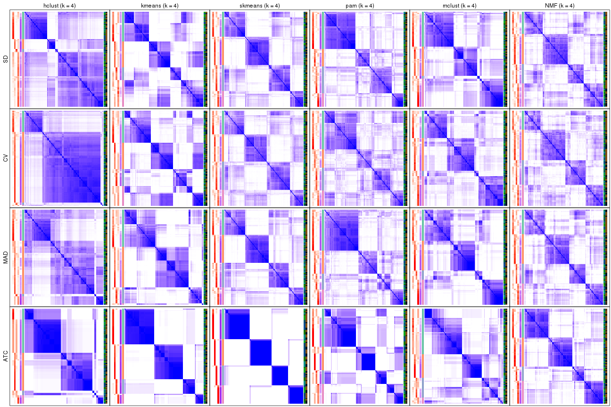</p>

</div>
<div id='tab-collect-consensus-heatmap-4'>
<pre><code class="r">collect_plots(res_list, k = 5, fun = consensus_heatmap, mc.cores = 4)
</code></pre>

<p>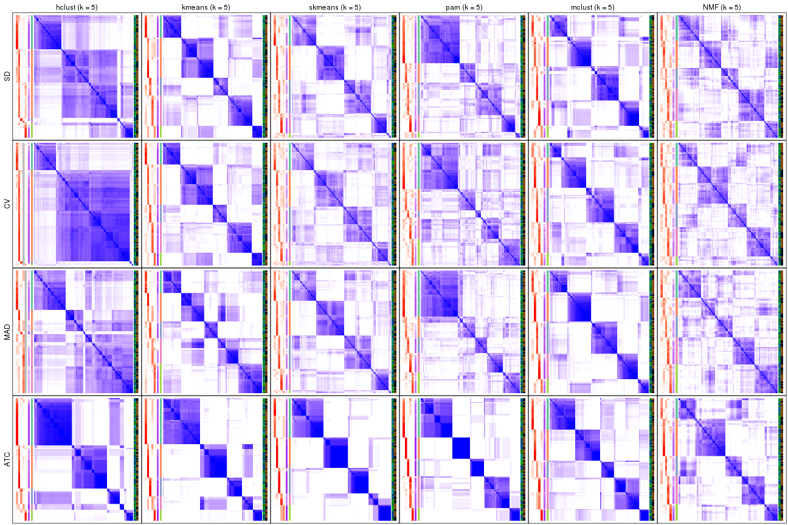</p>

</div>
<div id='tab-collect-consensus-heatmap-5'>
<pre><code class="r">collect_plots(res_list, k = 6, fun = consensus_heatmap, mc.cores = 4)
</code></pre>

<p></p>

</div>
</div>


### Membership heatmap

Membership heatmaps for all methods. ([What is a membership heatmap?](http://bioconductor.org/packages/devel/bioc/vignettes/cola/inst/doc/cola.html#toc_12))


<script>
$( function() {
	$( '#tabs-collect-membership-heatmap' ).tabs();
} );
</script>
<div id='tabs-collect-membership-heatmap'>
<ul>
<li><a href='#tab-collect-membership-heatmap-1'>k = 2</a></li>
<li><a href='#tab-collect-membership-heatmap-2'>k = 3</a></li>
<li><a href='#tab-collect-membership-heatmap-3'>k = 4</a></li>
<li><a href='#tab-collect-membership-heatmap-4'>k = 5</a></li>
<li><a href='#tab-collect-membership-heatmap-5'>k = 6</a></li>
</ul>
<div id='tab-collect-membership-heatmap-1'>
<pre><code class="r">collect_plots(res_list, k = 2, fun = membership_heatmap, mc.cores = 4)
</code></pre>

<p></p>

</div>
<div id='tab-collect-membership-heatmap-2'>
<pre><code class="r">collect_plots(res_list, k = 3, fun = membership_heatmap, mc.cores = 4)
</code></pre>

<p></p>

</div>
<div id='tab-collect-membership-heatmap-3'>
<pre><code class="r">collect_plots(res_list, k = 4, fun = membership_heatmap, mc.cores = 4)
</code></pre>

<p></p>

</div>
<div id='tab-collect-membership-heatmap-4'>
<pre><code class="r">collect_plots(res_list, k = 5, fun = membership_heatmap, mc.cores = 4)
</code></pre>

<p></p>

</div>
<div id='tab-collect-membership-heatmap-5'>
<pre><code class="r">collect_plots(res_list, k = 6, fun = membership_heatmap, mc.cores = 4)
</code></pre>

<p></p>

</div>
</div>


### Signature heatmap

Signature heatmaps for all methods. ([What is a signature heatmap?](http://bioconductor.org/packages/devel/bioc/vignettes/cola/inst/doc/cola.html#toc_22))


Note in following heatmaps, rows are scaled.


<script>
$( function() {
	$( '#tabs-collect-get-signatures' ).tabs();
} );
</script>
<div id='tabs-collect-get-signatures'>
<ul>
<li><a href='#tab-collect-get-signatures-1'>k = 2</a></li>
<li><a href='#tab-collect-get-signatures-2'>k = 3</a></li>
<li><a href='#tab-collect-get-signatures-3'>k = 4</a></li>
<li><a href='#tab-collect-get-signatures-4'>k = 5</a></li>
<li><a href='#tab-collect-get-signatures-5'>k = 6</a></li>
</ul>
<div id='tab-collect-get-signatures-1'>
<pre><code class="r">collect_plots(res_list, k = 2, fun = get_signatures, mc.cores = 4)
</code></pre>

<p></p>

</div>
<div id='tab-collect-get-signatures-2'>
<pre><code class="r">collect_plots(res_list, k = 3, fun = get_signatures, mc.cores = 4)
</code></pre>

<p>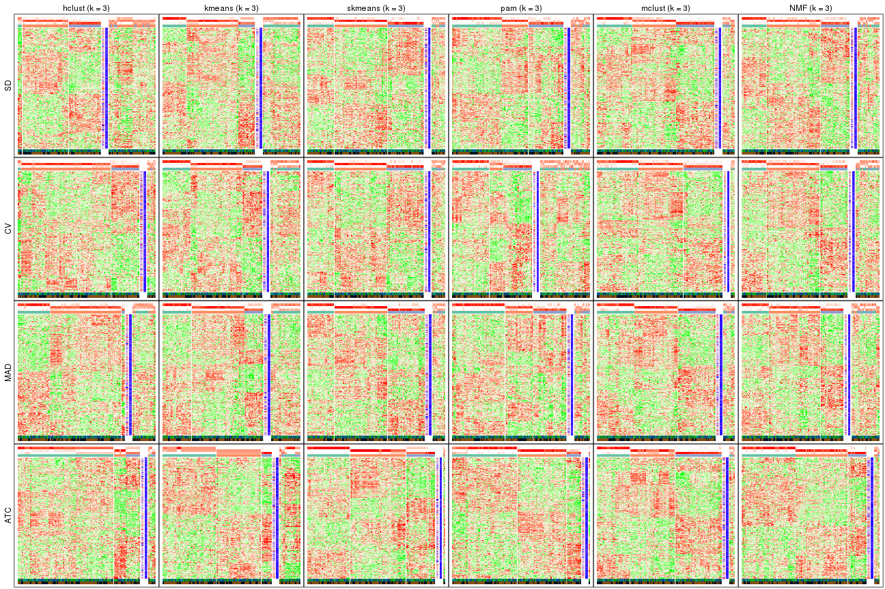</p>

</div>
<div id='tab-collect-get-signatures-3'>
<pre><code class="r">collect_plots(res_list, k = 4, fun = get_signatures, mc.cores = 4)
</code></pre>

<p></p>

</div>
<div id='tab-collect-get-signatures-4'>
<pre><code class="r">collect_plots(res_list, k = 5, fun = get_signatures, mc.cores = 4)
</code></pre>

<p></p>

</div>
<div id='tab-collect-get-signatures-5'>
<pre><code class="r">collect_plots(res_list, k = 6, fun = get_signatures, mc.cores = 4)
</code></pre>

<p></p>

</div>
</div>


### Statistics table

The statistics used for measuring the stability of consensus partitioning.
([How are they
defined?](http://bioconductor.org/packages/devel/bioc/vignettes/cola/inst/doc/cola.html#toc_13))


<script>
$( function() {
	$( '#tabs-get-stats-from-consensus-partition-list' ).tabs();
} );
</script>
<div id='tabs-get-stats-from-consensus-partition-list'>
<ul>
<li><a href='#tab-get-stats-from-consensus-partition-list-1'>k = 2</a></li>
<li><a href='#tab-get-stats-from-consensus-partition-list-2'>k = 3</a></li>
<li><a href='#tab-get-stats-from-consensus-partition-list-3'>k = 4</a></li>
<li><a href='#tab-get-stats-from-consensus-partition-list-4'>k = 5</a></li>
<li><a href='#tab-get-stats-from-consensus-partition-list-5'>k = 6</a></li>
</ul>
<div id='tab-get-stats-from-consensus-partition-list-1'>
<pre><code class="r">get_stats(res_list, k = 2)
</code></pre>

<pre><code>#&gt;             k 1-PAC mean_silhouette concordance area_increased  Rand Jaccard
#&gt; SD:NMF      2 0.853           0.911       0.964          0.503 0.496   0.496
#&gt; CV:NMF      2 0.881           0.911       0.961          0.502 0.496   0.496
#&gt; MAD:NMF     2 0.901           0.931       0.970          0.503 0.496   0.496
#&gt; ATC:NMF     2 1.000           0.991       0.996          0.502 0.499   0.499
#&gt; SD:skmeans  2 0.900           0.927       0.970          0.504 0.496   0.496
#&gt; CV:skmeans  2 0.867           0.929       0.969          0.504 0.496   0.496
#&gt; MAD:skmeans 2 0.984           0.946       0.978          0.504 0.496   0.496
#&gt; ATC:skmeans 2 1.000           1.000       1.000          0.503 0.498   0.498
#&gt; SD:mclust   2 0.226           0.621       0.774          0.424 0.545   0.545
#&gt; CV:mclust   2 0.232           0.700       0.804          0.429 0.608   0.608
#&gt; MAD:mclust  2 0.468           0.786       0.848          0.433 0.573   0.573
#&gt; ATC:mclust  2 0.440           0.777       0.822          0.438 0.580   0.580
#&gt; SD:kmeans   2 0.915           0.909       0.964          0.501 0.499   0.499
#&gt; CV:kmeans   2 0.885           0.914       0.963          0.502 0.497   0.497
#&gt; MAD:kmeans  2 0.950           0.938       0.975          0.502 0.499   0.499
#&gt; ATC:kmeans  2 1.000           0.972       0.971          0.496 0.498   0.498
#&gt; SD:pam      2 0.329           0.728       0.867          0.499 0.496   0.496
#&gt; CV:pam      2 0.211           0.633       0.824          0.485 0.505   0.505
#&gt; MAD:pam     2 0.402           0.823       0.894          0.496 0.499   0.499
#&gt; ATC:pam     2 1.000           0.965       0.981          0.502 0.498   0.498
#&gt; SD:hclust   2 0.154           0.550       0.708          0.388 0.513   0.513
#&gt; CV:hclust   2 0.268           0.808       0.869          0.386 0.624   0.624
#&gt; MAD:hclust  2 0.169           0.662       0.807          0.432 0.510   0.510
#&gt; ATC:hclust  2 0.431           0.793       0.885          0.304 0.659   0.659
</code></pre>

</div>
<div id='tab-get-stats-from-consensus-partition-list-2'>
<pre><code class="r">get_stats(res_list, k = 3)
</code></pre>

<pre><code>#&gt;             k 1-PAC mean_silhouette concordance area_increased  Rand Jaccard
#&gt; SD:NMF      3 0.473           0.632       0.759          0.304 0.797   0.613
#&gt; CV:NMF      3 0.455           0.624       0.753          0.304 0.796   0.611
#&gt; MAD:NMF     3 0.502           0.622       0.813          0.303 0.820   0.650
#&gt; ATC:NMF     3 0.695           0.807       0.903          0.264 0.751   0.556
#&gt; SD:skmeans  3 0.591           0.754       0.861          0.305 0.781   0.586
#&gt; CV:skmeans  3 0.632           0.782       0.877          0.310 0.773   0.572
#&gt; MAD:skmeans 3 0.701           0.797       0.895          0.305 0.800   0.616
#&gt; ATC:skmeans 3 0.765           0.880       0.911          0.285 0.829   0.665
#&gt; SD:mclust   3 0.464           0.733       0.828          0.516 0.697   0.486
#&gt; CV:mclust   3 0.363           0.794       0.842          0.494 0.645   0.450
#&gt; MAD:mclust  3 0.513           0.769       0.867          0.501 0.746   0.560
#&gt; ATC:mclust  3 0.632           0.817       0.879          0.452 0.722   0.534
#&gt; SD:kmeans   3 0.525           0.589       0.754          0.279 0.819   0.659
#&gt; CV:kmeans   3 0.561           0.645       0.831          0.282 0.784   0.596
#&gt; MAD:kmeans  3 0.533           0.634       0.812          0.276 0.814   0.649
#&gt; ATC:kmeans  3 0.821           0.746       0.839          0.245 0.871   0.747
#&gt; SD:pam      3 0.415           0.677       0.794          0.315 0.750   0.539
#&gt; CV:pam      3 0.226           0.466       0.719          0.300 0.671   0.448
#&gt; MAD:pam     3 0.451           0.712       0.824          0.297 0.701   0.476
#&gt; ATC:pam     3 0.724           0.843       0.899          0.220 0.898   0.797
#&gt; SD:hclust   3 0.135           0.531       0.725          0.319 0.620   0.460
#&gt; CV:hclust   3 0.249           0.746       0.845          0.153 0.980   0.968
#&gt; MAD:hclust  3 0.244           0.614       0.782          0.252 0.920   0.854
#&gt; ATC:hclust  3 0.356           0.638       0.759          0.408 0.949   0.923
</code></pre>

</div>
<div id='tab-get-stats-from-consensus-partition-list-3'>
<pre><code class="r">get_stats(res_list, k = 4)
</code></pre>

<pre><code>#&gt;             k 1-PAC mean_silhouette concordance area_increased  Rand Jaccard
#&gt; SD:NMF      4 0.442           0.498       0.710         0.1258 0.786   0.473
#&gt; CV:NMF      4 0.412           0.505       0.700         0.1310 0.818   0.534
#&gt; MAD:NMF     4 0.450           0.502       0.723         0.1353 0.783   0.470
#&gt; ATC:NMF     4 0.606           0.715       0.838         0.1610 0.819   0.554
#&gt; SD:skmeans  4 0.525           0.616       0.780         0.1274 0.855   0.609
#&gt; CV:skmeans  4 0.467           0.554       0.714         0.1261 0.857   0.611
#&gt; MAD:skmeans 4 0.547           0.665       0.808         0.1303 0.827   0.551
#&gt; ATC:skmeans 4 0.966           0.953       0.980         0.1549 0.870   0.648
#&gt; SD:mclust   4 0.484           0.592       0.765         0.0800 0.863   0.648
#&gt; CV:mclust   4 0.455           0.565       0.741         0.1116 0.925   0.786
#&gt; MAD:mclust  4 0.530           0.558       0.790         0.1107 0.860   0.626
#&gt; ATC:mclust  4 0.543           0.365       0.659         0.1340 0.727   0.420
#&gt; SD:kmeans   4 0.584           0.441       0.670         0.1209 0.791   0.510
#&gt; CV:kmeans   4 0.594           0.397       0.640         0.1171 0.858   0.626
#&gt; MAD:kmeans  4 0.608           0.433       0.707         0.1266 0.947   0.866
#&gt; ATC:kmeans  4 0.914           0.907       0.938         0.1284 0.867   0.679
#&gt; SD:pam      4 0.497           0.639       0.787         0.1016 0.898   0.716
#&gt; CV:pam      4 0.354           0.456       0.690         0.1251 0.843   0.606
#&gt; MAD:pam     4 0.492           0.595       0.766         0.1096 0.802   0.525
#&gt; ATC:pam     4 0.630           0.524       0.768         0.1629 0.795   0.539
#&gt; SD:hclust   4 0.314           0.613       0.755         0.1908 0.821   0.679
#&gt; CV:hclust   4 0.293           0.719       0.830         0.0876 0.996   0.994
#&gt; MAD:hclust  4 0.272           0.472       0.704         0.1494 0.851   0.724
#&gt; ATC:hclust  4 0.623           0.640       0.838         0.4679 0.592   0.418
</code></pre>

</div>
<div id='tab-get-stats-from-consensus-partition-list-4'>
<pre><code class="r">get_stats(res_list, k = 5)
</code></pre>

<pre><code>#&gt;             k 1-PAC mean_silhouette concordance area_increased  Rand Jaccard
#&gt; SD:NMF      5 0.500           0.397       0.594         0.0703 0.891   0.612
#&gt; CV:NMF      5 0.486           0.415       0.593         0.0706 0.911   0.684
#&gt; MAD:NMF     5 0.489           0.438       0.635         0.0649 0.876   0.567
#&gt; ATC:NMF     5 0.610           0.550       0.736         0.0667 0.881   0.596
#&gt; SD:skmeans  5 0.564           0.510       0.704         0.0645 0.948   0.806
#&gt; CV:skmeans  5 0.476           0.430       0.640         0.0667 0.950   0.816
#&gt; MAD:skmeans 5 0.542           0.480       0.663         0.0625 0.964   0.863
#&gt; ATC:skmeans 5 0.846           0.834       0.882         0.0509 0.955   0.829
#&gt; SD:mclust   5 0.616           0.591       0.744         0.1111 0.827   0.504
#&gt; CV:mclust   5 0.594           0.595       0.725         0.0855 0.873   0.604
#&gt; MAD:mclust  5 0.689           0.709       0.817         0.0797 0.833   0.488
#&gt; ATC:mclust  5 0.662           0.756       0.799         0.0667 0.826   0.520
#&gt; SD:kmeans   5 0.640           0.685       0.759         0.0715 0.790   0.400
#&gt; CV:kmeans   5 0.644           0.714       0.767         0.0704 0.810   0.436
#&gt; MAD:kmeans  5 0.605           0.586       0.728         0.0729 0.804   0.480
#&gt; ATC:kmeans  5 0.764           0.767       0.841         0.0879 0.941   0.810
#&gt; SD:pam      5 0.510           0.587       0.727         0.0453 0.967   0.887
#&gt; CV:pam      5 0.409           0.446       0.693         0.0424 0.924   0.748
#&gt; MAD:pam     5 0.555           0.589       0.741         0.0721 0.893   0.661
#&gt; ATC:pam     5 0.786           0.836       0.845         0.0958 0.850   0.541
#&gt; SD:hclust   5 0.351           0.568       0.754         0.0591 0.956   0.898
#&gt; CV:hclust   5 0.278           0.728       0.805         0.0639 1.000   0.999
#&gt; MAD:hclust  5 0.330           0.463       0.679         0.0686 0.888   0.750
#&gt; ATC:hclust  5 0.631           0.720       0.834         0.0741 0.867   0.669
</code></pre>

</div>
<div id='tab-get-stats-from-consensus-partition-list-5'>
<pre><code class="r">get_stats(res_list, k = 6)
</code></pre>

<pre><code>#&gt;             k 1-PAC mean_silhouette concordance area_increased  Rand Jaccard
#&gt; SD:NMF      6 0.529           0.366       0.588         0.0450 0.854   0.439
#&gt; CV:NMF      6 0.522           0.330       0.526         0.0452 0.858   0.466
#&gt; MAD:NMF     6 0.537           0.340       0.575         0.0408 0.919   0.651
#&gt; ATC:NMF     6 0.653           0.481       0.708         0.0346 0.873   0.543
#&gt; SD:skmeans  6 0.588           0.437       0.637         0.0410 0.926   0.710
#&gt; CV:skmeans  6 0.499           0.298       0.568         0.0406 0.910   0.652
#&gt; MAD:skmeans 6 0.570           0.356       0.609         0.0416 0.938   0.758
#&gt; ATC:skmeans 6 0.846           0.831       0.880         0.0452 0.932   0.711
#&gt; SD:mclust   6 0.693           0.608       0.792         0.0429 0.937   0.732
#&gt; CV:mclust   6 0.719           0.656       0.798         0.0510 0.903   0.616
#&gt; MAD:mclust  6 0.767           0.761       0.862         0.0440 0.899   0.585
#&gt; ATC:mclust  6 0.865           0.763       0.871         0.0636 0.929   0.696
#&gt; SD:kmeans   6 0.691           0.729       0.761         0.0408 0.933   0.714
#&gt; CV:kmeans   6 0.674           0.617       0.742         0.0379 0.982   0.922
#&gt; MAD:kmeans  6 0.682           0.756       0.766         0.0431 0.925   0.665
#&gt; ATC:kmeans  6 0.748           0.682       0.779         0.0525 0.910   0.657
#&gt; SD:pam      6 0.543           0.584       0.729         0.0339 0.956   0.834
#&gt; CV:pam      6 0.430           0.410       0.689         0.0164 0.961   0.851
#&gt; MAD:pam     6 0.602           0.603       0.753         0.0567 0.899   0.608
#&gt; ATC:pam     6 0.917           0.909       0.951         0.0660 0.897   0.585
#&gt; SD:hclust   6 0.384           0.536       0.735         0.0459 0.976   0.942
#&gt; CV:hclust   6 0.244           0.583       0.730         0.1516 0.984   0.974
#&gt; MAD:hclust  6 0.340           0.373       0.652         0.0437 0.933   0.826
#&gt; ATC:hclust  6 0.736           0.700       0.851         0.0796 0.974   0.911
</code></pre>

</div>
</div>

Following heatmap plots the partition for each combination of methods and the
lightness correspond to the silhouette scores for samples in each method. On
top the consensus subgroup is inferred from all methods by taking the mean
silhouette scores as weight.


<script>
$( function() {
	$( '#tabs-collect-stats-from-consensus-partition-list' ).tabs();
} );
</script>
<div id='tabs-collect-stats-from-consensus-partition-list'>
<ul>
<li><a href='#tab-collect-stats-from-consensus-partition-list-1'>k = 2</a></li>
<li><a href='#tab-collect-stats-from-consensus-partition-list-2'>k = 3</a></li>
<li><a href='#tab-collect-stats-from-consensus-partition-list-3'>k = 4</a></li>
<li><a href='#tab-collect-stats-from-consensus-partition-list-4'>k = 5</a></li>
<li><a href='#tab-collect-stats-from-consensus-partition-list-5'>k = 6</a></li>
</ul>
<div id='tab-collect-stats-from-consensus-partition-list-1'>
<pre><code class="r">collect_stats(res_list, k = 2)
</code></pre>

<p></p>

</div>
<div id='tab-collect-stats-from-consensus-partition-list-2'>
<pre><code class="r">collect_stats(res_list, k = 3)
</code></pre>

<p></p>

</div>
<div id='tab-collect-stats-from-consensus-partition-list-3'>
<pre><code class="r">collect_stats(res_list, k = 4)
</code></pre>

<p></p>

</div>
<div id='tab-collect-stats-from-consensus-partition-list-4'>
<pre><code class="r">collect_stats(res_list, k = 5)
</code></pre>

<p></p>

</div>
<div id='tab-collect-stats-from-consensus-partition-list-5'>
<pre><code class="r">collect_stats(res_list, k = 6)
</code></pre>

<p></p>

</div>
</div>

### Partition from all methods


Collect partitions from all methods:


<script>
$( function() {
	$( '#tabs-collect-classes-from-consensus-partition-list' ).tabs();
} );
</script>
<div id='tabs-collect-classes-from-consensus-partition-list'>
<ul>
<li><a href='#tab-collect-classes-from-consensus-partition-list-1'>k = 2</a></li>
<li><a href='#tab-collect-classes-from-consensus-partition-list-2'>k = 3</a></li>
<li><a href='#tab-collect-classes-from-consensus-partition-list-3'>k = 4</a></li>
<li><a href='#tab-collect-classes-from-consensus-partition-list-4'>k = 5</a></li>
<li><a href='#tab-collect-classes-from-consensus-partition-list-5'>k = 6</a></li>
</ul>
<div id='tab-collect-classes-from-consensus-partition-list-1'>
<pre><code class="r">collect_classes(res_list, k = 2)
</code></pre>

<p></p>

</div>
<div id='tab-collect-classes-from-consensus-partition-list-2'>
<pre><code class="r">collect_classes(res_list, k = 3)
</code></pre>

<p></p>

</div>
<div id='tab-collect-classes-from-consensus-partition-list-3'>
<pre><code class="r">collect_classes(res_list, k = 4)
</code></pre>

<p></p>

</div>
<div id='tab-collect-classes-from-consensus-partition-list-4'>
<pre><code class="r">collect_classes(res_list, k = 5)
</code></pre>

<p></p>

</div>
<div id='tab-collect-classes-from-consensus-partition-list-5'>
<pre><code class="r">collect_classes(res_list, k = 6)
</code></pre>

<p></p>

</div>
</div>


### Top rows overlap


Overlap of top rows from different top-row methods:


<script>
$( function() {
	$( '#tabs-top-rows-overlap-by-euler' ).tabs();
} );
</script>
<div id='tabs-top-rows-overlap-by-euler'>
<ul>
<li><a href='#tab-top-rows-overlap-by-euler-1'>top_n = 1000</a></li>
<li><a href='#tab-top-rows-overlap-by-euler-2'>top_n = 2000</a></li>
<li><a href='#tab-top-rows-overlap-by-euler-3'>top_n = 3000</a></li>
<li><a href='#tab-top-rows-overlap-by-euler-4'>top_n = 4000</a></li>
<li><a href='#tab-top-rows-overlap-by-euler-5'>top_n = 5000</a></li>
</ul>
<div id='tab-top-rows-overlap-by-euler-1'>
<pre><code class="r">top_rows_overlap(res_list, top_n = 1000, method = &quot;euler&quot;)
</code></pre>

<p></p>

</div>
<div id='tab-top-rows-overlap-by-euler-2'>
<pre><code class="r">top_rows_overlap(res_list, top_n = 2000, method = &quot;euler&quot;)
</code></pre>

<p></p>

</div>
<div id='tab-top-rows-overlap-by-euler-3'>
<pre><code class="r">top_rows_overlap(res_list, top_n = 3000, method = &quot;euler&quot;)
</code></pre>

<p></p>

</div>
<div id='tab-top-rows-overlap-by-euler-4'>
<pre><code class="r">top_rows_overlap(res_list, top_n = 4000, method = &quot;euler&quot;)
</code></pre>

<p></p>

</div>
<div id='tab-top-rows-overlap-by-euler-5'>
<pre><code class="r">top_rows_overlap(res_list, top_n = 5000, method = &quot;euler&quot;)
</code></pre>

<p></p>

</div>
</div>

Also visualize the correspondance of rankings between different top-row methods:


<script>
$( function() {
	$( '#tabs-top-rows-overlap-by-correspondance' ).tabs();
} );
</script>
<div id='tabs-top-rows-overlap-by-correspondance'>
<ul>
<li><a href='#tab-top-rows-overlap-by-correspondance-1'>top_n = 1000</a></li>
<li><a href='#tab-top-rows-overlap-by-correspondance-2'>top_n = 2000</a></li>
<li><a href='#tab-top-rows-overlap-by-correspondance-3'>top_n = 3000</a></li>
<li><a href='#tab-top-rows-overlap-by-correspondance-4'>top_n = 4000</a></li>
<li><a href='#tab-top-rows-overlap-by-correspondance-5'>top_n = 5000</a></li>
</ul>
<div id='tab-top-rows-overlap-by-correspondance-1'>
<pre><code class="r">top_rows_overlap(res_list, top_n = 1000, method = &quot;correspondance&quot;)
</code></pre>

<p></p>

</div>
<div id='tab-top-rows-overlap-by-correspondance-2'>
<pre><code class="r">top_rows_overlap(res_list, top_n = 2000, method = &quot;correspondance&quot;)
</code></pre>

<p></p>

</div>
<div id='tab-top-rows-overlap-by-correspondance-3'>
<pre><code class="r">top_rows_overlap(res_list, top_n = 3000, method = &quot;correspondance&quot;)
</code></pre>

<p></p>

</div>
<div id='tab-top-rows-overlap-by-correspondance-4'>
<pre><code class="r">top_rows_overlap(res_list, top_n = 4000, method = &quot;correspondance&quot;)
</code></pre>

<p></p>

</div>
<div id='tab-top-rows-overlap-by-correspondance-5'>
<pre><code class="r">top_rows_overlap(res_list, top_n = 5000, method = &quot;correspondance&quot;)
</code></pre>

<p></p>

</div>
</div>


Heatmaps of the top rows:


<script>
$( function() {
	$( '#tabs-top-rows-heatmap' ).tabs();
} );
</script>
<div id='tabs-top-rows-heatmap'>
<ul>
<li><a href='#tab-top-rows-heatmap-1'>top_n = 1000</a></li>
<li><a href='#tab-top-rows-heatmap-2'>top_n = 2000</a></li>
<li><a href='#tab-top-rows-heatmap-3'>top_n = 3000</a></li>
<li><a href='#tab-top-rows-heatmap-4'>top_n = 4000</a></li>
<li><a href='#tab-top-rows-heatmap-5'>top_n = 5000</a></li>
</ul>
<div id='tab-top-rows-heatmap-1'>
<pre><code class="r">top_rows_heatmap(res_list, top_n = 1000)
</code></pre>

<p>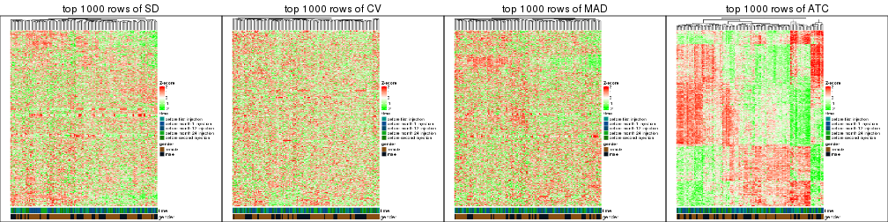</p>

</div>
<div id='tab-top-rows-heatmap-2'>
<pre><code class="r">top_rows_heatmap(res_list, top_n = 2000)
</code></pre>

<p></p>

</div>
<div id='tab-top-rows-heatmap-3'>
<pre><code class="r">top_rows_heatmap(res_list, top_n = 3000)
</code></pre>

<p></p>

</div>
<div id='tab-top-rows-heatmap-4'>
<pre><code class="r">top_rows_heatmap(res_list, top_n = 4000)
</code></pre>

<p></p>

</div>
<div id='tab-top-rows-heatmap-5'>
<pre><code class="r">top_rows_heatmap(res_list, top_n = 5000)
</code></pre>

<p></p>

</div>
</div>


### Test to known annotations


Test correlation between subgroups and known annotations. If the known
annotation is numeric, one-way ANOVA test is applied, and if the known
annotation is discrete, chi-squared contingency table test is applied.


<script>
$( function() {
	$( '#tabs-test-to-known-factors-from-consensus-partition-list' ).tabs();
} );
</script>
<div id='tabs-test-to-known-factors-from-consensus-partition-list'>
<ul>
<li><a href='#tab-test-to-known-factors-from-consensus-partition-list-1'>k = 2</a></li>
<li><a href='#tab-test-to-known-factors-from-consensus-partition-list-2'>k = 3</a></li>
<li><a href='#tab-test-to-known-factors-from-consensus-partition-list-3'>k = 4</a></li>
<li><a href='#tab-test-to-known-factors-from-consensus-partition-list-4'>k = 5</a></li>
<li><a href='#tab-test-to-known-factors-from-consensus-partition-list-5'>k = 6</a></li>
</ul>
<div id='tab-test-to-known-factors-from-consensus-partition-list-1'>
<pre><code class="r">test_to_known_factors(res_list, k = 2)
</code></pre>

<pre><code>#&gt;               n time(p) gender(p) k
#&gt; SD:NMF      121   0.546    0.1026 2
#&gt; CV:NMF      120   0.448    0.1971 2
#&gt; MAD:NMF     120   0.499    0.1533 2
#&gt; ATC:NMF     125   0.492    0.3276 2
#&gt; SD:skmeans  120   0.638    0.0970 2
#&gt; CV:skmeans  122   0.721    0.2038 2
#&gt; MAD:skmeans 121   0.673    0.1794 2
#&gt; ATC:skmeans 125   0.293    0.3989 2
#&gt; SD:mclust   110   0.906    0.0302 2
#&gt; CV:mclust   111   0.752    0.0301 2
#&gt; MAD:mclust  123   0.763    0.2784 2
#&gt; ATC:mclust  115   0.930    0.2946 2
#&gt; SD:kmeans   118   0.689    0.1305 2
#&gt; CV:kmeans   120   0.576    0.2411 2
#&gt; MAD:kmeans  121   0.547    0.2171 2
#&gt; ATC:kmeans  125   0.293    0.3989 2
#&gt; SD:pam      105   0.644    0.0879 2
#&gt; CV:pam      104   0.686    0.0719 2
#&gt; MAD:pam     119   0.556    0.3469 2
#&gt; ATC:pam     124   0.453    0.3588 2
#&gt; SD:hclust    94   0.700    0.0792 2
#&gt; CV:hclust   119   0.137    0.5027 2
#&gt; MAD:hclust  101   0.677    0.2496 2
#&gt; ATC:hclust  111   0.674    0.5267 2
</code></pre>

</div>
<div id='tab-test-to-known-factors-from-consensus-partition-list-2'>
<pre><code class="r">test_to_known_factors(res_list, k = 3)
</code></pre>

<pre><code>#&gt;               n time(p) gender(p) k
#&gt; SD:NMF      104  0.0518    0.1992 3
#&gt; CV:NMF      102  0.1567    0.1823 3
#&gt; MAD:NMF      98  0.2045    0.2603 3
#&gt; ATC:NMF     120  0.2448    0.2936 3
#&gt; SD:skmeans  112  0.1510    0.1909 3
#&gt; CV:skmeans  112  0.1764    0.1834 3
#&gt; MAD:skmeans 113  0.1404    0.2092 3
#&gt; ATC:skmeans 123  0.5633    0.5130 3
#&gt; SD:mclust   113  0.9083    0.2790 3
#&gt; CV:mclust   121  0.6023    0.3802 3
#&gt; MAD:mclust  114  0.4906    0.4258 3
#&gt; ATC:mclust  120  0.8083    0.3113 3
#&gt; SD:kmeans    89  0.2448    0.5242 3
#&gt; CV:kmeans    96  0.3814    0.2801 3
#&gt; MAD:kmeans   97  0.2623    0.3932 3
#&gt; ATC:kmeans  105  0.3997    0.4716 3
#&gt; SD:pam      107  0.1294    0.0942 3
#&gt; CV:pam       77  0.4096    0.0646 3
#&gt; MAD:pam     110  0.1807    0.2567 3
#&gt; ATC:pam     124  0.2331    0.4462 3
#&gt; SD:hclust    80  0.2040    0.5221 3
#&gt; CV:hclust   117  0.1782    0.8475 3
#&gt; MAD:hclust  103  0.4078    0.2960 3
#&gt; ATC:hclust  118  0.9519    0.7696 3
</code></pre>

</div>
<div id='tab-test-to-known-factors-from-consensus-partition-list-3'>
<pre><code class="r">test_to_known_factors(res_list, k = 4)
</code></pre>

<pre><code>#&gt;               n time(p) gender(p) k
#&gt; SD:NMF       79   0.241   0.01190 4
#&gt; CV:NMF       76   0.239   0.00206 4
#&gt; MAD:NMF      77   0.466   0.07586 4
#&gt; ATC:NMF     109   0.876   0.52516 4
#&gt; SD:skmeans   95   0.169   0.04630 4
#&gt; CV:skmeans   91   0.507   0.09200 4
#&gt; MAD:skmeans  99   0.134   0.05379 4
#&gt; ATC:skmeans 124   0.294   0.64495 4
#&gt; SD:mclust   102   0.376   0.05727 4
#&gt; CV:mclust    93   0.498   0.00556 4
#&gt; MAD:mclust   89   0.652   0.08974 4
#&gt; ATC:mclust   34   0.338   1.00000 4
#&gt; SD:kmeans    80   0.667   0.18374 4
#&gt; CV:kmeans    78   0.187   0.78325 4
#&gt; MAD:kmeans   72   0.256   0.15128 4
#&gt; ATC:kmeans  121   0.642   0.74359 4
#&gt; SD:pam       98   0.687   0.05038 4
#&gt; CV:pam       73   0.625   0.07936 4
#&gt; MAD:pam      92   0.859   0.34036 4
#&gt; ATC:pam      75   0.469   0.74253 4
#&gt; SD:hclust    93   0.114   0.48734 4
#&gt; CV:hclust   108   0.380   0.50655 4
#&gt; MAD:hclust   61   0.266   0.71634 4
#&gt; ATC:hclust  102   0.611   0.32001 4
</code></pre>

</div>
<div id='tab-test-to-known-factors-from-consensus-partition-list-4'>
<pre><code class="r">test_to_known_factors(res_list, k = 5)
</code></pre>

<pre><code>#&gt;               n time(p) gender(p) k
#&gt; SD:NMF       43  0.0668   0.01866 5
#&gt; CV:NMF       58  0.0477   0.02672 5
#&gt; MAD:NMF      64  0.2377   0.01374 5
#&gt; ATC:NMF      84  0.9260   0.21578 5
#&gt; SD:skmeans   83  0.1991   0.09821 5
#&gt; CV:skmeans   71  0.1694   0.00467 5
#&gt; MAD:skmeans  78  0.0944   0.00765 5
#&gt; ATC:skmeans 121  0.8769   0.60552 5
#&gt; SD:mclust    93  0.5043   0.00652 5
#&gt; CV:mclust    99  0.5968   0.00150 5
#&gt; MAD:mclust  108  0.4432   0.01020 5
#&gt; ATC:mclust  118  0.9065   0.45013 5
#&gt; SD:kmeans   114  0.2322   0.42993 5
#&gt; CV:kmeans   116  0.2570   0.42183 5
#&gt; MAD:kmeans   95  0.1024   0.05309 5
#&gt; ATC:kmeans  118  0.7387   0.75550 5
#&gt; SD:pam       87  0.7191   0.00707 5
#&gt; CV:pam       65  0.5524   0.00445 5
#&gt; MAD:pam      88  0.9433   0.41714 5
#&gt; ATC:pam     121  0.7745   0.17372 5
#&gt; SD:hclust    90  0.1284   0.63151 5
#&gt; CV:hclust   114  0.1640   0.48751 5
#&gt; MAD:hclust   59  0.3599   0.38870 5
#&gt; ATC:hclust  111  0.7935   0.76683 5
</code></pre>

</div>
<div id='tab-test-to-known-factors-from-consensus-partition-list-5'>
<pre><code class="r">test_to_known_factors(res_list, k = 6)
</code></pre>

<pre><code>#&gt;               n time(p) gender(p) k
#&gt; SD:NMF       30   0.437  0.050486 6
#&gt; CV:NMF       26   0.629  0.000995 6
#&gt; MAD:NMF      25   0.148  0.587937 6
#&gt; ATC:NMF      76   0.656  0.892431 6
#&gt; SD:skmeans   60   0.242  0.003523 6
#&gt; CV:skmeans   33   0.928  0.042775 6
#&gt; MAD:skmeans  45   0.759  0.011744 6
#&gt; ATC:skmeans 121   0.892  0.497505 6
#&gt; SD:mclust    94   0.452  0.032776 6
#&gt; CV:mclust   100   0.865  0.056156 6
#&gt; MAD:mclust  116   0.591  0.062501 6
#&gt; ATC:mclust  116   0.948  0.419156 6
#&gt; SD:kmeans   111   0.771  0.191327 6
#&gt; CV:kmeans    97   0.441  0.770123 6
#&gt; MAD:kmeans  117   0.464  0.142030 6
#&gt; ATC:kmeans  108   0.907  0.452331 6
#&gt; SD:pam       82   0.569  0.011335 6
#&gt; CV:pam       50   0.664  0.014028 6
#&gt; MAD:pam      92   0.923  0.234720 6
#&gt; ATC:pam     122   0.793  0.035909 6
#&gt; SD:hclust    89   0.232  0.677866 6
#&gt; CV:hclust    99   0.239  0.271173 6
#&gt; MAD:hclust   38   0.215  0.349859 6
#&gt; ATC:hclust   98   0.805  0.683388 6
</code></pre>

</div>
</div>


 
## Results for each method


---------------------------------------------------


### SD:hclust


The object with results only for a single top-value method and a single partition method 
can be extracted as:

```r
res = res_list["SD", "hclust"]
# you can also extract it by
# res = res_list["SD:hclust"]
```

A summary of `res` and all the functions that can be applied to it:

```r
res
```

```
#> A 'ConsensusPartition' object with k = 2, 3, 4, 5, 6.
#>   On a matrix with 21168 rows and 125 columns.
#>   Top rows (1000, 2000, 3000, 4000, 5000) are extracted by 'SD' method.
#>   Subgroups are detected by 'hclust' method.
#>   Performed in total 1250 partitions by row resampling.
#>   Best k for subgroups seems to be 4.
#> 
#> Following methods can be applied to this 'ConsensusPartition' object:
#>  [1] "cola_report"             "collect_classes"         "collect_plots"          
#>  [4] "collect_stats"           "colnames"                "compare_signatures"     
#>  [7] "consensus_heatmap"       "dimension_reduction"     "functional_enrichment"  
#> [10] "get_anno_col"            "get_anno"                "get_classes"            
#> [13] "get_consensus"           "get_matrix"              "get_membership"         
#> [16] "get_param"               "get_signatures"          "get_stats"              
#> [19] "is_best_k"               "is_stable_k"             "membership_heatmap"     
#> [22] "ncol"                    "nrow"                    "plot_ecdf"              
#> [25] "rownames"                "select_partition_number" "show"                   
#> [28] "suggest_best_k"          "test_to_known_factors"
```

`collect_plots()` function collects all the plots made from `res` for all `k` (number of partitions)
into one single page to provide an easy and fast comparison between different `k`.

```r
collect_plots(res)
```


The plots are:

- The first row: a plot of the ECDF (Empirical cumulative distribution
  function) curves of the consensus matrix for each `k` and the heatmap of
  predicted classes for each `k`.
- The second row: heatmaps of the consensus matrix for each `k`.
- The third row: heatmaps of the membership matrix for each `k`.
- The fouth row: heatmaps of the signatures for each `k`.

All the plots in panels can be made by individual functions and they are
plotted later in this section.

`select_partition_number()` produces several plots showing different
statistics for choosing "optimized" `k`. There are following statistics:

- ECDF curves of the consensus matrix for each `k`;
- 1-PAC. [The PAC
  score](https://en.wikipedia.org/wiki/Consensus_clustering#Over-interpretation_potential_of_consensus_clustering)
  measures the proportion of the ambiguous subgrouping.
- Mean silhouette score.
- Concordance. The mean probability of fiting the consensus class ids in all
  partitions.
- Area increased. Denote $A_k$ as the area under the ECDF curve for current
  `k`, the area increased is defined as $A_k - A_{k-1}$.
- Rand index. The percent of pairs of samples that are both in a same cluster
  or both are not in a same cluster in the partition of k and k-1.
- Jaccard index. The ratio of pairs of samples are both in a same cluster in
  the partition of k and k-1 and the pairs of samples are both in a same
  cluster in the partition k or k-1.

The detailed explanations of these statistics can be found in [the cola
vignette](http://bioconductor.org/packages/devel/bioc/vignettes/cola/inst/doc/cola.html#toc_13).

Generally speaking, lower PAC score, higher mean silhouette score or higher
concordance corresponds to better partition. Rand index and Jaccard index
measure how similar the current partition is compared to partition with `k-1`.
If they are too similar, we won't accept `k` is better than `k-1`.

```r
select_partition_number(res)
```


The numeric values for all these statistics can be obtained by `get_stats()`.

```r
get_stats(res)
```

```
#>   k 1-PAC mean_silhouette concordance area_increased  Rand Jaccard
#> 2 2 0.154           0.550       0.708         0.3881 0.513   0.513
#> 3 3 0.135           0.531       0.725         0.3193 0.620   0.460
#> 4 4 0.314           0.613       0.755         0.1908 0.821   0.679
#> 5 5 0.351           0.568       0.754         0.0591 0.956   0.898
#> 6 6 0.384           0.536       0.735         0.0459 0.976   0.942
```

`suggest_best_k()` suggests the best $k$ based on these statistics. The rules are as follows:

- All $k$ with Jaccard index larger than 0.95 are removed because the increase of
  the partition number does not provides enough extra information. If all $k$ are removed,
  the best $k$ is assigned by `NA`.
- For $k$ with 1-PAC larger than 0.9, the maximal $k$ is taken as the "best k". Other $k$ is called "optional k".
- If it does not fit the second rule. The $k$ with the highest vote of highest
  1-PAC, mean silhouette and concordance is taken as the "best k".

```r
suggest_best_k(res)
```

```
#> [1] 4
```


Following shows the table of the partitions (You need to click the **show/hide
code output** link to see it). The membership matrix (columns with name `p*`)
is inferred by
[`clue::cl_consensus()`](https://www.rdocumentation.org/link/cl_consensus?package=clue)
function with the `SE` method. Basically the value in the membership matrix
represents the probability to belong to a certain group. The finall class
label for an item is determined with the group with highest probability it
belongs to.

In `get_classes()` function, the entropy is calculated from the membership
matrix and the silhouette score is calculated from the consensus matrix.


<script>
$( function() {
	$( '#tabs-SD-hclust-get-classes' ).tabs();
} );
</script>
<div id='tabs-SD-hclust-get-classes'>
<ul>
<li><a href='#tab-SD-hclust-get-classes-1'>k = 2</a></li>
<li><a href='#tab-SD-hclust-get-classes-2'>k = 3</a></li>
<li><a href='#tab-SD-hclust-get-classes-3'>k = 4</a></li>
<li><a href='#tab-SD-hclust-get-classes-4'>k = 5</a></li>
<li><a href='#tab-SD-hclust-get-classes-5'>k = 6</a></li>
</ul>

<div id='tab-SD-hclust-get-classes-1'>
<p><a id='tab-SD-hclust-get-classes-1-a' style='color:#0366d6' href='#'>show/hide code output</a></p>
<pre><code class="r">cbind(get_classes(res, k = 2), get_membership(res, k = 2))
</code></pre>

<pre><code>#&gt;           class entropy silhouette    p1    p2
#&gt; GSM601752     2  0.8813    0.69077 0.300 0.700
#&gt; GSM601782     1  0.0672    0.66860 0.992 0.008
#&gt; GSM601792     1  0.9661    0.35746 0.608 0.392
#&gt; GSM601797     1  0.9909    0.16298 0.556 0.444
#&gt; GSM601827     1  0.0000    0.66850 1.000 0.000
#&gt; GSM601837     2  0.0000    0.58684 0.000 1.000
#&gt; GSM601842     2  0.9522    0.60259 0.372 0.628
#&gt; GSM601857     1  0.7950    0.58306 0.760 0.240
#&gt; GSM601867     2  1.0000    0.14447 0.500 0.500
#&gt; GSM601747     1  0.8713    0.53643 0.708 0.292
#&gt; GSM601757     1  0.6247    0.64018 0.844 0.156
#&gt; GSM601762     2  0.9087    0.67297 0.324 0.676
#&gt; GSM601767     2  0.9044    0.67655 0.320 0.680
#&gt; GSM601772     2  0.7883    0.69574 0.236 0.764
#&gt; GSM601777     1  0.9866    0.21492 0.568 0.432
#&gt; GSM601787     2  0.9866    0.39324 0.432 0.568
#&gt; GSM601802     2  0.8763    0.69241 0.296 0.704
#&gt; GSM601807     1  0.6438    0.62162 0.836 0.164
#&gt; GSM601812     1  0.0000    0.66850 1.000 0.000
#&gt; GSM601817     1  0.0376    0.66961 0.996 0.004
#&gt; GSM601822     1  0.9710    0.33340 0.600 0.400
#&gt; GSM601832     2  0.9635    0.57063 0.388 0.612
#&gt; GSM601847     1  0.9732    0.31236 0.596 0.404
#&gt; GSM601852     1  0.0376    0.66956 0.996 0.004
#&gt; GSM601862     1  0.0000    0.66850 1.000 0.000
#&gt; GSM601753     2  0.8813    0.69077 0.300 0.700
#&gt; GSM601783     1  0.0376    0.66956 0.996 0.004
#&gt; GSM601793     1  0.9661    0.35746 0.608 0.392
#&gt; GSM601798     2  0.9427    0.61459 0.360 0.640
#&gt; GSM601828     1  0.0000    0.66850 1.000 0.000
#&gt; GSM601838     2  0.0000    0.58684 0.000 1.000
#&gt; GSM601843     2  0.9552    0.59420 0.376 0.624
#&gt; GSM601858     1  0.9491    0.31958 0.632 0.368
#&gt; GSM601868     1  0.0672    0.66810 0.992 0.008
#&gt; GSM601748     1  0.0000    0.66850 1.000 0.000
#&gt; GSM601758     1  0.0000    0.66850 1.000 0.000
#&gt; GSM601763     1  0.9909    0.08921 0.556 0.444
#&gt; GSM601768     2  0.9087    0.67266 0.324 0.676
#&gt; GSM601773     2  0.7815    0.69514 0.232 0.768
#&gt; GSM601778     1  0.9850    0.23235 0.572 0.428
#&gt; GSM601788     2  0.9710    0.49074 0.400 0.600
#&gt; GSM601803     2  0.8661    0.69583 0.288 0.712
#&gt; GSM601808     1  0.0000    0.66850 1.000 0.000
#&gt; GSM601813     1  0.0000    0.66850 1.000 0.000
#&gt; GSM601818     1  0.0376    0.66961 0.996 0.004
#&gt; GSM601823     1  0.9209    0.48201 0.664 0.336
#&gt; GSM601833     2  0.9635    0.57063 0.388 0.612
#&gt; GSM601848     1  0.8861    0.53414 0.696 0.304
#&gt; GSM601853     1  0.0376    0.66723 0.996 0.004
#&gt; GSM601863     1  0.0000    0.66850 1.000 0.000
#&gt; GSM601754     2  0.9087    0.67369 0.324 0.676
#&gt; GSM601784     2  0.8016    0.70075 0.244 0.756
#&gt; GSM601794     1  0.9661    0.35609 0.608 0.392
#&gt; GSM601799     2  0.9580    0.59439 0.380 0.620
#&gt; GSM601829     1  0.3431    0.66518 0.936 0.064
#&gt; GSM601839     2  0.0000    0.58684 0.000 1.000
#&gt; GSM601844     1  0.8608    0.54996 0.716 0.284
#&gt; GSM601859     2  0.9044    0.65258 0.320 0.680
#&gt; GSM601869     1  0.0672    0.66810 0.992 0.008
#&gt; GSM601749     1  0.0000    0.66850 1.000 0.000
#&gt; GSM601759     1  0.0000    0.66850 1.000 0.000
#&gt; GSM601764     1  0.9209    0.46806 0.664 0.336
#&gt; GSM601769     2  0.0000    0.58684 0.000 1.000
#&gt; GSM601774     2  0.4690    0.63938 0.100 0.900
#&gt; GSM601779     1  0.8713    0.54783 0.708 0.292
#&gt; GSM601789     2  0.8661    0.63865 0.288 0.712
#&gt; GSM601804     2  0.9209    0.65046 0.336 0.664
#&gt; GSM601809     1  0.6801    0.63413 0.820 0.180
#&gt; GSM601814     2  0.0000    0.58684 0.000 1.000
#&gt; GSM601819     1  0.0000    0.66850 1.000 0.000
#&gt; GSM601824     1  0.9209    0.48201 0.664 0.336
#&gt; GSM601834     2  0.9608    0.57831 0.384 0.616
#&gt; GSM601849     1  0.8955    0.52183 0.688 0.312
#&gt; GSM601854     1  0.0000    0.66850 1.000 0.000
#&gt; GSM601864     2  0.7376    0.55748 0.208 0.792
#&gt; GSM601755     2  0.8813    0.69077 0.300 0.700
#&gt; GSM601785     2  0.8386    0.70110 0.268 0.732
#&gt; GSM601795     1  0.9661    0.35609 0.608 0.392
#&gt; GSM601800     2  0.9044    0.67477 0.320 0.680
#&gt; GSM601830     1  0.4161    0.65538 0.916 0.084
#&gt; GSM601840     1  0.9580    0.33836 0.620 0.380
#&gt; GSM601845     2  1.0000    0.18539 0.496 0.504
#&gt; GSM601860     2  0.9044    0.65258 0.320 0.680
#&gt; GSM601870     1  0.6973    0.57796 0.812 0.188
#&gt; GSM601750     1  0.0000    0.66850 1.000 0.000
#&gt; GSM601760     1  0.0000    0.66850 1.000 0.000
#&gt; GSM601765     2  0.9850    0.46452 0.428 0.572
#&gt; GSM601770     2  0.9044    0.67655 0.320 0.680
#&gt; GSM601775     1  0.9909    0.08688 0.556 0.444
#&gt; GSM601780     1  0.8713    0.54783 0.708 0.292
#&gt; GSM601790     2  0.1184    0.59661 0.016 0.984
#&gt; GSM601805     2  0.8713    0.69395 0.292 0.708
#&gt; GSM601810     1  0.6712    0.63580 0.824 0.176
#&gt; GSM601815     2  0.0000    0.58684 0.000 1.000
#&gt; GSM601820     1  0.0000    0.66850 1.000 0.000
#&gt; GSM601825     2  0.8443    0.70315 0.272 0.728
#&gt; GSM601835     2  0.9815    0.48204 0.420 0.580
#&gt; GSM601850     1  0.9635    0.36064 0.612 0.388
#&gt; GSM601855     1  0.4022    0.65716 0.920 0.080
#&gt; GSM601865     2  0.7219    0.56281 0.200 0.800
#&gt; GSM601756     2  0.8813    0.69077 0.300 0.700
#&gt; GSM601786     2  0.2043    0.59354 0.032 0.968
#&gt; GSM601796     1  0.9661    0.35609 0.608 0.392
#&gt; GSM601801     2  0.9460    0.60636 0.364 0.636
#&gt; GSM601831     1  0.0000    0.66850 1.000 0.000
#&gt; GSM601841     1  0.6801    0.63620 0.820 0.180
#&gt; GSM601846     1  0.9552    0.39752 0.624 0.376
#&gt; GSM601861     2  0.0000    0.58684 0.000 1.000
#&gt; GSM601871     2  0.9983    0.26731 0.476 0.524
#&gt; GSM601751     1  0.9815    0.17945 0.580 0.420
#&gt; GSM601761     1  0.6048    0.64842 0.852 0.148
#&gt; GSM601766     1  1.0000   -0.18661 0.504 0.496
#&gt; GSM601771     1  0.9944   -0.00484 0.544 0.456
#&gt; GSM601776     1  0.9000    0.51647 0.684 0.316
#&gt; GSM601781     1  0.9866    0.21492 0.568 0.432
#&gt; GSM601791     1  0.8386    0.57254 0.732 0.268
#&gt; GSM601806     2  0.8661    0.69583 0.288 0.712
#&gt; GSM601811     1  0.6801    0.63413 0.820 0.180
#&gt; GSM601816     1  0.9000    0.51677 0.684 0.316
#&gt; GSM601821     2  0.0000    0.58684 0.000 1.000
#&gt; GSM601826     1  0.8861    0.53306 0.696 0.304
#&gt; GSM601836     1  0.9248    0.46379 0.660 0.340
#&gt; GSM601851     1  0.8763    0.54331 0.704 0.296
#&gt; GSM601856     1  0.0376    0.66723 0.996 0.004
#&gt; GSM601866     1  0.0000    0.66850 1.000 0.000
</code></pre>

<script>
$('#tab-SD-hclust-get-classes-1-a').parent().next().next().hide();
$('#tab-SD-hclust-get-classes-1-a').click(function(){
  $('#tab-SD-hclust-get-classes-1-a').parent().next().next().toggle();
  return(false);
});
</script>
</div>

<div id='tab-SD-hclust-get-classes-2'>
<p><a id='tab-SD-hclust-get-classes-2-a' style='color:#0366d6' href='#'>show/hide code output</a></p>
<pre><code class="r">cbind(get_classes(res, k = 3), get_membership(res, k = 3))
</code></pre>

<pre><code>#&gt;           class entropy silhouette    p1    p2    p3
#&gt; GSM601752     2   0.326     0.6221 0.048 0.912 0.040
#&gt; GSM601782     3   0.304     0.7993 0.000 0.104 0.896
#&gt; GSM601792     2   0.701     0.4412 0.036 0.640 0.324
#&gt; GSM601797     2   0.670     0.5532 0.052 0.712 0.236
#&gt; GSM601827     3   0.393     0.7874 0.028 0.092 0.880
#&gt; GSM601837     2   0.606     0.2610 0.384 0.616 0.000
#&gt; GSM601842     2   0.507     0.6476 0.052 0.832 0.116
#&gt; GSM601857     3   0.795     0.3147 0.064 0.388 0.548
#&gt; GSM601867     2   0.856     0.5176 0.156 0.600 0.244
#&gt; GSM601747     3   0.704     0.1401 0.020 0.448 0.532
#&gt; GSM601757     3   0.670     0.6267 0.044 0.256 0.700
#&gt; GSM601762     2   0.481     0.6428 0.060 0.848 0.092
#&gt; GSM601767     2   0.492     0.6351 0.072 0.844 0.084
#&gt; GSM601772     2   0.504     0.5887 0.120 0.832 0.048
#&gt; GSM601777     2   0.689     0.5295 0.052 0.692 0.256
#&gt; GSM601787     2   0.872     0.4469 0.252 0.584 0.164
#&gt; GSM601802     2   0.315     0.6195 0.048 0.916 0.036
#&gt; GSM601807     1   0.751     0.8799 0.636 0.300 0.064
#&gt; GSM601812     3   0.311     0.7991 0.004 0.096 0.900
#&gt; GSM601817     3   0.263     0.8004 0.000 0.084 0.916
#&gt; GSM601822     2   0.700     0.4784 0.044 0.664 0.292
#&gt; GSM601832     2   0.496     0.6482 0.040 0.832 0.128
#&gt; GSM601847     2   0.700     0.5006 0.048 0.672 0.280
#&gt; GSM601852     3   0.344     0.7988 0.016 0.088 0.896
#&gt; GSM601862     3   0.364     0.7962 0.024 0.084 0.892
#&gt; GSM601753     2   0.326     0.6221 0.048 0.912 0.040
#&gt; GSM601783     3   0.295     0.8000 0.004 0.088 0.908
#&gt; GSM601793     2   0.701     0.4412 0.036 0.640 0.324
#&gt; GSM601798     2   0.438     0.6347 0.064 0.868 0.068
#&gt; GSM601828     3   0.359     0.7853 0.028 0.076 0.896
#&gt; GSM601838     2   0.606     0.2643 0.384 0.616 0.000
#&gt; GSM601843     2   0.524     0.6461 0.056 0.824 0.120
#&gt; GSM601858     2   0.817     0.3085 0.080 0.552 0.368
#&gt; GSM601868     3   0.466     0.7770 0.032 0.124 0.844
#&gt; GSM601748     3   0.254     0.7983 0.000 0.080 0.920
#&gt; GSM601758     3   0.245     0.7972 0.000 0.076 0.924
#&gt; GSM601763     2   0.662     0.5048 0.024 0.660 0.316
#&gt; GSM601768     2   0.500     0.6369 0.072 0.840 0.088
#&gt; GSM601773     2   0.493     0.5853 0.120 0.836 0.044
#&gt; GSM601778     2   0.689     0.5274 0.052 0.692 0.256
#&gt; GSM601788     2   0.798     0.5608 0.176 0.660 0.164
#&gt; GSM601803     2   0.336     0.6178 0.056 0.908 0.036
#&gt; GSM601808     3   0.624     0.6839 0.100 0.124 0.776
#&gt; GSM601813     3   0.319     0.7989 0.004 0.100 0.896
#&gt; GSM601818     3   0.263     0.8010 0.000 0.084 0.916
#&gt; GSM601823     2   0.756     0.2758 0.044 0.556 0.400
#&gt; GSM601833     2   0.496     0.6482 0.040 0.832 0.128
#&gt; GSM601848     2   0.765     0.1216 0.044 0.516 0.440
#&gt; GSM601853     3   0.425     0.7703 0.048 0.080 0.872
#&gt; GSM601863     3   0.364     0.7962 0.024 0.084 0.892
#&gt; GSM601754     2   0.365     0.6393 0.036 0.896 0.068
#&gt; GSM601784     2   0.482     0.6010 0.108 0.844 0.048
#&gt; GSM601794     2   0.691     0.4437 0.032 0.644 0.324
#&gt; GSM601799     2   0.486     0.6483 0.044 0.840 0.116
#&gt; GSM601829     3   0.536     0.7323 0.020 0.196 0.784
#&gt; GSM601839     2   0.608     0.2561 0.388 0.612 0.000
#&gt; GSM601844     3   0.700     0.1823 0.020 0.428 0.552
#&gt; GSM601859     2   0.685     0.6242 0.120 0.740 0.140
#&gt; GSM601869     3   0.466     0.7770 0.032 0.124 0.844
#&gt; GSM601749     3   0.254     0.7982 0.000 0.080 0.920
#&gt; GSM601759     3   0.245     0.7972 0.000 0.076 0.924
#&gt; GSM601764     2   0.707     0.0718 0.020 0.500 0.480
#&gt; GSM601769     2   0.601     0.2805 0.372 0.628 0.000
#&gt; GSM601774     2   0.581     0.4236 0.264 0.724 0.012
#&gt; GSM601779     3   0.747     0.1030 0.036 0.448 0.516
#&gt; GSM601789     2   0.784     0.5407 0.220 0.660 0.120
#&gt; GSM601804     2   0.425     0.6355 0.048 0.872 0.080
#&gt; GSM601809     3   0.782     0.4710 0.072 0.324 0.604
#&gt; GSM601814     2   0.601     0.2805 0.372 0.628 0.000
#&gt; GSM601819     3   0.245     0.7972 0.000 0.076 0.924
#&gt; GSM601824     2   0.756     0.2758 0.044 0.556 0.400
#&gt; GSM601834     2   0.507     0.6486 0.044 0.828 0.128
#&gt; GSM601849     2   0.753     0.1824 0.040 0.532 0.428
#&gt; GSM601854     3   0.318     0.7898 0.016 0.076 0.908
#&gt; GSM601864     2   0.676    -0.0202 0.436 0.552 0.012
#&gt; GSM601755     2   0.326     0.6221 0.048 0.912 0.040
#&gt; GSM601785     2   0.463     0.6156 0.088 0.856 0.056
#&gt; GSM601795     2   0.691     0.4437 0.032 0.644 0.324
#&gt; GSM601800     2   0.399     0.6348 0.052 0.884 0.064
#&gt; GSM601830     1   0.864     0.9092 0.596 0.236 0.168
#&gt; GSM601840     2   0.694     0.2955 0.020 0.576 0.404
#&gt; GSM601845     2   0.646     0.6017 0.044 0.724 0.232
#&gt; GSM601860     2   0.685     0.6242 0.120 0.740 0.140
#&gt; GSM601870     1   0.839     0.8861 0.584 0.304 0.112
#&gt; GSM601750     3   0.245     0.7972 0.000 0.076 0.924
#&gt; GSM601760     3   0.254     0.7988 0.000 0.080 0.920
#&gt; GSM601765     2   0.547     0.6462 0.040 0.800 0.160
#&gt; GSM601770     2   0.492     0.6351 0.072 0.844 0.084
#&gt; GSM601775     2   0.623     0.5105 0.012 0.672 0.316
#&gt; GSM601780     3   0.747     0.1030 0.036 0.448 0.516
#&gt; GSM601790     2   0.597     0.2902 0.364 0.636 0.000
#&gt; GSM601805     2   0.325     0.6183 0.052 0.912 0.036
#&gt; GSM601810     3   0.766     0.4793 0.064 0.324 0.612
#&gt; GSM601815     2   0.601     0.2805 0.372 0.628 0.000
#&gt; GSM601820     3   0.245     0.7972 0.000 0.076 0.924
#&gt; GSM601825     2   0.432     0.6141 0.088 0.868 0.044
#&gt; GSM601835     2   0.539     0.6466 0.044 0.808 0.148
#&gt; GSM601850     2   0.715     0.4735 0.048 0.652 0.300
#&gt; GSM601855     1   0.856     0.9079 0.604 0.232 0.164
#&gt; GSM601865     2   0.679    -0.0114 0.448 0.540 0.012
#&gt; GSM601756     2   0.326     0.6221 0.048 0.912 0.040
#&gt; GSM601786     2   0.703     0.2983 0.368 0.604 0.028
#&gt; GSM601796     2   0.691     0.4437 0.032 0.644 0.324
#&gt; GSM601801     2   0.448     0.6353 0.064 0.864 0.072
#&gt; GSM601831     3   0.385     0.7943 0.028 0.088 0.884
#&gt; GSM601841     3   0.634     0.5539 0.016 0.312 0.672
#&gt; GSM601846     2   0.879     0.1219 0.268 0.572 0.160
#&gt; GSM601861     2   0.601     0.2805 0.372 0.628 0.000
#&gt; GSM601871     2   0.834     0.0131 0.376 0.536 0.088
#&gt; GSM601751     2   0.631     0.4714 0.012 0.660 0.328
#&gt; GSM601761     3   0.639     0.5883 0.024 0.284 0.692
#&gt; GSM601766     2   0.622     0.5925 0.032 0.728 0.240
#&gt; GSM601771     2   0.674     0.5193 0.032 0.668 0.300
#&gt; GSM601776     3   0.730    -0.0312 0.028 0.484 0.488
#&gt; GSM601781     2   0.689     0.5295 0.052 0.692 0.256
#&gt; GSM601791     3   0.743     0.1952 0.036 0.424 0.540
#&gt; GSM601806     2   0.336     0.6178 0.056 0.908 0.036
#&gt; GSM601811     3   0.782     0.4710 0.072 0.324 0.604
#&gt; GSM601816     2   0.755     0.1586 0.040 0.524 0.436
#&gt; GSM601821     2   0.601     0.2805 0.372 0.628 0.000
#&gt; GSM601826     2   0.762     0.1798 0.044 0.532 0.424
#&gt; GSM601836     2   0.705     0.1415 0.020 0.524 0.456
#&gt; GSM601851     2   0.749     0.0425 0.036 0.496 0.468
#&gt; GSM601856     3   0.442     0.7674 0.048 0.088 0.864
#&gt; GSM601866     3   0.254     0.7983 0.000 0.080 0.920
</code></pre>

<script>
$('#tab-SD-hclust-get-classes-2-a').parent().next().next().hide();
$('#tab-SD-hclust-get-classes-2-a').click(function(){
  $('#tab-SD-hclust-get-classes-2-a').parent().next().next().toggle();
  return(false);
});
</script>
</div>

<div id='tab-SD-hclust-get-classes-3'>
<p><a id='tab-SD-hclust-get-classes-3-a' style='color:#0366d6' href='#'>show/hide code output</a></p>
<pre><code class="r">cbind(get_classes(res, k = 4), get_membership(res, k = 4))
</code></pre>

<pre><code>#&gt;           class entropy silhouette    p1    p2    p3    p4
#&gt; GSM601752     4  0.2921     0.5526 0.000 0.140 0.000 0.860
#&gt; GSM601782     1  0.2231     0.8354 0.932 0.012 0.012 0.044
#&gt; GSM601792     4  0.5120     0.6428 0.196 0.044 0.008 0.752
#&gt; GSM601797     4  0.4272     0.6680 0.108 0.048 0.012 0.832
#&gt; GSM601827     1  0.3840     0.7974 0.860 0.012 0.076 0.052
#&gt; GSM601837     2  0.3982     0.8968 0.000 0.776 0.004 0.220
#&gt; GSM601842     4  0.4565     0.6165 0.064 0.140 0.000 0.796
#&gt; GSM601857     1  0.7156     0.0539 0.512 0.052 0.040 0.396
#&gt; GSM601867     4  0.8723     0.4838 0.196 0.192 0.100 0.512
#&gt; GSM601747     1  0.5859    -0.1439 0.504 0.024 0.004 0.468
#&gt; GSM601757     1  0.5851     0.5835 0.704 0.044 0.024 0.228
#&gt; GSM601762     4  0.4761     0.5625 0.044 0.192 0.000 0.764
#&gt; GSM601767     4  0.5041     0.4950 0.040 0.232 0.000 0.728
#&gt; GSM601772     4  0.5386     0.2379 0.024 0.344 0.000 0.632
#&gt; GSM601777     4  0.4305     0.6703 0.136 0.044 0.004 0.816
#&gt; GSM601787     4  0.8705     0.2908 0.112 0.292 0.116 0.480
#&gt; GSM601802     4  0.2921     0.5526 0.000 0.140 0.000 0.860
#&gt; GSM601807     3  0.6381     0.7873 0.012 0.164 0.684 0.140
#&gt; GSM601812     1  0.1917     0.8398 0.944 0.008 0.012 0.036
#&gt; GSM601817     1  0.1339     0.8408 0.964 0.008 0.004 0.024
#&gt; GSM601822     4  0.4604     0.6583 0.176 0.036 0.004 0.784
#&gt; GSM601832     4  0.4775     0.6253 0.076 0.140 0.000 0.784
#&gt; GSM601847     4  0.4604     0.6703 0.168 0.040 0.004 0.788
#&gt; GSM601852     1  0.1767     0.8383 0.944 0.000 0.012 0.044
#&gt; GSM601862     1  0.2007     0.8363 0.940 0.004 0.020 0.036
#&gt; GSM601753     4  0.2921     0.5524 0.000 0.140 0.000 0.860
#&gt; GSM601783     1  0.1584     0.8402 0.952 0.012 0.000 0.036
#&gt; GSM601793     4  0.5120     0.6428 0.196 0.044 0.008 0.752
#&gt; GSM601798     4  0.2983     0.6011 0.008 0.108 0.004 0.880
#&gt; GSM601828     1  0.2632     0.8219 0.916 0.008 0.048 0.028
#&gt; GSM601838     2  0.3764     0.8947 0.000 0.784 0.000 0.216
#&gt; GSM601843     4  0.4696     0.6177 0.064 0.136 0.004 0.796
#&gt; GSM601858     4  0.7550     0.4713 0.328 0.092 0.040 0.540
#&gt; GSM601868     1  0.3164     0.8133 0.884 0.000 0.052 0.064
#&gt; GSM601748     1  0.1114     0.8380 0.972 0.008 0.004 0.016
#&gt; GSM601758     1  0.0927     0.8381 0.976 0.008 0.000 0.016
#&gt; GSM601763     4  0.5478     0.6560 0.248 0.056 0.000 0.696
#&gt; GSM601768     4  0.5123     0.5014 0.044 0.232 0.000 0.724
#&gt; GSM601773     4  0.5289     0.2271 0.020 0.344 0.000 0.636
#&gt; GSM601778     4  0.4305     0.6696 0.136 0.044 0.004 0.816
#&gt; GSM601788     4  0.7874     0.4430 0.112 0.268 0.060 0.560
#&gt; GSM601803     4  0.3074     0.5422 0.000 0.152 0.000 0.848
#&gt; GSM601808     1  0.5539     0.6887 0.764 0.048 0.144 0.044
#&gt; GSM601813     1  0.2010     0.8394 0.940 0.008 0.012 0.040
#&gt; GSM601818     1  0.1388     0.8421 0.960 0.012 0.000 0.028
#&gt; GSM601823     4  0.5498     0.5556 0.312 0.028 0.004 0.656
#&gt; GSM601833     4  0.4775     0.6253 0.076 0.140 0.000 0.784
#&gt; GSM601848     4  0.5443     0.4575 0.364 0.016 0.004 0.616
#&gt; GSM601853     1  0.2966     0.8138 0.896 0.008 0.076 0.020
#&gt; GSM601863     1  0.2007     0.8363 0.940 0.004 0.020 0.036
#&gt; GSM601754     4  0.3659     0.5870 0.024 0.136 0.000 0.840
#&gt; GSM601784     4  0.5252     0.2665 0.020 0.336 0.000 0.644
#&gt; GSM601794     4  0.5075     0.6431 0.200 0.040 0.008 0.752
#&gt; GSM601799     4  0.4094     0.6216 0.056 0.116 0.000 0.828
#&gt; GSM601829     1  0.5465     0.6986 0.744 0.012 0.064 0.180
#&gt; GSM601839     2  0.3945     0.8945 0.000 0.780 0.004 0.216
#&gt; GSM601844     4  0.5816     0.1987 0.480 0.012 0.012 0.496
#&gt; GSM601859     4  0.5998     0.5191 0.092 0.240 0.000 0.668
#&gt; GSM601869     1  0.3164     0.8133 0.884 0.000 0.052 0.064
#&gt; GSM601749     1  0.1174     0.8389 0.968 0.012 0.000 0.020
#&gt; GSM601759     1  0.0927     0.8381 0.976 0.008 0.000 0.016
#&gt; GSM601764     4  0.5775     0.4243 0.408 0.032 0.000 0.560
#&gt; GSM601769     2  0.3873     0.9026 0.000 0.772 0.000 0.228
#&gt; GSM601774     2  0.4898     0.6045 0.000 0.584 0.000 0.416
#&gt; GSM601779     4  0.5366     0.3111 0.440 0.012 0.000 0.548
#&gt; GSM601789     4  0.7338     0.2513 0.088 0.352 0.028 0.532
#&gt; GSM601804     4  0.3749     0.5885 0.032 0.128 0.000 0.840
#&gt; GSM601809     1  0.7691     0.3864 0.552 0.044 0.108 0.296
#&gt; GSM601814     2  0.3873     0.9026 0.000 0.772 0.000 0.228
#&gt; GSM601819     1  0.1059     0.8376 0.972 0.012 0.000 0.016
#&gt; GSM601824     4  0.5498     0.5556 0.312 0.028 0.004 0.656
#&gt; GSM601834     4  0.4824     0.6243 0.076 0.144 0.000 0.780
#&gt; GSM601849     4  0.5395     0.4899 0.352 0.016 0.004 0.628
#&gt; GSM601854     1  0.1811     0.8321 0.948 0.004 0.028 0.020
#&gt; GSM601864     2  0.6991     0.5676 0.000 0.580 0.188 0.232
#&gt; GSM601755     4  0.2921     0.5526 0.000 0.140 0.000 0.860
#&gt; GSM601785     4  0.5184     0.3471 0.024 0.304 0.000 0.672
#&gt; GSM601795     4  0.5075     0.6431 0.200 0.040 0.008 0.752
#&gt; GSM601800     4  0.3443     0.5780 0.016 0.136 0.000 0.848
#&gt; GSM601830     3  0.1543     0.8476 0.008 0.004 0.956 0.032
#&gt; GSM601840     4  0.6203     0.5010 0.356 0.040 0.012 0.592
#&gt; GSM601845     4  0.5124     0.6677 0.160 0.072 0.004 0.764
#&gt; GSM601860     4  0.5998     0.5191 0.092 0.240 0.000 0.668
#&gt; GSM601870     3  0.4898     0.8068 0.000 0.104 0.780 0.116
#&gt; GSM601750     1  0.1059     0.8376 0.972 0.012 0.000 0.016
#&gt; GSM601760     1  0.1151     0.8406 0.968 0.008 0.000 0.024
#&gt; GSM601765     4  0.4727     0.6484 0.100 0.108 0.000 0.792
#&gt; GSM601770     4  0.5041     0.4950 0.040 0.232 0.000 0.728
#&gt; GSM601775     4  0.5249     0.6554 0.248 0.044 0.000 0.708
#&gt; GSM601780     4  0.5366     0.3111 0.440 0.012 0.000 0.548
#&gt; GSM601790     2  0.4155     0.8893 0.000 0.756 0.004 0.240
#&gt; GSM601805     4  0.3208     0.5473 0.004 0.148 0.000 0.848
#&gt; GSM601810     1  0.7575     0.4076 0.564 0.044 0.100 0.292
#&gt; GSM601815     2  0.3873     0.9026 0.000 0.772 0.000 0.228
#&gt; GSM601820     1  0.1059     0.8376 0.972 0.012 0.000 0.016
#&gt; GSM601825     4  0.4155     0.4494 0.004 0.240 0.000 0.756
#&gt; GSM601835     4  0.4352     0.6449 0.080 0.104 0.000 0.816
#&gt; GSM601850     4  0.4798     0.6537 0.204 0.032 0.004 0.760
#&gt; GSM601855     3  0.1509     0.8385 0.012 0.008 0.960 0.020
#&gt; GSM601865     2  0.6753     0.6370 0.000 0.608 0.164 0.228
#&gt; GSM601756     4  0.2921     0.5526 0.000 0.140 0.000 0.860
#&gt; GSM601786     2  0.4567     0.8702 0.016 0.740 0.000 0.244
#&gt; GSM601796     4  0.5075     0.6431 0.200 0.040 0.008 0.752
#&gt; GSM601801     4  0.2922     0.6024 0.008 0.104 0.004 0.884
#&gt; GSM601831     1  0.2499     0.8295 0.920 0.004 0.044 0.032
#&gt; GSM601841     1  0.5485     0.4401 0.652 0.008 0.020 0.320
#&gt; GSM601846     4  0.6322     0.1892 0.004 0.060 0.360 0.576
#&gt; GSM601861     2  0.3873     0.9026 0.000 0.772 0.000 0.228
#&gt; GSM601871     4  0.8922    -0.1996 0.052 0.300 0.272 0.376
#&gt; GSM601751     4  0.5785     0.6249 0.268 0.048 0.008 0.676
#&gt; GSM601761     1  0.4914     0.4585 0.676 0.012 0.000 0.312
#&gt; GSM601766     4  0.4964     0.6679 0.168 0.068 0.000 0.764
#&gt; GSM601771     4  0.6095     0.6396 0.252 0.072 0.008 0.668
#&gt; GSM601776     4  0.5564     0.3362 0.436 0.020 0.000 0.544
#&gt; GSM601781     4  0.4305     0.6703 0.136 0.044 0.004 0.816
#&gt; GSM601791     4  0.5510     0.2015 0.480 0.016 0.000 0.504
#&gt; GSM601806     4  0.3074     0.5422 0.000 0.152 0.000 0.848
#&gt; GSM601811     1  0.7691     0.3864 0.552 0.044 0.108 0.296
#&gt; GSM601816     4  0.5460     0.4990 0.340 0.028 0.000 0.632
#&gt; GSM601821     2  0.3873     0.9026 0.000 0.772 0.000 0.228
#&gt; GSM601826     4  0.5487     0.5100 0.328 0.024 0.004 0.644
#&gt; GSM601836     4  0.5545     0.4879 0.364 0.020 0.004 0.612
#&gt; GSM601851     4  0.5256     0.4173 0.392 0.012 0.000 0.596
#&gt; GSM601856     1  0.3330     0.8117 0.884 0.012 0.072 0.032
#&gt; GSM601866     1  0.1004     0.8400 0.972 0.000 0.004 0.024
</code></pre>

<script>
$('#tab-SD-hclust-get-classes-3-a').parent().next().next().hide();
$('#tab-SD-hclust-get-classes-3-a').click(function(){
  $('#tab-SD-hclust-get-classes-3-a').parent().next().next().toggle();
  return(false);
});
</script>
</div>

<div id='tab-SD-hclust-get-classes-4'>
<p><a id='tab-SD-hclust-get-classes-4-a' style='color:#0366d6' href='#'>show/hide code output</a></p>
<pre><code class="r">cbind(get_classes(res, k = 5), get_membership(res, k = 5))
</code></pre>

<pre><code>#&gt;           class entropy silhouette    p1    p2    p3    p4    p5
#&gt; GSM601752     2  0.3790    0.54960 0.000 0.724 0.000 0.004 0.272
#&gt; GSM601782     1  0.3282    0.80989 0.860 0.044 0.012 0.084 0.000
#&gt; GSM601792     2  0.3427    0.63358 0.128 0.836 0.008 0.028 0.000
#&gt; GSM601797     2  0.2738    0.64624 0.056 0.900 0.012 0.020 0.012
#&gt; GSM601827     1  0.3727    0.78926 0.848 0.036 0.072 0.040 0.004
#&gt; GSM601837     5  0.1364    0.74107 0.000 0.036 0.000 0.012 0.952
#&gt; GSM601842     2  0.4820    0.59993 0.044 0.708 0.000 0.012 0.236
#&gt; GSM601857     1  0.7304   -0.00835 0.448 0.388 0.024 0.100 0.040
#&gt; GSM601867     2  0.8471    0.31257 0.112 0.468 0.044 0.164 0.212
#&gt; GSM601747     2  0.5403    0.20169 0.476 0.480 0.004 0.004 0.036
#&gt; GSM601757     1  0.5785    0.57954 0.680 0.216 0.016 0.056 0.032
#&gt; GSM601762     2  0.4984    0.54047 0.036 0.648 0.000 0.008 0.308
#&gt; GSM601767     2  0.4986    0.47342 0.032 0.608 0.000 0.004 0.356
#&gt; GSM601772     5  0.4830   -0.23520 0.020 0.488 0.000 0.000 0.492
#&gt; GSM601777     2  0.2740    0.63920 0.064 0.888 0.000 0.044 0.004
#&gt; GSM601787     2  0.8226    0.08715 0.056 0.416 0.036 0.192 0.300
#&gt; GSM601802     2  0.3790    0.54971 0.000 0.724 0.000 0.004 0.272
#&gt; GSM601807     4  0.3154   -0.48614 0.000 0.004 0.148 0.836 0.012
#&gt; GSM601812     1  0.1612    0.83524 0.948 0.024 0.016 0.012 0.000
#&gt; GSM601817     1  0.0854    0.83722 0.976 0.012 0.004 0.008 0.000
#&gt; GSM601822     2  0.2900    0.64118 0.108 0.864 0.000 0.028 0.000
#&gt; GSM601832     2  0.4918    0.60771 0.060 0.704 0.000 0.008 0.228
#&gt; GSM601847     2  0.3101    0.64906 0.100 0.864 0.000 0.024 0.012
#&gt; GSM601852     1  0.1989    0.83402 0.932 0.032 0.016 0.020 0.000
#&gt; GSM601862     1  0.2333    0.82772 0.916 0.028 0.016 0.040 0.000
#&gt; GSM601753     2  0.3790    0.54934 0.000 0.724 0.000 0.004 0.272
#&gt; GSM601783     1  0.1372    0.83610 0.956 0.024 0.004 0.016 0.000
#&gt; GSM601793     2  0.3427    0.63358 0.128 0.836 0.008 0.028 0.000
#&gt; GSM601798     2  0.3456    0.59522 0.000 0.788 0.004 0.004 0.204
#&gt; GSM601828     1  0.2290    0.82163 0.920 0.016 0.044 0.016 0.004
#&gt; GSM601838     5  0.1168    0.73979 0.000 0.032 0.000 0.008 0.960
#&gt; GSM601843     2  0.4946    0.60125 0.044 0.708 0.004 0.012 0.232
#&gt; GSM601858     2  0.7792    0.44444 0.272 0.496 0.020 0.092 0.120
#&gt; GSM601868     1  0.3912    0.79130 0.828 0.036 0.040 0.096 0.000
#&gt; GSM601748     1  0.0740    0.83307 0.980 0.008 0.004 0.008 0.000
#&gt; GSM601758     1  0.0579    0.83431 0.984 0.008 0.000 0.008 0.000
#&gt; GSM601763     2  0.5322    0.64783 0.208 0.688 0.000 0.012 0.092
#&gt; GSM601768     2  0.5057    0.47980 0.036 0.604 0.000 0.004 0.356
#&gt; GSM601773     2  0.4748    0.15937 0.016 0.492 0.000 0.000 0.492
#&gt; GSM601778     2  0.2740    0.63877 0.064 0.888 0.000 0.044 0.004
#&gt; GSM601788     2  0.7384    0.36252 0.068 0.508 0.024 0.084 0.316
#&gt; GSM601803     2  0.3861    0.53901 0.000 0.712 0.000 0.004 0.284
#&gt; GSM601808     1  0.5240    0.66223 0.724 0.028 0.092 0.156 0.000
#&gt; GSM601813     1  0.1673    0.83472 0.944 0.032 0.016 0.008 0.000
#&gt; GSM601818     1  0.0912    0.83780 0.972 0.012 0.000 0.016 0.000
#&gt; GSM601823     2  0.4523    0.59067 0.252 0.712 0.000 0.028 0.008
#&gt; GSM601833     2  0.4918    0.60771 0.060 0.704 0.000 0.008 0.228
#&gt; GSM601848     2  0.4546    0.50601 0.304 0.668 0.000 0.028 0.000
#&gt; GSM601853     1  0.3096    0.80381 0.868 0.008 0.040 0.084 0.000
#&gt; GSM601863     1  0.2333    0.82772 0.916 0.028 0.016 0.040 0.000
#&gt; GSM601754     2  0.4216    0.57599 0.012 0.720 0.000 0.008 0.260
#&gt; GSM601784     2  0.4913    0.17705 0.012 0.496 0.000 0.008 0.484
#&gt; GSM601794     2  0.3474    0.63517 0.132 0.832 0.008 0.028 0.000
#&gt; GSM601799     2  0.4424    0.61263 0.048 0.728 0.000 0.000 0.224
#&gt; GSM601829     1  0.5249    0.67241 0.720 0.176 0.068 0.036 0.000
#&gt; GSM601839     5  0.1281    0.73915 0.000 0.032 0.000 0.012 0.956
#&gt; GSM601844     2  0.5637    0.30765 0.408 0.540 0.012 0.024 0.016
#&gt; GSM601859     2  0.5496    0.49660 0.060 0.592 0.000 0.008 0.340
#&gt; GSM601869     1  0.3912    0.79130 0.828 0.036 0.040 0.096 0.000
#&gt; GSM601749     1  0.0579    0.83582 0.984 0.008 0.000 0.008 0.000
#&gt; GSM601759     1  0.0579    0.83431 0.984 0.008 0.000 0.008 0.000
#&gt; GSM601764     2  0.5396    0.49156 0.344 0.600 0.000 0.016 0.040
#&gt; GSM601769     5  0.0963    0.74598 0.000 0.036 0.000 0.000 0.964
#&gt; GSM601774     5  0.3395    0.51104 0.000 0.236 0.000 0.000 0.764
#&gt; GSM601779     2  0.4403    0.39294 0.384 0.608 0.000 0.008 0.000
#&gt; GSM601789     5  0.6399   -0.22610 0.052 0.448 0.008 0.036 0.456
#&gt; GSM601804     2  0.4197    0.58489 0.028 0.728 0.000 0.000 0.244
#&gt; GSM601809     1  0.7276    0.35312 0.504 0.296 0.064 0.132 0.004
#&gt; GSM601814     5  0.0963    0.74598 0.000 0.036 0.000 0.000 0.964
#&gt; GSM601819     1  0.0566    0.83325 0.984 0.004 0.000 0.012 0.000
#&gt; GSM601824     2  0.4523    0.59067 0.252 0.712 0.000 0.028 0.008
#&gt; GSM601834     2  0.4946    0.60652 0.060 0.700 0.000 0.008 0.232
#&gt; GSM601849     2  0.4360    0.53363 0.300 0.680 0.000 0.020 0.000
#&gt; GSM601854     1  0.1686    0.82890 0.944 0.008 0.028 0.020 0.000
#&gt; GSM601864     5  0.5368    0.28406 0.000 0.048 0.016 0.304 0.632
#&gt; GSM601755     2  0.3790    0.54960 0.000 0.724 0.000 0.004 0.272
#&gt; GSM601785     2  0.4977    0.28426 0.016 0.532 0.000 0.008 0.444
#&gt; GSM601795     2  0.3474    0.63517 0.132 0.832 0.008 0.028 0.000
#&gt; GSM601800     2  0.3844    0.56700 0.004 0.736 0.000 0.004 0.256
#&gt; GSM601830     3  0.0000    0.74623 0.000 0.000 1.000 0.000 0.000
#&gt; GSM601840     2  0.6398    0.53715 0.296 0.584 0.012 0.028 0.080
#&gt; GSM601845     2  0.4999    0.65971 0.104 0.752 0.004 0.020 0.120
#&gt; GSM601860     2  0.5496    0.49660 0.060 0.592 0.000 0.008 0.340
#&gt; GSM601870     3  0.5540    0.40476 0.000 0.012 0.604 0.324 0.060
#&gt; GSM601750     1  0.0671    0.83361 0.980 0.004 0.000 0.016 0.000
#&gt; GSM601760     1  0.0898    0.83570 0.972 0.020 0.000 0.008 0.000
#&gt; GSM601765     2  0.4968    0.63402 0.068 0.724 0.000 0.016 0.192
#&gt; GSM601770     2  0.4986    0.47342 0.032 0.608 0.000 0.004 0.356
#&gt; GSM601775     2  0.4930    0.64256 0.220 0.696 0.000 0.000 0.084
#&gt; GSM601780     2  0.4403    0.39294 0.384 0.608 0.000 0.008 0.000
#&gt; GSM601790     5  0.1740    0.73228 0.000 0.056 0.000 0.012 0.932
#&gt; GSM601805     2  0.3992    0.54483 0.004 0.712 0.000 0.004 0.280
#&gt; GSM601810     1  0.7155    0.36649 0.516 0.296 0.060 0.124 0.004
#&gt; GSM601815     5  0.0963    0.74598 0.000 0.036 0.000 0.000 0.964
#&gt; GSM601820     1  0.0566    0.83325 0.984 0.004 0.000 0.012 0.000
#&gt; GSM601825     2  0.4251    0.41718 0.000 0.624 0.000 0.004 0.372
#&gt; GSM601835     2  0.4587    0.63107 0.052 0.748 0.000 0.012 0.188
#&gt; GSM601850     2  0.3717    0.64451 0.144 0.816 0.000 0.028 0.012
#&gt; GSM601855     3  0.1502    0.74082 0.004 0.000 0.940 0.056 0.000
#&gt; GSM601865     5  0.4930    0.38545 0.000 0.052 0.004 0.268 0.676
#&gt; GSM601756     2  0.3790    0.54960 0.000 0.724 0.000 0.004 0.272
#&gt; GSM601786     5  0.1956    0.70746 0.008 0.076 0.000 0.000 0.916
#&gt; GSM601796     2  0.3474    0.63517 0.132 0.832 0.008 0.028 0.000
#&gt; GSM601801     2  0.3422    0.59669 0.000 0.792 0.004 0.004 0.200
#&gt; GSM601831     1  0.2784    0.81961 0.896 0.012 0.048 0.040 0.004
#&gt; GSM601841     1  0.5835    0.38742 0.592 0.332 0.020 0.048 0.008
#&gt; GSM601846     2  0.6547    0.02466 0.004 0.548 0.324 0.084 0.040
#&gt; GSM601861     5  0.0880    0.74536 0.000 0.032 0.000 0.000 0.968
#&gt; GSM601871     4  0.7872   -0.03541 0.016 0.232 0.044 0.416 0.292
#&gt; GSM601751     2  0.5615    0.61918 0.228 0.664 0.004 0.012 0.092
#&gt; GSM601761     1  0.4497    0.37843 0.632 0.352 0.000 0.016 0.000
#&gt; GSM601766     2  0.4892    0.65766 0.112 0.748 0.000 0.016 0.124
#&gt; GSM601771     2  0.5933    0.62656 0.208 0.648 0.004 0.016 0.124
#&gt; GSM601776     2  0.4994    0.39008 0.396 0.576 0.000 0.016 0.012
#&gt; GSM601781     2  0.2740    0.63920 0.064 0.888 0.000 0.044 0.004
#&gt; GSM601791     2  0.4689    0.28794 0.424 0.560 0.000 0.016 0.000
#&gt; GSM601806     2  0.3861    0.53901 0.000 0.712 0.000 0.004 0.284
#&gt; GSM601811     1  0.7276    0.35312 0.504 0.296 0.064 0.132 0.004
#&gt; GSM601816     2  0.4475    0.54478 0.276 0.692 0.000 0.032 0.000
#&gt; GSM601821     5  0.0880    0.74536 0.000 0.032 0.000 0.000 0.968
#&gt; GSM601826     2  0.4404    0.55459 0.264 0.704 0.000 0.032 0.000
#&gt; GSM601836     2  0.5513    0.54171 0.308 0.628 0.004 0.032 0.028
#&gt; GSM601851     2  0.4339    0.47820 0.336 0.652 0.000 0.012 0.000
#&gt; GSM601856     1  0.3251    0.80555 0.864 0.016 0.040 0.080 0.000
#&gt; GSM601866     1  0.0960    0.83573 0.972 0.016 0.008 0.004 0.000
</code></pre>

<script>
$('#tab-SD-hclust-get-classes-4-a').parent().next().next().hide();
$('#tab-SD-hclust-get-classes-4-a').click(function(){
  $('#tab-SD-hclust-get-classes-4-a').parent().next().next().toggle();
  return(false);
});
</script>
</div>

<div id='tab-SD-hclust-get-classes-5'>
<p><a id='tab-SD-hclust-get-classes-5-a' style='color:#0366d6' href='#'>show/hide code output</a></p>
<pre><code class="r">cbind(get_classes(res, k = 6), get_membership(res, k = 6))
</code></pre>

<pre><code>#&gt;           class entropy silhouette    p1    p2    p3 p4    p5    p6
#&gt; GSM601752     2  0.3812     0.5373 0.000 0.712 0.000 NA 0.268 0.004
#&gt; GSM601782     1  0.5410     0.5342 0.596 0.064 0.004 NA 0.000 0.028
#&gt; GSM601792     2  0.3103     0.6239 0.064 0.836 0.000 NA 0.000 0.000
#&gt; GSM601797     2  0.2499     0.6377 0.004 0.884 0.004 NA 0.012 0.004
#&gt; GSM601827     1  0.4079     0.7246 0.752 0.024 0.032 NA 0.000 0.000
#&gt; GSM601837     5  0.0820     0.6754 0.000 0.012 0.000 NA 0.972 0.016
#&gt; GSM601842     2  0.4150     0.5781 0.000 0.724 0.000 NA 0.228 0.012
#&gt; GSM601857     2  0.7427     0.0657 0.368 0.396 0.008 NA 0.040 0.056
#&gt; GSM601867     2  0.7969     0.2592 0.036 0.464 0.020 NA 0.196 0.144
#&gt; GSM601747     2  0.5622     0.2952 0.400 0.512 0.004 NA 0.028 0.004
#&gt; GSM601757     1  0.5970     0.4935 0.624 0.236 0.008 NA 0.028 0.028
#&gt; GSM601762     2  0.4347     0.5160 0.000 0.660 0.000 NA 0.304 0.012
#&gt; GSM601767     2  0.4700     0.4376 0.008 0.604 0.000 NA 0.356 0.012
#&gt; GSM601772     5  0.4493    -0.1837 0.000 0.488 0.000 NA 0.488 0.008
#&gt; GSM601777     2  0.2244     0.6285 0.004 0.888 0.000 NA 0.004 0.004
#&gt; GSM601787     2  0.7910     0.0107 0.020 0.404 0.028 NA 0.280 0.188
#&gt; GSM601802     2  0.3919     0.5360 0.000 0.708 0.000 NA 0.268 0.008
#&gt; GSM601807     6  0.1844    -0.3997 0.000 0.000 0.048 NA 0.004 0.924
#&gt; GSM601812     1  0.1829     0.7946 0.928 0.028 0.008 NA 0.000 0.000
#&gt; GSM601817     1  0.1788     0.7958 0.928 0.028 0.004 NA 0.000 0.000
#&gt; GSM601822     2  0.2507     0.6323 0.040 0.884 0.000 NA 0.000 0.004
#&gt; GSM601832     2  0.4229     0.5840 0.004 0.732 0.000 NA 0.216 0.016
#&gt; GSM601847     2  0.2719     0.6399 0.032 0.880 0.000 NA 0.012 0.004
#&gt; GSM601852     1  0.2201     0.7944 0.904 0.036 0.004 NA 0.000 0.000
#&gt; GSM601862     1  0.2859     0.7806 0.868 0.020 0.012 NA 0.000 0.008
#&gt; GSM601753     2  0.3724     0.5403 0.000 0.716 0.000 NA 0.268 0.004
#&gt; GSM601783     1  0.1492     0.7940 0.940 0.036 0.000 NA 0.000 0.000
#&gt; GSM601793     2  0.3103     0.6239 0.064 0.836 0.000 NA 0.000 0.000
#&gt; GSM601798     2  0.3770     0.5851 0.000 0.752 0.004 NA 0.212 0.000
#&gt; GSM601828     1  0.3062     0.7712 0.844 0.016 0.024 NA 0.000 0.000
#&gt; GSM601838     5  0.0622     0.6732 0.000 0.008 0.000 NA 0.980 0.012
#&gt; GSM601843     2  0.4263     0.5798 0.000 0.724 0.004 NA 0.224 0.012
#&gt; GSM601858     2  0.7510     0.4100 0.188 0.524 0.008 NA 0.104 0.060
#&gt; GSM601868     1  0.4439     0.7303 0.760 0.036 0.008 NA 0.000 0.048
#&gt; GSM601748     1  0.1605     0.7932 0.936 0.016 0.004 NA 0.000 0.000
#&gt; GSM601758     1  0.0914     0.7905 0.968 0.016 0.000 NA 0.000 0.000
#&gt; GSM601763     2  0.4904     0.6431 0.144 0.732 0.000 NA 0.072 0.012
#&gt; GSM601768     2  0.4688     0.4434 0.008 0.608 0.000 NA 0.352 0.012
#&gt; GSM601773     5  0.4493    -0.1753 0.000 0.484 0.000 NA 0.492 0.008
#&gt; GSM601778     2  0.2306     0.6294 0.008 0.888 0.000 NA 0.004 0.004
#&gt; GSM601788     2  0.7161     0.3155 0.024 0.488 0.016 NA 0.304 0.092
#&gt; GSM601803     2  0.3982     0.5255 0.000 0.696 0.000 NA 0.280 0.008
#&gt; GSM601808     1  0.5524     0.4896 0.568 0.012 0.016 NA 0.000 0.068
#&gt; GSM601813     1  0.1906     0.7946 0.924 0.036 0.008 NA 0.000 0.000
#&gt; GSM601818     1  0.1780     0.7962 0.924 0.028 0.000 NA 0.000 0.000
#&gt; GSM601823     2  0.4429     0.5883 0.180 0.732 0.000 NA 0.008 0.004
#&gt; GSM601833     2  0.4229     0.5840 0.004 0.732 0.000 NA 0.216 0.016
#&gt; GSM601848     2  0.4565     0.5285 0.244 0.680 0.000 NA 0.000 0.004
#&gt; GSM601853     1  0.4213     0.7376 0.772 0.012 0.020 NA 0.000 0.044
#&gt; GSM601863     1  0.2859     0.7806 0.868 0.020 0.012 NA 0.000 0.008
#&gt; GSM601754     2  0.3967     0.5652 0.004 0.720 0.000 NA 0.252 0.008
#&gt; GSM601784     2  0.4659     0.1359 0.000 0.488 0.000 NA 0.480 0.016
#&gt; GSM601794     2  0.3150     0.6255 0.064 0.832 0.000 NA 0.000 0.000
#&gt; GSM601799     2  0.4390     0.5999 0.024 0.724 0.000 NA 0.216 0.004
#&gt; GSM601829     1  0.5510     0.6166 0.636 0.172 0.028 NA 0.000 0.000
#&gt; GSM601839     5  0.0717     0.6726 0.000 0.008 0.000 NA 0.976 0.016
#&gt; GSM601844     2  0.5490     0.4001 0.316 0.572 0.004 NA 0.012 0.000
#&gt; GSM601859     2  0.5107     0.4704 0.028 0.604 0.000 NA 0.332 0.016
#&gt; GSM601869     1  0.4439     0.7303 0.760 0.036 0.008 NA 0.000 0.048
#&gt; GSM601749     1  0.1088     0.7948 0.960 0.016 0.000 NA 0.000 0.000
#&gt; GSM601759     1  0.0820     0.7904 0.972 0.012 0.000 NA 0.000 0.000
#&gt; GSM601764     2  0.5237     0.5405 0.264 0.640 0.000 NA 0.032 0.004
#&gt; GSM601769     5  0.0547     0.6854 0.000 0.020 0.000 NA 0.980 0.000
#&gt; GSM601774     5  0.3221     0.4943 0.000 0.220 0.000 NA 0.772 0.004
#&gt; GSM601779     2  0.4363     0.4436 0.324 0.636 0.000 NA 0.000 0.000
#&gt; GSM601789     5  0.6145    -0.1688 0.016 0.436 0.004 NA 0.448 0.052
#&gt; GSM601804     2  0.4548     0.5723 0.020 0.704 0.000 NA 0.236 0.008
#&gt; GSM601809     1  0.7320     0.1421 0.356 0.308 0.008 NA 0.004 0.060
#&gt; GSM601814     5  0.0547     0.6854 0.000 0.020 0.000 NA 0.980 0.000
#&gt; GSM601819     1  0.1584     0.7875 0.928 0.008 0.000 NA 0.000 0.000
#&gt; GSM601824     2  0.4429     0.5883 0.180 0.732 0.000 NA 0.008 0.004
#&gt; GSM601834     2  0.4256     0.5827 0.004 0.728 0.000 NA 0.220 0.016
#&gt; GSM601849     2  0.4296     0.5488 0.244 0.700 0.000 NA 0.000 0.004
#&gt; GSM601854     1  0.2520     0.7801 0.872 0.012 0.008 NA 0.000 0.000
#&gt; GSM601864     5  0.4518     0.1804 0.000 0.036 0.000 NA 0.612 0.348
#&gt; GSM601755     2  0.3812     0.5373 0.000 0.712 0.000 NA 0.268 0.004
#&gt; GSM601785     2  0.4632     0.2462 0.000 0.532 0.000 NA 0.436 0.016
#&gt; GSM601795     2  0.3150     0.6255 0.064 0.832 0.000 NA 0.000 0.000
#&gt; GSM601800     2  0.3883     0.5568 0.004 0.720 0.000 NA 0.256 0.004
#&gt; GSM601830     3  0.0146     0.7406 0.000 0.000 0.996 NA 0.000 0.000
#&gt; GSM601840     2  0.5861     0.5402 0.220 0.628 0.000 NA 0.064 0.012
#&gt; GSM601845     2  0.4532     0.6425 0.040 0.776 0.004 NA 0.104 0.012
#&gt; GSM601860     2  0.5107     0.4704 0.028 0.604 0.000 NA 0.332 0.016
#&gt; GSM601870     3  0.4990     0.4047 0.000 0.008 0.588 NA 0.052 0.348
#&gt; GSM601750     1  0.1701     0.7857 0.920 0.008 0.000 NA 0.000 0.000
#&gt; GSM601760     1  0.1245     0.7914 0.952 0.032 0.000 NA 0.000 0.000
#&gt; GSM601765     2  0.4041     0.6110 0.004 0.764 0.000 NA 0.176 0.012
#&gt; GSM601770     2  0.4700     0.4376 0.008 0.604 0.000 NA 0.356 0.012
#&gt; GSM601775     2  0.4657     0.6388 0.168 0.732 0.000 NA 0.072 0.008
#&gt; GSM601780     2  0.4363     0.4436 0.324 0.636 0.000 NA 0.000 0.000
#&gt; GSM601790     5  0.1225     0.6755 0.000 0.036 0.000 NA 0.952 0.012
#&gt; GSM601805     2  0.4099     0.5316 0.004 0.696 0.000 NA 0.276 0.008
#&gt; GSM601810     1  0.7247     0.1792 0.376 0.308 0.008 NA 0.004 0.056
#&gt; GSM601815     5  0.0547     0.6854 0.000 0.020 0.000 NA 0.980 0.000
#&gt; GSM601820     1  0.1584     0.7875 0.928 0.008 0.000 NA 0.000 0.000
#&gt; GSM601825     2  0.4234     0.4033 0.000 0.608 0.000 NA 0.372 0.004
#&gt; GSM601835     2  0.3802     0.6106 0.000 0.772 0.000 NA 0.180 0.012
#&gt; GSM601850     2  0.3512     0.6366 0.080 0.828 0.000 NA 0.012 0.004
#&gt; GSM601855     3  0.1616     0.7337 0.000 0.000 0.932 NA 0.000 0.048
#&gt; GSM601865     5  0.4302     0.3003 0.000 0.036 0.000 NA 0.668 0.292
#&gt; GSM601756     2  0.3812     0.5373 0.000 0.712 0.000 NA 0.268 0.004
#&gt; GSM601786     5  0.1952     0.6425 0.000 0.052 0.000 NA 0.920 0.016
#&gt; GSM601796     2  0.3150     0.6255 0.064 0.832 0.000 NA 0.000 0.000
#&gt; GSM601801     2  0.3741     0.5868 0.000 0.756 0.004 NA 0.208 0.000
#&gt; GSM601831     1  0.3424     0.7717 0.832 0.016 0.020 NA 0.000 0.016
#&gt; GSM601841     1  0.5729     0.2888 0.520 0.368 0.000 NA 0.008 0.016
#&gt; GSM601846     2  0.6835    -0.1302 0.000 0.452 0.176 NA 0.004 0.064
#&gt; GSM601861     5  0.0508     0.6823 0.000 0.012 0.000 NA 0.984 0.004
#&gt; GSM601871     6  0.7372     0.0471 0.008 0.216 0.008 NA 0.268 0.424
#&gt; GSM601751     2  0.5095     0.6161 0.164 0.708 0.000 NA 0.076 0.008
#&gt; GSM601761     1  0.4524     0.3057 0.584 0.376 0.000 NA 0.000 0.000
#&gt; GSM601766     2  0.4329     0.6388 0.048 0.784 0.000 NA 0.108 0.012
#&gt; GSM601771     2  0.5402     0.6209 0.148 0.692 0.000 NA 0.104 0.016
#&gt; GSM601776     2  0.4856     0.4595 0.324 0.616 0.000 NA 0.004 0.008
#&gt; GSM601781     2  0.2244     0.6285 0.004 0.888 0.000 NA 0.004 0.004
#&gt; GSM601791     2  0.4563     0.3523 0.368 0.588 0.000 NA 0.000 0.000
#&gt; GSM601806     2  0.3982     0.5255 0.000 0.696 0.000 NA 0.280 0.008
#&gt; GSM601811     1  0.7320     0.1421 0.356 0.308 0.008 NA 0.004 0.060
#&gt; GSM601816     2  0.4228     0.5567 0.212 0.716 0.000 NA 0.000 0.000
#&gt; GSM601821     5  0.0363     0.6835 0.000 0.012 0.000 NA 0.988 0.000
#&gt; GSM601826     2  0.4282     0.5596 0.200 0.724 0.000 NA 0.000 0.004
#&gt; GSM601836     2  0.5145     0.5671 0.228 0.664 0.000 NA 0.016 0.008
#&gt; GSM601851     2  0.4234     0.5091 0.280 0.676 0.000 NA 0.000 0.000
#&gt; GSM601856     1  0.4201     0.7429 0.776 0.016 0.020 NA 0.000 0.040
#&gt; GSM601866     1  0.1592     0.7938 0.940 0.020 0.008 NA 0.000 0.000
</code></pre>

<script>
$('#tab-SD-hclust-get-classes-5-a').parent().next().next().hide();
$('#tab-SD-hclust-get-classes-5-a').click(function(){
  $('#tab-SD-hclust-get-classes-5-a').parent().next().next().toggle();
  return(false);
});
</script>
</div>
</div>

Heatmaps for the consensus matrix. It visualizes the probability of two
samples to be in a same group.


<script>
$( function() {
	$( '#tabs-SD-hclust-consensus-heatmap' ).tabs();
} );
</script>
<div id='tabs-SD-hclust-consensus-heatmap'>
<ul>
<li><a href='#tab-SD-hclust-consensus-heatmap-1'>k = 2</a></li>
<li><a href='#tab-SD-hclust-consensus-heatmap-2'>k = 3</a></li>
<li><a href='#tab-SD-hclust-consensus-heatmap-3'>k = 4</a></li>
<li><a href='#tab-SD-hclust-consensus-heatmap-4'>k = 5</a></li>
<li><a href='#tab-SD-hclust-consensus-heatmap-5'>k = 6</a></li>
</ul>
<div id='tab-SD-hclust-consensus-heatmap-1'>
<pre><code class="r">consensus_heatmap(res, k = 2)
</code></pre>

<p></p>

</div>
<div id='tab-SD-hclust-consensus-heatmap-2'>
<pre><code class="r">consensus_heatmap(res, k = 3)
</code></pre>

<p></p>

</div>
<div id='tab-SD-hclust-consensus-heatmap-3'>
<pre><code class="r">consensus_heatmap(res, k = 4)
</code></pre>

<p></p>

</div>
<div id='tab-SD-hclust-consensus-heatmap-4'>
<pre><code class="r">consensus_heatmap(res, k = 5)
</code></pre>

<p></p>

</div>
<div id='tab-SD-hclust-consensus-heatmap-5'>
<pre><code class="r">consensus_heatmap(res, k = 6)
</code></pre>

<p></p>

</div>
</div>

Heatmaps for the membership of samples in all partitions to see how consistent they are:


<script>
$( function() {
	$( '#tabs-SD-hclust-membership-heatmap' ).tabs();
} );
</script>
<div id='tabs-SD-hclust-membership-heatmap'>
<ul>
<li><a href='#tab-SD-hclust-membership-heatmap-1'>k = 2</a></li>
<li><a href='#tab-SD-hclust-membership-heatmap-2'>k = 3</a></li>
<li><a href='#tab-SD-hclust-membership-heatmap-3'>k = 4</a></li>
<li><a href='#tab-SD-hclust-membership-heatmap-4'>k = 5</a></li>
<li><a href='#tab-SD-hclust-membership-heatmap-5'>k = 6</a></li>
</ul>
<div id='tab-SD-hclust-membership-heatmap-1'>
<pre><code class="r">membership_heatmap(res, k = 2)
</code></pre>

<p></p>

</div>
<div id='tab-SD-hclust-membership-heatmap-2'>
<pre><code class="r">membership_heatmap(res, k = 3)
</code></pre>

<p></p>

</div>
<div id='tab-SD-hclust-membership-heatmap-3'>
<pre><code class="r">membership_heatmap(res, k = 4)
</code></pre>

<p></p>

</div>
<div id='tab-SD-hclust-membership-heatmap-4'>
<pre><code class="r">membership_heatmap(res, k = 5)
</code></pre>

<p></p>

</div>
<div id='tab-SD-hclust-membership-heatmap-5'>
<pre><code class="r">membership_heatmap(res, k = 6)
</code></pre>

<p></p>

</div>
</div>

As soon as we have had the classes for columns, we can look for signatures
which are significantly different between classes which can be candidate marks
for certain classes. Following are the heatmaps for signatures.


Signature heatmaps where rows are scaled:


<script>
$( function() {
	$( '#tabs-SD-hclust-get-signatures' ).tabs();
} );
</script>
<div id='tabs-SD-hclust-get-signatures'>
<ul>
<li><a href='#tab-SD-hclust-get-signatures-1'>k = 2</a></li>
<li><a href='#tab-SD-hclust-get-signatures-2'>k = 3</a></li>
<li><a href='#tab-SD-hclust-get-signatures-3'>k = 4</a></li>
<li><a href='#tab-SD-hclust-get-signatures-4'>k = 5</a></li>
<li><a href='#tab-SD-hclust-get-signatures-5'>k = 6</a></li>
</ul>
<div id='tab-SD-hclust-get-signatures-1'>
<pre><code class="r">get_signatures(res, k = 2)
</code></pre>

<p></p>

</div>
<div id='tab-SD-hclust-get-signatures-2'>
<pre><code class="r">get_signatures(res, k = 3)
</code></pre>

<p></p>

</div>
<div id='tab-SD-hclust-get-signatures-3'>
<pre><code class="r">get_signatures(res, k = 4)
</code></pre>

<p></p>

</div>
<div id='tab-SD-hclust-get-signatures-4'>
<pre><code class="r">get_signatures(res, k = 5)
</code></pre>

<p></p>

</div>
<div id='tab-SD-hclust-get-signatures-5'>
<pre><code class="r">get_signatures(res, k = 6)
</code></pre>

<p></p>

</div>
</div>


Signature heatmaps where rows are not scaled:


<script>
$( function() {
	$( '#tabs-SD-hclust-get-signatures-no-scale' ).tabs();
} );
</script>
<div id='tabs-SD-hclust-get-signatures-no-scale'>
<ul>
<li><a href='#tab-SD-hclust-get-signatures-no-scale-1'>k = 2</a></li>
<li><a href='#tab-SD-hclust-get-signatures-no-scale-2'>k = 3</a></li>
<li><a href='#tab-SD-hclust-get-signatures-no-scale-3'>k = 4</a></li>
<li><a href='#tab-SD-hclust-get-signatures-no-scale-4'>k = 5</a></li>
<li><a href='#tab-SD-hclust-get-signatures-no-scale-5'>k = 6</a></li>
</ul>
<div id='tab-SD-hclust-get-signatures-no-scale-1'>
<pre><code class="r">get_signatures(res, k = 2, scale_rows = FALSE)
</code></pre>

<p></p>

</div>
<div id='tab-SD-hclust-get-signatures-no-scale-2'>
<pre><code class="r">get_signatures(res, k = 3, scale_rows = FALSE)
</code></pre>

<p></p>

</div>
<div id='tab-SD-hclust-get-signatures-no-scale-3'>
<pre><code class="r">get_signatures(res, k = 4, scale_rows = FALSE)
</code></pre>

<p></p>

</div>
<div id='tab-SD-hclust-get-signatures-no-scale-4'>
<pre><code class="r">get_signatures(res, k = 5, scale_rows = FALSE)
</code></pre>

<p>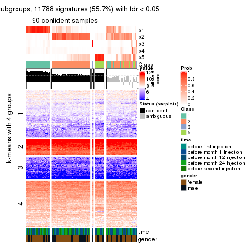</p>

</div>
<div id='tab-SD-hclust-get-signatures-no-scale-5'>
<pre><code class="r">get_signatures(res, k = 6, scale_rows = FALSE)
</code></pre>

<p></p>

</div>
</div>


Compare the overlap of signatures from different k:

```r
compare_signatures(res)
```


`get_signature()` returns a data frame invisibly. TO get the list of signatures, the function
call should be assigned to a variable explicitly. In following code, if `plot` argument is set
to `FALSE`, no heatmap is plotted while only the differential analysis is performed.

```r
# code only for demonstration
tb = get_signature(res, k = ..., plot = FALSE)
```

An example of the output of `tb` is:

```
#>   which_row         fdr    mean_1    mean_2 scaled_mean_1 scaled_mean_2 km
#> 1        38 0.042760348  8.373488  9.131774    -0.5533452     0.5164555  1
#> 2        40 0.018707592  7.106213  8.469186    -0.6173731     0.5762149  1
#> 3        55 0.019134737 10.221463 11.207825    -0.6159697     0.5749050  1
#> 4        59 0.006059896  5.921854  7.869574    -0.6899429     0.6439467  1
#> 5        60 0.018055526  8.928898 10.211722    -0.6204761     0.5791110  1
#> 6        98 0.009384629 15.714769 14.887706     0.6635654    -0.6193277  2
...
```

The columns in `tb` are:

1. `which_row`: row indices corresponding to the input matrix.
2. `fdr`: FDR for the differential test. 
3. `mean_x`: The mean value in group x.
4. `scaled_mean_x`: The mean value in group x after rows are scaled.
5. `km`: Row groups if k-means clustering is applied to rows.


UMAP plot which shows how samples are separated.


<script>
$( function() {
	$( '#tabs-SD-hclust-dimension-reduction' ).tabs();
} );
</script>
<div id='tabs-SD-hclust-dimension-reduction'>
<ul>
<li><a href='#tab-SD-hclust-dimension-reduction-1'>k = 2</a></li>
<li><a href='#tab-SD-hclust-dimension-reduction-2'>k = 3</a></li>
<li><a href='#tab-SD-hclust-dimension-reduction-3'>k = 4</a></li>
<li><a href='#tab-SD-hclust-dimension-reduction-4'>k = 5</a></li>
<li><a href='#tab-SD-hclust-dimension-reduction-5'>k = 6</a></li>
</ul>
<div id='tab-SD-hclust-dimension-reduction-1'>
<pre><code class="r">dimension_reduction(res, k = 2, method = &quot;UMAP&quot;)
</code></pre>

<p></p>

</div>
<div id='tab-SD-hclust-dimension-reduction-2'>
<pre><code class="r">dimension_reduction(res, k = 3, method = &quot;UMAP&quot;)
</code></pre>

<p></p>

</div>
<div id='tab-SD-hclust-dimension-reduction-3'>
<pre><code class="r">dimension_reduction(res, k = 4, method = &quot;UMAP&quot;)
</code></pre>

<p></p>

</div>
<div id='tab-SD-hclust-dimension-reduction-4'>
<pre><code class="r">dimension_reduction(res, k = 5, method = &quot;UMAP&quot;)
</code></pre>

<p></p>

</div>
<div id='tab-SD-hclust-dimension-reduction-5'>
<pre><code class="r">dimension_reduction(res, k = 6, method = &quot;UMAP&quot;)
</code></pre>

<p></p>

</div>
</div>


Following heatmap shows how subgroups are split when increasing `k`:

```r
collect_classes(res)
```


Test correlation between subgroups and known annotations. If the known
annotation is numeric, one-way ANOVA test is applied, and if the known
annotation is discrete, chi-squared contingency table test is applied.

```r
test_to_known_factors(res)
```

```
#>            n time(p) gender(p) k
#> SD:hclust 94   0.700    0.0792 2
#> SD:hclust 80   0.204    0.5221 3
#> SD:hclust 93   0.114    0.4873 4
#> SD:hclust 90   0.128    0.6315 5
#> SD:hclust 89   0.232    0.6779 6
```


If matrix rows can be associated to genes, consider to use `GO_Enrichment(res,
...)` to perform function enrichment for the signature genes.


 

---------------------------------------------------


### SD:kmeans*


The object with results only for a single top-value method and a single partition method 
can be extracted as:

```r
res = res_list["SD", "kmeans"]
# you can also extract it by
# res = res_list["SD:kmeans"]
```

A summary of `res` and all the functions that can be applied to it:

```r
res
```

```
#> A 'ConsensusPartition' object with k = 2, 3, 4, 5, 6.
#>   On a matrix with 21168 rows and 125 columns.
#>   Top rows (1000, 2000, 3000, 4000, 5000) are extracted by 'SD' method.
#>   Subgroups are detected by 'kmeans' method.
#>   Performed in total 1250 partitions by row resampling.
#>   Best k for subgroups seems to be 2.
#> 
#> Following methods can be applied to this 'ConsensusPartition' object:
#>  [1] "cola_report"             "collect_classes"         "collect_plots"          
#>  [4] "collect_stats"           "colnames"                "compare_signatures"     
#>  [7] "consensus_heatmap"       "dimension_reduction"     "functional_enrichment"  
#> [10] "get_anno_col"            "get_anno"                "get_classes"            
#> [13] "get_consensus"           "get_matrix"              "get_membership"         
#> [16] "get_param"               "get_signatures"          "get_stats"              
#> [19] "is_best_k"               "is_stable_k"             "membership_heatmap"     
#> [22] "ncol"                    "nrow"                    "plot_ecdf"              
#> [25] "rownames"                "select_partition_number" "show"                   
#> [28] "suggest_best_k"          "test_to_known_factors"
```

`collect_plots()` function collects all the plots made from `res` for all `k` (number of partitions)
into one single page to provide an easy and fast comparison between different `k`.

```r
collect_plots(res)
```


The plots are:

- The first row: a plot of the ECDF (Empirical cumulative distribution
  function) curves of the consensus matrix for each `k` and the heatmap of
  predicted classes for each `k`.
- The second row: heatmaps of the consensus matrix for each `k`.
- The third row: heatmaps of the membership matrix for each `k`.
- The fouth row: heatmaps of the signatures for each `k`.

All the plots in panels can be made by individual functions and they are
plotted later in this section.

`select_partition_number()` produces several plots showing different
statistics for choosing "optimized" `k`. There are following statistics:

- ECDF curves of the consensus matrix for each `k`;
- 1-PAC. [The PAC
  score](https://en.wikipedia.org/wiki/Consensus_clustering#Over-interpretation_potential_of_consensus_clustering)
  measures the proportion of the ambiguous subgrouping.
- Mean silhouette score.
- Concordance. The mean probability of fiting the consensus class ids in all
  partitions.
- Area increased. Denote $A_k$ as the area under the ECDF curve for current
  `k`, the area increased is defined as $A_k - A_{k-1}$.
- Rand index. The percent of pairs of samples that are both in a same cluster
  or both are not in a same cluster in the partition of k and k-1.
- Jaccard index. The ratio of pairs of samples are both in a same cluster in
  the partition of k and k-1 and the pairs of samples are both in a same
  cluster in the partition k or k-1.

The detailed explanations of these statistics can be found in [the cola
vignette](http://bioconductor.org/packages/devel/bioc/vignettes/cola/inst/doc/cola.html#toc_13).

Generally speaking, lower PAC score, higher mean silhouette score or higher
concordance corresponds to better partition. Rand index and Jaccard index
measure how similar the current partition is compared to partition with `k-1`.
If they are too similar, we won't accept `k` is better than `k-1`.

```r
select_partition_number(res)
```


The numeric values for all these statistics can be obtained by `get_stats()`.

```r
get_stats(res)
```

```
#>   k 1-PAC mean_silhouette concordance area_increased  Rand Jaccard
#> 2 2 0.915           0.909       0.964         0.5013 0.499   0.499
#> 3 3 0.525           0.589       0.754         0.2786 0.819   0.659
#> 4 4 0.584           0.441       0.670         0.1209 0.791   0.510
#> 5 5 0.640           0.685       0.759         0.0715 0.790   0.400
#> 6 6 0.691           0.729       0.761         0.0408 0.933   0.714
```

`suggest_best_k()` suggests the best $k$ based on these statistics. The rules are as follows:

- All $k$ with Jaccard index larger than 0.95 are removed because the increase of
  the partition number does not provides enough extra information. If all $k$ are removed,
  the best $k$ is assigned by `NA`.
- For $k$ with 1-PAC larger than 0.9, the maximal $k$ is taken as the "best k". Other $k$ is called "optional k".
- If it does not fit the second rule. The $k$ with the highest vote of highest
  1-PAC, mean silhouette and concordance is taken as the "best k".

```r
suggest_best_k(res)
```

```
#> [1] 2
```


Following shows the table of the partitions (You need to click the **show/hide
code output** link to see it). The membership matrix (columns with name `p*`)
is inferred by
[`clue::cl_consensus()`](https://www.rdocumentation.org/link/cl_consensus?package=clue)
function with the `SE` method. Basically the value in the membership matrix
represents the probability to belong to a certain group. The finall class
label for an item is determined with the group with highest probability it
belongs to.

In `get_classes()` function, the entropy is calculated from the membership
matrix and the silhouette score is calculated from the consensus matrix.


<script>
$( function() {
	$( '#tabs-SD-kmeans-get-classes' ).tabs();
} );
</script>
<div id='tabs-SD-kmeans-get-classes'>
<ul>
<li><a href='#tab-SD-kmeans-get-classes-1'>k = 2</a></li>
<li><a href='#tab-SD-kmeans-get-classes-2'>k = 3</a></li>
<li><a href='#tab-SD-kmeans-get-classes-3'>k = 4</a></li>
<li><a href='#tab-SD-kmeans-get-classes-4'>k = 5</a></li>
<li><a href='#tab-SD-kmeans-get-classes-5'>k = 6</a></li>
</ul>

<div id='tab-SD-kmeans-get-classes-1'>
<p><a id='tab-SD-kmeans-get-classes-1-a' style='color:#0366d6' href='#'>show/hide code output</a></p>
<pre><code class="r">cbind(get_classes(res, k = 2), get_membership(res, k = 2))
</code></pre>

<pre><code>#&gt;           class entropy silhouette    p1    p2
#&gt; GSM601752     2  0.0000      0.958 0.000 1.000
#&gt; GSM601782     1  0.0000      0.964 1.000 0.000
#&gt; GSM601792     1  0.0000      0.964 1.000 0.000
#&gt; GSM601797     1  0.8443      0.618 0.728 0.272
#&gt; GSM601827     1  0.0000      0.964 1.000 0.000
#&gt; GSM601837     2  0.0000      0.958 0.000 1.000
#&gt; GSM601842     2  0.0000      0.958 0.000 1.000
#&gt; GSM601857     1  0.0000      0.964 1.000 0.000
#&gt; GSM601867     2  0.9896      0.208 0.440 0.560
#&gt; GSM601747     1  0.0000      0.964 1.000 0.000
#&gt; GSM601757     1  0.0000      0.964 1.000 0.000
#&gt; GSM601762     2  0.0000      0.958 0.000 1.000
#&gt; GSM601767     2  0.0000      0.958 0.000 1.000
#&gt; GSM601772     2  0.0000      0.958 0.000 1.000
#&gt; GSM601777     1  0.2778      0.921 0.952 0.048
#&gt; GSM601787     2  0.4298      0.880 0.088 0.912
#&gt; GSM601802     2  0.0000      0.958 0.000 1.000
#&gt; GSM601807     1  0.9491      0.411 0.632 0.368
#&gt; GSM601812     1  0.0000      0.964 1.000 0.000
#&gt; GSM601817     1  0.0000      0.964 1.000 0.000
#&gt; GSM601822     1  0.1414      0.947 0.980 0.020
#&gt; GSM601832     2  0.0000      0.958 0.000 1.000
#&gt; GSM601847     2  0.8909      0.556 0.308 0.692
#&gt; GSM601852     1  0.0000      0.964 1.000 0.000
#&gt; GSM601862     1  0.0000      0.964 1.000 0.000
#&gt; GSM601753     2  0.0000      0.958 0.000 1.000
#&gt; GSM601783     1  0.0000      0.964 1.000 0.000
#&gt; GSM601793     1  0.0000      0.964 1.000 0.000
#&gt; GSM601798     2  0.0000      0.958 0.000 1.000
#&gt; GSM601828     1  0.0000      0.964 1.000 0.000
#&gt; GSM601838     2  0.0000      0.958 0.000 1.000
#&gt; GSM601843     2  0.0000      0.958 0.000 1.000
#&gt; GSM601858     2  0.0000      0.958 0.000 1.000
#&gt; GSM601868     1  0.0000      0.964 1.000 0.000
#&gt; GSM601748     1  0.0000      0.964 1.000 0.000
#&gt; GSM601758     1  0.0000      0.964 1.000 0.000
#&gt; GSM601763     1  0.5408      0.836 0.876 0.124
#&gt; GSM601768     2  0.0000      0.958 0.000 1.000
#&gt; GSM601773     2  0.0000      0.958 0.000 1.000
#&gt; GSM601778     1  0.0000      0.964 1.000 0.000
#&gt; GSM601788     2  0.0000      0.958 0.000 1.000
#&gt; GSM601803     2  0.0000      0.958 0.000 1.000
#&gt; GSM601808     1  0.0000      0.964 1.000 0.000
#&gt; GSM601813     1  0.0000      0.964 1.000 0.000
#&gt; GSM601818     1  0.0000      0.964 1.000 0.000
#&gt; GSM601823     1  0.0000      0.964 1.000 0.000
#&gt; GSM601833     2  0.0000      0.958 0.000 1.000
#&gt; GSM601848     1  0.0000      0.964 1.000 0.000
#&gt; GSM601853     1  0.0000      0.964 1.000 0.000
#&gt; GSM601863     1  0.0000      0.964 1.000 0.000
#&gt; GSM601754     2  0.0000      0.958 0.000 1.000
#&gt; GSM601784     2  0.0000      0.958 0.000 1.000
#&gt; GSM601794     1  0.0000      0.964 1.000 0.000
#&gt; GSM601799     2  0.0000      0.958 0.000 1.000
#&gt; GSM601829     1  0.0000      0.964 1.000 0.000
#&gt; GSM601839     2  0.0000      0.958 0.000 1.000
#&gt; GSM601844     1  0.0000      0.964 1.000 0.000
#&gt; GSM601859     2  0.0000      0.958 0.000 1.000
#&gt; GSM601869     1  0.0000      0.964 1.000 0.000
#&gt; GSM601749     1  0.0000      0.964 1.000 0.000
#&gt; GSM601759     1  0.0000      0.964 1.000 0.000
#&gt; GSM601764     1  0.0000      0.964 1.000 0.000
#&gt; GSM601769     2  0.0000      0.958 0.000 1.000
#&gt; GSM601774     2  0.0000      0.958 0.000 1.000
#&gt; GSM601779     1  0.0000      0.964 1.000 0.000
#&gt; GSM601789     2  0.0000      0.958 0.000 1.000
#&gt; GSM601804     2  0.4431      0.876 0.092 0.908
#&gt; GSM601809     1  0.0000      0.964 1.000 0.000
#&gt; GSM601814     2  0.0000      0.958 0.000 1.000
#&gt; GSM601819     1  0.0000      0.964 1.000 0.000
#&gt; GSM601824     2  0.9896      0.223 0.440 0.560
#&gt; GSM601834     2  0.0000      0.958 0.000 1.000
#&gt; GSM601849     1  0.0000      0.964 1.000 0.000
#&gt; GSM601854     1  0.0000      0.964 1.000 0.000
#&gt; GSM601864     2  0.0000      0.958 0.000 1.000
#&gt; GSM601755     2  0.0000      0.958 0.000 1.000
#&gt; GSM601785     2  0.0000      0.958 0.000 1.000
#&gt; GSM601795     1  0.0000      0.964 1.000 0.000
#&gt; GSM601800     2  0.0000      0.958 0.000 1.000
#&gt; GSM601830     1  0.3733      0.897 0.928 0.072
#&gt; GSM601840     2  0.0376      0.955 0.004 0.996
#&gt; GSM601845     1  0.9954      0.142 0.540 0.460
#&gt; GSM601860     2  0.0000      0.958 0.000 1.000
#&gt; GSM601870     1  0.9608      0.370 0.616 0.384
#&gt; GSM601750     1  0.0000      0.964 1.000 0.000
#&gt; GSM601760     1  0.0000      0.964 1.000 0.000
#&gt; GSM601765     2  0.0000      0.958 0.000 1.000
#&gt; GSM601770     2  0.0000      0.958 0.000 1.000
#&gt; GSM601775     2  0.9552      0.402 0.376 0.624
#&gt; GSM601780     1  0.0000      0.964 1.000 0.000
#&gt; GSM601790     2  0.0000      0.958 0.000 1.000
#&gt; GSM601805     2  0.0000      0.958 0.000 1.000
#&gt; GSM601810     1  0.0000      0.964 1.000 0.000
#&gt; GSM601815     2  0.0000      0.958 0.000 1.000
#&gt; GSM601820     1  0.0000      0.964 1.000 0.000
#&gt; GSM601825     2  0.0000      0.958 0.000 1.000
#&gt; GSM601835     2  0.0000      0.958 0.000 1.000
#&gt; GSM601850     1  0.0000      0.964 1.000 0.000
#&gt; GSM601855     1  0.0376      0.961 0.996 0.004
#&gt; GSM601865     2  0.0000      0.958 0.000 1.000
#&gt; GSM601756     2  0.0000      0.958 0.000 1.000
#&gt; GSM601786     2  0.0000      0.958 0.000 1.000
#&gt; GSM601796     1  0.0000      0.964 1.000 0.000
#&gt; GSM601801     2  0.0000      0.958 0.000 1.000
#&gt; GSM601831     1  0.0000      0.964 1.000 0.000
#&gt; GSM601841     1  0.0000      0.964 1.000 0.000
#&gt; GSM601846     2  0.8081      0.664 0.248 0.752
#&gt; GSM601861     2  0.0000      0.958 0.000 1.000
#&gt; GSM601871     2  0.6438      0.790 0.164 0.836
#&gt; GSM601751     2  0.4562      0.871 0.096 0.904
#&gt; GSM601761     1  0.0000      0.964 1.000 0.000
#&gt; GSM601766     1  0.9944      0.137 0.544 0.456
#&gt; GSM601771     2  0.0000      0.958 0.000 1.000
#&gt; GSM601776     1  0.0000      0.964 1.000 0.000
#&gt; GSM601781     1  0.0672      0.958 0.992 0.008
#&gt; GSM601791     1  0.0000      0.964 1.000 0.000
#&gt; GSM601806     2  0.0000      0.958 0.000 1.000
#&gt; GSM601811     1  0.0000      0.964 1.000 0.000
#&gt; GSM601816     1  0.0000      0.964 1.000 0.000
#&gt; GSM601821     2  0.0000      0.958 0.000 1.000
#&gt; GSM601826     1  0.0000      0.964 1.000 0.000
#&gt; GSM601836     1  0.0000      0.964 1.000 0.000
#&gt; GSM601851     1  0.0000      0.964 1.000 0.000
#&gt; GSM601856     1  0.0000      0.964 1.000 0.000
#&gt; GSM601866     1  0.0000      0.964 1.000 0.000
</code></pre>

<script>
$('#tab-SD-kmeans-get-classes-1-a').parent().next().next().hide();
$('#tab-SD-kmeans-get-classes-1-a').click(function(){
  $('#tab-SD-kmeans-get-classes-1-a').parent().next().next().toggle();
  return(false);
});
</script>
</div>

<div id='tab-SD-kmeans-get-classes-2'>
<p><a id='tab-SD-kmeans-get-classes-2-a' style='color:#0366d6' href='#'>show/hide code output</a></p>
<pre><code class="r">cbind(get_classes(res, k = 3), get_membership(res, k = 3))
</code></pre>

<pre><code>#&gt;           class entropy silhouette    p1    p2    p3
#&gt; GSM601752     2  0.7796     0.6137 0.228 0.660 0.112
#&gt; GSM601782     1  0.6045     0.1443 0.620 0.000 0.380
#&gt; GSM601792     1  0.2682     0.5928 0.920 0.004 0.076
#&gt; GSM601797     1  0.9153     0.2525 0.520 0.308 0.172
#&gt; GSM601827     1  0.6062     0.1303 0.616 0.000 0.384
#&gt; GSM601837     2  0.5098     0.7405 0.000 0.752 0.248
#&gt; GSM601842     2  0.0747     0.8428 0.000 0.984 0.016
#&gt; GSM601857     3  0.6062     0.7046 0.384 0.000 0.616
#&gt; GSM601867     3  0.3987     0.5240 0.020 0.108 0.872
#&gt; GSM601747     1  0.5406     0.4502 0.764 0.012 0.224
#&gt; GSM601757     1  0.5650     0.2952 0.688 0.000 0.312
#&gt; GSM601762     2  0.0592     0.8416 0.000 0.988 0.012
#&gt; GSM601767     2  0.0424     0.8421 0.000 0.992 0.008
#&gt; GSM601772     2  0.0424     0.8421 0.000 0.992 0.008
#&gt; GSM601777     1  0.8355     0.3794 0.616 0.140 0.244
#&gt; GSM601787     3  0.4409     0.4786 0.004 0.172 0.824
#&gt; GSM601802     2  0.5393     0.7915 0.072 0.820 0.108
#&gt; GSM601807     3  0.3472     0.5389 0.056 0.040 0.904
#&gt; GSM601812     1  0.5948     0.1715 0.640 0.000 0.360
#&gt; GSM601817     1  0.6062     0.0852 0.616 0.000 0.384
#&gt; GSM601822     1  0.8094     0.3903 0.636 0.240 0.124
#&gt; GSM601832     2  0.0829     0.8416 0.004 0.984 0.012
#&gt; GSM601847     1  0.8628     0.2066 0.544 0.340 0.116
#&gt; GSM601852     1  0.5785     0.2505 0.668 0.000 0.332
#&gt; GSM601862     3  0.6095     0.6939 0.392 0.000 0.608
#&gt; GSM601753     2  0.5393     0.7915 0.072 0.820 0.108
#&gt; GSM601783     1  0.5291     0.3741 0.732 0.000 0.268
#&gt; GSM601793     1  0.2261     0.5966 0.932 0.000 0.068
#&gt; GSM601798     2  0.4892     0.8042 0.048 0.840 0.112
#&gt; GSM601828     1  0.5905     0.1884 0.648 0.000 0.352
#&gt; GSM601838     2  0.5098     0.7405 0.000 0.752 0.248
#&gt; GSM601843     2  0.0592     0.8416 0.000 0.988 0.012
#&gt; GSM601858     2  0.5016     0.7459 0.000 0.760 0.240
#&gt; GSM601868     3  0.5968     0.7255 0.364 0.000 0.636
#&gt; GSM601748     1  0.5882     0.2035 0.652 0.000 0.348
#&gt; GSM601758     1  0.5291     0.3741 0.732 0.000 0.268
#&gt; GSM601763     1  0.5305     0.4876 0.788 0.192 0.020
#&gt; GSM601768     2  0.0661     0.8422 0.008 0.988 0.004
#&gt; GSM601773     2  0.0592     0.8416 0.000 0.988 0.012
#&gt; GSM601778     1  0.5191     0.5436 0.828 0.060 0.112
#&gt; GSM601788     2  0.3129     0.8315 0.008 0.904 0.088
#&gt; GSM601803     2  0.3695     0.8205 0.012 0.880 0.108
#&gt; GSM601808     3  0.5968     0.7255 0.364 0.000 0.636
#&gt; GSM601813     1  0.5529     0.3266 0.704 0.000 0.296
#&gt; GSM601818     1  0.6095     0.0520 0.608 0.000 0.392
#&gt; GSM601823     1  0.0424     0.6119 0.992 0.008 0.000
#&gt; GSM601833     2  0.0424     0.8421 0.000 0.992 0.008
#&gt; GSM601848     1  0.0000     0.6114 1.000 0.000 0.000
#&gt; GSM601853     3  0.5968     0.7255 0.364 0.000 0.636
#&gt; GSM601863     3  0.6111     0.6868 0.396 0.000 0.604
#&gt; GSM601754     2  0.7267     0.6797 0.180 0.708 0.112
#&gt; GSM601784     2  0.3192     0.8078 0.000 0.888 0.112
#&gt; GSM601794     1  0.2878     0.5842 0.904 0.000 0.096
#&gt; GSM601799     2  0.7979     0.5834 0.248 0.640 0.112
#&gt; GSM601829     1  0.1753     0.6016 0.952 0.000 0.048
#&gt; GSM601839     2  0.5098     0.7405 0.000 0.752 0.248
#&gt; GSM601844     1  0.1411     0.6043 0.964 0.000 0.036
#&gt; GSM601859     2  0.0829     0.8419 0.004 0.984 0.012
#&gt; GSM601869     3  0.6026     0.7112 0.376 0.000 0.624
#&gt; GSM601749     1  0.5291     0.3741 0.732 0.000 0.268
#&gt; GSM601759     1  0.5431     0.3461 0.716 0.000 0.284
#&gt; GSM601764     1  0.1015     0.6111 0.980 0.008 0.012
#&gt; GSM601769     2  0.4931     0.7502 0.000 0.768 0.232
#&gt; GSM601774     2  0.0592     0.8416 0.000 0.988 0.012
#&gt; GSM601779     1  0.0661     0.6115 0.988 0.008 0.004
#&gt; GSM601789     2  0.5098     0.7405 0.000 0.752 0.248
#&gt; GSM601804     1  0.8436     0.2475 0.568 0.324 0.108
#&gt; GSM601809     1  0.6280    -0.2118 0.540 0.000 0.460
#&gt; GSM601814     2  0.4974     0.7480 0.000 0.764 0.236
#&gt; GSM601819     1  0.4555     0.4661 0.800 0.000 0.200
#&gt; GSM601824     1  0.7817     0.3921 0.648 0.252 0.100
#&gt; GSM601834     2  0.0592     0.8416 0.000 0.988 0.012
#&gt; GSM601849     1  0.0424     0.6101 0.992 0.000 0.008
#&gt; GSM601854     1  0.5591     0.3073 0.696 0.000 0.304
#&gt; GSM601864     2  0.5098     0.7405 0.000 0.752 0.248
#&gt; GSM601755     2  0.3987     0.8179 0.020 0.872 0.108
#&gt; GSM601785     2  0.3276     0.8269 0.068 0.908 0.024
#&gt; GSM601795     1  0.5760     0.5203 0.796 0.064 0.140
#&gt; GSM601800     2  0.5722     0.7802 0.084 0.804 0.112
#&gt; GSM601830     3  0.5722     0.6943 0.292 0.004 0.704
#&gt; GSM601840     2  0.6546     0.7308 0.148 0.756 0.096
#&gt; GSM601845     1  0.7652     0.0753 0.512 0.444 0.044
#&gt; GSM601860     2  0.3445     0.8182 0.088 0.896 0.016
#&gt; GSM601870     3  0.4665     0.5396 0.048 0.100 0.852
#&gt; GSM601750     1  0.5760     0.2577 0.672 0.000 0.328
#&gt; GSM601760     1  0.4555     0.4628 0.800 0.000 0.200
#&gt; GSM601765     2  0.0237     0.8424 0.000 0.996 0.004
#&gt; GSM601770     2  0.0424     0.8421 0.000 0.992 0.008
#&gt; GSM601775     1  0.8686    -0.0967 0.464 0.432 0.104
#&gt; GSM601780     1  0.0424     0.6119 0.992 0.008 0.000
#&gt; GSM601790     2  0.5098     0.7405 0.000 0.752 0.248
#&gt; GSM601805     2  0.5481     0.7885 0.076 0.816 0.108
#&gt; GSM601810     3  0.5968     0.7255 0.364 0.000 0.636
#&gt; GSM601815     2  0.5098     0.7405 0.000 0.752 0.248
#&gt; GSM601820     1  0.5529     0.3237 0.704 0.000 0.296
#&gt; GSM601825     2  0.3695     0.8205 0.012 0.880 0.108
#&gt; GSM601835     2  0.0592     0.8424 0.000 0.988 0.012
#&gt; GSM601850     1  0.4379     0.5619 0.868 0.060 0.072
#&gt; GSM601855     3  0.5760     0.7152 0.328 0.000 0.672
#&gt; GSM601865     2  0.5098     0.7405 0.000 0.752 0.248
#&gt; GSM601756     2  0.3987     0.8179 0.020 0.872 0.108
#&gt; GSM601786     2  0.5098     0.7405 0.000 0.752 0.248
#&gt; GSM601796     1  0.2356     0.5951 0.928 0.000 0.072
#&gt; GSM601801     2  0.3695     0.8205 0.012 0.880 0.108
#&gt; GSM601831     3  0.6045     0.7002 0.380 0.000 0.620
#&gt; GSM601841     1  0.4796     0.4634 0.780 0.000 0.220
#&gt; GSM601846     2  0.9152     0.0705 0.428 0.428 0.144
#&gt; GSM601861     2  0.5058     0.7431 0.000 0.756 0.244
#&gt; GSM601871     3  0.4521     0.4603 0.004 0.180 0.816
#&gt; GSM601751     2  0.6271     0.7491 0.140 0.772 0.088
#&gt; GSM601761     1  0.0747     0.6075 0.984 0.000 0.016
#&gt; GSM601766     1  0.6422     0.3889 0.660 0.324 0.016
#&gt; GSM601771     2  0.3572     0.8263 0.060 0.900 0.040
#&gt; GSM601776     1  0.0592     0.6091 0.988 0.000 0.012
#&gt; GSM601781     1  0.4652     0.5561 0.856 0.064 0.080
#&gt; GSM601791     1  0.0592     0.6091 0.988 0.000 0.012
#&gt; GSM601806     2  0.3038     0.8297 0.000 0.896 0.104
#&gt; GSM601811     3  0.5968     0.7255 0.364 0.000 0.636
#&gt; GSM601816     1  0.1163     0.6086 0.972 0.000 0.028
#&gt; GSM601821     2  0.5058     0.7431 0.000 0.756 0.244
#&gt; GSM601826     1  0.0237     0.6109 0.996 0.000 0.004
#&gt; GSM601836     1  0.2187     0.6104 0.948 0.024 0.028
#&gt; GSM601851     1  0.0592     0.6091 0.988 0.000 0.012
#&gt; GSM601856     3  0.5948     0.7244 0.360 0.000 0.640
#&gt; GSM601866     1  0.6045     0.1024 0.620 0.000 0.380
</code></pre>

<script>
$('#tab-SD-kmeans-get-classes-2-a').parent().next().next().hide();
$('#tab-SD-kmeans-get-classes-2-a').click(function(){
  $('#tab-SD-kmeans-get-classes-2-a').parent().next().next().toggle();
  return(false);
});
</script>
</div>

<div id='tab-SD-kmeans-get-classes-3'>
<p><a id='tab-SD-kmeans-get-classes-3-a' style='color:#0366d6' href='#'>show/hide code output</a></p>
<pre><code class="r">cbind(get_classes(res, k = 4), get_membership(res, k = 4))
</code></pre>

<pre><code>#&gt;           class entropy silhouette    p1    p2    p3    p4
#&gt; GSM601752     4  0.4883    0.26911 0.000 0.288 0.016 0.696
#&gt; GSM601782     1  0.2831    0.52465 0.876 0.000 0.120 0.004
#&gt; GSM601792     4  0.5285   -0.38645 0.468 0.000 0.008 0.524
#&gt; GSM601797     4  0.2945    0.42252 0.012 0.052 0.032 0.904
#&gt; GSM601827     1  0.2676    0.57855 0.896 0.000 0.092 0.012
#&gt; GSM601837     2  0.4155    0.55541 0.000 0.756 0.240 0.004
#&gt; GSM601842     2  0.4313    0.62713 0.000 0.736 0.004 0.260
#&gt; GSM601857     3  0.5097    0.71419 0.428 0.000 0.568 0.004
#&gt; GSM601867     3  0.2707    0.73975 0.068 0.008 0.908 0.016
#&gt; GSM601747     1  0.3498    0.59196 0.880 0.024 0.068 0.028
#&gt; GSM601757     1  0.1557    0.60557 0.944 0.000 0.056 0.000
#&gt; GSM601762     2  0.4072    0.63786 0.000 0.748 0.000 0.252
#&gt; GSM601767     2  0.4072    0.63786 0.000 0.748 0.000 0.252
#&gt; GSM601772     2  0.4072    0.63786 0.000 0.748 0.000 0.252
#&gt; GSM601777     4  0.5739    0.23054 0.076 0.008 0.200 0.716
#&gt; GSM601787     3  0.1917    0.68170 0.012 0.036 0.944 0.008
#&gt; GSM601802     4  0.5408    0.08089 0.000 0.408 0.016 0.576
#&gt; GSM601807     3  0.2197    0.72826 0.048 0.000 0.928 0.024
#&gt; GSM601812     1  0.2345    0.55626 0.900 0.000 0.100 0.000
#&gt; GSM601817     1  0.2530    0.53909 0.888 0.000 0.112 0.000
#&gt; GSM601822     4  0.2831    0.36011 0.120 0.000 0.004 0.876
#&gt; GSM601832     2  0.4331    0.59433 0.000 0.712 0.000 0.288
#&gt; GSM601847     4  0.1489    0.44313 0.044 0.004 0.000 0.952
#&gt; GSM601852     1  0.2011    0.58374 0.920 0.000 0.080 0.000
#&gt; GSM601862     3  0.5016    0.74574 0.396 0.000 0.600 0.004
#&gt; GSM601753     4  0.5427    0.06954 0.000 0.416 0.016 0.568
#&gt; GSM601783     1  0.0188    0.63760 0.996 0.000 0.004 0.000
#&gt; GSM601793     4  0.5288   -0.39425 0.472 0.000 0.008 0.520
#&gt; GSM601798     4  0.5435    0.05028 0.000 0.420 0.016 0.564
#&gt; GSM601828     1  0.1940    0.58699 0.924 0.000 0.076 0.000
#&gt; GSM601838     2  0.4122    0.55764 0.000 0.760 0.236 0.004
#&gt; GSM601843     2  0.4252    0.63504 0.000 0.744 0.004 0.252
#&gt; GSM601858     2  0.6515    0.61929 0.000 0.624 0.128 0.248
#&gt; GSM601868     3  0.4699    0.79606 0.320 0.000 0.676 0.004
#&gt; GSM601748     1  0.1792    0.59439 0.932 0.000 0.068 0.000
#&gt; GSM601758     1  0.0469    0.64101 0.988 0.000 0.000 0.012
#&gt; GSM601763     4  0.6478    0.09396 0.336 0.088 0.000 0.576
#&gt; GSM601768     2  0.4401    0.61211 0.000 0.724 0.004 0.272
#&gt; GSM601773     2  0.4072    0.63786 0.000 0.748 0.000 0.252
#&gt; GSM601778     4  0.5085   -0.06380 0.304 0.000 0.020 0.676
#&gt; GSM601788     2  0.6487    0.23163 0.000 0.500 0.072 0.428
#&gt; GSM601803     4  0.5472   -0.01171 0.000 0.440 0.016 0.544
#&gt; GSM601808     3  0.4608    0.79932 0.304 0.000 0.692 0.004
#&gt; GSM601813     1  0.1118    0.62143 0.964 0.000 0.036 0.000
#&gt; GSM601818     1  0.2888    0.51232 0.872 0.000 0.124 0.004
#&gt; GSM601823     1  0.4948    0.50592 0.560 0.000 0.000 0.440
#&gt; GSM601833     2  0.4072    0.63786 0.000 0.748 0.000 0.252
#&gt; GSM601848     1  0.4948    0.50592 0.560 0.000 0.000 0.440
#&gt; GSM601853     3  0.4543    0.79526 0.324 0.000 0.676 0.000
#&gt; GSM601863     3  0.5229    0.70612 0.428 0.000 0.564 0.008
#&gt; GSM601754     4  0.5167    0.19857 0.000 0.340 0.016 0.644
#&gt; GSM601784     2  0.4508    0.63355 0.000 0.780 0.036 0.184
#&gt; GSM601794     4  0.5273   -0.36849 0.456 0.000 0.008 0.536
#&gt; GSM601799     4  0.4933    0.26586 0.000 0.296 0.016 0.688
#&gt; GSM601829     1  0.5581    0.48778 0.532 0.000 0.020 0.448
#&gt; GSM601839     2  0.4155    0.55541 0.000 0.756 0.240 0.004
#&gt; GSM601844     1  0.5244    0.50790 0.556 0.000 0.008 0.436
#&gt; GSM601859     2  0.4428    0.60702 0.000 0.720 0.004 0.276
#&gt; GSM601869     3  0.5132    0.68687 0.448 0.000 0.548 0.004
#&gt; GSM601749     1  0.0188    0.63985 0.996 0.000 0.000 0.004
#&gt; GSM601759     1  0.0657    0.64002 0.984 0.000 0.004 0.012
#&gt; GSM601764     1  0.5337    0.51034 0.564 0.012 0.000 0.424
#&gt; GSM601769     2  0.2593    0.59567 0.000 0.892 0.104 0.004
#&gt; GSM601774     2  0.3873    0.64050 0.000 0.772 0.000 0.228
#&gt; GSM601779     1  0.4961    0.49305 0.552 0.000 0.000 0.448
#&gt; GSM601789     2  0.4365    0.58559 0.000 0.784 0.188 0.028
#&gt; GSM601804     4  0.1917    0.44042 0.036 0.012 0.008 0.944
#&gt; GSM601809     1  0.5526   -0.35732 0.564 0.000 0.416 0.020
#&gt; GSM601814     2  0.2944    0.59231 0.000 0.868 0.128 0.004
#&gt; GSM601819     1  0.1022    0.64415 0.968 0.000 0.000 0.032
#&gt; GSM601824     4  0.3991    0.33820 0.172 0.020 0.000 0.808
#&gt; GSM601834     2  0.4040    0.63884 0.000 0.752 0.000 0.248
#&gt; GSM601849     1  0.4933    0.51607 0.568 0.000 0.000 0.432
#&gt; GSM601854     1  0.1209    0.62437 0.964 0.000 0.032 0.004
#&gt; GSM601864     2  0.4220    0.54866 0.000 0.748 0.248 0.004
#&gt; GSM601755     4  0.5459    0.01420 0.000 0.432 0.016 0.552
#&gt; GSM601785     2  0.5085    0.42414 0.000 0.616 0.008 0.376
#&gt; GSM601795     4  0.4877   -0.09486 0.328 0.000 0.008 0.664
#&gt; GSM601800     4  0.5398    0.08881 0.000 0.404 0.016 0.580
#&gt; GSM601830     3  0.4054    0.78844 0.188 0.000 0.796 0.016
#&gt; GSM601840     4  0.5888    0.02286 0.016 0.440 0.012 0.532
#&gt; GSM601845     4  0.6571    0.27304 0.092 0.280 0.008 0.620
#&gt; GSM601860     2  0.5285    0.45975 0.012 0.632 0.004 0.352
#&gt; GSM601870     3  0.2040    0.72772 0.048 0.004 0.936 0.012
#&gt; GSM601750     1  0.1211    0.61809 0.960 0.000 0.040 0.000
#&gt; GSM601760     1  0.1637    0.64365 0.940 0.000 0.000 0.060
#&gt; GSM601765     2  0.4072    0.63786 0.000 0.748 0.000 0.252
#&gt; GSM601770     2  0.4072    0.63786 0.000 0.748 0.000 0.252
#&gt; GSM601775     4  0.6100    0.27580 0.048 0.300 0.012 0.640
#&gt; GSM601780     1  0.4933    0.51607 0.568 0.000 0.000 0.432
#&gt; GSM601790     2  0.3726    0.56998 0.000 0.788 0.212 0.000
#&gt; GSM601805     4  0.5408    0.08089 0.000 0.408 0.016 0.576
#&gt; GSM601810     3  0.5070    0.76577 0.372 0.000 0.620 0.008
#&gt; GSM601815     2  0.3831    0.57286 0.000 0.792 0.204 0.004
#&gt; GSM601820     1  0.0469    0.63347 0.988 0.000 0.012 0.000
#&gt; GSM601825     4  0.5497   -0.06834 0.000 0.460 0.016 0.524
#&gt; GSM601835     2  0.4546    0.63604 0.000 0.732 0.012 0.256
#&gt; GSM601850     4  0.4830   -0.23304 0.392 0.000 0.000 0.608
#&gt; GSM601855     3  0.4095    0.78949 0.192 0.000 0.792 0.016
#&gt; GSM601865     2  0.4220    0.54866 0.000 0.748 0.248 0.004
#&gt; GSM601756     4  0.5466    0.00169 0.000 0.436 0.016 0.548
#&gt; GSM601786     2  0.4018    0.56333 0.000 0.772 0.224 0.004
#&gt; GSM601796     4  0.5285   -0.39156 0.468 0.000 0.008 0.524
#&gt; GSM601801     4  0.5478   -0.02591 0.000 0.444 0.016 0.540
#&gt; GSM601831     1  0.4483    0.07687 0.712 0.000 0.284 0.004
#&gt; GSM601841     1  0.5159    0.59538 0.756 0.000 0.088 0.156
#&gt; GSM601846     4  0.3144    0.41125 0.000 0.072 0.044 0.884
#&gt; GSM601861     2  0.3626    0.58041 0.000 0.812 0.184 0.004
#&gt; GSM601871     3  0.2310    0.64193 0.004 0.068 0.920 0.008
#&gt; GSM601751     4  0.5974    0.04013 0.020 0.432 0.012 0.536
#&gt; GSM601761     1  0.4679    0.56743 0.648 0.000 0.000 0.352
#&gt; GSM601766     4  0.7143    0.33789 0.208 0.232 0.000 0.560
#&gt; GSM601771     2  0.5355    0.33896 0.004 0.580 0.008 0.408
#&gt; GSM601776     1  0.4907    0.52760 0.580 0.000 0.000 0.420
#&gt; GSM601781     4  0.5252   -0.29386 0.420 0.004 0.004 0.572
#&gt; GSM601791     1  0.4907    0.52760 0.580 0.000 0.000 0.420
#&gt; GSM601806     4  0.5776   -0.10793 0.000 0.468 0.028 0.504
#&gt; GSM601811     3  0.5007    0.77841 0.356 0.000 0.636 0.008
#&gt; GSM601816     1  0.5151    0.46760 0.532 0.000 0.004 0.464
#&gt; GSM601821     2  0.3626    0.58041 0.000 0.812 0.184 0.004
#&gt; GSM601826     1  0.4933    0.51768 0.568 0.000 0.000 0.432
#&gt; GSM601836     1  0.5738    0.46220 0.540 0.028 0.000 0.432
#&gt; GSM601851     1  0.4888    0.53337 0.588 0.000 0.000 0.412
#&gt; GSM601856     3  0.4567    0.79944 0.276 0.000 0.716 0.008
#&gt; GSM601866     1  0.2408    0.55046 0.896 0.000 0.104 0.000
</code></pre>

<script>
$('#tab-SD-kmeans-get-classes-3-a').parent().next().next().hide();
$('#tab-SD-kmeans-get-classes-3-a').click(function(){
  $('#tab-SD-kmeans-get-classes-3-a').parent().next().next().toggle();
  return(false);
});
</script>
</div>

<div id='tab-SD-kmeans-get-classes-4'>
<p><a id='tab-SD-kmeans-get-classes-4-a' style='color:#0366d6' href='#'>show/hide code output</a></p>
<pre><code class="r">cbind(get_classes(res, k = 5), get_membership(res, k = 5))
</code></pre>

<pre><code>#&gt;           class entropy silhouette    p1    p2    p3    p4    p5
#&gt; GSM601752     2  0.7207      0.554 0.000 0.448 0.028 0.240 0.284
#&gt; GSM601782     1  0.3361      0.779 0.856 0.000 0.092 0.032 0.020
#&gt; GSM601792     4  0.4738      0.775 0.176 0.000 0.020 0.748 0.056
#&gt; GSM601797     4  0.6887      0.144 0.000 0.140 0.044 0.528 0.288
#&gt; GSM601827     1  0.3134      0.821 0.876 0.000 0.056 0.044 0.024
#&gt; GSM601837     5  0.5159      0.967 0.000 0.400 0.044 0.000 0.556
#&gt; GSM601842     2  0.0290      0.585 0.000 0.992 0.000 0.008 0.000
#&gt; GSM601857     3  0.4604      0.554 0.428 0.000 0.560 0.000 0.012
#&gt; GSM601867     3  0.2722      0.753 0.060 0.000 0.892 0.008 0.040
#&gt; GSM601747     1  0.4821      0.664 0.780 0.120 0.028 0.056 0.016
#&gt; GSM601757     1  0.1168      0.878 0.960 0.000 0.008 0.032 0.000
#&gt; GSM601762     2  0.0324      0.586 0.000 0.992 0.000 0.004 0.004
#&gt; GSM601767     2  0.0000      0.584 0.000 1.000 0.000 0.000 0.000
#&gt; GSM601772     2  0.0162      0.583 0.000 0.996 0.000 0.004 0.000
#&gt; GSM601777     4  0.4800      0.600 0.012 0.020 0.156 0.764 0.048
#&gt; GSM601787     3  0.3023      0.712 0.012 0.004 0.868 0.012 0.104
#&gt; GSM601802     2  0.6842      0.601 0.000 0.520 0.028 0.176 0.276
#&gt; GSM601807     3  0.3673      0.712 0.028 0.000 0.844 0.048 0.080
#&gt; GSM601812     1  0.1168      0.867 0.960 0.000 0.032 0.008 0.000
#&gt; GSM601817     1  0.1591      0.842 0.940 0.000 0.052 0.004 0.004
#&gt; GSM601822     4  0.3396      0.712 0.032 0.032 0.028 0.876 0.032
#&gt; GSM601832     2  0.0807      0.595 0.000 0.976 0.000 0.012 0.012
#&gt; GSM601847     4  0.4254      0.606 0.000 0.060 0.028 0.804 0.108
#&gt; GSM601852     1  0.0992      0.870 0.968 0.000 0.024 0.008 0.000
#&gt; GSM601862     3  0.4341      0.650 0.364 0.000 0.628 0.000 0.008
#&gt; GSM601753     2  0.6803      0.603 0.000 0.524 0.028 0.168 0.280
#&gt; GSM601783     1  0.1205      0.873 0.956 0.000 0.004 0.040 0.000
#&gt; GSM601793     4  0.4738      0.775 0.176 0.000 0.020 0.748 0.056
#&gt; GSM601798     2  0.6846      0.599 0.000 0.516 0.028 0.172 0.284
#&gt; GSM601828     1  0.1386      0.858 0.952 0.000 0.032 0.000 0.016
#&gt; GSM601838     5  0.5159      0.967 0.000 0.400 0.044 0.000 0.556
#&gt; GSM601843     2  0.0162      0.583 0.000 0.996 0.000 0.004 0.000
#&gt; GSM601858     2  0.1365      0.533 0.000 0.952 0.004 0.004 0.040
#&gt; GSM601868     3  0.3690      0.755 0.224 0.000 0.764 0.000 0.012
#&gt; GSM601748     1  0.0798      0.872 0.976 0.000 0.016 0.008 0.000
#&gt; GSM601758     1  0.1608      0.859 0.928 0.000 0.000 0.072 0.000
#&gt; GSM601763     4  0.6378      0.263 0.100 0.396 0.000 0.484 0.020
#&gt; GSM601768     2  0.0703      0.599 0.000 0.976 0.000 0.000 0.024
#&gt; GSM601773     2  0.0000      0.584 0.000 1.000 0.000 0.000 0.000
#&gt; GSM601778     4  0.3250      0.724 0.044 0.004 0.044 0.876 0.032
#&gt; GSM601788     2  0.5338      0.613 0.000 0.732 0.080 0.056 0.132
#&gt; GSM601803     2  0.6758      0.601 0.000 0.532 0.028 0.164 0.276
#&gt; GSM601808     3  0.3333      0.761 0.208 0.000 0.788 0.004 0.000
#&gt; GSM601813     1  0.0865      0.877 0.972 0.000 0.004 0.024 0.000
#&gt; GSM601818     1  0.2166      0.820 0.912 0.000 0.072 0.004 0.012
#&gt; GSM601823     4  0.3534      0.768 0.256 0.000 0.000 0.744 0.000
#&gt; GSM601833     2  0.0162      0.583 0.000 0.996 0.000 0.004 0.000
#&gt; GSM601848     4  0.3480      0.771 0.248 0.000 0.000 0.752 0.000
#&gt; GSM601853     3  0.3910      0.750 0.248 0.000 0.740 0.008 0.004
#&gt; GSM601863     3  0.4403      0.536 0.436 0.000 0.560 0.000 0.004
#&gt; GSM601754     2  0.7019      0.584 0.000 0.488 0.028 0.200 0.284
#&gt; GSM601784     2  0.2971      0.258 0.000 0.836 0.008 0.000 0.156
#&gt; GSM601794     4  0.4802      0.774 0.176 0.000 0.020 0.744 0.060
#&gt; GSM601799     2  0.7121      0.571 0.000 0.468 0.028 0.220 0.284
#&gt; GSM601829     4  0.4821      0.762 0.228 0.000 0.024 0.716 0.032
#&gt; GSM601839     5  0.5159      0.967 0.000 0.400 0.044 0.000 0.556
#&gt; GSM601844     4  0.4577      0.769 0.244 0.000 0.012 0.716 0.028
#&gt; GSM601859     2  0.1205      0.604 0.000 0.956 0.000 0.004 0.040
#&gt; GSM601869     3  0.4813      0.425 0.476 0.000 0.508 0.008 0.008
#&gt; GSM601749     1  0.1544      0.861 0.932 0.000 0.000 0.068 0.000
#&gt; GSM601759     1  0.1671      0.856 0.924 0.000 0.000 0.076 0.000
#&gt; GSM601764     4  0.4411      0.768 0.232 0.024 0.000 0.732 0.012
#&gt; GSM601769     5  0.4522      0.955 0.000 0.440 0.008 0.000 0.552
#&gt; GSM601774     2  0.0566      0.568 0.000 0.984 0.000 0.004 0.012
#&gt; GSM601779     4  0.3809      0.768 0.256 0.000 0.000 0.736 0.008
#&gt; GSM601789     2  0.4738     -0.733 0.000 0.564 0.012 0.004 0.420
#&gt; GSM601804     4  0.6175      0.322 0.000 0.120 0.028 0.616 0.236
#&gt; GSM601809     3  0.6026      0.492 0.416 0.004 0.508 0.040 0.032
#&gt; GSM601814     5  0.4702      0.965 0.000 0.432 0.016 0.000 0.552
#&gt; GSM601819     1  0.2470      0.826 0.884 0.000 0.000 0.104 0.012
#&gt; GSM601824     4  0.4255      0.730 0.068 0.112 0.000 0.800 0.020
#&gt; GSM601834     2  0.0566      0.569 0.000 0.984 0.000 0.004 0.012
#&gt; GSM601849     4  0.3480      0.771 0.248 0.000 0.000 0.752 0.000
#&gt; GSM601854     1  0.1844      0.873 0.936 0.000 0.012 0.040 0.012
#&gt; GSM601864     5  0.5439      0.938 0.000 0.372 0.068 0.000 0.560
#&gt; GSM601755     2  0.6790      0.601 0.000 0.524 0.028 0.164 0.284
#&gt; GSM601785     2  0.2193      0.618 0.000 0.912 0.000 0.028 0.060
#&gt; GSM601795     4  0.4076      0.750 0.096 0.000 0.016 0.812 0.076
#&gt; GSM601800     2  0.6873      0.598 0.000 0.512 0.028 0.176 0.284
#&gt; GSM601830     3  0.4421      0.727 0.072 0.000 0.796 0.032 0.100
#&gt; GSM601840     2  0.5898      0.614 0.008 0.652 0.012 0.116 0.212
#&gt; GSM601845     2  0.5634      0.225 0.016 0.572 0.012 0.372 0.028
#&gt; GSM601860     2  0.2446      0.607 0.000 0.900 0.000 0.044 0.056
#&gt; GSM601870     3  0.3682      0.703 0.024 0.000 0.832 0.028 0.116
#&gt; GSM601750     1  0.0451      0.877 0.988 0.000 0.000 0.008 0.004
#&gt; GSM601760     1  0.2843      0.776 0.848 0.000 0.000 0.144 0.008
#&gt; GSM601765     2  0.0404      0.586 0.000 0.988 0.000 0.012 0.000
#&gt; GSM601770     2  0.0000      0.584 0.000 1.000 0.000 0.000 0.000
#&gt; GSM601775     2  0.6008      0.591 0.012 0.624 0.000 0.172 0.192
#&gt; GSM601780     4  0.3835      0.766 0.260 0.000 0.000 0.732 0.008
#&gt; GSM601790     5  0.4689      0.973 0.000 0.424 0.016 0.000 0.560
#&gt; GSM601805     2  0.6869      0.600 0.000 0.516 0.028 0.180 0.276
#&gt; GSM601810     3  0.4924      0.689 0.320 0.000 0.644 0.016 0.020
#&gt; GSM601815     5  0.4689      0.973 0.000 0.424 0.016 0.000 0.560
#&gt; GSM601820     1  0.1410      0.866 0.940 0.000 0.000 0.060 0.000
#&gt; GSM601825     2  0.6645      0.606 0.000 0.552 0.028 0.156 0.264
#&gt; GSM601835     2  0.0912      0.584 0.000 0.972 0.000 0.016 0.012
#&gt; GSM601850     4  0.3546      0.776 0.128 0.016 0.008 0.836 0.012
#&gt; GSM601855     3  0.4066      0.733 0.072 0.000 0.820 0.028 0.080
#&gt; GSM601865     5  0.5304      0.953 0.000 0.384 0.056 0.000 0.560
#&gt; GSM601756     2  0.6790      0.601 0.000 0.524 0.028 0.164 0.284
#&gt; GSM601786     5  0.4767      0.973 0.000 0.420 0.020 0.000 0.560
#&gt; GSM601796     4  0.4866      0.775 0.180 0.000 0.016 0.736 0.068
#&gt; GSM601801     2  0.6760      0.601 0.000 0.528 0.028 0.160 0.284
#&gt; GSM601831     1  0.3541      0.697 0.824 0.000 0.144 0.012 0.020
#&gt; GSM601841     1  0.6211      0.310 0.552 0.000 0.120 0.316 0.012
#&gt; GSM601846     4  0.7088      0.412 0.004 0.152 0.100 0.588 0.156
#&gt; GSM601861     5  0.4689      0.973 0.000 0.424 0.016 0.000 0.560
#&gt; GSM601871     3  0.2977      0.704 0.008 0.008 0.868 0.008 0.108
#&gt; GSM601751     2  0.5464      0.622 0.004 0.664 0.000 0.124 0.208
#&gt; GSM601761     4  0.4268      0.666 0.344 0.000 0.000 0.648 0.008
#&gt; GSM601766     2  0.5623      0.334 0.048 0.604 0.000 0.324 0.024
#&gt; GSM601771     2  0.3400      0.632 0.000 0.828 0.000 0.036 0.136
#&gt; GSM601776     4  0.3835      0.766 0.260 0.000 0.000 0.732 0.008
#&gt; GSM601781     4  0.3723      0.772 0.120 0.008 0.012 0.832 0.028
#&gt; GSM601791     4  0.3861      0.763 0.264 0.000 0.000 0.728 0.008
#&gt; GSM601806     2  0.6651      0.597 0.000 0.544 0.028 0.148 0.280
#&gt; GSM601811     3  0.4869      0.700 0.308 0.000 0.656 0.016 0.020
#&gt; GSM601816     4  0.3797      0.776 0.232 0.000 0.008 0.756 0.004
#&gt; GSM601821     5  0.4689      0.973 0.000 0.424 0.016 0.000 0.560
#&gt; GSM601826     4  0.3534      0.768 0.256 0.000 0.000 0.744 0.000
#&gt; GSM601836     4  0.5882      0.683 0.160 0.156 0.012 0.664 0.008
#&gt; GSM601851     4  0.3586      0.765 0.264 0.000 0.000 0.736 0.000
#&gt; GSM601856     3  0.3289      0.765 0.172 0.000 0.816 0.008 0.004
#&gt; GSM601866     1  0.1043      0.859 0.960 0.000 0.040 0.000 0.000
</code></pre>

<script>
$('#tab-SD-kmeans-get-classes-4-a').parent().next().next().hide();
$('#tab-SD-kmeans-get-classes-4-a').click(function(){
  $('#tab-SD-kmeans-get-classes-4-a').parent().next().next().toggle();
  return(false);
});
</script>
</div>

<div id='tab-SD-kmeans-get-classes-5'>
<p><a id='tab-SD-kmeans-get-classes-5-a' style='color:#0366d6' href='#'>show/hide code output</a></p>
<pre><code class="r">cbind(get_classes(res, k = 6), get_membership(res, k = 6))
</code></pre>

<pre><code>#&gt;           class entropy silhouette    p1    p2    p3    p4    p5    p6
#&gt; GSM601752     4  0.4610     0.8391 0.000 0.388 0.000 0.568 0.000 0.044
#&gt; GSM601782     1  0.4510     0.6713 0.776 0.000 0.112 0.048 0.032 0.032
#&gt; GSM601792     6  0.4648     0.7824 0.056 0.000 0.012 0.140 0.040 0.752
#&gt; GSM601797     4  0.5198     0.2389 0.004 0.056 0.004 0.644 0.024 0.268
#&gt; GSM601827     1  0.5466     0.6430 0.716 0.000 0.040 0.088 0.072 0.084
#&gt; GSM601837     5  0.3154     0.9601 0.000 0.184 0.012 0.004 0.800 0.000
#&gt; GSM601842     2  0.0520     0.8170 0.000 0.984 0.008 0.000 0.008 0.000
#&gt; GSM601857     3  0.4453     0.4515 0.444 0.000 0.528 0.000 0.028 0.000
#&gt; GSM601867     3  0.2886     0.6891 0.048 0.000 0.880 0.032 0.032 0.008
#&gt; GSM601747     1  0.6307     0.3674 0.596 0.260 0.036 0.036 0.020 0.052
#&gt; GSM601757     1  0.1296     0.8262 0.952 0.000 0.012 0.000 0.004 0.032
#&gt; GSM601762     2  0.0551     0.8170 0.000 0.984 0.004 0.000 0.008 0.004
#&gt; GSM601767     2  0.0405     0.8164 0.000 0.988 0.000 0.000 0.004 0.008
#&gt; GSM601772     2  0.0405     0.8167 0.000 0.988 0.000 0.000 0.008 0.004
#&gt; GSM601777     6  0.5614     0.6250 0.004 0.004 0.132 0.236 0.012 0.612
#&gt; GSM601787     3  0.3524     0.6414 0.004 0.000 0.824 0.056 0.104 0.012
#&gt; GSM601802     4  0.4481     0.8626 0.000 0.416 0.004 0.556 0.000 0.024
#&gt; GSM601807     3  0.4936     0.6096 0.004 0.000 0.712 0.164 0.088 0.032
#&gt; GSM601812     1  0.1862     0.8130 0.932 0.000 0.032 0.008 0.012 0.016
#&gt; GSM601817     1  0.1647     0.8039 0.940 0.000 0.032 0.016 0.008 0.004
#&gt; GSM601822     6  0.3371     0.7633 0.004 0.000 0.008 0.192 0.008 0.788
#&gt; GSM601832     2  0.0291     0.8165 0.000 0.992 0.004 0.004 0.000 0.000
#&gt; GSM601847     6  0.4216     0.6570 0.000 0.012 0.008 0.296 0.008 0.676
#&gt; GSM601852     1  0.1807     0.8198 0.936 0.000 0.024 0.012 0.012 0.016
#&gt; GSM601862     3  0.4301     0.5404 0.392 0.000 0.584 0.000 0.024 0.000
#&gt; GSM601753     4  0.4123     0.8623 0.000 0.420 0.000 0.568 0.000 0.012
#&gt; GSM601783     1  0.2541     0.8218 0.892 0.000 0.008 0.008 0.028 0.064
#&gt; GSM601793     6  0.4722     0.7794 0.056 0.000 0.012 0.148 0.040 0.744
#&gt; GSM601798     4  0.4032     0.8620 0.000 0.420 0.000 0.572 0.000 0.008
#&gt; GSM601828     1  0.2979     0.7899 0.876 0.000 0.016 0.052 0.036 0.020
#&gt; GSM601838     5  0.3154     0.9601 0.000 0.184 0.012 0.004 0.800 0.000
#&gt; GSM601843     2  0.0665     0.8168 0.000 0.980 0.008 0.004 0.008 0.000
#&gt; GSM601858     2  0.2006     0.7823 0.004 0.928 0.016 0.012 0.032 0.008
#&gt; GSM601868     3  0.4086     0.6695 0.256 0.000 0.708 0.008 0.028 0.000
#&gt; GSM601748     1  0.1414     0.8218 0.952 0.000 0.012 0.012 0.004 0.020
#&gt; GSM601758     1  0.2313     0.8078 0.884 0.000 0.000 0.004 0.012 0.100
#&gt; GSM601763     2  0.5249     0.2221 0.076 0.540 0.004 0.004 0.000 0.376
#&gt; GSM601768     2  0.0291     0.8134 0.000 0.992 0.000 0.004 0.000 0.004
#&gt; GSM601773     2  0.0520     0.8160 0.000 0.984 0.000 0.000 0.008 0.008
#&gt; GSM601778     6  0.4123     0.7530 0.004 0.004 0.028 0.192 0.016 0.756
#&gt; GSM601788     2  0.4640     0.5221 0.000 0.744 0.100 0.124 0.004 0.028
#&gt; GSM601803     4  0.4415     0.8610 0.000 0.420 0.004 0.556 0.000 0.020
#&gt; GSM601808     3  0.3720     0.6940 0.208 0.000 0.760 0.012 0.020 0.000
#&gt; GSM601813     1  0.1338     0.8281 0.952 0.000 0.004 0.004 0.008 0.032
#&gt; GSM601818     1  0.2613     0.7671 0.892 0.000 0.060 0.016 0.012 0.020
#&gt; GSM601823     6  0.2362     0.8029 0.136 0.000 0.000 0.000 0.004 0.860
#&gt; GSM601833     2  0.0436     0.8168 0.000 0.988 0.004 0.000 0.004 0.004
#&gt; GSM601848     6  0.2544     0.8026 0.140 0.000 0.000 0.004 0.004 0.852
#&gt; GSM601853     3  0.5560     0.6586 0.256 0.000 0.632 0.052 0.044 0.016
#&gt; GSM601863     3  0.4633     0.3818 0.468 0.000 0.500 0.008 0.024 0.000
#&gt; GSM601754     4  0.4633     0.8466 0.000 0.392 0.004 0.568 0.000 0.036
#&gt; GSM601784     2  0.2933     0.6036 0.000 0.796 0.000 0.000 0.200 0.004
#&gt; GSM601794     6  0.4774     0.7791 0.056 0.000 0.016 0.144 0.040 0.744
#&gt; GSM601799     4  0.4666     0.8373 0.000 0.388 0.000 0.564 0.000 0.048
#&gt; GSM601829     6  0.5218     0.7594 0.092 0.000 0.012 0.120 0.060 0.716
#&gt; GSM601839     5  0.3154     0.9601 0.000 0.184 0.012 0.004 0.800 0.000
#&gt; GSM601844     6  0.4288     0.7912 0.116 0.000 0.012 0.040 0.048 0.784
#&gt; GSM601859     2  0.0436     0.8131 0.004 0.988 0.000 0.004 0.000 0.004
#&gt; GSM601869     3  0.5043     0.3596 0.464 0.000 0.480 0.016 0.040 0.000
#&gt; GSM601749     1  0.2737     0.8059 0.868 0.000 0.000 0.012 0.024 0.096
#&gt; GSM601759     1  0.2405     0.8075 0.880 0.000 0.000 0.004 0.016 0.100
#&gt; GSM601764     6  0.4469     0.7288 0.132 0.116 0.000 0.004 0.008 0.740
#&gt; GSM601769     5  0.3659     0.9605 0.000 0.224 0.000 0.012 0.752 0.012
#&gt; GSM601774     2  0.1332     0.7978 0.000 0.952 0.000 0.008 0.028 0.012
#&gt; GSM601779     6  0.2442     0.8000 0.144 0.000 0.000 0.000 0.004 0.852
#&gt; GSM601789     2  0.4591    -0.2494 0.000 0.552 0.012 0.008 0.420 0.008
#&gt; GSM601804     4  0.5646     0.3015 0.000 0.140 0.004 0.500 0.000 0.356
#&gt; GSM601809     3  0.6360     0.5686 0.308 0.012 0.552 0.060 0.024 0.044
#&gt; GSM601814     5  0.3535     0.9652 0.000 0.220 0.000 0.012 0.760 0.008
#&gt; GSM601819     1  0.3258     0.7889 0.832 0.000 0.000 0.016 0.032 0.120
#&gt; GSM601824     6  0.3492     0.7890 0.048 0.084 0.000 0.028 0.004 0.836
#&gt; GSM601834     2  0.0748     0.8139 0.000 0.976 0.004 0.000 0.016 0.004
#&gt; GSM601849     6  0.2615     0.8044 0.136 0.000 0.000 0.008 0.004 0.852
#&gt; GSM601854     1  0.3155     0.8068 0.864 0.000 0.008 0.032 0.040 0.056
#&gt; GSM601864     5  0.3559     0.9519 0.000 0.180 0.016 0.012 0.788 0.004
#&gt; GSM601755     4  0.4039     0.8606 0.000 0.424 0.000 0.568 0.000 0.008
#&gt; GSM601785     2  0.1159     0.7997 0.004 0.964 0.004 0.012 0.004 0.012
#&gt; GSM601795     6  0.4636     0.7634 0.032 0.000 0.016 0.172 0.040 0.740
#&gt; GSM601800     4  0.4199     0.8633 0.000 0.416 0.000 0.568 0.000 0.016
#&gt; GSM601830     3  0.6211     0.5714 0.024 0.000 0.600 0.232 0.080 0.064
#&gt; GSM601840     2  0.4044     0.5579 0.008 0.796 0.012 0.124 0.008 0.052
#&gt; GSM601845     2  0.5067     0.4605 0.004 0.696 0.012 0.052 0.028 0.208
#&gt; GSM601860     2  0.1476     0.7864 0.004 0.948 0.012 0.008 0.000 0.028
#&gt; GSM601870     3  0.5346     0.5909 0.004 0.000 0.676 0.180 0.096 0.044
#&gt; GSM601750     1  0.1802     0.8279 0.932 0.000 0.000 0.020 0.024 0.024
#&gt; GSM601760     1  0.2925     0.7686 0.832 0.000 0.000 0.004 0.016 0.148
#&gt; GSM601765     2  0.0551     0.8167 0.000 0.984 0.004 0.004 0.008 0.000
#&gt; GSM601770     2  0.0405     0.8164 0.000 0.988 0.000 0.000 0.004 0.008
#&gt; GSM601775     2  0.4372     0.4635 0.008 0.748 0.004 0.140 0.000 0.100
#&gt; GSM601780     6  0.2482     0.7988 0.148 0.000 0.000 0.000 0.004 0.848
#&gt; GSM601790     5  0.3081     0.9658 0.000 0.220 0.000 0.004 0.776 0.000
#&gt; GSM601805     4  0.4481     0.8626 0.000 0.416 0.004 0.556 0.000 0.024
#&gt; GSM601810     3  0.5190     0.6215 0.308 0.000 0.616 0.044 0.020 0.012
#&gt; GSM601815     5  0.3426     0.9666 0.000 0.220 0.000 0.012 0.764 0.004
#&gt; GSM601820     1  0.2515     0.8179 0.888 0.000 0.000 0.016 0.024 0.072
#&gt; GSM601825     4  0.3986     0.8022 0.000 0.464 0.000 0.532 0.000 0.004
#&gt; GSM601835     2  0.0881     0.8139 0.000 0.972 0.008 0.012 0.008 0.000
#&gt; GSM601850     6  0.3663     0.8045 0.052 0.016 0.004 0.092 0.008 0.828
#&gt; GSM601855     3  0.5323     0.6187 0.024 0.000 0.696 0.176 0.060 0.044
#&gt; GSM601865     5  0.3592     0.9552 0.000 0.184 0.016 0.012 0.784 0.004
#&gt; GSM601756     4  0.4039     0.8606 0.000 0.424 0.000 0.568 0.000 0.008
#&gt; GSM601786     5  0.3776     0.9650 0.000 0.208 0.004 0.016 0.760 0.012
#&gt; GSM601796     6  0.4831     0.7784 0.060 0.000 0.016 0.144 0.040 0.740
#&gt; GSM601801     4  0.3810     0.8515 0.000 0.428 0.000 0.572 0.000 0.000
#&gt; GSM601831     1  0.4893     0.6353 0.756 0.000 0.096 0.056 0.060 0.032
#&gt; GSM601841     1  0.6459     0.0419 0.432 0.000 0.148 0.020 0.016 0.384
#&gt; GSM601846     6  0.8348     0.1884 0.008 0.168 0.108 0.296 0.072 0.348
#&gt; GSM601861     5  0.3426     0.9666 0.000 0.220 0.000 0.012 0.764 0.004
#&gt; GSM601871     3  0.3116     0.6529 0.008 0.000 0.852 0.036 0.096 0.008
#&gt; GSM601751     2  0.4240     0.4564 0.008 0.756 0.012 0.172 0.000 0.052
#&gt; GSM601761     6  0.3608     0.6926 0.248 0.000 0.000 0.004 0.012 0.736
#&gt; GSM601766     2  0.3555     0.5817 0.024 0.796 0.004 0.004 0.004 0.168
#&gt; GSM601771     2  0.2180     0.7406 0.004 0.912 0.008 0.048 0.000 0.028
#&gt; GSM601776     6  0.2845     0.7826 0.172 0.000 0.000 0.004 0.004 0.820
#&gt; GSM601781     6  0.4186     0.7781 0.020 0.012 0.012 0.168 0.016 0.772
#&gt; GSM601791     6  0.3030     0.7827 0.168 0.000 0.000 0.008 0.008 0.816
#&gt; GSM601806     4  0.4794     0.8175 0.000 0.424 0.004 0.536 0.028 0.008
#&gt; GSM601811     3  0.5089     0.6422 0.284 0.000 0.640 0.044 0.020 0.012
#&gt; GSM601816     6  0.2858     0.8119 0.096 0.000 0.004 0.028 0.008 0.864
#&gt; GSM601821     5  0.3426     0.9666 0.000 0.220 0.000 0.012 0.764 0.004
#&gt; GSM601826     6  0.2402     0.8013 0.140 0.000 0.000 0.000 0.004 0.856
#&gt; GSM601836     6  0.6238     0.4568 0.108 0.296 0.008 0.032 0.008 0.548
#&gt; GSM601851     6  0.2662     0.7945 0.152 0.000 0.000 0.004 0.004 0.840
#&gt; GSM601856     3  0.4614     0.6951 0.180 0.000 0.736 0.036 0.036 0.012
#&gt; GSM601866     1  0.1483     0.8043 0.944 0.000 0.036 0.000 0.012 0.008
</code></pre>

<script>
$('#tab-SD-kmeans-get-classes-5-a').parent().next().next().hide();
$('#tab-SD-kmeans-get-classes-5-a').click(function(){
  $('#tab-SD-kmeans-get-classes-5-a').parent().next().next().toggle();
  return(false);
});
</script>
</div>
</div>

Heatmaps for the consensus matrix. It visualizes the probability of two
samples to be in a same group.


<script>
$( function() {
	$( '#tabs-SD-kmeans-consensus-heatmap' ).tabs();
} );
</script>
<div id='tabs-SD-kmeans-consensus-heatmap'>
<ul>
<li><a href='#tab-SD-kmeans-consensus-heatmap-1'>k = 2</a></li>
<li><a href='#tab-SD-kmeans-consensus-heatmap-2'>k = 3</a></li>
<li><a href='#tab-SD-kmeans-consensus-heatmap-3'>k = 4</a></li>
<li><a href='#tab-SD-kmeans-consensus-heatmap-4'>k = 5</a></li>
<li><a href='#tab-SD-kmeans-consensus-heatmap-5'>k = 6</a></li>
</ul>
<div id='tab-SD-kmeans-consensus-heatmap-1'>
<pre><code class="r">consensus_heatmap(res, k = 2)
</code></pre>

<p></p>

</div>
<div id='tab-SD-kmeans-consensus-heatmap-2'>
<pre><code class="r">consensus_heatmap(res, k = 3)
</code></pre>

<p></p>

</div>
<div id='tab-SD-kmeans-consensus-heatmap-3'>
<pre><code class="r">consensus_heatmap(res, k = 4)
</code></pre>

<p></p>

</div>
<div id='tab-SD-kmeans-consensus-heatmap-4'>
<pre><code class="r">consensus_heatmap(res, k = 5)
</code></pre>

<p></p>

</div>
<div id='tab-SD-kmeans-consensus-heatmap-5'>
<pre><code class="r">consensus_heatmap(res, k = 6)
</code></pre>

<p></p>

</div>
</div>

Heatmaps for the membership of samples in all partitions to see how consistent they are:


<script>
$( function() {
	$( '#tabs-SD-kmeans-membership-heatmap' ).tabs();
} );
</script>
<div id='tabs-SD-kmeans-membership-heatmap'>
<ul>
<li><a href='#tab-SD-kmeans-membership-heatmap-1'>k = 2</a></li>
<li><a href='#tab-SD-kmeans-membership-heatmap-2'>k = 3</a></li>
<li><a href='#tab-SD-kmeans-membership-heatmap-3'>k = 4</a></li>
<li><a href='#tab-SD-kmeans-membership-heatmap-4'>k = 5</a></li>
<li><a href='#tab-SD-kmeans-membership-heatmap-5'>k = 6</a></li>
</ul>
<div id='tab-SD-kmeans-membership-heatmap-1'>
<pre><code class="r">membership_heatmap(res, k = 2)
</code></pre>

<p></p>

</div>
<div id='tab-SD-kmeans-membership-heatmap-2'>
<pre><code class="r">membership_heatmap(res, k = 3)
</code></pre>

<p></p>

</div>
<div id='tab-SD-kmeans-membership-heatmap-3'>
<pre><code class="r">membership_heatmap(res, k = 4)
</code></pre>

<p></p>

</div>
<div id='tab-SD-kmeans-membership-heatmap-4'>
<pre><code class="r">membership_heatmap(res, k = 5)
</code></pre>

<p></p>

</div>
<div id='tab-SD-kmeans-membership-heatmap-5'>
<pre><code class="r">membership_heatmap(res, k = 6)
</code></pre>

<p>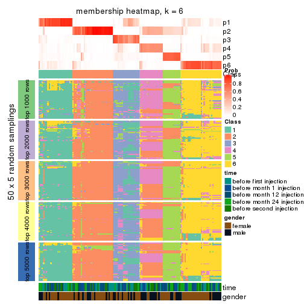</p>

</div>
</div>

As soon as we have had the classes for columns, we can look for signatures
which are significantly different between classes which can be candidate marks
for certain classes. Following are the heatmaps for signatures.


Signature heatmaps where rows are scaled:


<script>
$( function() {
	$( '#tabs-SD-kmeans-get-signatures' ).tabs();
} );
</script>
<div id='tabs-SD-kmeans-get-signatures'>
<ul>
<li><a href='#tab-SD-kmeans-get-signatures-1'>k = 2</a></li>
<li><a href='#tab-SD-kmeans-get-signatures-2'>k = 3</a></li>
<li><a href='#tab-SD-kmeans-get-signatures-3'>k = 4</a></li>
<li><a href='#tab-SD-kmeans-get-signatures-4'>k = 5</a></li>
<li><a href='#tab-SD-kmeans-get-signatures-5'>k = 6</a></li>
</ul>
<div id='tab-SD-kmeans-get-signatures-1'>
<pre><code class="r">get_signatures(res, k = 2)
</code></pre>

<p></p>

</div>
<div id='tab-SD-kmeans-get-signatures-2'>
<pre><code class="r">get_signatures(res, k = 3)
</code></pre>

<p></p>

</div>
<div id='tab-SD-kmeans-get-signatures-3'>
<pre><code class="r">get_signatures(res, k = 4)
</code></pre>

<p></p>

</div>
<div id='tab-SD-kmeans-get-signatures-4'>
<pre><code class="r">get_signatures(res, k = 5)
</code></pre>

<p></p>

</div>
<div id='tab-SD-kmeans-get-signatures-5'>
<pre><code class="r">get_signatures(res, k = 6)
</code></pre>

<p>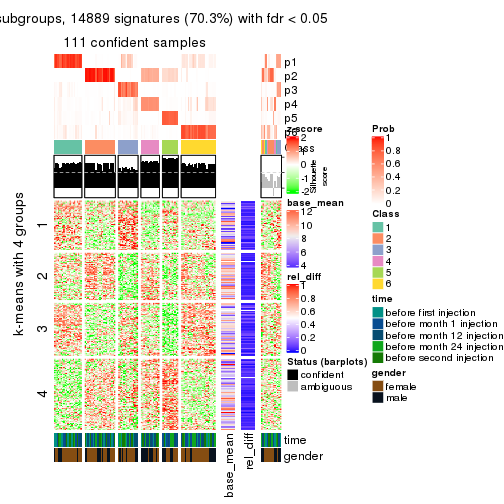</p>

</div>
</div>


Signature heatmaps where rows are not scaled:


<script>
$( function() {
	$( '#tabs-SD-kmeans-get-signatures-no-scale' ).tabs();
} );
</script>
<div id='tabs-SD-kmeans-get-signatures-no-scale'>
<ul>
<li><a href='#tab-SD-kmeans-get-signatures-no-scale-1'>k = 2</a></li>
<li><a href='#tab-SD-kmeans-get-signatures-no-scale-2'>k = 3</a></li>
<li><a href='#tab-SD-kmeans-get-signatures-no-scale-3'>k = 4</a></li>
<li><a href='#tab-SD-kmeans-get-signatures-no-scale-4'>k = 5</a></li>
<li><a href='#tab-SD-kmeans-get-signatures-no-scale-5'>k = 6</a></li>
</ul>
<div id='tab-SD-kmeans-get-signatures-no-scale-1'>
<pre><code class="r">get_signatures(res, k = 2, scale_rows = FALSE)
</code></pre>

<p></p>

</div>
<div id='tab-SD-kmeans-get-signatures-no-scale-2'>
<pre><code class="r">get_signatures(res, k = 3, scale_rows = FALSE)
</code></pre>

<p></p>

</div>
<div id='tab-SD-kmeans-get-signatures-no-scale-3'>
<pre><code class="r">get_signatures(res, k = 4, scale_rows = FALSE)
</code></pre>

<p></p>

</div>
<div id='tab-SD-kmeans-get-signatures-no-scale-4'>
<pre><code class="r">get_signatures(res, k = 5, scale_rows = FALSE)
</code></pre>

<p></p>

</div>
<div id='tab-SD-kmeans-get-signatures-no-scale-5'>
<pre><code class="r">get_signatures(res, k = 6, scale_rows = FALSE)
</code></pre>

<p>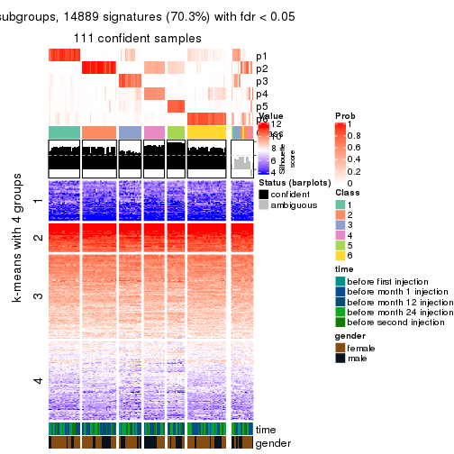</p>

</div>
</div>


Compare the overlap of signatures from different k:

```r
compare_signatures(res)
```


`get_signature()` returns a data frame invisibly. TO get the list of signatures, the function
call should be assigned to a variable explicitly. In following code, if `plot` argument is set
to `FALSE`, no heatmap is plotted while only the differential analysis is performed.

```r
# code only for demonstration
tb = get_signature(res, k = ..., plot = FALSE)
```

An example of the output of `tb` is:

```
#>   which_row         fdr    mean_1    mean_2 scaled_mean_1 scaled_mean_2 km
#> 1        38 0.042760348  8.373488  9.131774    -0.5533452     0.5164555  1
#> 2        40 0.018707592  7.106213  8.469186    -0.6173731     0.5762149  1
#> 3        55 0.019134737 10.221463 11.207825    -0.6159697     0.5749050  1
#> 4        59 0.006059896  5.921854  7.869574    -0.6899429     0.6439467  1
#> 5        60 0.018055526  8.928898 10.211722    -0.6204761     0.5791110  1
#> 6        98 0.009384629 15.714769 14.887706     0.6635654    -0.6193277  2
...
```

The columns in `tb` are:

1. `which_row`: row indices corresponding to the input matrix.
2. `fdr`: FDR for the differential test. 
3. `mean_x`: The mean value in group x.
4. `scaled_mean_x`: The mean value in group x after rows are scaled.
5. `km`: Row groups if k-means clustering is applied to rows.


UMAP plot which shows how samples are separated.


<script>
$( function() {
	$( '#tabs-SD-kmeans-dimension-reduction' ).tabs();
} );
</script>
<div id='tabs-SD-kmeans-dimension-reduction'>
<ul>
<li><a href='#tab-SD-kmeans-dimension-reduction-1'>k = 2</a></li>
<li><a href='#tab-SD-kmeans-dimension-reduction-2'>k = 3</a></li>
<li><a href='#tab-SD-kmeans-dimension-reduction-3'>k = 4</a></li>
<li><a href='#tab-SD-kmeans-dimension-reduction-4'>k = 5</a></li>
<li><a href='#tab-SD-kmeans-dimension-reduction-5'>k = 6</a></li>
</ul>
<div id='tab-SD-kmeans-dimension-reduction-1'>
<pre><code class="r">dimension_reduction(res, k = 2, method = &quot;UMAP&quot;)
</code></pre>

<p></p>

</div>
<div id='tab-SD-kmeans-dimension-reduction-2'>
<pre><code class="r">dimension_reduction(res, k = 3, method = &quot;UMAP&quot;)
</code></pre>

<p></p>

</div>
<div id='tab-SD-kmeans-dimension-reduction-3'>
<pre><code class="r">dimension_reduction(res, k = 4, method = &quot;UMAP&quot;)
</code></pre>

<p></p>

</div>
<div id='tab-SD-kmeans-dimension-reduction-4'>
<pre><code class="r">dimension_reduction(res, k = 5, method = &quot;UMAP&quot;)
</code></pre>

<p></p>

</div>
<div id='tab-SD-kmeans-dimension-reduction-5'>
<pre><code class="r">dimension_reduction(res, k = 6, method = &quot;UMAP&quot;)
</code></pre>

<p></p>

</div>
</div>


Following heatmap shows how subgroups are split when increasing `k`:

```r
collect_classes(res)
```


Test correlation between subgroups and known annotations. If the known
annotation is numeric, one-way ANOVA test is applied, and if the known
annotation is discrete, chi-squared contingency table test is applied.

```r
test_to_known_factors(res)
```

```
#>             n time(p) gender(p) k
#> SD:kmeans 118   0.689     0.130 2
#> SD:kmeans  89   0.245     0.524 3
#> SD:kmeans  80   0.667     0.184 4
#> SD:kmeans 114   0.232     0.430 5
#> SD:kmeans 111   0.771     0.191 6
```


If matrix rows can be associated to genes, consider to use `GO_Enrichment(res,
...)` to perform function enrichment for the signature genes.


 

---------------------------------------------------


### SD:skmeans*


The object with results only for a single top-value method and a single partition method 
can be extracted as:

```r
res = res_list["SD", "skmeans"]
# you can also extract it by
# res = res_list["SD:skmeans"]
```

A summary of `res` and all the functions that can be applied to it:

```r
res
```

```
#> A 'ConsensusPartition' object with k = 2, 3, 4, 5, 6.
#>   On a matrix with 21168 rows and 125 columns.
#>   Top rows (1000, 2000, 3000, 4000, 5000) are extracted by 'SD' method.
#>   Subgroups are detected by 'skmeans' method.
#>   Performed in total 1250 partitions by row resampling.
#>   Best k for subgroups seems to be 2.
#> 
#> Following methods can be applied to this 'ConsensusPartition' object:
#>  [1] "cola_report"             "collect_classes"         "collect_plots"          
#>  [4] "collect_stats"           "colnames"                "compare_signatures"     
#>  [7] "consensus_heatmap"       "dimension_reduction"     "functional_enrichment"  
#> [10] "get_anno_col"            "get_anno"                "get_classes"            
#> [13] "get_consensus"           "get_matrix"              "get_membership"         
#> [16] "get_param"               "get_signatures"          "get_stats"              
#> [19] "is_best_k"               "is_stable_k"             "membership_heatmap"     
#> [22] "ncol"                    "nrow"                    "plot_ecdf"              
#> [25] "rownames"                "select_partition_number" "show"                   
#> [28] "suggest_best_k"          "test_to_known_factors"
```

`collect_plots()` function collects all the plots made from `res` for all `k` (number of partitions)
into one single page to provide an easy and fast comparison between different `k`.

```r
collect_plots(res)
```


The plots are:

- The first row: a plot of the ECDF (Empirical cumulative distribution
  function) curves of the consensus matrix for each `k` and the heatmap of
  predicted classes for each `k`.
- The second row: heatmaps of the consensus matrix for each `k`.
- The third row: heatmaps of the membership matrix for each `k`.
- The fouth row: heatmaps of the signatures for each `k`.

All the plots in panels can be made by individual functions and they are
plotted later in this section.

`select_partition_number()` produces several plots showing different
statistics for choosing "optimized" `k`. There are following statistics:

- ECDF curves of the consensus matrix for each `k`;
- 1-PAC. [The PAC
  score](https://en.wikipedia.org/wiki/Consensus_clustering#Over-interpretation_potential_of_consensus_clustering)
  measures the proportion of the ambiguous subgrouping.
- Mean silhouette score.
- Concordance. The mean probability of fiting the consensus class ids in all
  partitions.
- Area increased. Denote $A_k$ as the area under the ECDF curve for current
  `k`, the area increased is defined as $A_k - A_{k-1}$.
- Rand index. The percent of pairs of samples that are both in a same cluster
  or both are not in a same cluster in the partition of k and k-1.
- Jaccard index. The ratio of pairs of samples are both in a same cluster in
  the partition of k and k-1 and the pairs of samples are both in a same
  cluster in the partition k or k-1.

The detailed explanations of these statistics can be found in [the cola
vignette](http://bioconductor.org/packages/devel/bioc/vignettes/cola/inst/doc/cola.html#toc_13).

Generally speaking, lower PAC score, higher mean silhouette score or higher
concordance corresponds to better partition. Rand index and Jaccard index
measure how similar the current partition is compared to partition with `k-1`.
If they are too similar, we won't accept `k` is better than `k-1`.

```r
select_partition_number(res)
```


The numeric values for all these statistics can be obtained by `get_stats()`.

```r
get_stats(res)
```

```
#>   k 1-PAC mean_silhouette concordance area_increased  Rand Jaccard
#> 2 2 0.900           0.927       0.970         0.5039 0.496   0.496
#> 3 3 0.591           0.754       0.861         0.3054 0.781   0.586
#> 4 4 0.525           0.616       0.780         0.1274 0.855   0.609
#> 5 5 0.564           0.510       0.704         0.0645 0.948   0.806
#> 6 6 0.588           0.437       0.637         0.0410 0.926   0.710
```

`suggest_best_k()` suggests the best $k$ based on these statistics. The rules are as follows:

- All $k$ with Jaccard index larger than 0.95 are removed because the increase of
  the partition number does not provides enough extra information. If all $k$ are removed,
  the best $k$ is assigned by `NA`.
- For $k$ with 1-PAC larger than 0.9, the maximal $k$ is taken as the "best k". Other $k$ is called "optional k".
- If it does not fit the second rule. The $k$ with the highest vote of highest
  1-PAC, mean silhouette and concordance is taken as the "best k".

```r
suggest_best_k(res)
```

```
#> [1] 2
```


Following shows the table of the partitions (You need to click the **show/hide
code output** link to see it). The membership matrix (columns with name `p*`)
is inferred by
[`clue::cl_consensus()`](https://www.rdocumentation.org/link/cl_consensus?package=clue)
function with the `SE` method. Basically the value in the membership matrix
represents the probability to belong to a certain group. The finall class
label for an item is determined with the group with highest probability it
belongs to.

In `get_classes()` function, the entropy is calculated from the membership
matrix and the silhouette score is calculated from the consensus matrix.


<script>
$( function() {
	$( '#tabs-SD-skmeans-get-classes' ).tabs();
} );
</script>
<div id='tabs-SD-skmeans-get-classes'>
<ul>
<li><a href='#tab-SD-skmeans-get-classes-1'>k = 2</a></li>
<li><a href='#tab-SD-skmeans-get-classes-2'>k = 3</a></li>
<li><a href='#tab-SD-skmeans-get-classes-3'>k = 4</a></li>
<li><a href='#tab-SD-skmeans-get-classes-4'>k = 5</a></li>
<li><a href='#tab-SD-skmeans-get-classes-5'>k = 6</a></li>
</ul>

<div id='tab-SD-skmeans-get-classes-1'>
<p><a id='tab-SD-skmeans-get-classes-1-a' style='color:#0366d6' href='#'>show/hide code output</a></p>
<pre><code class="r">cbind(get_classes(res, k = 2), get_membership(res, k = 2))
</code></pre>

<pre><code>#&gt;           class entropy silhouette    p1    p2
#&gt; GSM601752     2  0.0000      0.963 0.000 1.000
#&gt; GSM601782     1  0.0000      0.972 1.000 0.000
#&gt; GSM601792     1  0.0000      0.972 1.000 0.000
#&gt; GSM601797     2  0.9460      0.436 0.364 0.636
#&gt; GSM601827     1  0.0000      0.972 1.000 0.000
#&gt; GSM601837     2  0.0000      0.963 0.000 1.000
#&gt; GSM601842     2  0.0000      0.963 0.000 1.000
#&gt; GSM601857     1  0.0000      0.972 1.000 0.000
#&gt; GSM601867     2  0.8443      0.629 0.272 0.728
#&gt; GSM601747     1  0.0000      0.972 1.000 0.000
#&gt; GSM601757     1  0.0000      0.972 1.000 0.000
#&gt; GSM601762     2  0.0000      0.963 0.000 1.000
#&gt; GSM601767     2  0.0000      0.963 0.000 1.000
#&gt; GSM601772     2  0.0000      0.963 0.000 1.000
#&gt; GSM601777     1  0.5178      0.854 0.884 0.116
#&gt; GSM601787     2  0.1184      0.952 0.016 0.984
#&gt; GSM601802     2  0.0000      0.963 0.000 1.000
#&gt; GSM601807     1  0.9635      0.357 0.612 0.388
#&gt; GSM601812     1  0.0000      0.972 1.000 0.000
#&gt; GSM601817     1  0.0000      0.972 1.000 0.000
#&gt; GSM601822     1  0.5946      0.816 0.856 0.144
#&gt; GSM601832     2  0.0000      0.963 0.000 1.000
#&gt; GSM601847     2  0.3431      0.910 0.064 0.936
#&gt; GSM601852     1  0.0000      0.972 1.000 0.000
#&gt; GSM601862     1  0.0000      0.972 1.000 0.000
#&gt; GSM601753     2  0.0000      0.963 0.000 1.000
#&gt; GSM601783     1  0.0000      0.972 1.000 0.000
#&gt; GSM601793     1  0.0000      0.972 1.000 0.000
#&gt; GSM601798     2  0.0000      0.963 0.000 1.000
#&gt; GSM601828     1  0.0000      0.972 1.000 0.000
#&gt; GSM601838     2  0.0000      0.963 0.000 1.000
#&gt; GSM601843     2  0.0000      0.963 0.000 1.000
#&gt; GSM601858     2  0.0000      0.963 0.000 1.000
#&gt; GSM601868     1  0.0000      0.972 1.000 0.000
#&gt; GSM601748     1  0.0000      0.972 1.000 0.000
#&gt; GSM601758     1  0.0000      0.972 1.000 0.000
#&gt; GSM601763     1  0.9933      0.137 0.548 0.452
#&gt; GSM601768     2  0.0000      0.963 0.000 1.000
#&gt; GSM601773     2  0.0000      0.963 0.000 1.000
#&gt; GSM601778     1  0.0000      0.972 1.000 0.000
#&gt; GSM601788     2  0.0376      0.960 0.004 0.996
#&gt; GSM601803     2  0.0000      0.963 0.000 1.000
#&gt; GSM601808     1  0.0000      0.972 1.000 0.000
#&gt; GSM601813     1  0.0000      0.972 1.000 0.000
#&gt; GSM601818     1  0.0000      0.972 1.000 0.000
#&gt; GSM601823     1  0.0000      0.972 1.000 0.000
#&gt; GSM601833     2  0.0000      0.963 0.000 1.000
#&gt; GSM601848     1  0.0000      0.972 1.000 0.000
#&gt; GSM601853     1  0.0000      0.972 1.000 0.000
#&gt; GSM601863     1  0.0000      0.972 1.000 0.000
#&gt; GSM601754     2  0.0000      0.963 0.000 1.000
#&gt; GSM601784     2  0.0000      0.963 0.000 1.000
#&gt; GSM601794     1  0.0000      0.972 1.000 0.000
#&gt; GSM601799     2  0.0000      0.963 0.000 1.000
#&gt; GSM601829     1  0.0000      0.972 1.000 0.000
#&gt; GSM601839     2  0.0000      0.963 0.000 1.000
#&gt; GSM601844     1  0.0000      0.972 1.000 0.000
#&gt; GSM601859     2  0.0000      0.963 0.000 1.000
#&gt; GSM601869     1  0.0000      0.972 1.000 0.000
#&gt; GSM601749     1  0.0000      0.972 1.000 0.000
#&gt; GSM601759     1  0.0000      0.972 1.000 0.000
#&gt; GSM601764     1  0.0000      0.972 1.000 0.000
#&gt; GSM601769     2  0.0000      0.963 0.000 1.000
#&gt; GSM601774     2  0.0000      0.963 0.000 1.000
#&gt; GSM601779     1  0.0000      0.972 1.000 0.000
#&gt; GSM601789     2  0.0000      0.963 0.000 1.000
#&gt; GSM601804     2  0.1843      0.942 0.028 0.972
#&gt; GSM601809     1  0.0938      0.962 0.988 0.012
#&gt; GSM601814     2  0.0000      0.963 0.000 1.000
#&gt; GSM601819     1  0.0000      0.972 1.000 0.000
#&gt; GSM601824     2  0.9661      0.372 0.392 0.608
#&gt; GSM601834     2  0.0000      0.963 0.000 1.000
#&gt; GSM601849     1  0.0000      0.972 1.000 0.000
#&gt; GSM601854     1  0.0000      0.972 1.000 0.000
#&gt; GSM601864     2  0.0000      0.963 0.000 1.000
#&gt; GSM601755     2  0.0000      0.963 0.000 1.000
#&gt; GSM601785     2  0.0000      0.963 0.000 1.000
#&gt; GSM601795     1  0.0000      0.972 1.000 0.000
#&gt; GSM601800     2  0.0000      0.963 0.000 1.000
#&gt; GSM601830     1  0.5294      0.847 0.880 0.120
#&gt; GSM601840     2  0.0000      0.963 0.000 1.000
#&gt; GSM601845     2  0.7453      0.733 0.212 0.788
#&gt; GSM601860     2  0.0000      0.963 0.000 1.000
#&gt; GSM601870     1  0.9710      0.324 0.600 0.400
#&gt; GSM601750     1  0.0000      0.972 1.000 0.000
#&gt; GSM601760     1  0.0000      0.972 1.000 0.000
#&gt; GSM601765     2  0.0000      0.963 0.000 1.000
#&gt; GSM601770     2  0.0000      0.963 0.000 1.000
#&gt; GSM601775     2  0.8144      0.669 0.252 0.748
#&gt; GSM601780     1  0.0000      0.972 1.000 0.000
#&gt; GSM601790     2  0.0000      0.963 0.000 1.000
#&gt; GSM601805     2  0.0000      0.963 0.000 1.000
#&gt; GSM601810     1  0.0000      0.972 1.000 0.000
#&gt; GSM601815     2  0.0000      0.963 0.000 1.000
#&gt; GSM601820     1  0.0000      0.972 1.000 0.000
#&gt; GSM601825     2  0.0000      0.963 0.000 1.000
#&gt; GSM601835     2  0.0000      0.963 0.000 1.000
#&gt; GSM601850     1  0.0376      0.969 0.996 0.004
#&gt; GSM601855     1  0.0000      0.972 1.000 0.000
#&gt; GSM601865     2  0.0000      0.963 0.000 1.000
#&gt; GSM601756     2  0.0000      0.963 0.000 1.000
#&gt; GSM601786     2  0.0000      0.963 0.000 1.000
#&gt; GSM601796     1  0.0000      0.972 1.000 0.000
#&gt; GSM601801     2  0.0000      0.963 0.000 1.000
#&gt; GSM601831     1  0.0000      0.972 1.000 0.000
#&gt; GSM601841     1  0.0000      0.972 1.000 0.000
#&gt; GSM601846     2  0.1184      0.952 0.016 0.984
#&gt; GSM601861     2  0.0000      0.963 0.000 1.000
#&gt; GSM601871     2  0.4815      0.868 0.104 0.896
#&gt; GSM601751     2  0.4161      0.890 0.084 0.916
#&gt; GSM601761     1  0.0000      0.972 1.000 0.000
#&gt; GSM601766     2  0.8763      0.590 0.296 0.704
#&gt; GSM601771     2  0.0000      0.963 0.000 1.000
#&gt; GSM601776     1  0.0000      0.972 1.000 0.000
#&gt; GSM601781     1  0.0376      0.969 0.996 0.004
#&gt; GSM601791     1  0.0000      0.972 1.000 0.000
#&gt; GSM601806     2  0.0000      0.963 0.000 1.000
#&gt; GSM601811     1  0.0000      0.972 1.000 0.000
#&gt; GSM601816     1  0.0000      0.972 1.000 0.000
#&gt; GSM601821     2  0.0000      0.963 0.000 1.000
#&gt; GSM601826     1  0.0000      0.972 1.000 0.000
#&gt; GSM601836     1  0.0000      0.972 1.000 0.000
#&gt; GSM601851     1  0.0000      0.972 1.000 0.000
#&gt; GSM601856     1  0.0000      0.972 1.000 0.000
#&gt; GSM601866     1  0.0000      0.972 1.000 0.000
</code></pre>

<script>
$('#tab-SD-skmeans-get-classes-1-a').parent().next().next().hide();
$('#tab-SD-skmeans-get-classes-1-a').click(function(){
  $('#tab-SD-skmeans-get-classes-1-a').parent().next().next().toggle();
  return(false);
});
</script>
</div>

<div id='tab-SD-skmeans-get-classes-2'>
<p><a id='tab-SD-skmeans-get-classes-2-a' style='color:#0366d6' href='#'>show/hide code output</a></p>
<pre><code class="r">cbind(get_classes(res, k = 3), get_membership(res, k = 3))
</code></pre>

<pre><code>#&gt;           class entropy silhouette    p1    p2    p3
#&gt; GSM601752     2  0.5291    0.74446 0.268 0.732 0.000
#&gt; GSM601782     3  0.2711    0.80606 0.088 0.000 0.912
#&gt; GSM601792     1  0.1860    0.78391 0.948 0.000 0.052
#&gt; GSM601797     1  0.8821    0.38155 0.580 0.188 0.232
#&gt; GSM601827     3  0.4002    0.75907 0.160 0.000 0.840
#&gt; GSM601837     2  0.0237    0.91416 0.004 0.996 0.000
#&gt; GSM601842     2  0.0237    0.91416 0.004 0.996 0.000
#&gt; GSM601857     3  0.0424    0.81737 0.008 0.000 0.992
#&gt; GSM601867     3  0.4465    0.66230 0.004 0.176 0.820
#&gt; GSM601747     3  0.5318    0.71409 0.204 0.016 0.780
#&gt; GSM601757     3  0.3619    0.78195 0.136 0.000 0.864
#&gt; GSM601762     2  0.0237    0.91416 0.004 0.996 0.000
#&gt; GSM601767     2  0.0000    0.91466 0.000 1.000 0.000
#&gt; GSM601772     2  0.0000    0.91466 0.000 1.000 0.000
#&gt; GSM601777     1  0.7487    0.22462 0.552 0.040 0.408
#&gt; GSM601787     3  0.5378    0.59308 0.008 0.236 0.756
#&gt; GSM601802     2  0.3941    0.85118 0.156 0.844 0.000
#&gt; GSM601807     3  0.4914    0.69942 0.088 0.068 0.844
#&gt; GSM601812     3  0.2537    0.80972 0.080 0.000 0.920
#&gt; GSM601817     3  0.1643    0.81828 0.044 0.000 0.956
#&gt; GSM601822     1  0.1585    0.76096 0.964 0.008 0.028
#&gt; GSM601832     2  0.0237    0.91411 0.004 0.996 0.000
#&gt; GSM601847     1  0.4345    0.64371 0.848 0.136 0.016
#&gt; GSM601852     3  0.4346    0.74091 0.184 0.000 0.816
#&gt; GSM601862     3  0.0237    0.81616 0.004 0.000 0.996
#&gt; GSM601753     2  0.4002    0.84871 0.160 0.840 0.000
#&gt; GSM601783     3  0.6045    0.40077 0.380 0.000 0.620
#&gt; GSM601793     1  0.2959    0.78893 0.900 0.000 0.100
#&gt; GSM601798     2  0.3941    0.85118 0.156 0.844 0.000
#&gt; GSM601828     3  0.3412    0.78773 0.124 0.000 0.876
#&gt; GSM601838     2  0.0237    0.91416 0.004 0.996 0.000
#&gt; GSM601843     2  0.0237    0.91416 0.004 0.996 0.000
#&gt; GSM601858     2  0.1129    0.90382 0.004 0.976 0.020
#&gt; GSM601868     3  0.0000    0.81559 0.000 0.000 1.000
#&gt; GSM601748     3  0.3116    0.79734 0.108 0.000 0.892
#&gt; GSM601758     3  0.6235    0.23143 0.436 0.000 0.564
#&gt; GSM601763     1  0.4164    0.79431 0.848 0.008 0.144
#&gt; GSM601768     2  0.0000    0.91466 0.000 1.000 0.000
#&gt; GSM601773     2  0.0000    0.91466 0.000 1.000 0.000
#&gt; GSM601778     1  0.3941    0.72617 0.844 0.000 0.156
#&gt; GSM601788     2  0.4194    0.86510 0.060 0.876 0.064
#&gt; GSM601803     2  0.3879    0.85373 0.152 0.848 0.000
#&gt; GSM601808     3  0.0000    0.81559 0.000 0.000 1.000
#&gt; GSM601813     3  0.5363    0.62179 0.276 0.000 0.724
#&gt; GSM601818     3  0.1031    0.81920 0.024 0.000 0.976
#&gt; GSM601823     1  0.3752    0.79469 0.856 0.000 0.144
#&gt; GSM601833     2  0.0000    0.91466 0.000 1.000 0.000
#&gt; GSM601848     1  0.3816    0.79376 0.852 0.000 0.148
#&gt; GSM601853     3  0.0000    0.81559 0.000 0.000 1.000
#&gt; GSM601863     3  0.0747    0.81902 0.016 0.000 0.984
#&gt; GSM601754     2  0.4887    0.78965 0.228 0.772 0.000
#&gt; GSM601784     2  0.0000    0.91466 0.000 1.000 0.000
#&gt; GSM601794     1  0.2261    0.78094 0.932 0.000 0.068
#&gt; GSM601799     2  0.5706    0.67023 0.320 0.680 0.000
#&gt; GSM601829     1  0.6140    0.44113 0.596 0.000 0.404
#&gt; GSM601839     2  0.0237    0.91416 0.004 0.996 0.000
#&gt; GSM601844     1  0.4750    0.73682 0.784 0.000 0.216
#&gt; GSM601859     2  0.0000    0.91466 0.000 1.000 0.000
#&gt; GSM601869     3  0.0892    0.81965 0.020 0.000 0.980
#&gt; GSM601749     3  0.6215    0.25560 0.428 0.000 0.572
#&gt; GSM601759     3  0.5785    0.51896 0.332 0.000 0.668
#&gt; GSM601764     1  0.4110    0.79148 0.844 0.004 0.152
#&gt; GSM601769     2  0.0000    0.91466 0.000 1.000 0.000
#&gt; GSM601774     2  0.0000    0.91466 0.000 1.000 0.000
#&gt; GSM601779     1  0.3619    0.79602 0.864 0.000 0.136
#&gt; GSM601789     2  0.0237    0.91416 0.004 0.996 0.000
#&gt; GSM601804     1  0.3340    0.66545 0.880 0.120 0.000
#&gt; GSM601809     3  0.1751    0.81649 0.028 0.012 0.960
#&gt; GSM601814     2  0.0000    0.91466 0.000 1.000 0.000
#&gt; GSM601819     1  0.6308    0.03057 0.508 0.000 0.492
#&gt; GSM601824     1  0.1774    0.76670 0.960 0.016 0.024
#&gt; GSM601834     2  0.0000    0.91466 0.000 1.000 0.000
#&gt; GSM601849     1  0.4002    0.78703 0.840 0.000 0.160
#&gt; GSM601854     3  0.4974    0.67982 0.236 0.000 0.764
#&gt; GSM601864     2  0.0237    0.91416 0.004 0.996 0.000
#&gt; GSM601755     2  0.3879    0.85373 0.152 0.848 0.000
#&gt; GSM601785     2  0.0592    0.91235 0.012 0.988 0.000
#&gt; GSM601795     1  0.0592    0.75687 0.988 0.000 0.012
#&gt; GSM601800     2  0.3941    0.85118 0.156 0.844 0.000
#&gt; GSM601830     3  0.3234    0.75458 0.020 0.072 0.908
#&gt; GSM601840     2  0.6231    0.74237 0.080 0.772 0.148
#&gt; GSM601845     2  0.9030    0.00375 0.388 0.476 0.136
#&gt; GSM601860     2  0.0424    0.91211 0.008 0.992 0.000
#&gt; GSM601870     3  0.4110    0.68478 0.004 0.152 0.844
#&gt; GSM601750     3  0.4346    0.74243 0.184 0.000 0.816
#&gt; GSM601760     1  0.6274    0.18103 0.544 0.000 0.456
#&gt; GSM601765     2  0.0000    0.91466 0.000 1.000 0.000
#&gt; GSM601770     2  0.0000    0.91466 0.000 1.000 0.000
#&gt; GSM601775     2  0.6935    0.52019 0.372 0.604 0.024
#&gt; GSM601780     1  0.3816    0.79361 0.852 0.000 0.148
#&gt; GSM601790     2  0.0237    0.91416 0.004 0.996 0.000
#&gt; GSM601805     2  0.3879    0.85373 0.152 0.848 0.000
#&gt; GSM601810     3  0.0000    0.81559 0.000 0.000 1.000
#&gt; GSM601815     2  0.0237    0.91416 0.004 0.996 0.000
#&gt; GSM601820     3  0.5621    0.56412 0.308 0.000 0.692
#&gt; GSM601825     2  0.3551    0.86410 0.132 0.868 0.000
#&gt; GSM601835     2  0.0424    0.91418 0.008 0.992 0.000
#&gt; GSM601850     1  0.2066    0.78585 0.940 0.000 0.060
#&gt; GSM601855     3  0.1620    0.79862 0.024 0.012 0.964
#&gt; GSM601865     2  0.0237    0.91416 0.004 0.996 0.000
#&gt; GSM601756     2  0.3879    0.85373 0.152 0.848 0.000
#&gt; GSM601786     2  0.0237    0.91416 0.004 0.996 0.000
#&gt; GSM601796     1  0.2711    0.78751 0.912 0.000 0.088
#&gt; GSM601801     2  0.3879    0.85373 0.152 0.848 0.000
#&gt; GSM601831     3  0.1289    0.81912 0.032 0.000 0.968
#&gt; GSM601841     3  0.5733    0.49719 0.324 0.000 0.676
#&gt; GSM601846     1  0.8499    0.05747 0.516 0.388 0.096
#&gt; GSM601861     2  0.0000    0.91466 0.000 1.000 0.000
#&gt; GSM601871     3  0.5517    0.55145 0.004 0.268 0.728
#&gt; GSM601751     2  0.5020    0.80978 0.192 0.796 0.012
#&gt; GSM601761     1  0.4178    0.77885 0.828 0.000 0.172
#&gt; GSM601766     2  0.8310    0.00315 0.420 0.500 0.080
#&gt; GSM601771     2  0.0592    0.91229 0.012 0.988 0.000
#&gt; GSM601776     1  0.3941    0.79026 0.844 0.000 0.156
#&gt; GSM601781     1  0.2772    0.77264 0.916 0.004 0.080
#&gt; GSM601791     1  0.4121    0.78205 0.832 0.000 0.168
#&gt; GSM601806     2  0.3619    0.86237 0.136 0.864 0.000
#&gt; GSM601811     3  0.0000    0.81559 0.000 0.000 1.000
#&gt; GSM601816     1  0.3551    0.79710 0.868 0.000 0.132
#&gt; GSM601821     2  0.0000    0.91466 0.000 1.000 0.000
#&gt; GSM601826     1  0.3941    0.78967 0.844 0.000 0.156
#&gt; GSM601836     1  0.6345    0.43145 0.596 0.004 0.400
#&gt; GSM601851     1  0.3941    0.78996 0.844 0.000 0.156
#&gt; GSM601856     3  0.0000    0.81559 0.000 0.000 1.000
#&gt; GSM601866     3  0.2066    0.81534 0.060 0.000 0.940
</code></pre>

<script>
$('#tab-SD-skmeans-get-classes-2-a').parent().next().next().hide();
$('#tab-SD-skmeans-get-classes-2-a').click(function(){
  $('#tab-SD-skmeans-get-classes-2-a').parent().next().next().toggle();
  return(false);
});
</script>
</div>

<div id='tab-SD-skmeans-get-classes-3'>
<p><a id='tab-SD-skmeans-get-classes-3-a' style='color:#0366d6' href='#'>show/hide code output</a></p>
<pre><code class="r">cbind(get_classes(res, k = 4), get_membership(res, k = 4))
</code></pre>

<pre><code>#&gt;           class entropy silhouette    p1    p2    p3    p4
#&gt; GSM601752     4   0.322    0.79618 0.044 0.076 0.000 0.880
#&gt; GSM601782     3   0.499    0.58404 0.288 0.000 0.692 0.020
#&gt; GSM601792     1   0.466    0.63921 0.760 0.000 0.032 0.208
#&gt; GSM601797     4   0.448    0.68238 0.124 0.024 0.032 0.820
#&gt; GSM601827     3   0.509    0.50584 0.348 0.000 0.640 0.012
#&gt; GSM601837     2   0.220    0.82340 0.000 0.928 0.024 0.048
#&gt; GSM601842     2   0.384    0.82095 0.020 0.832 0.004 0.144
#&gt; GSM601857     3   0.234    0.69513 0.080 0.000 0.912 0.008
#&gt; GSM601867     3   0.537    0.52669 0.000 0.188 0.732 0.080
#&gt; GSM601747     3   0.787    0.36565 0.328 0.144 0.500 0.028
#&gt; GSM601757     3   0.472    0.55119 0.324 0.000 0.672 0.004
#&gt; GSM601762     2   0.299    0.84638 0.016 0.880 0.000 0.104
#&gt; GSM601767     2   0.361    0.81972 0.020 0.840 0.000 0.140
#&gt; GSM601772     2   0.292    0.83827 0.016 0.884 0.000 0.100
#&gt; GSM601777     4   0.825    0.21487 0.212 0.024 0.320 0.444
#&gt; GSM601787     3   0.644    0.29107 0.000 0.340 0.576 0.084
#&gt; GSM601802     4   0.310    0.80372 0.012 0.120 0.000 0.868
#&gt; GSM601807     3   0.508    0.56289 0.004 0.100 0.776 0.120
#&gt; GSM601812     3   0.481    0.55957 0.316 0.000 0.676 0.008
#&gt; GSM601817     3   0.402    0.64659 0.224 0.000 0.772 0.004
#&gt; GSM601822     1   0.553    0.19396 0.560 0.000 0.020 0.420
#&gt; GSM601832     2   0.371    0.82050 0.024 0.836 0.000 0.140
#&gt; GSM601847     4   0.492    0.49314 0.284 0.012 0.004 0.700
#&gt; GSM601852     3   0.496    0.45374 0.380 0.000 0.616 0.004
#&gt; GSM601862     3   0.182    0.69539 0.060 0.000 0.936 0.004
#&gt; GSM601753     4   0.305    0.79251 0.004 0.136 0.000 0.860
#&gt; GSM601783     1   0.524   -0.00794 0.556 0.000 0.436 0.008
#&gt; GSM601793     1   0.544    0.64720 0.732 0.000 0.092 0.176
#&gt; GSM601798     4   0.294    0.79930 0.004 0.128 0.000 0.868
#&gt; GSM601828     3   0.466    0.52124 0.348 0.000 0.652 0.000
#&gt; GSM601838     2   0.202    0.82686 0.000 0.936 0.024 0.040
#&gt; GSM601843     2   0.316    0.83777 0.020 0.872 0.000 0.108
#&gt; GSM601858     2   0.319    0.80373 0.004 0.888 0.052 0.056
#&gt; GSM601868     3   0.183    0.69206 0.032 0.000 0.944 0.024
#&gt; GSM601748     3   0.510    0.46768 0.380 0.000 0.612 0.008
#&gt; GSM601758     1   0.502    0.24168 0.632 0.000 0.360 0.008
#&gt; GSM601763     1   0.547    0.61312 0.748 0.052 0.020 0.180
#&gt; GSM601768     2   0.355    0.82540 0.020 0.844 0.000 0.136
#&gt; GSM601773     2   0.339    0.83354 0.016 0.852 0.000 0.132
#&gt; GSM601778     1   0.719    0.34932 0.540 0.004 0.144 0.312
#&gt; GSM601788     2   0.671    0.45500 0.008 0.620 0.112 0.260
#&gt; GSM601803     4   0.307    0.78954 0.000 0.152 0.000 0.848
#&gt; GSM601808     3   0.194    0.68875 0.032 0.000 0.940 0.028
#&gt; GSM601813     3   0.517    0.19093 0.492 0.000 0.504 0.004
#&gt; GSM601818     3   0.349    0.67536 0.172 0.000 0.824 0.004
#&gt; GSM601823     1   0.202    0.70591 0.936 0.000 0.024 0.040
#&gt; GSM601833     2   0.305    0.83821 0.016 0.876 0.000 0.108
#&gt; GSM601848     1   0.182    0.70516 0.944 0.000 0.020 0.036
#&gt; GSM601853     3   0.189    0.69315 0.044 0.000 0.940 0.016
#&gt; GSM601863     3   0.289    0.69026 0.124 0.000 0.872 0.004
#&gt; GSM601754     4   0.329    0.79694 0.044 0.080 0.000 0.876
#&gt; GSM601784     2   0.227    0.84546 0.004 0.912 0.000 0.084
#&gt; GSM601794     1   0.592    0.53803 0.656 0.000 0.072 0.272
#&gt; GSM601799     4   0.331    0.79375 0.036 0.092 0.000 0.872
#&gt; GSM601829     1   0.573    0.36864 0.616 0.000 0.344 0.040
#&gt; GSM601839     2   0.220    0.82326 0.000 0.928 0.024 0.048
#&gt; GSM601844     1   0.373    0.67617 0.848 0.000 0.108 0.044
#&gt; GSM601859     2   0.345    0.81842 0.008 0.836 0.000 0.156
#&gt; GSM601869     3   0.345    0.68355 0.156 0.000 0.836 0.008
#&gt; GSM601749     1   0.492    0.31236 0.656 0.000 0.336 0.008
#&gt; GSM601759     1   0.520    0.06669 0.576 0.000 0.416 0.008
#&gt; GSM601764     1   0.305    0.69050 0.900 0.016 0.056 0.028
#&gt; GSM601769     2   0.205    0.84695 0.008 0.928 0.000 0.064
#&gt; GSM601774     2   0.292    0.83991 0.016 0.884 0.000 0.100
#&gt; GSM601779     1   0.191    0.70591 0.940 0.000 0.020 0.040
#&gt; GSM601789     2   0.163    0.83013 0.000 0.952 0.024 0.024
#&gt; GSM601804     4   0.453    0.59750 0.240 0.016 0.000 0.744
#&gt; GSM601809     3   0.585    0.61028 0.088 0.108 0.756 0.048
#&gt; GSM601814     2   0.247    0.84031 0.000 0.908 0.012 0.080
#&gt; GSM601819     1   0.462    0.42197 0.708 0.000 0.284 0.008
#&gt; GSM601824     1   0.487    0.46561 0.684 0.012 0.000 0.304
#&gt; GSM601834     2   0.287    0.84428 0.012 0.884 0.000 0.104
#&gt; GSM601849     1   0.213    0.70607 0.932 0.000 0.036 0.032
#&gt; GSM601854     3   0.517    0.20449 0.488 0.000 0.508 0.004
#&gt; GSM601864     2   0.244    0.81858 0.000 0.916 0.024 0.060
#&gt; GSM601755     4   0.276    0.79914 0.000 0.128 0.000 0.872
#&gt; GSM601785     2   0.471    0.68841 0.020 0.732 0.000 0.248
#&gt; GSM601795     1   0.560    0.07233 0.504 0.000 0.020 0.476
#&gt; GSM601800     4   0.289    0.80087 0.004 0.124 0.000 0.872
#&gt; GSM601830     3   0.325    0.65388 0.016 0.040 0.892 0.052
#&gt; GSM601840     4   0.839    0.11900 0.044 0.388 0.160 0.408
#&gt; GSM601845     2   0.877    0.23688 0.240 0.484 0.080 0.196
#&gt; GSM601860     2   0.340    0.82591 0.004 0.856 0.012 0.128
#&gt; GSM601870     3   0.476    0.56580 0.000 0.144 0.784 0.072
#&gt; GSM601750     3   0.513    0.32331 0.448 0.000 0.548 0.004
#&gt; GSM601760     1   0.459    0.42796 0.712 0.000 0.280 0.008
#&gt; GSM601765     2   0.327    0.83329 0.024 0.868 0.000 0.108
#&gt; GSM601770     2   0.339    0.83075 0.020 0.856 0.000 0.124
#&gt; GSM601775     4   0.764    0.49920 0.212 0.224 0.016 0.548
#&gt; GSM601780     1   0.183    0.70520 0.944 0.000 0.024 0.032
#&gt; GSM601790     2   0.183    0.82978 0.000 0.944 0.024 0.032
#&gt; GSM601805     4   0.320    0.80012 0.008 0.136 0.000 0.856
#&gt; GSM601810     3   0.191    0.69007 0.040 0.000 0.940 0.020
#&gt; GSM601815     2   0.189    0.83346 0.000 0.940 0.016 0.044
#&gt; GSM601820     1   0.529   -0.13662 0.520 0.000 0.472 0.008
#&gt; GSM601825     4   0.475    0.42346 0.000 0.368 0.000 0.632
#&gt; GSM601835     2   0.439    0.81269 0.020 0.828 0.040 0.112
#&gt; GSM601850     1   0.501    0.62100 0.748 0.004 0.040 0.208
#&gt; GSM601855     3   0.294    0.64324 0.004 0.040 0.900 0.056
#&gt; GSM601865     2   0.260    0.81172 0.000 0.908 0.024 0.068
#&gt; GSM601756     4   0.276    0.79833 0.000 0.128 0.000 0.872
#&gt; GSM601786     2   0.200    0.82698 0.000 0.936 0.020 0.044
#&gt; GSM601796     1   0.603    0.60251 0.668 0.000 0.096 0.236
#&gt; GSM601801     4   0.312    0.78852 0.000 0.156 0.000 0.844
#&gt; GSM601831     3   0.340    0.67708 0.164 0.000 0.832 0.004
#&gt; GSM601841     3   0.551    0.13852 0.484 0.000 0.500 0.016
#&gt; GSM601846     4   0.824    0.51712 0.160 0.152 0.112 0.576
#&gt; GSM601861     2   0.185    0.83681 0.000 0.940 0.012 0.048
#&gt; GSM601871     3   0.646    0.29127 0.000 0.332 0.580 0.088
#&gt; GSM601751     2   0.784   -0.08829 0.096 0.456 0.044 0.404
#&gt; GSM601761     1   0.261    0.66835 0.896 0.000 0.096 0.008
#&gt; GSM601766     2   0.811    0.30127 0.308 0.500 0.040 0.152
#&gt; GSM601771     2   0.472    0.72752 0.008 0.752 0.016 0.224
#&gt; GSM601776     1   0.259    0.68638 0.904 0.000 0.080 0.016
#&gt; GSM601781     1   0.606    0.57952 0.696 0.012 0.084 0.208
#&gt; GSM601791     1   0.214    0.69712 0.928 0.000 0.056 0.016
#&gt; GSM601806     4   0.357    0.75009 0.000 0.196 0.000 0.804
#&gt; GSM601811     3   0.192    0.68714 0.024 0.004 0.944 0.028
#&gt; GSM601816     1   0.240    0.70359 0.920 0.000 0.032 0.048
#&gt; GSM601821     2   0.225    0.83779 0.000 0.920 0.012 0.068
#&gt; GSM601826     1   0.194    0.70547 0.940 0.000 0.028 0.032
#&gt; GSM601836     1   0.654    0.52447 0.672 0.028 0.216 0.084
#&gt; GSM601851     1   0.203    0.70531 0.936 0.000 0.036 0.028
#&gt; GSM601856     3   0.162    0.68964 0.028 0.000 0.952 0.020
#&gt; GSM601866     3   0.469    0.60756 0.276 0.000 0.712 0.012
</code></pre>

<script>
$('#tab-SD-skmeans-get-classes-3-a').parent().next().next().hide();
$('#tab-SD-skmeans-get-classes-3-a').click(function(){
  $('#tab-SD-skmeans-get-classes-3-a').parent().next().next().toggle();
  return(false);
});
</script>
</div>

<div id='tab-SD-skmeans-get-classes-4'>
<p><a id='tab-SD-skmeans-get-classes-4-a' style='color:#0366d6' href='#'>show/hide code output</a></p>
<pre><code class="r">cbind(get_classes(res, k = 5), get_membership(res, k = 5))
</code></pre>

<pre><code>#&gt;           class entropy silhouette    p1    p2    p3    p4    p5
#&gt; GSM601752     4  0.0968    0.76850 0.012 0.012 0.000 0.972 0.004
#&gt; GSM601782     3  0.5149    0.54016 0.216 0.000 0.680 0.000 0.104
#&gt; GSM601792     1  0.5769    0.60182 0.692 0.000 0.048 0.112 0.148
#&gt; GSM601797     4  0.4325    0.65395 0.076 0.000 0.020 0.796 0.108
#&gt; GSM601827     3  0.6291    0.40402 0.280 0.000 0.544 0.004 0.172
#&gt; GSM601837     2  0.2408    0.70289 0.000 0.892 0.000 0.016 0.092
#&gt; GSM601842     2  0.4986    0.63219 0.000 0.688 0.000 0.084 0.228
#&gt; GSM601857     3  0.3687    0.57689 0.028 0.000 0.792 0.000 0.180
#&gt; GSM601867     3  0.6569   -0.10677 0.000 0.156 0.432 0.008 0.404
#&gt; GSM601747     3  0.8012    0.25838 0.216 0.076 0.484 0.024 0.200
#&gt; GSM601757     3  0.5192    0.47639 0.280 0.000 0.644 0.000 0.076
#&gt; GSM601762     2  0.3888    0.71339 0.000 0.800 0.000 0.064 0.136
#&gt; GSM601767     2  0.4237    0.69762 0.000 0.772 0.000 0.076 0.152
#&gt; GSM601772     2  0.4555    0.67317 0.000 0.732 0.000 0.068 0.200
#&gt; GSM601777     4  0.9105   -0.16980 0.188 0.032 0.204 0.296 0.280
#&gt; GSM601787     5  0.7193    0.31964 0.000 0.324 0.288 0.016 0.372
#&gt; GSM601802     4  0.1282    0.77433 0.000 0.044 0.000 0.952 0.004
#&gt; GSM601807     3  0.6131    0.14766 0.000 0.052 0.492 0.036 0.420
#&gt; GSM601812     3  0.4707    0.56508 0.212 0.000 0.716 0.000 0.072
#&gt; GSM601817     3  0.4078    0.59898 0.148 0.000 0.784 0.000 0.068
#&gt; GSM601822     1  0.6504    0.39344 0.584 0.004 0.024 0.248 0.140
#&gt; GSM601832     2  0.5805    0.52407 0.004 0.596 0.000 0.112 0.288
#&gt; GSM601847     4  0.5705    0.42362 0.300 0.008 0.000 0.604 0.088
#&gt; GSM601852     3  0.4836    0.44386 0.304 0.000 0.652 0.000 0.044
#&gt; GSM601862     3  0.3513    0.55863 0.020 0.000 0.800 0.000 0.180
#&gt; GSM601753     4  0.2234    0.75900 0.004 0.044 0.000 0.916 0.036
#&gt; GSM601783     3  0.5405    0.04991 0.460 0.000 0.484 0.000 0.056
#&gt; GSM601793     1  0.6014    0.61290 0.684 0.000 0.088 0.104 0.124
#&gt; GSM601798     4  0.1725    0.77387 0.000 0.044 0.000 0.936 0.020
#&gt; GSM601828     3  0.4795    0.52930 0.224 0.000 0.704 0.000 0.072
#&gt; GSM601838     2  0.2390    0.70541 0.000 0.896 0.000 0.020 0.084
#&gt; GSM601843     2  0.4031    0.69062 0.000 0.772 0.000 0.044 0.184
#&gt; GSM601858     2  0.4477    0.62718 0.000 0.764 0.036 0.024 0.176
#&gt; GSM601868     3  0.3835    0.52417 0.008 0.000 0.732 0.000 0.260
#&gt; GSM601748     3  0.4451    0.50482 0.248 0.000 0.712 0.000 0.040
#&gt; GSM601758     1  0.4878    0.06740 0.536 0.000 0.440 0.000 0.024
#&gt; GSM601763     1  0.8261    0.31189 0.480 0.064 0.100 0.092 0.264
#&gt; GSM601768     2  0.5342    0.61709 0.004 0.664 0.000 0.096 0.236
#&gt; GSM601773     2  0.4123    0.70930 0.000 0.788 0.000 0.108 0.104
#&gt; GSM601778     1  0.7351    0.38269 0.540 0.000 0.108 0.192 0.160
#&gt; GSM601788     2  0.7232    0.16994 0.012 0.528 0.036 0.240 0.184
#&gt; GSM601803     4  0.1768    0.76438 0.000 0.072 0.000 0.924 0.004
#&gt; GSM601808     3  0.3487    0.53520 0.008 0.000 0.780 0.000 0.212
#&gt; GSM601813     3  0.5182    0.24833 0.412 0.000 0.544 0.000 0.044
#&gt; GSM601818     3  0.3758    0.61915 0.096 0.000 0.816 0.000 0.088
#&gt; GSM601823     1  0.1843    0.67033 0.932 0.000 0.008 0.008 0.052
#&gt; GSM601833     2  0.4555    0.67001 0.000 0.732 0.000 0.068 0.200
#&gt; GSM601848     1  0.1267    0.67144 0.960 0.000 0.004 0.012 0.024
#&gt; GSM601853     3  0.3318    0.55732 0.008 0.000 0.800 0.000 0.192
#&gt; GSM601863     3  0.4266    0.61259 0.104 0.000 0.776 0.000 0.120
#&gt; GSM601754     4  0.1721    0.76849 0.016 0.020 0.000 0.944 0.020
#&gt; GSM601784     2  0.2654    0.73519 0.000 0.888 0.000 0.064 0.048
#&gt; GSM601794     1  0.6779    0.52236 0.588 0.000 0.060 0.192 0.160
#&gt; GSM601799     4  0.2747    0.73860 0.036 0.020 0.000 0.896 0.048
#&gt; GSM601829     1  0.6434    0.31352 0.524 0.000 0.276 0.004 0.196
#&gt; GSM601839     2  0.2351    0.70447 0.000 0.896 0.000 0.016 0.088
#&gt; GSM601844     1  0.5708    0.54561 0.660 0.000 0.180 0.012 0.148
#&gt; GSM601859     2  0.4686    0.65783 0.000 0.736 0.000 0.160 0.104
#&gt; GSM601869     3  0.4845    0.60987 0.128 0.000 0.724 0.000 0.148
#&gt; GSM601749     1  0.5088    0.05904 0.528 0.000 0.436 0.000 0.036
#&gt; GSM601759     3  0.4826    0.08070 0.472 0.000 0.508 0.000 0.020
#&gt; GSM601764     1  0.4874    0.62013 0.744 0.008 0.088 0.004 0.156
#&gt; GSM601769     2  0.2067    0.73241 0.000 0.920 0.000 0.032 0.048
#&gt; GSM601774     2  0.3669    0.72018 0.000 0.816 0.000 0.056 0.128
#&gt; GSM601779     1  0.1651    0.67049 0.944 0.000 0.012 0.008 0.036
#&gt; GSM601789     2  0.2338    0.70634 0.000 0.884 0.000 0.004 0.112
#&gt; GSM601804     4  0.3953    0.63054 0.188 0.008 0.000 0.780 0.024
#&gt; GSM601809     3  0.7277    0.37308 0.108 0.100 0.540 0.004 0.248
#&gt; GSM601814     2  0.1942    0.72627 0.000 0.920 0.000 0.068 0.012
#&gt; GSM601819     1  0.5401    0.13341 0.536 0.000 0.404 0.000 0.060
#&gt; GSM601824     1  0.5042    0.54551 0.724 0.012 0.000 0.168 0.096
#&gt; GSM601834     2  0.3437    0.72361 0.000 0.832 0.000 0.048 0.120
#&gt; GSM601849     1  0.2930    0.66663 0.880 0.000 0.076 0.012 0.032
#&gt; GSM601854     3  0.5142    0.28060 0.392 0.000 0.564 0.000 0.044
#&gt; GSM601864     2  0.3209    0.66630 0.000 0.848 0.004 0.028 0.120
#&gt; GSM601755     4  0.1043    0.77427 0.000 0.040 0.000 0.960 0.000
#&gt; GSM601785     2  0.6018    0.52030 0.008 0.612 0.000 0.172 0.208
#&gt; GSM601795     1  0.6776    0.13817 0.424 0.000 0.020 0.408 0.148
#&gt; GSM601800     4  0.1780    0.77216 0.008 0.028 0.000 0.940 0.024
#&gt; GSM601830     3  0.4564    0.39752 0.000 0.016 0.612 0.000 0.372
#&gt; GSM601840     4  0.8935   -0.20518 0.040 0.256 0.112 0.336 0.256
#&gt; GSM601845     5  0.8958    0.30854 0.132 0.256 0.096 0.104 0.412
#&gt; GSM601860     2  0.4825    0.64129 0.020 0.756 0.000 0.092 0.132
#&gt; GSM601870     3  0.5821    0.12210 0.000 0.080 0.492 0.004 0.424
#&gt; GSM601750     3  0.4805    0.43282 0.312 0.000 0.648 0.000 0.040
#&gt; GSM601760     1  0.4865    0.30084 0.616 0.000 0.356 0.008 0.020
#&gt; GSM601765     2  0.4821    0.61109 0.004 0.680 0.000 0.044 0.272
#&gt; GSM601770     2  0.4612    0.68347 0.000 0.736 0.000 0.084 0.180
#&gt; GSM601775     4  0.8737    0.08053 0.140 0.148 0.052 0.440 0.220
#&gt; GSM601780     1  0.1653    0.66989 0.944 0.000 0.024 0.004 0.028
#&gt; GSM601790     2  0.1764    0.71250 0.000 0.928 0.000 0.008 0.064
#&gt; GSM601805     4  0.1809    0.77146 0.000 0.060 0.000 0.928 0.012
#&gt; GSM601810     3  0.3845    0.54314 0.024 0.000 0.768 0.000 0.208
#&gt; GSM601815     2  0.2325    0.70932 0.000 0.904 0.000 0.028 0.068
#&gt; GSM601820     3  0.5159    0.25586 0.400 0.000 0.556 0.000 0.044
#&gt; GSM601825     4  0.5014    0.25833 0.000 0.368 0.000 0.592 0.040
#&gt; GSM601835     2  0.5753    0.46378 0.000 0.584 0.008 0.084 0.324
#&gt; GSM601850     1  0.5661    0.61390 0.720 0.008 0.048 0.108 0.116
#&gt; GSM601855     3  0.4470    0.36812 0.000 0.012 0.616 0.000 0.372
#&gt; GSM601865     2  0.2624    0.68315 0.000 0.872 0.000 0.012 0.116
#&gt; GSM601756     4  0.1043    0.77435 0.000 0.040 0.000 0.960 0.000
#&gt; GSM601786     2  0.2464    0.69648 0.000 0.888 0.000 0.016 0.096
#&gt; GSM601796     1  0.7483    0.51925 0.528 0.000 0.128 0.188 0.156
#&gt; GSM601801     4  0.1942    0.76569 0.000 0.068 0.000 0.920 0.012
#&gt; GSM601831     3  0.4720    0.60501 0.124 0.000 0.736 0.000 0.140
#&gt; GSM601841     1  0.6713    0.00757 0.448 0.000 0.404 0.028 0.120
#&gt; GSM601846     5  0.8655    0.08059 0.104 0.124 0.060 0.312 0.400
#&gt; GSM601861     2  0.1830    0.72027 0.000 0.932 0.000 0.028 0.040
#&gt; GSM601871     5  0.7087    0.30708 0.000 0.296 0.296 0.012 0.396
#&gt; GSM601751     2  0.8386   -0.10192 0.080 0.380 0.036 0.344 0.160
#&gt; GSM601761     1  0.3283    0.63261 0.848 0.000 0.116 0.008 0.028
#&gt; GSM601766     5  0.8619    0.13305 0.192 0.332 0.068 0.052 0.356
#&gt; GSM601771     2  0.6123    0.41598 0.012 0.588 0.000 0.268 0.132
#&gt; GSM601776     1  0.2838    0.66364 0.884 0.000 0.072 0.008 0.036
#&gt; GSM601781     1  0.6960    0.49337 0.584 0.000 0.088 0.176 0.152
#&gt; GSM601791     1  0.3065    0.65916 0.872 0.000 0.072 0.008 0.048
#&gt; GSM601806     4  0.2280    0.73211 0.000 0.120 0.000 0.880 0.000
#&gt; GSM601811     3  0.3855    0.52424 0.008 0.000 0.748 0.004 0.240
#&gt; GSM601816     1  0.2291    0.66927 0.908 0.000 0.012 0.008 0.072
#&gt; GSM601821     2  0.2300    0.71702 0.000 0.908 0.000 0.040 0.052
#&gt; GSM601826     1  0.1329    0.67095 0.956 0.000 0.008 0.004 0.032
#&gt; GSM601836     1  0.8510    0.23618 0.360 0.036 0.256 0.064 0.284
#&gt; GSM601851     1  0.2067    0.66838 0.924 0.000 0.044 0.004 0.028
#&gt; GSM601856     3  0.3534    0.50859 0.000 0.000 0.744 0.000 0.256
#&gt; GSM601866     3  0.4468    0.53261 0.240 0.000 0.716 0.000 0.044
</code></pre>

<script>
$('#tab-SD-skmeans-get-classes-4-a').parent().next().next().hide();
$('#tab-SD-skmeans-get-classes-4-a').click(function(){
  $('#tab-SD-skmeans-get-classes-4-a').parent().next().next().toggle();
  return(false);
});
</script>
</div>

<div id='tab-SD-skmeans-get-classes-5'>
<p><a id='tab-SD-skmeans-get-classes-5-a' style='color:#0366d6' href='#'>show/hide code output</a></p>
<pre><code class="r">cbind(get_classes(res, k = 6), get_membership(res, k = 6))
</code></pre>

<pre><code>#&gt;           class entropy silhouette    p1    p2    p3    p4    p5    p6
#&gt; GSM601752     4  0.1269     0.8113 0.000 0.020 0.012 0.956 0.012 0.000
#&gt; GSM601782     1  0.5740     0.5085 0.648 0.088 0.144 0.000 0.000 0.120
#&gt; GSM601792     6  0.6633     0.6034 0.084 0.108 0.124 0.068 0.000 0.616
#&gt; GSM601797     4  0.4943     0.6863 0.004 0.096 0.112 0.736 0.004 0.048
#&gt; GSM601827     1  0.6278     0.4740 0.580 0.052 0.192 0.008 0.000 0.168
#&gt; GSM601837     5  0.2452     0.5731 0.000 0.028 0.084 0.004 0.884 0.000
#&gt; GSM601842     5  0.5799     0.0872 0.000 0.436 0.040 0.072 0.452 0.000
#&gt; GSM601857     1  0.4267     0.4045 0.692 0.044 0.260 0.000 0.000 0.004
#&gt; GSM601867     3  0.6405     0.5138 0.200 0.036 0.536 0.008 0.220 0.000
#&gt; GSM601747     1  0.8282     0.1840 0.428 0.236 0.144 0.024 0.064 0.104
#&gt; GSM601757     1  0.4879     0.5842 0.692 0.024 0.084 0.000 0.000 0.200
#&gt; GSM601762     5  0.5505     0.3614 0.000 0.320 0.028 0.080 0.572 0.000
#&gt; GSM601767     5  0.5717     0.3238 0.000 0.336 0.028 0.096 0.540 0.000
#&gt; GSM601772     5  0.5558     0.2473 0.000 0.392 0.032 0.064 0.512 0.000
#&gt; GSM601777     3  0.9075     0.0595 0.088 0.124 0.320 0.216 0.040 0.212
#&gt; GSM601787     3  0.6030     0.4156 0.112 0.032 0.452 0.000 0.404 0.000
#&gt; GSM601802     4  0.1924     0.8141 0.000 0.028 0.012 0.928 0.028 0.004
#&gt; GSM601807     3  0.6232     0.4832 0.212 0.036 0.612 0.032 0.104 0.004
#&gt; GSM601812     1  0.5078     0.5845 0.696 0.036 0.144 0.000 0.000 0.124
#&gt; GSM601817     1  0.4832     0.5508 0.724 0.064 0.164 0.004 0.000 0.044
#&gt; GSM601822     6  0.6845     0.4901 0.012 0.140 0.160 0.140 0.000 0.548
#&gt; GSM601832     2  0.5736     0.1810 0.000 0.552 0.032 0.096 0.320 0.000
#&gt; GSM601847     4  0.6893     0.2186 0.000 0.112 0.088 0.460 0.012 0.328
#&gt; GSM601852     1  0.4841     0.6028 0.716 0.048 0.068 0.000 0.000 0.168
#&gt; GSM601862     1  0.3757     0.4116 0.712 0.008 0.272 0.000 0.000 0.008
#&gt; GSM601753     4  0.2556     0.7869 0.000 0.076 0.012 0.884 0.028 0.000
#&gt; GSM601783     1  0.5117     0.4227 0.608 0.024 0.056 0.000 0.000 0.312
#&gt; GSM601793     6  0.7264     0.5543 0.148 0.088 0.132 0.084 0.000 0.548
#&gt; GSM601798     4  0.1622     0.8113 0.000 0.028 0.016 0.940 0.016 0.000
#&gt; GSM601828     1  0.4292     0.6061 0.764 0.024 0.092 0.000 0.000 0.120
#&gt; GSM601838     5  0.1781     0.5823 0.000 0.008 0.060 0.008 0.924 0.000
#&gt; GSM601843     5  0.5185     0.2867 0.000 0.392 0.016 0.056 0.536 0.000
#&gt; GSM601858     5  0.4594     0.5043 0.012 0.152 0.092 0.008 0.736 0.000
#&gt; GSM601868     1  0.4365     0.3314 0.636 0.024 0.332 0.000 0.000 0.008
#&gt; GSM601748     1  0.4176     0.6109 0.772 0.024 0.076 0.000 0.000 0.128
#&gt; GSM601758     1  0.4907     0.2457 0.532 0.024 0.024 0.000 0.000 0.420
#&gt; GSM601763     6  0.7202     0.1772 0.084 0.384 0.056 0.028 0.024 0.424
#&gt; GSM601768     5  0.6126     0.1458 0.000 0.412 0.044 0.088 0.452 0.004
#&gt; GSM601773     5  0.5577     0.4080 0.000 0.256 0.024 0.120 0.600 0.000
#&gt; GSM601778     6  0.7554     0.4340 0.060 0.100 0.156 0.168 0.004 0.512
#&gt; GSM601788     5  0.7879     0.0754 0.024 0.132 0.192 0.160 0.468 0.024
#&gt; GSM601803     4  0.2089     0.8078 0.000 0.020 0.020 0.916 0.044 0.000
#&gt; GSM601808     1  0.4141     0.2714 0.596 0.016 0.388 0.000 0.000 0.000
#&gt; GSM601813     1  0.5650     0.4546 0.580 0.048 0.072 0.000 0.000 0.300
#&gt; GSM601818     1  0.4536     0.5717 0.748 0.044 0.140 0.000 0.000 0.068
#&gt; GSM601823     6  0.3088     0.6617 0.044 0.064 0.032 0.000 0.000 0.860
#&gt; GSM601833     5  0.5272     0.1937 0.000 0.420 0.016 0.060 0.504 0.000
#&gt; GSM601848     6  0.2594     0.6602 0.056 0.036 0.020 0.000 0.000 0.888
#&gt; GSM601853     1  0.4114     0.3055 0.628 0.008 0.356 0.000 0.000 0.008
#&gt; GSM601863     1  0.4913     0.5038 0.680 0.028 0.224 0.000 0.000 0.068
#&gt; GSM601754     4  0.2925     0.7988 0.000 0.048 0.032 0.880 0.024 0.016
#&gt; GSM601784     5  0.4205     0.5458 0.000 0.144 0.032 0.056 0.768 0.000
#&gt; GSM601794     6  0.8008     0.4362 0.072 0.116 0.208 0.176 0.000 0.428
#&gt; GSM601799     4  0.3646     0.7534 0.000 0.092 0.032 0.828 0.008 0.040
#&gt; GSM601829     6  0.7328     0.1680 0.260 0.072 0.268 0.012 0.000 0.388
#&gt; GSM601839     5  0.2320     0.5791 0.000 0.024 0.080 0.004 0.892 0.000
#&gt; GSM601844     6  0.7090     0.3487 0.276 0.112 0.108 0.020 0.000 0.484
#&gt; GSM601859     5  0.5709     0.4526 0.000 0.208 0.060 0.104 0.628 0.000
#&gt; GSM601869     1  0.4769     0.4920 0.696 0.020 0.220 0.004 0.000 0.060
#&gt; GSM601749     1  0.4688     0.3016 0.572 0.028 0.012 0.000 0.000 0.388
#&gt; GSM601759     1  0.4613     0.3870 0.608 0.020 0.020 0.000 0.000 0.352
#&gt; GSM601764     6  0.6347     0.4844 0.172 0.228 0.048 0.004 0.000 0.548
#&gt; GSM601769     5  0.3491     0.5564 0.000 0.148 0.008 0.040 0.804 0.000
#&gt; GSM601774     5  0.5115     0.4623 0.000 0.260 0.028 0.068 0.644 0.000
#&gt; GSM601779     6  0.2016     0.6594 0.040 0.024 0.016 0.000 0.000 0.920
#&gt; GSM601789     5  0.3347     0.5661 0.000 0.104 0.068 0.004 0.824 0.000
#&gt; GSM601804     4  0.5159     0.5211 0.000 0.048 0.040 0.652 0.004 0.256
#&gt; GSM601809     1  0.8385    -0.1847 0.336 0.112 0.312 0.016 0.168 0.056
#&gt; GSM601814     5  0.2322     0.5871 0.000 0.036 0.004 0.064 0.896 0.000
#&gt; GSM601819     1  0.5785     0.1764 0.496 0.048 0.064 0.000 0.000 0.392
#&gt; GSM601824     6  0.5580     0.5521 0.008 0.128 0.048 0.148 0.000 0.668
#&gt; GSM601834     5  0.4694     0.4472 0.000 0.284 0.020 0.040 0.656 0.000
#&gt; GSM601849     6  0.4034     0.6332 0.124 0.044 0.036 0.004 0.000 0.792
#&gt; GSM601854     1  0.4761     0.5310 0.684 0.024 0.044 0.004 0.000 0.244
#&gt; GSM601864     5  0.2834     0.5522 0.000 0.020 0.096 0.020 0.864 0.000
#&gt; GSM601755     4  0.1426     0.8140 0.000 0.008 0.016 0.948 0.028 0.000
#&gt; GSM601785     5  0.7261     0.0129 0.004 0.328 0.092 0.156 0.412 0.008
#&gt; GSM601795     6  0.7651     0.2629 0.048 0.100 0.128 0.324 0.000 0.400
#&gt; GSM601800     4  0.2345     0.8130 0.000 0.036 0.024 0.904 0.036 0.000
#&gt; GSM601830     3  0.5824     0.2046 0.344 0.064 0.548 0.008 0.032 0.004
#&gt; GSM601840     4  0.9354    -0.1385 0.100 0.200 0.152 0.304 0.188 0.056
#&gt; GSM601845     2  0.7751     0.3993 0.056 0.528 0.144 0.048 0.164 0.060
#&gt; GSM601860     5  0.6982     0.2964 0.028 0.224 0.088 0.072 0.564 0.024
#&gt; GSM601870     3  0.5728     0.5018 0.220 0.020 0.588 0.000 0.172 0.000
#&gt; GSM601750     1  0.4295     0.5682 0.740 0.032 0.036 0.000 0.000 0.192
#&gt; GSM601760     6  0.5194    -0.0613 0.456 0.032 0.032 0.000 0.000 0.480
#&gt; GSM601765     2  0.5314    -0.1187 0.000 0.492 0.028 0.036 0.440 0.004
#&gt; GSM601770     5  0.5291     0.3305 0.000 0.364 0.028 0.052 0.556 0.000
#&gt; GSM601775     2  0.8695     0.2321 0.052 0.376 0.104 0.276 0.076 0.116
#&gt; GSM601780     6  0.2321     0.6546 0.052 0.040 0.008 0.000 0.000 0.900
#&gt; GSM601790     5  0.1528     0.5871 0.000 0.016 0.048 0.000 0.936 0.000
#&gt; GSM601805     4  0.2095     0.8119 0.000 0.028 0.016 0.916 0.040 0.000
#&gt; GSM601810     1  0.4721     0.2957 0.592 0.020 0.364 0.000 0.000 0.024
#&gt; GSM601815     5  0.1405     0.5930 0.000 0.004 0.024 0.024 0.948 0.000
#&gt; GSM601820     1  0.4976     0.4670 0.640 0.036 0.040 0.000 0.000 0.284
#&gt; GSM601825     4  0.5622     0.2995 0.000 0.096 0.024 0.588 0.288 0.004
#&gt; GSM601835     2  0.6554     0.0167 0.000 0.412 0.112 0.064 0.408 0.004
#&gt; GSM601850     6  0.7377     0.5297 0.092 0.124 0.104 0.140 0.000 0.540
#&gt; GSM601855     3  0.4630     0.1300 0.404 0.028 0.560 0.000 0.008 0.000
#&gt; GSM601865     5  0.2604     0.5562 0.000 0.028 0.096 0.004 0.872 0.000
#&gt; GSM601756     4  0.1149     0.8131 0.000 0.008 0.008 0.960 0.024 0.000
#&gt; GSM601786     5  0.2164     0.5779 0.000 0.028 0.056 0.008 0.908 0.000
#&gt; GSM601796     6  0.7955     0.4861 0.144 0.096 0.156 0.140 0.000 0.464
#&gt; GSM601801     4  0.1850     0.8088 0.000 0.016 0.008 0.924 0.052 0.000
#&gt; GSM601831     1  0.4729     0.4950 0.716 0.032 0.200 0.008 0.000 0.044
#&gt; GSM601841     1  0.7223     0.2906 0.456 0.056 0.164 0.036 0.000 0.288
#&gt; GSM601846     3  0.8324    -0.0849 0.028 0.292 0.324 0.244 0.052 0.060
#&gt; GSM601861     5  0.0862     0.5930 0.000 0.008 0.004 0.016 0.972 0.000
#&gt; GSM601871     3  0.6232     0.3665 0.100 0.044 0.436 0.004 0.416 0.000
#&gt; GSM601751     5  0.9061    -0.1269 0.036 0.192 0.144 0.200 0.336 0.092
#&gt; GSM601761     6  0.3398     0.5415 0.216 0.004 0.012 0.000 0.000 0.768
#&gt; GSM601766     2  0.7346     0.4300 0.048 0.580 0.076 0.044 0.136 0.116
#&gt; GSM601771     5  0.7447     0.1655 0.008 0.240 0.096 0.176 0.464 0.016
#&gt; GSM601776     6  0.3683     0.6190 0.124 0.040 0.028 0.000 0.000 0.808
#&gt; GSM601781     6  0.7318     0.5529 0.092 0.108 0.160 0.084 0.004 0.552
#&gt; GSM601791     6  0.3771     0.5946 0.164 0.032 0.020 0.000 0.000 0.784
#&gt; GSM601806     4  0.2505     0.7836 0.000 0.008 0.020 0.880 0.092 0.000
#&gt; GSM601811     1  0.5080     0.1920 0.544 0.048 0.392 0.000 0.000 0.016
#&gt; GSM601816     6  0.3710     0.6586 0.044 0.060 0.076 0.000 0.000 0.820
#&gt; GSM601821     5  0.1624     0.5922 0.000 0.012 0.008 0.044 0.936 0.000
#&gt; GSM601826     6  0.3133     0.6586 0.072 0.040 0.032 0.000 0.000 0.856
#&gt; GSM601836     2  0.8402    -0.2327 0.216 0.324 0.096 0.048 0.020 0.296
#&gt; GSM601851     6  0.3054     0.6478 0.088 0.028 0.028 0.000 0.000 0.856
#&gt; GSM601856     1  0.4380     0.1986 0.544 0.012 0.436 0.000 0.000 0.008
#&gt; GSM601866     1  0.4312     0.6081 0.764 0.036 0.064 0.000 0.000 0.136
</code></pre>

<script>
$('#tab-SD-skmeans-get-classes-5-a').parent().next().next().hide();
$('#tab-SD-skmeans-get-classes-5-a').click(function(){
  $('#tab-SD-skmeans-get-classes-5-a').parent().next().next().toggle();
  return(false);
});
</script>
</div>
</div>

Heatmaps for the consensus matrix. It visualizes the probability of two
samples to be in a same group.


<script>
$( function() {
	$( '#tabs-SD-skmeans-consensus-heatmap' ).tabs();
} );
</script>
<div id='tabs-SD-skmeans-consensus-heatmap'>
<ul>
<li><a href='#tab-SD-skmeans-consensus-heatmap-1'>k = 2</a></li>
<li><a href='#tab-SD-skmeans-consensus-heatmap-2'>k = 3</a></li>
<li><a href='#tab-SD-skmeans-consensus-heatmap-3'>k = 4</a></li>
<li><a href='#tab-SD-skmeans-consensus-heatmap-4'>k = 5</a></li>
<li><a href='#tab-SD-skmeans-consensus-heatmap-5'>k = 6</a></li>
</ul>
<div id='tab-SD-skmeans-consensus-heatmap-1'>
<pre><code class="r">consensus_heatmap(res, k = 2)
</code></pre>

<p></p>

</div>
<div id='tab-SD-skmeans-consensus-heatmap-2'>
<pre><code class="r">consensus_heatmap(res, k = 3)
</code></pre>

<p></p>

</div>
<div id='tab-SD-skmeans-consensus-heatmap-3'>
<pre><code class="r">consensus_heatmap(res, k = 4)
</code></pre>

<p></p>

</div>
<div id='tab-SD-skmeans-consensus-heatmap-4'>
<pre><code class="r">consensus_heatmap(res, k = 5)
</code></pre>

<p></p>

</div>
<div id='tab-SD-skmeans-consensus-heatmap-5'>
<pre><code class="r">consensus_heatmap(res, k = 6)
</code></pre>

<p></p>

</div>
</div>

Heatmaps for the membership of samples in all partitions to see how consistent they are:


<script>
$( function() {
	$( '#tabs-SD-skmeans-membership-heatmap' ).tabs();
} );
</script>
<div id='tabs-SD-skmeans-membership-heatmap'>
<ul>
<li><a href='#tab-SD-skmeans-membership-heatmap-1'>k = 2</a></li>
<li><a href='#tab-SD-skmeans-membership-heatmap-2'>k = 3</a></li>
<li><a href='#tab-SD-skmeans-membership-heatmap-3'>k = 4</a></li>
<li><a href='#tab-SD-skmeans-membership-heatmap-4'>k = 5</a></li>
<li><a href='#tab-SD-skmeans-membership-heatmap-5'>k = 6</a></li>
</ul>
<div id='tab-SD-skmeans-membership-heatmap-1'>
<pre><code class="r">membership_heatmap(res, k = 2)
</code></pre>

<p></p>

</div>
<div id='tab-SD-skmeans-membership-heatmap-2'>
<pre><code class="r">membership_heatmap(res, k = 3)
</code></pre>

<p></p>

</div>
<div id='tab-SD-skmeans-membership-heatmap-3'>
<pre><code class="r">membership_heatmap(res, k = 4)
</code></pre>

<p></p>

</div>
<div id='tab-SD-skmeans-membership-heatmap-4'>
<pre><code class="r">membership_heatmap(res, k = 5)
</code></pre>

<p></p>

</div>
<div id='tab-SD-skmeans-membership-heatmap-5'>
<pre><code class="r">membership_heatmap(res, k = 6)
</code></pre>

<p></p>

</div>
</div>

As soon as we have had the classes for columns, we can look for signatures
which are significantly different between classes which can be candidate marks
for certain classes. Following are the heatmaps for signatures.


Signature heatmaps where rows are scaled:


<script>
$( function() {
	$( '#tabs-SD-skmeans-get-signatures' ).tabs();
} );
</script>
<div id='tabs-SD-skmeans-get-signatures'>
<ul>
<li><a href='#tab-SD-skmeans-get-signatures-1'>k = 2</a></li>
<li><a href='#tab-SD-skmeans-get-signatures-2'>k = 3</a></li>
<li><a href='#tab-SD-skmeans-get-signatures-3'>k = 4</a></li>
<li><a href='#tab-SD-skmeans-get-signatures-4'>k = 5</a></li>
<li><a href='#tab-SD-skmeans-get-signatures-5'>k = 6</a></li>
</ul>
<div id='tab-SD-skmeans-get-signatures-1'>
<pre><code class="r">get_signatures(res, k = 2)
</code></pre>

<p></p>

</div>
<div id='tab-SD-skmeans-get-signatures-2'>
<pre><code class="r">get_signatures(res, k = 3)
</code></pre>

<p></p>

</div>
<div id='tab-SD-skmeans-get-signatures-3'>
<pre><code class="r">get_signatures(res, k = 4)
</code></pre>

<p></p>

</div>
<div id='tab-SD-skmeans-get-signatures-4'>
<pre><code class="r">get_signatures(res, k = 5)
</code></pre>

<p></p>

</div>
<div id='tab-SD-skmeans-get-signatures-5'>
<pre><code class="r">get_signatures(res, k = 6)
</code></pre>

<p></p>

</div>
</div>


Signature heatmaps where rows are not scaled:


<script>
$( function() {
	$( '#tabs-SD-skmeans-get-signatures-no-scale' ).tabs();
} );
</script>
<div id='tabs-SD-skmeans-get-signatures-no-scale'>
<ul>
<li><a href='#tab-SD-skmeans-get-signatures-no-scale-1'>k = 2</a></li>
<li><a href='#tab-SD-skmeans-get-signatures-no-scale-2'>k = 3</a></li>
<li><a href='#tab-SD-skmeans-get-signatures-no-scale-3'>k = 4</a></li>
<li><a href='#tab-SD-skmeans-get-signatures-no-scale-4'>k = 5</a></li>
<li><a href='#tab-SD-skmeans-get-signatures-no-scale-5'>k = 6</a></li>
</ul>
<div id='tab-SD-skmeans-get-signatures-no-scale-1'>
<pre><code class="r">get_signatures(res, k = 2, scale_rows = FALSE)
</code></pre>

<p></p>

</div>
<div id='tab-SD-skmeans-get-signatures-no-scale-2'>
<pre><code class="r">get_signatures(res, k = 3, scale_rows = FALSE)
</code></pre>

<p></p>

</div>
<div id='tab-SD-skmeans-get-signatures-no-scale-3'>
<pre><code class="r">get_signatures(res, k = 4, scale_rows = FALSE)
</code></pre>

<p></p>

</div>
<div id='tab-SD-skmeans-get-signatures-no-scale-4'>
<pre><code class="r">get_signatures(res, k = 5, scale_rows = FALSE)
</code></pre>

<p></p>

</div>
<div id='tab-SD-skmeans-get-signatures-no-scale-5'>
<pre><code class="r">get_signatures(res, k = 6, scale_rows = FALSE)
</code></pre>

<p></p>

</div>
</div>


Compare the overlap of signatures from different k:

```r
compare_signatures(res)
```

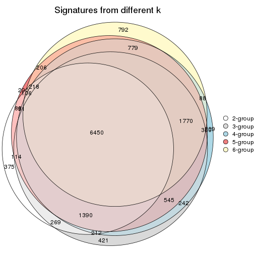

`get_signature()` returns a data frame invisibly. TO get the list of signatures, the function
call should be assigned to a variable explicitly. In following code, if `plot` argument is set
to `FALSE`, no heatmap is plotted while only the differential analysis is performed.

```r
# code only for demonstration
tb = get_signature(res, k = ..., plot = FALSE)
```

An example of the output of `tb` is:

```
#>   which_row         fdr    mean_1    mean_2 scaled_mean_1 scaled_mean_2 km
#> 1        38 0.042760348  8.373488  9.131774    -0.5533452     0.5164555  1
#> 2        40 0.018707592  7.106213  8.469186    -0.6173731     0.5762149  1
#> 3        55 0.019134737 10.221463 11.207825    -0.6159697     0.5749050  1
#> 4        59 0.006059896  5.921854  7.869574    -0.6899429     0.6439467  1
#> 5        60 0.018055526  8.928898 10.211722    -0.6204761     0.5791110  1
#> 6        98 0.009384629 15.714769 14.887706     0.6635654    -0.6193277  2
...
```

The columns in `tb` are:

1. `which_row`: row indices corresponding to the input matrix.
2. `fdr`: FDR for the differential test. 
3. `mean_x`: The mean value in group x.
4. `scaled_mean_x`: The mean value in group x after rows are scaled.
5. `km`: Row groups if k-means clustering is applied to rows.


UMAP plot which shows how samples are separated.


<script>
$( function() {
	$( '#tabs-SD-skmeans-dimension-reduction' ).tabs();
} );
</script>
<div id='tabs-SD-skmeans-dimension-reduction'>
<ul>
<li><a href='#tab-SD-skmeans-dimension-reduction-1'>k = 2</a></li>
<li><a href='#tab-SD-skmeans-dimension-reduction-2'>k = 3</a></li>
<li><a href='#tab-SD-skmeans-dimension-reduction-3'>k = 4</a></li>
<li><a href='#tab-SD-skmeans-dimension-reduction-4'>k = 5</a></li>
<li><a href='#tab-SD-skmeans-dimension-reduction-5'>k = 6</a></li>
</ul>
<div id='tab-SD-skmeans-dimension-reduction-1'>
<pre><code class="r">dimension_reduction(res, k = 2, method = &quot;UMAP&quot;)
</code></pre>

<p></p>

</div>
<div id='tab-SD-skmeans-dimension-reduction-2'>
<pre><code class="r">dimension_reduction(res, k = 3, method = &quot;UMAP&quot;)
</code></pre>

<p></p>

</div>
<div id='tab-SD-skmeans-dimension-reduction-3'>
<pre><code class="r">dimension_reduction(res, k = 4, method = &quot;UMAP&quot;)
</code></pre>

<p></p>

</div>
<div id='tab-SD-skmeans-dimension-reduction-4'>
<pre><code class="r">dimension_reduction(res, k = 5, method = &quot;UMAP&quot;)
</code></pre>

<p>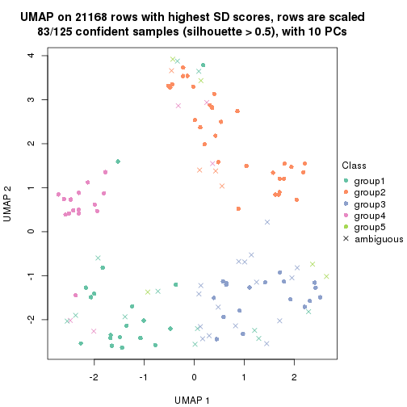</p>

</div>
<div id='tab-SD-skmeans-dimension-reduction-5'>
<pre><code class="r">dimension_reduction(res, k = 6, method = &quot;UMAP&quot;)
</code></pre>

<p></p>

</div>
</div>


Following heatmap shows how subgroups are split when increasing `k`:

```r
collect_classes(res)
```


Test correlation between subgroups and known annotations. If the known
annotation is numeric, one-way ANOVA test is applied, and if the known
annotation is discrete, chi-squared contingency table test is applied.

```r
test_to_known_factors(res)
```

```
#>              n time(p) gender(p) k
#> SD:skmeans 120   0.638   0.09698 2
#> SD:skmeans 112   0.151   0.19094 3
#> SD:skmeans  95   0.169   0.04630 4
#> SD:skmeans  83   0.199   0.09821 5
#> SD:skmeans  60   0.242   0.00352 6
```


If matrix rows can be associated to genes, consider to use `GO_Enrichment(res,
...)` to perform function enrichment for the signature genes.


 

---------------------------------------------------


### SD:pam


The object with results only for a single top-value method and a single partition method 
can be extracted as:

```r
res = res_list["SD", "pam"]
# you can also extract it by
# res = res_list["SD:pam"]
```

A summary of `res` and all the functions that can be applied to it:

```r
res
```

```
#> A 'ConsensusPartition' object with k = 2, 3, 4, 5, 6.
#>   On a matrix with 21168 rows and 125 columns.
#>   Top rows (1000, 2000, 3000, 4000, 5000) are extracted by 'SD' method.
#>   Subgroups are detected by 'pam' method.
#>   Performed in total 1250 partitions by row resampling.
#>   Best k for subgroups seems to be 2.
#> 
#> Following methods can be applied to this 'ConsensusPartition' object:
#>  [1] "cola_report"             "collect_classes"         "collect_plots"          
#>  [4] "collect_stats"           "colnames"                "compare_signatures"     
#>  [7] "consensus_heatmap"       "dimension_reduction"     "functional_enrichment"  
#> [10] "get_anno_col"            "get_anno"                "get_classes"            
#> [13] "get_consensus"           "get_matrix"              "get_membership"         
#> [16] "get_param"               "get_signatures"          "get_stats"              
#> [19] "is_best_k"               "is_stable_k"             "membership_heatmap"     
#> [22] "ncol"                    "nrow"                    "plot_ecdf"              
#> [25] "rownames"                "select_partition_number" "show"                   
#> [28] "suggest_best_k"          "test_to_known_factors"
```

`collect_plots()` function collects all the plots made from `res` for all `k` (number of partitions)
into one single page to provide an easy and fast comparison between different `k`.

```r
collect_plots(res)
```


The plots are:

- The first row: a plot of the ECDF (Empirical cumulative distribution
  function) curves of the consensus matrix for each `k` and the heatmap of
  predicted classes for each `k`.
- The second row: heatmaps of the consensus matrix for each `k`.
- The third row: heatmaps of the membership matrix for each `k`.
- The fouth row: heatmaps of the signatures for each `k`.

All the plots in panels can be made by individual functions and they are
plotted later in this section.

`select_partition_number()` produces several plots showing different
statistics for choosing "optimized" `k`. There are following statistics:

- ECDF curves of the consensus matrix for each `k`;
- 1-PAC. [The PAC
  score](https://en.wikipedia.org/wiki/Consensus_clustering#Over-interpretation_potential_of_consensus_clustering)
  measures the proportion of the ambiguous subgrouping.
- Mean silhouette score.
- Concordance. The mean probability of fiting the consensus class ids in all
  partitions.
- Area increased. Denote $A_k$ as the area under the ECDF curve for current
  `k`, the area increased is defined as $A_k - A_{k-1}$.
- Rand index. The percent of pairs of samples that are both in a same cluster
  or both are not in a same cluster in the partition of k and k-1.
- Jaccard index. The ratio of pairs of samples are both in a same cluster in
  the partition of k and k-1 and the pairs of samples are both in a same
  cluster in the partition k or k-1.

The detailed explanations of these statistics can be found in [the cola
vignette](http://bioconductor.org/packages/devel/bioc/vignettes/cola/inst/doc/cola.html#toc_13).

Generally speaking, lower PAC score, higher mean silhouette score or higher
concordance corresponds to better partition. Rand index and Jaccard index
measure how similar the current partition is compared to partition with `k-1`.
If they are too similar, we won't accept `k` is better than `k-1`.

```r
select_partition_number(res)
```


The numeric values for all these statistics can be obtained by `get_stats()`.

```r
get_stats(res)
```

```
#>   k 1-PAC mean_silhouette concordance area_increased  Rand Jaccard
#> 2 2 0.329           0.728       0.867         0.4986 0.496   0.496
#> 3 3 0.415           0.677       0.794         0.3153 0.750   0.539
#> 4 4 0.497           0.639       0.787         0.1016 0.898   0.716
#> 5 5 0.510           0.587       0.727         0.0453 0.967   0.887
#> 6 6 0.543           0.584       0.729         0.0339 0.956   0.834
```

`suggest_best_k()` suggests the best $k$ based on these statistics. The rules are as follows:

- All $k$ with Jaccard index larger than 0.95 are removed because the increase of
  the partition number does not provides enough extra information. If all $k$ are removed,
  the best $k$ is assigned by `NA`.
- For $k$ with 1-PAC larger than 0.9, the maximal $k$ is taken as the "best k". Other $k$ is called "optional k".
- If it does not fit the second rule. The $k$ with the highest vote of highest
  1-PAC, mean silhouette and concordance is taken as the "best k".

```r
suggest_best_k(res)
```

```
#> [1] 2
```


Following shows the table of the partitions (You need to click the **show/hide
code output** link to see it). The membership matrix (columns with name `p*`)
is inferred by
[`clue::cl_consensus()`](https://www.rdocumentation.org/link/cl_consensus?package=clue)
function with the `SE` method. Basically the value in the membership matrix
represents the probability to belong to a certain group. The finall class
label for an item is determined with the group with highest probability it
belongs to.

In `get_classes()` function, the entropy is calculated from the membership
matrix and the silhouette score is calculated from the consensus matrix.


<script>
$( function() {
	$( '#tabs-SD-pam-get-classes' ).tabs();
} );
</script>
<div id='tabs-SD-pam-get-classes'>
<ul>
<li><a href='#tab-SD-pam-get-classes-1'>k = 2</a></li>
<li><a href='#tab-SD-pam-get-classes-2'>k = 3</a></li>
<li><a href='#tab-SD-pam-get-classes-3'>k = 4</a></li>
<li><a href='#tab-SD-pam-get-classes-4'>k = 5</a></li>
<li><a href='#tab-SD-pam-get-classes-5'>k = 6</a></li>
</ul>

<div id='tab-SD-pam-get-classes-1'>
<p><a id='tab-SD-pam-get-classes-1-a' style='color:#0366d6' href='#'>show/hide code output</a></p>
<pre><code class="r">cbind(get_classes(res, k = 2), get_membership(res, k = 2))
</code></pre>

<pre><code>#&gt;           class entropy silhouette    p1    p2
#&gt; GSM601752     2  0.9996     0.0948 0.488 0.512
#&gt; GSM601782     1  0.5519     0.8129 0.872 0.128
#&gt; GSM601792     1  0.2236     0.8353 0.964 0.036
#&gt; GSM601797     1  0.5178     0.8113 0.884 0.116
#&gt; GSM601827     1  0.6048     0.7927 0.852 0.148
#&gt; GSM601837     2  0.0000     0.8443 0.000 1.000
#&gt; GSM601842     2  0.2948     0.8482 0.052 0.948
#&gt; GSM601857     2  0.8386     0.6040 0.268 0.732
#&gt; GSM601867     2  0.0000     0.8443 0.000 1.000
#&gt; GSM601747     1  0.9815     0.2628 0.580 0.420
#&gt; GSM601757     1  0.1843     0.8390 0.972 0.028
#&gt; GSM601762     2  0.1633     0.8493 0.024 0.976
#&gt; GSM601767     2  0.5059     0.8207 0.112 0.888
#&gt; GSM601772     2  0.6887     0.7788 0.184 0.816
#&gt; GSM601777     1  0.9983     0.0856 0.524 0.476
#&gt; GSM601787     2  0.4298     0.8155 0.088 0.912
#&gt; GSM601802     2  0.8443     0.6665 0.272 0.728
#&gt; GSM601807     1  0.9970     0.3045 0.532 0.468
#&gt; GSM601812     1  0.4562     0.8168 0.904 0.096
#&gt; GSM601817     1  0.2043     0.8400 0.968 0.032
#&gt; GSM601822     1  0.0000     0.8382 1.000 0.000
#&gt; GSM601832     2  0.6973     0.7852 0.188 0.812
#&gt; GSM601847     1  0.8267     0.6229 0.740 0.260
#&gt; GSM601852     1  0.3431     0.8349 0.936 0.064
#&gt; GSM601862     2  0.9358     0.4406 0.352 0.648
#&gt; GSM601753     2  0.9552     0.4417 0.376 0.624
#&gt; GSM601783     1  0.0000     0.8382 1.000 0.000
#&gt; GSM601793     1  0.3114     0.8310 0.944 0.056
#&gt; GSM601798     2  0.4022     0.8422 0.080 0.920
#&gt; GSM601828     1  0.2603     0.8336 0.956 0.044
#&gt; GSM601838     2  0.0000     0.8443 0.000 1.000
#&gt; GSM601843     2  0.1633     0.8490 0.024 0.976
#&gt; GSM601858     2  0.0000     0.8443 0.000 1.000
#&gt; GSM601868     2  0.9998    -0.1633 0.492 0.508
#&gt; GSM601748     1  0.0376     0.8388 0.996 0.004
#&gt; GSM601758     1  0.0000     0.8382 1.000 0.000
#&gt; GSM601763     1  0.2603     0.8310 0.956 0.044
#&gt; GSM601768     2  0.6623     0.7953 0.172 0.828
#&gt; GSM601773     2  0.5842     0.8112 0.140 0.860
#&gt; GSM601778     1  0.3584     0.8219 0.932 0.068
#&gt; GSM601788     1  0.9460     0.3978 0.636 0.364
#&gt; GSM601803     2  0.9044     0.5614 0.320 0.680
#&gt; GSM601808     1  0.9993     0.2078 0.516 0.484
#&gt; GSM601813     1  0.1414     0.8386 0.980 0.020
#&gt; GSM601818     1  0.7056     0.7653 0.808 0.192
#&gt; GSM601823     1  0.0000     0.8382 1.000 0.000
#&gt; GSM601833     2  0.0672     0.8472 0.008 0.992
#&gt; GSM601848     1  0.0376     0.8386 0.996 0.004
#&gt; GSM601853     1  0.5408     0.7986 0.876 0.124
#&gt; GSM601863     1  0.8443     0.6450 0.728 0.272
#&gt; GSM601754     2  0.9491     0.4595 0.368 0.632
#&gt; GSM601784     2  0.4562     0.8398 0.096 0.904
#&gt; GSM601794     1  0.6531     0.7338 0.832 0.168
#&gt; GSM601799     1  0.9087     0.4616 0.676 0.324
#&gt; GSM601829     1  0.0000     0.8382 1.000 0.000
#&gt; GSM601839     2  0.0000     0.8443 0.000 1.000
#&gt; GSM601844     1  0.0938     0.8381 0.988 0.012
#&gt; GSM601859     2  0.2778     0.8497 0.048 0.952
#&gt; GSM601869     1  0.9552     0.4577 0.624 0.376
#&gt; GSM601749     1  0.0000     0.8382 1.000 0.000
#&gt; GSM601759     1  0.0000     0.8382 1.000 0.000
#&gt; GSM601764     1  0.0376     0.8391 0.996 0.004
#&gt; GSM601769     2  0.1414     0.8496 0.020 0.980
#&gt; GSM601774     2  0.4690     0.8306 0.100 0.900
#&gt; GSM601779     1  0.0000     0.8382 1.000 0.000
#&gt; GSM601789     2  0.1843     0.8460 0.028 0.972
#&gt; GSM601804     1  0.7453     0.6701 0.788 0.212
#&gt; GSM601809     2  0.5629     0.8186 0.132 0.868
#&gt; GSM601814     2  0.0376     0.8456 0.004 0.996
#&gt; GSM601819     1  0.5408     0.7822 0.876 0.124
#&gt; GSM601824     1  0.0938     0.8381 0.988 0.012
#&gt; GSM601834     2  0.2603     0.8495 0.044 0.956
#&gt; GSM601849     1  0.0672     0.8384 0.992 0.008
#&gt; GSM601854     1  0.0672     0.8390 0.992 0.008
#&gt; GSM601864     2  0.0000     0.8443 0.000 1.000
#&gt; GSM601755     2  0.4939     0.8277 0.108 0.892
#&gt; GSM601785     2  0.4939     0.8250 0.108 0.892
#&gt; GSM601795     2  0.8661     0.6779 0.288 0.712
#&gt; GSM601800     2  0.3431     0.8429 0.064 0.936
#&gt; GSM601830     1  0.6531     0.7752 0.832 0.168
#&gt; GSM601840     2  0.1633     0.8479 0.024 0.976
#&gt; GSM601845     1  0.6343     0.7620 0.840 0.160
#&gt; GSM601860     2  0.2778     0.8461 0.048 0.952
#&gt; GSM601870     2  0.6343     0.7392 0.160 0.840
#&gt; GSM601750     1  0.4690     0.8105 0.900 0.100
#&gt; GSM601760     1  0.8144     0.6225 0.748 0.252
#&gt; GSM601765     2  0.9754     0.4114 0.408 0.592
#&gt; GSM601770     2  0.0938     0.8483 0.012 0.988
#&gt; GSM601775     1  0.9248     0.3926 0.660 0.340
#&gt; GSM601780     1  0.0000     0.8382 1.000 0.000
#&gt; GSM601790     2  0.0000     0.8443 0.000 1.000
#&gt; GSM601805     2  0.1843     0.8507 0.028 0.972
#&gt; GSM601810     1  0.4431     0.8127 0.908 0.092
#&gt; GSM601815     2  0.0000     0.8443 0.000 1.000
#&gt; GSM601820     1  0.4939     0.8017 0.892 0.108
#&gt; GSM601825     2  0.6712     0.7911 0.176 0.824
#&gt; GSM601835     2  0.1184     0.8459 0.016 0.984
#&gt; GSM601850     1  0.5519     0.7816 0.872 0.128
#&gt; GSM601855     1  0.8608     0.6673 0.716 0.284
#&gt; GSM601865     2  0.2778     0.8426 0.048 0.952
#&gt; GSM601756     2  0.5408     0.8173 0.124 0.876
#&gt; GSM601786     2  0.0000     0.8443 0.000 1.000
#&gt; GSM601796     2  0.9922     0.0988 0.448 0.552
#&gt; GSM601801     2  0.1414     0.8493 0.020 0.980
#&gt; GSM601831     1  0.2423     0.8372 0.960 0.040
#&gt; GSM601841     1  0.9552     0.4611 0.624 0.376
#&gt; GSM601846     1  0.3431     0.8282 0.936 0.064
#&gt; GSM601861     2  0.0376     0.8455 0.004 0.996
#&gt; GSM601871     2  0.2043     0.8464 0.032 0.968
#&gt; GSM601751     2  0.6712     0.7770 0.176 0.824
#&gt; GSM601761     1  0.0376     0.8391 0.996 0.004
#&gt; GSM601766     2  0.9866     0.3398 0.432 0.568
#&gt; GSM601771     2  0.4298     0.8424 0.088 0.912
#&gt; GSM601776     1  0.0000     0.8382 1.000 0.000
#&gt; GSM601781     1  0.8081     0.6460 0.752 0.248
#&gt; GSM601791     1  0.8327     0.6114 0.736 0.264
#&gt; GSM601806     2  0.4939     0.8216 0.108 0.892
#&gt; GSM601811     2  0.7674     0.6687 0.224 0.776
#&gt; GSM601816     1  0.0000     0.8382 1.000 0.000
#&gt; GSM601821     2  0.0672     0.8465 0.008 0.992
#&gt; GSM601826     1  0.0000     0.8382 1.000 0.000
#&gt; GSM601836     1  0.9608     0.4512 0.616 0.384
#&gt; GSM601851     1  0.0000     0.8382 1.000 0.000
#&gt; GSM601856     2  0.9427     0.3533 0.360 0.640
#&gt; GSM601866     1  0.9552     0.4729 0.624 0.376
</code></pre>

<script>
$('#tab-SD-pam-get-classes-1-a').parent().next().next().hide();
$('#tab-SD-pam-get-classes-1-a').click(function(){
  $('#tab-SD-pam-get-classes-1-a').parent().next().next().toggle();
  return(false);
});
</script>
</div>

<div id='tab-SD-pam-get-classes-2'>
<p><a id='tab-SD-pam-get-classes-2-a' style='color:#0366d6' href='#'>show/hide code output</a></p>
<pre><code class="r">cbind(get_classes(res, k = 3), get_membership(res, k = 3))
</code></pre>

<pre><code>#&gt;           class entropy silhouette    p1    p2    p3
#&gt; GSM601752     2  0.6375    0.57929 0.244 0.720 0.036
#&gt; GSM601782     1  0.5305    0.81651 0.788 0.020 0.192
#&gt; GSM601792     1  0.0747    0.85561 0.984 0.016 0.000
#&gt; GSM601797     1  0.6337    0.64602 0.708 0.264 0.028
#&gt; GSM601827     1  0.4802    0.83073 0.824 0.020 0.156
#&gt; GSM601837     3  0.5859    0.54623 0.000 0.344 0.656
#&gt; GSM601842     2  0.1337    0.74320 0.012 0.972 0.016
#&gt; GSM601857     3  0.0475    0.72817 0.004 0.004 0.992
#&gt; GSM601867     3  0.5948    0.51252 0.000 0.360 0.640
#&gt; GSM601747     1  0.9083    0.48695 0.540 0.180 0.280
#&gt; GSM601757     1  0.2165    0.84984 0.936 0.000 0.064
#&gt; GSM601762     2  0.0592    0.73721 0.000 0.988 0.012
#&gt; GSM601767     2  0.1337    0.74187 0.012 0.972 0.016
#&gt; GSM601772     2  0.3590    0.73164 0.076 0.896 0.028
#&gt; GSM601777     2  0.7433    0.57971 0.168 0.700 0.132
#&gt; GSM601787     3  0.4663    0.71846 0.016 0.156 0.828
#&gt; GSM601802     2  0.7474    0.56917 0.176 0.696 0.128
#&gt; GSM601807     1  0.8786    0.25768 0.464 0.112 0.424
#&gt; GSM601812     1  0.4346    0.82620 0.816 0.000 0.184
#&gt; GSM601817     1  0.4291    0.82817 0.820 0.000 0.180
#&gt; GSM601822     1  0.0000    0.85686 1.000 0.000 0.000
#&gt; GSM601832     2  0.4615    0.68139 0.144 0.836 0.020
#&gt; GSM601847     2  0.5835    0.45554 0.340 0.660 0.000
#&gt; GSM601852     1  0.4861    0.82392 0.808 0.012 0.180
#&gt; GSM601862     3  0.0237    0.72709 0.004 0.000 0.996
#&gt; GSM601753     2  0.1643    0.74229 0.044 0.956 0.000
#&gt; GSM601783     1  0.3879    0.83718 0.848 0.000 0.152
#&gt; GSM601793     1  0.2959    0.82346 0.900 0.100 0.000
#&gt; GSM601798     2  0.1905    0.74468 0.028 0.956 0.016
#&gt; GSM601828     1  0.4291    0.82390 0.820 0.000 0.180
#&gt; GSM601838     2  0.0747    0.73731 0.000 0.984 0.016
#&gt; GSM601843     2  0.5760    0.40629 0.000 0.672 0.328
#&gt; GSM601858     3  0.3752    0.71626 0.000 0.144 0.856
#&gt; GSM601868     3  0.0747    0.72665 0.016 0.000 0.984
#&gt; GSM601748     1  0.4291    0.82390 0.820 0.000 0.180
#&gt; GSM601758     1  0.2261    0.85702 0.932 0.000 0.068
#&gt; GSM601763     1  0.0000    0.85686 1.000 0.000 0.000
#&gt; GSM601768     2  0.9392   -0.00729 0.172 0.436 0.392
#&gt; GSM601773     2  0.2550    0.74331 0.056 0.932 0.012
#&gt; GSM601778     1  0.3039    0.85123 0.920 0.044 0.036
#&gt; GSM601788     1  0.5295    0.75442 0.808 0.156 0.036
#&gt; GSM601803     2  0.2066    0.73990 0.060 0.940 0.000
#&gt; GSM601808     3  0.2682    0.70943 0.076 0.004 0.920
#&gt; GSM601813     1  0.4235    0.82639 0.824 0.000 0.176
#&gt; GSM601818     1  0.4755    0.82385 0.808 0.008 0.184
#&gt; GSM601823     1  0.0000    0.85686 1.000 0.000 0.000
#&gt; GSM601833     2  0.4784    0.61715 0.004 0.796 0.200
#&gt; GSM601848     1  0.0000    0.85686 1.000 0.000 0.000
#&gt; GSM601853     1  0.4399    0.82212 0.812 0.000 0.188
#&gt; GSM601863     3  0.5926    0.45096 0.356 0.000 0.644
#&gt; GSM601754     2  0.6905    0.47800 0.044 0.676 0.280
#&gt; GSM601784     3  0.6621    0.71982 0.148 0.100 0.752
#&gt; GSM601794     1  0.4834    0.67035 0.792 0.204 0.004
#&gt; GSM601799     2  0.6489    0.25988 0.456 0.540 0.004
#&gt; GSM601829     1  0.0000    0.85686 1.000 0.000 0.000
#&gt; GSM601839     2  0.3816    0.66905 0.000 0.852 0.148
#&gt; GSM601844     1  0.1860    0.83569 0.948 0.000 0.052
#&gt; GSM601859     3  0.6902    0.69981 0.100 0.168 0.732
#&gt; GSM601869     3  0.1129    0.73017 0.020 0.004 0.976
#&gt; GSM601749     1  0.1411    0.86011 0.964 0.000 0.036
#&gt; GSM601759     1  0.1753    0.85727 0.952 0.000 0.048
#&gt; GSM601764     1  0.0747    0.85374 0.984 0.000 0.016
#&gt; GSM601769     2  0.7517    0.08273 0.040 0.540 0.420
#&gt; GSM601774     2  0.2443    0.74129 0.028 0.940 0.032
#&gt; GSM601779     1  0.0000    0.85686 1.000 0.000 0.000
#&gt; GSM601789     3  0.7163    0.52984 0.040 0.332 0.628
#&gt; GSM601804     1  0.6308   -0.14472 0.508 0.492 0.000
#&gt; GSM601809     3  0.5719    0.73283 0.156 0.052 0.792
#&gt; GSM601814     2  0.2945    0.71784 0.004 0.908 0.088
#&gt; GSM601819     1  0.2400    0.82764 0.932 0.004 0.064
#&gt; GSM601824     1  0.0000    0.85686 1.000 0.000 0.000
#&gt; GSM601834     2  0.7741    0.35763 0.068 0.608 0.324
#&gt; GSM601849     1  0.0000    0.85686 1.000 0.000 0.000
#&gt; GSM601854     1  0.4002    0.83348 0.840 0.000 0.160
#&gt; GSM601864     3  0.5254    0.64561 0.000 0.264 0.736
#&gt; GSM601755     2  0.1647    0.74376 0.036 0.960 0.004
#&gt; GSM601785     3  0.4805    0.72535 0.176 0.012 0.812
#&gt; GSM601795     3  0.8868    0.51044 0.196 0.228 0.576
#&gt; GSM601800     2  0.5269    0.60907 0.016 0.784 0.200
#&gt; GSM601830     1  0.4589    0.82610 0.820 0.008 0.172
#&gt; GSM601840     3  0.6744    0.57431 0.032 0.300 0.668
#&gt; GSM601845     1  0.4235    0.75930 0.824 0.176 0.000
#&gt; GSM601860     3  0.5307    0.74004 0.136 0.048 0.816
#&gt; GSM601870     3  0.2261    0.71991 0.000 0.068 0.932
#&gt; GSM601750     1  0.4555    0.81696 0.800 0.000 0.200
#&gt; GSM601760     3  0.4887    0.70886 0.228 0.000 0.772
#&gt; GSM601765     2  0.6322    0.58048 0.276 0.700 0.024
#&gt; GSM601770     2  0.3989    0.68974 0.012 0.864 0.124
#&gt; GSM601775     1  0.5179    0.73864 0.832 0.088 0.080
#&gt; GSM601780     1  0.0000    0.85686 1.000 0.000 0.000
#&gt; GSM601790     3  0.5650    0.58352 0.000 0.312 0.688
#&gt; GSM601805     2  0.7299    0.19870 0.032 0.556 0.412
#&gt; GSM601810     1  0.4291    0.82390 0.820 0.000 0.180
#&gt; GSM601815     2  0.6252    0.04180 0.000 0.556 0.444
#&gt; GSM601820     1  0.4399    0.69815 0.812 0.000 0.188
#&gt; GSM601825     2  0.4351    0.67660 0.168 0.828 0.004
#&gt; GSM601835     2  0.6252    0.00355 0.000 0.556 0.444
#&gt; GSM601850     1  0.2261    0.83221 0.932 0.068 0.000
#&gt; GSM601855     1  0.6225    0.47282 0.568 0.000 0.432
#&gt; GSM601865     3  0.5407    0.74015 0.104 0.076 0.820
#&gt; GSM601756     2  0.1529    0.74280 0.040 0.960 0.000
#&gt; GSM601786     3  0.4291    0.69695 0.000 0.180 0.820
#&gt; GSM601796     3  0.6372    0.73540 0.152 0.084 0.764
#&gt; GSM601801     2  0.0000    0.73699 0.000 1.000 0.000
#&gt; GSM601831     1  0.4291    0.82390 0.820 0.000 0.180
#&gt; GSM601841     3  0.2774    0.73848 0.072 0.008 0.920
#&gt; GSM601846     1  0.3686    0.79304 0.860 0.140 0.000
#&gt; GSM601861     3  0.5502    0.65976 0.008 0.248 0.744
#&gt; GSM601871     3  0.3669    0.75203 0.064 0.040 0.896
#&gt; GSM601751     3  0.4840    0.73032 0.168 0.016 0.816
#&gt; GSM601761     1  0.0237    0.85630 0.996 0.000 0.004
#&gt; GSM601766     3  0.6726    0.57509 0.332 0.024 0.644
#&gt; GSM601771     3  0.8316    0.23384 0.080 0.424 0.496
#&gt; GSM601776     1  0.0000    0.85686 1.000 0.000 0.000
#&gt; GSM601781     3  0.6899    0.57744 0.364 0.024 0.612
#&gt; GSM601791     3  0.5285    0.70089 0.244 0.004 0.752
#&gt; GSM601806     2  0.0237    0.73802 0.004 0.996 0.000
#&gt; GSM601811     3  0.4479    0.69736 0.044 0.096 0.860
#&gt; GSM601816     1  0.0000    0.85686 1.000 0.000 0.000
#&gt; GSM601821     3  0.6786    0.25684 0.012 0.448 0.540
#&gt; GSM601826     1  0.0000    0.85686 1.000 0.000 0.000
#&gt; GSM601836     3  0.8995    0.37228 0.372 0.136 0.492
#&gt; GSM601851     1  0.0424    0.85819 0.992 0.000 0.008
#&gt; GSM601856     3  0.2590    0.71012 0.072 0.004 0.924
#&gt; GSM601866     3  0.1411    0.72484 0.036 0.000 0.964
</code></pre>

<script>
$('#tab-SD-pam-get-classes-2-a').parent().next().next().hide();
$('#tab-SD-pam-get-classes-2-a').click(function(){
  $('#tab-SD-pam-get-classes-2-a').parent().next().next().toggle();
  return(false);
});
</script>
</div>

<div id='tab-SD-pam-get-classes-3'>
<p><a id='tab-SD-pam-get-classes-3-a' style='color:#0366d6' href='#'>show/hide code output</a></p>
<pre><code class="r">cbind(get_classes(res, k = 4), get_membership(res, k = 4))
</code></pre>

<pre><code>#&gt;           class entropy silhouette    p1    p2    p3    p4
#&gt; GSM601752     4  0.0000      0.808 0.000 0.000 0.000 1.000
#&gt; GSM601782     1  0.4879      0.782 0.744 0.016 0.228 0.012
#&gt; GSM601792     1  0.0592      0.843 0.984 0.000 0.000 0.016
#&gt; GSM601797     1  0.4999      0.155 0.508 0.000 0.000 0.492
#&gt; GSM601827     1  0.4389      0.813 0.820 0.028 0.132 0.020
#&gt; GSM601837     3  0.7507      0.264 0.000 0.316 0.480 0.204
#&gt; GSM601842     2  0.5299      0.439 0.004 0.600 0.008 0.388
#&gt; GSM601857     3  0.1474      0.656 0.000 0.052 0.948 0.000
#&gt; GSM601867     3  0.5284      0.451 0.000 0.016 0.616 0.368
#&gt; GSM601747     1  0.9041      0.276 0.428 0.224 0.268 0.080
#&gt; GSM601757     1  0.3505      0.812 0.864 0.012 0.108 0.016
#&gt; GSM601762     4  0.4977     -0.112 0.000 0.460 0.000 0.540
#&gt; GSM601767     2  0.4872      0.489 0.004 0.640 0.000 0.356
#&gt; GSM601772     2  0.5627      0.596 0.068 0.692 0.000 0.240
#&gt; GSM601777     4  0.3460      0.750 0.036 0.024 0.056 0.884
#&gt; GSM601787     3  0.5008      0.632 0.004 0.092 0.780 0.124
#&gt; GSM601802     4  0.0376      0.807 0.004 0.004 0.000 0.992
#&gt; GSM601807     3  0.8163      0.162 0.264 0.016 0.448 0.272
#&gt; GSM601812     1  0.4535      0.771 0.744 0.016 0.240 0.000
#&gt; GSM601817     1  0.4687      0.788 0.752 0.020 0.224 0.004
#&gt; GSM601822     1  0.0000      0.842 1.000 0.000 0.000 0.000
#&gt; GSM601832     2  0.4187      0.656 0.092 0.840 0.012 0.056
#&gt; GSM601847     4  0.1637      0.780 0.060 0.000 0.000 0.940
#&gt; GSM601852     1  0.3945      0.790 0.780 0.004 0.216 0.000
#&gt; GSM601862     3  0.1474      0.655 0.000 0.052 0.948 0.000
#&gt; GSM601753     4  0.0188      0.808 0.004 0.000 0.000 0.996
#&gt; GSM601783     1  0.2973      0.822 0.856 0.000 0.144 0.000
#&gt; GSM601793     1  0.2704      0.807 0.876 0.000 0.000 0.124
#&gt; GSM601798     4  0.0188      0.808 0.000 0.004 0.000 0.996
#&gt; GSM601828     1  0.4019      0.803 0.792 0.012 0.196 0.000
#&gt; GSM601838     2  0.4040      0.615 0.000 0.752 0.000 0.248
#&gt; GSM601843     2  0.6139      0.606 0.000 0.656 0.100 0.244
#&gt; GSM601858     3  0.4955      0.631 0.000 0.144 0.772 0.084
#&gt; GSM601868     3  0.0469      0.649 0.000 0.012 0.988 0.000
#&gt; GSM601748     1  0.3852      0.801 0.800 0.008 0.192 0.000
#&gt; GSM601758     1  0.1792      0.843 0.932 0.000 0.068 0.000
#&gt; GSM601763     1  0.2074      0.832 0.940 0.016 0.012 0.032
#&gt; GSM601768     2  0.7357      0.557 0.168 0.648 0.092 0.092
#&gt; GSM601773     2  0.5543      0.465 0.028 0.612 0.000 0.360
#&gt; GSM601778     1  0.3453      0.840 0.884 0.020 0.048 0.048
#&gt; GSM601788     1  0.6217      0.704 0.724 0.112 0.036 0.128
#&gt; GSM601803     4  0.0000      0.808 0.000 0.000 0.000 1.000
#&gt; GSM601808     3  0.1510      0.642 0.028 0.016 0.956 0.000
#&gt; GSM601813     1  0.4059      0.803 0.788 0.012 0.200 0.000
#&gt; GSM601818     1  0.5022      0.778 0.736 0.044 0.220 0.000
#&gt; GSM601823     1  0.0000      0.842 1.000 0.000 0.000 0.000
#&gt; GSM601833     2  0.3157      0.677 0.000 0.852 0.004 0.144
#&gt; GSM601848     1  0.0000      0.842 1.000 0.000 0.000 0.000
#&gt; GSM601853     1  0.4500      0.709 0.684 0.000 0.316 0.000
#&gt; GSM601863     3  0.5231      0.523 0.296 0.028 0.676 0.000
#&gt; GSM601754     4  0.0336      0.807 0.008 0.000 0.000 0.992
#&gt; GSM601784     3  0.8323      0.495 0.116 0.240 0.544 0.100
#&gt; GSM601794     1  0.4697      0.434 0.644 0.000 0.000 0.356
#&gt; GSM601799     4  0.4814      0.500 0.316 0.008 0.000 0.676
#&gt; GSM601829     1  0.0000      0.842 1.000 0.000 0.000 0.000
#&gt; GSM601839     2  0.3402      0.670 0.000 0.832 0.004 0.164
#&gt; GSM601844     1  0.1975      0.832 0.944 0.016 0.012 0.028
#&gt; GSM601859     3  0.7593      0.571 0.048 0.132 0.600 0.220
#&gt; GSM601869     3  0.2675      0.655 0.008 0.100 0.892 0.000
#&gt; GSM601749     1  0.1211      0.846 0.960 0.000 0.040 0.000
#&gt; GSM601759     1  0.1902      0.843 0.932 0.000 0.064 0.004
#&gt; GSM601764     1  0.2324      0.830 0.932 0.020 0.020 0.028
#&gt; GSM601769     2  0.1377      0.684 0.008 0.964 0.008 0.020
#&gt; GSM601774     2  0.3271      0.678 0.012 0.856 0.000 0.132
#&gt; GSM601779     1  0.1674      0.834 0.952 0.012 0.004 0.032
#&gt; GSM601789     2  0.5790      0.169 0.000 0.616 0.340 0.044
#&gt; GSM601804     4  0.4677      0.506 0.316 0.004 0.000 0.680
#&gt; GSM601809     3  0.6831      0.599 0.168 0.140 0.664 0.028
#&gt; GSM601814     2  0.2060      0.679 0.000 0.932 0.016 0.052
#&gt; GSM601819     1  0.3316      0.810 0.892 0.044 0.032 0.032
#&gt; GSM601824     1  0.1022      0.835 0.968 0.000 0.000 0.032
#&gt; GSM601834     2  0.1853      0.682 0.012 0.948 0.028 0.012
#&gt; GSM601849     1  0.0524      0.841 0.988 0.004 0.000 0.008
#&gt; GSM601854     1  0.4054      0.808 0.796 0.016 0.188 0.000
#&gt; GSM601864     3  0.5980      0.417 0.000 0.396 0.560 0.044
#&gt; GSM601755     4  0.0188      0.808 0.000 0.004 0.000 0.996
#&gt; GSM601785     3  0.7557      0.608 0.104 0.172 0.632 0.092
#&gt; GSM601795     3  0.8613      0.429 0.200 0.056 0.468 0.276
#&gt; GSM601800     4  0.1302      0.790 0.000 0.044 0.000 0.956
#&gt; GSM601830     1  0.3764      0.808 0.816 0.012 0.172 0.000
#&gt; GSM601840     3  0.6329      0.456 0.004 0.064 0.588 0.344
#&gt; GSM601845     1  0.3961      0.771 0.812 0.008 0.008 0.172
#&gt; GSM601860     3  0.7075      0.624 0.072 0.144 0.672 0.112
#&gt; GSM601870     3  0.0921      0.648 0.000 0.000 0.972 0.028
#&gt; GSM601750     1  0.4454      0.718 0.692 0.000 0.308 0.000
#&gt; GSM601760     3  0.5706      0.603 0.268 0.028 0.684 0.020
#&gt; GSM601765     2  0.5229      0.608 0.152 0.768 0.012 0.068
#&gt; GSM601770     2  0.4850      0.571 0.004 0.696 0.008 0.292
#&gt; GSM601775     1  0.6168      0.607 0.716 0.180 0.048 0.056
#&gt; GSM601780     1  0.0844      0.842 0.980 0.012 0.004 0.004
#&gt; GSM601790     2  0.5487     -0.019 0.000 0.580 0.400 0.020
#&gt; GSM601805     4  0.5947      0.468 0.008 0.076 0.224 0.692
#&gt; GSM601810     1  0.3444      0.804 0.816 0.000 0.184 0.000
#&gt; GSM601815     2  0.1520      0.685 0.000 0.956 0.024 0.020
#&gt; GSM601820     1  0.4504      0.660 0.772 0.020 0.204 0.004
#&gt; GSM601825     4  0.6473      0.487 0.168 0.188 0.000 0.644
#&gt; GSM601835     2  0.6966      0.437 0.000 0.572 0.268 0.160
#&gt; GSM601850     1  0.2125      0.827 0.920 0.004 0.000 0.076
#&gt; GSM601855     3  0.5112     -0.163 0.436 0.000 0.560 0.004
#&gt; GSM601865     3  0.4746      0.502 0.000 0.368 0.632 0.000
#&gt; GSM601756     4  0.0188      0.808 0.000 0.004 0.000 0.996
#&gt; GSM601786     3  0.4761      0.498 0.000 0.372 0.628 0.000
#&gt; GSM601796     3  0.7473      0.623 0.108 0.080 0.636 0.176
#&gt; GSM601801     4  0.3873      0.553 0.000 0.228 0.000 0.772
#&gt; GSM601831     1  0.3528      0.801 0.808 0.000 0.192 0.000
#&gt; GSM601841     3  0.4112      0.654 0.112 0.020 0.840 0.028
#&gt; GSM601846     1  0.3610      0.748 0.800 0.000 0.000 0.200
#&gt; GSM601861     2  0.5508     -0.244 0.000 0.508 0.476 0.016
#&gt; GSM601871     3  0.3751      0.625 0.004 0.196 0.800 0.000
#&gt; GSM601751     3  0.7053      0.624 0.156 0.076 0.672 0.096
#&gt; GSM601761     1  0.1396      0.835 0.960 0.004 0.004 0.032
#&gt; GSM601766     3  0.8434      0.437 0.228 0.276 0.460 0.036
#&gt; GSM601771     2  0.8964      0.270 0.056 0.380 0.292 0.272
#&gt; GSM601776     1  0.0000      0.842 1.000 0.000 0.000 0.000
#&gt; GSM601781     3  0.7094      0.480 0.388 0.028 0.520 0.064
#&gt; GSM601791     3  0.6478      0.574 0.308 0.040 0.620 0.032
#&gt; GSM601806     4  0.2149      0.751 0.000 0.088 0.000 0.912
#&gt; GSM601811     3  0.2558      0.642 0.008 0.036 0.920 0.036
#&gt; GSM601816     1  0.0000      0.842 1.000 0.000 0.000 0.000
#&gt; GSM601821     2  0.2334      0.643 0.000 0.908 0.088 0.004
#&gt; GSM601826     1  0.0000      0.842 1.000 0.000 0.000 0.000
#&gt; GSM601836     3  0.9296      0.263 0.268 0.272 0.372 0.088
#&gt; GSM601851     1  0.0992      0.844 0.976 0.004 0.008 0.012
#&gt; GSM601856     3  0.1584      0.644 0.036 0.012 0.952 0.000
#&gt; GSM601866     3  0.1297      0.649 0.020 0.016 0.964 0.000
</code></pre>

<script>
$('#tab-SD-pam-get-classes-3-a').parent().next().next().hide();
$('#tab-SD-pam-get-classes-3-a').click(function(){
  $('#tab-SD-pam-get-classes-3-a').parent().next().next().toggle();
  return(false);
});
</script>
</div>

<div id='tab-SD-pam-get-classes-4'>
<p><a id='tab-SD-pam-get-classes-4-a' style='color:#0366d6' href='#'>show/hide code output</a></p>
<pre><code class="r">cbind(get_classes(res, k = 5), get_membership(res, k = 5))
</code></pre>

<pre><code>#&gt;           class entropy silhouette    p1    p2    p3    p4    p5
#&gt; GSM601752     4  0.0000     0.8171 0.000 0.000 0.000 1.000 0.000
#&gt; GSM601782     1  0.5394     0.7476 0.720 0.020 0.096 0.008 0.156
#&gt; GSM601792     1  0.1772     0.8039 0.944 0.016 0.004 0.012 0.024
#&gt; GSM601797     1  0.5470     0.2245 0.516 0.016 0.004 0.440 0.024
#&gt; GSM601827     1  0.3975     0.7795 0.828 0.008 0.076 0.012 0.076
#&gt; GSM601837     5  0.7653     0.5071 0.000 0.160 0.212 0.128 0.500
#&gt; GSM601842     2  0.4920     0.4887 0.000 0.572 0.012 0.404 0.012
#&gt; GSM601857     3  0.3511     0.5206 0.004 0.012 0.800 0.000 0.184
#&gt; GSM601867     3  0.4608     0.3695 0.000 0.012 0.644 0.336 0.008
#&gt; GSM601747     1  0.9027     0.2072 0.392 0.256 0.136 0.068 0.148
#&gt; GSM601757     1  0.5732     0.6553 0.696 0.024 0.096 0.012 0.172
#&gt; GSM601762     2  0.4448     0.3245 0.000 0.516 0.004 0.480 0.000
#&gt; GSM601767     2  0.3990     0.5712 0.000 0.688 0.004 0.308 0.000
#&gt; GSM601772     2  0.5340     0.5987 0.064 0.696 0.004 0.216 0.020
#&gt; GSM601777     4  0.4294     0.7206 0.032 0.048 0.032 0.828 0.060
#&gt; GSM601787     3  0.2928     0.5304 0.000 0.032 0.872 0.092 0.004
#&gt; GSM601802     4  0.0566     0.8152 0.000 0.012 0.000 0.984 0.004
#&gt; GSM601807     5  0.8974    -0.1242 0.156 0.028 0.288 0.220 0.308
#&gt; GSM601812     1  0.5492     0.7210 0.684 0.012 0.136 0.000 0.168
#&gt; GSM601817     1  0.5290     0.7472 0.720 0.028 0.096 0.000 0.156
#&gt; GSM601822     1  0.0000     0.8030 1.000 0.000 0.000 0.000 0.000
#&gt; GSM601832     2  0.4045     0.5609 0.076 0.824 0.000 0.036 0.064
#&gt; GSM601847     4  0.2376     0.7722 0.044 0.000 0.000 0.904 0.052
#&gt; GSM601852     1  0.4801     0.7413 0.732 0.004 0.092 0.000 0.172
#&gt; GSM601862     3  0.3643     0.5092 0.004 0.008 0.776 0.000 0.212
#&gt; GSM601753     4  0.0451     0.8175 0.004 0.000 0.000 0.988 0.008
#&gt; GSM601783     1  0.3051     0.7871 0.864 0.000 0.060 0.000 0.076
#&gt; GSM601793     1  0.3308     0.7740 0.860 0.016 0.004 0.096 0.024
#&gt; GSM601798     4  0.0290     0.8169 0.000 0.008 0.000 0.992 0.000
#&gt; GSM601828     1  0.4601     0.7673 0.772 0.024 0.064 0.000 0.140
#&gt; GSM601838     5  0.5996     0.4085 0.000 0.368 0.000 0.120 0.512
#&gt; GSM601843     2  0.5731     0.5457 0.000 0.644 0.100 0.240 0.016
#&gt; GSM601858     3  0.3476     0.5267 0.000 0.088 0.836 0.076 0.000
#&gt; GSM601868     3  0.3421     0.5048 0.000 0.008 0.788 0.000 0.204
#&gt; GSM601748     1  0.4250     0.7626 0.784 0.004 0.084 0.000 0.128
#&gt; GSM601758     1  0.2390     0.8098 0.896 0.000 0.020 0.000 0.084
#&gt; GSM601763     1  0.3941     0.7631 0.824 0.036 0.000 0.036 0.104
#&gt; GSM601768     2  0.6511     0.5076 0.132 0.680 0.076 0.052 0.060
#&gt; GSM601773     2  0.5146     0.5604 0.020 0.640 0.004 0.316 0.020
#&gt; GSM601778     1  0.4750     0.7880 0.792 0.040 0.020 0.044 0.104
#&gt; GSM601788     1  0.6687     0.5728 0.628 0.200 0.020 0.100 0.052
#&gt; GSM601803     4  0.0451     0.8154 0.000 0.008 0.000 0.988 0.004
#&gt; GSM601808     3  0.4363     0.4769 0.016 0.008 0.708 0.000 0.268
#&gt; GSM601813     1  0.5005     0.7653 0.740 0.028 0.072 0.000 0.160
#&gt; GSM601818     1  0.5709     0.7260 0.700 0.056 0.096 0.000 0.148
#&gt; GSM601823     1  0.0000     0.8030 1.000 0.000 0.000 0.000 0.000
#&gt; GSM601833     2  0.3222     0.6078 0.000 0.852 0.004 0.108 0.036
#&gt; GSM601848     1  0.0000     0.8030 1.000 0.000 0.000 0.000 0.000
#&gt; GSM601853     1  0.6486     0.4307 0.492 0.000 0.236 0.000 0.272
#&gt; GSM601863     3  0.6441     0.3399 0.252 0.008 0.544 0.000 0.196
#&gt; GSM601754     4  0.0566     0.8166 0.004 0.000 0.000 0.984 0.012
#&gt; GSM601784     3  0.8086     0.3541 0.112 0.260 0.492 0.092 0.044
#&gt; GSM601794     1  0.6382     0.4202 0.556 0.016 0.004 0.308 0.116
#&gt; GSM601799     4  0.5456     0.4624 0.284 0.016 0.000 0.640 0.060
#&gt; GSM601829     1  0.0000     0.8030 1.000 0.000 0.000 0.000 0.000
#&gt; GSM601839     5  0.5837     0.4242 0.000 0.400 0.004 0.084 0.512
#&gt; GSM601844     1  0.3434     0.7686 0.860 0.008 0.016 0.032 0.084
#&gt; GSM601859     3  0.5868     0.4478 0.036 0.056 0.652 0.248 0.008
#&gt; GSM601869     3  0.2919     0.5266 0.004 0.024 0.868 0.000 0.104
#&gt; GSM601749     1  0.1557     0.8091 0.940 0.000 0.008 0.000 0.052
#&gt; GSM601759     1  0.2754     0.8009 0.884 0.004 0.032 0.000 0.080
#&gt; GSM601764     1  0.4090     0.7655 0.824 0.028 0.012 0.032 0.104
#&gt; GSM601769     2  0.1970     0.5722 0.004 0.924 0.060 0.012 0.000
#&gt; GSM601774     2  0.2796     0.6147 0.008 0.868 0.000 0.116 0.008
#&gt; GSM601779     1  0.3243     0.7676 0.860 0.012 0.000 0.036 0.092
#&gt; GSM601789     2  0.5703     0.1086 0.000 0.540 0.396 0.040 0.024
#&gt; GSM601804     4  0.5473     0.4285 0.296 0.004 0.000 0.620 0.080
#&gt; GSM601809     3  0.6901     0.5148 0.164 0.112 0.632 0.032 0.060
#&gt; GSM601814     2  0.3467     0.5321 0.000 0.860 0.052 0.048 0.040
#&gt; GSM601819     1  0.5305     0.7080 0.756 0.096 0.020 0.036 0.092
#&gt; GSM601824     1  0.2359     0.7780 0.904 0.000 0.000 0.036 0.060
#&gt; GSM601834     2  0.3069     0.5501 0.008 0.876 0.084 0.012 0.020
#&gt; GSM601849     1  0.1798     0.7897 0.928 0.004 0.000 0.004 0.064
#&gt; GSM601854     1  0.4552     0.7685 0.756 0.008 0.068 0.000 0.168
#&gt; GSM601864     5  0.7070     0.5307 0.000 0.224 0.232 0.036 0.508
#&gt; GSM601755     4  0.0162     0.8165 0.000 0.004 0.000 0.996 0.000
#&gt; GSM601785     3  0.6643     0.4910 0.088 0.156 0.660 0.052 0.044
#&gt; GSM601795     3  0.9081     0.3439 0.148 0.108 0.420 0.212 0.112
#&gt; GSM601800     4  0.0955     0.8091 0.000 0.028 0.000 0.968 0.004
#&gt; GSM601830     1  0.4034     0.7748 0.812 0.016 0.060 0.000 0.112
#&gt; GSM601840     3  0.5652     0.3396 0.000 0.092 0.564 0.344 0.000
#&gt; GSM601845     1  0.4837     0.7345 0.752 0.008 0.012 0.164 0.064
#&gt; GSM601860     3  0.5893     0.5276 0.052 0.100 0.728 0.076 0.044
#&gt; GSM601870     3  0.3957     0.4626 0.000 0.000 0.712 0.008 0.280
#&gt; GSM601750     1  0.6351     0.5066 0.516 0.000 0.204 0.000 0.280
#&gt; GSM601760     3  0.6714     0.4694 0.256 0.020 0.584 0.024 0.116
#&gt; GSM601765     2  0.4913     0.5470 0.108 0.772 0.004 0.048 0.068
#&gt; GSM601770     2  0.3988     0.6041 0.000 0.732 0.016 0.252 0.000
#&gt; GSM601775     1  0.7023     0.4531 0.580 0.252 0.032 0.044 0.092
#&gt; GSM601780     1  0.2074     0.7953 0.920 0.016 0.000 0.004 0.060
#&gt; GSM601790     5  0.6699     0.5181 0.000 0.324 0.180 0.012 0.484
#&gt; GSM601805     4  0.4669     0.4786 0.004 0.024 0.264 0.700 0.008
#&gt; GSM601810     1  0.4103     0.7709 0.796 0.008 0.060 0.000 0.136
#&gt; GSM601815     2  0.2844     0.5459 0.000 0.880 0.088 0.012 0.020
#&gt; GSM601820     1  0.5805     0.5947 0.672 0.028 0.168 0.000 0.132
#&gt; GSM601825     4  0.6509     0.4747 0.164 0.160 0.000 0.620 0.056
#&gt; GSM601835     2  0.6191     0.4241 0.000 0.616 0.220 0.140 0.024
#&gt; GSM601850     1  0.3316     0.7812 0.860 0.012 0.000 0.072 0.056
#&gt; GSM601855     3  0.6790     0.0944 0.292 0.000 0.380 0.000 0.328
#&gt; GSM601865     3  0.4547     0.4170 0.000 0.252 0.704 0.000 0.044
#&gt; GSM601756     4  0.0162     0.8169 0.000 0.004 0.000 0.996 0.000
#&gt; GSM601786     3  0.4550     0.4017 0.000 0.276 0.688 0.000 0.036
#&gt; GSM601796     3  0.6928     0.5112 0.096 0.028 0.640 0.120 0.116
#&gt; GSM601801     4  0.3300     0.5948 0.000 0.204 0.000 0.792 0.004
#&gt; GSM601831     1  0.3898     0.7643 0.804 0.000 0.080 0.000 0.116
#&gt; GSM601841     3  0.5430     0.5284 0.124 0.008 0.728 0.028 0.112
#&gt; GSM601846     1  0.3250     0.7372 0.820 0.004 0.000 0.168 0.008
#&gt; GSM601861     3  0.5535     0.2060 0.000 0.372 0.564 0.008 0.056
#&gt; GSM601871     3  0.2136     0.5272 0.000 0.088 0.904 0.000 0.008
#&gt; GSM601751     3  0.6343     0.5308 0.128 0.068 0.692 0.068 0.044
#&gt; GSM601761     1  0.3053     0.7723 0.872 0.004 0.004 0.036 0.084
#&gt; GSM601766     3  0.8559     0.2809 0.192 0.276 0.404 0.036 0.092
#&gt; GSM601771     2  0.7949     0.3186 0.032 0.448 0.272 0.208 0.040
#&gt; GSM601776     1  0.0162     0.8031 0.996 0.000 0.000 0.000 0.004
#&gt; GSM601781     3  0.7815     0.3503 0.336 0.032 0.456 0.068 0.108
#&gt; GSM601791     3  0.6547     0.4511 0.268 0.008 0.588 0.036 0.100
#&gt; GSM601806     4  0.2193     0.7573 0.000 0.092 0.000 0.900 0.008
#&gt; GSM601811     3  0.5192     0.4751 0.008 0.020 0.684 0.032 0.256
#&gt; GSM601816     1  0.0000     0.8030 1.000 0.000 0.000 0.000 0.000
#&gt; GSM601821     2  0.4547     0.3273 0.000 0.736 0.192 0.000 0.072
#&gt; GSM601826     1  0.0000     0.8030 1.000 0.000 0.000 0.000 0.000
#&gt; GSM601836     3  0.9156     0.1172 0.252 0.264 0.320 0.080 0.084
#&gt; GSM601851     1  0.1622     0.8041 0.948 0.004 0.004 0.016 0.028
#&gt; GSM601856     3  0.4311     0.4755 0.020 0.004 0.712 0.000 0.264
#&gt; GSM601866     3  0.4543     0.5135 0.020 0.024 0.732 0.000 0.224
</code></pre>

<script>
$('#tab-SD-pam-get-classes-4-a').parent().next().next().hide();
$('#tab-SD-pam-get-classes-4-a').click(function(){
  $('#tab-SD-pam-get-classes-4-a').parent().next().next().toggle();
  return(false);
});
</script>
</div>

<div id='tab-SD-pam-get-classes-5'>
<p><a id='tab-SD-pam-get-classes-5-a' style='color:#0366d6' href='#'>show/hide code output</a></p>
<pre><code class="r">cbind(get_classes(res, k = 6), get_membership(res, k = 6))
</code></pre>

<pre><code>#&gt;           class entropy silhouette    p1    p2    p3    p4    p5    p6
#&gt; GSM601752     4  0.0000      0.805 0.000 0.000 0.000 1.000 0.000 0.000
#&gt; GSM601782     1  0.5038      0.675 0.692 0.028 0.220 0.008 0.008 0.044
#&gt; GSM601792     1  0.2529      0.762 0.900 0.024 0.000 0.012 0.044 0.020
#&gt; GSM601797     1  0.5629      0.213 0.496 0.024 0.000 0.420 0.040 0.020
#&gt; GSM601827     1  0.3669      0.742 0.840 0.016 0.076 0.008 0.028 0.032
#&gt; GSM601837     5  0.3230      0.894 0.000 0.052 0.000 0.060 0.852 0.036
#&gt; GSM601842     2  0.4408      0.457 0.000 0.560 0.004 0.416 0.000 0.020
#&gt; GSM601857     3  0.3991      0.368 0.000 0.004 0.524 0.000 0.000 0.472
#&gt; GSM601867     6  0.5351      0.372 0.000 0.012 0.076 0.308 0.008 0.596
#&gt; GSM601747     1  0.8014      0.149 0.392 0.276 0.180 0.060 0.004 0.088
#&gt; GSM601757     1  0.5358      0.446 0.612 0.024 0.288 0.004 0.000 0.072
#&gt; GSM601762     2  0.4057      0.426 0.000 0.556 0.000 0.436 0.000 0.008
#&gt; GSM601767     2  0.3489      0.638 0.000 0.708 0.000 0.288 0.000 0.004
#&gt; GSM601772     2  0.4716      0.679 0.060 0.704 0.004 0.212 0.000 0.020
#&gt; GSM601777     4  0.5325      0.682 0.024 0.068 0.068 0.744 0.024 0.072
#&gt; GSM601787     6  0.4218      0.453 0.000 0.036 0.108 0.068 0.004 0.784
#&gt; GSM601802     4  0.0806      0.802 0.000 0.008 0.000 0.972 0.020 0.000
#&gt; GSM601807     3  0.6405      0.184 0.020 0.024 0.612 0.196 0.116 0.032
#&gt; GSM601812     1  0.5471      0.617 0.636 0.024 0.256 0.000 0.020 0.064
#&gt; GSM601817     1  0.4695      0.675 0.692 0.044 0.232 0.000 0.000 0.032
#&gt; GSM601822     1  0.0000      0.770 1.000 0.000 0.000 0.000 0.000 0.000
#&gt; GSM601832     2  0.3837      0.656 0.060 0.832 0.020 0.036 0.004 0.048
#&gt; GSM601847     4  0.3157      0.758 0.036 0.000 0.036 0.864 0.008 0.056
#&gt; GSM601852     1  0.3982      0.653 0.696 0.008 0.280 0.000 0.000 0.016
#&gt; GSM601862     3  0.3955      0.422 0.000 0.004 0.560 0.000 0.000 0.436
#&gt; GSM601753     4  0.1138      0.804 0.004 0.000 0.024 0.960 0.000 0.012
#&gt; GSM601783     1  0.2389      0.743 0.864 0.000 0.128 0.000 0.000 0.008
#&gt; GSM601793     1  0.3285      0.747 0.860 0.024 0.000 0.052 0.044 0.020
#&gt; GSM601798     4  0.0508      0.805 0.000 0.004 0.000 0.984 0.012 0.000
#&gt; GSM601828     1  0.4048      0.721 0.772 0.040 0.164 0.000 0.004 0.020
#&gt; GSM601838     5  0.2384      0.911 0.000 0.084 0.000 0.032 0.884 0.000
#&gt; GSM601843     2  0.4794      0.657 0.000 0.668 0.004 0.228 0.000 0.100
#&gt; GSM601858     6  0.4167      0.495 0.000 0.072 0.084 0.056 0.000 0.788
#&gt; GSM601868     3  0.4400      0.405 0.000 0.012 0.524 0.000 0.008 0.456
#&gt; GSM601748     1  0.3281      0.708 0.784 0.004 0.200 0.000 0.000 0.012
#&gt; GSM601758     1  0.2739      0.774 0.872 0.000 0.084 0.000 0.012 0.032
#&gt; GSM601763     1  0.5281      0.703 0.736 0.080 0.048 0.024 0.012 0.100
#&gt; GSM601768     2  0.5499      0.612 0.112 0.692 0.008 0.056 0.004 0.128
#&gt; GSM601773     2  0.4607      0.580 0.020 0.628 0.000 0.328 0.000 0.024
#&gt; GSM601778     1  0.6182      0.715 0.684 0.056 0.064 0.036 0.048 0.112
#&gt; GSM601788     1  0.6152      0.529 0.600 0.248 0.020 0.076 0.004 0.052
#&gt; GSM601803     4  0.0909      0.806 0.000 0.000 0.012 0.968 0.020 0.000
#&gt; GSM601808     3  0.5078      0.492 0.012 0.024 0.568 0.000 0.020 0.376
#&gt; GSM601813     1  0.5109      0.699 0.692 0.044 0.204 0.000 0.012 0.048
#&gt; GSM601818     1  0.4664      0.634 0.668 0.056 0.264 0.000 0.000 0.012
#&gt; GSM601823     1  0.0000      0.770 1.000 0.000 0.000 0.000 0.000 0.000
#&gt; GSM601833     2  0.2679      0.691 0.000 0.876 0.004 0.088 0.008 0.024
#&gt; GSM601848     1  0.0000      0.770 1.000 0.000 0.000 0.000 0.000 0.000
#&gt; GSM601853     3  0.3883      0.246 0.332 0.000 0.656 0.000 0.000 0.012
#&gt; GSM601863     3  0.6657      0.282 0.208 0.016 0.404 0.000 0.016 0.356
#&gt; GSM601754     4  0.1401      0.800 0.004 0.000 0.028 0.948 0.000 0.020
#&gt; GSM601784     6  0.6427      0.412 0.112 0.272 0.004 0.076 0.000 0.536
#&gt; GSM601794     1  0.7658      0.386 0.476 0.024 0.048 0.264 0.060 0.128
#&gt; GSM601799     4  0.5748      0.497 0.260 0.012 0.032 0.616 0.004 0.076
#&gt; GSM601829     1  0.0000      0.770 1.000 0.000 0.000 0.000 0.000 0.000
#&gt; GSM601839     5  0.2728      0.912 0.000 0.100 0.000 0.032 0.864 0.004
#&gt; GSM601844     1  0.4466      0.713 0.784 0.016 0.052 0.020 0.016 0.112
#&gt; GSM601859     6  0.4559      0.513 0.036 0.036 0.000 0.220 0.000 0.708
#&gt; GSM601869     6  0.3911     -0.112 0.000 0.000 0.368 0.000 0.008 0.624
#&gt; GSM601749     1  0.1820      0.776 0.924 0.000 0.056 0.000 0.012 0.008
#&gt; GSM601759     1  0.2800      0.760 0.860 0.004 0.100 0.000 0.000 0.036
#&gt; GSM601764     1  0.5218      0.711 0.740 0.060 0.052 0.020 0.016 0.112
#&gt; GSM601769     2  0.2187      0.669 0.004 0.908 0.000 0.012 0.012 0.064
#&gt; GSM601774     2  0.2368      0.695 0.008 0.888 0.000 0.092 0.004 0.008
#&gt; GSM601779     1  0.4943      0.700 0.760 0.028 0.060 0.024 0.020 0.108
#&gt; GSM601789     2  0.4625      0.059 0.000 0.544 0.004 0.024 0.004 0.424
#&gt; GSM601804     4  0.6714      0.395 0.276 0.012 0.052 0.536 0.016 0.108
#&gt; GSM601809     6  0.5569      0.552 0.136 0.116 0.016 0.024 0.016 0.692
#&gt; GSM601814     2  0.3947      0.628 0.000 0.804 0.000 0.064 0.052 0.080
#&gt; GSM601819     1  0.6047      0.633 0.672 0.108 0.056 0.024 0.016 0.124
#&gt; GSM601824     1  0.3089      0.736 0.860 0.000 0.032 0.024 0.004 0.080
#&gt; GSM601834     2  0.2742      0.648 0.000 0.852 0.000 0.008 0.012 0.128
#&gt; GSM601849     1  0.2538      0.751 0.888 0.012 0.020 0.000 0.004 0.076
#&gt; GSM601854     1  0.4643      0.696 0.704 0.024 0.228 0.000 0.008 0.036
#&gt; GSM601864     5  0.2594      0.890 0.000 0.056 0.000 0.004 0.880 0.060
#&gt; GSM601755     4  0.0000      0.805 0.000 0.000 0.000 1.000 0.000 0.000
#&gt; GSM601785     6  0.4744      0.544 0.084 0.164 0.000 0.024 0.004 0.724
#&gt; GSM601795     6  0.7854      0.395 0.096 0.084 0.048 0.204 0.056 0.512
#&gt; GSM601800     4  0.1116      0.795 0.000 0.028 0.000 0.960 0.004 0.008
#&gt; GSM601830     1  0.3688      0.731 0.804 0.020 0.144 0.000 0.024 0.008
#&gt; GSM601840     6  0.5144      0.415 0.000 0.100 0.000 0.340 0.000 0.560
#&gt; GSM601845     1  0.4840      0.706 0.732 0.016 0.020 0.164 0.004 0.064
#&gt; GSM601860     6  0.3303      0.568 0.044 0.060 0.000 0.048 0.000 0.848
#&gt; GSM601870     3  0.4405      0.480 0.000 0.000 0.688 0.000 0.072 0.240
#&gt; GSM601750     3  0.4922     -0.108 0.400 0.000 0.548 0.000 0.016 0.036
#&gt; GSM601760     6  0.5894      0.421 0.180 0.032 0.116 0.012 0.012 0.648
#&gt; GSM601765     2  0.4248      0.646 0.076 0.800 0.012 0.040 0.004 0.068
#&gt; GSM601770     2  0.3445      0.678 0.000 0.744 0.000 0.244 0.000 0.012
#&gt; GSM601775     1  0.6875      0.366 0.512 0.288 0.044 0.028 0.008 0.120
#&gt; GSM601780     1  0.3257      0.755 0.864 0.028 0.028 0.004 0.016 0.060
#&gt; GSM601790     5  0.3672      0.840 0.000 0.168 0.000 0.000 0.776 0.056
#&gt; GSM601805     4  0.4215      0.488 0.004 0.000 0.008 0.672 0.016 0.300
#&gt; GSM601810     1  0.3744      0.727 0.800 0.020 0.148 0.000 0.012 0.020
#&gt; GSM601815     2  0.3147      0.658 0.000 0.844 0.000 0.012 0.044 0.100
#&gt; GSM601820     1  0.6224      0.506 0.580 0.052 0.116 0.000 0.012 0.240
#&gt; GSM601825     4  0.6719      0.475 0.152 0.144 0.032 0.592 0.004 0.076
#&gt; GSM601835     2  0.4998      0.532 0.000 0.656 0.000 0.112 0.008 0.224
#&gt; GSM601850     1  0.4113      0.739 0.812 0.012 0.024 0.072 0.012 0.068
#&gt; GSM601855     3  0.3611      0.492 0.072 0.004 0.832 0.000 0.040 0.052
#&gt; GSM601865     6  0.3830      0.495 0.000 0.212 0.000 0.000 0.044 0.744
#&gt; GSM601756     4  0.0146      0.804 0.000 0.004 0.000 0.996 0.000 0.000
#&gt; GSM601786     6  0.3834      0.491 0.000 0.232 0.000 0.000 0.036 0.732
#&gt; GSM601796     6  0.5056      0.518 0.032 0.024 0.040 0.076 0.064 0.764
#&gt; GSM601801     4  0.2814      0.625 0.000 0.172 0.000 0.820 0.008 0.000
#&gt; GSM601831     1  0.2823      0.711 0.796 0.000 0.204 0.000 0.000 0.000
#&gt; GSM601841     6  0.5094      0.383 0.108 0.008 0.140 0.016 0.012 0.716
#&gt; GSM601846     1  0.3118      0.722 0.832 0.008 0.000 0.140 0.012 0.008
#&gt; GSM601861     6  0.4808      0.351 0.000 0.332 0.000 0.004 0.060 0.604
#&gt; GSM601871     6  0.3514      0.397 0.000 0.028 0.144 0.000 0.020 0.808
#&gt; GSM601751     6  0.3949      0.557 0.116 0.036 0.000 0.044 0.004 0.800
#&gt; GSM601761     1  0.4242      0.724 0.800 0.012 0.044 0.024 0.016 0.104
#&gt; GSM601766     6  0.7146      0.324 0.164 0.300 0.044 0.024 0.008 0.460
#&gt; GSM601771     2  0.6410      0.330 0.032 0.464 0.000 0.196 0.000 0.308
#&gt; GSM601776     1  0.0458      0.771 0.984 0.016 0.000 0.000 0.000 0.000
#&gt; GSM601781     6  0.7019      0.340 0.264 0.064 0.044 0.056 0.028 0.544
#&gt; GSM601791     6  0.5055      0.453 0.200 0.000 0.064 0.024 0.016 0.696
#&gt; GSM601806     4  0.2126      0.760 0.000 0.072 0.000 0.904 0.020 0.004
#&gt; GSM601811     3  0.5504      0.479 0.012 0.036 0.556 0.012 0.016 0.368
#&gt; GSM601816     1  0.0000      0.770 1.000 0.000 0.000 0.000 0.000 0.000
#&gt; GSM601821     2  0.4570      0.462 0.000 0.668 0.000 0.000 0.080 0.252
#&gt; GSM601826     1  0.0000      0.770 1.000 0.000 0.000 0.000 0.000 0.000
#&gt; GSM601836     6  0.8067      0.187 0.236 0.292 0.048 0.052 0.020 0.352
#&gt; GSM601851     1  0.2484      0.766 0.908 0.016 0.024 0.008 0.012 0.032
#&gt; GSM601856     3  0.4170      0.511 0.020 0.004 0.648 0.000 0.000 0.328
#&gt; GSM601866     6  0.5170     -0.197 0.008 0.040 0.428 0.000 0.012 0.512
</code></pre>

<script>
$('#tab-SD-pam-get-classes-5-a').parent().next().next().hide();
$('#tab-SD-pam-get-classes-5-a').click(function(){
  $('#tab-SD-pam-get-classes-5-a').parent().next().next().toggle();
  return(false);
});
</script>
</div>
</div>

Heatmaps for the consensus matrix. It visualizes the probability of two
samples to be in a same group.


<script>
$( function() {
	$( '#tabs-SD-pam-consensus-heatmap' ).tabs();
} );
</script>
<div id='tabs-SD-pam-consensus-heatmap'>
<ul>
<li><a href='#tab-SD-pam-consensus-heatmap-1'>k = 2</a></li>
<li><a href='#tab-SD-pam-consensus-heatmap-2'>k = 3</a></li>
<li><a href='#tab-SD-pam-consensus-heatmap-3'>k = 4</a></li>
<li><a href='#tab-SD-pam-consensus-heatmap-4'>k = 5</a></li>
<li><a href='#tab-SD-pam-consensus-heatmap-5'>k = 6</a></li>
</ul>
<div id='tab-SD-pam-consensus-heatmap-1'>
<pre><code class="r">consensus_heatmap(res, k = 2)
</code></pre>

<p></p>

</div>
<div id='tab-SD-pam-consensus-heatmap-2'>
<pre><code class="r">consensus_heatmap(res, k = 3)
</code></pre>

<p></p>

</div>
<div id='tab-SD-pam-consensus-heatmap-3'>
<pre><code class="r">consensus_heatmap(res, k = 4)
</code></pre>

<p></p>

</div>
<div id='tab-SD-pam-consensus-heatmap-4'>
<pre><code class="r">consensus_heatmap(res, k = 5)
</code></pre>

<p></p>

</div>
<div id='tab-SD-pam-consensus-heatmap-5'>
<pre><code class="r">consensus_heatmap(res, k = 6)
</code></pre>

<p></p>

</div>
</div>

Heatmaps for the membership of samples in all partitions to see how consistent they are:


<script>
$( function() {
	$( '#tabs-SD-pam-membership-heatmap' ).tabs();
} );
</script>
<div id='tabs-SD-pam-membership-heatmap'>
<ul>
<li><a href='#tab-SD-pam-membership-heatmap-1'>k = 2</a></li>
<li><a href='#tab-SD-pam-membership-heatmap-2'>k = 3</a></li>
<li><a href='#tab-SD-pam-membership-heatmap-3'>k = 4</a></li>
<li><a href='#tab-SD-pam-membership-heatmap-4'>k = 5</a></li>
<li><a href='#tab-SD-pam-membership-heatmap-5'>k = 6</a></li>
</ul>
<div id='tab-SD-pam-membership-heatmap-1'>
<pre><code class="r">membership_heatmap(res, k = 2)
</code></pre>

<p></p>

</div>
<div id='tab-SD-pam-membership-heatmap-2'>
<pre><code class="r">membership_heatmap(res, k = 3)
</code></pre>

<p></p>

</div>
<div id='tab-SD-pam-membership-heatmap-3'>
<pre><code class="r">membership_heatmap(res, k = 4)
</code></pre>

<p></p>

</div>
<div id='tab-SD-pam-membership-heatmap-4'>
<pre><code class="r">membership_heatmap(res, k = 5)
</code></pre>

<p></p>

</div>
<div id='tab-SD-pam-membership-heatmap-5'>
<pre><code class="r">membership_heatmap(res, k = 6)
</code></pre>

<p></p>

</div>
</div>

As soon as we have had the classes for columns, we can look for signatures
which are significantly different between classes which can be candidate marks
for certain classes. Following are the heatmaps for signatures.


Signature heatmaps where rows are scaled:


<script>
$( function() {
	$( '#tabs-SD-pam-get-signatures' ).tabs();
} );
</script>
<div id='tabs-SD-pam-get-signatures'>
<ul>
<li><a href='#tab-SD-pam-get-signatures-1'>k = 2</a></li>
<li><a href='#tab-SD-pam-get-signatures-2'>k = 3</a></li>
<li><a href='#tab-SD-pam-get-signatures-3'>k = 4</a></li>
<li><a href='#tab-SD-pam-get-signatures-4'>k = 5</a></li>
<li><a href='#tab-SD-pam-get-signatures-5'>k = 6</a></li>
</ul>
<div id='tab-SD-pam-get-signatures-1'>
<pre><code class="r">get_signatures(res, k = 2)
</code></pre>

<p></p>

</div>
<div id='tab-SD-pam-get-signatures-2'>
<pre><code class="r">get_signatures(res, k = 3)
</code></pre>

<p></p>

</div>
<div id='tab-SD-pam-get-signatures-3'>
<pre><code class="r">get_signatures(res, k = 4)
</code></pre>

<p></p>

</div>
<div id='tab-SD-pam-get-signatures-4'>
<pre><code class="r">get_signatures(res, k = 5)
</code></pre>

<p></p>

</div>
<div id='tab-SD-pam-get-signatures-5'>
<pre><code class="r">get_signatures(res, k = 6)
</code></pre>

<p></p>

</div>
</div>


Signature heatmaps where rows are not scaled:


<script>
$( function() {
	$( '#tabs-SD-pam-get-signatures-no-scale' ).tabs();
} );
</script>
<div id='tabs-SD-pam-get-signatures-no-scale'>
<ul>
<li><a href='#tab-SD-pam-get-signatures-no-scale-1'>k = 2</a></li>
<li><a href='#tab-SD-pam-get-signatures-no-scale-2'>k = 3</a></li>
<li><a href='#tab-SD-pam-get-signatures-no-scale-3'>k = 4</a></li>
<li><a href='#tab-SD-pam-get-signatures-no-scale-4'>k = 5</a></li>
<li><a href='#tab-SD-pam-get-signatures-no-scale-5'>k = 6</a></li>
</ul>
<div id='tab-SD-pam-get-signatures-no-scale-1'>
<pre><code class="r">get_signatures(res, k = 2, scale_rows = FALSE)
</code></pre>

<p></p>

</div>
<div id='tab-SD-pam-get-signatures-no-scale-2'>
<pre><code class="r">get_signatures(res, k = 3, scale_rows = FALSE)
</code></pre>

<p></p>

</div>
<div id='tab-SD-pam-get-signatures-no-scale-3'>
<pre><code class="r">get_signatures(res, k = 4, scale_rows = FALSE)
</code></pre>

<p></p>

</div>
<div id='tab-SD-pam-get-signatures-no-scale-4'>
<pre><code class="r">get_signatures(res, k = 5, scale_rows = FALSE)
</code></pre>

<p>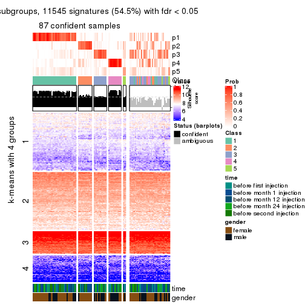</p>

</div>
<div id='tab-SD-pam-get-signatures-no-scale-5'>
<pre><code class="r">get_signatures(res, k = 6, scale_rows = FALSE)
</code></pre>

<p></p>

</div>
</div>


Compare the overlap of signatures from different k:

```r
compare_signatures(res)
```


`get_signature()` returns a data frame invisibly. TO get the list of signatures, the function
call should be assigned to a variable explicitly. In following code, if `plot` argument is set
to `FALSE`, no heatmap is plotted while only the differential analysis is performed.

```r
# code only for demonstration
tb = get_signature(res, k = ..., plot = FALSE)
```

An example of the output of `tb` is:

```
#>   which_row         fdr    mean_1    mean_2 scaled_mean_1 scaled_mean_2 km
#> 1        38 0.042760348  8.373488  9.131774    -0.5533452     0.5164555  1
#> 2        40 0.018707592  7.106213  8.469186    -0.6173731     0.5762149  1
#> 3        55 0.019134737 10.221463 11.207825    -0.6159697     0.5749050  1
#> 4        59 0.006059896  5.921854  7.869574    -0.6899429     0.6439467  1
#> 5        60 0.018055526  8.928898 10.211722    -0.6204761     0.5791110  1
#> 6        98 0.009384629 15.714769 14.887706     0.6635654    -0.6193277  2
...
```

The columns in `tb` are:

1. `which_row`: row indices corresponding to the input matrix.
2. `fdr`: FDR for the differential test. 
3. `mean_x`: The mean value in group x.
4. `scaled_mean_x`: The mean value in group x after rows are scaled.
5. `km`: Row groups if k-means clustering is applied to rows.


UMAP plot which shows how samples are separated.


<script>
$( function() {
	$( '#tabs-SD-pam-dimension-reduction' ).tabs();
} );
</script>
<div id='tabs-SD-pam-dimension-reduction'>
<ul>
<li><a href='#tab-SD-pam-dimension-reduction-1'>k = 2</a></li>
<li><a href='#tab-SD-pam-dimension-reduction-2'>k = 3</a></li>
<li><a href='#tab-SD-pam-dimension-reduction-3'>k = 4</a></li>
<li><a href='#tab-SD-pam-dimension-reduction-4'>k = 5</a></li>
<li><a href='#tab-SD-pam-dimension-reduction-5'>k = 6</a></li>
</ul>
<div id='tab-SD-pam-dimension-reduction-1'>
<pre><code class="r">dimension_reduction(res, k = 2, method = &quot;UMAP&quot;)
</code></pre>

<p></p>

</div>
<div id='tab-SD-pam-dimension-reduction-2'>
<pre><code class="r">dimension_reduction(res, k = 3, method = &quot;UMAP&quot;)
</code></pre>

<p></p>

</div>
<div id='tab-SD-pam-dimension-reduction-3'>
<pre><code class="r">dimension_reduction(res, k = 4, method = &quot;UMAP&quot;)
</code></pre>

<p></p>

</div>
<div id='tab-SD-pam-dimension-reduction-4'>
<pre><code class="r">dimension_reduction(res, k = 5, method = &quot;UMAP&quot;)
</code></pre>

<p></p>

</div>
<div id='tab-SD-pam-dimension-reduction-5'>
<pre><code class="r">dimension_reduction(res, k = 6, method = &quot;UMAP&quot;)
</code></pre>

<p></p>

</div>
</div>


Following heatmap shows how subgroups are split when increasing `k`:

```r
collect_classes(res)
```


Test correlation between subgroups and known annotations. If the known
annotation is numeric, one-way ANOVA test is applied, and if the known
annotation is discrete, chi-squared contingency table test is applied.

```r
test_to_known_factors(res)
```

```
#>          n time(p) gender(p) k
#> SD:pam 105   0.644   0.08794 2
#> SD:pam 107   0.129   0.09417 3
#> SD:pam  98   0.687   0.05038 4
#> SD:pam  87   0.719   0.00707 5
#> SD:pam  82   0.569   0.01133 6
```


If matrix rows can be associated to genes, consider to use `GO_Enrichment(res,
...)` to perform function enrichment for the signature genes.


 

---------------------------------------------------


### SD:mclust


The object with results only for a single top-value method and a single partition method 
can be extracted as:

```r
res = res_list["SD", "mclust"]
# you can also extract it by
# res = res_list["SD:mclust"]
```

A summary of `res` and all the functions that can be applied to it:

```r
res
```

```
#> A 'ConsensusPartition' object with k = 2, 3, 4, 5, 6.
#>   On a matrix with 21168 rows and 125 columns.
#>   Top rows (1000, 2000, 3000, 4000, 5000) are extracted by 'SD' method.
#>   Subgroups are detected by 'mclust' method.
#>   Performed in total 1250 partitions by row resampling.
#>   Best k for subgroups seems to be 3.
#> 
#> Following methods can be applied to this 'ConsensusPartition' object:
#>  [1] "cola_report"             "collect_classes"         "collect_plots"          
#>  [4] "collect_stats"           "colnames"                "compare_signatures"     
#>  [7] "consensus_heatmap"       "dimension_reduction"     "functional_enrichment"  
#> [10] "get_anno_col"            "get_anno"                "get_classes"            
#> [13] "get_consensus"           "get_matrix"              "get_membership"         
#> [16] "get_param"               "get_signatures"          "get_stats"              
#> [19] "is_best_k"               "is_stable_k"             "membership_heatmap"     
#> [22] "ncol"                    "nrow"                    "plot_ecdf"              
#> [25] "rownames"                "select_partition_number" "show"                   
#> [28] "suggest_best_k"          "test_to_known_factors"
```

`collect_plots()` function collects all the plots made from `res` for all `k` (number of partitions)
into one single page to provide an easy and fast comparison between different `k`.

```r
collect_plots(res)
```


The plots are:

- The first row: a plot of the ECDF (Empirical cumulative distribution
  function) curves of the consensus matrix for each `k` and the heatmap of
  predicted classes for each `k`.
- The second row: heatmaps of the consensus matrix for each `k`.
- The third row: heatmaps of the membership matrix for each `k`.
- The fouth row: heatmaps of the signatures for each `k`.

All the plots in panels can be made by individual functions and they are
plotted later in this section.

`select_partition_number()` produces several plots showing different
statistics for choosing "optimized" `k`. There are following statistics:

- ECDF curves of the consensus matrix for each `k`;
- 1-PAC. [The PAC
  score](https://en.wikipedia.org/wiki/Consensus_clustering#Over-interpretation_potential_of_consensus_clustering)
  measures the proportion of the ambiguous subgrouping.
- Mean silhouette score.
- Concordance. The mean probability of fiting the consensus class ids in all
  partitions.
- Area increased. Denote $A_k$ as the area under the ECDF curve for current
  `k`, the area increased is defined as $A_k - A_{k-1}$.
- Rand index. The percent of pairs of samples that are both in a same cluster
  or both are not in a same cluster in the partition of k and k-1.
- Jaccard index. The ratio of pairs of samples are both in a same cluster in
  the partition of k and k-1 and the pairs of samples are both in a same
  cluster in the partition k or k-1.

The detailed explanations of these statistics can be found in [the cola
vignette](http://bioconductor.org/packages/devel/bioc/vignettes/cola/inst/doc/cola.html#toc_13).

Generally speaking, lower PAC score, higher mean silhouette score or higher
concordance corresponds to better partition. Rand index and Jaccard index
measure how similar the current partition is compared to partition with `k-1`.
If they are too similar, we won't accept `k` is better than `k-1`.

```r
select_partition_number(res)
```


The numeric values for all these statistics can be obtained by `get_stats()`.

```r
get_stats(res)
```

```
#>   k 1-PAC mean_silhouette concordance area_increased  Rand Jaccard
#> 2 2 0.226           0.621       0.774         0.4240 0.545   0.545
#> 3 3 0.464           0.733       0.828         0.5158 0.697   0.486
#> 4 4 0.484           0.592       0.765         0.0800 0.863   0.648
#> 5 5 0.616           0.591       0.744         0.1111 0.827   0.504
#> 6 6 0.693           0.608       0.792         0.0429 0.937   0.732
```

`suggest_best_k()` suggests the best $k$ based on these statistics. The rules are as follows:

- All $k$ with Jaccard index larger than 0.95 are removed because the increase of
  the partition number does not provides enough extra information. If all $k$ are removed,
  the best $k$ is assigned by `NA`.
- For $k$ with 1-PAC larger than 0.9, the maximal $k$ is taken as the "best k". Other $k$ is called "optional k".
- If it does not fit the second rule. The $k$ with the highest vote of highest
  1-PAC, mean silhouette and concordance is taken as the "best k".

```r
suggest_best_k(res)
```

```
#> [1] 3
```


Following shows the table of the partitions (You need to click the **show/hide
code output** link to see it). The membership matrix (columns with name `p*`)
is inferred by
[`clue::cl_consensus()`](https://www.rdocumentation.org/link/cl_consensus?package=clue)
function with the `SE` method. Basically the value in the membership matrix
represents the probability to belong to a certain group. The finall class
label for an item is determined with the group with highest probability it
belongs to.

In `get_classes()` function, the entropy is calculated from the membership
matrix and the silhouette score is calculated from the consensus matrix.


<script>
$( function() {
	$( '#tabs-SD-mclust-get-classes' ).tabs();
} );
</script>
<div id='tabs-SD-mclust-get-classes'>
<ul>
<li><a href='#tab-SD-mclust-get-classes-1'>k = 2</a></li>
<li><a href='#tab-SD-mclust-get-classes-2'>k = 3</a></li>
<li><a href='#tab-SD-mclust-get-classes-3'>k = 4</a></li>
<li><a href='#tab-SD-mclust-get-classes-4'>k = 5</a></li>
<li><a href='#tab-SD-mclust-get-classes-5'>k = 6</a></li>
</ul>

<div id='tab-SD-mclust-get-classes-1'>
<p><a id='tab-SD-mclust-get-classes-1-a' style='color:#0366d6' href='#'>show/hide code output</a></p>
<pre><code class="r">cbind(get_classes(res, k = 2), get_membership(res, k = 2))
</code></pre>

<pre><code>#&gt;           class entropy silhouette    p1    p2
#&gt; GSM601752     1  0.9209      0.667 0.664 0.336
#&gt; GSM601782     2  0.8499      0.743 0.276 0.724
#&gt; GSM601792     1  0.5519      0.687 0.872 0.128
#&gt; GSM601797     1  0.5946      0.692 0.856 0.144
#&gt; GSM601827     1  0.9970     -0.164 0.532 0.468
#&gt; GSM601837     2  0.3879      0.669 0.076 0.924
#&gt; GSM601842     2  0.0000      0.704 0.000 1.000
#&gt; GSM601857     2  0.9358      0.703 0.352 0.648
#&gt; GSM601867     2  0.9129      0.712 0.328 0.672
#&gt; GSM601747     2  0.8016      0.738 0.244 0.756
#&gt; GSM601757     2  0.8499      0.743 0.276 0.724
#&gt; GSM601762     2  0.3431      0.627 0.064 0.936
#&gt; GSM601767     2  0.0938      0.699 0.012 0.988
#&gt; GSM601772     2  0.0376      0.703 0.004 0.996
#&gt; GSM601777     1  0.8081      0.622 0.752 0.248
#&gt; GSM601787     2  0.7883      0.713 0.236 0.764
#&gt; GSM601802     1  0.9393      0.661 0.644 0.356
#&gt; GSM601807     1  0.9881     -0.127 0.564 0.436
#&gt; GSM601812     2  0.8499      0.743 0.276 0.724
#&gt; GSM601817     2  0.8555      0.742 0.280 0.720
#&gt; GSM601822     1  0.5946      0.691 0.856 0.144
#&gt; GSM601832     2  0.0000      0.704 0.000 1.000
#&gt; GSM601847     1  0.7883      0.692 0.764 0.236
#&gt; GSM601852     2  0.8499      0.743 0.276 0.724
#&gt; GSM601862     2  0.9358      0.703 0.352 0.648
#&gt; GSM601753     1  0.9460      0.660 0.636 0.364
#&gt; GSM601783     2  0.8499      0.743 0.276 0.724
#&gt; GSM601793     1  0.5519      0.687 0.872 0.128
#&gt; GSM601798     1  0.9358      0.660 0.648 0.352
#&gt; GSM601828     2  0.8499      0.743 0.276 0.724
#&gt; GSM601838     2  0.3879      0.669 0.076 0.924
#&gt; GSM601843     2  0.0000      0.704 0.000 1.000
#&gt; GSM601858     2  0.3114      0.683 0.056 0.944
#&gt; GSM601868     2  0.9358      0.703 0.352 0.648
#&gt; GSM601748     2  0.8499      0.743 0.276 0.724
#&gt; GSM601758     2  0.8499      0.743 0.276 0.724
#&gt; GSM601763     2  0.8016      0.738 0.244 0.756
#&gt; GSM601768     2  0.0938      0.699 0.012 0.988
#&gt; GSM601773     2  0.0672      0.698 0.008 0.992
#&gt; GSM601778     1  0.7056      0.653 0.808 0.192
#&gt; GSM601788     2  0.3114      0.719 0.056 0.944
#&gt; GSM601803     1  0.9393      0.661 0.644 0.356
#&gt; GSM601808     2  0.9635      0.673 0.388 0.612
#&gt; GSM601813     2  0.8608      0.737 0.284 0.716
#&gt; GSM601818     2  0.8661      0.740 0.288 0.712
#&gt; GSM601823     1  0.5737      0.686 0.864 0.136
#&gt; GSM601833     2  0.0376      0.703 0.004 0.996
#&gt; GSM601848     1  0.6148      0.680 0.848 0.152
#&gt; GSM601853     2  0.9881      0.603 0.436 0.564
#&gt; GSM601863     2  0.9358      0.703 0.352 0.648
#&gt; GSM601754     1  0.9393      0.661 0.644 0.356
#&gt; GSM601784     2  0.0000      0.704 0.000 1.000
#&gt; GSM601794     1  0.5629      0.689 0.868 0.132
#&gt; GSM601799     1  0.9393      0.664 0.644 0.356
#&gt; GSM601829     1  0.7815      0.586 0.768 0.232
#&gt; GSM601839     2  0.3879      0.669 0.076 0.924
#&gt; GSM601844     2  0.8861      0.686 0.304 0.696
#&gt; GSM601859     2  0.0938      0.699 0.012 0.988
#&gt; GSM601869     2  0.9044      0.725 0.320 0.680
#&gt; GSM601749     2  0.8499      0.743 0.276 0.724
#&gt; GSM601759     2  0.8499      0.743 0.276 0.724
#&gt; GSM601764     2  0.7950      0.740 0.240 0.760
#&gt; GSM601769     2  0.0000      0.704 0.000 1.000
#&gt; GSM601774     2  0.0938      0.699 0.012 0.988
#&gt; GSM601779     1  0.9580      0.324 0.620 0.380
#&gt; GSM601789     2  0.0672      0.704 0.008 0.992
#&gt; GSM601804     1  0.7674      0.695 0.776 0.224
#&gt; GSM601809     2  0.8443      0.745 0.272 0.728
#&gt; GSM601814     2  0.0000      0.704 0.000 1.000
#&gt; GSM601819     2  0.8499      0.743 0.276 0.724
#&gt; GSM601824     1  0.9954      0.221 0.540 0.460
#&gt; GSM601834     2  0.0938      0.699 0.012 0.988
#&gt; GSM601849     2  0.9000      0.654 0.316 0.684
#&gt; GSM601854     2  0.8499      0.743 0.276 0.724
#&gt; GSM601864     2  0.3879      0.669 0.076 0.924
#&gt; GSM601755     1  0.9358      0.660 0.648 0.352
#&gt; GSM601785     2  0.0938      0.705 0.012 0.988
#&gt; GSM601795     1  0.5737      0.690 0.864 0.136
#&gt; GSM601800     1  0.9358      0.660 0.648 0.352
#&gt; GSM601830     1  0.9815     -0.167 0.580 0.420
#&gt; GSM601840     2  0.7602      0.741 0.220 0.780
#&gt; GSM601845     2  0.8327      0.706 0.264 0.736
#&gt; GSM601860     2  0.0938      0.708 0.012 0.988
#&gt; GSM601870     1  0.9998     -0.206 0.508 0.492
#&gt; GSM601750     2  0.8499      0.743 0.276 0.724
#&gt; GSM601760     2  0.8499      0.743 0.276 0.724
#&gt; GSM601765     2  0.0938      0.699 0.012 0.988
#&gt; GSM601770     2  0.0938      0.699 0.012 0.988
#&gt; GSM601775     2  0.8909      0.642 0.308 0.692
#&gt; GSM601780     2  0.9850      0.373 0.428 0.572
#&gt; GSM601790     2  0.3879      0.669 0.076 0.924
#&gt; GSM601805     1  0.9460      0.660 0.636 0.364
#&gt; GSM601810     2  0.9522      0.682 0.372 0.628
#&gt; GSM601815     2  0.2236      0.694 0.036 0.964
#&gt; GSM601820     2  0.8499      0.743 0.276 0.724
#&gt; GSM601825     1  0.9491      0.659 0.632 0.368
#&gt; GSM601835     2  0.7883      0.227 0.236 0.764
#&gt; GSM601850     1  0.9881      0.168 0.564 0.436
#&gt; GSM601855     1  0.9815     -0.167 0.580 0.420
#&gt; GSM601865     2  0.3879      0.669 0.076 0.924
#&gt; GSM601756     1  0.9358      0.660 0.648 0.352
#&gt; GSM601786     2  0.3431      0.678 0.064 0.936
#&gt; GSM601796     1  0.5629      0.689 0.868 0.132
#&gt; GSM601801     1  0.9358      0.660 0.648 0.352
#&gt; GSM601831     1  0.9954     -0.162 0.540 0.460
#&gt; GSM601841     2  0.8763      0.726 0.296 0.704
#&gt; GSM601846     1  0.7745      0.691 0.772 0.228
#&gt; GSM601861     2  0.0376      0.704 0.004 0.996
#&gt; GSM601871     2  0.7602      0.711 0.220 0.780
#&gt; GSM601751     2  0.5629      0.702 0.132 0.868
#&gt; GSM601761     2  0.8499      0.743 0.276 0.724
#&gt; GSM601766     2  0.7674      0.745 0.224 0.776
#&gt; GSM601771     2  0.0000      0.704 0.000 1.000
#&gt; GSM601776     1  0.9998     -0.126 0.508 0.492
#&gt; GSM601781     1  0.9000      0.490 0.684 0.316
#&gt; GSM601791     2  0.8499      0.726 0.276 0.724
#&gt; GSM601806     1  0.9427      0.661 0.640 0.360
#&gt; GSM601811     2  0.9460      0.697 0.364 0.636
#&gt; GSM601816     1  0.5629      0.687 0.868 0.132
#&gt; GSM601821     2  0.0672      0.704 0.008 0.992
#&gt; GSM601826     1  0.5737      0.686 0.864 0.136
#&gt; GSM601836     2  0.8016      0.738 0.244 0.756
#&gt; GSM601851     2  0.9866      0.387 0.432 0.568
#&gt; GSM601856     1  0.9795     -0.204 0.584 0.416
#&gt; GSM601866     2  0.8555      0.742 0.280 0.720
</code></pre>

<script>
$('#tab-SD-mclust-get-classes-1-a').parent().next().next().hide();
$('#tab-SD-mclust-get-classes-1-a').click(function(){
  $('#tab-SD-mclust-get-classes-1-a').parent().next().next().toggle();
  return(false);
});
</script>
</div>

<div id='tab-SD-mclust-get-classes-2'>
<p><a id='tab-SD-mclust-get-classes-2-a' style='color:#0366d6' href='#'>show/hide code output</a></p>
<pre><code class="r">cbind(get_classes(res, k = 3), get_membership(res, k = 3))
</code></pre>

<pre><code>#&gt;           class entropy silhouette    p1    p2    p3
#&gt; GSM601752     1  0.0747    0.85400 0.984 0.016 0.000
#&gt; GSM601782     3  0.4887    0.76707 0.000 0.228 0.772
#&gt; GSM601792     1  0.1529    0.85082 0.960 0.000 0.040
#&gt; GSM601797     1  0.1585    0.85404 0.964 0.008 0.028
#&gt; GSM601827     3  0.3276    0.85414 0.024 0.068 0.908
#&gt; GSM601837     2  0.2066    0.75318 0.000 0.940 0.060
#&gt; GSM601842     2  0.5404    0.73878 0.256 0.740 0.004
#&gt; GSM601857     3  0.2625    0.86624 0.000 0.084 0.916
#&gt; GSM601867     2  0.6442    0.16642 0.004 0.564 0.432
#&gt; GSM601747     2  0.9021    0.57502 0.184 0.552 0.264
#&gt; GSM601757     3  0.4575    0.82699 0.004 0.184 0.812
#&gt; GSM601762     2  0.5098    0.74066 0.248 0.752 0.000
#&gt; GSM601767     2  0.3551    0.78647 0.132 0.868 0.000
#&gt; GSM601772     2  0.4002    0.78452 0.160 0.840 0.000
#&gt; GSM601777     1  0.6402    0.65465 0.724 0.040 0.236
#&gt; GSM601787     2  0.6154    0.23867 0.000 0.592 0.408
#&gt; GSM601802     1  0.0747    0.85400 0.984 0.016 0.000
#&gt; GSM601807     3  0.2229    0.82300 0.044 0.012 0.944
#&gt; GSM601812     3  0.3192    0.87212 0.000 0.112 0.888
#&gt; GSM601817     3  0.2711    0.87228 0.000 0.088 0.912
#&gt; GSM601822     1  0.1163    0.85302 0.972 0.000 0.028
#&gt; GSM601832     2  0.5797    0.71479 0.280 0.712 0.008
#&gt; GSM601847     1  0.1182    0.85493 0.976 0.012 0.012
#&gt; GSM601852     3  0.3272    0.87271 0.004 0.104 0.892
#&gt; GSM601862     3  0.2165    0.86871 0.000 0.064 0.936
#&gt; GSM601753     1  0.0747    0.85400 0.984 0.016 0.000
#&gt; GSM601783     3  0.4609    0.85999 0.028 0.128 0.844
#&gt; GSM601793     1  0.3116    0.80873 0.892 0.000 0.108
#&gt; GSM601798     1  0.0747    0.85400 0.984 0.016 0.000
#&gt; GSM601828     3  0.3193    0.87376 0.004 0.100 0.896
#&gt; GSM601838     2  0.2066    0.75318 0.000 0.940 0.060
#&gt; GSM601843     2  0.4931    0.75664 0.232 0.768 0.000
#&gt; GSM601858     2  0.2066    0.75537 0.000 0.940 0.060
#&gt; GSM601868     3  0.2165    0.86871 0.000 0.064 0.936
#&gt; GSM601748     3  0.2711    0.87463 0.000 0.088 0.912
#&gt; GSM601758     3  0.3500    0.86934 0.004 0.116 0.880
#&gt; GSM601763     2  0.8752    0.60405 0.284 0.568 0.148
#&gt; GSM601768     2  0.4702    0.76997 0.212 0.788 0.000
#&gt; GSM601773     2  0.4887    0.76332 0.228 0.772 0.000
#&gt; GSM601778     1  0.3141    0.82814 0.912 0.020 0.068
#&gt; GSM601788     2  0.6526    0.74278 0.128 0.760 0.112
#&gt; GSM601803     1  0.0747    0.85400 0.984 0.016 0.000
#&gt; GSM601808     3  0.1289    0.86225 0.000 0.032 0.968
#&gt; GSM601813     3  0.3886    0.86692 0.024 0.096 0.880
#&gt; GSM601818     3  0.3482    0.83929 0.000 0.128 0.872
#&gt; GSM601823     1  0.5325    0.63426 0.748 0.004 0.248
#&gt; GSM601833     2  0.4504    0.77639 0.196 0.804 0.000
#&gt; GSM601848     1  0.5138    0.62993 0.748 0.000 0.252
#&gt; GSM601853     3  0.0424    0.85268 0.000 0.008 0.992
#&gt; GSM601863     3  0.2066    0.86834 0.000 0.060 0.940
#&gt; GSM601754     1  0.0747    0.85400 0.984 0.016 0.000
#&gt; GSM601784     2  0.3116    0.78655 0.108 0.892 0.000
#&gt; GSM601794     1  0.1411    0.85165 0.964 0.000 0.036
#&gt; GSM601799     1  0.0747    0.85400 0.984 0.016 0.000
#&gt; GSM601829     3  0.6849    0.34772 0.380 0.020 0.600
#&gt; GSM601839     2  0.2066    0.75318 0.000 0.940 0.060
#&gt; GSM601844     3  0.8691    0.30031 0.356 0.116 0.528
#&gt; GSM601859     2  0.4887    0.75941 0.228 0.772 0.000
#&gt; GSM601869     3  0.2165    0.86953 0.000 0.064 0.936
#&gt; GSM601749     3  0.3918    0.86198 0.004 0.140 0.856
#&gt; GSM601759     3  0.2945    0.87510 0.004 0.088 0.908
#&gt; GSM601764     2  0.8576    0.63521 0.252 0.596 0.152
#&gt; GSM601769     2  0.1585    0.77494 0.028 0.964 0.008
#&gt; GSM601774     2  0.2959    0.78591 0.100 0.900 0.000
#&gt; GSM601779     1  0.7002    0.55545 0.672 0.048 0.280
#&gt; GSM601789     2  0.1964    0.75486 0.000 0.944 0.056
#&gt; GSM601804     1  0.1491    0.85467 0.968 0.016 0.016
#&gt; GSM601809     2  0.6209    0.35529 0.004 0.628 0.368
#&gt; GSM601814     2  0.1163    0.77539 0.028 0.972 0.000
#&gt; GSM601819     3  0.6936    0.70831 0.064 0.232 0.704
#&gt; GSM601824     1  0.6875    0.57669 0.700 0.244 0.056
#&gt; GSM601834     2  0.4605    0.77327 0.204 0.796 0.000
#&gt; GSM601849     1  0.8891   -0.00795 0.448 0.120 0.432
#&gt; GSM601854     3  0.3983    0.85757 0.004 0.144 0.852
#&gt; GSM601864     2  0.2066    0.75318 0.000 0.940 0.060
#&gt; GSM601755     1  0.0747    0.85400 0.984 0.016 0.000
#&gt; GSM601785     2  0.6522    0.71820 0.272 0.696 0.032
#&gt; GSM601795     1  0.1289    0.85239 0.968 0.000 0.032
#&gt; GSM601800     1  0.0747    0.85400 0.984 0.016 0.000
#&gt; GSM601830     3  0.1999    0.82716 0.036 0.012 0.952
#&gt; GSM601840     2  0.8138    0.67724 0.232 0.636 0.132
#&gt; GSM601845     2  0.8971    0.52041 0.336 0.520 0.144
#&gt; GSM601860     2  0.5219    0.77470 0.196 0.788 0.016
#&gt; GSM601870     3  0.2313    0.83015 0.024 0.032 0.944
#&gt; GSM601750     3  0.3349    0.87205 0.004 0.108 0.888
#&gt; GSM601760     3  0.4845    0.84937 0.052 0.104 0.844
#&gt; GSM601765     2  0.5058    0.74678 0.244 0.756 0.000
#&gt; GSM601770     2  0.4452    0.77764 0.192 0.808 0.000
#&gt; GSM601775     1  0.7838   -0.29133 0.488 0.460 0.052
#&gt; GSM601780     3  0.9191    0.03903 0.424 0.148 0.428
#&gt; GSM601790     2  0.1964    0.75486 0.000 0.944 0.056
#&gt; GSM601805     1  0.0747    0.85400 0.984 0.016 0.000
#&gt; GSM601810     3  0.2772    0.87523 0.004 0.080 0.916
#&gt; GSM601815     2  0.1964    0.75486 0.000 0.944 0.056
#&gt; GSM601820     3  0.3425    0.87118 0.004 0.112 0.884
#&gt; GSM601825     1  0.0747    0.85400 0.984 0.016 0.000
#&gt; GSM601835     2  0.6322    0.71200 0.276 0.700 0.024
#&gt; GSM601850     1  0.5174    0.75382 0.832 0.092 0.076
#&gt; GSM601855     3  0.1832    0.82935 0.036 0.008 0.956
#&gt; GSM601865     2  0.2066    0.75318 0.000 0.940 0.060
#&gt; GSM601756     1  0.0747    0.85400 0.984 0.016 0.000
#&gt; GSM601786     2  0.1964    0.75486 0.000 0.944 0.056
#&gt; GSM601796     1  0.2200    0.84505 0.940 0.004 0.056
#&gt; GSM601801     1  0.0747    0.85400 0.984 0.016 0.000
#&gt; GSM601831     3  0.2703    0.85791 0.016 0.056 0.928
#&gt; GSM601841     3  0.6059    0.80111 0.048 0.188 0.764
#&gt; GSM601846     1  0.2187    0.85288 0.948 0.024 0.028
#&gt; GSM601861     2  0.1585    0.76600 0.008 0.964 0.028
#&gt; GSM601871     2  0.5948    0.35315 0.000 0.640 0.360
#&gt; GSM601751     2  0.7150    0.60354 0.348 0.616 0.036
#&gt; GSM601761     3  0.7666    0.71021 0.128 0.192 0.680
#&gt; GSM601766     2  0.6523    0.74416 0.228 0.724 0.048
#&gt; GSM601771     2  0.4634    0.78374 0.164 0.824 0.012
#&gt; GSM601776     1  0.7990    0.05851 0.488 0.060 0.452
#&gt; GSM601781     1  0.6882    0.66188 0.732 0.096 0.172
#&gt; GSM601791     3  0.9243    0.45298 0.232 0.236 0.532
#&gt; GSM601806     1  0.1031    0.85013 0.976 0.024 0.000
#&gt; GSM601811     3  0.2796    0.86445 0.000 0.092 0.908
#&gt; GSM601816     1  0.2959    0.81831 0.900 0.000 0.100
#&gt; GSM601821     2  0.1399    0.76421 0.004 0.968 0.028
#&gt; GSM601826     1  0.5365    0.62708 0.744 0.004 0.252
#&gt; GSM601836     2  0.9050    0.55447 0.304 0.532 0.164
#&gt; GSM601851     3  0.8546    0.34278 0.348 0.108 0.544
#&gt; GSM601856     3  0.0661    0.85170 0.004 0.008 0.988
#&gt; GSM601866     3  0.2261    0.87123 0.000 0.068 0.932
</code></pre>

<script>
$('#tab-SD-mclust-get-classes-2-a').parent().next().next().hide();
$('#tab-SD-mclust-get-classes-2-a').click(function(){
  $('#tab-SD-mclust-get-classes-2-a').parent().next().next().toggle();
  return(false);
});
</script>
</div>

<div id='tab-SD-mclust-get-classes-3'>
<p><a id='tab-SD-mclust-get-classes-3-a' style='color:#0366d6' href='#'>show/hide code output</a></p>
<pre><code class="r">cbind(get_classes(res, k = 4), get_membership(res, k = 4))
</code></pre>

<pre><code>#&gt;           class entropy silhouette    p1    p2    p3    p4
#&gt; GSM601752     4  0.0188     0.7242 0.000 0.000 0.004 0.996
#&gt; GSM601782     1  0.3554     0.6966 0.844 0.136 0.020 0.000
#&gt; GSM601792     4  0.5489     0.5988 0.240 0.000 0.060 0.700
#&gt; GSM601797     4  0.1716     0.7182 0.000 0.000 0.064 0.936
#&gt; GSM601827     1  0.3400     0.6494 0.876 0.004 0.044 0.076
#&gt; GSM601837     2  0.3450     0.5807 0.008 0.836 0.156 0.000
#&gt; GSM601842     2  0.5324     0.6299 0.004 0.644 0.016 0.336
#&gt; GSM601857     1  0.0657     0.7064 0.984 0.004 0.012 0.000
#&gt; GSM601867     1  0.7634    -0.3547 0.424 0.208 0.368 0.000
#&gt; GSM601747     1  0.7003     0.4716 0.624 0.256 0.036 0.084
#&gt; GSM601757     1  0.3697     0.7123 0.852 0.100 0.048 0.000
#&gt; GSM601762     2  0.4431     0.6709 0.000 0.696 0.000 0.304
#&gt; GSM601767     2  0.4053     0.7188 0.004 0.768 0.000 0.228
#&gt; GSM601772     2  0.4018     0.7196 0.004 0.772 0.000 0.224
#&gt; GSM601777     4  0.4739     0.6751 0.044 0.008 0.160 0.788
#&gt; GSM601787     2  0.7688    -0.1737 0.220 0.416 0.364 0.000
#&gt; GSM601802     4  0.0000     0.7237 0.000 0.000 0.000 1.000
#&gt; GSM601807     3  0.5038     0.9312 0.336 0.000 0.652 0.012
#&gt; GSM601812     1  0.0188     0.7131 0.996 0.000 0.004 0.000
#&gt; GSM601817     1  0.0188     0.7112 0.996 0.000 0.004 0.000
#&gt; GSM601822     4  0.1557     0.7171 0.000 0.000 0.056 0.944
#&gt; GSM601832     2  0.5513     0.6125 0.008 0.628 0.016 0.348
#&gt; GSM601847     4  0.0592     0.7241 0.000 0.000 0.016 0.984
#&gt; GSM601852     1  0.1854     0.7227 0.940 0.048 0.012 0.000
#&gt; GSM601862     1  0.1978     0.6691 0.928 0.004 0.068 0.000
#&gt; GSM601753     4  0.0376     0.7221 0.000 0.004 0.004 0.992
#&gt; GSM601783     1  0.4167     0.7068 0.824 0.040 0.132 0.004
#&gt; GSM601793     4  0.5361     0.6148 0.224 0.000 0.060 0.716
#&gt; GSM601798     4  0.0000     0.7237 0.000 0.000 0.000 1.000
#&gt; GSM601828     1  0.0188     0.7112 0.996 0.000 0.004 0.000
#&gt; GSM601838     2  0.3450     0.5807 0.008 0.836 0.156 0.000
#&gt; GSM601843     2  0.4483     0.6909 0.004 0.712 0.000 0.284
#&gt; GSM601858     2  0.6518     0.6541 0.020 0.684 0.148 0.148
#&gt; GSM601868     1  0.2266     0.6502 0.912 0.004 0.084 0.000
#&gt; GSM601748     1  0.0188     0.7112 0.996 0.000 0.004 0.000
#&gt; GSM601758     1  0.2480     0.7173 0.904 0.008 0.088 0.000
#&gt; GSM601763     1  0.9834    -0.0391 0.304 0.224 0.176 0.296
#&gt; GSM601768     2  0.4560     0.6826 0.004 0.700 0.000 0.296
#&gt; GSM601773     2  0.4551     0.7064 0.004 0.724 0.004 0.268
#&gt; GSM601778     4  0.6129     0.6317 0.184 0.004 0.124 0.688
#&gt; GSM601788     2  0.8129     0.5389 0.068 0.560 0.152 0.220
#&gt; GSM601803     4  0.0188     0.7213 0.000 0.004 0.000 0.996
#&gt; GSM601808     1  0.3208     0.5302 0.848 0.004 0.148 0.000
#&gt; GSM601813     1  0.3533     0.7190 0.864 0.080 0.056 0.000
#&gt; GSM601818     1  0.0927     0.7137 0.976 0.008 0.016 0.000
#&gt; GSM601823     4  0.6537     0.2137 0.424 0.000 0.076 0.500
#&gt; GSM601833     2  0.4252     0.7106 0.004 0.744 0.000 0.252
#&gt; GSM601848     4  0.6451     0.1272 0.456 0.000 0.068 0.476
#&gt; GSM601853     1  0.3208     0.5295 0.848 0.004 0.148 0.000
#&gt; GSM601863     1  0.1004     0.7040 0.972 0.004 0.024 0.000
#&gt; GSM601754     4  0.0000     0.7237 0.000 0.000 0.000 1.000
#&gt; GSM601784     2  0.3751     0.7226 0.004 0.800 0.000 0.196
#&gt; GSM601794     4  0.5288     0.6165 0.224 0.000 0.056 0.720
#&gt; GSM601799     4  0.0524     0.7213 0.000 0.004 0.008 0.988
#&gt; GSM601829     4  0.7491     0.2849 0.352 0.004 0.164 0.480
#&gt; GSM601839     2  0.3450     0.5807 0.008 0.836 0.156 0.000
#&gt; GSM601844     1  0.7241     0.6011 0.632 0.128 0.200 0.040
#&gt; GSM601859     2  0.4560     0.6827 0.004 0.700 0.000 0.296
#&gt; GSM601869     1  0.0657     0.7094 0.984 0.004 0.012 0.000
#&gt; GSM601749     1  0.4236     0.7072 0.824 0.088 0.088 0.000
#&gt; GSM601759     1  0.0895     0.7187 0.976 0.004 0.020 0.000
#&gt; GSM601764     1  0.8511     0.4935 0.544 0.180 0.168 0.108
#&gt; GSM601769     2  0.0779     0.6576 0.004 0.980 0.000 0.016
#&gt; GSM601774     2  0.3870     0.7220 0.004 0.788 0.000 0.208
#&gt; GSM601779     1  0.6667     0.2267 0.556 0.004 0.084 0.356
#&gt; GSM601789     2  0.5154     0.6369 0.012 0.776 0.140 0.072
#&gt; GSM601804     4  0.0657     0.7230 0.000 0.004 0.012 0.984
#&gt; GSM601809     1  0.6373     0.3479 0.636 0.248 0.116 0.000
#&gt; GSM601814     2  0.0524     0.6533 0.004 0.988 0.000 0.008
#&gt; GSM601819     1  0.4829     0.6837 0.776 0.068 0.156 0.000
#&gt; GSM601824     4  0.6625     0.4911 0.176 0.132 0.020 0.672
#&gt; GSM601834     2  0.4188     0.7141 0.004 0.752 0.000 0.244
#&gt; GSM601849     1  0.8241     0.5367 0.568 0.108 0.200 0.124
#&gt; GSM601854     1  0.2216     0.7142 0.908 0.092 0.000 0.000
#&gt; GSM601864     2  0.3450     0.5807 0.008 0.836 0.156 0.000
#&gt; GSM601755     4  0.0000     0.7237 0.000 0.000 0.000 1.000
#&gt; GSM601785     2  0.7087     0.5097 0.020 0.536 0.080 0.364
#&gt; GSM601795     4  0.4562     0.6713 0.152 0.000 0.056 0.792
#&gt; GSM601800     4  0.0000     0.7237 0.000 0.000 0.000 1.000
#&gt; GSM601830     3  0.4661     0.9387 0.348 0.000 0.652 0.000
#&gt; GSM601840     4  0.9740    -0.0567 0.228 0.268 0.160 0.344
#&gt; GSM601845     4  0.9615     0.0713 0.216 0.224 0.168 0.392
#&gt; GSM601860     2  0.4908     0.6824 0.016 0.692 0.000 0.292
#&gt; GSM601870     3  0.4040     0.8580 0.248 0.000 0.752 0.000
#&gt; GSM601750     1  0.0188     0.7138 0.996 0.004 0.000 0.000
#&gt; GSM601760     1  0.3523     0.7127 0.856 0.032 0.112 0.000
#&gt; GSM601765     2  0.4677     0.6625 0.004 0.680 0.000 0.316
#&gt; GSM601770     2  0.4053     0.7188 0.004 0.768 0.000 0.228
#&gt; GSM601775     4  0.9204     0.1494 0.224 0.208 0.120 0.448
#&gt; GSM601780     1  0.7636     0.5757 0.616 0.068 0.188 0.128
#&gt; GSM601790     2  0.3351     0.5868 0.008 0.844 0.148 0.000
#&gt; GSM601805     4  0.0000     0.7237 0.000 0.000 0.000 1.000
#&gt; GSM601810     1  0.1639     0.6941 0.952 0.004 0.036 0.008
#&gt; GSM601815     2  0.3249     0.5919 0.008 0.852 0.140 0.000
#&gt; GSM601820     1  0.1576     0.7206 0.948 0.004 0.048 0.000
#&gt; GSM601825     4  0.0188     0.7213 0.000 0.004 0.000 0.996
#&gt; GSM601835     2  0.6540     0.3320 0.036 0.476 0.020 0.468
#&gt; GSM601850     4  0.8624     0.3677 0.284 0.100 0.124 0.492
#&gt; GSM601855     3  0.4661     0.9387 0.348 0.000 0.652 0.000
#&gt; GSM601865     2  0.3450     0.5807 0.008 0.836 0.156 0.000
#&gt; GSM601756     4  0.0000     0.7237 0.000 0.000 0.000 1.000
#&gt; GSM601786     2  0.3351     0.5868 0.008 0.844 0.148 0.000
#&gt; GSM601796     4  0.5394     0.6112 0.228 0.000 0.060 0.712
#&gt; GSM601801     4  0.0188     0.7213 0.000 0.004 0.000 0.996
#&gt; GSM601831     1  0.1545     0.6984 0.952 0.000 0.040 0.008
#&gt; GSM601841     1  0.5925     0.6631 0.724 0.136 0.128 0.012
#&gt; GSM601846     4  0.2334     0.7125 0.000 0.004 0.088 0.908
#&gt; GSM601861     2  0.2714     0.6135 0.004 0.884 0.112 0.000
#&gt; GSM601871     2  0.7535    -0.0647 0.200 0.464 0.336 0.000
#&gt; GSM601751     2  0.8820     0.2944 0.100 0.408 0.124 0.368
#&gt; GSM601761     1  0.5889     0.6441 0.696 0.116 0.188 0.000
#&gt; GSM601766     2  0.8580     0.2778 0.212 0.412 0.040 0.336
#&gt; GSM601771     2  0.4631     0.7061 0.004 0.728 0.008 0.260
#&gt; GSM601776     1  0.7701     0.5679 0.620 0.080 0.148 0.152
#&gt; GSM601781     4  0.8101     0.3921 0.296 0.040 0.156 0.508
#&gt; GSM601791     1  0.6382     0.6219 0.664 0.136 0.196 0.004
#&gt; GSM601806     4  0.1022     0.7026 0.000 0.032 0.000 0.968
#&gt; GSM601811     1  0.1489     0.6837 0.952 0.004 0.044 0.000
#&gt; GSM601816     4  0.5657     0.5897 0.244 0.000 0.068 0.688
#&gt; GSM601821     2  0.2831     0.6096 0.004 0.876 0.120 0.000
#&gt; GSM601826     4  0.6661     0.1032 0.456 0.000 0.084 0.460
#&gt; GSM601836     1  0.8959     0.4272 0.496 0.180 0.188 0.136
#&gt; GSM601851     1  0.7403     0.5970 0.632 0.072 0.200 0.096
#&gt; GSM601856     1  0.4395     0.3711 0.776 0.004 0.204 0.016
#&gt; GSM601866     1  0.0336     0.7102 0.992 0.000 0.008 0.000
</code></pre>

<script>
$('#tab-SD-mclust-get-classes-3-a').parent().next().next().hide();
$('#tab-SD-mclust-get-classes-3-a').click(function(){
  $('#tab-SD-mclust-get-classes-3-a').parent().next().next().toggle();
  return(false);
});
</script>
</div>

<div id='tab-SD-mclust-get-classes-4'>
<p><a id='tab-SD-mclust-get-classes-4-a' style='color:#0366d6' href='#'>show/hide code output</a></p>
<pre><code class="r">cbind(get_classes(res, k = 5), get_membership(res, k = 5))
</code></pre>

<pre><code>#&gt;           class entropy silhouette    p1    p2    p3    p4    p5
#&gt; GSM601752     4  0.0000     0.7930 0.000 0.000 0.000 1.000 0.000
#&gt; GSM601782     3  0.4996     0.3529 0.420 0.032 0.548 0.000 0.000
#&gt; GSM601792     1  0.4437     0.2126 0.532 0.000 0.004 0.464 0.000
#&gt; GSM601797     4  0.3010     0.6515 0.172 0.000 0.004 0.824 0.000
#&gt; GSM601827     3  0.4982     0.7421 0.176 0.000 0.732 0.020 0.072
#&gt; GSM601837     5  0.4268     0.7080 0.000 0.444 0.000 0.000 0.556
#&gt; GSM601842     2  0.4169     0.7795 0.016 0.724 0.004 0.256 0.000
#&gt; GSM601857     3  0.0794     0.7977 0.028 0.000 0.972 0.000 0.000
#&gt; GSM601867     5  0.5146     0.1756 0.016 0.016 0.428 0.000 0.540
#&gt; GSM601747     3  0.6950    -0.0343 0.320 0.316 0.360 0.004 0.000
#&gt; GSM601757     3  0.4768     0.4587 0.384 0.024 0.592 0.000 0.000
#&gt; GSM601762     2  0.4083     0.7782 0.008 0.728 0.000 0.256 0.008
#&gt; GSM601767     2  0.3452     0.7841 0.000 0.756 0.000 0.244 0.000
#&gt; GSM601772     2  0.3607     0.7849 0.000 0.752 0.004 0.244 0.000
#&gt; GSM601777     4  0.4610     0.2352 0.432 0.000 0.012 0.556 0.000
#&gt; GSM601787     5  0.6118     0.4959 0.016 0.116 0.280 0.000 0.588
#&gt; GSM601802     4  0.0000     0.7930 0.000 0.000 0.000 1.000 0.000
#&gt; GSM601807     3  0.5504     0.2480 0.064 0.000 0.488 0.000 0.448
#&gt; GSM601812     3  0.1197     0.8039 0.048 0.000 0.952 0.000 0.000
#&gt; GSM601817     3  0.0865     0.8002 0.024 0.000 0.972 0.000 0.004
#&gt; GSM601822     4  0.3579     0.5363 0.240 0.000 0.004 0.756 0.000
#&gt; GSM601832     2  0.4508     0.7731 0.032 0.708 0.004 0.256 0.000
#&gt; GSM601847     4  0.0963     0.7784 0.036 0.000 0.000 0.964 0.000
#&gt; GSM601852     3  0.1792     0.8067 0.084 0.000 0.916 0.000 0.000
#&gt; GSM601862     3  0.0771     0.7919 0.020 0.000 0.976 0.000 0.004
#&gt; GSM601753     4  0.0000     0.7930 0.000 0.000 0.000 1.000 0.000
#&gt; GSM601783     3  0.3661     0.6986 0.276 0.000 0.724 0.000 0.000
#&gt; GSM601793     4  0.4443    -0.0475 0.472 0.000 0.004 0.524 0.000
#&gt; GSM601798     4  0.0000     0.7930 0.000 0.000 0.000 1.000 0.000
#&gt; GSM601828     3  0.1410     0.8054 0.060 0.000 0.940 0.000 0.000
#&gt; GSM601838     5  0.4268     0.7080 0.000 0.444 0.000 0.000 0.556
#&gt; GSM601843     2  0.3883     0.7841 0.008 0.744 0.000 0.244 0.004
#&gt; GSM601858     5  0.6529     0.3936 0.000 0.332 0.012 0.152 0.504
#&gt; GSM601868     3  0.0671     0.7885 0.016 0.000 0.980 0.000 0.004
#&gt; GSM601748     3  0.1410     0.8065 0.060 0.000 0.940 0.000 0.000
#&gt; GSM601758     3  0.3123     0.7740 0.184 0.004 0.812 0.000 0.000
#&gt; GSM601763     1  0.3135     0.7025 0.868 0.088 0.024 0.020 0.000
#&gt; GSM601768     2  0.3607     0.7851 0.004 0.752 0.000 0.244 0.000
#&gt; GSM601773     2  0.3861     0.7797 0.008 0.728 0.000 0.264 0.000
#&gt; GSM601778     4  0.4443     0.0415 0.472 0.000 0.004 0.524 0.000
#&gt; GSM601788     2  0.6287     0.6567 0.184 0.552 0.004 0.260 0.000
#&gt; GSM601803     4  0.0000     0.7930 0.000 0.000 0.000 1.000 0.000
#&gt; GSM601808     3  0.1012     0.7879 0.020 0.000 0.968 0.000 0.012
#&gt; GSM601813     3  0.2966     0.7754 0.184 0.000 0.816 0.000 0.000
#&gt; GSM601818     3  0.2389     0.7662 0.116 0.000 0.880 0.000 0.004
#&gt; GSM601823     1  0.4014     0.6332 0.728 0.000 0.016 0.256 0.000
#&gt; GSM601833     2  0.3607     0.7851 0.004 0.752 0.000 0.244 0.000
#&gt; GSM601848     1  0.4040     0.6269 0.724 0.000 0.016 0.260 0.000
#&gt; GSM601853     3  0.0671     0.7879 0.016 0.000 0.980 0.000 0.004
#&gt; GSM601863     3  0.0955     0.7956 0.028 0.000 0.968 0.000 0.004
#&gt; GSM601754     4  0.0000     0.7930 0.000 0.000 0.000 1.000 0.000
#&gt; GSM601784     2  0.3579     0.7809 0.000 0.756 0.000 0.240 0.004
#&gt; GSM601794     4  0.4397     0.1019 0.432 0.000 0.004 0.564 0.000
#&gt; GSM601799     4  0.0000     0.7930 0.000 0.000 0.000 1.000 0.000
#&gt; GSM601829     1  0.5002     0.4037 0.612 0.000 0.044 0.344 0.000
#&gt; GSM601839     5  0.4273     0.7063 0.000 0.448 0.000 0.000 0.552
#&gt; GSM601844     1  0.1913     0.7338 0.932 0.008 0.044 0.016 0.000
#&gt; GSM601859     2  0.3607     0.7851 0.004 0.752 0.000 0.244 0.000
#&gt; GSM601869     3  0.0963     0.8032 0.036 0.000 0.964 0.000 0.000
#&gt; GSM601749     3  0.3171     0.7789 0.176 0.008 0.816 0.000 0.000
#&gt; GSM601759     3  0.2329     0.8013 0.124 0.000 0.876 0.000 0.000
#&gt; GSM601764     1  0.2694     0.7061 0.884 0.076 0.040 0.000 0.000
#&gt; GSM601769     2  0.3555     0.3419 0.000 0.824 0.000 0.052 0.124
#&gt; GSM601774     2  0.3607     0.7851 0.004 0.752 0.000 0.244 0.000
#&gt; GSM601779     1  0.4096     0.6828 0.760 0.000 0.040 0.200 0.000
#&gt; GSM601789     2  0.5799    -0.3872 0.000 0.492 0.000 0.092 0.416
#&gt; GSM601804     4  0.1928     0.7541 0.072 0.004 0.004 0.920 0.000
#&gt; GSM601809     3  0.6605     0.4035 0.120 0.264 0.572 0.000 0.044
#&gt; GSM601814     2  0.1300     0.4879 0.000 0.956 0.000 0.028 0.016
#&gt; GSM601819     1  0.4481    -0.0235 0.576 0.008 0.416 0.000 0.000
#&gt; GSM601824     4  0.5256    -0.0301 0.472 0.024 0.012 0.492 0.000
#&gt; GSM601834     2  0.3607     0.7851 0.004 0.752 0.000 0.244 0.000
#&gt; GSM601849     1  0.2251     0.7344 0.916 0.008 0.052 0.024 0.000
#&gt; GSM601854     3  0.2516     0.7941 0.140 0.000 0.860 0.000 0.000
#&gt; GSM601864     5  0.4268     0.7080 0.000 0.444 0.000 0.000 0.556
#&gt; GSM601755     4  0.0000     0.7930 0.000 0.000 0.000 1.000 0.000
#&gt; GSM601785     2  0.5508     0.7284 0.096 0.636 0.004 0.264 0.000
#&gt; GSM601795     4  0.4151     0.3391 0.344 0.000 0.004 0.652 0.000
#&gt; GSM601800     4  0.0000     0.7930 0.000 0.000 0.000 1.000 0.000
#&gt; GSM601830     3  0.5447     0.2621 0.060 0.000 0.500 0.000 0.440
#&gt; GSM601840     2  0.6996     0.5541 0.244 0.476 0.020 0.260 0.000
#&gt; GSM601845     2  0.6349     0.2239 0.424 0.444 0.008 0.124 0.000
#&gt; GSM601860     2  0.3607     0.7851 0.004 0.752 0.000 0.244 0.000
#&gt; GSM601870     5  0.5285     0.0484 0.060 0.000 0.356 0.000 0.584
#&gt; GSM601750     3  0.2471     0.7960 0.136 0.000 0.864 0.000 0.000
#&gt; GSM601760     3  0.4403     0.3999 0.436 0.004 0.560 0.000 0.000
#&gt; GSM601765     2  0.3961     0.7836 0.016 0.736 0.000 0.248 0.000
#&gt; GSM601770     2  0.3607     0.7851 0.004 0.752 0.000 0.244 0.000
#&gt; GSM601775     4  0.6876    -0.1103 0.368 0.256 0.004 0.372 0.000
#&gt; GSM601780     1  0.3210     0.7334 0.860 0.008 0.040 0.092 0.000
#&gt; GSM601790     5  0.4297     0.6870 0.000 0.472 0.000 0.000 0.528
#&gt; GSM601805     4  0.0000     0.7930 0.000 0.000 0.000 1.000 0.000
#&gt; GSM601810     3  0.3875     0.7818 0.124 0.000 0.804 0.000 0.072
#&gt; GSM601815     2  0.4300    -0.6684 0.000 0.524 0.000 0.000 0.476
#&gt; GSM601820     3  0.2773     0.7841 0.164 0.000 0.836 0.000 0.000
#&gt; GSM601825     4  0.0609     0.7791 0.000 0.020 0.000 0.980 0.000
#&gt; GSM601835     2  0.5704     0.7394 0.064 0.636 0.000 0.272 0.028
#&gt; GSM601850     1  0.3312     0.7209 0.840 0.016 0.012 0.132 0.000
#&gt; GSM601855     3  0.5452     0.2513 0.060 0.000 0.492 0.000 0.448
#&gt; GSM601865     5  0.4278     0.7043 0.000 0.452 0.000 0.000 0.548
#&gt; GSM601756     4  0.0000     0.7930 0.000 0.000 0.000 1.000 0.000
#&gt; GSM601786     5  0.4307     0.6632 0.000 0.496 0.000 0.000 0.504
#&gt; GSM601796     1  0.4390     0.3059 0.568 0.000 0.004 0.428 0.000
#&gt; GSM601801     4  0.0000     0.7930 0.000 0.000 0.000 1.000 0.000
#&gt; GSM601831     3  0.4238     0.7705 0.136 0.000 0.776 0.000 0.088
#&gt; GSM601841     1  0.4859     0.1081 0.608 0.024 0.364 0.004 0.000
#&gt; GSM601846     4  0.2488     0.7243 0.124 0.000 0.004 0.872 0.000
#&gt; GSM601861     2  0.4088    -0.4980 0.000 0.632 0.000 0.000 0.368
#&gt; GSM601871     5  0.6154     0.5503 0.016 0.144 0.236 0.000 0.604
#&gt; GSM601751     2  0.6472     0.5807 0.184 0.504 0.004 0.308 0.000
#&gt; GSM601761     1  0.2833     0.6512 0.852 0.004 0.140 0.004 0.000
#&gt; GSM601766     2  0.5545     0.6956 0.128 0.676 0.012 0.184 0.000
#&gt; GSM601771     2  0.3607     0.7849 0.000 0.752 0.004 0.244 0.000
#&gt; GSM601776     1  0.3757     0.7149 0.816 0.008 0.040 0.136 0.000
#&gt; GSM601781     1  0.3399     0.6887 0.812 0.012 0.004 0.172 0.000
#&gt; GSM601791     1  0.1913     0.7330 0.932 0.008 0.044 0.016 0.000
#&gt; GSM601806     4  0.0609     0.7789 0.000 0.020 0.000 0.980 0.000
#&gt; GSM601811     3  0.1800     0.7942 0.048 0.000 0.932 0.000 0.020
#&gt; GSM601816     1  0.4390     0.3078 0.568 0.000 0.004 0.428 0.000
#&gt; GSM601821     2  0.4015    -0.4625 0.000 0.652 0.000 0.000 0.348
#&gt; GSM601826     1  0.3988     0.6363 0.732 0.000 0.016 0.252 0.000
#&gt; GSM601836     1  0.2504     0.7123 0.900 0.064 0.032 0.004 0.000
#&gt; GSM601851     1  0.2438     0.7378 0.908 0.008 0.040 0.044 0.000
#&gt; GSM601856     3  0.2464     0.7445 0.012 0.000 0.892 0.004 0.092
#&gt; GSM601866     3  0.0865     0.8007 0.024 0.000 0.972 0.000 0.004
</code></pre>

<script>
$('#tab-SD-mclust-get-classes-4-a').parent().next().next().hide();
$('#tab-SD-mclust-get-classes-4-a').click(function(){
  $('#tab-SD-mclust-get-classes-4-a').parent().next().next().toggle();
  return(false);
});
</script>
</div>

<div id='tab-SD-mclust-get-classes-5'>
<p><a id='tab-SD-mclust-get-classes-5-a' style='color:#0366d6' href='#'>show/hide code output</a></p>
<pre><code class="r">cbind(get_classes(res, k = 6), get_membership(res, k = 6))
</code></pre>

<pre><code>#&gt;           class entropy silhouette    p1    p2    p3    p4    p5    p6
#&gt; GSM601752     4  0.0865    0.80436 0.000 0.036 0.000 0.964 0.000 0.000
#&gt; GSM601782     1  0.3023    0.70205 0.808 0.004 0.008 0.000 0.000 0.180
#&gt; GSM601792     4  0.4839   -0.00208 0.000 0.000 0.012 0.508 0.032 0.448
#&gt; GSM601797     4  0.2544    0.73784 0.000 0.004 0.008 0.888 0.028 0.072
#&gt; GSM601827     1  0.4937    0.57052 0.684 0.000 0.028 0.076 0.000 0.212
#&gt; GSM601837     5  0.0865    0.74887 0.000 0.036 0.000 0.000 0.964 0.000
#&gt; GSM601842     2  0.0993    0.83644 0.000 0.964 0.000 0.024 0.000 0.012
#&gt; GSM601857     1  0.3245    0.57280 0.796 0.000 0.184 0.016 0.004 0.000
#&gt; GSM601867     3  0.6516    0.48080 0.288 0.012 0.476 0.020 0.204 0.000
#&gt; GSM601747     1  0.5283    0.35185 0.528 0.092 0.004 0.000 0.000 0.376
#&gt; GSM601757     1  0.2859    0.70856 0.828 0.000 0.016 0.000 0.000 0.156
#&gt; GSM601762     2  0.2264    0.77876 0.000 0.888 0.000 0.096 0.012 0.004
#&gt; GSM601767     2  0.0146    0.84171 0.000 0.996 0.000 0.004 0.000 0.000
#&gt; GSM601772     2  0.0260    0.84155 0.000 0.992 0.000 0.008 0.000 0.000
#&gt; GSM601777     4  0.5669    0.23291 0.048 0.004 0.008 0.544 0.032 0.364
#&gt; GSM601787     3  0.5796    0.30129 0.080 0.008 0.464 0.020 0.428 0.000
#&gt; GSM601802     4  0.0865    0.80436 0.000 0.036 0.000 0.964 0.000 0.000
#&gt; GSM601807     3  0.1007    0.77346 0.044 0.000 0.956 0.000 0.000 0.000
#&gt; GSM601812     1  0.1719    0.71419 0.924 0.000 0.016 0.000 0.000 0.060
#&gt; GSM601817     1  0.1707    0.68108 0.928 0.000 0.056 0.012 0.004 0.000
#&gt; GSM601822     4  0.3514    0.67383 0.000 0.004 0.012 0.812 0.032 0.140
#&gt; GSM601832     2  0.1686    0.81326 0.000 0.924 0.000 0.064 0.000 0.012
#&gt; GSM601847     4  0.3657    0.64363 0.000 0.028 0.004 0.776 0.004 0.188
#&gt; GSM601852     1  0.2848    0.70787 0.816 0.000 0.008 0.000 0.000 0.176
#&gt; GSM601862     1  0.3678    0.52531 0.748 0.000 0.228 0.016 0.008 0.000
#&gt; GSM601753     4  0.0865    0.80436 0.000 0.036 0.000 0.964 0.000 0.000
#&gt; GSM601783     1  0.4256    0.47730 0.520 0.000 0.016 0.000 0.000 0.464
#&gt; GSM601793     4  0.4846   -0.02897 0.000 0.000 0.012 0.496 0.032 0.460
#&gt; GSM601798     4  0.0865    0.80436 0.000 0.036 0.000 0.964 0.000 0.000
#&gt; GSM601828     1  0.1498    0.70582 0.940 0.000 0.028 0.000 0.000 0.032
#&gt; GSM601838     5  0.0865    0.74887 0.000 0.036 0.000 0.000 0.964 0.000
#&gt; GSM601843     2  0.0603    0.84027 0.000 0.980 0.000 0.016 0.000 0.004
#&gt; GSM601858     5  0.4033    0.40273 0.000 0.404 0.004 0.004 0.588 0.000
#&gt; GSM601868     1  0.3828    0.49955 0.724 0.000 0.252 0.016 0.008 0.000
#&gt; GSM601748     1  0.1867    0.71535 0.916 0.000 0.020 0.000 0.000 0.064
#&gt; GSM601758     1  0.4116    0.53250 0.572 0.000 0.012 0.000 0.000 0.416
#&gt; GSM601763     6  0.1570    0.67201 0.004 0.028 0.016 0.008 0.000 0.944
#&gt; GSM601768     2  0.0146    0.84171 0.000 0.996 0.000 0.004 0.000 0.000
#&gt; GSM601773     2  0.0777    0.83765 0.000 0.972 0.000 0.024 0.004 0.000
#&gt; GSM601778     6  0.4942    0.19726 0.008 0.000 0.008 0.412 0.032 0.540
#&gt; GSM601788     2  0.3594    0.73453 0.048 0.820 0.000 0.028 0.000 0.104
#&gt; GSM601803     4  0.0865    0.80436 0.000 0.036 0.000 0.964 0.000 0.000
#&gt; GSM601808     1  0.3744    0.49771 0.724 0.000 0.256 0.016 0.004 0.000
#&gt; GSM601813     1  0.3528    0.65475 0.700 0.000 0.004 0.000 0.000 0.296
#&gt; GSM601818     1  0.2350    0.67225 0.896 0.000 0.076 0.016 0.004 0.008
#&gt; GSM601823     6  0.4594    0.37350 0.000 0.000 0.008 0.360 0.032 0.600
#&gt; GSM601833     2  0.0146    0.84171 0.000 0.996 0.000 0.004 0.000 0.000
#&gt; GSM601848     6  0.4444    0.46517 0.000 0.000 0.008 0.316 0.032 0.644
#&gt; GSM601853     1  0.3812    0.48468 0.712 0.000 0.268 0.016 0.004 0.000
#&gt; GSM601863     1  0.3459    0.55244 0.768 0.000 0.212 0.016 0.004 0.000
#&gt; GSM601754     4  0.1010    0.80360 0.000 0.036 0.004 0.960 0.000 0.000
#&gt; GSM601784     2  0.0291    0.84114 0.000 0.992 0.000 0.004 0.004 0.000
#&gt; GSM601794     4  0.4844   -0.02006 0.000 0.000 0.012 0.500 0.032 0.456
#&gt; GSM601799     4  0.0865    0.80436 0.000 0.036 0.000 0.964 0.000 0.000
#&gt; GSM601829     6  0.5850    0.44380 0.108 0.000 0.012 0.268 0.024 0.588
#&gt; GSM601839     5  0.0865    0.74887 0.000 0.036 0.000 0.000 0.964 0.000
#&gt; GSM601844     6  0.1325    0.67886 0.016 0.000 0.012 0.012 0.004 0.956
#&gt; GSM601859     2  0.0146    0.84171 0.000 0.996 0.000 0.004 0.000 0.000
#&gt; GSM601869     1  0.1285    0.68408 0.944 0.000 0.052 0.000 0.004 0.000
#&gt; GSM601749     1  0.4062    0.51402 0.552 0.000 0.008 0.000 0.000 0.440
#&gt; GSM601759     1  0.3101    0.67085 0.756 0.000 0.000 0.000 0.000 0.244
#&gt; GSM601764     6  0.3964    0.56680 0.068 0.120 0.016 0.004 0.000 0.792
#&gt; GSM601769     2  0.1910    0.76154 0.000 0.892 0.000 0.000 0.108 0.000
#&gt; GSM601774     2  0.0291    0.84062 0.000 0.992 0.000 0.004 0.004 0.000
#&gt; GSM601779     6  0.3698    0.61818 0.008 0.000 0.008 0.196 0.016 0.772
#&gt; GSM601789     2  0.3907    0.13934 0.000 0.588 0.000 0.004 0.408 0.000
#&gt; GSM601804     4  0.3904    0.54368 0.000 0.032 0.000 0.732 0.004 0.232
#&gt; GSM601809     1  0.3988    0.68615 0.816 0.080 0.024 0.016 0.004 0.060
#&gt; GSM601814     2  0.2562    0.69351 0.000 0.828 0.000 0.000 0.172 0.000
#&gt; GSM601819     1  0.4467    0.38761 0.496 0.004 0.020 0.000 0.000 0.480
#&gt; GSM601824     6  0.4387    0.35560 0.000 0.020 0.000 0.404 0.004 0.572
#&gt; GSM601834     2  0.0146    0.84171 0.000 0.996 0.000 0.004 0.000 0.000
#&gt; GSM601849     6  0.0837    0.67289 0.020 0.000 0.004 0.004 0.000 0.972
#&gt; GSM601854     1  0.2212    0.71896 0.880 0.000 0.008 0.000 0.000 0.112
#&gt; GSM601864     5  0.0865    0.74887 0.000 0.036 0.000 0.000 0.964 0.000
#&gt; GSM601755     4  0.0865    0.80436 0.000 0.036 0.000 0.964 0.000 0.000
#&gt; GSM601785     2  0.1719    0.81523 0.000 0.924 0.000 0.016 0.000 0.060
#&gt; GSM601795     4  0.4844   -0.01468 0.000 0.000 0.012 0.500 0.032 0.456
#&gt; GSM601800     4  0.0865    0.80436 0.000 0.036 0.000 0.964 0.000 0.000
#&gt; GSM601830     3  0.1007    0.77689 0.044 0.000 0.956 0.000 0.000 0.000
#&gt; GSM601840     2  0.4963    0.56112 0.032 0.672 0.000 0.048 0.004 0.244
#&gt; GSM601845     6  0.6128    0.28113 0.020 0.348 0.000 0.144 0.004 0.484
#&gt; GSM601860     2  0.0146    0.84171 0.000 0.996 0.000 0.004 0.000 0.000
#&gt; GSM601870     3  0.1563    0.75100 0.012 0.000 0.932 0.000 0.056 0.000
#&gt; GSM601750     1  0.2092    0.71528 0.876 0.000 0.000 0.000 0.000 0.124
#&gt; GSM601760     1  0.4237    0.53739 0.584 0.000 0.020 0.000 0.000 0.396
#&gt; GSM601765     2  0.0547    0.83925 0.000 0.980 0.000 0.020 0.000 0.000
#&gt; GSM601770     2  0.0146    0.84171 0.000 0.996 0.000 0.004 0.000 0.000
#&gt; GSM601775     6  0.4334    0.63414 0.000 0.108 0.020 0.092 0.008 0.772
#&gt; GSM601780     6  0.1728    0.68646 0.008 0.000 0.004 0.064 0.000 0.924
#&gt; GSM601790     5  0.1610    0.73980 0.000 0.084 0.000 0.000 0.916 0.000
#&gt; GSM601805     4  0.1010    0.80360 0.000 0.036 0.004 0.960 0.000 0.000
#&gt; GSM601810     1  0.2084    0.69923 0.916 0.000 0.024 0.016 0.000 0.044
#&gt; GSM601815     5  0.3390    0.60971 0.000 0.296 0.000 0.000 0.704 0.000
#&gt; GSM601820     1  0.3360    0.66807 0.732 0.000 0.004 0.000 0.000 0.264
#&gt; GSM601825     4  0.1010    0.80360 0.000 0.036 0.004 0.960 0.000 0.000
#&gt; GSM601835     2  0.5957    0.38167 0.024 0.560 0.000 0.320 0.060 0.036
#&gt; GSM601850     6  0.2757    0.66590 0.000 0.008 0.004 0.136 0.004 0.848
#&gt; GSM601855     3  0.0790    0.77537 0.032 0.000 0.968 0.000 0.000 0.000
#&gt; GSM601865     5  0.1007    0.74963 0.000 0.044 0.000 0.000 0.956 0.000
#&gt; GSM601756     4  0.0865    0.80436 0.000 0.036 0.000 0.964 0.000 0.000
#&gt; GSM601786     5  0.3489    0.61930 0.000 0.288 0.000 0.004 0.708 0.000
#&gt; GSM601796     6  0.4849    0.01599 0.000 0.000 0.012 0.476 0.032 0.480
#&gt; GSM601801     4  0.0865    0.80436 0.000 0.036 0.000 0.964 0.000 0.000
#&gt; GSM601831     1  0.2833    0.69230 0.860 0.000 0.024 0.012 0.000 0.104
#&gt; GSM601841     1  0.4169    0.48092 0.532 0.000 0.012 0.000 0.000 0.456
#&gt; GSM601846     4  0.3430    0.69070 0.004 0.008 0.008 0.828 0.028 0.124
#&gt; GSM601861     2  0.3706    0.28110 0.000 0.620 0.000 0.000 0.380 0.000
#&gt; GSM601871     5  0.5718   -0.40870 0.072 0.008 0.436 0.020 0.464 0.000
#&gt; GSM601751     2  0.3923    0.68464 0.000 0.772 0.000 0.080 0.004 0.144
#&gt; GSM601761     6  0.3261    0.39513 0.204 0.000 0.016 0.000 0.000 0.780
#&gt; GSM601766     2  0.3862    0.35980 0.000 0.608 0.000 0.004 0.000 0.388
#&gt; GSM601771     2  0.0603    0.83856 0.000 0.980 0.000 0.004 0.000 0.016
#&gt; GSM601776     6  0.2317    0.67603 0.008 0.000 0.008 0.088 0.004 0.892
#&gt; GSM601781     6  0.3949    0.56430 0.004 0.012 0.008 0.224 0.008 0.744
#&gt; GSM601791     6  0.1074    0.66345 0.028 0.000 0.012 0.000 0.000 0.960
#&gt; GSM601806     4  0.1320    0.79326 0.000 0.036 0.000 0.948 0.016 0.000
#&gt; GSM601811     1  0.2865    0.63029 0.848 0.000 0.128 0.016 0.004 0.004
#&gt; GSM601816     6  0.4847    0.06496 0.000 0.000 0.012 0.464 0.032 0.492
#&gt; GSM601821     2  0.3810    0.12902 0.000 0.572 0.000 0.000 0.428 0.000
#&gt; GSM601826     6  0.4518    0.42742 0.000 0.000 0.008 0.336 0.032 0.624
#&gt; GSM601836     6  0.3636    0.59703 0.080 0.068 0.016 0.004 0.004 0.828
#&gt; GSM601851     6  0.0820    0.68422 0.012 0.000 0.000 0.016 0.000 0.972
#&gt; GSM601856     1  0.3756    0.52051 0.736 0.000 0.240 0.016 0.000 0.008
#&gt; GSM601866     1  0.2928    0.70218 0.856 0.000 0.084 0.000 0.004 0.056
</code></pre>

<script>
$('#tab-SD-mclust-get-classes-5-a').parent().next().next().hide();
$('#tab-SD-mclust-get-classes-5-a').click(function(){
  $('#tab-SD-mclust-get-classes-5-a').parent().next().next().toggle();
  return(false);
});
</script>
</div>
</div>

Heatmaps for the consensus matrix. It visualizes the probability of two
samples to be in a same group.


<script>
$( function() {
	$( '#tabs-SD-mclust-consensus-heatmap' ).tabs();
} );
</script>
<div id='tabs-SD-mclust-consensus-heatmap'>
<ul>
<li><a href='#tab-SD-mclust-consensus-heatmap-1'>k = 2</a></li>
<li><a href='#tab-SD-mclust-consensus-heatmap-2'>k = 3</a></li>
<li><a href='#tab-SD-mclust-consensus-heatmap-3'>k = 4</a></li>
<li><a href='#tab-SD-mclust-consensus-heatmap-4'>k = 5</a></li>
<li><a href='#tab-SD-mclust-consensus-heatmap-5'>k = 6</a></li>
</ul>
<div id='tab-SD-mclust-consensus-heatmap-1'>
<pre><code class="r">consensus_heatmap(res, k = 2)
</code></pre>

<p></p>

</div>
<div id='tab-SD-mclust-consensus-heatmap-2'>
<pre><code class="r">consensus_heatmap(res, k = 3)
</code></pre>

<p></p>

</div>
<div id='tab-SD-mclust-consensus-heatmap-3'>
<pre><code class="r">consensus_heatmap(res, k = 4)
</code></pre>

<p></p>

</div>
<div id='tab-SD-mclust-consensus-heatmap-4'>
<pre><code class="r">consensus_heatmap(res, k = 5)
</code></pre>

<p>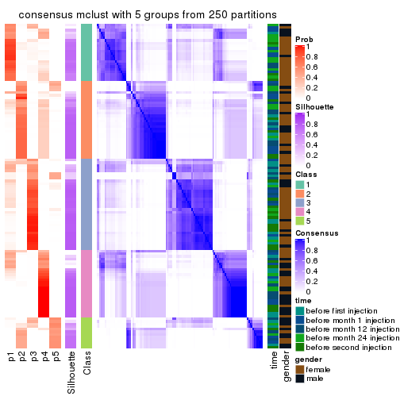</p>

</div>
<div id='tab-SD-mclust-consensus-heatmap-5'>
<pre><code class="r">consensus_heatmap(res, k = 6)
</code></pre>

<p></p>

</div>
</div>

Heatmaps for the membership of samples in all partitions to see how consistent they are:


<script>
$( function() {
	$( '#tabs-SD-mclust-membership-heatmap' ).tabs();
} );
</script>
<div id='tabs-SD-mclust-membership-heatmap'>
<ul>
<li><a href='#tab-SD-mclust-membership-heatmap-1'>k = 2</a></li>
<li><a href='#tab-SD-mclust-membership-heatmap-2'>k = 3</a></li>
<li><a href='#tab-SD-mclust-membership-heatmap-3'>k = 4</a></li>
<li><a href='#tab-SD-mclust-membership-heatmap-4'>k = 5</a></li>
<li><a href='#tab-SD-mclust-membership-heatmap-5'>k = 6</a></li>
</ul>
<div id='tab-SD-mclust-membership-heatmap-1'>
<pre><code class="r">membership_heatmap(res, k = 2)
</code></pre>

<p></p>

</div>
<div id='tab-SD-mclust-membership-heatmap-2'>
<pre><code class="r">membership_heatmap(res, k = 3)
</code></pre>

<p></p>

</div>
<div id='tab-SD-mclust-membership-heatmap-3'>
<pre><code class="r">membership_heatmap(res, k = 4)
</code></pre>

<p></p>

</div>
<div id='tab-SD-mclust-membership-heatmap-4'>
<pre><code class="r">membership_heatmap(res, k = 5)
</code></pre>

<p></p>

</div>
<div id='tab-SD-mclust-membership-heatmap-5'>
<pre><code class="r">membership_heatmap(res, k = 6)
</code></pre>

<p></p>

</div>
</div>

As soon as we have had the classes for columns, we can look for signatures
which are significantly different between classes which can be candidate marks
for certain classes. Following are the heatmaps for signatures.


Signature heatmaps where rows are scaled:


<script>
$( function() {
	$( '#tabs-SD-mclust-get-signatures' ).tabs();
} );
</script>
<div id='tabs-SD-mclust-get-signatures'>
<ul>
<li><a href='#tab-SD-mclust-get-signatures-1'>k = 2</a></li>
<li><a href='#tab-SD-mclust-get-signatures-2'>k = 3</a></li>
<li><a href='#tab-SD-mclust-get-signatures-3'>k = 4</a></li>
<li><a href='#tab-SD-mclust-get-signatures-4'>k = 5</a></li>
<li><a href='#tab-SD-mclust-get-signatures-5'>k = 6</a></li>
</ul>
<div id='tab-SD-mclust-get-signatures-1'>
<pre><code class="r">get_signatures(res, k = 2)
</code></pre>

<p></p>

</div>
<div id='tab-SD-mclust-get-signatures-2'>
<pre><code class="r">get_signatures(res, k = 3)
</code></pre>

<p></p>

</div>
<div id='tab-SD-mclust-get-signatures-3'>
<pre><code class="r">get_signatures(res, k = 4)
</code></pre>

<p></p>

</div>
<div id='tab-SD-mclust-get-signatures-4'>
<pre><code class="r">get_signatures(res, k = 5)
</code></pre>

<p></p>

</div>
<div id='tab-SD-mclust-get-signatures-5'>
<pre><code class="r">get_signatures(res, k = 6)
</code></pre>

<p>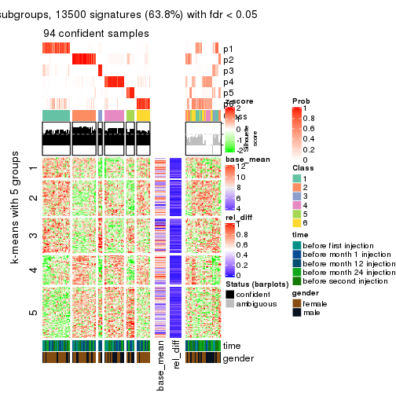</p>

</div>
</div>


Signature heatmaps where rows are not scaled:


<script>
$( function() {
	$( '#tabs-SD-mclust-get-signatures-no-scale' ).tabs();
} );
</script>
<div id='tabs-SD-mclust-get-signatures-no-scale'>
<ul>
<li><a href='#tab-SD-mclust-get-signatures-no-scale-1'>k = 2</a></li>
<li><a href='#tab-SD-mclust-get-signatures-no-scale-2'>k = 3</a></li>
<li><a href='#tab-SD-mclust-get-signatures-no-scale-3'>k = 4</a></li>
<li><a href='#tab-SD-mclust-get-signatures-no-scale-4'>k = 5</a></li>
<li><a href='#tab-SD-mclust-get-signatures-no-scale-5'>k = 6</a></li>
</ul>
<div id='tab-SD-mclust-get-signatures-no-scale-1'>
<pre><code class="r">get_signatures(res, k = 2, scale_rows = FALSE)
</code></pre>

<p></p>

</div>
<div id='tab-SD-mclust-get-signatures-no-scale-2'>
<pre><code class="r">get_signatures(res, k = 3, scale_rows = FALSE)
</code></pre>

<p></p>

</div>
<div id='tab-SD-mclust-get-signatures-no-scale-3'>
<pre><code class="r">get_signatures(res, k = 4, scale_rows = FALSE)
</code></pre>

<p></p>

</div>
<div id='tab-SD-mclust-get-signatures-no-scale-4'>
<pre><code class="r">get_signatures(res, k = 5, scale_rows = FALSE)
</code></pre>

<p></p>

</div>
<div id='tab-SD-mclust-get-signatures-no-scale-5'>
<pre><code class="r">get_signatures(res, k = 6, scale_rows = FALSE)
</code></pre>

<p></p>

</div>
</div>


Compare the overlap of signatures from different k:

```r
compare_signatures(res)
```


`get_signature()` returns a data frame invisibly. TO get the list of signatures, the function
call should be assigned to a variable explicitly. In following code, if `plot` argument is set
to `FALSE`, no heatmap is plotted while only the differential analysis is performed.

```r
# code only for demonstration
tb = get_signature(res, k = ..., plot = FALSE)
```

An example of the output of `tb` is:

```
#>   which_row         fdr    mean_1    mean_2 scaled_mean_1 scaled_mean_2 km
#> 1        38 0.042760348  8.373488  9.131774    -0.5533452     0.5164555  1
#> 2        40 0.018707592  7.106213  8.469186    -0.6173731     0.5762149  1
#> 3        55 0.019134737 10.221463 11.207825    -0.6159697     0.5749050  1
#> 4        59 0.006059896  5.921854  7.869574    -0.6899429     0.6439467  1
#> 5        60 0.018055526  8.928898 10.211722    -0.6204761     0.5791110  1
#> 6        98 0.009384629 15.714769 14.887706     0.6635654    -0.6193277  2
...
```

The columns in `tb` are:

1. `which_row`: row indices corresponding to the input matrix.
2. `fdr`: FDR for the differential test. 
3. `mean_x`: The mean value in group x.
4. `scaled_mean_x`: The mean value in group x after rows are scaled.
5. `km`: Row groups if k-means clustering is applied to rows.


UMAP plot which shows how samples are separated.


<script>
$( function() {
	$( '#tabs-SD-mclust-dimension-reduction' ).tabs();
} );
</script>
<div id='tabs-SD-mclust-dimension-reduction'>
<ul>
<li><a href='#tab-SD-mclust-dimension-reduction-1'>k = 2</a></li>
<li><a href='#tab-SD-mclust-dimension-reduction-2'>k = 3</a></li>
<li><a href='#tab-SD-mclust-dimension-reduction-3'>k = 4</a></li>
<li><a href='#tab-SD-mclust-dimension-reduction-4'>k = 5</a></li>
<li><a href='#tab-SD-mclust-dimension-reduction-5'>k = 6</a></li>
</ul>
<div id='tab-SD-mclust-dimension-reduction-1'>
<pre><code class="r">dimension_reduction(res, k = 2, method = &quot;UMAP&quot;)
</code></pre>

<p></p>

</div>
<div id='tab-SD-mclust-dimension-reduction-2'>
<pre><code class="r">dimension_reduction(res, k = 3, method = &quot;UMAP&quot;)
</code></pre>

<p></p>

</div>
<div id='tab-SD-mclust-dimension-reduction-3'>
<pre><code class="r">dimension_reduction(res, k = 4, method = &quot;UMAP&quot;)
</code></pre>

<p></p>

</div>
<div id='tab-SD-mclust-dimension-reduction-4'>
<pre><code class="r">dimension_reduction(res, k = 5, method = &quot;UMAP&quot;)
</code></pre>

<p></p>

</div>
<div id='tab-SD-mclust-dimension-reduction-5'>
<pre><code class="r">dimension_reduction(res, k = 6, method = &quot;UMAP&quot;)
</code></pre>

<p></p>

</div>
</div>


Following heatmap shows how subgroups are split when increasing `k`:

```r
collect_classes(res)
```


Test correlation between subgroups and known annotations. If the known
annotation is numeric, one-way ANOVA test is applied, and if the known
annotation is discrete, chi-squared contingency table test is applied.

```r
test_to_known_factors(res)
```

```
#>             n time(p) gender(p) k
#> SD:mclust 110   0.906   0.03019 2
#> SD:mclust 113   0.908   0.27900 3
#> SD:mclust 102   0.376   0.05727 4
#> SD:mclust  93   0.504   0.00652 5
#> SD:mclust  94   0.452   0.03278 6
```


If matrix rows can be associated to genes, consider to use `GO_Enrichment(res,
...)` to perform function enrichment for the signature genes.


 

---------------------------------------------------


### SD:NMF


The object with results only for a single top-value method and a single partition method 
can be extracted as:

```r
res = res_list["SD", "NMF"]
# you can also extract it by
# res = res_list["SD:NMF"]
```

A summary of `res` and all the functions that can be applied to it:

```r
res
```

```
#> A 'ConsensusPartition' object with k = 2, 3, 4, 5, 6.
#>   On a matrix with 21168 rows and 125 columns.
#>   Top rows (1000, 2000, 3000, 4000, 5000) are extracted by 'SD' method.
#>   Subgroups are detected by 'NMF' method.
#>   Performed in total 1250 partitions by row resampling.
#>   Best k for subgroups seems to be 2.
#> 
#> Following methods can be applied to this 'ConsensusPartition' object:
#>  [1] "cola_report"             "collect_classes"         "collect_plots"          
#>  [4] "collect_stats"           "colnames"                "compare_signatures"     
#>  [7] "consensus_heatmap"       "dimension_reduction"     "functional_enrichment"  
#> [10] "get_anno_col"            "get_anno"                "get_classes"            
#> [13] "get_consensus"           "get_matrix"              "get_membership"         
#> [16] "get_param"               "get_signatures"          "get_stats"              
#> [19] "is_best_k"               "is_stable_k"             "membership_heatmap"     
#> [22] "ncol"                    "nrow"                    "plot_ecdf"              
#> [25] "rownames"                "select_partition_number" "show"                   
#> [28] "suggest_best_k"          "test_to_known_factors"
```

`collect_plots()` function collects all the plots made from `res` for all `k` (number of partitions)
into one single page to provide an easy and fast comparison between different `k`.

```r
collect_plots(res)
```


The plots are:

- The first row: a plot of the ECDF (Empirical cumulative distribution
  function) curves of the consensus matrix for each `k` and the heatmap of
  predicted classes for each `k`.
- The second row: heatmaps of the consensus matrix for each `k`.
- The third row: heatmaps of the membership matrix for each `k`.
- The fouth row: heatmaps of the signatures for each `k`.

All the plots in panels can be made by individual functions and they are
plotted later in this section.

`select_partition_number()` produces several plots showing different
statistics for choosing "optimized" `k`. There are following statistics:

- ECDF curves of the consensus matrix for each `k`;
- 1-PAC. [The PAC
  score](https://en.wikipedia.org/wiki/Consensus_clustering#Over-interpretation_potential_of_consensus_clustering)
  measures the proportion of the ambiguous subgrouping.
- Mean silhouette score.
- Concordance. The mean probability of fiting the consensus class ids in all
  partitions.
- Area increased. Denote $A_k$ as the area under the ECDF curve for current
  `k`, the area increased is defined as $A_k - A_{k-1}$.
- Rand index. The percent of pairs of samples that are both in a same cluster
  or both are not in a same cluster in the partition of k and k-1.
- Jaccard index. The ratio of pairs of samples are both in a same cluster in
  the partition of k and k-1 and the pairs of samples are both in a same
  cluster in the partition k or k-1.

The detailed explanations of these statistics can be found in [the cola
vignette](http://bioconductor.org/packages/devel/bioc/vignettes/cola/inst/doc/cola.html#toc_13).

Generally speaking, lower PAC score, higher mean silhouette score or higher
concordance corresponds to better partition. Rand index and Jaccard index
measure how similar the current partition is compared to partition with `k-1`.
If they are too similar, we won't accept `k` is better than `k-1`.

```r
select_partition_number(res)
```


The numeric values for all these statistics can be obtained by `get_stats()`.

```r
get_stats(res)
```

```
#>   k 1-PAC mean_silhouette concordance area_increased  Rand Jaccard
#> 2 2 0.853           0.911       0.964         0.5027 0.496   0.496
#> 3 3 0.473           0.632       0.759         0.3045 0.797   0.613
#> 4 4 0.442           0.498       0.710         0.1258 0.786   0.473
#> 5 5 0.500           0.397       0.594         0.0703 0.891   0.612
#> 6 6 0.529           0.366       0.588         0.0450 0.854   0.439
```

`suggest_best_k()` suggests the best $k$ based on these statistics. The rules are as follows:

- All $k$ with Jaccard index larger than 0.95 are removed because the increase of
  the partition number does not provides enough extra information. If all $k$ are removed,
  the best $k$ is assigned by `NA`.
- For $k$ with 1-PAC larger than 0.9, the maximal $k$ is taken as the "best k". Other $k$ is called "optional k".
- If it does not fit the second rule. The $k$ with the highest vote of highest
  1-PAC, mean silhouette and concordance is taken as the "best k".

```r
suggest_best_k(res)
```

```
#> [1] 2
```


Following shows the table of the partitions (You need to click the **show/hide
code output** link to see it). The membership matrix (columns with name `p*`)
is inferred by
[`clue::cl_consensus()`](https://www.rdocumentation.org/link/cl_consensus?package=clue)
function with the `SE` method. Basically the value in the membership matrix
represents the probability to belong to a certain group. The finall class
label for an item is determined with the group with highest probability it
belongs to.

In `get_classes()` function, the entropy is calculated from the membership
matrix and the silhouette score is calculated from the consensus matrix.


<script>
$( function() {
	$( '#tabs-SD-NMF-get-classes' ).tabs();
} );
</script>
<div id='tabs-SD-NMF-get-classes'>
<ul>
<li><a href='#tab-SD-NMF-get-classes-1'>k = 2</a></li>
<li><a href='#tab-SD-NMF-get-classes-2'>k = 3</a></li>
<li><a href='#tab-SD-NMF-get-classes-3'>k = 4</a></li>
<li><a href='#tab-SD-NMF-get-classes-4'>k = 5</a></li>
<li><a href='#tab-SD-NMF-get-classes-5'>k = 6</a></li>
</ul>

<div id='tab-SD-NMF-get-classes-1'>
<p><a id='tab-SD-NMF-get-classes-1-a' style='color:#0366d6' href='#'>show/hide code output</a></p>
<pre><code class="r">cbind(get_classes(res, k = 2), get_membership(res, k = 2))
</code></pre>

<pre><code>#&gt;           class entropy silhouette    p1    p2
#&gt; GSM601752     2  0.0000     0.9613 0.000 1.000
#&gt; GSM601782     1  0.0000     0.9614 1.000 0.000
#&gt; GSM601792     1  0.0000     0.9614 1.000 0.000
#&gt; GSM601797     2  0.6438     0.7947 0.164 0.836
#&gt; GSM601827     1  0.0000     0.9614 1.000 0.000
#&gt; GSM601837     2  0.0000     0.9613 0.000 1.000
#&gt; GSM601842     2  0.0000     0.9613 0.000 1.000
#&gt; GSM601857     1  0.0000     0.9614 1.000 0.000
#&gt; GSM601867     2  0.2236     0.9333 0.036 0.964
#&gt; GSM601747     1  0.5294     0.8529 0.880 0.120
#&gt; GSM601757     1  0.0000     0.9614 1.000 0.000
#&gt; GSM601762     2  0.0000     0.9613 0.000 1.000
#&gt; GSM601767     2  0.0000     0.9613 0.000 1.000
#&gt; GSM601772     2  0.0000     0.9613 0.000 1.000
#&gt; GSM601777     2  0.9866     0.2352 0.432 0.568
#&gt; GSM601787     2  0.0000     0.9613 0.000 1.000
#&gt; GSM601802     2  0.0000     0.9613 0.000 1.000
#&gt; GSM601807     1  0.9944     0.1693 0.544 0.456
#&gt; GSM601812     1  0.0000     0.9614 1.000 0.000
#&gt; GSM601817     1  0.0000     0.9614 1.000 0.000
#&gt; GSM601822     1  0.9983     0.0730 0.524 0.476
#&gt; GSM601832     2  0.0000     0.9613 0.000 1.000
#&gt; GSM601847     2  0.0672     0.9560 0.008 0.992
#&gt; GSM601852     1  0.0000     0.9614 1.000 0.000
#&gt; GSM601862     1  0.0000     0.9614 1.000 0.000
#&gt; GSM601753     2  0.0000     0.9613 0.000 1.000
#&gt; GSM601783     1  0.0000     0.9614 1.000 0.000
#&gt; GSM601793     1  0.0000     0.9614 1.000 0.000
#&gt; GSM601798     2  0.0000     0.9613 0.000 1.000
#&gt; GSM601828     1  0.0000     0.9614 1.000 0.000
#&gt; GSM601838     2  0.0000     0.9613 0.000 1.000
#&gt; GSM601843     2  0.0000     0.9613 0.000 1.000
#&gt; GSM601858     2  0.0000     0.9613 0.000 1.000
#&gt; GSM601868     1  0.0000     0.9614 1.000 0.000
#&gt; GSM601748     1  0.0000     0.9614 1.000 0.000
#&gt; GSM601758     1  0.0000     0.9614 1.000 0.000
#&gt; GSM601763     1  0.7528     0.7218 0.784 0.216
#&gt; GSM601768     2  0.0000     0.9613 0.000 1.000
#&gt; GSM601773     2  0.0000     0.9613 0.000 1.000
#&gt; GSM601778     1  0.2423     0.9306 0.960 0.040
#&gt; GSM601788     2  0.0376     0.9587 0.004 0.996
#&gt; GSM601803     2  0.0000     0.9613 0.000 1.000
#&gt; GSM601808     1  0.0000     0.9614 1.000 0.000
#&gt; GSM601813     1  0.0000     0.9614 1.000 0.000
#&gt; GSM601818     1  0.0000     0.9614 1.000 0.000
#&gt; GSM601823     1  0.0000     0.9614 1.000 0.000
#&gt; GSM601833     2  0.0000     0.9613 0.000 1.000
#&gt; GSM601848     1  0.0000     0.9614 1.000 0.000
#&gt; GSM601853     1  0.0000     0.9614 1.000 0.000
#&gt; GSM601863     1  0.0000     0.9614 1.000 0.000
#&gt; GSM601754     2  0.0000     0.9613 0.000 1.000
#&gt; GSM601784     2  0.0000     0.9613 0.000 1.000
#&gt; GSM601794     1  0.0376     0.9587 0.996 0.004
#&gt; GSM601799     2  0.0000     0.9613 0.000 1.000
#&gt; GSM601829     1  0.0000     0.9614 1.000 0.000
#&gt; GSM601839     2  0.0000     0.9613 0.000 1.000
#&gt; GSM601844     1  0.0000     0.9614 1.000 0.000
#&gt; GSM601859     2  0.0000     0.9613 0.000 1.000
#&gt; GSM601869     1  0.0000     0.9614 1.000 0.000
#&gt; GSM601749     1  0.0000     0.9614 1.000 0.000
#&gt; GSM601759     1  0.0000     0.9614 1.000 0.000
#&gt; GSM601764     1  0.0376     0.9587 0.996 0.004
#&gt; GSM601769     2  0.0000     0.9613 0.000 1.000
#&gt; GSM601774     2  0.0000     0.9613 0.000 1.000
#&gt; GSM601779     1  0.0000     0.9614 1.000 0.000
#&gt; GSM601789     2  0.0000     0.9613 0.000 1.000
#&gt; GSM601804     2  0.2236     0.9333 0.036 0.964
#&gt; GSM601809     1  0.8813     0.5791 0.700 0.300
#&gt; GSM601814     2  0.0000     0.9613 0.000 1.000
#&gt; GSM601819     1  0.0000     0.9614 1.000 0.000
#&gt; GSM601824     2  0.9087     0.5265 0.324 0.676
#&gt; GSM601834     2  0.0000     0.9613 0.000 1.000
#&gt; GSM601849     1  0.0000     0.9614 1.000 0.000
#&gt; GSM601854     1  0.0000     0.9614 1.000 0.000
#&gt; GSM601864     2  0.0000     0.9613 0.000 1.000
#&gt; GSM601755     2  0.0000     0.9613 0.000 1.000
#&gt; GSM601785     2  0.0000     0.9613 0.000 1.000
#&gt; GSM601795     1  0.5294     0.8552 0.880 0.120
#&gt; GSM601800     2  0.0000     0.9613 0.000 1.000
#&gt; GSM601830     1  0.7139     0.7540 0.804 0.196
#&gt; GSM601840     2  0.1633     0.9440 0.024 0.976
#&gt; GSM601845     2  0.7950     0.6783 0.240 0.760
#&gt; GSM601860     2  0.0000     0.9613 0.000 1.000
#&gt; GSM601870     2  1.0000    -0.0237 0.496 0.504
#&gt; GSM601750     1  0.0000     0.9614 1.000 0.000
#&gt; GSM601760     1  0.0000     0.9614 1.000 0.000
#&gt; GSM601765     2  0.0000     0.9613 0.000 1.000
#&gt; GSM601770     2  0.0000     0.9613 0.000 1.000
#&gt; GSM601775     2  0.7883     0.6912 0.236 0.764
#&gt; GSM601780     1  0.0000     0.9614 1.000 0.000
#&gt; GSM601790     2  0.0000     0.9613 0.000 1.000
#&gt; GSM601805     2  0.0000     0.9613 0.000 1.000
#&gt; GSM601810     1  0.0000     0.9614 1.000 0.000
#&gt; GSM601815     2  0.0000     0.9613 0.000 1.000
#&gt; GSM601820     1  0.0000     0.9614 1.000 0.000
#&gt; GSM601825     2  0.0000     0.9613 0.000 1.000
#&gt; GSM601835     2  0.0000     0.9613 0.000 1.000
#&gt; GSM601850     1  0.5294     0.8550 0.880 0.120
#&gt; GSM601855     1  0.0672     0.9559 0.992 0.008
#&gt; GSM601865     2  0.0000     0.9613 0.000 1.000
#&gt; GSM601756     2  0.0000     0.9613 0.000 1.000
#&gt; GSM601786     2  0.0000     0.9613 0.000 1.000
#&gt; GSM601796     1  0.0000     0.9614 1.000 0.000
#&gt; GSM601801     2  0.0000     0.9613 0.000 1.000
#&gt; GSM601831     1  0.0000     0.9614 1.000 0.000
#&gt; GSM601841     1  0.0000     0.9614 1.000 0.000
#&gt; GSM601846     2  0.1414     0.9471 0.020 0.980
#&gt; GSM601861     2  0.0000     0.9613 0.000 1.000
#&gt; GSM601871     2  0.0000     0.9613 0.000 1.000
#&gt; GSM601751     2  0.0938     0.9532 0.012 0.988
#&gt; GSM601761     1  0.0000     0.9614 1.000 0.000
#&gt; GSM601766     2  0.7950     0.6860 0.240 0.760
#&gt; GSM601771     2  0.0376     0.9587 0.004 0.996
#&gt; GSM601776     1  0.0000     0.9614 1.000 0.000
#&gt; GSM601781     1  0.6148     0.8171 0.848 0.152
#&gt; GSM601791     1  0.0000     0.9614 1.000 0.000
#&gt; GSM601806     2  0.0000     0.9613 0.000 1.000
#&gt; GSM601811     1  0.0000     0.9614 1.000 0.000
#&gt; GSM601816     1  0.0000     0.9614 1.000 0.000
#&gt; GSM601821     2  0.0000     0.9613 0.000 1.000
#&gt; GSM601826     1  0.0000     0.9614 1.000 0.000
#&gt; GSM601836     1  0.1843     0.9403 0.972 0.028
#&gt; GSM601851     1  0.0000     0.9614 1.000 0.000
#&gt; GSM601856     1  0.0000     0.9614 1.000 0.000
#&gt; GSM601866     1  0.0000     0.9614 1.000 0.000
</code></pre>

<script>
$('#tab-SD-NMF-get-classes-1-a').parent().next().next().hide();
$('#tab-SD-NMF-get-classes-1-a').click(function(){
  $('#tab-SD-NMF-get-classes-1-a').parent().next().next().toggle();
  return(false);
});
</script>
</div>

<div id='tab-SD-NMF-get-classes-2'>
<p><a id='tab-SD-NMF-get-classes-2-a' style='color:#0366d6' href='#'>show/hide code output</a></p>
<pre><code class="r">cbind(get_classes(res, k = 3), get_membership(res, k = 3))
</code></pre>

<pre><code>#&gt;           class entropy silhouette    p1    p2    p3
#&gt; GSM601752     2  0.6252     0.5806 0.344 0.648 0.008
#&gt; GSM601782     3  0.5529     0.6534 0.296 0.000 0.704
#&gt; GSM601792     1  0.2998     0.7261 0.916 0.016 0.068
#&gt; GSM601797     2  0.6756     0.7017 0.232 0.712 0.056
#&gt; GSM601827     3  0.5397     0.6724 0.280 0.000 0.720
#&gt; GSM601837     2  0.5497     0.6026 0.000 0.708 0.292
#&gt; GSM601842     2  0.2031     0.8066 0.032 0.952 0.016
#&gt; GSM601857     3  0.3267     0.7382 0.116 0.000 0.884
#&gt; GSM601867     3  0.4842     0.5434 0.000 0.224 0.776
#&gt; GSM601747     1  0.7610     0.0369 0.536 0.044 0.420
#&gt; GSM601757     3  0.6244     0.4224 0.440 0.000 0.560
#&gt; GSM601762     2  0.3116     0.7648 0.000 0.892 0.108
#&gt; GSM601767     2  0.3192     0.8010 0.112 0.888 0.000
#&gt; GSM601772     2  0.2527     0.8087 0.044 0.936 0.020
#&gt; GSM601777     3  0.7465     0.5082 0.072 0.272 0.656
#&gt; GSM601787     3  0.5497     0.4230 0.000 0.292 0.708
#&gt; GSM601802     2  0.4796     0.7368 0.220 0.780 0.000
#&gt; GSM601807     3  0.4346     0.5783 0.000 0.184 0.816
#&gt; GSM601812     3  0.5397     0.6737 0.280 0.000 0.720
#&gt; GSM601817     3  0.4346     0.7281 0.184 0.000 0.816
#&gt; GSM601822     1  0.6448     0.2582 0.636 0.352 0.012
#&gt; GSM601832     2  0.3207     0.8096 0.084 0.904 0.012
#&gt; GSM601847     2  0.6192     0.4303 0.420 0.580 0.000
#&gt; GSM601852     3  0.6045     0.5441 0.380 0.000 0.620
#&gt; GSM601862     3  0.2959     0.7356 0.100 0.000 0.900
#&gt; GSM601753     2  0.5327     0.6825 0.272 0.728 0.000
#&gt; GSM601783     1  0.5327     0.4253 0.728 0.000 0.272
#&gt; GSM601793     1  0.2860     0.7006 0.912 0.004 0.084
#&gt; GSM601798     2  0.3091     0.8103 0.072 0.912 0.016
#&gt; GSM601828     3  0.5733     0.6263 0.324 0.000 0.676
#&gt; GSM601838     2  0.4750     0.6876 0.000 0.784 0.216
#&gt; GSM601843     2  0.2537     0.7778 0.000 0.920 0.080
#&gt; GSM601858     2  0.6192     0.3696 0.000 0.580 0.420
#&gt; GSM601868     3  0.2680     0.7244 0.068 0.008 0.924
#&gt; GSM601748     3  0.5621     0.6450 0.308 0.000 0.692
#&gt; GSM601758     1  0.5560     0.3590 0.700 0.000 0.300
#&gt; GSM601763     1  0.5517     0.4669 0.728 0.268 0.004
#&gt; GSM601768     2  0.4399     0.7627 0.188 0.812 0.000
#&gt; GSM601773     2  0.2356     0.8080 0.072 0.928 0.000
#&gt; GSM601778     1  0.4270     0.6940 0.860 0.024 0.116
#&gt; GSM601788     2  0.3482     0.7557 0.000 0.872 0.128
#&gt; GSM601803     2  0.3482     0.7952 0.128 0.872 0.000
#&gt; GSM601808     3  0.2959     0.7360 0.100 0.000 0.900
#&gt; GSM601813     1  0.6286    -0.1774 0.536 0.000 0.464
#&gt; GSM601818     3  0.3816     0.7364 0.148 0.000 0.852
#&gt; GSM601823     1  0.2200     0.7230 0.940 0.056 0.004
#&gt; GSM601833     2  0.2063     0.8088 0.044 0.948 0.008
#&gt; GSM601848     1  0.1482     0.7343 0.968 0.020 0.012
#&gt; GSM601853     3  0.3192     0.7374 0.112 0.000 0.888
#&gt; GSM601863     3  0.4346     0.7275 0.184 0.000 0.816
#&gt; GSM601754     2  0.5497     0.6572 0.292 0.708 0.000
#&gt; GSM601784     2  0.0592     0.7986 0.000 0.988 0.012
#&gt; GSM601794     1  0.2486     0.7244 0.932 0.008 0.060
#&gt; GSM601799     2  0.5905     0.5671 0.352 0.648 0.000
#&gt; GSM601829     3  0.6260     0.4052 0.448 0.000 0.552
#&gt; GSM601839     2  0.5291     0.6305 0.000 0.732 0.268
#&gt; GSM601844     1  0.2496     0.7139 0.928 0.004 0.068
#&gt; GSM601859     2  0.4399     0.7627 0.188 0.812 0.000
#&gt; GSM601869     3  0.4842     0.7112 0.224 0.000 0.776
#&gt; GSM601749     1  0.5810     0.2650 0.664 0.000 0.336
#&gt; GSM601759     3  0.6307     0.2967 0.488 0.000 0.512
#&gt; GSM601764     1  0.2866     0.7159 0.916 0.076 0.008
#&gt; GSM601769     2  0.1337     0.8009 0.012 0.972 0.016
#&gt; GSM601774     2  0.1989     0.8089 0.048 0.948 0.004
#&gt; GSM601779     1  0.3192     0.6911 0.888 0.112 0.000
#&gt; GSM601789     2  0.4178     0.7251 0.000 0.828 0.172
#&gt; GSM601804     2  0.6309     0.2134 0.500 0.500 0.000
#&gt; GSM601809     3  0.3875     0.6876 0.044 0.068 0.888
#&gt; GSM601814     2  0.1877     0.8064 0.032 0.956 0.012
#&gt; GSM601819     1  0.3682     0.6720 0.876 0.008 0.116
#&gt; GSM601824     1  0.5948     0.2413 0.640 0.360 0.000
#&gt; GSM601834     2  0.2711     0.8062 0.088 0.912 0.000
#&gt; GSM601849     1  0.1860     0.7233 0.948 0.000 0.052
#&gt; GSM601854     3  0.6215     0.4518 0.428 0.000 0.572
#&gt; GSM601864     2  0.5591     0.5828 0.000 0.696 0.304
#&gt; GSM601755     2  0.3896     0.7971 0.128 0.864 0.008
#&gt; GSM601785     2  0.4178     0.7728 0.172 0.828 0.000
#&gt; GSM601795     1  0.4887     0.5493 0.772 0.228 0.000
#&gt; GSM601800     2  0.4842     0.7336 0.224 0.776 0.000
#&gt; GSM601830     3  0.2625     0.6490 0.000 0.084 0.916
#&gt; GSM601840     2  0.5191     0.7928 0.112 0.828 0.060
#&gt; GSM601845     2  0.6908     0.5889 0.308 0.656 0.036
#&gt; GSM601860     2  0.4291     0.7697 0.180 0.820 0.000
#&gt; GSM601870     3  0.4555     0.5653 0.000 0.200 0.800
#&gt; GSM601750     3  0.5988     0.5644 0.368 0.000 0.632
#&gt; GSM601760     1  0.3851     0.6460 0.860 0.004 0.136
#&gt; GSM601765     2  0.2878     0.8048 0.096 0.904 0.000
#&gt; GSM601770     2  0.2356     0.8086 0.072 0.928 0.000
#&gt; GSM601775     1  0.6299    -0.1748 0.524 0.476 0.000
#&gt; GSM601780     1  0.2066     0.7201 0.940 0.060 0.000
#&gt; GSM601790     2  0.4002     0.7343 0.000 0.840 0.160
#&gt; GSM601805     2  0.4605     0.7505 0.204 0.796 0.000
#&gt; GSM601810     3  0.3816     0.7361 0.148 0.000 0.852
#&gt; GSM601815     2  0.3619     0.7510 0.000 0.864 0.136
#&gt; GSM601820     1  0.6295    -0.2118 0.528 0.000 0.472
#&gt; GSM601825     2  0.3551     0.7939 0.132 0.868 0.000
#&gt; GSM601835     2  0.5810     0.5342 0.000 0.664 0.336
#&gt; GSM601850     1  0.4605     0.5877 0.796 0.204 0.000
#&gt; GSM601855     3  0.2165     0.6610 0.000 0.064 0.936
#&gt; GSM601865     2  0.5760     0.5471 0.000 0.672 0.328
#&gt; GSM601756     2  0.3682     0.8011 0.116 0.876 0.008
#&gt; GSM601786     2  0.4796     0.6824 0.000 0.780 0.220
#&gt; GSM601796     1  0.1620     0.7343 0.964 0.024 0.012
#&gt; GSM601801     2  0.2229     0.8094 0.044 0.944 0.012
#&gt; GSM601831     3  0.4931     0.7066 0.232 0.000 0.768
#&gt; GSM601841     1  0.6302    -0.2177 0.520 0.000 0.480
#&gt; GSM601846     2  0.5244     0.6618 0.004 0.756 0.240
#&gt; GSM601861     2  0.1860     0.7866 0.000 0.948 0.052
#&gt; GSM601871     3  0.5529     0.4146 0.000 0.296 0.704
#&gt; GSM601751     2  0.5098     0.7134 0.248 0.752 0.000
#&gt; GSM601761     1  0.2400     0.7172 0.932 0.004 0.064
#&gt; GSM601766     2  0.6669     0.2818 0.468 0.524 0.008
#&gt; GSM601771     2  0.3619     0.7928 0.136 0.864 0.000
#&gt; GSM601776     1  0.1315     0.7346 0.972 0.008 0.020
#&gt; GSM601781     1  0.3551     0.6806 0.868 0.132 0.000
#&gt; GSM601791     1  0.1525     0.7314 0.964 0.032 0.004
#&gt; GSM601806     2  0.1529     0.8096 0.040 0.960 0.000
#&gt; GSM601811     3  0.2625     0.7323 0.084 0.000 0.916
#&gt; GSM601816     1  0.1411     0.7282 0.964 0.000 0.036
#&gt; GSM601821     2  0.1860     0.7868 0.000 0.948 0.052
#&gt; GSM601826     1  0.1129     0.7340 0.976 0.004 0.020
#&gt; GSM601836     1  0.5094     0.6818 0.824 0.040 0.136
#&gt; GSM601851     1  0.1919     0.7355 0.956 0.020 0.024
#&gt; GSM601856     3  0.2165     0.7253 0.064 0.000 0.936
#&gt; GSM601866     3  0.5178     0.6922 0.256 0.000 0.744
</code></pre>

<script>
$('#tab-SD-NMF-get-classes-2-a').parent().next().next().hide();
$('#tab-SD-NMF-get-classes-2-a').click(function(){
  $('#tab-SD-NMF-get-classes-2-a').parent().next().next().toggle();
  return(false);
});
</script>
</div>

<div id='tab-SD-NMF-get-classes-3'>
<p><a id='tab-SD-NMF-get-classes-3-a' style='color:#0366d6' href='#'>show/hide code output</a></p>
<pre><code class="r">cbind(get_classes(res, k = 4), get_membership(res, k = 4))
</code></pre>

<pre><code>#&gt;           class entropy silhouette    p1    p2    p3    p4
#&gt; GSM601752     4   0.423     0.6393 0.024 0.168 0.004 0.804
#&gt; GSM601782     1   0.594    -0.1366 0.500 0.004 0.468 0.028
#&gt; GSM601792     4   0.447     0.5189 0.172 0.000 0.040 0.788
#&gt; GSM601797     4   0.477     0.6078 0.004 0.084 0.116 0.796
#&gt; GSM601827     3   0.659     0.5010 0.216 0.000 0.628 0.156
#&gt; GSM601837     2   0.588     0.6346 0.000 0.680 0.232 0.088
#&gt; GSM601842     2   0.440     0.7560 0.012 0.816 0.036 0.136
#&gt; GSM601857     3   0.499     0.5726 0.288 0.020 0.692 0.000
#&gt; GSM601867     3   0.402     0.5587 0.008 0.156 0.820 0.016
#&gt; GSM601747     1   0.814     0.2025 0.528 0.248 0.180 0.044
#&gt; GSM601757     1   0.513     0.3538 0.700 0.012 0.276 0.012
#&gt; GSM601762     2   0.435     0.7581 0.004 0.824 0.080 0.092
#&gt; GSM601767     2   0.292     0.7726 0.044 0.896 0.000 0.060
#&gt; GSM601772     2   0.318     0.7819 0.068 0.892 0.016 0.024
#&gt; GSM601777     4   0.725     0.2393 0.016 0.096 0.388 0.500
#&gt; GSM601787     3   0.478     0.4747 0.004 0.248 0.732 0.016
#&gt; GSM601802     4   0.496     0.5741 0.020 0.284 0.000 0.696
#&gt; GSM601807     3   0.487     0.5050 0.008 0.044 0.776 0.172
#&gt; GSM601812     3   0.586     0.2825 0.432 0.008 0.540 0.020
#&gt; GSM601817     3   0.579     0.4673 0.360 0.016 0.608 0.016
#&gt; GSM601822     4   0.449     0.6341 0.076 0.096 0.008 0.820
#&gt; GSM601832     2   0.464     0.7398 0.032 0.804 0.020 0.144
#&gt; GSM601847     4   0.545     0.6367 0.080 0.196 0.000 0.724
#&gt; GSM601852     1   0.662    -0.0810 0.484 0.008 0.448 0.060
#&gt; GSM601862     3   0.483     0.5944 0.264 0.020 0.716 0.000
#&gt; GSM601753     4   0.579     0.5226 0.048 0.324 0.000 0.628
#&gt; GSM601783     1   0.430     0.5596 0.820 0.000 0.088 0.092
#&gt; GSM601793     4   0.466     0.4997 0.208 0.000 0.032 0.760
#&gt; GSM601798     4   0.542     0.5569 0.000 0.240 0.056 0.704
#&gt; GSM601828     3   0.631     0.1864 0.460 0.004 0.488 0.048
#&gt; GSM601838     2   0.543     0.6852 0.000 0.736 0.164 0.100
#&gt; GSM601843     2   0.400     0.7685 0.004 0.844 0.064 0.088
#&gt; GSM601858     2   0.518     0.6727 0.032 0.748 0.204 0.016
#&gt; GSM601868     3   0.446     0.6265 0.208 0.024 0.768 0.000
#&gt; GSM601748     1   0.576    -0.1365 0.516 0.004 0.460 0.020
#&gt; GSM601758     1   0.299     0.5415 0.876 0.000 0.112 0.012
#&gt; GSM601763     1   0.712     0.1808 0.564 0.220 0.000 0.216
#&gt; GSM601768     2   0.361     0.7457 0.132 0.844 0.000 0.024
#&gt; GSM601773     2   0.372     0.7454 0.016 0.844 0.008 0.132
#&gt; GSM601778     4   0.527     0.5216 0.140 0.016 0.072 0.772
#&gt; GSM601788     2   0.365     0.7652 0.000 0.856 0.092 0.052
#&gt; GSM601803     4   0.522     0.4051 0.000 0.380 0.012 0.608
#&gt; GSM601808     3   0.353     0.6403 0.152 0.000 0.836 0.012
#&gt; GSM601813     1   0.620     0.3210 0.612 0.000 0.312 0.076
#&gt; GSM601818     3   0.634     0.3932 0.404 0.040 0.544 0.012
#&gt; GSM601823     4   0.568     0.1471 0.456 0.024 0.000 0.520
#&gt; GSM601833     2   0.182     0.7849 0.020 0.944 0.000 0.036
#&gt; GSM601848     4   0.529     0.1232 0.480 0.000 0.008 0.512
#&gt; GSM601853     3   0.371     0.6390 0.140 0.000 0.836 0.024
#&gt; GSM601863     3   0.492     0.5131 0.328 0.004 0.664 0.004
#&gt; GSM601754     4   0.526     0.5840 0.036 0.272 0.000 0.692
#&gt; GSM601784     2   0.193     0.7822 0.004 0.936 0.004 0.056
#&gt; GSM601794     4   0.444     0.5333 0.148 0.000 0.052 0.800
#&gt; GSM601799     4   0.631     0.5683 0.092 0.288 0.000 0.620
#&gt; GSM601829     3   0.778     0.0665 0.264 0.000 0.424 0.312
#&gt; GSM601839     2   0.500     0.6859 0.000 0.748 0.200 0.052
#&gt; GSM601844     1   0.555     0.4589 0.672 0.012 0.024 0.292
#&gt; GSM601859     2   0.383     0.7647 0.080 0.848 0.000 0.072
#&gt; GSM601869     3   0.552     0.3575 0.412 0.000 0.568 0.020
#&gt; GSM601749     1   0.454     0.5342 0.796 0.000 0.144 0.060
#&gt; GSM601759     1   0.465     0.4518 0.776 0.012 0.192 0.020
#&gt; GSM601764     1   0.480     0.5127 0.780 0.148 0.000 0.072
#&gt; GSM601769     2   0.163     0.7860 0.024 0.952 0.000 0.024
#&gt; GSM601774     2   0.258     0.7787 0.036 0.912 0.000 0.052
#&gt; GSM601779     1   0.606     0.0263 0.552 0.048 0.000 0.400
#&gt; GSM601789     2   0.278     0.7726 0.016 0.904 0.072 0.008
#&gt; GSM601804     4   0.693     0.5751 0.172 0.244 0.000 0.584
#&gt; GSM601809     3   0.854     0.1721 0.312 0.316 0.348 0.024
#&gt; GSM601814     2   0.265     0.7693 0.004 0.888 0.000 0.108
#&gt; GSM601819     1   0.364     0.5482 0.872 0.076 0.028 0.024
#&gt; GSM601824     1   0.776    -0.3425 0.388 0.236 0.000 0.376
#&gt; GSM601834     2   0.252     0.7766 0.024 0.912 0.000 0.064
#&gt; GSM601849     1   0.454     0.5450 0.768 0.004 0.020 0.208
#&gt; GSM601854     1   0.552     0.1723 0.596 0.000 0.380 0.024
#&gt; GSM601864     2   0.640     0.5912 0.004 0.640 0.256 0.100
#&gt; GSM601755     4   0.511     0.5595 0.000 0.264 0.032 0.704
#&gt; GSM601785     2   0.410     0.7348 0.048 0.824 0.000 0.128
#&gt; GSM601795     4   0.468     0.5867 0.176 0.048 0.000 0.776
#&gt; GSM601800     4   0.486     0.5704 0.016 0.284 0.000 0.700
#&gt; GSM601830     3   0.383     0.5847 0.012 0.036 0.856 0.096
#&gt; GSM601840     2   0.730     0.5486 0.096 0.628 0.056 0.220
#&gt; GSM601845     2   0.862     0.2266 0.172 0.480 0.068 0.280
#&gt; GSM601860     2   0.466     0.7174 0.160 0.784 0.000 0.056
#&gt; GSM601870     3   0.346     0.5725 0.000 0.076 0.868 0.056
#&gt; GSM601750     1   0.514     0.1015 0.600 0.000 0.392 0.008
#&gt; GSM601760     1   0.399     0.5464 0.860 0.056 0.056 0.028
#&gt; GSM601765     2   0.363     0.7735 0.048 0.868 0.008 0.076
#&gt; GSM601770     2   0.280     0.7752 0.068 0.900 0.000 0.032
#&gt; GSM601775     2   0.790    -0.2954 0.308 0.368 0.000 0.324
#&gt; GSM601780     1   0.534     0.4262 0.708 0.052 0.000 0.240
#&gt; GSM601790     2   0.277     0.7707 0.000 0.900 0.072 0.028
#&gt; GSM601805     4   0.549     0.3760 0.020 0.400 0.000 0.580
#&gt; GSM601810     3   0.414     0.6412 0.160 0.004 0.812 0.024
#&gt; GSM601815     2   0.274     0.7730 0.000 0.904 0.060 0.036
#&gt; GSM601820     1   0.446     0.4515 0.772 0.008 0.208 0.012
#&gt; GSM601825     2   0.551     0.1231 0.012 0.560 0.004 0.424
#&gt; GSM601835     2   0.732     0.4585 0.008 0.532 0.320 0.140
#&gt; GSM601850     4   0.717     0.3003 0.400 0.136 0.000 0.464
#&gt; GSM601855     3   0.352     0.5786 0.004 0.040 0.868 0.088
#&gt; GSM601865     2   0.490     0.6850 0.008 0.760 0.200 0.032
#&gt; GSM601756     4   0.511     0.5271 0.000 0.292 0.024 0.684
#&gt; GSM601786     2   0.497     0.7441 0.048 0.808 0.096 0.048
#&gt; GSM601796     4   0.484     0.4840 0.240 0.000 0.028 0.732
#&gt; GSM601801     4   0.611     0.4303 0.000 0.332 0.064 0.604
#&gt; GSM601831     3   0.553     0.5897 0.192 0.000 0.720 0.088
#&gt; GSM601841     1   0.734     0.2934 0.528 0.000 0.256 0.216
#&gt; GSM601846     4   0.668     0.4379 0.004 0.116 0.268 0.612
#&gt; GSM601861     2   0.210     0.7856 0.012 0.936 0.008 0.044
#&gt; GSM601871     3   0.566     0.4641 0.016 0.240 0.704 0.040
#&gt; GSM601751     2   0.576     0.6404 0.128 0.712 0.000 0.160
#&gt; GSM601761     1   0.247     0.5788 0.924 0.012 0.020 0.044
#&gt; GSM601766     2   0.601     0.4932 0.312 0.624 0.000 0.064
#&gt; GSM601771     2   0.362     0.7740 0.076 0.860 0.000 0.064
#&gt; GSM601776     1   0.464     0.4922 0.740 0.000 0.020 0.240
#&gt; GSM601781     4   0.730     0.3084 0.368 0.124 0.008 0.500
#&gt; GSM601791     1   0.404     0.5696 0.828 0.032 0.004 0.136
#&gt; GSM601806     4   0.586     0.1035 0.000 0.468 0.032 0.500
#&gt; GSM601811     3   0.491     0.6328 0.188 0.032 0.768 0.012
#&gt; GSM601816     4   0.525     0.4086 0.300 0.000 0.028 0.672
#&gt; GSM601821     2   0.214     0.7850 0.008 0.932 0.008 0.052
#&gt; GSM601826     4   0.589     0.0949 0.464 0.008 0.020 0.508
#&gt; GSM601836     1   0.599     0.5597 0.736 0.060 0.048 0.156
#&gt; GSM601851     1   0.457     0.5138 0.760 0.008 0.012 0.220
#&gt; GSM601856     3   0.333     0.6313 0.088 0.000 0.872 0.040
#&gt; GSM601866     1   0.558    -0.1727 0.516 0.008 0.468 0.008
</code></pre>

<script>
$('#tab-SD-NMF-get-classes-3-a').parent().next().next().hide();
$('#tab-SD-NMF-get-classes-3-a').click(function(){
  $('#tab-SD-NMF-get-classes-3-a').parent().next().next().toggle();
  return(false);
});
</script>
</div>

<div id='tab-SD-NMF-get-classes-4'>
<p><a id='tab-SD-NMF-get-classes-4-a' style='color:#0366d6' href='#'>show/hide code output</a></p>
<pre><code class="r">cbind(get_classes(res, k = 5), get_membership(res, k = 5))
</code></pre>

<pre><code>#&gt;           class entropy silhouette    p1    p2    p3    p4    p5
#&gt; GSM601752     4   0.245     0.7051 0.004 0.012 0.008 0.904 0.072
#&gt; GSM601782     1   0.672     0.1624 0.500 0.104 0.364 0.016 0.016
#&gt; GSM601792     4   0.534     0.6497 0.092 0.016 0.084 0.756 0.052
#&gt; GSM601797     4   0.353     0.6745 0.000 0.000 0.116 0.828 0.056
#&gt; GSM601827     3   0.798     0.3843 0.116 0.172 0.548 0.108 0.056
#&gt; GSM601837     5   0.749     0.2045 0.000 0.392 0.128 0.084 0.396
#&gt; GSM601842     2   0.300     0.4508 0.004 0.888 0.028 0.032 0.048
#&gt; GSM601857     3   0.595     0.3631 0.352 0.024 0.560 0.000 0.064
#&gt; GSM601867     3   0.565     0.4844 0.028 0.036 0.672 0.020 0.244
#&gt; GSM601747     2   0.602     0.3170 0.272 0.616 0.076 0.000 0.036
#&gt; GSM601757     1   0.540     0.4977 0.712 0.140 0.128 0.004 0.016
#&gt; GSM601762     2   0.525     0.3548 0.000 0.724 0.040 0.068 0.168
#&gt; GSM601767     2   0.481     0.3551 0.012 0.696 0.000 0.036 0.256
#&gt; GSM601772     2   0.317     0.4674 0.024 0.848 0.000 0.004 0.124
#&gt; GSM601777     4   0.696     0.4914 0.016 0.036 0.248 0.568 0.132
#&gt; GSM601787     3   0.591     0.3522 0.044 0.040 0.576 0.000 0.340
#&gt; GSM601802     4   0.400     0.6719 0.004 0.056 0.000 0.796 0.144
#&gt; GSM601807     3   0.548     0.4849 0.004 0.032 0.720 0.132 0.112
#&gt; GSM601812     3   0.552     0.0087 0.460 0.040 0.488 0.000 0.012
#&gt; GSM601817     3   0.715     0.2659 0.232 0.276 0.464 0.000 0.028
#&gt; GSM601822     4   0.354     0.7047 0.036 0.036 0.020 0.868 0.040
#&gt; GSM601832     2   0.219     0.4672 0.020 0.928 0.016 0.028 0.008
#&gt; GSM601847     4   0.436     0.6993 0.044 0.040 0.000 0.796 0.120
#&gt; GSM601852     1   0.735     0.0282 0.404 0.208 0.356 0.004 0.028
#&gt; GSM601862     3   0.581     0.3416 0.356 0.000 0.540 0.000 0.104
#&gt; GSM601753     4   0.514     0.6461 0.020 0.104 0.000 0.728 0.148
#&gt; GSM601783     1   0.365     0.5712 0.852 0.028 0.080 0.032 0.008
#&gt; GSM601793     4   0.494     0.6521 0.108 0.000 0.076 0.764 0.052
#&gt; GSM601798     4   0.422     0.6796 0.000 0.028 0.052 0.804 0.116
#&gt; GSM601828     3   0.746     0.1406 0.308 0.236 0.420 0.004 0.032
#&gt; GSM601838     5   0.696     0.2394 0.000 0.416 0.056 0.100 0.428
#&gt; GSM601843     2   0.404     0.4203 0.000 0.820 0.040 0.040 0.100
#&gt; GSM601858     2   0.611     0.0536 0.020 0.532 0.080 0.000 0.368
#&gt; GSM601868     3   0.578     0.3926 0.308 0.000 0.576 0.000 0.116
#&gt; GSM601748     1   0.627     0.2558 0.536 0.136 0.320 0.000 0.008
#&gt; GSM601758     1   0.355     0.5598 0.848 0.064 0.072 0.000 0.016
#&gt; GSM601763     2   0.722     0.1374 0.324 0.508 0.016 0.096 0.056
#&gt; GSM601768     2   0.485     0.4138 0.056 0.720 0.000 0.012 0.212
#&gt; GSM601773     2   0.592     0.1732 0.000 0.596 0.008 0.116 0.280
#&gt; GSM601778     4   0.495     0.6829 0.088 0.048 0.072 0.780 0.012
#&gt; GSM601788     5   0.665     0.3379 0.000 0.380 0.032 0.108 0.480
#&gt; GSM601803     4   0.509     0.5929 0.000 0.068 0.012 0.700 0.220
#&gt; GSM601808     3   0.452     0.5256 0.200 0.004 0.740 0.000 0.056
#&gt; GSM601813     1   0.462     0.4612 0.712 0.000 0.244 0.036 0.008
#&gt; GSM601818     1   0.733    -0.0777 0.420 0.152 0.372 0.000 0.056
#&gt; GSM601823     4   0.718     0.3461 0.312 0.104 0.008 0.512 0.064
#&gt; GSM601833     2   0.384     0.4363 0.012 0.788 0.000 0.016 0.184
#&gt; GSM601848     4   0.525     0.4705 0.336 0.008 0.004 0.616 0.036
#&gt; GSM601853     3   0.434     0.5473 0.136 0.052 0.792 0.004 0.016
#&gt; GSM601863     3   0.548     0.2997 0.388 0.000 0.544 0.000 0.068
#&gt; GSM601754     4   0.423     0.6841 0.012 0.016 0.008 0.768 0.196
#&gt; GSM601784     2   0.573     0.0546 0.000 0.528 0.004 0.076 0.392
#&gt; GSM601794     4   0.570     0.6660 0.080 0.008 0.104 0.724 0.084
#&gt; GSM601799     4   0.536     0.6862 0.056 0.080 0.004 0.740 0.120
#&gt; GSM601829     3   0.875     0.2255 0.128 0.116 0.440 0.244 0.072
#&gt; GSM601839     2   0.664    -0.1116 0.000 0.496 0.084 0.048 0.372
#&gt; GSM601844     1   0.872     0.3298 0.468 0.100 0.088 0.160 0.184
#&gt; GSM601859     5   0.557     0.4324 0.028 0.308 0.000 0.044 0.620
#&gt; GSM601869     1   0.612     0.0637 0.512 0.000 0.376 0.008 0.104
#&gt; GSM601749     1   0.393     0.5569 0.820 0.008 0.128 0.020 0.024
#&gt; GSM601759     1   0.430     0.5323 0.796 0.056 0.124 0.000 0.024
#&gt; GSM601764     2   0.644    -0.0254 0.412 0.488 0.020 0.016 0.064
#&gt; GSM601769     2   0.512     0.1034 0.004 0.560 0.004 0.024 0.408
#&gt; GSM601774     2   0.485     0.3184 0.008 0.664 0.000 0.032 0.296
#&gt; GSM601779     1   0.616    -0.1651 0.476 0.020 0.000 0.428 0.076
#&gt; GSM601789     2   0.469     0.2270 0.000 0.636 0.020 0.004 0.340
#&gt; GSM601804     4   0.556     0.6837 0.108 0.056 0.000 0.716 0.120
#&gt; GSM601809     5   0.722    -0.2216 0.340 0.028 0.216 0.000 0.416
#&gt; GSM601814     5   0.578     0.4213 0.004 0.324 0.000 0.096 0.576
#&gt; GSM601819     1   0.429     0.5345 0.792 0.084 0.012 0.000 0.112
#&gt; GSM601824     4   0.791     0.3695 0.288 0.164 0.000 0.428 0.120
#&gt; GSM601834     2   0.536     0.1391 0.012 0.564 0.000 0.036 0.388
#&gt; GSM601849     1   0.561     0.5055 0.720 0.048 0.032 0.168 0.032
#&gt; GSM601854     1   0.465     0.3932 0.664 0.008 0.312 0.004 0.012
#&gt; GSM601864     5   0.683     0.4509 0.000 0.164 0.132 0.100 0.604
#&gt; GSM601755     4   0.427     0.6643 0.000 0.044 0.028 0.796 0.132
#&gt; GSM601785     2   0.593     0.2174 0.028 0.572 0.004 0.048 0.348
#&gt; GSM601795     4   0.514     0.6791 0.112 0.004 0.020 0.740 0.124
#&gt; GSM601800     4   0.345     0.6899 0.000 0.024 0.012 0.836 0.128
#&gt; GSM601830     3   0.555     0.4890 0.004 0.176 0.708 0.048 0.064
#&gt; GSM601840     5   0.800     0.4090 0.080 0.212 0.040 0.152 0.516
#&gt; GSM601845     2   0.575     0.3574 0.040 0.732 0.120 0.044 0.064
#&gt; GSM601860     5   0.547     0.4242 0.104 0.224 0.000 0.008 0.664
#&gt; GSM601870     3   0.467     0.5281 0.000 0.088 0.776 0.028 0.108
#&gt; GSM601750     1   0.481     0.3676 0.652 0.020 0.316 0.000 0.012
#&gt; GSM601760     1   0.400     0.5261 0.788 0.028 0.012 0.000 0.172
#&gt; GSM601765     2   0.177     0.4751 0.012 0.944 0.008 0.008 0.028
#&gt; GSM601770     2   0.411     0.4182 0.016 0.756 0.000 0.012 0.216
#&gt; GSM601775     2   0.779     0.1604 0.204 0.444 0.000 0.260 0.092
#&gt; GSM601780     1   0.575     0.3839 0.664 0.040 0.000 0.224 0.072
#&gt; GSM601790     2   0.565    -0.0575 0.000 0.528 0.020 0.040 0.412
#&gt; GSM601805     4   0.480     0.6214 0.004 0.064 0.000 0.712 0.220
#&gt; GSM601810     3   0.500     0.5305 0.196 0.004 0.724 0.012 0.064
#&gt; GSM601815     5   0.549     0.4436 0.000 0.344 0.012 0.052 0.592
#&gt; GSM601820     1   0.416     0.5053 0.768 0.000 0.176 0.000 0.056
#&gt; GSM601825     4   0.648     0.2840 0.004 0.200 0.004 0.544 0.248
#&gt; GSM601835     2   0.557     0.2847 0.000 0.664 0.244 0.036 0.056
#&gt; GSM601850     4   0.668     0.4963 0.288 0.080 0.000 0.560 0.072
#&gt; GSM601855     3   0.437     0.5398 0.008 0.104 0.808 0.036 0.044
#&gt; GSM601865     5   0.566     0.4750 0.004 0.264 0.096 0.004 0.632
#&gt; GSM601756     4   0.429     0.6566 0.000 0.032 0.024 0.780 0.164
#&gt; GSM601786     5   0.422     0.5090 0.028 0.168 0.016 0.004 0.784
#&gt; GSM601796     4   0.651     0.5882 0.176 0.000 0.052 0.616 0.156
#&gt; GSM601801     4   0.522     0.5989 0.000 0.056 0.032 0.708 0.204
#&gt; GSM601831     3   0.523     0.5152 0.124 0.032 0.760 0.052 0.032
#&gt; GSM601841     1   0.777     0.2526 0.480 0.000 0.228 0.144 0.148
#&gt; GSM601846     4   0.800     0.0330 0.000 0.260 0.308 0.348 0.084
#&gt; GSM601861     5   0.522     0.5100 0.008 0.272 0.004 0.052 0.664
#&gt; GSM601871     5   0.659    -0.1381 0.048 0.040 0.448 0.016 0.448
#&gt; GSM601751     5   0.590     0.4564 0.068 0.100 0.000 0.144 0.688
#&gt; GSM601761     1   0.321     0.5647 0.872 0.008 0.012 0.032 0.076
#&gt; GSM601766     2   0.442     0.4167 0.140 0.788 0.024 0.004 0.044
#&gt; GSM601771     5   0.604     0.4576 0.052 0.280 0.000 0.056 0.612
#&gt; GSM601776     1   0.521     0.3739 0.672 0.028 0.000 0.264 0.036
#&gt; GSM601781     4   0.789     0.4920 0.204 0.056 0.020 0.464 0.256
#&gt; GSM601791     1   0.519     0.5056 0.708 0.004 0.008 0.088 0.192
#&gt; GSM601806     4   0.649     0.3091 0.000 0.100 0.032 0.528 0.340
#&gt; GSM601811     3   0.568     0.4396 0.288 0.004 0.608 0.000 0.100
#&gt; GSM601816     4   0.490     0.6041 0.208 0.000 0.028 0.724 0.040
#&gt; GSM601821     5   0.527     0.5167 0.012 0.252 0.004 0.056 0.676
#&gt; GSM601826     4   0.669     0.3153 0.376 0.052 0.016 0.508 0.048
#&gt; GSM601836     2   0.719     0.0453 0.332 0.516 0.064 0.036 0.052
#&gt; GSM601851     1   0.454     0.4710 0.740 0.028 0.000 0.212 0.020
#&gt; GSM601856     3   0.340     0.5651 0.100 0.012 0.856 0.012 0.020
#&gt; GSM601866     1   0.557     0.2314 0.592 0.016 0.340 0.000 0.052
</code></pre>

<script>
$('#tab-SD-NMF-get-classes-4-a').parent().next().next().hide();
$('#tab-SD-NMF-get-classes-4-a').click(function(){
  $('#tab-SD-NMF-get-classes-4-a').parent().next().next().toggle();
  return(false);
});
</script>
</div>

<div id='tab-SD-NMF-get-classes-5'>
<p><a id='tab-SD-NMF-get-classes-5-a' style='color:#0366d6' href='#'>show/hide code output</a></p>
<pre><code class="r">cbind(get_classes(res, k = 6), get_membership(res, k = 6))
</code></pre>

<pre><code>#&gt;           class entropy silhouette    p1    p2    p3    p4    p5    p6
#&gt; GSM601752     4   0.411     0.6177 0.000 0.028 0.084 0.796 0.008 0.084
#&gt; GSM601782     1   0.633     0.4941 0.640 0.144 0.096 0.012 0.020 0.088
#&gt; GSM601792     4   0.633     0.1491 0.000 0.016 0.228 0.416 0.000 0.340
#&gt; GSM601797     4   0.498     0.5161 0.000 0.000 0.228 0.656 0.008 0.108
#&gt; GSM601827     3   0.610     0.5368 0.076 0.168 0.620 0.008 0.000 0.128
#&gt; GSM601837     5   0.764     0.3801 0.016 0.212 0.200 0.108 0.452 0.012
#&gt; GSM601842     2   0.483     0.4786 0.000 0.724 0.172 0.040 0.056 0.008
#&gt; GSM601857     1   0.476     0.4920 0.748 0.068 0.128 0.000 0.044 0.012
#&gt; GSM601867     1   0.753    -0.1395 0.392 0.044 0.316 0.028 0.208 0.012
#&gt; GSM601747     2   0.587     0.3355 0.228 0.628 0.008 0.008 0.044 0.084
#&gt; GSM601757     1   0.603     0.4553 0.580 0.216 0.012 0.004 0.012 0.176
#&gt; GSM601762     2   0.564     0.4046 0.000 0.656 0.088 0.100 0.156 0.000
#&gt; GSM601767     2   0.584     0.3595 0.012 0.616 0.000 0.152 0.196 0.024
#&gt; GSM601772     2   0.379     0.5014 0.012 0.800 0.000 0.056 0.128 0.004
#&gt; GSM601777     4   0.681     0.4401 0.052 0.012 0.116 0.616 0.100 0.104
#&gt; GSM601787     5   0.750    -0.0862 0.332 0.024 0.224 0.036 0.368 0.016
#&gt; GSM601802     4   0.194     0.6379 0.000 0.016 0.004 0.928 0.024 0.028
#&gt; GSM601807     3   0.742     0.3692 0.192 0.008 0.504 0.160 0.112 0.024
#&gt; GSM601812     1   0.592     0.4691 0.632 0.104 0.176 0.000 0.004 0.084
#&gt; GSM601817     2   0.705    -0.2401 0.260 0.404 0.280 0.000 0.012 0.044
#&gt; GSM601822     4   0.528     0.4157 0.000 0.052 0.044 0.644 0.004 0.256
#&gt; GSM601832     2   0.407     0.5393 0.004 0.812 0.028 0.092 0.040 0.024
#&gt; GSM601847     4   0.446     0.5616 0.012 0.016 0.016 0.776 0.052 0.128
#&gt; GSM601852     1   0.678     0.3381 0.496 0.252 0.144 0.000 0.000 0.108
#&gt; GSM601862     1   0.405     0.4572 0.792 0.008 0.124 0.004 0.060 0.012
#&gt; GSM601753     4   0.477     0.6150 0.000 0.064 0.048 0.768 0.040 0.080
#&gt; GSM601783     1   0.603     0.3817 0.568 0.104 0.048 0.004 0.000 0.276
#&gt; GSM601793     4   0.612     0.2600 0.008 0.004 0.208 0.488 0.000 0.292
#&gt; GSM601798     4   0.456     0.6082 0.000 0.012 0.152 0.752 0.032 0.052
#&gt; GSM601828     3   0.709     0.2468 0.208 0.344 0.364 0.000 0.000 0.084
#&gt; GSM601838     5   0.719     0.4287 0.004 0.220 0.132 0.144 0.492 0.008
#&gt; GSM601843     2   0.518     0.4131 0.000 0.664 0.208 0.028 0.100 0.000
#&gt; GSM601858     2   0.748    -0.1397 0.076 0.420 0.100 0.040 0.352 0.012
#&gt; GSM601868     1   0.512     0.3394 0.676 0.004 0.216 0.000 0.072 0.032
#&gt; GSM601748     1   0.535     0.5144 0.644 0.224 0.032 0.000 0.000 0.100
#&gt; GSM601758     1   0.554     0.4272 0.584 0.160 0.000 0.000 0.008 0.248
#&gt; GSM601763     2   0.545     0.4196 0.048 0.676 0.004 0.060 0.012 0.200
#&gt; GSM601768     2   0.543     0.4484 0.036 0.684 0.000 0.060 0.188 0.032
#&gt; GSM601773     2   0.661     0.1035 0.004 0.476 0.016 0.248 0.244 0.012
#&gt; GSM601778     4   0.584     0.4581 0.032 0.008 0.092 0.664 0.028 0.176
#&gt; GSM601788     4   0.808    -0.3091 0.056 0.188 0.032 0.360 0.324 0.040
#&gt; GSM601803     4   0.277     0.6350 0.004 0.024 0.004 0.884 0.064 0.020
#&gt; GSM601808     1   0.506     0.1784 0.612 0.004 0.328 0.008 0.024 0.024
#&gt; GSM601813     1   0.396     0.5457 0.748 0.000 0.028 0.016 0.000 0.208
#&gt; GSM601818     1   0.549     0.4954 0.672 0.212 0.040 0.004 0.028 0.044
#&gt; GSM601823     6   0.720     0.3066 0.036 0.200 0.040 0.288 0.000 0.436
#&gt; GSM601833     2   0.484     0.4382 0.000 0.704 0.024 0.096 0.176 0.000
#&gt; GSM601848     6   0.576     0.2405 0.084 0.012 0.012 0.408 0.000 0.484
#&gt; GSM601853     3   0.535     0.3301 0.392 0.036 0.540 0.004 0.008 0.020
#&gt; GSM601863     1   0.427     0.4624 0.752 0.000 0.172 0.000 0.032 0.044
#&gt; GSM601754     4   0.604     0.4907 0.000 0.004 0.088 0.620 0.108 0.180
#&gt; GSM601784     5   0.751     0.2837 0.004 0.340 0.120 0.060 0.416 0.060
#&gt; GSM601794     6   0.662    -0.1292 0.008 0.000 0.248 0.360 0.016 0.368
#&gt; GSM601799     4   0.628     0.4949 0.000 0.044 0.100 0.608 0.040 0.208
#&gt; GSM601829     3   0.638     0.3300 0.036 0.084 0.564 0.044 0.000 0.272
#&gt; GSM601839     5   0.707     0.4012 0.016 0.240 0.192 0.052 0.492 0.008
#&gt; GSM601844     6   0.749     0.1588 0.052 0.088 0.204 0.020 0.104 0.532
#&gt; GSM601859     5   0.567     0.4987 0.004 0.160 0.004 0.048 0.660 0.124
#&gt; GSM601869     1   0.583     0.4837 0.632 0.004 0.116 0.000 0.060 0.188
#&gt; GSM601749     1   0.513     0.4012 0.572 0.036 0.024 0.000 0.004 0.364
#&gt; GSM601759     1   0.534     0.4592 0.604 0.156 0.004 0.000 0.000 0.236
#&gt; GSM601764     2   0.583     0.3325 0.060 0.596 0.028 0.000 0.032 0.284
#&gt; GSM601769     5   0.585     0.3799 0.004 0.332 0.008 0.036 0.556 0.064
#&gt; GSM601774     2   0.585     0.1970 0.016 0.568 0.000 0.132 0.276 0.008
#&gt; GSM601779     6   0.556     0.4647 0.088 0.024 0.000 0.220 0.020 0.648
#&gt; GSM601789     5   0.615     0.2639 0.008 0.404 0.048 0.048 0.480 0.012
#&gt; GSM601804     4   0.483     0.4890 0.000 0.012 0.008 0.680 0.060 0.240
#&gt; GSM601809     1   0.645     0.2790 0.528 0.016 0.024 0.020 0.320 0.092
#&gt; GSM601814     5   0.561     0.5025 0.000 0.164 0.000 0.120 0.652 0.064
#&gt; GSM601819     1   0.753     0.2271 0.400 0.124 0.020 0.000 0.148 0.308
#&gt; GSM601824     6   0.708     0.2950 0.032 0.128 0.004 0.296 0.056 0.484
#&gt; GSM601834     5   0.601     0.3184 0.000 0.344 0.004 0.028 0.512 0.112
#&gt; GSM601849     6   0.620     0.3271 0.244 0.076 0.000 0.100 0.004 0.576
#&gt; GSM601854     1   0.659     0.3073 0.468 0.036 0.204 0.000 0.004 0.288
#&gt; GSM601864     5   0.700     0.4486 0.052 0.044 0.116 0.192 0.576 0.020
#&gt; GSM601755     4   0.299     0.6450 0.000 0.020 0.040 0.876 0.048 0.016
#&gt; GSM601785     5   0.776     0.1289 0.000 0.344 0.100 0.040 0.352 0.164
#&gt; GSM601795     6   0.691    -0.0742 0.000 0.000 0.136 0.344 0.104 0.416
#&gt; GSM601800     4   0.622     0.5055 0.000 0.008 0.124 0.616 0.108 0.144
#&gt; GSM601830     3   0.458     0.5534 0.056 0.168 0.744 0.004 0.008 0.020
#&gt; GSM601840     5   0.959     0.1264 0.164 0.136 0.156 0.232 0.248 0.064
#&gt; GSM601845     2   0.521     0.2610 0.000 0.580 0.348 0.016 0.008 0.048
#&gt; GSM601860     5   0.541     0.4702 0.048 0.052 0.012 0.020 0.708 0.160
#&gt; GSM601870     3   0.600     0.4861 0.176 0.056 0.644 0.016 0.104 0.004
#&gt; GSM601750     1   0.379     0.5619 0.816 0.020 0.064 0.000 0.008 0.092
#&gt; GSM601760     1   0.636     0.2843 0.484 0.040 0.004 0.000 0.136 0.336
#&gt; GSM601765     2   0.367     0.5269 0.000 0.832 0.056 0.012 0.072 0.028
#&gt; GSM601770     2   0.488     0.4422 0.024 0.712 0.000 0.096 0.164 0.004
#&gt; GSM601775     2   0.749     0.1901 0.084 0.400 0.004 0.348 0.032 0.132
#&gt; GSM601780     6   0.604     0.3543 0.192 0.080 0.000 0.064 0.028 0.636
#&gt; GSM601790     5   0.614     0.4086 0.004 0.312 0.048 0.064 0.556 0.016
#&gt; GSM601805     4   0.260     0.6355 0.000 0.020 0.000 0.884 0.072 0.024
#&gt; GSM601810     1   0.583     0.3456 0.660 0.012 0.204 0.052 0.032 0.040
#&gt; GSM601815     5   0.642     0.4724 0.008 0.172 0.032 0.180 0.588 0.020
#&gt; GSM601820     1   0.561     0.4395 0.556 0.012 0.024 0.000 0.060 0.348
#&gt; GSM601825     4   0.457     0.5625 0.000 0.084 0.004 0.748 0.136 0.028
#&gt; GSM601835     2   0.598     0.2763 0.008 0.548 0.340 0.044 0.048 0.012
#&gt; GSM601850     4   0.700     0.1315 0.080 0.052 0.004 0.512 0.064 0.288
#&gt; GSM601855     3   0.467     0.5612 0.168 0.048 0.744 0.016 0.016 0.008
#&gt; GSM601865     5   0.583     0.5149 0.036 0.124 0.096 0.036 0.692 0.016
#&gt; GSM601756     4   0.301     0.6444 0.000 0.024 0.032 0.876 0.048 0.020
#&gt; GSM601786     5   0.453     0.4954 0.008 0.056 0.020 0.012 0.764 0.140
#&gt; GSM601796     6   0.721     0.1443 0.012 0.000 0.108 0.244 0.168 0.468
#&gt; GSM601801     4   0.416     0.6341 0.000 0.016 0.092 0.796 0.072 0.024
#&gt; GSM601831     3   0.494     0.5239 0.184 0.036 0.716 0.008 0.004 0.052
#&gt; GSM601841     1   0.685     0.3993 0.588 0.004 0.108 0.100 0.040 0.160
#&gt; GSM601846     3   0.644     0.3272 0.004 0.236 0.572 0.096 0.008 0.084
#&gt; GSM601861     5   0.429     0.5298 0.004 0.104 0.000 0.040 0.780 0.072
#&gt; GSM601871     5   0.731     0.1155 0.276 0.024 0.196 0.036 0.452 0.016
#&gt; GSM601751     5   0.707     0.4210 0.084 0.036 0.016 0.204 0.564 0.096
#&gt; GSM601761     6   0.556    -0.1829 0.440 0.060 0.000 0.000 0.032 0.468
#&gt; GSM601766     2   0.379     0.5219 0.012 0.828 0.056 0.004 0.024 0.076
#&gt; GSM601771     5   0.804     0.2770 0.088 0.228 0.012 0.196 0.424 0.052
#&gt; GSM601776     6   0.696     0.2640 0.304 0.080 0.000 0.196 0.000 0.420
#&gt; GSM601781     6   0.746     0.2083 0.048 0.012 0.032 0.260 0.196 0.452
#&gt; GSM601791     6   0.563     0.2110 0.180 0.004 0.008 0.004 0.192 0.612
#&gt; GSM601806     4   0.409     0.5814 0.000 0.012 0.024 0.776 0.160 0.028
#&gt; GSM601811     1   0.574     0.4067 0.696 0.012 0.140 0.048 0.068 0.036
#&gt; GSM601816     6   0.573     0.0428 0.052 0.000 0.052 0.440 0.000 0.456
#&gt; GSM601821     5   0.453     0.5166 0.004 0.080 0.004 0.032 0.764 0.116
#&gt; GSM601826     6   0.686     0.3601 0.068 0.128 0.016 0.312 0.000 0.476
#&gt; GSM601836     2   0.572     0.4453 0.100 0.692 0.060 0.020 0.008 0.120
#&gt; GSM601851     6   0.638     0.1978 0.300 0.100 0.000 0.064 0.008 0.528
#&gt; GSM601856     3   0.518     0.2921 0.392 0.008 0.552 0.008 0.024 0.016
#&gt; GSM601866     1   0.322     0.5776 0.848 0.040 0.028 0.000 0.000 0.084
</code></pre>

<script>
$('#tab-SD-NMF-get-classes-5-a').parent().next().next().hide();
$('#tab-SD-NMF-get-classes-5-a').click(function(){
  $('#tab-SD-NMF-get-classes-5-a').parent().next().next().toggle();
  return(false);
});
</script>
</div>
</div>

Heatmaps for the consensus matrix. It visualizes the probability of two
samples to be in a same group.


<script>
$( function() {
	$( '#tabs-SD-NMF-consensus-heatmap' ).tabs();
} );
</script>
<div id='tabs-SD-NMF-consensus-heatmap'>
<ul>
<li><a href='#tab-SD-NMF-consensus-heatmap-1'>k = 2</a></li>
<li><a href='#tab-SD-NMF-consensus-heatmap-2'>k = 3</a></li>
<li><a href='#tab-SD-NMF-consensus-heatmap-3'>k = 4</a></li>
<li><a href='#tab-SD-NMF-consensus-heatmap-4'>k = 5</a></li>
<li><a href='#tab-SD-NMF-consensus-heatmap-5'>k = 6</a></li>
</ul>
<div id='tab-SD-NMF-consensus-heatmap-1'>
<pre><code class="r">consensus_heatmap(res, k = 2)
</code></pre>

<p></p>

</div>
<div id='tab-SD-NMF-consensus-heatmap-2'>
<pre><code class="r">consensus_heatmap(res, k = 3)
</code></pre>

<p></p>

</div>
<div id='tab-SD-NMF-consensus-heatmap-3'>
<pre><code class="r">consensus_heatmap(res, k = 4)
</code></pre>

<p></p>

</div>
<div id='tab-SD-NMF-consensus-heatmap-4'>
<pre><code class="r">consensus_heatmap(res, k = 5)
</code></pre>

<p></p>

</div>
<div id='tab-SD-NMF-consensus-heatmap-5'>
<pre><code class="r">consensus_heatmap(res, k = 6)
</code></pre>

<p></p>

</div>
</div>

Heatmaps for the membership of samples in all partitions to see how consistent they are:


<script>
$( function() {
	$( '#tabs-SD-NMF-membership-heatmap' ).tabs();
} );
</script>
<div id='tabs-SD-NMF-membership-heatmap'>
<ul>
<li><a href='#tab-SD-NMF-membership-heatmap-1'>k = 2</a></li>
<li><a href='#tab-SD-NMF-membership-heatmap-2'>k = 3</a></li>
<li><a href='#tab-SD-NMF-membership-heatmap-3'>k = 4</a></li>
<li><a href='#tab-SD-NMF-membership-heatmap-4'>k = 5</a></li>
<li><a href='#tab-SD-NMF-membership-heatmap-5'>k = 6</a></li>
</ul>
<div id='tab-SD-NMF-membership-heatmap-1'>
<pre><code class="r">membership_heatmap(res, k = 2)
</code></pre>

<p></p>

</div>
<div id='tab-SD-NMF-membership-heatmap-2'>
<pre><code class="r">membership_heatmap(res, k = 3)
</code></pre>

<p>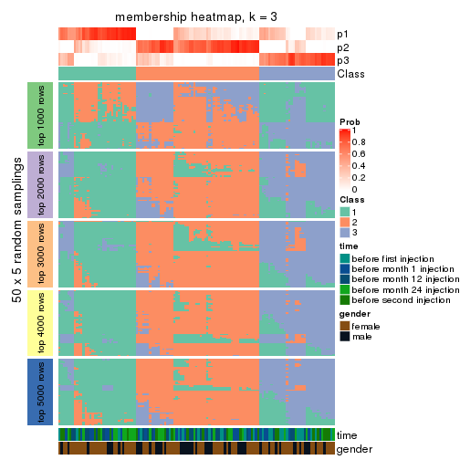</p>

</div>
<div id='tab-SD-NMF-membership-heatmap-3'>
<pre><code class="r">membership_heatmap(res, k = 4)
</code></pre>

<p></p>

</div>
<div id='tab-SD-NMF-membership-heatmap-4'>
<pre><code class="r">membership_heatmap(res, k = 5)
</code></pre>

<p></p>

</div>
<div id='tab-SD-NMF-membership-heatmap-5'>
<pre><code class="r">membership_heatmap(res, k = 6)
</code></pre>

<p></p>

</div>
</div>

As soon as we have had the classes for columns, we can look for signatures
which are significantly different between classes which can be candidate marks
for certain classes. Following are the heatmaps for signatures.


Signature heatmaps where rows are scaled:


<script>
$( function() {
	$( '#tabs-SD-NMF-get-signatures' ).tabs();
} );
</script>
<div id='tabs-SD-NMF-get-signatures'>
<ul>
<li><a href='#tab-SD-NMF-get-signatures-1'>k = 2</a></li>
<li><a href='#tab-SD-NMF-get-signatures-2'>k = 3</a></li>
<li><a href='#tab-SD-NMF-get-signatures-3'>k = 4</a></li>
<li><a href='#tab-SD-NMF-get-signatures-4'>k = 5</a></li>
<li><a href='#tab-SD-NMF-get-signatures-5'>k = 6</a></li>
</ul>
<div id='tab-SD-NMF-get-signatures-1'>
<pre><code class="r">get_signatures(res, k = 2)
</code></pre>

<p></p>

</div>
<div id='tab-SD-NMF-get-signatures-2'>
<pre><code class="r">get_signatures(res, k = 3)
</code></pre>

<p></p>

</div>
<div id='tab-SD-NMF-get-signatures-3'>
<pre><code class="r">get_signatures(res, k = 4)
</code></pre>

<p></p>

</div>
<div id='tab-SD-NMF-get-signatures-4'>
<pre><code class="r">get_signatures(res, k = 5)
</code></pre>

<p></p>

</div>
<div id='tab-SD-NMF-get-signatures-5'>
<pre><code class="r">get_signatures(res, k = 6)
</code></pre>

<p></p>

</div>
</div>


Signature heatmaps where rows are not scaled:


<script>
$( function() {
	$( '#tabs-SD-NMF-get-signatures-no-scale' ).tabs();
} );
</script>
<div id='tabs-SD-NMF-get-signatures-no-scale'>
<ul>
<li><a href='#tab-SD-NMF-get-signatures-no-scale-1'>k = 2</a></li>
<li><a href='#tab-SD-NMF-get-signatures-no-scale-2'>k = 3</a></li>
<li><a href='#tab-SD-NMF-get-signatures-no-scale-3'>k = 4</a></li>
<li><a href='#tab-SD-NMF-get-signatures-no-scale-4'>k = 5</a></li>
<li><a href='#tab-SD-NMF-get-signatures-no-scale-5'>k = 6</a></li>
</ul>
<div id='tab-SD-NMF-get-signatures-no-scale-1'>
<pre><code class="r">get_signatures(res, k = 2, scale_rows = FALSE)
</code></pre>

<p></p>

</div>
<div id='tab-SD-NMF-get-signatures-no-scale-2'>
<pre><code class="r">get_signatures(res, k = 3, scale_rows = FALSE)
</code></pre>

<p></p>

</div>
<div id='tab-SD-NMF-get-signatures-no-scale-3'>
<pre><code class="r">get_signatures(res, k = 4, scale_rows = FALSE)
</code></pre>

<p></p>

</div>
<div id='tab-SD-NMF-get-signatures-no-scale-4'>
<pre><code class="r">get_signatures(res, k = 5, scale_rows = FALSE)
</code></pre>

<p></p>

</div>
<div id='tab-SD-NMF-get-signatures-no-scale-5'>
<pre><code class="r">get_signatures(res, k = 6, scale_rows = FALSE)
</code></pre>

<p></p>

</div>
</div>


Compare the overlap of signatures from different k:

```r
compare_signatures(res)
```


`get_signature()` returns a data frame invisibly. TO get the list of signatures, the function
call should be assigned to a variable explicitly. In following code, if `plot` argument is set
to `FALSE`, no heatmap is plotted while only the differential analysis is performed.

```r
# code only for demonstration
tb = get_signature(res, k = ..., plot = FALSE)
```

An example of the output of `tb` is:

```
#>   which_row         fdr    mean_1    mean_2 scaled_mean_1 scaled_mean_2 km
#> 1        38 0.042760348  8.373488  9.131774    -0.5533452     0.5164555  1
#> 2        40 0.018707592  7.106213  8.469186    -0.6173731     0.5762149  1
#> 3        55 0.019134737 10.221463 11.207825    -0.6159697     0.5749050  1
#> 4        59 0.006059896  5.921854  7.869574    -0.6899429     0.6439467  1
#> 5        60 0.018055526  8.928898 10.211722    -0.6204761     0.5791110  1
#> 6        98 0.009384629 15.714769 14.887706     0.6635654    -0.6193277  2
...
```

The columns in `tb` are:

1. `which_row`: row indices corresponding to the input matrix.
2. `fdr`: FDR for the differential test. 
3. `mean_x`: The mean value in group x.
4. `scaled_mean_x`: The mean value in group x after rows are scaled.
5. `km`: Row groups if k-means clustering is applied to rows.


UMAP plot which shows how samples are separated.


<script>
$( function() {
	$( '#tabs-SD-NMF-dimension-reduction' ).tabs();
} );
</script>
<div id='tabs-SD-NMF-dimension-reduction'>
<ul>
<li><a href='#tab-SD-NMF-dimension-reduction-1'>k = 2</a></li>
<li><a href='#tab-SD-NMF-dimension-reduction-2'>k = 3</a></li>
<li><a href='#tab-SD-NMF-dimension-reduction-3'>k = 4</a></li>
<li><a href='#tab-SD-NMF-dimension-reduction-4'>k = 5</a></li>
<li><a href='#tab-SD-NMF-dimension-reduction-5'>k = 6</a></li>
</ul>
<div id='tab-SD-NMF-dimension-reduction-1'>
<pre><code class="r">dimension_reduction(res, k = 2, method = &quot;UMAP&quot;)
</code></pre>

<p></p>

</div>
<div id='tab-SD-NMF-dimension-reduction-2'>
<pre><code class="r">dimension_reduction(res, k = 3, method = &quot;UMAP&quot;)
</code></pre>

<p></p>

</div>
<div id='tab-SD-NMF-dimension-reduction-3'>
<pre><code class="r">dimension_reduction(res, k = 4, method = &quot;UMAP&quot;)
</code></pre>

<p></p>

</div>
<div id='tab-SD-NMF-dimension-reduction-4'>
<pre><code class="r">dimension_reduction(res, k = 5, method = &quot;UMAP&quot;)
</code></pre>

<p></p>

</div>
<div id='tab-SD-NMF-dimension-reduction-5'>
<pre><code class="r">dimension_reduction(res, k = 6, method = &quot;UMAP&quot;)
</code></pre>

<p></p>

</div>
</div>


Following heatmap shows how subgroups are split when increasing `k`:

```r
collect_classes(res)
```


Test correlation between subgroups and known annotations. If the known
annotation is numeric, one-way ANOVA test is applied, and if the known
annotation is discrete, chi-squared contingency table test is applied.

```r
test_to_known_factors(res)
```

```
#>          n time(p) gender(p) k
#> SD:NMF 121  0.5456    0.1026 2
#> SD:NMF 104  0.0518    0.1992 3
#> SD:NMF  79  0.2407    0.0119 4
#> SD:NMF  43  0.0668    0.0187 5
#> SD:NMF  30  0.4371    0.0505 6
```


If matrix rows can be associated to genes, consider to use `GO_Enrichment(res,
...)` to perform function enrichment for the signature genes.


 

---------------------------------------------------


### CV:hclust


The object with results only for a single top-value method and a single partition method 
can be extracted as:

```r
res = res_list["CV", "hclust"]
# you can also extract it by
# res = res_list["CV:hclust"]
```

A summary of `res` and all the functions that can be applied to it:

```r
res
```

```
#> A 'ConsensusPartition' object with k = 2, 3, 4, 5, 6.
#>   On a matrix with 21168 rows and 125 columns.
#>   Top rows (1000, 2000, 3000, 4000, 5000) are extracted by 'CV' method.
#>   Subgroups are detected by 'hclust' method.
#>   Performed in total 1250 partitions by row resampling.
#>   Best k for subgroups seems to be 2.
#> 
#> Following methods can be applied to this 'ConsensusPartition' object:
#>  [1] "cola_report"             "collect_classes"         "collect_plots"          
#>  [4] "collect_stats"           "colnames"                "compare_signatures"     
#>  [7] "consensus_heatmap"       "dimension_reduction"     "functional_enrichment"  
#> [10] "get_anno_col"            "get_anno"                "get_classes"            
#> [13] "get_consensus"           "get_matrix"              "get_membership"         
#> [16] "get_param"               "get_signatures"          "get_stats"              
#> [19] "is_best_k"               "is_stable_k"             "membership_heatmap"     
#> [22] "ncol"                    "nrow"                    "plot_ecdf"              
#> [25] "rownames"                "select_partition_number" "show"                   
#> [28] "suggest_best_k"          "test_to_known_factors"
```

`collect_plots()` function collects all the plots made from `res` for all `k` (number of partitions)
into one single page to provide an easy and fast comparison between different `k`.

```r
collect_plots(res)
```


The plots are:

- The first row: a plot of the ECDF (Empirical cumulative distribution
  function) curves of the consensus matrix for each `k` and the heatmap of
  predicted classes for each `k`.
- The second row: heatmaps of the consensus matrix for each `k`.
- The third row: heatmaps of the membership matrix for each `k`.
- The fouth row: heatmaps of the signatures for each `k`.

All the plots in panels can be made by individual functions and they are
plotted later in this section.

`select_partition_number()` produces several plots showing different
statistics for choosing "optimized" `k`. There are following statistics:

- ECDF curves of the consensus matrix for each `k`;
- 1-PAC. [The PAC
  score](https://en.wikipedia.org/wiki/Consensus_clustering#Over-interpretation_potential_of_consensus_clustering)
  measures the proportion of the ambiguous subgrouping.
- Mean silhouette score.
- Concordance. The mean probability of fiting the consensus class ids in all
  partitions.
- Area increased. Denote $A_k$ as the area under the ECDF curve for current
  `k`, the area increased is defined as $A_k - A_{k-1}$.
- Rand index. The percent of pairs of samples that are both in a same cluster
  or both are not in a same cluster in the partition of k and k-1.
- Jaccard index. The ratio of pairs of samples are both in a same cluster in
  the partition of k and k-1 and the pairs of samples are both in a same
  cluster in the partition k or k-1.

The detailed explanations of these statistics can be found in [the cola
vignette](http://bioconductor.org/packages/devel/bioc/vignettes/cola/inst/doc/cola.html#toc_13).

Generally speaking, lower PAC score, higher mean silhouette score or higher
concordance corresponds to better partition. Rand index and Jaccard index
measure how similar the current partition is compared to partition with `k-1`.
If they are too similar, we won't accept `k` is better than `k-1`.

```r
select_partition_number(res)
```


The numeric values for all these statistics can be obtained by `get_stats()`.

```r
get_stats(res)
```

```
#>   k 1-PAC mean_silhouette concordance area_increased  Rand Jaccard
#> 2 2 0.268           0.808       0.869         0.3857 0.624   0.624
#> 3 3 0.249           0.746       0.845         0.1531 0.980   0.968
#> 4 4 0.293           0.719       0.830         0.0876 0.996   0.994
#> 5 5 0.278           0.728       0.805         0.0639 1.000   0.999
#> 6 6 0.244           0.583       0.730         0.1516 0.984   0.974
```

`suggest_best_k()` suggests the best $k$ based on these statistics. The rules are as follows:

- All $k$ with Jaccard index larger than 0.95 are removed because the increase of
  the partition number does not provides enough extra information. If all $k$ are removed,
  the best $k$ is assigned by `NA`.
- For $k$ with 1-PAC larger than 0.9, the maximal $k$ is taken as the "best k". Other $k$ is called "optional k".
- If it does not fit the second rule. The $k$ with the highest vote of highest
  1-PAC, mean silhouette and concordance is taken as the "best k".

```r
suggest_best_k(res)
```

```
#> [1] 2
```


Following shows the table of the partitions (You need to click the **show/hide
code output** link to see it). The membership matrix (columns with name `p*`)
is inferred by
[`clue::cl_consensus()`](https://www.rdocumentation.org/link/cl_consensus?package=clue)
function with the `SE` method. Basically the value in the membership matrix
represents the probability to belong to a certain group. The finall class
label for an item is determined with the group with highest probability it
belongs to.

In `get_classes()` function, the entropy is calculated from the membership
matrix and the silhouette score is calculated from the consensus matrix.


<script>
$( function() {
	$( '#tabs-CV-hclust-get-classes' ).tabs();
} );
</script>
<div id='tabs-CV-hclust-get-classes'>
<ul>
<li><a href='#tab-CV-hclust-get-classes-1'>k = 2</a></li>
<li><a href='#tab-CV-hclust-get-classes-2'>k = 3</a></li>
<li><a href='#tab-CV-hclust-get-classes-3'>k = 4</a></li>
<li><a href='#tab-CV-hclust-get-classes-4'>k = 5</a></li>
<li><a href='#tab-CV-hclust-get-classes-5'>k = 6</a></li>
</ul>

<div id='tab-CV-hclust-get-classes-1'>
<p><a id='tab-CV-hclust-get-classes-1-a' style='color:#0366d6' href='#'>show/hide code output</a></p>
<pre><code class="r">cbind(get_classes(res, k = 2), get_membership(res, k = 2))
</code></pre>

<pre><code>#&gt;           class entropy silhouette    p1    p2
#&gt; GSM601752     2  0.0672      0.874 0.008 0.992
#&gt; GSM601782     1  0.8386      0.757 0.732 0.268
#&gt; GSM601792     2  0.4939      0.868 0.108 0.892
#&gt; GSM601797     2  0.4298      0.879 0.088 0.912
#&gt; GSM601827     1  0.5946      0.876 0.856 0.144
#&gt; GSM601837     2  0.1633      0.868 0.024 0.976
#&gt; GSM601842     2  0.3431      0.879 0.064 0.936
#&gt; GSM601857     2  0.9522      0.454 0.372 0.628
#&gt; GSM601867     2  0.5737      0.847 0.136 0.864
#&gt; GSM601747     2  0.8713      0.655 0.292 0.708
#&gt; GSM601757     1  0.9427      0.570 0.640 0.360
#&gt; GSM601762     2  0.3431      0.878 0.064 0.936
#&gt; GSM601767     2  0.2236      0.877 0.036 0.964
#&gt; GSM601772     2  0.1843      0.877 0.028 0.972
#&gt; GSM601777     2  0.3114      0.878 0.056 0.944
#&gt; GSM601787     2  0.8327      0.675 0.264 0.736
#&gt; GSM601802     2  0.0672      0.874 0.008 0.992
#&gt; GSM601807     2  0.9922      0.030 0.448 0.552
#&gt; GSM601812     1  0.5519      0.873 0.872 0.128
#&gt; GSM601817     1  0.4022      0.868 0.920 0.080
#&gt; GSM601822     2  0.4431      0.876 0.092 0.908
#&gt; GSM601832     2  0.3733      0.876 0.072 0.928
#&gt; GSM601847     2  0.4431      0.877 0.092 0.908
#&gt; GSM601852     1  0.5294      0.881 0.880 0.120
#&gt; GSM601862     1  0.7528      0.829 0.784 0.216
#&gt; GSM601753     2  0.0938      0.875 0.012 0.988
#&gt; GSM601783     1  0.4815      0.879 0.896 0.104
#&gt; GSM601793     2  0.4939      0.868 0.108 0.892
#&gt; GSM601798     2  0.0672      0.872 0.008 0.992
#&gt; GSM601828     1  0.5178      0.881 0.884 0.116
#&gt; GSM601838     2  0.1184      0.867 0.016 0.984
#&gt; GSM601843     2  0.3733      0.879 0.072 0.928
#&gt; GSM601858     2  0.9209      0.543 0.336 0.664
#&gt; GSM601868     1  0.8267      0.783 0.740 0.260
#&gt; GSM601748     1  0.3431      0.857 0.936 0.064
#&gt; GSM601758     1  0.4562      0.875 0.904 0.096
#&gt; GSM601763     2  0.6973      0.817 0.188 0.812
#&gt; GSM601768     2  0.2778      0.880 0.048 0.952
#&gt; GSM601773     2  0.1843      0.877 0.028 0.972
#&gt; GSM601778     2  0.3584      0.880 0.068 0.932
#&gt; GSM601788     2  0.1633      0.877 0.024 0.976
#&gt; GSM601803     2  0.0672      0.874 0.008 0.992
#&gt; GSM601808     1  0.7453      0.825 0.788 0.212
#&gt; GSM601813     1  0.6048      0.874 0.852 0.148
#&gt; GSM601818     1  0.5842      0.880 0.860 0.140
#&gt; GSM601823     2  0.7528      0.792 0.216 0.784
#&gt; GSM601833     2  0.3584      0.877 0.068 0.932
#&gt; GSM601848     2  0.6712      0.823 0.176 0.824
#&gt; GSM601853     1  0.6438      0.865 0.836 0.164
#&gt; GSM601863     1  0.7139      0.845 0.804 0.196
#&gt; GSM601754     2  0.0672      0.873 0.008 0.992
#&gt; GSM601784     2  0.2236      0.878 0.036 0.964
#&gt; GSM601794     2  0.4431      0.874 0.092 0.908
#&gt; GSM601799     2  0.3274      0.881 0.060 0.940
#&gt; GSM601829     1  0.8763      0.709 0.704 0.296
#&gt; GSM601839     2  0.1184      0.867 0.016 0.984
#&gt; GSM601844     2  0.8443      0.711 0.272 0.728
#&gt; GSM601859     2  0.4161      0.874 0.084 0.916
#&gt; GSM601869     1  0.7950      0.801 0.760 0.240
#&gt; GSM601749     1  0.4815      0.879 0.896 0.104
#&gt; GSM601759     1  0.4562      0.875 0.904 0.096
#&gt; GSM601764     2  0.7674      0.787 0.224 0.776
#&gt; GSM601769     2  0.0938      0.867 0.012 0.988
#&gt; GSM601774     2  0.1184      0.870 0.016 0.984
#&gt; GSM601779     2  0.7883      0.759 0.236 0.764
#&gt; GSM601789     2  0.1414      0.875 0.020 0.980
#&gt; GSM601804     2  0.0672      0.874 0.008 0.992
#&gt; GSM601809     2  0.8144      0.730 0.252 0.748
#&gt; GSM601814     2  0.0938      0.867 0.012 0.988
#&gt; GSM601819     1  0.5059      0.877 0.888 0.112
#&gt; GSM601824     2  0.7528      0.792 0.216 0.784
#&gt; GSM601834     2  0.3584      0.877 0.068 0.932
#&gt; GSM601849     2  0.7453      0.796 0.212 0.788
#&gt; GSM601854     1  0.3584      0.860 0.932 0.068
#&gt; GSM601864     2  0.5294      0.835 0.120 0.880
#&gt; GSM601755     2  0.0672      0.874 0.008 0.992
#&gt; GSM601785     2  0.3114      0.881 0.056 0.944
#&gt; GSM601795     2  0.4431      0.873 0.092 0.908
#&gt; GSM601800     2  0.1633      0.878 0.024 0.976
#&gt; GSM601830     1  0.9998      0.173 0.508 0.492
#&gt; GSM601840     2  0.5629      0.850 0.132 0.868
#&gt; GSM601845     2  0.4298      0.874 0.088 0.912
#&gt; GSM601860     2  0.4298      0.872 0.088 0.912
#&gt; GSM601870     2  0.9608      0.317 0.384 0.616
#&gt; GSM601750     1  0.2236      0.829 0.964 0.036
#&gt; GSM601760     1  0.5842      0.879 0.860 0.140
#&gt; GSM601765     2  0.4022      0.874 0.080 0.920
#&gt; GSM601770     2  0.2043      0.877 0.032 0.968
#&gt; GSM601775     2  0.7453      0.779 0.212 0.788
#&gt; GSM601780     2  0.7883      0.759 0.236 0.764
#&gt; GSM601790     2  0.1184      0.867 0.016 0.984
#&gt; GSM601805     2  0.0672      0.874 0.008 0.992
#&gt; GSM601810     2  0.8207      0.723 0.256 0.744
#&gt; GSM601815     2  0.0938      0.867 0.012 0.988
#&gt; GSM601820     1  0.4022      0.867 0.920 0.080
#&gt; GSM601825     2  0.0376      0.873 0.004 0.996
#&gt; GSM601835     2  0.3733      0.876 0.072 0.928
#&gt; GSM601850     2  0.4298      0.877 0.088 0.912
#&gt; GSM601855     1  1.0000      0.140 0.504 0.496
#&gt; GSM601865     2  0.5408      0.834 0.124 0.876
#&gt; GSM601756     2  0.0672      0.874 0.008 0.992
#&gt; GSM601786     2  0.2043      0.877 0.032 0.968
#&gt; GSM601796     2  0.4431      0.873 0.092 0.908
#&gt; GSM601801     2  0.0376      0.873 0.004 0.996
#&gt; GSM601831     1  0.5842      0.880 0.860 0.140
#&gt; GSM601841     2  0.9795      0.312 0.416 0.584
#&gt; GSM601846     2  0.5737      0.825 0.136 0.864
#&gt; GSM601861     2  0.0938      0.867 0.012 0.988
#&gt; GSM601871     2  0.8661      0.609 0.288 0.712
#&gt; GSM601751     2  0.7056      0.804 0.192 0.808
#&gt; GSM601761     2  0.8909      0.630 0.308 0.692
#&gt; GSM601766     2  0.4815      0.868 0.104 0.896
#&gt; GSM601771     2  0.6148      0.836 0.152 0.848
#&gt; GSM601776     2  0.8327      0.723 0.264 0.736
#&gt; GSM601781     2  0.3274      0.879 0.060 0.940
#&gt; GSM601791     2  0.8443      0.702 0.272 0.728
#&gt; GSM601806     2  0.0376      0.873 0.004 0.996
#&gt; GSM601811     2  0.8016      0.739 0.244 0.756
#&gt; GSM601816     2  0.7139      0.799 0.196 0.804
#&gt; GSM601821     2  0.1184      0.869 0.016 0.984
#&gt; GSM601826     2  0.7299      0.794 0.204 0.796
#&gt; GSM601836     2  0.6623      0.834 0.172 0.828
#&gt; GSM601851     2  0.7674      0.773 0.224 0.776
#&gt; GSM601856     1  0.6973      0.854 0.812 0.188
#&gt; GSM601866     1  0.3733      0.864 0.928 0.072
</code></pre>

<script>
$('#tab-CV-hclust-get-classes-1-a').parent().next().next().hide();
$('#tab-CV-hclust-get-classes-1-a').click(function(){
  $('#tab-CV-hclust-get-classes-1-a').parent().next().next().toggle();
  return(false);
});
</script>
</div>

<div id='tab-CV-hclust-get-classes-2'>
<p><a id='tab-CV-hclust-get-classes-2-a' style='color:#0366d6' href='#'>show/hide code output</a></p>
<pre><code class="r">cbind(get_classes(res, k = 3), get_membership(res, k = 3))
</code></pre>

<pre><code>#&gt;           class entropy silhouette    p1    p2    p3
#&gt; GSM601752     2  0.1170      0.835 0.016 0.976 0.008
#&gt; GSM601782     3  0.8265      0.522 0.180 0.184 0.636
#&gt; GSM601792     2  0.4136      0.822 0.020 0.864 0.116
#&gt; GSM601797     2  0.4165      0.834 0.048 0.876 0.076
#&gt; GSM601827     3  0.5538      0.773 0.116 0.072 0.812
#&gt; GSM601837     2  0.2492      0.815 0.048 0.936 0.016
#&gt; GSM601842     2  0.2749      0.842 0.012 0.924 0.064
#&gt; GSM601857     2  0.8291      0.312 0.100 0.580 0.320
#&gt; GSM601867     2  0.5010      0.795 0.076 0.840 0.084
#&gt; GSM601747     2  0.6357      0.582 0.020 0.684 0.296
#&gt; GSM601757     3  0.7491      0.317 0.056 0.324 0.620
#&gt; GSM601762     2  0.2400      0.842 0.004 0.932 0.064
#&gt; GSM601767     2  0.1950      0.842 0.008 0.952 0.040
#&gt; GSM601772     2  0.1585      0.841 0.008 0.964 0.028
#&gt; GSM601777     2  0.2879      0.844 0.024 0.924 0.052
#&gt; GSM601787     2  0.7884      0.403 0.252 0.644 0.104
#&gt; GSM601802     2  0.1015      0.834 0.012 0.980 0.008
#&gt; GSM601807     1  0.6161      0.802 0.696 0.288 0.016
#&gt; GSM601812     3  0.4172      0.793 0.028 0.104 0.868
#&gt; GSM601817     3  0.3263      0.796 0.040 0.048 0.912
#&gt; GSM601822     2  0.3528      0.837 0.016 0.892 0.092
#&gt; GSM601832     2  0.2774      0.839 0.008 0.920 0.072
#&gt; GSM601847     2  0.3445      0.839 0.016 0.896 0.088
#&gt; GSM601852     3  0.3213      0.809 0.008 0.092 0.900
#&gt; GSM601862     3  0.7777      0.637 0.160 0.164 0.676
#&gt; GSM601753     2  0.1337      0.837 0.016 0.972 0.012
#&gt; GSM601783     3  0.2772      0.811 0.004 0.080 0.916
#&gt; GSM601793     2  0.4136      0.822 0.020 0.864 0.116
#&gt; GSM601798     2  0.1182      0.833 0.012 0.976 0.012
#&gt; GSM601828     3  0.4370      0.806 0.056 0.076 0.868
#&gt; GSM601838     2  0.1636      0.826 0.020 0.964 0.016
#&gt; GSM601843     2  0.2939      0.842 0.012 0.916 0.072
#&gt; GSM601858     2  0.8067      0.401 0.100 0.616 0.284
#&gt; GSM601868     3  0.8436      0.518 0.160 0.224 0.616
#&gt; GSM601748     3  0.2443      0.773 0.028 0.032 0.940
#&gt; GSM601758     3  0.2261      0.807 0.000 0.068 0.932
#&gt; GSM601763     2  0.4912      0.774 0.008 0.796 0.196
#&gt; GSM601768     2  0.2486      0.845 0.008 0.932 0.060
#&gt; GSM601773     2  0.1585      0.841 0.008 0.964 0.028
#&gt; GSM601778     2  0.3181      0.846 0.024 0.912 0.064
#&gt; GSM601788     2  0.2176      0.836 0.032 0.948 0.020
#&gt; GSM601803     2  0.0848      0.835 0.008 0.984 0.008
#&gt; GSM601808     3  0.8543      0.232 0.408 0.096 0.496
#&gt; GSM601813     3  0.4068      0.791 0.016 0.120 0.864
#&gt; GSM601818     3  0.4256      0.808 0.036 0.096 0.868
#&gt; GSM601823     2  0.5450      0.739 0.012 0.760 0.228
#&gt; GSM601833     2  0.2486      0.842 0.008 0.932 0.060
#&gt; GSM601848     2  0.5008      0.776 0.016 0.804 0.180
#&gt; GSM601853     3  0.6719      0.723 0.160 0.096 0.744
#&gt; GSM601863     3  0.7393      0.685 0.156 0.140 0.704
#&gt; GSM601754     2  0.1482      0.837 0.012 0.968 0.020
#&gt; GSM601784     2  0.1950      0.842 0.008 0.952 0.040
#&gt; GSM601794     2  0.4015      0.829 0.028 0.876 0.096
#&gt; GSM601799     2  0.2584      0.845 0.008 0.928 0.064
#&gt; GSM601829     3  0.6761      0.529 0.048 0.252 0.700
#&gt; GSM601839     2  0.2269      0.819 0.040 0.944 0.016
#&gt; GSM601844     2  0.6027      0.665 0.016 0.712 0.272
#&gt; GSM601859     2  0.3293      0.836 0.012 0.900 0.088
#&gt; GSM601869     3  0.8249      0.561 0.164 0.200 0.636
#&gt; GSM601749     3  0.2682      0.811 0.004 0.076 0.920
#&gt; GSM601759     3  0.2496      0.808 0.004 0.068 0.928
#&gt; GSM601764     2  0.5595      0.741 0.016 0.756 0.228
#&gt; GSM601769     2  0.1170      0.826 0.016 0.976 0.008
#&gt; GSM601774     2  0.1337      0.830 0.012 0.972 0.016
#&gt; GSM601779     2  0.5698      0.698 0.012 0.736 0.252
#&gt; GSM601789     2  0.1774      0.834 0.024 0.960 0.016
#&gt; GSM601804     2  0.1015      0.836 0.008 0.980 0.012
#&gt; GSM601809     2  0.7157      0.642 0.100 0.712 0.188
#&gt; GSM601814     2  0.1170      0.826 0.016 0.976 0.008
#&gt; GSM601819     3  0.4609      0.800 0.052 0.092 0.856
#&gt; GSM601824     2  0.5450      0.739 0.012 0.760 0.228
#&gt; GSM601834     2  0.2584      0.841 0.008 0.928 0.064
#&gt; GSM601849     2  0.5506      0.739 0.016 0.764 0.220
#&gt; GSM601854     3  0.3337      0.775 0.060 0.032 0.908
#&gt; GSM601864     2  0.4921      0.687 0.164 0.816 0.020
#&gt; GSM601755     2  0.1170      0.835 0.016 0.976 0.008
#&gt; GSM601785     2  0.2804      0.847 0.016 0.924 0.060
#&gt; GSM601795     2  0.4015      0.828 0.028 0.876 0.096
#&gt; GSM601800     2  0.1453      0.842 0.008 0.968 0.024
#&gt; GSM601830     1  0.8120      0.827 0.640 0.224 0.136
#&gt; GSM601840     2  0.4469      0.809 0.028 0.852 0.120
#&gt; GSM601845     2  0.3293      0.838 0.012 0.900 0.088
#&gt; GSM601860     2  0.3445      0.835 0.016 0.896 0.088
#&gt; GSM601870     2  0.8440     -0.348 0.420 0.492 0.088
#&gt; GSM601750     3  0.4228      0.666 0.148 0.008 0.844
#&gt; GSM601760     3  0.3192      0.803 0.000 0.112 0.888
#&gt; GSM601765     2  0.2955      0.838 0.008 0.912 0.080
#&gt; GSM601770     2  0.1832      0.842 0.008 0.956 0.036
#&gt; GSM601775     2  0.5506      0.729 0.016 0.764 0.220
#&gt; GSM601780     2  0.5698      0.697 0.012 0.736 0.252
#&gt; GSM601790     2  0.1337      0.827 0.012 0.972 0.016
#&gt; GSM601805     2  0.0848      0.835 0.008 0.984 0.008
#&gt; GSM601810     2  0.7213      0.619 0.088 0.700 0.212
#&gt; GSM601815     2  0.1315      0.826 0.020 0.972 0.008
#&gt; GSM601820     3  0.3683      0.799 0.044 0.060 0.896
#&gt; GSM601825     2  0.1170      0.836 0.016 0.976 0.008
#&gt; GSM601835     2  0.2774      0.839 0.008 0.920 0.072
#&gt; GSM601850     2  0.3459      0.839 0.012 0.892 0.096
#&gt; GSM601855     1  0.7935      0.859 0.648 0.236 0.116
#&gt; GSM601865     2  0.4994      0.690 0.160 0.816 0.024
#&gt; GSM601756     2  0.1170      0.835 0.016 0.976 0.008
#&gt; GSM601786     2  0.2050      0.841 0.020 0.952 0.028
#&gt; GSM601796     2  0.4015      0.828 0.028 0.876 0.096
#&gt; GSM601801     2  0.0829      0.833 0.012 0.984 0.004
#&gt; GSM601831     3  0.4324      0.804 0.028 0.112 0.860
#&gt; GSM601841     2  0.7712      0.278 0.052 0.556 0.392
#&gt; GSM601846     2  0.7064      0.503 0.220 0.704 0.076
#&gt; GSM601861     2  0.1337      0.827 0.016 0.972 0.012
#&gt; GSM601871     2  0.7872      0.302 0.296 0.620 0.084
#&gt; GSM601751     2  0.5678      0.750 0.032 0.776 0.192
#&gt; GSM601761     2  0.6369      0.569 0.016 0.668 0.316
#&gt; GSM601766     2  0.3454      0.832 0.008 0.888 0.104
#&gt; GSM601771     2  0.4999      0.787 0.028 0.820 0.152
#&gt; GSM601776     2  0.6161      0.661 0.020 0.708 0.272
#&gt; GSM601781     2  0.2982      0.845 0.024 0.920 0.056
#&gt; GSM601791     2  0.6096      0.642 0.016 0.704 0.280
#&gt; GSM601806     2  0.0829      0.833 0.012 0.984 0.004
#&gt; GSM601811     2  0.7133      0.640 0.096 0.712 0.192
#&gt; GSM601816     2  0.5356      0.749 0.020 0.784 0.196
#&gt; GSM601821     2  0.1491      0.828 0.016 0.968 0.016
#&gt; GSM601826     2  0.5318      0.747 0.016 0.780 0.204
#&gt; GSM601836     2  0.4979      0.795 0.020 0.812 0.168
#&gt; GSM601851     2  0.5578      0.713 0.012 0.748 0.240
#&gt; GSM601856     3  0.6621      0.736 0.100 0.148 0.752
#&gt; GSM601866     3  0.3155      0.795 0.040 0.044 0.916
</code></pre>

<script>
$('#tab-CV-hclust-get-classes-2-a').parent().next().next().hide();
$('#tab-CV-hclust-get-classes-2-a').click(function(){
  $('#tab-CV-hclust-get-classes-2-a').parent().next().next().toggle();
  return(false);
});
</script>
</div>

<div id='tab-CV-hclust-get-classes-3'>
<p><a id='tab-CV-hclust-get-classes-3-a' style='color:#0366d6' href='#'>show/hide code output</a></p>
<pre><code class="r">cbind(get_classes(res, k = 4), get_membership(res, k = 4))
</code></pre>

<pre><code>#&gt;           class entropy silhouette    p1    p2    p3    p4
#&gt; GSM601752     2   0.210     0.8542 0.012 0.936 0.008 0.044
#&gt; GSM601782     4   0.769     0.0000 0.372 0.068 0.060 0.500
#&gt; GSM601792     2   0.383     0.8345 0.100 0.856 0.020 0.024
#&gt; GSM601797     2   0.384     0.8431 0.048 0.868 0.052 0.032
#&gt; GSM601827     1   0.529     0.5577 0.784 0.032 0.116 0.068
#&gt; GSM601837     2   0.294     0.8392 0.004 0.900 0.040 0.056
#&gt; GSM601842     2   0.207     0.8577 0.032 0.940 0.012 0.016
#&gt; GSM601857     2   0.765     0.4210 0.272 0.576 0.060 0.092
#&gt; GSM601867     2   0.447     0.7992 0.040 0.836 0.076 0.048
#&gt; GSM601747     2   0.569     0.6704 0.244 0.700 0.016 0.040
#&gt; GSM601757     1   0.644     0.1676 0.612 0.316 0.016 0.056
#&gt; GSM601762     2   0.189     0.8579 0.036 0.944 0.004 0.016
#&gt; GSM601767     2   0.207     0.8585 0.024 0.940 0.008 0.028
#&gt; GSM601772     2   0.206     0.8574 0.020 0.940 0.008 0.032
#&gt; GSM601777     2   0.241     0.8585 0.036 0.928 0.016 0.020
#&gt; GSM601787     2   0.754     0.4984 0.068 0.628 0.172 0.132
#&gt; GSM601802     2   0.201     0.8530 0.012 0.940 0.008 0.040
#&gt; GSM601807     3   0.748     0.5523 0.016 0.164 0.560 0.260
#&gt; GSM601812     1   0.445     0.6403 0.832 0.096 0.032 0.040
#&gt; GSM601817     1   0.365     0.6511 0.876 0.028 0.040 0.056
#&gt; GSM601822     2   0.264     0.8524 0.064 0.912 0.012 0.012
#&gt; GSM601832     2   0.179     0.8558 0.036 0.948 0.008 0.008
#&gt; GSM601847     2   0.256     0.8547 0.060 0.916 0.012 0.012
#&gt; GSM601852     1   0.218     0.6775 0.924 0.064 0.000 0.012
#&gt; GSM601862     1   0.762     0.4536 0.632 0.124 0.096 0.148
#&gt; GSM601753     2   0.222     0.8558 0.016 0.932 0.008 0.044
#&gt; GSM601783     1   0.181     0.6806 0.940 0.052 0.000 0.008
#&gt; GSM601793     2   0.383     0.8345 0.100 0.856 0.020 0.024
#&gt; GSM601798     2   0.201     0.8559 0.012 0.940 0.008 0.040
#&gt; GSM601828     1   0.466     0.6577 0.828 0.064 0.064 0.044
#&gt; GSM601838     2   0.225     0.8469 0.004 0.928 0.016 0.052
#&gt; GSM601843     2   0.215     0.8579 0.036 0.936 0.008 0.020
#&gt; GSM601858     2   0.748     0.4908 0.236 0.608 0.060 0.096
#&gt; GSM601868     1   0.813     0.3599 0.580 0.184 0.096 0.140
#&gt; GSM601748     1   0.321     0.6058 0.892 0.012 0.040 0.056
#&gt; GSM601758     1   0.200     0.6744 0.936 0.044 0.000 0.020
#&gt; GSM601763     2   0.425     0.8049 0.176 0.800 0.008 0.016
#&gt; GSM601768     2   0.253     0.8620 0.048 0.920 0.008 0.024
#&gt; GSM601773     2   0.206     0.8574 0.020 0.940 0.008 0.032
#&gt; GSM601778     2   0.276     0.8599 0.048 0.912 0.028 0.012
#&gt; GSM601788     2   0.278     0.8537 0.016 0.912 0.024 0.048
#&gt; GSM601803     2   0.186     0.8535 0.012 0.944 0.004 0.040
#&gt; GSM601808     1   0.858    -0.2419 0.424 0.044 0.200 0.332
#&gt; GSM601813     1   0.354     0.6499 0.868 0.096 0.012 0.024
#&gt; GSM601818     1   0.428     0.6613 0.844 0.080 0.040 0.036
#&gt; GSM601823     2   0.478     0.7722 0.208 0.760 0.008 0.024
#&gt; GSM601833     2   0.167     0.8575 0.032 0.952 0.004 0.012
#&gt; GSM601848     2   0.408     0.8035 0.160 0.816 0.012 0.012
#&gt; GSM601853     1   0.649     0.4737 0.700 0.064 0.176 0.060
#&gt; GSM601863     1   0.726     0.4951 0.660 0.104 0.088 0.148
#&gt; GSM601754     2   0.204     0.8556 0.016 0.940 0.008 0.036
#&gt; GSM601784     2   0.222     0.8588 0.032 0.932 0.004 0.032
#&gt; GSM601794     2   0.375     0.8379 0.088 0.864 0.024 0.024
#&gt; GSM601799     2   0.192     0.8614 0.036 0.944 0.008 0.012
#&gt; GSM601829     1   0.595     0.3558 0.700 0.228 0.044 0.028
#&gt; GSM601839     2   0.275     0.8426 0.004 0.908 0.032 0.056
#&gt; GSM601844     2   0.537     0.7062 0.264 0.700 0.012 0.024
#&gt; GSM601859     2   0.306     0.8555 0.072 0.892 0.004 0.032
#&gt; GSM601869     1   0.798     0.4000 0.600 0.156 0.100 0.144
#&gt; GSM601749     1   0.172     0.6790 0.944 0.048 0.000 0.008
#&gt; GSM601759     1   0.177     0.6752 0.944 0.044 0.000 0.012
#&gt; GSM601764     2   0.464     0.7801 0.208 0.764 0.004 0.024
#&gt; GSM601769     2   0.214     0.8498 0.008 0.932 0.008 0.052
#&gt; GSM601774     2   0.212     0.8502 0.012 0.932 0.004 0.052
#&gt; GSM601779     2   0.489     0.7377 0.244 0.732 0.008 0.016
#&gt; GSM601789     2   0.211     0.8511 0.000 0.932 0.024 0.044
#&gt; GSM601804     2   0.198     0.8547 0.016 0.940 0.004 0.040
#&gt; GSM601809     2   0.671     0.6557 0.136 0.700 0.092 0.072
#&gt; GSM601814     2   0.199     0.8472 0.004 0.936 0.008 0.052
#&gt; GSM601819     1   0.393     0.6350 0.860 0.064 0.020 0.056
#&gt; GSM601824     2   0.478     0.7722 0.208 0.760 0.008 0.024
#&gt; GSM601834     2   0.177     0.8574 0.036 0.948 0.004 0.012
#&gt; GSM601849     2   0.454     0.7730 0.204 0.772 0.008 0.016
#&gt; GSM601854     1   0.386     0.6202 0.864 0.020 0.056 0.060
#&gt; GSM601864     2   0.481     0.7445 0.008 0.796 0.128 0.068
#&gt; GSM601755     2   0.210     0.8542 0.012 0.936 0.008 0.044
#&gt; GSM601785     2   0.266     0.8628 0.048 0.916 0.012 0.024
#&gt; GSM601795     2   0.368     0.8382 0.084 0.868 0.024 0.024
#&gt; GSM601800     2   0.207     0.8598 0.024 0.940 0.008 0.028
#&gt; GSM601830     3   0.442     0.6427 0.084 0.076 0.828 0.012
#&gt; GSM601840     2   0.395     0.8326 0.108 0.848 0.020 0.024
#&gt; GSM601845     2   0.231     0.8559 0.048 0.928 0.008 0.016
#&gt; GSM601860     2   0.315     0.8543 0.072 0.888 0.004 0.036
#&gt; GSM601870     2   0.857    -0.0926 0.060 0.456 0.320 0.164
#&gt; GSM601750     1   0.505     0.3202 0.776 0.004 0.088 0.132
#&gt; GSM601760     1   0.227     0.6701 0.912 0.084 0.000 0.004
#&gt; GSM601765     2   0.206     0.8558 0.048 0.936 0.008 0.008
#&gt; GSM601770     2   0.227     0.8595 0.028 0.932 0.008 0.032
#&gt; GSM601775     2   0.485     0.7687 0.200 0.764 0.016 0.020
#&gt; GSM601780     2   0.489     0.7377 0.244 0.732 0.008 0.016
#&gt; GSM601790     2   0.212     0.8477 0.012 0.932 0.004 0.052
#&gt; GSM601805     2   0.186     0.8535 0.012 0.944 0.004 0.040
#&gt; GSM601810     2   0.694     0.6336 0.168 0.676 0.080 0.076
#&gt; GSM601815     2   0.212     0.8470 0.004 0.932 0.012 0.052
#&gt; GSM601820     1   0.340     0.6506 0.880 0.044 0.008 0.068
#&gt; GSM601825     2   0.210     0.8564 0.012 0.936 0.008 0.044
#&gt; GSM601835     2   0.177     0.8566 0.036 0.948 0.012 0.004
#&gt; GSM601850     2   0.291     0.8541 0.072 0.900 0.012 0.016
#&gt; GSM601855     3   0.400     0.6728 0.068 0.068 0.852 0.012
#&gt; GSM601865     2   0.481     0.7454 0.008 0.796 0.128 0.068
#&gt; GSM601756     2   0.210     0.8542 0.012 0.936 0.008 0.044
#&gt; GSM601786     2   0.172     0.8573 0.008 0.952 0.012 0.028
#&gt; GSM601796     2   0.368     0.8382 0.084 0.868 0.024 0.024
#&gt; GSM601801     2   0.192     0.8551 0.012 0.944 0.008 0.036
#&gt; GSM601831     1   0.390     0.6805 0.860 0.080 0.024 0.036
#&gt; GSM601841     2   0.698     0.3281 0.376 0.536 0.024 0.064
#&gt; GSM601846     2   0.757     0.3615 0.056 0.552 0.316 0.076
#&gt; GSM601861     2   0.214     0.8472 0.008 0.932 0.008 0.052
#&gt; GSM601871     2   0.784     0.3998 0.056 0.588 0.192 0.164
#&gt; GSM601751     2   0.537     0.7787 0.192 0.748 0.028 0.032
#&gt; GSM601761     2   0.544     0.6332 0.308 0.664 0.012 0.016
#&gt; GSM601766     2   0.280     0.8512 0.080 0.900 0.008 0.012
#&gt; GSM601771     2   0.459     0.8142 0.148 0.804 0.020 0.028
#&gt; GSM601776     2   0.538     0.7058 0.264 0.700 0.016 0.020
#&gt; GSM601781     2   0.250     0.8592 0.040 0.924 0.016 0.020
#&gt; GSM601791     2   0.513     0.6920 0.276 0.700 0.012 0.012
#&gt; GSM601806     2   0.188     0.8524 0.008 0.944 0.008 0.040
#&gt; GSM601811     2   0.682     0.6454 0.140 0.692 0.092 0.076
#&gt; GSM601816     2   0.449     0.7873 0.176 0.792 0.016 0.016
#&gt; GSM601821     2   0.227     0.8485 0.012 0.928 0.008 0.052
#&gt; GSM601826     2   0.454     0.7788 0.192 0.780 0.012 0.016
#&gt; GSM601836     2   0.400     0.8215 0.144 0.828 0.012 0.016
#&gt; GSM601851     2   0.479     0.7507 0.232 0.744 0.008 0.016
#&gt; GSM601856     1   0.629     0.5868 0.728 0.124 0.088 0.060
#&gt; GSM601866     1   0.400     0.6592 0.860 0.036 0.040 0.064
</code></pre>

<script>
$('#tab-CV-hclust-get-classes-3-a').parent().next().next().hide();
$('#tab-CV-hclust-get-classes-3-a').click(function(){
  $('#tab-CV-hclust-get-classes-3-a').parent().next().next().toggle();
  return(false);
});
</script>
</div>

<div id='tab-CV-hclust-get-classes-4'>
<p><a id='tab-CV-hclust-get-classes-4-a' style='color:#0366d6' href='#'>show/hide code output</a></p>
<pre><code class="r">cbind(get_classes(res, k = 5), get_membership(res, k = 5))
</code></pre>

<pre><code>#&gt;           class entropy silhouette    p1    p2    p3 p4    p5
#&gt; GSM601752     2   0.225     0.8370 0.012 0.900 0.000 NA 0.000
#&gt; GSM601782     5   0.806    -0.0279 0.248 0.040 0.024 NA 0.364
#&gt; GSM601792     2   0.345     0.8203 0.096 0.848 0.012 NA 0.000
#&gt; GSM601797     2   0.381     0.8249 0.048 0.844 0.068 NA 0.004
#&gt; GSM601827     1   0.502     0.6750 0.760 0.012 0.132 NA 0.024
#&gt; GSM601837     2   0.322     0.8046 0.000 0.824 0.016 NA 0.000
#&gt; GSM601842     2   0.190     0.8431 0.024 0.936 0.004 NA 0.004
#&gt; GSM601857     2   0.683     0.4501 0.264 0.568 0.044 NA 0.008
#&gt; GSM601867     2   0.447     0.7840 0.028 0.792 0.052 NA 0.004
#&gt; GSM601747     2   0.558     0.6715 0.216 0.692 0.028 NA 0.016
#&gt; GSM601757     1   0.562     0.3248 0.620 0.304 0.008 NA 0.008
#&gt; GSM601762     2   0.184     0.8436 0.032 0.932 0.000 NA 0.000
#&gt; GSM601767     2   0.204     0.8429 0.024 0.920 0.000 NA 0.000
#&gt; GSM601772     2   0.201     0.8413 0.012 0.916 0.000 NA 0.000
#&gt; GSM601777     2   0.254     0.8427 0.032 0.904 0.012 NA 0.000
#&gt; GSM601787     2   0.693     0.4995 0.064 0.592 0.076 NA 0.024
#&gt; GSM601802     2   0.219     0.8357 0.012 0.904 0.000 NA 0.000
#&gt; GSM601807     5   0.784    -0.2518 0.012 0.088 0.184 NA 0.492
#&gt; GSM601812     1   0.428     0.7410 0.820 0.076 0.048 NA 0.008
#&gt; GSM601817     1   0.351     0.7492 0.860 0.012 0.048 NA 0.012
#&gt; GSM601822     2   0.241     0.8353 0.068 0.900 0.000 NA 0.000
#&gt; GSM601832     2   0.156     0.8402 0.028 0.948 0.000 NA 0.004
#&gt; GSM601847     2   0.248     0.8404 0.060 0.904 0.008 NA 0.000
#&gt; GSM601852     1   0.172     0.7615 0.936 0.052 0.004 NA 0.000
#&gt; GSM601862     1   0.702     0.5752 0.620 0.100 0.088 NA 0.024
#&gt; GSM601753     2   0.235     0.8384 0.016 0.896 0.000 NA 0.000
#&gt; GSM601783     1   0.149     0.7643 0.948 0.040 0.004 NA 0.000
#&gt; GSM601793     2   0.345     0.8203 0.096 0.848 0.012 NA 0.000
#&gt; GSM601798     2   0.229     0.8380 0.016 0.900 0.000 NA 0.000
#&gt; GSM601828     1   0.414     0.7519 0.836 0.032 0.060 NA 0.028
#&gt; GSM601838     2   0.276     0.8152 0.000 0.848 0.004 NA 0.000
#&gt; GSM601843     2   0.183     0.8425 0.028 0.936 0.000 NA 0.004
#&gt; GSM601858     2   0.663     0.5235 0.228 0.604 0.044 NA 0.008
#&gt; GSM601868     1   0.741     0.4849 0.572 0.164 0.080 NA 0.020
#&gt; GSM601748     1   0.343     0.7268 0.864 0.004 0.044 NA 0.024
#&gt; GSM601758     1   0.177     0.7614 0.940 0.032 0.000 NA 0.008
#&gt; GSM601763     2   0.375     0.7950 0.176 0.796 0.000 NA 0.008
#&gt; GSM601768     2   0.252     0.8476 0.048 0.896 0.000 NA 0.000
#&gt; GSM601773     2   0.207     0.8412 0.012 0.912 0.000 NA 0.000
#&gt; GSM601778     2   0.275     0.8446 0.036 0.896 0.020 NA 0.000
#&gt; GSM601788     2   0.300     0.8385 0.020 0.864 0.008 NA 0.000
#&gt; GSM601803     2   0.213     0.8363 0.012 0.908 0.000 NA 0.000
#&gt; GSM601808     1   0.863    -0.1074 0.372 0.012 0.188 NA 0.176
#&gt; GSM601813     1   0.294     0.7426 0.880 0.084 0.012 NA 0.004
#&gt; GSM601818     1   0.418     0.7496 0.824 0.060 0.048 NA 0.004
#&gt; GSM601823     2   0.429     0.7625 0.208 0.752 0.000 NA 0.008
#&gt; GSM601833     2   0.156     0.8422 0.024 0.948 0.000 NA 0.004
#&gt; GSM601848     2   0.358     0.7920 0.160 0.808 0.000 NA 0.000
#&gt; GSM601853     1   0.618     0.5974 0.668 0.032 0.192 NA 0.024
#&gt; GSM601863     1   0.675     0.6142 0.648 0.088 0.092 NA 0.024
#&gt; GSM601754     2   0.229     0.8381 0.012 0.904 0.004 NA 0.000
#&gt; GSM601784     2   0.243     0.8427 0.020 0.900 0.004 NA 0.000
#&gt; GSM601794     2   0.342     0.8242 0.080 0.856 0.020 NA 0.000
#&gt; GSM601799     2   0.215     0.8478 0.032 0.920 0.004 NA 0.000
#&gt; GSM601829     1   0.561     0.5202 0.696 0.208 0.044 NA 0.016
#&gt; GSM601839     2   0.309     0.8049 0.000 0.824 0.008 NA 0.000
#&gt; GSM601844     2   0.483     0.7032 0.264 0.692 0.008 NA 0.004
#&gt; GSM601859     2   0.306     0.8431 0.068 0.864 0.000 NA 0.000
#&gt; GSM601869     1   0.722     0.5299 0.596 0.136 0.084 NA 0.020
#&gt; GSM601749     1   0.141     0.7640 0.952 0.036 0.004 NA 0.000
#&gt; GSM601759     1   0.169     0.7597 0.944 0.024 0.000 NA 0.008
#&gt; GSM601764     2   0.421     0.7734 0.204 0.760 0.004 NA 0.004
#&gt; GSM601769     2   0.267     0.8208 0.004 0.856 0.000 NA 0.000
#&gt; GSM601774     2   0.252     0.8206 0.000 0.860 0.000 NA 0.000
#&gt; GSM601779     2   0.434     0.7314 0.244 0.728 0.004 NA 0.004
#&gt; GSM601789     2   0.252     0.8302 0.000 0.880 0.012 NA 0.000
#&gt; GSM601804     2   0.223     0.8374 0.016 0.904 0.000 NA 0.000
#&gt; GSM601809     2   0.651     0.6391 0.112 0.664 0.080 NA 0.016
#&gt; GSM601814     2   0.252     0.8176 0.000 0.860 0.000 NA 0.000
#&gt; GSM601819     1   0.373     0.7477 0.856 0.052 0.020 NA 0.024
#&gt; GSM601824     2   0.429     0.7625 0.208 0.752 0.000 NA 0.008
#&gt; GSM601834     2   0.165     0.8421 0.024 0.944 0.000 NA 0.004
#&gt; GSM601849     2   0.406     0.7681 0.200 0.768 0.008 NA 0.000
#&gt; GSM601854     1   0.402     0.7347 0.832 0.008 0.068 NA 0.024
#&gt; GSM601864     2   0.481     0.7107 0.008 0.732 0.028 NA 0.020
#&gt; GSM601755     2   0.225     0.8370 0.012 0.900 0.000 NA 0.000
#&gt; GSM601785     2   0.260     0.8481 0.040 0.896 0.004 NA 0.000
#&gt; GSM601795     2   0.335     0.8242 0.080 0.860 0.020 NA 0.000
#&gt; GSM601800     2   0.221     0.8439 0.020 0.908 0.000 NA 0.000
#&gt; GSM601830     3   0.373     0.7730 0.072 0.040 0.848 NA 0.004
#&gt; GSM601840     2   0.362     0.8247 0.112 0.832 0.008 NA 0.000
#&gt; GSM601845     2   0.199     0.8406 0.040 0.928 0.000 NA 0.004
#&gt; GSM601860     2   0.306     0.8427 0.068 0.864 0.000 NA 0.000
#&gt; GSM601870     2   0.812    -0.0208 0.052 0.424 0.196 NA 0.032
#&gt; GSM601750     1   0.539     0.5429 0.728 0.000 0.052 NA 0.092
#&gt; GSM601760     1   0.199     0.7571 0.920 0.068 0.000 NA 0.004
#&gt; GSM601765     2   0.181     0.8402 0.040 0.936 0.000 NA 0.004
#&gt; GSM601770     2   0.224     0.8437 0.024 0.908 0.000 NA 0.000
#&gt; GSM601775     2   0.425     0.7639 0.200 0.756 0.004 NA 0.000
#&gt; GSM601780     2   0.445     0.7236 0.248 0.720 0.004 NA 0.004
#&gt; GSM601790     2   0.263     0.8201 0.004 0.860 0.000 NA 0.000
#&gt; GSM601805     2   0.213     0.8363 0.012 0.908 0.000 NA 0.000
#&gt; GSM601810     2   0.677     0.5988 0.144 0.640 0.084 NA 0.016
#&gt; GSM601815     2   0.267     0.8168 0.000 0.856 0.004 NA 0.000
#&gt; GSM601820     1   0.337     0.7555 0.872 0.032 0.016 NA 0.020
#&gt; GSM601825     2   0.201     0.8400 0.000 0.908 0.004 NA 0.000
#&gt; GSM601835     2   0.199     0.8422 0.028 0.928 0.000 NA 0.004
#&gt; GSM601850     2   0.291     0.8384 0.064 0.888 0.008 NA 0.008
#&gt; GSM601855     3   0.309     0.7720 0.048 0.036 0.884 NA 0.004
#&gt; GSM601865     2   0.478     0.7136 0.008 0.736 0.028 NA 0.020
#&gt; GSM601756     2   0.225     0.8370 0.012 0.900 0.000 NA 0.000
#&gt; GSM601786     2   0.260     0.8320 0.004 0.872 0.000 NA 0.004
#&gt; GSM601796     2   0.335     0.8242 0.080 0.860 0.020 NA 0.000
#&gt; GSM601801     2   0.223     0.8374 0.016 0.904 0.000 NA 0.000
#&gt; GSM601831     1   0.330     0.7664 0.876 0.060 0.020 NA 0.024
#&gt; GSM601841     2   0.623     0.3458 0.376 0.524 0.020 NA 0.004
#&gt; GSM601846     2   0.705     0.2903 0.040 0.504 0.336 NA 0.012
#&gt; GSM601861     2   0.260     0.8157 0.000 0.852 0.000 NA 0.000
#&gt; GSM601871     2   0.703     0.4067 0.044 0.552 0.076 NA 0.032
#&gt; GSM601751     2   0.495     0.7678 0.188 0.724 0.012 NA 0.000
#&gt; GSM601761     2   0.472     0.6254 0.308 0.656 0.000 NA 0.000
#&gt; GSM601766     2   0.243     0.8371 0.076 0.900 0.000 NA 0.004
#&gt; GSM601771     2   0.407     0.8070 0.152 0.792 0.008 NA 0.000
#&gt; GSM601776     2   0.473     0.6973 0.256 0.696 0.004 NA 0.000
#&gt; GSM601781     2   0.262     0.8432 0.036 0.900 0.012 NA 0.000
#&gt; GSM601791     2   0.440     0.6869 0.276 0.696 0.000 NA 0.000
#&gt; GSM601806     2   0.208     0.8350 0.008 0.908 0.000 NA 0.000
#&gt; GSM601811     2   0.671     0.6086 0.116 0.648 0.092 NA 0.016
#&gt; GSM601816     2   0.408     0.7780 0.172 0.780 0.004 NA 0.000
#&gt; GSM601821     2   0.272     0.8185 0.004 0.852 0.000 NA 0.000
#&gt; GSM601826     2   0.395     0.7681 0.192 0.772 0.000 NA 0.000
#&gt; GSM601836     2   0.374     0.8118 0.140 0.820 0.012 NA 0.004
#&gt; GSM601851     2   0.427     0.7416 0.232 0.736 0.004 NA 0.000
#&gt; GSM601856     1   0.584     0.6934 0.720 0.100 0.096 NA 0.016
#&gt; GSM601866     1   0.395     0.7534 0.840 0.024 0.044 NA 0.016
</code></pre>

<script>
$('#tab-CV-hclust-get-classes-4-a').parent().next().next().hide();
$('#tab-CV-hclust-get-classes-4-a').click(function(){
  $('#tab-CV-hclust-get-classes-4-a').parent().next().next().toggle();
  return(false);
});
</script>
</div>

<div id='tab-CV-hclust-get-classes-5'>
<p><a id='tab-CV-hclust-get-classes-5-a' style='color:#0366d6' href='#'>show/hide code output</a></p>
<pre><code class="r">cbind(get_classes(res, k = 6), get_membership(res, k = 6))
</code></pre>

<pre><code>#&gt;           class entropy silhouette    p1    p2    p3    p4    p5 p6
#&gt; GSM601752     2  0.3290    0.67696 0.004 0.744 0.000 0.000 0.000 NA
#&gt; GSM601782     5  0.4745    0.00000 0.200 0.024 0.028 0.016 0.724 NA
#&gt; GSM601792     2  0.3921    0.65970 0.096 0.820 0.020 0.020 0.008 NA
#&gt; GSM601797     2  0.4176    0.65932 0.020 0.804 0.016 0.088 0.008 NA
#&gt; GSM601827     1  0.4889    0.60179 0.712 0.012 0.064 0.192 0.004 NA
#&gt; GSM601837     2  0.4394    0.47412 0.000 0.496 0.016 0.004 0.000 NA
#&gt; GSM601842     2  0.2627    0.71158 0.024 0.880 0.000 0.008 0.004 NA
#&gt; GSM601857     2  0.6564    0.32177 0.256 0.544 0.144 0.020 0.008 NA
#&gt; GSM601867     2  0.5590    0.58986 0.020 0.652 0.116 0.012 0.004 NA
#&gt; GSM601747     2  0.5923    0.51956 0.200 0.656 0.048 0.024 0.016 NA
#&gt; GSM601757     1  0.4958    0.32736 0.640 0.288 0.056 0.004 0.008 NA
#&gt; GSM601762     2  0.2679    0.71256 0.032 0.868 0.000 0.000 0.004 NA
#&gt; GSM601767     2  0.3134    0.70476 0.024 0.808 0.000 0.000 0.000 NA
#&gt; GSM601772     2  0.3110    0.69914 0.012 0.792 0.000 0.000 0.000 NA
#&gt; GSM601777     2  0.3022    0.69089 0.016 0.872 0.020 0.016 0.004 NA
#&gt; GSM601787     2  0.6852    0.33093 0.044 0.516 0.268 0.020 0.008 NA
#&gt; GSM601802     2  0.3337    0.66959 0.004 0.736 0.000 0.000 0.000 NA
#&gt; GSM601807     3  0.7202   -0.12878 0.000 0.048 0.484 0.056 0.144 NA
#&gt; GSM601812     1  0.4320    0.71713 0.804 0.056 0.072 0.036 0.008 NA
#&gt; GSM601817     1  0.3708    0.72539 0.836 0.008 0.084 0.024 0.028 NA
#&gt; GSM601822     2  0.2904    0.68311 0.056 0.876 0.012 0.004 0.004 NA
#&gt; GSM601832     2  0.1864    0.70528 0.032 0.924 0.000 0.000 0.004 NA
#&gt; GSM601847     2  0.2988    0.68804 0.064 0.868 0.004 0.008 0.004 NA
#&gt; GSM601852     1  0.1608    0.74093 0.940 0.036 0.016 0.004 0.004 NA
#&gt; GSM601862     1  0.5682    0.48366 0.572 0.096 0.304 0.024 0.000 NA
#&gt; GSM601753     2  0.3373    0.68046 0.008 0.744 0.000 0.000 0.000 NA
#&gt; GSM601783     1  0.0837    0.74079 0.972 0.020 0.004 0.004 0.000 NA
#&gt; GSM601793     2  0.3921    0.65970 0.096 0.820 0.020 0.020 0.008 NA
#&gt; GSM601798     2  0.3691    0.67633 0.008 0.724 0.000 0.008 0.000 NA
#&gt; GSM601828     1  0.3889    0.72683 0.824 0.028 0.044 0.084 0.008 NA
#&gt; GSM601838     2  0.3866    0.49876 0.000 0.516 0.000 0.000 0.000 NA
#&gt; GSM601843     2  0.2706    0.71146 0.028 0.876 0.000 0.008 0.004 NA
#&gt; GSM601858     2  0.6571    0.39436 0.224 0.568 0.140 0.020 0.008 NA
#&gt; GSM601868     1  0.6421    0.39531 0.540 0.140 0.268 0.028 0.000 NA
#&gt; GSM601748     1  0.3610    0.70431 0.836 0.000 0.080 0.028 0.040 NA
#&gt; GSM601758     1  0.1495    0.73896 0.948 0.020 0.020 0.000 0.008 NA
#&gt; GSM601763     2  0.3538    0.66193 0.176 0.792 0.008 0.000 0.008 NA
#&gt; GSM601768     2  0.3453    0.70980 0.044 0.792 0.000 0.000 0.000 NA
#&gt; GSM601773     2  0.3171    0.69682 0.012 0.784 0.000 0.000 0.000 NA
#&gt; GSM601778     2  0.3513    0.68908 0.028 0.852 0.028 0.020 0.008 NA
#&gt; GSM601788     2  0.4569    0.64718 0.024 0.652 0.016 0.004 0.000 NA
#&gt; GSM601803     2  0.3398    0.67160 0.008 0.740 0.000 0.000 0.000 NA
#&gt; GSM601808     3  0.6476   -0.13634 0.268 0.008 0.564 0.088 0.052 NA
#&gt; GSM601813     1  0.2651    0.72419 0.888 0.068 0.024 0.012 0.004 NA
#&gt; GSM601818     1  0.4165    0.72477 0.812 0.048 0.080 0.032 0.012 NA
#&gt; GSM601823     2  0.4135    0.61332 0.200 0.748 0.012 0.000 0.008 NA
#&gt; GSM601833     2  0.2152    0.70989 0.024 0.904 0.000 0.000 0.004 NA
#&gt; GSM601848     2  0.3999    0.64070 0.148 0.784 0.012 0.004 0.004 NA
#&gt; GSM601853     1  0.5810    0.52367 0.624 0.020 0.176 0.164 0.000 NA
#&gt; GSM601863     1  0.5568    0.54521 0.616 0.080 0.268 0.028 0.004 NA
#&gt; GSM601754     2  0.3302    0.68635 0.004 0.760 0.000 0.004 0.000 NA
#&gt; GSM601784     2  0.3341    0.69798 0.012 0.776 0.000 0.004 0.000 NA
#&gt; GSM601794     2  0.4088    0.65892 0.076 0.816 0.028 0.020 0.008 NA
#&gt; GSM601799     2  0.3086    0.71534 0.020 0.820 0.000 0.004 0.000 NA
#&gt; GSM601829     1  0.5328    0.48907 0.680 0.208 0.024 0.064 0.004 NA
#&gt; GSM601839     2  0.4227    0.47403 0.000 0.496 0.008 0.004 0.000 NA
#&gt; GSM601844     2  0.4635    0.57363 0.252 0.688 0.012 0.012 0.000 NA
#&gt; GSM601859     2  0.3637    0.71132 0.056 0.780 0.000 0.000 0.000 NA
#&gt; GSM601869     1  0.6178    0.44178 0.560 0.128 0.268 0.028 0.000 NA
#&gt; GSM601749     1  0.0982    0.73967 0.968 0.020 0.004 0.004 0.004 NA
#&gt; GSM601759     1  0.1476    0.73760 0.948 0.012 0.028 0.000 0.004 NA
#&gt; GSM601764     2  0.4096    0.63062 0.192 0.760 0.012 0.008 0.008 NA
#&gt; GSM601769     2  0.4220    0.51347 0.004 0.520 0.008 0.000 0.000 NA
#&gt; GSM601774     2  0.4098    0.53611 0.004 0.548 0.004 0.000 0.000 NA
#&gt; GSM601779     2  0.4559    0.57673 0.232 0.708 0.008 0.004 0.012 NA
#&gt; GSM601789     2  0.3941    0.63526 0.004 0.660 0.004 0.004 0.000 NA
#&gt; GSM601804     2  0.3494    0.67539 0.012 0.736 0.000 0.000 0.000 NA
#&gt; GSM601809     2  0.6328    0.46368 0.068 0.616 0.200 0.020 0.008 NA
#&gt; GSM601814     2  0.3982    0.51800 0.000 0.536 0.004 0.000 0.000 NA
#&gt; GSM601819     1  0.3476    0.71559 0.860 0.032 0.036 0.012 0.028 NA
#&gt; GSM601824     2  0.4135    0.61332 0.200 0.748 0.012 0.000 0.008 NA
#&gt; GSM601834     2  0.2265    0.71041 0.024 0.896 0.000 0.000 0.004 NA
#&gt; GSM601849     2  0.4380    0.60352 0.196 0.740 0.012 0.008 0.004 NA
#&gt; GSM601854     1  0.4012    0.70753 0.804 0.000 0.100 0.060 0.020 NA
#&gt; GSM601864     2  0.5846    0.46995 0.000 0.536 0.140 0.004 0.012 NA
#&gt; GSM601755     2  0.3314    0.67566 0.004 0.740 0.000 0.000 0.000 NA
#&gt; GSM601785     2  0.3517    0.70805 0.028 0.780 0.000 0.004 0.000 NA
#&gt; GSM601795     2  0.4011    0.66008 0.076 0.820 0.024 0.020 0.008 NA
#&gt; GSM601800     2  0.3192    0.69732 0.004 0.776 0.004 0.000 0.000 NA
#&gt; GSM601830     4  0.3227    0.07586 0.036 0.040 0.056 0.860 0.000 NA
#&gt; GSM601840     2  0.3832    0.70184 0.108 0.800 0.020 0.000 0.000 NA
#&gt; GSM601845     2  0.2121    0.70439 0.040 0.916 0.000 0.008 0.004 NA
#&gt; GSM601860     2  0.3707    0.71186 0.056 0.784 0.004 0.000 0.000 NA
#&gt; GSM601870     2  0.7996   -0.11642 0.036 0.380 0.312 0.144 0.012 NA
#&gt; GSM601750     1  0.6205    0.40204 0.644 0.000 0.088 0.036 0.092 NA
#&gt; GSM601760     1  0.1799    0.73596 0.928 0.052 0.008 0.000 0.008 NA
#&gt; GSM601765     2  0.2008    0.70301 0.040 0.920 0.004 0.000 0.004 NA
#&gt; GSM601770     2  0.3309    0.70575 0.024 0.800 0.000 0.004 0.000 NA
#&gt; GSM601775     2  0.4067    0.63760 0.192 0.760 0.012 0.008 0.004 NA
#&gt; GSM601780     2  0.4635    0.56794 0.240 0.700 0.012 0.004 0.012 NA
#&gt; GSM601790     2  0.3986    0.51634 0.000 0.532 0.004 0.000 0.000 NA
#&gt; GSM601805     2  0.3314    0.67041 0.004 0.740 0.000 0.000 0.000 NA
#&gt; GSM601810     2  0.6645    0.41824 0.100 0.592 0.200 0.028 0.008 NA
#&gt; GSM601815     2  0.3989    0.50741 0.000 0.528 0.004 0.000 0.000 NA
#&gt; GSM601820     1  0.2988    0.72350 0.876 0.008 0.064 0.008 0.028 NA
#&gt; GSM601825     2  0.3586    0.67015 0.004 0.712 0.000 0.004 0.000 NA
#&gt; GSM601835     2  0.2307    0.70831 0.032 0.896 0.000 0.000 0.004 NA
#&gt; GSM601850     2  0.3337    0.69101 0.060 0.856 0.024 0.008 0.004 NA
#&gt; GSM601855     4  0.3720    0.00503 0.008 0.020 0.132 0.808 0.000 NA
#&gt; GSM601865     2  0.5853    0.47752 0.000 0.544 0.128 0.008 0.012 NA
#&gt; GSM601756     2  0.3360    0.67132 0.004 0.732 0.000 0.000 0.000 NA
#&gt; GSM601786     2  0.4377    0.59993 0.008 0.608 0.012 0.000 0.004 NA
#&gt; GSM601796     2  0.4011    0.66008 0.076 0.820 0.024 0.020 0.008 NA
#&gt; GSM601801     2  0.3583    0.67340 0.008 0.728 0.000 0.004 0.000 NA
#&gt; GSM601831     1  0.3169    0.74230 0.864 0.048 0.060 0.016 0.004 NA
#&gt; GSM601841     2  0.6093    0.27631 0.364 0.512 0.076 0.012 0.004 NA
#&gt; GSM601846     4  0.6695    0.06318 0.004 0.372 0.016 0.372 0.008 NA
#&gt; GSM601861     2  0.3857    0.51676 0.000 0.532 0.000 0.000 0.000 NA
#&gt; GSM601871     2  0.6708    0.24840 0.036 0.484 0.332 0.012 0.012 NA
#&gt; GSM601751     2  0.5002    0.64498 0.172 0.708 0.044 0.004 0.000 NA
#&gt; GSM601761     2  0.4924    0.50940 0.296 0.636 0.016 0.000 0.004 NA
#&gt; GSM601766     2  0.2465    0.70142 0.072 0.892 0.008 0.000 0.004 NA
#&gt; GSM601771     2  0.3977    0.68703 0.144 0.780 0.020 0.000 0.000 NA
#&gt; GSM601776     2  0.4638    0.55980 0.248 0.696 0.016 0.008 0.008 NA
#&gt; GSM601781     2  0.3109    0.69058 0.020 0.868 0.020 0.016 0.004 NA
#&gt; GSM601791     2  0.4571    0.55758 0.260 0.680 0.008 0.000 0.004 NA
#&gt; GSM601806     2  0.3360    0.66684 0.000 0.732 0.004 0.000 0.000 NA
#&gt; GSM601811     2  0.6458    0.42277 0.072 0.600 0.216 0.024 0.008 NA
#&gt; GSM601816     2  0.4502    0.62748 0.156 0.752 0.024 0.004 0.004 NA
#&gt; GSM601821     2  0.3857    0.51903 0.000 0.532 0.000 0.000 0.000 NA
#&gt; GSM601826     2  0.4194    0.61409 0.184 0.752 0.016 0.000 0.004 NA
#&gt; GSM601836     2  0.3870    0.66657 0.148 0.792 0.004 0.012 0.004 NA
#&gt; GSM601851     2  0.4636    0.58370 0.220 0.712 0.016 0.004 0.008 NA
#&gt; GSM601856     1  0.5357    0.64197 0.692 0.096 0.140 0.068 0.000 NA
#&gt; GSM601866     1  0.3555    0.72118 0.832 0.008 0.108 0.028 0.016 NA
</code></pre>

<script>
$('#tab-CV-hclust-get-classes-5-a').parent().next().next().hide();
$('#tab-CV-hclust-get-classes-5-a').click(function(){
  $('#tab-CV-hclust-get-classes-5-a').parent().next().next().toggle();
  return(false);
});
</script>
</div>
</div>

Heatmaps for the consensus matrix. It visualizes the probability of two
samples to be in a same group.


<script>
$( function() {
	$( '#tabs-CV-hclust-consensus-heatmap' ).tabs();
} );
</script>
<div id='tabs-CV-hclust-consensus-heatmap'>
<ul>
<li><a href='#tab-CV-hclust-consensus-heatmap-1'>k = 2</a></li>
<li><a href='#tab-CV-hclust-consensus-heatmap-2'>k = 3</a></li>
<li><a href='#tab-CV-hclust-consensus-heatmap-3'>k = 4</a></li>
<li><a href='#tab-CV-hclust-consensus-heatmap-4'>k = 5</a></li>
<li><a href='#tab-CV-hclust-consensus-heatmap-5'>k = 6</a></li>
</ul>
<div id='tab-CV-hclust-consensus-heatmap-1'>
<pre><code class="r">consensus_heatmap(res, k = 2)
</code></pre>

<p></p>

</div>
<div id='tab-CV-hclust-consensus-heatmap-2'>
<pre><code class="r">consensus_heatmap(res, k = 3)
</code></pre>

<p></p>

</div>
<div id='tab-CV-hclust-consensus-heatmap-3'>
<pre><code class="r">consensus_heatmap(res, k = 4)
</code></pre>

<p></p>

</div>
<div id='tab-CV-hclust-consensus-heatmap-4'>
<pre><code class="r">consensus_heatmap(res, k = 5)
</code></pre>

<p></p>

</div>
<div id='tab-CV-hclust-consensus-heatmap-5'>
<pre><code class="r">consensus_heatmap(res, k = 6)
</code></pre>

<p>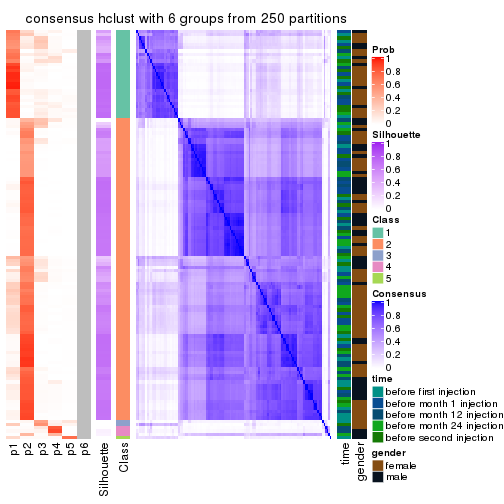</p>

</div>
</div>

Heatmaps for the membership of samples in all partitions to see how consistent they are:


<script>
$( function() {
	$( '#tabs-CV-hclust-membership-heatmap' ).tabs();
} );
</script>
<div id='tabs-CV-hclust-membership-heatmap'>
<ul>
<li><a href='#tab-CV-hclust-membership-heatmap-1'>k = 2</a></li>
<li><a href='#tab-CV-hclust-membership-heatmap-2'>k = 3</a></li>
<li><a href='#tab-CV-hclust-membership-heatmap-3'>k = 4</a></li>
<li><a href='#tab-CV-hclust-membership-heatmap-4'>k = 5</a></li>
<li><a href='#tab-CV-hclust-membership-heatmap-5'>k = 6</a></li>
</ul>
<div id='tab-CV-hclust-membership-heatmap-1'>
<pre><code class="r">membership_heatmap(res, k = 2)
</code></pre>

<p></p>

</div>
<div id='tab-CV-hclust-membership-heatmap-2'>
<pre><code class="r">membership_heatmap(res, k = 3)
</code></pre>

<p></p>

</div>
<div id='tab-CV-hclust-membership-heatmap-3'>
<pre><code class="r">membership_heatmap(res, k = 4)
</code></pre>

<p></p>

</div>
<div id='tab-CV-hclust-membership-heatmap-4'>
<pre><code class="r">membership_heatmap(res, k = 5)
</code></pre>

<p></p>

</div>
<div id='tab-CV-hclust-membership-heatmap-5'>
<pre><code class="r">membership_heatmap(res, k = 6)
</code></pre>

<p></p>

</div>
</div>

As soon as we have had the classes for columns, we can look for signatures
which are significantly different between classes which can be candidate marks
for certain classes. Following are the heatmaps for signatures.


Signature heatmaps where rows are scaled:


<script>
$( function() {
	$( '#tabs-CV-hclust-get-signatures' ).tabs();
} );
</script>
<div id='tabs-CV-hclust-get-signatures'>
<ul>
<li><a href='#tab-CV-hclust-get-signatures-1'>k = 2</a></li>
<li><a href='#tab-CV-hclust-get-signatures-2'>k = 3</a></li>
<li><a href='#tab-CV-hclust-get-signatures-3'>k = 4</a></li>
<li><a href='#tab-CV-hclust-get-signatures-4'>k = 5</a></li>
<li><a href='#tab-CV-hclust-get-signatures-5'>k = 6</a></li>
</ul>
<div id='tab-CV-hclust-get-signatures-1'>
<pre><code class="r">get_signatures(res, k = 2)
</code></pre>

<p></p>

</div>
<div id='tab-CV-hclust-get-signatures-2'>
<pre><code class="r">get_signatures(res, k = 3)
</code></pre>

<p></p>

</div>
<div id='tab-CV-hclust-get-signatures-3'>
<pre><code class="r">get_signatures(res, k = 4)
</code></pre>

<p></p>

</div>
<div id='tab-CV-hclust-get-signatures-4'>
<pre><code class="r">get_signatures(res, k = 5)
</code></pre>

<p></p>

</div>
<div id='tab-CV-hclust-get-signatures-5'>
<pre><code class="r">get_signatures(res, k = 6)
</code></pre>

<p></p>

</div>
</div>


Signature heatmaps where rows are not scaled:


<script>
$( function() {
	$( '#tabs-CV-hclust-get-signatures-no-scale' ).tabs();
} );
</script>
<div id='tabs-CV-hclust-get-signatures-no-scale'>
<ul>
<li><a href='#tab-CV-hclust-get-signatures-no-scale-1'>k = 2</a></li>
<li><a href='#tab-CV-hclust-get-signatures-no-scale-2'>k = 3</a></li>
<li><a href='#tab-CV-hclust-get-signatures-no-scale-3'>k = 4</a></li>
<li><a href='#tab-CV-hclust-get-signatures-no-scale-4'>k = 5</a></li>
<li><a href='#tab-CV-hclust-get-signatures-no-scale-5'>k = 6</a></li>
</ul>
<div id='tab-CV-hclust-get-signatures-no-scale-1'>
<pre><code class="r">get_signatures(res, k = 2, scale_rows = FALSE)
</code></pre>

<p></p>

</div>
<div id='tab-CV-hclust-get-signatures-no-scale-2'>
<pre><code class="r">get_signatures(res, k = 3, scale_rows = FALSE)
</code></pre>

<p></p>

</div>
<div id='tab-CV-hclust-get-signatures-no-scale-3'>
<pre><code class="r">get_signatures(res, k = 4, scale_rows = FALSE)
</code></pre>

<p></p>

</div>
<div id='tab-CV-hclust-get-signatures-no-scale-4'>
<pre><code class="r">get_signatures(res, k = 5, scale_rows = FALSE)
</code></pre>

<p></p>

</div>
<div id='tab-CV-hclust-get-signatures-no-scale-5'>
<pre><code class="r">get_signatures(res, k = 6, scale_rows = FALSE)
</code></pre>

<p></p>

</div>
</div>


Compare the overlap of signatures from different k:

```r
compare_signatures(res)
```


`get_signature()` returns a data frame invisibly. TO get the list of signatures, the function
call should be assigned to a variable explicitly. In following code, if `plot` argument is set
to `FALSE`, no heatmap is plotted while only the differential analysis is performed.

```r
# code only for demonstration
tb = get_signature(res, k = ..., plot = FALSE)
```

An example of the output of `tb` is:

```
#>   which_row         fdr    mean_1    mean_2 scaled_mean_1 scaled_mean_2 km
#> 1        38 0.042760348  8.373488  9.131774    -0.5533452     0.5164555  1
#> 2        40 0.018707592  7.106213  8.469186    -0.6173731     0.5762149  1
#> 3        55 0.019134737 10.221463 11.207825    -0.6159697     0.5749050  1
#> 4        59 0.006059896  5.921854  7.869574    -0.6899429     0.6439467  1
#> 5        60 0.018055526  8.928898 10.211722    -0.6204761     0.5791110  1
#> 6        98 0.009384629 15.714769 14.887706     0.6635654    -0.6193277  2
...
```

The columns in `tb` are:

1. `which_row`: row indices corresponding to the input matrix.
2. `fdr`: FDR for the differential test. 
3. `mean_x`: The mean value in group x.
4. `scaled_mean_x`: The mean value in group x after rows are scaled.
5. `km`: Row groups if k-means clustering is applied to rows.


UMAP plot which shows how samples are separated.


<script>
$( function() {
	$( '#tabs-CV-hclust-dimension-reduction' ).tabs();
} );
</script>
<div id='tabs-CV-hclust-dimension-reduction'>
<ul>
<li><a href='#tab-CV-hclust-dimension-reduction-1'>k = 2</a></li>
<li><a href='#tab-CV-hclust-dimension-reduction-2'>k = 3</a></li>
<li><a href='#tab-CV-hclust-dimension-reduction-3'>k = 4</a></li>
<li><a href='#tab-CV-hclust-dimension-reduction-4'>k = 5</a></li>
<li><a href='#tab-CV-hclust-dimension-reduction-5'>k = 6</a></li>
</ul>
<div id='tab-CV-hclust-dimension-reduction-1'>
<pre><code class="r">dimension_reduction(res, k = 2, method = &quot;UMAP&quot;)
</code></pre>

<p></p>

</div>
<div id='tab-CV-hclust-dimension-reduction-2'>
<pre><code class="r">dimension_reduction(res, k = 3, method = &quot;UMAP&quot;)
</code></pre>

<p></p>

</div>
<div id='tab-CV-hclust-dimension-reduction-3'>
<pre><code class="r">dimension_reduction(res, k = 4, method = &quot;UMAP&quot;)
</code></pre>

<p></p>

</div>
<div id='tab-CV-hclust-dimension-reduction-4'>
<pre><code class="r">dimension_reduction(res, k = 5, method = &quot;UMAP&quot;)
</code></pre>

<p></p>

</div>
<div id='tab-CV-hclust-dimension-reduction-5'>
<pre><code class="r">dimension_reduction(res, k = 6, method = &quot;UMAP&quot;)
</code></pre>

<p></p>

</div>
</div>


Following heatmap shows how subgroups are split when increasing `k`:

```r
collect_classes(res)
```


Test correlation between subgroups and known annotations. If the known
annotation is numeric, one-way ANOVA test is applied, and if the known
annotation is discrete, chi-squared contingency table test is applied.

```r
test_to_known_factors(res)
```

```
#>             n time(p) gender(p) k
#> CV:hclust 119   0.137     0.503 2
#> CV:hclust 117   0.178     0.847 3
#> CV:hclust 108   0.380     0.507 4
#> CV:hclust 114   0.164     0.488 5
#> CV:hclust  99   0.239     0.271 6
```


If matrix rows can be associated to genes, consider to use `GO_Enrichment(res,
...)` to perform function enrichment for the signature genes.


 

---------------------------------------------------


### CV:kmeans


The object with results only for a single top-value method and a single partition method 
can be extracted as:

```r
res = res_list["CV", "kmeans"]
# you can also extract it by
# res = res_list["CV:kmeans"]
```

A summary of `res` and all the functions that can be applied to it:

```r
res
```

```
#> A 'ConsensusPartition' object with k = 2, 3, 4, 5, 6.
#>   On a matrix with 21168 rows and 125 columns.
#>   Top rows (1000, 2000, 3000, 4000, 5000) are extracted by 'CV' method.
#>   Subgroups are detected by 'kmeans' method.
#>   Performed in total 1250 partitions by row resampling.
#>   Best k for subgroups seems to be 2.
#> 
#> Following methods can be applied to this 'ConsensusPartition' object:
#>  [1] "cola_report"             "collect_classes"         "collect_plots"          
#>  [4] "collect_stats"           "colnames"                "compare_signatures"     
#>  [7] "consensus_heatmap"       "dimension_reduction"     "functional_enrichment"  
#> [10] "get_anno_col"            "get_anno"                "get_classes"            
#> [13] "get_consensus"           "get_matrix"              "get_membership"         
#> [16] "get_param"               "get_signatures"          "get_stats"              
#> [19] "is_best_k"               "is_stable_k"             "membership_heatmap"     
#> [22] "ncol"                    "nrow"                    "plot_ecdf"              
#> [25] "rownames"                "select_partition_number" "show"                   
#> [28] "suggest_best_k"          "test_to_known_factors"
```

`collect_plots()` function collects all the plots made from `res` for all `k` (number of partitions)
into one single page to provide an easy and fast comparison between different `k`.

```r
collect_plots(res)
```


The plots are:

- The first row: a plot of the ECDF (Empirical cumulative distribution
  function) curves of the consensus matrix for each `k` and the heatmap of
  predicted classes for each `k`.
- The second row: heatmaps of the consensus matrix for each `k`.
- The third row: heatmaps of the membership matrix for each `k`.
- The fouth row: heatmaps of the signatures for each `k`.

All the plots in panels can be made by individual functions and they are
plotted later in this section.

`select_partition_number()` produces several plots showing different
statistics for choosing "optimized" `k`. There are following statistics:

- ECDF curves of the consensus matrix for each `k`;
- 1-PAC. [The PAC
  score](https://en.wikipedia.org/wiki/Consensus_clustering#Over-interpretation_potential_of_consensus_clustering)
  measures the proportion of the ambiguous subgrouping.
- Mean silhouette score.
- Concordance. The mean probability of fiting the consensus class ids in all
  partitions.
- Area increased. Denote $A_k$ as the area under the ECDF curve for current
  `k`, the area increased is defined as $A_k - A_{k-1}$.
- Rand index. The percent of pairs of samples that are both in a same cluster
  or both are not in a same cluster in the partition of k and k-1.
- Jaccard index. The ratio of pairs of samples are both in a same cluster in
  the partition of k and k-1 and the pairs of samples are both in a same
  cluster in the partition k or k-1.

The detailed explanations of these statistics can be found in [the cola
vignette](http://bioconductor.org/packages/devel/bioc/vignettes/cola/inst/doc/cola.html#toc_13).

Generally speaking, lower PAC score, higher mean silhouette score or higher
concordance corresponds to better partition. Rand index and Jaccard index
measure how similar the current partition is compared to partition with `k-1`.
If they are too similar, we won't accept `k` is better than `k-1`.

```r
select_partition_number(res)
```


The numeric values for all these statistics can be obtained by `get_stats()`.

```r
get_stats(res)
```

```
#>   k 1-PAC mean_silhouette concordance area_increased  Rand Jaccard
#> 2 2 0.885           0.914       0.963         0.5021 0.497   0.497
#> 3 3 0.561           0.645       0.831         0.2823 0.784   0.596
#> 4 4 0.594           0.397       0.640         0.1171 0.858   0.626
#> 5 5 0.644           0.714       0.767         0.0704 0.810   0.436
#> 6 6 0.674           0.617       0.742         0.0379 0.982   0.922
```

`suggest_best_k()` suggests the best $k$ based on these statistics. The rules are as follows:

- All $k$ with Jaccard index larger than 0.95 are removed because the increase of
  the partition number does not provides enough extra information. If all $k$ are removed,
  the best $k$ is assigned by `NA`.
- For $k$ with 1-PAC larger than 0.9, the maximal $k$ is taken as the "best k". Other $k$ is called "optional k".
- If it does not fit the second rule. The $k$ with the highest vote of highest
  1-PAC, mean silhouette and concordance is taken as the "best k".

```r
suggest_best_k(res)
```

```
#> [1] 2
```


Following shows the table of the partitions (You need to click the **show/hide
code output** link to see it). The membership matrix (columns with name `p*`)
is inferred by
[`clue::cl_consensus()`](https://www.rdocumentation.org/link/cl_consensus?package=clue)
function with the `SE` method. Basically the value in the membership matrix
represents the probability to belong to a certain group. The finall class
label for an item is determined with the group with highest probability it
belongs to.

In `get_classes()` function, the entropy is calculated from the membership
matrix and the silhouette score is calculated from the consensus matrix.


<script>
$( function() {
	$( '#tabs-CV-kmeans-get-classes' ).tabs();
} );
</script>
<div id='tabs-CV-kmeans-get-classes'>
<ul>
<li><a href='#tab-CV-kmeans-get-classes-1'>k = 2</a></li>
<li><a href='#tab-CV-kmeans-get-classes-2'>k = 3</a></li>
<li><a href='#tab-CV-kmeans-get-classes-3'>k = 4</a></li>
<li><a href='#tab-CV-kmeans-get-classes-4'>k = 5</a></li>
<li><a href='#tab-CV-kmeans-get-classes-5'>k = 6</a></li>
</ul>

<div id='tab-CV-kmeans-get-classes-1'>
<p><a id='tab-CV-kmeans-get-classes-1-a' style='color:#0366d6' href='#'>show/hide code output</a></p>
<pre><code class="r">cbind(get_classes(res, k = 2), get_membership(res, k = 2))
</code></pre>

<pre><code>#&gt;           class entropy silhouette    p1    p2
#&gt; GSM601752     2  0.0672     0.9575 0.008 0.992
#&gt; GSM601782     1  0.0000     0.9671 1.000 0.000
#&gt; GSM601792     1  0.0000     0.9671 1.000 0.000
#&gt; GSM601797     1  0.9998    -0.0106 0.508 0.492
#&gt; GSM601827     1  0.0000     0.9671 1.000 0.000
#&gt; GSM601837     2  0.0000     0.9542 0.000 1.000
#&gt; GSM601842     2  0.0672     0.9575 0.008 0.992
#&gt; GSM601857     1  0.0376     0.9652 0.996 0.004
#&gt; GSM601867     1  0.8608     0.6069 0.716 0.284
#&gt; GSM601747     1  0.0000     0.9671 1.000 0.000
#&gt; GSM601757     1  0.0000     0.9671 1.000 0.000
#&gt; GSM601762     2  0.0672     0.9575 0.008 0.992
#&gt; GSM601767     2  0.0672     0.9575 0.008 0.992
#&gt; GSM601772     2  0.0672     0.9575 0.008 0.992
#&gt; GSM601777     1  0.7674     0.7091 0.776 0.224
#&gt; GSM601787     2  0.7299     0.7344 0.204 0.796
#&gt; GSM601802     2  0.0672     0.9575 0.008 0.992
#&gt; GSM601807     1  0.4022     0.9025 0.920 0.080
#&gt; GSM601812     1  0.0000     0.9671 1.000 0.000
#&gt; GSM601817     1  0.0000     0.9671 1.000 0.000
#&gt; GSM601822     2  0.9881     0.2652 0.436 0.564
#&gt; GSM601832     2  0.0672     0.9575 0.008 0.992
#&gt; GSM601847     2  0.1414     0.9494 0.020 0.980
#&gt; GSM601852     1  0.0000     0.9671 1.000 0.000
#&gt; GSM601862     1  0.0672     0.9632 0.992 0.008
#&gt; GSM601753     2  0.0672     0.9575 0.008 0.992
#&gt; GSM601783     1  0.0000     0.9671 1.000 0.000
#&gt; GSM601793     1  0.0000     0.9671 1.000 0.000
#&gt; GSM601798     2  0.0376     0.9560 0.004 0.996
#&gt; GSM601828     1  0.0000     0.9671 1.000 0.000
#&gt; GSM601838     2  0.0000     0.9542 0.000 1.000
#&gt; GSM601843     2  0.0672     0.9575 0.008 0.992
#&gt; GSM601858     2  0.0376     0.9559 0.004 0.996
#&gt; GSM601868     1  0.0672     0.9632 0.992 0.008
#&gt; GSM601748     1  0.0000     0.9671 1.000 0.000
#&gt; GSM601758     1  0.0000     0.9671 1.000 0.000
#&gt; GSM601763     1  0.9963     0.0690 0.536 0.464
#&gt; GSM601768     2  0.0672     0.9575 0.008 0.992
#&gt; GSM601773     2  0.0672     0.9575 0.008 0.992
#&gt; GSM601778     1  0.0000     0.9671 1.000 0.000
#&gt; GSM601788     2  0.1414     0.9428 0.020 0.980
#&gt; GSM601803     2  0.0672     0.9575 0.008 0.992
#&gt; GSM601808     1  0.0672     0.9632 0.992 0.008
#&gt; GSM601813     1  0.0000     0.9671 1.000 0.000
#&gt; GSM601818     1  0.0672     0.9632 0.992 0.008
#&gt; GSM601823     1  0.0000     0.9671 1.000 0.000
#&gt; GSM601833     2  0.0672     0.9575 0.008 0.992
#&gt; GSM601848     1  0.0000     0.9671 1.000 0.000
#&gt; GSM601853     1  0.0672     0.9632 0.992 0.008
#&gt; GSM601863     1  0.0376     0.9652 0.996 0.004
#&gt; GSM601754     2  0.0672     0.9575 0.008 0.992
#&gt; GSM601784     2  0.0672     0.9575 0.008 0.992
#&gt; GSM601794     1  0.0000     0.9671 1.000 0.000
#&gt; GSM601799     2  0.0672     0.9575 0.008 0.992
#&gt; GSM601829     1  0.0000     0.9671 1.000 0.000
#&gt; GSM601839     2  0.0000     0.9542 0.000 1.000
#&gt; GSM601844     1  0.0000     0.9671 1.000 0.000
#&gt; GSM601859     2  0.0672     0.9575 0.008 0.992
#&gt; GSM601869     1  0.0672     0.9632 0.992 0.008
#&gt; GSM601749     1  0.0000     0.9671 1.000 0.000
#&gt; GSM601759     1  0.0000     0.9671 1.000 0.000
#&gt; GSM601764     1  0.0000     0.9671 1.000 0.000
#&gt; GSM601769     2  0.0672     0.9575 0.008 0.992
#&gt; GSM601774     2  0.0672     0.9575 0.008 0.992
#&gt; GSM601779     1  0.0000     0.9671 1.000 0.000
#&gt; GSM601789     2  0.0000     0.9542 0.000 1.000
#&gt; GSM601804     2  0.0672     0.9575 0.008 0.992
#&gt; GSM601809     1  0.2043     0.9472 0.968 0.032
#&gt; GSM601814     2  0.0376     0.9560 0.004 0.996
#&gt; GSM601819     1  0.0000     0.9671 1.000 0.000
#&gt; GSM601824     2  0.0938     0.9551 0.012 0.988
#&gt; GSM601834     2  0.0672     0.9575 0.008 0.992
#&gt; GSM601849     1  0.0000     0.9671 1.000 0.000
#&gt; GSM601854     1  0.0000     0.9671 1.000 0.000
#&gt; GSM601864     2  0.0000     0.9542 0.000 1.000
#&gt; GSM601755     2  0.0672     0.9575 0.008 0.992
#&gt; GSM601785     2  0.0672     0.9575 0.008 0.992
#&gt; GSM601795     1  0.2778     0.9271 0.952 0.048
#&gt; GSM601800     2  0.0672     0.9575 0.008 0.992
#&gt; GSM601830     1  0.0672     0.9632 0.992 0.008
#&gt; GSM601840     2  0.0672     0.9575 0.008 0.992
#&gt; GSM601845     2  0.8555     0.6286 0.280 0.720
#&gt; GSM601860     2  0.0672     0.9575 0.008 0.992
#&gt; GSM601870     1  0.0672     0.9632 0.992 0.008
#&gt; GSM601750     1  0.0000     0.9671 1.000 0.000
#&gt; GSM601760     1  0.0000     0.9671 1.000 0.000
#&gt; GSM601765     2  0.0672     0.9575 0.008 0.992
#&gt; GSM601770     2  0.0672     0.9575 0.008 0.992
#&gt; GSM601775     2  0.7376     0.7475 0.208 0.792
#&gt; GSM601780     1  0.0000     0.9671 1.000 0.000
#&gt; GSM601790     2  0.0000     0.9542 0.000 1.000
#&gt; GSM601805     2  0.0672     0.9575 0.008 0.992
#&gt; GSM601810     1  0.0376     0.9652 0.996 0.004
#&gt; GSM601815     2  0.0000     0.9542 0.000 1.000
#&gt; GSM601820     1  0.0000     0.9671 1.000 0.000
#&gt; GSM601825     2  0.0672     0.9575 0.008 0.992
#&gt; GSM601835     2  0.0376     0.9560 0.004 0.996
#&gt; GSM601850     1  0.5519     0.8406 0.872 0.128
#&gt; GSM601855     1  0.0672     0.9632 0.992 0.008
#&gt; GSM601865     2  0.0000     0.9542 0.000 1.000
#&gt; GSM601756     2  0.0672     0.9575 0.008 0.992
#&gt; GSM601786     2  0.0000     0.9542 0.000 1.000
#&gt; GSM601796     1  0.0000     0.9671 1.000 0.000
#&gt; GSM601801     2  0.0376     0.9560 0.004 0.996
#&gt; GSM601831     1  0.0000     0.9671 1.000 0.000
#&gt; GSM601841     1  0.0000     0.9671 1.000 0.000
#&gt; GSM601846     2  0.7602     0.7217 0.220 0.780
#&gt; GSM601861     2  0.0000     0.9542 0.000 1.000
#&gt; GSM601871     2  0.9896     0.1929 0.440 0.560
#&gt; GSM601751     2  0.5294     0.8556 0.120 0.880
#&gt; GSM601761     1  0.0000     0.9671 1.000 0.000
#&gt; GSM601766     2  0.9552     0.4250 0.376 0.624
#&gt; GSM601771     2  0.0672     0.9575 0.008 0.992
#&gt; GSM601776     1  0.0000     0.9671 1.000 0.000
#&gt; GSM601781     1  0.6343     0.8046 0.840 0.160
#&gt; GSM601791     1  0.0000     0.9671 1.000 0.000
#&gt; GSM601806     2  0.0672     0.9575 0.008 0.992
#&gt; GSM601811     1  0.0672     0.9632 0.992 0.008
#&gt; GSM601816     1  0.0000     0.9671 1.000 0.000
#&gt; GSM601821     2  0.0000     0.9542 0.000 1.000
#&gt; GSM601826     1  0.0000     0.9671 1.000 0.000
#&gt; GSM601836     1  0.0000     0.9671 1.000 0.000
#&gt; GSM601851     1  0.0000     0.9671 1.000 0.000
#&gt; GSM601856     1  0.0672     0.9632 0.992 0.008
#&gt; GSM601866     1  0.0000     0.9671 1.000 0.000
</code></pre>

<script>
$('#tab-CV-kmeans-get-classes-1-a').parent().next().next().hide();
$('#tab-CV-kmeans-get-classes-1-a').click(function(){
  $('#tab-CV-kmeans-get-classes-1-a').parent().next().next().toggle();
  return(false);
});
</script>
</div>

<div id='tab-CV-kmeans-get-classes-2'>
<p><a id='tab-CV-kmeans-get-classes-2-a' style='color:#0366d6' href='#'>show/hide code output</a></p>
<pre><code class="r">cbind(get_classes(res, k = 3), get_membership(res, k = 3))
</code></pre>

<pre><code>#&gt;           class entropy silhouette    p1    p2    p3
#&gt; GSM601752     2  0.3091     0.8871 0.072 0.912 0.016
#&gt; GSM601782     3  0.6302     0.2529 0.480 0.000 0.520
#&gt; GSM601792     1  0.1711     0.6664 0.960 0.008 0.032
#&gt; GSM601797     1  0.7858     0.2842 0.572 0.364 0.064
#&gt; GSM601827     3  0.6180     0.4337 0.416 0.000 0.584
#&gt; GSM601837     2  0.4346     0.8261 0.000 0.816 0.184
#&gt; GSM601842     2  0.0237     0.9111 0.004 0.996 0.000
#&gt; GSM601857     3  0.4654     0.7760 0.208 0.000 0.792
#&gt; GSM601867     3  0.2945     0.6043 0.004 0.088 0.908
#&gt; GSM601747     1  0.5681     0.4787 0.748 0.016 0.236
#&gt; GSM601757     1  0.6026     0.1535 0.624 0.000 0.376
#&gt; GSM601762     2  0.0424     0.9113 0.008 0.992 0.000
#&gt; GSM601767     2  0.0237     0.9107 0.004 0.996 0.000
#&gt; GSM601772     2  0.0475     0.9101 0.004 0.992 0.004
#&gt; GSM601777     1  0.7266     0.4418 0.688 0.080 0.232
#&gt; GSM601787     3  0.4399     0.4993 0.000 0.188 0.812
#&gt; GSM601802     2  0.2902     0.8936 0.064 0.920 0.016
#&gt; GSM601807     3  0.1999     0.6463 0.012 0.036 0.952
#&gt; GSM601812     1  0.6308    -0.2332 0.508 0.000 0.492
#&gt; GSM601817     3  0.6295     0.3101 0.472 0.000 0.528
#&gt; GSM601822     1  0.5092     0.5556 0.804 0.176 0.020
#&gt; GSM601832     2  0.1647     0.9080 0.036 0.960 0.004
#&gt; GSM601847     1  0.6836     0.1820 0.572 0.412 0.016
#&gt; GSM601852     1  0.6192     0.0238 0.580 0.000 0.420
#&gt; GSM601862     3  0.4504     0.7817 0.196 0.000 0.804
#&gt; GSM601753     2  0.2902     0.8920 0.064 0.920 0.016
#&gt; GSM601783     1  0.5810     0.2533 0.664 0.000 0.336
#&gt; GSM601793     1  0.1832     0.6659 0.956 0.008 0.036
#&gt; GSM601798     2  0.2031     0.9060 0.032 0.952 0.016
#&gt; GSM601828     1  0.6305    -0.2078 0.516 0.000 0.484
#&gt; GSM601838     2  0.4346     0.8261 0.000 0.816 0.184
#&gt; GSM601843     2  0.0000     0.9104 0.000 1.000 0.000
#&gt; GSM601858     2  0.3752     0.8523 0.000 0.856 0.144
#&gt; GSM601868     3  0.4178     0.7824 0.172 0.000 0.828
#&gt; GSM601748     1  0.6291    -0.1555 0.532 0.000 0.468
#&gt; GSM601758     1  0.6079     0.1239 0.612 0.000 0.388
#&gt; GSM601763     1  0.4110     0.5806 0.844 0.152 0.004
#&gt; GSM601768     2  0.1647     0.9079 0.036 0.960 0.004
#&gt; GSM601773     2  0.0237     0.9107 0.004 0.996 0.000
#&gt; GSM601778     1  0.3369     0.6448 0.908 0.040 0.052
#&gt; GSM601788     2  0.4045     0.8798 0.024 0.872 0.104
#&gt; GSM601803     2  0.2703     0.8980 0.056 0.928 0.016
#&gt; GSM601808     3  0.4235     0.7832 0.176 0.000 0.824
#&gt; GSM601813     1  0.6140     0.0718 0.596 0.000 0.404
#&gt; GSM601818     3  0.5560     0.6679 0.300 0.000 0.700
#&gt; GSM601823     1  0.1015     0.6712 0.980 0.008 0.012
#&gt; GSM601833     2  0.0424     0.9113 0.008 0.992 0.000
#&gt; GSM601848     1  0.1015     0.6712 0.980 0.008 0.012
#&gt; GSM601853     3  0.4291     0.7834 0.180 0.000 0.820
#&gt; GSM601863     3  0.5098     0.7468 0.248 0.000 0.752
#&gt; GSM601754     2  0.3183     0.8848 0.076 0.908 0.016
#&gt; GSM601784     2  0.0237     0.9103 0.000 0.996 0.004
#&gt; GSM601794     1  0.2339     0.6602 0.940 0.012 0.048
#&gt; GSM601799     2  0.4139     0.8401 0.124 0.860 0.016
#&gt; GSM601829     1  0.2066     0.6536 0.940 0.000 0.060
#&gt; GSM601839     2  0.4346     0.8261 0.000 0.816 0.184
#&gt; GSM601844     1  0.1999     0.6669 0.952 0.012 0.036
#&gt; GSM601859     2  0.0424     0.9116 0.008 0.992 0.000
#&gt; GSM601869     3  0.4555     0.7798 0.200 0.000 0.800
#&gt; GSM601749     1  0.6045     0.1438 0.620 0.000 0.380
#&gt; GSM601759     1  0.6180     0.0348 0.584 0.000 0.416
#&gt; GSM601764     1  0.0983     0.6685 0.980 0.004 0.016
#&gt; GSM601769     2  0.2772     0.8853 0.004 0.916 0.080
#&gt; GSM601774     2  0.0237     0.9107 0.004 0.996 0.000
#&gt; GSM601779     1  0.0661     0.6686 0.988 0.008 0.004
#&gt; GSM601789     2  0.4465     0.8330 0.004 0.820 0.176
#&gt; GSM601804     2  0.6941     0.1959 0.464 0.520 0.016
#&gt; GSM601809     3  0.6677     0.5822 0.324 0.024 0.652
#&gt; GSM601814     2  0.3112     0.8780 0.004 0.900 0.096
#&gt; GSM601819     1  0.5291     0.3986 0.732 0.000 0.268
#&gt; GSM601824     1  0.5318     0.5330 0.780 0.204 0.016
#&gt; GSM601834     2  0.0237     0.9107 0.004 0.996 0.000
#&gt; GSM601849     1  0.0892     0.6646 0.980 0.000 0.020
#&gt; GSM601854     1  0.6295    -0.1696 0.528 0.000 0.472
#&gt; GSM601864     2  0.4346     0.8261 0.000 0.816 0.184
#&gt; GSM601755     2  0.2804     0.8943 0.060 0.924 0.016
#&gt; GSM601785     2  0.1399     0.9093 0.028 0.968 0.004
#&gt; GSM601795     1  0.4709     0.6160 0.852 0.092 0.056
#&gt; GSM601800     2  0.2804     0.8943 0.060 0.924 0.016
#&gt; GSM601830     3  0.3879     0.7741 0.152 0.000 0.848
#&gt; GSM601840     2  0.2955     0.8853 0.080 0.912 0.008
#&gt; GSM601845     1  0.6527     0.2669 0.588 0.404 0.008
#&gt; GSM601860     2  0.0592     0.9116 0.012 0.988 0.000
#&gt; GSM601870     3  0.1267     0.6774 0.024 0.004 0.972
#&gt; GSM601750     1  0.6299    -0.1815 0.524 0.000 0.476
#&gt; GSM601760     1  0.5058     0.4358 0.756 0.000 0.244
#&gt; GSM601765     2  0.1289     0.9093 0.032 0.968 0.000
#&gt; GSM601770     2  0.0424     0.9113 0.008 0.992 0.000
#&gt; GSM601775     2  0.6513     0.3740 0.400 0.592 0.008
#&gt; GSM601780     1  0.1015     0.6712 0.980 0.008 0.012
#&gt; GSM601790     2  0.3941     0.8439 0.000 0.844 0.156
#&gt; GSM601805     2  0.2703     0.8980 0.056 0.928 0.016
#&gt; GSM601810     3  0.4555     0.7810 0.200 0.000 0.800
#&gt; GSM601815     2  0.4110     0.8474 0.004 0.844 0.152
#&gt; GSM601820     1  0.6286    -0.1415 0.536 0.000 0.464
#&gt; GSM601825     2  0.2339     0.9029 0.048 0.940 0.012
#&gt; GSM601835     2  0.1267     0.9067 0.004 0.972 0.024
#&gt; GSM601850     1  0.3910     0.6191 0.876 0.104 0.020
#&gt; GSM601855     3  0.3752     0.7694 0.144 0.000 0.856
#&gt; GSM601865     2  0.4346     0.8261 0.000 0.816 0.184
#&gt; GSM601756     2  0.2599     0.8984 0.052 0.932 0.016
#&gt; GSM601786     2  0.4555     0.8134 0.000 0.800 0.200
#&gt; GSM601796     1  0.2173     0.6594 0.944 0.008 0.048
#&gt; GSM601801     2  0.1774     0.9080 0.024 0.960 0.016
#&gt; GSM601831     3  0.4842     0.7635 0.224 0.000 0.776
#&gt; GSM601841     1  0.5325     0.4691 0.748 0.004 0.248
#&gt; GSM601846     1  0.8812     0.2370 0.516 0.360 0.124
#&gt; GSM601861     2  0.3551     0.8588 0.000 0.868 0.132
#&gt; GSM601871     3  0.4346     0.5022 0.000 0.184 0.816
#&gt; GSM601751     2  0.4526     0.8489 0.104 0.856 0.040
#&gt; GSM601761     1  0.1015     0.6712 0.980 0.008 0.012
#&gt; GSM601766     1  0.5365     0.5128 0.744 0.252 0.004
#&gt; GSM601771     2  0.1267     0.9103 0.024 0.972 0.004
#&gt; GSM601776     1  0.1015     0.6712 0.980 0.008 0.012
#&gt; GSM601781     1  0.3805     0.6290 0.884 0.092 0.024
#&gt; GSM601791     1  0.1015     0.6712 0.980 0.008 0.012
#&gt; GSM601806     2  0.1491     0.9097 0.016 0.968 0.016
#&gt; GSM601811     3  0.4178     0.7824 0.172 0.000 0.828
#&gt; GSM601816     1  0.1711     0.6686 0.960 0.008 0.032
#&gt; GSM601821     2  0.3686     0.8542 0.000 0.860 0.140
#&gt; GSM601826     1  0.1015     0.6712 0.980 0.008 0.012
#&gt; GSM601836     1  0.1832     0.6637 0.956 0.036 0.008
#&gt; GSM601851     1  0.0592     0.6681 0.988 0.000 0.012
#&gt; GSM601856     3  0.4504     0.7816 0.196 0.000 0.804
#&gt; GSM601866     3  0.6280     0.3502 0.460 0.000 0.540
</code></pre>

<script>
$('#tab-CV-kmeans-get-classes-2-a').parent().next().next().hide();
$('#tab-CV-kmeans-get-classes-2-a').click(function(){
  $('#tab-CV-kmeans-get-classes-2-a').parent().next().next().toggle();
  return(false);
});
</script>
</div>

<div id='tab-CV-kmeans-get-classes-3'>
<p><a id='tab-CV-kmeans-get-classes-3-a' style='color:#0366d6' href='#'>show/hide code output</a></p>
<pre><code class="r">cbind(get_classes(res, k = 4), get_membership(res, k = 4))
</code></pre>

<pre><code>#&gt;           class entropy silhouette    p1    p2    p3    p4
#&gt; GSM601752     4  0.5933    -0.2619 0.040 0.408 0.000 0.552
#&gt; GSM601782     3  0.7895     0.1434 0.308 0.000 0.376 0.316
#&gt; GSM601792     1  0.2198     0.6804 0.920 0.000 0.008 0.072
#&gt; GSM601797     1  0.6550     0.3027 0.484 0.024 0.032 0.460
#&gt; GSM601827     3  0.7910     0.1187 0.304 0.000 0.352 0.344
#&gt; GSM601837     2  0.0895     0.5977 0.000 0.976 0.020 0.004
#&gt; GSM601842     2  0.5085     0.6668 0.008 0.616 0.000 0.376
#&gt; GSM601857     3  0.2919     0.7799 0.060 0.000 0.896 0.044
#&gt; GSM601867     3  0.4317     0.6751 0.004 0.196 0.784 0.016
#&gt; GSM601747     4  0.7746    -0.3321 0.416 0.016 0.144 0.424
#&gt; GSM601757     1  0.7485     0.1578 0.472 0.000 0.192 0.336
#&gt; GSM601762     2  0.5298     0.6679 0.016 0.612 0.000 0.372
#&gt; GSM601767     2  0.5298     0.6679 0.016 0.612 0.000 0.372
#&gt; GSM601772     2  0.5284     0.6713 0.016 0.616 0.000 0.368
#&gt; GSM601777     1  0.7601     0.4059 0.564 0.020 0.220 0.196
#&gt; GSM601787     3  0.4516     0.6357 0.000 0.252 0.736 0.012
#&gt; GSM601802     4  0.5888    -0.2887 0.036 0.424 0.000 0.540
#&gt; GSM601807     3  0.3658     0.7122 0.000 0.144 0.836 0.020
#&gt; GSM601812     4  0.7863    -0.2555 0.344 0.000 0.276 0.380
#&gt; GSM601817     4  0.7886    -0.3067 0.296 0.000 0.324 0.380
#&gt; GSM601822     1  0.4699     0.4939 0.676 0.004 0.000 0.320
#&gt; GSM601832     2  0.5894     0.6243 0.040 0.568 0.000 0.392
#&gt; GSM601847     1  0.5883     0.3526 0.572 0.040 0.000 0.388
#&gt; GSM601852     1  0.7799     0.0248 0.384 0.000 0.248 0.368
#&gt; GSM601862     3  0.1724     0.7906 0.020 0.000 0.948 0.032
#&gt; GSM601753     4  0.5543    -0.2867 0.020 0.424 0.000 0.556
#&gt; GSM601783     1  0.7537     0.1379 0.456 0.000 0.196 0.348
#&gt; GSM601793     1  0.2402     0.6783 0.912 0.000 0.012 0.076
#&gt; GSM601798     4  0.5570    -0.3050 0.020 0.440 0.000 0.540
#&gt; GSM601828     4  0.7879    -0.2714 0.332 0.000 0.288 0.380
#&gt; GSM601838     2  0.0707     0.5984 0.000 0.980 0.020 0.000
#&gt; GSM601843     2  0.5070     0.6676 0.008 0.620 0.000 0.372
#&gt; GSM601858     2  0.4318     0.6498 0.004 0.776 0.012 0.208
#&gt; GSM601868     3  0.1707     0.7901 0.024 0.004 0.952 0.020
#&gt; GSM601748     4  0.7863    -0.2515 0.344 0.000 0.276 0.380
#&gt; GSM601758     1  0.7634     0.1005 0.424 0.000 0.208 0.368
#&gt; GSM601763     1  0.4690     0.5096 0.724 0.016 0.000 0.260
#&gt; GSM601768     2  0.5613     0.6512 0.028 0.592 0.000 0.380
#&gt; GSM601773     2  0.5284     0.6699 0.016 0.616 0.000 0.368
#&gt; GSM601778     1  0.4500     0.6170 0.776 0.000 0.032 0.192
#&gt; GSM601788     2  0.6832     0.5690 0.040 0.624 0.060 0.276
#&gt; GSM601803     4  0.5888    -0.2887 0.036 0.424 0.000 0.540
#&gt; GSM601808     3  0.1297     0.7918 0.016 0.000 0.964 0.020
#&gt; GSM601813     1  0.7706     0.0763 0.412 0.000 0.224 0.364
#&gt; GSM601818     3  0.7537     0.3287 0.196 0.000 0.456 0.348
#&gt; GSM601823     1  0.0336     0.6870 0.992 0.000 0.000 0.008
#&gt; GSM601833     2  0.5313     0.6668 0.016 0.608 0.000 0.376
#&gt; GSM601848     1  0.0707     0.6884 0.980 0.000 0.000 0.020
#&gt; GSM601853     3  0.1297     0.7916 0.016 0.000 0.964 0.020
#&gt; GSM601863     3  0.3400     0.7675 0.064 0.000 0.872 0.064
#&gt; GSM601754     4  0.5784    -0.2681 0.032 0.412 0.000 0.556
#&gt; GSM601784     2  0.4661     0.6737 0.000 0.652 0.000 0.348
#&gt; GSM601794     1  0.3052     0.6731 0.880 0.004 0.012 0.104
#&gt; GSM601799     4  0.6276    -0.2437 0.064 0.380 0.000 0.556
#&gt; GSM601829     1  0.2385     0.6769 0.920 0.000 0.028 0.052
#&gt; GSM601839     2  0.0707     0.5984 0.000 0.980 0.020 0.000
#&gt; GSM601844     1  0.1909     0.6834 0.940 0.004 0.008 0.048
#&gt; GSM601859     2  0.5231     0.6561 0.012 0.604 0.000 0.384
#&gt; GSM601869     3  0.2892     0.7853 0.036 0.000 0.896 0.068
#&gt; GSM601749     1  0.7634     0.1005 0.424 0.000 0.208 0.368
#&gt; GSM601759     1  0.7673     0.0888 0.416 0.000 0.216 0.368
#&gt; GSM601764     1  0.1284     0.6848 0.964 0.012 0.000 0.024
#&gt; GSM601769     2  0.2944     0.6377 0.004 0.868 0.000 0.128
#&gt; GSM601774     2  0.5149     0.6763 0.016 0.648 0.000 0.336
#&gt; GSM601779     1  0.0336     0.6870 0.992 0.000 0.000 0.008
#&gt; GSM601789     2  0.0779     0.6004 0.000 0.980 0.016 0.004
#&gt; GSM601804     4  0.6442    -0.1311 0.440 0.068 0.000 0.492
#&gt; GSM601809     3  0.7468     0.5681 0.208 0.072 0.624 0.096
#&gt; GSM601814     2  0.2593     0.6258 0.000 0.904 0.016 0.080
#&gt; GSM601819     1  0.7475     0.1427 0.448 0.000 0.180 0.372
#&gt; GSM601824     1  0.5666     0.3765 0.616 0.036 0.000 0.348
#&gt; GSM601834     2  0.5298     0.6694 0.016 0.612 0.000 0.372
#&gt; GSM601849     1  0.0804     0.6842 0.980 0.000 0.008 0.012
#&gt; GSM601854     4  0.7874    -0.2528 0.348 0.000 0.280 0.372
#&gt; GSM601864     2  0.0817     0.5949 0.000 0.976 0.024 0.000
#&gt; GSM601755     4  0.5636    -0.2801 0.024 0.424 0.000 0.552
#&gt; GSM601785     2  0.5229     0.5996 0.008 0.564 0.000 0.428
#&gt; GSM601795     1  0.4922     0.5664 0.700 0.004 0.012 0.284
#&gt; GSM601800     4  0.5636    -0.2801 0.024 0.424 0.000 0.552
#&gt; GSM601830     3  0.2089     0.7887 0.020 0.012 0.940 0.028
#&gt; GSM601840     4  0.6081    -0.4358 0.044 0.472 0.000 0.484
#&gt; GSM601845     1  0.7461     0.2210 0.492 0.144 0.008 0.356
#&gt; GSM601860     2  0.5256     0.6469 0.012 0.596 0.000 0.392
#&gt; GSM601870     3  0.3160     0.7381 0.000 0.108 0.872 0.020
#&gt; GSM601750     4  0.7859    -0.2483 0.352 0.000 0.272 0.376
#&gt; GSM601760     1  0.6968     0.2627 0.552 0.000 0.140 0.308
#&gt; GSM601765     2  0.5600     0.6558 0.028 0.596 0.000 0.376
#&gt; GSM601770     2  0.5298     0.6679 0.016 0.612 0.000 0.372
#&gt; GSM601775     4  0.7540    -0.2056 0.216 0.304 0.000 0.480
#&gt; GSM601780     1  0.0336     0.6870 0.992 0.000 0.000 0.008
#&gt; GSM601790     2  0.0592     0.6008 0.000 0.984 0.016 0.000
#&gt; GSM601805     4  0.5888    -0.2887 0.036 0.424 0.000 0.540
#&gt; GSM601810     3  0.3198     0.7721 0.040 0.000 0.880 0.080
#&gt; GSM601815     2  0.1059     0.6062 0.000 0.972 0.016 0.012
#&gt; GSM601820     4  0.7853    -0.2452 0.364 0.000 0.268 0.368
#&gt; GSM601825     4  0.5827    -0.3470 0.032 0.436 0.000 0.532
#&gt; GSM601835     2  0.5268     0.6740 0.012 0.636 0.004 0.348
#&gt; GSM601850     1  0.3161     0.6670 0.864 0.012 0.000 0.124
#&gt; GSM601855     3  0.1631     0.7911 0.016 0.008 0.956 0.020
#&gt; GSM601865     2  0.0921     0.5909 0.000 0.972 0.028 0.000
#&gt; GSM601756     4  0.5636    -0.2801 0.024 0.424 0.000 0.552
#&gt; GSM601786     2  0.1854     0.5608 0.000 0.940 0.048 0.012
#&gt; GSM601796     1  0.2847     0.6757 0.896 0.004 0.016 0.084
#&gt; GSM601801     4  0.5564    -0.2980 0.020 0.436 0.000 0.544
#&gt; GSM601831     3  0.6634     0.5071 0.108 0.000 0.580 0.312
#&gt; GSM601841     1  0.4780     0.5908 0.788 0.000 0.116 0.096
#&gt; GSM601846     1  0.7341     0.2915 0.464 0.048 0.052 0.436
#&gt; GSM601861     2  0.1510     0.6128 0.000 0.956 0.016 0.028
#&gt; GSM601871     3  0.4661     0.6312 0.000 0.256 0.728 0.016
#&gt; GSM601751     2  0.7039     0.4892 0.076 0.492 0.016 0.416
#&gt; GSM601761     1  0.0804     0.6836 0.980 0.000 0.008 0.012
#&gt; GSM601766     1  0.6575     0.2452 0.560 0.092 0.000 0.348
#&gt; GSM601771     2  0.5582     0.6229 0.024 0.576 0.000 0.400
#&gt; GSM601776     1  0.0524     0.6862 0.988 0.000 0.004 0.008
#&gt; GSM601781     1  0.3606     0.6637 0.856 0.020 0.008 0.116
#&gt; GSM601791     1  0.0592     0.6881 0.984 0.000 0.000 0.016
#&gt; GSM601806     4  0.5402    -0.3721 0.012 0.472 0.000 0.516
#&gt; GSM601811     3  0.2587     0.7888 0.020 0.008 0.916 0.056
#&gt; GSM601816     1  0.1635     0.6860 0.948 0.000 0.008 0.044
#&gt; GSM601821     2  0.1510     0.6124 0.000 0.956 0.016 0.028
#&gt; GSM601826     1  0.0817     0.6888 0.976 0.000 0.000 0.024
#&gt; GSM601836     1  0.2987     0.6625 0.880 0.016 0.000 0.104
#&gt; GSM601851     1  0.0672     0.6834 0.984 0.000 0.008 0.008
#&gt; GSM601856     3  0.1174     0.7915 0.020 0.000 0.968 0.012
#&gt; GSM601866     4  0.7869    -0.2556 0.340 0.000 0.280 0.380
</code></pre>

<script>
$('#tab-CV-kmeans-get-classes-3-a').parent().next().next().hide();
$('#tab-CV-kmeans-get-classes-3-a').click(function(){
  $('#tab-CV-kmeans-get-classes-3-a').parent().next().next().toggle();
  return(false);
});
</script>
</div>

<div id='tab-CV-kmeans-get-classes-4'>
<p><a id='tab-CV-kmeans-get-classes-4-a' style='color:#0366d6' href='#'>show/hide code output</a></p>
<pre><code class="r">cbind(get_classes(res, k = 5), get_membership(res, k = 5))
</code></pre>

<pre><code>#&gt;           class entropy silhouette    p1    p2    p3    p4    p5
#&gt; GSM601752     2  0.3222     0.5902 0.000 0.864 0.028 0.088 0.020
#&gt; GSM601782     1  0.5285     0.6847 0.724 0.000 0.164 0.044 0.068
#&gt; GSM601792     4  0.5110     0.7965 0.104 0.076 0.020 0.768 0.032
#&gt; GSM601797     4  0.6614     0.3229 0.000 0.380 0.048 0.492 0.080
#&gt; GSM601827     1  0.5549     0.7030 0.716 0.000 0.140 0.076 0.068
#&gt; GSM601837     5  0.3727     0.9496 0.000 0.216 0.016 0.000 0.768
#&gt; GSM601842     2  0.3963     0.5823 0.000 0.732 0.008 0.004 0.256
#&gt; GSM601857     3  0.4184     0.7663 0.232 0.000 0.740 0.024 0.004
#&gt; GSM601867     3  0.2674     0.7972 0.004 0.000 0.856 0.000 0.140
#&gt; GSM601747     1  0.5003     0.6744 0.752 0.148 0.004 0.064 0.032
#&gt; GSM601757     1  0.1928     0.8656 0.920 0.000 0.004 0.072 0.004
#&gt; GSM601762     2  0.4111     0.5656 0.000 0.708 0.004 0.008 0.280
#&gt; GSM601767     2  0.4275     0.5597 0.000 0.696 0.008 0.008 0.288
#&gt; GSM601772     2  0.4217     0.5640 0.000 0.704 0.004 0.012 0.280
#&gt; GSM601777     4  0.5625     0.6395 0.000 0.044 0.160 0.700 0.096
#&gt; GSM601787     3  0.2891     0.7743 0.000 0.000 0.824 0.000 0.176
#&gt; GSM601802     2  0.3860     0.5907 0.000 0.820 0.024 0.124 0.032
#&gt; GSM601807     3  0.2935     0.8183 0.024 0.000 0.876 0.012 0.088
#&gt; GSM601812     1  0.1041     0.8861 0.964 0.000 0.032 0.004 0.000
#&gt; GSM601817     1  0.1569     0.8756 0.944 0.000 0.044 0.004 0.008
#&gt; GSM601822     4  0.2697     0.7933 0.016 0.056 0.004 0.900 0.024
#&gt; GSM601832     2  0.4891     0.5966 0.000 0.716 0.008 0.068 0.208
#&gt; GSM601847     4  0.3875     0.7442 0.000 0.124 0.012 0.816 0.048
#&gt; GSM601852     1  0.1498     0.8930 0.952 0.000 0.008 0.016 0.024
#&gt; GSM601862     3  0.3282     0.8085 0.188 0.000 0.804 0.000 0.008
#&gt; GSM601753     2  0.2965     0.5953 0.000 0.876 0.028 0.084 0.012
#&gt; GSM601783     1  0.2819     0.8647 0.884 0.000 0.008 0.076 0.032
#&gt; GSM601793     4  0.5236     0.7951 0.108 0.076 0.020 0.760 0.036
#&gt; GSM601798     2  0.3677     0.5767 0.000 0.840 0.032 0.096 0.032
#&gt; GSM601828     1  0.2142     0.8746 0.920 0.000 0.048 0.004 0.028
#&gt; GSM601838     5  0.3628     0.9506 0.000 0.216 0.012 0.000 0.772
#&gt; GSM601843     2  0.4444     0.5684 0.000 0.708 0.012 0.016 0.264
#&gt; GSM601858     2  0.4699     0.2556 0.008 0.588 0.008 0.000 0.396
#&gt; GSM601868     3  0.3354     0.8230 0.140 0.000 0.832 0.004 0.024
#&gt; GSM601748     1  0.0798     0.8896 0.976 0.000 0.016 0.008 0.000
#&gt; GSM601758     1  0.0880     0.8874 0.968 0.000 0.000 0.032 0.000
#&gt; GSM601763     4  0.5627     0.4092 0.056 0.352 0.008 0.580 0.004
#&gt; GSM601768     2  0.4378     0.6079 0.000 0.740 0.004 0.040 0.216
#&gt; GSM601773     2  0.4296     0.5528 0.000 0.692 0.008 0.008 0.292
#&gt; GSM601778     4  0.3687     0.7828 0.016 0.024 0.040 0.856 0.064
#&gt; GSM601788     2  0.6864     0.3902 0.004 0.568 0.088 0.076 0.264
#&gt; GSM601803     2  0.3860     0.5907 0.000 0.820 0.024 0.124 0.032
#&gt; GSM601808     3  0.2589     0.8343 0.092 0.000 0.888 0.008 0.012
#&gt; GSM601813     1  0.0992     0.8908 0.968 0.000 0.008 0.024 0.000
#&gt; GSM601818     1  0.3264     0.7723 0.836 0.000 0.140 0.004 0.020
#&gt; GSM601823     4  0.3132     0.8079 0.172 0.008 0.000 0.820 0.000
#&gt; GSM601833     2  0.4194     0.5681 0.000 0.708 0.004 0.012 0.276
#&gt; GSM601848     4  0.3421     0.8137 0.164 0.016 0.000 0.816 0.004
#&gt; GSM601853     3  0.3947     0.8241 0.108 0.000 0.816 0.012 0.064
#&gt; GSM601863     3  0.4366     0.6546 0.320 0.000 0.664 0.016 0.000
#&gt; GSM601754     2  0.3237     0.5912 0.000 0.860 0.028 0.096 0.016
#&gt; GSM601784     2  0.4147     0.5079 0.000 0.676 0.008 0.000 0.316
#&gt; GSM601794     4  0.5112     0.7919 0.088 0.080 0.020 0.772 0.040
#&gt; GSM601799     2  0.2951     0.5847 0.000 0.860 0.028 0.112 0.000
#&gt; GSM601829     4  0.4912     0.7871 0.128 0.008 0.032 0.768 0.064
#&gt; GSM601839     5  0.3789     0.9475 0.000 0.212 0.020 0.000 0.768
#&gt; GSM601844     4  0.5345     0.7967 0.140 0.076 0.016 0.740 0.028
#&gt; GSM601859     2  0.3756     0.5919 0.000 0.744 0.008 0.000 0.248
#&gt; GSM601869     3  0.4103     0.7736 0.228 0.000 0.748 0.012 0.012
#&gt; GSM601749     1  0.1442     0.8870 0.952 0.000 0.004 0.032 0.012
#&gt; GSM601759     1  0.0703     0.8894 0.976 0.000 0.000 0.024 0.000
#&gt; GSM601764     4  0.4229     0.7967 0.152 0.048 0.004 0.788 0.008
#&gt; GSM601769     5  0.3969     0.8271 0.000 0.304 0.004 0.000 0.692
#&gt; GSM601774     2  0.4487     0.4850 0.000 0.652 0.008 0.008 0.332
#&gt; GSM601779     4  0.3132     0.8084 0.172 0.008 0.000 0.820 0.000
#&gt; GSM601789     5  0.3835     0.9238 0.000 0.244 0.012 0.000 0.744
#&gt; GSM601804     2  0.4995     0.1580 0.000 0.552 0.024 0.420 0.004
#&gt; GSM601809     3  0.6148     0.5701 0.308 0.000 0.576 0.024 0.092
#&gt; GSM601814     5  0.3662     0.9210 0.000 0.252 0.004 0.000 0.744
#&gt; GSM601819     1  0.2650     0.8623 0.892 0.000 0.004 0.068 0.036
#&gt; GSM601824     4  0.4141     0.6562 0.024 0.248 0.000 0.728 0.000
#&gt; GSM601834     2  0.4296     0.5499 0.000 0.692 0.008 0.008 0.292
#&gt; GSM601849     4  0.3177     0.7886 0.208 0.000 0.000 0.792 0.000
#&gt; GSM601854     1  0.2104     0.8818 0.924 0.000 0.044 0.008 0.024
#&gt; GSM601864     5  0.3845     0.9407 0.000 0.208 0.024 0.000 0.768
#&gt; GSM601755     2  0.3164     0.5913 0.000 0.868 0.028 0.084 0.020
#&gt; GSM601785     2  0.3280     0.6207 0.000 0.808 0.004 0.004 0.184
#&gt; GSM601795     4  0.4138     0.7653 0.020 0.100 0.020 0.824 0.036
#&gt; GSM601800     2  0.3164     0.5913 0.000 0.868 0.028 0.084 0.020
#&gt; GSM601830     3  0.4283     0.8094 0.060 0.000 0.808 0.040 0.092
#&gt; GSM601840     2  0.3427     0.6253 0.000 0.844 0.004 0.056 0.096
#&gt; GSM601845     2  0.6678    -0.0118 0.004 0.464 0.024 0.400 0.108
#&gt; GSM601860     2  0.3676     0.6033 0.000 0.760 0.004 0.004 0.232
#&gt; GSM601870     3  0.3267     0.8216 0.044 0.000 0.864 0.016 0.076
#&gt; GSM601750     1  0.1673     0.8883 0.944 0.000 0.016 0.008 0.032
#&gt; GSM601760     1  0.2605     0.7947 0.852 0.000 0.000 0.148 0.000
#&gt; GSM601765     2  0.4792     0.5929 0.000 0.712 0.008 0.052 0.228
#&gt; GSM601770     2  0.4230     0.5622 0.000 0.704 0.008 0.008 0.280
#&gt; GSM601775     2  0.4963     0.4862 0.020 0.688 0.004 0.264 0.024
#&gt; GSM601780     4  0.3132     0.8084 0.172 0.008 0.000 0.820 0.000
#&gt; GSM601790     5  0.3305     0.9490 0.000 0.224 0.000 0.000 0.776
#&gt; GSM601805     2  0.3945     0.5944 0.000 0.820 0.024 0.112 0.044
#&gt; GSM601810     3  0.5068     0.6559 0.320 0.000 0.636 0.012 0.032
#&gt; GSM601815     5  0.3336     0.9485 0.000 0.228 0.000 0.000 0.772
#&gt; GSM601820     1  0.1314     0.8928 0.960 0.000 0.016 0.012 0.012
#&gt; GSM601825     2  0.4333     0.6144 0.000 0.788 0.012 0.120 0.080
#&gt; GSM601835     2  0.4546     0.5564 0.000 0.688 0.020 0.008 0.284
#&gt; GSM601850     4  0.4642     0.8073 0.068 0.092 0.012 0.796 0.032
#&gt; GSM601855     3  0.3709     0.8222 0.068 0.000 0.840 0.020 0.072
#&gt; GSM601865     5  0.3897     0.9378 0.000 0.204 0.028 0.000 0.768
#&gt; GSM601756     2  0.3164     0.5913 0.000 0.868 0.028 0.084 0.020
#&gt; GSM601786     5  0.4052     0.9215 0.000 0.204 0.028 0.004 0.764
#&gt; GSM601796     4  0.5236     0.7951 0.108 0.076 0.020 0.760 0.036
#&gt; GSM601801     2  0.3800     0.5778 0.000 0.836 0.028 0.084 0.052
#&gt; GSM601831     1  0.5302     0.5933 0.688 0.000 0.232 0.036 0.044
#&gt; GSM601841     4  0.7490     0.5452 0.272 0.060 0.112 0.528 0.028
#&gt; GSM601846     4  0.6693     0.5766 0.004 0.184 0.080 0.620 0.112
#&gt; GSM601861     5  0.3491     0.9476 0.000 0.228 0.004 0.000 0.768
#&gt; GSM601871     3  0.2690     0.7859 0.000 0.000 0.844 0.000 0.156
#&gt; GSM601751     2  0.4982     0.6131 0.004 0.756 0.032 0.068 0.140
#&gt; GSM601761     4  0.3282     0.8004 0.188 0.008 0.000 0.804 0.000
#&gt; GSM601766     2  0.6318     0.1743 0.024 0.500 0.008 0.404 0.064
#&gt; GSM601771     2  0.3883     0.6177 0.000 0.764 0.004 0.016 0.216
#&gt; GSM601776     4  0.3171     0.8069 0.176 0.008 0.000 0.816 0.000
#&gt; GSM601781     4  0.4435     0.7993 0.044 0.056 0.016 0.816 0.068
#&gt; GSM601791     4  0.3319     0.8131 0.160 0.020 0.000 0.820 0.000
#&gt; GSM601806     2  0.4319     0.5820 0.000 0.800 0.024 0.080 0.096
#&gt; GSM601811     3  0.4701     0.7404 0.252 0.000 0.700 0.004 0.044
#&gt; GSM601816     4  0.3621     0.8204 0.124 0.032 0.008 0.832 0.004
#&gt; GSM601821     5  0.3521     0.9447 0.000 0.232 0.004 0.000 0.764
#&gt; GSM601826     4  0.3224     0.8123 0.160 0.016 0.000 0.824 0.000
#&gt; GSM601836     4  0.4653     0.7708 0.064 0.136 0.008 0.776 0.016
#&gt; GSM601851     4  0.3074     0.7958 0.196 0.000 0.000 0.804 0.000
#&gt; GSM601856     3  0.3038     0.8330 0.080 0.000 0.872 0.008 0.040
#&gt; GSM601866     1  0.0898     0.8895 0.972 0.000 0.020 0.008 0.000
</code></pre>

<script>
$('#tab-CV-kmeans-get-classes-4-a').parent().next().next().hide();
$('#tab-CV-kmeans-get-classes-4-a').click(function(){
  $('#tab-CV-kmeans-get-classes-4-a').parent().next().next().toggle();
  return(false);
});
</script>
</div>

<div id='tab-CV-kmeans-get-classes-5'>
<p><a id='tab-CV-kmeans-get-classes-5-a' style='color:#0366d6' href='#'>show/hide code output</a></p>
<pre><code class="r">cbind(get_classes(res, k = 6), get_membership(res, k = 6))
</code></pre>

<pre><code>#&gt;           class entropy silhouette    p1    p2    p3    p4    p5    p6
#&gt; GSM601752     2  0.0798     0.4713 0.000 0.976 0.004 0.004 0.004 0.012
#&gt; GSM601782     1  0.6657     0.5385 0.580 0.004 0.124 0.204 0.056 0.032
#&gt; GSM601792     6  0.4325     0.6486 0.040 0.056 0.012 0.096 0.004 0.792
#&gt; GSM601797     2  0.6110    -0.3786 0.000 0.528 0.012 0.188 0.008 0.264
#&gt; GSM601827     1  0.6594     0.5042 0.556 0.000 0.108 0.248 0.028 0.060
#&gt; GSM601837     5  0.2544     0.9448 0.000 0.140 0.004 0.004 0.852 0.000
#&gt; GSM601842     2  0.5931     0.5876 0.000 0.492 0.004 0.280 0.224 0.000
#&gt; GSM601857     3  0.4380     0.6988 0.232 0.000 0.712 0.040 0.012 0.004
#&gt; GSM601867     3  0.3895     0.7357 0.012 0.000 0.796 0.076 0.112 0.004
#&gt; GSM601747     1  0.6073     0.3990 0.580 0.020 0.024 0.300 0.024 0.052
#&gt; GSM601757     1  0.2737     0.8200 0.868 0.000 0.024 0.012 0.000 0.096
#&gt; GSM601762     2  0.6029     0.5830 0.000 0.488 0.000 0.280 0.224 0.008
#&gt; GSM601767     2  0.6021     0.5810 0.000 0.492 0.000 0.272 0.228 0.008
#&gt; GSM601772     2  0.6034     0.5805 0.000 0.488 0.000 0.276 0.228 0.008
#&gt; GSM601777     6  0.6483     0.1634 0.000 0.052 0.124 0.264 0.016 0.544
#&gt; GSM601787     3  0.4037     0.6924 0.000 0.000 0.736 0.064 0.200 0.000
#&gt; GSM601802     2  0.0891     0.4770 0.000 0.968 0.000 0.008 0.000 0.024
#&gt; GSM601807     3  0.4300     0.7384 0.012 0.000 0.764 0.148 0.064 0.012
#&gt; GSM601812     1  0.2258     0.8303 0.912 0.000 0.040 0.028 0.008 0.012
#&gt; GSM601817     1  0.3242     0.8060 0.856 0.000 0.048 0.068 0.016 0.012
#&gt; GSM601822     6  0.2973     0.6681 0.004 0.068 0.004 0.064 0.000 0.860
#&gt; GSM601832     2  0.6425     0.5860 0.000 0.492 0.004 0.288 0.184 0.032
#&gt; GSM601847     6  0.3997     0.5727 0.000 0.148 0.004 0.072 0.004 0.772
#&gt; GSM601852     1  0.2232     0.8366 0.916 0.000 0.016 0.028 0.012 0.028
#&gt; GSM601862     3  0.3144     0.7459 0.172 0.000 0.808 0.016 0.000 0.004
#&gt; GSM601753     2  0.0653     0.4734 0.000 0.980 0.000 0.004 0.004 0.012
#&gt; GSM601783     1  0.3349     0.8033 0.844 0.004 0.012 0.048 0.004 0.088
#&gt; GSM601793     6  0.4384     0.6451 0.040 0.060 0.012 0.096 0.004 0.788
#&gt; GSM601798     2  0.1623     0.4463 0.000 0.940 0.004 0.004 0.032 0.020
#&gt; GSM601828     1  0.4700     0.7089 0.736 0.000 0.080 0.152 0.024 0.008
#&gt; GSM601838     5  0.2442     0.9464 0.000 0.144 0.004 0.000 0.852 0.000
#&gt; GSM601843     2  0.6252     0.5592 0.000 0.460 0.004 0.280 0.248 0.008
#&gt; GSM601858     2  0.6367     0.4082 0.000 0.388 0.012 0.276 0.324 0.000
#&gt; GSM601868     3  0.3454     0.7613 0.124 0.000 0.824 0.028 0.020 0.004
#&gt; GSM601748     1  0.1377     0.8323 0.952 0.000 0.016 0.024 0.004 0.004
#&gt; GSM601758     1  0.1267     0.8304 0.940 0.000 0.000 0.000 0.000 0.060
#&gt; GSM601763     6  0.6906    -0.2836 0.064 0.200 0.004 0.244 0.004 0.484
#&gt; GSM601768     2  0.6218     0.5946 0.000 0.496 0.000 0.284 0.196 0.024
#&gt; GSM601773     2  0.5912     0.5767 0.000 0.500 0.000 0.264 0.232 0.004
#&gt; GSM601778     6  0.4513     0.5463 0.004 0.032 0.020 0.196 0.012 0.736
#&gt; GSM601788     2  0.8048     0.2522 0.004 0.364 0.108 0.212 0.272 0.040
#&gt; GSM601803     2  0.1036     0.4804 0.000 0.964 0.000 0.008 0.004 0.024
#&gt; GSM601808     3  0.2602     0.7789 0.052 0.000 0.888 0.040 0.020 0.000
#&gt; GSM601813     1  0.2089     0.8299 0.908 0.000 0.012 0.004 0.004 0.072
#&gt; GSM601818     1  0.3237     0.7666 0.836 0.000 0.108 0.048 0.004 0.004
#&gt; GSM601823     6  0.2101     0.7296 0.100 0.004 0.000 0.004 0.000 0.892
#&gt; GSM601833     2  0.6159     0.5831 0.000 0.484 0.004 0.280 0.224 0.008
#&gt; GSM601848     6  0.2095     0.7329 0.076 0.016 0.000 0.004 0.000 0.904
#&gt; GSM601853     3  0.5245     0.7320 0.064 0.000 0.700 0.168 0.056 0.012
#&gt; GSM601863     3  0.4234     0.6445 0.284 0.000 0.684 0.016 0.004 0.012
#&gt; GSM601754     2  0.0862     0.4724 0.000 0.972 0.000 0.008 0.004 0.016
#&gt; GSM601784     2  0.5974     0.4800 0.000 0.440 0.000 0.248 0.312 0.000
#&gt; GSM601794     6  0.4453     0.6334 0.036 0.060 0.012 0.108 0.004 0.780
#&gt; GSM601799     2  0.0972     0.4564 0.000 0.964 0.000 0.008 0.000 0.028
#&gt; GSM601829     6  0.5327     0.4329 0.064 0.004 0.012 0.264 0.016 0.640
#&gt; GSM601839     5  0.2442     0.9464 0.000 0.144 0.004 0.000 0.852 0.000
#&gt; GSM601844     6  0.4724     0.6355 0.068 0.044 0.012 0.124 0.000 0.752
#&gt; GSM601859     2  0.5624     0.5996 0.000 0.536 0.000 0.264 0.200 0.000
#&gt; GSM601869     3  0.4405     0.7106 0.204 0.000 0.732 0.036 0.008 0.020
#&gt; GSM601749     1  0.1719     0.8325 0.928 0.000 0.000 0.008 0.008 0.056
#&gt; GSM601759     1  0.1333     0.8338 0.944 0.000 0.000 0.008 0.000 0.048
#&gt; GSM601764     6  0.3514     0.6404 0.088 0.000 0.000 0.108 0.000 0.804
#&gt; GSM601769     5  0.4328     0.7812 0.000 0.192 0.000 0.092 0.716 0.000
#&gt; GSM601774     2  0.6186     0.5116 0.000 0.444 0.000 0.268 0.280 0.008
#&gt; GSM601779     6  0.2213     0.7290 0.100 0.004 0.000 0.008 0.000 0.888
#&gt; GSM601789     5  0.3994     0.8746 0.000 0.140 0.008 0.080 0.772 0.000
#&gt; GSM601804     2  0.3426    -0.0242 0.000 0.720 0.000 0.004 0.000 0.276
#&gt; GSM601809     3  0.6560     0.5880 0.220 0.000 0.572 0.096 0.092 0.020
#&gt; GSM601814     5  0.3053     0.9321 0.000 0.168 0.000 0.020 0.812 0.000
#&gt; GSM601819     1  0.2770     0.8206 0.884 0.000 0.008 0.052 0.016 0.040
#&gt; GSM601824     6  0.3553     0.5350 0.004 0.128 0.000 0.064 0.000 0.804
#&gt; GSM601834     2  0.5956     0.5759 0.000 0.488 0.004 0.272 0.236 0.000
#&gt; GSM601849     6  0.1814     0.7307 0.100 0.000 0.000 0.000 0.000 0.900
#&gt; GSM601854     1  0.4119     0.7662 0.800 0.000 0.076 0.084 0.024 0.016
#&gt; GSM601864     5  0.3101     0.9255 0.000 0.136 0.012 0.020 0.832 0.000
#&gt; GSM601755     2  0.0551     0.4762 0.000 0.984 0.004 0.000 0.004 0.008
#&gt; GSM601785     2  0.5539     0.5949 0.000 0.564 0.000 0.272 0.160 0.004
#&gt; GSM601795     6  0.4459     0.6004 0.004 0.108 0.012 0.116 0.004 0.756
#&gt; GSM601800     2  0.0603     0.4717 0.000 0.980 0.004 0.000 0.000 0.016
#&gt; GSM601830     3  0.6021     0.6287 0.032 0.000 0.564 0.308 0.068 0.028
#&gt; GSM601840     2  0.5819     0.5323 0.000 0.596 0.008 0.268 0.088 0.040
#&gt; GSM601845     4  0.7316     0.0408 0.004 0.248 0.008 0.420 0.076 0.244
#&gt; GSM601860     2  0.5850     0.5990 0.000 0.532 0.004 0.272 0.188 0.004
#&gt; GSM601870     3  0.4753     0.7388 0.032 0.000 0.740 0.148 0.068 0.012
#&gt; GSM601750     1  0.2572     0.8240 0.896 0.000 0.016 0.052 0.024 0.012
#&gt; GSM601760     1  0.2402     0.7850 0.856 0.000 0.000 0.004 0.000 0.140
#&gt; GSM601765     2  0.6467     0.5861 0.000 0.484 0.004 0.288 0.192 0.032
#&gt; GSM601770     2  0.6038     0.5810 0.000 0.488 0.000 0.272 0.232 0.008
#&gt; GSM601775     2  0.6501     0.1864 0.020 0.464 0.000 0.288 0.008 0.220
#&gt; GSM601780     6  0.2213     0.7290 0.100 0.004 0.000 0.008 0.000 0.888
#&gt; GSM601790     5  0.2886     0.9444 0.000 0.144 0.004 0.016 0.836 0.000
#&gt; GSM601805     2  0.1167     0.4814 0.000 0.960 0.000 0.008 0.012 0.020
#&gt; GSM601810     3  0.5484     0.6281 0.248 0.000 0.636 0.076 0.028 0.012
#&gt; GSM601815     5  0.3000     0.9453 0.000 0.156 0.004 0.016 0.824 0.000
#&gt; GSM601820     1  0.1223     0.8333 0.960 0.000 0.016 0.008 0.004 0.012
#&gt; GSM601825     2  0.3423     0.5189 0.000 0.836 0.000 0.080 0.056 0.028
#&gt; GSM601835     2  0.6408     0.5316 0.000 0.424 0.012 0.312 0.248 0.004
#&gt; GSM601850     6  0.3150     0.6584 0.008 0.088 0.000 0.060 0.000 0.844
#&gt; GSM601855     3  0.4827     0.7303 0.032 0.000 0.720 0.184 0.052 0.012
#&gt; GSM601865     5  0.2917     0.9357 0.000 0.136 0.008 0.016 0.840 0.000
#&gt; GSM601756     2  0.0551     0.4762 0.000 0.984 0.004 0.000 0.004 0.008
#&gt; GSM601786     5  0.2581     0.9359 0.000 0.128 0.000 0.016 0.856 0.000
#&gt; GSM601796     6  0.4723     0.6394 0.048 0.056 0.016 0.112 0.004 0.764
#&gt; GSM601801     2  0.1194     0.4634 0.000 0.956 0.004 0.000 0.032 0.008
#&gt; GSM601831     1  0.6489     0.5078 0.568 0.000 0.168 0.200 0.028 0.036
#&gt; GSM601841     6  0.7267     0.3363 0.144 0.048 0.156 0.084 0.012 0.556
#&gt; GSM601846     4  0.6856    -0.1204 0.004 0.092 0.072 0.420 0.016 0.396
#&gt; GSM601861     5  0.2945     0.9439 0.000 0.156 0.000 0.020 0.824 0.000
#&gt; GSM601871     3  0.3894     0.7106 0.000 0.000 0.760 0.072 0.168 0.000
#&gt; GSM601751     2  0.6447     0.5625 0.000 0.544 0.032 0.248 0.156 0.020
#&gt; GSM601761     6  0.2355     0.7249 0.112 0.004 0.000 0.008 0.000 0.876
#&gt; GSM601766     2  0.7510    -0.0373 0.024 0.348 0.004 0.316 0.052 0.256
#&gt; GSM601771     2  0.6248     0.5989 0.000 0.512 0.004 0.280 0.180 0.024
#&gt; GSM601776     6  0.2308     0.7265 0.108 0.004 0.000 0.008 0.000 0.880
#&gt; GSM601781     6  0.4317     0.5558 0.000 0.048 0.004 0.204 0.012 0.732
#&gt; GSM601791     6  0.2255     0.7314 0.088 0.004 0.000 0.016 0.000 0.892
#&gt; GSM601806     2  0.1410     0.4900 0.000 0.944 0.000 0.008 0.044 0.004
#&gt; GSM601811     3  0.5123     0.6825 0.192 0.000 0.688 0.080 0.036 0.004
#&gt; GSM601816     6  0.2422     0.7270 0.056 0.016 0.004 0.024 0.000 0.900
#&gt; GSM601821     5  0.2945     0.9439 0.000 0.156 0.000 0.020 0.824 0.000
#&gt; GSM601826     6  0.2002     0.7330 0.076 0.012 0.000 0.004 0.000 0.908
#&gt; GSM601836     6  0.5027     0.2450 0.020 0.052 0.004 0.260 0.004 0.660
#&gt; GSM601851     6  0.1957     0.7273 0.112 0.000 0.000 0.000 0.000 0.888
#&gt; GSM601856     3  0.4476     0.7552 0.040 0.000 0.760 0.148 0.040 0.012
#&gt; GSM601866     1  0.1793     0.8271 0.932 0.000 0.040 0.016 0.004 0.008
</code></pre>

<script>
$('#tab-CV-kmeans-get-classes-5-a').parent().next().next().hide();
$('#tab-CV-kmeans-get-classes-5-a').click(function(){
  $('#tab-CV-kmeans-get-classes-5-a').parent().next().next().toggle();
  return(false);
});
</script>
</div>
</div>

Heatmaps for the consensus matrix. It visualizes the probability of two
samples to be in a same group.


<script>
$( function() {
	$( '#tabs-CV-kmeans-consensus-heatmap' ).tabs();
} );
</script>
<div id='tabs-CV-kmeans-consensus-heatmap'>
<ul>
<li><a href='#tab-CV-kmeans-consensus-heatmap-1'>k = 2</a></li>
<li><a href='#tab-CV-kmeans-consensus-heatmap-2'>k = 3</a></li>
<li><a href='#tab-CV-kmeans-consensus-heatmap-3'>k = 4</a></li>
<li><a href='#tab-CV-kmeans-consensus-heatmap-4'>k = 5</a></li>
<li><a href='#tab-CV-kmeans-consensus-heatmap-5'>k = 6</a></li>
</ul>
<div id='tab-CV-kmeans-consensus-heatmap-1'>
<pre><code class="r">consensus_heatmap(res, k = 2)
</code></pre>

<p></p>

</div>
<div id='tab-CV-kmeans-consensus-heatmap-2'>
<pre><code class="r">consensus_heatmap(res, k = 3)
</code></pre>

<p></p>

</div>
<div id='tab-CV-kmeans-consensus-heatmap-3'>
<pre><code class="r">consensus_heatmap(res, k = 4)
</code></pre>

<p></p>

</div>
<div id='tab-CV-kmeans-consensus-heatmap-4'>
<pre><code class="r">consensus_heatmap(res, k = 5)
</code></pre>

<p></p>

</div>
<div id='tab-CV-kmeans-consensus-heatmap-5'>
<pre><code class="r">consensus_heatmap(res, k = 6)
</code></pre>

<p></p>

</div>
</div>

Heatmaps for the membership of samples in all partitions to see how consistent they are:


<script>
$( function() {
	$( '#tabs-CV-kmeans-membership-heatmap' ).tabs();
} );
</script>
<div id='tabs-CV-kmeans-membership-heatmap'>
<ul>
<li><a href='#tab-CV-kmeans-membership-heatmap-1'>k = 2</a></li>
<li><a href='#tab-CV-kmeans-membership-heatmap-2'>k = 3</a></li>
<li><a href='#tab-CV-kmeans-membership-heatmap-3'>k = 4</a></li>
<li><a href='#tab-CV-kmeans-membership-heatmap-4'>k = 5</a></li>
<li><a href='#tab-CV-kmeans-membership-heatmap-5'>k = 6</a></li>
</ul>
<div id='tab-CV-kmeans-membership-heatmap-1'>
<pre><code class="r">membership_heatmap(res, k = 2)
</code></pre>

<p></p>

</div>
<div id='tab-CV-kmeans-membership-heatmap-2'>
<pre><code class="r">membership_heatmap(res, k = 3)
</code></pre>

<p></p>

</div>
<div id='tab-CV-kmeans-membership-heatmap-3'>
<pre><code class="r">membership_heatmap(res, k = 4)
</code></pre>

<p></p>

</div>
<div id='tab-CV-kmeans-membership-heatmap-4'>
<pre><code class="r">membership_heatmap(res, k = 5)
</code></pre>

<p></p>

</div>
<div id='tab-CV-kmeans-membership-heatmap-5'>
<pre><code class="r">membership_heatmap(res, k = 6)
</code></pre>

<p>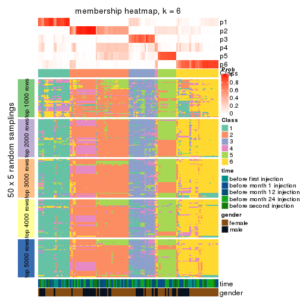</p>

</div>
</div>

As soon as we have had the classes for columns, we can look for signatures
which are significantly different between classes which can be candidate marks
for certain classes. Following are the heatmaps for signatures.


Signature heatmaps where rows are scaled:


<script>
$( function() {
	$( '#tabs-CV-kmeans-get-signatures' ).tabs();
} );
</script>
<div id='tabs-CV-kmeans-get-signatures'>
<ul>
<li><a href='#tab-CV-kmeans-get-signatures-1'>k = 2</a></li>
<li><a href='#tab-CV-kmeans-get-signatures-2'>k = 3</a></li>
<li><a href='#tab-CV-kmeans-get-signatures-3'>k = 4</a></li>
<li><a href='#tab-CV-kmeans-get-signatures-4'>k = 5</a></li>
<li><a href='#tab-CV-kmeans-get-signatures-5'>k = 6</a></li>
</ul>
<div id='tab-CV-kmeans-get-signatures-1'>
<pre><code class="r">get_signatures(res, k = 2)
</code></pre>

<p></p>

</div>
<div id='tab-CV-kmeans-get-signatures-2'>
<pre><code class="r">get_signatures(res, k = 3)
</code></pre>

<p></p>

</div>
<div id='tab-CV-kmeans-get-signatures-3'>
<pre><code class="r">get_signatures(res, k = 4)
</code></pre>

<p></p>

</div>
<div id='tab-CV-kmeans-get-signatures-4'>
<pre><code class="r">get_signatures(res, k = 5)
</code></pre>

<p></p>

</div>
<div id='tab-CV-kmeans-get-signatures-5'>
<pre><code class="r">get_signatures(res, k = 6)
</code></pre>

<p></p>

</div>
</div>


Signature heatmaps where rows are not scaled:


<script>
$( function() {
	$( '#tabs-CV-kmeans-get-signatures-no-scale' ).tabs();
} );
</script>
<div id='tabs-CV-kmeans-get-signatures-no-scale'>
<ul>
<li><a href='#tab-CV-kmeans-get-signatures-no-scale-1'>k = 2</a></li>
<li><a href='#tab-CV-kmeans-get-signatures-no-scale-2'>k = 3</a></li>
<li><a href='#tab-CV-kmeans-get-signatures-no-scale-3'>k = 4</a></li>
<li><a href='#tab-CV-kmeans-get-signatures-no-scale-4'>k = 5</a></li>
<li><a href='#tab-CV-kmeans-get-signatures-no-scale-5'>k = 6</a></li>
</ul>
<div id='tab-CV-kmeans-get-signatures-no-scale-1'>
<pre><code class="r">get_signatures(res, k = 2, scale_rows = FALSE)
</code></pre>

<p></p>

</div>
<div id='tab-CV-kmeans-get-signatures-no-scale-2'>
<pre><code class="r">get_signatures(res, k = 3, scale_rows = FALSE)
</code></pre>

<p></p>

</div>
<div id='tab-CV-kmeans-get-signatures-no-scale-3'>
<pre><code class="r">get_signatures(res, k = 4, scale_rows = FALSE)
</code></pre>

<p></p>

</div>
<div id='tab-CV-kmeans-get-signatures-no-scale-4'>
<pre><code class="r">get_signatures(res, k = 5, scale_rows = FALSE)
</code></pre>

<p></p>

</div>
<div id='tab-CV-kmeans-get-signatures-no-scale-5'>
<pre><code class="r">get_signatures(res, k = 6, scale_rows = FALSE)
</code></pre>

<p>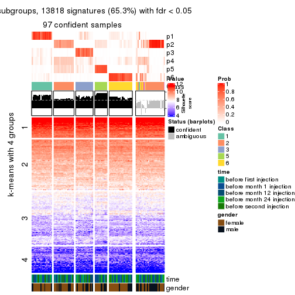</p>

</div>
</div>


Compare the overlap of signatures from different k:

```r
compare_signatures(res)
```


`get_signature()` returns a data frame invisibly. TO get the list of signatures, the function
call should be assigned to a variable explicitly. In following code, if `plot` argument is set
to `FALSE`, no heatmap is plotted while only the differential analysis is performed.

```r
# code only for demonstration
tb = get_signature(res, k = ..., plot = FALSE)
```

An example of the output of `tb` is:

```
#>   which_row         fdr    mean_1    mean_2 scaled_mean_1 scaled_mean_2 km
#> 1        38 0.042760348  8.373488  9.131774    -0.5533452     0.5164555  1
#> 2        40 0.018707592  7.106213  8.469186    -0.6173731     0.5762149  1
#> 3        55 0.019134737 10.221463 11.207825    -0.6159697     0.5749050  1
#> 4        59 0.006059896  5.921854  7.869574    -0.6899429     0.6439467  1
#> 5        60 0.018055526  8.928898 10.211722    -0.6204761     0.5791110  1
#> 6        98 0.009384629 15.714769 14.887706     0.6635654    -0.6193277  2
...
```

The columns in `tb` are:

1. `which_row`: row indices corresponding to the input matrix.
2. `fdr`: FDR for the differential test. 
3. `mean_x`: The mean value in group x.
4. `scaled_mean_x`: The mean value in group x after rows are scaled.
5. `km`: Row groups if k-means clustering is applied to rows.


UMAP plot which shows how samples are separated.


<script>
$( function() {
	$( '#tabs-CV-kmeans-dimension-reduction' ).tabs();
} );
</script>
<div id='tabs-CV-kmeans-dimension-reduction'>
<ul>
<li><a href='#tab-CV-kmeans-dimension-reduction-1'>k = 2</a></li>
<li><a href='#tab-CV-kmeans-dimension-reduction-2'>k = 3</a></li>
<li><a href='#tab-CV-kmeans-dimension-reduction-3'>k = 4</a></li>
<li><a href='#tab-CV-kmeans-dimension-reduction-4'>k = 5</a></li>
<li><a href='#tab-CV-kmeans-dimension-reduction-5'>k = 6</a></li>
</ul>
<div id='tab-CV-kmeans-dimension-reduction-1'>
<pre><code class="r">dimension_reduction(res, k = 2, method = &quot;UMAP&quot;)
</code></pre>

<p></p>

</div>
<div id='tab-CV-kmeans-dimension-reduction-2'>
<pre><code class="r">dimension_reduction(res, k = 3, method = &quot;UMAP&quot;)
</code></pre>

<p></p>

</div>
<div id='tab-CV-kmeans-dimension-reduction-3'>
<pre><code class="r">dimension_reduction(res, k = 4, method = &quot;UMAP&quot;)
</code></pre>

<p></p>

</div>
<div id='tab-CV-kmeans-dimension-reduction-4'>
<pre><code class="r">dimension_reduction(res, k = 5, method = &quot;UMAP&quot;)
</code></pre>

<p></p>

</div>
<div id='tab-CV-kmeans-dimension-reduction-5'>
<pre><code class="r">dimension_reduction(res, k = 6, method = &quot;UMAP&quot;)
</code></pre>

<p></p>

</div>
</div>


Following heatmap shows how subgroups are split when increasing `k`:

```r
collect_classes(res)
```


Test correlation between subgroups and known annotations. If the known
annotation is numeric, one-way ANOVA test is applied, and if the known
annotation is discrete, chi-squared contingency table test is applied.

```r
test_to_known_factors(res)
```

```
#>             n time(p) gender(p) k
#> CV:kmeans 120   0.576     0.241 2
#> CV:kmeans  96   0.381     0.280 3
#> CV:kmeans  78   0.187     0.783 4
#> CV:kmeans 116   0.257     0.422 5
#> CV:kmeans  97   0.441     0.770 6
```


If matrix rows can be associated to genes, consider to use `GO_Enrichment(res,
...)` to perform function enrichment for the signature genes.


 

---------------------------------------------------


### CV:skmeans


The object with results only for a single top-value method and a single partition method 
can be extracted as:

```r
res = res_list["CV", "skmeans"]
# you can also extract it by
# res = res_list["CV:skmeans"]
```

A summary of `res` and all the functions that can be applied to it:

```r
res
```

```
#> A 'ConsensusPartition' object with k = 2, 3, 4, 5, 6.
#>   On a matrix with 21168 rows and 125 columns.
#>   Top rows (1000, 2000, 3000, 4000, 5000) are extracted by 'CV' method.
#>   Subgroups are detected by 'skmeans' method.
#>   Performed in total 1250 partitions by row resampling.
#>   Best k for subgroups seems to be 2.
#> 
#> Following methods can be applied to this 'ConsensusPartition' object:
#>  [1] "cola_report"             "collect_classes"         "collect_plots"          
#>  [4] "collect_stats"           "colnames"                "compare_signatures"     
#>  [7] "consensus_heatmap"       "dimension_reduction"     "functional_enrichment"  
#> [10] "get_anno_col"            "get_anno"                "get_classes"            
#> [13] "get_consensus"           "get_matrix"              "get_membership"         
#> [16] "get_param"               "get_signatures"          "get_stats"              
#> [19] "is_best_k"               "is_stable_k"             "membership_heatmap"     
#> [22] "ncol"                    "nrow"                    "plot_ecdf"              
#> [25] "rownames"                "select_partition_number" "show"                   
#> [28] "suggest_best_k"          "test_to_known_factors"
```

`collect_plots()` function collects all the plots made from `res` for all `k` (number of partitions)
into one single page to provide an easy and fast comparison between different `k`.

```r
collect_plots(res)
```


The plots are:

- The first row: a plot of the ECDF (Empirical cumulative distribution
  function) curves of the consensus matrix for each `k` and the heatmap of
  predicted classes for each `k`.
- The second row: heatmaps of the consensus matrix for each `k`.
- The third row: heatmaps of the membership matrix for each `k`.
- The fouth row: heatmaps of the signatures for each `k`.

All the plots in panels can be made by individual functions and they are
plotted later in this section.

`select_partition_number()` produces several plots showing different
statistics for choosing "optimized" `k`. There are following statistics:

- ECDF curves of the consensus matrix for each `k`;
- 1-PAC. [The PAC
  score](https://en.wikipedia.org/wiki/Consensus_clustering#Over-interpretation_potential_of_consensus_clustering)
  measures the proportion of the ambiguous subgrouping.
- Mean silhouette score.
- Concordance. The mean probability of fiting the consensus class ids in all
  partitions.
- Area increased. Denote $A_k$ as the area under the ECDF curve for current
  `k`, the area increased is defined as $A_k - A_{k-1}$.
- Rand index. The percent of pairs of samples that are both in a same cluster
  or both are not in a same cluster in the partition of k and k-1.
- Jaccard index. The ratio of pairs of samples are both in a same cluster in
  the partition of k and k-1 and the pairs of samples are both in a same
  cluster in the partition k or k-1.

The detailed explanations of these statistics can be found in [the cola
vignette](http://bioconductor.org/packages/devel/bioc/vignettes/cola/inst/doc/cola.html#toc_13).

Generally speaking, lower PAC score, higher mean silhouette score or higher
concordance corresponds to better partition. Rand index and Jaccard index
measure how similar the current partition is compared to partition with `k-1`.
If they are too similar, we won't accept `k` is better than `k-1`.

```r
select_partition_number(res)
```


The numeric values for all these statistics can be obtained by `get_stats()`.

```r
get_stats(res)
```

```
#>   k 1-PAC mean_silhouette concordance area_increased  Rand Jaccard
#> 2 2 0.867           0.929       0.969         0.5040 0.496   0.496
#> 3 3 0.632           0.782       0.877         0.3096 0.773   0.572
#> 4 4 0.467           0.554       0.714         0.1261 0.857   0.611
#> 5 5 0.476           0.430       0.640         0.0667 0.950   0.816
#> 6 6 0.499           0.298       0.568         0.0406 0.910   0.652
```

`suggest_best_k()` suggests the best $k$ based on these statistics. The rules are as follows:

- All $k$ with Jaccard index larger than 0.95 are removed because the increase of
  the partition number does not provides enough extra information. If all $k$ are removed,
  the best $k$ is assigned by `NA`.
- For $k$ with 1-PAC larger than 0.9, the maximal $k$ is taken as the "best k". Other $k$ is called "optional k".
- If it does not fit the second rule. The $k$ with the highest vote of highest
  1-PAC, mean silhouette and concordance is taken as the "best k".

```r
suggest_best_k(res)
```

```
#> [1] 2
```


Following shows the table of the partitions (You need to click the **show/hide
code output** link to see it). The membership matrix (columns with name `p*`)
is inferred by
[`clue::cl_consensus()`](https://www.rdocumentation.org/link/cl_consensus?package=clue)
function with the `SE` method. Basically the value in the membership matrix
represents the probability to belong to a certain group. The finall class
label for an item is determined with the group with highest probability it
belongs to.

In `get_classes()` function, the entropy is calculated from the membership
matrix and the silhouette score is calculated from the consensus matrix.


<script>
$( function() {
	$( '#tabs-CV-skmeans-get-classes' ).tabs();
} );
</script>
<div id='tabs-CV-skmeans-get-classes'>
<ul>
<li><a href='#tab-CV-skmeans-get-classes-1'>k = 2</a></li>
<li><a href='#tab-CV-skmeans-get-classes-2'>k = 3</a></li>
<li><a href='#tab-CV-skmeans-get-classes-3'>k = 4</a></li>
<li><a href='#tab-CV-skmeans-get-classes-4'>k = 5</a></li>
<li><a href='#tab-CV-skmeans-get-classes-5'>k = 6</a></li>
</ul>

<div id='tab-CV-skmeans-get-classes-1'>
<p><a id='tab-CV-skmeans-get-classes-1-a' style='color:#0366d6' href='#'>show/hide code output</a></p>
<pre><code class="r">cbind(get_classes(res, k = 2), get_membership(res, k = 2))
</code></pre>

<pre><code>#&gt;           class entropy silhouette    p1    p2
#&gt; GSM601752     2  0.0000      0.958 0.000 1.000
#&gt; GSM601782     1  0.0000      0.977 1.000 0.000
#&gt; GSM601792     1  0.0000      0.977 1.000 0.000
#&gt; GSM601797     2  0.9427      0.471 0.360 0.640
#&gt; GSM601827     1  0.0000      0.977 1.000 0.000
#&gt; GSM601837     2  0.0000      0.958 0.000 1.000
#&gt; GSM601842     2  0.0000      0.958 0.000 1.000
#&gt; GSM601857     1  0.0000      0.977 1.000 0.000
#&gt; GSM601867     1  0.9732      0.301 0.596 0.404
#&gt; GSM601747     1  0.2043      0.953 0.968 0.032
#&gt; GSM601757     1  0.0000      0.977 1.000 0.000
#&gt; GSM601762     2  0.0000      0.958 0.000 1.000
#&gt; GSM601767     2  0.0000      0.958 0.000 1.000
#&gt; GSM601772     2  0.0000      0.958 0.000 1.000
#&gt; GSM601777     1  0.8207      0.659 0.744 0.256
#&gt; GSM601787     2  0.4939      0.861 0.108 0.892
#&gt; GSM601802     2  0.0000      0.958 0.000 1.000
#&gt; GSM601807     1  0.4690      0.887 0.900 0.100
#&gt; GSM601812     1  0.0000      0.977 1.000 0.000
#&gt; GSM601817     1  0.0000      0.977 1.000 0.000
#&gt; GSM601822     2  0.9248      0.519 0.340 0.660
#&gt; GSM601832     2  0.0000      0.958 0.000 1.000
#&gt; GSM601847     2  0.0376      0.955 0.004 0.996
#&gt; GSM601852     1  0.0000      0.977 1.000 0.000
#&gt; GSM601862     1  0.0000      0.977 1.000 0.000
#&gt; GSM601753     2  0.0000      0.958 0.000 1.000
#&gt; GSM601783     1  0.0000      0.977 1.000 0.000
#&gt; GSM601793     1  0.0000      0.977 1.000 0.000
#&gt; GSM601798     2  0.0000      0.958 0.000 1.000
#&gt; GSM601828     1  0.0000      0.977 1.000 0.000
#&gt; GSM601838     2  0.0000      0.958 0.000 1.000
#&gt; GSM601843     2  0.0000      0.958 0.000 1.000
#&gt; GSM601858     2  0.0000      0.958 0.000 1.000
#&gt; GSM601868     1  0.0000      0.977 1.000 0.000
#&gt; GSM601748     1  0.0000      0.977 1.000 0.000
#&gt; GSM601758     1  0.0000      0.977 1.000 0.000
#&gt; GSM601763     2  0.9993      0.116 0.484 0.516
#&gt; GSM601768     2  0.0000      0.958 0.000 1.000
#&gt; GSM601773     2  0.0000      0.958 0.000 1.000
#&gt; GSM601778     1  0.1843      0.956 0.972 0.028
#&gt; GSM601788     2  0.1633      0.940 0.024 0.976
#&gt; GSM601803     2  0.0000      0.958 0.000 1.000
#&gt; GSM601808     1  0.0000      0.977 1.000 0.000
#&gt; GSM601813     1  0.0000      0.977 1.000 0.000
#&gt; GSM601818     1  0.0000      0.977 1.000 0.000
#&gt; GSM601823     1  0.0000      0.977 1.000 0.000
#&gt; GSM601833     2  0.0000      0.958 0.000 1.000
#&gt; GSM601848     1  0.0000      0.977 1.000 0.000
#&gt; GSM601853     1  0.0000      0.977 1.000 0.000
#&gt; GSM601863     1  0.0000      0.977 1.000 0.000
#&gt; GSM601754     2  0.0000      0.958 0.000 1.000
#&gt; GSM601784     2  0.0000      0.958 0.000 1.000
#&gt; GSM601794     1  0.0376      0.974 0.996 0.004
#&gt; GSM601799     2  0.0000      0.958 0.000 1.000
#&gt; GSM601829     1  0.0000      0.977 1.000 0.000
#&gt; GSM601839     2  0.0000      0.958 0.000 1.000
#&gt; GSM601844     1  0.0376      0.974 0.996 0.004
#&gt; GSM601859     2  0.0000      0.958 0.000 1.000
#&gt; GSM601869     1  0.0000      0.977 1.000 0.000
#&gt; GSM601749     1  0.0000      0.977 1.000 0.000
#&gt; GSM601759     1  0.0000      0.977 1.000 0.000
#&gt; GSM601764     1  0.0000      0.977 1.000 0.000
#&gt; GSM601769     2  0.0000      0.958 0.000 1.000
#&gt; GSM601774     2  0.0000      0.958 0.000 1.000
#&gt; GSM601779     1  0.0000      0.977 1.000 0.000
#&gt; GSM601789     2  0.0000      0.958 0.000 1.000
#&gt; GSM601804     2  0.0000      0.958 0.000 1.000
#&gt; GSM601809     1  0.4298      0.899 0.912 0.088
#&gt; GSM601814     2  0.0000      0.958 0.000 1.000
#&gt; GSM601819     1  0.0000      0.977 1.000 0.000
#&gt; GSM601824     2  0.0000      0.958 0.000 1.000
#&gt; GSM601834     2  0.0000      0.958 0.000 1.000
#&gt; GSM601849     1  0.0000      0.977 1.000 0.000
#&gt; GSM601854     1  0.0000      0.977 1.000 0.000
#&gt; GSM601864     2  0.0000      0.958 0.000 1.000
#&gt; GSM601755     2  0.0000      0.958 0.000 1.000
#&gt; GSM601785     2  0.0000      0.958 0.000 1.000
#&gt; GSM601795     1  0.4939      0.878 0.892 0.108
#&gt; GSM601800     2  0.0000      0.958 0.000 1.000
#&gt; GSM601830     1  0.0000      0.977 1.000 0.000
#&gt; GSM601840     2  0.0376      0.955 0.004 0.996
#&gt; GSM601845     2  0.7674      0.722 0.224 0.776
#&gt; GSM601860     2  0.0000      0.958 0.000 1.000
#&gt; GSM601870     1  0.0000      0.977 1.000 0.000
#&gt; GSM601750     1  0.0000      0.977 1.000 0.000
#&gt; GSM601760     1  0.0000      0.977 1.000 0.000
#&gt; GSM601765     2  0.0000      0.958 0.000 1.000
#&gt; GSM601770     2  0.0000      0.958 0.000 1.000
#&gt; GSM601775     2  0.5519      0.846 0.128 0.872
#&gt; GSM601780     1  0.0000      0.977 1.000 0.000
#&gt; GSM601790     2  0.0000      0.958 0.000 1.000
#&gt; GSM601805     2  0.0000      0.958 0.000 1.000
#&gt; GSM601810     1  0.0000      0.977 1.000 0.000
#&gt; GSM601815     2  0.0000      0.958 0.000 1.000
#&gt; GSM601820     1  0.0000      0.977 1.000 0.000
#&gt; GSM601825     2  0.0000      0.958 0.000 1.000
#&gt; GSM601835     2  0.0000      0.958 0.000 1.000
#&gt; GSM601850     1  0.6048      0.830 0.852 0.148
#&gt; GSM601855     1  0.0000      0.977 1.000 0.000
#&gt; GSM601865     2  0.0000      0.958 0.000 1.000
#&gt; GSM601756     2  0.0000      0.958 0.000 1.000
#&gt; GSM601786     2  0.0000      0.958 0.000 1.000
#&gt; GSM601796     1  0.0000      0.977 1.000 0.000
#&gt; GSM601801     2  0.0000      0.958 0.000 1.000
#&gt; GSM601831     1  0.0000      0.977 1.000 0.000
#&gt; GSM601841     1  0.0000      0.977 1.000 0.000
#&gt; GSM601846     2  0.6247      0.813 0.156 0.844
#&gt; GSM601861     2  0.0000      0.958 0.000 1.000
#&gt; GSM601871     2  0.9044      0.534 0.320 0.680
#&gt; GSM601751     2  0.4022      0.894 0.080 0.920
#&gt; GSM601761     1  0.0000      0.977 1.000 0.000
#&gt; GSM601766     2  0.8608      0.620 0.284 0.716
#&gt; GSM601771     2  0.0000      0.958 0.000 1.000
#&gt; GSM601776     1  0.0000      0.977 1.000 0.000
#&gt; GSM601781     1  0.5842      0.839 0.860 0.140
#&gt; GSM601791     1  0.2043      0.953 0.968 0.032
#&gt; GSM601806     2  0.0000      0.958 0.000 1.000
#&gt; GSM601811     1  0.0672      0.971 0.992 0.008
#&gt; GSM601816     1  0.0376      0.974 0.996 0.004
#&gt; GSM601821     2  0.0000      0.958 0.000 1.000
#&gt; GSM601826     1  0.0000      0.977 1.000 0.000
#&gt; GSM601836     1  0.1633      0.960 0.976 0.024
#&gt; GSM601851     1  0.0000      0.977 1.000 0.000
#&gt; GSM601856     1  0.0000      0.977 1.000 0.000
#&gt; GSM601866     1  0.0000      0.977 1.000 0.000
</code></pre>

<script>
$('#tab-CV-skmeans-get-classes-1-a').parent().next().next().hide();
$('#tab-CV-skmeans-get-classes-1-a').click(function(){
  $('#tab-CV-skmeans-get-classes-1-a').parent().next().next().toggle();
  return(false);
});
</script>
</div>

<div id='tab-CV-skmeans-get-classes-2'>
<p><a id='tab-CV-skmeans-get-classes-2-a' style='color:#0366d6' href='#'>show/hide code output</a></p>
<pre><code class="r">cbind(get_classes(res, k = 3), get_membership(res, k = 3))
</code></pre>

<pre><code>#&gt;           class entropy silhouette    p1    p2    p3
#&gt; GSM601752     2  0.4521      0.822 0.180 0.816 0.004
#&gt; GSM601782     3  0.3619      0.813 0.136 0.000 0.864
#&gt; GSM601792     1  0.2537      0.803 0.920 0.000 0.080
#&gt; GSM601797     1  0.9738      0.355 0.444 0.304 0.252
#&gt; GSM601827     3  0.3038      0.821 0.104 0.000 0.896
#&gt; GSM601837     2  0.1015      0.925 0.008 0.980 0.012
#&gt; GSM601842     2  0.0661      0.928 0.004 0.988 0.008
#&gt; GSM601857     3  0.1289      0.850 0.032 0.000 0.968
#&gt; GSM601867     3  0.2866      0.794 0.008 0.076 0.916
#&gt; GSM601747     3  0.8067      0.515 0.284 0.100 0.616
#&gt; GSM601757     3  0.4654      0.768 0.208 0.000 0.792
#&gt; GSM601762     2  0.0237      0.927 0.000 0.996 0.004
#&gt; GSM601767     2  0.0237      0.927 0.004 0.996 0.000
#&gt; GSM601772     2  0.0000      0.926 0.000 1.000 0.000
#&gt; GSM601777     1  0.8951      0.280 0.476 0.128 0.396
#&gt; GSM601787     3  0.5156      0.629 0.008 0.216 0.776
#&gt; GSM601802     2  0.3192      0.891 0.112 0.888 0.000
#&gt; GSM601807     3  0.2173      0.817 0.008 0.048 0.944
#&gt; GSM601812     3  0.2356      0.846 0.072 0.000 0.928
#&gt; GSM601817     3  0.1643      0.850 0.044 0.000 0.956
#&gt; GSM601822     1  0.2297      0.792 0.944 0.036 0.020
#&gt; GSM601832     2  0.2945      0.895 0.088 0.908 0.004
#&gt; GSM601847     1  0.4968      0.688 0.800 0.188 0.012
#&gt; GSM601852     3  0.4399      0.783 0.188 0.000 0.812
#&gt; GSM601862     3  0.0424      0.846 0.008 0.000 0.992
#&gt; GSM601753     2  0.3038      0.896 0.104 0.896 0.000
#&gt; GSM601783     3  0.6045      0.491 0.380 0.000 0.620
#&gt; GSM601793     1  0.4399      0.732 0.812 0.000 0.188
#&gt; GSM601798     2  0.2400      0.914 0.064 0.932 0.004
#&gt; GSM601828     3  0.2448      0.845 0.076 0.000 0.924
#&gt; GSM601838     2  0.0661      0.926 0.008 0.988 0.004
#&gt; GSM601843     2  0.0424      0.927 0.000 0.992 0.008
#&gt; GSM601858     2  0.3587      0.869 0.020 0.892 0.088
#&gt; GSM601868     3  0.0000      0.844 0.000 0.000 1.000
#&gt; GSM601748     3  0.3267      0.831 0.116 0.000 0.884
#&gt; GSM601758     3  0.6140      0.447 0.404 0.000 0.596
#&gt; GSM601763     1  0.2031      0.807 0.952 0.016 0.032
#&gt; GSM601768     2  0.2711      0.902 0.088 0.912 0.000
#&gt; GSM601773     2  0.0424      0.927 0.008 0.992 0.000
#&gt; GSM601778     1  0.4840      0.754 0.816 0.016 0.168
#&gt; GSM601788     2  0.5939      0.771 0.072 0.788 0.140
#&gt; GSM601803     2  0.2878      0.900 0.096 0.904 0.000
#&gt; GSM601808     3  0.0237      0.845 0.004 0.000 0.996
#&gt; GSM601813     3  0.5497      0.660 0.292 0.000 0.708
#&gt; GSM601818     3  0.1289      0.850 0.032 0.000 0.968
#&gt; GSM601823     1  0.0747      0.801 0.984 0.000 0.016
#&gt; GSM601833     2  0.0592      0.928 0.012 0.988 0.000
#&gt; GSM601848     1  0.0747      0.801 0.984 0.000 0.016
#&gt; GSM601853     3  0.0237      0.845 0.004 0.000 0.996
#&gt; GSM601863     3  0.1860      0.850 0.052 0.000 0.948
#&gt; GSM601754     2  0.4110      0.852 0.152 0.844 0.004
#&gt; GSM601784     2  0.0237      0.927 0.000 0.996 0.004
#&gt; GSM601794     1  0.4110      0.773 0.844 0.004 0.152
#&gt; GSM601799     2  0.4887      0.760 0.228 0.772 0.000
#&gt; GSM601829     1  0.6302      0.134 0.520 0.000 0.480
#&gt; GSM601839     2  0.1170      0.923 0.008 0.976 0.016
#&gt; GSM601844     1  0.4589      0.742 0.820 0.008 0.172
#&gt; GSM601859     2  0.0747      0.927 0.016 0.984 0.000
#&gt; GSM601869     3  0.0892      0.849 0.020 0.000 0.980
#&gt; GSM601749     3  0.6079      0.482 0.388 0.000 0.612
#&gt; GSM601759     3  0.5254      0.705 0.264 0.000 0.736
#&gt; GSM601764     1  0.2772      0.795 0.916 0.004 0.080
#&gt; GSM601769     2  0.0237      0.926 0.004 0.996 0.000
#&gt; GSM601774     2  0.0424      0.927 0.008 0.992 0.000
#&gt; GSM601779     1  0.0892      0.803 0.980 0.000 0.020
#&gt; GSM601789     2  0.1315      0.922 0.008 0.972 0.020
#&gt; GSM601804     1  0.5650      0.484 0.688 0.312 0.000
#&gt; GSM601809     3  0.3589      0.820 0.052 0.048 0.900
#&gt; GSM601814     2  0.0424      0.927 0.008 0.992 0.000
#&gt; GSM601819     3  0.6280      0.262 0.460 0.000 0.540
#&gt; GSM601824     1  0.1529      0.789 0.960 0.040 0.000
#&gt; GSM601834     2  0.0000      0.926 0.000 1.000 0.000
#&gt; GSM601849     1  0.2537      0.797 0.920 0.000 0.080
#&gt; GSM601854     3  0.4121      0.801 0.168 0.000 0.832
#&gt; GSM601864     2  0.0848      0.925 0.008 0.984 0.008
#&gt; GSM601755     2  0.2537      0.907 0.080 0.920 0.000
#&gt; GSM601785     2  0.1753      0.922 0.048 0.952 0.000
#&gt; GSM601795     1  0.3045      0.800 0.916 0.020 0.064
#&gt; GSM601800     2  0.3116      0.892 0.108 0.892 0.000
#&gt; GSM601830     3  0.0747      0.839 0.000 0.016 0.984
#&gt; GSM601840     2  0.6000      0.750 0.200 0.760 0.040
#&gt; GSM601845     2  0.9693     -0.234 0.380 0.404 0.216
#&gt; GSM601860     2  0.0983      0.927 0.016 0.980 0.004
#&gt; GSM601870     3  0.0848      0.839 0.008 0.008 0.984
#&gt; GSM601750     3  0.3482      0.825 0.128 0.000 0.872
#&gt; GSM601760     1  0.6307     -0.132 0.512 0.000 0.488
#&gt; GSM601765     2  0.2537      0.903 0.080 0.920 0.000
#&gt; GSM601770     2  0.0892      0.927 0.020 0.980 0.000
#&gt; GSM601775     2  0.7607      0.383 0.364 0.584 0.052
#&gt; GSM601780     1  0.1529      0.806 0.960 0.000 0.040
#&gt; GSM601790     2  0.0424      0.926 0.008 0.992 0.000
#&gt; GSM601805     2  0.2066      0.918 0.060 0.940 0.000
#&gt; GSM601810     3  0.1031      0.849 0.024 0.000 0.976
#&gt; GSM601815     2  0.0661      0.926 0.008 0.988 0.004
#&gt; GSM601820     3  0.4002      0.807 0.160 0.000 0.840
#&gt; GSM601825     2  0.2356      0.915 0.072 0.928 0.000
#&gt; GSM601835     2  0.1129      0.924 0.004 0.976 0.020
#&gt; GSM601850     1  0.4075      0.793 0.880 0.048 0.072
#&gt; GSM601855     3  0.0000      0.844 0.000 0.000 1.000
#&gt; GSM601865     2  0.1170      0.923 0.008 0.976 0.016
#&gt; GSM601756     2  0.2496      0.913 0.068 0.928 0.004
#&gt; GSM601786     2  0.1950      0.913 0.008 0.952 0.040
#&gt; GSM601796     1  0.4931      0.695 0.768 0.000 0.232
#&gt; GSM601801     2  0.1753      0.920 0.048 0.952 0.000
#&gt; GSM601831     3  0.1163      0.850 0.028 0.000 0.972
#&gt; GSM601841     3  0.5650      0.578 0.312 0.000 0.688
#&gt; GSM601846     1  0.9601      0.372 0.456 0.328 0.216
#&gt; GSM601861     2  0.0424      0.926 0.008 0.992 0.000
#&gt; GSM601871     3  0.5461      0.587 0.008 0.244 0.748
#&gt; GSM601751     2  0.5243      0.829 0.100 0.828 0.072
#&gt; GSM601761     1  0.2448      0.797 0.924 0.000 0.076
#&gt; GSM601766     1  0.9501      0.378 0.472 0.324 0.204
#&gt; GSM601771     2  0.1860      0.925 0.052 0.948 0.000
#&gt; GSM601776     1  0.1964      0.805 0.944 0.000 0.056
#&gt; GSM601781     1  0.5519      0.769 0.812 0.068 0.120
#&gt; GSM601791     1  0.2261      0.802 0.932 0.000 0.068
#&gt; GSM601806     2  0.1753      0.922 0.048 0.952 0.000
#&gt; GSM601811     3  0.0829      0.843 0.004 0.012 0.984
#&gt; GSM601816     1  0.3030      0.805 0.904 0.004 0.092
#&gt; GSM601821     2  0.0424      0.926 0.008 0.992 0.000
#&gt; GSM601826     1  0.1163      0.804 0.972 0.000 0.028
#&gt; GSM601836     1  0.6255      0.689 0.748 0.048 0.204
#&gt; GSM601851     1  0.2165      0.801 0.936 0.000 0.064
#&gt; GSM601856     3  0.0424      0.846 0.008 0.000 0.992
#&gt; GSM601866     3  0.2959      0.838 0.100 0.000 0.900
</code></pre>

<script>
$('#tab-CV-skmeans-get-classes-2-a').parent().next().next().hide();
$('#tab-CV-skmeans-get-classes-2-a').click(function(){
  $('#tab-CV-skmeans-get-classes-2-a').parent().next().next().toggle();
  return(false);
});
</script>
</div>

<div id='tab-CV-skmeans-get-classes-3'>
<p><a id='tab-CV-skmeans-get-classes-3-a' style='color:#0366d6' href='#'>show/hide code output</a></p>
<pre><code class="r">cbind(get_classes(res, k = 4), get_membership(res, k = 4))
</code></pre>

<pre><code>#&gt;           class entropy silhouette    p1    p2    p3    p4
#&gt; GSM601752     4  0.3972     0.6867 0.016 0.164 0.004 0.816
#&gt; GSM601782     3  0.5745     0.5862 0.296 0.004 0.656 0.044
#&gt; GSM601792     1  0.5118     0.6456 0.752 0.000 0.072 0.176
#&gt; GSM601797     4  0.7067     0.4833 0.148 0.072 0.108 0.672
#&gt; GSM601827     3  0.5393     0.5911 0.268 0.000 0.688 0.044
#&gt; GSM601837     2  0.2483     0.7332 0.000 0.916 0.032 0.052
#&gt; GSM601842     2  0.5188     0.6980 0.012 0.704 0.016 0.268
#&gt; GSM601857     3  0.2773     0.7121 0.072 0.000 0.900 0.028
#&gt; GSM601867     3  0.5901     0.4987 0.004 0.220 0.692 0.084
#&gt; GSM601747     3  0.8944     0.1576 0.340 0.116 0.420 0.124
#&gt; GSM601757     3  0.5565     0.5306 0.344 0.000 0.624 0.032
#&gt; GSM601762     2  0.4406     0.7454 0.024 0.788 0.004 0.184
#&gt; GSM601767     2  0.4502     0.7042 0.016 0.748 0.000 0.236
#&gt; GSM601772     2  0.3672     0.7493 0.012 0.824 0.000 0.164
#&gt; GSM601777     3  0.9742    -0.1154 0.264 0.144 0.312 0.280
#&gt; GSM601787     3  0.6041     0.4007 0.000 0.332 0.608 0.060
#&gt; GSM601802     4  0.4507     0.6755 0.020 0.224 0.000 0.756
#&gt; GSM601807     3  0.4285     0.6265 0.008 0.092 0.832 0.068
#&gt; GSM601812     3  0.4715     0.6525 0.240 0.004 0.740 0.016
#&gt; GSM601817     3  0.4267     0.6822 0.188 0.000 0.788 0.024
#&gt; GSM601822     1  0.6315     0.3213 0.596 0.032 0.024 0.348
#&gt; GSM601832     2  0.6240     0.6272 0.080 0.640 0.004 0.276
#&gt; GSM601847     4  0.7031     0.2999 0.360 0.092 0.012 0.536
#&gt; GSM601852     3  0.5414     0.4961 0.376 0.000 0.604 0.020
#&gt; GSM601862     3  0.2485     0.7101 0.064 0.004 0.916 0.016
#&gt; GSM601753     4  0.3870     0.6767 0.004 0.208 0.000 0.788
#&gt; GSM601783     1  0.5905     0.0335 0.564 0.000 0.396 0.040
#&gt; GSM601793     1  0.6119     0.5999 0.680 0.000 0.152 0.168
#&gt; GSM601798     4  0.4594     0.6597 0.008 0.280 0.000 0.712
#&gt; GSM601828     3  0.5062     0.6164 0.284 0.000 0.692 0.024
#&gt; GSM601838     2  0.1888     0.7389 0.000 0.940 0.016 0.044
#&gt; GSM601843     2  0.4248     0.7354 0.012 0.768 0.000 0.220
#&gt; GSM601858     2  0.4967     0.6440 0.004 0.784 0.108 0.104
#&gt; GSM601868     3  0.2115     0.7012 0.024 0.004 0.936 0.036
#&gt; GSM601748     3  0.5013     0.6045 0.292 0.000 0.688 0.020
#&gt; GSM601758     1  0.5526    -0.0214 0.564 0.000 0.416 0.020
#&gt; GSM601763     1  0.5610     0.5235 0.712 0.068 0.004 0.216
#&gt; GSM601768     2  0.5623     0.6605 0.048 0.660 0.000 0.292
#&gt; GSM601773     2  0.4098     0.7233 0.012 0.784 0.000 0.204
#&gt; GSM601778     1  0.8394     0.2975 0.464 0.048 0.164 0.324
#&gt; GSM601788     2  0.8015     0.3202 0.096 0.588 0.120 0.196
#&gt; GSM601803     4  0.5026     0.6226 0.016 0.312 0.000 0.672
#&gt; GSM601808     3  0.0895     0.7021 0.020 0.000 0.976 0.004
#&gt; GSM601813     3  0.5760     0.3305 0.448 0.000 0.524 0.028
#&gt; GSM601818     3  0.3232     0.7077 0.108 0.004 0.872 0.016
#&gt; GSM601823     1  0.1042     0.6781 0.972 0.000 0.008 0.020
#&gt; GSM601833     2  0.4485     0.7281 0.028 0.772 0.000 0.200
#&gt; GSM601848     1  0.2287     0.6827 0.924 0.004 0.012 0.060
#&gt; GSM601853     3  0.1796     0.7056 0.032 0.004 0.948 0.016
#&gt; GSM601863     3  0.3099     0.7110 0.104 0.000 0.876 0.020
#&gt; GSM601754     4  0.4139     0.6845 0.040 0.144 0.000 0.816
#&gt; GSM601784     2  0.3668     0.7516 0.004 0.808 0.000 0.188
#&gt; GSM601794     1  0.7670     0.4160 0.496 0.008 0.188 0.308
#&gt; GSM601799     4  0.4452     0.6770 0.048 0.156 0.000 0.796
#&gt; GSM601829     1  0.6568     0.1031 0.512 0.000 0.408 0.080
#&gt; GSM601839     2  0.2399     0.7286 0.000 0.920 0.032 0.048
#&gt; GSM601844     1  0.5800     0.6014 0.708 0.000 0.164 0.128
#&gt; GSM601859     2  0.4594     0.6504 0.008 0.712 0.000 0.280
#&gt; GSM601869     3  0.2730     0.7091 0.088 0.000 0.896 0.016
#&gt; GSM601749     1  0.5620    -0.0219 0.560 0.000 0.416 0.024
#&gt; GSM601759     3  0.5564     0.3691 0.436 0.000 0.544 0.020
#&gt; GSM601764     1  0.4008     0.6563 0.852 0.024 0.032 0.092
#&gt; GSM601769     2  0.3161     0.7602 0.012 0.864 0.000 0.124
#&gt; GSM601774     2  0.3450     0.7565 0.008 0.836 0.000 0.156
#&gt; GSM601779     1  0.1762     0.6812 0.944 0.004 0.004 0.048
#&gt; GSM601789     2  0.2484     0.7373 0.012 0.924 0.024 0.040
#&gt; GSM601804     4  0.6323     0.5601 0.248 0.112 0.000 0.640
#&gt; GSM601809     3  0.7294     0.5248 0.100 0.136 0.660 0.104
#&gt; GSM601814     2  0.2831     0.7470 0.000 0.876 0.004 0.120
#&gt; GSM601819     1  0.5793     0.1156 0.580 0.000 0.384 0.036
#&gt; GSM601824     1  0.5613     0.2727 0.592 0.028 0.000 0.380
#&gt; GSM601834     2  0.3836     0.7430 0.016 0.816 0.000 0.168
#&gt; GSM601849     1  0.2101     0.6695 0.928 0.000 0.060 0.012
#&gt; GSM601854     3  0.5213     0.5592 0.328 0.000 0.652 0.020
#&gt; GSM601864     2  0.3182     0.7174 0.000 0.876 0.028 0.096
#&gt; GSM601755     4  0.4123     0.6779 0.008 0.220 0.000 0.772
#&gt; GSM601785     2  0.6123     0.4720 0.056 0.572 0.000 0.372
#&gt; GSM601795     4  0.6293    -0.1260 0.448 0.008 0.040 0.504
#&gt; GSM601800     4  0.3933     0.6857 0.008 0.200 0.000 0.792
#&gt; GSM601830     3  0.2797     0.6860 0.016 0.028 0.912 0.044
#&gt; GSM601840     4  0.8116     0.2251 0.112 0.348 0.056 0.484
#&gt; GSM601845     2  0.9701    -0.0511 0.216 0.356 0.160 0.268
#&gt; GSM601860     2  0.4535     0.7103 0.016 0.744 0.000 0.240
#&gt; GSM601870     3  0.3341     0.6540 0.004 0.068 0.880 0.048
#&gt; GSM601750     3  0.5271     0.5534 0.340 0.000 0.640 0.020
#&gt; GSM601760     1  0.5311     0.2665 0.648 0.000 0.328 0.024
#&gt; GSM601765     2  0.5590     0.6679 0.064 0.692 0.000 0.244
#&gt; GSM601770     2  0.4644     0.7235 0.024 0.748 0.000 0.228
#&gt; GSM601775     4  0.8657     0.2983 0.256 0.248 0.048 0.448
#&gt; GSM601780     1  0.1452     0.6811 0.956 0.000 0.008 0.036
#&gt; GSM601790     2  0.1406     0.7413 0.000 0.960 0.016 0.024
#&gt; GSM601805     4  0.5349     0.5971 0.012 0.336 0.008 0.644
#&gt; GSM601810     3  0.2998     0.7099 0.080 0.004 0.892 0.024
#&gt; GSM601815     2  0.2522     0.7375 0.000 0.908 0.016 0.076
#&gt; GSM601820     3  0.5414     0.4885 0.376 0.000 0.604 0.020
#&gt; GSM601825     4  0.6080     0.0613 0.044 0.468 0.000 0.488
#&gt; GSM601835     2  0.5360     0.7014 0.016 0.744 0.044 0.196
#&gt; GSM601850     1  0.6889     0.5379 0.644 0.040 0.080 0.236
#&gt; GSM601855     3  0.2231     0.6867 0.012 0.012 0.932 0.044
#&gt; GSM601865     2  0.2313     0.7259 0.000 0.924 0.032 0.044
#&gt; GSM601756     4  0.4283     0.6677 0.004 0.256 0.000 0.740
#&gt; GSM601786     2  0.3533     0.7102 0.000 0.864 0.056 0.080
#&gt; GSM601796     1  0.6941     0.5339 0.588 0.000 0.192 0.220
#&gt; GSM601801     4  0.4655     0.6300 0.004 0.312 0.000 0.684
#&gt; GSM601831     3  0.4237     0.6909 0.152 0.000 0.808 0.040
#&gt; GSM601841     3  0.7097     0.1731 0.372 0.004 0.508 0.116
#&gt; GSM601846     4  0.9491     0.2466 0.212 0.212 0.160 0.416
#&gt; GSM601861     2  0.2053     0.7442 0.000 0.924 0.004 0.072
#&gt; GSM601871     3  0.6222     0.4042 0.000 0.304 0.616 0.080
#&gt; GSM601751     2  0.7774     0.2687 0.072 0.536 0.072 0.320
#&gt; GSM601761     1  0.2282     0.6611 0.924 0.000 0.052 0.024
#&gt; GSM601766     1  0.8966    -0.1185 0.356 0.352 0.060 0.232
#&gt; GSM601771     2  0.5560     0.5333 0.028 0.644 0.004 0.324
#&gt; GSM601776     1  0.1520     0.6782 0.956 0.000 0.020 0.024
#&gt; GSM601781     1  0.7655     0.4882 0.608 0.072 0.108 0.212
#&gt; GSM601791     1  0.2870     0.6808 0.908 0.012 0.044 0.036
#&gt; GSM601806     4  0.5004     0.5112 0.000 0.392 0.004 0.604
#&gt; GSM601811     3  0.2936     0.6967 0.032 0.024 0.908 0.036
#&gt; GSM601816     1  0.3424     0.6811 0.876 0.004 0.052 0.068
#&gt; GSM601821     2  0.2741     0.7435 0.000 0.892 0.012 0.096
#&gt; GSM601826     1  0.1584     0.6808 0.952 0.000 0.012 0.036
#&gt; GSM601836     1  0.9015     0.3893 0.468 0.104 0.200 0.228
#&gt; GSM601851     1  0.2032     0.6742 0.936 0.000 0.036 0.028
#&gt; GSM601856     3  0.1833     0.7017 0.024 0.000 0.944 0.032
#&gt; GSM601866     3  0.4661     0.6387 0.256 0.000 0.728 0.016
</code></pre>

<script>
$('#tab-CV-skmeans-get-classes-3-a').parent().next().next().hide();
$('#tab-CV-skmeans-get-classes-3-a').click(function(){
  $('#tab-CV-skmeans-get-classes-3-a').parent().next().next().toggle();
  return(false);
});
</script>
</div>

<div id='tab-CV-skmeans-get-classes-4'>
<p><a id='tab-CV-skmeans-get-classes-4-a' style='color:#0366d6' href='#'>show/hide code output</a></p>
<pre><code class="r">cbind(get_classes(res, k = 5), get_membership(res, k = 5))
</code></pre>

<pre><code>#&gt;           class entropy silhouette    p1    p2    p3    p4    p5
#&gt; GSM601752     4   0.252    0.65321 0.008 0.044 0.004 0.908 0.036
#&gt; GSM601782     3   0.628    0.51394 0.236 0.008 0.588 0.004 0.164
#&gt; GSM601792     1   0.684    0.41128 0.600 0.004 0.068 0.188 0.140
#&gt; GSM601797     4   0.694    0.29699 0.092 0.032 0.072 0.628 0.176
#&gt; GSM601827     3   0.615    0.55642 0.188 0.004 0.612 0.008 0.188
#&gt; GSM601837     2   0.234    0.55724 0.000 0.916 0.016 0.036 0.032
#&gt; GSM601842     2   0.717    0.38034 0.004 0.468 0.024 0.208 0.296
#&gt; GSM601857     3   0.418    0.65222 0.064 0.008 0.812 0.012 0.104
#&gt; GSM601867     3   0.730    0.01115 0.008 0.304 0.444 0.020 0.224
#&gt; GSM601747     3   0.896   -0.00597 0.196 0.124 0.372 0.048 0.260
#&gt; GSM601757     3   0.658    0.49962 0.252 0.004 0.552 0.012 0.180
#&gt; GSM601762     2   0.602    0.54940 0.000 0.600 0.004 0.188 0.208
#&gt; GSM601767     2   0.651    0.50938 0.004 0.512 0.000 0.212 0.272
#&gt; GSM601772     2   0.585    0.54680 0.000 0.592 0.000 0.144 0.264
#&gt; GSM601777     5   0.983    0.30064 0.240 0.152 0.168 0.168 0.272
#&gt; GSM601787     2   0.709   -0.09253 0.004 0.500 0.292 0.032 0.172
#&gt; GSM601802     4   0.309    0.66798 0.000 0.088 0.000 0.860 0.052
#&gt; GSM601807     3   0.646    0.33335 0.004 0.152 0.588 0.020 0.236
#&gt; GSM601812     3   0.554    0.60663 0.188 0.004 0.680 0.008 0.120
#&gt; GSM601817     3   0.483    0.64003 0.116 0.004 0.736 0.000 0.144
#&gt; GSM601822     1   0.701    0.25856 0.596 0.036 0.028 0.188 0.152
#&gt; GSM601832     2   0.760    0.26397 0.032 0.384 0.008 0.236 0.340
#&gt; GSM601847     4   0.734   -0.03738 0.392 0.060 0.012 0.436 0.100
#&gt; GSM601852     3   0.568    0.55035 0.228 0.000 0.636 0.004 0.132
#&gt; GSM601862     3   0.327    0.63562 0.036 0.004 0.848 0.000 0.112
#&gt; GSM601753     4   0.309    0.65595 0.016 0.052 0.000 0.876 0.056
#&gt; GSM601783     3   0.668    0.25019 0.388 0.000 0.456 0.020 0.136
#&gt; GSM601793     1   0.746    0.43501 0.548 0.004 0.152 0.128 0.168
#&gt; GSM601798     4   0.421    0.63816 0.008 0.172 0.004 0.780 0.036
#&gt; GSM601828     3   0.502    0.62077 0.204 0.004 0.704 0.000 0.088
#&gt; GSM601838     2   0.172    0.57588 0.000 0.936 0.000 0.044 0.020
#&gt; GSM601843     2   0.575    0.52698 0.004 0.640 0.004 0.124 0.228
#&gt; GSM601858     2   0.567    0.44246 0.012 0.720 0.056 0.068 0.144
#&gt; GSM601868     3   0.407    0.61264 0.020 0.028 0.804 0.004 0.144
#&gt; GSM601748     3   0.553    0.58271 0.224 0.000 0.652 0.004 0.120
#&gt; GSM601758     1   0.610   -0.17015 0.452 0.000 0.424 0.000 0.124
#&gt; GSM601763     1   0.764   -0.01943 0.472 0.036 0.032 0.148 0.312
#&gt; GSM601768     2   0.712    0.39846 0.016 0.412 0.000 0.260 0.312
#&gt; GSM601773     2   0.610    0.55076 0.000 0.568 0.000 0.232 0.200
#&gt; GSM601778     1   0.887    0.02833 0.420 0.052 0.140 0.172 0.216
#&gt; GSM601788     2   0.719    0.36744 0.048 0.596 0.036 0.180 0.140
#&gt; GSM601803     4   0.385    0.65073 0.004 0.164 0.000 0.796 0.036
#&gt; GSM601808     3   0.312    0.61791 0.012 0.016 0.856 0.000 0.116
#&gt; GSM601813     3   0.602    0.40830 0.348 0.000 0.536 0.004 0.112
#&gt; GSM601818     3   0.425    0.65562 0.084 0.004 0.784 0.000 0.128
#&gt; GSM601823     1   0.205    0.55498 0.920 0.000 0.000 0.028 0.052
#&gt; GSM601833     2   0.643    0.47975 0.004 0.520 0.000 0.188 0.288
#&gt; GSM601848     1   0.290    0.56278 0.884 0.000 0.020 0.024 0.072
#&gt; GSM601853     3   0.298    0.63722 0.032 0.004 0.868 0.000 0.096
#&gt; GSM601863     3   0.378    0.66113 0.064 0.016 0.832 0.000 0.088
#&gt; GSM601754     4   0.361    0.66185 0.028 0.076 0.000 0.848 0.048
#&gt; GSM601784     2   0.516    0.59976 0.000 0.692 0.000 0.160 0.148
#&gt; GSM601794     1   0.851    0.21118 0.416 0.016 0.156 0.228 0.184
#&gt; GSM601799     4   0.419    0.62664 0.044 0.064 0.000 0.816 0.076
#&gt; GSM601829     1   0.772   -0.00191 0.372 0.004 0.356 0.052 0.216
#&gt; GSM601839     2   0.189    0.56304 0.000 0.936 0.012 0.024 0.028
#&gt; GSM601844     1   0.740    0.38989 0.516 0.008 0.212 0.052 0.212
#&gt; GSM601859     2   0.663    0.44813 0.008 0.492 0.000 0.308 0.192
#&gt; GSM601869     3   0.509    0.64375 0.108 0.008 0.728 0.004 0.152
#&gt; GSM601749     3   0.610    0.23191 0.424 0.000 0.452 0.000 0.124
#&gt; GSM601759     3   0.589    0.44183 0.316 0.000 0.560 0.000 0.124
#&gt; GSM601764     1   0.575    0.43882 0.652 0.008 0.100 0.008 0.232
#&gt; GSM601769     2   0.500    0.59597 0.000 0.708 0.000 0.128 0.164
#&gt; GSM601774     2   0.594    0.56919 0.004 0.608 0.000 0.164 0.224
#&gt; GSM601779     1   0.292    0.55678 0.884 0.000 0.016 0.036 0.064
#&gt; GSM601789     2   0.347    0.57502 0.000 0.844 0.008 0.048 0.100
#&gt; GSM601804     4   0.567    0.43817 0.200 0.036 0.000 0.680 0.084
#&gt; GSM601809     3   0.870    0.10505 0.120 0.208 0.424 0.040 0.208
#&gt; GSM601814     2   0.437    0.59105 0.000 0.748 0.000 0.192 0.060
#&gt; GSM601819     1   0.644   -0.17471 0.440 0.000 0.416 0.008 0.136
#&gt; GSM601824     1   0.586    0.15337 0.592 0.000 0.000 0.260 0.148
#&gt; GSM601834     2   0.594    0.55792 0.000 0.592 0.000 0.180 0.228
#&gt; GSM601849     1   0.439    0.55988 0.788 0.000 0.112 0.016 0.084
#&gt; GSM601854     3   0.549    0.56338 0.252 0.000 0.644 0.004 0.100
#&gt; GSM601864     2   0.305    0.55459 0.000 0.864 0.000 0.076 0.060
#&gt; GSM601755     4   0.257    0.67466 0.004 0.092 0.000 0.888 0.016
#&gt; GSM601785     2   0.733    0.22659 0.028 0.408 0.000 0.276 0.288
#&gt; GSM601795     4   0.730   -0.07037 0.328 0.008 0.032 0.460 0.172
#&gt; GSM601800     4   0.255    0.67104 0.000 0.072 0.000 0.892 0.036
#&gt; GSM601830     3   0.502    0.55996 0.020 0.052 0.736 0.008 0.184
#&gt; GSM601840     4   0.893   -0.13263 0.064 0.308 0.096 0.356 0.176
#&gt; GSM601845     5   0.931    0.49613 0.168 0.244 0.084 0.144 0.360
#&gt; GSM601860     2   0.632    0.46377 0.016 0.584 0.000 0.236 0.164
#&gt; GSM601870     3   0.557    0.41373 0.004 0.144 0.656 0.000 0.196
#&gt; GSM601750     3   0.574    0.56033 0.244 0.000 0.624 0.004 0.128
#&gt; GSM601760     1   0.621   -0.09503 0.484 0.004 0.388 0.000 0.124
#&gt; GSM601765     2   0.758    0.29530 0.076 0.432 0.000 0.164 0.328
#&gt; GSM601770     2   0.673    0.50044 0.012 0.504 0.000 0.220 0.264
#&gt; GSM601775     4   0.889   -0.21159 0.148 0.116 0.060 0.376 0.300
#&gt; GSM601780     1   0.307    0.56603 0.884 0.004 0.036 0.024 0.052
#&gt; GSM601790     2   0.147    0.57894 0.000 0.948 0.000 0.016 0.036
#&gt; GSM601805     4   0.384    0.65696 0.000 0.164 0.000 0.792 0.044
#&gt; GSM601810     3   0.471    0.63337 0.076 0.008 0.744 0.000 0.172
#&gt; GSM601815     2   0.302    0.58548 0.000 0.864 0.000 0.088 0.048
#&gt; GSM601820     3   0.556    0.52316 0.268 0.000 0.620 0.000 0.112
#&gt; GSM601825     4   0.634    0.15880 0.024 0.356 0.000 0.524 0.096
#&gt; GSM601835     2   0.689    0.33886 0.008 0.528 0.036 0.116 0.312
#&gt; GSM601850     1   0.723    0.29290 0.548 0.016 0.040 0.176 0.220
#&gt; GSM601855     3   0.386    0.55908 0.000 0.028 0.772 0.000 0.200
#&gt; GSM601865     2   0.236    0.55117 0.000 0.912 0.012 0.024 0.052
#&gt; GSM601756     4   0.272    0.67386 0.000 0.124 0.000 0.864 0.012
#&gt; GSM601786     2   0.334    0.54519 0.000 0.856 0.012 0.044 0.088
#&gt; GSM601796     1   0.813    0.30767 0.452 0.004 0.196 0.188 0.160
#&gt; GSM601801     4   0.337    0.63848 0.000 0.212 0.000 0.784 0.004
#&gt; GSM601831     3   0.468    0.64620 0.128 0.000 0.756 0.008 0.108
#&gt; GSM601841     3   0.795    0.21161 0.308 0.012 0.436 0.084 0.160
#&gt; GSM601846     5   0.966    0.44396 0.148 0.200 0.116 0.232 0.304
#&gt; GSM601861     2   0.285    0.60190 0.000 0.868 0.000 0.104 0.028
#&gt; GSM601871     2   0.727   -0.18091 0.000 0.420 0.336 0.032 0.212
#&gt; GSM601751     2   0.819    0.13422 0.056 0.376 0.028 0.340 0.200
#&gt; GSM601761     1   0.368    0.55113 0.832 0.000 0.096 0.008 0.064
#&gt; GSM601766     5   0.854    0.38287 0.232 0.164 0.040 0.116 0.448
#&gt; GSM601771     2   0.722    0.36035 0.040 0.488 0.004 0.300 0.168
#&gt; GSM601776     1   0.362    0.57360 0.848 0.000 0.044 0.032 0.076
#&gt; GSM601781     1   0.822    0.21818 0.516 0.056 0.104 0.136 0.188
#&gt; GSM601791     1   0.479    0.55984 0.780 0.008 0.088 0.028 0.096
#&gt; GSM601806     4   0.416    0.57258 0.000 0.264 0.000 0.716 0.020
#&gt; GSM601811     3   0.520    0.58537 0.040 0.024 0.724 0.016 0.196
#&gt; GSM601816     1   0.470    0.53276 0.788 0.004 0.044 0.076 0.088
#&gt; GSM601821     2   0.340    0.59839 0.000 0.828 0.000 0.136 0.036
#&gt; GSM601826     1   0.215    0.56033 0.924 0.000 0.012 0.032 0.032
#&gt; GSM601836     1   0.860   -0.19978 0.372 0.052 0.140 0.092 0.344
#&gt; GSM601851     1   0.345    0.57007 0.852 0.000 0.068 0.012 0.068
#&gt; GSM601856     3   0.364    0.60204 0.024 0.004 0.816 0.004 0.152
#&gt; GSM601866     3   0.494    0.60900 0.172 0.000 0.712 0.000 0.116
</code></pre>

<script>
$('#tab-CV-skmeans-get-classes-4-a').parent().next().next().hide();
$('#tab-CV-skmeans-get-classes-4-a').click(function(){
  $('#tab-CV-skmeans-get-classes-4-a').parent().next().next().toggle();
  return(false);
});
</script>
</div>

<div id='tab-CV-skmeans-get-classes-5'>
<p><a id='tab-CV-skmeans-get-classes-5-a' style='color:#0366d6' href='#'>show/hide code output</a></p>
<pre><code class="r">cbind(get_classes(res, k = 6), get_membership(res, k = 6))
</code></pre>

<pre><code>#&gt;           class entropy silhouette    p1    p2    p3    p4    p5    p6
#&gt; GSM601752     4   0.123    0.70093 0.000 0.024 0.000 0.956 0.004 0.016
#&gt; GSM601782     1   0.716    0.13112 0.396 0.076 0.372 0.008 0.008 0.140
#&gt; GSM601792     6   0.653    0.50873 0.164 0.080 0.040 0.108 0.000 0.608
#&gt; GSM601797     4   0.722    0.45461 0.100 0.112 0.084 0.596 0.028 0.080
#&gt; GSM601827     3   0.680    0.01356 0.300 0.052 0.480 0.008 0.004 0.156
#&gt; GSM601837     5   0.262    0.51207 0.016 0.044 0.024 0.020 0.896 0.000
#&gt; GSM601842     5   0.735   -0.19693 0.072 0.376 0.012 0.152 0.376 0.012
#&gt; GSM601857     3   0.487    0.31309 0.276 0.032 0.660 0.000 0.016 0.016
#&gt; GSM601867     3   0.770    0.21893 0.148 0.084 0.452 0.032 0.268 0.016
#&gt; GSM601747     1   0.935    0.09312 0.308 0.192 0.188 0.060 0.092 0.160
#&gt; GSM601757     3   0.731   -0.23467 0.364 0.088 0.384 0.008 0.008 0.148
#&gt; GSM601762     5   0.597    0.24280 0.020 0.236 0.004 0.176 0.564 0.000
#&gt; GSM601767     2   0.651    0.13053 0.016 0.392 0.000 0.244 0.344 0.004
#&gt; GSM601772     5   0.625    0.05094 0.036 0.352 0.000 0.124 0.484 0.004
#&gt; GSM601777     3   0.978   -0.09284 0.164 0.140 0.264 0.152 0.108 0.172
#&gt; GSM601787     5   0.687    0.06089 0.092 0.072 0.380 0.008 0.436 0.012
#&gt; GSM601802     4   0.251    0.70267 0.000 0.060 0.000 0.892 0.024 0.024
#&gt; GSM601807     3   0.605    0.33250 0.136 0.064 0.660 0.020 0.112 0.008
#&gt; GSM601812     3   0.676   -0.17260 0.356 0.064 0.440 0.008 0.000 0.132
#&gt; GSM601817     3   0.557    0.06193 0.352 0.036 0.552 0.004 0.000 0.056
#&gt; GSM601822     6   0.713    0.44957 0.048 0.140 0.024 0.188 0.040 0.560
#&gt; GSM601832     2   0.779    0.33415 0.056 0.424 0.008 0.196 0.260 0.056
#&gt; GSM601847     4   0.658    0.04636 0.028 0.108 0.000 0.432 0.032 0.400
#&gt; GSM601852     1   0.634    0.26173 0.404 0.020 0.400 0.004 0.000 0.172
#&gt; GSM601862     3   0.357    0.36147 0.188 0.016 0.780 0.000 0.000 0.016
#&gt; GSM601753     4   0.320    0.67833 0.008 0.092 0.000 0.852 0.024 0.024
#&gt; GSM601783     1   0.684    0.49833 0.468 0.052 0.204 0.008 0.000 0.268
#&gt; GSM601793     6   0.729    0.36548 0.244 0.080 0.080 0.088 0.000 0.508
#&gt; GSM601798     4   0.344    0.68435 0.012 0.044 0.008 0.840 0.092 0.004
#&gt; GSM601828     3   0.637   -0.16031 0.360 0.052 0.460 0.000 0.000 0.128
#&gt; GSM601838     5   0.130    0.52392 0.004 0.012 0.000 0.032 0.952 0.000
#&gt; GSM601843     5   0.609    0.13618 0.048 0.304 0.000 0.100 0.544 0.004
#&gt; GSM601858     5   0.581    0.38284 0.060 0.120 0.104 0.028 0.684 0.004
#&gt; GSM601868     3   0.432    0.37292 0.200 0.016 0.744 0.008 0.024 0.008
#&gt; GSM601748     3   0.563   -0.19696 0.404 0.008 0.472 0.000 0.000 0.116
#&gt; GSM601758     1   0.611    0.49216 0.420 0.004 0.240 0.000 0.000 0.336
#&gt; GSM601763     6   0.763    0.09110 0.124 0.372 0.016 0.076 0.032 0.380
#&gt; GSM601768     2   0.713    0.25089 0.028 0.448 0.000 0.160 0.308 0.056
#&gt; GSM601773     5   0.610    0.17728 0.016 0.240 0.000 0.236 0.508 0.000
#&gt; GSM601778     6   0.896    0.33716 0.116 0.124 0.152 0.188 0.040 0.380
#&gt; GSM601788     5   0.807    0.18706 0.120 0.128 0.080 0.136 0.504 0.032
#&gt; GSM601803     4   0.350    0.68895 0.004 0.052 0.000 0.832 0.092 0.020
#&gt; GSM601808     3   0.274    0.38333 0.128 0.012 0.852 0.000 0.000 0.008
#&gt; GSM601813     3   0.682   -0.43624 0.340 0.032 0.348 0.004 0.000 0.276
#&gt; GSM601818     3   0.573    0.06622 0.348 0.048 0.548 0.008 0.000 0.048
#&gt; GSM601823     6   0.300    0.56488 0.060 0.048 0.020 0.004 0.000 0.868
#&gt; GSM601833     5   0.638   -0.08538 0.028 0.396 0.000 0.116 0.444 0.016
#&gt; GSM601848     6   0.332    0.57232 0.076 0.052 0.008 0.016 0.000 0.848
#&gt; GSM601853     3   0.334    0.36633 0.156 0.020 0.812 0.000 0.004 0.008
#&gt; GSM601863     3   0.492    0.31345 0.184 0.016 0.716 0.004 0.016 0.064
#&gt; GSM601754     4   0.343    0.69843 0.020 0.080 0.000 0.844 0.044 0.012
#&gt; GSM601784     5   0.529    0.38276 0.012 0.188 0.000 0.144 0.652 0.004
#&gt; GSM601794     6   0.888    0.25480 0.204 0.156 0.124 0.188 0.008 0.320
#&gt; GSM601799     4   0.394    0.63384 0.008 0.152 0.000 0.784 0.012 0.044
#&gt; GSM601829     3   0.786   -0.15337 0.276 0.100 0.304 0.020 0.004 0.296
#&gt; GSM601839     5   0.141    0.51816 0.008 0.024 0.008 0.008 0.952 0.000
#&gt; GSM601844     6   0.798    0.12558 0.264 0.164 0.148 0.032 0.004 0.388
#&gt; GSM601859     5   0.675    0.00361 0.036 0.228 0.000 0.320 0.412 0.004
#&gt; GSM601869     3   0.589    0.24678 0.284 0.032 0.600 0.012 0.016 0.056
#&gt; GSM601749     1   0.639    0.50254 0.408 0.016 0.256 0.000 0.000 0.320
#&gt; GSM601759     1   0.639    0.37689 0.412 0.028 0.376 0.000 0.000 0.184
#&gt; GSM601764     6   0.623    0.46209 0.140 0.220 0.052 0.000 0.008 0.580
#&gt; GSM601769     5   0.543    0.38400 0.028 0.200 0.000 0.116 0.652 0.004
#&gt; GSM601774     5   0.609    0.27874 0.020 0.268 0.004 0.140 0.560 0.008
#&gt; GSM601779     6   0.241    0.56475 0.056 0.028 0.004 0.012 0.000 0.900
#&gt; GSM601789     5   0.442    0.49223 0.040 0.120 0.024 0.024 0.784 0.008
#&gt; GSM601804     4   0.591    0.48216 0.040 0.108 0.000 0.612 0.012 0.228
#&gt; GSM601809     3   0.897    0.09713 0.196 0.116 0.348 0.036 0.208 0.096
#&gt; GSM601814     5   0.499    0.42683 0.012 0.104 0.000 0.200 0.680 0.004
#&gt; GSM601819     1   0.697    0.47215 0.428 0.060 0.240 0.004 0.000 0.268
#&gt; GSM601824     6   0.626    0.32126 0.028 0.232 0.000 0.232 0.000 0.508
#&gt; GSM601834     5   0.631    0.16578 0.032 0.284 0.000 0.152 0.524 0.008
#&gt; GSM601849     6   0.501    0.53003 0.140 0.060 0.060 0.012 0.000 0.728
#&gt; GSM601854     3   0.640   -0.11652 0.340 0.040 0.476 0.004 0.000 0.140
#&gt; GSM601864     5   0.355    0.51031 0.024 0.044 0.024 0.064 0.844 0.000
#&gt; GSM601755     4   0.195    0.70614 0.016 0.028 0.000 0.924 0.032 0.000
#&gt; GSM601785     2   0.762    0.20555 0.032 0.360 0.012 0.216 0.336 0.044
#&gt; GSM601795     4   0.795   -0.08617 0.168 0.132 0.032 0.380 0.004 0.284
#&gt; GSM601800     4   0.261    0.70752 0.012 0.048 0.000 0.892 0.040 0.008
#&gt; GSM601830     3   0.605    0.34178 0.172 0.096 0.648 0.012 0.060 0.012
#&gt; GSM601840     4   0.949   -0.18012 0.144 0.188 0.080 0.288 0.208 0.092
#&gt; GSM601845     2   0.905    0.29665 0.164 0.372 0.088 0.068 0.204 0.104
#&gt; GSM601860     5   0.802    0.09875 0.084 0.228 0.024 0.184 0.440 0.040
#&gt; GSM601870     3   0.488    0.35440 0.080 0.052 0.732 0.004 0.132 0.000
#&gt; GSM601750     3   0.608   -0.26044 0.388 0.020 0.444 0.000 0.000 0.148
#&gt; GSM601760     1   0.662    0.46096 0.388 0.028 0.212 0.004 0.000 0.368
#&gt; GSM601765     2   0.654    0.19348 0.032 0.464 0.000 0.084 0.380 0.040
#&gt; GSM601770     2   0.671    0.11293 0.032 0.424 0.000 0.148 0.376 0.020
#&gt; GSM601775     2   0.867    0.20213 0.116 0.364 0.036 0.272 0.068 0.144
#&gt; GSM601780     6   0.306    0.56162 0.064 0.052 0.024 0.000 0.000 0.860
#&gt; GSM601790     5   0.172    0.52045 0.008 0.056 0.000 0.008 0.928 0.000
#&gt; GSM601805     4   0.402    0.67911 0.012 0.096 0.000 0.792 0.092 0.008
#&gt; GSM601810     3   0.575    0.27281 0.176 0.064 0.652 0.000 0.008 0.100
#&gt; GSM601815     5   0.280    0.52590 0.000 0.048 0.004 0.084 0.864 0.000
#&gt; GSM601820     1   0.623    0.33028 0.416 0.020 0.388 0.000 0.000 0.176
#&gt; GSM601825     4   0.657    0.11127 0.016 0.132 0.000 0.520 0.284 0.048
#&gt; GSM601835     5   0.726   -0.04724 0.060 0.328 0.036 0.116 0.452 0.008
#&gt; GSM601850     6   0.823    0.40210 0.188 0.112 0.084 0.160 0.012 0.444
#&gt; GSM601855     3   0.356    0.39026 0.120 0.040 0.816 0.000 0.024 0.000
#&gt; GSM601865     5   0.294    0.50388 0.040 0.036 0.028 0.016 0.880 0.000
#&gt; GSM601756     4   0.194    0.70522 0.008 0.020 0.000 0.920 0.052 0.000
#&gt; GSM601786     5   0.382    0.51270 0.028 0.072 0.028 0.036 0.832 0.004
#&gt; GSM601796     6   0.854    0.14931 0.256 0.088 0.144 0.168 0.004 0.340
#&gt; GSM601801     4   0.301    0.67973 0.012 0.024 0.000 0.844 0.120 0.000
#&gt; GSM601831     3   0.588    0.12834 0.304 0.032 0.572 0.008 0.004 0.080
#&gt; GSM601841     1   0.819    0.10621 0.336 0.060 0.312 0.072 0.012 0.208
#&gt; GSM601846     2   0.971    0.11271 0.132 0.288 0.132 0.164 0.164 0.120
#&gt; GSM601861     5   0.321    0.52263 0.012 0.068 0.000 0.076 0.844 0.000
#&gt; GSM601871     3   0.689    0.08384 0.080 0.088 0.440 0.024 0.368 0.000
#&gt; GSM601751     5   0.905   -0.11004 0.104 0.216 0.048 0.228 0.320 0.084
#&gt; GSM601761     6   0.455    0.42138 0.192 0.036 0.048 0.000 0.000 0.724
#&gt; GSM601766     2   0.829    0.25835 0.124 0.472 0.056 0.060 0.096 0.192
#&gt; GSM601771     5   0.811    0.06884 0.084 0.188 0.028 0.232 0.428 0.040
#&gt; GSM601776     6   0.440    0.47789 0.180 0.044 0.036 0.000 0.000 0.740
#&gt; GSM601781     6   0.838    0.43290 0.120 0.188 0.080 0.088 0.056 0.468
#&gt; GSM601791     6   0.550    0.47480 0.188 0.072 0.040 0.008 0.012 0.680
#&gt; GSM601806     4   0.384    0.61974 0.012 0.032 0.000 0.776 0.176 0.004
#&gt; GSM601811     3   0.612    0.28055 0.252 0.124 0.576 0.000 0.012 0.036
#&gt; GSM601816     6   0.568    0.56095 0.096 0.076 0.032 0.060 0.020 0.716
#&gt; GSM601821     5   0.325    0.52082 0.004 0.068 0.004 0.084 0.840 0.000
#&gt; GSM601826     6   0.270    0.56900 0.056 0.044 0.004 0.012 0.000 0.884
#&gt; GSM601836     6   0.916    0.18511 0.196 0.248 0.144 0.100 0.032 0.280
#&gt; GSM601851     6   0.376    0.54578 0.116 0.044 0.020 0.008 0.000 0.812
#&gt; GSM601856     3   0.380    0.38485 0.116 0.052 0.808 0.008 0.000 0.016
#&gt; GSM601866     3   0.587   -0.05049 0.340 0.036 0.536 0.004 0.000 0.084
</code></pre>

<script>
$('#tab-CV-skmeans-get-classes-5-a').parent().next().next().hide();
$('#tab-CV-skmeans-get-classes-5-a').click(function(){
  $('#tab-CV-skmeans-get-classes-5-a').parent().next().next().toggle();
  return(false);
});
</script>
</div>
</div>

Heatmaps for the consensus matrix. It visualizes the probability of two
samples to be in a same group.


<script>
$( function() {
	$( '#tabs-CV-skmeans-consensus-heatmap' ).tabs();
} );
</script>
<div id='tabs-CV-skmeans-consensus-heatmap'>
<ul>
<li><a href='#tab-CV-skmeans-consensus-heatmap-1'>k = 2</a></li>
<li><a href='#tab-CV-skmeans-consensus-heatmap-2'>k = 3</a></li>
<li><a href='#tab-CV-skmeans-consensus-heatmap-3'>k = 4</a></li>
<li><a href='#tab-CV-skmeans-consensus-heatmap-4'>k = 5</a></li>
<li><a href='#tab-CV-skmeans-consensus-heatmap-5'>k = 6</a></li>
</ul>
<div id='tab-CV-skmeans-consensus-heatmap-1'>
<pre><code class="r">consensus_heatmap(res, k = 2)
</code></pre>

<p></p>

</div>
<div id='tab-CV-skmeans-consensus-heatmap-2'>
<pre><code class="r">consensus_heatmap(res, k = 3)
</code></pre>

<p></p>

</div>
<div id='tab-CV-skmeans-consensus-heatmap-3'>
<pre><code class="r">consensus_heatmap(res, k = 4)
</code></pre>

<p></p>

</div>
<div id='tab-CV-skmeans-consensus-heatmap-4'>
<pre><code class="r">consensus_heatmap(res, k = 5)
</code></pre>

<p></p>

</div>
<div id='tab-CV-skmeans-consensus-heatmap-5'>
<pre><code class="r">consensus_heatmap(res, k = 6)
</code></pre>

<p></p>

</div>
</div>

Heatmaps for the membership of samples in all partitions to see how consistent they are:


<script>
$( function() {
	$( '#tabs-CV-skmeans-membership-heatmap' ).tabs();
} );
</script>
<div id='tabs-CV-skmeans-membership-heatmap'>
<ul>
<li><a href='#tab-CV-skmeans-membership-heatmap-1'>k = 2</a></li>
<li><a href='#tab-CV-skmeans-membership-heatmap-2'>k = 3</a></li>
<li><a href='#tab-CV-skmeans-membership-heatmap-3'>k = 4</a></li>
<li><a href='#tab-CV-skmeans-membership-heatmap-4'>k = 5</a></li>
<li><a href='#tab-CV-skmeans-membership-heatmap-5'>k = 6</a></li>
</ul>
<div id='tab-CV-skmeans-membership-heatmap-1'>
<pre><code class="r">membership_heatmap(res, k = 2)
</code></pre>

<p></p>

</div>
<div id='tab-CV-skmeans-membership-heatmap-2'>
<pre><code class="r">membership_heatmap(res, k = 3)
</code></pre>

<p></p>

</div>
<div id='tab-CV-skmeans-membership-heatmap-3'>
<pre><code class="r">membership_heatmap(res, k = 4)
</code></pre>

<p></p>

</div>
<div id='tab-CV-skmeans-membership-heatmap-4'>
<pre><code class="r">membership_heatmap(res, k = 5)
</code></pre>

<p></p>

</div>
<div id='tab-CV-skmeans-membership-heatmap-5'>
<pre><code class="r">membership_heatmap(res, k = 6)
</code></pre>

<p></p>

</div>
</div>

As soon as we have had the classes for columns, we can look for signatures
which are significantly different between classes which can be candidate marks
for certain classes. Following are the heatmaps for signatures.


Signature heatmaps where rows are scaled:


<script>
$( function() {
	$( '#tabs-CV-skmeans-get-signatures' ).tabs();
} );
</script>
<div id='tabs-CV-skmeans-get-signatures'>
<ul>
<li><a href='#tab-CV-skmeans-get-signatures-1'>k = 2</a></li>
<li><a href='#tab-CV-skmeans-get-signatures-2'>k = 3</a></li>
<li><a href='#tab-CV-skmeans-get-signatures-3'>k = 4</a></li>
<li><a href='#tab-CV-skmeans-get-signatures-4'>k = 5</a></li>
<li><a href='#tab-CV-skmeans-get-signatures-5'>k = 6</a></li>
</ul>
<div id='tab-CV-skmeans-get-signatures-1'>
<pre><code class="r">get_signatures(res, k = 2)
</code></pre>

<p></p>

</div>
<div id='tab-CV-skmeans-get-signatures-2'>
<pre><code class="r">get_signatures(res, k = 3)
</code></pre>

<p></p>

</div>
<div id='tab-CV-skmeans-get-signatures-3'>
<pre><code class="r">get_signatures(res, k = 4)
</code></pre>

<p></p>

</div>
<div id='tab-CV-skmeans-get-signatures-4'>
<pre><code class="r">get_signatures(res, k = 5)
</code></pre>

<p>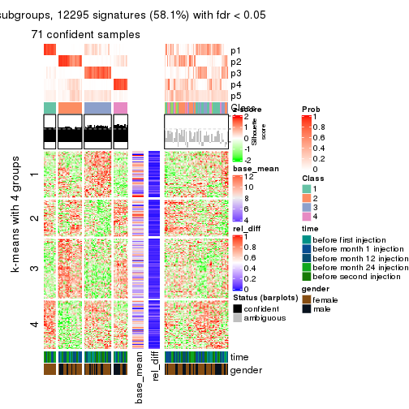</p>

</div>
<div id='tab-CV-skmeans-get-signatures-5'>
<pre><code class="r">get_signatures(res, k = 6)
</code></pre>

<p></p>

</div>
</div>


Signature heatmaps where rows are not scaled:


<script>
$( function() {
	$( '#tabs-CV-skmeans-get-signatures-no-scale' ).tabs();
} );
</script>
<div id='tabs-CV-skmeans-get-signatures-no-scale'>
<ul>
<li><a href='#tab-CV-skmeans-get-signatures-no-scale-1'>k = 2</a></li>
<li><a href='#tab-CV-skmeans-get-signatures-no-scale-2'>k = 3</a></li>
<li><a href='#tab-CV-skmeans-get-signatures-no-scale-3'>k = 4</a></li>
<li><a href='#tab-CV-skmeans-get-signatures-no-scale-4'>k = 5</a></li>
<li><a href='#tab-CV-skmeans-get-signatures-no-scale-5'>k = 6</a></li>
</ul>
<div id='tab-CV-skmeans-get-signatures-no-scale-1'>
<pre><code class="r">get_signatures(res, k = 2, scale_rows = FALSE)
</code></pre>

<p></p>

</div>
<div id='tab-CV-skmeans-get-signatures-no-scale-2'>
<pre><code class="r">get_signatures(res, k = 3, scale_rows = FALSE)
</code></pre>

<p></p>

</div>
<div id='tab-CV-skmeans-get-signatures-no-scale-3'>
<pre><code class="r">get_signatures(res, k = 4, scale_rows = FALSE)
</code></pre>

<p></p>

</div>
<div id='tab-CV-skmeans-get-signatures-no-scale-4'>
<pre><code class="r">get_signatures(res, k = 5, scale_rows = FALSE)
</code></pre>

<p></p>

</div>
<div id='tab-CV-skmeans-get-signatures-no-scale-5'>
<pre><code class="r">get_signatures(res, k = 6, scale_rows = FALSE)
</code></pre>

<p></p>

</div>
</div>


Compare the overlap of signatures from different k:

```r
compare_signatures(res)
```


`get_signature()` returns a data frame invisibly. TO get the list of signatures, the function
call should be assigned to a variable explicitly. In following code, if `plot` argument is set
to `FALSE`, no heatmap is plotted while only the differential analysis is performed.

```r
# code only for demonstration
tb = get_signature(res, k = ..., plot = FALSE)
```

An example of the output of `tb` is:

```
#>   which_row         fdr    mean_1    mean_2 scaled_mean_1 scaled_mean_2 km
#> 1        38 0.042760348  8.373488  9.131774    -0.5533452     0.5164555  1
#> 2        40 0.018707592  7.106213  8.469186    -0.6173731     0.5762149  1
#> 3        55 0.019134737 10.221463 11.207825    -0.6159697     0.5749050  1
#> 4        59 0.006059896  5.921854  7.869574    -0.6899429     0.6439467  1
#> 5        60 0.018055526  8.928898 10.211722    -0.6204761     0.5791110  1
#> 6        98 0.009384629 15.714769 14.887706     0.6635654    -0.6193277  2
...
```

The columns in `tb` are:

1. `which_row`: row indices corresponding to the input matrix.
2. `fdr`: FDR for the differential test. 
3. `mean_x`: The mean value in group x.
4. `scaled_mean_x`: The mean value in group x after rows are scaled.
5. `km`: Row groups if k-means clustering is applied to rows.


UMAP plot which shows how samples are separated.


<script>
$( function() {
	$( '#tabs-CV-skmeans-dimension-reduction' ).tabs();
} );
</script>
<div id='tabs-CV-skmeans-dimension-reduction'>
<ul>
<li><a href='#tab-CV-skmeans-dimension-reduction-1'>k = 2</a></li>
<li><a href='#tab-CV-skmeans-dimension-reduction-2'>k = 3</a></li>
<li><a href='#tab-CV-skmeans-dimension-reduction-3'>k = 4</a></li>
<li><a href='#tab-CV-skmeans-dimension-reduction-4'>k = 5</a></li>
<li><a href='#tab-CV-skmeans-dimension-reduction-5'>k = 6</a></li>
</ul>
<div id='tab-CV-skmeans-dimension-reduction-1'>
<pre><code class="r">dimension_reduction(res, k = 2, method = &quot;UMAP&quot;)
</code></pre>

<p></p>

</div>
<div id='tab-CV-skmeans-dimension-reduction-2'>
<pre><code class="r">dimension_reduction(res, k = 3, method = &quot;UMAP&quot;)
</code></pre>

<p></p>

</div>
<div id='tab-CV-skmeans-dimension-reduction-3'>
<pre><code class="r">dimension_reduction(res, k = 4, method = &quot;UMAP&quot;)
</code></pre>

<p></p>

</div>
<div id='tab-CV-skmeans-dimension-reduction-4'>
<pre><code class="r">dimension_reduction(res, k = 5, method = &quot;UMAP&quot;)
</code></pre>

<p></p>

</div>
<div id='tab-CV-skmeans-dimension-reduction-5'>
<pre><code class="r">dimension_reduction(res, k = 6, method = &quot;UMAP&quot;)
</code></pre>

<p></p>

</div>
</div>


Following heatmap shows how subgroups are split when increasing `k`:

```r
collect_classes(res)
```


Test correlation between subgroups and known annotations. If the known
annotation is numeric, one-way ANOVA test is applied, and if the known
annotation is discrete, chi-squared contingency table test is applied.

```r
test_to_known_factors(res)
```

```
#>              n time(p) gender(p) k
#> CV:skmeans 122   0.721   0.20379 2
#> CV:skmeans 112   0.176   0.18337 3
#> CV:skmeans  91   0.507   0.09200 4
#> CV:skmeans  71   0.169   0.00467 5
#> CV:skmeans  33   0.928   0.04277 6
```


If matrix rows can be associated to genes, consider to use `GO_Enrichment(res,
...)` to perform function enrichment for the signature genes.


 

---------------------------------------------------


### CV:pam


The object with results only for a single top-value method and a single partition method 
can be extracted as:

```r
res = res_list["CV", "pam"]
# you can also extract it by
# res = res_list["CV:pam"]
```

A summary of `res` and all the functions that can be applied to it:

```r
res
```

```
#> A 'ConsensusPartition' object with k = 2, 3, 4, 5, 6.
#>   On a matrix with 21168 rows and 125 columns.
#>   Top rows (1000, 2000, 3000, 4000, 5000) are extracted by 'CV' method.
#>   Subgroups are detected by 'pam' method.
#>   Performed in total 1250 partitions by row resampling.
#>   Best k for subgroups seems to be 2.
#> 
#> Following methods can be applied to this 'ConsensusPartition' object:
#>  [1] "cola_report"             "collect_classes"         "collect_plots"          
#>  [4] "collect_stats"           "colnames"                "compare_signatures"     
#>  [7] "consensus_heatmap"       "dimension_reduction"     "functional_enrichment"  
#> [10] "get_anno_col"            "get_anno"                "get_classes"            
#> [13] "get_consensus"           "get_matrix"              "get_membership"         
#> [16] "get_param"               "get_signatures"          "get_stats"              
#> [19] "is_best_k"               "is_stable_k"             "membership_heatmap"     
#> [22] "ncol"                    "nrow"                    "plot_ecdf"              
#> [25] "rownames"                "select_partition_number" "show"                   
#> [28] "suggest_best_k"          "test_to_known_factors"
```

`collect_plots()` function collects all the plots made from `res` for all `k` (number of partitions)
into one single page to provide an easy and fast comparison between different `k`.

```r
collect_plots(res)
```


The plots are:

- The first row: a plot of the ECDF (Empirical cumulative distribution
  function) curves of the consensus matrix for each `k` and the heatmap of
  predicted classes for each `k`.
- The second row: heatmaps of the consensus matrix for each `k`.
- The third row: heatmaps of the membership matrix for each `k`.
- The fouth row: heatmaps of the signatures for each `k`.

All the plots in panels can be made by individual functions and they are
plotted later in this section.

`select_partition_number()` produces several plots showing different
statistics for choosing "optimized" `k`. There are following statistics:

- ECDF curves of the consensus matrix for each `k`;
- 1-PAC. [The PAC
  score](https://en.wikipedia.org/wiki/Consensus_clustering#Over-interpretation_potential_of_consensus_clustering)
  measures the proportion of the ambiguous subgrouping.
- Mean silhouette score.
- Concordance. The mean probability of fiting the consensus class ids in all
  partitions.
- Area increased. Denote $A_k$ as the area under the ECDF curve for current
  `k`, the area increased is defined as $A_k - A_{k-1}$.
- Rand index. The percent of pairs of samples that are both in a same cluster
  or both are not in a same cluster in the partition of k and k-1.
- Jaccard index. The ratio of pairs of samples are both in a same cluster in
  the partition of k and k-1 and the pairs of samples are both in a same
  cluster in the partition k or k-1.

The detailed explanations of these statistics can be found in [the cola
vignette](http://bioconductor.org/packages/devel/bioc/vignettes/cola/inst/doc/cola.html#toc_13).

Generally speaking, lower PAC score, higher mean silhouette score or higher
concordance corresponds to better partition. Rand index and Jaccard index
measure how similar the current partition is compared to partition with `k-1`.
If they are too similar, we won't accept `k` is better than `k-1`.

```r
select_partition_number(res)
```


The numeric values for all these statistics can be obtained by `get_stats()`.

```r
get_stats(res)
```

```
#>   k 1-PAC mean_silhouette concordance area_increased  Rand Jaccard
#> 2 2 0.211           0.633       0.824         0.4848 0.505   0.505
#> 3 3 0.226           0.466       0.719         0.3003 0.671   0.448
#> 4 4 0.354           0.456       0.690         0.1251 0.843   0.606
#> 5 5 0.409           0.446       0.693         0.0424 0.924   0.748
#> 6 6 0.430           0.410       0.689         0.0164 0.961   0.851
```

`suggest_best_k()` suggests the best $k$ based on these statistics. The rules are as follows:

- All $k$ with Jaccard index larger than 0.95 are removed because the increase of
  the partition number does not provides enough extra information. If all $k$ are removed,
  the best $k$ is assigned by `NA`.
- For $k$ with 1-PAC larger than 0.9, the maximal $k$ is taken as the "best k". Other $k$ is called "optional k".
- If it does not fit the second rule. The $k$ with the highest vote of highest
  1-PAC, mean silhouette and concordance is taken as the "best k".

```r
suggest_best_k(res)
```

```
#> [1] 2
```


Following shows the table of the partitions (You need to click the **show/hide
code output** link to see it). The membership matrix (columns with name `p*`)
is inferred by
[`clue::cl_consensus()`](https://www.rdocumentation.org/link/cl_consensus?package=clue)
function with the `SE` method. Basically the value in the membership matrix
represents the probability to belong to a certain group. The finall class
label for an item is determined with the group with highest probability it
belongs to.

In `get_classes()` function, the entropy is calculated from the membership
matrix and the silhouette score is calculated from the consensus matrix.


<script>
$( function() {
	$( '#tabs-CV-pam-get-classes' ).tabs();
} );
</script>
<div id='tabs-CV-pam-get-classes'>
<ul>
<li><a href='#tab-CV-pam-get-classes-1'>k = 2</a></li>
<li><a href='#tab-CV-pam-get-classes-2'>k = 3</a></li>
<li><a href='#tab-CV-pam-get-classes-3'>k = 4</a></li>
<li><a href='#tab-CV-pam-get-classes-4'>k = 5</a></li>
<li><a href='#tab-CV-pam-get-classes-5'>k = 6</a></li>
</ul>

<div id='tab-CV-pam-get-classes-1'>
<p><a id='tab-CV-pam-get-classes-1-a' style='color:#0366d6' href='#'>show/hide code output</a></p>
<pre><code class="r">cbind(get_classes(res, k = 2), get_membership(res, k = 2))
</code></pre>

<pre><code>#&gt;           class entropy silhouette    p1    p2
#&gt; GSM601752     1  0.7745    0.69560 0.772 0.228
#&gt; GSM601782     1  0.7815    0.58447 0.768 0.232
#&gt; GSM601792     1  0.0000    0.77968 1.000 0.000
#&gt; GSM601797     1  0.9710    0.17429 0.600 0.400
#&gt; GSM601827     2  0.8016    0.62099 0.244 0.756
#&gt; GSM601837     2  0.0000    0.72908 0.000 1.000
#&gt; GSM601842     2  0.9661    0.29914 0.392 0.608
#&gt; GSM601857     2  0.7376    0.66905 0.208 0.792
#&gt; GSM601867     2  0.0000    0.72908 0.000 1.000
#&gt; GSM601747     2  0.9998   -0.14756 0.492 0.508
#&gt; GSM601757     1  0.5946    0.72647 0.856 0.144
#&gt; GSM601762     2  0.8861    0.52764 0.304 0.696
#&gt; GSM601767     1  0.8016    0.67952 0.756 0.244
#&gt; GSM601772     1  0.7745    0.69690 0.772 0.228
#&gt; GSM601777     1  0.9686    0.44007 0.604 0.396
#&gt; GSM601787     2  0.1184    0.73071 0.016 0.984
#&gt; GSM601802     1  0.8081    0.68852 0.752 0.248
#&gt; GSM601807     2  0.3879    0.72419 0.076 0.924
#&gt; GSM601812     2  0.9754    0.41889 0.408 0.592
#&gt; GSM601817     1  0.9608    0.31095 0.616 0.384
#&gt; GSM601822     1  0.0000    0.77968 1.000 0.000
#&gt; GSM601832     1  0.8016    0.68153 0.756 0.244
#&gt; GSM601847     1  0.1184    0.77894 0.984 0.016
#&gt; GSM601852     1  0.8813    0.43618 0.700 0.300
#&gt; GSM601862     2  0.1184    0.73071 0.016 0.984
#&gt; GSM601753     1  0.6623    0.72887 0.828 0.172
#&gt; GSM601783     1  0.3114    0.76286 0.944 0.056
#&gt; GSM601793     1  0.4690    0.73164 0.900 0.100
#&gt; GSM601798     2  0.8763    0.41296 0.296 0.704
#&gt; GSM601828     2  0.9044    0.58314 0.320 0.680
#&gt; GSM601838     2  0.0000    0.72908 0.000 1.000
#&gt; GSM601843     2  0.7376    0.65460 0.208 0.792
#&gt; GSM601858     2  0.5294    0.71185 0.120 0.880
#&gt; GSM601868     2  0.6531    0.68272 0.168 0.832
#&gt; GSM601748     1  0.8144    0.50877 0.748 0.252
#&gt; GSM601758     1  0.0000    0.77968 1.000 0.000
#&gt; GSM601763     1  0.1843    0.78003 0.972 0.028
#&gt; GSM601768     1  0.8386    0.66131 0.732 0.268
#&gt; GSM601773     1  0.8016    0.67952 0.756 0.244
#&gt; GSM601778     1  0.1414    0.77332 0.980 0.020
#&gt; GSM601788     1  0.9998   -0.01080 0.508 0.492
#&gt; GSM601803     1  0.7602    0.70056 0.780 0.220
#&gt; GSM601808     2  0.6343    0.68911 0.160 0.840
#&gt; GSM601813     1  0.5519    0.70022 0.872 0.128
#&gt; GSM601818     2  0.7056    0.66884 0.192 0.808
#&gt; GSM601823     1  0.0000    0.77968 1.000 0.000
#&gt; GSM601833     2  0.9881    0.16127 0.436 0.564
#&gt; GSM601848     1  0.0000    0.77968 1.000 0.000
#&gt; GSM601853     2  0.8016    0.62099 0.244 0.756
#&gt; GSM601863     2  0.6973    0.67997 0.188 0.812
#&gt; GSM601754     1  0.5629    0.75410 0.868 0.132
#&gt; GSM601784     1  0.8327    0.66282 0.736 0.264
#&gt; GSM601794     1  0.0000    0.77968 1.000 0.000
#&gt; GSM601799     1  0.5842    0.74656 0.860 0.140
#&gt; GSM601829     1  0.0376    0.77895 0.996 0.004
#&gt; GSM601839     2  0.0000    0.72908 0.000 1.000
#&gt; GSM601844     1  0.0000    0.77968 1.000 0.000
#&gt; GSM601859     2  0.8081    0.60968 0.248 0.752
#&gt; GSM601869     2  0.6623    0.67994 0.172 0.828
#&gt; GSM601749     1  0.0000    0.77968 1.000 0.000
#&gt; GSM601759     1  0.0000    0.77968 1.000 0.000
#&gt; GSM601764     1  0.0000    0.77968 1.000 0.000
#&gt; GSM601769     2  0.8713    0.54474 0.292 0.708
#&gt; GSM601774     1  0.9922    0.30193 0.552 0.448
#&gt; GSM601779     1  0.0000    0.77968 1.000 0.000
#&gt; GSM601789     2  0.4562    0.72486 0.096 0.904
#&gt; GSM601804     1  0.3584    0.77348 0.932 0.068
#&gt; GSM601809     2  0.9993   -0.00254 0.484 0.516
#&gt; GSM601814     2  0.7299    0.65532 0.204 0.796
#&gt; GSM601819     1  0.3733    0.76169 0.928 0.072
#&gt; GSM601824     1  0.0000    0.77968 1.000 0.000
#&gt; GSM601834     1  0.9286    0.55150 0.656 0.344
#&gt; GSM601849     1  0.0000    0.77968 1.000 0.000
#&gt; GSM601854     1  0.2043    0.77082 0.968 0.032
#&gt; GSM601864     2  0.0000    0.72908 0.000 1.000
#&gt; GSM601755     1  0.8207    0.67121 0.744 0.256
#&gt; GSM601785     2  0.7745    0.63428 0.228 0.772
#&gt; GSM601795     1  0.7139    0.72012 0.804 0.196
#&gt; GSM601800     1  0.9044    0.59832 0.680 0.320
#&gt; GSM601830     2  0.8016    0.62099 0.244 0.756
#&gt; GSM601840     2  0.7602    0.64274 0.220 0.780
#&gt; GSM601845     1  0.3274    0.74490 0.940 0.060
#&gt; GSM601860     2  0.7219    0.65817 0.200 0.800
#&gt; GSM601870     2  0.2423    0.73076 0.040 0.960
#&gt; GSM601750     2  0.9815    0.42744 0.420 0.580
#&gt; GSM601760     1  0.9881   -0.07544 0.564 0.436
#&gt; GSM601765     1  0.6623    0.72855 0.828 0.172
#&gt; GSM601770     2  0.9522    0.35876 0.372 0.628
#&gt; GSM601775     1  0.6531    0.73118 0.832 0.168
#&gt; GSM601780     1  0.0000    0.77968 1.000 0.000
#&gt; GSM601790     2  0.3431    0.72902 0.064 0.936
#&gt; GSM601805     2  0.9460    0.38046 0.364 0.636
#&gt; GSM601810     2  0.8207    0.61939 0.256 0.744
#&gt; GSM601815     2  0.6438    0.68797 0.164 0.836
#&gt; GSM601820     1  0.6438    0.66926 0.836 0.164
#&gt; GSM601825     1  0.8016    0.67952 0.756 0.244
#&gt; GSM601835     2  0.6623    0.68276 0.172 0.828
#&gt; GSM601850     1  0.0000    0.77968 1.000 0.000
#&gt; GSM601855     2  0.6801    0.67623 0.180 0.820
#&gt; GSM601865     2  0.0000    0.72908 0.000 1.000
#&gt; GSM601756     1  0.8016    0.67952 0.756 0.244
#&gt; GSM601786     2  0.0000    0.72908 0.000 1.000
#&gt; GSM601796     1  0.6887    0.65094 0.816 0.184
#&gt; GSM601801     1  0.9881    0.41549 0.564 0.436
#&gt; GSM601831     2  0.9661    0.45062 0.392 0.608
#&gt; GSM601841     2  0.8661    0.65399 0.288 0.712
#&gt; GSM601846     1  0.8267    0.49903 0.740 0.260
#&gt; GSM601861     2  0.7056    0.66612 0.192 0.808
#&gt; GSM601871     2  0.0000    0.72908 0.000 1.000
#&gt; GSM601751     2  0.9248    0.46759 0.340 0.660
#&gt; GSM601761     1  0.0000    0.77968 1.000 0.000
#&gt; GSM601766     1  0.8327    0.66581 0.736 0.264
#&gt; GSM601771     1  0.9954    0.24891 0.540 0.460
#&gt; GSM601776     1  0.0000    0.77968 1.000 0.000
#&gt; GSM601781     1  0.8386    0.51403 0.732 0.268
#&gt; GSM601791     1  0.3584    0.76871 0.932 0.068
#&gt; GSM601806     1  0.8016    0.67952 0.756 0.244
#&gt; GSM601811     2  0.3879    0.73629 0.076 0.924
#&gt; GSM601816     1  0.0000    0.77968 1.000 0.000
#&gt; GSM601821     2  0.7219    0.65817 0.200 0.800
#&gt; GSM601826     1  0.0000    0.77968 1.000 0.000
#&gt; GSM601836     1  0.9129    0.54997 0.672 0.328
#&gt; GSM601851     1  0.0000    0.77968 1.000 0.000
#&gt; GSM601856     2  0.3274    0.72804 0.060 0.940
#&gt; GSM601866     2  0.6712    0.68103 0.176 0.824
</code></pre>

<script>
$('#tab-CV-pam-get-classes-1-a').parent().next().next().hide();
$('#tab-CV-pam-get-classes-1-a').click(function(){
  $('#tab-CV-pam-get-classes-1-a').parent().next().next().toggle();
  return(false);
});
</script>
</div>

<div id='tab-CV-pam-get-classes-2'>
<p><a id='tab-CV-pam-get-classes-2-a' style='color:#0366d6' href='#'>show/hide code output</a></p>
<pre><code class="r">cbind(get_classes(res, k = 3), get_membership(res, k = 3))
</code></pre>

<pre><code>#&gt;           class entropy silhouette    p1    p2    p3
#&gt; GSM601752     2  0.8410     0.4643 0.360 0.544 0.096
#&gt; GSM601782     1  0.5791     0.5919 0.792 0.060 0.148
#&gt; GSM601792     1  0.0592     0.6616 0.988 0.012 0.000
#&gt; GSM601797     1  0.8399     0.4330 0.608 0.136 0.256
#&gt; GSM601827     1  0.6793     0.2440 0.536 0.012 0.452
#&gt; GSM601837     3  0.2711     0.6899 0.000 0.088 0.912
#&gt; GSM601842     2  0.7260     0.3347 0.048 0.636 0.316
#&gt; GSM601857     3  0.5348     0.6595 0.028 0.176 0.796
#&gt; GSM601867     3  0.3752     0.6739 0.000 0.144 0.856
#&gt; GSM601747     1  0.9434     0.1076 0.416 0.176 0.408
#&gt; GSM601757     1  0.6324     0.5475 0.764 0.076 0.160
#&gt; GSM601762     2  0.8779     0.5176 0.172 0.580 0.248
#&gt; GSM601767     2  0.7124     0.6096 0.272 0.672 0.056
#&gt; GSM601772     2  0.8091     0.5642 0.348 0.572 0.080
#&gt; GSM601777     2  0.9323     0.3804 0.188 0.500 0.312
#&gt; GSM601787     3  0.1399     0.6801 0.004 0.028 0.968
#&gt; GSM601802     2  0.8890     0.4689 0.328 0.532 0.140
#&gt; GSM601807     3  0.5689     0.5786 0.036 0.184 0.780
#&gt; GSM601812     1  0.6468     0.3100 0.552 0.004 0.444
#&gt; GSM601817     1  0.6475     0.5272 0.692 0.028 0.280
#&gt; GSM601822     1  0.0424     0.6605 0.992 0.008 0.000
#&gt; GSM601832     2  0.8454     0.4642 0.432 0.480 0.088
#&gt; GSM601847     1  0.6309    -0.2139 0.504 0.496 0.000
#&gt; GSM601852     1  0.6264     0.5336 0.716 0.028 0.256
#&gt; GSM601862     3  0.1399     0.6834 0.004 0.028 0.968
#&gt; GSM601753     2  0.5905     0.5206 0.352 0.648 0.000
#&gt; GSM601783     1  0.4339     0.6250 0.868 0.084 0.048
#&gt; GSM601793     1  0.6808     0.5184 0.732 0.184 0.084
#&gt; GSM601798     2  0.6482     0.4444 0.040 0.716 0.244
#&gt; GSM601828     1  0.6984     0.2927 0.560 0.020 0.420
#&gt; GSM601838     2  0.6252     0.0786 0.000 0.556 0.444
#&gt; GSM601843     3  0.7578     0.1260 0.040 0.460 0.500
#&gt; GSM601858     3  0.5219     0.6535 0.016 0.196 0.788
#&gt; GSM601868     3  0.2096     0.6722 0.052 0.004 0.944
#&gt; GSM601748     1  0.5115     0.5575 0.768 0.004 0.228
#&gt; GSM601758     1  0.0237     0.6610 0.996 0.004 0.000
#&gt; GSM601763     1  0.3500     0.6022 0.880 0.116 0.004
#&gt; GSM601768     2  0.9897     0.4327 0.364 0.372 0.264
#&gt; GSM601773     2  0.7770     0.5231 0.384 0.560 0.056
#&gt; GSM601778     1  0.4121     0.6170 0.868 0.108 0.024
#&gt; GSM601788     1  0.8153     0.3898 0.640 0.144 0.216
#&gt; GSM601803     2  0.6275     0.5296 0.348 0.644 0.008
#&gt; GSM601808     3  0.6829     0.5554 0.096 0.168 0.736
#&gt; GSM601813     1  0.1753     0.6570 0.952 0.000 0.048
#&gt; GSM601818     3  0.7395    -0.1817 0.476 0.032 0.492
#&gt; GSM601823     1  0.0000     0.6610 1.000 0.000 0.000
#&gt; GSM601833     2  0.9648     0.5243 0.292 0.464 0.244
#&gt; GSM601848     1  0.0000     0.6610 1.000 0.000 0.000
#&gt; GSM601853     1  0.9269     0.2715 0.508 0.184 0.308
#&gt; GSM601863     3  0.4291     0.6117 0.152 0.008 0.840
#&gt; GSM601754     2  0.8663     0.4715 0.364 0.524 0.112
#&gt; GSM601784     1  0.9487    -0.2054 0.476 0.204 0.320
#&gt; GSM601794     1  0.4399     0.5537 0.812 0.188 0.000
#&gt; GSM601799     1  0.6617    -0.1007 0.556 0.436 0.008
#&gt; GSM601829     1  0.0983     0.6629 0.980 0.016 0.004
#&gt; GSM601839     2  0.6111     0.0436 0.000 0.604 0.396
#&gt; GSM601844     1  0.3116     0.6155 0.892 0.108 0.000
#&gt; GSM601859     3  0.7496     0.5883 0.088 0.240 0.672
#&gt; GSM601869     3  0.3583     0.6814 0.056 0.044 0.900
#&gt; GSM601749     1  0.0424     0.6608 0.992 0.008 0.000
#&gt; GSM601759     1  0.0237     0.6612 0.996 0.000 0.004
#&gt; GSM601764     1  0.3038     0.6142 0.896 0.104 0.000
#&gt; GSM601769     2  0.9587     0.3398 0.204 0.440 0.356
#&gt; GSM601774     2  0.7572     0.5589 0.128 0.688 0.184
#&gt; GSM601779     1  0.3116     0.6106 0.892 0.108 0.000
#&gt; GSM601789     3  0.7454     0.4737 0.080 0.252 0.668
#&gt; GSM601804     1  0.5882     0.1443 0.652 0.348 0.000
#&gt; GSM601809     3  0.7570     0.0988 0.404 0.044 0.552
#&gt; GSM601814     2  0.7987     0.3550 0.092 0.616 0.292
#&gt; GSM601819     1  0.3112     0.6518 0.916 0.028 0.056
#&gt; GSM601824     1  0.3116     0.6106 0.892 0.108 0.000
#&gt; GSM601834     2  0.7801     0.6166 0.276 0.636 0.088
#&gt; GSM601849     1  0.1964     0.6453 0.944 0.056 0.000
#&gt; GSM601854     1  0.1289     0.6616 0.968 0.000 0.032
#&gt; GSM601864     3  0.2711     0.6907 0.000 0.088 0.912
#&gt; GSM601755     2  0.6621     0.5752 0.284 0.684 0.032
#&gt; GSM601785     3  0.7026     0.5917 0.152 0.120 0.728
#&gt; GSM601795     1  0.9380    -0.1478 0.512 0.256 0.232
#&gt; GSM601800     2  0.7153     0.6098 0.200 0.708 0.092
#&gt; GSM601830     1  0.9250     0.2766 0.512 0.184 0.304
#&gt; GSM601840     3  0.6752     0.6275 0.104 0.152 0.744
#&gt; GSM601845     1  0.5072     0.5777 0.792 0.196 0.012
#&gt; GSM601860     3  0.6500     0.6427 0.100 0.140 0.760
#&gt; GSM601870     3  0.4291     0.5909 0.000 0.180 0.820
#&gt; GSM601750     1  0.6264     0.4211 0.616 0.004 0.380
#&gt; GSM601760     3  0.7656     0.2681 0.376 0.052 0.572
#&gt; GSM601765     1  0.7995    -0.3620 0.480 0.460 0.060
#&gt; GSM601770     2  0.7956     0.0474 0.060 0.516 0.424
#&gt; GSM601775     1  0.6119     0.4773 0.772 0.164 0.064
#&gt; GSM601780     1  0.0424     0.6621 0.992 0.008 0.000
#&gt; GSM601790     3  0.5455     0.6467 0.020 0.204 0.776
#&gt; GSM601805     2  0.7915    -0.0937 0.056 0.488 0.456
#&gt; GSM601810     1  0.7619     0.2288 0.532 0.044 0.424
#&gt; GSM601815     3  0.8175     0.4495 0.132 0.236 0.632
#&gt; GSM601820     1  0.2947     0.6557 0.920 0.020 0.060
#&gt; GSM601825     2  0.6516     0.3735 0.480 0.516 0.004
#&gt; GSM601835     3  0.6579     0.5242 0.020 0.328 0.652
#&gt; GSM601850     1  0.2448     0.6341 0.924 0.076 0.000
#&gt; GSM601855     3  0.7759     0.5003 0.144 0.180 0.676
#&gt; GSM601865     3  0.2448     0.6879 0.000 0.076 0.924
#&gt; GSM601756     2  0.5722     0.5821 0.292 0.704 0.004
#&gt; GSM601786     3  0.3619     0.6831 0.000 0.136 0.864
#&gt; GSM601796     1  0.9646     0.1457 0.468 0.272 0.260
#&gt; GSM601801     2  0.5804     0.5828 0.112 0.800 0.088
#&gt; GSM601831     1  0.6045     0.4173 0.620 0.000 0.380
#&gt; GSM601841     3  0.6775     0.6445 0.096 0.164 0.740
#&gt; GSM601846     1  0.7106     0.5354 0.696 0.072 0.232
#&gt; GSM601861     3  0.6855     0.5522 0.032 0.316 0.652
#&gt; GSM601871     3  0.0237     0.6804 0.000 0.004 0.996
#&gt; GSM601751     3  0.7327     0.3405 0.312 0.052 0.636
#&gt; GSM601761     1  0.1860     0.6474 0.948 0.052 0.000
#&gt; GSM601766     1  0.8334     0.2862 0.616 0.136 0.248
#&gt; GSM601771     3  0.9702    -0.2022 0.364 0.220 0.416
#&gt; GSM601776     1  0.0000     0.6610 1.000 0.000 0.000
#&gt; GSM601781     1  0.8622     0.2823 0.572 0.132 0.296
#&gt; GSM601791     1  0.7741     0.3368 0.668 0.116 0.216
#&gt; GSM601806     2  0.6180     0.4772 0.416 0.584 0.000
#&gt; GSM601811     3  0.5581     0.6619 0.036 0.176 0.788
#&gt; GSM601816     1  0.1031     0.6609 0.976 0.024 0.000
#&gt; GSM601821     3  0.8677     0.3358 0.144 0.280 0.576
#&gt; GSM601826     1  0.0000     0.6610 1.000 0.000 0.000
#&gt; GSM601836     1  0.9088    -0.0502 0.464 0.140 0.396
#&gt; GSM601851     1  0.2165     0.6461 0.936 0.064 0.000
#&gt; GSM601856     3  0.4139     0.6338 0.016 0.124 0.860
#&gt; GSM601866     3  0.3850     0.6568 0.088 0.028 0.884
</code></pre>

<script>
$('#tab-CV-pam-get-classes-2-a').parent().next().next().hide();
$('#tab-CV-pam-get-classes-2-a').click(function(){
  $('#tab-CV-pam-get-classes-2-a').parent().next().next().toggle();
  return(false);
});
</script>
</div>

<div id='tab-CV-pam-get-classes-3'>
<p><a id='tab-CV-pam-get-classes-3-a' style='color:#0366d6' href='#'>show/hide code output</a></p>
<pre><code class="r">cbind(get_classes(res, k = 4), get_membership(res, k = 4))
</code></pre>

<pre><code>#&gt;           class entropy silhouette    p1    p2    p3    p4
#&gt; GSM601752     4  0.3257     0.6712 0.152 0.004 0.000 0.844
#&gt; GSM601782     1  0.5714     0.5835 0.764 0.052 0.116 0.068
#&gt; GSM601792     1  0.1302     0.6240 0.956 0.000 0.000 0.044
#&gt; GSM601797     1  0.7511     0.4640 0.632 0.068 0.140 0.160
#&gt; GSM601827     1  0.5409     0.4517 0.644 0.004 0.332 0.020
#&gt; GSM601837     3  0.4327     0.6264 0.000 0.216 0.768 0.016
#&gt; GSM601842     2  0.7185     0.5811 0.020 0.612 0.152 0.216
#&gt; GSM601857     3  0.4752     0.6548 0.012 0.120 0.804 0.064
#&gt; GSM601867     3  0.3401     0.6490 0.000 0.008 0.840 0.152
#&gt; GSM601747     3  0.9910    -0.1394 0.232 0.224 0.320 0.224
#&gt; GSM601757     1  0.7031     0.3164 0.620 0.016 0.144 0.220
#&gt; GSM601762     2  0.7216     0.5809 0.092 0.648 0.068 0.192
#&gt; GSM601767     2  0.5883     0.5554 0.108 0.708 0.004 0.180
#&gt; GSM601772     2  0.6935     0.4645 0.240 0.616 0.012 0.132
#&gt; GSM601777     4  0.6622     0.4581 0.064 0.044 0.224 0.668
#&gt; GSM601787     3  0.1488     0.6753 0.000 0.032 0.956 0.012
#&gt; GSM601802     4  0.4321     0.6514 0.128 0.016 0.032 0.824
#&gt; GSM601807     3  0.5735     0.5612 0.020 0.112 0.748 0.120
#&gt; GSM601812     1  0.6081     0.4058 0.564 0.012 0.396 0.028
#&gt; GSM601817     1  0.6622     0.5381 0.664 0.048 0.232 0.056
#&gt; GSM601822     1  0.0921     0.6278 0.972 0.000 0.000 0.028
#&gt; GSM601832     2  0.8178    -0.2376 0.332 0.360 0.008 0.300
#&gt; GSM601847     4  0.3837     0.6667 0.224 0.000 0.000 0.776
#&gt; GSM601852     1  0.4524     0.5672 0.768 0.000 0.204 0.028
#&gt; GSM601862     3  0.1182     0.6790 0.000 0.016 0.968 0.016
#&gt; GSM601753     4  0.3266     0.6762 0.168 0.000 0.000 0.832
#&gt; GSM601783     1  0.3607     0.6011 0.864 0.008 0.032 0.096
#&gt; GSM601793     1  0.5757     0.5180 0.732 0.020 0.068 0.180
#&gt; GSM601798     4  0.7668    -0.1543 0.020 0.300 0.152 0.528
#&gt; GSM601828     1  0.5290     0.5036 0.680 0.004 0.292 0.024
#&gt; GSM601838     2  0.4907     0.5486 0.000 0.764 0.176 0.060
#&gt; GSM601843     2  0.7643     0.4405 0.028 0.548 0.288 0.136
#&gt; GSM601858     3  0.5325     0.6274 0.012 0.196 0.744 0.048
#&gt; GSM601868     3  0.0844     0.6792 0.004 0.012 0.980 0.004
#&gt; GSM601748     1  0.4098     0.5679 0.784 0.012 0.204 0.000
#&gt; GSM601758     1  0.1022     0.6273 0.968 0.000 0.000 0.032
#&gt; GSM601763     1  0.5400     0.1496 0.608 0.020 0.000 0.372
#&gt; GSM601768     2  0.7425     0.4342 0.276 0.588 0.052 0.084
#&gt; GSM601773     2  0.5989     0.4387 0.300 0.640 0.004 0.056
#&gt; GSM601778     1  0.5735     0.2312 0.620 0.012 0.020 0.348
#&gt; GSM601788     1  0.7688     0.4151 0.624 0.152 0.136 0.088
#&gt; GSM601803     4  0.4018     0.6747 0.168 0.016 0.004 0.812
#&gt; GSM601808     3  0.5875     0.5515 0.052 0.088 0.756 0.104
#&gt; GSM601813     1  0.1118     0.6329 0.964 0.000 0.036 0.000
#&gt; GSM601818     1  0.6306     0.3971 0.584 0.052 0.356 0.008
#&gt; GSM601823     1  0.0000     0.6325 1.000 0.000 0.000 0.000
#&gt; GSM601833     2  0.5854     0.5890 0.172 0.736 0.048 0.044
#&gt; GSM601848     1  0.0000     0.6325 1.000 0.000 0.000 0.000
#&gt; GSM601853     1  0.8542     0.3082 0.484 0.096 0.308 0.112
#&gt; GSM601863     3  0.2796     0.6448 0.096 0.008 0.892 0.004
#&gt; GSM601754     4  0.3486     0.6791 0.188 0.000 0.000 0.812
#&gt; GSM601784     4  0.8956     0.3987 0.356 0.108 0.132 0.404
#&gt; GSM601794     1  0.4985    -0.0725 0.532 0.000 0.000 0.468
#&gt; GSM601799     4  0.4647     0.6190 0.288 0.008 0.000 0.704
#&gt; GSM601829     1  0.1398     0.6305 0.956 0.000 0.004 0.040
#&gt; GSM601839     2  0.6194     0.3978 0.000 0.668 0.200 0.132
#&gt; GSM601844     1  0.4973     0.2409 0.644 0.008 0.000 0.348
#&gt; GSM601859     3  0.7088     0.5618 0.028 0.140 0.636 0.196
#&gt; GSM601869     3  0.2189     0.6831 0.004 0.044 0.932 0.020
#&gt; GSM601749     1  0.1004     0.6315 0.972 0.004 0.000 0.024
#&gt; GSM601759     1  0.0592     0.6316 0.984 0.000 0.000 0.016
#&gt; GSM601764     1  0.4643     0.2541 0.656 0.000 0.000 0.344
#&gt; GSM601769     2  0.5770     0.6138 0.156 0.728 0.108 0.008
#&gt; GSM601774     2  0.5243     0.6233 0.052 0.796 0.072 0.080
#&gt; GSM601779     1  0.4761     0.1874 0.628 0.000 0.000 0.372
#&gt; GSM601789     2  0.6842     0.1715 0.044 0.492 0.436 0.028
#&gt; GSM601804     4  0.4730     0.5312 0.364 0.000 0.000 0.636
#&gt; GSM601809     3  0.8263    -0.0597 0.320 0.028 0.452 0.200
#&gt; GSM601814     2  0.6575     0.6078 0.052 0.704 0.104 0.140
#&gt; GSM601819     1  0.4378     0.6023 0.836 0.024 0.052 0.088
#&gt; GSM601824     1  0.4761     0.1874 0.628 0.000 0.000 0.372
#&gt; GSM601834     2  0.6419     0.5855 0.136 0.708 0.036 0.120
#&gt; GSM601849     1  0.4040     0.4338 0.752 0.000 0.000 0.248
#&gt; GSM601854     1  0.1004     0.6352 0.972 0.004 0.024 0.000
#&gt; GSM601864     3  0.4332     0.6365 0.000 0.176 0.792 0.032
#&gt; GSM601755     4  0.4033     0.6482 0.132 0.028 0.008 0.832
#&gt; GSM601785     3  0.7682     0.5172 0.064 0.176 0.612 0.148
#&gt; GSM601795     4  0.7439     0.4381 0.380 0.032 0.084 0.504
#&gt; GSM601800     4  0.5700     0.5659 0.076 0.100 0.056 0.768
#&gt; GSM601830     1  0.8153     0.4091 0.564 0.096 0.228 0.112
#&gt; GSM601840     3  0.6785     0.5792 0.060 0.068 0.672 0.200
#&gt; GSM601845     1  0.4813     0.4931 0.716 0.012 0.004 0.268
#&gt; GSM601860     3  0.6438     0.6149 0.028 0.136 0.700 0.136
#&gt; GSM601870     3  0.4724     0.5660 0.000 0.096 0.792 0.112
#&gt; GSM601750     1  0.6196     0.4770 0.608 0.028 0.340 0.024
#&gt; GSM601760     3  0.7156     0.1734 0.328 0.000 0.520 0.152
#&gt; GSM601765     2  0.6240     0.4439 0.276 0.640 0.004 0.080
#&gt; GSM601770     2  0.6750     0.5921 0.016 0.656 0.164 0.164
#&gt; GSM601775     1  0.7361    -0.1014 0.508 0.100 0.020 0.372
#&gt; GSM601780     1  0.0657     0.6334 0.984 0.004 0.000 0.012
#&gt; GSM601790     3  0.4978     0.4340 0.000 0.384 0.612 0.004
#&gt; GSM601805     4  0.7457    -0.0675 0.016 0.120 0.360 0.504
#&gt; GSM601810     1  0.6542     0.4489 0.648 0.088 0.248 0.016
#&gt; GSM601815     2  0.6651     0.3251 0.060 0.572 0.352 0.016
#&gt; GSM601820     1  0.3166     0.6184 0.888 0.012 0.080 0.020
#&gt; GSM601825     4  0.5110     0.5441 0.352 0.012 0.000 0.636
#&gt; GSM601835     2  0.6755    -0.0180 0.000 0.456 0.452 0.092
#&gt; GSM601850     1  0.3688     0.4834 0.792 0.000 0.000 0.208
#&gt; GSM601855     3  0.6776     0.5001 0.092 0.096 0.700 0.112
#&gt; GSM601865     3  0.4436     0.6267 0.000 0.216 0.764 0.020
#&gt; GSM601756     4  0.5770     0.5191 0.140 0.148 0.000 0.712
#&gt; GSM601786     3  0.4797     0.6022 0.000 0.260 0.720 0.020
#&gt; GSM601796     4  0.7861     0.2852 0.268 0.016 0.208 0.508
#&gt; GSM601801     2  0.6786     0.2949 0.032 0.484 0.036 0.448
#&gt; GSM601831     1  0.4535     0.5278 0.704 0.004 0.292 0.000
#&gt; GSM601841     3  0.6375     0.6321 0.052 0.084 0.716 0.148
#&gt; GSM601846     1  0.7559     0.4945 0.596 0.036 0.208 0.160
#&gt; GSM601861     2  0.6144    -0.0740 0.008 0.508 0.452 0.032
#&gt; GSM601871     3  0.0657     0.6744 0.000 0.012 0.984 0.004
#&gt; GSM601751     3  0.7515     0.3137 0.248 0.020 0.568 0.164
#&gt; GSM601761     1  0.4277     0.3768 0.720 0.000 0.000 0.280
#&gt; GSM601766     1  0.9210    -0.2631 0.388 0.136 0.136 0.340
#&gt; GSM601771     2  0.9811     0.0720 0.284 0.284 0.276 0.156
#&gt; GSM601776     1  0.0000     0.6325 1.000 0.000 0.000 0.000
#&gt; GSM601781     1  0.8561    -0.0796 0.412 0.032 0.268 0.288
#&gt; GSM601791     1  0.7994    -0.2361 0.440 0.024 0.156 0.380
#&gt; GSM601806     4  0.7031     0.5176 0.296 0.152 0.000 0.552
#&gt; GSM601811     3  0.5493     0.6137 0.016 0.092 0.760 0.132
#&gt; GSM601816     1  0.1022     0.6332 0.968 0.000 0.000 0.032
#&gt; GSM601821     2  0.7071     0.4483 0.100 0.588 0.292 0.020
#&gt; GSM601826     1  0.0000     0.6325 1.000 0.000 0.000 0.000
#&gt; GSM601836     4  0.9769     0.2040 0.216 0.168 0.284 0.332
#&gt; GSM601851     1  0.3311     0.5305 0.828 0.000 0.000 0.172
#&gt; GSM601856     3  0.3945     0.6175 0.008 0.064 0.852 0.076
#&gt; GSM601866     3  0.3634     0.6648 0.072 0.040 0.872 0.016
</code></pre>

<script>
$('#tab-CV-pam-get-classes-3-a').parent().next().next().hide();
$('#tab-CV-pam-get-classes-3-a').click(function(){
  $('#tab-CV-pam-get-classes-3-a').parent().next().next().toggle();
  return(false);
});
</script>
</div>

<div id='tab-CV-pam-get-classes-4'>
<p><a id='tab-CV-pam-get-classes-4-a' style='color:#0366d6' href='#'>show/hide code output</a></p>
<pre><code class="r">cbind(get_classes(res, k = 5), get_membership(res, k = 5))
</code></pre>

<pre><code>#&gt;           class entropy silhouette    p1    p2    p3    p4    p5
#&gt; GSM601752     4  0.1638    0.61628 0.064 0.004 0.000 0.932 0.000
#&gt; GSM601782     1  0.5989    0.56766 0.720 0.072 0.104 0.068 0.036
#&gt; GSM601792     1  0.1952    0.64522 0.912 0.004 0.000 0.084 0.000
#&gt; GSM601797     1  0.5862    0.46354 0.684 0.016 0.064 0.200 0.036
#&gt; GSM601827     1  0.5349    0.42617 0.704 0.000 0.160 0.016 0.120
#&gt; GSM601837     5  0.3656    0.55439 0.000 0.056 0.104 0.008 0.832
#&gt; GSM601842     2  0.5891    0.54217 0.016 0.624 0.000 0.252 0.108
#&gt; GSM601857     5  0.3769    0.58426 0.000 0.004 0.172 0.028 0.796
#&gt; GSM601867     5  0.5611    0.58591 0.000 0.020 0.140 0.156 0.684
#&gt; GSM601747     2  0.9827    0.07121 0.224 0.264 0.124 0.200 0.188
#&gt; GSM601757     1  0.7223    0.24615 0.544 0.020 0.052 0.272 0.112
#&gt; GSM601762     2  0.4816    0.58449 0.060 0.748 0.000 0.168 0.024
#&gt; GSM601767     2  0.4210    0.59919 0.072 0.784 0.000 0.140 0.004
#&gt; GSM601772     2  0.5477    0.53083 0.216 0.672 0.000 0.100 0.012
#&gt; GSM601777     4  0.6077    0.42261 0.040 0.020 0.244 0.648 0.048
#&gt; GSM601787     5  0.4937    0.52946 0.000 0.064 0.264 0.000 0.672
#&gt; GSM601802     4  0.3229    0.58714 0.056 0.040 0.000 0.872 0.032
#&gt; GSM601807     3  0.2813    0.67352 0.004 0.032 0.880 0.000 0.084
#&gt; GSM601812     1  0.6792    0.33406 0.576 0.004 0.192 0.036 0.192
#&gt; GSM601817     1  0.7006    0.48299 0.608 0.060 0.208 0.092 0.032
#&gt; GSM601822     1  0.1410    0.65507 0.940 0.000 0.000 0.060 0.000
#&gt; GSM601832     2  0.6985   -0.12735 0.284 0.404 0.000 0.304 0.008
#&gt; GSM601847     4  0.2763    0.63418 0.148 0.004 0.000 0.848 0.000
#&gt; GSM601852     1  0.4478    0.52915 0.776 0.000 0.152 0.028 0.044
#&gt; GSM601862     5  0.4045    0.44638 0.000 0.000 0.356 0.000 0.644
#&gt; GSM601753     4  0.2124    0.63042 0.096 0.004 0.000 0.900 0.000
#&gt; GSM601783     1  0.2899    0.63071 0.872 0.004 0.000 0.096 0.028
#&gt; GSM601793     1  0.4277    0.56008 0.768 0.000 0.000 0.156 0.076
#&gt; GSM601798     4  0.6256   -0.04146 0.008 0.300 0.016 0.580 0.096
#&gt; GSM601828     1  0.5057    0.48748 0.740 0.000 0.136 0.024 0.100
#&gt; GSM601838     2  0.5752    0.43408 0.000 0.600 0.092 0.008 0.300
#&gt; GSM601843     2  0.6437    0.33138 0.020 0.536 0.000 0.124 0.320
#&gt; GSM601858     5  0.3451    0.63032 0.012 0.120 0.016 0.008 0.844
#&gt; GSM601868     5  0.3966    0.47250 0.000 0.000 0.336 0.000 0.664
#&gt; GSM601748     1  0.3670    0.53325 0.796 0.000 0.180 0.004 0.020
#&gt; GSM601758     1  0.1502    0.65599 0.940 0.004 0.000 0.056 0.000
#&gt; GSM601763     1  0.4966    0.15763 0.564 0.032 0.000 0.404 0.000
#&gt; GSM601768     2  0.6168    0.46426 0.256 0.616 0.000 0.084 0.044
#&gt; GSM601773     2  0.5082    0.47271 0.260 0.664 0.000 0.076 0.000
#&gt; GSM601778     1  0.5185    0.25564 0.588 0.016 0.016 0.376 0.004
#&gt; GSM601788     1  0.6993    0.35913 0.580 0.156 0.000 0.088 0.176
#&gt; GSM601803     4  0.2664    0.62764 0.092 0.020 0.000 0.884 0.004
#&gt; GSM601808     3  0.3236    0.65401 0.020 0.000 0.828 0.000 0.152
#&gt; GSM601813     1  0.0703    0.66360 0.976 0.000 0.000 0.000 0.024
#&gt; GSM601818     1  0.6447    0.31661 0.616 0.052 0.208 0.000 0.124
#&gt; GSM601823     1  0.0000    0.66345 1.000 0.000 0.000 0.000 0.000
#&gt; GSM601833     2  0.3496    0.62241 0.116 0.840 0.000 0.016 0.028
#&gt; GSM601848     1  0.0000    0.66345 1.000 0.000 0.000 0.000 0.000
#&gt; GSM601853     3  0.3819    0.58558 0.228 0.000 0.756 0.000 0.016
#&gt; GSM601863     5  0.5440    0.42052 0.088 0.000 0.300 0.000 0.612
#&gt; GSM601754     4  0.2389    0.63474 0.116 0.004 0.000 0.880 0.000
#&gt; GSM601784     4  0.7842    0.38855 0.292 0.152 0.000 0.436 0.120
#&gt; GSM601794     4  0.4450    0.00845 0.488 0.004 0.000 0.508 0.000
#&gt; GSM601799     4  0.3647    0.60487 0.228 0.004 0.000 0.764 0.004
#&gt; GSM601829     1  0.1357    0.66341 0.948 0.000 0.000 0.048 0.004
#&gt; GSM601839     2  0.6910    0.10596 0.000 0.436 0.388 0.028 0.148
#&gt; GSM601844     1  0.4564    0.24830 0.600 0.004 0.000 0.388 0.008
#&gt; GSM601859     5  0.4289    0.58624 0.020 0.024 0.000 0.192 0.764
#&gt; GSM601869     5  0.3586    0.54229 0.000 0.000 0.264 0.000 0.736
#&gt; GSM601749     1  0.0880    0.66513 0.968 0.000 0.000 0.032 0.000
#&gt; GSM601759     1  0.1121    0.66017 0.956 0.000 0.000 0.044 0.000
#&gt; GSM601764     1  0.4288    0.26141 0.612 0.004 0.000 0.384 0.000
#&gt; GSM601769     2  0.4062    0.62545 0.132 0.796 0.000 0.004 0.068
#&gt; GSM601774     2  0.3738    0.61552 0.040 0.844 0.000 0.052 0.064
#&gt; GSM601779     1  0.4341    0.21389 0.592 0.004 0.000 0.404 0.000
#&gt; GSM601789     2  0.6448    0.13056 0.024 0.528 0.052 0.024 0.372
#&gt; GSM601804     4  0.3969    0.52970 0.304 0.004 0.000 0.692 0.000
#&gt; GSM601809     5  0.8185    0.03096 0.260 0.112 0.008 0.196 0.424
#&gt; GSM601814     2  0.5679    0.58383 0.036 0.704 0.004 0.140 0.116
#&gt; GSM601819     1  0.3375    0.63835 0.852 0.012 0.000 0.096 0.040
#&gt; GSM601824     1  0.4341    0.21389 0.592 0.004 0.000 0.404 0.000
#&gt; GSM601834     2  0.4543    0.59498 0.088 0.780 0.000 0.112 0.020
#&gt; GSM601849     1  0.3969    0.41711 0.692 0.004 0.000 0.304 0.000
#&gt; GSM601854     1  0.0981    0.66557 0.972 0.000 0.008 0.008 0.012
#&gt; GSM601864     5  0.4953    0.51865 0.000 0.056 0.172 0.032 0.740
#&gt; GSM601755     4  0.2618    0.59169 0.052 0.036 0.000 0.900 0.012
#&gt; GSM601785     5  0.5101    0.58133 0.052 0.132 0.000 0.068 0.748
#&gt; GSM601795     4  0.6455    0.45735 0.312 0.056 0.000 0.560 0.072
#&gt; GSM601800     4  0.4414    0.53995 0.036 0.108 0.000 0.796 0.060
#&gt; GSM601830     3  0.4402    0.31173 0.352 0.000 0.636 0.000 0.012
#&gt; GSM601840     5  0.5372    0.60280 0.056 0.096 0.000 0.116 0.732
#&gt; GSM601845     1  0.4385    0.50053 0.672 0.004 0.000 0.312 0.012
#&gt; GSM601860     5  0.3692    0.63490 0.020 0.084 0.000 0.056 0.840
#&gt; GSM601870     3  0.1851    0.69344 0.000 0.000 0.912 0.000 0.088
#&gt; GSM601750     1  0.7647    0.35856 0.588 0.088 0.152 0.068 0.104
#&gt; GSM601760     5  0.6442    0.14518 0.364 0.000 0.008 0.144 0.484
#&gt; GSM601765     2  0.4808    0.51153 0.248 0.696 0.000 0.052 0.004
#&gt; GSM601770     2  0.5081    0.56486 0.008 0.720 0.000 0.136 0.136
#&gt; GSM601775     1  0.6656   -0.12849 0.452 0.132 0.000 0.396 0.020
#&gt; GSM601780     1  0.0771    0.66555 0.976 0.000 0.000 0.020 0.004
#&gt; GSM601790     5  0.5139    0.41147 0.000 0.236 0.064 0.012 0.688
#&gt; GSM601805     5  0.4905    0.17107 0.012 0.008 0.000 0.464 0.516
#&gt; GSM601810     1  0.5120    0.45213 0.712 0.012 0.068 0.004 0.204
#&gt; GSM601815     2  0.5369    0.19658 0.044 0.508 0.000 0.004 0.444
#&gt; GSM601820     1  0.3241    0.64534 0.876 0.004 0.052 0.032 0.036
#&gt; GSM601825     4  0.4227    0.54433 0.292 0.016 0.000 0.692 0.000
#&gt; GSM601835     5  0.5353    0.06065 0.000 0.472 0.000 0.052 0.476
#&gt; GSM601850     1  0.3689    0.48331 0.740 0.004 0.000 0.256 0.000
#&gt; GSM601855     3  0.1892    0.69648 0.004 0.000 0.916 0.000 0.080
#&gt; GSM601865     5  0.1915    0.61351 0.000 0.040 0.032 0.000 0.928
#&gt; GSM601756     4  0.3846    0.47656 0.056 0.144 0.000 0.800 0.000
#&gt; GSM601786     5  0.3612    0.62052 0.000 0.172 0.028 0.000 0.800
#&gt; GSM601796     4  0.6482    0.23523 0.276 0.000 0.000 0.492 0.232
#&gt; GSM601801     4  0.6158   -0.24032 0.020 0.432 0.000 0.472 0.076
#&gt; GSM601831     1  0.4480    0.48558 0.752 0.000 0.180 0.004 0.064
#&gt; GSM601841     5  0.4344    0.60372 0.100 0.004 0.016 0.080 0.800
#&gt; GSM601846     1  0.7322    0.47380 0.572 0.024 0.184 0.164 0.056
#&gt; GSM601861     5  0.4142    0.24117 0.004 0.308 0.000 0.004 0.684
#&gt; GSM601871     5  0.4127    0.49347 0.000 0.008 0.312 0.000 0.680
#&gt; GSM601751     5  0.7198    0.32617 0.204 0.084 0.000 0.164 0.548
#&gt; GSM601761     1  0.4047    0.38271 0.676 0.004 0.000 0.320 0.000
#&gt; GSM601766     4  0.8275    0.27243 0.308 0.216 0.000 0.340 0.136
#&gt; GSM601771     2  0.8528    0.09070 0.240 0.292 0.000 0.188 0.280
#&gt; GSM601776     1  0.0000    0.66345 1.000 0.000 0.000 0.000 0.000
#&gt; GSM601781     1  0.7848   -0.06280 0.388 0.072 0.000 0.284 0.256
#&gt; GSM601791     1  0.6511   -0.14748 0.428 0.004 0.000 0.404 0.164
#&gt; GSM601806     4  0.5798    0.48778 0.236 0.156 0.000 0.608 0.000
#&gt; GSM601811     5  0.7137    0.54368 0.016 0.100 0.160 0.120 0.604
#&gt; GSM601816     1  0.1043    0.66605 0.960 0.000 0.000 0.040 0.000
#&gt; GSM601821     2  0.7043    0.39320 0.092 0.484 0.040 0.016 0.368
#&gt; GSM601826     1  0.0000    0.66345 1.000 0.000 0.000 0.000 0.000
#&gt; GSM601836     4  0.8514    0.06334 0.180 0.280 0.000 0.292 0.248
#&gt; GSM601851     1  0.3143    0.55256 0.796 0.000 0.000 0.204 0.000
#&gt; GSM601856     3  0.4630    0.03797 0.004 0.008 0.572 0.000 0.416
#&gt; GSM601866     5  0.5305    0.48172 0.112 0.004 0.204 0.000 0.680
</code></pre>

<script>
$('#tab-CV-pam-get-classes-4-a').parent().next().next().hide();
$('#tab-CV-pam-get-classes-4-a').click(function(){
  $('#tab-CV-pam-get-classes-4-a').parent().next().next().toggle();
  return(false);
});
</script>
</div>

<div id='tab-CV-pam-get-classes-5'>
<p><a id='tab-CV-pam-get-classes-5-a' style='color:#0366d6' href='#'>show/hide code output</a></p>
<pre><code class="r">cbind(get_classes(res, k = 6), get_membership(res, k = 6))
</code></pre>

<pre><code>#&gt;           class entropy silhouette    p1    p2    p3    p4    p5    p6
#&gt; GSM601752     4  0.2180    0.56854 0.048 0.004 0.000 0.912 0.028 0.008
#&gt; GSM601782     1  0.6045    0.48467 0.664 0.156 0.024 0.072 0.012 0.072
#&gt; GSM601792     1  0.1806    0.64027 0.908 0.004 0.000 0.088 0.000 0.000
#&gt; GSM601797     1  0.5633    0.40573 0.648 0.000 0.032 0.224 0.028 0.068
#&gt; GSM601827     1  0.4771    0.41252 0.708 0.000 0.120 0.016 0.000 0.156
#&gt; GSM601837     5  0.5365    0.51422 0.000 0.036 0.444 0.000 0.480 0.040
#&gt; GSM601842     2  0.5421    0.44642 0.016 0.612 0.124 0.248 0.000 0.000
#&gt; GSM601857     3  0.2069    0.48379 0.000 0.004 0.908 0.020 0.000 0.068
#&gt; GSM601867     3  0.3873    0.49731 0.000 0.020 0.780 0.160 0.000 0.040
#&gt; GSM601747     2  0.8729    0.14196 0.208 0.308 0.164 0.196 0.000 0.124
#&gt; GSM601757     1  0.6326    0.22433 0.536 0.020 0.156 0.268 0.000 0.020
#&gt; GSM601762     2  0.3940    0.55766 0.056 0.788 0.024 0.132 0.000 0.000
#&gt; GSM601767     2  0.3593    0.57090 0.064 0.800 0.004 0.132 0.000 0.000
#&gt; GSM601772     2  0.4832    0.54958 0.216 0.680 0.012 0.092 0.000 0.000
#&gt; GSM601777     4  0.5518    0.39987 0.036 0.020 0.060 0.648 0.000 0.236
#&gt; GSM601787     3  0.3709    0.48476 0.000 0.040 0.756 0.000 0.000 0.204
#&gt; GSM601802     4  0.3518    0.53088 0.036 0.040 0.032 0.856 0.028 0.008
#&gt; GSM601807     6  0.2669    0.50946 0.000 0.016 0.032 0.000 0.072 0.880
#&gt; GSM601812     1  0.6330    0.31194 0.568 0.012 0.192 0.040 0.000 0.188
#&gt; GSM601817     1  0.6584    0.44074 0.588 0.072 0.040 0.096 0.000 0.204
#&gt; GSM601822     1  0.1267    0.65246 0.940 0.000 0.000 0.060 0.000 0.000
#&gt; GSM601832     2  0.6252   -0.06316 0.280 0.416 0.008 0.296 0.000 0.000
#&gt; GSM601847     4  0.2520    0.60092 0.152 0.004 0.000 0.844 0.000 0.000
#&gt; GSM601852     1  0.4022    0.50829 0.776 0.000 0.044 0.028 0.000 0.152
#&gt; GSM601862     3  0.3101    0.44764 0.000 0.000 0.756 0.000 0.000 0.244
#&gt; GSM601753     4  0.1858    0.59675 0.092 0.004 0.000 0.904 0.000 0.000
#&gt; GSM601783     1  0.2604    0.62790 0.872 0.004 0.028 0.096 0.000 0.000
#&gt; GSM601793     1  0.3877    0.53803 0.764 0.000 0.076 0.160 0.000 0.000
#&gt; GSM601798     4  0.6056    0.02912 0.008 0.264 0.084 0.596 0.028 0.020
#&gt; GSM601828     1  0.4543    0.46771 0.740 0.000 0.100 0.024 0.000 0.136
#&gt; GSM601838     5  0.6324    0.47916 0.000 0.320 0.164 0.000 0.480 0.036
#&gt; GSM601843     2  0.6556    0.29471 0.024 0.544 0.276 0.116 0.032 0.008
#&gt; GSM601858     3  0.2376    0.49787 0.008 0.096 0.884 0.012 0.000 0.000
#&gt; GSM601868     3  0.2941    0.46660 0.000 0.000 0.780 0.000 0.000 0.220
#&gt; GSM601748     1  0.3343    0.51248 0.796 0.000 0.024 0.000 0.004 0.176
#&gt; GSM601758     1  0.1411    0.65157 0.936 0.004 0.000 0.060 0.000 0.000
#&gt; GSM601763     1  0.4591    0.11969 0.552 0.040 0.000 0.408 0.000 0.000
#&gt; GSM601768     2  0.5481    0.47944 0.256 0.620 0.040 0.084 0.000 0.000
#&gt; GSM601773     2  0.4639    0.48595 0.256 0.660 0.000 0.084 0.000 0.000
#&gt; GSM601778     1  0.4717    0.23704 0.584 0.016 0.004 0.380 0.004 0.012
#&gt; GSM601788     1  0.6785    0.20051 0.520 0.212 0.168 0.096 0.004 0.000
#&gt; GSM601803     4  0.3078    0.58639 0.084 0.020 0.004 0.864 0.020 0.008
#&gt; GSM601808     6  0.4892    0.56695 0.016 0.000 0.236 0.008 0.060 0.680
#&gt; GSM601813     1  0.0632    0.66089 0.976 0.000 0.024 0.000 0.000 0.000
#&gt; GSM601818     1  0.5960    0.29387 0.608 0.068 0.128 0.000 0.000 0.196
#&gt; GSM601823     1  0.0000    0.66089 1.000 0.000 0.000 0.000 0.000 0.000
#&gt; GSM601833     2  0.3075    0.56603 0.092 0.856 0.032 0.016 0.004 0.000
#&gt; GSM601848     1  0.0000    0.66089 1.000 0.000 0.000 0.000 0.000 0.000
#&gt; GSM601853     6  0.5025    0.54066 0.232 0.000 0.136 0.000 0.000 0.632
#&gt; GSM601863     3  0.4431    0.42264 0.080 0.000 0.692 0.000 0.000 0.228
#&gt; GSM601754     4  0.2100    0.60077 0.112 0.004 0.000 0.884 0.000 0.000
#&gt; GSM601784     4  0.7073    0.32662 0.288 0.196 0.096 0.420 0.000 0.000
#&gt; GSM601794     4  0.3996    0.02671 0.484 0.004 0.000 0.512 0.000 0.000
#&gt; GSM601799     4  0.3357    0.58146 0.224 0.008 0.004 0.764 0.000 0.000
#&gt; GSM601829     1  0.1285    0.65987 0.944 0.000 0.004 0.052 0.000 0.000
#&gt; GSM601839     5  0.6268    0.27751 0.000 0.176 0.020 0.004 0.480 0.320
#&gt; GSM601844     1  0.4200    0.22984 0.592 0.004 0.012 0.392 0.000 0.000
#&gt; GSM601859     3  0.3757    0.44969 0.020 0.024 0.776 0.180 0.000 0.000
#&gt; GSM601869     3  0.2219    0.50355 0.000 0.000 0.864 0.000 0.000 0.136
#&gt; GSM601749     1  0.0935    0.66183 0.964 0.000 0.000 0.032 0.004 0.000
#&gt; GSM601759     1  0.1075    0.65618 0.952 0.000 0.000 0.048 0.000 0.000
#&gt; GSM601764     1  0.3862    0.24408 0.608 0.004 0.000 0.388 0.000 0.000
#&gt; GSM601769     2  0.3511    0.56852 0.124 0.808 0.064 0.004 0.000 0.000
#&gt; GSM601774     2  0.3094    0.52874 0.032 0.860 0.060 0.048 0.000 0.000
#&gt; GSM601779     1  0.3907    0.19616 0.588 0.004 0.000 0.408 0.000 0.000
#&gt; GSM601789     2  0.6170    0.17968 0.020 0.548 0.332 0.016 0.036 0.048
#&gt; GSM601804     4  0.3547    0.52011 0.300 0.004 0.000 0.696 0.000 0.000
#&gt; GSM601809     3  0.7291   -0.03748 0.256 0.092 0.420 0.224 0.000 0.008
#&gt; GSM601814     2  0.5675    0.41148 0.036 0.676 0.092 0.160 0.036 0.000
#&gt; GSM601819     1  0.3191    0.63132 0.844 0.016 0.044 0.096 0.000 0.000
#&gt; GSM601824     1  0.3907    0.19616 0.588 0.004 0.000 0.408 0.000 0.000
#&gt; GSM601834     2  0.4310    0.51470 0.064 0.764 0.024 0.144 0.004 0.000
#&gt; GSM601849     1  0.3584    0.40533 0.688 0.004 0.000 0.308 0.000 0.000
#&gt; GSM601854     1  0.0912    0.66286 0.972 0.000 0.008 0.004 0.004 0.012
#&gt; GSM601864     5  0.6283    0.51916 0.000 0.028 0.364 0.016 0.484 0.108
#&gt; GSM601755     4  0.2861    0.53561 0.032 0.036 0.008 0.888 0.028 0.008
#&gt; GSM601785     3  0.5114    0.41236 0.052 0.176 0.692 0.080 0.000 0.000
#&gt; GSM601795     4  0.5917    0.45724 0.304 0.064 0.076 0.556 0.000 0.000
#&gt; GSM601800     4  0.4321    0.49482 0.024 0.104 0.056 0.788 0.028 0.000
#&gt; GSM601830     6  0.4026    0.38735 0.348 0.000 0.016 0.000 0.000 0.636
#&gt; GSM601840     3  0.4798    0.49520 0.052 0.076 0.728 0.144 0.000 0.000
#&gt; GSM601845     1  0.4042    0.49328 0.664 0.004 0.016 0.316 0.000 0.000
#&gt; GSM601860     3  0.3106    0.50861 0.016 0.048 0.852 0.084 0.000 0.000
#&gt; GSM601870     6  0.2491    0.62829 0.000 0.000 0.164 0.000 0.000 0.836
#&gt; GSM601750     1  0.6832    0.02404 0.452 0.024 0.108 0.008 0.368 0.040
#&gt; GSM601760     3  0.5894    0.14013 0.328 0.000 0.492 0.172 0.000 0.008
#&gt; GSM601765     2  0.4329    0.53147 0.240 0.700 0.004 0.056 0.000 0.000
#&gt; GSM601770     2  0.4450    0.49855 0.008 0.732 0.128 0.132 0.000 0.000
#&gt; GSM601775     1  0.6197   -0.21228 0.412 0.184 0.016 0.388 0.000 0.000
#&gt; GSM601780     1  0.0692    0.66279 0.976 0.000 0.004 0.020 0.000 0.000
#&gt; GSM601790     5  0.6016    0.59186 0.000 0.164 0.348 0.004 0.476 0.008
#&gt; GSM601805     3  0.4536    0.11321 0.012 0.008 0.512 0.464 0.004 0.000
#&gt; GSM601810     1  0.4702    0.43420 0.712 0.012 0.196 0.008 0.000 0.072
#&gt; GSM601815     3  0.5127   -0.10093 0.036 0.460 0.480 0.000 0.024 0.000
#&gt; GSM601820     1  0.3145    0.63885 0.864 0.016 0.076 0.028 0.004 0.012
#&gt; GSM601825     4  0.3859    0.53315 0.288 0.020 0.000 0.692 0.000 0.000
#&gt; GSM601835     2  0.4982    0.12937 0.000 0.528 0.416 0.044 0.012 0.000
#&gt; GSM601850     1  0.3337    0.47211 0.736 0.004 0.000 0.260 0.000 0.000
#&gt; GSM601855     6  0.2219    0.63090 0.000 0.000 0.136 0.000 0.000 0.864
#&gt; GSM601865     3  0.3537    0.36031 0.000 0.016 0.796 0.000 0.164 0.024
#&gt; GSM601756     4  0.3781    0.45009 0.036 0.116 0.000 0.812 0.028 0.008
#&gt; GSM601786     3  0.3457    0.45655 0.000 0.164 0.800 0.000 0.016 0.020
#&gt; GSM601796     4  0.5818    0.26892 0.256 0.000 0.248 0.496 0.000 0.000
#&gt; GSM601801     4  0.6471   -0.15314 0.020 0.368 0.076 0.488 0.040 0.008
#&gt; GSM601831     1  0.4046    0.46435 0.752 0.000 0.068 0.000 0.004 0.176
#&gt; GSM601841     3  0.3655    0.50737 0.072 0.000 0.812 0.100 0.000 0.016
#&gt; GSM601846     1  0.6837    0.44150 0.564 0.016 0.056 0.168 0.016 0.180
#&gt; GSM601861     3  0.4653    0.13533 0.000 0.260 0.664 0.004 0.072 0.000
#&gt; GSM601871     3  0.2902    0.47808 0.000 0.004 0.800 0.000 0.000 0.196
#&gt; GSM601751     3  0.6237    0.31191 0.200 0.048 0.552 0.200 0.000 0.000
#&gt; GSM601761     1  0.3636    0.37726 0.676 0.004 0.000 0.320 0.000 0.000
#&gt; GSM601766     4  0.7471    0.20646 0.256 0.280 0.132 0.332 0.000 0.000
#&gt; GSM601771     2  0.7609    0.16069 0.236 0.340 0.232 0.192 0.000 0.000
#&gt; GSM601776     1  0.0000    0.66089 1.000 0.000 0.000 0.000 0.000 0.000
#&gt; GSM601781     1  0.7164   -0.08870 0.372 0.084 0.260 0.284 0.000 0.000
#&gt; GSM601791     4  0.5980    0.18610 0.396 0.004 0.192 0.408 0.000 0.000
#&gt; GSM601806     4  0.5858    0.47232 0.224 0.128 0.000 0.608 0.032 0.008
#&gt; GSM601811     3  0.5654    0.41126 0.012 0.132 0.676 0.112 0.000 0.068
#&gt; GSM601816     1  0.0937    0.66335 0.960 0.000 0.000 0.040 0.000 0.000
#&gt; GSM601821     2  0.7416   -0.20549 0.080 0.372 0.268 0.012 0.268 0.000
#&gt; GSM601826     1  0.0000    0.66089 1.000 0.000 0.000 0.000 0.000 0.000
#&gt; GSM601836     4  0.7705    0.03567 0.156 0.284 0.264 0.292 0.004 0.000
#&gt; GSM601851     1  0.2854    0.54364 0.792 0.000 0.000 0.208 0.000 0.000
#&gt; GSM601856     3  0.4381    0.00436 0.004 0.016 0.524 0.000 0.000 0.456
#&gt; GSM601866     3  0.4286    0.46102 0.092 0.008 0.744 0.000 0.000 0.156
</code></pre>

<script>
$('#tab-CV-pam-get-classes-5-a').parent().next().next().hide();
$('#tab-CV-pam-get-classes-5-a').click(function(){
  $('#tab-CV-pam-get-classes-5-a').parent().next().next().toggle();
  return(false);
});
</script>
</div>
</div>

Heatmaps for the consensus matrix. It visualizes the probability of two
samples to be in a same group.


<script>
$( function() {
	$( '#tabs-CV-pam-consensus-heatmap' ).tabs();
} );
</script>
<div id='tabs-CV-pam-consensus-heatmap'>
<ul>
<li><a href='#tab-CV-pam-consensus-heatmap-1'>k = 2</a></li>
<li><a href='#tab-CV-pam-consensus-heatmap-2'>k = 3</a></li>
<li><a href='#tab-CV-pam-consensus-heatmap-3'>k = 4</a></li>
<li><a href='#tab-CV-pam-consensus-heatmap-4'>k = 5</a></li>
<li><a href='#tab-CV-pam-consensus-heatmap-5'>k = 6</a></li>
</ul>
<div id='tab-CV-pam-consensus-heatmap-1'>
<pre><code class="r">consensus_heatmap(res, k = 2)
</code></pre>

<p></p>

</div>
<div id='tab-CV-pam-consensus-heatmap-2'>
<pre><code class="r">consensus_heatmap(res, k = 3)
</code></pre>

<p></p>

</div>
<div id='tab-CV-pam-consensus-heatmap-3'>
<pre><code class="r">consensus_heatmap(res, k = 4)
</code></pre>

<p></p>

</div>
<div id='tab-CV-pam-consensus-heatmap-4'>
<pre><code class="r">consensus_heatmap(res, k = 5)
</code></pre>

<p></p>

</div>
<div id='tab-CV-pam-consensus-heatmap-5'>
<pre><code class="r">consensus_heatmap(res, k = 6)
</code></pre>

<p></p>

</div>
</div>

Heatmaps for the membership of samples in all partitions to see how consistent they are:


<script>
$( function() {
	$( '#tabs-CV-pam-membership-heatmap' ).tabs();
} );
</script>
<div id='tabs-CV-pam-membership-heatmap'>
<ul>
<li><a href='#tab-CV-pam-membership-heatmap-1'>k = 2</a></li>
<li><a href='#tab-CV-pam-membership-heatmap-2'>k = 3</a></li>
<li><a href='#tab-CV-pam-membership-heatmap-3'>k = 4</a></li>
<li><a href='#tab-CV-pam-membership-heatmap-4'>k = 5</a></li>
<li><a href='#tab-CV-pam-membership-heatmap-5'>k = 6</a></li>
</ul>
<div id='tab-CV-pam-membership-heatmap-1'>
<pre><code class="r">membership_heatmap(res, k = 2)
</code></pre>

<p></p>

</div>
<div id='tab-CV-pam-membership-heatmap-2'>
<pre><code class="r">membership_heatmap(res, k = 3)
</code></pre>

<p>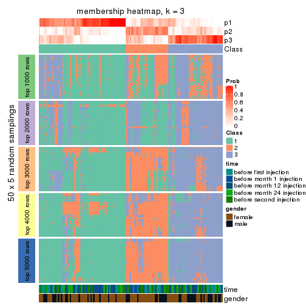</p>

</div>
<div id='tab-CV-pam-membership-heatmap-3'>
<pre><code class="r">membership_heatmap(res, k = 4)
</code></pre>

<p></p>

</div>
<div id='tab-CV-pam-membership-heatmap-4'>
<pre><code class="r">membership_heatmap(res, k = 5)
</code></pre>

<p></p>

</div>
<div id='tab-CV-pam-membership-heatmap-5'>
<pre><code class="r">membership_heatmap(res, k = 6)
</code></pre>

<p></p>

</div>
</div>

As soon as we have had the classes for columns, we can look for signatures
which are significantly different between classes which can be candidate marks
for certain classes. Following are the heatmaps for signatures.


Signature heatmaps where rows are scaled:


<script>
$( function() {
	$( '#tabs-CV-pam-get-signatures' ).tabs();
} );
</script>
<div id='tabs-CV-pam-get-signatures'>
<ul>
<li><a href='#tab-CV-pam-get-signatures-1'>k = 2</a></li>
<li><a href='#tab-CV-pam-get-signatures-2'>k = 3</a></li>
<li><a href='#tab-CV-pam-get-signatures-3'>k = 4</a></li>
<li><a href='#tab-CV-pam-get-signatures-4'>k = 5</a></li>
<li><a href='#tab-CV-pam-get-signatures-5'>k = 6</a></li>
</ul>
<div id='tab-CV-pam-get-signatures-1'>
<pre><code class="r">get_signatures(res, k = 2)
</code></pre>

<p></p>

</div>
<div id='tab-CV-pam-get-signatures-2'>
<pre><code class="r">get_signatures(res, k = 3)
</code></pre>

<p></p>

</div>
<div id='tab-CV-pam-get-signatures-3'>
<pre><code class="r">get_signatures(res, k = 4)
</code></pre>

<p></p>

</div>
<div id='tab-CV-pam-get-signatures-4'>
<pre><code class="r">get_signatures(res, k = 5)
</code></pre>

<p></p>

</div>
<div id='tab-CV-pam-get-signatures-5'>
<pre><code class="r">get_signatures(res, k = 6)
</code></pre>

<p></p>

</div>
</div>


Signature heatmaps where rows are not scaled:


<script>
$( function() {
	$( '#tabs-CV-pam-get-signatures-no-scale' ).tabs();
} );
</script>
<div id='tabs-CV-pam-get-signatures-no-scale'>
<ul>
<li><a href='#tab-CV-pam-get-signatures-no-scale-1'>k = 2</a></li>
<li><a href='#tab-CV-pam-get-signatures-no-scale-2'>k = 3</a></li>
<li><a href='#tab-CV-pam-get-signatures-no-scale-3'>k = 4</a></li>
<li><a href='#tab-CV-pam-get-signatures-no-scale-4'>k = 5</a></li>
<li><a href='#tab-CV-pam-get-signatures-no-scale-5'>k = 6</a></li>
</ul>
<div id='tab-CV-pam-get-signatures-no-scale-1'>
<pre><code class="r">get_signatures(res, k = 2, scale_rows = FALSE)
</code></pre>

<p></p>

</div>
<div id='tab-CV-pam-get-signatures-no-scale-2'>
<pre><code class="r">get_signatures(res, k = 3, scale_rows = FALSE)
</code></pre>

<p></p>

</div>
<div id='tab-CV-pam-get-signatures-no-scale-3'>
<pre><code class="r">get_signatures(res, k = 4, scale_rows = FALSE)
</code></pre>

<p></p>

</div>
<div id='tab-CV-pam-get-signatures-no-scale-4'>
<pre><code class="r">get_signatures(res, k = 5, scale_rows = FALSE)
</code></pre>

<p></p>

</div>
<div id='tab-CV-pam-get-signatures-no-scale-5'>
<pre><code class="r">get_signatures(res, k = 6, scale_rows = FALSE)
</code></pre>

<p></p>

</div>
</div>


Compare the overlap of signatures from different k:

```r
compare_signatures(res)
```


`get_signature()` returns a data frame invisibly. TO get the list of signatures, the function
call should be assigned to a variable explicitly. In following code, if `plot` argument is set
to `FALSE`, no heatmap is plotted while only the differential analysis is performed.

```r
# code only for demonstration
tb = get_signature(res, k = ..., plot = FALSE)
```

An example of the output of `tb` is:

```
#>   which_row         fdr    mean_1    mean_2 scaled_mean_1 scaled_mean_2 km
#> 1        38 0.042760348  8.373488  9.131774    -0.5533452     0.5164555  1
#> 2        40 0.018707592  7.106213  8.469186    -0.6173731     0.5762149  1
#> 3        55 0.019134737 10.221463 11.207825    -0.6159697     0.5749050  1
#> 4        59 0.006059896  5.921854  7.869574    -0.6899429     0.6439467  1
#> 5        60 0.018055526  8.928898 10.211722    -0.6204761     0.5791110  1
#> 6        98 0.009384629 15.714769 14.887706     0.6635654    -0.6193277  2
...
```

The columns in `tb` are:

1. `which_row`: row indices corresponding to the input matrix.
2. `fdr`: FDR for the differential test. 
3. `mean_x`: The mean value in group x.
4. `scaled_mean_x`: The mean value in group x after rows are scaled.
5. `km`: Row groups if k-means clustering is applied to rows.


UMAP plot which shows how samples are separated.


<script>
$( function() {
	$( '#tabs-CV-pam-dimension-reduction' ).tabs();
} );
</script>
<div id='tabs-CV-pam-dimension-reduction'>
<ul>
<li><a href='#tab-CV-pam-dimension-reduction-1'>k = 2</a></li>
<li><a href='#tab-CV-pam-dimension-reduction-2'>k = 3</a></li>
<li><a href='#tab-CV-pam-dimension-reduction-3'>k = 4</a></li>
<li><a href='#tab-CV-pam-dimension-reduction-4'>k = 5</a></li>
<li><a href='#tab-CV-pam-dimension-reduction-5'>k = 6</a></li>
</ul>
<div id='tab-CV-pam-dimension-reduction-1'>
<pre><code class="r">dimension_reduction(res, k = 2, method = &quot;UMAP&quot;)
</code></pre>

<p></p>

</div>
<div id='tab-CV-pam-dimension-reduction-2'>
<pre><code class="r">dimension_reduction(res, k = 3, method = &quot;UMAP&quot;)
</code></pre>

<p></p>

</div>
<div id='tab-CV-pam-dimension-reduction-3'>
<pre><code class="r">dimension_reduction(res, k = 4, method = &quot;UMAP&quot;)
</code></pre>

<p></p>

</div>
<div id='tab-CV-pam-dimension-reduction-4'>
<pre><code class="r">dimension_reduction(res, k = 5, method = &quot;UMAP&quot;)
</code></pre>

<p></p>

</div>
<div id='tab-CV-pam-dimension-reduction-5'>
<pre><code class="r">dimension_reduction(res, k = 6, method = &quot;UMAP&quot;)
</code></pre>

<p></p>

</div>
</div>


Following heatmap shows how subgroups are split when increasing `k`:

```r
collect_classes(res)
```


Test correlation between subgroups and known annotations. If the known
annotation is numeric, one-way ANOVA test is applied, and if the known
annotation is discrete, chi-squared contingency table test is applied.

```r
test_to_known_factors(res)
```

```
#>          n time(p) gender(p) k
#> CV:pam 104   0.686   0.07195 2
#> CV:pam  77   0.410   0.06455 3
#> CV:pam  73   0.625   0.07936 4
#> CV:pam  65   0.552   0.00445 5
#> CV:pam  50   0.664   0.01403 6
```


If matrix rows can be associated to genes, consider to use `GO_Enrichment(res,
...)` to perform function enrichment for the signature genes.


 

---------------------------------------------------


### CV:mclust


The object with results only for a single top-value method and a single partition method 
can be extracted as:

```r
res = res_list["CV", "mclust"]
# you can also extract it by
# res = res_list["CV:mclust"]
```

A summary of `res` and all the functions that can be applied to it:

```r
res
```

```
#> A 'ConsensusPartition' object with k = 2, 3, 4, 5, 6.
#>   On a matrix with 21168 rows and 125 columns.
#>   Top rows (1000, 2000, 3000, 4000, 5000) are extracted by 'CV' method.
#>   Subgroups are detected by 'mclust' method.
#>   Performed in total 1250 partitions by row resampling.
#>   Best k for subgroups seems to be 3.
#> 
#> Following methods can be applied to this 'ConsensusPartition' object:
#>  [1] "cola_report"             "collect_classes"         "collect_plots"          
#>  [4] "collect_stats"           "colnames"                "compare_signatures"     
#>  [7] "consensus_heatmap"       "dimension_reduction"     "functional_enrichment"  
#> [10] "get_anno_col"            "get_anno"                "get_classes"            
#> [13] "get_consensus"           "get_matrix"              "get_membership"         
#> [16] "get_param"               "get_signatures"          "get_stats"              
#> [19] "is_best_k"               "is_stable_k"             "membership_heatmap"     
#> [22] "ncol"                    "nrow"                    "plot_ecdf"              
#> [25] "rownames"                "select_partition_number" "show"                   
#> [28] "suggest_best_k"          "test_to_known_factors"
```

`collect_plots()` function collects all the plots made from `res` for all `k` (number of partitions)
into one single page to provide an easy and fast comparison between different `k`.

```r
collect_plots(res)
```


The plots are:

- The first row: a plot of the ECDF (Empirical cumulative distribution
  function) curves of the consensus matrix for each `k` and the heatmap of
  predicted classes for each `k`.
- The second row: heatmaps of the consensus matrix for each `k`.
- The third row: heatmaps of the membership matrix for each `k`.
- The fouth row: heatmaps of the signatures for each `k`.

All the plots in panels can be made by individual functions and they are
plotted later in this section.

`select_partition_number()` produces several plots showing different
statistics for choosing "optimized" `k`. There are following statistics:

- ECDF curves of the consensus matrix for each `k`;
- 1-PAC. [The PAC
  score](https://en.wikipedia.org/wiki/Consensus_clustering#Over-interpretation_potential_of_consensus_clustering)
  measures the proportion of the ambiguous subgrouping.
- Mean silhouette score.
- Concordance. The mean probability of fiting the consensus class ids in all
  partitions.
- Area increased. Denote $A_k$ as the area under the ECDF curve for current
  `k`, the area increased is defined as $A_k - A_{k-1}$.
- Rand index. The percent of pairs of samples that are both in a same cluster
  or both are not in a same cluster in the partition of k and k-1.
- Jaccard index. The ratio of pairs of samples are both in a same cluster in
  the partition of k and k-1 and the pairs of samples are both in a same
  cluster in the partition k or k-1.

The detailed explanations of these statistics can be found in [the cola
vignette](http://bioconductor.org/packages/devel/bioc/vignettes/cola/inst/doc/cola.html#toc_13).

Generally speaking, lower PAC score, higher mean silhouette score or higher
concordance corresponds to better partition. Rand index and Jaccard index
measure how similar the current partition is compared to partition with `k-1`.
If they are too similar, we won't accept `k` is better than `k-1`.

```r
select_partition_number(res)
```

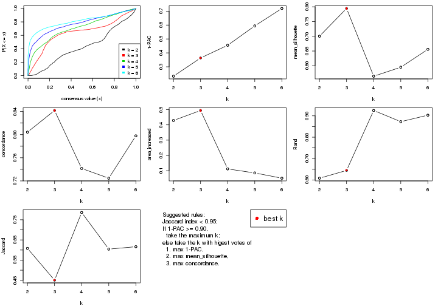

The numeric values for all these statistics can be obtained by `get_stats()`.

```r
get_stats(res)
```

```
#>   k 1-PAC mean_silhouette concordance area_increased  Rand Jaccard
#> 2 2 0.232           0.700       0.804         0.4288 0.608   0.608
#> 3 3 0.363           0.794       0.842         0.4942 0.645   0.450
#> 4 4 0.455           0.565       0.741         0.1116 0.925   0.786
#> 5 5 0.594           0.595       0.725         0.0855 0.873   0.604
#> 6 6 0.719           0.656       0.798         0.0510 0.903   0.616
```

`suggest_best_k()` suggests the best $k$ based on these statistics. The rules are as follows:

- All $k$ with Jaccard index larger than 0.95 are removed because the increase of
  the partition number does not provides enough extra information. If all $k$ are removed,
  the best $k$ is assigned by `NA`.
- For $k$ with 1-PAC larger than 0.9, the maximal $k$ is taken as the "best k". Other $k$ is called "optional k".
- If it does not fit the second rule. The $k$ with the highest vote of highest
  1-PAC, mean silhouette and concordance is taken as the "best k".

```r
suggest_best_k(res)
```

```
#> [1] 3
```


Following shows the table of the partitions (You need to click the **show/hide
code output** link to see it). The membership matrix (columns with name `p*`)
is inferred by
[`clue::cl_consensus()`](https://www.rdocumentation.org/link/cl_consensus?package=clue)
function with the `SE` method. Basically the value in the membership matrix
represents the probability to belong to a certain group. The finall class
label for an item is determined with the group with highest probability it
belongs to.

In `get_classes()` function, the entropy is calculated from the membership
matrix and the silhouette score is calculated from the consensus matrix.


<script>
$( function() {
	$( '#tabs-CV-mclust-get-classes' ).tabs();
} );
</script>
<div id='tabs-CV-mclust-get-classes'>
<ul>
<li><a href='#tab-CV-mclust-get-classes-1'>k = 2</a></li>
<li><a href='#tab-CV-mclust-get-classes-2'>k = 3</a></li>
<li><a href='#tab-CV-mclust-get-classes-3'>k = 4</a></li>
<li><a href='#tab-CV-mclust-get-classes-4'>k = 5</a></li>
<li><a href='#tab-CV-mclust-get-classes-5'>k = 6</a></li>
</ul>

<div id='tab-CV-mclust-get-classes-1'>
<p><a id='tab-CV-mclust-get-classes-1-a' style='color:#0366d6' href='#'>show/hide code output</a></p>
<pre><code class="r">cbind(get_classes(res, k = 2), get_membership(res, k = 2))
</code></pre>

<pre><code>#&gt;           class entropy silhouette    p1    p2
#&gt; GSM601752     2  0.5059      0.845 0.112 0.888
#&gt; GSM601782     1  0.2603      0.765 0.956 0.044
#&gt; GSM601792     2  0.8386      0.819 0.268 0.732
#&gt; GSM601797     2  0.8081      0.833 0.248 0.752
#&gt; GSM601827     1  0.8813      0.377 0.700 0.300
#&gt; GSM601837     1  0.8443      0.733 0.728 0.272
#&gt; GSM601842     1  0.8267      0.740 0.740 0.260
#&gt; GSM601857     1  0.1843      0.769 0.972 0.028
#&gt; GSM601867     1  0.3114      0.766 0.944 0.056
#&gt; GSM601747     1  0.2948      0.777 0.948 0.052
#&gt; GSM601757     1  0.0672      0.769 0.992 0.008
#&gt; GSM601762     1  0.8144      0.741 0.748 0.252
#&gt; GSM601767     1  0.7883      0.747 0.764 0.236
#&gt; GSM601772     1  0.7883      0.747 0.764 0.236
#&gt; GSM601777     2  0.8499      0.838 0.276 0.724
#&gt; GSM601787     1  0.5294      0.775 0.880 0.120
#&gt; GSM601802     2  0.6801      0.844 0.180 0.820
#&gt; GSM601807     1  0.8813      0.421 0.700 0.300
#&gt; GSM601812     1  0.1843      0.770 0.972 0.028
#&gt; GSM601817     1  0.2236      0.768 0.964 0.036
#&gt; GSM601822     2  0.8861      0.829 0.304 0.696
#&gt; GSM601832     1  0.7883      0.747 0.764 0.236
#&gt; GSM601847     2  0.6973      0.841 0.188 0.812
#&gt; GSM601852     1  0.2423      0.766 0.960 0.040
#&gt; GSM601862     1  0.1184      0.770 0.984 0.016
#&gt; GSM601753     2  0.6148      0.842 0.152 0.848
#&gt; GSM601783     1  0.3431      0.755 0.936 0.064
#&gt; GSM601793     2  0.8386      0.819 0.268 0.732
#&gt; GSM601798     2  0.5178      0.847 0.116 0.884
#&gt; GSM601828     1  0.3114      0.765 0.944 0.056
#&gt; GSM601838     1  0.8081      0.745 0.752 0.248
#&gt; GSM601843     1  0.8327      0.738 0.736 0.264
#&gt; GSM601858     1  0.8016      0.748 0.756 0.244
#&gt; GSM601868     1  0.2948      0.761 0.948 0.052
#&gt; GSM601748     1  0.2423      0.766 0.960 0.040
#&gt; GSM601758     1  0.2423      0.766 0.960 0.040
#&gt; GSM601763     1  0.1184      0.776 0.984 0.016
#&gt; GSM601768     1  0.7815      0.748 0.768 0.232
#&gt; GSM601773     1  0.7815      0.748 0.768 0.232
#&gt; GSM601778     2  0.9248      0.803 0.340 0.660
#&gt; GSM601788     1  0.5737      0.768 0.864 0.136
#&gt; GSM601803     2  0.6801      0.844 0.180 0.820
#&gt; GSM601808     1  0.2423      0.759 0.960 0.040
#&gt; GSM601813     1  0.3584      0.753 0.932 0.068
#&gt; GSM601818     1  0.0672      0.769 0.992 0.008
#&gt; GSM601823     2  0.9795      0.708 0.416 0.584
#&gt; GSM601833     1  0.7883      0.747 0.764 0.236
#&gt; GSM601848     2  0.9044      0.812 0.320 0.680
#&gt; GSM601853     1  0.6623      0.603 0.828 0.172
#&gt; GSM601863     1  0.1414      0.770 0.980 0.020
#&gt; GSM601754     2  0.5059      0.845 0.112 0.888
#&gt; GSM601784     1  0.8443      0.733 0.728 0.272
#&gt; GSM601794     2  0.8386      0.819 0.268 0.732
#&gt; GSM601799     2  0.5629      0.849 0.132 0.868
#&gt; GSM601829     2  0.9044      0.800 0.320 0.680
#&gt; GSM601839     1  0.8081      0.745 0.752 0.248
#&gt; GSM601844     1  0.9993     -0.374 0.516 0.484
#&gt; GSM601859     1  0.8327      0.738 0.736 0.264
#&gt; GSM601869     1  0.3879      0.748 0.924 0.076
#&gt; GSM601749     1  0.2423      0.766 0.960 0.040
#&gt; GSM601759     1  0.2423      0.766 0.960 0.040
#&gt; GSM601764     1  0.1184      0.774 0.984 0.016
#&gt; GSM601769     1  0.7883      0.747 0.764 0.236
#&gt; GSM601774     1  0.7883      0.747 0.764 0.236
#&gt; GSM601779     1  0.9970     -0.446 0.532 0.468
#&gt; GSM601789     1  0.7815      0.748 0.768 0.232
#&gt; GSM601804     2  0.6887      0.843 0.184 0.816
#&gt; GSM601809     1  0.1184      0.772 0.984 0.016
#&gt; GSM601814     1  0.7815      0.748 0.768 0.232
#&gt; GSM601819     1  0.1843      0.770 0.972 0.028
#&gt; GSM601824     2  0.9710      0.467 0.400 0.600
#&gt; GSM601834     1  0.7883      0.747 0.764 0.236
#&gt; GSM601849     1  0.4562      0.707 0.904 0.096
#&gt; GSM601854     1  0.2948      0.762 0.948 0.052
#&gt; GSM601864     1  0.7056      0.759 0.808 0.192
#&gt; GSM601755     2  0.5059      0.845 0.112 0.888
#&gt; GSM601785     1  0.7453      0.747 0.788 0.212
#&gt; GSM601795     2  0.8144      0.831 0.252 0.748
#&gt; GSM601800     2  0.5059      0.845 0.112 0.888
#&gt; GSM601830     1  0.8555      0.418 0.720 0.280
#&gt; GSM601840     1  0.7139      0.754 0.804 0.196
#&gt; GSM601845     1  0.7219      0.740 0.800 0.200
#&gt; GSM601860     1  0.8144      0.745 0.748 0.252
#&gt; GSM601870     1  0.7674      0.523 0.776 0.224
#&gt; GSM601750     1  0.2423      0.766 0.960 0.040
#&gt; GSM601760     1  0.1414      0.770 0.980 0.020
#&gt; GSM601765     1  0.7883      0.747 0.764 0.236
#&gt; GSM601770     1  0.7883      0.747 0.764 0.236
#&gt; GSM601775     1  0.3733      0.780 0.928 0.072
#&gt; GSM601780     1  0.9922     -0.386 0.552 0.448
#&gt; GSM601790     1  0.7815      0.748 0.768 0.232
#&gt; GSM601805     2  0.6801      0.844 0.180 0.820
#&gt; GSM601810     1  0.0938      0.769 0.988 0.012
#&gt; GSM601815     1  0.7815      0.748 0.768 0.232
#&gt; GSM601820     1  0.2423      0.766 0.960 0.040
#&gt; GSM601825     2  0.7376      0.824 0.208 0.792
#&gt; GSM601835     1  0.9635      0.572 0.612 0.388
#&gt; GSM601850     1  0.9881     -0.196 0.564 0.436
#&gt; GSM601855     1  0.8207      0.448 0.744 0.256
#&gt; GSM601865     1  0.7815      0.748 0.768 0.232
#&gt; GSM601756     2  0.5059      0.845 0.112 0.888
#&gt; GSM601786     1  0.8386      0.736 0.732 0.268
#&gt; GSM601796     2  0.8386      0.819 0.268 0.732
#&gt; GSM601801     2  0.5178      0.847 0.116 0.884
#&gt; GSM601831     1  0.8955      0.350 0.688 0.312
#&gt; GSM601841     1  0.8207      0.477 0.744 0.256
#&gt; GSM601846     2  0.7299      0.850 0.204 0.796
#&gt; GSM601861     1  0.8081      0.745 0.752 0.248
#&gt; GSM601871     1  0.5842      0.772 0.860 0.140
#&gt; GSM601751     1  0.4562      0.777 0.904 0.096
#&gt; GSM601761     1  0.2423      0.757 0.960 0.040
#&gt; GSM601766     1  0.4431      0.777 0.908 0.092
#&gt; GSM601771     1  0.6801      0.759 0.820 0.180
#&gt; GSM601776     1  0.9044      0.157 0.680 0.320
#&gt; GSM601781     2  0.8861      0.810 0.304 0.696
#&gt; GSM601791     1  0.6887      0.566 0.816 0.184
#&gt; GSM601806     2  0.6887      0.843 0.184 0.816
#&gt; GSM601811     1  0.0672      0.769 0.992 0.008
#&gt; GSM601816     2  0.9170      0.808 0.332 0.668
#&gt; GSM601821     1  0.7815      0.748 0.768 0.232
#&gt; GSM601826     2  0.9209      0.806 0.336 0.664
#&gt; GSM601836     1  0.0938      0.775 0.988 0.012
#&gt; GSM601851     1  0.9661     -0.180 0.608 0.392
#&gt; GSM601856     1  0.8016      0.457 0.756 0.244
#&gt; GSM601866     1  0.2423      0.766 0.960 0.040
</code></pre>

<script>
$('#tab-CV-mclust-get-classes-1-a').parent().next().next().hide();
$('#tab-CV-mclust-get-classes-1-a').click(function(){
  $('#tab-CV-mclust-get-classes-1-a').parent().next().next().toggle();
  return(false);
});
</script>
</div>

<div id='tab-CV-mclust-get-classes-2'>
<p><a id='tab-CV-mclust-get-classes-2-a' style='color:#0366d6' href='#'>show/hide code output</a></p>
<pre><code class="r">cbind(get_classes(res, k = 3), get_membership(res, k = 3))
</code></pre>

<pre><code>#&gt;           class entropy silhouette    p1    p2    p3
#&gt; GSM601752     1  0.0424     0.8358 0.992 0.008 0.000
#&gt; GSM601782     3  0.6098     0.8433 0.056 0.176 0.768
#&gt; GSM601792     1  0.0829     0.8393 0.984 0.004 0.012
#&gt; GSM601797     1  0.1015     0.8391 0.980 0.008 0.012
#&gt; GSM601827     3  0.6148     0.8192 0.148 0.076 0.776
#&gt; GSM601837     2  0.5883     0.7746 0.092 0.796 0.112
#&gt; GSM601842     2  0.4390     0.8418 0.148 0.840 0.012
#&gt; GSM601857     3  0.4591     0.8811 0.032 0.120 0.848
#&gt; GSM601867     3  0.7515     0.6204 0.100 0.220 0.680
#&gt; GSM601747     2  0.6407     0.7478 0.080 0.760 0.160
#&gt; GSM601757     3  0.5798     0.8479 0.040 0.184 0.776
#&gt; GSM601762     2  0.2959     0.8498 0.100 0.900 0.000
#&gt; GSM601767     2  0.0424     0.8555 0.008 0.992 0.000
#&gt; GSM601772     2  0.0592     0.8569 0.012 0.988 0.000
#&gt; GSM601777     1  0.5710     0.8230 0.804 0.116 0.080
#&gt; GSM601787     3  0.6773     0.5049 0.024 0.340 0.636
#&gt; GSM601802     1  0.3686     0.8184 0.860 0.140 0.000
#&gt; GSM601807     3  0.3590     0.8083 0.076 0.028 0.896
#&gt; GSM601812     3  0.4351     0.8765 0.004 0.168 0.828
#&gt; GSM601817     3  0.4099     0.8842 0.008 0.140 0.852
#&gt; GSM601822     1  0.4658     0.8283 0.856 0.076 0.068
#&gt; GSM601832     2  0.3619     0.8321 0.136 0.864 0.000
#&gt; GSM601847     1  0.3896     0.8250 0.864 0.128 0.008
#&gt; GSM601852     3  0.4172     0.8799 0.004 0.156 0.840
#&gt; GSM601862     3  0.3043     0.8749 0.008 0.084 0.908
#&gt; GSM601753     1  0.1163     0.8398 0.972 0.028 0.000
#&gt; GSM601783     3  0.6882     0.8131 0.172 0.096 0.732
#&gt; GSM601793     1  0.0829     0.8393 0.984 0.004 0.012
#&gt; GSM601798     1  0.0747     0.8344 0.984 0.016 0.000
#&gt; GSM601828     3  0.3918     0.8824 0.004 0.140 0.856
#&gt; GSM601838     2  0.3995     0.8035 0.016 0.868 0.116
#&gt; GSM601843     2  0.4139     0.8529 0.124 0.860 0.016
#&gt; GSM601858     2  0.2846     0.8498 0.020 0.924 0.056
#&gt; GSM601868     3  0.4256     0.8242 0.096 0.036 0.868
#&gt; GSM601748     3  0.3918     0.8837 0.004 0.140 0.856
#&gt; GSM601758     3  0.4172     0.8799 0.004 0.156 0.840
#&gt; GSM601763     2  0.6332     0.7920 0.144 0.768 0.088
#&gt; GSM601768     2  0.3193     0.8530 0.100 0.896 0.004
#&gt; GSM601773     2  0.1753     0.8640 0.048 0.952 0.000
#&gt; GSM601778     1  0.4982     0.8252 0.840 0.064 0.096
#&gt; GSM601788     2  0.3267     0.8495 0.044 0.912 0.044
#&gt; GSM601803     1  0.3879     0.8136 0.848 0.152 0.000
#&gt; GSM601808     3  0.2527     0.8580 0.020 0.044 0.936
#&gt; GSM601813     3  0.4802     0.8759 0.020 0.156 0.824
#&gt; GSM601818     3  0.4326     0.8793 0.012 0.144 0.844
#&gt; GSM601823     1  0.6886     0.7515 0.728 0.088 0.184
#&gt; GSM601833     2  0.2165     0.8597 0.064 0.936 0.000
#&gt; GSM601848     1  0.5343     0.7934 0.816 0.052 0.132
#&gt; GSM601853     3  0.2050     0.8531 0.020 0.028 0.952
#&gt; GSM601863     3  0.3454     0.8807 0.008 0.104 0.888
#&gt; GSM601754     1  0.0424     0.8358 0.992 0.008 0.000
#&gt; GSM601784     2  0.2448     0.8569 0.076 0.924 0.000
#&gt; GSM601794     1  0.0829     0.8393 0.984 0.004 0.012
#&gt; GSM601799     1  0.0892     0.8387 0.980 0.020 0.000
#&gt; GSM601829     1  0.4755     0.7438 0.808 0.008 0.184
#&gt; GSM601839     2  0.3995     0.8035 0.016 0.868 0.116
#&gt; GSM601844     1  0.5105     0.7809 0.828 0.048 0.124
#&gt; GSM601859     2  0.4293     0.8372 0.164 0.832 0.004
#&gt; GSM601869     3  0.6208     0.8237 0.152 0.076 0.772
#&gt; GSM601749     3  0.4413     0.8794 0.008 0.160 0.832
#&gt; GSM601759     3  0.3983     0.8832 0.004 0.144 0.852
#&gt; GSM601764     2  0.6653     0.7788 0.136 0.752 0.112
#&gt; GSM601769     2  0.0237     0.8548 0.004 0.996 0.000
#&gt; GSM601774     2  0.0424     0.8555 0.008 0.992 0.000
#&gt; GSM601779     1  0.6911     0.7453 0.728 0.092 0.180
#&gt; GSM601789     2  0.1585     0.8512 0.008 0.964 0.028
#&gt; GSM601804     1  0.4261     0.8168 0.848 0.140 0.012
#&gt; GSM601809     2  0.7396    -0.1970 0.032 0.488 0.480
#&gt; GSM601814     2  0.0747     0.8581 0.016 0.984 0.000
#&gt; GSM601819     3  0.5109     0.8389 0.008 0.212 0.780
#&gt; GSM601824     1  0.7328     0.5815 0.612 0.344 0.044
#&gt; GSM601834     2  0.2165     0.8593 0.064 0.936 0.000
#&gt; GSM601849     1  0.8522     0.6226 0.612 0.204 0.184
#&gt; GSM601854     3  0.4351     0.8766 0.004 0.168 0.828
#&gt; GSM601864     2  0.3995     0.8052 0.016 0.868 0.116
#&gt; GSM601755     1  0.0424     0.8358 0.992 0.008 0.000
#&gt; GSM601785     2  0.5254     0.7576 0.264 0.736 0.000
#&gt; GSM601795     1  0.0661     0.8386 0.988 0.004 0.008
#&gt; GSM601800     1  0.0424     0.8358 0.992 0.008 0.000
#&gt; GSM601830     3  0.3532     0.7978 0.108 0.008 0.884
#&gt; GSM601840     2  0.5420     0.7749 0.240 0.752 0.008
#&gt; GSM601845     2  0.6404     0.6200 0.344 0.644 0.012
#&gt; GSM601860     2  0.4349     0.8510 0.128 0.852 0.020
#&gt; GSM601870     3  0.2384     0.8251 0.056 0.008 0.936
#&gt; GSM601750     3  0.4172     0.8799 0.004 0.156 0.840
#&gt; GSM601760     3  0.4663     0.8778 0.016 0.156 0.828
#&gt; GSM601765     2  0.2959     0.8494 0.100 0.900 0.000
#&gt; GSM601770     2  0.1163     0.8614 0.028 0.972 0.000
#&gt; GSM601775     2  0.6372     0.7813 0.152 0.764 0.084
#&gt; GSM601780     1  0.7963     0.6965 0.660 0.152 0.188
#&gt; GSM601790     2  0.2749     0.8369 0.012 0.924 0.064
#&gt; GSM601805     1  0.3941     0.8095 0.844 0.156 0.000
#&gt; GSM601810     3  0.4618     0.8815 0.024 0.136 0.840
#&gt; GSM601815     2  0.1399     0.8497 0.004 0.968 0.028
#&gt; GSM601820     3  0.4172     0.8799 0.004 0.156 0.840
#&gt; GSM601825     1  0.4047     0.8155 0.848 0.148 0.004
#&gt; GSM601835     2  0.4277     0.8384 0.132 0.852 0.016
#&gt; GSM601850     1  0.6349     0.7754 0.764 0.156 0.080
#&gt; GSM601855     3  0.2063     0.8310 0.044 0.008 0.948
#&gt; GSM601865     2  0.3359     0.8249 0.016 0.900 0.084
#&gt; GSM601756     1  0.0424     0.8358 0.992 0.008 0.000
#&gt; GSM601786     2  0.5650     0.7933 0.084 0.808 0.108
#&gt; GSM601796     1  0.0983     0.8394 0.980 0.004 0.016
#&gt; GSM601801     1  0.1289     0.8287 0.968 0.032 0.000
#&gt; GSM601831     3  0.6062     0.8094 0.160 0.064 0.776
#&gt; GSM601841     1  0.9387     0.3347 0.508 0.272 0.220
#&gt; GSM601846     1  0.1751     0.8383 0.960 0.012 0.028
#&gt; GSM601861     2  0.1636     0.8564 0.016 0.964 0.020
#&gt; GSM601871     3  0.7479     0.5675 0.076 0.264 0.660
#&gt; GSM601751     2  0.6804     0.7339 0.204 0.724 0.072
#&gt; GSM601761     2  0.9937    -0.0203 0.296 0.388 0.316
#&gt; GSM601766     2  0.5136     0.8247 0.132 0.824 0.044
#&gt; GSM601771     2  0.2173     0.8616 0.048 0.944 0.008
#&gt; GSM601776     1  0.8868     0.5859 0.576 0.196 0.228
#&gt; GSM601781     1  0.5408     0.8182 0.812 0.136 0.052
#&gt; GSM601791     1  0.9531     0.3685 0.468 0.324 0.208
#&gt; GSM601806     1  0.4235     0.7990 0.824 0.176 0.000
#&gt; GSM601811     3  0.4591     0.8789 0.032 0.120 0.848
#&gt; GSM601816     1  0.4379     0.8365 0.868 0.060 0.072
#&gt; GSM601821     2  0.1905     0.8540 0.016 0.956 0.028
#&gt; GSM601826     1  0.6705     0.7593 0.740 0.084 0.176
#&gt; GSM601836     2  0.6955     0.7477 0.172 0.728 0.100
#&gt; GSM601851     1  0.8408     0.6339 0.612 0.144 0.244
#&gt; GSM601856     3  0.2810     0.8525 0.036 0.036 0.928
#&gt; GSM601866     3  0.3918     0.8837 0.004 0.140 0.856
</code></pre>

<script>
$('#tab-CV-mclust-get-classes-2-a').parent().next().next().hide();
$('#tab-CV-mclust-get-classes-2-a').click(function(){
  $('#tab-CV-mclust-get-classes-2-a').parent().next().next().toggle();
  return(false);
});
</script>
</div>

<div id='tab-CV-mclust-get-classes-3'>
<p><a id='tab-CV-mclust-get-classes-3-a' style='color:#0366d6' href='#'>show/hide code output</a></p>
<pre><code class="r">cbind(get_classes(res, k = 4), get_membership(res, k = 4))
</code></pre>

<pre><code>#&gt;           class entropy silhouette    p1    p2    p3    p4
#&gt; GSM601752     4  0.2611     0.7690 0.000 0.008 0.096 0.896
#&gt; GSM601782     1  0.6566     0.4992 0.684 0.192 0.088 0.036
#&gt; GSM601792     4  0.2275     0.7635 0.048 0.004 0.020 0.928
#&gt; GSM601797     4  0.1256     0.7739 0.000 0.008 0.028 0.964
#&gt; GSM601827     1  0.5540     0.3321 0.728 0.000 0.108 0.164
#&gt; GSM601837     2  0.5421     0.4977 0.008 0.648 0.328 0.016
#&gt; GSM601842     2  0.4093     0.7396 0.032 0.836 0.012 0.120
#&gt; GSM601857     1  0.2207     0.5849 0.932 0.004 0.040 0.024
#&gt; GSM601867     3  0.7684     0.5342 0.304 0.152 0.524 0.020
#&gt; GSM601747     2  0.5941     0.3292 0.376 0.584 0.004 0.036
#&gt; GSM601757     1  0.5546     0.5235 0.736 0.188 0.064 0.012
#&gt; GSM601762     2  0.3264     0.7430 0.024 0.876 0.004 0.096
#&gt; GSM601767     2  0.2075     0.7454 0.016 0.936 0.004 0.044
#&gt; GSM601772     2  0.1635     0.7422 0.008 0.948 0.000 0.044
#&gt; GSM601777     4  0.4416     0.7549 0.040 0.100 0.028 0.832
#&gt; GSM601787     3  0.7889     0.4798 0.224 0.276 0.488 0.012
#&gt; GSM601802     4  0.5389     0.7576 0.040 0.084 0.092 0.784
#&gt; GSM601807     3  0.5919     0.6033 0.404 0.012 0.564 0.020
#&gt; GSM601812     1  0.1182     0.6114 0.968 0.016 0.016 0.000
#&gt; GSM601817     1  0.1706     0.5787 0.948 0.016 0.036 0.000
#&gt; GSM601822     4  0.3575     0.7671 0.092 0.028 0.012 0.868
#&gt; GSM601832     2  0.3205     0.7417 0.024 0.872 0.000 0.104
#&gt; GSM601847     4  0.5151     0.7661 0.048 0.064 0.088 0.800
#&gt; GSM601852     1  0.4149     0.5601 0.804 0.168 0.028 0.000
#&gt; GSM601862     1  0.4567     0.3540 0.748 0.012 0.236 0.004
#&gt; GSM601753     4  0.2610     0.7709 0.000 0.012 0.088 0.900
#&gt; GSM601783     1  0.6903     0.4940 0.684 0.136 0.064 0.116
#&gt; GSM601793     4  0.2002     0.7619 0.044 0.000 0.020 0.936
#&gt; GSM601798     4  0.2480     0.7707 0.000 0.008 0.088 0.904
#&gt; GSM601828     1  0.1516     0.6094 0.960 0.016 0.016 0.008
#&gt; GSM601838     2  0.5060     0.5241 0.008 0.680 0.304 0.008
#&gt; GSM601843     2  0.4093     0.7399 0.032 0.836 0.012 0.120
#&gt; GSM601858     2  0.6397     0.6182 0.044 0.676 0.232 0.048
#&gt; GSM601868     1  0.5228     0.1624 0.700 0.004 0.268 0.028
#&gt; GSM601748     1  0.0779     0.6013 0.980 0.016 0.004 0.000
#&gt; GSM601758     1  0.1356     0.6127 0.960 0.032 0.008 0.000
#&gt; GSM601763     2  0.8209     0.3909 0.276 0.524 0.060 0.140
#&gt; GSM601768     2  0.3349     0.7454 0.052 0.880 0.004 0.064
#&gt; GSM601773     2  0.2297     0.7457 0.024 0.928 0.004 0.044
#&gt; GSM601778     4  0.4587     0.7454 0.140 0.020 0.032 0.808
#&gt; GSM601788     2  0.3974     0.7319 0.040 0.844 0.008 0.108
#&gt; GSM601803     4  0.5694     0.7484 0.040 0.104 0.092 0.764
#&gt; GSM601808     1  0.5272    -0.2340 0.608 0.008 0.380 0.004
#&gt; GSM601813     1  0.5021     0.5357 0.756 0.180 0.064 0.000
#&gt; GSM601818     1  0.2928     0.5448 0.896 0.024 0.076 0.004
#&gt; GSM601823     4  0.6906     0.4849 0.312 0.012 0.096 0.580
#&gt; GSM601833     2  0.2413     0.7475 0.020 0.916 0.000 0.064
#&gt; GSM601848     4  0.5739     0.6427 0.200 0.008 0.076 0.716
#&gt; GSM601853     1  0.5299    -0.2928 0.600 0.004 0.388 0.008
#&gt; GSM601863     1  0.1610     0.5882 0.952 0.016 0.032 0.000
#&gt; GSM601754     4  0.2546     0.7700 0.000 0.008 0.092 0.900
#&gt; GSM601784     2  0.3593     0.7433 0.024 0.868 0.016 0.092
#&gt; GSM601794     4  0.2002     0.7619 0.044 0.000 0.020 0.936
#&gt; GSM601799     4  0.2861     0.7705 0.000 0.016 0.096 0.888
#&gt; GSM601829     4  0.5051     0.7030 0.132 0.000 0.100 0.768
#&gt; GSM601839     2  0.5060     0.5228 0.008 0.680 0.304 0.008
#&gt; GSM601844     4  0.8335     0.3599 0.212 0.144 0.092 0.552
#&gt; GSM601859     2  0.4331     0.7334 0.028 0.820 0.016 0.136
#&gt; GSM601869     1  0.5665     0.3113 0.716 0.000 0.176 0.108
#&gt; GSM601749     1  0.4079     0.5531 0.800 0.180 0.020 0.000
#&gt; GSM601759     1  0.0804     0.6063 0.980 0.012 0.008 0.000
#&gt; GSM601764     2  0.8100     0.0527 0.404 0.440 0.064 0.092
#&gt; GSM601769     2  0.1114     0.7324 0.004 0.972 0.008 0.016
#&gt; GSM601774     2  0.1767     0.7431 0.012 0.944 0.000 0.044
#&gt; GSM601779     4  0.7102     0.3551 0.368 0.012 0.096 0.524
#&gt; GSM601789     2  0.4853     0.6211 0.012 0.768 0.192 0.028
#&gt; GSM601804     4  0.5415     0.7660 0.064 0.052 0.100 0.784
#&gt; GSM601809     1  0.7655     0.1991 0.556 0.256 0.164 0.024
#&gt; GSM601814     2  0.0376     0.7273 0.004 0.992 0.004 0.000
#&gt; GSM601819     1  0.4756     0.5563 0.784 0.144 0.072 0.000
#&gt; GSM601824     4  0.8450     0.5804 0.220 0.100 0.140 0.540
#&gt; GSM601834     2  0.2310     0.7471 0.008 0.920 0.004 0.068
#&gt; GSM601849     1  0.9393     0.1650 0.404 0.204 0.124 0.268
#&gt; GSM601854     1  0.3626     0.5530 0.812 0.184 0.004 0.000
#&gt; GSM601864     2  0.5271     0.5136 0.016 0.676 0.300 0.008
#&gt; GSM601755     4  0.2546     0.7700 0.000 0.008 0.092 0.900
#&gt; GSM601785     2  0.5499     0.6426 0.012 0.680 0.024 0.284
#&gt; GSM601795     4  0.1114     0.7729 0.004 0.008 0.016 0.972
#&gt; GSM601800     4  0.2546     0.7700 0.000 0.008 0.092 0.900
#&gt; GSM601830     3  0.5764     0.5519 0.452 0.000 0.520 0.028
#&gt; GSM601840     2  0.7373     0.5243 0.124 0.560 0.020 0.296
#&gt; GSM601845     2  0.7674     0.3982 0.092 0.496 0.040 0.372
#&gt; GSM601860     2  0.4360     0.7325 0.032 0.816 0.012 0.140
#&gt; GSM601870     3  0.5473     0.6076 0.408 0.004 0.576 0.012
#&gt; GSM601750     1  0.0937     0.6099 0.976 0.012 0.012 0.000
#&gt; GSM601760     1  0.2413     0.6057 0.924 0.036 0.036 0.004
#&gt; GSM601765     2  0.2662     0.7455 0.016 0.900 0.000 0.084
#&gt; GSM601770     2  0.1767     0.7442 0.012 0.944 0.000 0.044
#&gt; GSM601775     2  0.8463     0.3957 0.248 0.500 0.056 0.196
#&gt; GSM601780     4  0.7388     0.3036 0.376 0.012 0.120 0.492
#&gt; GSM601790     2  0.4533     0.5681 0.012 0.752 0.232 0.004
#&gt; GSM601805     4  0.5914     0.7371 0.040 0.120 0.092 0.748
#&gt; GSM601810     1  0.2234     0.5750 0.924 0.008 0.064 0.004
#&gt; GSM601815     2  0.4098     0.5928 0.012 0.784 0.204 0.000
#&gt; GSM601820     1  0.0524     0.6099 0.988 0.008 0.004 0.000
#&gt; GSM601825     4  0.5970     0.7449 0.048 0.112 0.092 0.748
#&gt; GSM601835     2  0.4767     0.6825 0.028 0.768 0.008 0.196
#&gt; GSM601850     4  0.8099     0.4196 0.220 0.196 0.044 0.540
#&gt; GSM601855     3  0.5388     0.5543 0.456 0.000 0.532 0.012
#&gt; GSM601865     2  0.5024     0.5584 0.020 0.724 0.248 0.008
#&gt; GSM601756     4  0.2546     0.7700 0.000 0.008 0.092 0.900
#&gt; GSM601786     2  0.5664     0.4874 0.012 0.636 0.332 0.020
#&gt; GSM601796     4  0.2089     0.7621 0.048 0.000 0.020 0.932
#&gt; GSM601801     4  0.2676     0.7706 0.000 0.012 0.092 0.896
#&gt; GSM601831     1  0.5326     0.3684 0.748 0.000 0.136 0.116
#&gt; GSM601841     4  0.8848     0.1067 0.264 0.200 0.076 0.460
#&gt; GSM601846     4  0.2307     0.7720 0.016 0.008 0.048 0.928
#&gt; GSM601861     2  0.3533     0.6979 0.024 0.864 0.104 0.008
#&gt; GSM601871     3  0.7414     0.5676 0.212 0.192 0.580 0.016
#&gt; GSM601751     2  0.6662     0.6192 0.080 0.660 0.032 0.228
#&gt; GSM601761     1  0.9003     0.3462 0.484 0.216 0.128 0.172
#&gt; GSM601766     2  0.6573     0.5609 0.208 0.644 0.004 0.144
#&gt; GSM601771     2  0.4060     0.7328 0.048 0.836 0.004 0.112
#&gt; GSM601776     1  0.9413     0.0428 0.372 0.188 0.124 0.316
#&gt; GSM601781     4  0.5579     0.7385 0.072 0.140 0.028 0.760
#&gt; GSM601791     1  0.9374     0.1184 0.384 0.220 0.108 0.288
#&gt; GSM601806     4  0.6175     0.7114 0.032 0.156 0.092 0.720
#&gt; GSM601811     1  0.3997     0.4355 0.816 0.012 0.164 0.008
#&gt; GSM601816     4  0.4414     0.7571 0.120 0.020 0.036 0.824
#&gt; GSM601821     2  0.4345     0.6240 0.020 0.788 0.188 0.004
#&gt; GSM601826     4  0.6399     0.5580 0.280 0.008 0.080 0.632
#&gt; GSM601836     2  0.8435     0.0191 0.392 0.408 0.052 0.148
#&gt; GSM601851     4  0.8300     0.1713 0.392 0.056 0.124 0.428
#&gt; GSM601856     1  0.5443    -0.4603 0.532 0.004 0.456 0.008
#&gt; GSM601866     1  0.1174     0.5958 0.968 0.020 0.012 0.000
</code></pre>

<script>
$('#tab-CV-mclust-get-classes-3-a').parent().next().next().hide();
$('#tab-CV-mclust-get-classes-3-a').click(function(){
  $('#tab-CV-mclust-get-classes-3-a').parent().next().next().toggle();
  return(false);
});
</script>
</div>

<div id='tab-CV-mclust-get-classes-4'>
<p><a id='tab-CV-mclust-get-classes-4-a' style='color:#0366d6' href='#'>show/hide code output</a></p>
<pre><code class="r">cbind(get_classes(res, k = 5), get_membership(res, k = 5))
</code></pre>

<pre><code>#&gt;           class entropy silhouette    p1    p2    p3    p4    p5
#&gt; GSM601752     4  0.1952      0.684 0.000 0.084 0.000 0.912 0.004
#&gt; GSM601782     3  0.6515      0.573 0.108 0.140 0.664 0.020 0.068
#&gt; GSM601792     4  0.4095      0.494 0.228 0.000 0.008 0.748 0.016
#&gt; GSM601797     4  0.3381      0.617 0.116 0.016 0.004 0.848 0.016
#&gt; GSM601827     3  0.5076      0.703 0.036 0.000 0.748 0.116 0.100
#&gt; GSM601837     5  0.4037      0.667 0.004 0.244 0.004 0.008 0.740
#&gt; GSM601842     2  0.2637      0.791 0.060 0.900 0.004 0.028 0.008
#&gt; GSM601857     3  0.3443      0.763 0.100 0.008 0.852 0.008 0.032
#&gt; GSM601867     5  0.6603      0.308 0.228 0.020 0.176 0.004 0.572
#&gt; GSM601747     2  0.6666      0.318 0.064 0.544 0.328 0.056 0.008
#&gt; GSM601757     3  0.5260      0.567 0.204 0.108 0.684 0.000 0.004
#&gt; GSM601762     2  0.0771      0.801 0.020 0.976 0.000 0.004 0.000
#&gt; GSM601767     2  0.0579      0.795 0.008 0.984 0.000 0.000 0.008
#&gt; GSM601772     2  0.0324      0.795 0.004 0.992 0.000 0.000 0.004
#&gt; GSM601777     4  0.6907      0.432 0.244 0.092 0.044 0.592 0.028
#&gt; GSM601787     5  0.6755      0.419 0.240 0.052 0.136 0.000 0.572
#&gt; GSM601802     4  0.4611      0.644 0.096 0.132 0.004 0.764 0.004
#&gt; GSM601807     3  0.7160      0.290 0.280 0.004 0.356 0.008 0.352
#&gt; GSM601812     3  0.0451      0.778 0.008 0.004 0.988 0.000 0.000
#&gt; GSM601817     3  0.0963      0.777 0.036 0.000 0.964 0.000 0.000
#&gt; GSM601822     4  0.5193      0.511 0.260 0.048 0.012 0.676 0.004
#&gt; GSM601832     2  0.1082      0.801 0.028 0.964 0.000 0.000 0.008
#&gt; GSM601847     4  0.5017      0.644 0.136 0.116 0.008 0.736 0.004
#&gt; GSM601852     3  0.0794      0.776 0.028 0.000 0.972 0.000 0.000
#&gt; GSM601862     3  0.4836      0.678 0.188 0.000 0.716 0.000 0.096
#&gt; GSM601753     4  0.2678      0.684 0.016 0.100 0.004 0.880 0.000
#&gt; GSM601783     3  0.4303      0.715 0.064 0.004 0.800 0.116 0.016
#&gt; GSM601793     4  0.3819      0.525 0.208 0.000 0.004 0.772 0.016
#&gt; GSM601798     4  0.1952      0.685 0.000 0.084 0.004 0.912 0.000
#&gt; GSM601828     3  0.0613      0.779 0.008 0.000 0.984 0.004 0.004
#&gt; GSM601838     5  0.3920      0.665 0.004 0.268 0.004 0.000 0.724
#&gt; GSM601843     2  0.2654      0.792 0.044 0.904 0.004 0.032 0.016
#&gt; GSM601858     5  0.5616      0.519 0.040 0.360 0.024 0.000 0.576
#&gt; GSM601868     3  0.6381      0.561 0.196 0.000 0.556 0.008 0.240
#&gt; GSM601748     3  0.0510      0.779 0.016 0.000 0.984 0.000 0.000
#&gt; GSM601758     3  0.0880      0.777 0.032 0.000 0.968 0.000 0.000
#&gt; GSM601763     1  0.6657      0.248 0.504 0.368 0.028 0.092 0.008
#&gt; GSM601768     2  0.2497      0.773 0.112 0.880 0.004 0.004 0.000
#&gt; GSM601773     2  0.0833      0.799 0.016 0.976 0.004 0.000 0.004
#&gt; GSM601778     4  0.6201      0.358 0.292 0.024 0.072 0.600 0.012
#&gt; GSM601788     2  0.2474      0.783 0.040 0.908 0.040 0.000 0.012
#&gt; GSM601803     4  0.4703      0.635 0.076 0.168 0.004 0.748 0.004
#&gt; GSM601808     3  0.6075      0.585 0.216 0.004 0.592 0.000 0.188
#&gt; GSM601813     3  0.1626      0.779 0.044 0.000 0.940 0.000 0.016
#&gt; GSM601818     3  0.3064      0.758 0.108 0.000 0.856 0.000 0.036
#&gt; GSM601823     1  0.4944      0.690 0.668 0.008 0.024 0.292 0.008
#&gt; GSM601833     2  0.0671      0.799 0.016 0.980 0.000 0.000 0.004
#&gt; GSM601848     1  0.5023      0.571 0.592 0.008 0.012 0.380 0.008
#&gt; GSM601853     3  0.5993      0.579 0.232 0.000 0.584 0.000 0.184
#&gt; GSM601863     3  0.3055      0.744 0.144 0.000 0.840 0.000 0.016
#&gt; GSM601754     4  0.1952      0.684 0.000 0.084 0.000 0.912 0.004
#&gt; GSM601784     2  0.2820      0.789 0.052 0.892 0.004 0.044 0.008
#&gt; GSM601794     4  0.3786      0.530 0.204 0.000 0.004 0.776 0.016
#&gt; GSM601799     4  0.3423      0.680 0.040 0.108 0.008 0.844 0.000
#&gt; GSM601829     4  0.5503      0.406 0.264 0.012 0.052 0.660 0.012
#&gt; GSM601839     5  0.3920      0.666 0.004 0.268 0.004 0.000 0.724
#&gt; GSM601844     1  0.5202      0.431 0.540 0.004 0.016 0.428 0.012
#&gt; GSM601859     2  0.2910      0.785 0.052 0.884 0.004 0.056 0.004
#&gt; GSM601869     3  0.5655      0.700 0.068 0.000 0.712 0.108 0.112
#&gt; GSM601749     3  0.0963      0.775 0.036 0.000 0.964 0.000 0.000
#&gt; GSM601759     3  0.0510      0.779 0.016 0.000 0.984 0.000 0.000
#&gt; GSM601764     1  0.7224      0.302 0.496 0.332 0.084 0.080 0.008
#&gt; GSM601769     2  0.1430      0.763 0.004 0.944 0.000 0.000 0.052
#&gt; GSM601774     2  0.0451      0.797 0.008 0.988 0.000 0.000 0.004
#&gt; GSM601779     1  0.4964      0.698 0.668 0.008 0.032 0.288 0.004
#&gt; GSM601789     2  0.4440     -0.302 0.004 0.528 0.000 0.000 0.468
#&gt; GSM601804     4  0.5252      0.616 0.160 0.120 0.012 0.708 0.000
#&gt; GSM601809     3  0.7121      0.310 0.064 0.260 0.528 0.000 0.148
#&gt; GSM601814     2  0.1831      0.738 0.004 0.920 0.000 0.000 0.076
#&gt; GSM601819     3  0.4674      0.462 0.316 0.024 0.656 0.000 0.004
#&gt; GSM601824     4  0.6160     -0.185 0.432 0.092 0.012 0.464 0.000
#&gt; GSM601834     2  0.0693      0.793 0.008 0.980 0.000 0.000 0.012
#&gt; GSM601849     1  0.4962      0.698 0.704 0.012 0.056 0.228 0.000
#&gt; GSM601854     3  0.0898      0.779 0.020 0.000 0.972 0.000 0.008
#&gt; GSM601864     5  0.4275      0.656 0.008 0.288 0.008 0.000 0.696
#&gt; GSM601755     4  0.1952      0.684 0.000 0.084 0.000 0.912 0.004
#&gt; GSM601785     2  0.4360      0.693 0.044 0.780 0.008 0.160 0.008
#&gt; GSM601795     4  0.3421      0.571 0.164 0.000 0.004 0.816 0.016
#&gt; GSM601800     4  0.1952      0.684 0.000 0.084 0.000 0.912 0.004
#&gt; GSM601830     3  0.7157      0.313 0.280 0.004 0.368 0.008 0.340
#&gt; GSM601840     2  0.4553      0.714 0.076 0.784 0.012 0.120 0.008
#&gt; GSM601845     2  0.6309      0.515 0.140 0.624 0.016 0.208 0.012
#&gt; GSM601860     2  0.3045      0.787 0.068 0.880 0.004 0.036 0.012
#&gt; GSM601870     5  0.7144     -0.294 0.280 0.004 0.324 0.008 0.384
#&gt; GSM601750     3  0.0290      0.778 0.008 0.000 0.992 0.000 0.000
#&gt; GSM601760     3  0.3328      0.698 0.176 0.008 0.812 0.000 0.004
#&gt; GSM601765     2  0.0771      0.799 0.020 0.976 0.000 0.000 0.004
#&gt; GSM601770     2  0.0566      0.798 0.012 0.984 0.000 0.000 0.004
#&gt; GSM601775     2  0.5270      0.394 0.368 0.592 0.020 0.012 0.008
#&gt; GSM601780     1  0.4829      0.710 0.684 0.012 0.032 0.272 0.000
#&gt; GSM601790     5  0.4389      0.588 0.004 0.368 0.004 0.000 0.624
#&gt; GSM601805     4  0.4735      0.625 0.072 0.196 0.004 0.728 0.000
#&gt; GSM601810     3  0.2102      0.776 0.012 0.004 0.916 0.000 0.068
#&gt; GSM601815     5  0.4367      0.518 0.004 0.416 0.000 0.000 0.580
#&gt; GSM601820     3  0.0510      0.778 0.016 0.000 0.984 0.000 0.000
#&gt; GSM601825     4  0.5200      0.597 0.088 0.208 0.004 0.696 0.004
#&gt; GSM601835     2  0.3176      0.781 0.040 0.884 0.012 0.032 0.032
#&gt; GSM601850     1  0.5184      0.666 0.656 0.032 0.016 0.292 0.004
#&gt; GSM601855     3  0.7159      0.297 0.280 0.004 0.360 0.008 0.348
#&gt; GSM601865     5  0.4362      0.598 0.004 0.360 0.004 0.000 0.632
#&gt; GSM601756     4  0.1952      0.684 0.000 0.084 0.000 0.912 0.004
#&gt; GSM601786     5  0.4145      0.667 0.012 0.244 0.004 0.004 0.736
#&gt; GSM601796     4  0.3819      0.525 0.208 0.000 0.004 0.772 0.016
#&gt; GSM601801     4  0.1952      0.685 0.000 0.084 0.004 0.912 0.000
#&gt; GSM601831     3  0.4754      0.712 0.016 0.000 0.760 0.112 0.112
#&gt; GSM601841     4  0.8857     -0.182 0.296 0.160 0.216 0.308 0.020
#&gt; GSM601846     4  0.4894      0.630 0.112 0.040 0.016 0.780 0.052
#&gt; GSM601861     2  0.4759      0.230 0.024 0.636 0.004 0.000 0.336
#&gt; GSM601871     5  0.6355      0.376 0.248 0.024 0.124 0.004 0.600
#&gt; GSM601751     2  0.4941      0.686 0.140 0.752 0.008 0.088 0.012
#&gt; GSM601761     1  0.5969      0.509 0.608 0.008 0.244 0.140 0.000
#&gt; GSM601766     2  0.4533      0.667 0.140 0.780 0.008 0.060 0.012
#&gt; GSM601771     2  0.2366      0.792 0.068 0.908 0.004 0.004 0.016
#&gt; GSM601776     1  0.4857      0.711 0.692 0.012 0.028 0.264 0.004
#&gt; GSM601781     4  0.6388      0.285 0.312 0.136 0.008 0.540 0.004
#&gt; GSM601791     1  0.4905      0.711 0.692 0.016 0.036 0.256 0.000
#&gt; GSM601806     4  0.4743      0.612 0.056 0.208 0.004 0.728 0.004
#&gt; GSM601811     3  0.4374      0.726 0.072 0.008 0.776 0.000 0.144
#&gt; GSM601816     4  0.5348      0.105 0.396 0.016 0.016 0.564 0.008
#&gt; GSM601821     2  0.4538     -0.157 0.004 0.564 0.004 0.000 0.428
#&gt; GSM601826     1  0.5156      0.656 0.644 0.016 0.020 0.312 0.008
#&gt; GSM601836     1  0.7362      0.134 0.428 0.396 0.084 0.084 0.008
#&gt; GSM601851     1  0.4758      0.711 0.696 0.012 0.032 0.260 0.000
#&gt; GSM601856     3  0.6500      0.510 0.216 0.004 0.516 0.000 0.264
#&gt; GSM601866     3  0.0963      0.780 0.036 0.000 0.964 0.000 0.000
</code></pre>

<script>
$('#tab-CV-mclust-get-classes-4-a').parent().next().next().hide();
$('#tab-CV-mclust-get-classes-4-a').click(function(){
  $('#tab-CV-mclust-get-classes-4-a').parent().next().next().toggle();
  return(false);
});
</script>
</div>

<div id='tab-CV-mclust-get-classes-5'>
<p><a id='tab-CV-mclust-get-classes-5-a' style='color:#0366d6' href='#'>show/hide code output</a></p>
<pre><code class="r">cbind(get_classes(res, k = 6), get_membership(res, k = 6))
</code></pre>

<pre><code>#&gt;           class entropy silhouette    p1    p2    p3    p4    p5    p6
#&gt; GSM601752     4  0.0260    0.83447 0.000 0.008 0.000 0.992 0.000 0.000
#&gt; GSM601782     1  0.2145    0.80466 0.912 0.000 0.056 0.004 0.020 0.008
#&gt; GSM601792     6  0.5778    0.28290 0.000 0.000 0.020 0.412 0.104 0.464
#&gt; GSM601797     4  0.5051    0.45741 0.000 0.000 0.020 0.672 0.104 0.204
#&gt; GSM601827     1  0.5446    0.64851 0.720 0.000 0.072 0.080 0.080 0.048
#&gt; GSM601837     5  0.3065    0.81977 0.000 0.052 0.100 0.004 0.844 0.000
#&gt; GSM601842     2  0.2164    0.82975 0.000 0.916 0.008 0.044 0.020 0.012
#&gt; GSM601857     1  0.2948    0.73752 0.836 0.008 0.144 0.000 0.004 0.008
#&gt; GSM601867     3  0.3790    0.60585 0.016 0.000 0.716 0.004 0.264 0.000
#&gt; GSM601747     1  0.5125    0.27073 0.568 0.368 0.008 0.000 0.012 0.044
#&gt; GSM601757     1  0.2805    0.71265 0.812 0.000 0.004 0.000 0.000 0.184
#&gt; GSM601762     2  0.0891    0.83591 0.000 0.968 0.000 0.024 0.008 0.000
#&gt; GSM601767     2  0.0547    0.83559 0.000 0.980 0.000 0.000 0.020 0.000
#&gt; GSM601772     2  0.0547    0.83559 0.000 0.980 0.000 0.000 0.020 0.000
#&gt; GSM601777     4  0.6742    0.07814 0.000 0.112 0.048 0.448 0.024 0.368
#&gt; GSM601787     3  0.4627    0.54192 0.012 0.016 0.660 0.004 0.296 0.012
#&gt; GSM601802     4  0.2723    0.80869 0.000 0.096 0.008 0.872 0.016 0.008
#&gt; GSM601807     3  0.1036    0.73152 0.008 0.000 0.964 0.000 0.024 0.004
#&gt; GSM601812     1  0.0146    0.82002 0.996 0.000 0.004 0.000 0.000 0.000
#&gt; GSM601817     1  0.0632    0.81494 0.976 0.000 0.024 0.000 0.000 0.000
#&gt; GSM601822     6  0.5456    0.14695 0.000 0.052 0.004 0.428 0.024 0.492
#&gt; GSM601832     2  0.1710    0.83717 0.000 0.936 0.000 0.020 0.028 0.016
#&gt; GSM601847     4  0.4611    0.70198 0.000 0.092 0.008 0.740 0.016 0.144
#&gt; GSM601852     1  0.0405    0.82123 0.988 0.000 0.008 0.000 0.000 0.004
#&gt; GSM601862     1  0.3868   -0.19883 0.504 0.000 0.496 0.000 0.000 0.000
#&gt; GSM601753     4  0.0924    0.83375 0.000 0.008 0.008 0.972 0.008 0.004
#&gt; GSM601783     1  0.4266    0.72942 0.792 0.000 0.016 0.032 0.088 0.072
#&gt; GSM601793     6  0.5768    0.30746 0.000 0.000 0.020 0.400 0.104 0.476
#&gt; GSM601798     4  0.0405    0.83497 0.000 0.008 0.004 0.988 0.000 0.000
#&gt; GSM601828     1  0.0458    0.82082 0.984 0.000 0.016 0.000 0.000 0.000
#&gt; GSM601838     5  0.2997    0.86284 0.000 0.096 0.060 0.000 0.844 0.000
#&gt; GSM601843     2  0.2195    0.82946 0.000 0.912 0.008 0.052 0.020 0.008
#&gt; GSM601858     5  0.4260    0.63232 0.000 0.332 0.012 0.004 0.644 0.008
#&gt; GSM601868     3  0.3894    0.50365 0.324 0.000 0.664 0.000 0.008 0.004
#&gt; GSM601748     1  0.0000    0.81997 1.000 0.000 0.000 0.000 0.000 0.000
#&gt; GSM601758     1  0.0632    0.81739 0.976 0.000 0.000 0.000 0.000 0.024
#&gt; GSM601763     6  0.4139    0.35466 0.008 0.280 0.008 0.000 0.012 0.692
#&gt; GSM601768     2  0.1788    0.82123 0.000 0.916 0.004 0.000 0.004 0.076
#&gt; GSM601773     2  0.0603    0.83872 0.000 0.980 0.000 0.004 0.016 0.000
#&gt; GSM601778     6  0.6406    0.34295 0.072 0.028 0.012 0.336 0.028 0.524
#&gt; GSM601788     2  0.1515    0.83831 0.000 0.944 0.008 0.000 0.028 0.020
#&gt; GSM601803     4  0.2846    0.80113 0.000 0.116 0.008 0.856 0.016 0.004
#&gt; GSM601808     3  0.3198    0.65988 0.260 0.000 0.740 0.000 0.000 0.000
#&gt; GSM601813     1  0.0717    0.82156 0.976 0.000 0.008 0.000 0.000 0.016
#&gt; GSM601818     1  0.1663    0.78353 0.912 0.000 0.088 0.000 0.000 0.000
#&gt; GSM601823     6  0.0912    0.66534 0.008 0.000 0.004 0.004 0.012 0.972
#&gt; GSM601833     2  0.0603    0.83732 0.000 0.980 0.000 0.000 0.016 0.004
#&gt; GSM601848     6  0.2146    0.66064 0.008 0.000 0.008 0.044 0.024 0.916
#&gt; GSM601853     3  0.3706    0.46987 0.380 0.000 0.620 0.000 0.000 0.000
#&gt; GSM601863     1  0.3050    0.58091 0.764 0.000 0.236 0.000 0.000 0.000
#&gt; GSM601754     4  0.0405    0.83400 0.000 0.008 0.000 0.988 0.000 0.004
#&gt; GSM601784     2  0.2319    0.82398 0.000 0.904 0.008 0.060 0.020 0.008
#&gt; GSM601794     6  0.5775    0.29231 0.000 0.000 0.020 0.408 0.104 0.468
#&gt; GSM601799     4  0.1514    0.82897 0.000 0.016 0.004 0.948 0.016 0.016
#&gt; GSM601829     6  0.6335    0.43863 0.040 0.000 0.028 0.300 0.088 0.544
#&gt; GSM601839     5  0.3006    0.86047 0.000 0.092 0.064 0.000 0.844 0.000
#&gt; GSM601844     6  0.3852    0.61238 0.000 0.000 0.020 0.088 0.092 0.800
#&gt; GSM601859     2  0.2698    0.80669 0.000 0.872 0.008 0.096 0.020 0.004
#&gt; GSM601869     1  0.4975    0.63845 0.700 0.000 0.184 0.028 0.084 0.004
#&gt; GSM601749     1  0.1049    0.81631 0.960 0.000 0.008 0.000 0.000 0.032
#&gt; GSM601759     1  0.0000    0.81997 1.000 0.000 0.000 0.000 0.000 0.000
#&gt; GSM601764     6  0.5098   -0.00348 0.036 0.416 0.008 0.000 0.012 0.528
#&gt; GSM601769     2  0.0790    0.83178 0.000 0.968 0.000 0.000 0.032 0.000
#&gt; GSM601774     2  0.0547    0.83559 0.000 0.980 0.000 0.000 0.020 0.000
#&gt; GSM601779     6  0.0551    0.66503 0.008 0.000 0.004 0.004 0.000 0.984
#&gt; GSM601789     2  0.3843   -0.10751 0.000 0.548 0.000 0.000 0.452 0.000
#&gt; GSM601804     4  0.4018    0.69220 0.000 0.056 0.004 0.760 0.004 0.176
#&gt; GSM601809     1  0.4655    0.65283 0.736 0.056 0.176 0.004 0.012 0.016
#&gt; GSM601814     2  0.2178    0.75566 0.000 0.868 0.000 0.000 0.132 0.000
#&gt; GSM601819     1  0.2048    0.77241 0.880 0.000 0.000 0.000 0.000 0.120
#&gt; GSM601824     6  0.3935    0.36921 0.000 0.016 0.004 0.292 0.000 0.688
#&gt; GSM601834     2  0.0547    0.83559 0.000 0.980 0.000 0.000 0.020 0.000
#&gt; GSM601849     6  0.0508    0.66379 0.012 0.000 0.004 0.000 0.000 0.984
#&gt; GSM601854     1  0.0291    0.82077 0.992 0.000 0.004 0.000 0.000 0.004
#&gt; GSM601864     5  0.2934    0.86560 0.000 0.112 0.044 0.000 0.844 0.000
#&gt; GSM601755     4  0.0260    0.83447 0.000 0.008 0.000 0.992 0.000 0.000
#&gt; GSM601785     2  0.3625    0.75852 0.000 0.800 0.012 0.156 0.024 0.008
#&gt; GSM601795     6  0.5448    0.26671 0.000 0.000 0.008 0.432 0.092 0.468
#&gt; GSM601800     4  0.0260    0.83447 0.000 0.008 0.000 0.992 0.000 0.000
#&gt; GSM601830     3  0.0603    0.73545 0.016 0.000 0.980 0.000 0.004 0.000
#&gt; GSM601840     2  0.3662    0.77498 0.000 0.816 0.012 0.124 0.028 0.020
#&gt; GSM601845     2  0.6650    0.42241 0.000 0.548 0.028 0.180 0.040 0.204
#&gt; GSM601860     2  0.2908    0.80367 0.000 0.864 0.012 0.092 0.028 0.004
#&gt; GSM601870     3  0.0806    0.73352 0.008 0.000 0.972 0.000 0.020 0.000
#&gt; GSM601750     1  0.0000    0.81997 1.000 0.000 0.000 0.000 0.000 0.000
#&gt; GSM601760     1  0.2454    0.73866 0.840 0.000 0.000 0.000 0.000 0.160
#&gt; GSM601765     2  0.1053    0.83863 0.000 0.964 0.000 0.004 0.020 0.012
#&gt; GSM601770     2  0.0692    0.83650 0.000 0.976 0.000 0.000 0.020 0.004
#&gt; GSM601775     2  0.4536    0.23054 0.004 0.512 0.008 0.000 0.012 0.464
#&gt; GSM601780     6  0.0405    0.66398 0.008 0.000 0.004 0.000 0.000 0.988
#&gt; GSM601790     5  0.2597    0.84639 0.000 0.176 0.000 0.000 0.824 0.000
#&gt; GSM601805     4  0.3308    0.78506 0.000 0.140 0.008 0.824 0.016 0.012
#&gt; GSM601810     1  0.1663    0.79013 0.912 0.000 0.088 0.000 0.000 0.000
#&gt; GSM601815     5  0.3126    0.78903 0.000 0.248 0.000 0.000 0.752 0.000
#&gt; GSM601820     1  0.0000    0.81997 1.000 0.000 0.000 0.000 0.000 0.000
#&gt; GSM601825     4  0.3399    0.78293 0.000 0.140 0.008 0.820 0.016 0.016
#&gt; GSM601835     2  0.3291    0.73748 0.000 0.832 0.016 0.124 0.024 0.004
#&gt; GSM601850     6  0.3348    0.63501 0.004 0.052 0.008 0.068 0.016 0.852
#&gt; GSM601855     3  0.1168    0.74057 0.028 0.000 0.956 0.000 0.016 0.000
#&gt; GSM601865     5  0.2595    0.85272 0.000 0.160 0.004 0.000 0.836 0.000
#&gt; GSM601756     4  0.0260    0.83447 0.000 0.008 0.000 0.992 0.000 0.000
#&gt; GSM601786     5  0.3549    0.82227 0.000 0.060 0.100 0.008 0.824 0.008
#&gt; GSM601796     6  0.5759    0.31894 0.000 0.000 0.020 0.392 0.104 0.484
#&gt; GSM601801     4  0.0405    0.83497 0.000 0.008 0.004 0.988 0.000 0.000
#&gt; GSM601831     1  0.4065    0.73576 0.804 0.000 0.064 0.032 0.088 0.012
#&gt; GSM601841     1  0.7292   -0.06699 0.396 0.004 0.024 0.104 0.096 0.376
#&gt; GSM601846     4  0.5771    0.43385 0.000 0.020 0.072 0.632 0.044 0.232
#&gt; GSM601861     2  0.3273    0.64354 0.000 0.776 0.008 0.004 0.212 0.000
#&gt; GSM601871     3  0.3969    0.60349 0.012 0.000 0.708 0.004 0.268 0.008
#&gt; GSM601751     2  0.4057    0.77140 0.000 0.804 0.012 0.092 0.032 0.060
#&gt; GSM601761     6  0.3163    0.47595 0.232 0.000 0.004 0.000 0.000 0.764
#&gt; GSM601766     2  0.3529    0.72474 0.000 0.788 0.008 0.000 0.028 0.176
#&gt; GSM601771     2  0.1036    0.83672 0.000 0.964 0.008 0.000 0.024 0.004
#&gt; GSM601776     6  0.0665    0.66388 0.008 0.000 0.004 0.000 0.008 0.980
#&gt; GSM601781     6  0.5967    0.35100 0.004 0.144 0.000 0.288 0.020 0.544
#&gt; GSM601791     6  0.0767    0.66434 0.008 0.000 0.004 0.000 0.012 0.976
#&gt; GSM601806     4  0.3073    0.77935 0.000 0.152 0.008 0.824 0.016 0.000
#&gt; GSM601811     1  0.3314    0.62329 0.740 0.004 0.256 0.000 0.000 0.000
#&gt; GSM601816     6  0.5095    0.54066 0.008 0.012 0.012 0.228 0.060 0.680
#&gt; GSM601821     2  0.3961    0.00758 0.000 0.556 0.004 0.000 0.440 0.000
#&gt; GSM601826     6  0.1223    0.66539 0.008 0.000 0.004 0.012 0.016 0.960
#&gt; GSM601836     6  0.4855    0.00316 0.008 0.428 0.016 0.000 0.016 0.532
#&gt; GSM601851     6  0.0551    0.66340 0.008 0.000 0.004 0.000 0.004 0.984
#&gt; GSM601856     3  0.3221    0.64253 0.264 0.000 0.736 0.000 0.000 0.000
#&gt; GSM601866     1  0.0146    0.82025 0.996 0.000 0.004 0.000 0.000 0.000
</code></pre>

<script>
$('#tab-CV-mclust-get-classes-5-a').parent().next().next().hide();
$('#tab-CV-mclust-get-classes-5-a').click(function(){
  $('#tab-CV-mclust-get-classes-5-a').parent().next().next().toggle();
  return(false);
});
</script>
</div>
</div>

Heatmaps for the consensus matrix. It visualizes the probability of two
samples to be in a same group.


<script>
$( function() {
	$( '#tabs-CV-mclust-consensus-heatmap' ).tabs();
} );
</script>
<div id='tabs-CV-mclust-consensus-heatmap'>
<ul>
<li><a href='#tab-CV-mclust-consensus-heatmap-1'>k = 2</a></li>
<li><a href='#tab-CV-mclust-consensus-heatmap-2'>k = 3</a></li>
<li><a href='#tab-CV-mclust-consensus-heatmap-3'>k = 4</a></li>
<li><a href='#tab-CV-mclust-consensus-heatmap-4'>k = 5</a></li>
<li><a href='#tab-CV-mclust-consensus-heatmap-5'>k = 6</a></li>
</ul>
<div id='tab-CV-mclust-consensus-heatmap-1'>
<pre><code class="r">consensus_heatmap(res, k = 2)
</code></pre>

<p></p>

</div>
<div id='tab-CV-mclust-consensus-heatmap-2'>
<pre><code class="r">consensus_heatmap(res, k = 3)
</code></pre>

<p></p>

</div>
<div id='tab-CV-mclust-consensus-heatmap-3'>
<pre><code class="r">consensus_heatmap(res, k = 4)
</code></pre>

<p></p>

</div>
<div id='tab-CV-mclust-consensus-heatmap-4'>
<pre><code class="r">consensus_heatmap(res, k = 5)
</code></pre>

<p></p>

</div>
<div id='tab-CV-mclust-consensus-heatmap-5'>
<pre><code class="r">consensus_heatmap(res, k = 6)
</code></pre>

<p></p>

</div>
</div>

Heatmaps for the membership of samples in all partitions to see how consistent they are:


<script>
$( function() {
	$( '#tabs-CV-mclust-membership-heatmap' ).tabs();
} );
</script>
<div id='tabs-CV-mclust-membership-heatmap'>
<ul>
<li><a href='#tab-CV-mclust-membership-heatmap-1'>k = 2</a></li>
<li><a href='#tab-CV-mclust-membership-heatmap-2'>k = 3</a></li>
<li><a href='#tab-CV-mclust-membership-heatmap-3'>k = 4</a></li>
<li><a href='#tab-CV-mclust-membership-heatmap-4'>k = 5</a></li>
<li><a href='#tab-CV-mclust-membership-heatmap-5'>k = 6</a></li>
</ul>
<div id='tab-CV-mclust-membership-heatmap-1'>
<pre><code class="r">membership_heatmap(res, k = 2)
</code></pre>

<p></p>

</div>
<div id='tab-CV-mclust-membership-heatmap-2'>
<pre><code class="r">membership_heatmap(res, k = 3)
</code></pre>

<p></p>

</div>
<div id='tab-CV-mclust-membership-heatmap-3'>
<pre><code class="r">membership_heatmap(res, k = 4)
</code></pre>

<p></p>

</div>
<div id='tab-CV-mclust-membership-heatmap-4'>
<pre><code class="r">membership_heatmap(res, k = 5)
</code></pre>

<p></p>

</div>
<div id='tab-CV-mclust-membership-heatmap-5'>
<pre><code class="r">membership_heatmap(res, k = 6)
</code></pre>

<p></p>

</div>
</div>

As soon as we have had the classes for columns, we can look for signatures
which are significantly different between classes which can be candidate marks
for certain classes. Following are the heatmaps for signatures.


Signature heatmaps where rows are scaled:


<script>
$( function() {
	$( '#tabs-CV-mclust-get-signatures' ).tabs();
} );
</script>
<div id='tabs-CV-mclust-get-signatures'>
<ul>
<li><a href='#tab-CV-mclust-get-signatures-1'>k = 2</a></li>
<li><a href='#tab-CV-mclust-get-signatures-2'>k = 3</a></li>
<li><a href='#tab-CV-mclust-get-signatures-3'>k = 4</a></li>
<li><a href='#tab-CV-mclust-get-signatures-4'>k = 5</a></li>
<li><a href='#tab-CV-mclust-get-signatures-5'>k = 6</a></li>
</ul>
<div id='tab-CV-mclust-get-signatures-1'>
<pre><code class="r">get_signatures(res, k = 2)
</code></pre>

<p>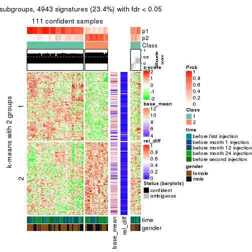</p>

</div>
<div id='tab-CV-mclust-get-signatures-2'>
<pre><code class="r">get_signatures(res, k = 3)
</code></pre>

<p></p>

</div>
<div id='tab-CV-mclust-get-signatures-3'>
<pre><code class="r">get_signatures(res, k = 4)
</code></pre>

<p></p>

</div>
<div id='tab-CV-mclust-get-signatures-4'>
<pre><code class="r">get_signatures(res, k = 5)
</code></pre>

<p></p>

</div>
<div id='tab-CV-mclust-get-signatures-5'>
<pre><code class="r">get_signatures(res, k = 6)
</code></pre>

<p></p>

</div>
</div>


Signature heatmaps where rows are not scaled:


<script>
$( function() {
	$( '#tabs-CV-mclust-get-signatures-no-scale' ).tabs();
} );
</script>
<div id='tabs-CV-mclust-get-signatures-no-scale'>
<ul>
<li><a href='#tab-CV-mclust-get-signatures-no-scale-1'>k = 2</a></li>
<li><a href='#tab-CV-mclust-get-signatures-no-scale-2'>k = 3</a></li>
<li><a href='#tab-CV-mclust-get-signatures-no-scale-3'>k = 4</a></li>
<li><a href='#tab-CV-mclust-get-signatures-no-scale-4'>k = 5</a></li>
<li><a href='#tab-CV-mclust-get-signatures-no-scale-5'>k = 6</a></li>
</ul>
<div id='tab-CV-mclust-get-signatures-no-scale-1'>
<pre><code class="r">get_signatures(res, k = 2, scale_rows = FALSE)
</code></pre>

<p></p>

</div>
<div id='tab-CV-mclust-get-signatures-no-scale-2'>
<pre><code class="r">get_signatures(res, k = 3, scale_rows = FALSE)
</code></pre>

<p></p>

</div>
<div id='tab-CV-mclust-get-signatures-no-scale-3'>
<pre><code class="r">get_signatures(res, k = 4, scale_rows = FALSE)
</code></pre>

<p></p>

</div>
<div id='tab-CV-mclust-get-signatures-no-scale-4'>
<pre><code class="r">get_signatures(res, k = 5, scale_rows = FALSE)
</code></pre>

<p></p>

</div>
<div id='tab-CV-mclust-get-signatures-no-scale-5'>
<pre><code class="r">get_signatures(res, k = 6, scale_rows = FALSE)
</code></pre>

<p></p>

</div>
</div>


Compare the overlap of signatures from different k:

```r
compare_signatures(res)
```


`get_signature()` returns a data frame invisibly. TO get the list of signatures, the function
call should be assigned to a variable explicitly. In following code, if `plot` argument is set
to `FALSE`, no heatmap is plotted while only the differential analysis is performed.

```r
# code only for demonstration
tb = get_signature(res, k = ..., plot = FALSE)
```

An example of the output of `tb` is:

```
#>   which_row         fdr    mean_1    mean_2 scaled_mean_1 scaled_mean_2 km
#> 1        38 0.042760348  8.373488  9.131774    -0.5533452     0.5164555  1
#> 2        40 0.018707592  7.106213  8.469186    -0.6173731     0.5762149  1
#> 3        55 0.019134737 10.221463 11.207825    -0.6159697     0.5749050  1
#> 4        59 0.006059896  5.921854  7.869574    -0.6899429     0.6439467  1
#> 5        60 0.018055526  8.928898 10.211722    -0.6204761     0.5791110  1
#> 6        98 0.009384629 15.714769 14.887706     0.6635654    -0.6193277  2
...
```

The columns in `tb` are:

1. `which_row`: row indices corresponding to the input matrix.
2. `fdr`: FDR for the differential test. 
3. `mean_x`: The mean value in group x.
4. `scaled_mean_x`: The mean value in group x after rows are scaled.
5. `km`: Row groups if k-means clustering is applied to rows.


UMAP plot which shows how samples are separated.


<script>
$( function() {
	$( '#tabs-CV-mclust-dimension-reduction' ).tabs();
} );
</script>
<div id='tabs-CV-mclust-dimension-reduction'>
<ul>
<li><a href='#tab-CV-mclust-dimension-reduction-1'>k = 2</a></li>
<li><a href='#tab-CV-mclust-dimension-reduction-2'>k = 3</a></li>
<li><a href='#tab-CV-mclust-dimension-reduction-3'>k = 4</a></li>
<li><a href='#tab-CV-mclust-dimension-reduction-4'>k = 5</a></li>
<li><a href='#tab-CV-mclust-dimension-reduction-5'>k = 6</a></li>
</ul>
<div id='tab-CV-mclust-dimension-reduction-1'>
<pre><code class="r">dimension_reduction(res, k = 2, method = &quot;UMAP&quot;)
</code></pre>

<p></p>

</div>
<div id='tab-CV-mclust-dimension-reduction-2'>
<pre><code class="r">dimension_reduction(res, k = 3, method = &quot;UMAP&quot;)
</code></pre>

<p></p>

</div>
<div id='tab-CV-mclust-dimension-reduction-3'>
<pre><code class="r">dimension_reduction(res, k = 4, method = &quot;UMAP&quot;)
</code></pre>

<p></p>

</div>
<div id='tab-CV-mclust-dimension-reduction-4'>
<pre><code class="r">dimension_reduction(res, k = 5, method = &quot;UMAP&quot;)
</code></pre>

<p></p>

</div>
<div id='tab-CV-mclust-dimension-reduction-5'>
<pre><code class="r">dimension_reduction(res, k = 6, method = &quot;UMAP&quot;)
</code></pre>

<p></p>

</div>
</div>


Following heatmap shows how subgroups are split when increasing `k`:

```r
collect_classes(res)
```


Test correlation between subgroups and known annotations. If the known
annotation is numeric, one-way ANOVA test is applied, and if the known
annotation is discrete, chi-squared contingency table test is applied.

```r
test_to_known_factors(res)
```

```
#>             n time(p) gender(p) k
#> CV:mclust 111   0.752   0.03012 2
#> CV:mclust 121   0.602   0.38016 3
#> CV:mclust  93   0.498   0.00556 4
#> CV:mclust  99   0.597   0.00150 5
#> CV:mclust 100   0.865   0.05616 6
```


If matrix rows can be associated to genes, consider to use `GO_Enrichment(res,
...)` to perform function enrichment for the signature genes.


 

---------------------------------------------------


### CV:NMF


The object with results only for a single top-value method and a single partition method 
can be extracted as:

```r
res = res_list["CV", "NMF"]
# you can also extract it by
# res = res_list["CV:NMF"]
```

A summary of `res` and all the functions that can be applied to it:

```r
res
```

```
#> A 'ConsensusPartition' object with k = 2, 3, 4, 5, 6.
#>   On a matrix with 21168 rows and 125 columns.
#>   Top rows (1000, 2000, 3000, 4000, 5000) are extracted by 'CV' method.
#>   Subgroups are detected by 'NMF' method.
#>   Performed in total 1250 partitions by row resampling.
#>   Best k for subgroups seems to be 2.
#> 
#> Following methods can be applied to this 'ConsensusPartition' object:
#>  [1] "cola_report"             "collect_classes"         "collect_plots"          
#>  [4] "collect_stats"           "colnames"                "compare_signatures"     
#>  [7] "consensus_heatmap"       "dimension_reduction"     "functional_enrichment"  
#> [10] "get_anno_col"            "get_anno"                "get_classes"            
#> [13] "get_consensus"           "get_matrix"              "get_membership"         
#> [16] "get_param"               "get_signatures"          "get_stats"              
#> [19] "is_best_k"               "is_stable_k"             "membership_heatmap"     
#> [22] "ncol"                    "nrow"                    "plot_ecdf"              
#> [25] "rownames"                "select_partition_number" "show"                   
#> [28] "suggest_best_k"          "test_to_known_factors"
```

`collect_plots()` function collects all the plots made from `res` for all `k` (number of partitions)
into one single page to provide an easy and fast comparison between different `k`.

```r
collect_plots(res)
```


The plots are:

- The first row: a plot of the ECDF (Empirical cumulative distribution
  function) curves of the consensus matrix for each `k` and the heatmap of
  predicted classes for each `k`.
- The second row: heatmaps of the consensus matrix for each `k`.
- The third row: heatmaps of the membership matrix for each `k`.
- The fouth row: heatmaps of the signatures for each `k`.

All the plots in panels can be made by individual functions and they are
plotted later in this section.

`select_partition_number()` produces several plots showing different
statistics for choosing "optimized" `k`. There are following statistics:

- ECDF curves of the consensus matrix for each `k`;
- 1-PAC. [The PAC
  score](https://en.wikipedia.org/wiki/Consensus_clustering#Over-interpretation_potential_of_consensus_clustering)
  measures the proportion of the ambiguous subgrouping.
- Mean silhouette score.
- Concordance. The mean probability of fiting the consensus class ids in all
  partitions.
- Area increased. Denote $A_k$ as the area under the ECDF curve for current
  `k`, the area increased is defined as $A_k - A_{k-1}$.
- Rand index. The percent of pairs of samples that are both in a same cluster
  or both are not in a same cluster in the partition of k and k-1.
- Jaccard index. The ratio of pairs of samples are both in a same cluster in
  the partition of k and k-1 and the pairs of samples are both in a same
  cluster in the partition k or k-1.

The detailed explanations of these statistics can be found in [the cola
vignette](http://bioconductor.org/packages/devel/bioc/vignettes/cola/inst/doc/cola.html#toc_13).

Generally speaking, lower PAC score, higher mean silhouette score or higher
concordance corresponds to better partition. Rand index and Jaccard index
measure how similar the current partition is compared to partition with `k-1`.
If they are too similar, we won't accept `k` is better than `k-1`.

```r
select_partition_number(res)
```


The numeric values for all these statistics can be obtained by `get_stats()`.

```r
get_stats(res)
```

```
#>   k 1-PAC mean_silhouette concordance area_increased  Rand Jaccard
#> 2 2 0.881           0.911       0.961         0.5017 0.496   0.496
#> 3 3 0.455           0.624       0.753         0.3042 0.796   0.611
#> 4 4 0.412           0.505       0.700         0.1310 0.818   0.534
#> 5 5 0.486           0.415       0.593         0.0706 0.911   0.684
#> 6 6 0.522           0.330       0.526         0.0452 0.858   0.466
```

`suggest_best_k()` suggests the best $k$ based on these statistics. The rules are as follows:

- All $k$ with Jaccard index larger than 0.95 are removed because the increase of
  the partition number does not provides enough extra information. If all $k$ are removed,
  the best $k$ is assigned by `NA`.
- For $k$ with 1-PAC larger than 0.9, the maximal $k$ is taken as the "best k". Other $k$ is called "optional k".
- If it does not fit the second rule. The $k$ with the highest vote of highest
  1-PAC, mean silhouette and concordance is taken as the "best k".

```r
suggest_best_k(res)
```

```
#> [1] 2
```


Following shows the table of the partitions (You need to click the **show/hide
code output** link to see it). The membership matrix (columns with name `p*`)
is inferred by
[`clue::cl_consensus()`](https://www.rdocumentation.org/link/cl_consensus?package=clue)
function with the `SE` method. Basically the value in the membership matrix
represents the probability to belong to a certain group. The finall class
label for an item is determined with the group with highest probability it
belongs to.

In `get_classes()` function, the entropy is calculated from the membership
matrix and the silhouette score is calculated from the consensus matrix.


<script>
$( function() {
	$( '#tabs-CV-NMF-get-classes' ).tabs();
} );
</script>
<div id='tabs-CV-NMF-get-classes'>
<ul>
<li><a href='#tab-CV-NMF-get-classes-1'>k = 2</a></li>
<li><a href='#tab-CV-NMF-get-classes-2'>k = 3</a></li>
<li><a href='#tab-CV-NMF-get-classes-3'>k = 4</a></li>
<li><a href='#tab-CV-NMF-get-classes-4'>k = 5</a></li>
<li><a href='#tab-CV-NMF-get-classes-5'>k = 6</a></li>
</ul>

<div id='tab-CV-NMF-get-classes-1'>
<p><a id='tab-CV-NMF-get-classes-1-a' style='color:#0366d6' href='#'>show/hide code output</a></p>
<pre><code class="r">cbind(get_classes(res, k = 2), get_membership(res, k = 2))
</code></pre>

<pre><code>#&gt;           class entropy silhouette    p1    p2
#&gt; GSM601752     2  0.0000      0.979 0.000 1.000
#&gt; GSM601782     1  0.0000      0.939 1.000 0.000
#&gt; GSM601792     1  0.0000      0.939 1.000 0.000
#&gt; GSM601797     2  0.2043      0.954 0.032 0.968
#&gt; GSM601827     1  0.0000      0.939 1.000 0.000
#&gt; GSM601837     2  0.0000      0.979 0.000 1.000
#&gt; GSM601842     2  0.0000      0.979 0.000 1.000
#&gt; GSM601857     1  0.0000      0.939 1.000 0.000
#&gt; GSM601867     2  0.4298      0.897 0.088 0.912
#&gt; GSM601747     1  0.8144      0.672 0.748 0.252
#&gt; GSM601757     1  0.0000      0.939 1.000 0.000
#&gt; GSM601762     2  0.0000      0.979 0.000 1.000
#&gt; GSM601767     2  0.0000      0.979 0.000 1.000
#&gt; GSM601772     2  0.0000      0.979 0.000 1.000
#&gt; GSM601777     2  0.5178      0.864 0.116 0.884
#&gt; GSM601787     2  0.0672      0.973 0.008 0.992
#&gt; GSM601802     2  0.0000      0.979 0.000 1.000
#&gt; GSM601807     1  0.9686      0.411 0.604 0.396
#&gt; GSM601812     1  0.0000      0.939 1.000 0.000
#&gt; GSM601817     1  0.0000      0.939 1.000 0.000
#&gt; GSM601822     2  0.7056      0.764 0.192 0.808
#&gt; GSM601832     2  0.0376      0.976 0.004 0.996
#&gt; GSM601847     2  0.0000      0.979 0.000 1.000
#&gt; GSM601852     1  0.0000      0.939 1.000 0.000
#&gt; GSM601862     1  0.0000      0.939 1.000 0.000
#&gt; GSM601753     2  0.0000      0.979 0.000 1.000
#&gt; GSM601783     1  0.0000      0.939 1.000 0.000
#&gt; GSM601793     1  0.0000      0.939 1.000 0.000
#&gt; GSM601798     2  0.0000      0.979 0.000 1.000
#&gt; GSM601828     1  0.0000      0.939 1.000 0.000
#&gt; GSM601838     2  0.0000      0.979 0.000 1.000
#&gt; GSM601843     2  0.0000      0.979 0.000 1.000
#&gt; GSM601858     2  0.0000      0.979 0.000 1.000
#&gt; GSM601868     1  0.0376      0.937 0.996 0.004
#&gt; GSM601748     1  0.0000      0.939 1.000 0.000
#&gt; GSM601758     1  0.0000      0.939 1.000 0.000
#&gt; GSM601763     1  0.9866      0.267 0.568 0.432
#&gt; GSM601768     2  0.0000      0.979 0.000 1.000
#&gt; GSM601773     2  0.0000      0.979 0.000 1.000
#&gt; GSM601778     1  0.9209      0.526 0.664 0.336
#&gt; GSM601788     2  0.1184      0.967 0.016 0.984
#&gt; GSM601803     2  0.0000      0.979 0.000 1.000
#&gt; GSM601808     1  0.0000      0.939 1.000 0.000
#&gt; GSM601813     1  0.0000      0.939 1.000 0.000
#&gt; GSM601818     1  0.0000      0.939 1.000 0.000
#&gt; GSM601823     1  0.0000      0.939 1.000 0.000
#&gt; GSM601833     2  0.0000      0.979 0.000 1.000
#&gt; GSM601848     1  0.0000      0.939 1.000 0.000
#&gt; GSM601853     1  0.0000      0.939 1.000 0.000
#&gt; GSM601863     1  0.0000      0.939 1.000 0.000
#&gt; GSM601754     2  0.0000      0.979 0.000 1.000
#&gt; GSM601784     2  0.0000      0.979 0.000 1.000
#&gt; GSM601794     1  0.3274      0.895 0.940 0.060
#&gt; GSM601799     2  0.0000      0.979 0.000 1.000
#&gt; GSM601829     1  0.0000      0.939 1.000 0.000
#&gt; GSM601839     2  0.0000      0.979 0.000 1.000
#&gt; GSM601844     1  0.1414      0.927 0.980 0.020
#&gt; GSM601859     2  0.0000      0.979 0.000 1.000
#&gt; GSM601869     1  0.0000      0.939 1.000 0.000
#&gt; GSM601749     1  0.0000      0.939 1.000 0.000
#&gt; GSM601759     1  0.0000      0.939 1.000 0.000
#&gt; GSM601764     1  0.0000      0.939 1.000 0.000
#&gt; GSM601769     2  0.0000      0.979 0.000 1.000
#&gt; GSM601774     2  0.0000      0.979 0.000 1.000
#&gt; GSM601779     1  0.0000      0.939 1.000 0.000
#&gt; GSM601789     2  0.0000      0.979 0.000 1.000
#&gt; GSM601804     2  0.0938      0.970 0.012 0.988
#&gt; GSM601809     1  0.9933      0.242 0.548 0.452
#&gt; GSM601814     2  0.0000      0.979 0.000 1.000
#&gt; GSM601819     1  0.0000      0.939 1.000 0.000
#&gt; GSM601824     2  0.4562      0.890 0.096 0.904
#&gt; GSM601834     2  0.0000      0.979 0.000 1.000
#&gt; GSM601849     1  0.0000      0.939 1.000 0.000
#&gt; GSM601854     1  0.0000      0.939 1.000 0.000
#&gt; GSM601864     2  0.0000      0.979 0.000 1.000
#&gt; GSM601755     2  0.0000      0.979 0.000 1.000
#&gt; GSM601785     2  0.0000      0.979 0.000 1.000
#&gt; GSM601795     1  0.9922      0.259 0.552 0.448
#&gt; GSM601800     2  0.0000      0.979 0.000 1.000
#&gt; GSM601830     1  0.4298      0.871 0.912 0.088
#&gt; GSM601840     2  0.0376      0.976 0.004 0.996
#&gt; GSM601845     2  0.5294      0.858 0.120 0.880
#&gt; GSM601860     2  0.0000      0.979 0.000 1.000
#&gt; GSM601870     1  0.8813      0.604 0.700 0.300
#&gt; GSM601750     1  0.0000      0.939 1.000 0.000
#&gt; GSM601760     1  0.0000      0.939 1.000 0.000
#&gt; GSM601765     2  0.0000      0.979 0.000 1.000
#&gt; GSM601770     2  0.0000      0.979 0.000 1.000
#&gt; GSM601775     2  0.7745      0.705 0.228 0.772
#&gt; GSM601780     1  0.0000      0.939 1.000 0.000
#&gt; GSM601790     2  0.0000      0.979 0.000 1.000
#&gt; GSM601805     2  0.0000      0.979 0.000 1.000
#&gt; GSM601810     1  0.0000      0.939 1.000 0.000
#&gt; GSM601815     2  0.0000      0.979 0.000 1.000
#&gt; GSM601820     1  0.0000      0.939 1.000 0.000
#&gt; GSM601825     2  0.0000      0.979 0.000 1.000
#&gt; GSM601835     2  0.0000      0.979 0.000 1.000
#&gt; GSM601850     1  0.9580      0.444 0.620 0.380
#&gt; GSM601855     1  0.0000      0.939 1.000 0.000
#&gt; GSM601865     2  0.0000      0.979 0.000 1.000
#&gt; GSM601756     2  0.0000      0.979 0.000 1.000
#&gt; GSM601786     2  0.0000      0.979 0.000 1.000
#&gt; GSM601796     1  0.0000      0.939 1.000 0.000
#&gt; GSM601801     2  0.0000      0.979 0.000 1.000
#&gt; GSM601831     1  0.0000      0.939 1.000 0.000
#&gt; GSM601841     1  0.0376      0.937 0.996 0.004
#&gt; GSM601846     2  0.0000      0.979 0.000 1.000
#&gt; GSM601861     2  0.0000      0.979 0.000 1.000
#&gt; GSM601871     2  0.0672      0.973 0.008 0.992
#&gt; GSM601751     2  0.4022      0.908 0.080 0.920
#&gt; GSM601761     1  0.0000      0.939 1.000 0.000
#&gt; GSM601766     2  0.7745      0.704 0.228 0.772
#&gt; GSM601771     2  0.0000      0.979 0.000 1.000
#&gt; GSM601776     1  0.0000      0.939 1.000 0.000
#&gt; GSM601781     1  0.9358      0.510 0.648 0.352
#&gt; GSM601791     1  0.0672      0.934 0.992 0.008
#&gt; GSM601806     2  0.0000      0.979 0.000 1.000
#&gt; GSM601811     1  0.1184      0.929 0.984 0.016
#&gt; GSM601816     1  0.0672      0.934 0.992 0.008
#&gt; GSM601821     2  0.0000      0.979 0.000 1.000
#&gt; GSM601826     1  0.0000      0.939 1.000 0.000
#&gt; GSM601836     1  0.3431      0.891 0.936 0.064
#&gt; GSM601851     1  0.0000      0.939 1.000 0.000
#&gt; GSM601856     1  0.0000      0.939 1.000 0.000
#&gt; GSM601866     1  0.0000      0.939 1.000 0.000
</code></pre>

<script>
$('#tab-CV-NMF-get-classes-1-a').parent().next().next().hide();
$('#tab-CV-NMF-get-classes-1-a').click(function(){
  $('#tab-CV-NMF-get-classes-1-a').parent().next().next().toggle();
  return(false);
});
</script>
</div>

<div id='tab-CV-NMF-get-classes-2'>
<p><a id='tab-CV-NMF-get-classes-2-a' style='color:#0366d6' href='#'>show/hide code output</a></p>
<pre><code class="r">cbind(get_classes(res, k = 3), get_membership(res, k = 3))
</code></pre>

<pre><code>#&gt;           class entropy silhouette    p1    p2    p3
#&gt; GSM601752     2  0.5722     0.6518 0.292 0.704 0.004
#&gt; GSM601782     3  0.5016     0.6895 0.240 0.000 0.760
#&gt; GSM601792     1  0.2599     0.7050 0.932 0.016 0.052
#&gt; GSM601797     2  0.5119     0.7788 0.152 0.816 0.032
#&gt; GSM601827     3  0.4842     0.6999 0.224 0.000 0.776
#&gt; GSM601837     2  0.5327     0.6049 0.000 0.728 0.272
#&gt; GSM601842     2  0.2636     0.7934 0.048 0.932 0.020
#&gt; GSM601857     3  0.2537     0.7362 0.080 0.000 0.920
#&gt; GSM601867     3  0.5291     0.5061 0.000 0.268 0.732
#&gt; GSM601747     1  0.8936     0.1915 0.500 0.132 0.368
#&gt; GSM601757     3  0.6260     0.4276 0.448 0.000 0.552
#&gt; GSM601762     2  0.2356     0.7609 0.000 0.928 0.072
#&gt; GSM601767     2  0.4452     0.7596 0.192 0.808 0.000
#&gt; GSM601772     2  0.3030     0.7960 0.092 0.904 0.004
#&gt; GSM601777     2  0.6521     0.0918 0.004 0.500 0.496
#&gt; GSM601787     3  0.5650     0.4257 0.000 0.312 0.688
#&gt; GSM601802     2  0.5138     0.7065 0.252 0.748 0.000
#&gt; GSM601807     3  0.4842     0.5619 0.000 0.224 0.776
#&gt; GSM601812     3  0.5016     0.6915 0.240 0.000 0.760
#&gt; GSM601817     3  0.4121     0.7257 0.168 0.000 0.832
#&gt; GSM601822     1  0.6260    -0.0166 0.552 0.448 0.000
#&gt; GSM601832     2  0.4931     0.7480 0.212 0.784 0.004
#&gt; GSM601847     2  0.6045     0.4968 0.380 0.620 0.000
#&gt; GSM601852     3  0.6225     0.4529 0.432 0.000 0.568
#&gt; GSM601862     3  0.2165     0.7336 0.064 0.000 0.936
#&gt; GSM601753     2  0.5517     0.6862 0.268 0.728 0.004
#&gt; GSM601783     1  0.5216     0.4169 0.740 0.000 0.260
#&gt; GSM601793     1  0.4172     0.5984 0.840 0.004 0.156
#&gt; GSM601798     2  0.3499     0.7952 0.072 0.900 0.028
#&gt; GSM601828     3  0.5560     0.6393 0.300 0.000 0.700
#&gt; GSM601838     2  0.4002     0.7099 0.000 0.840 0.160
#&gt; GSM601843     2  0.2356     0.7634 0.000 0.928 0.072
#&gt; GSM601858     2  0.6008     0.4330 0.000 0.628 0.372
#&gt; GSM601868     3  0.2318     0.7084 0.028 0.028 0.944
#&gt; GSM601748     3  0.5591     0.6364 0.304 0.000 0.696
#&gt; GSM601758     1  0.5678     0.2815 0.684 0.000 0.316
#&gt; GSM601763     1  0.4887     0.5603 0.772 0.228 0.000
#&gt; GSM601768     2  0.5291     0.6907 0.268 0.732 0.000
#&gt; GSM601773     2  0.3192     0.7916 0.112 0.888 0.000
#&gt; GSM601778     1  0.8309     0.5389 0.632 0.188 0.180
#&gt; GSM601788     2  0.3845     0.7442 0.012 0.872 0.116
#&gt; GSM601803     2  0.4178     0.7720 0.172 0.828 0.000
#&gt; GSM601808     3  0.2066     0.7324 0.060 0.000 0.940
#&gt; GSM601813     1  0.6286    -0.2168 0.536 0.000 0.464
#&gt; GSM601818     3  0.2625     0.7364 0.084 0.000 0.916
#&gt; GSM601823     1  0.1878     0.7139 0.952 0.044 0.004
#&gt; GSM601833     2  0.2860     0.7954 0.084 0.912 0.004
#&gt; GSM601848     1  0.1182     0.7139 0.976 0.012 0.012
#&gt; GSM601853     3  0.2590     0.7348 0.072 0.004 0.924
#&gt; GSM601863     3  0.3551     0.7348 0.132 0.000 0.868
#&gt; GSM601754     2  0.5553     0.6812 0.272 0.724 0.004
#&gt; GSM601784     2  0.1129     0.7803 0.004 0.976 0.020
#&gt; GSM601794     1  0.5497     0.6503 0.812 0.064 0.124
#&gt; GSM601799     2  0.5982     0.5966 0.328 0.668 0.004
#&gt; GSM601829     3  0.6244     0.4328 0.440 0.000 0.560
#&gt; GSM601839     2  0.5098     0.6321 0.000 0.752 0.248
#&gt; GSM601844     1  0.4371     0.6667 0.860 0.032 0.108
#&gt; GSM601859     2  0.4291     0.7674 0.180 0.820 0.000
#&gt; GSM601869     3  0.3551     0.7344 0.132 0.000 0.868
#&gt; GSM601749     1  0.5968     0.1385 0.636 0.000 0.364
#&gt; GSM601759     3  0.6252     0.4298 0.444 0.000 0.556
#&gt; GSM601764     1  0.2229     0.7160 0.944 0.044 0.012
#&gt; GSM601769     2  0.1267     0.7882 0.024 0.972 0.004
#&gt; GSM601774     2  0.2496     0.7951 0.068 0.928 0.004
#&gt; GSM601779     1  0.2959     0.6944 0.900 0.100 0.000
#&gt; GSM601789     2  0.3340     0.7362 0.000 0.880 0.120
#&gt; GSM601804     2  0.6305     0.2225 0.484 0.516 0.000
#&gt; GSM601809     3  0.4504     0.5860 0.000 0.196 0.804
#&gt; GSM601814     2  0.0747     0.7870 0.016 0.984 0.000
#&gt; GSM601819     1  0.4702     0.5020 0.788 0.000 0.212
#&gt; GSM601824     1  0.6008     0.2525 0.628 0.372 0.000
#&gt; GSM601834     2  0.3116     0.7924 0.108 0.892 0.000
#&gt; GSM601849     1  0.1950     0.7013 0.952 0.008 0.040
#&gt; GSM601854     3  0.6126     0.5109 0.400 0.000 0.600
#&gt; GSM601864     2  0.5497     0.5713 0.000 0.708 0.292
#&gt; GSM601755     2  0.4521     0.7668 0.180 0.816 0.004
#&gt; GSM601785     2  0.4033     0.7856 0.136 0.856 0.008
#&gt; GSM601795     1  0.5763     0.5285 0.716 0.276 0.008
#&gt; GSM601800     2  0.5158     0.7236 0.232 0.764 0.004
#&gt; GSM601830     3  0.3192     0.6445 0.000 0.112 0.888
#&gt; GSM601840     2  0.4682     0.7566 0.192 0.804 0.004
#&gt; GSM601845     2  0.7728     0.6008 0.276 0.640 0.084
#&gt; GSM601860     2  0.3375     0.7945 0.100 0.892 0.008
#&gt; GSM601870     3  0.4796     0.5651 0.000 0.220 0.780
#&gt; GSM601750     3  0.5785     0.6055 0.332 0.000 0.668
#&gt; GSM601760     1  0.4974     0.4578 0.764 0.000 0.236
#&gt; GSM601765     2  0.4784     0.7572 0.200 0.796 0.004
#&gt; GSM601770     2  0.4465     0.7720 0.176 0.820 0.004
#&gt; GSM601775     1  0.6280    -0.0714 0.540 0.460 0.000
#&gt; GSM601780     1  0.2625     0.7013 0.916 0.084 0.000
#&gt; GSM601790     2  0.3340     0.7354 0.000 0.880 0.120
#&gt; GSM601805     2  0.4178     0.7713 0.172 0.828 0.000
#&gt; GSM601810     3  0.3551     0.7347 0.132 0.000 0.868
#&gt; GSM601815     2  0.2959     0.7459 0.000 0.900 0.100
#&gt; GSM601820     3  0.6235     0.4484 0.436 0.000 0.564
#&gt; GSM601825     2  0.3816     0.7824 0.148 0.852 0.000
#&gt; GSM601835     2  0.5327     0.6004 0.000 0.728 0.272
#&gt; GSM601850     1  0.5138     0.5372 0.748 0.252 0.000
#&gt; GSM601855     3  0.2711     0.6602 0.000 0.088 0.912
#&gt; GSM601865     2  0.5905     0.4705 0.000 0.648 0.352
#&gt; GSM601756     2  0.3715     0.7883 0.128 0.868 0.004
#&gt; GSM601786     2  0.5431     0.5881 0.000 0.716 0.284
#&gt; GSM601796     1  0.4047     0.6132 0.848 0.004 0.148
#&gt; GSM601801     2  0.2173     0.7940 0.048 0.944 0.008
#&gt; GSM601831     3  0.4346     0.7193 0.184 0.000 0.816
#&gt; GSM601841     3  0.6771     0.3746 0.440 0.012 0.548
#&gt; GSM601846     2  0.4963     0.6860 0.008 0.792 0.200
#&gt; GSM601861     2  0.2066     0.7642 0.000 0.940 0.060
#&gt; GSM601871     3  0.5706     0.4088 0.000 0.320 0.680
#&gt; GSM601751     2  0.5443     0.7077 0.260 0.736 0.004
#&gt; GSM601761     1  0.2301     0.6850 0.936 0.004 0.060
#&gt; GSM601766     1  0.6625     0.0182 0.552 0.440 0.008
#&gt; GSM601771     2  0.2796     0.7945 0.092 0.908 0.000
#&gt; GSM601776     1  0.1315     0.7107 0.972 0.008 0.020
#&gt; GSM601781     1  0.5551     0.5952 0.760 0.224 0.016
#&gt; GSM601791     1  0.2229     0.7163 0.944 0.044 0.012
#&gt; GSM601806     2  0.1753     0.7933 0.048 0.952 0.000
#&gt; GSM601811     3  0.2947     0.7267 0.060 0.020 0.920
#&gt; GSM601816     1  0.3028     0.7100 0.920 0.032 0.048
#&gt; GSM601821     2  0.2448     0.7576 0.000 0.924 0.076
#&gt; GSM601826     1  0.1399     0.7155 0.968 0.028 0.004
#&gt; GSM601836     1  0.4658     0.7074 0.856 0.076 0.068
#&gt; GSM601851     1  0.1620     0.7113 0.964 0.012 0.024
#&gt; GSM601856     3  0.2066     0.7328 0.060 0.000 0.940
#&gt; GSM601866     3  0.4796     0.7039 0.220 0.000 0.780
</code></pre>

<script>
$('#tab-CV-NMF-get-classes-2-a').parent().next().next().hide();
$('#tab-CV-NMF-get-classes-2-a').click(function(){
  $('#tab-CV-NMF-get-classes-2-a').parent().next().next().toggle();
  return(false);
});
</script>
</div>

<div id='tab-CV-NMF-get-classes-3'>
<p><a id='tab-CV-NMF-get-classes-3-a' style='color:#0366d6' href='#'>show/hide code output</a></p>
<pre><code class="r">cbind(get_classes(res, k = 4), get_membership(res, k = 4))
</code></pre>

<pre><code>#&gt;           class entropy silhouette    p1    p2    p3    p4
#&gt; GSM601752     4   0.440     0.6498 0.076 0.112 0.000 0.812
#&gt; GSM601782     3   0.667     0.5128 0.332 0.032 0.592 0.044
#&gt; GSM601792     4   0.560     0.1821 0.408 0.000 0.024 0.568
#&gt; GSM601797     4   0.259     0.6139 0.012 0.028 0.040 0.920
#&gt; GSM601827     3   0.722     0.5811 0.172 0.020 0.612 0.196
#&gt; GSM601837     2   0.717     0.5366 0.012 0.572 0.128 0.288
#&gt; GSM601842     2   0.381     0.6781 0.008 0.804 0.000 0.188
#&gt; GSM601857     3   0.440     0.6830 0.120 0.008 0.820 0.052
#&gt; GSM601867     3   0.697     0.4672 0.012 0.168 0.624 0.196
#&gt; GSM601747     2   0.761     0.2516 0.268 0.556 0.152 0.024
#&gt; GSM601757     1   0.657    -0.1124 0.520 0.068 0.408 0.004
#&gt; GSM601762     2   0.332     0.7194 0.008 0.872 0.016 0.104
#&gt; GSM601767     2   0.428     0.6909 0.076 0.820 0.000 0.104
#&gt; GSM601772     2   0.275     0.6972 0.072 0.904 0.004 0.020
#&gt; GSM601777     4   0.692     0.4055 0.016 0.152 0.196 0.636
#&gt; GSM601787     3   0.673     0.3697 0.012 0.288 0.608 0.092
#&gt; GSM601802     4   0.605     0.5863 0.100 0.232 0.000 0.668
#&gt; GSM601807     3   0.650     0.4941 0.012 0.108 0.660 0.220
#&gt; GSM601812     3   0.574     0.5839 0.280 0.036 0.672 0.012
#&gt; GSM601817     3   0.584     0.6445 0.196 0.064 0.720 0.020
#&gt; GSM601822     4   0.716     0.4495 0.284 0.140 0.008 0.568
#&gt; GSM601832     2   0.413     0.6721 0.108 0.828 0.000 0.064
#&gt; GSM601847     4   0.646     0.6004 0.156 0.200 0.000 0.644
#&gt; GSM601852     3   0.601     0.3095 0.456 0.016 0.512 0.016
#&gt; GSM601862     3   0.318     0.6849 0.068 0.024 0.892 0.016
#&gt; GSM601753     4   0.610     0.5751 0.108 0.224 0.000 0.668
#&gt; GSM601783     1   0.486     0.4286 0.768 0.004 0.184 0.044
#&gt; GSM601793     4   0.621     0.1166 0.404 0.000 0.056 0.540
#&gt; GSM601798     4   0.322     0.5985 0.000 0.164 0.000 0.836
#&gt; GSM601828     3   0.629     0.5068 0.352 0.008 0.588 0.052
#&gt; GSM601838     2   0.628     0.5861 0.008 0.624 0.064 0.304
#&gt; GSM601843     2   0.405     0.6846 0.000 0.796 0.016 0.188
#&gt; GSM601858     2   0.609     0.6274 0.016 0.716 0.136 0.132
#&gt; GSM601868     3   0.330     0.6762 0.032 0.016 0.888 0.064
#&gt; GSM601748     3   0.542     0.5614 0.304 0.016 0.668 0.012
#&gt; GSM601758     1   0.507     0.2256 0.664 0.016 0.320 0.000
#&gt; GSM601763     1   0.628     0.3827 0.616 0.316 0.008 0.060
#&gt; GSM601768     2   0.391     0.6531 0.148 0.824 0.000 0.028
#&gt; GSM601773     2   0.391     0.6923 0.024 0.820 0.000 0.156
#&gt; GSM601778     4   0.677     0.4978 0.132 0.056 0.120 0.692
#&gt; GSM601788     2   0.584     0.6639 0.016 0.716 0.068 0.200
#&gt; GSM601803     4   0.593     0.4969 0.064 0.296 0.000 0.640
#&gt; GSM601808     3   0.263     0.6828 0.032 0.020 0.920 0.028
#&gt; GSM601813     1   0.591    -0.1065 0.536 0.004 0.432 0.028
#&gt; GSM601818     3   0.667     0.6064 0.180 0.152 0.656 0.012
#&gt; GSM601823     1   0.454     0.4936 0.760 0.024 0.000 0.216
#&gt; GSM601833     2   0.258     0.7152 0.036 0.912 0.000 0.052
#&gt; GSM601848     1   0.475     0.3744 0.688 0.000 0.008 0.304
#&gt; GSM601853     3   0.316     0.6846 0.052 0.016 0.896 0.036
#&gt; GSM601863     3   0.414     0.6734 0.140 0.028 0.824 0.008
#&gt; GSM601754     4   0.461     0.6393 0.064 0.144 0.000 0.792
#&gt; GSM601784     2   0.407     0.6617 0.000 0.748 0.000 0.252
#&gt; GSM601794     4   0.507     0.4566 0.200 0.000 0.056 0.744
#&gt; GSM601799     4   0.650     0.6101 0.160 0.200 0.000 0.640
#&gt; GSM601829     3   0.809     0.1460 0.252 0.008 0.388 0.352
#&gt; GSM601839     2   0.628     0.6207 0.008 0.676 0.108 0.208
#&gt; GSM601844     1   0.616     0.3707 0.616 0.012 0.044 0.328
#&gt; GSM601859     2   0.549     0.6519 0.052 0.688 0.000 0.260
#&gt; GSM601869     3   0.519     0.6665 0.160 0.004 0.760 0.076
#&gt; GSM601749     1   0.475     0.2490 0.688 0.000 0.304 0.008
#&gt; GSM601759     1   0.641    -0.1344 0.516 0.048 0.428 0.008
#&gt; GSM601764     1   0.594     0.4347 0.624 0.332 0.032 0.012
#&gt; GSM601769     2   0.222     0.7199 0.016 0.924 0.000 0.060
#&gt; GSM601774     2   0.259     0.7137 0.044 0.912 0.000 0.044
#&gt; GSM601779     1   0.509     0.4355 0.728 0.044 0.000 0.228
#&gt; GSM601789     2   0.300     0.7150 0.008 0.900 0.052 0.040
#&gt; GSM601804     4   0.722     0.4429 0.316 0.164 0.000 0.520
#&gt; GSM601809     3   0.749     0.3340 0.064 0.344 0.536 0.056
#&gt; GSM601814     2   0.448     0.6129 0.008 0.728 0.000 0.264
#&gt; GSM601819     1   0.581     0.4631 0.724 0.108 0.160 0.008
#&gt; GSM601824     1   0.738     0.0748 0.520 0.216 0.000 0.264
#&gt; GSM601834     2   0.306     0.7123 0.040 0.888 0.000 0.072
#&gt; GSM601849     1   0.434     0.6064 0.836 0.076 0.016 0.072
#&gt; GSM601854     3   0.552     0.4792 0.380 0.000 0.596 0.024
#&gt; GSM601864     2   0.790     0.3054 0.012 0.432 0.184 0.372
#&gt; GSM601755     4   0.415     0.6227 0.036 0.152 0.000 0.812
#&gt; GSM601785     2   0.552     0.6277 0.048 0.676 0.000 0.276
#&gt; GSM601795     4   0.482     0.4991 0.240 0.020 0.004 0.736
#&gt; GSM601800     4   0.444     0.6361 0.052 0.148 0.000 0.800
#&gt; GSM601830     3   0.517     0.6011 0.004 0.072 0.760 0.164
#&gt; GSM601840     2   0.667     0.4611 0.080 0.540 0.004 0.376
#&gt; GSM601845     2   0.794     0.2761 0.164 0.488 0.024 0.324
#&gt; GSM601860     2   0.568     0.6770 0.072 0.708 0.004 0.216
#&gt; GSM601870     3   0.537     0.5885 0.012 0.088 0.764 0.136
#&gt; GSM601750     3   0.535     0.5489 0.320 0.020 0.656 0.004
#&gt; GSM601760     1   0.586     0.4375 0.708 0.084 0.200 0.008
#&gt; GSM601765     2   0.350     0.6821 0.104 0.860 0.000 0.036
#&gt; GSM601770     2   0.284     0.6937 0.088 0.892 0.000 0.020
#&gt; GSM601775     2   0.697     0.0426 0.436 0.452 0.000 0.112
#&gt; GSM601780     1   0.496     0.5589 0.788 0.080 0.008 0.124
#&gt; GSM601790     2   0.365     0.7122 0.008 0.868 0.060 0.064
#&gt; GSM601805     4   0.572     0.4768 0.044 0.324 0.000 0.632
#&gt; GSM601810     3   0.353     0.6855 0.088 0.024 0.872 0.016
#&gt; GSM601815     2   0.542     0.6743 0.012 0.748 0.064 0.176
#&gt; GSM601820     3   0.514     0.3264 0.456 0.000 0.540 0.004
#&gt; GSM601825     4   0.620     0.1345 0.052 0.440 0.000 0.508
#&gt; GSM601835     2   0.554     0.6214 0.008 0.744 0.156 0.092
#&gt; GSM601850     1   0.699     0.0586 0.524 0.128 0.000 0.348
#&gt; GSM601855     3   0.417     0.6322 0.012 0.052 0.840 0.096
#&gt; GSM601865     2   0.621     0.6195 0.008 0.692 0.168 0.132
#&gt; GSM601756     4   0.408     0.5969 0.020 0.180 0.000 0.800
#&gt; GSM601786     2   0.666     0.6055 0.008 0.624 0.108 0.260
#&gt; GSM601796     4   0.609     0.2797 0.328 0.000 0.064 0.608
#&gt; GSM601801     4   0.405     0.5409 0.008 0.212 0.000 0.780
#&gt; GSM601831     3   0.575     0.6452 0.140 0.008 0.732 0.120
#&gt; GSM601841     4   0.778    -0.1412 0.268 0.000 0.304 0.428
#&gt; GSM601846     4   0.550     0.5085 0.012 0.132 0.100 0.756
#&gt; GSM601861     2   0.521     0.6120 0.004 0.680 0.020 0.296
#&gt; GSM601871     3   0.752     0.3275 0.012 0.192 0.552 0.244
#&gt; GSM601751     2   0.648     0.5637 0.096 0.640 0.008 0.256
#&gt; GSM601761     1   0.434     0.5905 0.836 0.076 0.072 0.016
#&gt; GSM601766     2   0.583     0.4586 0.272 0.676 0.024 0.028
#&gt; GSM601771     2   0.502     0.6899 0.056 0.772 0.008 0.164
#&gt; GSM601776     1   0.280     0.6103 0.908 0.028 0.008 0.056
#&gt; GSM601781     4   0.795     0.2166 0.356 0.180 0.016 0.448
#&gt; GSM601791     1   0.380     0.6146 0.868 0.060 0.024 0.048
#&gt; GSM601806     4   0.597     0.3320 0.032 0.368 0.008 0.592
#&gt; GSM601811     3   0.441     0.6771 0.068 0.072 0.836 0.024
#&gt; GSM601816     1   0.709     0.0999 0.500 0.056 0.032 0.412
#&gt; GSM601821     2   0.529     0.6370 0.004 0.708 0.036 0.252
#&gt; GSM601826     1   0.530     0.4629 0.720 0.044 0.004 0.232
#&gt; GSM601836     1   0.714     0.4271 0.572 0.320 0.076 0.032
#&gt; GSM601851     1   0.432     0.6083 0.840 0.056 0.024 0.080
#&gt; GSM601856     3   0.295     0.6718 0.024 0.016 0.904 0.056
#&gt; GSM601866     3   0.541     0.5727 0.296 0.028 0.672 0.004
</code></pre>

<script>
$('#tab-CV-NMF-get-classes-3-a').parent().next().next().hide();
$('#tab-CV-NMF-get-classes-3-a').click(function(){
  $('#tab-CV-NMF-get-classes-3-a').parent().next().next().toggle();
  return(false);
});
</script>
</div>

<div id='tab-CV-NMF-get-classes-4'>
<p><a id='tab-CV-NMF-get-classes-4-a' style='color:#0366d6' href='#'>show/hide code output</a></p>
<pre><code class="r">cbind(get_classes(res, k = 5), get_membership(res, k = 5))
</code></pre>

<pre><code>#&gt;           class entropy silhouette    p1    p2    p3    p4    p5
#&gt; GSM601752     4   0.441     0.6707 0.016 0.040 0.000 0.764 0.180
#&gt; GSM601782     3   0.701     0.2051 0.384 0.020 0.428 0.004 0.164
#&gt; GSM601792     4   0.656     0.5447 0.148 0.000 0.024 0.552 0.276
#&gt; GSM601797     4   0.521     0.5603 0.004 0.004 0.056 0.656 0.280
#&gt; GSM601827     5   0.544     0.2786 0.048 0.000 0.320 0.016 0.616
#&gt; GSM601837     2   0.675     0.5019 0.000 0.576 0.140 0.052 0.232
#&gt; GSM601842     2   0.629     0.2086 0.020 0.488 0.016 0.052 0.424
#&gt; GSM601857     3   0.531     0.4695 0.284 0.040 0.652 0.000 0.024
#&gt; GSM601867     3   0.590     0.3392 0.008 0.140 0.660 0.012 0.180
#&gt; GSM601747     2   0.815     0.1511 0.212 0.468 0.140 0.012 0.168
#&gt; GSM601757     1   0.462     0.3143 0.712 0.024 0.248 0.000 0.016
#&gt; GSM601762     2   0.576     0.5384 0.008 0.680 0.040 0.060 0.212
#&gt; GSM601767     2   0.437     0.6378 0.040 0.800 0.004 0.120 0.036
#&gt; GSM601772     2   0.456     0.5756 0.060 0.788 0.012 0.016 0.124
#&gt; GSM601777     4   0.730     0.3595 0.000 0.092 0.228 0.532 0.148
#&gt; GSM601787     3   0.638     0.2902 0.016 0.300 0.584 0.024 0.076
#&gt; GSM601802     4   0.273     0.6693 0.004 0.092 0.004 0.884 0.016
#&gt; GSM601807     3   0.578     0.2826 0.000 0.036 0.684 0.148 0.132
#&gt; GSM601812     3   0.692     0.2468 0.376 0.028 0.460 0.004 0.132
#&gt; GSM601817     3   0.730     0.1556 0.168 0.044 0.476 0.004 0.308
#&gt; GSM601822     4   0.513     0.6420 0.088 0.052 0.008 0.764 0.088
#&gt; GSM601832     2   0.677     0.2520 0.056 0.520 0.008 0.068 0.348
#&gt; GSM601847     4   0.341     0.6677 0.032 0.084 0.004 0.860 0.020
#&gt; GSM601852     1   0.722    -0.0182 0.440 0.020 0.304 0.004 0.232
#&gt; GSM601862     3   0.467     0.5214 0.188 0.032 0.748 0.000 0.032
#&gt; GSM601753     4   0.528     0.6558 0.020 0.116 0.000 0.716 0.148
#&gt; GSM601783     1   0.365     0.4866 0.848 0.000 0.064 0.032 0.056
#&gt; GSM601793     4   0.670     0.5421 0.152 0.000 0.036 0.560 0.252
#&gt; GSM601798     4   0.529     0.6218 0.000 0.056 0.028 0.692 0.224
#&gt; GSM601828     5   0.762     0.1198 0.256 0.056 0.264 0.000 0.424
#&gt; GSM601838     2   0.577     0.6064 0.000 0.696 0.064 0.088 0.152
#&gt; GSM601843     2   0.613     0.2096 0.008 0.488 0.024 0.048 0.432
#&gt; GSM601858     2   0.558     0.5833 0.024 0.720 0.140 0.016 0.100
#&gt; GSM601868     3   0.600     0.5067 0.204 0.036 0.660 0.004 0.096
#&gt; GSM601748     3   0.590     0.1401 0.452 0.008 0.464 0.000 0.076
#&gt; GSM601758     1   0.377     0.4077 0.788 0.008 0.188 0.000 0.016
#&gt; GSM601763     1   0.777    -0.0600 0.456 0.248 0.000 0.096 0.200
#&gt; GSM601768     2   0.567     0.5691 0.132 0.720 0.008 0.056 0.084
#&gt; GSM601773     2   0.427     0.6321 0.012 0.772 0.000 0.176 0.040
#&gt; GSM601778     4   0.579     0.5991 0.032 0.032 0.084 0.720 0.132
#&gt; GSM601788     2   0.643     0.5523 0.000 0.624 0.096 0.208 0.072
#&gt; GSM601803     4   0.376     0.6332 0.004 0.144 0.008 0.816 0.028
#&gt; GSM601808     3   0.372     0.5423 0.088 0.008 0.840 0.008 0.056
#&gt; GSM601813     1   0.524     0.2106 0.616 0.000 0.336 0.028 0.020
#&gt; GSM601818     3   0.622     0.4346 0.284 0.088 0.592 0.000 0.036
#&gt; GSM601823     1   0.610     0.1919 0.568 0.012 0.000 0.308 0.112
#&gt; GSM601833     2   0.464     0.5611 0.028 0.764 0.008 0.028 0.172
#&gt; GSM601848     4   0.550     0.1438 0.444 0.000 0.000 0.492 0.064
#&gt; GSM601853     3   0.523     0.3050 0.044 0.016 0.652 0.000 0.288
#&gt; GSM601863     3   0.523     0.4541 0.288 0.044 0.652 0.000 0.016
#&gt; GSM601754     4   0.470     0.6653 0.016 0.044 0.004 0.748 0.188
#&gt; GSM601784     2   0.521     0.5876 0.004 0.692 0.004 0.084 0.216
#&gt; GSM601794     4   0.602     0.5689 0.052 0.000 0.052 0.608 0.288
#&gt; GSM601799     4   0.631     0.6430 0.100 0.088 0.000 0.652 0.160
#&gt; GSM601829     5   0.617     0.4066 0.060 0.000 0.208 0.088 0.644
#&gt; GSM601839     2   0.573     0.5840 0.000 0.688 0.128 0.036 0.148
#&gt; GSM601844     5   0.720     0.0786 0.260 0.020 0.012 0.212 0.496
#&gt; GSM601859     2   0.569     0.6124 0.036 0.692 0.000 0.148 0.124
#&gt; GSM601869     3   0.623     0.3932 0.312 0.004 0.564 0.012 0.108
#&gt; GSM601749     1   0.381     0.4148 0.784 0.000 0.192 0.008 0.016
#&gt; GSM601759     1   0.453     0.3083 0.704 0.004 0.260 0.000 0.032
#&gt; GSM601764     1   0.724    -0.0756 0.484 0.256 0.008 0.024 0.228
#&gt; GSM601769     2   0.298     0.6499 0.008 0.880 0.004 0.076 0.032
#&gt; GSM601774     2   0.349     0.6464 0.032 0.860 0.004 0.072 0.032
#&gt; GSM601779     1   0.543     0.0876 0.560 0.012 0.000 0.388 0.040
#&gt; GSM601789     2   0.306     0.6498 0.008 0.884 0.052 0.044 0.012
#&gt; GSM601804     4   0.411     0.6597 0.092 0.064 0.000 0.816 0.028
#&gt; GSM601809     3   0.854     0.3173 0.176 0.256 0.436 0.068 0.064
#&gt; GSM601814     2   0.427     0.6215 0.000 0.744 0.016 0.224 0.016
#&gt; GSM601819     1   0.409     0.4459 0.812 0.036 0.116 0.000 0.036
#&gt; GSM601824     4   0.688     0.2754 0.384 0.084 0.000 0.468 0.064
#&gt; GSM601834     2   0.429     0.6180 0.016 0.796 0.000 0.080 0.108
#&gt; GSM601849     1   0.575     0.4773 0.684 0.024 0.016 0.208 0.068
#&gt; GSM601854     1   0.625    -0.1959 0.444 0.004 0.440 0.004 0.108
#&gt; GSM601864     2   0.779     0.3843 0.000 0.480 0.188 0.204 0.128
#&gt; GSM601755     4   0.431     0.6704 0.000 0.072 0.012 0.788 0.128
#&gt; GSM601785     2   0.634     0.4317 0.016 0.528 0.000 0.116 0.340
#&gt; GSM601795     4   0.509     0.6274 0.064 0.000 0.004 0.668 0.264
#&gt; GSM601800     4   0.485     0.6552 0.012 0.056 0.000 0.720 0.212
#&gt; GSM601830     5   0.558     0.2647 0.004 0.048 0.380 0.008 0.560
#&gt; GSM601840     2   0.797     0.4353 0.084 0.500 0.024 0.208 0.184
#&gt; GSM601845     5   0.579     0.3420 0.016 0.240 0.024 0.056 0.664
#&gt; GSM601860     2   0.660     0.6032 0.064 0.672 0.044 0.088 0.132
#&gt; GSM601870     3   0.523     0.1995 0.000 0.040 0.656 0.020 0.284
#&gt; GSM601750     1   0.544    -0.1598 0.480 0.004 0.468 0.000 0.048
#&gt; GSM601760     1   0.492     0.4134 0.756 0.056 0.152 0.004 0.032
#&gt; GSM601765     2   0.619     0.3514 0.068 0.592 0.004 0.036 0.300
#&gt; GSM601770     2   0.453     0.6162 0.064 0.804 0.008 0.044 0.080
#&gt; GSM601775     2   0.822     0.1653 0.276 0.376 0.004 0.240 0.104
#&gt; GSM601780     1   0.540     0.4141 0.680 0.036 0.000 0.236 0.048
#&gt; GSM601790     2   0.293     0.6449 0.000 0.888 0.048 0.028 0.036
#&gt; GSM601805     4   0.405     0.6222 0.004 0.160 0.016 0.796 0.024
#&gt; GSM601810     3   0.534     0.5225 0.184 0.016 0.724 0.040 0.036
#&gt; GSM601815     2   0.537     0.6078 0.000 0.720 0.072 0.160 0.048
#&gt; GSM601820     1   0.486     0.1425 0.604 0.004 0.372 0.004 0.016
#&gt; GSM601825     4   0.499     0.3469 0.004 0.320 0.000 0.636 0.040
#&gt; GSM601835     5   0.686     0.1672 0.004 0.364 0.104 0.040 0.488
#&gt; GSM601850     4   0.654     0.4205 0.272 0.076 0.004 0.588 0.060
#&gt; GSM601855     3   0.472     0.0964 0.000 0.008 0.612 0.012 0.368
#&gt; GSM601865     2   0.580     0.5599 0.000 0.680 0.180 0.044 0.096
#&gt; GSM601756     4   0.488     0.6524 0.000 0.092 0.012 0.740 0.156
#&gt; GSM601786     2   0.695     0.5310 0.012 0.596 0.144 0.056 0.192
#&gt; GSM601796     4   0.670     0.5777 0.132 0.004 0.052 0.600 0.212
#&gt; GSM601801     4   0.552     0.6171 0.000 0.116 0.024 0.696 0.164
#&gt; GSM601831     3   0.632    -0.0144 0.084 0.000 0.464 0.024 0.428
#&gt; GSM601841     1   0.882    -0.0742 0.308 0.012 0.264 0.192 0.224
#&gt; GSM601846     5   0.582     0.4649 0.000 0.048 0.120 0.144 0.688
#&gt; GSM601861     2   0.550     0.6138 0.000 0.712 0.040 0.144 0.104
#&gt; GSM601871     3   0.777     0.2217 0.012 0.204 0.512 0.096 0.176
#&gt; GSM601751     2   0.774     0.4623 0.068 0.532 0.064 0.256 0.080
#&gt; GSM601761     1   0.406     0.5022 0.824 0.016 0.064 0.088 0.008
#&gt; GSM601766     2   0.701     0.0748 0.156 0.472 0.008 0.020 0.344
#&gt; GSM601771     2   0.648     0.5863 0.024 0.668 0.072 0.152 0.084
#&gt; GSM601776     1   0.384     0.5111 0.788 0.000 0.016 0.184 0.012
#&gt; GSM601781     4   0.680     0.5703 0.176 0.088 0.036 0.640 0.060
#&gt; GSM601791     1   0.394     0.5100 0.784 0.012 0.000 0.184 0.020
#&gt; GSM601806     4   0.553     0.4932 0.000 0.216 0.052 0.684 0.048
#&gt; GSM601811     3   0.629     0.4949 0.192 0.056 0.668 0.052 0.032
#&gt; GSM601816     4   0.572     0.4970 0.248 0.012 0.020 0.660 0.060
#&gt; GSM601821     2   0.529     0.6157 0.000 0.728 0.056 0.156 0.060
#&gt; GSM601826     1   0.625    -0.0574 0.452 0.008 0.000 0.428 0.112
#&gt; GSM601836     5   0.809     0.2252 0.260 0.280 0.028 0.040 0.392
#&gt; GSM601851     1   0.457     0.5048 0.752 0.012 0.008 0.196 0.032
#&gt; GSM601856     3   0.444     0.3956 0.024 0.000 0.752 0.024 0.200
#&gt; GSM601866     3   0.535     0.1535 0.460 0.020 0.500 0.000 0.020
</code></pre>

<script>
$('#tab-CV-NMF-get-classes-4-a').parent().next().next().hide();
$('#tab-CV-NMF-get-classes-4-a').click(function(){
  $('#tab-CV-NMF-get-classes-4-a').parent().next().next().toggle();
  return(false);
});
</script>
</div>

<div id='tab-CV-NMF-get-classes-5'>
<p><a id='tab-CV-NMF-get-classes-5-a' style='color:#0366d6' href='#'>show/hide code output</a></p>
<pre><code class="r">cbind(get_classes(res, k = 6), get_membership(res, k = 6))
</code></pre>

<pre><code>#&gt;           class entropy silhouette    p1    p2    p3    p4    p5    p6
#&gt; GSM601752     4   0.336     0.6390 0.004 0.032 0.000 0.848 0.060 0.056
#&gt; GSM601782     3   0.805    -0.0745 0.328 0.104 0.368 0.012 0.048 0.140
#&gt; GSM601792     4   0.610     0.1576 0.016 0.080 0.036 0.524 0.000 0.344
#&gt; GSM601797     4   0.405     0.5332 0.000 0.016 0.092 0.788 0.004 0.100
#&gt; GSM601827     3   0.744     0.1168 0.016 0.348 0.372 0.152 0.000 0.112
#&gt; GSM601837     5   0.663     0.4330 0.000 0.096 0.100 0.136 0.612 0.056
#&gt; GSM601842     2   0.547     0.3818 0.004 0.672 0.044 0.092 0.184 0.004
#&gt; GSM601857     1   0.643     0.0215 0.456 0.036 0.416 0.024 0.016 0.052
#&gt; GSM601867     3   0.749     0.3248 0.100 0.012 0.512 0.084 0.232 0.060
#&gt; GSM601747     2   0.839     0.2241 0.236 0.396 0.076 0.016 0.180 0.096
#&gt; GSM601757     1   0.523     0.4678 0.696 0.116 0.124 0.000 0.000 0.064
#&gt; GSM601762     2   0.647     0.0768 0.024 0.516 0.028 0.056 0.348 0.028
#&gt; GSM601767     5   0.620     0.3099 0.032 0.324 0.000 0.080 0.536 0.028
#&gt; GSM601772     2   0.649    -0.0438 0.072 0.452 0.008 0.028 0.408 0.032
#&gt; GSM601777     6   0.864     0.1668 0.012 0.072 0.200 0.200 0.160 0.356
#&gt; GSM601787     3   0.737     0.2643 0.112 0.020 0.432 0.016 0.340 0.080
#&gt; GSM601802     4   0.489     0.5163 0.000 0.012 0.000 0.684 0.116 0.188
#&gt; GSM601807     3   0.694     0.3543 0.028 0.016 0.592 0.124 0.112 0.128
#&gt; GSM601812     1   0.666     0.1045 0.404 0.144 0.400 0.000 0.012 0.040
#&gt; GSM601817     3   0.659     0.2454 0.164 0.312 0.476 0.000 0.008 0.040
#&gt; GSM601822     6   0.659     0.3665 0.012 0.064 0.024 0.300 0.060 0.540
#&gt; GSM601832     2   0.546     0.3829 0.032 0.684 0.008 0.032 0.200 0.044
#&gt; GSM601847     6   0.650     0.1556 0.020 0.024 0.004 0.376 0.116 0.460
#&gt; GSM601852     1   0.652     0.1716 0.424 0.236 0.316 0.004 0.000 0.020
#&gt; GSM601862     3   0.598     0.0938 0.352 0.008 0.532 0.004 0.048 0.056
#&gt; GSM601753     4   0.534     0.5943 0.004 0.060 0.000 0.692 0.136 0.108
#&gt; GSM601783     1   0.527     0.4690 0.708 0.044 0.028 0.060 0.000 0.160
#&gt; GSM601793     4   0.586     0.2621 0.036 0.040 0.040 0.588 0.000 0.296
#&gt; GSM601798     4   0.331     0.6281 0.000 0.028 0.024 0.860 0.040 0.048
#&gt; GSM601828     2   0.693    -0.1536 0.160 0.436 0.340 0.028 0.000 0.036
#&gt; GSM601838     5   0.496     0.5250 0.000 0.084 0.032 0.080 0.752 0.052
#&gt; GSM601843     2   0.614     0.3513 0.000 0.600 0.072 0.104 0.216 0.008
#&gt; GSM601858     5   0.811     0.2840 0.072 0.272 0.104 0.044 0.444 0.064
#&gt; GSM601868     3   0.679     0.0573 0.356 0.004 0.472 0.028 0.064 0.076
#&gt; GSM601748     1   0.589     0.3583 0.572 0.076 0.284 0.000 0.000 0.068
#&gt; GSM601758     1   0.320     0.5386 0.852 0.032 0.044 0.000 0.000 0.072
#&gt; GSM601763     2   0.679     0.3343 0.240 0.540 0.000 0.052 0.036 0.132
#&gt; GSM601768     5   0.709     0.0976 0.108 0.384 0.000 0.060 0.408 0.040
#&gt; GSM601773     5   0.617     0.3830 0.016 0.252 0.000 0.096 0.584 0.052
#&gt; GSM601778     6   0.776     0.3100 0.016 0.072 0.140 0.272 0.048 0.452
#&gt; GSM601788     5   0.690     0.3973 0.024 0.064 0.052 0.080 0.600 0.180
#&gt; GSM601803     4   0.556     0.4790 0.000 0.016 0.004 0.624 0.176 0.180
#&gt; GSM601808     3   0.539     0.2192 0.260 0.008 0.640 0.004 0.028 0.060
#&gt; GSM601813     1   0.537     0.5146 0.688 0.016 0.144 0.012 0.008 0.132
#&gt; GSM601818     1   0.711     0.0464 0.404 0.068 0.396 0.000 0.072 0.060
#&gt; GSM601823     6   0.689     0.4872 0.284 0.112 0.000 0.140 0.000 0.464
#&gt; GSM601833     2   0.540    -0.0426 0.012 0.516 0.000 0.040 0.412 0.020
#&gt; GSM601848     6   0.587     0.5449 0.204 0.016 0.000 0.200 0.004 0.576
#&gt; GSM601853     3   0.466     0.3887 0.092 0.140 0.740 0.008 0.000 0.020
#&gt; GSM601863     3   0.580     0.0181 0.384 0.016 0.516 0.000 0.032 0.052
#&gt; GSM601754     4   0.456     0.6189 0.012 0.028 0.008 0.772 0.116 0.064
#&gt; GSM601784     5   0.642     0.2877 0.004 0.236 0.004 0.236 0.500 0.020
#&gt; GSM601794     4   0.557     0.4410 0.016 0.032 0.052 0.676 0.020 0.204
#&gt; GSM601799     4   0.588     0.5536 0.016 0.100 0.000 0.660 0.084 0.140
#&gt; GSM601829     3   0.822     0.0641 0.036 0.296 0.316 0.192 0.004 0.156
#&gt; GSM601839     5   0.571     0.4690 0.000 0.168 0.064 0.052 0.676 0.040
#&gt; GSM601844     2   0.853    -0.1052 0.084 0.272 0.108 0.260 0.004 0.272
#&gt; GSM601859     5   0.597     0.4837 0.032 0.104 0.004 0.164 0.656 0.040
#&gt; GSM601869     1   0.640     0.1355 0.456 0.004 0.384 0.020 0.016 0.120
#&gt; GSM601749     1   0.397     0.5281 0.772 0.004 0.104 0.000 0.000 0.120
#&gt; GSM601759     1   0.322     0.5269 0.848 0.048 0.080 0.000 0.000 0.024
#&gt; GSM601764     2   0.662     0.2106 0.252 0.488 0.004 0.000 0.044 0.212
#&gt; GSM601769     5   0.549     0.4180 0.020 0.252 0.008 0.040 0.648 0.032
#&gt; GSM601774     5   0.621     0.3810 0.028 0.260 0.008 0.056 0.596 0.052
#&gt; GSM601779     6   0.623     0.5430 0.248 0.032 0.004 0.176 0.000 0.540
#&gt; GSM601789     5   0.572     0.4318 0.004 0.216 0.040 0.016 0.648 0.076
#&gt; GSM601804     4   0.583     0.3830 0.012 0.020 0.000 0.568 0.100 0.300
#&gt; GSM601809     5   0.856    -0.2923 0.252 0.024 0.272 0.048 0.300 0.104
#&gt; GSM601814     5   0.501     0.5054 0.000 0.084 0.004 0.108 0.728 0.076
#&gt; GSM601819     1   0.548     0.4941 0.724 0.060 0.056 0.012 0.036 0.112
#&gt; GSM601824     6   0.823     0.3055 0.216 0.156 0.000 0.264 0.044 0.320
#&gt; GSM601834     5   0.559     0.2844 0.008 0.360 0.004 0.048 0.552 0.028
#&gt; GSM601849     6   0.680     0.3701 0.360 0.060 0.012 0.076 0.020 0.472
#&gt; GSM601854     1   0.670     0.2024 0.412 0.076 0.376 0.000 0.000 0.136
#&gt; GSM601864     5   0.619     0.4428 0.000 0.020 0.112 0.128 0.636 0.104
#&gt; GSM601755     4   0.362     0.6339 0.004 0.012 0.000 0.820 0.084 0.080
#&gt; GSM601785     2   0.707     0.0314 0.008 0.404 0.016 0.244 0.304 0.024
#&gt; GSM601795     4   0.493     0.5354 0.016 0.056 0.020 0.748 0.024 0.136
#&gt; GSM601800     4   0.410     0.6219 0.004 0.064 0.004 0.804 0.080 0.044
#&gt; GSM601830     3   0.701     0.1652 0.008 0.328 0.452 0.144 0.012 0.056
#&gt; GSM601840     5   0.811     0.2336 0.144 0.064 0.016 0.308 0.388 0.080
#&gt; GSM601845     2   0.553     0.3904 0.000 0.688 0.100 0.148 0.036 0.028
#&gt; GSM601860     5   0.733     0.4354 0.104 0.084 0.020 0.136 0.576 0.080
#&gt; GSM601870     3   0.608     0.4266 0.016 0.096 0.688 0.072 0.068 0.060
#&gt; GSM601750     1   0.542     0.2580 0.540 0.016 0.372 0.000 0.004 0.068
#&gt; GSM601760     1   0.363     0.5142 0.824 0.040 0.020 0.004 0.004 0.108
#&gt; GSM601765     2   0.520     0.3458 0.036 0.672 0.004 0.012 0.236 0.040
#&gt; GSM601770     5   0.666     0.1572 0.080 0.372 0.000 0.064 0.460 0.024
#&gt; GSM601775     2   0.883     0.1152 0.224 0.280 0.000 0.168 0.180 0.148
#&gt; GSM601780     6   0.656     0.3829 0.372 0.068 0.000 0.088 0.012 0.460
#&gt; GSM601790     5   0.435     0.4776 0.000 0.200 0.028 0.000 0.732 0.040
#&gt; GSM601805     4   0.561     0.4934 0.004 0.020 0.000 0.624 0.180 0.172
#&gt; GSM601810     3   0.743     0.1440 0.268 0.024 0.484 0.028 0.056 0.140
#&gt; GSM601815     5   0.354     0.5385 0.000 0.012 0.016 0.064 0.836 0.072
#&gt; GSM601820     1   0.411     0.4562 0.712 0.000 0.236 0.000 0.000 0.052
#&gt; GSM601825     4   0.640     0.3200 0.000 0.040 0.004 0.460 0.360 0.136
#&gt; GSM601835     2   0.609     0.3972 0.008 0.624 0.200 0.016 0.116 0.036
#&gt; GSM601850     6   0.802     0.3561 0.088 0.056 0.040 0.232 0.108 0.476
#&gt; GSM601855     3   0.535     0.4185 0.028 0.124 0.728 0.048 0.012 0.060
#&gt; GSM601865     5   0.542     0.4814 0.008 0.084 0.104 0.008 0.712 0.084
#&gt; GSM601756     4   0.316     0.6425 0.000 0.012 0.004 0.852 0.084 0.048
#&gt; GSM601786     5   0.535     0.5146 0.016 0.024 0.064 0.112 0.732 0.052
#&gt; GSM601796     4   0.659     0.3673 0.060 0.036 0.068 0.596 0.016 0.224
#&gt; GSM601801     4   0.431     0.6205 0.000 0.012 0.012 0.772 0.104 0.100
#&gt; GSM601831     3   0.729     0.3615 0.060 0.200 0.520 0.144 0.000 0.076
#&gt; GSM601841     1   0.854     0.1125 0.380 0.012 0.112 0.240 0.104 0.152
#&gt; GSM601846     2   0.762     0.0350 0.000 0.384 0.240 0.268 0.028 0.080
#&gt; GSM601861     5   0.344     0.5542 0.000 0.040 0.012 0.080 0.844 0.024
#&gt; GSM601871     3   0.811     0.1758 0.076 0.016 0.376 0.116 0.332 0.084
#&gt; GSM601751     5   0.777     0.3767 0.132 0.040 0.028 0.172 0.512 0.116
#&gt; GSM601761     1   0.482     0.1691 0.616 0.028 0.008 0.004 0.008 0.336
#&gt; GSM601766     2   0.489     0.4311 0.084 0.736 0.008 0.004 0.136 0.032
#&gt; GSM601771     5   0.730     0.4709 0.096 0.076 0.028 0.116 0.588 0.096
#&gt; GSM601776     1   0.580    -0.0905 0.536 0.012 0.004 0.076 0.016 0.356
#&gt; GSM601781     6   0.747     0.4026 0.048 0.048 0.048 0.216 0.104 0.536
#&gt; GSM601791     1   0.565    -0.1199 0.496 0.040 0.004 0.032 0.008 0.420
#&gt; GSM601806     4   0.592     0.4552 0.000 0.016 0.004 0.560 0.252 0.168
#&gt; GSM601811     3   0.759     0.1434 0.264 0.028 0.476 0.020 0.108 0.104
#&gt; GSM601816     6   0.646     0.4464 0.076 0.016 0.032 0.292 0.028 0.556
#&gt; GSM601821     5   0.384     0.5498 0.004 0.036 0.012 0.100 0.820 0.028
#&gt; GSM601826     6   0.612     0.5507 0.148 0.076 0.000 0.180 0.000 0.596
#&gt; GSM601836     2   0.661     0.4432 0.088 0.648 0.056 0.028 0.068 0.112
#&gt; GSM601851     6   0.595     0.3967 0.364 0.020 0.008 0.072 0.012 0.524
#&gt; GSM601856     3   0.486     0.3897 0.088 0.080 0.756 0.024 0.000 0.052
#&gt; GSM601866     1   0.555     0.3658 0.604 0.032 0.296 0.000 0.016 0.052
</code></pre>

<script>
$('#tab-CV-NMF-get-classes-5-a').parent().next().next().hide();
$('#tab-CV-NMF-get-classes-5-a').click(function(){
  $('#tab-CV-NMF-get-classes-5-a').parent().next().next().toggle();
  return(false);
});
</script>
</div>
</div>

Heatmaps for the consensus matrix. It visualizes the probability of two
samples to be in a same group.


<script>
$( function() {
	$( '#tabs-CV-NMF-consensus-heatmap' ).tabs();
} );
</script>
<div id='tabs-CV-NMF-consensus-heatmap'>
<ul>
<li><a href='#tab-CV-NMF-consensus-heatmap-1'>k = 2</a></li>
<li><a href='#tab-CV-NMF-consensus-heatmap-2'>k = 3</a></li>
<li><a href='#tab-CV-NMF-consensus-heatmap-3'>k = 4</a></li>
<li><a href='#tab-CV-NMF-consensus-heatmap-4'>k = 5</a></li>
<li><a href='#tab-CV-NMF-consensus-heatmap-5'>k = 6</a></li>
</ul>
<div id='tab-CV-NMF-consensus-heatmap-1'>
<pre><code class="r">consensus_heatmap(res, k = 2)
</code></pre>

<p></p>

</div>
<div id='tab-CV-NMF-consensus-heatmap-2'>
<pre><code class="r">consensus_heatmap(res, k = 3)
</code></pre>

<p></p>

</div>
<div id='tab-CV-NMF-consensus-heatmap-3'>
<pre><code class="r">consensus_heatmap(res, k = 4)
</code></pre>

<p></p>

</div>
<div id='tab-CV-NMF-consensus-heatmap-4'>
<pre><code class="r">consensus_heatmap(res, k = 5)
</code></pre>

<p></p>

</div>
<div id='tab-CV-NMF-consensus-heatmap-5'>
<pre><code class="r">consensus_heatmap(res, k = 6)
</code></pre>

<p></p>

</div>
</div>

Heatmaps for the membership of samples in all partitions to see how consistent they are:


<script>
$( function() {
	$( '#tabs-CV-NMF-membership-heatmap' ).tabs();
} );
</script>
<div id='tabs-CV-NMF-membership-heatmap'>
<ul>
<li><a href='#tab-CV-NMF-membership-heatmap-1'>k = 2</a></li>
<li><a href='#tab-CV-NMF-membership-heatmap-2'>k = 3</a></li>
<li><a href='#tab-CV-NMF-membership-heatmap-3'>k = 4</a></li>
<li><a href='#tab-CV-NMF-membership-heatmap-4'>k = 5</a></li>
<li><a href='#tab-CV-NMF-membership-heatmap-5'>k = 6</a></li>
</ul>
<div id='tab-CV-NMF-membership-heatmap-1'>
<pre><code class="r">membership_heatmap(res, k = 2)
</code></pre>

<p></p>

</div>
<div id='tab-CV-NMF-membership-heatmap-2'>
<pre><code class="r">membership_heatmap(res, k = 3)
</code></pre>

<p></p>

</div>
<div id='tab-CV-NMF-membership-heatmap-3'>
<pre><code class="r">membership_heatmap(res, k = 4)
</code></pre>

<p></p>

</div>
<div id='tab-CV-NMF-membership-heatmap-4'>
<pre><code class="r">membership_heatmap(res, k = 5)
</code></pre>

<p></p>

</div>
<div id='tab-CV-NMF-membership-heatmap-5'>
<pre><code class="r">membership_heatmap(res, k = 6)
</code></pre>

<p></p>

</div>
</div>

As soon as we have had the classes for columns, we can look for signatures
which are significantly different between classes which can be candidate marks
for certain classes. Following are the heatmaps for signatures.


Signature heatmaps where rows are scaled:


<script>
$( function() {
	$( '#tabs-CV-NMF-get-signatures' ).tabs();
} );
</script>
<div id='tabs-CV-NMF-get-signatures'>
<ul>
<li><a href='#tab-CV-NMF-get-signatures-1'>k = 2</a></li>
<li><a href='#tab-CV-NMF-get-signatures-2'>k = 3</a></li>
<li><a href='#tab-CV-NMF-get-signatures-3'>k = 4</a></li>
<li><a href='#tab-CV-NMF-get-signatures-4'>k = 5</a></li>
<li><a href='#tab-CV-NMF-get-signatures-5'>k = 6</a></li>
</ul>
<div id='tab-CV-NMF-get-signatures-1'>
<pre><code class="r">get_signatures(res, k = 2)
</code></pre>

<p></p>

</div>
<div id='tab-CV-NMF-get-signatures-2'>
<pre><code class="r">get_signatures(res, k = 3)
</code></pre>

<p></p>

</div>
<div id='tab-CV-NMF-get-signatures-3'>
<pre><code class="r">get_signatures(res, k = 4)
</code></pre>

<p></p>

</div>
<div id='tab-CV-NMF-get-signatures-4'>
<pre><code class="r">get_signatures(res, k = 5)
</code></pre>

<p></p>

</div>
<div id='tab-CV-NMF-get-signatures-5'>
<pre><code class="r">get_signatures(res, k = 6)
</code></pre>

<p></p>

</div>
</div>


Signature heatmaps where rows are not scaled:


<script>
$( function() {
	$( '#tabs-CV-NMF-get-signatures-no-scale' ).tabs();
} );
</script>
<div id='tabs-CV-NMF-get-signatures-no-scale'>
<ul>
<li><a href='#tab-CV-NMF-get-signatures-no-scale-1'>k = 2</a></li>
<li><a href='#tab-CV-NMF-get-signatures-no-scale-2'>k = 3</a></li>
<li><a href='#tab-CV-NMF-get-signatures-no-scale-3'>k = 4</a></li>
<li><a href='#tab-CV-NMF-get-signatures-no-scale-4'>k = 5</a></li>
<li><a href='#tab-CV-NMF-get-signatures-no-scale-5'>k = 6</a></li>
</ul>
<div id='tab-CV-NMF-get-signatures-no-scale-1'>
<pre><code class="r">get_signatures(res, k = 2, scale_rows = FALSE)
</code></pre>

<p></p>

</div>
<div id='tab-CV-NMF-get-signatures-no-scale-2'>
<pre><code class="r">get_signatures(res, k = 3, scale_rows = FALSE)
</code></pre>

<p></p>

</div>
<div id='tab-CV-NMF-get-signatures-no-scale-3'>
<pre><code class="r">get_signatures(res, k = 4, scale_rows = FALSE)
</code></pre>

<p></p>

</div>
<div id='tab-CV-NMF-get-signatures-no-scale-4'>
<pre><code class="r">get_signatures(res, k = 5, scale_rows = FALSE)
</code></pre>

<p></p>

</div>
<div id='tab-CV-NMF-get-signatures-no-scale-5'>
<pre><code class="r">get_signatures(res, k = 6, scale_rows = FALSE)
</code></pre>

<p></p>

</div>
</div>


Compare the overlap of signatures from different k:

```r
compare_signatures(res)
```


`get_signature()` returns a data frame invisibly. TO get the list of signatures, the function
call should be assigned to a variable explicitly. In following code, if `plot` argument is set
to `FALSE`, no heatmap is plotted while only the differential analysis is performed.

```r
# code only for demonstration
tb = get_signature(res, k = ..., plot = FALSE)
```

An example of the output of `tb` is:

```
#>   which_row         fdr    mean_1    mean_2 scaled_mean_1 scaled_mean_2 km
#> 1        38 0.042760348  8.373488  9.131774    -0.5533452     0.5164555  1
#> 2        40 0.018707592  7.106213  8.469186    -0.6173731     0.5762149  1
#> 3        55 0.019134737 10.221463 11.207825    -0.6159697     0.5749050  1
#> 4        59 0.006059896  5.921854  7.869574    -0.6899429     0.6439467  1
#> 5        60 0.018055526  8.928898 10.211722    -0.6204761     0.5791110  1
#> 6        98 0.009384629 15.714769 14.887706     0.6635654    -0.6193277  2
...
```

The columns in `tb` are:

1. `which_row`: row indices corresponding to the input matrix.
2. `fdr`: FDR for the differential test. 
3. `mean_x`: The mean value in group x.
4. `scaled_mean_x`: The mean value in group x after rows are scaled.
5. `km`: Row groups if k-means clustering is applied to rows.


UMAP plot which shows how samples are separated.


<script>
$( function() {
	$( '#tabs-CV-NMF-dimension-reduction' ).tabs();
} );
</script>
<div id='tabs-CV-NMF-dimension-reduction'>
<ul>
<li><a href='#tab-CV-NMF-dimension-reduction-1'>k = 2</a></li>
<li><a href='#tab-CV-NMF-dimension-reduction-2'>k = 3</a></li>
<li><a href='#tab-CV-NMF-dimension-reduction-3'>k = 4</a></li>
<li><a href='#tab-CV-NMF-dimension-reduction-4'>k = 5</a></li>
<li><a href='#tab-CV-NMF-dimension-reduction-5'>k = 6</a></li>
</ul>
<div id='tab-CV-NMF-dimension-reduction-1'>
<pre><code class="r">dimension_reduction(res, k = 2, method = &quot;UMAP&quot;)
</code></pre>

<p></p>

</div>
<div id='tab-CV-NMF-dimension-reduction-2'>
<pre><code class="r">dimension_reduction(res, k = 3, method = &quot;UMAP&quot;)
</code></pre>

<p></p>

</div>
<div id='tab-CV-NMF-dimension-reduction-3'>
<pre><code class="r">dimension_reduction(res, k = 4, method = &quot;UMAP&quot;)
</code></pre>

<p></p>

</div>
<div id='tab-CV-NMF-dimension-reduction-4'>
<pre><code class="r">dimension_reduction(res, k = 5, method = &quot;UMAP&quot;)
</code></pre>

<p></p>

</div>
<div id='tab-CV-NMF-dimension-reduction-5'>
<pre><code class="r">dimension_reduction(res, k = 6, method = &quot;UMAP&quot;)
</code></pre>

<p></p>

</div>
</div>


Following heatmap shows how subgroups are split when increasing `k`:

```r
collect_classes(res)
```


Test correlation between subgroups and known annotations. If the known
annotation is numeric, one-way ANOVA test is applied, and if the known
annotation is discrete, chi-squared contingency table test is applied.

```r
test_to_known_factors(res)
```

```
#>          n time(p) gender(p) k
#> CV:NMF 120  0.4482  0.197133 2
#> CV:NMF 102  0.1567  0.182267 3
#> CV:NMF  76  0.2388  0.002061 4
#> CV:NMF  58  0.0477  0.026722 5
#> CV:NMF  26  0.6290  0.000995 6
```


If matrix rows can be associated to genes, consider to use `GO_Enrichment(res,
...)` to perform function enrichment for the signature genes.


 

---------------------------------------------------


### MAD:hclust


The object with results only for a single top-value method and a single partition method 
can be extracted as:

```r
res = res_list["MAD", "hclust"]
# you can also extract it by
# res = res_list["MAD:hclust"]
```

A summary of `res` and all the functions that can be applied to it:

```r
res
```

```
#> A 'ConsensusPartition' object with k = 2, 3, 4, 5, 6.
#>   On a matrix with 21168 rows and 125 columns.
#>   Top rows (1000, 2000, 3000, 4000, 5000) are extracted by 'MAD' method.
#>   Subgroups are detected by 'hclust' method.
#>   Performed in total 1250 partitions by row resampling.
#>   Best k for subgroups seems to be 2.
#> 
#> Following methods can be applied to this 'ConsensusPartition' object:
#>  [1] "cola_report"             "collect_classes"         "collect_plots"          
#>  [4] "collect_stats"           "colnames"                "compare_signatures"     
#>  [7] "consensus_heatmap"       "dimension_reduction"     "functional_enrichment"  
#> [10] "get_anno_col"            "get_anno"                "get_classes"            
#> [13] "get_consensus"           "get_matrix"              "get_membership"         
#> [16] "get_param"               "get_signatures"          "get_stats"              
#> [19] "is_best_k"               "is_stable_k"             "membership_heatmap"     
#> [22] "ncol"                    "nrow"                    "plot_ecdf"              
#> [25] "rownames"                "select_partition_number" "show"                   
#> [28] "suggest_best_k"          "test_to_known_factors"
```

`collect_plots()` function collects all the plots made from `res` for all `k` (number of partitions)
into one single page to provide an easy and fast comparison between different `k`.

```r
collect_plots(res)
```


The plots are:

- The first row: a plot of the ECDF (Empirical cumulative distribution
  function) curves of the consensus matrix for each `k` and the heatmap of
  predicted classes for each `k`.
- The second row: heatmaps of the consensus matrix for each `k`.
- The third row: heatmaps of the membership matrix for each `k`.
- The fouth row: heatmaps of the signatures for each `k`.

All the plots in panels can be made by individual functions and they are
plotted later in this section.

`select_partition_number()` produces several plots showing different
statistics for choosing "optimized" `k`. There are following statistics:

- ECDF curves of the consensus matrix for each `k`;
- 1-PAC. [The PAC
  score](https://en.wikipedia.org/wiki/Consensus_clustering#Over-interpretation_potential_of_consensus_clustering)
  measures the proportion of the ambiguous subgrouping.
- Mean silhouette score.
- Concordance. The mean probability of fiting the consensus class ids in all
  partitions.
- Area increased. Denote $A_k$ as the area under the ECDF curve for current
  `k`, the area increased is defined as $A_k - A_{k-1}$.
- Rand index. The percent of pairs of samples that are both in a same cluster
  or both are not in a same cluster in the partition of k and k-1.
- Jaccard index. The ratio of pairs of samples are both in a same cluster in
  the partition of k and k-1 and the pairs of samples are both in a same
  cluster in the partition k or k-1.

The detailed explanations of these statistics can be found in [the cola
vignette](http://bioconductor.org/packages/devel/bioc/vignettes/cola/inst/doc/cola.html#toc_13).

Generally speaking, lower PAC score, higher mean silhouette score or higher
concordance corresponds to better partition. Rand index and Jaccard index
measure how similar the current partition is compared to partition with `k-1`.
If they are too similar, we won't accept `k` is better than `k-1`.

```r
select_partition_number(res)
```


The numeric values for all these statistics can be obtained by `get_stats()`.

```r
get_stats(res)
```

```
#>   k 1-PAC mean_silhouette concordance area_increased  Rand Jaccard
#> 2 2 0.169           0.662       0.807         0.4320 0.510   0.510
#> 3 3 0.244           0.614       0.782         0.2524 0.920   0.854
#> 4 4 0.272           0.472       0.704         0.1494 0.851   0.724
#> 5 5 0.330           0.463       0.679         0.0686 0.888   0.750
#> 6 6 0.340           0.373       0.652         0.0437 0.933   0.826
```

`suggest_best_k()` suggests the best $k$ based on these statistics. The rules are as follows:

- All $k$ with Jaccard index larger than 0.95 are removed because the increase of
  the partition number does not provides enough extra information. If all $k$ are removed,
  the best $k$ is assigned by `NA`.
- For $k$ with 1-PAC larger than 0.9, the maximal $k$ is taken as the "best k". Other $k$ is called "optional k".
- If it does not fit the second rule. The $k$ with the highest vote of highest
  1-PAC, mean silhouette and concordance is taken as the "best k".

```r
suggest_best_k(res)
```

```
#> [1] 2
```


Following shows the table of the partitions (You need to click the **show/hide
code output** link to see it). The membership matrix (columns with name `p*`)
is inferred by
[`clue::cl_consensus()`](https://www.rdocumentation.org/link/cl_consensus?package=clue)
function with the `SE` method. Basically the value in the membership matrix
represents the probability to belong to a certain group. The finall class
label for an item is determined with the group with highest probability it
belongs to.

In `get_classes()` function, the entropy is calculated from the membership
matrix and the silhouette score is calculated from the consensus matrix.


<script>
$( function() {
	$( '#tabs-MAD-hclust-get-classes' ).tabs();
} );
</script>
<div id='tabs-MAD-hclust-get-classes'>
<ul>
<li><a href='#tab-MAD-hclust-get-classes-1'>k = 2</a></li>
<li><a href='#tab-MAD-hclust-get-classes-2'>k = 3</a></li>
<li><a href='#tab-MAD-hclust-get-classes-3'>k = 4</a></li>
<li><a href='#tab-MAD-hclust-get-classes-4'>k = 5</a></li>
<li><a href='#tab-MAD-hclust-get-classes-5'>k = 6</a></li>
</ul>

<div id='tab-MAD-hclust-get-classes-1'>
<p><a id='tab-MAD-hclust-get-classes-1-a' style='color:#0366d6' href='#'>show/hide code output</a></p>
<pre><code class="r">cbind(get_classes(res, k = 2), get_membership(res, k = 2))
</code></pre>

<pre><code>#&gt;           class entropy silhouette    p1    p2
#&gt; GSM601752     2  0.6247     0.7930 0.156 0.844
#&gt; GSM601782     1  0.2603     0.7818 0.956 0.044
#&gt; GSM601792     2  0.9775     0.4701 0.412 0.588
#&gt; GSM601797     2  0.8608     0.7054 0.284 0.716
#&gt; GSM601827     1  0.1843     0.7836 0.972 0.028
#&gt; GSM601837     2  0.1414     0.7250 0.020 0.980
#&gt; GSM601842     2  0.6712     0.7914 0.176 0.824
#&gt; GSM601857     1  0.9000     0.4859 0.684 0.316
#&gt; GSM601867     2  0.9815     0.4709 0.420 0.580
#&gt; GSM601747     1  0.9491     0.3610 0.632 0.368
#&gt; GSM601757     1  0.8386     0.5725 0.732 0.268
#&gt; GSM601762     2  0.5294     0.7896 0.120 0.880
#&gt; GSM601767     2  0.3879     0.7716 0.076 0.924
#&gt; GSM601772     2  0.3584     0.7715 0.068 0.932
#&gt; GSM601777     2  0.8713     0.6918 0.292 0.708
#&gt; GSM601787     2  0.8763     0.6778 0.296 0.704
#&gt; GSM601802     2  0.5629     0.7937 0.132 0.868
#&gt; GSM601807     1  0.5294     0.7269 0.880 0.120
#&gt; GSM601812     1  0.2948     0.7816 0.948 0.052
#&gt; GSM601817     1  0.1184     0.7791 0.984 0.016
#&gt; GSM601822     2  0.9393     0.5942 0.356 0.644
#&gt; GSM601832     2  0.6801     0.7911 0.180 0.820
#&gt; GSM601847     2  0.9209     0.6349 0.336 0.664
#&gt; GSM601852     1  0.2236     0.7850 0.964 0.036
#&gt; GSM601862     1  0.1843     0.7836 0.972 0.028
#&gt; GSM601753     2  0.5946     0.7946 0.144 0.856
#&gt; GSM601783     1  0.1843     0.7840 0.972 0.028
#&gt; GSM601793     2  0.9815     0.4335 0.420 0.580
#&gt; GSM601798     2  0.6623     0.7911 0.172 0.828
#&gt; GSM601828     1  0.1414     0.7811 0.980 0.020
#&gt; GSM601838     2  0.1184     0.7208 0.016 0.984
#&gt; GSM601843     2  0.6712     0.7914 0.176 0.824
#&gt; GSM601858     1  0.9922     0.0365 0.552 0.448
#&gt; GSM601868     1  0.2603     0.7845 0.956 0.044
#&gt; GSM601748     1  0.1414     0.7813 0.980 0.020
#&gt; GSM601758     1  0.1414     0.7813 0.980 0.020
#&gt; GSM601763     2  0.9608     0.5777 0.384 0.616
#&gt; GSM601768     2  0.4022     0.7735 0.080 0.920
#&gt; GSM601773     2  0.3584     0.7715 0.068 0.932
#&gt; GSM601778     2  0.8713     0.6918 0.292 0.708
#&gt; GSM601788     2  0.6438     0.7960 0.164 0.836
#&gt; GSM601803     2  0.5629     0.7937 0.132 0.868
#&gt; GSM601808     1  0.2423     0.7821 0.960 0.040
#&gt; GSM601813     1  0.2948     0.7816 0.948 0.052
#&gt; GSM601818     1  0.1184     0.7791 0.984 0.016
#&gt; GSM601823     1  0.9963     0.0190 0.536 0.464
#&gt; GSM601833     2  0.6801     0.7911 0.180 0.820
#&gt; GSM601848     1  0.9833     0.2463 0.576 0.424
#&gt; GSM601853     1  0.2603     0.7818 0.956 0.044
#&gt; GSM601863     1  0.1843     0.7836 0.972 0.028
#&gt; GSM601754     2  0.6343     0.7965 0.160 0.840
#&gt; GSM601784     2  0.2948     0.7645 0.052 0.948
#&gt; GSM601794     2  0.9661     0.5289 0.392 0.608
#&gt; GSM601799     2  0.8016     0.7633 0.244 0.756
#&gt; GSM601829     1  0.3114     0.7796 0.944 0.056
#&gt; GSM601839     2  0.1184     0.7208 0.016 0.984
#&gt; GSM601844     1  0.9000     0.4862 0.684 0.316
#&gt; GSM601859     2  0.7376     0.7807 0.208 0.792
#&gt; GSM601869     1  0.2603     0.7845 0.956 0.044
#&gt; GSM601749     1  0.1633     0.7830 0.976 0.024
#&gt; GSM601759     1  0.1414     0.7813 0.980 0.020
#&gt; GSM601764     2  0.9491     0.6076 0.368 0.632
#&gt; GSM601769     2  0.0376     0.7369 0.004 0.996
#&gt; GSM601774     2  0.0672     0.7386 0.008 0.992
#&gt; GSM601779     1  0.9323     0.4555 0.652 0.348
#&gt; GSM601789     2  0.6048     0.7949 0.148 0.852
#&gt; GSM601804     2  0.7219     0.7791 0.200 0.800
#&gt; GSM601809     1  0.9427     0.3939 0.640 0.360
#&gt; GSM601814     2  0.0376     0.7369 0.004 0.996
#&gt; GSM601819     1  0.1184     0.7791 0.984 0.016
#&gt; GSM601824     1  0.9963     0.0190 0.536 0.464
#&gt; GSM601834     2  0.6712     0.7919 0.176 0.824
#&gt; GSM601849     1  0.9815     0.2620 0.580 0.420
#&gt; GSM601854     1  0.1184     0.7791 0.984 0.016
#&gt; GSM601864     2  0.8207     0.7200 0.256 0.744
#&gt; GSM601755     2  0.6247     0.7930 0.156 0.844
#&gt; GSM601785     2  0.4161     0.7808 0.084 0.916
#&gt; GSM601795     2  0.9661     0.5299 0.392 0.608
#&gt; GSM601800     2  0.6973     0.7882 0.188 0.812
#&gt; GSM601830     1  0.5294     0.7258 0.880 0.120
#&gt; GSM601840     2  0.9775     0.4972 0.412 0.588
#&gt; GSM601845     2  0.8016     0.7633 0.244 0.756
#&gt; GSM601860     2  0.7815     0.7656 0.232 0.768
#&gt; GSM601870     2  0.9993     0.2541 0.484 0.516
#&gt; GSM601750     1  0.1184     0.7791 0.984 0.016
#&gt; GSM601760     1  0.2603     0.7831 0.956 0.044
#&gt; GSM601765     2  0.7299     0.7824 0.204 0.796
#&gt; GSM601770     2  0.3733     0.7690 0.072 0.928
#&gt; GSM601775     2  0.9129     0.6701 0.328 0.672
#&gt; GSM601780     1  0.9323     0.4555 0.652 0.348
#&gt; GSM601790     2  0.2236     0.7468 0.036 0.964
#&gt; GSM601805     2  0.5629     0.7937 0.132 0.868
#&gt; GSM601810     1  0.8386     0.5827 0.732 0.268
#&gt; GSM601815     2  0.0376     0.7369 0.004 0.996
#&gt; GSM601820     1  0.1184     0.7791 0.984 0.016
#&gt; GSM601825     2  0.5294     0.7941 0.120 0.880
#&gt; GSM601835     2  0.7299     0.7826 0.204 0.796
#&gt; GSM601850     2  0.9427     0.6066 0.360 0.640
#&gt; GSM601855     1  0.4939     0.7344 0.892 0.108
#&gt; GSM601865     2  0.8207     0.7200 0.256 0.744
#&gt; GSM601756     2  0.6247     0.7930 0.156 0.844
#&gt; GSM601786     2  0.2043     0.7434 0.032 0.968
#&gt; GSM601796     2  0.9661     0.5299 0.392 0.608
#&gt; GSM601801     2  0.6801     0.7872 0.180 0.820
#&gt; GSM601831     1  0.1633     0.7830 0.976 0.024
#&gt; GSM601841     1  0.9209     0.4671 0.664 0.336
#&gt; GSM601846     2  0.9977     0.2422 0.472 0.528
#&gt; GSM601861     2  0.0376     0.7369 0.004 0.996
#&gt; GSM601871     2  0.9833     0.4539 0.424 0.576
#&gt; GSM601751     2  0.9635     0.5621 0.388 0.612
#&gt; GSM601761     1  0.4431     0.7610 0.908 0.092
#&gt; GSM601766     2  0.8081     0.7620 0.248 0.752
#&gt; GSM601771     2  0.9460     0.6115 0.364 0.636
#&gt; GSM601776     1  0.9732     0.2619 0.596 0.404
#&gt; GSM601781     2  0.8763     0.6868 0.296 0.704
#&gt; GSM601791     1  0.9044     0.5054 0.680 0.320
#&gt; GSM601806     2  0.5629     0.7937 0.132 0.868
#&gt; GSM601811     1  0.8386     0.5827 0.732 0.268
#&gt; GSM601816     1  0.9795     0.2676 0.584 0.416
#&gt; GSM601821     2  0.0376     0.7369 0.004 0.996
#&gt; GSM601826     1  0.9922     0.1442 0.552 0.448
#&gt; GSM601836     2  0.9909     0.4181 0.444 0.556
#&gt; GSM601851     1  0.9635     0.3577 0.612 0.388
#&gt; GSM601856     1  0.2778     0.7818 0.952 0.048
#&gt; GSM601866     1  0.1633     0.7830 0.976 0.024
</code></pre>

<script>
$('#tab-MAD-hclust-get-classes-1-a').parent().next().next().hide();
$('#tab-MAD-hclust-get-classes-1-a').click(function(){
  $('#tab-MAD-hclust-get-classes-1-a').parent().next().next().toggle();
  return(false);
});
</script>
</div>

<div id='tab-MAD-hclust-get-classes-2'>
<p><a id='tab-MAD-hclust-get-classes-2-a' style='color:#0366d6' href='#'>show/hide code output</a></p>
<pre><code class="r">cbind(get_classes(res, k = 3), get_membership(res, k = 3))
</code></pre>

<pre><code>#&gt;           class entropy silhouette    p1    p2    p3
#&gt; GSM601752     2  0.2590     0.7390 0.004 0.924 0.072
#&gt; GSM601782     1  0.2743     0.6849 0.928 0.020 0.052
#&gt; GSM601792     2  0.7739     0.5930 0.188 0.676 0.136
#&gt; GSM601797     2  0.5467     0.6826 0.032 0.792 0.176
#&gt; GSM601827     1  0.2939     0.6756 0.916 0.012 0.072
#&gt; GSM601837     2  0.4605     0.6936 0.000 0.796 0.204
#&gt; GSM601842     2  0.4602     0.7543 0.108 0.852 0.040
#&gt; GSM601857     1  0.9004     0.2849 0.488 0.376 0.136
#&gt; GSM601867     2  0.8492     0.5097 0.276 0.592 0.132
#&gt; GSM601747     1  0.7736     0.2606 0.548 0.400 0.052
#&gt; GSM601757     1  0.8646     0.3807 0.556 0.320 0.124
#&gt; GSM601762     2  0.3694     0.7577 0.052 0.896 0.052
#&gt; GSM601767     2  0.4892     0.7418 0.048 0.840 0.112
#&gt; GSM601772     2  0.5028     0.7346 0.040 0.828 0.132
#&gt; GSM601777     2  0.5974     0.6893 0.068 0.784 0.148
#&gt; GSM601787     2  0.6313     0.5268 0.016 0.676 0.308
#&gt; GSM601802     2  0.1860     0.7405 0.000 0.948 0.052
#&gt; GSM601807     3  0.6208     0.9625 0.068 0.164 0.768
#&gt; GSM601812     1  0.2152     0.7022 0.948 0.036 0.016
#&gt; GSM601817     1  0.0592     0.6919 0.988 0.000 0.012
#&gt; GSM601822     2  0.7153     0.6417 0.200 0.708 0.092
#&gt; GSM601832     2  0.3966     0.7546 0.100 0.876 0.024
#&gt; GSM601847     2  0.6728     0.6738 0.184 0.736 0.080
#&gt; GSM601852     1  0.2313     0.6998 0.944 0.024 0.032
#&gt; GSM601862     1  0.3499     0.6746 0.900 0.028 0.072
#&gt; GSM601753     2  0.2280     0.7434 0.008 0.940 0.052
#&gt; GSM601783     1  0.1491     0.7000 0.968 0.016 0.016
#&gt; GSM601793     2  0.7885     0.5678 0.212 0.660 0.128
#&gt; GSM601798     2  0.2537     0.7349 0.000 0.920 0.080
#&gt; GSM601828     1  0.2384     0.6824 0.936 0.008 0.056
#&gt; GSM601838     2  0.4750     0.6808 0.000 0.784 0.216
#&gt; GSM601843     2  0.4712     0.7543 0.108 0.848 0.044
#&gt; GSM601858     2  0.8961     0.1787 0.360 0.504 0.136
#&gt; GSM601868     1  0.4602     0.6504 0.852 0.040 0.108
#&gt; GSM601748     1  0.0983     0.6934 0.980 0.004 0.016
#&gt; GSM601758     1  0.0848     0.6961 0.984 0.008 0.008
#&gt; GSM601763     2  0.6935     0.5569 0.312 0.652 0.036
#&gt; GSM601768     2  0.4964     0.7371 0.048 0.836 0.116
#&gt; GSM601773     2  0.5094     0.7330 0.040 0.824 0.136
#&gt; GSM601778     2  0.6001     0.6900 0.072 0.784 0.144
#&gt; GSM601788     2  0.5710     0.7538 0.116 0.804 0.080
#&gt; GSM601803     2  0.1753     0.7400 0.000 0.952 0.048
#&gt; GSM601808     1  0.5524     0.5835 0.796 0.040 0.164
#&gt; GSM601813     1  0.2152     0.7022 0.948 0.036 0.016
#&gt; GSM601818     1  0.0747     0.6918 0.984 0.000 0.016
#&gt; GSM601823     2  0.8059     0.0869 0.444 0.492 0.064
#&gt; GSM601833     2  0.3832     0.7549 0.100 0.880 0.020
#&gt; GSM601848     1  0.8065     0.1242 0.484 0.452 0.064
#&gt; GSM601853     1  0.6154     0.5444 0.752 0.044 0.204
#&gt; GSM601863     1  0.3499     0.6746 0.900 0.028 0.072
#&gt; GSM601754     2  0.3356     0.7524 0.036 0.908 0.056
#&gt; GSM601784     2  0.4342     0.7363 0.024 0.856 0.120
#&gt; GSM601794     2  0.7595     0.6066 0.176 0.688 0.136
#&gt; GSM601799     2  0.4994     0.7479 0.112 0.836 0.052
#&gt; GSM601829     1  0.3692     0.6859 0.896 0.048 0.056
#&gt; GSM601839     2  0.4842     0.6806 0.000 0.776 0.224
#&gt; GSM601844     1  0.7044     0.4155 0.620 0.348 0.032
#&gt; GSM601859     2  0.5852     0.7428 0.152 0.788 0.060
#&gt; GSM601869     1  0.4602     0.6504 0.852 0.040 0.108
#&gt; GSM601749     1  0.1015     0.6981 0.980 0.012 0.008
#&gt; GSM601759     1  0.1182     0.6979 0.976 0.012 0.012
#&gt; GSM601764     2  0.6835     0.6074 0.284 0.676 0.040
#&gt; GSM601769     2  0.4452     0.6936 0.000 0.808 0.192
#&gt; GSM601774     2  0.4629     0.6983 0.004 0.808 0.188
#&gt; GSM601779     1  0.7123     0.4074 0.604 0.364 0.032
#&gt; GSM601789     2  0.5815     0.7483 0.104 0.800 0.096
#&gt; GSM601804     2  0.3973     0.7410 0.032 0.880 0.088
#&gt; GSM601809     1  0.7636     0.3082 0.556 0.396 0.048
#&gt; GSM601814     2  0.4452     0.6936 0.000 0.808 0.192
#&gt; GSM601819     1  0.0592     0.6913 0.988 0.000 0.012
#&gt; GSM601824     2  0.8059     0.0869 0.444 0.492 0.064
#&gt; GSM601834     2  0.4217     0.7568 0.100 0.868 0.032
#&gt; GSM601849     1  0.7993     0.1117 0.484 0.456 0.060
#&gt; GSM601854     1  0.1711     0.6942 0.960 0.008 0.032
#&gt; GSM601864     2  0.5431     0.5816 0.000 0.716 0.284
#&gt; GSM601755     2  0.2590     0.7390 0.004 0.924 0.072
#&gt; GSM601785     2  0.4092     0.7526 0.036 0.876 0.088
#&gt; GSM601795     2  0.7595     0.6087 0.176 0.688 0.136
#&gt; GSM601800     2  0.3670     0.7447 0.020 0.888 0.092
#&gt; GSM601830     3  0.6119     0.9634 0.064 0.164 0.772
#&gt; GSM601840     2  0.7618     0.5262 0.304 0.628 0.068
#&gt; GSM601845     2  0.5407     0.7385 0.156 0.804 0.040
#&gt; GSM601860     2  0.6208     0.7340 0.164 0.768 0.068
#&gt; GSM601870     2  0.7940     0.0733 0.060 0.524 0.416
#&gt; GSM601750     1  0.0747     0.6910 0.984 0.000 0.016
#&gt; GSM601760     1  0.1999     0.7009 0.952 0.036 0.012
#&gt; GSM601765     2  0.4540     0.7483 0.124 0.848 0.028
#&gt; GSM601770     2  0.5174     0.7330 0.048 0.824 0.128
#&gt; GSM601775     2  0.6781     0.6520 0.244 0.704 0.052
#&gt; GSM601780     1  0.7123     0.4074 0.604 0.364 0.032
#&gt; GSM601790     2  0.4861     0.7097 0.012 0.808 0.180
#&gt; GSM601805     2  0.1753     0.7400 0.000 0.952 0.048
#&gt; GSM601810     1  0.7181     0.5057 0.648 0.304 0.048
#&gt; GSM601815     2  0.4399     0.6938 0.000 0.812 0.188
#&gt; GSM601820     1  0.0592     0.6913 0.988 0.000 0.012
#&gt; GSM601825     2  0.2947     0.7519 0.020 0.920 0.060
#&gt; GSM601835     2  0.4413     0.7480 0.124 0.852 0.024
#&gt; GSM601850     2  0.6982     0.6447 0.220 0.708 0.072
#&gt; GSM601855     3  0.6332     0.9566 0.088 0.144 0.768
#&gt; GSM601865     2  0.5431     0.5816 0.000 0.716 0.284
#&gt; GSM601756     2  0.2590     0.7390 0.004 0.924 0.072
#&gt; GSM601786     2  0.5406     0.6961 0.020 0.780 0.200
#&gt; GSM601796     2  0.7595     0.6087 0.176 0.688 0.136
#&gt; GSM601801     2  0.2959     0.7294 0.000 0.900 0.100
#&gt; GSM601831     1  0.2486     0.6848 0.932 0.008 0.060
#&gt; GSM601841     1  0.7982     0.3440 0.556 0.376 0.068
#&gt; GSM601846     2  0.6661     0.2264 0.012 0.588 0.400
#&gt; GSM601861     2  0.4452     0.6936 0.000 0.808 0.192
#&gt; GSM601871     2  0.7295     0.3031 0.036 0.584 0.380
#&gt; GSM601751     2  0.7528     0.5788 0.280 0.648 0.072
#&gt; GSM601761     1  0.3528     0.6779 0.892 0.092 0.016
#&gt; GSM601766     2  0.5298     0.7355 0.164 0.804 0.032
#&gt; GSM601771     2  0.7032     0.6104 0.272 0.676 0.052
#&gt; GSM601776     1  0.7979     0.1206 0.500 0.440 0.060
#&gt; GSM601781     2  0.6087     0.6878 0.076 0.780 0.144
#&gt; GSM601791     1  0.6773     0.4573 0.636 0.340 0.024
#&gt; GSM601806     2  0.1860     0.7398 0.000 0.948 0.052
#&gt; GSM601811     1  0.7181     0.5057 0.648 0.304 0.048
#&gt; GSM601816     1  0.8203     0.1314 0.484 0.444 0.072
#&gt; GSM601821     2  0.4452     0.6936 0.000 0.808 0.192
#&gt; GSM601826     2  0.8264     0.0120 0.436 0.488 0.076
#&gt; GSM601836     2  0.7368     0.4475 0.352 0.604 0.044
#&gt; GSM601851     1  0.7619     0.2451 0.532 0.424 0.044
#&gt; GSM601856     1  0.6208     0.5537 0.752 0.048 0.200
#&gt; GSM601866     1  0.2414     0.6878 0.940 0.020 0.040
</code></pre>

<script>
$('#tab-MAD-hclust-get-classes-2-a').parent().next().next().hide();
$('#tab-MAD-hclust-get-classes-2-a').click(function(){
  $('#tab-MAD-hclust-get-classes-2-a').parent().next().next().toggle();
  return(false);
});
</script>
</div>

<div id='tab-MAD-hclust-get-classes-3'>
<p><a id='tab-MAD-hclust-get-classes-3-a' style='color:#0366d6' href='#'>show/hide code output</a></p>
<pre><code class="r">cbind(get_classes(res, k = 4), get_membership(res, k = 4))
</code></pre>

<pre><code>#&gt;           class entropy silhouette    p1    p2    p3    p4
#&gt; GSM601752     2  0.3455    0.44817 0.004 0.852 0.012 0.132
#&gt; GSM601782     1  0.4444    0.69611 0.832 0.020 0.080 0.068
#&gt; GSM601792     2  0.6758    0.50624 0.160 0.688 0.056 0.096
#&gt; GSM601797     2  0.5080    0.50159 0.016 0.788 0.076 0.120
#&gt; GSM601827     1  0.2744    0.72840 0.908 0.008 0.064 0.020
#&gt; GSM601837     4  0.5560    0.91352 0.000 0.392 0.024 0.584
#&gt; GSM601842     2  0.4919    0.45081 0.076 0.772 0.000 0.152
#&gt; GSM601857     1  0.8161    0.15733 0.436 0.404 0.088 0.072
#&gt; GSM601867     2  0.8430    0.38509 0.220 0.544 0.116 0.120
#&gt; GSM601747     1  0.7047    0.11808 0.500 0.416 0.036 0.048
#&gt; GSM601757     1  0.7869    0.31841 0.504 0.352 0.080 0.064
#&gt; GSM601762     2  0.4888    0.29679 0.036 0.740 0.000 0.224
#&gt; GSM601767     2  0.5582   -0.13561 0.032 0.620 0.000 0.348
#&gt; GSM601772     2  0.5523   -0.24355 0.024 0.596 0.000 0.380
#&gt; GSM601777     2  0.5271    0.51520 0.036 0.784 0.056 0.124
#&gt; GSM601787     2  0.7312    0.02403 0.016 0.580 0.148 0.256
#&gt; GSM601802     2  0.3105    0.43096 0.000 0.868 0.012 0.120
#&gt; GSM601807     3  0.6032    0.86902 0.016 0.092 0.712 0.180
#&gt; GSM601812     1  0.2513    0.75230 0.924 0.036 0.024 0.016
#&gt; GSM601817     1  0.0524    0.74823 0.988 0.000 0.008 0.004
#&gt; GSM601822     2  0.6097    0.53276 0.152 0.724 0.028 0.096
#&gt; GSM601832     2  0.4274    0.47858 0.072 0.820 0.000 0.108
#&gt; GSM601847     2  0.5603    0.54341 0.136 0.752 0.016 0.096
#&gt; GSM601852     1  0.2089    0.75382 0.940 0.028 0.012 0.020
#&gt; GSM601862     1  0.3672    0.72451 0.872 0.028 0.072 0.028
#&gt; GSM601753     2  0.3375    0.44158 0.008 0.864 0.012 0.116
#&gt; GSM601783     1  0.1362    0.75464 0.964 0.020 0.004 0.012
#&gt; GSM601793     2  0.7009    0.49367 0.184 0.664 0.060 0.092
#&gt; GSM601798     2  0.3694    0.45868 0.000 0.844 0.032 0.124
#&gt; GSM601828     1  0.2307    0.73451 0.928 0.008 0.048 0.016
#&gt; GSM601838     4  0.5371    0.93332 0.000 0.364 0.020 0.616
#&gt; GSM601843     2  0.4966    0.44564 0.076 0.768 0.000 0.156
#&gt; GSM601858     2  0.8260    0.26580 0.308 0.508 0.084 0.100
#&gt; GSM601868     1  0.4741    0.69111 0.816 0.032 0.104 0.048
#&gt; GSM601748     1  0.0779    0.74911 0.980 0.004 0.016 0.000
#&gt; GSM601758     1  0.1007    0.75173 0.976 0.008 0.008 0.008
#&gt; GSM601763     2  0.6418    0.50046 0.264 0.640 0.008 0.088
#&gt; GSM601768     2  0.5615   -0.15832 0.032 0.612 0.000 0.356
#&gt; GSM601773     2  0.5536   -0.25865 0.024 0.592 0.000 0.384
#&gt; GSM601778     2  0.5358    0.51733 0.040 0.780 0.056 0.124
#&gt; GSM601788     2  0.6144    0.26315 0.084 0.660 0.004 0.252
#&gt; GSM601803     2  0.3161    0.42653 0.000 0.864 0.012 0.124
#&gt; GSM601808     1  0.5135    0.57089 0.728 0.004 0.232 0.036
#&gt; GSM601813     1  0.2405    0.75237 0.928 0.036 0.020 0.016
#&gt; GSM601818     1  0.0657    0.74824 0.984 0.000 0.012 0.004
#&gt; GSM601823     2  0.7057    0.17231 0.400 0.508 0.020 0.072
#&gt; GSM601833     2  0.4444    0.47056 0.072 0.808 0.000 0.120
#&gt; GSM601848     2  0.7375    0.00589 0.444 0.448 0.028 0.080
#&gt; GSM601853     1  0.5034    0.53062 0.700 0.008 0.280 0.012
#&gt; GSM601863     1  0.3672    0.72451 0.872 0.028 0.072 0.028
#&gt; GSM601754     2  0.3754    0.45966 0.028 0.852 0.008 0.112
#&gt; GSM601784     2  0.5429   -0.29043 0.012 0.592 0.004 0.392
#&gt; GSM601794     2  0.6538    0.51163 0.156 0.704 0.056 0.084
#&gt; GSM601799     2  0.4870    0.53166 0.092 0.796 0.008 0.104
#&gt; GSM601829     1  0.3467    0.73612 0.884 0.032 0.056 0.028
#&gt; GSM601839     4  0.5467    0.92940 0.000 0.364 0.024 0.612
#&gt; GSM601844     1  0.6667    0.33036 0.576 0.352 0.032 0.040
#&gt; GSM601859     2  0.6392    0.39449 0.128 0.660 0.004 0.208
#&gt; GSM601869     1  0.4741    0.69111 0.816 0.032 0.104 0.048
#&gt; GSM601749     1  0.0992    0.75227 0.976 0.012 0.004 0.008
#&gt; GSM601759     1  0.1271    0.75225 0.968 0.012 0.008 0.012
#&gt; GSM601764     2  0.6286    0.50543 0.240 0.656 0.004 0.100
#&gt; GSM601769     4  0.4730    0.95068 0.000 0.364 0.000 0.636
#&gt; GSM601774     4  0.4817    0.93152 0.000 0.388 0.000 0.612
#&gt; GSM601779     1  0.6764    0.28656 0.564 0.356 0.020 0.060
#&gt; GSM601789     2  0.6215    0.00328 0.072 0.600 0.000 0.328
#&gt; GSM601804     2  0.4169    0.48968 0.020 0.836 0.028 0.116
#&gt; GSM601809     1  0.7758    0.19251 0.492 0.376 0.068 0.064
#&gt; GSM601814     4  0.4730    0.95068 0.000 0.364 0.000 0.636
#&gt; GSM601819     1  0.0469    0.74773 0.988 0.000 0.012 0.000
#&gt; GSM601824     2  0.7057    0.17231 0.400 0.508 0.020 0.072
#&gt; GSM601834     2  0.4656    0.46409 0.072 0.792 0.000 0.136
#&gt; GSM601849     2  0.7272    0.02957 0.444 0.456 0.028 0.072
#&gt; GSM601854     1  0.1771    0.74486 0.948 0.004 0.036 0.012
#&gt; GSM601864     2  0.6706   -0.07422 0.000 0.588 0.124 0.288
#&gt; GSM601755     2  0.3455    0.44817 0.004 0.852 0.012 0.132
#&gt; GSM601785     2  0.5409   -0.02449 0.020 0.644 0.004 0.332
#&gt; GSM601795     2  0.6494    0.51068 0.152 0.708 0.056 0.084
#&gt; GSM601800     2  0.3869    0.47269 0.008 0.844 0.028 0.120
#&gt; GSM601830     3  0.3752    0.90810 0.016 0.084 0.864 0.036
#&gt; GSM601840     2  0.6877    0.49515 0.252 0.636 0.040 0.072
#&gt; GSM601845     2  0.5134    0.50869 0.120 0.772 0.004 0.104
#&gt; GSM601860     2  0.6455    0.42873 0.140 0.668 0.008 0.184
#&gt; GSM601870     2  0.8253   -0.00504 0.028 0.456 0.316 0.200
#&gt; GSM601750     1  0.0779    0.74777 0.980 0.000 0.016 0.004
#&gt; GSM601760     1  0.2049    0.74998 0.940 0.036 0.012 0.012
#&gt; GSM601765     2  0.4655    0.49364 0.088 0.796 0.000 0.116
#&gt; GSM601770     2  0.5659   -0.20993 0.032 0.600 0.000 0.368
#&gt; GSM601775     2  0.6348    0.51139 0.208 0.680 0.016 0.096
#&gt; GSM601780     1  0.6764    0.28656 0.564 0.356 0.020 0.060
#&gt; GSM601790     4  0.5060    0.87717 0.000 0.412 0.004 0.584
#&gt; GSM601805     2  0.3280    0.42770 0.000 0.860 0.016 0.124
#&gt; GSM601810     1  0.7266    0.41951 0.576 0.308 0.072 0.044
#&gt; GSM601815     4  0.4746    0.94939 0.000 0.368 0.000 0.632
#&gt; GSM601820     1  0.0469    0.74773 0.988 0.000 0.012 0.000
#&gt; GSM601825     2  0.4392    0.29647 0.012 0.768 0.004 0.216
#&gt; GSM601835     2  0.4424    0.49049 0.088 0.812 0.000 0.100
#&gt; GSM601850     2  0.5630    0.54263 0.164 0.740 0.012 0.084
#&gt; GSM601855     3  0.2307    0.90748 0.016 0.048 0.928 0.008
#&gt; GSM601865     2  0.6706   -0.07422 0.000 0.588 0.124 0.288
#&gt; GSM601756     2  0.3455    0.44817 0.004 0.852 0.012 0.132
#&gt; GSM601786     4  0.5256    0.89730 0.012 0.392 0.000 0.596
#&gt; GSM601796     2  0.6494    0.51068 0.152 0.708 0.056 0.084
#&gt; GSM601801     2  0.4100    0.44842 0.000 0.816 0.036 0.148
#&gt; GSM601831     1  0.2392    0.73680 0.924 0.008 0.052 0.016
#&gt; GSM601841     1  0.7011    0.23261 0.524 0.392 0.040 0.044
#&gt; GSM601846     2  0.7148    0.10315 0.000 0.496 0.364 0.140
#&gt; GSM601861     4  0.4730    0.95068 0.000 0.364 0.000 0.636
#&gt; GSM601871     2  0.7888    0.13687 0.024 0.532 0.220 0.224
#&gt; GSM601751     2  0.6780    0.49839 0.240 0.644 0.028 0.088
#&gt; GSM601761     1  0.3319    0.72093 0.876 0.096 0.012 0.016
#&gt; GSM601766     2  0.5174    0.51100 0.116 0.760 0.000 0.124
#&gt; GSM601771     2  0.6502    0.50464 0.236 0.660 0.020 0.084
#&gt; GSM601776     2  0.7163   -0.01202 0.452 0.456 0.028 0.064
#&gt; GSM601781     2  0.5254    0.51735 0.040 0.784 0.048 0.128
#&gt; GSM601791     1  0.6253    0.37187 0.608 0.336 0.020 0.036
#&gt; GSM601806     2  0.3217    0.42099 0.000 0.860 0.012 0.128
#&gt; GSM601811     1  0.7266    0.41951 0.576 0.308 0.072 0.044
#&gt; GSM601816     2  0.7190    0.00157 0.448 0.456 0.024 0.072
#&gt; GSM601821     4  0.4730    0.95068 0.000 0.364 0.000 0.636
#&gt; GSM601826     2  0.7511    0.13334 0.392 0.488 0.032 0.088
#&gt; GSM601836     2  0.6445    0.47115 0.300 0.620 0.012 0.068
#&gt; GSM601851     1  0.7060    0.08877 0.492 0.420 0.024 0.064
#&gt; GSM601856     1  0.5034    0.53627 0.700 0.008 0.280 0.012
#&gt; GSM601866     1  0.2418    0.74493 0.928 0.024 0.032 0.016
</code></pre>

<script>
$('#tab-MAD-hclust-get-classes-3-a').parent().next().next().hide();
$('#tab-MAD-hclust-get-classes-3-a').click(function(){
  $('#tab-MAD-hclust-get-classes-3-a').parent().next().next().toggle();
  return(false);
});
</script>
</div>

<div id='tab-MAD-hclust-get-classes-4'>
<p><a id='tab-MAD-hclust-get-classes-4-a' style='color:#0366d6' href='#'>show/hide code output</a></p>
<pre><code class="r">cbind(get_classes(res, k = 5), get_membership(res, k = 5))
</code></pre>

<pre><code>#&gt;           class entropy silhouette    p1    p2    p3    p4 p5
#&gt; GSM601752     4  0.4727     0.4336 0.004 0.260 0.008 0.700 NA
#&gt; GSM601782     1  0.5830     0.4090 0.572 0.020 0.012 0.036 NA
#&gt; GSM601792     4  0.4643     0.5332 0.132 0.004 0.020 0.776 NA
#&gt; GSM601797     4  0.3365     0.5149 0.004 0.024 0.048 0.868 NA
#&gt; GSM601827     1  0.3176     0.7211 0.868 0.000 0.048 0.012 NA
#&gt; GSM601837     2  0.2721     0.6542 0.000 0.896 0.016 0.052 NA
#&gt; GSM601842     4  0.5831     0.3678 0.068 0.324 0.000 0.588 NA
#&gt; GSM601857     1  0.7261     0.1095 0.420 0.012 0.056 0.416 NA
#&gt; GSM601867     4  0.8834     0.3528 0.176 0.180 0.108 0.452 NA
#&gt; GSM601747     1  0.7179     0.0297 0.452 0.056 0.016 0.396 NA
#&gt; GSM601757     1  0.7018     0.2724 0.492 0.012 0.048 0.360 NA
#&gt; GSM601762     4  0.5317     0.0585 0.028 0.448 0.000 0.512 NA
#&gt; GSM601767     2  0.5064     0.3762 0.028 0.596 0.000 0.368 NA
#&gt; GSM601772     2  0.4669     0.4958 0.020 0.664 0.000 0.308 NA
#&gt; GSM601777     4  0.2302     0.5248 0.008 0.000 0.008 0.904 NA
#&gt; GSM601787     4  0.7763    -0.1633 0.008 0.368 0.068 0.396 NA
#&gt; GSM601802     4  0.4616     0.4095 0.000 0.288 0.004 0.680 NA
#&gt; GSM601807     3  0.5649     0.7631 0.000 0.004 0.480 0.064 NA
#&gt; GSM601812     1  0.2701     0.7434 0.896 0.000 0.012 0.044 NA
#&gt; GSM601817     1  0.1357     0.7409 0.948 0.000 0.000 0.004 NA
#&gt; GSM601822     4  0.4251     0.5544 0.132 0.024 0.000 0.796 NA
#&gt; GSM601832     4  0.5667     0.4047 0.060 0.292 0.000 0.624 NA
#&gt; GSM601847     4  0.4286     0.5589 0.104 0.032 0.000 0.804 NA
#&gt; GSM601852     1  0.1588     0.7468 0.948 0.000 0.008 0.028 NA
#&gt; GSM601862     1  0.3624     0.7128 0.852 0.004 0.048 0.024 NA
#&gt; GSM601753     4  0.4803     0.4203 0.004 0.280 0.004 0.680 NA
#&gt; GSM601783     1  0.1153     0.7467 0.964 0.000 0.004 0.024 NA
#&gt; GSM601793     4  0.4858     0.5240 0.156 0.004 0.016 0.752 NA
#&gt; GSM601798     4  0.4838     0.4471 0.000 0.232 0.020 0.712 NA
#&gt; GSM601828     1  0.2775     0.7257 0.888 0.000 0.036 0.008 NA
#&gt; GSM601838     2  0.2067     0.6438 0.000 0.928 0.012 0.028 NA
#&gt; GSM601843     4  0.5845     0.3603 0.068 0.328 0.000 0.584 NA
#&gt; GSM601858     4  0.8284     0.2625 0.292 0.108 0.056 0.456 NA
#&gt; GSM601868     1  0.4744     0.6783 0.784 0.004 0.084 0.040 NA
#&gt; GSM601748     1  0.1357     0.7416 0.948 0.000 0.000 0.004 NA
#&gt; GSM601758     1  0.1281     0.7435 0.956 0.000 0.000 0.012 NA
#&gt; GSM601763     4  0.6433     0.5061 0.248 0.140 0.000 0.584 NA
#&gt; GSM601768     2  0.5039     0.3865 0.028 0.604 0.000 0.360 NA
#&gt; GSM601773     2  0.4650     0.5013 0.020 0.668 0.000 0.304 NA
#&gt; GSM601778     4  0.2354     0.5275 0.012 0.000 0.008 0.904 NA
#&gt; GSM601788     2  0.6450    -0.1373 0.076 0.456 0.004 0.436 NA
#&gt; GSM601803     4  0.4637     0.4045 0.000 0.292 0.004 0.676 NA
#&gt; GSM601808     1  0.5452     0.5590 0.692 0.000 0.188 0.020 NA
#&gt; GSM601813     1  0.2551     0.7436 0.904 0.000 0.012 0.044 NA
#&gt; GSM601818     1  0.1430     0.7407 0.944 0.000 0.000 0.004 NA
#&gt; GSM601823     4  0.5813     0.2318 0.372 0.020 0.000 0.552 NA
#&gt; GSM601833     4  0.5721     0.3913 0.060 0.304 0.000 0.612 NA
#&gt; GSM601848     4  0.5414     0.0760 0.412 0.000 0.000 0.528 NA
#&gt; GSM601853     1  0.5264     0.5210 0.660 0.000 0.256 0.004 NA
#&gt; GSM601863     1  0.3624     0.7128 0.852 0.004 0.048 0.024 NA
#&gt; GSM601754     4  0.5139     0.4355 0.024 0.280 0.004 0.668 NA
#&gt; GSM601784     2  0.4624     0.4936 0.012 0.676 0.000 0.296 NA
#&gt; GSM601794     4  0.4498     0.5354 0.128 0.004 0.024 0.788 NA
#&gt; GSM601799     4  0.5809     0.5101 0.088 0.224 0.004 0.660 NA
#&gt; GSM601829     1  0.3463     0.7277 0.860 0.000 0.044 0.040 NA
#&gt; GSM601839     2  0.2165     0.6366 0.000 0.924 0.016 0.024 NA
#&gt; GSM601844     1  0.6714     0.2913 0.540 0.052 0.016 0.336 NA
#&gt; GSM601859     4  0.6563     0.3063 0.116 0.368 0.000 0.492 NA
#&gt; GSM601869     1  0.4744     0.6783 0.784 0.004 0.084 0.040 NA
#&gt; GSM601749     1  0.0693     0.7428 0.980 0.000 0.000 0.012 NA
#&gt; GSM601759     1  0.1300     0.7427 0.956 0.000 0.000 0.016 NA
#&gt; GSM601764     4  0.6531     0.4918 0.228 0.156 0.000 0.584 NA
#&gt; GSM601769     2  0.0898     0.6513 0.000 0.972 0.000 0.020 NA
#&gt; GSM601774     2  0.1197     0.6702 0.000 0.952 0.000 0.048 NA
#&gt; GSM601779     1  0.5250     0.2143 0.536 0.000 0.000 0.416 NA
#&gt; GSM601789     2  0.5934     0.1922 0.068 0.556 0.000 0.356 NA
#&gt; GSM601804     4  0.4770     0.4795 0.020 0.212 0.004 0.732 NA
#&gt; GSM601809     1  0.8075     0.1117 0.436 0.080 0.040 0.336 NA
#&gt; GSM601814     2  0.0898     0.6513 0.000 0.972 0.000 0.020 NA
#&gt; GSM601819     1  0.1484     0.7389 0.944 0.000 0.000 0.008 NA
#&gt; GSM601824     4  0.5813     0.2318 0.372 0.020 0.000 0.552 NA
#&gt; GSM601834     4  0.5802     0.3762 0.060 0.324 0.000 0.592 NA
#&gt; GSM601849     4  0.5560     0.0989 0.412 0.004 0.000 0.524 NA
#&gt; GSM601854     1  0.1907     0.7348 0.928 0.000 0.028 0.000 NA
#&gt; GSM601864     2  0.7199     0.2663 0.000 0.444 0.044 0.352 NA
#&gt; GSM601755     4  0.4727     0.4336 0.004 0.260 0.008 0.700 NA
#&gt; GSM601785     2  0.5181     0.3650 0.024 0.592 0.000 0.368 NA
#&gt; GSM601795     4  0.4452     0.5345 0.124 0.004 0.024 0.792 NA
#&gt; GSM601800     4  0.4681     0.4528 0.008 0.244 0.012 0.716 NA
#&gt; GSM601830     3  0.2390     0.8574 0.012 0.000 0.912 0.044 NA
#&gt; GSM601840     4  0.7230     0.5029 0.220 0.124 0.028 0.576 NA
#&gt; GSM601845     4  0.5910     0.4643 0.108 0.240 0.000 0.632 NA
#&gt; GSM601860     4  0.6782     0.3479 0.124 0.336 0.004 0.508 NA
#&gt; GSM601870     4  0.8937    -0.0338 0.024 0.196 0.216 0.348 NA
#&gt; GSM601750     1  0.1764     0.7378 0.928 0.000 0.000 0.008 NA
#&gt; GSM601760     1  0.1818     0.7411 0.932 0.000 0.000 0.044 NA
#&gt; GSM601765     4  0.5715     0.4406 0.080 0.264 0.000 0.636 NA
#&gt; GSM601770     2  0.4999     0.4143 0.028 0.616 0.000 0.348 NA
#&gt; GSM601775     4  0.6776     0.5016 0.192 0.200 0.004 0.572 NA
#&gt; GSM601780     1  0.5250     0.2143 0.536 0.000 0.000 0.416 NA
#&gt; GSM601790     2  0.2608     0.6724 0.000 0.888 0.004 0.088 NA
#&gt; GSM601805     4  0.4715     0.4061 0.000 0.292 0.004 0.672 NA
#&gt; GSM601810     1  0.6950     0.3435 0.516 0.008 0.044 0.328 NA
#&gt; GSM601815     2  0.0992     0.6539 0.000 0.968 0.000 0.024 NA
#&gt; GSM601820     1  0.1484     0.7389 0.944 0.000 0.000 0.008 NA
#&gt; GSM601825     4  0.5122     0.1511 0.012 0.436 0.004 0.536 NA
#&gt; GSM601835     4  0.5768     0.4367 0.076 0.268 0.000 0.632 NA
#&gt; GSM601850     4  0.4981     0.5570 0.132 0.056 0.000 0.756 NA
#&gt; GSM601855     3  0.0981     0.8627 0.012 0.000 0.972 0.008 NA
#&gt; GSM601865     2  0.7199     0.2663 0.000 0.444 0.044 0.352 NA
#&gt; GSM601756     4  0.4727     0.4336 0.004 0.260 0.008 0.700 NA
#&gt; GSM601786     2  0.2502     0.6650 0.012 0.904 0.000 0.060 NA
#&gt; GSM601796     4  0.4452     0.5345 0.124 0.004 0.024 0.792 NA
#&gt; GSM601801     4  0.4970     0.4378 0.000 0.228 0.024 0.708 NA
#&gt; GSM601831     1  0.2362     0.7305 0.912 0.000 0.040 0.008 NA
#&gt; GSM601841     1  0.6313     0.1427 0.488 0.004 0.032 0.416 NA
#&gt; GSM601846     4  0.7167    -0.0708 0.000 0.048 0.332 0.468 NA
#&gt; GSM601861     2  0.0898     0.6513 0.000 0.972 0.000 0.020 NA
#&gt; GSM601871     4  0.8433     0.0457 0.020 0.216 0.124 0.432 NA
#&gt; GSM601751     4  0.7193     0.4994 0.204 0.152 0.016 0.572 NA
#&gt; GSM601761     1  0.2864     0.7118 0.864 0.000 0.000 0.112 NA
#&gt; GSM601766     4  0.5988     0.4669 0.112 0.232 0.000 0.632 NA
#&gt; GSM601771     4  0.7142     0.4967 0.200 0.172 0.016 0.568 NA
#&gt; GSM601776     4  0.5860     0.0720 0.432 0.016 0.004 0.500 NA
#&gt; GSM601781     4  0.2395     0.5276 0.016 0.000 0.008 0.904 NA
#&gt; GSM601791     1  0.5154     0.3052 0.580 0.000 0.000 0.372 NA
#&gt; GSM601806     4  0.4658     0.3982 0.000 0.296 0.004 0.672 NA
#&gt; GSM601811     1  0.6950     0.3435 0.516 0.008 0.044 0.328 NA
#&gt; GSM601816     4  0.5560     0.0693 0.412 0.000 0.004 0.524 NA
#&gt; GSM601821     2  0.0898     0.6513 0.000 0.972 0.000 0.020 NA
#&gt; GSM601826     4  0.5204     0.1859 0.368 0.000 0.000 0.580 NA
#&gt; GSM601836     4  0.6202     0.4953 0.272 0.080 0.000 0.604 NA
#&gt; GSM601851     4  0.5237    -0.0380 0.468 0.000 0.000 0.488 NA
#&gt; GSM601856     1  0.5240     0.5260 0.664 0.000 0.252 0.004 NA
#&gt; GSM601866     1  0.2255     0.7378 0.924 0.004 0.020 0.024 NA
</code></pre>

<script>
$('#tab-MAD-hclust-get-classes-4-a').parent().next().next().hide();
$('#tab-MAD-hclust-get-classes-4-a').click(function(){
  $('#tab-MAD-hclust-get-classes-4-a').parent().next().next().toggle();
  return(false);
});
</script>
</div>

<div id='tab-MAD-hclust-get-classes-5'>
<p><a id='tab-MAD-hclust-get-classes-5-a' style='color:#0366d6' href='#'>show/hide code output</a></p>
<pre><code class="r">cbind(get_classes(res, k = 6), get_membership(res, k = 6))
</code></pre>

<pre><code>#&gt;           class entropy silhouette    p1    p2    p3    p4    p5    p6
#&gt; GSM601752     2   0.515    0.43096 0.004 0.660 0.044 0.004 0.252 0.036
#&gt; GSM601782     6   0.554    0.00000 0.308 0.064 0.016 0.000 0.020 0.592
#&gt; GSM601792     2   0.462    0.44324 0.120 0.752 0.092 0.008 0.000 0.028
#&gt; GSM601797     2   0.407    0.43592 0.000 0.792 0.128 0.016 0.020 0.044
#&gt; GSM601827     1   0.370    0.55946 0.828 0.004 0.052 0.060 0.000 0.056
#&gt; GSM601837     5   0.288    0.55135 0.000 0.036 0.072 0.004 0.872 0.016
#&gt; GSM601842     2   0.542    0.33812 0.020 0.596 0.016 0.000 0.316 0.052
#&gt; GSM601857     1   0.731   -0.07213 0.380 0.352 0.200 0.016 0.016 0.036
#&gt; GSM601867     2   0.866    0.10182 0.096 0.436 0.164 0.064 0.164 0.076
#&gt; GSM601747     2   0.736    0.09440 0.368 0.412 0.064 0.004 0.060 0.092
#&gt; GSM601757     1   0.699   -0.01530 0.448 0.308 0.188 0.008 0.016 0.032
#&gt; GSM601762     2   0.502    0.04139 0.008 0.500 0.016 0.000 0.452 0.024
#&gt; GSM601767     5   0.462    0.36306 0.004 0.364 0.012 0.000 0.600 0.020
#&gt; GSM601772     5   0.420    0.48239 0.004 0.296 0.012 0.000 0.676 0.012
#&gt; GSM601777     2   0.279    0.42389 0.000 0.840 0.144 0.004 0.000 0.012
#&gt; GSM601787     5   0.670   -0.25634 0.008 0.316 0.328 0.016 0.332 0.000
#&gt; GSM601802     2   0.483    0.41028 0.000 0.652 0.032 0.000 0.280 0.036
#&gt; GSM601807     3   0.566   -0.56164 0.000 0.020 0.592 0.268 0.004 0.116
#&gt; GSM601812     1   0.312    0.58544 0.868 0.052 0.036 0.012 0.000 0.032
#&gt; GSM601817     1   0.177    0.59691 0.924 0.000 0.024 0.000 0.000 0.052
#&gt; GSM601822     2   0.420    0.49663 0.080 0.800 0.068 0.000 0.020 0.032
#&gt; GSM601832     2   0.500    0.37523 0.016 0.636 0.012 0.000 0.296 0.040
#&gt; GSM601847     2   0.393    0.50967 0.056 0.824 0.052 0.000 0.028 0.040
#&gt; GSM601852     1   0.217    0.60819 0.920 0.024 0.016 0.016 0.000 0.024
#&gt; GSM601862     1   0.384    0.53179 0.808 0.020 0.124 0.020 0.000 0.028
#&gt; GSM601753     2   0.506    0.42067 0.004 0.648 0.040 0.000 0.272 0.036
#&gt; GSM601783     1   0.163    0.60804 0.940 0.024 0.016 0.000 0.000 0.020
#&gt; GSM601793     2   0.482    0.42539 0.144 0.728 0.096 0.008 0.000 0.024
#&gt; GSM601798     2   0.529    0.43902 0.000 0.664 0.064 0.012 0.228 0.032
#&gt; GSM601828     1   0.331    0.56961 0.848 0.000 0.048 0.048 0.000 0.056
#&gt; GSM601838     5   0.221    0.54994 0.000 0.016 0.048 0.004 0.912 0.020
#&gt; GSM601843     2   0.543    0.33045 0.020 0.592 0.016 0.000 0.320 0.052
#&gt; GSM601858     2   0.807    0.00205 0.260 0.388 0.200 0.016 0.108 0.028
#&gt; GSM601868     1   0.500    0.43982 0.732 0.032 0.148 0.044 0.000 0.044
#&gt; GSM601748     1   0.193    0.59489 0.912 0.000 0.020 0.000 0.000 0.068
#&gt; GSM601758     1   0.162    0.60159 0.940 0.020 0.012 0.000 0.000 0.028
#&gt; GSM601763     2   0.597    0.48577 0.176 0.632 0.020 0.000 0.132 0.040
#&gt; GSM601768     5   0.460    0.37175 0.004 0.356 0.012 0.000 0.608 0.020
#&gt; GSM601773     5   0.419    0.48792 0.004 0.292 0.012 0.000 0.680 0.012
#&gt; GSM601778     2   0.271    0.43260 0.000 0.848 0.136 0.004 0.000 0.012
#&gt; GSM601788     5   0.621   -0.06153 0.032 0.432 0.072 0.000 0.440 0.024
#&gt; GSM601803     2   0.485    0.40716 0.000 0.648 0.032 0.000 0.284 0.036
#&gt; GSM601808     1   0.567    0.18318 0.624 0.004 0.224 0.112 0.000 0.036
#&gt; GSM601813     1   0.297    0.58695 0.876 0.052 0.036 0.012 0.000 0.024
#&gt; GSM601818     1   0.189    0.59336 0.916 0.000 0.024 0.000 0.000 0.060
#&gt; GSM601823     2   0.551    0.34108 0.308 0.600 0.036 0.000 0.020 0.036
#&gt; GSM601833     2   0.505    0.36090 0.016 0.624 0.012 0.000 0.308 0.040
#&gt; GSM601848     2   0.522    0.17695 0.376 0.552 0.040 0.000 0.000 0.032
#&gt; GSM601853     1   0.583    0.20185 0.612 0.004 0.172 0.180 0.000 0.032
#&gt; GSM601863     1   0.384    0.53179 0.808 0.020 0.124 0.020 0.000 0.028
#&gt; GSM601754     2   0.521    0.43331 0.016 0.644 0.036 0.000 0.272 0.032
#&gt; GSM601784     5   0.404    0.47038 0.000 0.292 0.008 0.000 0.684 0.016
#&gt; GSM601794     2   0.462    0.44325 0.112 0.752 0.100 0.008 0.000 0.028
#&gt; GSM601799     2   0.542    0.49509 0.048 0.664 0.024 0.000 0.224 0.040
#&gt; GSM601829     1   0.394    0.56219 0.824 0.032 0.044 0.056 0.000 0.044
#&gt; GSM601839     5   0.231    0.53984 0.000 0.012 0.060 0.004 0.904 0.020
#&gt; GSM601844     1   0.718    0.01407 0.468 0.336 0.044 0.016 0.052 0.084
#&gt; GSM601859     2   0.587    0.29784 0.068 0.524 0.012 0.000 0.364 0.032
#&gt; GSM601869     1   0.500    0.43982 0.732 0.032 0.148 0.044 0.000 0.044
#&gt; GSM601749     1   0.106    0.60613 0.964 0.016 0.004 0.000 0.000 0.016
#&gt; GSM601759     1   0.162    0.60105 0.940 0.024 0.012 0.000 0.000 0.024
#&gt; GSM601764     2   0.631    0.47518 0.172 0.604 0.020 0.000 0.148 0.056
#&gt; GSM601769     5   0.108    0.56423 0.000 0.004 0.004 0.000 0.960 0.032
#&gt; GSM601774     5   0.156    0.57843 0.000 0.032 0.004 0.000 0.940 0.024
#&gt; GSM601779     1   0.506    0.10384 0.504 0.440 0.032 0.000 0.000 0.024
#&gt; GSM601789     5   0.598    0.23431 0.028 0.352 0.060 0.000 0.532 0.028
#&gt; GSM601804     2   0.496    0.47583 0.020 0.704 0.040 0.000 0.204 0.032
#&gt; GSM601809     2   0.835   -0.06833 0.316 0.344 0.156 0.012 0.080 0.092
#&gt; GSM601814     5   0.108    0.56423 0.000 0.004 0.004 0.000 0.960 0.032
#&gt; GSM601819     1   0.219    0.58744 0.904 0.004 0.032 0.000 0.000 0.060
#&gt; GSM601824     2   0.551    0.34108 0.308 0.600 0.036 0.000 0.020 0.036
#&gt; GSM601834     2   0.512    0.34533 0.016 0.604 0.012 0.000 0.328 0.040
#&gt; GSM601849     2   0.527    0.19164 0.376 0.548 0.044 0.000 0.000 0.032
#&gt; GSM601854     1   0.257    0.59005 0.892 0.000 0.032 0.036 0.000 0.040
#&gt; GSM601864     5   0.637   -0.07597 0.000 0.272 0.300 0.004 0.416 0.008
#&gt; GSM601755     2   0.515    0.43096 0.004 0.660 0.044 0.004 0.252 0.036
#&gt; GSM601785     5   0.466    0.34491 0.008 0.368 0.012 0.000 0.596 0.016
#&gt; GSM601795     2   0.458    0.44338 0.108 0.756 0.100 0.008 0.000 0.028
#&gt; GSM601800     2   0.494    0.44563 0.000 0.676 0.044 0.008 0.244 0.028
#&gt; GSM601830     4   0.113    0.88854 0.004 0.012 0.008 0.964 0.000 0.012
#&gt; GSM601840     2   0.681    0.45865 0.148 0.600 0.064 0.008 0.128 0.052
#&gt; GSM601845     2   0.568    0.43708 0.052 0.640 0.020 0.000 0.232 0.056
#&gt; GSM601860     2   0.599    0.33614 0.076 0.540 0.020 0.000 0.336 0.028
#&gt; GSM601870     3   0.752    0.44329 0.020 0.272 0.424 0.120 0.164 0.000
#&gt; GSM601750     1   0.259    0.57265 0.872 0.000 0.044 0.000 0.000 0.084
#&gt; GSM601760     1   0.210    0.58366 0.912 0.056 0.012 0.000 0.000 0.020
#&gt; GSM601765     2   0.530    0.41239 0.028 0.648 0.016 0.000 0.256 0.052
#&gt; GSM601770     5   0.456    0.39913 0.004 0.344 0.012 0.000 0.620 0.020
#&gt; GSM601775     2   0.627    0.49365 0.120 0.612 0.024 0.004 0.196 0.044
#&gt; GSM601780     1   0.506    0.10384 0.504 0.440 0.032 0.000 0.000 0.024
#&gt; GSM601790     5   0.299    0.56395 0.000 0.068 0.044 0.000 0.864 0.024
#&gt; GSM601805     2   0.491    0.40878 0.000 0.644 0.036 0.000 0.284 0.036
#&gt; GSM601810     1   0.746   -0.05590 0.400 0.344 0.132 0.012 0.012 0.100
#&gt; GSM601815     5   0.105    0.56698 0.000 0.008 0.000 0.000 0.960 0.032
#&gt; GSM601820     1   0.211    0.58839 0.908 0.004 0.028 0.000 0.000 0.060
#&gt; GSM601825     2   0.505    0.16098 0.000 0.516 0.024 0.000 0.428 0.032
#&gt; GSM601835     2   0.519    0.40995 0.024 0.652 0.016 0.000 0.260 0.048
#&gt; GSM601850     2   0.433    0.51487 0.076 0.796 0.028 0.000 0.056 0.044
#&gt; GSM601855     4   0.195    0.88819 0.004 0.000 0.088 0.904 0.000 0.004
#&gt; GSM601865     5   0.637   -0.07597 0.000 0.272 0.300 0.004 0.416 0.008
#&gt; GSM601756     2   0.515    0.43096 0.004 0.660 0.044 0.004 0.252 0.036
#&gt; GSM601786     5   0.233    0.56194 0.000 0.040 0.036 0.000 0.904 0.020
#&gt; GSM601796     2   0.458    0.44338 0.108 0.756 0.100 0.008 0.000 0.028
#&gt; GSM601801     2   0.543    0.43265 0.000 0.660 0.060 0.016 0.224 0.040
#&gt; GSM601831     1   0.283    0.58311 0.880 0.004 0.024 0.044 0.000 0.048
#&gt; GSM601841     2   0.633    0.02434 0.420 0.440 0.080 0.004 0.008 0.048
#&gt; GSM601846     2   0.806   -0.34727 0.000 0.340 0.148 0.236 0.032 0.244
#&gt; GSM601861     5   0.108    0.56423 0.000 0.004 0.004 0.000 0.960 0.032
#&gt; GSM601871     3   0.690    0.36292 0.016 0.348 0.416 0.040 0.180 0.000
#&gt; GSM601751     2   0.667    0.46908 0.132 0.604 0.056 0.004 0.152 0.052
#&gt; GSM601761     1   0.283    0.50841 0.848 0.128 0.008 0.000 0.000 0.016
#&gt; GSM601766     2   0.563    0.43955 0.060 0.648 0.020 0.000 0.224 0.048
#&gt; GSM601771     2   0.662    0.48022 0.128 0.600 0.048 0.004 0.172 0.048
#&gt; GSM601776     2   0.602    0.24774 0.360 0.528 0.036 0.004 0.020 0.052
#&gt; GSM601781     2   0.290    0.42470 0.004 0.840 0.140 0.004 0.000 0.012
#&gt; GSM601791     1   0.494    0.15796 0.548 0.400 0.032 0.000 0.000 0.020
#&gt; GSM601806     2   0.491    0.40303 0.000 0.644 0.036 0.000 0.284 0.036
#&gt; GSM601811     1   0.746   -0.05590 0.400 0.344 0.132 0.012 0.012 0.100
#&gt; GSM601816     2   0.535    0.16393 0.380 0.544 0.044 0.004 0.000 0.028
#&gt; GSM601821     5   0.108    0.56423 0.000 0.004 0.004 0.000 0.960 0.032
#&gt; GSM601826     2   0.523    0.26858 0.328 0.588 0.060 0.000 0.000 0.024
#&gt; GSM601836     2   0.634    0.44638 0.208 0.608 0.040 0.000 0.080 0.064
#&gt; GSM601851     2   0.511    0.07872 0.432 0.508 0.036 0.000 0.000 0.024
#&gt; GSM601856     1   0.586    0.20188 0.612 0.004 0.172 0.176 0.000 0.036
#&gt; GSM601866     1   0.266    0.58872 0.892 0.020 0.052 0.012 0.000 0.024
</code></pre>

<script>
$('#tab-MAD-hclust-get-classes-5-a').parent().next().next().hide();
$('#tab-MAD-hclust-get-classes-5-a').click(function(){
  $('#tab-MAD-hclust-get-classes-5-a').parent().next().next().toggle();
  return(false);
});
</script>
</div>
</div>

Heatmaps for the consensus matrix. It visualizes the probability of two
samples to be in a same group.


<script>
$( function() {
	$( '#tabs-MAD-hclust-consensus-heatmap' ).tabs();
} );
</script>
<div id='tabs-MAD-hclust-consensus-heatmap'>
<ul>
<li><a href='#tab-MAD-hclust-consensus-heatmap-1'>k = 2</a></li>
<li><a href='#tab-MAD-hclust-consensus-heatmap-2'>k = 3</a></li>
<li><a href='#tab-MAD-hclust-consensus-heatmap-3'>k = 4</a></li>
<li><a href='#tab-MAD-hclust-consensus-heatmap-4'>k = 5</a></li>
<li><a href='#tab-MAD-hclust-consensus-heatmap-5'>k = 6</a></li>
</ul>
<div id='tab-MAD-hclust-consensus-heatmap-1'>
<pre><code class="r">consensus_heatmap(res, k = 2)
</code></pre>

<p></p>

</div>
<div id='tab-MAD-hclust-consensus-heatmap-2'>
<pre><code class="r">consensus_heatmap(res, k = 3)
</code></pre>

<p></p>

</div>
<div id='tab-MAD-hclust-consensus-heatmap-3'>
<pre><code class="r">consensus_heatmap(res, k = 4)
</code></pre>

<p></p>

</div>
<div id='tab-MAD-hclust-consensus-heatmap-4'>
<pre><code class="r">consensus_heatmap(res, k = 5)
</code></pre>

<p></p>

</div>
<div id='tab-MAD-hclust-consensus-heatmap-5'>
<pre><code class="r">consensus_heatmap(res, k = 6)
</code></pre>

<p>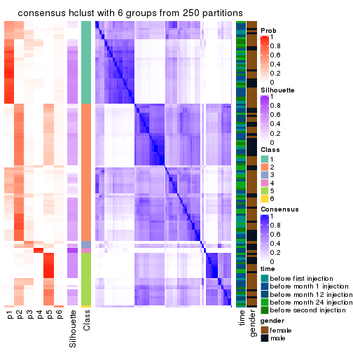</p>

</div>
</div>

Heatmaps for the membership of samples in all partitions to see how consistent they are:


<script>
$( function() {
	$( '#tabs-MAD-hclust-membership-heatmap' ).tabs();
} );
</script>
<div id='tabs-MAD-hclust-membership-heatmap'>
<ul>
<li><a href='#tab-MAD-hclust-membership-heatmap-1'>k = 2</a></li>
<li><a href='#tab-MAD-hclust-membership-heatmap-2'>k = 3</a></li>
<li><a href='#tab-MAD-hclust-membership-heatmap-3'>k = 4</a></li>
<li><a href='#tab-MAD-hclust-membership-heatmap-4'>k = 5</a></li>
<li><a href='#tab-MAD-hclust-membership-heatmap-5'>k = 6</a></li>
</ul>
<div id='tab-MAD-hclust-membership-heatmap-1'>
<pre><code class="r">membership_heatmap(res, k = 2)
</code></pre>

<p></p>

</div>
<div id='tab-MAD-hclust-membership-heatmap-2'>
<pre><code class="r">membership_heatmap(res, k = 3)
</code></pre>

<p></p>

</div>
<div id='tab-MAD-hclust-membership-heatmap-3'>
<pre><code class="r">membership_heatmap(res, k = 4)
</code></pre>

<p></p>

</div>
<div id='tab-MAD-hclust-membership-heatmap-4'>
<pre><code class="r">membership_heatmap(res, k = 5)
</code></pre>

<p></p>

</div>
<div id='tab-MAD-hclust-membership-heatmap-5'>
<pre><code class="r">membership_heatmap(res, k = 6)
</code></pre>

<p></p>

</div>
</div>

As soon as we have had the classes for columns, we can look for signatures
which are significantly different between classes which can be candidate marks
for certain classes. Following are the heatmaps for signatures.


Signature heatmaps where rows are scaled:


<script>
$( function() {
	$( '#tabs-MAD-hclust-get-signatures' ).tabs();
} );
</script>
<div id='tabs-MAD-hclust-get-signatures'>
<ul>
<li><a href='#tab-MAD-hclust-get-signatures-1'>k = 2</a></li>
<li><a href='#tab-MAD-hclust-get-signatures-2'>k = 3</a></li>
<li><a href='#tab-MAD-hclust-get-signatures-3'>k = 4</a></li>
<li><a href='#tab-MAD-hclust-get-signatures-4'>k = 5</a></li>
<li><a href='#tab-MAD-hclust-get-signatures-5'>k = 6</a></li>
</ul>
<div id='tab-MAD-hclust-get-signatures-1'>
<pre><code class="r">get_signatures(res, k = 2)
</code></pre>

<p></p>

</div>
<div id='tab-MAD-hclust-get-signatures-2'>
<pre><code class="r">get_signatures(res, k = 3)
</code></pre>

<p></p>

</div>
<div id='tab-MAD-hclust-get-signatures-3'>
<pre><code class="r">get_signatures(res, k = 4)
</code></pre>

<p></p>

</div>
<div id='tab-MAD-hclust-get-signatures-4'>
<pre><code class="r">get_signatures(res, k = 5)
</code></pre>

<p></p>

</div>
<div id='tab-MAD-hclust-get-signatures-5'>
<pre><code class="r">get_signatures(res, k = 6)
</code></pre>

<p></p>

</div>
</div>


Signature heatmaps where rows are not scaled:


<script>
$( function() {
	$( '#tabs-MAD-hclust-get-signatures-no-scale' ).tabs();
} );
</script>
<div id='tabs-MAD-hclust-get-signatures-no-scale'>
<ul>
<li><a href='#tab-MAD-hclust-get-signatures-no-scale-1'>k = 2</a></li>
<li><a href='#tab-MAD-hclust-get-signatures-no-scale-2'>k = 3</a></li>
<li><a href='#tab-MAD-hclust-get-signatures-no-scale-3'>k = 4</a></li>
<li><a href='#tab-MAD-hclust-get-signatures-no-scale-4'>k = 5</a></li>
<li><a href='#tab-MAD-hclust-get-signatures-no-scale-5'>k = 6</a></li>
</ul>
<div id='tab-MAD-hclust-get-signatures-no-scale-1'>
<pre><code class="r">get_signatures(res, k = 2, scale_rows = FALSE)
</code></pre>

<p></p>

</div>
<div id='tab-MAD-hclust-get-signatures-no-scale-2'>
<pre><code class="r">get_signatures(res, k = 3, scale_rows = FALSE)
</code></pre>

<p></p>

</div>
<div id='tab-MAD-hclust-get-signatures-no-scale-3'>
<pre><code class="r">get_signatures(res, k = 4, scale_rows = FALSE)
</code></pre>

<p></p>

</div>
<div id='tab-MAD-hclust-get-signatures-no-scale-4'>
<pre><code class="r">get_signatures(res, k = 5, scale_rows = FALSE)
</code></pre>

<p></p>

</div>
<div id='tab-MAD-hclust-get-signatures-no-scale-5'>
<pre><code class="r">get_signatures(res, k = 6, scale_rows = FALSE)
</code></pre>

<p></p>

</div>
</div>


Compare the overlap of signatures from different k:

```r
compare_signatures(res)
```


`get_signature()` returns a data frame invisibly. TO get the list of signatures, the function
call should be assigned to a variable explicitly. In following code, if `plot` argument is set
to `FALSE`, no heatmap is plotted while only the differential analysis is performed.

```r
# code only for demonstration
tb = get_signature(res, k = ..., plot = FALSE)
```

An example of the output of `tb` is:

```
#>   which_row         fdr    mean_1    mean_2 scaled_mean_1 scaled_mean_2 km
#> 1        38 0.042760348  8.373488  9.131774    -0.5533452     0.5164555  1
#> 2        40 0.018707592  7.106213  8.469186    -0.6173731     0.5762149  1
#> 3        55 0.019134737 10.221463 11.207825    -0.6159697     0.5749050  1
#> 4        59 0.006059896  5.921854  7.869574    -0.6899429     0.6439467  1
#> 5        60 0.018055526  8.928898 10.211722    -0.6204761     0.5791110  1
#> 6        98 0.009384629 15.714769 14.887706     0.6635654    -0.6193277  2
...
```

The columns in `tb` are:

1. `which_row`: row indices corresponding to the input matrix.
2. `fdr`: FDR for the differential test. 
3. `mean_x`: The mean value in group x.
4. `scaled_mean_x`: The mean value in group x after rows are scaled.
5. `km`: Row groups if k-means clustering is applied to rows.


UMAP plot which shows how samples are separated.


<script>
$( function() {
	$( '#tabs-MAD-hclust-dimension-reduction' ).tabs();
} );
</script>
<div id='tabs-MAD-hclust-dimension-reduction'>
<ul>
<li><a href='#tab-MAD-hclust-dimension-reduction-1'>k = 2</a></li>
<li><a href='#tab-MAD-hclust-dimension-reduction-2'>k = 3</a></li>
<li><a href='#tab-MAD-hclust-dimension-reduction-3'>k = 4</a></li>
<li><a href='#tab-MAD-hclust-dimension-reduction-4'>k = 5</a></li>
<li><a href='#tab-MAD-hclust-dimension-reduction-5'>k = 6</a></li>
</ul>
<div id='tab-MAD-hclust-dimension-reduction-1'>
<pre><code class="r">dimension_reduction(res, k = 2, method = &quot;UMAP&quot;)
</code></pre>

<p></p>

</div>
<div id='tab-MAD-hclust-dimension-reduction-2'>
<pre><code class="r">dimension_reduction(res, k = 3, method = &quot;UMAP&quot;)
</code></pre>

<p></p>

</div>
<div id='tab-MAD-hclust-dimension-reduction-3'>
<pre><code class="r">dimension_reduction(res, k = 4, method = &quot;UMAP&quot;)
</code></pre>

<p></p>

</div>
<div id='tab-MAD-hclust-dimension-reduction-4'>
<pre><code class="r">dimension_reduction(res, k = 5, method = &quot;UMAP&quot;)
</code></pre>

<p></p>

</div>
<div id='tab-MAD-hclust-dimension-reduction-5'>
<pre><code class="r">dimension_reduction(res, k = 6, method = &quot;UMAP&quot;)
</code></pre>

<p></p>

</div>
</div>


Following heatmap shows how subgroups are split when increasing `k`:

```r
collect_classes(res)
```


Test correlation between subgroups and known annotations. If the known
annotation is numeric, one-way ANOVA test is applied, and if the known
annotation is discrete, chi-squared contingency table test is applied.

```r
test_to_known_factors(res)
```

```
#>              n time(p) gender(p) k
#> MAD:hclust 101   0.677     0.250 2
#> MAD:hclust 103   0.408     0.296 3
#> MAD:hclust  61   0.266     0.716 4
#> MAD:hclust  59   0.360     0.389 5
#> MAD:hclust  38   0.215     0.350 6
```


If matrix rows can be associated to genes, consider to use `GO_Enrichment(res,
...)` to perform function enrichment for the signature genes.


 

---------------------------------------------------


### MAD:kmeans*


The object with results only for a single top-value method and a single partition method 
can be extracted as:

```r
res = res_list["MAD", "kmeans"]
# you can also extract it by
# res = res_list["MAD:kmeans"]
```

A summary of `res` and all the functions that can be applied to it:

```r
res
```

```
#> A 'ConsensusPartition' object with k = 2, 3, 4, 5, 6.
#>   On a matrix with 21168 rows and 125 columns.
#>   Top rows (1000, 2000, 3000, 4000, 5000) are extracted by 'MAD' method.
#>   Subgroups are detected by 'kmeans' method.
#>   Performed in total 1250 partitions by row resampling.
#>   Best k for subgroups seems to be 2.
#> 
#> Following methods can be applied to this 'ConsensusPartition' object:
#>  [1] "cola_report"             "collect_classes"         "collect_plots"          
#>  [4] "collect_stats"           "colnames"                "compare_signatures"     
#>  [7] "consensus_heatmap"       "dimension_reduction"     "functional_enrichment"  
#> [10] "get_anno_col"            "get_anno"                "get_classes"            
#> [13] "get_consensus"           "get_matrix"              "get_membership"         
#> [16] "get_param"               "get_signatures"          "get_stats"              
#> [19] "is_best_k"               "is_stable_k"             "membership_heatmap"     
#> [22] "ncol"                    "nrow"                    "plot_ecdf"              
#> [25] "rownames"                "select_partition_number" "show"                   
#> [28] "suggest_best_k"          "test_to_known_factors"
```

`collect_plots()` function collects all the plots made from `res` for all `k` (number of partitions)
into one single page to provide an easy and fast comparison between different `k`.

```r
collect_plots(res)
```


The plots are:

- The first row: a plot of the ECDF (Empirical cumulative distribution
  function) curves of the consensus matrix for each `k` and the heatmap of
  predicted classes for each `k`.
- The second row: heatmaps of the consensus matrix for each `k`.
- The third row: heatmaps of the membership matrix for each `k`.
- The fouth row: heatmaps of the signatures for each `k`.

All the plots in panels can be made by individual functions and they are
plotted later in this section.

`select_partition_number()` produces several plots showing different
statistics for choosing "optimized" `k`. There are following statistics:

- ECDF curves of the consensus matrix for each `k`;
- 1-PAC. [The PAC
  score](https://en.wikipedia.org/wiki/Consensus_clustering#Over-interpretation_potential_of_consensus_clustering)
  measures the proportion of the ambiguous subgrouping.
- Mean silhouette score.
- Concordance. The mean probability of fiting the consensus class ids in all
  partitions.
- Area increased. Denote $A_k$ as the area under the ECDF curve for current
  `k`, the area increased is defined as $A_k - A_{k-1}$.
- Rand index. The percent of pairs of samples that are both in a same cluster
  or both are not in a same cluster in the partition of k and k-1.
- Jaccard index. The ratio of pairs of samples are both in a same cluster in
  the partition of k and k-1 and the pairs of samples are both in a same
  cluster in the partition k or k-1.

The detailed explanations of these statistics can be found in [the cola
vignette](http://bioconductor.org/packages/devel/bioc/vignettes/cola/inst/doc/cola.html#toc_13).

Generally speaking, lower PAC score, higher mean silhouette score or higher
concordance corresponds to better partition. Rand index and Jaccard index
measure how similar the current partition is compared to partition with `k-1`.
If they are too similar, we won't accept `k` is better than `k-1`.

```r
select_partition_number(res)
```


The numeric values for all these statistics can be obtained by `get_stats()`.

```r
get_stats(res)
```

```
#>   k 1-PAC mean_silhouette concordance area_increased  Rand Jaccard
#> 2 2 0.950           0.938       0.975         0.5023 0.499   0.499
#> 3 3 0.533           0.634       0.812         0.2756 0.814   0.649
#> 4 4 0.608           0.433       0.707         0.1266 0.947   0.866
#> 5 5 0.605           0.586       0.728         0.0729 0.804   0.480
#> 6 6 0.682           0.756       0.766         0.0431 0.925   0.665
```

`suggest_best_k()` suggests the best $k$ based on these statistics. The rules are as follows:

- All $k$ with Jaccard index larger than 0.95 are removed because the increase of
  the partition number does not provides enough extra information. If all $k$ are removed,
  the best $k$ is assigned by `NA`.
- For $k$ with 1-PAC larger than 0.9, the maximal $k$ is taken as the "best k". Other $k$ is called "optional k".
- If it does not fit the second rule. The $k$ with the highest vote of highest
  1-PAC, mean silhouette and concordance is taken as the "best k".

```r
suggest_best_k(res)
```

```
#> [1] 2
```


Following shows the table of the partitions (You need to click the **show/hide
code output** link to see it). The membership matrix (columns with name `p*`)
is inferred by
[`clue::cl_consensus()`](https://www.rdocumentation.org/link/cl_consensus?package=clue)
function with the `SE` method. Basically the value in the membership matrix
represents the probability to belong to a certain group. The finall class
label for an item is determined with the group with highest probability it
belongs to.

In `get_classes()` function, the entropy is calculated from the membership
matrix and the silhouette score is calculated from the consensus matrix.


<script>
$( function() {
	$( '#tabs-MAD-kmeans-get-classes' ).tabs();
} );
</script>
<div id='tabs-MAD-kmeans-get-classes'>
<ul>
<li><a href='#tab-MAD-kmeans-get-classes-1'>k = 2</a></li>
<li><a href='#tab-MAD-kmeans-get-classes-2'>k = 3</a></li>
<li><a href='#tab-MAD-kmeans-get-classes-3'>k = 4</a></li>
<li><a href='#tab-MAD-kmeans-get-classes-4'>k = 5</a></li>
<li><a href='#tab-MAD-kmeans-get-classes-5'>k = 6</a></li>
</ul>

<div id='tab-MAD-kmeans-get-classes-1'>
<p><a id='tab-MAD-kmeans-get-classes-1-a' style='color:#0366d6' href='#'>show/hide code output</a></p>
<pre><code class="r">cbind(get_classes(res, k = 2), get_membership(res, k = 2))
</code></pre>

<pre><code>#&gt;           class entropy silhouette    p1    p2
#&gt; GSM601752     2  0.0000      0.979 0.000 1.000
#&gt; GSM601782     1  0.0000      0.969 1.000 0.000
#&gt; GSM601792     1  0.0000      0.969 1.000 0.000
#&gt; GSM601797     1  0.9954      0.168 0.540 0.460
#&gt; GSM601827     1  0.0000      0.969 1.000 0.000
#&gt; GSM601837     2  0.0000      0.979 0.000 1.000
#&gt; GSM601842     2  0.0000      0.979 0.000 1.000
#&gt; GSM601857     1  0.0000      0.969 1.000 0.000
#&gt; GSM601867     1  0.8955      0.556 0.688 0.312
#&gt; GSM601747     1  0.0000      0.969 1.000 0.000
#&gt; GSM601757     1  0.0000      0.969 1.000 0.000
#&gt; GSM601762     2  0.0000      0.979 0.000 1.000
#&gt; GSM601767     2  0.0000      0.979 0.000 1.000
#&gt; GSM601772     2  0.0000      0.979 0.000 1.000
#&gt; GSM601777     1  0.0938      0.960 0.988 0.012
#&gt; GSM601787     1  0.9954      0.176 0.540 0.460
#&gt; GSM601802     2  0.0000      0.979 0.000 1.000
#&gt; GSM601807     1  0.1843      0.946 0.972 0.028
#&gt; GSM601812     1  0.0000      0.969 1.000 0.000
#&gt; GSM601817     1  0.0000      0.969 1.000 0.000
#&gt; GSM601822     1  0.7815      0.696 0.768 0.232
#&gt; GSM601832     2  0.0000      0.979 0.000 1.000
#&gt; GSM601847     2  0.3584      0.916 0.068 0.932
#&gt; GSM601852     1  0.0000      0.969 1.000 0.000
#&gt; GSM601862     1  0.0000      0.969 1.000 0.000
#&gt; GSM601753     2  0.0000      0.979 0.000 1.000
#&gt; GSM601783     1  0.0000      0.969 1.000 0.000
#&gt; GSM601793     1  0.0000      0.969 1.000 0.000
#&gt; GSM601798     2  0.0000      0.979 0.000 1.000
#&gt; GSM601828     1  0.0000      0.969 1.000 0.000
#&gt; GSM601838     2  0.0000      0.979 0.000 1.000
#&gt; GSM601843     2  0.0000      0.979 0.000 1.000
#&gt; GSM601858     2  0.0000      0.979 0.000 1.000
#&gt; GSM601868     1  0.0000      0.969 1.000 0.000
#&gt; GSM601748     1  0.0000      0.969 1.000 0.000
#&gt; GSM601758     1  0.0000      0.969 1.000 0.000
#&gt; GSM601763     2  0.9795      0.286 0.416 0.584
#&gt; GSM601768     2  0.0000      0.979 0.000 1.000
#&gt; GSM601773     2  0.0000      0.979 0.000 1.000
#&gt; GSM601778     1  0.0000      0.969 1.000 0.000
#&gt; GSM601788     2  0.0000      0.979 0.000 1.000
#&gt; GSM601803     2  0.0000      0.979 0.000 1.000
#&gt; GSM601808     1  0.0000      0.969 1.000 0.000
#&gt; GSM601813     1  0.0000      0.969 1.000 0.000
#&gt; GSM601818     1  0.0000      0.969 1.000 0.000
#&gt; GSM601823     1  0.0000      0.969 1.000 0.000
#&gt; GSM601833     2  0.0000      0.979 0.000 1.000
#&gt; GSM601848     1  0.0000      0.969 1.000 0.000
#&gt; GSM601853     1  0.0000      0.969 1.000 0.000
#&gt; GSM601863     1  0.0000      0.969 1.000 0.000
#&gt; GSM601754     2  0.0000      0.979 0.000 1.000
#&gt; GSM601784     2  0.0000      0.979 0.000 1.000
#&gt; GSM601794     1  0.0000      0.969 1.000 0.000
#&gt; GSM601799     2  0.0000      0.979 0.000 1.000
#&gt; GSM601829     1  0.0000      0.969 1.000 0.000
#&gt; GSM601839     2  0.0000      0.979 0.000 1.000
#&gt; GSM601844     1  0.0000      0.969 1.000 0.000
#&gt; GSM601859     2  0.0000      0.979 0.000 1.000
#&gt; GSM601869     1  0.0000      0.969 1.000 0.000
#&gt; GSM601749     1  0.0000      0.969 1.000 0.000
#&gt; GSM601759     1  0.0000      0.969 1.000 0.000
#&gt; GSM601764     1  0.0000      0.969 1.000 0.000
#&gt; GSM601769     2  0.0000      0.979 0.000 1.000
#&gt; GSM601774     2  0.0000      0.979 0.000 1.000
#&gt; GSM601779     1  0.0000      0.969 1.000 0.000
#&gt; GSM601789     2  0.0000      0.979 0.000 1.000
#&gt; GSM601804     2  0.2423      0.945 0.040 0.960
#&gt; GSM601809     1  0.0376      0.966 0.996 0.004
#&gt; GSM601814     2  0.0000      0.979 0.000 1.000
#&gt; GSM601819     1  0.0000      0.969 1.000 0.000
#&gt; GSM601824     2  0.5519      0.850 0.128 0.872
#&gt; GSM601834     2  0.0000      0.979 0.000 1.000
#&gt; GSM601849     1  0.0000      0.969 1.000 0.000
#&gt; GSM601854     1  0.0000      0.969 1.000 0.000
#&gt; GSM601864     2  0.0000      0.979 0.000 1.000
#&gt; GSM601755     2  0.0000      0.979 0.000 1.000
#&gt; GSM601785     2  0.0000      0.979 0.000 1.000
#&gt; GSM601795     1  0.0376      0.966 0.996 0.004
#&gt; GSM601800     2  0.0000      0.979 0.000 1.000
#&gt; GSM601830     1  0.1414      0.953 0.980 0.020
#&gt; GSM601840     2  0.0376      0.976 0.004 0.996
#&gt; GSM601845     2  0.7602      0.715 0.220 0.780
#&gt; GSM601860     2  0.0000      0.979 0.000 1.000
#&gt; GSM601870     1  0.4298      0.886 0.912 0.088
#&gt; GSM601750     1  0.0000      0.969 1.000 0.000
#&gt; GSM601760     1  0.0000      0.969 1.000 0.000
#&gt; GSM601765     2  0.0000      0.979 0.000 1.000
#&gt; GSM601770     2  0.0000      0.979 0.000 1.000
#&gt; GSM601775     2  0.1414      0.963 0.020 0.980
#&gt; GSM601780     1  0.0000      0.969 1.000 0.000
#&gt; GSM601790     2  0.0000      0.979 0.000 1.000
#&gt; GSM601805     2  0.0000      0.979 0.000 1.000
#&gt; GSM601810     1  0.0000      0.969 1.000 0.000
#&gt; GSM601815     2  0.0000      0.979 0.000 1.000
#&gt; GSM601820     1  0.0000      0.969 1.000 0.000
#&gt; GSM601825     2  0.0000      0.979 0.000 1.000
#&gt; GSM601835     2  0.0000      0.979 0.000 1.000
#&gt; GSM601850     1  0.0938      0.960 0.988 0.012
#&gt; GSM601855     1  0.0000      0.969 1.000 0.000
#&gt; GSM601865     2  0.0000      0.979 0.000 1.000
#&gt; GSM601756     2  0.0000      0.979 0.000 1.000
#&gt; GSM601786     2  0.0000      0.979 0.000 1.000
#&gt; GSM601796     1  0.0000      0.969 1.000 0.000
#&gt; GSM601801     2  0.0000      0.979 0.000 1.000
#&gt; GSM601831     1  0.0000      0.969 1.000 0.000
#&gt; GSM601841     1  0.0000      0.969 1.000 0.000
#&gt; GSM601846     2  0.6148      0.816 0.152 0.848
#&gt; GSM601861     2  0.0000      0.979 0.000 1.000
#&gt; GSM601871     1  0.9580      0.406 0.620 0.380
#&gt; GSM601751     2  0.0000      0.979 0.000 1.000
#&gt; GSM601761     1  0.0000      0.969 1.000 0.000
#&gt; GSM601766     2  0.5178      0.867 0.116 0.884
#&gt; GSM601771     2  0.0000      0.979 0.000 1.000
#&gt; GSM601776     1  0.0000      0.969 1.000 0.000
#&gt; GSM601781     1  0.0376      0.966 0.996 0.004
#&gt; GSM601791     1  0.0000      0.969 1.000 0.000
#&gt; GSM601806     2  0.0000      0.979 0.000 1.000
#&gt; GSM601811     1  0.0000      0.969 1.000 0.000
#&gt; GSM601816     1  0.0000      0.969 1.000 0.000
#&gt; GSM601821     2  0.0000      0.979 0.000 1.000
#&gt; GSM601826     1  0.0000      0.969 1.000 0.000
#&gt; GSM601836     1  0.0000      0.969 1.000 0.000
#&gt; GSM601851     1  0.0000      0.969 1.000 0.000
#&gt; GSM601856     1  0.0000      0.969 1.000 0.000
#&gt; GSM601866     1  0.0000      0.969 1.000 0.000
</code></pre>

<script>
$('#tab-MAD-kmeans-get-classes-1-a').parent().next().next().hide();
$('#tab-MAD-kmeans-get-classes-1-a').click(function(){
  $('#tab-MAD-kmeans-get-classes-1-a').parent().next().next().toggle();
  return(false);
});
</script>
</div>

<div id='tab-MAD-kmeans-get-classes-2'>
<p><a id='tab-MAD-kmeans-get-classes-2-a' style='color:#0366d6' href='#'>show/hide code output</a></p>
<pre><code class="r">cbind(get_classes(res, k = 3), get_membership(res, k = 3))
</code></pre>

<pre><code>#&gt;           class entropy silhouette    p1    p2    p3
#&gt; GSM601752     2  0.6529     0.7654 0.152 0.756 0.092
#&gt; GSM601782     1  0.6235    -0.0142 0.564 0.000 0.436
#&gt; GSM601792     1  0.1753     0.6460 0.952 0.000 0.048
#&gt; GSM601797     1  0.8825     0.1845 0.532 0.336 0.132
#&gt; GSM601827     3  0.6286     0.3549 0.464 0.000 0.536
#&gt; GSM601837     2  0.4291     0.8162 0.000 0.820 0.180
#&gt; GSM601842     2  0.0747     0.8856 0.000 0.984 0.016
#&gt; GSM601857     3  0.5363     0.8130 0.276 0.000 0.724
#&gt; GSM601867     3  0.4095     0.6431 0.056 0.064 0.880
#&gt; GSM601747     1  0.5902     0.3468 0.680 0.004 0.316
#&gt; GSM601757     1  0.6095     0.1332 0.608 0.000 0.392
#&gt; GSM601762     2  0.0592     0.8851 0.000 0.988 0.012
#&gt; GSM601767     2  0.0237     0.8853 0.000 0.996 0.004
#&gt; GSM601772     2  0.0424     0.8851 0.000 0.992 0.008
#&gt; GSM601777     1  0.5763     0.5121 0.740 0.016 0.244
#&gt; GSM601787     3  0.4802     0.5401 0.020 0.156 0.824
#&gt; GSM601802     2  0.4586     0.8520 0.048 0.856 0.096
#&gt; GSM601807     3  0.3619     0.7307 0.136 0.000 0.864
#&gt; GSM601812     1  0.6180     0.0504 0.584 0.000 0.416
#&gt; GSM601817     1  0.6309    -0.2569 0.504 0.000 0.496
#&gt; GSM601822     1  0.7058     0.4616 0.720 0.180 0.100
#&gt; GSM601832     2  0.1289     0.8843 0.000 0.968 0.032
#&gt; GSM601847     1  0.8442     0.1648 0.548 0.352 0.100
#&gt; GSM601852     1  0.6280    -0.1266 0.540 0.000 0.460
#&gt; GSM601862     3  0.5397     0.8100 0.280 0.000 0.720
#&gt; GSM601753     2  0.4505     0.8514 0.048 0.860 0.092
#&gt; GSM601783     1  0.5529     0.3712 0.704 0.000 0.296
#&gt; GSM601793     1  0.1411     0.6599 0.964 0.000 0.036
#&gt; GSM601798     2  0.4586     0.8520 0.048 0.856 0.096
#&gt; GSM601828     3  0.6309     0.2501 0.496 0.000 0.504
#&gt; GSM601838     2  0.4291     0.8162 0.000 0.820 0.180
#&gt; GSM601843     2  0.0424     0.8856 0.000 0.992 0.008
#&gt; GSM601858     2  0.4002     0.8269 0.000 0.840 0.160
#&gt; GSM601868     3  0.5363     0.8130 0.276 0.000 0.724
#&gt; GSM601748     1  0.6295    -0.1781 0.528 0.000 0.472
#&gt; GSM601758     1  0.5397     0.3953 0.720 0.000 0.280
#&gt; GSM601763     1  0.5412     0.5113 0.796 0.172 0.032
#&gt; GSM601768     2  0.0237     0.8851 0.000 0.996 0.004
#&gt; GSM601773     2  0.0237     0.8853 0.000 0.996 0.004
#&gt; GSM601778     1  0.2711     0.6247 0.912 0.000 0.088
#&gt; GSM601788     2  0.2165     0.8799 0.000 0.936 0.064
#&gt; GSM601803     2  0.3445     0.8672 0.016 0.896 0.088
#&gt; GSM601808     3  0.5363     0.8130 0.276 0.000 0.724
#&gt; GSM601813     1  0.5465     0.3814 0.712 0.000 0.288
#&gt; GSM601818     1  0.6309    -0.2569 0.504 0.000 0.496
#&gt; GSM601823     1  0.0424     0.6624 0.992 0.000 0.008
#&gt; GSM601833     2  0.0424     0.8851 0.000 0.992 0.008
#&gt; GSM601848     1  0.0592     0.6626 0.988 0.000 0.012
#&gt; GSM601853     3  0.5363     0.8130 0.276 0.000 0.724
#&gt; GSM601863     3  0.5465     0.8000 0.288 0.000 0.712
#&gt; GSM601754     2  0.6807     0.7449 0.172 0.736 0.092
#&gt; GSM601784     2  0.0892     0.8839 0.000 0.980 0.020
#&gt; GSM601794     1  0.1860     0.6440 0.948 0.000 0.052
#&gt; GSM601799     2  0.6911     0.7349 0.180 0.728 0.092
#&gt; GSM601829     1  0.2959     0.6270 0.900 0.000 0.100
#&gt; GSM601839     2  0.4291     0.8162 0.000 0.820 0.180
#&gt; GSM601844     1  0.0747     0.6621 0.984 0.000 0.016
#&gt; GSM601859     2  0.0237     0.8853 0.000 0.996 0.004
#&gt; GSM601869     3  0.5397     0.8100 0.280 0.000 0.720
#&gt; GSM601749     1  0.5560     0.3592 0.700 0.000 0.300
#&gt; GSM601759     1  0.5650     0.3341 0.688 0.000 0.312
#&gt; GSM601764     1  0.0829     0.6624 0.984 0.004 0.012
#&gt; GSM601769     2  0.2448     0.8679 0.000 0.924 0.076
#&gt; GSM601774     2  0.0424     0.8853 0.000 0.992 0.008
#&gt; GSM601779     1  0.0237     0.6602 0.996 0.000 0.004
#&gt; GSM601789     2  0.4235     0.8171 0.000 0.824 0.176
#&gt; GSM601804     1  0.8113     0.2543 0.596 0.312 0.092
#&gt; GSM601809     1  0.6228     0.2003 0.624 0.004 0.372
#&gt; GSM601814     2  0.2711     0.8631 0.000 0.912 0.088
#&gt; GSM601819     1  0.4291     0.5394 0.820 0.000 0.180
#&gt; GSM601824     1  0.6696     0.4675 0.736 0.188 0.076
#&gt; GSM601834     2  0.0237     0.8853 0.000 0.996 0.004
#&gt; GSM601849     1  0.0747     0.6621 0.984 0.000 0.016
#&gt; GSM601854     1  0.6062     0.1348 0.616 0.000 0.384
#&gt; GSM601864     2  0.4291     0.8162 0.000 0.820 0.180
#&gt; GSM601755     2  0.4586     0.8520 0.048 0.856 0.096
#&gt; GSM601785     2  0.2926     0.8756 0.040 0.924 0.036
#&gt; GSM601795     1  0.3375     0.6082 0.892 0.008 0.100
#&gt; GSM601800     2  0.4586     0.8520 0.048 0.856 0.096
#&gt; GSM601830     3  0.4605     0.7790 0.204 0.000 0.796
#&gt; GSM601840     2  0.6266     0.7752 0.156 0.768 0.076
#&gt; GSM601845     2  0.7974     0.1875 0.436 0.504 0.060
#&gt; GSM601860     2  0.1525     0.8823 0.032 0.964 0.004
#&gt; GSM601870     3  0.3802     0.6807 0.080 0.032 0.888
#&gt; GSM601750     1  0.6260    -0.0796 0.552 0.000 0.448
#&gt; GSM601760     1  0.3038     0.6118 0.896 0.000 0.104
#&gt; GSM601765     2  0.0424     0.8857 0.000 0.992 0.008
#&gt; GSM601770     2  0.0237     0.8853 0.000 0.996 0.004
#&gt; GSM601775     2  0.6886     0.7329 0.184 0.728 0.088
#&gt; GSM601780     1  0.0000     0.6610 1.000 0.000 0.000
#&gt; GSM601790     2  0.4291     0.8162 0.000 0.820 0.180
#&gt; GSM601805     2  0.4505     0.8538 0.048 0.860 0.092
#&gt; GSM601810     3  0.5363     0.8130 0.276 0.000 0.724
#&gt; GSM601815     2  0.4121     0.8239 0.000 0.832 0.168
#&gt; GSM601820     1  0.5785     0.2860 0.668 0.000 0.332
#&gt; GSM601825     2  0.3445     0.8672 0.016 0.896 0.088
#&gt; GSM601835     2  0.1643     0.8852 0.000 0.956 0.044
#&gt; GSM601850     1  0.4423     0.5867 0.864 0.048 0.088
#&gt; GSM601855     3  0.4555     0.7785 0.200 0.000 0.800
#&gt; GSM601865     2  0.4291     0.8162 0.000 0.820 0.180
#&gt; GSM601756     2  0.4479     0.8540 0.044 0.860 0.096
#&gt; GSM601786     2  0.4235     0.8177 0.000 0.824 0.176
#&gt; GSM601796     1  0.1529     0.6495 0.960 0.000 0.040
#&gt; GSM601801     2  0.3610     0.8645 0.016 0.888 0.096
#&gt; GSM601831     3  0.5363     0.8130 0.276 0.000 0.724
#&gt; GSM601841     1  0.2625     0.6356 0.916 0.000 0.084
#&gt; GSM601846     2  0.9151     0.1575 0.420 0.436 0.144
#&gt; GSM601861     2  0.3412     0.8467 0.000 0.876 0.124
#&gt; GSM601871     3  0.4979     0.5254 0.020 0.168 0.812
#&gt; GSM601751     2  0.2339     0.8774 0.048 0.940 0.012
#&gt; GSM601761     1  0.0747     0.6621 0.984 0.000 0.016
#&gt; GSM601766     1  0.7181     0.1798 0.564 0.408 0.028
#&gt; GSM601771     2  0.1999     0.8818 0.036 0.952 0.012
#&gt; GSM601776     1  0.0747     0.6621 0.984 0.000 0.016
#&gt; GSM601781     1  0.1643     0.6463 0.956 0.000 0.044
#&gt; GSM601791     1  0.0747     0.6621 0.984 0.000 0.016
#&gt; GSM601806     2  0.3207     0.8698 0.012 0.904 0.084
#&gt; GSM601811     3  0.5363     0.8130 0.276 0.000 0.724
#&gt; GSM601816     1  0.0592     0.6626 0.988 0.000 0.012
#&gt; GSM601821     2  0.3412     0.8467 0.000 0.876 0.124
#&gt; GSM601826     1  0.0592     0.6626 0.988 0.000 0.012
#&gt; GSM601836     1  0.3771     0.6194 0.876 0.012 0.112
#&gt; GSM601851     1  0.0747     0.6621 0.984 0.000 0.016
#&gt; GSM601856     3  0.5327     0.8113 0.272 0.000 0.728
#&gt; GSM601866     1  0.6299    -0.1921 0.524 0.000 0.476
</code></pre>

<script>
$('#tab-MAD-kmeans-get-classes-2-a').parent().next().next().hide();
$('#tab-MAD-kmeans-get-classes-2-a').click(function(){
  $('#tab-MAD-kmeans-get-classes-2-a').parent().next().next().toggle();
  return(false);
});
</script>
</div>

<div id='tab-MAD-kmeans-get-classes-3'>
<p><a id='tab-MAD-kmeans-get-classes-3-a' style='color:#0366d6' href='#'>show/hide code output</a></p>
<pre><code class="r">cbind(get_classes(res, k = 4), get_membership(res, k = 4))
</code></pre>

<pre><code>#&gt;           class entropy silhouette    p1    p2    p3    p4
#&gt; GSM601752     2  0.6262     0.1830 0.052 0.560 0.004 0.384
#&gt; GSM601782     1  0.7798     0.0810 0.388 0.000 0.364 0.248
#&gt; GSM601792     1  0.3224     0.4173 0.864 0.000 0.016 0.120
#&gt; GSM601797     4  0.8504     0.9056 0.332 0.212 0.036 0.420
#&gt; GSM601827     3  0.7764    -0.0240 0.356 0.000 0.404 0.240
#&gt; GSM601837     2  0.5636     0.5567 0.000 0.648 0.044 0.308
#&gt; GSM601842     2  0.0469     0.6712 0.000 0.988 0.000 0.012
#&gt; GSM601857     3  0.2816     0.7692 0.064 0.000 0.900 0.036
#&gt; GSM601867     3  0.3128     0.6946 0.004 0.004 0.864 0.128
#&gt; GSM601747     1  0.8903     0.1866 0.404 0.056 0.280 0.260
#&gt; GSM601757     1  0.7416     0.3333 0.516 0.000 0.240 0.244
#&gt; GSM601762     2  0.0000     0.6722 0.000 1.000 0.000 0.000
#&gt; GSM601767     2  0.0592     0.6738 0.000 0.984 0.000 0.016
#&gt; GSM601772     2  0.0188     0.6716 0.000 0.996 0.000 0.004
#&gt; GSM601777     1  0.7938    -0.3497 0.496 0.024 0.168 0.312
#&gt; GSM601787     3  0.4418     0.6064 0.000 0.032 0.784 0.184
#&gt; GSM601802     2  0.5204     0.3269 0.012 0.612 0.000 0.376
#&gt; GSM601807     3  0.2867     0.7249 0.012 0.000 0.884 0.104
#&gt; GSM601812     1  0.7740     0.1863 0.432 0.000 0.320 0.248
#&gt; GSM601817     3  0.7782    -0.0572 0.360 0.000 0.396 0.244
#&gt; GSM601822     1  0.6802    -0.5027 0.556 0.076 0.012 0.356
#&gt; GSM601832     2  0.1661     0.6548 0.000 0.944 0.004 0.052
#&gt; GSM601847     1  0.7573    -0.7504 0.460 0.152 0.008 0.380
#&gt; GSM601852     1  0.7776     0.1407 0.412 0.000 0.340 0.248
#&gt; GSM601862     3  0.2983     0.7666 0.068 0.000 0.892 0.040
#&gt; GSM601753     2  0.5189     0.3284 0.012 0.616 0.000 0.372
#&gt; GSM601783     1  0.7153     0.3932 0.556 0.000 0.196 0.248
#&gt; GSM601793     1  0.1854     0.5188 0.940 0.000 0.012 0.048
#&gt; GSM601798     2  0.5404     0.3098 0.012 0.600 0.004 0.384
#&gt; GSM601828     1  0.7799     0.0628 0.384 0.000 0.368 0.248
#&gt; GSM601838     2  0.5614     0.5598 0.000 0.652 0.044 0.304
#&gt; GSM601843     2  0.0336     0.6731 0.000 0.992 0.000 0.008
#&gt; GSM601858     2  0.4123     0.6300 0.000 0.820 0.044 0.136
#&gt; GSM601868     3  0.1970     0.7756 0.060 0.000 0.932 0.008
#&gt; GSM601748     1  0.7740     0.1706 0.428 0.000 0.328 0.244
#&gt; GSM601758     1  0.6860     0.4261 0.592 0.000 0.164 0.244
#&gt; GSM601763     1  0.4720     0.0405 0.720 0.264 0.000 0.016
#&gt; GSM601768     2  0.0336     0.6707 0.000 0.992 0.000 0.008
#&gt; GSM601773     2  0.0707     0.6744 0.000 0.980 0.000 0.020
#&gt; GSM601778     1  0.5571    -0.1331 0.656 0.016 0.016 0.312
#&gt; GSM601788     2  0.3552     0.6500 0.000 0.848 0.024 0.128
#&gt; GSM601803     2  0.5070     0.3425 0.008 0.620 0.000 0.372
#&gt; GSM601808     3  0.1474     0.7753 0.052 0.000 0.948 0.000
#&gt; GSM601813     1  0.7059     0.4047 0.568 0.000 0.184 0.248
#&gt; GSM601818     3  0.7843    -0.0852 0.364 0.000 0.372 0.264
#&gt; GSM601823     1  0.0000     0.5509 1.000 0.000 0.000 0.000
#&gt; GSM601833     2  0.0188     0.6728 0.000 0.996 0.000 0.004
#&gt; GSM601848     1  0.0336     0.5492 0.992 0.000 0.000 0.008
#&gt; GSM601853     3  0.1970     0.7757 0.060 0.000 0.932 0.008
#&gt; GSM601863     3  0.3439     0.7556 0.084 0.000 0.868 0.048
#&gt; GSM601754     2  0.6625     0.1124 0.076 0.540 0.004 0.380
#&gt; GSM601784     2  0.1792     0.6683 0.000 0.932 0.000 0.068
#&gt; GSM601794     1  0.3695     0.3482 0.828 0.000 0.016 0.156
#&gt; GSM601799     2  0.6495     0.0736 0.084 0.560 0.000 0.356
#&gt; GSM601829     1  0.2751     0.5591 0.904 0.000 0.056 0.040
#&gt; GSM601839     2  0.5614     0.5598 0.000 0.652 0.044 0.304
#&gt; GSM601844     1  0.0927     0.5589 0.976 0.000 0.008 0.016
#&gt; GSM601859     2  0.1022     0.6733 0.000 0.968 0.000 0.032
#&gt; GSM601869     3  0.3611     0.7514 0.080 0.000 0.860 0.060
#&gt; GSM601749     1  0.7001     0.4103 0.576 0.000 0.180 0.244
#&gt; GSM601759     1  0.7035     0.4058 0.572 0.000 0.184 0.244
#&gt; GSM601764     1  0.2142     0.5141 0.928 0.056 0.000 0.016
#&gt; GSM601769     2  0.4295     0.6016 0.000 0.752 0.008 0.240
#&gt; GSM601774     2  0.2266     0.6657 0.000 0.912 0.004 0.084
#&gt; GSM601779     1  0.0000     0.5509 1.000 0.000 0.000 0.000
#&gt; GSM601789     2  0.5312     0.5719 0.000 0.692 0.040 0.268
#&gt; GSM601804     1  0.7720    -0.8503 0.412 0.228 0.000 0.360
#&gt; GSM601809     1  0.7902     0.1691 0.440 0.008 0.340 0.212
#&gt; GSM601814     2  0.5143     0.5926 0.000 0.708 0.036 0.256
#&gt; GSM601819     1  0.6469     0.4656 0.628 0.000 0.124 0.248
#&gt; GSM601824     1  0.6511    -0.3836 0.640 0.188 0.000 0.172
#&gt; GSM601834     2  0.1211     0.6719 0.000 0.960 0.000 0.040
#&gt; GSM601849     1  0.0336     0.5492 0.992 0.000 0.000 0.008
#&gt; GSM601854     1  0.7322     0.3548 0.532 0.000 0.224 0.244
#&gt; GSM601864     2  0.5736     0.5400 0.000 0.628 0.044 0.328
#&gt; GSM601755     2  0.5391     0.3184 0.012 0.604 0.004 0.380
#&gt; GSM601785     2  0.1661     0.6523 0.004 0.944 0.000 0.052
#&gt; GSM601795     1  0.4917     0.0696 0.728 0.008 0.016 0.248
#&gt; GSM601800     2  0.5217     0.3192 0.012 0.608 0.000 0.380
#&gt; GSM601830     3  0.2983     0.7598 0.040 0.000 0.892 0.068
#&gt; GSM601840     2  0.6078     0.3530 0.064 0.684 0.016 0.236
#&gt; GSM601845     2  0.6943    -0.3773 0.388 0.520 0.012 0.080
#&gt; GSM601860     2  0.1118     0.6736 0.000 0.964 0.000 0.036
#&gt; GSM601870     3  0.2731     0.7235 0.008 0.004 0.896 0.092
#&gt; GSM601750     1  0.7763     0.1596 0.420 0.000 0.332 0.248
#&gt; GSM601760     1  0.5694     0.5076 0.696 0.000 0.080 0.224
#&gt; GSM601765     2  0.0000     0.6722 0.000 1.000 0.000 0.000
#&gt; GSM601770     2  0.0336     0.6727 0.000 0.992 0.000 0.008
#&gt; GSM601775     2  0.6084     0.2718 0.096 0.660 0.000 0.244
#&gt; GSM601780     1  0.0000     0.5509 1.000 0.000 0.000 0.000
#&gt; GSM601790     2  0.5569     0.5655 0.000 0.660 0.044 0.296
#&gt; GSM601805     2  0.5204     0.3269 0.012 0.612 0.000 0.376
#&gt; GSM601810     3  0.4624     0.7099 0.052 0.000 0.784 0.164
#&gt; GSM601815     2  0.5546     0.5680 0.000 0.664 0.044 0.292
#&gt; GSM601820     1  0.7239     0.3766 0.544 0.000 0.208 0.248
#&gt; GSM601825     2  0.4605     0.4004 0.000 0.664 0.000 0.336
#&gt; GSM601835     2  0.2522     0.6436 0.000 0.908 0.016 0.076
#&gt; GSM601850     1  0.4747     0.2139 0.764 0.024 0.008 0.204
#&gt; GSM601855     3  0.3056     0.7575 0.040 0.000 0.888 0.072
#&gt; GSM601865     2  0.5736     0.5400 0.000 0.628 0.044 0.328
#&gt; GSM601756     2  0.5377     0.3248 0.012 0.608 0.004 0.376
#&gt; GSM601786     2  0.5569     0.5655 0.000 0.660 0.044 0.296
#&gt; GSM601796     1  0.3108     0.4311 0.872 0.000 0.016 0.112
#&gt; GSM601801     2  0.5259     0.3341 0.008 0.612 0.004 0.376
#&gt; GSM601831     3  0.5839     0.6042 0.104 0.000 0.696 0.200
#&gt; GSM601841     1  0.2943     0.5674 0.892 0.000 0.076 0.032
#&gt; GSM601846     4  0.8820     0.9017 0.292 0.244 0.052 0.412
#&gt; GSM601861     2  0.5339     0.5805 0.000 0.688 0.040 0.272
#&gt; GSM601871     3  0.5132     0.5581 0.000 0.068 0.748 0.184
#&gt; GSM601751     2  0.1716     0.6592 0.000 0.936 0.000 0.064
#&gt; GSM601761     1  0.1356     0.5640 0.960 0.000 0.008 0.032
#&gt; GSM601766     2  0.6165    -0.3971 0.448 0.508 0.004 0.040
#&gt; GSM601771     2  0.1867     0.6475 0.000 0.928 0.000 0.072
#&gt; GSM601776     1  0.0779     0.5597 0.980 0.000 0.004 0.016
#&gt; GSM601781     1  0.3703     0.3709 0.840 0.008 0.012 0.140
#&gt; GSM601791     1  0.0657     0.5576 0.984 0.000 0.004 0.012
#&gt; GSM601806     2  0.4964     0.3494 0.004 0.616 0.000 0.380
#&gt; GSM601811     3  0.4532     0.7173 0.052 0.000 0.792 0.156
#&gt; GSM601816     1  0.1042     0.5368 0.972 0.000 0.008 0.020
#&gt; GSM601821     2  0.5339     0.5805 0.000 0.688 0.040 0.272
#&gt; GSM601826     1  0.0188     0.5505 0.996 0.000 0.000 0.004
#&gt; GSM601836     1  0.5443     0.4883 0.784 0.068 0.092 0.056
#&gt; GSM601851     1  0.0336     0.5527 0.992 0.000 0.000 0.008
#&gt; GSM601856     3  0.1975     0.7728 0.048 0.000 0.936 0.016
#&gt; GSM601866     1  0.7761     0.1409 0.416 0.000 0.340 0.244
</code></pre>

<script>
$('#tab-MAD-kmeans-get-classes-3-a').parent().next().next().hide();
$('#tab-MAD-kmeans-get-classes-3-a').click(function(){
  $('#tab-MAD-kmeans-get-classes-3-a').parent().next().next().toggle();
  return(false);
});
</script>
</div>

<div id='tab-MAD-kmeans-get-classes-4'>
<p><a id='tab-MAD-kmeans-get-classes-4-a' style='color:#0366d6' href='#'>show/hide code output</a></p>
<pre><code class="r">cbind(get_classes(res, k = 5), get_membership(res, k = 5))
</code></pre>

<pre><code>#&gt;           class entropy silhouette    p1    p2    p3    p4    p5
#&gt; GSM601752     4  0.5721     0.6031 0.000 0.104 0.044 0.692 0.160
#&gt; GSM601782     1  0.4112     0.7540 0.812 0.000 0.112 0.032 0.044
#&gt; GSM601792     5  0.4499     0.7883 0.172 0.000 0.020 0.044 0.764
#&gt; GSM601797     4  0.5555     0.1062 0.000 0.000 0.068 0.480 0.452
#&gt; GSM601827     1  0.4054     0.7057 0.800 0.000 0.144 0.040 0.016
#&gt; GSM601837     2  0.0880     0.5822 0.000 0.968 0.032 0.000 0.000
#&gt; GSM601842     2  0.4830     0.4067 0.000 0.492 0.000 0.488 0.020
#&gt; GSM601857     3  0.3579     0.7931 0.240 0.000 0.756 0.004 0.000
#&gt; GSM601867     3  0.2972     0.8065 0.044 0.036 0.892 0.016 0.012
#&gt; GSM601747     1  0.5758     0.6310 0.700 0.000 0.080 0.144 0.076
#&gt; GSM601757     1  0.2228     0.8381 0.912 0.000 0.008 0.012 0.068
#&gt; GSM601762     2  0.4559     0.4325 0.000 0.512 0.000 0.480 0.008
#&gt; GSM601767     2  0.4300     0.4523 0.000 0.524 0.000 0.476 0.000
#&gt; GSM601772     2  0.4659     0.4232 0.000 0.500 0.000 0.488 0.012
#&gt; GSM601777     5  0.4639     0.6144 0.040 0.000 0.132 0.052 0.776
#&gt; GSM601787     3  0.3063     0.7702 0.012 0.104 0.864 0.020 0.000
#&gt; GSM601802     4  0.5759     0.6124 0.000 0.132 0.044 0.692 0.132
#&gt; GSM601807     3  0.3473     0.8172 0.064 0.012 0.864 0.044 0.016
#&gt; GSM601812     1  0.1982     0.8381 0.932 0.000 0.028 0.012 0.028
#&gt; GSM601817     1  0.2079     0.8025 0.916 0.000 0.064 0.020 0.000
#&gt; GSM601822     5  0.3059     0.6634 0.016 0.000 0.020 0.096 0.868
#&gt; GSM601832     4  0.5254    -0.3936 0.004 0.460 0.000 0.500 0.036
#&gt; GSM601847     5  0.3769     0.5550 0.004 0.000 0.028 0.172 0.796
#&gt; GSM601852     1  0.1996     0.8285 0.928 0.000 0.048 0.012 0.012
#&gt; GSM601862     3  0.3635     0.7881 0.248 0.000 0.748 0.004 0.000
#&gt; GSM601753     4  0.5647     0.6129 0.000 0.128 0.040 0.700 0.132
#&gt; GSM601783     1  0.1942     0.8380 0.920 0.000 0.012 0.000 0.068
#&gt; GSM601793     5  0.4604     0.7905 0.192 0.000 0.020 0.040 0.748
#&gt; GSM601798     4  0.5759     0.6124 0.000 0.132 0.044 0.692 0.132
#&gt; GSM601828     1  0.2793     0.7781 0.876 0.000 0.088 0.036 0.000
#&gt; GSM601838     2  0.0609     0.5888 0.000 0.980 0.020 0.000 0.000
#&gt; GSM601843     2  0.4656     0.4311 0.000 0.508 0.000 0.480 0.012
#&gt; GSM601858     2  0.5645     0.4949 0.004 0.556 0.052 0.380 0.008
#&gt; GSM601868     3  0.2813     0.8269 0.168 0.000 0.832 0.000 0.000
#&gt; GSM601748     1  0.1731     0.8283 0.940 0.000 0.040 0.012 0.008
#&gt; GSM601758     1  0.2127     0.8152 0.892 0.000 0.000 0.000 0.108
#&gt; GSM601763     5  0.5930     0.2271 0.092 0.000 0.004 0.404 0.500
#&gt; GSM601768     2  0.4659     0.4128 0.000 0.496 0.000 0.492 0.012
#&gt; GSM601773     2  0.4294     0.4515 0.000 0.532 0.000 0.468 0.000
#&gt; GSM601778     5  0.3115     0.7145 0.048 0.000 0.020 0.056 0.876
#&gt; GSM601788     2  0.5842     0.4131 0.004 0.496 0.036 0.440 0.024
#&gt; GSM601803     4  0.5871     0.6030 0.000 0.152 0.044 0.680 0.124
#&gt; GSM601808     3  0.3087     0.8326 0.152 0.000 0.836 0.008 0.004
#&gt; GSM601813     1  0.2284     0.8304 0.896 0.000 0.004 0.004 0.096
#&gt; GSM601818     1  0.2580     0.8007 0.900 0.000 0.064 0.016 0.020
#&gt; GSM601823     5  0.3452     0.7872 0.244 0.000 0.000 0.000 0.756
#&gt; GSM601833     2  0.4557     0.4474 0.000 0.516 0.000 0.476 0.008
#&gt; GSM601848     5  0.3366     0.7904 0.232 0.000 0.000 0.000 0.768
#&gt; GSM601853     3  0.3689     0.8311 0.144 0.000 0.816 0.032 0.008
#&gt; GSM601863     3  0.4046     0.7385 0.296 0.000 0.696 0.008 0.000
#&gt; GSM601754     4  0.6145     0.5877 0.000 0.112 0.048 0.648 0.192
#&gt; GSM601784     2  0.4030     0.5313 0.000 0.648 0.000 0.352 0.000
#&gt; GSM601794     5  0.4305     0.7846 0.152 0.000 0.020 0.044 0.784
#&gt; GSM601799     4  0.5416     0.6037 0.000 0.088 0.040 0.716 0.156
#&gt; GSM601829     5  0.6241     0.6504 0.264 0.000 0.092 0.040 0.604
#&gt; GSM601839     2  0.0609     0.5888 0.000 0.980 0.020 0.000 0.000
#&gt; GSM601844     5  0.4597     0.7675 0.260 0.000 0.012 0.024 0.704
#&gt; GSM601859     2  0.4383     0.5000 0.000 0.572 0.000 0.424 0.004
#&gt; GSM601869     3  0.3766     0.7661 0.268 0.000 0.728 0.004 0.000
#&gt; GSM601749     1  0.2233     0.8200 0.892 0.000 0.000 0.004 0.104
#&gt; GSM601759     1  0.2179     0.8247 0.896 0.000 0.000 0.004 0.100
#&gt; GSM601764     5  0.5289     0.7119 0.196 0.000 0.004 0.116 0.684
#&gt; GSM601769     2  0.0794     0.5974 0.000 0.972 0.000 0.028 0.000
#&gt; GSM601774     2  0.4015     0.5415 0.000 0.652 0.000 0.348 0.000
#&gt; GSM601779     5  0.3728     0.7857 0.244 0.000 0.000 0.008 0.748
#&gt; GSM601789     2  0.1697     0.5977 0.000 0.932 0.008 0.060 0.000
#&gt; GSM601804     4  0.5465     0.1036 0.004 0.004 0.040 0.484 0.468
#&gt; GSM601809     1  0.6464     0.5459 0.628 0.004 0.204 0.056 0.108
#&gt; GSM601814     2  0.0609     0.5972 0.000 0.980 0.000 0.020 0.000
#&gt; GSM601819     1  0.2284     0.8205 0.896 0.000 0.004 0.004 0.096
#&gt; GSM601824     5  0.4035     0.7331 0.060 0.000 0.000 0.156 0.784
#&gt; GSM601834     2  0.4350     0.5110 0.000 0.588 0.000 0.408 0.004
#&gt; GSM601849     5  0.3395     0.7894 0.236 0.000 0.000 0.000 0.764
#&gt; GSM601854     1  0.3086     0.8316 0.876 0.000 0.036 0.020 0.068
#&gt; GSM601864     2  0.1626     0.5610 0.000 0.940 0.044 0.016 0.000
#&gt; GSM601755     4  0.5758     0.6117 0.000 0.136 0.044 0.692 0.128
#&gt; GSM601785     4  0.5570    -0.3462 0.000 0.436 0.012 0.508 0.044
#&gt; GSM601795     5  0.3988     0.7584 0.096 0.000 0.020 0.064 0.820
#&gt; GSM601800     4  0.5689     0.6128 0.000 0.132 0.040 0.696 0.132
#&gt; GSM601830     3  0.4439     0.8183 0.112 0.008 0.796 0.068 0.016
#&gt; GSM601840     4  0.6255     0.2282 0.008 0.196 0.024 0.636 0.136
#&gt; GSM601845     4  0.7291     0.1712 0.048 0.124 0.012 0.488 0.328
#&gt; GSM601860     2  0.5144     0.4529 0.000 0.520 0.008 0.448 0.024
#&gt; GSM601870     3  0.3603     0.8204 0.076 0.020 0.856 0.036 0.012
#&gt; GSM601750     1  0.1757     0.8325 0.936 0.000 0.048 0.004 0.012
#&gt; GSM601760     1  0.3519     0.6404 0.776 0.000 0.000 0.008 0.216
#&gt; GSM601765     4  0.5049    -0.4319 0.000 0.480 0.000 0.488 0.032
#&gt; GSM601770     2  0.4302     0.4507 0.000 0.520 0.000 0.480 0.000
#&gt; GSM601775     4  0.5868     0.2981 0.012 0.152 0.000 0.640 0.196
#&gt; GSM601780     5  0.3728     0.7857 0.244 0.000 0.000 0.008 0.748
#&gt; GSM601790     2  0.0290     0.5944 0.000 0.992 0.008 0.000 0.000
#&gt; GSM601805     4  0.5840     0.6121 0.000 0.136 0.044 0.684 0.136
#&gt; GSM601810     3  0.5426     0.2662 0.468 0.000 0.488 0.024 0.020
#&gt; GSM601815     2  0.0404     0.5929 0.000 0.988 0.012 0.000 0.000
#&gt; GSM601820     1  0.1892     0.8359 0.916 0.000 0.000 0.004 0.080
#&gt; GSM601825     4  0.5818     0.5318 0.000 0.204 0.040 0.668 0.088
#&gt; GSM601835     4  0.5781    -0.3975 0.004 0.448 0.024 0.492 0.032
#&gt; GSM601850     5  0.4080     0.7714 0.136 0.000 0.012 0.052 0.800
#&gt; GSM601855     3  0.3867     0.8262 0.112 0.000 0.820 0.056 0.012
#&gt; GSM601865     2  0.1444     0.5683 0.000 0.948 0.040 0.012 0.000
#&gt; GSM601756     4  0.5758     0.6117 0.000 0.136 0.044 0.692 0.128
#&gt; GSM601786     2  0.0324     0.5941 0.000 0.992 0.004 0.004 0.000
#&gt; GSM601796     5  0.4462     0.7884 0.168 0.000 0.020 0.044 0.768
#&gt; GSM601801     4  0.5752     0.6063 0.000 0.144 0.044 0.692 0.120
#&gt; GSM601831     1  0.4934     0.1665 0.600 0.000 0.364 0.036 0.000
#&gt; GSM601841     5  0.5386     0.6653 0.336 0.000 0.036 0.020 0.608
#&gt; GSM601846     5  0.6196     0.0717 0.000 0.016 0.092 0.384 0.508
#&gt; GSM601861     2  0.0404     0.5973 0.000 0.988 0.000 0.012 0.000
#&gt; GSM601871     3  0.3361     0.7468 0.012 0.128 0.840 0.020 0.000
#&gt; GSM601751     4  0.5368    -0.4029 0.000 0.472 0.008 0.484 0.036
#&gt; GSM601761     5  0.4088     0.7391 0.304 0.000 0.000 0.008 0.688
#&gt; GSM601766     4  0.7234     0.1611 0.044 0.140 0.008 0.492 0.316
#&gt; GSM601771     4  0.5451    -0.3553 0.000 0.444 0.012 0.508 0.036
#&gt; GSM601776     5  0.3934     0.7653 0.276 0.000 0.000 0.008 0.716
#&gt; GSM601781     5  0.3218     0.7776 0.108 0.000 0.016 0.020 0.856
#&gt; GSM601791     5  0.4016     0.7670 0.272 0.000 0.000 0.012 0.716
#&gt; GSM601806     4  0.5865     0.5990 0.000 0.156 0.044 0.680 0.120
#&gt; GSM601811     3  0.5415     0.3211 0.448 0.000 0.508 0.024 0.020
#&gt; GSM601816     5  0.3333     0.7930 0.208 0.000 0.000 0.004 0.788
#&gt; GSM601821     2  0.0404     0.5973 0.000 0.988 0.000 0.012 0.000
#&gt; GSM601826     5  0.3424     0.7881 0.240 0.000 0.000 0.000 0.760
#&gt; GSM601836     5  0.6663     0.5751 0.176 0.000 0.044 0.192 0.588
#&gt; GSM601851     5  0.3452     0.7869 0.244 0.000 0.000 0.000 0.756
#&gt; GSM601856     3  0.3474     0.8331 0.148 0.000 0.824 0.020 0.008
#&gt; GSM601866     1  0.1569     0.8311 0.944 0.000 0.044 0.004 0.008
</code></pre>

<script>
$('#tab-MAD-kmeans-get-classes-4-a').parent().next().next().hide();
$('#tab-MAD-kmeans-get-classes-4-a').click(function(){
  $('#tab-MAD-kmeans-get-classes-4-a').parent().next().next().toggle();
  return(false);
});
</script>
</div>

<div id='tab-MAD-kmeans-get-classes-5'>
<p><a id='tab-MAD-kmeans-get-classes-5-a' style='color:#0366d6' href='#'>show/hide code output</a></p>
<pre><code class="r">cbind(get_classes(res, k = 6), get_membership(res, k = 6))
</code></pre>

<pre><code>#&gt;           class entropy silhouette    p1    p2    p3    p4    p5    p6
#&gt; GSM601752     4  0.3972      0.905 0.000 0.300 0.000 0.680 0.004 0.016
#&gt; GSM601782     1  0.5591      0.662 0.708 0.000 0.068 0.096 0.076 0.052
#&gt; GSM601792     6  0.4077      0.773 0.040 0.000 0.004 0.128 0.040 0.788
#&gt; GSM601797     4  0.4117      0.559 0.000 0.064 0.000 0.764 0.016 0.156
#&gt; GSM601827     1  0.5331      0.627 0.712 0.004 0.132 0.060 0.080 0.012
#&gt; GSM601837     5  0.3828      0.959 0.000 0.288 0.004 0.012 0.696 0.000
#&gt; GSM601842     2  0.0508      0.841 0.000 0.984 0.000 0.000 0.012 0.004
#&gt; GSM601857     3  0.3620      0.737 0.200 0.004 0.772 0.016 0.008 0.000
#&gt; GSM601867     3  0.3792      0.763 0.020 0.000 0.824 0.056 0.080 0.020
#&gt; GSM601747     1  0.7350      0.474 0.572 0.164 0.036 0.092 0.052 0.084
#&gt; GSM601757     1  0.2711      0.814 0.872 0.004 0.016 0.012 0.000 0.096
#&gt; GSM601762     2  0.0653      0.841 0.000 0.980 0.000 0.004 0.012 0.004
#&gt; GSM601767     2  0.0858      0.835 0.000 0.968 0.000 0.004 0.028 0.000
#&gt; GSM601772     2  0.0458      0.840 0.000 0.984 0.000 0.000 0.016 0.000
#&gt; GSM601777     6  0.6518      0.574 0.012 0.012 0.112 0.188 0.076 0.600
#&gt; GSM601787     3  0.3452      0.762 0.012 0.004 0.836 0.036 0.104 0.008
#&gt; GSM601802     4  0.4015      0.912 0.004 0.320 0.000 0.664 0.008 0.004
#&gt; GSM601807     3  0.3086      0.769 0.008 0.000 0.856 0.040 0.088 0.008
#&gt; GSM601812     1  0.2158      0.819 0.912 0.000 0.012 0.016 0.004 0.056
#&gt; GSM601817     1  0.2943      0.763 0.876 0.000 0.048 0.024 0.044 0.008
#&gt; GSM601822     6  0.3656      0.726 0.000 0.004 0.000 0.164 0.048 0.784
#&gt; GSM601832     2  0.0964      0.837 0.000 0.968 0.000 0.012 0.016 0.004
#&gt; GSM601847     6  0.4844      0.641 0.000 0.020 0.004 0.232 0.060 0.684
#&gt; GSM601852     1  0.3242      0.798 0.864 0.000 0.040 0.032 0.020 0.044
#&gt; GSM601862     3  0.3466      0.713 0.224 0.000 0.760 0.008 0.008 0.000
#&gt; GSM601753     4  0.3789      0.909 0.000 0.324 0.000 0.668 0.004 0.004
#&gt; GSM601783     1  0.2550      0.819 0.888 0.000 0.008 0.020 0.008 0.076
#&gt; GSM601793     6  0.4260      0.775 0.068 0.000 0.004 0.100 0.044 0.784
#&gt; GSM601798     4  0.3933      0.911 0.000 0.308 0.000 0.676 0.008 0.008
#&gt; GSM601828     1  0.4310      0.710 0.796 0.004 0.080 0.044 0.064 0.012
#&gt; GSM601838     5  0.3634      0.964 0.000 0.296 0.000 0.008 0.696 0.000
#&gt; GSM601843     2  0.0653      0.842 0.000 0.980 0.000 0.004 0.012 0.004
#&gt; GSM601858     2  0.3242      0.761 0.008 0.856 0.024 0.024 0.084 0.004
#&gt; GSM601868     3  0.2488      0.774 0.124 0.000 0.864 0.004 0.008 0.000
#&gt; GSM601748     1  0.2014      0.812 0.924 0.000 0.004 0.024 0.016 0.032
#&gt; GSM601758     1  0.2402      0.807 0.868 0.000 0.000 0.012 0.000 0.120
#&gt; GSM601763     2  0.4570      0.320 0.020 0.588 0.000 0.004 0.008 0.380
#&gt; GSM601768     2  0.0603      0.841 0.000 0.980 0.000 0.004 0.016 0.000
#&gt; GSM601773     2  0.1082      0.829 0.000 0.956 0.000 0.004 0.040 0.000
#&gt; GSM601778     6  0.4917      0.691 0.008 0.012 0.008 0.192 0.072 0.708
#&gt; GSM601788     2  0.4107      0.725 0.004 0.808 0.016 0.048 0.092 0.032
#&gt; GSM601803     4  0.4194      0.907 0.004 0.320 0.000 0.656 0.016 0.004
#&gt; GSM601808     3  0.2315      0.788 0.084 0.000 0.892 0.008 0.016 0.000
#&gt; GSM601813     1  0.2726      0.800 0.848 0.000 0.008 0.008 0.000 0.136
#&gt; GSM601818     1  0.3664      0.744 0.840 0.000 0.028 0.056 0.040 0.036
#&gt; GSM601823     6  0.1910      0.785 0.108 0.000 0.000 0.000 0.000 0.892
#&gt; GSM601833     2  0.0603      0.841 0.000 0.980 0.000 0.000 0.016 0.004
#&gt; GSM601848     6  0.2361      0.787 0.104 0.000 0.000 0.004 0.012 0.880
#&gt; GSM601853     3  0.3722      0.774 0.080 0.000 0.824 0.044 0.048 0.004
#&gt; GSM601863     3  0.4067      0.618 0.296 0.000 0.680 0.012 0.012 0.000
#&gt; GSM601754     4  0.4531      0.867 0.000 0.272 0.000 0.672 0.012 0.044
#&gt; GSM601784     2  0.2632      0.677 0.000 0.832 0.000 0.004 0.164 0.000
#&gt; GSM601794     6  0.4154      0.770 0.036 0.000 0.004 0.136 0.044 0.780
#&gt; GSM601799     4  0.3952      0.894 0.000 0.308 0.000 0.672 0.000 0.020
#&gt; GSM601829     6  0.7309      0.550 0.196 0.004 0.080 0.092 0.088 0.540
#&gt; GSM601839     5  0.3634      0.964 0.000 0.296 0.000 0.008 0.696 0.000
#&gt; GSM601844     6  0.4877      0.737 0.148 0.004 0.008 0.064 0.040 0.736
#&gt; GSM601859     2  0.1588      0.805 0.000 0.924 0.000 0.004 0.072 0.000
#&gt; GSM601869     3  0.4154      0.670 0.248 0.000 0.716 0.012 0.012 0.012
#&gt; GSM601749     1  0.2882      0.806 0.848 0.000 0.000 0.028 0.004 0.120
#&gt; GSM601759     1  0.2494      0.807 0.864 0.000 0.000 0.016 0.000 0.120
#&gt; GSM601764     6  0.5346      0.561 0.080 0.256 0.000 0.012 0.016 0.636
#&gt; GSM601769     5  0.3894      0.941 0.000 0.324 0.000 0.008 0.664 0.004
#&gt; GSM601774     2  0.3011      0.599 0.000 0.800 0.000 0.004 0.192 0.004
#&gt; GSM601779     6  0.1910      0.785 0.108 0.000 0.000 0.000 0.000 0.892
#&gt; GSM601789     5  0.3944      0.745 0.000 0.428 0.000 0.004 0.568 0.000
#&gt; GSM601804     4  0.5061      0.594 0.004 0.120 0.000 0.636 0.000 0.240
#&gt; GSM601809     1  0.8351      0.143 0.436 0.056 0.252 0.092 0.064 0.100
#&gt; GSM601814     5  0.3867      0.963 0.000 0.296 0.000 0.012 0.688 0.004
#&gt; GSM601819     1  0.3293      0.809 0.840 0.000 0.000 0.048 0.020 0.092
#&gt; GSM601824     6  0.3148      0.751 0.020 0.116 0.000 0.024 0.000 0.840
#&gt; GSM601834     2  0.2243      0.758 0.000 0.880 0.000 0.004 0.112 0.004
#&gt; GSM601849     6  0.2218      0.787 0.104 0.000 0.000 0.000 0.012 0.884
#&gt; GSM601854     1  0.4991      0.746 0.752 0.000 0.064 0.056 0.040 0.088
#&gt; GSM601864     5  0.4102      0.943 0.000 0.268 0.016 0.016 0.700 0.000
#&gt; GSM601755     4  0.3861      0.913 0.000 0.316 0.000 0.672 0.008 0.004
#&gt; GSM601785     2  0.0984      0.839 0.000 0.968 0.000 0.012 0.008 0.012
#&gt; GSM601795     6  0.4222      0.757 0.020 0.004 0.004 0.168 0.040 0.764
#&gt; GSM601800     4  0.3933      0.911 0.000 0.308 0.000 0.676 0.008 0.008
#&gt; GSM601830     3  0.4780      0.732 0.056 0.000 0.740 0.068 0.132 0.004
#&gt; GSM601840     2  0.5396      0.543 0.004 0.712 0.024 0.120 0.040 0.100
#&gt; GSM601845     2  0.4789      0.583 0.016 0.732 0.000 0.032 0.052 0.168
#&gt; GSM601860     2  0.2489      0.825 0.000 0.900 0.012 0.016 0.052 0.020
#&gt; GSM601870     3  0.3005      0.771 0.012 0.000 0.860 0.036 0.088 0.004
#&gt; GSM601750     1  0.2287      0.815 0.904 0.000 0.000 0.048 0.012 0.036
#&gt; GSM601760     1  0.3534      0.686 0.740 0.000 0.000 0.016 0.000 0.244
#&gt; GSM601765     2  0.0603      0.841 0.000 0.980 0.000 0.000 0.016 0.004
#&gt; GSM601770     2  0.0632      0.838 0.000 0.976 0.000 0.000 0.024 0.000
#&gt; GSM601775     2  0.4364      0.553 0.008 0.744 0.000 0.084 0.004 0.160
#&gt; GSM601780     6  0.1910      0.785 0.108 0.000 0.000 0.000 0.000 0.892
#&gt; GSM601790     5  0.3653      0.963 0.000 0.300 0.000 0.008 0.692 0.000
#&gt; GSM601805     4  0.4015      0.912 0.004 0.320 0.000 0.664 0.008 0.004
#&gt; GSM601810     3  0.6878      0.199 0.412 0.004 0.412 0.084 0.056 0.032
#&gt; GSM601815     5  0.3733      0.965 0.000 0.288 0.000 0.008 0.700 0.004
#&gt; GSM601820     1  0.2452      0.816 0.884 0.000 0.000 0.028 0.004 0.084
#&gt; GSM601825     4  0.4084      0.789 0.000 0.400 0.000 0.588 0.012 0.000
#&gt; GSM601835     2  0.1792      0.826 0.004 0.936 0.008 0.016 0.032 0.004
#&gt; GSM601850     6  0.4066      0.749 0.028 0.012 0.004 0.108 0.044 0.804
#&gt; GSM601855     3  0.3840      0.760 0.024 0.000 0.808 0.060 0.104 0.004
#&gt; GSM601865     5  0.3758      0.958 0.000 0.284 0.000 0.016 0.700 0.000
#&gt; GSM601756     4  0.3861      0.913 0.000 0.316 0.000 0.672 0.008 0.004
#&gt; GSM601786     5  0.3733      0.961 0.000 0.288 0.000 0.008 0.700 0.004
#&gt; GSM601796     6  0.4350      0.768 0.048 0.000 0.004 0.136 0.044 0.768
#&gt; GSM601801     4  0.3844      0.913 0.000 0.312 0.000 0.676 0.008 0.004
#&gt; GSM601831     1  0.5791      0.386 0.596 0.000 0.276 0.048 0.072 0.008
#&gt; GSM601841     6  0.5599      0.580 0.256 0.000 0.044 0.044 0.024 0.632
#&gt; GSM601846     6  0.8754      0.185 0.008 0.208 0.092 0.252 0.140 0.300
#&gt; GSM601861     5  0.3867      0.963 0.000 0.296 0.000 0.012 0.688 0.004
#&gt; GSM601871     3  0.3571      0.755 0.012 0.004 0.820 0.028 0.128 0.008
#&gt; GSM601751     2  0.2732      0.821 0.000 0.888 0.008 0.024 0.048 0.032
#&gt; GSM601761     6  0.2932      0.748 0.164 0.000 0.000 0.016 0.000 0.820
#&gt; GSM601766     2  0.4156      0.555 0.012 0.732 0.000 0.008 0.024 0.224
#&gt; GSM601771     2  0.2316      0.827 0.000 0.912 0.012 0.020 0.032 0.024
#&gt; GSM601776     6  0.2558      0.762 0.156 0.000 0.000 0.004 0.000 0.840
#&gt; GSM601781     6  0.4085      0.747 0.020 0.012 0.000 0.120 0.056 0.792
#&gt; GSM601791     6  0.2613      0.766 0.140 0.000 0.000 0.012 0.000 0.848
#&gt; GSM601806     4  0.4194      0.907 0.004 0.320 0.000 0.656 0.016 0.004
#&gt; GSM601811     3  0.6943      0.283 0.376 0.004 0.440 0.088 0.060 0.032
#&gt; GSM601816     6  0.2323      0.790 0.084 0.000 0.000 0.012 0.012 0.892
#&gt; GSM601821     5  0.3867      0.963 0.000 0.296 0.000 0.012 0.688 0.004
#&gt; GSM601826     6  0.2053      0.785 0.108 0.000 0.000 0.000 0.004 0.888
#&gt; GSM601836     6  0.7411      0.207 0.100 0.364 0.032 0.048 0.032 0.424
#&gt; GSM601851     6  0.2165      0.786 0.108 0.000 0.000 0.000 0.008 0.884
#&gt; GSM601856     3  0.3080      0.782 0.068 0.000 0.860 0.036 0.036 0.000
#&gt; GSM601866     1  0.2212      0.815 0.912 0.000 0.020 0.016 0.004 0.048
</code></pre>

<script>
$('#tab-MAD-kmeans-get-classes-5-a').parent().next().next().hide();
$('#tab-MAD-kmeans-get-classes-5-a').click(function(){
  $('#tab-MAD-kmeans-get-classes-5-a').parent().next().next().toggle();
  return(false);
});
</script>
</div>
</div>

Heatmaps for the consensus matrix. It visualizes the probability of two
samples to be in a same group.


<script>
$( function() {
	$( '#tabs-MAD-kmeans-consensus-heatmap' ).tabs();
} );
</script>
<div id='tabs-MAD-kmeans-consensus-heatmap'>
<ul>
<li><a href='#tab-MAD-kmeans-consensus-heatmap-1'>k = 2</a></li>
<li><a href='#tab-MAD-kmeans-consensus-heatmap-2'>k = 3</a></li>
<li><a href='#tab-MAD-kmeans-consensus-heatmap-3'>k = 4</a></li>
<li><a href='#tab-MAD-kmeans-consensus-heatmap-4'>k = 5</a></li>
<li><a href='#tab-MAD-kmeans-consensus-heatmap-5'>k = 6</a></li>
</ul>
<div id='tab-MAD-kmeans-consensus-heatmap-1'>
<pre><code class="r">consensus_heatmap(res, k = 2)
</code></pre>

<p></p>

</div>
<div id='tab-MAD-kmeans-consensus-heatmap-2'>
<pre><code class="r">consensus_heatmap(res, k = 3)
</code></pre>

<p></p>

</div>
<div id='tab-MAD-kmeans-consensus-heatmap-3'>
<pre><code class="r">consensus_heatmap(res, k = 4)
</code></pre>

<p></p>

</div>
<div id='tab-MAD-kmeans-consensus-heatmap-4'>
<pre><code class="r">consensus_heatmap(res, k = 5)
</code></pre>

<p></p>

</div>
<div id='tab-MAD-kmeans-consensus-heatmap-5'>
<pre><code class="r">consensus_heatmap(res, k = 6)
</code></pre>

<p></p>

</div>
</div>

Heatmaps for the membership of samples in all partitions to see how consistent they are:


<script>
$( function() {
	$( '#tabs-MAD-kmeans-membership-heatmap' ).tabs();
} );
</script>
<div id='tabs-MAD-kmeans-membership-heatmap'>
<ul>
<li><a href='#tab-MAD-kmeans-membership-heatmap-1'>k = 2</a></li>
<li><a href='#tab-MAD-kmeans-membership-heatmap-2'>k = 3</a></li>
<li><a href='#tab-MAD-kmeans-membership-heatmap-3'>k = 4</a></li>
<li><a href='#tab-MAD-kmeans-membership-heatmap-4'>k = 5</a></li>
<li><a href='#tab-MAD-kmeans-membership-heatmap-5'>k = 6</a></li>
</ul>
<div id='tab-MAD-kmeans-membership-heatmap-1'>
<pre><code class="r">membership_heatmap(res, k = 2)
</code></pre>

<p></p>

</div>
<div id='tab-MAD-kmeans-membership-heatmap-2'>
<pre><code class="r">membership_heatmap(res, k = 3)
</code></pre>

<p></p>

</div>
<div id='tab-MAD-kmeans-membership-heatmap-3'>
<pre><code class="r">membership_heatmap(res, k = 4)
</code></pre>

<p></p>

</div>
<div id='tab-MAD-kmeans-membership-heatmap-4'>
<pre><code class="r">membership_heatmap(res, k = 5)
</code></pre>

<p></p>

</div>
<div id='tab-MAD-kmeans-membership-heatmap-5'>
<pre><code class="r">membership_heatmap(res, k = 6)
</code></pre>

<p></p>

</div>
</div>

As soon as we have had the classes for columns, we can look for signatures
which are significantly different between classes which can be candidate marks
for certain classes. Following are the heatmaps for signatures.


Signature heatmaps where rows are scaled:


<script>
$( function() {
	$( '#tabs-MAD-kmeans-get-signatures' ).tabs();
} );
</script>
<div id='tabs-MAD-kmeans-get-signatures'>
<ul>
<li><a href='#tab-MAD-kmeans-get-signatures-1'>k = 2</a></li>
<li><a href='#tab-MAD-kmeans-get-signatures-2'>k = 3</a></li>
<li><a href='#tab-MAD-kmeans-get-signatures-3'>k = 4</a></li>
<li><a href='#tab-MAD-kmeans-get-signatures-4'>k = 5</a></li>
<li><a href='#tab-MAD-kmeans-get-signatures-5'>k = 6</a></li>
</ul>
<div id='tab-MAD-kmeans-get-signatures-1'>
<pre><code class="r">get_signatures(res, k = 2)
</code></pre>

<p></p>

</div>
<div id='tab-MAD-kmeans-get-signatures-2'>
<pre><code class="r">get_signatures(res, k = 3)
</code></pre>

<p></p>

</div>
<div id='tab-MAD-kmeans-get-signatures-3'>
<pre><code class="r">get_signatures(res, k = 4)
</code></pre>

<p>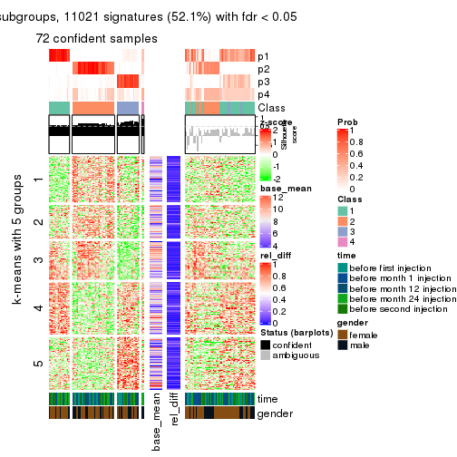</p>

</div>
<div id='tab-MAD-kmeans-get-signatures-4'>
<pre><code class="r">get_signatures(res, k = 5)
</code></pre>

<p></p>

</div>
<div id='tab-MAD-kmeans-get-signatures-5'>
<pre><code class="r">get_signatures(res, k = 6)
</code></pre>

<p></p>

</div>
</div>


Signature heatmaps where rows are not scaled:


<script>
$( function() {
	$( '#tabs-MAD-kmeans-get-signatures-no-scale' ).tabs();
} );
</script>
<div id='tabs-MAD-kmeans-get-signatures-no-scale'>
<ul>
<li><a href='#tab-MAD-kmeans-get-signatures-no-scale-1'>k = 2</a></li>
<li><a href='#tab-MAD-kmeans-get-signatures-no-scale-2'>k = 3</a></li>
<li><a href='#tab-MAD-kmeans-get-signatures-no-scale-3'>k = 4</a></li>
<li><a href='#tab-MAD-kmeans-get-signatures-no-scale-4'>k = 5</a></li>
<li><a href='#tab-MAD-kmeans-get-signatures-no-scale-5'>k = 6</a></li>
</ul>
<div id='tab-MAD-kmeans-get-signatures-no-scale-1'>
<pre><code class="r">get_signatures(res, k = 2, scale_rows = FALSE)
</code></pre>

<p></p>

</div>
<div id='tab-MAD-kmeans-get-signatures-no-scale-2'>
<pre><code class="r">get_signatures(res, k = 3, scale_rows = FALSE)
</code></pre>

<p></p>

</div>
<div id='tab-MAD-kmeans-get-signatures-no-scale-3'>
<pre><code class="r">get_signatures(res, k = 4, scale_rows = FALSE)
</code></pre>

<p></p>

</div>
<div id='tab-MAD-kmeans-get-signatures-no-scale-4'>
<pre><code class="r">get_signatures(res, k = 5, scale_rows = FALSE)
</code></pre>

<p></p>

</div>
<div id='tab-MAD-kmeans-get-signatures-no-scale-5'>
<pre><code class="r">get_signatures(res, k = 6, scale_rows = FALSE)
</code></pre>

<p></p>

</div>
</div>


Compare the overlap of signatures from different k:

```r
compare_signatures(res)
```


`get_signature()` returns a data frame invisibly. TO get the list of signatures, the function
call should be assigned to a variable explicitly. In following code, if `plot` argument is set
to `FALSE`, no heatmap is plotted while only the differential analysis is performed.

```r
# code only for demonstration
tb = get_signature(res, k = ..., plot = FALSE)
```

An example of the output of `tb` is:

```
#>   which_row         fdr    mean_1    mean_2 scaled_mean_1 scaled_mean_2 km
#> 1        38 0.042760348  8.373488  9.131774    -0.5533452     0.5164555  1
#> 2        40 0.018707592  7.106213  8.469186    -0.6173731     0.5762149  1
#> 3        55 0.019134737 10.221463 11.207825    -0.6159697     0.5749050  1
#> 4        59 0.006059896  5.921854  7.869574    -0.6899429     0.6439467  1
#> 5        60 0.018055526  8.928898 10.211722    -0.6204761     0.5791110  1
#> 6        98 0.009384629 15.714769 14.887706     0.6635654    -0.6193277  2
...
```

The columns in `tb` are:

1. `which_row`: row indices corresponding to the input matrix.
2. `fdr`: FDR for the differential test. 
3. `mean_x`: The mean value in group x.
4. `scaled_mean_x`: The mean value in group x after rows are scaled.
5. `km`: Row groups if k-means clustering is applied to rows.


UMAP plot which shows how samples are separated.


<script>
$( function() {
	$( '#tabs-MAD-kmeans-dimension-reduction' ).tabs();
} );
</script>
<div id='tabs-MAD-kmeans-dimension-reduction'>
<ul>
<li><a href='#tab-MAD-kmeans-dimension-reduction-1'>k = 2</a></li>
<li><a href='#tab-MAD-kmeans-dimension-reduction-2'>k = 3</a></li>
<li><a href='#tab-MAD-kmeans-dimension-reduction-3'>k = 4</a></li>
<li><a href='#tab-MAD-kmeans-dimension-reduction-4'>k = 5</a></li>
<li><a href='#tab-MAD-kmeans-dimension-reduction-5'>k = 6</a></li>
</ul>
<div id='tab-MAD-kmeans-dimension-reduction-1'>
<pre><code class="r">dimension_reduction(res, k = 2, method = &quot;UMAP&quot;)
</code></pre>

<p></p>

</div>
<div id='tab-MAD-kmeans-dimension-reduction-2'>
<pre><code class="r">dimension_reduction(res, k = 3, method = &quot;UMAP&quot;)
</code></pre>

<p></p>

</div>
<div id='tab-MAD-kmeans-dimension-reduction-3'>
<pre><code class="r">dimension_reduction(res, k = 4, method = &quot;UMAP&quot;)
</code></pre>

<p></p>

</div>
<div id='tab-MAD-kmeans-dimension-reduction-4'>
<pre><code class="r">dimension_reduction(res, k = 5, method = &quot;UMAP&quot;)
</code></pre>

<p></p>

</div>
<div id='tab-MAD-kmeans-dimension-reduction-5'>
<pre><code class="r">dimension_reduction(res, k = 6, method = &quot;UMAP&quot;)
</code></pre>

<p></p>

</div>
</div>


Following heatmap shows how subgroups are split when increasing `k`:

```r
collect_classes(res)
```


Test correlation between subgroups and known annotations. If the known
annotation is numeric, one-way ANOVA test is applied, and if the known
annotation is discrete, chi-squared contingency table test is applied.

```r
test_to_known_factors(res)
```

```
#>              n time(p) gender(p) k
#> MAD:kmeans 121   0.547    0.2171 2
#> MAD:kmeans  97   0.262    0.3932 3
#> MAD:kmeans  72   0.256    0.1513 4
#> MAD:kmeans  95   0.102    0.0531 5
#> MAD:kmeans 117   0.464    0.1420 6
```


If matrix rows can be associated to genes, consider to use `GO_Enrichment(res,
...)` to perform function enrichment for the signature genes.


 

---------------------------------------------------


### MAD:skmeans**


The object with results only for a single top-value method and a single partition method 
can be extracted as:

```r
res = res_list["MAD", "skmeans"]
# you can also extract it by
# res = res_list["MAD:skmeans"]
```

A summary of `res` and all the functions that can be applied to it:

```r
res
```

```
#> A 'ConsensusPartition' object with k = 2, 3, 4, 5, 6.
#>   On a matrix with 21168 rows and 125 columns.
#>   Top rows (1000, 2000, 3000, 4000, 5000) are extracted by 'MAD' method.
#>   Subgroups are detected by 'skmeans' method.
#>   Performed in total 1250 partitions by row resampling.
#>   Best k for subgroups seems to be 2.
#> 
#> Following methods can be applied to this 'ConsensusPartition' object:
#>  [1] "cola_report"             "collect_classes"         "collect_plots"          
#>  [4] "collect_stats"           "colnames"                "compare_signatures"     
#>  [7] "consensus_heatmap"       "dimension_reduction"     "functional_enrichment"  
#> [10] "get_anno_col"            "get_anno"                "get_classes"            
#> [13] "get_consensus"           "get_matrix"              "get_membership"         
#> [16] "get_param"               "get_signatures"          "get_stats"              
#> [19] "is_best_k"               "is_stable_k"             "membership_heatmap"     
#> [22] "ncol"                    "nrow"                    "plot_ecdf"              
#> [25] "rownames"                "select_partition_number" "show"                   
#> [28] "suggest_best_k"          "test_to_known_factors"
```

`collect_plots()` function collects all the plots made from `res` for all `k` (number of partitions)
into one single page to provide an easy and fast comparison between different `k`.

```r
collect_plots(res)
```


The plots are:

- The first row: a plot of the ECDF (Empirical cumulative distribution
  function) curves of the consensus matrix for each `k` and the heatmap of
  predicted classes for each `k`.
- The second row: heatmaps of the consensus matrix for each `k`.
- The third row: heatmaps of the membership matrix for each `k`.
- The fouth row: heatmaps of the signatures for each `k`.

All the plots in panels can be made by individual functions and they are
plotted later in this section.

`select_partition_number()` produces several plots showing different
statistics for choosing "optimized" `k`. There are following statistics:

- ECDF curves of the consensus matrix for each `k`;
- 1-PAC. [The PAC
  score](https://en.wikipedia.org/wiki/Consensus_clustering#Over-interpretation_potential_of_consensus_clustering)
  measures the proportion of the ambiguous subgrouping.
- Mean silhouette score.
- Concordance. The mean probability of fiting the consensus class ids in all
  partitions.
- Area increased. Denote $A_k$ as the area under the ECDF curve for current
  `k`, the area increased is defined as $A_k - A_{k-1}$.
- Rand index. The percent of pairs of samples that are both in a same cluster
  or both are not in a same cluster in the partition of k and k-1.
- Jaccard index. The ratio of pairs of samples are both in a same cluster in
  the partition of k and k-1 and the pairs of samples are both in a same
  cluster in the partition k or k-1.

The detailed explanations of these statistics can be found in [the cola
vignette](http://bioconductor.org/packages/devel/bioc/vignettes/cola/inst/doc/cola.html#toc_13).

Generally speaking, lower PAC score, higher mean silhouette score or higher
concordance corresponds to better partition. Rand index and Jaccard index
measure how similar the current partition is compared to partition with `k-1`.
If they are too similar, we won't accept `k` is better than `k-1`.

```r
select_partition_number(res)
```


The numeric values for all these statistics can be obtained by `get_stats()`.

```r
get_stats(res)
```

```
#>   k 1-PAC mean_silhouette concordance area_increased  Rand Jaccard
#> 2 2 0.984           0.946       0.978         0.5039 0.496   0.496
#> 3 3 0.701           0.797       0.895         0.3050 0.800   0.616
#> 4 4 0.547           0.665       0.808         0.1303 0.827   0.551
#> 5 5 0.542           0.480       0.663         0.0625 0.964   0.863
#> 6 6 0.570           0.356       0.609         0.0416 0.938   0.758
```

`suggest_best_k()` suggests the best $k$ based on these statistics. The rules are as follows:

- All $k$ with Jaccard index larger than 0.95 are removed because the increase of
  the partition number does not provides enough extra information. If all $k$ are removed,
  the best $k$ is assigned by `NA`.
- For $k$ with 1-PAC larger than 0.9, the maximal $k$ is taken as the "best k". Other $k$ is called "optional k".
- If it does not fit the second rule. The $k$ with the highest vote of highest
  1-PAC, mean silhouette and concordance is taken as the "best k".

```r
suggest_best_k(res)
```

```
#> [1] 2
```


Following shows the table of the partitions (You need to click the **show/hide
code output** link to see it). The membership matrix (columns with name `p*`)
is inferred by
[`clue::cl_consensus()`](https://www.rdocumentation.org/link/cl_consensus?package=clue)
function with the `SE` method. Basically the value in the membership matrix
represents the probability to belong to a certain group. The finall class
label for an item is determined with the group with highest probability it
belongs to.

In `get_classes()` function, the entropy is calculated from the membership
matrix and the silhouette score is calculated from the consensus matrix.


<script>
$( function() {
	$( '#tabs-MAD-skmeans-get-classes' ).tabs();
} );
</script>
<div id='tabs-MAD-skmeans-get-classes'>
<ul>
<li><a href='#tab-MAD-skmeans-get-classes-1'>k = 2</a></li>
<li><a href='#tab-MAD-skmeans-get-classes-2'>k = 3</a></li>
<li><a href='#tab-MAD-skmeans-get-classes-3'>k = 4</a></li>
<li><a href='#tab-MAD-skmeans-get-classes-4'>k = 5</a></li>
<li><a href='#tab-MAD-skmeans-get-classes-5'>k = 6</a></li>
</ul>

<div id='tab-MAD-skmeans-get-classes-1'>
<p><a id='tab-MAD-skmeans-get-classes-1-a' style='color:#0366d6' href='#'>show/hide code output</a></p>
<pre><code class="r">cbind(get_classes(res, k = 2), get_membership(res, k = 2))
</code></pre>

<pre><code>#&gt;           class entropy silhouette    p1    p2
#&gt; GSM601752     2  0.0000     0.9734 0.000 1.000
#&gt; GSM601782     1  0.0000     0.9815 1.000 0.000
#&gt; GSM601792     1  0.0000     0.9815 1.000 0.000
#&gt; GSM601797     2  0.7745     0.7045 0.228 0.772
#&gt; GSM601827     1  0.0000     0.9815 1.000 0.000
#&gt; GSM601837     2  0.0000     0.9734 0.000 1.000
#&gt; GSM601842     2  0.0000     0.9734 0.000 1.000
#&gt; GSM601857     1  0.0000     0.9815 1.000 0.000
#&gt; GSM601867     1  0.9686     0.3419 0.604 0.396
#&gt; GSM601747     1  0.0000     0.9815 1.000 0.000
#&gt; GSM601757     1  0.0000     0.9815 1.000 0.000
#&gt; GSM601762     2  0.0000     0.9734 0.000 1.000
#&gt; GSM601767     2  0.0000     0.9734 0.000 1.000
#&gt; GSM601772     2  0.0000     0.9734 0.000 1.000
#&gt; GSM601777     1  0.3114     0.9307 0.944 0.056
#&gt; GSM601787     2  0.7883     0.6869 0.236 0.764
#&gt; GSM601802     2  0.0000     0.9734 0.000 1.000
#&gt; GSM601807     1  0.2423     0.9469 0.960 0.040
#&gt; GSM601812     1  0.0000     0.9815 1.000 0.000
#&gt; GSM601817     1  0.0000     0.9815 1.000 0.000
#&gt; GSM601822     2  1.0000     0.0277 0.496 0.504
#&gt; GSM601832     2  0.0000     0.9734 0.000 1.000
#&gt; GSM601847     2  0.1633     0.9541 0.024 0.976
#&gt; GSM601852     1  0.0000     0.9815 1.000 0.000
#&gt; GSM601862     1  0.0000     0.9815 1.000 0.000
#&gt; GSM601753     2  0.0000     0.9734 0.000 1.000
#&gt; GSM601783     1  0.0000     0.9815 1.000 0.000
#&gt; GSM601793     1  0.0000     0.9815 1.000 0.000
#&gt; GSM601798     2  0.0000     0.9734 0.000 1.000
#&gt; GSM601828     1  0.0000     0.9815 1.000 0.000
#&gt; GSM601838     2  0.0000     0.9734 0.000 1.000
#&gt; GSM601843     2  0.0000     0.9734 0.000 1.000
#&gt; GSM601858     2  0.0000     0.9734 0.000 1.000
#&gt; GSM601868     1  0.0000     0.9815 1.000 0.000
#&gt; GSM601748     1  0.0000     0.9815 1.000 0.000
#&gt; GSM601758     1  0.0000     0.9815 1.000 0.000
#&gt; GSM601763     2  0.9491     0.4320 0.368 0.632
#&gt; GSM601768     2  0.0000     0.9734 0.000 1.000
#&gt; GSM601773     2  0.0000     0.9734 0.000 1.000
#&gt; GSM601778     1  0.0000     0.9815 1.000 0.000
#&gt; GSM601788     2  0.0000     0.9734 0.000 1.000
#&gt; GSM601803     2  0.0000     0.9734 0.000 1.000
#&gt; GSM601808     1  0.0000     0.9815 1.000 0.000
#&gt; GSM601813     1  0.0000     0.9815 1.000 0.000
#&gt; GSM601818     1  0.0000     0.9815 1.000 0.000
#&gt; GSM601823     1  0.0000     0.9815 1.000 0.000
#&gt; GSM601833     2  0.0000     0.9734 0.000 1.000
#&gt; GSM601848     1  0.0000     0.9815 1.000 0.000
#&gt; GSM601853     1  0.0000     0.9815 1.000 0.000
#&gt; GSM601863     1  0.0000     0.9815 1.000 0.000
#&gt; GSM601754     2  0.0000     0.9734 0.000 1.000
#&gt; GSM601784     2  0.0000     0.9734 0.000 1.000
#&gt; GSM601794     1  0.0000     0.9815 1.000 0.000
#&gt; GSM601799     2  0.0000     0.9734 0.000 1.000
#&gt; GSM601829     1  0.0000     0.9815 1.000 0.000
#&gt; GSM601839     2  0.0000     0.9734 0.000 1.000
#&gt; GSM601844     1  0.0000     0.9815 1.000 0.000
#&gt; GSM601859     2  0.0000     0.9734 0.000 1.000
#&gt; GSM601869     1  0.0000     0.9815 1.000 0.000
#&gt; GSM601749     1  0.0000     0.9815 1.000 0.000
#&gt; GSM601759     1  0.0000     0.9815 1.000 0.000
#&gt; GSM601764     1  0.0000     0.9815 1.000 0.000
#&gt; GSM601769     2  0.0000     0.9734 0.000 1.000
#&gt; GSM601774     2  0.0000     0.9734 0.000 1.000
#&gt; GSM601779     1  0.0000     0.9815 1.000 0.000
#&gt; GSM601789     2  0.0000     0.9734 0.000 1.000
#&gt; GSM601804     2  0.0938     0.9644 0.012 0.988
#&gt; GSM601809     1  0.1184     0.9684 0.984 0.016
#&gt; GSM601814     2  0.0000     0.9734 0.000 1.000
#&gt; GSM601819     1  0.0000     0.9815 1.000 0.000
#&gt; GSM601824     2  0.5294     0.8550 0.120 0.880
#&gt; GSM601834     2  0.0000     0.9734 0.000 1.000
#&gt; GSM601849     1  0.0000     0.9815 1.000 0.000
#&gt; GSM601854     1  0.0000     0.9815 1.000 0.000
#&gt; GSM601864     2  0.0000     0.9734 0.000 1.000
#&gt; GSM601755     2  0.0000     0.9734 0.000 1.000
#&gt; GSM601785     2  0.0000     0.9734 0.000 1.000
#&gt; GSM601795     1  0.0376     0.9785 0.996 0.004
#&gt; GSM601800     2  0.0000     0.9734 0.000 1.000
#&gt; GSM601830     1  0.2043     0.9544 0.968 0.032
#&gt; GSM601840     2  0.0000     0.9734 0.000 1.000
#&gt; GSM601845     2  0.1843     0.9509 0.028 0.972
#&gt; GSM601860     2  0.0000     0.9734 0.000 1.000
#&gt; GSM601870     1  0.4690     0.8808 0.900 0.100
#&gt; GSM601750     1  0.0000     0.9815 1.000 0.000
#&gt; GSM601760     1  0.0000     0.9815 1.000 0.000
#&gt; GSM601765     2  0.0000     0.9734 0.000 1.000
#&gt; GSM601770     2  0.0000     0.9734 0.000 1.000
#&gt; GSM601775     2  0.0938     0.9643 0.012 0.988
#&gt; GSM601780     1  0.0000     0.9815 1.000 0.000
#&gt; GSM601790     2  0.0000     0.9734 0.000 1.000
#&gt; GSM601805     2  0.0000     0.9734 0.000 1.000
#&gt; GSM601810     1  0.0000     0.9815 1.000 0.000
#&gt; GSM601815     2  0.0000     0.9734 0.000 1.000
#&gt; GSM601820     1  0.0000     0.9815 1.000 0.000
#&gt; GSM601825     2  0.0000     0.9734 0.000 1.000
#&gt; GSM601835     2  0.0000     0.9734 0.000 1.000
#&gt; GSM601850     1  0.2236     0.9506 0.964 0.036
#&gt; GSM601855     1  0.0376     0.9785 0.996 0.004
#&gt; GSM601865     2  0.0000     0.9734 0.000 1.000
#&gt; GSM601756     2  0.0000     0.9734 0.000 1.000
#&gt; GSM601786     2  0.0000     0.9734 0.000 1.000
#&gt; GSM601796     1  0.0000     0.9815 1.000 0.000
#&gt; GSM601801     2  0.0000     0.9734 0.000 1.000
#&gt; GSM601831     1  0.0000     0.9815 1.000 0.000
#&gt; GSM601841     1  0.0000     0.9815 1.000 0.000
#&gt; GSM601846     2  0.0000     0.9734 0.000 1.000
#&gt; GSM601861     2  0.0000     0.9734 0.000 1.000
#&gt; GSM601871     1  0.9896     0.2105 0.560 0.440
#&gt; GSM601751     2  0.0000     0.9734 0.000 1.000
#&gt; GSM601761     1  0.0000     0.9815 1.000 0.000
#&gt; GSM601766     2  0.2236     0.9438 0.036 0.964
#&gt; GSM601771     2  0.0000     0.9734 0.000 1.000
#&gt; GSM601776     1  0.0000     0.9815 1.000 0.000
#&gt; GSM601781     1  0.0000     0.9815 1.000 0.000
#&gt; GSM601791     1  0.0000     0.9815 1.000 0.000
#&gt; GSM601806     2  0.0000     0.9734 0.000 1.000
#&gt; GSM601811     1  0.0000     0.9815 1.000 0.000
#&gt; GSM601816     1  0.0000     0.9815 1.000 0.000
#&gt; GSM601821     2  0.0000     0.9734 0.000 1.000
#&gt; GSM601826     1  0.0000     0.9815 1.000 0.000
#&gt; GSM601836     1  0.0376     0.9785 0.996 0.004
#&gt; GSM601851     1  0.0000     0.9815 1.000 0.000
#&gt; GSM601856     1  0.0000     0.9815 1.000 0.000
#&gt; GSM601866     1  0.0000     0.9815 1.000 0.000
</code></pre>

<script>
$('#tab-MAD-skmeans-get-classes-1-a').parent().next().next().hide();
$('#tab-MAD-skmeans-get-classes-1-a').click(function(){
  $('#tab-MAD-skmeans-get-classes-1-a').parent().next().next().toggle();
  return(false);
});
</script>
</div>

<div id='tab-MAD-skmeans-get-classes-2'>
<p><a id='tab-MAD-skmeans-get-classes-2-a' style='color:#0366d6' href='#'>show/hide code output</a></p>
<pre><code class="r">cbind(get_classes(res, k = 3), get_membership(res, k = 3))
</code></pre>

<pre><code>#&gt;           class entropy silhouette    p1    p2    p3
#&gt; GSM601752     2  0.3816     0.8537 0.148 0.852 0.000
#&gt; GSM601782     3  0.3192     0.8269 0.112 0.000 0.888
#&gt; GSM601792     1  0.0892     0.8444 0.980 0.000 0.020
#&gt; GSM601797     1  0.8722     0.4638 0.592 0.216 0.192
#&gt; GSM601827     3  0.2711     0.8401 0.088 0.000 0.912
#&gt; GSM601837     2  0.0237     0.9322 0.004 0.996 0.000
#&gt; GSM601842     2  0.0000     0.9325 0.000 1.000 0.000
#&gt; GSM601857     3  0.0237     0.8482 0.004 0.000 0.996
#&gt; GSM601867     3  0.2400     0.8017 0.004 0.064 0.932
#&gt; GSM601747     3  0.4663     0.7845 0.156 0.016 0.828
#&gt; GSM601757     3  0.3686     0.8090 0.140 0.000 0.860
#&gt; GSM601762     2  0.0000     0.9325 0.000 1.000 0.000
#&gt; GSM601767     2  0.0237     0.9323 0.004 0.996 0.000
#&gt; GSM601772     2  0.0000     0.9325 0.000 1.000 0.000
#&gt; GSM601777     1  0.7366     0.1868 0.524 0.032 0.444
#&gt; GSM601787     3  0.4110     0.7158 0.004 0.152 0.844
#&gt; GSM601802     2  0.2711     0.9003 0.088 0.912 0.000
#&gt; GSM601807     3  0.0829     0.8416 0.012 0.004 0.984
#&gt; GSM601812     3  0.2448     0.8444 0.076 0.000 0.924
#&gt; GSM601817     3  0.1031     0.8506 0.024 0.000 0.976
#&gt; GSM601822     1  0.1453     0.8252 0.968 0.024 0.008
#&gt; GSM601832     2  0.0829     0.9298 0.004 0.984 0.012
#&gt; GSM601847     1  0.5450     0.6104 0.760 0.228 0.012
#&gt; GSM601852     3  0.3482     0.8184 0.128 0.000 0.872
#&gt; GSM601862     3  0.0000     0.8477 0.000 0.000 1.000
#&gt; GSM601753     2  0.2878     0.8953 0.096 0.904 0.000
#&gt; GSM601783     3  0.5785     0.5819 0.332 0.000 0.668
#&gt; GSM601793     1  0.3551     0.8196 0.868 0.000 0.132
#&gt; GSM601798     2  0.2711     0.9003 0.088 0.912 0.000
#&gt; GSM601828     3  0.2711     0.8396 0.088 0.000 0.912
#&gt; GSM601838     2  0.0237     0.9322 0.004 0.996 0.000
#&gt; GSM601843     2  0.0000     0.9325 0.000 1.000 0.000
#&gt; GSM601858     2  0.3030     0.8680 0.004 0.904 0.092
#&gt; GSM601868     3  0.0000     0.8477 0.000 0.000 1.000
#&gt; GSM601748     3  0.3192     0.8305 0.112 0.000 0.888
#&gt; GSM601758     3  0.6299     0.2092 0.476 0.000 0.524
#&gt; GSM601763     1  0.2793     0.8392 0.928 0.044 0.028
#&gt; GSM601768     2  0.0000     0.9325 0.000 1.000 0.000
#&gt; GSM601773     2  0.0237     0.9323 0.004 0.996 0.000
#&gt; GSM601778     1  0.3038     0.8085 0.896 0.000 0.104
#&gt; GSM601788     2  0.0983     0.9265 0.004 0.980 0.016
#&gt; GSM601803     2  0.2448     0.9067 0.076 0.924 0.000
#&gt; GSM601808     3  0.0000     0.8477 0.000 0.000 1.000
#&gt; GSM601813     3  0.5835     0.5633 0.340 0.000 0.660
#&gt; GSM601818     3  0.1529     0.8505 0.040 0.000 0.960
#&gt; GSM601823     1  0.1964     0.8510 0.944 0.000 0.056
#&gt; GSM601833     2  0.0000     0.9325 0.000 1.000 0.000
#&gt; GSM601848     1  0.1964     0.8510 0.944 0.000 0.056
#&gt; GSM601853     3  0.0000     0.8477 0.000 0.000 1.000
#&gt; GSM601863     3  0.0592     0.8496 0.012 0.000 0.988
#&gt; GSM601754     2  0.4842     0.7698 0.224 0.776 0.000
#&gt; GSM601784     2  0.0000     0.9325 0.000 1.000 0.000
#&gt; GSM601794     1  0.1411     0.8445 0.964 0.000 0.036
#&gt; GSM601799     2  0.5016     0.7473 0.240 0.760 0.000
#&gt; GSM601829     1  0.6299     0.0603 0.524 0.000 0.476
#&gt; GSM601839     2  0.0237     0.9322 0.004 0.996 0.000
#&gt; GSM601844     1  0.4002     0.7804 0.840 0.000 0.160
#&gt; GSM601859     2  0.0237     0.9323 0.004 0.996 0.000
#&gt; GSM601869     3  0.1529     0.8504 0.040 0.000 0.960
#&gt; GSM601749     3  0.6225     0.3553 0.432 0.000 0.568
#&gt; GSM601759     3  0.5905     0.5476 0.352 0.000 0.648
#&gt; GSM601764     1  0.3459     0.8319 0.892 0.012 0.096
#&gt; GSM601769     2  0.0000     0.9325 0.000 1.000 0.000
#&gt; GSM601774     2  0.0237     0.9323 0.004 0.996 0.000
#&gt; GSM601779     1  0.1753     0.8509 0.952 0.000 0.048
#&gt; GSM601789     2  0.0237     0.9322 0.004 0.996 0.000
#&gt; GSM601804     1  0.4121     0.6945 0.832 0.168 0.000
#&gt; GSM601809     3  0.4821     0.8015 0.088 0.064 0.848
#&gt; GSM601814     2  0.0000     0.9325 0.000 1.000 0.000
#&gt; GSM601819     3  0.6299     0.1790 0.476 0.000 0.524
#&gt; GSM601824     1  0.0237     0.8343 0.996 0.004 0.000
#&gt; GSM601834     2  0.0000     0.9325 0.000 1.000 0.000
#&gt; GSM601849     1  0.2448     0.8468 0.924 0.000 0.076
#&gt; GSM601854     3  0.5254     0.6841 0.264 0.000 0.736
#&gt; GSM601864     2  0.0237     0.9322 0.004 0.996 0.000
#&gt; GSM601755     2  0.2711     0.9003 0.088 0.912 0.000
#&gt; GSM601785     2  0.1529     0.9156 0.040 0.960 0.000
#&gt; GSM601795     1  0.0592     0.8395 0.988 0.000 0.012
#&gt; GSM601800     2  0.2796     0.8980 0.092 0.908 0.000
#&gt; GSM601830     3  0.0237     0.8461 0.000 0.004 0.996
#&gt; GSM601840     2  0.6764     0.7254 0.108 0.744 0.148
#&gt; GSM601845     2  0.8939     0.1710 0.340 0.520 0.140
#&gt; GSM601860     2  0.0592     0.9299 0.012 0.988 0.000
#&gt; GSM601870     3  0.0983     0.8381 0.004 0.016 0.980
#&gt; GSM601750     3  0.3482     0.8177 0.128 0.000 0.872
#&gt; GSM601760     1  0.6062     0.3051 0.616 0.000 0.384
#&gt; GSM601765     2  0.0000     0.9325 0.000 1.000 0.000
#&gt; GSM601770     2  0.0237     0.9323 0.004 0.996 0.000
#&gt; GSM601775     2  0.4465     0.8083 0.176 0.820 0.004
#&gt; GSM601780     1  0.1860     0.8514 0.948 0.000 0.052
#&gt; GSM601790     2  0.0237     0.9322 0.004 0.996 0.000
#&gt; GSM601805     2  0.2711     0.9008 0.088 0.912 0.000
#&gt; GSM601810     3  0.0000     0.8477 0.000 0.000 1.000
#&gt; GSM601815     2  0.0237     0.9322 0.004 0.996 0.000
#&gt; GSM601820     3  0.5397     0.6630 0.280 0.000 0.720
#&gt; GSM601825     2  0.1964     0.9158 0.056 0.944 0.000
#&gt; GSM601835     2  0.1411     0.9165 0.000 0.964 0.036
#&gt; GSM601850     1  0.1905     0.8345 0.956 0.016 0.028
#&gt; GSM601855     3  0.0000     0.8477 0.000 0.000 1.000
#&gt; GSM601865     2  0.0475     0.9312 0.004 0.992 0.004
#&gt; GSM601756     2  0.2625     0.9025 0.084 0.916 0.000
#&gt; GSM601786     2  0.0237     0.9322 0.004 0.996 0.000
#&gt; GSM601796     1  0.3038     0.8329 0.896 0.000 0.104
#&gt; GSM601801     2  0.2261     0.9106 0.068 0.932 0.000
#&gt; GSM601831     3  0.1031     0.8502 0.024 0.000 0.976
#&gt; GSM601841     3  0.5968     0.4703 0.364 0.000 0.636
#&gt; GSM601846     2  0.8524     0.0778 0.448 0.460 0.092
#&gt; GSM601861     2  0.0237     0.9322 0.004 0.996 0.000
#&gt; GSM601871     3  0.4351     0.6988 0.004 0.168 0.828
#&gt; GSM601751     2  0.1129     0.9284 0.020 0.976 0.004
#&gt; GSM601761     1  0.3116     0.8252 0.892 0.000 0.108
#&gt; GSM601766     2  0.7768     0.3508 0.344 0.592 0.064
#&gt; GSM601771     2  0.0829     0.9314 0.012 0.984 0.004
#&gt; GSM601776     1  0.3482     0.8098 0.872 0.000 0.128
#&gt; GSM601781     1  0.1753     0.8454 0.952 0.000 0.048
#&gt; GSM601791     1  0.2796     0.8351 0.908 0.000 0.092
#&gt; GSM601806     2  0.2261     0.9106 0.068 0.932 0.000
#&gt; GSM601811     3  0.0000     0.8477 0.000 0.000 1.000
#&gt; GSM601816     1  0.1964     0.8511 0.944 0.000 0.056
#&gt; GSM601821     2  0.0237     0.9322 0.004 0.996 0.000
#&gt; GSM601826     1  0.2066     0.8500 0.940 0.000 0.060
#&gt; GSM601836     1  0.6527     0.2989 0.588 0.008 0.404
#&gt; GSM601851     1  0.2066     0.8500 0.940 0.000 0.060
#&gt; GSM601856     3  0.0000     0.8477 0.000 0.000 1.000
#&gt; GSM601866     3  0.2448     0.8444 0.076 0.000 0.924
</code></pre>

<script>
$('#tab-MAD-skmeans-get-classes-2-a').parent().next().next().hide();
$('#tab-MAD-skmeans-get-classes-2-a').click(function(){
  $('#tab-MAD-skmeans-get-classes-2-a').parent().next().next().toggle();
  return(false);
});
</script>
</div>

<div id='tab-MAD-skmeans-get-classes-3'>
<p><a id='tab-MAD-skmeans-get-classes-3-a' style='color:#0366d6' href='#'>show/hide code output</a></p>
<pre><code class="r">cbind(get_classes(res, k = 4), get_membership(res, k = 4))
</code></pre>

<pre><code>#&gt;           class entropy silhouette    p1    p2    p3    p4
#&gt; GSM601752     4  0.2376      0.788 0.016 0.068 0.000 0.916
#&gt; GSM601782     3  0.4891      0.587 0.308 0.000 0.680 0.012
#&gt; GSM601792     1  0.4775      0.583 0.740 0.000 0.028 0.232
#&gt; GSM601797     4  0.3076      0.736 0.048 0.016 0.036 0.900
#&gt; GSM601827     3  0.4323      0.694 0.204 0.000 0.776 0.020
#&gt; GSM601837     2  0.1545      0.881 0.000 0.952 0.008 0.040
#&gt; GSM601842     2  0.3142      0.851 0.008 0.860 0.000 0.132
#&gt; GSM601857     3  0.0895      0.767 0.020 0.000 0.976 0.004
#&gt; GSM601867     3  0.3486      0.689 0.000 0.092 0.864 0.044
#&gt; GSM601747     3  0.7911      0.371 0.296 0.128 0.532 0.044
#&gt; GSM601757     3  0.4564      0.547 0.328 0.000 0.672 0.000
#&gt; GSM601762     2  0.2976      0.874 0.008 0.872 0.000 0.120
#&gt; GSM601767     2  0.2610      0.878 0.012 0.900 0.000 0.088
#&gt; GSM601772     2  0.1854      0.883 0.012 0.940 0.000 0.048
#&gt; GSM601777     4  0.8416      0.223 0.228 0.028 0.324 0.420
#&gt; GSM601787     3  0.5416      0.508 0.000 0.260 0.692 0.048
#&gt; GSM601802     4  0.2469      0.794 0.000 0.108 0.000 0.892
#&gt; GSM601807     3  0.2115      0.737 0.004 0.024 0.936 0.036
#&gt; GSM601812     3  0.4990      0.503 0.352 0.000 0.640 0.008
#&gt; GSM601817     3  0.3597      0.738 0.148 0.000 0.836 0.016
#&gt; GSM601822     4  0.5543      0.197 0.444 0.012 0.004 0.540
#&gt; GSM601832     2  0.4507      0.772 0.012 0.776 0.012 0.200
#&gt; GSM601847     4  0.5087      0.606 0.228 0.024 0.012 0.736
#&gt; GSM601852     3  0.4897      0.551 0.332 0.000 0.660 0.008
#&gt; GSM601862     3  0.0707      0.768 0.020 0.000 0.980 0.000
#&gt; GSM601753     4  0.2530      0.793 0.000 0.112 0.000 0.888
#&gt; GSM601783     1  0.5161      0.231 0.592 0.000 0.400 0.008
#&gt; GSM601793     1  0.5637      0.654 0.720 0.000 0.168 0.112
#&gt; GSM601798     4  0.2589      0.793 0.000 0.116 0.000 0.884
#&gt; GSM601828     3  0.4313      0.649 0.260 0.000 0.736 0.004
#&gt; GSM601838     2  0.1356      0.884 0.000 0.960 0.008 0.032
#&gt; GSM601843     2  0.2480      0.876 0.008 0.904 0.000 0.088
#&gt; GSM601858     2  0.3550      0.818 0.000 0.860 0.096 0.044
#&gt; GSM601868     3  0.0779      0.767 0.016 0.000 0.980 0.004
#&gt; GSM601748     3  0.4746      0.595 0.304 0.000 0.688 0.008
#&gt; GSM601758     1  0.4647      0.481 0.704 0.000 0.288 0.008
#&gt; GSM601763     1  0.5003      0.589 0.768 0.084 0.000 0.148
#&gt; GSM601768     2  0.2402      0.882 0.012 0.912 0.000 0.076
#&gt; GSM601773     2  0.2805      0.870 0.012 0.888 0.000 0.100
#&gt; GSM601778     1  0.7324      0.210 0.500 0.004 0.144 0.352
#&gt; GSM601788     2  0.5118      0.695 0.004 0.736 0.040 0.220
#&gt; GSM601803     4  0.3266      0.761 0.000 0.168 0.000 0.832
#&gt; GSM601808     3  0.0336      0.765 0.008 0.000 0.992 0.000
#&gt; GSM601813     1  0.5070      0.323 0.620 0.000 0.372 0.008
#&gt; GSM601818     3  0.4095      0.714 0.192 0.000 0.792 0.016
#&gt; GSM601823     1  0.1677      0.717 0.948 0.000 0.012 0.040
#&gt; GSM601833     2  0.2473      0.878 0.012 0.908 0.000 0.080
#&gt; GSM601848     1  0.1488      0.718 0.956 0.000 0.012 0.032
#&gt; GSM601853     3  0.1059      0.767 0.016 0.000 0.972 0.012
#&gt; GSM601863     3  0.2530      0.752 0.112 0.000 0.888 0.000
#&gt; GSM601754     4  0.3149      0.790 0.032 0.088 0.000 0.880
#&gt; GSM601784     2  0.1452      0.890 0.008 0.956 0.000 0.036
#&gt; GSM601794     1  0.6538      0.444 0.600 0.000 0.108 0.292
#&gt; GSM601799     4  0.2662      0.781 0.016 0.084 0.000 0.900
#&gt; GSM601829     1  0.5842      0.144 0.520 0.000 0.448 0.032
#&gt; GSM601839     2  0.1356      0.884 0.000 0.960 0.008 0.032
#&gt; GSM601844     1  0.3999      0.674 0.824 0.000 0.140 0.036
#&gt; GSM601859     2  0.2528      0.884 0.008 0.908 0.004 0.080
#&gt; GSM601869     3  0.2868      0.743 0.136 0.000 0.864 0.000
#&gt; GSM601749     1  0.4819      0.381 0.652 0.000 0.344 0.004
#&gt; GSM601759     1  0.4920      0.322 0.628 0.000 0.368 0.004
#&gt; GSM601764     1  0.2405      0.704 0.928 0.020 0.016 0.036
#&gt; GSM601769     2  0.1305      0.890 0.000 0.960 0.004 0.036
#&gt; GSM601774     2  0.1970      0.886 0.008 0.932 0.000 0.060
#&gt; GSM601779     1  0.1584      0.717 0.952 0.000 0.012 0.036
#&gt; GSM601789     2  0.1118      0.886 0.000 0.964 0.000 0.036
#&gt; GSM601804     4  0.4105      0.677 0.156 0.032 0.000 0.812
#&gt; GSM601809     3  0.8218      0.389 0.236 0.172 0.536 0.056
#&gt; GSM601814     2  0.1890      0.886 0.000 0.936 0.008 0.056
#&gt; GSM601819     1  0.4673      0.487 0.700 0.000 0.292 0.008
#&gt; GSM601824     1  0.5024      0.304 0.632 0.008 0.000 0.360
#&gt; GSM601834     2  0.2179      0.884 0.012 0.924 0.000 0.064
#&gt; GSM601849     1  0.1837      0.720 0.944 0.000 0.028 0.028
#&gt; GSM601854     3  0.5147      0.181 0.460 0.000 0.536 0.004
#&gt; GSM601864     2  0.2706      0.866 0.000 0.900 0.020 0.080
#&gt; GSM601755     4  0.2647      0.792 0.000 0.120 0.000 0.880
#&gt; GSM601785     2  0.4107      0.799 0.016 0.804 0.004 0.176
#&gt; GSM601795     4  0.5808      0.116 0.424 0.000 0.032 0.544
#&gt; GSM601800     4  0.2345      0.794 0.000 0.100 0.000 0.900
#&gt; GSM601830     3  0.1771      0.760 0.012 0.004 0.948 0.036
#&gt; GSM601840     4  0.8859      0.342 0.092 0.320 0.148 0.440
#&gt; GSM601845     2  0.8438      0.360 0.168 0.544 0.092 0.196
#&gt; GSM601860     2  0.2456      0.882 0.008 0.916 0.008 0.068
#&gt; GSM601870     3  0.1936      0.738 0.000 0.032 0.940 0.028
#&gt; GSM601750     3  0.5099      0.444 0.380 0.000 0.612 0.008
#&gt; GSM601760     1  0.3668      0.617 0.808 0.000 0.188 0.004
#&gt; GSM601765     2  0.2473      0.878 0.012 0.908 0.000 0.080
#&gt; GSM601770     2  0.2473      0.879 0.012 0.908 0.000 0.080
#&gt; GSM601775     4  0.7396      0.368 0.156 0.340 0.004 0.500
#&gt; GSM601780     1  0.1388      0.718 0.960 0.000 0.012 0.028
#&gt; GSM601790     2  0.1151      0.886 0.000 0.968 0.008 0.024
#&gt; GSM601805     4  0.2921      0.783 0.000 0.140 0.000 0.860
#&gt; GSM601810     3  0.1545      0.769 0.040 0.000 0.952 0.008
#&gt; GSM601815     2  0.1545      0.885 0.000 0.952 0.008 0.040
#&gt; GSM601820     1  0.5112      0.124 0.560 0.000 0.436 0.004
#&gt; GSM601825     4  0.5126      0.223 0.004 0.444 0.000 0.552
#&gt; GSM601835     2  0.4179      0.823 0.004 0.832 0.060 0.104
#&gt; GSM601850     1  0.5713      0.403 0.640 0.004 0.036 0.320
#&gt; GSM601855     3  0.1443      0.756 0.008 0.004 0.960 0.028
#&gt; GSM601865     2  0.1635      0.881 0.000 0.948 0.008 0.044
#&gt; GSM601756     4  0.2647      0.791 0.000 0.120 0.000 0.880
#&gt; GSM601786     2  0.1722      0.881 0.000 0.944 0.008 0.048
#&gt; GSM601796     1  0.6724      0.587 0.612 0.000 0.164 0.224
#&gt; GSM601801     4  0.2868      0.785 0.000 0.136 0.000 0.864
#&gt; GSM601831     3  0.2376      0.765 0.068 0.000 0.916 0.016
#&gt; GSM601841     1  0.6419      0.186 0.512 0.000 0.420 0.068
#&gt; GSM601846     4  0.6322      0.653 0.056 0.188 0.052 0.704
#&gt; GSM601861     2  0.1635      0.884 0.000 0.948 0.008 0.044
#&gt; GSM601871     3  0.5312      0.532 0.000 0.236 0.712 0.052
#&gt; GSM601751     2  0.4124      0.787 0.012 0.812 0.012 0.164
#&gt; GSM601761     1  0.1356      0.716 0.960 0.000 0.032 0.008
#&gt; GSM601766     2  0.7507      0.463 0.224 0.588 0.028 0.160
#&gt; GSM601771     2  0.5308      0.664 0.012 0.708 0.024 0.256
#&gt; GSM601776     1  0.2413      0.711 0.916 0.000 0.064 0.020
#&gt; GSM601781     1  0.5569      0.622 0.736 0.008 0.080 0.176
#&gt; GSM601791     1  0.1610      0.717 0.952 0.000 0.032 0.016
#&gt; GSM601806     4  0.3688      0.724 0.000 0.208 0.000 0.792
#&gt; GSM601811     3  0.1584      0.769 0.036 0.000 0.952 0.012
#&gt; GSM601816     1  0.2111      0.716 0.932 0.000 0.024 0.044
#&gt; GSM601821     2  0.1635      0.884 0.000 0.948 0.008 0.044
#&gt; GSM601826     1  0.1488      0.718 0.956 0.000 0.012 0.032
#&gt; GSM601836     1  0.7955      0.346 0.540 0.076 0.296 0.088
#&gt; GSM601851     1  0.1174      0.718 0.968 0.000 0.012 0.020
#&gt; GSM601856     3  0.0804      0.764 0.008 0.000 0.980 0.012
#&gt; GSM601866     3  0.4781      0.540 0.336 0.000 0.660 0.004
</code></pre>

<script>
$('#tab-MAD-skmeans-get-classes-3-a').parent().next().next().hide();
$('#tab-MAD-skmeans-get-classes-3-a').click(function(){
  $('#tab-MAD-skmeans-get-classes-3-a').parent().next().next().toggle();
  return(false);
});
</script>
</div>

<div id='tab-MAD-skmeans-get-classes-4'>
<p><a id='tab-MAD-skmeans-get-classes-4-a' style='color:#0366d6' href='#'>show/hide code output</a></p>
<pre><code class="r">cbind(get_classes(res, k = 5), get_membership(res, k = 5))
</code></pre>

<pre><code>#&gt;           class entropy silhouette    p1    p2    p3    p4    p5
#&gt; GSM601752     4   0.140     0.7032 0.008 0.020 0.000 0.956 0.016
#&gt; GSM601782     3   0.614     0.5125 0.204 0.000 0.596 0.008 0.192
#&gt; GSM601792     1   0.635     0.4401 0.608 0.000 0.028 0.168 0.196
#&gt; GSM601797     4   0.443     0.6183 0.052 0.004 0.020 0.788 0.136
#&gt; GSM601827     3   0.522     0.5853 0.180 0.000 0.684 0.000 0.136
#&gt; GSM601837     2   0.227     0.6978 0.000 0.908 0.004 0.016 0.072
#&gt; GSM601842     2   0.572     0.5378 0.000 0.616 0.000 0.144 0.240
#&gt; GSM601857     3   0.290     0.6548 0.036 0.000 0.868 0.000 0.096
#&gt; GSM601867     3   0.644     0.3044 0.000 0.176 0.568 0.016 0.240
#&gt; GSM601747     3   0.822     0.2472 0.176 0.064 0.432 0.036 0.292
#&gt; GSM601757     3   0.593     0.3936 0.320 0.000 0.564 0.004 0.112
#&gt; GSM601762     2   0.508     0.6437 0.000 0.700 0.000 0.160 0.140
#&gt; GSM601767     2   0.495     0.6705 0.000 0.712 0.000 0.124 0.164
#&gt; GSM601772     2   0.482     0.6695 0.000 0.704 0.000 0.076 0.220
#&gt; GSM601777     4   0.910    -0.0381 0.184 0.032 0.268 0.304 0.212
#&gt; GSM601787     3   0.718     0.0121 0.004 0.332 0.420 0.016 0.228
#&gt; GSM601802     4   0.246     0.7086 0.004 0.052 0.000 0.904 0.040
#&gt; GSM601807     3   0.431     0.5311 0.008 0.024 0.752 0.004 0.212
#&gt; GSM601812     3   0.554     0.5248 0.236 0.000 0.636 0.000 0.128
#&gt; GSM601817     3   0.487     0.6120 0.120 0.000 0.720 0.000 0.160
#&gt; GSM601822     1   0.646     0.1236 0.480 0.000 0.012 0.376 0.132
#&gt; GSM601832     2   0.657     0.3319 0.000 0.508 0.012 0.164 0.316
#&gt; GSM601847     4   0.636     0.4031 0.288 0.028 0.008 0.588 0.088
#&gt; GSM601852     3   0.549     0.5019 0.256 0.000 0.632 0.000 0.112
#&gt; GSM601862     3   0.274     0.6558 0.036 0.000 0.880 0.000 0.084
#&gt; GSM601753     4   0.224     0.7013 0.000 0.068 0.000 0.908 0.024
#&gt; GSM601783     1   0.627    -0.0885 0.440 0.000 0.428 0.004 0.128
#&gt; GSM601793     1   0.714     0.4576 0.552 0.000 0.188 0.076 0.184
#&gt; GSM601798     4   0.207     0.7089 0.000 0.048 0.000 0.920 0.032
#&gt; GSM601828     3   0.545     0.5334 0.216 0.000 0.652 0.000 0.132
#&gt; GSM601838     2   0.186     0.7086 0.000 0.932 0.004 0.016 0.048
#&gt; GSM601843     2   0.459     0.6694 0.000 0.728 0.000 0.068 0.204
#&gt; GSM601858     2   0.542     0.4922 0.000 0.704 0.092 0.028 0.176
#&gt; GSM601868     3   0.227     0.6465 0.020 0.000 0.904 0.000 0.076
#&gt; GSM601748     3   0.577     0.4646 0.272 0.000 0.608 0.004 0.116
#&gt; GSM601758     1   0.570     0.2480 0.576 0.000 0.320 0.000 0.104
#&gt; GSM601763     1   0.740    -0.1875 0.472 0.088 0.012 0.080 0.348
#&gt; GSM601768     2   0.502     0.6579 0.000 0.692 0.000 0.096 0.212
#&gt; GSM601773     2   0.493     0.6820 0.000 0.716 0.000 0.148 0.136
#&gt; GSM601778     1   0.778     0.2046 0.452 0.000 0.100 0.264 0.184
#&gt; GSM601788     2   0.606     0.4938 0.004 0.680 0.056 0.120 0.140
#&gt; GSM601803     4   0.313     0.6848 0.000 0.120 0.000 0.848 0.032
#&gt; GSM601808     3   0.239     0.6507 0.020 0.000 0.896 0.000 0.084
#&gt; GSM601813     1   0.597     0.1083 0.512 0.000 0.372 0.000 0.116
#&gt; GSM601818     3   0.551     0.5872 0.176 0.000 0.652 0.000 0.172
#&gt; GSM601823     1   0.288     0.5742 0.876 0.000 0.008 0.024 0.092
#&gt; GSM601833     2   0.514     0.6323 0.000 0.676 0.000 0.096 0.228
#&gt; GSM601848     1   0.259     0.5801 0.900 0.000 0.012 0.028 0.060
#&gt; GSM601853     3   0.202     0.6436 0.008 0.000 0.912 0.000 0.080
#&gt; GSM601863     3   0.356     0.6516 0.108 0.000 0.828 0.000 0.064
#&gt; GSM601754     4   0.274     0.6976 0.020 0.032 0.000 0.896 0.052
#&gt; GSM601784     2   0.388     0.7198 0.000 0.804 0.000 0.072 0.124
#&gt; GSM601794     1   0.774     0.3182 0.460 0.000 0.092 0.244 0.204
#&gt; GSM601799     4   0.255     0.6873 0.008 0.020 0.000 0.896 0.076
#&gt; GSM601829     1   0.665     0.0312 0.424 0.000 0.380 0.004 0.192
#&gt; GSM601839     2   0.168     0.7109 0.000 0.940 0.004 0.012 0.044
#&gt; GSM601844     1   0.627     0.4690 0.600 0.000 0.156 0.020 0.224
#&gt; GSM601859     2   0.397     0.7180 0.000 0.800 0.000 0.100 0.100
#&gt; GSM601869     3   0.427     0.6251 0.144 0.000 0.772 0.000 0.084
#&gt; GSM601749     1   0.581     0.1505 0.540 0.000 0.356 0.000 0.104
#&gt; GSM601759     1   0.579     0.1132 0.524 0.000 0.380 0.000 0.096
#&gt; GSM601764     1   0.528     0.3840 0.688 0.016 0.040 0.012 0.244
#&gt; GSM601769     2   0.317     0.7270 0.000 0.856 0.000 0.060 0.084
#&gt; GSM601774     2   0.374     0.7183 0.000 0.816 0.000 0.076 0.108
#&gt; GSM601779     1   0.186     0.5729 0.932 0.000 0.004 0.016 0.048
#&gt; GSM601789     2   0.240     0.7109 0.000 0.904 0.004 0.024 0.068
#&gt; GSM601804     4   0.464     0.5695 0.172 0.004 0.000 0.744 0.080
#&gt; GSM601809     3   0.891     0.0255 0.124 0.236 0.384 0.044 0.212
#&gt; GSM601814     2   0.239     0.7288 0.000 0.900 0.000 0.072 0.028
#&gt; GSM601819     1   0.632     0.2030 0.520 0.000 0.320 0.004 0.156
#&gt; GSM601824     1   0.583     0.3149 0.624 0.004 0.000 0.212 0.160
#&gt; GSM601834     2   0.454     0.6885 0.000 0.744 0.000 0.084 0.172
#&gt; GSM601849     1   0.289     0.5863 0.888 0.000 0.036 0.020 0.056
#&gt; GSM601854     3   0.589     0.2628 0.372 0.000 0.520 0.000 0.108
#&gt; GSM601864     2   0.411     0.6193 0.000 0.804 0.024 0.040 0.132
#&gt; GSM601755     4   0.219     0.7090 0.000 0.060 0.000 0.912 0.028
#&gt; GSM601785     2   0.619     0.5474 0.020 0.616 0.000 0.168 0.196
#&gt; GSM601795     4   0.735    -0.0489 0.368 0.000 0.044 0.404 0.184
#&gt; GSM601800     4   0.208     0.7064 0.004 0.040 0.000 0.924 0.032
#&gt; GSM601830     3   0.329     0.6061 0.004 0.008 0.816 0.000 0.172
#&gt; GSM601840     4   0.886    -0.0309 0.052 0.260 0.104 0.388 0.196
#&gt; GSM601845     5   0.880     0.4400 0.132 0.252 0.084 0.100 0.432
#&gt; GSM601860     2   0.514     0.6351 0.036 0.716 0.000 0.048 0.200
#&gt; GSM601870     3   0.459     0.5017 0.004 0.052 0.728 0.000 0.216
#&gt; GSM601750     3   0.590     0.4175 0.300 0.000 0.580 0.004 0.116
#&gt; GSM601760     1   0.490     0.4738 0.708 0.000 0.196 0.000 0.096
#&gt; GSM601765     2   0.528     0.5706 0.004 0.640 0.000 0.068 0.288
#&gt; GSM601770     2   0.472     0.6823 0.000 0.732 0.000 0.104 0.164
#&gt; GSM601775     4   0.866    -0.3084 0.112 0.248 0.020 0.328 0.292
#&gt; GSM601780     1   0.163     0.5788 0.944 0.000 0.004 0.016 0.036
#&gt; GSM601790     2   0.153     0.7173 0.000 0.948 0.004 0.012 0.036
#&gt; GSM601805     4   0.345     0.6858 0.008 0.116 0.000 0.840 0.036
#&gt; GSM601810     3   0.383     0.6523 0.048 0.000 0.796 0.000 0.156
#&gt; GSM601815     2   0.203     0.7130 0.000 0.924 0.004 0.020 0.052
#&gt; GSM601820     3   0.603     0.1389 0.416 0.000 0.468 0.000 0.116
#&gt; GSM601825     4   0.537     0.0915 0.000 0.416 0.000 0.528 0.056
#&gt; GSM601835     2   0.669     0.3271 0.000 0.540 0.048 0.104 0.308
#&gt; GSM601850     1   0.785     0.1747 0.480 0.024 0.052 0.224 0.220
#&gt; GSM601855     3   0.285     0.5961 0.004 0.000 0.840 0.000 0.156
#&gt; GSM601865     2   0.259     0.6808 0.000 0.888 0.012 0.008 0.092
#&gt; GSM601756     4   0.194     0.7083 0.000 0.056 0.000 0.924 0.020
#&gt; GSM601786     2   0.240     0.7056 0.000 0.904 0.004 0.024 0.068
#&gt; GSM601796     1   0.815     0.3020 0.424 0.000 0.164 0.208 0.204
#&gt; GSM601801     4   0.248     0.7051 0.000 0.084 0.000 0.892 0.024
#&gt; GSM601831     3   0.334     0.6571 0.060 0.000 0.844 0.000 0.096
#&gt; GSM601841     3   0.743    -0.0339 0.376 0.000 0.388 0.048 0.188
#&gt; GSM601846     4   0.867    -0.0524 0.076 0.096 0.108 0.376 0.344
#&gt; GSM601861     2   0.192     0.7196 0.000 0.928 0.000 0.040 0.032
#&gt; GSM601871     3   0.680     0.1023 0.000 0.276 0.468 0.008 0.248
#&gt; GSM601751     2   0.642     0.4651 0.032 0.620 0.004 0.168 0.176
#&gt; GSM601761     1   0.252     0.5766 0.896 0.000 0.052 0.000 0.052
#&gt; GSM601766     5   0.819     0.2261 0.116 0.328 0.036 0.092 0.428
#&gt; GSM601771     2   0.693     0.3556 0.028 0.572 0.016 0.220 0.164
#&gt; GSM601776     1   0.340     0.5776 0.852 0.000 0.072 0.008 0.068
#&gt; GSM601781     1   0.656     0.4162 0.640 0.012 0.060 0.108 0.180
#&gt; GSM601791     1   0.326     0.5814 0.856 0.000 0.040 0.008 0.096
#&gt; GSM601806     4   0.324     0.6566 0.000 0.152 0.000 0.828 0.020
#&gt; GSM601811     3   0.336     0.6484 0.036 0.000 0.832 0.000 0.132
#&gt; GSM601816     1   0.327     0.5637 0.852 0.000 0.008 0.032 0.108
#&gt; GSM601821     2   0.192     0.7204 0.000 0.928 0.000 0.036 0.036
#&gt; GSM601826     1   0.237     0.5826 0.912 0.000 0.016 0.020 0.052
#&gt; GSM601836     5   0.872    -0.0323 0.296 0.056 0.248 0.060 0.340
#&gt; GSM601851     1   0.188     0.5832 0.936 0.000 0.012 0.020 0.032
#&gt; GSM601856     3   0.225     0.6352 0.012 0.000 0.900 0.000 0.088
#&gt; GSM601866     3   0.516     0.5199 0.256 0.000 0.660 0.000 0.084
</code></pre>

<script>
$('#tab-MAD-skmeans-get-classes-4-a').parent().next().next().hide();
$('#tab-MAD-skmeans-get-classes-4-a').click(function(){
  $('#tab-MAD-skmeans-get-classes-4-a').parent().next().next().toggle();
  return(false);
});
</script>
</div>

<div id='tab-MAD-skmeans-get-classes-5'>
<p><a id='tab-MAD-skmeans-get-classes-5-a' style='color:#0366d6' href='#'>show/hide code output</a></p>
<pre><code class="r">cbind(get_classes(res, k = 6), get_membership(res, k = 6))
</code></pre>

<pre><code>#&gt;           class entropy silhouette    p1    p2    p3    p4    p5    p6
#&gt; GSM601752     4  0.1799     0.7591 0.008 0.016 0.000 0.936 0.024 0.016
#&gt; GSM601782     3  0.6601    -0.0311 0.340 0.000 0.460 0.004 0.056 0.140
#&gt; GSM601792     6  0.7128     0.4168 0.204 0.000 0.032 0.144 0.096 0.524
#&gt; GSM601797     4  0.4273     0.6730 0.072 0.000 0.028 0.800 0.060 0.040
#&gt; GSM601827     3  0.6553     0.1536 0.276 0.000 0.520 0.008 0.060 0.136
#&gt; GSM601837     2  0.2995     0.6474 0.048 0.864 0.004 0.012 0.072 0.000
#&gt; GSM601842     2  0.6087     0.1910 0.016 0.432 0.008 0.124 0.420 0.000
#&gt; GSM601857     3  0.3001     0.4318 0.128 0.000 0.840 0.000 0.008 0.024
#&gt; GSM601867     3  0.6017     0.2769 0.172 0.128 0.628 0.004 0.064 0.004
#&gt; GSM601747     1  0.8572     0.0764 0.336 0.056 0.296 0.036 0.188 0.088
#&gt; GSM601757     3  0.6227    -0.0694 0.256 0.000 0.476 0.000 0.016 0.252
#&gt; GSM601762     2  0.5128     0.5544 0.008 0.636 0.000 0.116 0.240 0.000
#&gt; GSM601767     2  0.4765     0.5882 0.008 0.664 0.000 0.076 0.252 0.000
#&gt; GSM601772     2  0.4877     0.5285 0.008 0.596 0.000 0.044 0.348 0.004
#&gt; GSM601777     3  0.9259    -0.1232 0.176 0.016 0.232 0.208 0.168 0.200
#&gt; GSM601787     3  0.6962     0.1430 0.160 0.272 0.476 0.008 0.084 0.000
#&gt; GSM601802     4  0.1498     0.7618 0.012 0.024 0.000 0.948 0.012 0.004
#&gt; GSM601807     3  0.4741     0.3681 0.200 0.020 0.708 0.004 0.068 0.000
#&gt; GSM601812     3  0.6445    -0.0919 0.292 0.000 0.464 0.000 0.032 0.212
#&gt; GSM601817     3  0.5754     0.1866 0.336 0.000 0.544 0.000 0.044 0.076
#&gt; GSM601822     6  0.7365     0.1787 0.112 0.000 0.012 0.232 0.200 0.444
#&gt; GSM601832     5  0.6144     0.0640 0.028 0.320 0.000 0.136 0.512 0.004
#&gt; GSM601847     4  0.7478     0.1501 0.084 0.024 0.008 0.424 0.140 0.320
#&gt; GSM601852     3  0.6439    -0.0334 0.260 0.000 0.500 0.000 0.044 0.196
#&gt; GSM601862     3  0.2993     0.4328 0.120 0.000 0.844 0.000 0.008 0.028
#&gt; GSM601753     4  0.2740     0.7493 0.012 0.040 0.000 0.884 0.056 0.008
#&gt; GSM601783     1  0.6601     0.3252 0.360 0.000 0.312 0.000 0.024 0.304
#&gt; GSM601793     6  0.7187     0.3774 0.244 0.000 0.088 0.060 0.092 0.516
#&gt; GSM601798     4  0.1982     0.7622 0.012 0.040 0.000 0.924 0.020 0.004
#&gt; GSM601828     3  0.5980     0.1130 0.280 0.000 0.552 0.000 0.036 0.132
#&gt; GSM601838     2  0.1844     0.6680 0.024 0.924 0.000 0.004 0.048 0.000
#&gt; GSM601843     2  0.5274     0.4533 0.008 0.568 0.004 0.076 0.344 0.000
#&gt; GSM601858     2  0.6172     0.4298 0.136 0.632 0.092 0.016 0.124 0.000
#&gt; GSM601868     3  0.2122     0.4403 0.084 0.000 0.900 0.000 0.008 0.008
#&gt; GSM601748     3  0.5796    -0.0725 0.352 0.000 0.480 0.000 0.004 0.164
#&gt; GSM601758     6  0.5839    -0.1513 0.284 0.000 0.184 0.000 0.008 0.524
#&gt; GSM601763     5  0.6575     0.1483 0.072 0.036 0.008 0.032 0.480 0.372
#&gt; GSM601768     2  0.5449     0.4793 0.032 0.564 0.000 0.052 0.348 0.004
#&gt; GSM601773     2  0.4938     0.6036 0.012 0.676 0.000 0.112 0.200 0.000
#&gt; GSM601778     6  0.8596     0.1616 0.184 0.004 0.096 0.168 0.188 0.360
#&gt; GSM601788     2  0.7097     0.3662 0.084 0.572 0.040 0.108 0.180 0.016
#&gt; GSM601803     4  0.2597     0.7466 0.008 0.088 0.000 0.880 0.020 0.004
#&gt; GSM601808     3  0.2622     0.4428 0.104 0.000 0.868 0.000 0.024 0.004
#&gt; GSM601813     6  0.6486    -0.3405 0.268 0.000 0.280 0.000 0.024 0.428
#&gt; GSM601818     3  0.6026     0.0192 0.352 0.000 0.492 0.000 0.028 0.128
#&gt; GSM601823     6  0.3697     0.5113 0.104 0.000 0.004 0.012 0.068 0.812
#&gt; GSM601833     2  0.4518     0.5146 0.004 0.612 0.000 0.036 0.348 0.000
#&gt; GSM601848     6  0.2750     0.5128 0.080 0.000 0.004 0.000 0.048 0.868
#&gt; GSM601853     3  0.2851     0.4381 0.132 0.000 0.844 0.000 0.020 0.004
#&gt; GSM601863     3  0.4241     0.3826 0.136 0.000 0.760 0.000 0.016 0.088
#&gt; GSM601754     4  0.3232     0.7403 0.040 0.028 0.000 0.864 0.048 0.020
#&gt; GSM601784     2  0.3803     0.6685 0.012 0.776 0.000 0.040 0.172 0.000
#&gt; GSM601794     6  0.8003     0.3232 0.232 0.000 0.056 0.216 0.104 0.392
#&gt; GSM601799     4  0.3704     0.7133 0.016 0.028 0.000 0.820 0.112 0.024
#&gt; GSM601829     3  0.7773    -0.1136 0.276 0.000 0.324 0.016 0.120 0.264
#&gt; GSM601839     2  0.1564     0.6708 0.024 0.936 0.000 0.000 0.040 0.000
#&gt; GSM601844     6  0.7438     0.1912 0.340 0.000 0.108 0.028 0.124 0.400
#&gt; GSM601859     2  0.4915     0.6188 0.024 0.708 0.000 0.096 0.168 0.004
#&gt; GSM601869     3  0.4584     0.3096 0.196 0.000 0.700 0.000 0.004 0.100
#&gt; GSM601749     6  0.6342    -0.3834 0.324 0.000 0.264 0.000 0.012 0.400
#&gt; GSM601759     6  0.6169    -0.3856 0.320 0.000 0.268 0.000 0.004 0.408
#&gt; GSM601764     6  0.6522     0.1979 0.172 0.004 0.036 0.000 0.332 0.456
#&gt; GSM601769     2  0.2362     0.6754 0.000 0.860 0.000 0.004 0.136 0.000
#&gt; GSM601774     2  0.3761     0.6463 0.008 0.764 0.000 0.032 0.196 0.000
#&gt; GSM601779     6  0.3085     0.5123 0.064 0.000 0.008 0.016 0.048 0.864
#&gt; GSM601789     2  0.3337     0.6680 0.036 0.820 0.004 0.004 0.136 0.000
#&gt; GSM601804     4  0.4473     0.6367 0.036 0.012 0.000 0.760 0.044 0.148
#&gt; GSM601809     1  0.8945     0.0422 0.296 0.220 0.256 0.028 0.096 0.104
#&gt; GSM601814     2  0.1863     0.6824 0.000 0.920 0.000 0.036 0.044 0.000
#&gt; GSM601819     1  0.6780     0.2991 0.416 0.000 0.204 0.004 0.044 0.332
#&gt; GSM601824     6  0.6301     0.3394 0.092 0.004 0.000 0.136 0.176 0.592
#&gt; GSM601834     2  0.4003     0.6119 0.004 0.716 0.000 0.032 0.248 0.000
#&gt; GSM601849     6  0.4736     0.4785 0.128 0.000 0.052 0.008 0.064 0.748
#&gt; GSM601854     3  0.6493    -0.2552 0.264 0.000 0.424 0.000 0.024 0.288
#&gt; GSM601864     2  0.4951     0.5664 0.092 0.752 0.032 0.052 0.072 0.000
#&gt; GSM601755     4  0.1787     0.7623 0.016 0.032 0.000 0.932 0.020 0.000
#&gt; GSM601785     2  0.7160     0.1474 0.084 0.416 0.004 0.132 0.352 0.012
#&gt; GSM601795     4  0.7656    -0.1567 0.212 0.000 0.016 0.336 0.112 0.324
#&gt; GSM601800     4  0.1911     0.7632 0.012 0.036 0.000 0.928 0.020 0.004
#&gt; GSM601830     3  0.4655     0.4038 0.204 0.000 0.704 0.008 0.080 0.004
#&gt; GSM601840     4  0.9171    -0.1575 0.112 0.212 0.108 0.336 0.180 0.052
#&gt; GSM601845     5  0.8003     0.4451 0.200 0.184 0.028 0.068 0.464 0.056
#&gt; GSM601860     2  0.5890     0.5417 0.072 0.680 0.016 0.044 0.156 0.032
#&gt; GSM601870     3  0.5006     0.3601 0.176 0.048 0.700 0.000 0.076 0.000
#&gt; GSM601750     3  0.6322    -0.2093 0.324 0.000 0.444 0.000 0.020 0.212
#&gt; GSM601760     6  0.5860     0.0910 0.244 0.000 0.136 0.004 0.028 0.588
#&gt; GSM601765     2  0.5193     0.3032 0.020 0.492 0.004 0.028 0.452 0.004
#&gt; GSM601770     2  0.4469     0.5957 0.012 0.676 0.000 0.040 0.272 0.000
#&gt; GSM601775     5  0.8293     0.3086 0.104 0.128 0.008 0.264 0.396 0.100
#&gt; GSM601780     6  0.3277     0.5028 0.124 0.000 0.004 0.012 0.028 0.832
#&gt; GSM601790     2  0.1807     0.6763 0.020 0.920 0.000 0.000 0.060 0.000
#&gt; GSM601805     4  0.3879     0.7292 0.040 0.084 0.000 0.816 0.052 0.008
#&gt; GSM601810     3  0.4827     0.3681 0.232 0.000 0.684 0.000 0.044 0.040
#&gt; GSM601815     2  0.1464     0.6744 0.016 0.944 0.000 0.004 0.036 0.000
#&gt; GSM601820     1  0.6310     0.2888 0.376 0.000 0.328 0.000 0.008 0.288
#&gt; GSM601825     4  0.5591     0.1079 0.008 0.372 0.000 0.504 0.116 0.000
#&gt; GSM601835     5  0.6634     0.0620 0.036 0.348 0.060 0.068 0.488 0.000
#&gt; GSM601850     6  0.7983     0.2807 0.184 0.008 0.048 0.144 0.164 0.452
#&gt; GSM601855     3  0.3610     0.4214 0.152 0.004 0.792 0.000 0.052 0.000
#&gt; GSM601865     2  0.2706     0.6474 0.056 0.876 0.008 0.000 0.060 0.000
#&gt; GSM601756     4  0.1692     0.7623 0.000 0.048 0.000 0.932 0.012 0.008
#&gt; GSM601786     2  0.1934     0.6709 0.040 0.916 0.000 0.000 0.044 0.000
#&gt; GSM601796     6  0.8144     0.2839 0.284 0.000 0.092 0.144 0.104 0.376
#&gt; GSM601801     4  0.2145     0.7536 0.004 0.076 0.000 0.904 0.012 0.004
#&gt; GSM601831     3  0.4689     0.3679 0.232 0.000 0.696 0.004 0.024 0.044
#&gt; GSM601841     6  0.7568    -0.1610 0.216 0.000 0.328 0.048 0.048 0.360
#&gt; GSM601846     5  0.8853     0.2313 0.136 0.080 0.068 0.272 0.360 0.084
#&gt; GSM601861     2  0.0717     0.6798 0.000 0.976 0.000 0.008 0.016 0.000
#&gt; GSM601871     3  0.6704     0.1100 0.152 0.292 0.476 0.000 0.080 0.000
#&gt; GSM601751     2  0.7187     0.3510 0.068 0.568 0.012 0.144 0.148 0.060
#&gt; GSM601761     6  0.3966     0.4200 0.156 0.000 0.048 0.000 0.020 0.776
#&gt; GSM601766     5  0.6787     0.4365 0.084 0.176 0.016 0.032 0.600 0.092
#&gt; GSM601771     2  0.8023     0.1880 0.080 0.464 0.056 0.192 0.184 0.024
#&gt; GSM601776     6  0.4394     0.4329 0.136 0.000 0.052 0.000 0.052 0.760
#&gt; GSM601781     6  0.7453     0.3816 0.160 0.012 0.060 0.100 0.124 0.544
#&gt; GSM601791     6  0.4306     0.4674 0.160 0.000 0.032 0.004 0.044 0.760
#&gt; GSM601806     4  0.2715     0.7244 0.004 0.112 0.000 0.860 0.024 0.000
#&gt; GSM601811     3  0.4428     0.3762 0.228 0.000 0.708 0.000 0.048 0.016
#&gt; GSM601816     6  0.3713     0.5120 0.100 0.000 0.008 0.004 0.080 0.808
#&gt; GSM601821     2  0.0717     0.6803 0.000 0.976 0.000 0.008 0.016 0.000
#&gt; GSM601826     6  0.2344     0.5129 0.076 0.000 0.004 0.000 0.028 0.892
#&gt; GSM601836     5  0.8460    -0.1092 0.228 0.008 0.156 0.044 0.300 0.264
#&gt; GSM601851     6  0.2938     0.4761 0.100 0.000 0.020 0.004 0.016 0.860
#&gt; GSM601856     3  0.2771     0.4426 0.116 0.000 0.852 0.000 0.032 0.000
#&gt; GSM601866     3  0.6419    -0.1617 0.252 0.000 0.468 0.000 0.028 0.252
</code></pre>

<script>
$('#tab-MAD-skmeans-get-classes-5-a').parent().next().next().hide();
$('#tab-MAD-skmeans-get-classes-5-a').click(function(){
  $('#tab-MAD-skmeans-get-classes-5-a').parent().next().next().toggle();
  return(false);
});
</script>
</div>
</div>

Heatmaps for the consensus matrix. It visualizes the probability of two
samples to be in a same group.


<script>
$( function() {
	$( '#tabs-MAD-skmeans-consensus-heatmap' ).tabs();
} );
</script>
<div id='tabs-MAD-skmeans-consensus-heatmap'>
<ul>
<li><a href='#tab-MAD-skmeans-consensus-heatmap-1'>k = 2</a></li>
<li><a href='#tab-MAD-skmeans-consensus-heatmap-2'>k = 3</a></li>
<li><a href='#tab-MAD-skmeans-consensus-heatmap-3'>k = 4</a></li>
<li><a href='#tab-MAD-skmeans-consensus-heatmap-4'>k = 5</a></li>
<li><a href='#tab-MAD-skmeans-consensus-heatmap-5'>k = 6</a></li>
</ul>
<div id='tab-MAD-skmeans-consensus-heatmap-1'>
<pre><code class="r">consensus_heatmap(res, k = 2)
</code></pre>

<p></p>

</div>
<div id='tab-MAD-skmeans-consensus-heatmap-2'>
<pre><code class="r">consensus_heatmap(res, k = 3)
</code></pre>

<p></p>

</div>
<div id='tab-MAD-skmeans-consensus-heatmap-3'>
<pre><code class="r">consensus_heatmap(res, k = 4)
</code></pre>

<p></p>

</div>
<div id='tab-MAD-skmeans-consensus-heatmap-4'>
<pre><code class="r">consensus_heatmap(res, k = 5)
</code></pre>

<p></p>

</div>
<div id='tab-MAD-skmeans-consensus-heatmap-5'>
<pre><code class="r">consensus_heatmap(res, k = 6)
</code></pre>

<p></p>

</div>
</div>

Heatmaps for the membership of samples in all partitions to see how consistent they are:


<script>
$( function() {
	$( '#tabs-MAD-skmeans-membership-heatmap' ).tabs();
} );
</script>
<div id='tabs-MAD-skmeans-membership-heatmap'>
<ul>
<li><a href='#tab-MAD-skmeans-membership-heatmap-1'>k = 2</a></li>
<li><a href='#tab-MAD-skmeans-membership-heatmap-2'>k = 3</a></li>
<li><a href='#tab-MAD-skmeans-membership-heatmap-3'>k = 4</a></li>
<li><a href='#tab-MAD-skmeans-membership-heatmap-4'>k = 5</a></li>
<li><a href='#tab-MAD-skmeans-membership-heatmap-5'>k = 6</a></li>
</ul>
<div id='tab-MAD-skmeans-membership-heatmap-1'>
<pre><code class="r">membership_heatmap(res, k = 2)
</code></pre>

<p></p>

</div>
<div id='tab-MAD-skmeans-membership-heatmap-2'>
<pre><code class="r">membership_heatmap(res, k = 3)
</code></pre>

<p></p>

</div>
<div id='tab-MAD-skmeans-membership-heatmap-3'>
<pre><code class="r">membership_heatmap(res, k = 4)
</code></pre>

<p></p>

</div>
<div id='tab-MAD-skmeans-membership-heatmap-4'>
<pre><code class="r">membership_heatmap(res, k = 5)
</code></pre>

<p></p>

</div>
<div id='tab-MAD-skmeans-membership-heatmap-5'>
<pre><code class="r">membership_heatmap(res, k = 6)
</code></pre>

<p></p>

</div>
</div>

As soon as we have had the classes for columns, we can look for signatures
which are significantly different between classes which can be candidate marks
for certain classes. Following are the heatmaps for signatures.


Signature heatmaps where rows are scaled:


<script>
$( function() {
	$( '#tabs-MAD-skmeans-get-signatures' ).tabs();
} );
</script>
<div id='tabs-MAD-skmeans-get-signatures'>
<ul>
<li><a href='#tab-MAD-skmeans-get-signatures-1'>k = 2</a></li>
<li><a href='#tab-MAD-skmeans-get-signatures-2'>k = 3</a></li>
<li><a href='#tab-MAD-skmeans-get-signatures-3'>k = 4</a></li>
<li><a href='#tab-MAD-skmeans-get-signatures-4'>k = 5</a></li>
<li><a href='#tab-MAD-skmeans-get-signatures-5'>k = 6</a></li>
</ul>
<div id='tab-MAD-skmeans-get-signatures-1'>
<pre><code class="r">get_signatures(res, k = 2)
</code></pre>

<p></p>

</div>
<div id='tab-MAD-skmeans-get-signatures-2'>
<pre><code class="r">get_signatures(res, k = 3)
</code></pre>

<p></p>

</div>
<div id='tab-MAD-skmeans-get-signatures-3'>
<pre><code class="r">get_signatures(res, k = 4)
</code></pre>

<p></p>

</div>
<div id='tab-MAD-skmeans-get-signatures-4'>
<pre><code class="r">get_signatures(res, k = 5)
</code></pre>

<p></p>

</div>
<div id='tab-MAD-skmeans-get-signatures-5'>
<pre><code class="r">get_signatures(res, k = 6)
</code></pre>

<p>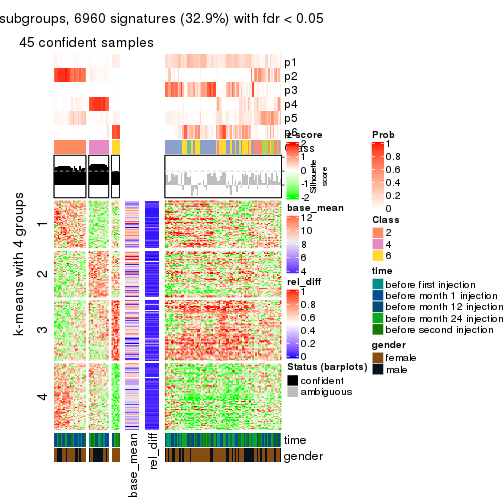</p>

</div>
</div>


Signature heatmaps where rows are not scaled:


<script>
$( function() {
	$( '#tabs-MAD-skmeans-get-signatures-no-scale' ).tabs();
} );
</script>
<div id='tabs-MAD-skmeans-get-signatures-no-scale'>
<ul>
<li><a href='#tab-MAD-skmeans-get-signatures-no-scale-1'>k = 2</a></li>
<li><a href='#tab-MAD-skmeans-get-signatures-no-scale-2'>k = 3</a></li>
<li><a href='#tab-MAD-skmeans-get-signatures-no-scale-3'>k = 4</a></li>
<li><a href='#tab-MAD-skmeans-get-signatures-no-scale-4'>k = 5</a></li>
<li><a href='#tab-MAD-skmeans-get-signatures-no-scale-5'>k = 6</a></li>
</ul>
<div id='tab-MAD-skmeans-get-signatures-no-scale-1'>
<pre><code class="r">get_signatures(res, k = 2, scale_rows = FALSE)
</code></pre>

<p></p>

</div>
<div id='tab-MAD-skmeans-get-signatures-no-scale-2'>
<pre><code class="r">get_signatures(res, k = 3, scale_rows = FALSE)
</code></pre>

<p></p>

</div>
<div id='tab-MAD-skmeans-get-signatures-no-scale-3'>
<pre><code class="r">get_signatures(res, k = 4, scale_rows = FALSE)
</code></pre>

<p></p>

</div>
<div id='tab-MAD-skmeans-get-signatures-no-scale-4'>
<pre><code class="r">get_signatures(res, k = 5, scale_rows = FALSE)
</code></pre>

<p></p>

</div>
<div id='tab-MAD-skmeans-get-signatures-no-scale-5'>
<pre><code class="r">get_signatures(res, k = 6, scale_rows = FALSE)
</code></pre>

<p></p>

</div>
</div>


Compare the overlap of signatures from different k:

```r
compare_signatures(res)
```


`get_signature()` returns a data frame invisibly. TO get the list of signatures, the function
call should be assigned to a variable explicitly. In following code, if `plot` argument is set
to `FALSE`, no heatmap is plotted while only the differential analysis is performed.

```r
# code only for demonstration
tb = get_signature(res, k = ..., plot = FALSE)
```

An example of the output of `tb` is:

```
#>   which_row         fdr    mean_1    mean_2 scaled_mean_1 scaled_mean_2 km
#> 1        38 0.042760348  8.373488  9.131774    -0.5533452     0.5164555  1
#> 2        40 0.018707592  7.106213  8.469186    -0.6173731     0.5762149  1
#> 3        55 0.019134737 10.221463 11.207825    -0.6159697     0.5749050  1
#> 4        59 0.006059896  5.921854  7.869574    -0.6899429     0.6439467  1
#> 5        60 0.018055526  8.928898 10.211722    -0.6204761     0.5791110  1
#> 6        98 0.009384629 15.714769 14.887706     0.6635654    -0.6193277  2
...
```

The columns in `tb` are:

1. `which_row`: row indices corresponding to the input matrix.
2. `fdr`: FDR for the differential test. 
3. `mean_x`: The mean value in group x.
4. `scaled_mean_x`: The mean value in group x after rows are scaled.
5. `km`: Row groups if k-means clustering is applied to rows.


UMAP plot which shows how samples are separated.


<script>
$( function() {
	$( '#tabs-MAD-skmeans-dimension-reduction' ).tabs();
} );
</script>
<div id='tabs-MAD-skmeans-dimension-reduction'>
<ul>
<li><a href='#tab-MAD-skmeans-dimension-reduction-1'>k = 2</a></li>
<li><a href='#tab-MAD-skmeans-dimension-reduction-2'>k = 3</a></li>
<li><a href='#tab-MAD-skmeans-dimension-reduction-3'>k = 4</a></li>
<li><a href='#tab-MAD-skmeans-dimension-reduction-4'>k = 5</a></li>
<li><a href='#tab-MAD-skmeans-dimension-reduction-5'>k = 6</a></li>
</ul>
<div id='tab-MAD-skmeans-dimension-reduction-1'>
<pre><code class="r">dimension_reduction(res, k = 2, method = &quot;UMAP&quot;)
</code></pre>

<p></p>

</div>
<div id='tab-MAD-skmeans-dimension-reduction-2'>
<pre><code class="r">dimension_reduction(res, k = 3, method = &quot;UMAP&quot;)
</code></pre>

<p></p>

</div>
<div id='tab-MAD-skmeans-dimension-reduction-3'>
<pre><code class="r">dimension_reduction(res, k = 4, method = &quot;UMAP&quot;)
</code></pre>

<p></p>

</div>
<div id='tab-MAD-skmeans-dimension-reduction-4'>
<pre><code class="r">dimension_reduction(res, k = 5, method = &quot;UMAP&quot;)
</code></pre>

<p></p>

</div>
<div id='tab-MAD-skmeans-dimension-reduction-5'>
<pre><code class="r">dimension_reduction(res, k = 6, method = &quot;UMAP&quot;)
</code></pre>

<p></p>

</div>
</div>


Following heatmap shows how subgroups are split when increasing `k`:

```r
collect_classes(res)
```


Test correlation between subgroups and known annotations. If the known
annotation is numeric, one-way ANOVA test is applied, and if the known
annotation is discrete, chi-squared contingency table test is applied.

```r
test_to_known_factors(res)
```

```
#>               n time(p) gender(p) k
#> MAD:skmeans 121  0.6728   0.17942 2
#> MAD:skmeans 113  0.1404   0.20920 3
#> MAD:skmeans  99  0.1336   0.05379 4
#> MAD:skmeans  78  0.0944   0.00765 5
#> MAD:skmeans  45  0.7587   0.01174 6
```


If matrix rows can be associated to genes, consider to use `GO_Enrichment(res,
...)` to perform function enrichment for the signature genes.


 

---------------------------------------------------


### MAD:pam


The object with results only for a single top-value method and a single partition method 
can be extracted as:

```r
res = res_list["MAD", "pam"]
# you can also extract it by
# res = res_list["MAD:pam"]
```

A summary of `res` and all the functions that can be applied to it:

```r
res
```

```
#> A 'ConsensusPartition' object with k = 2, 3, 4, 5, 6.
#>   On a matrix with 21168 rows and 125 columns.
#>   Top rows (1000, 2000, 3000, 4000, 5000) are extracted by 'MAD' method.
#>   Subgroups are detected by 'pam' method.
#>   Performed in total 1250 partitions by row resampling.
#>   Best k for subgroups seems to be 2.
#> 
#> Following methods can be applied to this 'ConsensusPartition' object:
#>  [1] "cola_report"             "collect_classes"         "collect_plots"          
#>  [4] "collect_stats"           "colnames"                "compare_signatures"     
#>  [7] "consensus_heatmap"       "dimension_reduction"     "functional_enrichment"  
#> [10] "get_anno_col"            "get_anno"                "get_classes"            
#> [13] "get_consensus"           "get_matrix"              "get_membership"         
#> [16] "get_param"               "get_signatures"          "get_stats"              
#> [19] "is_best_k"               "is_stable_k"             "membership_heatmap"     
#> [22] "ncol"                    "nrow"                    "plot_ecdf"              
#> [25] "rownames"                "select_partition_number" "show"                   
#> [28] "suggest_best_k"          "test_to_known_factors"
```

`collect_plots()` function collects all the plots made from `res` for all `k` (number of partitions)
into one single page to provide an easy and fast comparison between different `k`.

```r
collect_plots(res)
```


The plots are:

- The first row: a plot of the ECDF (Empirical cumulative distribution
  function) curves of the consensus matrix for each `k` and the heatmap of
  predicted classes for each `k`.
- The second row: heatmaps of the consensus matrix for each `k`.
- The third row: heatmaps of the membership matrix for each `k`.
- The fouth row: heatmaps of the signatures for each `k`.

All the plots in panels can be made by individual functions and they are
plotted later in this section.

`select_partition_number()` produces several plots showing different
statistics for choosing "optimized" `k`. There are following statistics:

- ECDF curves of the consensus matrix for each `k`;
- 1-PAC. [The PAC
  score](https://en.wikipedia.org/wiki/Consensus_clustering#Over-interpretation_potential_of_consensus_clustering)
  measures the proportion of the ambiguous subgrouping.
- Mean silhouette score.
- Concordance. The mean probability of fiting the consensus class ids in all
  partitions.
- Area increased. Denote $A_k$ as the area under the ECDF curve for current
  `k`, the area increased is defined as $A_k - A_{k-1}$.
- Rand index. The percent of pairs of samples that are both in a same cluster
  or both are not in a same cluster in the partition of k and k-1.
- Jaccard index. The ratio of pairs of samples are both in a same cluster in
  the partition of k and k-1 and the pairs of samples are both in a same
  cluster in the partition k or k-1.

The detailed explanations of these statistics can be found in [the cola
vignette](http://bioconductor.org/packages/devel/bioc/vignettes/cola/inst/doc/cola.html#toc_13).

Generally speaking, lower PAC score, higher mean silhouette score or higher
concordance corresponds to better partition. Rand index and Jaccard index
measure how similar the current partition is compared to partition with `k-1`.
If they are too similar, we won't accept `k` is better than `k-1`.

```r
select_partition_number(res)
```


The numeric values for all these statistics can be obtained by `get_stats()`.

```r
get_stats(res)
```

```
#>   k 1-PAC mean_silhouette concordance area_increased  Rand Jaccard
#> 2 2 0.402           0.823       0.894         0.4964 0.499   0.499
#> 3 3 0.451           0.712       0.824         0.2967 0.701   0.476
#> 4 4 0.492           0.595       0.766         0.1096 0.802   0.525
#> 5 5 0.555           0.589       0.741         0.0721 0.893   0.661
#> 6 6 0.602           0.603       0.753         0.0567 0.899   0.608
```

`suggest_best_k()` suggests the best $k$ based on these statistics. The rules are as follows:

- All $k$ with Jaccard index larger than 0.95 are removed because the increase of
  the partition number does not provides enough extra information. If all $k$ are removed,
  the best $k$ is assigned by `NA`.
- For $k$ with 1-PAC larger than 0.9, the maximal $k$ is taken as the "best k". Other $k$ is called "optional k".
- If it does not fit the second rule. The $k$ with the highest vote of highest
  1-PAC, mean silhouette and concordance is taken as the "best k".

```r
suggest_best_k(res)
```

```
#> [1] 2
```


Following shows the table of the partitions (You need to click the **show/hide
code output** link to see it). The membership matrix (columns with name `p*`)
is inferred by
[`clue::cl_consensus()`](https://www.rdocumentation.org/link/cl_consensus?package=clue)
function with the `SE` method. Basically the value in the membership matrix
represents the probability to belong to a certain group. The finall class
label for an item is determined with the group with highest probability it
belongs to.

In `get_classes()` function, the entropy is calculated from the membership
matrix and the silhouette score is calculated from the consensus matrix.


<script>
$( function() {
	$( '#tabs-MAD-pam-get-classes' ).tabs();
} );
</script>
<div id='tabs-MAD-pam-get-classes'>
<ul>
<li><a href='#tab-MAD-pam-get-classes-1'>k = 2</a></li>
<li><a href='#tab-MAD-pam-get-classes-2'>k = 3</a></li>
<li><a href='#tab-MAD-pam-get-classes-3'>k = 4</a></li>
<li><a href='#tab-MAD-pam-get-classes-4'>k = 5</a></li>
<li><a href='#tab-MAD-pam-get-classes-5'>k = 6</a></li>
</ul>

<div id='tab-MAD-pam-get-classes-1'>
<p><a id='tab-MAD-pam-get-classes-1-a' style='color:#0366d6' href='#'>show/hide code output</a></p>
<pre><code class="r">cbind(get_classes(res, k = 2), get_membership(res, k = 2))
</code></pre>

<pre><code>#&gt;           class entropy silhouette    p1    p2
#&gt; GSM601752     1  0.8144     0.6678 0.748 0.252
#&gt; GSM601782     1  0.2948     0.8963 0.948 0.052
#&gt; GSM601792     1  0.0938     0.8958 0.988 0.012
#&gt; GSM601797     1  0.4161     0.8855 0.916 0.084
#&gt; GSM601827     1  0.4161     0.8769 0.916 0.084
#&gt; GSM601837     2  0.0938     0.8756 0.012 0.988
#&gt; GSM601842     2  0.6531     0.8261 0.168 0.832
#&gt; GSM601857     2  0.7745     0.7345 0.228 0.772
#&gt; GSM601867     2  0.1633     0.8782 0.024 0.976
#&gt; GSM601747     1  0.8661     0.6141 0.712 0.288
#&gt; GSM601757     1  0.0376     0.8947 0.996 0.004
#&gt; GSM601762     2  0.3274     0.8789 0.060 0.940
#&gt; GSM601767     2  0.3879     0.8736 0.076 0.924
#&gt; GSM601772     2  0.3431     0.8845 0.064 0.936
#&gt; GSM601777     1  0.9286     0.5486 0.656 0.344
#&gt; GSM601787     2  0.6887     0.7848 0.184 0.816
#&gt; GSM601802     2  0.8144     0.7109 0.252 0.748
#&gt; GSM601807     1  0.5629     0.8611 0.868 0.132
#&gt; GSM601812     1  0.2603     0.8948 0.956 0.044
#&gt; GSM601817     1  0.4431     0.8886 0.908 0.092
#&gt; GSM601822     1  0.0938     0.8958 0.988 0.012
#&gt; GSM601832     2  0.6148     0.8482 0.152 0.848
#&gt; GSM601847     1  0.6247     0.8086 0.844 0.156
#&gt; GSM601852     1  0.3114     0.8893 0.944 0.056
#&gt; GSM601862     2  0.8386     0.6616 0.268 0.732
#&gt; GSM601753     1  0.9815     0.1980 0.580 0.420
#&gt; GSM601783     1  0.0376     0.8943 0.996 0.004
#&gt; GSM601793     1  0.3431     0.8917 0.936 0.064
#&gt; GSM601798     2  0.7674     0.7781 0.224 0.776
#&gt; GSM601828     1  0.0672     0.8947 0.992 0.008
#&gt; GSM601838     2  0.0000     0.8807 0.000 1.000
#&gt; GSM601843     2  0.0938     0.8840 0.012 0.988
#&gt; GSM601858     2  0.1633     0.8801 0.024 0.976
#&gt; GSM601868     1  0.7528     0.7885 0.784 0.216
#&gt; GSM601748     1  0.1633     0.8947 0.976 0.024
#&gt; GSM601758     1  0.0938     0.8958 0.988 0.012
#&gt; GSM601763     1  0.5519     0.8307 0.872 0.128
#&gt; GSM601768     2  0.3879     0.8794 0.076 0.924
#&gt; GSM601773     2  0.4815     0.8667 0.104 0.896
#&gt; GSM601778     1  0.3431     0.8852 0.936 0.064
#&gt; GSM601788     2  0.9129     0.6228 0.328 0.672
#&gt; GSM601803     2  0.6247     0.8349 0.156 0.844
#&gt; GSM601808     1  0.6343     0.8445 0.840 0.160
#&gt; GSM601813     1  0.1414     0.8966 0.980 0.020
#&gt; GSM601818     1  0.2423     0.8949 0.960 0.040
#&gt; GSM601823     1  0.0938     0.8958 0.988 0.012
#&gt; GSM601833     2  0.0376     0.8819 0.004 0.996
#&gt; GSM601848     1  0.0938     0.8958 0.988 0.012
#&gt; GSM601853     1  0.4298     0.8764 0.912 0.088
#&gt; GSM601863     1  0.7376     0.7969 0.792 0.208
#&gt; GSM601754     1  0.9129     0.5431 0.672 0.328
#&gt; GSM601784     2  0.3114     0.8828 0.056 0.944
#&gt; GSM601794     1  0.2423     0.8951 0.960 0.040
#&gt; GSM601799     1  0.9522     0.3730 0.628 0.372
#&gt; GSM601829     1  0.0938     0.8958 0.988 0.012
#&gt; GSM601839     2  0.0000     0.8807 0.000 1.000
#&gt; GSM601844     1  0.1184     0.8961 0.984 0.016
#&gt; GSM601859     2  0.2948     0.8839 0.052 0.948
#&gt; GSM601869     1  0.7299     0.8002 0.796 0.204
#&gt; GSM601749     1  0.0938     0.8958 0.988 0.012
#&gt; GSM601759     1  0.0938     0.8958 0.988 0.012
#&gt; GSM601764     1  0.1184     0.8959 0.984 0.016
#&gt; GSM601769     2  0.3733     0.8753 0.072 0.928
#&gt; GSM601774     2  0.0938     0.8833 0.012 0.988
#&gt; GSM601779     1  0.0938     0.8958 0.988 0.012
#&gt; GSM601789     2  0.1843     0.8850 0.028 0.972
#&gt; GSM601804     1  0.4815     0.8611 0.896 0.104
#&gt; GSM601809     2  0.5294     0.8613 0.120 0.880
#&gt; GSM601814     2  0.0672     0.8831 0.008 0.992
#&gt; GSM601819     1  0.8267     0.7051 0.740 0.260
#&gt; GSM601824     1  0.0938     0.8958 0.988 0.012
#&gt; GSM601834     2  0.1184     0.8839 0.016 0.984
#&gt; GSM601849     1  0.0938     0.8958 0.988 0.012
#&gt; GSM601854     1  0.0672     0.8952 0.992 0.008
#&gt; GSM601864     2  0.0938     0.8756 0.012 0.988
#&gt; GSM601755     2  0.5519     0.8598 0.128 0.872
#&gt; GSM601785     2  0.4690     0.8678 0.100 0.900
#&gt; GSM601795     2  0.8763     0.6954 0.296 0.704
#&gt; GSM601800     2  0.2423     0.8863 0.040 0.960
#&gt; GSM601830     1  0.4690     0.8704 0.900 0.100
#&gt; GSM601840     2  0.4690     0.8553 0.100 0.900
#&gt; GSM601845     1  0.4939     0.8818 0.892 0.108
#&gt; GSM601860     2  0.1184     0.8843 0.016 0.984
#&gt; GSM601870     2  0.9323     0.4635 0.348 0.652
#&gt; GSM601750     1  0.3274     0.8929 0.940 0.060
#&gt; GSM601760     1  0.5629     0.8543 0.868 0.132
#&gt; GSM601765     2  0.5737     0.8499 0.136 0.864
#&gt; GSM601770     2  0.2778     0.8842 0.048 0.952
#&gt; GSM601775     2  0.9795     0.4794 0.416 0.584
#&gt; GSM601780     1  0.1843     0.8951 0.972 0.028
#&gt; GSM601790     2  0.0376     0.8819 0.004 0.996
#&gt; GSM601805     2  0.4815     0.8547 0.104 0.896
#&gt; GSM601810     1  0.4431     0.8743 0.908 0.092
#&gt; GSM601815     2  0.0000     0.8807 0.000 1.000
#&gt; GSM601820     1  0.2423     0.8947 0.960 0.040
#&gt; GSM601825     2  0.4939     0.8645 0.108 0.892
#&gt; GSM601835     2  0.2948     0.8735 0.052 0.948
#&gt; GSM601850     1  0.6438     0.7990 0.836 0.164
#&gt; GSM601855     1  0.4815     0.8696 0.896 0.104
#&gt; GSM601865     2  0.0000     0.8807 0.000 1.000
#&gt; GSM601756     2  0.6887     0.8218 0.184 0.816
#&gt; GSM601786     2  0.0376     0.8819 0.004 0.996
#&gt; GSM601796     1  0.7139     0.8136 0.804 0.196
#&gt; GSM601801     2  0.1843     0.8849 0.028 0.972
#&gt; GSM601831     1  0.3431     0.8842 0.936 0.064
#&gt; GSM601841     1  0.6712     0.8307 0.824 0.176
#&gt; GSM601846     1  0.4939     0.8822 0.892 0.108
#&gt; GSM601861     2  0.0672     0.8828 0.008 0.992
#&gt; GSM601871     2  0.1414     0.8779 0.020 0.980
#&gt; GSM601751     2  0.8661     0.6384 0.288 0.712
#&gt; GSM601761     1  0.0938     0.8958 0.988 0.012
#&gt; GSM601766     2  0.6531     0.8271 0.168 0.832
#&gt; GSM601771     2  0.4298     0.8783 0.088 0.912
#&gt; GSM601776     1  0.0938     0.8958 0.988 0.012
#&gt; GSM601781     1  0.7376     0.7954 0.792 0.208
#&gt; GSM601791     1  0.6343     0.8395 0.840 0.160
#&gt; GSM601806     2  0.4562     0.8667 0.096 0.904
#&gt; GSM601811     2  0.9933     0.1964 0.452 0.548
#&gt; GSM601816     1  0.0938     0.8958 0.988 0.012
#&gt; GSM601821     2  0.0376     0.8819 0.004 0.996
#&gt; GSM601826     1  0.0938     0.8958 0.988 0.012
#&gt; GSM601836     1  0.7674     0.7882 0.776 0.224
#&gt; GSM601851     1  0.0938     0.8958 0.988 0.012
#&gt; GSM601856     2  0.9988     0.0168 0.480 0.520
#&gt; GSM601866     1  0.6887     0.8203 0.816 0.184
</code></pre>

<script>
$('#tab-MAD-pam-get-classes-1-a').parent().next().next().hide();
$('#tab-MAD-pam-get-classes-1-a').click(function(){
  $('#tab-MAD-pam-get-classes-1-a').parent().next().next().toggle();
  return(false);
});
</script>
</div>

<div id='tab-MAD-pam-get-classes-2'>
<p><a id='tab-MAD-pam-get-classes-2-a' style='color:#0366d6' href='#'>show/hide code output</a></p>
<pre><code class="r">cbind(get_classes(res, k = 3), get_membership(res, k = 3))
</code></pre>

<pre><code>#&gt;           class entropy silhouette    p1    p2    p3
#&gt; GSM601752     2  0.5167     0.6754 0.172 0.804 0.024
#&gt; GSM601782     1  0.1765     0.9033 0.956 0.004 0.040
#&gt; GSM601792     1  0.0747     0.9074 0.984 0.016 0.000
#&gt; GSM601797     1  0.4539     0.8243 0.836 0.148 0.016
#&gt; GSM601827     1  0.2550     0.8906 0.932 0.012 0.056
#&gt; GSM601837     3  0.4346     0.6896 0.000 0.184 0.816
#&gt; GSM601842     2  0.4859     0.7463 0.044 0.840 0.116
#&gt; GSM601857     3  0.1525     0.7011 0.032 0.004 0.964
#&gt; GSM601867     3  0.5588     0.4849 0.004 0.276 0.720
#&gt; GSM601747     1  0.5153     0.8111 0.832 0.100 0.068
#&gt; GSM601757     1  0.2947     0.8970 0.920 0.020 0.060
#&gt; GSM601762     2  0.4700     0.7063 0.008 0.812 0.180
#&gt; GSM601767     2  0.4453     0.7256 0.012 0.836 0.152
#&gt; GSM601772     2  0.6770     0.6466 0.044 0.692 0.264
#&gt; GSM601777     2  0.7562     0.6194 0.160 0.692 0.148
#&gt; GSM601787     3  0.2492     0.7026 0.016 0.048 0.936
#&gt; GSM601802     2  0.4526     0.7311 0.104 0.856 0.040
#&gt; GSM601807     1  0.6705     0.7472 0.740 0.084 0.176
#&gt; GSM601812     1  0.3112     0.8784 0.900 0.004 0.096
#&gt; GSM601817     1  0.2846     0.9029 0.924 0.020 0.056
#&gt; GSM601822     1  0.0747     0.9066 0.984 0.016 0.000
#&gt; GSM601832     2  0.6678     0.6920 0.060 0.724 0.216
#&gt; GSM601847     2  0.5335     0.6368 0.232 0.760 0.008
#&gt; GSM601852     1  0.2446     0.8908 0.936 0.012 0.052
#&gt; GSM601862     3  0.2297     0.6997 0.036 0.020 0.944
#&gt; GSM601753     2  0.3192     0.7263 0.112 0.888 0.000
#&gt; GSM601783     1  0.1647     0.8995 0.960 0.004 0.036
#&gt; GSM601793     1  0.1129     0.9059 0.976 0.004 0.020
#&gt; GSM601798     2  0.2269     0.7520 0.040 0.944 0.016
#&gt; GSM601828     1  0.1585     0.9048 0.964 0.008 0.028
#&gt; GSM601838     2  0.3482     0.7337 0.000 0.872 0.128
#&gt; GSM601843     2  0.6286     0.2773 0.000 0.536 0.464
#&gt; GSM601858     3  0.2400     0.7083 0.004 0.064 0.932
#&gt; GSM601868     3  0.4912     0.6231 0.196 0.008 0.796
#&gt; GSM601748     1  0.1878     0.9003 0.952 0.004 0.044
#&gt; GSM601758     1  0.0592     0.9067 0.988 0.012 0.000
#&gt; GSM601763     1  0.2550     0.8931 0.936 0.040 0.024
#&gt; GSM601768     3  0.6798     0.5605 0.048 0.256 0.696
#&gt; GSM601773     2  0.4094     0.7482 0.028 0.872 0.100
#&gt; GSM601778     1  0.3532     0.8513 0.884 0.108 0.008
#&gt; GSM601788     1  0.7610     0.5605 0.676 0.108 0.216
#&gt; GSM601803     2  0.2663     0.7551 0.044 0.932 0.024
#&gt; GSM601808     1  0.6937     0.3504 0.576 0.020 0.404
#&gt; GSM601813     1  0.0983     0.9077 0.980 0.004 0.016
#&gt; GSM601818     1  0.1989     0.8986 0.948 0.004 0.048
#&gt; GSM601823     1  0.0747     0.9066 0.984 0.016 0.000
#&gt; GSM601833     2  0.5982     0.5516 0.004 0.668 0.328
#&gt; GSM601848     1  0.0747     0.9066 0.984 0.016 0.000
#&gt; GSM601853     1  0.4228     0.8304 0.844 0.008 0.148
#&gt; GSM601863     3  0.6113     0.5444 0.300 0.012 0.688
#&gt; GSM601754     2  0.5631     0.6935 0.132 0.804 0.064
#&gt; GSM601784     3  0.5581     0.6812 0.040 0.168 0.792
#&gt; GSM601794     1  0.4056     0.8596 0.876 0.092 0.032
#&gt; GSM601799     2  0.5816     0.6530 0.224 0.752 0.024
#&gt; GSM601829     1  0.0983     0.9073 0.980 0.016 0.004
#&gt; GSM601839     2  0.6204     0.3428 0.000 0.576 0.424
#&gt; GSM601844     1  0.2773     0.8915 0.928 0.024 0.048
#&gt; GSM601859     3  0.7328     0.4775 0.044 0.344 0.612
#&gt; GSM601869     3  0.4555     0.6247 0.200 0.000 0.800
#&gt; GSM601749     1  0.0237     0.9068 0.996 0.004 0.000
#&gt; GSM601759     1  0.1129     0.9073 0.976 0.020 0.004
#&gt; GSM601764     1  0.1585     0.9035 0.964 0.028 0.008
#&gt; GSM601769     3  0.6422     0.4697 0.016 0.324 0.660
#&gt; GSM601774     2  0.5706     0.5853 0.000 0.680 0.320
#&gt; GSM601779     1  0.1163     0.9038 0.972 0.028 0.000
#&gt; GSM601789     3  0.5639     0.6080 0.016 0.232 0.752
#&gt; GSM601804     2  0.6387     0.5512 0.300 0.680 0.020
#&gt; GSM601809     3  0.4665     0.7044 0.048 0.100 0.852
#&gt; GSM601814     2  0.5948     0.5065 0.000 0.640 0.360
#&gt; GSM601819     1  0.5774     0.6696 0.748 0.020 0.232
#&gt; GSM601824     1  0.1163     0.9038 0.972 0.028 0.000
#&gt; GSM601834     3  0.6295    -0.0159 0.000 0.472 0.528
#&gt; GSM601849     1  0.0892     0.9060 0.980 0.020 0.000
#&gt; GSM601854     1  0.0661     0.9075 0.988 0.008 0.004
#&gt; GSM601864     3  0.3619     0.6952 0.000 0.136 0.864
#&gt; GSM601755     2  0.1765     0.7508 0.040 0.956 0.004
#&gt; GSM601785     3  0.4830     0.7067 0.068 0.084 0.848
#&gt; GSM601795     3  0.8810     0.4506 0.172 0.252 0.576
#&gt; GSM601800     2  0.5115     0.7100 0.016 0.796 0.188
#&gt; GSM601830     1  0.2703     0.8911 0.928 0.016 0.056
#&gt; GSM601840     3  0.6079     0.6480 0.036 0.216 0.748
#&gt; GSM601845     1  0.4269     0.8663 0.872 0.052 0.076
#&gt; GSM601860     3  0.4270     0.7019 0.024 0.116 0.860
#&gt; GSM601870     3  0.2689     0.6998 0.036 0.032 0.932
#&gt; GSM601750     1  0.2945     0.8858 0.908 0.004 0.088
#&gt; GSM601760     3  0.7029     0.3703 0.440 0.020 0.540
#&gt; GSM601765     2  0.9613     0.3166 0.308 0.464 0.228
#&gt; GSM601770     2  0.7174     0.2188 0.024 0.516 0.460
#&gt; GSM601775     1  0.6714     0.6619 0.748 0.112 0.140
#&gt; GSM601780     1  0.3499     0.8709 0.900 0.028 0.072
#&gt; GSM601790     3  0.3816     0.6808 0.000 0.148 0.852
#&gt; GSM601805     2  0.6247     0.6707 0.044 0.744 0.212
#&gt; GSM601810     1  0.2383     0.8935 0.940 0.016 0.044
#&gt; GSM601815     3  0.4399     0.6511 0.000 0.188 0.812
#&gt; GSM601820     1  0.2866     0.8791 0.916 0.008 0.076
#&gt; GSM601825     2  0.4194     0.7549 0.064 0.876 0.060
#&gt; GSM601835     3  0.4233     0.6900 0.004 0.160 0.836
#&gt; GSM601850     1  0.4253     0.8515 0.872 0.048 0.080
#&gt; GSM601855     1  0.4551     0.8297 0.844 0.024 0.132
#&gt; GSM601865     3  0.3412     0.6953 0.000 0.124 0.876
#&gt; GSM601756     2  0.1411     0.7508 0.036 0.964 0.000
#&gt; GSM601786     3  0.3482     0.6936 0.000 0.128 0.872
#&gt; GSM601796     3  0.8179     0.4938 0.352 0.084 0.564
#&gt; GSM601801     2  0.1482     0.7432 0.012 0.968 0.020
#&gt; GSM601831     1  0.2486     0.8889 0.932 0.008 0.060
#&gt; GSM601841     3  0.7141     0.5273 0.368 0.032 0.600
#&gt; GSM601846     1  0.4748     0.8297 0.832 0.144 0.024
#&gt; GSM601861     3  0.4575     0.6756 0.004 0.184 0.812
#&gt; GSM601871     3  0.1529     0.7017 0.000 0.040 0.960
#&gt; GSM601751     3  0.6012     0.6987 0.124 0.088 0.788
#&gt; GSM601761     1  0.1129     0.9067 0.976 0.020 0.004
#&gt; GSM601766     3  0.7741     0.5687 0.236 0.104 0.660
#&gt; GSM601771     3  0.5497     0.6970 0.048 0.148 0.804
#&gt; GSM601776     1  0.0747     0.9066 0.984 0.016 0.000
#&gt; GSM601781     3  0.8458     0.2975 0.436 0.088 0.476
#&gt; GSM601791     3  0.6814     0.5071 0.372 0.020 0.608
#&gt; GSM601806     2  0.1337     0.7478 0.012 0.972 0.016
#&gt; GSM601811     3  0.5845     0.5457 0.308 0.004 0.688
#&gt; GSM601816     1  0.0592     0.9069 0.988 0.012 0.000
#&gt; GSM601821     3  0.4750     0.6495 0.000 0.216 0.784
#&gt; GSM601826     1  0.0747     0.9066 0.984 0.016 0.000
#&gt; GSM601836     1  0.7208     0.3966 0.620 0.040 0.340
#&gt; GSM601851     1  0.0892     0.9060 0.980 0.020 0.000
#&gt; GSM601856     3  0.5659     0.5846 0.248 0.012 0.740
#&gt; GSM601866     3  0.6598     0.2552 0.428 0.008 0.564
</code></pre>

<script>
$('#tab-MAD-pam-get-classes-2-a').parent().next().next().hide();
$('#tab-MAD-pam-get-classes-2-a').click(function(){
  $('#tab-MAD-pam-get-classes-2-a').parent().next().next().toggle();
  return(false);
});
</script>
</div>

<div id='tab-MAD-pam-get-classes-3'>
<p><a id='tab-MAD-pam-get-classes-3-a' style='color:#0366d6' href='#'>show/hide code output</a></p>
<pre><code class="r">cbind(get_classes(res, k = 4), get_membership(res, k = 4))
</code></pre>

<pre><code>#&gt;           class entropy silhouette    p1    p2    p3    p4
#&gt; GSM601752     4  0.0524     0.7694 0.008 0.004 0.000 0.988
#&gt; GSM601782     1  0.2010     0.8139 0.932 0.004 0.060 0.004
#&gt; GSM601792     1  0.0524     0.8291 0.988 0.000 0.008 0.004
#&gt; GSM601797     1  0.4655     0.5987 0.684 0.000 0.004 0.312
#&gt; GSM601827     1  0.2221     0.8153 0.932 0.008 0.044 0.016
#&gt; GSM601837     3  0.7828    -0.2649 0.000 0.340 0.396 0.264
#&gt; GSM601842     2  0.4914     0.4534 0.012 0.676 0.000 0.312
#&gt; GSM601857     3  0.2528     0.6055 0.008 0.080 0.908 0.004
#&gt; GSM601867     3  0.4711     0.4795 0.000 0.024 0.740 0.236
#&gt; GSM601747     1  0.5200     0.6815 0.752 0.188 0.008 0.052
#&gt; GSM601757     1  0.5226     0.5493 0.696 0.020 0.276 0.008
#&gt; GSM601762     2  0.4454     0.4830 0.000 0.692 0.000 0.308
#&gt; GSM601767     2  0.5168     0.0266 0.004 0.504 0.000 0.492
#&gt; GSM601772     2  0.5627     0.5255 0.024 0.696 0.024 0.256
#&gt; GSM601777     4  0.5838     0.6844 0.088 0.028 0.140 0.744
#&gt; GSM601787     3  0.2714     0.5780 0.004 0.112 0.884 0.000
#&gt; GSM601802     4  0.0859     0.7693 0.008 0.008 0.004 0.980
#&gt; GSM601807     3  0.7329     0.4487 0.240 0.016 0.584 0.160
#&gt; GSM601812     1  0.3142     0.7994 0.860 0.008 0.132 0.000
#&gt; GSM601817     1  0.2983     0.8168 0.892 0.068 0.040 0.000
#&gt; GSM601822     1  0.0188     0.8274 0.996 0.000 0.000 0.004
#&gt; GSM601832     2  0.2744     0.6623 0.052 0.912 0.012 0.024
#&gt; GSM601847     4  0.3726     0.7206 0.132 0.012 0.012 0.844
#&gt; GSM601852     1  0.1902     0.8092 0.932 0.004 0.064 0.000
#&gt; GSM601862     3  0.2999     0.5894 0.000 0.132 0.864 0.004
#&gt; GSM601753     4  0.2186     0.7635 0.048 0.008 0.012 0.932
#&gt; GSM601783     1  0.1661     0.8136 0.944 0.004 0.052 0.000
#&gt; GSM601793     1  0.0967     0.8272 0.976 0.004 0.004 0.016
#&gt; GSM601798     4  0.0927     0.7667 0.008 0.016 0.000 0.976
#&gt; GSM601828     1  0.1635     0.8187 0.948 0.008 0.044 0.000
#&gt; GSM601838     2  0.5668     0.0882 0.000 0.532 0.024 0.444
#&gt; GSM601843     2  0.1854     0.6806 0.000 0.940 0.048 0.012
#&gt; GSM601858     3  0.4509     0.3132 0.000 0.288 0.708 0.004
#&gt; GSM601868     3  0.1706     0.6189 0.036 0.016 0.948 0.000
#&gt; GSM601748     1  0.1902     0.8108 0.932 0.004 0.064 0.000
#&gt; GSM601758     1  0.1811     0.8291 0.948 0.020 0.028 0.004
#&gt; GSM601763     1  0.4977     0.7617 0.804 0.096 0.028 0.072
#&gt; GSM601768     2  0.8123     0.4123 0.040 0.528 0.196 0.236
#&gt; GSM601773     4  0.5852     0.3843 0.020 0.380 0.012 0.588
#&gt; GSM601778     1  0.4245     0.7908 0.832 0.008 0.056 0.104
#&gt; GSM601788     1  0.6519     0.2894 0.548 0.392 0.040 0.020
#&gt; GSM601803     4  0.1576     0.7627 0.004 0.048 0.000 0.948
#&gt; GSM601808     3  0.5300     0.5517 0.240 0.024 0.720 0.016
#&gt; GSM601813     1  0.1635     0.8296 0.948 0.008 0.044 0.000
#&gt; GSM601818     1  0.1929     0.8186 0.940 0.024 0.036 0.000
#&gt; GSM601823     1  0.0188     0.8274 0.996 0.000 0.000 0.004
#&gt; GSM601833     2  0.1677     0.6760 0.000 0.948 0.012 0.040
#&gt; GSM601848     1  0.0188     0.8274 0.996 0.000 0.000 0.004
#&gt; GSM601853     3  0.4855     0.2737 0.400 0.000 0.600 0.000
#&gt; GSM601863     3  0.3501     0.6193 0.132 0.020 0.848 0.000
#&gt; GSM601754     4  0.2433     0.7596 0.060 0.008 0.012 0.920
#&gt; GSM601784     2  0.8257     0.3766 0.036 0.480 0.300 0.184
#&gt; GSM601794     1  0.5612     0.6723 0.716 0.016 0.044 0.224
#&gt; GSM601799     4  0.4730     0.6634 0.180 0.028 0.012 0.780
#&gt; GSM601829     1  0.0376     0.8273 0.992 0.000 0.004 0.004
#&gt; GSM601839     2  0.4469     0.6390 0.000 0.808 0.080 0.112
#&gt; GSM601844     1  0.3869     0.7991 0.856 0.008 0.076 0.060
#&gt; GSM601859     4  0.7371     0.3796 0.036 0.096 0.292 0.576
#&gt; GSM601869     3  0.2383     0.6200 0.048 0.024 0.924 0.004
#&gt; GSM601749     1  0.0707     0.8286 0.980 0.000 0.020 0.000
#&gt; GSM601759     1  0.2066     0.8266 0.940 0.008 0.024 0.028
#&gt; GSM601764     1  0.5193     0.7600 0.796 0.096 0.044 0.064
#&gt; GSM601769     2  0.0967     0.6715 0.016 0.976 0.004 0.004
#&gt; GSM601774     2  0.2124     0.6821 0.000 0.932 0.028 0.040
#&gt; GSM601779     1  0.3385     0.8020 0.880 0.008 0.040 0.072
#&gt; GSM601789     2  0.2515     0.6740 0.004 0.912 0.072 0.012
#&gt; GSM601804     4  0.5031     0.6555 0.172 0.016 0.040 0.772
#&gt; GSM601809     2  0.6954     0.3731 0.040 0.520 0.400 0.040
#&gt; GSM601814     2  0.4656     0.5883 0.000 0.784 0.056 0.160
#&gt; GSM601819     1  0.7205     0.5897 0.652 0.180 0.104 0.064
#&gt; GSM601824     1  0.2660     0.8088 0.908 0.008 0.012 0.072
#&gt; GSM601834     2  0.2483     0.6769 0.000 0.916 0.052 0.032
#&gt; GSM601849     1  0.1943     0.8239 0.944 0.008 0.032 0.016
#&gt; GSM601854     1  0.1492     0.8292 0.956 0.004 0.036 0.004
#&gt; GSM601864     2  0.5901     0.4893 0.000 0.652 0.280 0.068
#&gt; GSM601755     4  0.0524     0.7684 0.004 0.008 0.000 0.988
#&gt; GSM601785     3  0.9202    -0.2055 0.104 0.340 0.380 0.176
#&gt; GSM601795     2  0.9761     0.0890 0.188 0.316 0.184 0.312
#&gt; GSM601800     4  0.5655     0.3919 0.008 0.316 0.028 0.648
#&gt; GSM601830     1  0.2891     0.8052 0.896 0.020 0.080 0.004
#&gt; GSM601840     4  0.7799    -0.2346 0.000 0.348 0.252 0.400
#&gt; GSM601845     1  0.3759     0.8137 0.872 0.048 0.032 0.048
#&gt; GSM601860     3  0.8305    -0.2936 0.028 0.384 0.396 0.192
#&gt; GSM601870     3  0.2530     0.5936 0.000 0.112 0.888 0.000
#&gt; GSM601750     1  0.4018     0.7074 0.772 0.004 0.224 0.000
#&gt; GSM601760     1  0.6210     0.5031 0.636 0.016 0.300 0.048
#&gt; GSM601765     2  0.2816     0.6607 0.036 0.900 0.000 0.064
#&gt; GSM601770     2  0.7170     0.4109 0.020 0.580 0.108 0.292
#&gt; GSM601775     1  0.6743     0.3693 0.568 0.340 0.008 0.084
#&gt; GSM601780     1  0.3670     0.8022 0.860 0.008 0.100 0.032
#&gt; GSM601790     2  0.3032     0.6598 0.000 0.868 0.124 0.008
#&gt; GSM601805     4  0.4342     0.6935 0.008 0.044 0.128 0.820
#&gt; GSM601810     1  0.2010     0.8111 0.932 0.004 0.060 0.004
#&gt; GSM601815     2  0.1902     0.6769 0.000 0.932 0.064 0.004
#&gt; GSM601820     1  0.3642     0.8149 0.872 0.024 0.076 0.028
#&gt; GSM601825     4  0.5664     0.6592 0.064 0.168 0.024 0.744
#&gt; GSM601835     2  0.2670     0.6726 0.000 0.904 0.072 0.024
#&gt; GSM601850     1  0.4829     0.7601 0.804 0.120 0.020 0.056
#&gt; GSM601855     3  0.5070     0.2422 0.416 0.004 0.580 0.000
#&gt; GSM601865     2  0.5161     0.4144 0.000 0.592 0.400 0.008
#&gt; GSM601756     4  0.0524     0.7690 0.004 0.008 0.000 0.988
#&gt; GSM601786     2  0.4661     0.5752 0.000 0.728 0.256 0.016
#&gt; GSM601796     1  0.7892     0.0938 0.456 0.020 0.368 0.156
#&gt; GSM601801     4  0.3024     0.6860 0.000 0.148 0.000 0.852
#&gt; GSM601831     1  0.2334     0.8014 0.908 0.004 0.088 0.000
#&gt; GSM601841     1  0.7103     0.2975 0.564 0.012 0.312 0.112
#&gt; GSM601846     1  0.4328     0.7524 0.804 0.008 0.024 0.164
#&gt; GSM601861     2  0.5021     0.5977 0.000 0.724 0.240 0.036
#&gt; GSM601871     3  0.2412     0.5917 0.000 0.084 0.908 0.008
#&gt; GSM601751     3  0.9131    -0.0171 0.264 0.264 0.396 0.076
#&gt; GSM601761     1  0.2313     0.8218 0.924 0.000 0.032 0.044
#&gt; GSM601766     2  0.8410     0.2447 0.208 0.512 0.224 0.056
#&gt; GSM601771     2  0.8734     0.2577 0.040 0.368 0.340 0.252
#&gt; GSM601776     1  0.0779     0.8280 0.980 0.000 0.016 0.004
#&gt; GSM601781     1  0.7816     0.3720 0.536 0.044 0.304 0.116
#&gt; GSM601791     1  0.6908     0.3069 0.536 0.016 0.376 0.072
#&gt; GSM601806     4  0.3016     0.7044 0.004 0.120 0.004 0.872
#&gt; GSM601811     3  0.4589     0.6055 0.168 0.048 0.784 0.000
#&gt; GSM601816     1  0.0188     0.8274 0.996 0.000 0.000 0.004
#&gt; GSM601821     2  0.5121     0.6188 0.000 0.764 0.116 0.120
#&gt; GSM601826     1  0.0188     0.8274 0.996 0.000 0.000 0.004
#&gt; GSM601836     1  0.6315     0.1504 0.480 0.468 0.048 0.004
#&gt; GSM601851     1  0.2039     0.8238 0.940 0.008 0.036 0.016
#&gt; GSM601856     3  0.3009     0.6263 0.052 0.056 0.892 0.000
#&gt; GSM601866     3  0.4360     0.5686 0.248 0.008 0.744 0.000
</code></pre>

<script>
$('#tab-MAD-pam-get-classes-3-a').parent().next().next().hide();
$('#tab-MAD-pam-get-classes-3-a').click(function(){
  $('#tab-MAD-pam-get-classes-3-a').parent().next().next().toggle();
  return(false);
});
</script>
</div>

<div id='tab-MAD-pam-get-classes-4'>
<p><a id='tab-MAD-pam-get-classes-4-a' style='color:#0366d6' href='#'>show/hide code output</a></p>
<pre><code class="r">cbind(get_classes(res, k = 5), get_membership(res, k = 5))
</code></pre>

<pre><code>#&gt;           class entropy silhouette    p1    p2    p3    p4    p5
#&gt; GSM601752     4  0.0324     0.7505 0.000 0.004 0.000 0.992 0.004
#&gt; GSM601782     1  0.1331     0.8151 0.952 0.008 0.040 0.000 0.000
#&gt; GSM601792     1  0.1082     0.8242 0.964 0.028 0.000 0.008 0.000
#&gt; GSM601797     1  0.4696     0.4982 0.616 0.024 0.000 0.360 0.000
#&gt; GSM601827     1  0.1299     0.8159 0.960 0.008 0.012 0.020 0.000
#&gt; GSM601837     2  0.7290     0.2407 0.000 0.536 0.084 0.196 0.184
#&gt; GSM601842     5  0.4775     0.5462 0.008 0.040 0.000 0.256 0.696
#&gt; GSM601857     3  0.3710     0.7261 0.000 0.192 0.784 0.000 0.024
#&gt; GSM601867     3  0.5422     0.6815 0.000 0.108 0.684 0.196 0.012
#&gt; GSM601747     1  0.5779     0.5687 0.700 0.168 0.012 0.036 0.084
#&gt; GSM601757     1  0.5289     0.4365 0.620 0.060 0.316 0.000 0.004
#&gt; GSM601762     5  0.7059     0.1205 0.000 0.364 0.012 0.252 0.372
#&gt; GSM601767     4  0.7016    -0.0477 0.000 0.348 0.008 0.368 0.276
#&gt; GSM601772     2  0.7254    -0.0727 0.016 0.440 0.024 0.148 0.372
#&gt; GSM601777     4  0.6274     0.5460 0.060 0.240 0.080 0.620 0.000
#&gt; GSM601787     3  0.4813     0.4339 0.000 0.376 0.600 0.004 0.020
#&gt; GSM601802     4  0.0775     0.7502 0.004 0.008 0.004 0.980 0.004
#&gt; GSM601807     3  0.4458     0.7387 0.072 0.012 0.800 0.100 0.016
#&gt; GSM601812     1  0.3953     0.7798 0.792 0.148 0.060 0.000 0.000
#&gt; GSM601817     1  0.2917     0.8120 0.888 0.040 0.048 0.000 0.024
#&gt; GSM601822     1  0.0290     0.8204 0.992 0.008 0.000 0.000 0.000
#&gt; GSM601832     5  0.3651     0.6300 0.028 0.160 0.004 0.000 0.808
#&gt; GSM601847     4  0.4328     0.6667 0.108 0.108 0.000 0.780 0.004
#&gt; GSM601852     1  0.1357     0.8143 0.948 0.004 0.048 0.000 0.000
#&gt; GSM601862     3  0.4100     0.7387 0.000 0.160 0.784 0.004 0.052
#&gt; GSM601753     4  0.2067     0.7422 0.028 0.044 0.000 0.924 0.004
#&gt; GSM601783     1  0.1124     0.8146 0.960 0.004 0.036 0.000 0.000
#&gt; GSM601793     1  0.0932     0.8169 0.972 0.004 0.004 0.020 0.000
#&gt; GSM601798     4  0.0290     0.7494 0.000 0.000 0.000 0.992 0.008
#&gt; GSM601828     1  0.1216     0.8204 0.960 0.020 0.020 0.000 0.000
#&gt; GSM601838     5  0.4771     0.4668 0.000 0.020 0.020 0.272 0.688
#&gt; GSM601843     5  0.3707     0.6666 0.000 0.116 0.044 0.012 0.828
#&gt; GSM601858     2  0.6053     0.1119 0.004 0.528 0.368 0.004 0.096
#&gt; GSM601868     3  0.3160     0.7742 0.028 0.116 0.852 0.000 0.004
#&gt; GSM601748     1  0.1282     0.8134 0.952 0.004 0.044 0.000 0.000
#&gt; GSM601758     1  0.3169     0.8017 0.840 0.140 0.016 0.004 0.000
#&gt; GSM601763     1  0.4832     0.7046 0.724 0.224 0.012 0.016 0.024
#&gt; GSM601768     2  0.6412     0.3362 0.020 0.636 0.040 0.080 0.224
#&gt; GSM601773     4  0.6490     0.3410 0.008 0.168 0.000 0.512 0.312
#&gt; GSM601778     1  0.5240     0.6986 0.676 0.256 0.032 0.036 0.000
#&gt; GSM601788     2  0.7272     0.2616 0.404 0.408 0.024 0.016 0.148
#&gt; GSM601803     4  0.1018     0.7505 0.000 0.016 0.000 0.968 0.016
#&gt; GSM601808     3  0.2353     0.7801 0.060 0.028 0.908 0.004 0.000
#&gt; GSM601813     1  0.3078     0.8099 0.848 0.132 0.016 0.004 0.000
#&gt; GSM601818     1  0.1485     0.8141 0.948 0.020 0.032 0.000 0.000
#&gt; GSM601823     1  0.0290     0.8204 0.992 0.008 0.000 0.000 0.000
#&gt; GSM601833     5  0.3009     0.6721 0.000 0.080 0.016 0.028 0.876
#&gt; GSM601848     1  0.0290     0.8204 0.992 0.008 0.000 0.000 0.000
#&gt; GSM601853     3  0.2377     0.7470 0.128 0.000 0.872 0.000 0.000
#&gt; GSM601863     3  0.4558     0.7307 0.088 0.168 0.744 0.000 0.000
#&gt; GSM601754     4  0.2735     0.7241 0.036 0.084 0.000 0.880 0.000
#&gt; GSM601784     2  0.5640     0.4194 0.016 0.716 0.072 0.036 0.160
#&gt; GSM601794     1  0.5955     0.5702 0.608 0.216 0.004 0.172 0.000
#&gt; GSM601799     4  0.5274     0.5806 0.160 0.132 0.000 0.700 0.008
#&gt; GSM601829     1  0.0510     0.8214 0.984 0.016 0.000 0.000 0.000
#&gt; GSM601839     5  0.2940     0.6677 0.000 0.040 0.040 0.032 0.888
#&gt; GSM601844     1  0.4618     0.7218 0.712 0.248 0.024 0.016 0.000
#&gt; GSM601859     4  0.6641     0.1635 0.016 0.428 0.048 0.464 0.044
#&gt; GSM601869     3  0.4184     0.7505 0.048 0.176 0.772 0.000 0.004
#&gt; GSM601749     1  0.1522     0.8259 0.944 0.044 0.012 0.000 0.000
#&gt; GSM601759     1  0.2692     0.8101 0.884 0.092 0.016 0.008 0.000
#&gt; GSM601764     1  0.6183     0.6545 0.656 0.192 0.020 0.020 0.112
#&gt; GSM601769     5  0.4686     0.4416 0.000 0.332 0.016 0.008 0.644
#&gt; GSM601774     5  0.4181     0.6312 0.000 0.172 0.032 0.016 0.780
#&gt; GSM601779     1  0.4857     0.6929 0.684 0.272 0.024 0.020 0.000
#&gt; GSM601789     5  0.4927     0.3749 0.000 0.388 0.024 0.004 0.584
#&gt; GSM601804     4  0.6420     0.4275 0.136 0.268 0.024 0.572 0.000
#&gt; GSM601809     2  0.4967     0.3860 0.020 0.764 0.084 0.012 0.120
#&gt; GSM601814     5  0.2581     0.6650 0.000 0.020 0.028 0.048 0.904
#&gt; GSM601819     1  0.6078     0.5410 0.636 0.248 0.032 0.008 0.076
#&gt; GSM601824     1  0.2722     0.7929 0.872 0.108 0.000 0.020 0.000
#&gt; GSM601834     5  0.2243     0.6830 0.000 0.056 0.012 0.016 0.916
#&gt; GSM601849     1  0.3107     0.8009 0.852 0.124 0.016 0.008 0.000
#&gt; GSM601854     1  0.3835     0.7847 0.796 0.156 0.048 0.000 0.000
#&gt; GSM601864     2  0.6480     0.2595 0.000 0.576 0.052 0.088 0.284
#&gt; GSM601755     4  0.0162     0.7493 0.000 0.000 0.000 0.996 0.004
#&gt; GSM601785     2  0.5316     0.4474 0.024 0.756 0.096 0.032 0.092
#&gt; GSM601795     2  0.6655     0.3320 0.092 0.632 0.016 0.196 0.064
#&gt; GSM601800     4  0.6334     0.4476 0.004 0.124 0.036 0.628 0.208
#&gt; GSM601830     1  0.3474     0.7080 0.796 0.004 0.192 0.008 0.000
#&gt; GSM601840     2  0.6476     0.3502 0.000 0.600 0.056 0.244 0.100
#&gt; GSM601845     1  0.3689     0.8035 0.856 0.068 0.020 0.032 0.024
#&gt; GSM601860     2  0.4877     0.4335 0.008 0.768 0.108 0.020 0.096
#&gt; GSM601870     3  0.1978     0.7686 0.004 0.044 0.928 0.000 0.024
#&gt; GSM601750     1  0.5962     0.5659 0.584 0.168 0.248 0.000 0.000
#&gt; GSM601760     2  0.5626    -0.2228 0.456 0.492 0.032 0.016 0.004
#&gt; GSM601765     5  0.5432     0.2309 0.012 0.444 0.016 0.012 0.516
#&gt; GSM601770     2  0.6984     0.2223 0.008 0.544 0.040 0.136 0.272
#&gt; GSM601775     2  0.6920     0.2206 0.400 0.444 0.004 0.032 0.120
#&gt; GSM601780     1  0.4777     0.7058 0.696 0.260 0.028 0.016 0.000
#&gt; GSM601790     5  0.3291     0.6592 0.000 0.088 0.064 0.000 0.848
#&gt; GSM601805     4  0.4365     0.6917 0.012 0.084 0.068 0.812 0.024
#&gt; GSM601810     1  0.1538     0.8173 0.948 0.008 0.036 0.008 0.000
#&gt; GSM601815     5  0.2864     0.6733 0.000 0.112 0.024 0.000 0.864
#&gt; GSM601820     1  0.4809     0.7156 0.688 0.268 0.036 0.004 0.004
#&gt; GSM601825     4  0.5995     0.6085 0.036 0.168 0.000 0.660 0.136
#&gt; GSM601835     5  0.3883     0.6613 0.000 0.160 0.028 0.012 0.800
#&gt; GSM601850     1  0.4705     0.7260 0.764 0.156 0.004 0.020 0.056
#&gt; GSM601855     3  0.2966     0.7112 0.184 0.000 0.816 0.000 0.000
#&gt; GSM601865     5  0.6016     0.1522 0.000 0.408 0.100 0.004 0.488
#&gt; GSM601756     4  0.0000     0.7496 0.000 0.000 0.000 1.000 0.000
#&gt; GSM601786     5  0.5105     0.5165 0.000 0.240 0.060 0.012 0.688
#&gt; GSM601796     2  0.7424     0.1963 0.328 0.480 0.084 0.100 0.008
#&gt; GSM601801     4  0.2068     0.7215 0.000 0.004 0.000 0.904 0.092
#&gt; GSM601831     1  0.2020     0.8004 0.900 0.000 0.100 0.000 0.000
#&gt; GSM601841     1  0.6662     0.0921 0.532 0.328 0.060 0.080 0.000
#&gt; GSM601846     1  0.3934     0.7461 0.796 0.008 0.036 0.160 0.000
#&gt; GSM601861     5  0.4642     0.5515 0.000 0.192 0.060 0.008 0.740
#&gt; GSM601871     3  0.4000     0.7144 0.000 0.164 0.788 0.004 0.044
#&gt; GSM601751     2  0.6452     0.4573 0.116 0.680 0.100 0.028 0.076
#&gt; GSM601761     1  0.3846     0.7613 0.776 0.200 0.020 0.004 0.000
#&gt; GSM601766     2  0.6158     0.3670 0.080 0.660 0.044 0.012 0.204
#&gt; GSM601771     2  0.5962     0.4348 0.020 0.708 0.084 0.056 0.132
#&gt; GSM601776     1  0.1410     0.8248 0.940 0.060 0.000 0.000 0.000
#&gt; GSM601781     2  0.6609    -0.2709 0.440 0.456 0.040 0.044 0.020
#&gt; GSM601791     2  0.6168    -0.0207 0.396 0.512 0.068 0.020 0.004
#&gt; GSM601806     4  0.2020     0.7199 0.000 0.000 0.000 0.900 0.100
#&gt; GSM601811     3  0.5623     0.7269 0.136 0.172 0.676 0.000 0.016
#&gt; GSM601816     1  0.0162     0.8203 0.996 0.004 0.000 0.000 0.000
#&gt; GSM601821     5  0.3250     0.6581 0.000 0.044 0.044 0.040 0.872
#&gt; GSM601826     1  0.0290     0.8204 0.992 0.008 0.000 0.000 0.000
#&gt; GSM601836     5  0.6534     0.2444 0.280 0.112 0.040 0.000 0.568
#&gt; GSM601851     1  0.3632     0.7823 0.800 0.176 0.020 0.004 0.000
#&gt; GSM601856     3  0.1686     0.7809 0.028 0.020 0.944 0.000 0.008
#&gt; GSM601866     3  0.6038     0.5437 0.184 0.240 0.576 0.000 0.000
</code></pre>

<script>
$('#tab-MAD-pam-get-classes-4-a').parent().next().next().hide();
$('#tab-MAD-pam-get-classes-4-a').click(function(){
  $('#tab-MAD-pam-get-classes-4-a').parent().next().next().toggle();
  return(false);
});
</script>
</div>

<div id='tab-MAD-pam-get-classes-5'>
<p><a id='tab-MAD-pam-get-classes-5-a' style='color:#0366d6' href='#'>show/hide code output</a></p>
<pre><code class="r">cbind(get_classes(res, k = 6), get_membership(res, k = 6))
</code></pre>

<pre><code>#&gt;           class entropy silhouette    p1    p2    p3    p4    p5    p6
#&gt; GSM601752     4  0.0458     0.7962 0.000 0.000 0.000 0.984 0.000 0.016
#&gt; GSM601782     1  0.1390     0.7930 0.948 0.000 0.032 0.000 0.004 0.016
#&gt; GSM601792     1  0.1010     0.7929 0.960 0.000 0.000 0.004 0.000 0.036
#&gt; GSM601797     1  0.4553     0.3897 0.580 0.000 0.004 0.384 0.000 0.032
#&gt; GSM601827     1  0.1007     0.7926 0.968 0.000 0.004 0.016 0.008 0.004
#&gt; GSM601837     2  0.6705     0.2289 0.000 0.520 0.000 0.132 0.224 0.124
#&gt; GSM601842     5  0.5393     0.5303 0.016 0.076 0.004 0.248 0.644 0.012
#&gt; GSM601857     3  0.4886     0.6984 0.004 0.252 0.672 0.000 0.032 0.040
#&gt; GSM601867     3  0.5177     0.7017 0.000 0.088 0.696 0.176 0.016 0.024
#&gt; GSM601747     1  0.4638     0.5245 0.676 0.264 0.000 0.044 0.008 0.008
#&gt; GSM601757     1  0.4787     0.4133 0.624 0.008 0.312 0.000 0.000 0.056
#&gt; GSM601762     2  0.5629     0.4254 0.004 0.580 0.004 0.184 0.228 0.000
#&gt; GSM601767     2  0.6016     0.4358 0.000 0.540 0.000 0.276 0.156 0.028
#&gt; GSM601772     2  0.5617     0.5356 0.004 0.664 0.000 0.088 0.164 0.080
#&gt; GSM601777     6  0.5468     0.5095 0.020 0.016 0.084 0.216 0.004 0.660
#&gt; GSM601787     3  0.5536     0.5735 0.000 0.308 0.584 0.000 0.052 0.056
#&gt; GSM601802     4  0.0551     0.7954 0.000 0.008 0.004 0.984 0.000 0.004
#&gt; GSM601807     3  0.2119     0.7734 0.004 0.016 0.912 0.060 0.000 0.008
#&gt; GSM601812     1  0.4946     0.2880 0.596 0.020 0.032 0.000 0.004 0.348
#&gt; GSM601817     1  0.2904     0.7785 0.876 0.052 0.048 0.000 0.008 0.016
#&gt; GSM601822     1  0.0458     0.7935 0.984 0.000 0.000 0.000 0.000 0.016
#&gt; GSM601832     5  0.4716     0.5887 0.020 0.204 0.004 0.000 0.708 0.064
#&gt; GSM601847     4  0.4266     0.6800 0.060 0.012 0.000 0.736 0.000 0.192
#&gt; GSM601852     1  0.1340     0.7911 0.948 0.004 0.040 0.000 0.000 0.008
#&gt; GSM601862     3  0.4139     0.7154 0.000 0.260 0.700 0.000 0.004 0.036
#&gt; GSM601753     4  0.2620     0.7766 0.024 0.012 0.000 0.884 0.004 0.076
#&gt; GSM601783     1  0.0777     0.7920 0.972 0.000 0.024 0.000 0.000 0.004
#&gt; GSM601793     1  0.0964     0.7925 0.968 0.004 0.000 0.012 0.000 0.016
#&gt; GSM601798     4  0.0291     0.7939 0.000 0.004 0.004 0.992 0.000 0.000
#&gt; GSM601828     1  0.1129     0.7947 0.964 0.008 0.012 0.000 0.004 0.012
#&gt; GSM601838     5  0.5959     0.4915 0.000 0.104 0.000 0.176 0.620 0.100
#&gt; GSM601843     5  0.4497     0.5879 0.004 0.312 0.004 0.012 0.652 0.016
#&gt; GSM601858     2  0.5743     0.0577 0.000 0.568 0.316 0.004 0.064 0.048
#&gt; GSM601868     3  0.3596     0.7792 0.004 0.132 0.812 0.000 0.036 0.016
#&gt; GSM601748     1  0.0865     0.7916 0.964 0.000 0.036 0.000 0.000 0.000
#&gt; GSM601758     1  0.3659     0.3164 0.636 0.000 0.000 0.000 0.000 0.364
#&gt; GSM601763     1  0.4870     0.5300 0.668 0.120 0.000 0.000 0.004 0.208
#&gt; GSM601768     2  0.4209     0.6021 0.012 0.780 0.000 0.012 0.088 0.108
#&gt; GSM601773     4  0.6756     0.3208 0.004 0.196 0.000 0.492 0.244 0.064
#&gt; GSM601778     6  0.3538     0.7028 0.216 0.004 0.004 0.012 0.000 0.764
#&gt; GSM601788     2  0.5028     0.3968 0.308 0.628 0.000 0.024 0.020 0.020
#&gt; GSM601803     4  0.0837     0.7952 0.000 0.020 0.004 0.972 0.000 0.004
#&gt; GSM601808     3  0.0665     0.7897 0.008 0.008 0.980 0.000 0.000 0.004
#&gt; GSM601813     1  0.4087     0.3917 0.668 0.008 0.008 0.000 0.004 0.312
#&gt; GSM601818     1  0.1313     0.7933 0.952 0.028 0.016 0.000 0.000 0.004
#&gt; GSM601823     1  0.0458     0.7935 0.984 0.000 0.000 0.000 0.000 0.016
#&gt; GSM601833     5  0.3640     0.6311 0.004 0.204 0.000 0.028 0.764 0.000
#&gt; GSM601848     1  0.0458     0.7935 0.984 0.000 0.000 0.000 0.000 0.016
#&gt; GSM601853     3  0.1225     0.7869 0.036 0.000 0.952 0.000 0.000 0.012
#&gt; GSM601863     3  0.5476     0.3670 0.060 0.028 0.564 0.000 0.004 0.344
#&gt; GSM601754     4  0.3166     0.7545 0.032 0.008 0.000 0.840 0.004 0.116
#&gt; GSM601784     2  0.4216     0.6124 0.012 0.784 0.000 0.036 0.040 0.128
#&gt; GSM601794     6  0.5714     0.4409 0.372 0.016 0.000 0.096 0.004 0.512
#&gt; GSM601799     4  0.5604     0.5959 0.136 0.052 0.000 0.660 0.004 0.148
#&gt; GSM601829     1  0.0547     0.7936 0.980 0.000 0.000 0.000 0.000 0.020
#&gt; GSM601839     5  0.3612     0.6334 0.000 0.092 0.004 0.000 0.804 0.100
#&gt; GSM601844     6  0.3992     0.4823 0.364 0.012 0.000 0.000 0.000 0.624
#&gt; GSM601859     4  0.6862     0.3103 0.012 0.276 0.000 0.492 0.072 0.148
#&gt; GSM601869     3  0.5729     0.7387 0.028 0.128 0.672 0.000 0.040 0.132
#&gt; GSM601749     1  0.1765     0.7711 0.904 0.000 0.000 0.000 0.000 0.096
#&gt; GSM601759     1  0.2500     0.7582 0.868 0.004 0.012 0.000 0.000 0.116
#&gt; GSM601764     6  0.5215     0.1319 0.456 0.012 0.000 0.000 0.060 0.472
#&gt; GSM601769     2  0.4172     0.1556 0.000 0.564 0.000 0.004 0.424 0.008
#&gt; GSM601774     5  0.4110     0.4059 0.000 0.376 0.000 0.016 0.608 0.000
#&gt; GSM601779     6  0.2743     0.7114 0.164 0.008 0.000 0.000 0.000 0.828
#&gt; GSM601789     2  0.4591     0.2602 0.004 0.604 0.000 0.008 0.360 0.024
#&gt; GSM601804     6  0.3653     0.6115 0.040 0.012 0.004 0.140 0.000 0.804
#&gt; GSM601809     6  0.5564     0.2726 0.000 0.312 0.028 0.000 0.088 0.572
#&gt; GSM601814     5  0.1261     0.6894 0.000 0.024 0.000 0.024 0.952 0.000
#&gt; GSM601819     1  0.5680     0.4030 0.580 0.248 0.000 0.000 0.016 0.156
#&gt; GSM601824     1  0.2768     0.7030 0.832 0.012 0.000 0.000 0.000 0.156
#&gt; GSM601834     5  0.2118     0.6847 0.000 0.104 0.000 0.008 0.888 0.000
#&gt; GSM601849     1  0.2597     0.7217 0.824 0.000 0.000 0.000 0.000 0.176
#&gt; GSM601854     6  0.4116     0.4690 0.416 0.000 0.012 0.000 0.000 0.572
#&gt; GSM601864     2  0.6036     0.3344 0.000 0.620 0.020 0.044 0.204 0.112
#&gt; GSM601755     4  0.0000     0.7939 0.000 0.000 0.000 1.000 0.000 0.000
#&gt; GSM601785     2  0.3909     0.5858 0.012 0.776 0.000 0.004 0.040 0.168
#&gt; GSM601795     6  0.4905     0.4988 0.028 0.200 0.000 0.080 0.000 0.692
#&gt; GSM601800     4  0.5748     0.4384 0.004 0.180 0.004 0.604 0.196 0.012
#&gt; GSM601830     1  0.3991     0.5803 0.704 0.012 0.272 0.000 0.004 0.008
#&gt; GSM601840     2  0.3974     0.5516 0.000 0.740 0.000 0.216 0.008 0.036
#&gt; GSM601845     1  0.3426     0.7586 0.852 0.048 0.000 0.036 0.016 0.048
#&gt; GSM601860     2  0.4033     0.5719 0.004 0.760 0.000 0.000 0.080 0.156
#&gt; GSM601870     3  0.1957     0.7819 0.000 0.072 0.912 0.000 0.008 0.008
#&gt; GSM601750     6  0.5276     0.6197 0.192 0.004 0.164 0.000 0.004 0.636
#&gt; GSM601760     6  0.3972     0.7118 0.144 0.068 0.000 0.000 0.012 0.776
#&gt; GSM601765     2  0.4985     0.4310 0.012 0.640 0.000 0.004 0.280 0.064
#&gt; GSM601770     2  0.4824     0.5813 0.004 0.740 0.000 0.084 0.116 0.056
#&gt; GSM601775     2  0.5732     0.4253 0.276 0.568 0.000 0.012 0.004 0.140
#&gt; GSM601780     6  0.2883     0.6988 0.212 0.000 0.000 0.000 0.000 0.788
#&gt; GSM601790     5  0.2821     0.6748 0.000 0.096 0.000 0.004 0.860 0.040
#&gt; GSM601805     4  0.4042     0.7309 0.008 0.068 0.004 0.812 0.068 0.040
#&gt; GSM601810     1  0.1668     0.7888 0.928 0.008 0.060 0.000 0.000 0.004
#&gt; GSM601815     5  0.3259     0.6472 0.000 0.216 0.000 0.000 0.772 0.012
#&gt; GSM601820     6  0.4258     0.6287 0.308 0.012 0.012 0.000 0.004 0.664
#&gt; GSM601825     4  0.6380     0.5840 0.024 0.096 0.000 0.616 0.108 0.156
#&gt; GSM601835     5  0.4519     0.6078 0.004 0.280 0.004 0.016 0.676 0.020
#&gt; GSM601850     1  0.4456     0.6258 0.724 0.132 0.000 0.004 0.000 0.140
#&gt; GSM601855     3  0.1578     0.7771 0.048 0.012 0.936 0.000 0.000 0.004
#&gt; GSM601865     5  0.5230     0.2339 0.000 0.412 0.012 0.000 0.512 0.064
#&gt; GSM601756     4  0.0146     0.7945 0.000 0.000 0.000 0.996 0.000 0.004
#&gt; GSM601786     5  0.3618     0.5974 0.000 0.192 0.000 0.000 0.768 0.040
#&gt; GSM601796     6  0.5545     0.6191 0.116 0.128 0.004 0.016 0.044 0.692
#&gt; GSM601801     4  0.1888     0.7736 0.000 0.012 0.004 0.916 0.068 0.000
#&gt; GSM601831     1  0.2196     0.7647 0.884 0.004 0.108 0.000 0.000 0.004
#&gt; GSM601841     1  0.6087     0.3461 0.596 0.240 0.004 0.064 0.004 0.092
#&gt; GSM601846     1  0.4074     0.7067 0.788 0.016 0.036 0.144 0.008 0.008
#&gt; GSM601861     5  0.3172     0.6228 0.000 0.148 0.000 0.000 0.816 0.036
#&gt; GSM601871     3  0.4492     0.7263 0.000 0.196 0.720 0.000 0.068 0.016
#&gt; GSM601751     2  0.5828     0.5138 0.104 0.648 0.000 0.008 0.072 0.168
#&gt; GSM601761     6  0.3409     0.6447 0.300 0.000 0.000 0.000 0.000 0.700
#&gt; GSM601766     2  0.3940     0.6055 0.048 0.796 0.000 0.000 0.040 0.116
#&gt; GSM601771     2  0.4851     0.6025 0.012 0.728 0.000 0.020 0.104 0.136
#&gt; GSM601776     1  0.1958     0.7703 0.896 0.004 0.000 0.000 0.000 0.100
#&gt; GSM601781     6  0.3890     0.7143 0.124 0.044 0.000 0.004 0.028 0.800
#&gt; GSM601791     6  0.3779     0.6620 0.080 0.076 0.000 0.000 0.032 0.812
#&gt; GSM601806     4  0.1644     0.7689 0.000 0.000 0.004 0.920 0.076 0.000
#&gt; GSM601811     3  0.5492     0.6966 0.096 0.076 0.688 0.000 0.008 0.132
#&gt; GSM601816     1  0.0363     0.7936 0.988 0.000 0.000 0.000 0.000 0.012
#&gt; GSM601821     5  0.0837     0.6860 0.000 0.020 0.000 0.004 0.972 0.004
#&gt; GSM601826     1  0.0458     0.7935 0.984 0.000 0.000 0.000 0.000 0.016
#&gt; GSM601836     5  0.6428     0.3327 0.280 0.104 0.004 0.000 0.532 0.080
#&gt; GSM601851     1  0.3838     0.0646 0.552 0.000 0.000 0.000 0.000 0.448
#&gt; GSM601856     3  0.1396     0.7902 0.012 0.024 0.952 0.000 0.004 0.008
#&gt; GSM601866     6  0.6934     0.1966 0.124 0.092 0.328 0.000 0.008 0.448
</code></pre>

<script>
$('#tab-MAD-pam-get-classes-5-a').parent().next().next().hide();
$('#tab-MAD-pam-get-classes-5-a').click(function(){
  $('#tab-MAD-pam-get-classes-5-a').parent().next().next().toggle();
  return(false);
});
</script>
</div>
</div>

Heatmaps for the consensus matrix. It visualizes the probability of two
samples to be in a same group.


<script>
$( function() {
	$( '#tabs-MAD-pam-consensus-heatmap' ).tabs();
} );
</script>
<div id='tabs-MAD-pam-consensus-heatmap'>
<ul>
<li><a href='#tab-MAD-pam-consensus-heatmap-1'>k = 2</a></li>
<li><a href='#tab-MAD-pam-consensus-heatmap-2'>k = 3</a></li>
<li><a href='#tab-MAD-pam-consensus-heatmap-3'>k = 4</a></li>
<li><a href='#tab-MAD-pam-consensus-heatmap-4'>k = 5</a></li>
<li><a href='#tab-MAD-pam-consensus-heatmap-5'>k = 6</a></li>
</ul>
<div id='tab-MAD-pam-consensus-heatmap-1'>
<pre><code class="r">consensus_heatmap(res, k = 2)
</code></pre>

<p></p>

</div>
<div id='tab-MAD-pam-consensus-heatmap-2'>
<pre><code class="r">consensus_heatmap(res, k = 3)
</code></pre>

<p>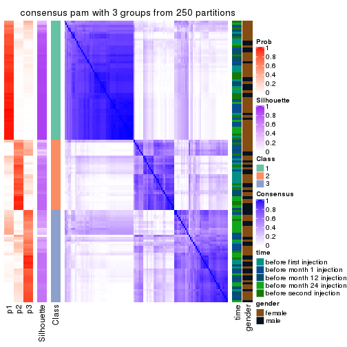</p>

</div>
<div id='tab-MAD-pam-consensus-heatmap-3'>
<pre><code class="r">consensus_heatmap(res, k = 4)
</code></pre>

<p></p>

</div>
<div id='tab-MAD-pam-consensus-heatmap-4'>
<pre><code class="r">consensus_heatmap(res, k = 5)
</code></pre>

<p></p>

</div>
<div id='tab-MAD-pam-consensus-heatmap-5'>
<pre><code class="r">consensus_heatmap(res, k = 6)
</code></pre>

<p></p>

</div>
</div>

Heatmaps for the membership of samples in all partitions to see how consistent they are:


<script>
$( function() {
	$( '#tabs-MAD-pam-membership-heatmap' ).tabs();
} );
</script>
<div id='tabs-MAD-pam-membership-heatmap'>
<ul>
<li><a href='#tab-MAD-pam-membership-heatmap-1'>k = 2</a></li>
<li><a href='#tab-MAD-pam-membership-heatmap-2'>k = 3</a></li>
<li><a href='#tab-MAD-pam-membership-heatmap-3'>k = 4</a></li>
<li><a href='#tab-MAD-pam-membership-heatmap-4'>k = 5</a></li>
<li><a href='#tab-MAD-pam-membership-heatmap-5'>k = 6</a></li>
</ul>
<div id='tab-MAD-pam-membership-heatmap-1'>
<pre><code class="r">membership_heatmap(res, k = 2)
</code></pre>

<p></p>

</div>
<div id='tab-MAD-pam-membership-heatmap-2'>
<pre><code class="r">membership_heatmap(res, k = 3)
</code></pre>

<p></p>

</div>
<div id='tab-MAD-pam-membership-heatmap-3'>
<pre><code class="r">membership_heatmap(res, k = 4)
</code></pre>

<p></p>

</div>
<div id='tab-MAD-pam-membership-heatmap-4'>
<pre><code class="r">membership_heatmap(res, k = 5)
</code></pre>

<p></p>

</div>
<div id='tab-MAD-pam-membership-heatmap-5'>
<pre><code class="r">membership_heatmap(res, k = 6)
</code></pre>

<p>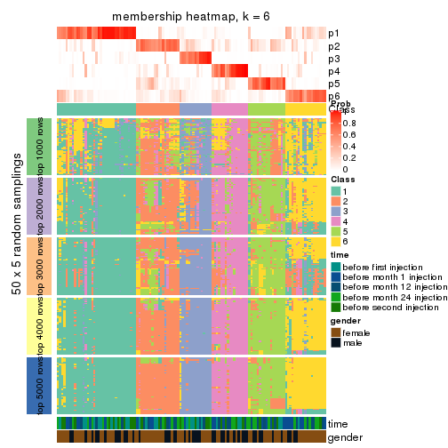</p>

</div>
</div>

As soon as we have had the classes for columns, we can look for signatures
which are significantly different between classes which can be candidate marks
for certain classes. Following are the heatmaps for signatures.


Signature heatmaps where rows are scaled:


<script>
$( function() {
	$( '#tabs-MAD-pam-get-signatures' ).tabs();
} );
</script>
<div id='tabs-MAD-pam-get-signatures'>
<ul>
<li><a href='#tab-MAD-pam-get-signatures-1'>k = 2</a></li>
<li><a href='#tab-MAD-pam-get-signatures-2'>k = 3</a></li>
<li><a href='#tab-MAD-pam-get-signatures-3'>k = 4</a></li>
<li><a href='#tab-MAD-pam-get-signatures-4'>k = 5</a></li>
<li><a href='#tab-MAD-pam-get-signatures-5'>k = 6</a></li>
</ul>
<div id='tab-MAD-pam-get-signatures-1'>
<pre><code class="r">get_signatures(res, k = 2)
</code></pre>

<p></p>

</div>
<div id='tab-MAD-pam-get-signatures-2'>
<pre><code class="r">get_signatures(res, k = 3)
</code></pre>

<p></p>

</div>
<div id='tab-MAD-pam-get-signatures-3'>
<pre><code class="r">get_signatures(res, k = 4)
</code></pre>

<p></p>

</div>
<div id='tab-MAD-pam-get-signatures-4'>
<pre><code class="r">get_signatures(res, k = 5)
</code></pre>

<p></p>

</div>
<div id='tab-MAD-pam-get-signatures-5'>
<pre><code class="r">get_signatures(res, k = 6)
</code></pre>

<p></p>

</div>
</div>


Signature heatmaps where rows are not scaled:


<script>
$( function() {
	$( '#tabs-MAD-pam-get-signatures-no-scale' ).tabs();
} );
</script>
<div id='tabs-MAD-pam-get-signatures-no-scale'>
<ul>
<li><a href='#tab-MAD-pam-get-signatures-no-scale-1'>k = 2</a></li>
<li><a href='#tab-MAD-pam-get-signatures-no-scale-2'>k = 3</a></li>
<li><a href='#tab-MAD-pam-get-signatures-no-scale-3'>k = 4</a></li>
<li><a href='#tab-MAD-pam-get-signatures-no-scale-4'>k = 5</a></li>
<li><a href='#tab-MAD-pam-get-signatures-no-scale-5'>k = 6</a></li>
</ul>
<div id='tab-MAD-pam-get-signatures-no-scale-1'>
<pre><code class="r">get_signatures(res, k = 2, scale_rows = FALSE)
</code></pre>

<p></p>

</div>
<div id='tab-MAD-pam-get-signatures-no-scale-2'>
<pre><code class="r">get_signatures(res, k = 3, scale_rows = FALSE)
</code></pre>

<p></p>

</div>
<div id='tab-MAD-pam-get-signatures-no-scale-3'>
<pre><code class="r">get_signatures(res, k = 4, scale_rows = FALSE)
</code></pre>

<p>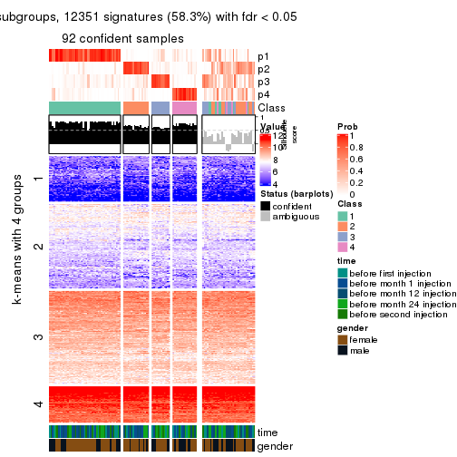</p>

</div>
<div id='tab-MAD-pam-get-signatures-no-scale-4'>
<pre><code class="r">get_signatures(res, k = 5, scale_rows = FALSE)
</code></pre>

<p></p>

</div>
<div id='tab-MAD-pam-get-signatures-no-scale-5'>
<pre><code class="r">get_signatures(res, k = 6, scale_rows = FALSE)
</code></pre>

<p></p>

</div>
</div>


Compare the overlap of signatures from different k:

```r
compare_signatures(res)
```


`get_signature()` returns a data frame invisibly. TO get the list of signatures, the function
call should be assigned to a variable explicitly. In following code, if `plot` argument is set
to `FALSE`, no heatmap is plotted while only the differential analysis is performed.

```r
# code only for demonstration
tb = get_signature(res, k = ..., plot = FALSE)
```

An example of the output of `tb` is:

```
#>   which_row         fdr    mean_1    mean_2 scaled_mean_1 scaled_mean_2 km
#> 1        38 0.042760348  8.373488  9.131774    -0.5533452     0.5164555  1
#> 2        40 0.018707592  7.106213  8.469186    -0.6173731     0.5762149  1
#> 3        55 0.019134737 10.221463 11.207825    -0.6159697     0.5749050  1
#> 4        59 0.006059896  5.921854  7.869574    -0.6899429     0.6439467  1
#> 5        60 0.018055526  8.928898 10.211722    -0.6204761     0.5791110  1
#> 6        98 0.009384629 15.714769 14.887706     0.6635654    -0.6193277  2
...
```

The columns in `tb` are:

1. `which_row`: row indices corresponding to the input matrix.
2. `fdr`: FDR for the differential test. 
3. `mean_x`: The mean value in group x.
4. `scaled_mean_x`: The mean value in group x after rows are scaled.
5. `km`: Row groups if k-means clustering is applied to rows.


UMAP plot which shows how samples are separated.


<script>
$( function() {
	$( '#tabs-MAD-pam-dimension-reduction' ).tabs();
} );
</script>
<div id='tabs-MAD-pam-dimension-reduction'>
<ul>
<li><a href='#tab-MAD-pam-dimension-reduction-1'>k = 2</a></li>
<li><a href='#tab-MAD-pam-dimension-reduction-2'>k = 3</a></li>
<li><a href='#tab-MAD-pam-dimension-reduction-3'>k = 4</a></li>
<li><a href='#tab-MAD-pam-dimension-reduction-4'>k = 5</a></li>
<li><a href='#tab-MAD-pam-dimension-reduction-5'>k = 6</a></li>
</ul>
<div id='tab-MAD-pam-dimension-reduction-1'>
<pre><code class="r">dimension_reduction(res, k = 2, method = &quot;UMAP&quot;)
</code></pre>

<p></p>

</div>
<div id='tab-MAD-pam-dimension-reduction-2'>
<pre><code class="r">dimension_reduction(res, k = 3, method = &quot;UMAP&quot;)
</code></pre>

<p></p>

</div>
<div id='tab-MAD-pam-dimension-reduction-3'>
<pre><code class="r">dimension_reduction(res, k = 4, method = &quot;UMAP&quot;)
</code></pre>

<p></p>

</div>
<div id='tab-MAD-pam-dimension-reduction-4'>
<pre><code class="r">dimension_reduction(res, k = 5, method = &quot;UMAP&quot;)
</code></pre>

<p></p>

</div>
<div id='tab-MAD-pam-dimension-reduction-5'>
<pre><code class="r">dimension_reduction(res, k = 6, method = &quot;UMAP&quot;)
</code></pre>

<p></p>

</div>
</div>


Following heatmap shows how subgroups are split when increasing `k`:

```r
collect_classes(res)
```


Test correlation between subgroups and known annotations. If the known
annotation is numeric, one-way ANOVA test is applied, and if the known
annotation is discrete, chi-squared contingency table test is applied.

```r
test_to_known_factors(res)
```

```
#>           n time(p) gender(p) k
#> MAD:pam 119   0.556     0.347 2
#> MAD:pam 110   0.181     0.257 3
#> MAD:pam  92   0.859     0.340 4
#> MAD:pam  88   0.943     0.417 5
#> MAD:pam  92   0.923     0.235 6
```


If matrix rows can be associated to genes, consider to use `GO_Enrichment(res,
...)` to perform function enrichment for the signature genes.


 

---------------------------------------------------


### MAD:mclust


The object with results only for a single top-value method and a single partition method 
can be extracted as:

```r
res = res_list["MAD", "mclust"]
# you can also extract it by
# res = res_list["MAD:mclust"]
```

A summary of `res` and all the functions that can be applied to it:

```r
res
```

```
#> A 'ConsensusPartition' object with k = 2, 3, 4, 5, 6.
#>   On a matrix with 21168 rows and 125 columns.
#>   Top rows (1000, 2000, 3000, 4000, 5000) are extracted by 'MAD' method.
#>   Subgroups are detected by 'mclust' method.
#>   Performed in total 1250 partitions by row resampling.
#>   Best k for subgroups seems to be 3.
#> 
#> Following methods can be applied to this 'ConsensusPartition' object:
#>  [1] "cola_report"             "collect_classes"         "collect_plots"          
#>  [4] "collect_stats"           "colnames"                "compare_signatures"     
#>  [7] "consensus_heatmap"       "dimension_reduction"     "functional_enrichment"  
#> [10] "get_anno_col"            "get_anno"                "get_classes"            
#> [13] "get_consensus"           "get_matrix"              "get_membership"         
#> [16] "get_param"               "get_signatures"          "get_stats"              
#> [19] "is_best_k"               "is_stable_k"             "membership_heatmap"     
#> [22] "ncol"                    "nrow"                    "plot_ecdf"              
#> [25] "rownames"                "select_partition_number" "show"                   
#> [28] "suggest_best_k"          "test_to_known_factors"
```

`collect_plots()` function collects all the plots made from `res` for all `k` (number of partitions)
into one single page to provide an easy and fast comparison between different `k`.

```r
collect_plots(res)
```


The plots are:

- The first row: a plot of the ECDF (Empirical cumulative distribution
  function) curves of the consensus matrix for each `k` and the heatmap of
  predicted classes for each `k`.
- The second row: heatmaps of the consensus matrix for each `k`.
- The third row: heatmaps of the membership matrix for each `k`.
- The fouth row: heatmaps of the signatures for each `k`.

All the plots in panels can be made by individual functions and they are
plotted later in this section.

`select_partition_number()` produces several plots showing different
statistics for choosing "optimized" `k`. There are following statistics:

- ECDF curves of the consensus matrix for each `k`;
- 1-PAC. [The PAC
  score](https://en.wikipedia.org/wiki/Consensus_clustering#Over-interpretation_potential_of_consensus_clustering)
  measures the proportion of the ambiguous subgrouping.
- Mean silhouette score.
- Concordance. The mean probability of fiting the consensus class ids in all
  partitions.
- Area increased. Denote $A_k$ as the area under the ECDF curve for current
  `k`, the area increased is defined as $A_k - A_{k-1}$.
- Rand index. The percent of pairs of samples that are both in a same cluster
  or both are not in a same cluster in the partition of k and k-1.
- Jaccard index. The ratio of pairs of samples are both in a same cluster in
  the partition of k and k-1 and the pairs of samples are both in a same
  cluster in the partition k or k-1.

The detailed explanations of these statistics can be found in [the cola
vignette](http://bioconductor.org/packages/devel/bioc/vignettes/cola/inst/doc/cola.html#toc_13).

Generally speaking, lower PAC score, higher mean silhouette score or higher
concordance corresponds to better partition. Rand index and Jaccard index
measure how similar the current partition is compared to partition with `k-1`.
If they are too similar, we won't accept `k` is better than `k-1`.

```r
select_partition_number(res)
```


The numeric values for all these statistics can be obtained by `get_stats()`.

```r
get_stats(res)
```

```
#>   k 1-PAC mean_silhouette concordance area_increased  Rand Jaccard
#> 2 2 0.468           0.786       0.848         0.4333 0.573   0.573
#> 3 3 0.513           0.769       0.867         0.5013 0.746   0.560
#> 4 4 0.530           0.558       0.790         0.1107 0.860   0.626
#> 5 5 0.689           0.709       0.817         0.0797 0.833   0.488
#> 6 6 0.767           0.761       0.862         0.0440 0.899   0.585
```

`suggest_best_k()` suggests the best $k$ based on these statistics. The rules are as follows:

- All $k$ with Jaccard index larger than 0.95 are removed because the increase of
  the partition number does not provides enough extra information. If all $k$ are removed,
  the best $k$ is assigned by `NA`.
- For $k$ with 1-PAC larger than 0.9, the maximal $k$ is taken as the "best k". Other $k$ is called "optional k".
- If it does not fit the second rule. The $k$ with the highest vote of highest
  1-PAC, mean silhouette and concordance is taken as the "best k".

```r
suggest_best_k(res)
```

```
#> [1] 3
```


Following shows the table of the partitions (You need to click the **show/hide
code output** link to see it). The membership matrix (columns with name `p*`)
is inferred by
[`clue::cl_consensus()`](https://www.rdocumentation.org/link/cl_consensus?package=clue)
function with the `SE` method. Basically the value in the membership matrix
represents the probability to belong to a certain group. The finall class
label for an item is determined with the group with highest probability it
belongs to.

In `get_classes()` function, the entropy is calculated from the membership
matrix and the silhouette score is calculated from the consensus matrix.


<script>
$( function() {
	$( '#tabs-MAD-mclust-get-classes' ).tabs();
} );
</script>
<div id='tabs-MAD-mclust-get-classes'>
<ul>
<li><a href='#tab-MAD-mclust-get-classes-1'>k = 2</a></li>
<li><a href='#tab-MAD-mclust-get-classes-2'>k = 3</a></li>
<li><a href='#tab-MAD-mclust-get-classes-3'>k = 4</a></li>
<li><a href='#tab-MAD-mclust-get-classes-4'>k = 5</a></li>
<li><a href='#tab-MAD-mclust-get-classes-5'>k = 6</a></li>
</ul>

<div id='tab-MAD-mclust-get-classes-1'>
<p><a id='tab-MAD-mclust-get-classes-1-a' style='color:#0366d6' href='#'>show/hide code output</a></p>
<pre><code class="r">cbind(get_classes(res, k = 2), get_membership(res, k = 2))
</code></pre>

<pre><code>#&gt;           class entropy silhouette    p1    p2
#&gt; GSM601752     2  0.8555      0.775 0.280 0.720
#&gt; GSM601782     1  0.8327      0.829 0.736 0.264
#&gt; GSM601792     2  0.1843      0.800 0.028 0.972
#&gt; GSM601797     2  0.3584      0.805 0.068 0.932
#&gt; GSM601827     1  0.8443      0.825 0.728 0.272
#&gt; GSM601837     1  0.0000      0.788 1.000 0.000
#&gt; GSM601842     1  0.0000      0.788 1.000 0.000
#&gt; GSM601857     1  0.8327      0.829 0.736 0.264
#&gt; GSM601867     1  0.6973      0.825 0.812 0.188
#&gt; GSM601747     1  0.8327      0.829 0.736 0.264
#&gt; GSM601757     1  0.8327      0.829 0.736 0.264
#&gt; GSM601762     1  0.0000      0.788 1.000 0.000
#&gt; GSM601767     1  0.0000      0.788 1.000 0.000
#&gt; GSM601772     1  0.0000      0.788 1.000 0.000
#&gt; GSM601777     2  0.4690      0.748 0.100 0.900
#&gt; GSM601787     1  0.3274      0.802 0.940 0.060
#&gt; GSM601802     2  0.8555      0.771 0.280 0.720
#&gt; GSM601807     1  0.8861      0.794 0.696 0.304
#&gt; GSM601812     1  0.8327      0.829 0.736 0.264
#&gt; GSM601817     1  0.8327      0.829 0.736 0.264
#&gt; GSM601822     2  0.2236      0.801 0.036 0.964
#&gt; GSM601832     1  0.0000      0.788 1.000 0.000
#&gt; GSM601847     2  0.8267      0.784 0.260 0.740
#&gt; GSM601852     1  0.8386      0.827 0.732 0.268
#&gt; GSM601862     1  0.8327      0.829 0.736 0.264
#&gt; GSM601753     2  0.8661      0.772 0.288 0.712
#&gt; GSM601783     1  0.8499      0.822 0.724 0.276
#&gt; GSM601793     2  0.1633      0.798 0.024 0.976
#&gt; GSM601798     2  0.8327      0.767 0.264 0.736
#&gt; GSM601828     1  0.8327      0.829 0.736 0.264
#&gt; GSM601838     1  0.0000      0.788 1.000 0.000
#&gt; GSM601843     1  0.0000      0.788 1.000 0.000
#&gt; GSM601858     1  0.0000      0.788 1.000 0.000
#&gt; GSM601868     1  0.8327      0.829 0.736 0.264
#&gt; GSM601748     1  0.8327      0.829 0.736 0.264
#&gt; GSM601758     1  0.8386      0.827 0.732 0.268
#&gt; GSM601763     1  0.8386      0.827 0.732 0.268
#&gt; GSM601768     1  0.0000      0.788 1.000 0.000
#&gt; GSM601773     1  0.0000      0.788 1.000 0.000
#&gt; GSM601778     2  0.1633      0.798 0.024 0.976
#&gt; GSM601788     1  0.0000      0.788 1.000 0.000
#&gt; GSM601803     2  0.8327      0.767 0.264 0.736
#&gt; GSM601808     1  0.8327      0.829 0.736 0.264
#&gt; GSM601813     1  0.8555      0.819 0.720 0.280
#&gt; GSM601818     1  0.8327      0.829 0.736 0.264
#&gt; GSM601823     2  0.1633      0.798 0.024 0.976
#&gt; GSM601833     1  0.0000      0.788 1.000 0.000
#&gt; GSM601848     2  0.1633      0.798 0.024 0.976
#&gt; GSM601853     1  0.8327      0.829 0.736 0.264
#&gt; GSM601863     1  0.8327      0.829 0.736 0.264
#&gt; GSM601754     2  0.8267      0.784 0.260 0.740
#&gt; GSM601784     1  0.0000      0.788 1.000 0.000
#&gt; GSM601794     2  0.1633      0.798 0.024 0.976
#&gt; GSM601799     2  0.8608      0.775 0.284 0.716
#&gt; GSM601829     2  0.8081      0.460 0.248 0.752
#&gt; GSM601839     1  0.0000      0.788 1.000 0.000
#&gt; GSM601844     1  0.9170      0.765 0.668 0.332
#&gt; GSM601859     1  0.0000      0.788 1.000 0.000
#&gt; GSM601869     1  0.8327      0.829 0.736 0.264
#&gt; GSM601749     1  0.8443      0.825 0.728 0.272
#&gt; GSM601759     1  0.8386      0.827 0.732 0.268
#&gt; GSM601764     1  0.8386      0.827 0.732 0.268
#&gt; GSM601769     1  0.0000      0.788 1.000 0.000
#&gt; GSM601774     1  0.0000      0.788 1.000 0.000
#&gt; GSM601779     2  0.1633      0.798 0.024 0.976
#&gt; GSM601789     1  0.0000      0.788 1.000 0.000
#&gt; GSM601804     2  0.6048      0.801 0.148 0.852
#&gt; GSM601809     1  0.8267      0.829 0.740 0.260
#&gt; GSM601814     1  0.0000      0.788 1.000 0.000
#&gt; GSM601819     1  0.8327      0.829 0.736 0.264
#&gt; GSM601824     2  0.3274      0.804 0.060 0.940
#&gt; GSM601834     1  0.0000      0.788 1.000 0.000
#&gt; GSM601849     1  0.9248      0.755 0.660 0.340
#&gt; GSM601854     1  0.8443      0.825 0.728 0.272
#&gt; GSM601864     1  0.0000      0.788 1.000 0.000
#&gt; GSM601755     2  0.8327      0.767 0.264 0.736
#&gt; GSM601785     1  0.0938      0.791 0.988 0.012
#&gt; GSM601795     2  0.1843      0.800 0.028 0.972
#&gt; GSM601800     2  0.8661      0.772 0.288 0.712
#&gt; GSM601830     1  0.8386      0.827 0.732 0.268
#&gt; GSM601840     1  0.6623      0.823 0.828 0.172
#&gt; GSM601845     1  0.7219      0.827 0.800 0.200
#&gt; GSM601860     1  0.0000      0.788 1.000 0.000
#&gt; GSM601870     1  0.8081      0.830 0.752 0.248
#&gt; GSM601750     1  0.8327      0.829 0.736 0.264
#&gt; GSM601760     1  0.8386      0.827 0.732 0.268
#&gt; GSM601765     1  0.0000      0.788 1.000 0.000
#&gt; GSM601770     1  0.0000      0.788 1.000 0.000
#&gt; GSM601775     1  0.6801      0.795 0.820 0.180
#&gt; GSM601780     2  0.5059      0.723 0.112 0.888
#&gt; GSM601790     1  0.0000      0.788 1.000 0.000
#&gt; GSM601805     2  0.8661      0.772 0.288 0.712
#&gt; GSM601810     1  0.8327      0.829 0.736 0.264
#&gt; GSM601815     1  0.0000      0.788 1.000 0.000
#&gt; GSM601820     1  0.8386      0.827 0.732 0.268
#&gt; GSM601825     2  0.8713      0.771 0.292 0.708
#&gt; GSM601835     1  0.0000      0.788 1.000 0.000
#&gt; GSM601850     2  0.9933     -0.304 0.452 0.548
#&gt; GSM601855     1  0.8386      0.827 0.732 0.268
#&gt; GSM601865     1  0.0000      0.788 1.000 0.000
#&gt; GSM601756     2  0.8327      0.767 0.264 0.736
#&gt; GSM601786     1  0.0000      0.788 1.000 0.000
#&gt; GSM601796     2  0.1633      0.798 0.024 0.976
#&gt; GSM601801     2  0.8327      0.767 0.264 0.736
#&gt; GSM601831     1  0.8386      0.827 0.732 0.268
#&gt; GSM601841     1  0.9491      0.715 0.632 0.368
#&gt; GSM601846     2  0.8081      0.787 0.248 0.752
#&gt; GSM601861     1  0.0000      0.788 1.000 0.000
#&gt; GSM601871     1  0.2948      0.800 0.948 0.052
#&gt; GSM601751     1  0.0000      0.788 1.000 0.000
#&gt; GSM601761     1  0.8608      0.815 0.716 0.284
#&gt; GSM601766     1  0.8016      0.830 0.756 0.244
#&gt; GSM601771     1  0.0000      0.788 1.000 0.000
#&gt; GSM601776     2  0.5178      0.717 0.116 0.884
#&gt; GSM601781     2  0.4562      0.743 0.096 0.904
#&gt; GSM601791     1  0.9686      0.668 0.604 0.396
#&gt; GSM601806     2  0.8661      0.772 0.288 0.712
#&gt; GSM601811     1  0.8327      0.829 0.736 0.264
#&gt; GSM601816     2  0.1633      0.798 0.024 0.976
#&gt; GSM601821     1  0.0000      0.788 1.000 0.000
#&gt; GSM601826     2  0.1633      0.798 0.024 0.976
#&gt; GSM601836     1  0.8327      0.829 0.736 0.264
#&gt; GSM601851     2  0.4161      0.755 0.084 0.916
#&gt; GSM601856     1  0.8443      0.825 0.728 0.272
#&gt; GSM601866     1  0.8327      0.829 0.736 0.264
</code></pre>

<script>
$('#tab-MAD-mclust-get-classes-1-a').parent().next().next().hide();
$('#tab-MAD-mclust-get-classes-1-a').click(function(){
  $('#tab-MAD-mclust-get-classes-1-a').parent().next().next().toggle();
  return(false);
});
</script>
</div>

<div id='tab-MAD-mclust-get-classes-2'>
<p><a id='tab-MAD-mclust-get-classes-2-a' style='color:#0366d6' href='#'>show/hide code output</a></p>
<pre><code class="r">cbind(get_classes(res, k = 3), get_membership(res, k = 3))
</code></pre>

<pre><code>#&gt;           class entropy silhouette    p1    p2    p3
#&gt; GSM601752     1  0.1163     0.8503 0.972 0.028 0.000
#&gt; GSM601782     3  0.5244     0.7434 0.004 0.240 0.756
#&gt; GSM601792     1  0.2537     0.8560 0.920 0.000 0.080
#&gt; GSM601797     1  0.2743     0.8591 0.928 0.020 0.052
#&gt; GSM601827     3  0.4063     0.8439 0.020 0.112 0.868
#&gt; GSM601837     2  0.3192     0.8271 0.000 0.888 0.112
#&gt; GSM601842     2  0.1399     0.8736 0.028 0.968 0.004
#&gt; GSM601857     3  0.0237     0.8226 0.000 0.004 0.996
#&gt; GSM601867     3  0.5849     0.6198 0.028 0.216 0.756
#&gt; GSM601747     2  0.6075     0.4881 0.008 0.676 0.316
#&gt; GSM601757     3  0.4209     0.8435 0.020 0.120 0.860
#&gt; GSM601762     2  0.0424     0.8787 0.008 0.992 0.000
#&gt; GSM601767     2  0.0000     0.8797 0.000 1.000 0.000
#&gt; GSM601772     2  0.0000     0.8797 0.000 1.000 0.000
#&gt; GSM601777     1  0.6684     0.6782 0.676 0.032 0.292
#&gt; GSM601787     3  0.5902     0.4589 0.004 0.316 0.680
#&gt; GSM601802     1  0.1163     0.8503 0.972 0.028 0.000
#&gt; GSM601807     3  0.3129     0.7665 0.088 0.008 0.904
#&gt; GSM601812     3  0.3965     0.8427 0.008 0.132 0.860
#&gt; GSM601817     3  0.2959     0.8483 0.000 0.100 0.900
#&gt; GSM601822     1  0.2492     0.8593 0.936 0.016 0.048
#&gt; GSM601832     2  0.4095     0.8306 0.056 0.880 0.064
#&gt; GSM601847     1  0.2569     0.8573 0.936 0.032 0.032
#&gt; GSM601852     3  0.3425     0.8455 0.004 0.112 0.884
#&gt; GSM601862     3  0.0237     0.8208 0.004 0.000 0.996
#&gt; GSM601753     1  0.1163     0.8503 0.972 0.028 0.000
#&gt; GSM601783     3  0.4786     0.8330 0.044 0.112 0.844
#&gt; GSM601793     1  0.3192     0.8483 0.888 0.000 0.112
#&gt; GSM601798     1  0.1163     0.8503 0.972 0.028 0.000
#&gt; GSM601828     3  0.3607     0.8454 0.008 0.112 0.880
#&gt; GSM601838     2  0.3192     0.8271 0.000 0.888 0.112
#&gt; GSM601843     2  0.0424     0.8788 0.008 0.992 0.000
#&gt; GSM601858     2  0.3340     0.8275 0.000 0.880 0.120
#&gt; GSM601868     3  0.0237     0.8192 0.004 0.000 0.996
#&gt; GSM601748     3  0.3425     0.8455 0.004 0.112 0.884
#&gt; GSM601758     3  0.4196     0.8425 0.024 0.112 0.864
#&gt; GSM601763     2  0.7059     0.6450 0.092 0.716 0.192
#&gt; GSM601768     2  0.0000     0.8797 0.000 1.000 0.000
#&gt; GSM601773     2  0.0747     0.8774 0.016 0.984 0.000
#&gt; GSM601778     1  0.4164     0.8383 0.848 0.008 0.144
#&gt; GSM601788     2  0.1289     0.8706 0.000 0.968 0.032
#&gt; GSM601803     1  0.1964     0.8439 0.944 0.056 0.000
#&gt; GSM601808     3  0.0237     0.8192 0.004 0.000 0.996
#&gt; GSM601813     3  0.4196     0.8425 0.024 0.112 0.864
#&gt; GSM601818     3  0.3983     0.7706 0.004 0.144 0.852
#&gt; GSM601823     1  0.3879     0.8295 0.848 0.000 0.152
#&gt; GSM601833     2  0.0000     0.8797 0.000 1.000 0.000
#&gt; GSM601848     1  0.3752     0.8336 0.856 0.000 0.144
#&gt; GSM601853     3  0.0237     0.8192 0.004 0.000 0.996
#&gt; GSM601863     3  0.0475     0.8230 0.004 0.004 0.992
#&gt; GSM601754     1  0.1399     0.8518 0.968 0.028 0.004
#&gt; GSM601784     2  0.0000     0.8797 0.000 1.000 0.000
#&gt; GSM601794     1  0.3038     0.8507 0.896 0.000 0.104
#&gt; GSM601799     1  0.1267     0.8524 0.972 0.024 0.004
#&gt; GSM601829     1  0.7366     0.4122 0.564 0.036 0.400
#&gt; GSM601839     2  0.3192     0.8271 0.000 0.888 0.112
#&gt; GSM601844     1  0.9118     0.1899 0.468 0.144 0.388
#&gt; GSM601859     2  0.0000     0.8797 0.000 1.000 0.000
#&gt; GSM601869     3  0.1315     0.8301 0.008 0.020 0.972
#&gt; GSM601749     3  0.4413     0.8423 0.024 0.124 0.852
#&gt; GSM601759     3  0.4196     0.8425 0.024 0.112 0.864
#&gt; GSM601764     2  0.6148     0.6023 0.028 0.728 0.244
#&gt; GSM601769     2  0.0000     0.8797 0.000 1.000 0.000
#&gt; GSM601774     2  0.0000     0.8797 0.000 1.000 0.000
#&gt; GSM601779     1  0.3941     0.8269 0.844 0.000 0.156
#&gt; GSM601789     2  0.2625     0.8445 0.000 0.916 0.084
#&gt; GSM601804     1  0.3183     0.8584 0.908 0.016 0.076
#&gt; GSM601809     3  0.6825     0.0571 0.012 0.492 0.496
#&gt; GSM601814     2  0.0000     0.8797 0.000 1.000 0.000
#&gt; GSM601819     3  0.5726     0.7695 0.024 0.216 0.760
#&gt; GSM601824     1  0.4551     0.8396 0.844 0.024 0.132
#&gt; GSM601834     2  0.0000     0.8797 0.000 1.000 0.000
#&gt; GSM601849     3  0.9695    -0.0304 0.384 0.216 0.400
#&gt; GSM601854     3  0.4618     0.8379 0.024 0.136 0.840
#&gt; GSM601864     2  0.3192     0.8271 0.000 0.888 0.112
#&gt; GSM601755     1  0.1163     0.8503 0.972 0.028 0.000
#&gt; GSM601785     2  0.3966     0.8151 0.024 0.876 0.100
#&gt; GSM601795     1  0.2711     0.8548 0.912 0.000 0.088
#&gt; GSM601800     1  0.1163     0.8503 0.972 0.028 0.000
#&gt; GSM601830     3  0.2486     0.7890 0.060 0.008 0.932
#&gt; GSM601840     2  0.6208     0.7225 0.076 0.772 0.152
#&gt; GSM601845     2  0.5746     0.7080 0.040 0.780 0.180
#&gt; GSM601860     2  0.1529     0.8661 0.000 0.960 0.040
#&gt; GSM601870     3  0.1919     0.8103 0.024 0.020 0.956
#&gt; GSM601750     3  0.3607     0.8453 0.008 0.112 0.880
#&gt; GSM601760     3  0.4873     0.8285 0.024 0.152 0.824
#&gt; GSM601765     2  0.0237     0.8793 0.004 0.996 0.000
#&gt; GSM601770     2  0.0000     0.8797 0.000 1.000 0.000
#&gt; GSM601775     2  0.7717     0.6056 0.172 0.680 0.148
#&gt; GSM601780     1  0.6601     0.6553 0.676 0.028 0.296
#&gt; GSM601790     2  0.3116     0.8299 0.000 0.892 0.108
#&gt; GSM601805     1  0.1643     0.8480 0.956 0.044 0.000
#&gt; GSM601810     3  0.1964     0.8414 0.000 0.056 0.944
#&gt; GSM601815     2  0.2625     0.8443 0.000 0.916 0.084
#&gt; GSM601820     3  0.4196     0.8425 0.024 0.112 0.864
#&gt; GSM601825     1  0.1643     0.8477 0.956 0.044 0.000
#&gt; GSM601835     2  0.4709     0.8165 0.056 0.852 0.092
#&gt; GSM601850     1  0.9001     0.3855 0.520 0.332 0.148
#&gt; GSM601855     3  0.1950     0.8031 0.040 0.008 0.952
#&gt; GSM601865     2  0.3192     0.8271 0.000 0.888 0.112
#&gt; GSM601756     1  0.1163     0.8503 0.972 0.028 0.000
#&gt; GSM601786     2  0.3116     0.8299 0.000 0.892 0.108
#&gt; GSM601796     1  0.3412     0.8445 0.876 0.000 0.124
#&gt; GSM601801     1  0.1163     0.8503 0.972 0.028 0.000
#&gt; GSM601831     3  0.3695     0.8464 0.012 0.108 0.880
#&gt; GSM601841     3  0.9370    -0.0882 0.416 0.168 0.416
#&gt; GSM601846     1  0.3112     0.8591 0.916 0.028 0.056
#&gt; GSM601861     2  0.0237     0.8792 0.000 0.996 0.004
#&gt; GSM601871     3  0.5882     0.3933 0.000 0.348 0.652
#&gt; GSM601751     2  0.2096     0.8592 0.004 0.944 0.052
#&gt; GSM601761     3  0.9676     0.3019 0.252 0.288 0.460
#&gt; GSM601766     2  0.4195     0.7783 0.012 0.852 0.136
#&gt; GSM601771     2  0.1753     0.8631 0.000 0.952 0.048
#&gt; GSM601776     1  0.6880     0.6212 0.660 0.036 0.304
#&gt; GSM601781     1  0.6950     0.6883 0.692 0.056 0.252
#&gt; GSM601791     2  0.9853    -0.1476 0.252 0.388 0.360
#&gt; GSM601806     1  0.3038     0.8238 0.896 0.104 0.000
#&gt; GSM601811     3  0.2625     0.8179 0.000 0.084 0.916
#&gt; GSM601816     1  0.3752     0.8338 0.856 0.000 0.144
#&gt; GSM601821     2  0.0424     0.8784 0.000 0.992 0.008
#&gt; GSM601826     1  0.3879     0.8295 0.848 0.000 0.152
#&gt; GSM601836     2  0.5939     0.6411 0.028 0.748 0.224
#&gt; GSM601851     1  0.6008     0.6197 0.664 0.004 0.332
#&gt; GSM601856     3  0.0475     0.8219 0.004 0.004 0.992
#&gt; GSM601866     3  0.3272     0.8470 0.004 0.104 0.892
</code></pre>

<script>
$('#tab-MAD-mclust-get-classes-2-a').parent().next().next().hide();
$('#tab-MAD-mclust-get-classes-2-a').click(function(){
  $('#tab-MAD-mclust-get-classes-2-a').parent().next().next().toggle();
  return(false);
});
</script>
</div>

<div id='tab-MAD-mclust-get-classes-3'>
<p><a id='tab-MAD-mclust-get-classes-3-a' style='color:#0366d6' href='#'>show/hide code output</a></p>
<pre><code class="r">cbind(get_classes(res, k = 4), get_membership(res, k = 4))
</code></pre>

<pre><code>#&gt;           class entropy silhouette    p1    p2    p3    p4
#&gt; GSM601752     4  0.0000     0.8167 0.000 0.000 0.000 1.000
#&gt; GSM601782     1  0.6976     0.4462 0.580 0.240 0.180 0.000
#&gt; GSM601792     4  0.4040     0.6954 0.248 0.000 0.000 0.752
#&gt; GSM601797     4  0.0188     0.8170 0.004 0.000 0.000 0.996
#&gt; GSM601827     1  0.3402     0.5116 0.832 0.004 0.164 0.000
#&gt; GSM601837     2  0.5057     0.5362 0.012 0.648 0.340 0.000
#&gt; GSM601842     2  0.1576     0.7988 0.004 0.948 0.000 0.048
#&gt; GSM601857     1  0.4996    -0.3183 0.516 0.000 0.484 0.000
#&gt; GSM601867     3  0.4756     0.5248 0.072 0.144 0.784 0.000
#&gt; GSM601747     2  0.7421    -0.1701 0.372 0.456 0.172 0.000
#&gt; GSM601757     1  0.1743     0.5866 0.940 0.004 0.056 0.000
#&gt; GSM601762     2  0.0927     0.8127 0.000 0.976 0.008 0.016
#&gt; GSM601767     2  0.0000     0.8165 0.000 1.000 0.000 0.000
#&gt; GSM601772     2  0.0000     0.8165 0.000 1.000 0.000 0.000
#&gt; GSM601777     4  0.4484     0.7334 0.064 0.004 0.120 0.812
#&gt; GSM601787     3  0.2965     0.5456 0.036 0.072 0.892 0.000
#&gt; GSM601802     4  0.0000     0.8167 0.000 0.000 0.000 1.000
#&gt; GSM601807     3  0.3355     0.5784 0.160 0.000 0.836 0.004
#&gt; GSM601812     1  0.3355     0.5219 0.836 0.004 0.160 0.000
#&gt; GSM601817     1  0.3801     0.4402 0.780 0.000 0.220 0.000
#&gt; GSM601822     4  0.0376     0.8169 0.004 0.000 0.004 0.992
#&gt; GSM601832     2  0.3335     0.7387 0.016 0.856 0.000 0.128
#&gt; GSM601847     4  0.0188     0.8170 0.004 0.000 0.000 0.996
#&gt; GSM601852     1  0.4949     0.5369 0.760 0.060 0.180 0.000
#&gt; GSM601862     1  0.5000    -0.3511 0.504 0.000 0.496 0.000
#&gt; GSM601753     4  0.0000     0.8167 0.000 0.000 0.000 1.000
#&gt; GSM601783     1  0.2399     0.6025 0.920 0.048 0.032 0.000
#&gt; GSM601793     4  0.4585     0.6213 0.332 0.000 0.000 0.668
#&gt; GSM601798     4  0.0000     0.8167 0.000 0.000 0.000 1.000
#&gt; GSM601828     1  0.3208     0.5361 0.848 0.004 0.148 0.000
#&gt; GSM601838     2  0.5057     0.5362 0.012 0.648 0.340 0.000
#&gt; GSM601843     2  0.0336     0.8153 0.000 0.992 0.000 0.008
#&gt; GSM601858     2  0.4387     0.6601 0.012 0.752 0.236 0.000
#&gt; GSM601868     3  0.4994     0.3610 0.480 0.000 0.520 0.000
#&gt; GSM601748     1  0.2921     0.5391 0.860 0.000 0.140 0.000
#&gt; GSM601758     1  0.2101     0.5883 0.928 0.012 0.060 0.000
#&gt; GSM601763     1  0.5643     0.1854 0.540 0.440 0.016 0.004
#&gt; GSM601768     2  0.0000     0.8165 0.000 1.000 0.000 0.000
#&gt; GSM601773     2  0.0817     0.8117 0.000 0.976 0.000 0.024
#&gt; GSM601778     4  0.3982     0.7277 0.220 0.000 0.004 0.776
#&gt; GSM601788     2  0.0927     0.8137 0.008 0.976 0.000 0.016
#&gt; GSM601803     4  0.1557     0.7899 0.000 0.056 0.000 0.944
#&gt; GSM601808     3  0.4967     0.4233 0.452 0.000 0.548 0.000
#&gt; GSM601813     1  0.3758     0.6006 0.848 0.104 0.048 0.000
#&gt; GSM601818     1  0.5998     0.4493 0.684 0.116 0.200 0.000
#&gt; GSM601823     4  0.5508     0.3538 0.476 0.000 0.016 0.508
#&gt; GSM601833     2  0.0000     0.8165 0.000 1.000 0.000 0.000
#&gt; GSM601848     4  0.5506     0.3632 0.472 0.000 0.016 0.512
#&gt; GSM601853     3  0.4972     0.4148 0.456 0.000 0.544 0.000
#&gt; GSM601863     1  0.4916    -0.1089 0.576 0.000 0.424 0.000
#&gt; GSM601754     4  0.0000     0.8167 0.000 0.000 0.000 1.000
#&gt; GSM601784     2  0.0000     0.8165 0.000 1.000 0.000 0.000
#&gt; GSM601794     4  0.4304     0.6688 0.284 0.000 0.000 0.716
#&gt; GSM601799     4  0.0000     0.8167 0.000 0.000 0.000 1.000
#&gt; GSM601829     1  0.6338     0.1920 0.620 0.024 0.040 0.316
#&gt; GSM601839     2  0.5057     0.5362 0.012 0.648 0.340 0.000
#&gt; GSM601844     1  0.5037     0.5504 0.764 0.188 0.028 0.020
#&gt; GSM601859     2  0.0000     0.8165 0.000 1.000 0.000 0.000
#&gt; GSM601869     1  0.3837     0.4445 0.776 0.000 0.224 0.000
#&gt; GSM601749     1  0.3697     0.6030 0.852 0.100 0.048 0.000
#&gt; GSM601759     1  0.1637     0.5822 0.940 0.000 0.060 0.000
#&gt; GSM601764     1  0.5535     0.2635 0.560 0.420 0.020 0.000
#&gt; GSM601769     2  0.0657     0.8126 0.004 0.984 0.012 0.000
#&gt; GSM601774     2  0.0000     0.8165 0.000 1.000 0.000 0.000
#&gt; GSM601779     4  0.5511     0.3324 0.484 0.000 0.016 0.500
#&gt; GSM601789     2  0.3672     0.7190 0.012 0.824 0.164 0.000
#&gt; GSM601804     4  0.1211     0.8134 0.040 0.000 0.000 0.960
#&gt; GSM601809     1  0.7379     0.2416 0.468 0.364 0.168 0.000
#&gt; GSM601814     2  0.0000     0.8165 0.000 1.000 0.000 0.000
#&gt; GSM601819     1  0.3706     0.5889 0.848 0.112 0.040 0.000
#&gt; GSM601824     4  0.6684     0.5725 0.272 0.104 0.008 0.616
#&gt; GSM601834     2  0.0000     0.8165 0.000 1.000 0.000 0.000
#&gt; GSM601849     1  0.5139     0.5494 0.760 0.188 0.028 0.024
#&gt; GSM601854     1  0.3873     0.6033 0.844 0.096 0.060 0.000
#&gt; GSM601864     3  0.5404    -0.2982 0.012 0.476 0.512 0.000
#&gt; GSM601755     4  0.0000     0.8167 0.000 0.000 0.000 1.000
#&gt; GSM601785     2  0.4444     0.7070 0.072 0.808 0.000 0.120
#&gt; GSM601795     4  0.2704     0.7825 0.124 0.000 0.000 0.876
#&gt; GSM601800     4  0.0000     0.8167 0.000 0.000 0.000 1.000
#&gt; GSM601830     3  0.4955     0.4375 0.444 0.000 0.556 0.000
#&gt; GSM601840     2  0.8143     0.1792 0.292 0.476 0.024 0.208
#&gt; GSM601845     2  0.7965     0.2354 0.288 0.512 0.028 0.172
#&gt; GSM601860     2  0.0188     0.8157 0.004 0.996 0.000 0.000
#&gt; GSM601870     3  0.2345     0.5777 0.100 0.000 0.900 0.000
#&gt; GSM601750     1  0.3402     0.5196 0.832 0.004 0.164 0.000
#&gt; GSM601760     1  0.2124     0.5969 0.932 0.028 0.040 0.000
#&gt; GSM601765     2  0.0000     0.8165 0.000 1.000 0.000 0.000
#&gt; GSM601770     2  0.0000     0.8165 0.000 1.000 0.000 0.000
#&gt; GSM601775     2  0.8130     0.1052 0.336 0.444 0.020 0.200
#&gt; GSM601780     1  0.5855     0.4411 0.716 0.048 0.028 0.208
#&gt; GSM601790     2  0.4635     0.6243 0.012 0.720 0.268 0.000
#&gt; GSM601805     4  0.0469     0.8130 0.000 0.012 0.000 0.988
#&gt; GSM601810     1  0.4843    -0.0604 0.604 0.000 0.396 0.000
#&gt; GSM601815     2  0.3196     0.7424 0.008 0.856 0.136 0.000
#&gt; GSM601820     1  0.1557     0.5835 0.944 0.000 0.056 0.000
#&gt; GSM601825     4  0.0921     0.8059 0.000 0.028 0.000 0.972
#&gt; GSM601835     2  0.3424     0.7748 0.028 0.880 0.016 0.076
#&gt; GSM601850     1  0.8376     0.1623 0.404 0.296 0.020 0.280
#&gt; GSM601855     3  0.4008     0.5637 0.244 0.000 0.756 0.000
#&gt; GSM601865     2  0.5057     0.5362 0.012 0.648 0.340 0.000
#&gt; GSM601756     4  0.0000     0.8167 0.000 0.000 0.000 1.000
#&gt; GSM601786     2  0.4690     0.6153 0.012 0.712 0.276 0.000
#&gt; GSM601796     4  0.4800     0.6151 0.340 0.004 0.000 0.656
#&gt; GSM601801     4  0.0000     0.8167 0.000 0.000 0.000 1.000
#&gt; GSM601831     1  0.4994    -0.3350 0.520 0.000 0.480 0.000
#&gt; GSM601841     1  0.6821     0.5290 0.676 0.184 0.056 0.084
#&gt; GSM601846     4  0.0804     0.8157 0.012 0.000 0.008 0.980
#&gt; GSM601861     2  0.1302     0.8027 0.000 0.956 0.044 0.000
#&gt; GSM601871     3  0.4423     0.4551 0.040 0.168 0.792 0.000
#&gt; GSM601751     2  0.3526     0.7456 0.100 0.864 0.004 0.032
#&gt; GSM601761     1  0.4418     0.5551 0.784 0.192 0.016 0.008
#&gt; GSM601766     2  0.5138     0.1978 0.392 0.600 0.000 0.008
#&gt; GSM601771     2  0.3408     0.7360 0.120 0.860 0.004 0.016
#&gt; GSM601776     1  0.7052     0.4061 0.636 0.128 0.028 0.208
#&gt; GSM601781     4  0.6217     0.4822 0.400 0.040 0.008 0.552
#&gt; GSM601791     1  0.5230     0.5345 0.736 0.220 0.028 0.016
#&gt; GSM601806     4  0.2408     0.7558 0.000 0.104 0.000 0.896
#&gt; GSM601811     1  0.5792    -0.0834 0.552 0.032 0.416 0.000
#&gt; GSM601816     4  0.5220     0.5910 0.352 0.000 0.016 0.632
#&gt; GSM601821     2  0.1474     0.7987 0.000 0.948 0.052 0.000
#&gt; GSM601826     4  0.5508     0.3551 0.476 0.000 0.016 0.508
#&gt; GSM601836     1  0.5650     0.2323 0.544 0.432 0.024 0.000
#&gt; GSM601851     1  0.6104     0.3348 0.672 0.040 0.028 0.260
#&gt; GSM601856     3  0.4961     0.4294 0.448 0.000 0.552 0.000
#&gt; GSM601866     1  0.2469     0.5612 0.892 0.000 0.108 0.000
</code></pre>

<script>
$('#tab-MAD-mclust-get-classes-3-a').parent().next().next().hide();
$('#tab-MAD-mclust-get-classes-3-a').click(function(){
  $('#tab-MAD-mclust-get-classes-3-a').parent().next().next().toggle();
  return(false);
});
</script>
</div>

<div id='tab-MAD-mclust-get-classes-4'>
<p><a id='tab-MAD-mclust-get-classes-4-a' style='color:#0366d6' href='#'>show/hide code output</a></p>
<pre><code class="r">cbind(get_classes(res, k = 5), get_membership(res, k = 5))
</code></pre>

<pre><code>#&gt;           class entropy silhouette    p1    p2    p3    p4    p5
#&gt; GSM601752     4  0.0162     0.8371 0.004 0.000 0.000 0.996 0.000
#&gt; GSM601782     3  0.6780     0.2704 0.284 0.236 0.472 0.000 0.008
#&gt; GSM601792     4  0.4015     0.5220 0.348 0.000 0.000 0.652 0.000
#&gt; GSM601797     4  0.0609     0.8380 0.020 0.000 0.000 0.980 0.000
#&gt; GSM601827     3  0.2953     0.8227 0.144 0.000 0.844 0.000 0.012
#&gt; GSM601837     5  0.3857     0.7551 0.000 0.312 0.000 0.000 0.688
#&gt; GSM601842     2  0.0865     0.8462 0.000 0.972 0.000 0.024 0.004
#&gt; GSM601857     3  0.1668     0.7913 0.028 0.000 0.940 0.000 0.032
#&gt; GSM601867     5  0.4197     0.4344 0.028 0.000 0.244 0.000 0.728
#&gt; GSM601747     2  0.6177     0.2056 0.128 0.516 0.352 0.000 0.004
#&gt; GSM601757     3  0.3828     0.7714 0.220 0.008 0.764 0.000 0.008
#&gt; GSM601762     2  0.0162     0.8590 0.000 0.996 0.000 0.000 0.004
#&gt; GSM601767     2  0.0162     0.8590 0.000 0.996 0.000 0.000 0.004
#&gt; GSM601772     2  0.0000     0.8590 0.000 1.000 0.000 0.000 0.000
#&gt; GSM601777     4  0.6311     0.3642 0.348 0.008 0.104 0.532 0.008
#&gt; GSM601787     5  0.5229     0.5598 0.028 0.068 0.192 0.000 0.712
#&gt; GSM601802     4  0.0162     0.8371 0.004 0.000 0.000 0.996 0.000
#&gt; GSM601807     3  0.4638     0.5460 0.028 0.000 0.648 0.000 0.324
#&gt; GSM601812     3  0.2439     0.8233 0.120 0.004 0.876 0.000 0.000
#&gt; GSM601817     3  0.1981     0.8264 0.064 0.000 0.920 0.000 0.016
#&gt; GSM601822     4  0.2074     0.8033 0.104 0.000 0.000 0.896 0.000
#&gt; GSM601832     2  0.2238     0.7968 0.020 0.912 0.000 0.064 0.004
#&gt; GSM601847     4  0.1831     0.8182 0.076 0.004 0.000 0.920 0.000
#&gt; GSM601852     3  0.2488     0.8242 0.124 0.000 0.872 0.000 0.004
#&gt; GSM601862     3  0.2278     0.7820 0.032 0.000 0.908 0.000 0.060
#&gt; GSM601753     4  0.0510     0.8382 0.016 0.000 0.000 0.984 0.000
#&gt; GSM601783     3  0.3861     0.7401 0.264 0.000 0.728 0.000 0.008
#&gt; GSM601793     4  0.4341     0.4032 0.404 0.000 0.004 0.592 0.000
#&gt; GSM601798     4  0.0000     0.8356 0.000 0.000 0.000 1.000 0.000
#&gt; GSM601828     3  0.2536     0.8219 0.128 0.000 0.868 0.000 0.004
#&gt; GSM601838     5  0.3857     0.7551 0.000 0.312 0.000 0.000 0.688
#&gt; GSM601843     2  0.0451     0.8565 0.000 0.988 0.000 0.008 0.004
#&gt; GSM601858     5  0.4225     0.7384 0.000 0.364 0.004 0.000 0.632
#&gt; GSM601868     3  0.2193     0.7784 0.028 0.000 0.912 0.000 0.060
#&gt; GSM601748     3  0.2873     0.8224 0.128 0.000 0.856 0.000 0.016
#&gt; GSM601758     3  0.3596     0.7844 0.212 0.000 0.776 0.000 0.012
#&gt; GSM601763     1  0.3357     0.7375 0.852 0.092 0.008 0.048 0.000
#&gt; GSM601768     2  0.0000     0.8590 0.000 1.000 0.000 0.000 0.000
#&gt; GSM601773     2  0.0771     0.8512 0.000 0.976 0.000 0.020 0.004
#&gt; GSM601778     4  0.4897     0.2160 0.460 0.000 0.024 0.516 0.000
#&gt; GSM601788     2  0.0162     0.8588 0.000 0.996 0.000 0.004 0.000
#&gt; GSM601803     4  0.1341     0.8044 0.000 0.056 0.000 0.944 0.000
#&gt; GSM601808     3  0.2388     0.7721 0.028 0.000 0.900 0.000 0.072
#&gt; GSM601813     3  0.3815     0.7805 0.220 0.004 0.764 0.000 0.012
#&gt; GSM601818     3  0.3891     0.7913 0.128 0.004 0.808 0.000 0.060
#&gt; GSM601823     1  0.2516     0.7549 0.860 0.000 0.000 0.140 0.000
#&gt; GSM601833     2  0.0000     0.8590 0.000 1.000 0.000 0.000 0.000
#&gt; GSM601848     1  0.2561     0.7529 0.856 0.000 0.000 0.144 0.000
#&gt; GSM601853     3  0.2450     0.7702 0.028 0.000 0.896 0.000 0.076
#&gt; GSM601863     3  0.1836     0.7986 0.036 0.000 0.932 0.000 0.032
#&gt; GSM601754     4  0.0510     0.8382 0.016 0.000 0.000 0.984 0.000
#&gt; GSM601784     2  0.0162     0.8590 0.000 0.996 0.000 0.000 0.004
#&gt; GSM601794     4  0.4045     0.5111 0.356 0.000 0.000 0.644 0.000
#&gt; GSM601799     4  0.0510     0.8382 0.016 0.000 0.000 0.984 0.000
#&gt; GSM601829     1  0.4657     0.6763 0.752 0.004 0.128 0.116 0.000
#&gt; GSM601839     5  0.3876     0.7551 0.000 0.316 0.000 0.000 0.684
#&gt; GSM601844     1  0.1329     0.7462 0.956 0.004 0.032 0.008 0.000
#&gt; GSM601859     2  0.0162     0.8590 0.000 0.996 0.000 0.000 0.004
#&gt; GSM601869     3  0.2124     0.8278 0.056 0.000 0.916 0.000 0.028
#&gt; GSM601749     3  0.3596     0.7847 0.212 0.000 0.776 0.000 0.012
#&gt; GSM601759     3  0.3355     0.8009 0.184 0.000 0.804 0.000 0.012
#&gt; GSM601764     1  0.6015     0.4322 0.592 0.248 0.156 0.000 0.004
#&gt; GSM601769     2  0.1197     0.8184 0.000 0.952 0.000 0.000 0.048
#&gt; GSM601774     2  0.0162     0.8590 0.000 0.996 0.000 0.000 0.004
#&gt; GSM601779     1  0.2516     0.7549 0.860 0.000 0.000 0.140 0.000
#&gt; GSM601789     5  0.4210     0.6780 0.000 0.412 0.000 0.000 0.588
#&gt; GSM601804     4  0.2852     0.7498 0.172 0.000 0.000 0.828 0.000
#&gt; GSM601809     2  0.8192    -0.0733 0.136 0.348 0.328 0.000 0.188
#&gt; GSM601814     2  0.0162     0.8590 0.000 0.996 0.000 0.000 0.004
#&gt; GSM601819     1  0.5008    -0.2561 0.500 0.012 0.476 0.000 0.012
#&gt; GSM601824     1  0.3949     0.4794 0.668 0.000 0.000 0.332 0.000
#&gt; GSM601834     2  0.0162     0.8590 0.000 0.996 0.000 0.000 0.004
#&gt; GSM601849     1  0.1646     0.7564 0.944 0.004 0.020 0.032 0.000
#&gt; GSM601854     3  0.3123     0.8090 0.160 0.000 0.828 0.000 0.012
#&gt; GSM601864     5  0.4309     0.7528 0.016 0.308 0.000 0.000 0.676
#&gt; GSM601755     4  0.0000     0.8356 0.000 0.000 0.000 1.000 0.000
#&gt; GSM601785     2  0.2061     0.8159 0.040 0.928 0.004 0.024 0.004
#&gt; GSM601795     4  0.3684     0.6263 0.280 0.000 0.000 0.720 0.000
#&gt; GSM601800     4  0.0162     0.8371 0.004 0.000 0.000 0.996 0.000
#&gt; GSM601830     3  0.4526     0.5755 0.028 0.000 0.672 0.000 0.300
#&gt; GSM601840     2  0.6217     0.4437 0.212 0.624 0.032 0.132 0.000
#&gt; GSM601845     2  0.5809     0.4910 0.224 0.660 0.024 0.088 0.004
#&gt; GSM601860     2  0.0324     0.8579 0.004 0.992 0.000 0.000 0.004
#&gt; GSM601870     5  0.4812     0.0811 0.028 0.000 0.372 0.000 0.600
#&gt; GSM601750     3  0.2439     0.8230 0.120 0.000 0.876 0.000 0.004
#&gt; GSM601760     3  0.4597     0.4549 0.424 0.000 0.564 0.000 0.012
#&gt; GSM601765     2  0.0000     0.8590 0.000 1.000 0.000 0.000 0.000
#&gt; GSM601770     2  0.0162     0.8590 0.000 0.996 0.000 0.000 0.004
#&gt; GSM601775     1  0.6076     0.4890 0.584 0.280 0.004 0.128 0.004
#&gt; GSM601780     1  0.2329     0.7596 0.876 0.000 0.000 0.124 0.000
#&gt; GSM601790     5  0.4030     0.7437 0.000 0.352 0.000 0.000 0.648
#&gt; GSM601805     4  0.1018     0.8350 0.016 0.016 0.000 0.968 0.000
#&gt; GSM601810     3  0.2230     0.8195 0.044 0.000 0.912 0.000 0.044
#&gt; GSM601815     5  0.4302     0.5242 0.000 0.480 0.000 0.000 0.520
#&gt; GSM601820     3  0.3563     0.7867 0.208 0.000 0.780 0.000 0.012
#&gt; GSM601825     4  0.1364     0.8249 0.012 0.036 0.000 0.952 0.000
#&gt; GSM601835     2  0.3513     0.7649 0.016 0.868 0.040 0.044 0.032
#&gt; GSM601850     1  0.3319     0.7389 0.820 0.020 0.000 0.160 0.000
#&gt; GSM601855     3  0.4733     0.5067 0.028 0.000 0.624 0.000 0.348
#&gt; GSM601865     5  0.3983     0.7493 0.000 0.340 0.000 0.000 0.660
#&gt; GSM601756     4  0.0000     0.8356 0.000 0.000 0.000 1.000 0.000
#&gt; GSM601786     5  0.4074     0.7354 0.000 0.364 0.000 0.000 0.636
#&gt; GSM601796     4  0.4434     0.2608 0.460 0.000 0.004 0.536 0.000
#&gt; GSM601801     4  0.0000     0.8356 0.000 0.000 0.000 1.000 0.000
#&gt; GSM601831     3  0.3586     0.8194 0.096 0.000 0.828 0.000 0.076
#&gt; GSM601841     1  0.4012     0.7020 0.816 0.032 0.116 0.036 0.000
#&gt; GSM601846     4  0.1768     0.8217 0.072 0.000 0.000 0.924 0.004
#&gt; GSM601861     2  0.2605     0.6682 0.000 0.852 0.000 0.000 0.148
#&gt; GSM601871     5  0.5884     0.6308 0.028 0.140 0.168 0.000 0.664
#&gt; GSM601751     2  0.0486     0.8571 0.004 0.988 0.004 0.000 0.004
#&gt; GSM601761     1  0.2833     0.6734 0.864 0.000 0.120 0.012 0.004
#&gt; GSM601766     2  0.2439     0.7363 0.120 0.876 0.004 0.000 0.000
#&gt; GSM601771     2  0.0579     0.8535 0.008 0.984 0.008 0.000 0.000
#&gt; GSM601776     1  0.2377     0.7586 0.872 0.000 0.000 0.128 0.000
#&gt; GSM601781     1  0.3421     0.6793 0.788 0.008 0.000 0.204 0.000
#&gt; GSM601791     1  0.2227     0.7556 0.920 0.004 0.028 0.044 0.004
#&gt; GSM601806     4  0.1851     0.7774 0.000 0.088 0.000 0.912 0.000
#&gt; GSM601811     3  0.2610     0.7906 0.028 0.004 0.892 0.000 0.076
#&gt; GSM601816     1  0.3003     0.7130 0.812 0.000 0.000 0.188 0.000
#&gt; GSM601821     2  0.2929     0.6030 0.000 0.820 0.000 0.000 0.180
#&gt; GSM601826     1  0.2561     0.7529 0.856 0.000 0.000 0.144 0.000
#&gt; GSM601836     1  0.6187     0.3766 0.552 0.248 0.200 0.000 0.000
#&gt; GSM601851     1  0.2329     0.7596 0.876 0.000 0.000 0.124 0.000
#&gt; GSM601856     3  0.3724     0.6878 0.028 0.000 0.788 0.000 0.184
#&gt; GSM601866     3  0.2798     0.8172 0.140 0.000 0.852 0.000 0.008
</code></pre>

<script>
$('#tab-MAD-mclust-get-classes-4-a').parent().next().next().hide();
$('#tab-MAD-mclust-get-classes-4-a').click(function(){
  $('#tab-MAD-mclust-get-classes-4-a').parent().next().next().toggle();
  return(false);
});
</script>
</div>

<div id='tab-MAD-mclust-get-classes-5'>
<p><a id='tab-MAD-mclust-get-classes-5-a' style='color:#0366d6' href='#'>show/hide code output</a></p>
<pre><code class="r">cbind(get_classes(res, k = 6), get_membership(res, k = 6))
</code></pre>

<pre><code>#&gt;           class entropy silhouette    p1    p2    p3    p4    p5    p6
#&gt; GSM601752     4  0.0260     0.8758 0.000 0.000 0.000 0.992 0.000 0.008
#&gt; GSM601782     1  0.0993     0.8473 0.964 0.000 0.024 0.000 0.000 0.012
#&gt; GSM601792     4  0.4413    -0.1317 0.000 0.000 0.008 0.492 0.012 0.488
#&gt; GSM601797     4  0.0603     0.8739 0.000 0.000 0.000 0.980 0.004 0.016
#&gt; GSM601827     1  0.1865     0.8431 0.920 0.000 0.040 0.000 0.000 0.040
#&gt; GSM601837     5  0.1588     0.8464 0.000 0.072 0.004 0.000 0.924 0.000
#&gt; GSM601842     2  0.0767     0.8914 0.000 0.976 0.004 0.012 0.000 0.008
#&gt; GSM601857     3  0.3221     0.7703 0.264 0.000 0.736 0.000 0.000 0.000
#&gt; GSM601867     3  0.2452     0.7875 0.028 0.004 0.884 0.000 0.084 0.000
#&gt; GSM601747     1  0.2642     0.8272 0.892 0.024 0.024 0.000 0.008 0.052
#&gt; GSM601757     1  0.0937     0.8506 0.960 0.000 0.000 0.000 0.000 0.040
#&gt; GSM601762     2  0.1349     0.8764 0.000 0.940 0.000 0.000 0.056 0.004
#&gt; GSM601767     2  0.0547     0.8912 0.000 0.980 0.000 0.000 0.020 0.000
#&gt; GSM601772     2  0.0146     0.8928 0.000 0.996 0.000 0.000 0.000 0.004
#&gt; GSM601777     6  0.5864     0.5571 0.088 0.028 0.024 0.224 0.004 0.632
#&gt; GSM601787     3  0.3816     0.7401 0.016 0.056 0.808 0.000 0.112 0.008
#&gt; GSM601802     4  0.0146     0.8758 0.000 0.000 0.000 0.996 0.000 0.004
#&gt; GSM601807     3  0.2151     0.7809 0.016 0.000 0.904 0.000 0.072 0.008
#&gt; GSM601812     1  0.0692     0.8454 0.976 0.000 0.020 0.000 0.000 0.004
#&gt; GSM601817     1  0.1556     0.8214 0.920 0.000 0.080 0.000 0.000 0.000
#&gt; GSM601822     4  0.4009     0.3652 0.000 0.000 0.008 0.632 0.004 0.356
#&gt; GSM601832     2  0.1881     0.8649 0.000 0.928 0.004 0.040 0.008 0.020
#&gt; GSM601847     4  0.3851     0.5348 0.000 0.004 0.008 0.700 0.004 0.284
#&gt; GSM601852     1  0.0891     0.8466 0.968 0.000 0.024 0.000 0.000 0.008
#&gt; GSM601862     3  0.3126     0.7886 0.248 0.000 0.752 0.000 0.000 0.000
#&gt; GSM601753     4  0.0363     0.8751 0.000 0.000 0.000 0.988 0.000 0.012
#&gt; GSM601783     1  0.2877     0.7855 0.820 0.000 0.000 0.000 0.012 0.168
#&gt; GSM601793     6  0.3867     0.5795 0.000 0.000 0.004 0.296 0.012 0.688
#&gt; GSM601798     4  0.0000     0.8747 0.000 0.000 0.000 1.000 0.000 0.000
#&gt; GSM601828     1  0.0260     0.8459 0.992 0.000 0.008 0.000 0.000 0.000
#&gt; GSM601838     5  0.1588     0.8464 0.000 0.072 0.004 0.000 0.924 0.000
#&gt; GSM601843     2  0.0551     0.8931 0.000 0.984 0.000 0.008 0.004 0.004
#&gt; GSM601858     5  0.3670     0.8389 0.000 0.240 0.024 0.000 0.736 0.000
#&gt; GSM601868     3  0.3076     0.7925 0.240 0.000 0.760 0.000 0.000 0.000
#&gt; GSM601748     1  0.0692     0.8472 0.976 0.000 0.020 0.000 0.000 0.004
#&gt; GSM601758     1  0.2383     0.8218 0.880 0.000 0.000 0.000 0.024 0.096
#&gt; GSM601763     6  0.2757     0.7337 0.016 0.104 0.000 0.000 0.016 0.864
#&gt; GSM601768     2  0.0291     0.8932 0.000 0.992 0.000 0.000 0.004 0.004
#&gt; GSM601773     2  0.1642     0.8783 0.000 0.936 0.000 0.032 0.028 0.004
#&gt; GSM601778     6  0.4223     0.6411 0.020 0.004 0.008 0.240 0.008 0.720
#&gt; GSM601788     2  0.0665     0.8911 0.008 0.980 0.000 0.000 0.008 0.004
#&gt; GSM601803     4  0.0865     0.8555 0.000 0.036 0.000 0.964 0.000 0.000
#&gt; GSM601808     3  0.3052     0.8085 0.216 0.000 0.780 0.000 0.004 0.000
#&gt; GSM601813     1  0.2766     0.8177 0.852 0.000 0.004 0.000 0.020 0.124
#&gt; GSM601818     1  0.2092     0.7842 0.876 0.000 0.124 0.000 0.000 0.000
#&gt; GSM601823     6  0.2068     0.7846 0.008 0.000 0.000 0.080 0.008 0.904
#&gt; GSM601833     2  0.0146     0.8928 0.000 0.996 0.000 0.000 0.000 0.004
#&gt; GSM601848     6  0.1956     0.7849 0.008 0.000 0.000 0.080 0.004 0.908
#&gt; GSM601853     3  0.3052     0.8086 0.216 0.000 0.780 0.000 0.004 0.000
#&gt; GSM601863     3  0.3288     0.7641 0.276 0.000 0.724 0.000 0.000 0.000
#&gt; GSM601754     4  0.0405     0.8755 0.000 0.000 0.004 0.988 0.000 0.008
#&gt; GSM601784     2  0.0713     0.8874 0.000 0.972 0.000 0.000 0.028 0.000
#&gt; GSM601794     6  0.4076     0.4862 0.000 0.000 0.004 0.348 0.012 0.636
#&gt; GSM601799     4  0.0603     0.8732 0.000 0.000 0.004 0.980 0.000 0.016
#&gt; GSM601829     6  0.3736     0.6575 0.216 0.000 0.008 0.016 0.004 0.756
#&gt; GSM601839     5  0.1444     0.8477 0.000 0.072 0.000 0.000 0.928 0.000
#&gt; GSM601844     6  0.1297     0.7834 0.040 0.000 0.000 0.000 0.012 0.948
#&gt; GSM601859     2  0.0547     0.8911 0.000 0.980 0.000 0.000 0.020 0.000
#&gt; GSM601869     1  0.2912     0.6521 0.784 0.000 0.216 0.000 0.000 0.000
#&gt; GSM601749     1  0.2760     0.8154 0.856 0.000 0.004 0.000 0.024 0.116
#&gt; GSM601759     1  0.2009     0.8340 0.908 0.000 0.000 0.000 0.024 0.068
#&gt; GSM601764     2  0.6547     0.1141 0.252 0.420 0.000 0.000 0.028 0.300
#&gt; GSM601769     2  0.1714     0.8478 0.000 0.908 0.000 0.000 0.092 0.000
#&gt; GSM601774     2  0.0865     0.8850 0.000 0.964 0.000 0.000 0.036 0.000
#&gt; GSM601779     6  0.1956     0.7849 0.008 0.000 0.000 0.080 0.004 0.908
#&gt; GSM601789     5  0.3601     0.7823 0.000 0.312 0.004 0.000 0.684 0.000
#&gt; GSM601804     4  0.3463     0.6197 0.000 0.000 0.004 0.748 0.008 0.240
#&gt; GSM601809     1  0.4138     0.7481 0.796 0.104 0.060 0.000 0.024 0.016
#&gt; GSM601814     2  0.1556     0.8608 0.000 0.920 0.000 0.000 0.080 0.000
#&gt; GSM601819     1  0.2926     0.7980 0.844 0.004 0.000 0.000 0.028 0.124
#&gt; GSM601824     6  0.4455     0.0473 0.008 0.000 0.004 0.480 0.008 0.500
#&gt; GSM601834     2  0.0865     0.8850 0.000 0.964 0.000 0.000 0.036 0.000
#&gt; GSM601849     6  0.0993     0.7864 0.024 0.000 0.000 0.000 0.012 0.964
#&gt; GSM601854     1  0.1232     0.8474 0.956 0.000 0.004 0.000 0.024 0.016
#&gt; GSM601864     5  0.2400     0.8666 0.000 0.116 0.004 0.000 0.872 0.008
#&gt; GSM601755     4  0.0000     0.8747 0.000 0.000 0.000 1.000 0.000 0.000
#&gt; GSM601785     2  0.1698     0.8724 0.008 0.940 0.004 0.004 0.012 0.032
#&gt; GSM601795     6  0.4393     0.2250 0.000 0.000 0.008 0.448 0.012 0.532
#&gt; GSM601800     4  0.0146     0.8758 0.000 0.000 0.000 0.996 0.000 0.004
#&gt; GSM601830     3  0.1003     0.7968 0.016 0.000 0.964 0.000 0.020 0.000
#&gt; GSM601840     2  0.4433     0.6964 0.008 0.768 0.004 0.072 0.020 0.128
#&gt; GSM601845     2  0.4749     0.6647 0.024 0.748 0.012 0.036 0.020 0.160
#&gt; GSM601860     2  0.0767     0.8908 0.008 0.976 0.000 0.000 0.012 0.004
#&gt; GSM601870     3  0.2114     0.7799 0.012 0.000 0.904 0.000 0.076 0.008
#&gt; GSM601750     1  0.0551     0.8474 0.984 0.000 0.008 0.000 0.004 0.004
#&gt; GSM601760     1  0.3027     0.7783 0.824 0.000 0.000 0.000 0.028 0.148
#&gt; GSM601765     2  0.0291     0.8932 0.000 0.992 0.000 0.000 0.004 0.004
#&gt; GSM601770     2  0.0146     0.8926 0.000 0.996 0.000 0.000 0.004 0.000
#&gt; GSM601775     6  0.4499     0.5501 0.008 0.256 0.004 0.016 0.020 0.696
#&gt; GSM601780     6  0.1167     0.7906 0.008 0.000 0.000 0.012 0.020 0.960
#&gt; GSM601790     5  0.2491     0.8790 0.000 0.164 0.000 0.000 0.836 0.000
#&gt; GSM601805     4  0.1036     0.8656 0.000 0.024 0.004 0.964 0.000 0.008
#&gt; GSM601810     1  0.2805     0.7283 0.812 0.000 0.184 0.000 0.000 0.004
#&gt; GSM601815     5  0.3563     0.7043 0.000 0.336 0.000 0.000 0.664 0.000
#&gt; GSM601820     1  0.2373     0.8279 0.888 0.000 0.004 0.000 0.024 0.084
#&gt; GSM601825     4  0.1232     0.8647 0.000 0.024 0.004 0.956 0.000 0.016
#&gt; GSM601835     2  0.4421     0.7274 0.020 0.784 0.048 0.032 0.112 0.004
#&gt; GSM601850     6  0.1862     0.7914 0.008 0.000 0.004 0.044 0.016 0.928
#&gt; GSM601855     3  0.2058     0.7804 0.012 0.000 0.908 0.000 0.072 0.008
#&gt; GSM601865     5  0.2340     0.8789 0.000 0.148 0.000 0.000 0.852 0.000
#&gt; GSM601756     4  0.0000     0.8747 0.000 0.000 0.000 1.000 0.000 0.000
#&gt; GSM601786     5  0.3109     0.8571 0.000 0.224 0.004 0.000 0.772 0.000
#&gt; GSM601796     6  0.3602     0.6536 0.004 0.000 0.004 0.240 0.008 0.744
#&gt; GSM601801     4  0.0000     0.8747 0.000 0.000 0.000 1.000 0.000 0.000
#&gt; GSM601831     1  0.2311     0.8190 0.880 0.000 0.104 0.000 0.000 0.016
#&gt; GSM601841     6  0.4639     0.4820 0.312 0.000 0.012 0.012 0.020 0.644
#&gt; GSM601846     4  0.3512     0.5758 0.000 0.000 0.008 0.720 0.000 0.272
#&gt; GSM601861     2  0.2597     0.7451 0.000 0.824 0.000 0.000 0.176 0.000
#&gt; GSM601871     3  0.4830     0.6362 0.012 0.128 0.716 0.000 0.136 0.008
#&gt; GSM601751     2  0.0881     0.8894 0.008 0.972 0.000 0.000 0.012 0.008
#&gt; GSM601761     6  0.3245     0.6758 0.172 0.000 0.000 0.000 0.028 0.800
#&gt; GSM601766     2  0.2558     0.8161 0.012 0.884 0.004 0.000 0.016 0.084
#&gt; GSM601771     2  0.0767     0.8908 0.008 0.976 0.000 0.000 0.012 0.004
#&gt; GSM601776     6  0.1078     0.7912 0.008 0.000 0.000 0.016 0.012 0.964
#&gt; GSM601781     6  0.1707     0.7888 0.000 0.012 0.004 0.056 0.000 0.928
#&gt; GSM601791     6  0.1245     0.7839 0.032 0.000 0.000 0.000 0.016 0.952
#&gt; GSM601806     4  0.1584     0.8243 0.000 0.064 0.000 0.928 0.008 0.000
#&gt; GSM601811     1  0.3810     0.0757 0.572 0.000 0.428 0.000 0.000 0.000
#&gt; GSM601816     6  0.2355     0.7684 0.000 0.000 0.004 0.112 0.008 0.876
#&gt; GSM601821     2  0.2762     0.7146 0.000 0.804 0.000 0.000 0.196 0.000
#&gt; GSM601826     6  0.1901     0.7860 0.008 0.000 0.000 0.076 0.004 0.912
#&gt; GSM601836     1  0.6521     0.1223 0.396 0.332 0.004 0.000 0.016 0.252
#&gt; GSM601851     6  0.0622     0.7874 0.008 0.000 0.000 0.000 0.012 0.980
#&gt; GSM601856     3  0.3156     0.8191 0.180 0.000 0.800 0.000 0.020 0.000
#&gt; GSM601866     1  0.0972     0.8457 0.964 0.000 0.028 0.000 0.000 0.008
</code></pre>

<script>
$('#tab-MAD-mclust-get-classes-5-a').parent().next().next().hide();
$('#tab-MAD-mclust-get-classes-5-a').click(function(){
  $('#tab-MAD-mclust-get-classes-5-a').parent().next().next().toggle();
  return(false);
});
</script>
</div>
</div>

Heatmaps for the consensus matrix. It visualizes the probability of two
samples to be in a same group.


<script>
$( function() {
	$( '#tabs-MAD-mclust-consensus-heatmap' ).tabs();
} );
</script>
<div id='tabs-MAD-mclust-consensus-heatmap'>
<ul>
<li><a href='#tab-MAD-mclust-consensus-heatmap-1'>k = 2</a></li>
<li><a href='#tab-MAD-mclust-consensus-heatmap-2'>k = 3</a></li>
<li><a href='#tab-MAD-mclust-consensus-heatmap-3'>k = 4</a></li>
<li><a href='#tab-MAD-mclust-consensus-heatmap-4'>k = 5</a></li>
<li><a href='#tab-MAD-mclust-consensus-heatmap-5'>k = 6</a></li>
</ul>
<div id='tab-MAD-mclust-consensus-heatmap-1'>
<pre><code class="r">consensus_heatmap(res, k = 2)
</code></pre>

<p></p>

</div>
<div id='tab-MAD-mclust-consensus-heatmap-2'>
<pre><code class="r">consensus_heatmap(res, k = 3)
</code></pre>

<p></p>

</div>
<div id='tab-MAD-mclust-consensus-heatmap-3'>
<pre><code class="r">consensus_heatmap(res, k = 4)
</code></pre>

<p></p>

</div>
<div id='tab-MAD-mclust-consensus-heatmap-4'>
<pre><code class="r">consensus_heatmap(res, k = 5)
</code></pre>

<p></p>

</div>
<div id='tab-MAD-mclust-consensus-heatmap-5'>
<pre><code class="r">consensus_heatmap(res, k = 6)
</code></pre>

<p></p>

</div>
</div>

Heatmaps for the membership of samples in all partitions to see how consistent they are:


<script>
$( function() {
	$( '#tabs-MAD-mclust-membership-heatmap' ).tabs();
} );
</script>
<div id='tabs-MAD-mclust-membership-heatmap'>
<ul>
<li><a href='#tab-MAD-mclust-membership-heatmap-1'>k = 2</a></li>
<li><a href='#tab-MAD-mclust-membership-heatmap-2'>k = 3</a></li>
<li><a href='#tab-MAD-mclust-membership-heatmap-3'>k = 4</a></li>
<li><a href='#tab-MAD-mclust-membership-heatmap-4'>k = 5</a></li>
<li><a href='#tab-MAD-mclust-membership-heatmap-5'>k = 6</a></li>
</ul>
<div id='tab-MAD-mclust-membership-heatmap-1'>
<pre><code class="r">membership_heatmap(res, k = 2)
</code></pre>

<p></p>

</div>
<div id='tab-MAD-mclust-membership-heatmap-2'>
<pre><code class="r">membership_heatmap(res, k = 3)
</code></pre>

<p></p>

</div>
<div id='tab-MAD-mclust-membership-heatmap-3'>
<pre><code class="r">membership_heatmap(res, k = 4)
</code></pre>

<p></p>

</div>
<div id='tab-MAD-mclust-membership-heatmap-4'>
<pre><code class="r">membership_heatmap(res, k = 5)
</code></pre>

<p></p>

</div>
<div id='tab-MAD-mclust-membership-heatmap-5'>
<pre><code class="r">membership_heatmap(res, k = 6)
</code></pre>

<p></p>

</div>
</div>

As soon as we have had the classes for columns, we can look for signatures
which are significantly different between classes which can be candidate marks
for certain classes. Following are the heatmaps for signatures.


Signature heatmaps where rows are scaled:


<script>
$( function() {
	$( '#tabs-MAD-mclust-get-signatures' ).tabs();
} );
</script>
<div id='tabs-MAD-mclust-get-signatures'>
<ul>
<li><a href='#tab-MAD-mclust-get-signatures-1'>k = 2</a></li>
<li><a href='#tab-MAD-mclust-get-signatures-2'>k = 3</a></li>
<li><a href='#tab-MAD-mclust-get-signatures-3'>k = 4</a></li>
<li><a href='#tab-MAD-mclust-get-signatures-4'>k = 5</a></li>
<li><a href='#tab-MAD-mclust-get-signatures-5'>k = 6</a></li>
</ul>
<div id='tab-MAD-mclust-get-signatures-1'>
<pre><code class="r">get_signatures(res, k = 2)
</code></pre>

<p></p>

</div>
<div id='tab-MAD-mclust-get-signatures-2'>
<pre><code class="r">get_signatures(res, k = 3)
</code></pre>

<p></p>

</div>
<div id='tab-MAD-mclust-get-signatures-3'>
<pre><code class="r">get_signatures(res, k = 4)
</code></pre>

<p></p>

</div>
<div id='tab-MAD-mclust-get-signatures-4'>
<pre><code class="r">get_signatures(res, k = 5)
</code></pre>

<p></p>

</div>
<div id='tab-MAD-mclust-get-signatures-5'>
<pre><code class="r">get_signatures(res, k = 6)
</code></pre>

<p></p>

</div>
</div>


Signature heatmaps where rows are not scaled:


<script>
$( function() {
	$( '#tabs-MAD-mclust-get-signatures-no-scale' ).tabs();
} );
</script>
<div id='tabs-MAD-mclust-get-signatures-no-scale'>
<ul>
<li><a href='#tab-MAD-mclust-get-signatures-no-scale-1'>k = 2</a></li>
<li><a href='#tab-MAD-mclust-get-signatures-no-scale-2'>k = 3</a></li>
<li><a href='#tab-MAD-mclust-get-signatures-no-scale-3'>k = 4</a></li>
<li><a href='#tab-MAD-mclust-get-signatures-no-scale-4'>k = 5</a></li>
<li><a href='#tab-MAD-mclust-get-signatures-no-scale-5'>k = 6</a></li>
</ul>
<div id='tab-MAD-mclust-get-signatures-no-scale-1'>
<pre><code class="r">get_signatures(res, k = 2, scale_rows = FALSE)
</code></pre>

<p></p>

</div>
<div id='tab-MAD-mclust-get-signatures-no-scale-2'>
<pre><code class="r">get_signatures(res, k = 3, scale_rows = FALSE)
</code></pre>

<p></p>

</div>
<div id='tab-MAD-mclust-get-signatures-no-scale-3'>
<pre><code class="r">get_signatures(res, k = 4, scale_rows = FALSE)
</code></pre>

<p></p>

</div>
<div id='tab-MAD-mclust-get-signatures-no-scale-4'>
<pre><code class="r">get_signatures(res, k = 5, scale_rows = FALSE)
</code></pre>

<p></p>

</div>
<div id='tab-MAD-mclust-get-signatures-no-scale-5'>
<pre><code class="r">get_signatures(res, k = 6, scale_rows = FALSE)
</code></pre>

<p></p>

</div>
</div>


Compare the overlap of signatures from different k:

```r
compare_signatures(res)
```


`get_signature()` returns a data frame invisibly. TO get the list of signatures, the function
call should be assigned to a variable explicitly. In following code, if `plot` argument is set
to `FALSE`, no heatmap is plotted while only the differential analysis is performed.

```r
# code only for demonstration
tb = get_signature(res, k = ..., plot = FALSE)
```

An example of the output of `tb` is:

```
#>   which_row         fdr    mean_1    mean_2 scaled_mean_1 scaled_mean_2 km
#> 1        38 0.042760348  8.373488  9.131774    -0.5533452     0.5164555  1
#> 2        40 0.018707592  7.106213  8.469186    -0.6173731     0.5762149  1
#> 3        55 0.019134737 10.221463 11.207825    -0.6159697     0.5749050  1
#> 4        59 0.006059896  5.921854  7.869574    -0.6899429     0.6439467  1
#> 5        60 0.018055526  8.928898 10.211722    -0.6204761     0.5791110  1
#> 6        98 0.009384629 15.714769 14.887706     0.6635654    -0.6193277  2
...
```

The columns in `tb` are:

1. `which_row`: row indices corresponding to the input matrix.
2. `fdr`: FDR for the differential test. 
3. `mean_x`: The mean value in group x.
4. `scaled_mean_x`: The mean value in group x after rows are scaled.
5. `km`: Row groups if k-means clustering is applied to rows.


UMAP plot which shows how samples are separated.


<script>
$( function() {
	$( '#tabs-MAD-mclust-dimension-reduction' ).tabs();
} );
</script>
<div id='tabs-MAD-mclust-dimension-reduction'>
<ul>
<li><a href='#tab-MAD-mclust-dimension-reduction-1'>k = 2</a></li>
<li><a href='#tab-MAD-mclust-dimension-reduction-2'>k = 3</a></li>
<li><a href='#tab-MAD-mclust-dimension-reduction-3'>k = 4</a></li>
<li><a href='#tab-MAD-mclust-dimension-reduction-4'>k = 5</a></li>
<li><a href='#tab-MAD-mclust-dimension-reduction-5'>k = 6</a></li>
</ul>
<div id='tab-MAD-mclust-dimension-reduction-1'>
<pre><code class="r">dimension_reduction(res, k = 2, method = &quot;UMAP&quot;)
</code></pre>

<p></p>

</div>
<div id='tab-MAD-mclust-dimension-reduction-2'>
<pre><code class="r">dimension_reduction(res, k = 3, method = &quot;UMAP&quot;)
</code></pre>

<p></p>

</div>
<div id='tab-MAD-mclust-dimension-reduction-3'>
<pre><code class="r">dimension_reduction(res, k = 4, method = &quot;UMAP&quot;)
</code></pre>

<p></p>

</div>
<div id='tab-MAD-mclust-dimension-reduction-4'>
<pre><code class="r">dimension_reduction(res, k = 5, method = &quot;UMAP&quot;)
</code></pre>

<p></p>

</div>
<div id='tab-MAD-mclust-dimension-reduction-5'>
<pre><code class="r">dimension_reduction(res, k = 6, method = &quot;UMAP&quot;)
</code></pre>

<p></p>

</div>
</div>


Following heatmap shows how subgroups are split when increasing `k`:

```r
collect_classes(res)
```


Test correlation between subgroups and known annotations. If the known
annotation is numeric, one-way ANOVA test is applied, and if the known
annotation is discrete, chi-squared contingency table test is applied.

```r
test_to_known_factors(res)
```

```
#>              n time(p) gender(p) k
#> MAD:mclust 123   0.763    0.2784 2
#> MAD:mclust 114   0.491    0.4258 3
#> MAD:mclust  89   0.652    0.0897 4
#> MAD:mclust 108   0.443    0.0102 5
#> MAD:mclust 116   0.591    0.0625 6
```


If matrix rows can be associated to genes, consider to use `GO_Enrichment(res,
...)` to perform function enrichment for the signature genes.


 

---------------------------------------------------


### MAD:NMF*


The object with results only for a single top-value method and a single partition method 
can be extracted as:

```r
res = res_list["MAD", "NMF"]
# you can also extract it by
# res = res_list["MAD:NMF"]
```

A summary of `res` and all the functions that can be applied to it:

```r
res
```

```
#> A 'ConsensusPartition' object with k = 2, 3, 4, 5, 6.
#>   On a matrix with 21168 rows and 125 columns.
#>   Top rows (1000, 2000, 3000, 4000, 5000) are extracted by 'MAD' method.
#>   Subgroups are detected by 'NMF' method.
#>   Performed in total 1250 partitions by row resampling.
#>   Best k for subgroups seems to be 2.
#> 
#> Following methods can be applied to this 'ConsensusPartition' object:
#>  [1] "cola_report"             "collect_classes"         "collect_plots"          
#>  [4] "collect_stats"           "colnames"                "compare_signatures"     
#>  [7] "consensus_heatmap"       "dimension_reduction"     "functional_enrichment"  
#> [10] "get_anno_col"            "get_anno"                "get_classes"            
#> [13] "get_consensus"           "get_matrix"              "get_membership"         
#> [16] "get_param"               "get_signatures"          "get_stats"              
#> [19] "is_best_k"               "is_stable_k"             "membership_heatmap"     
#> [22] "ncol"                    "nrow"                    "plot_ecdf"              
#> [25] "rownames"                "select_partition_number" "show"                   
#> [28] "suggest_best_k"          "test_to_known_factors"
```

`collect_plots()` function collects all the plots made from `res` for all `k` (number of partitions)
into one single page to provide an easy and fast comparison between different `k`.

```r
collect_plots(res)
```


The plots are:

- The first row: a plot of the ECDF (Empirical cumulative distribution
  function) curves of the consensus matrix for each `k` and the heatmap of
  predicted classes for each `k`.
- The second row: heatmaps of the consensus matrix for each `k`.
- The third row: heatmaps of the membership matrix for each `k`.
- The fouth row: heatmaps of the signatures for each `k`.

All the plots in panels can be made by individual functions and they are
plotted later in this section.

`select_partition_number()` produces several plots showing different
statistics for choosing "optimized" `k`. There are following statistics:

- ECDF curves of the consensus matrix for each `k`;
- 1-PAC. [The PAC
  score](https://en.wikipedia.org/wiki/Consensus_clustering#Over-interpretation_potential_of_consensus_clustering)
  measures the proportion of the ambiguous subgrouping.
- Mean silhouette score.
- Concordance. The mean probability of fiting the consensus class ids in all
  partitions.
- Area increased. Denote $A_k$ as the area under the ECDF curve for current
  `k`, the area increased is defined as $A_k - A_{k-1}$.
- Rand index. The percent of pairs of samples that are both in a same cluster
  or both are not in a same cluster in the partition of k and k-1.
- Jaccard index. The ratio of pairs of samples are both in a same cluster in
  the partition of k and k-1 and the pairs of samples are both in a same
  cluster in the partition k or k-1.

The detailed explanations of these statistics can be found in [the cola
vignette](http://bioconductor.org/packages/devel/bioc/vignettes/cola/inst/doc/cola.html#toc_13).

Generally speaking, lower PAC score, higher mean silhouette score or higher
concordance corresponds to better partition. Rand index and Jaccard index
measure how similar the current partition is compared to partition with `k-1`.
If they are too similar, we won't accept `k` is better than `k-1`.

```r
select_partition_number(res)
```


The numeric values for all these statistics can be obtained by `get_stats()`.

```r
get_stats(res)
```

```
#>   k 1-PAC mean_silhouette concordance area_increased  Rand Jaccard
#> 2 2 0.901           0.931       0.970         0.5028 0.496   0.496
#> 3 3 0.502           0.622       0.813         0.3032 0.820   0.650
#> 4 4 0.450           0.502       0.723         0.1353 0.783   0.470
#> 5 5 0.489           0.438       0.635         0.0649 0.876   0.567
#> 6 6 0.537           0.340       0.575         0.0408 0.919   0.651
```

`suggest_best_k()` suggests the best $k$ based on these statistics. The rules are as follows:

- All $k$ with Jaccard index larger than 0.95 are removed because the increase of
  the partition number does not provides enough extra information. If all $k$ are removed,
  the best $k$ is assigned by `NA`.
- For $k$ with 1-PAC larger than 0.9, the maximal $k$ is taken as the "best k". Other $k$ is called "optional k".
- If it does not fit the second rule. The $k$ with the highest vote of highest
  1-PAC, mean silhouette and concordance is taken as the "best k".

```r
suggest_best_k(res)
```

```
#> [1] 2
```


Following shows the table of the partitions (You need to click the **show/hide
code output** link to see it). The membership matrix (columns with name `p*`)
is inferred by
[`clue::cl_consensus()`](https://www.rdocumentation.org/link/cl_consensus?package=clue)
function with the `SE` method. Basically the value in the membership matrix
represents the probability to belong to a certain group. The finall class
label for an item is determined with the group with highest probability it
belongs to.

In `get_classes()` function, the entropy is calculated from the membership
matrix and the silhouette score is calculated from the consensus matrix.


<script>
$( function() {
	$( '#tabs-MAD-NMF-get-classes' ).tabs();
} );
</script>
<div id='tabs-MAD-NMF-get-classes'>
<ul>
<li><a href='#tab-MAD-NMF-get-classes-1'>k = 2</a></li>
<li><a href='#tab-MAD-NMF-get-classes-2'>k = 3</a></li>
<li><a href='#tab-MAD-NMF-get-classes-3'>k = 4</a></li>
<li><a href='#tab-MAD-NMF-get-classes-4'>k = 5</a></li>
<li><a href='#tab-MAD-NMF-get-classes-5'>k = 6</a></li>
</ul>

<div id='tab-MAD-NMF-get-classes-1'>
<p><a id='tab-MAD-NMF-get-classes-1-a' style='color:#0366d6' href='#'>show/hide code output</a></p>
<pre><code class="r">cbind(get_classes(res, k = 2), get_membership(res, k = 2))
</code></pre>

<pre><code>#&gt;           class entropy silhouette    p1    p2
#&gt; GSM601752     2  0.0000      0.978 0.000 1.000
#&gt; GSM601782     1  0.0000      0.960 1.000 0.000
#&gt; GSM601792     1  0.0000      0.960 1.000 0.000
#&gt; GSM601797     2  0.4690      0.885 0.100 0.900
#&gt; GSM601827     1  0.0000      0.960 1.000 0.000
#&gt; GSM601837     2  0.0000      0.978 0.000 1.000
#&gt; GSM601842     2  0.0000      0.978 0.000 1.000
#&gt; GSM601857     1  0.0000      0.960 1.000 0.000
#&gt; GSM601867     2  0.7883      0.690 0.236 0.764
#&gt; GSM601747     1  0.3733      0.900 0.928 0.072
#&gt; GSM601757     1  0.0000      0.960 1.000 0.000
#&gt; GSM601762     2  0.0000      0.978 0.000 1.000
#&gt; GSM601767     2  0.0000      0.978 0.000 1.000
#&gt; GSM601772     2  0.0000      0.978 0.000 1.000
#&gt; GSM601777     1  0.9866      0.262 0.568 0.432
#&gt; GSM601787     2  0.2043      0.953 0.032 0.968
#&gt; GSM601802     2  0.0000      0.978 0.000 1.000
#&gt; GSM601807     1  0.4690      0.873 0.900 0.100
#&gt; GSM601812     1  0.0000      0.960 1.000 0.000
#&gt; GSM601817     1  0.0000      0.960 1.000 0.000
#&gt; GSM601822     2  0.9087      0.519 0.324 0.676
#&gt; GSM601832     2  0.0000      0.978 0.000 1.000
#&gt; GSM601847     2  0.0376      0.975 0.004 0.996
#&gt; GSM601852     1  0.0000      0.960 1.000 0.000
#&gt; GSM601862     1  0.0000      0.960 1.000 0.000
#&gt; GSM601753     2  0.0000      0.978 0.000 1.000
#&gt; GSM601783     1  0.0000      0.960 1.000 0.000
#&gt; GSM601793     1  0.0000      0.960 1.000 0.000
#&gt; GSM601798     2  0.0000      0.978 0.000 1.000
#&gt; GSM601828     1  0.0000      0.960 1.000 0.000
#&gt; GSM601838     2  0.0000      0.978 0.000 1.000
#&gt; GSM601843     2  0.0000      0.978 0.000 1.000
#&gt; GSM601858     2  0.0000      0.978 0.000 1.000
#&gt; GSM601868     1  0.0000      0.960 1.000 0.000
#&gt; GSM601748     1  0.0000      0.960 1.000 0.000
#&gt; GSM601758     1  0.0000      0.960 1.000 0.000
#&gt; GSM601763     1  0.9732      0.337 0.596 0.404
#&gt; GSM601768     2  0.0000      0.978 0.000 1.000
#&gt; GSM601773     2  0.0000      0.978 0.000 1.000
#&gt; GSM601778     1  0.1184      0.948 0.984 0.016
#&gt; GSM601788     2  0.0000      0.978 0.000 1.000
#&gt; GSM601803     2  0.0000      0.978 0.000 1.000
#&gt; GSM601808     1  0.0000      0.960 1.000 0.000
#&gt; GSM601813     1  0.0000      0.960 1.000 0.000
#&gt; GSM601818     1  0.0000      0.960 1.000 0.000
#&gt; GSM601823     1  0.0000      0.960 1.000 0.000
#&gt; GSM601833     2  0.0000      0.978 0.000 1.000
#&gt; GSM601848     1  0.0000      0.960 1.000 0.000
#&gt; GSM601853     1  0.0000      0.960 1.000 0.000
#&gt; GSM601863     1  0.0000      0.960 1.000 0.000
#&gt; GSM601754     2  0.0000      0.978 0.000 1.000
#&gt; GSM601784     2  0.0000      0.978 0.000 1.000
#&gt; GSM601794     1  0.0000      0.960 1.000 0.000
#&gt; GSM601799     2  0.0000      0.978 0.000 1.000
#&gt; GSM601829     1  0.0000      0.960 1.000 0.000
#&gt; GSM601839     2  0.0000      0.978 0.000 1.000
#&gt; GSM601844     1  0.0000      0.960 1.000 0.000
#&gt; GSM601859     2  0.0000      0.978 0.000 1.000
#&gt; GSM601869     1  0.0000      0.960 1.000 0.000
#&gt; GSM601749     1  0.0000      0.960 1.000 0.000
#&gt; GSM601759     1  0.0000      0.960 1.000 0.000
#&gt; GSM601764     1  0.0000      0.960 1.000 0.000
#&gt; GSM601769     2  0.0000      0.978 0.000 1.000
#&gt; GSM601774     2  0.0000      0.978 0.000 1.000
#&gt; GSM601779     1  0.0000      0.960 1.000 0.000
#&gt; GSM601789     2  0.0000      0.978 0.000 1.000
#&gt; GSM601804     2  0.0938      0.969 0.012 0.988
#&gt; GSM601809     1  0.9608      0.401 0.616 0.384
#&gt; GSM601814     2  0.0000      0.978 0.000 1.000
#&gt; GSM601819     1  0.0000      0.960 1.000 0.000
#&gt; GSM601824     2  0.6048      0.824 0.148 0.852
#&gt; GSM601834     2  0.0000      0.978 0.000 1.000
#&gt; GSM601849     1  0.0000      0.960 1.000 0.000
#&gt; GSM601854     1  0.0000      0.960 1.000 0.000
#&gt; GSM601864     2  0.0000      0.978 0.000 1.000
#&gt; GSM601755     2  0.0000      0.978 0.000 1.000
#&gt; GSM601785     2  0.0000      0.978 0.000 1.000
#&gt; GSM601795     1  0.5294      0.850 0.880 0.120
#&gt; GSM601800     2  0.0000      0.978 0.000 1.000
#&gt; GSM601830     1  0.4161      0.889 0.916 0.084
#&gt; GSM601840     2  0.2043      0.953 0.032 0.968
#&gt; GSM601845     2  0.7139      0.757 0.196 0.804
#&gt; GSM601860     2  0.0000      0.978 0.000 1.000
#&gt; GSM601870     1  0.9323      0.489 0.652 0.348
#&gt; GSM601750     1  0.0000      0.960 1.000 0.000
#&gt; GSM601760     1  0.0000      0.960 1.000 0.000
#&gt; GSM601765     2  0.0000      0.978 0.000 1.000
#&gt; GSM601770     2  0.0000      0.978 0.000 1.000
#&gt; GSM601775     2  0.0938      0.969 0.012 0.988
#&gt; GSM601780     1  0.0000      0.960 1.000 0.000
#&gt; GSM601790     2  0.0000      0.978 0.000 1.000
#&gt; GSM601805     2  0.0000      0.978 0.000 1.000
#&gt; GSM601810     1  0.0000      0.960 1.000 0.000
#&gt; GSM601815     2  0.0000      0.978 0.000 1.000
#&gt; GSM601820     1  0.0000      0.960 1.000 0.000
#&gt; GSM601825     2  0.0000      0.978 0.000 1.000
#&gt; GSM601835     2  0.0000      0.978 0.000 1.000
#&gt; GSM601850     1  0.9608      0.400 0.616 0.384
#&gt; GSM601855     1  0.0000      0.960 1.000 0.000
#&gt; GSM601865     2  0.0000      0.978 0.000 1.000
#&gt; GSM601756     2  0.0000      0.978 0.000 1.000
#&gt; GSM601786     2  0.0000      0.978 0.000 1.000
#&gt; GSM601796     1  0.0000      0.960 1.000 0.000
#&gt; GSM601801     2  0.0000      0.978 0.000 1.000
#&gt; GSM601831     1  0.0000      0.960 1.000 0.000
#&gt; GSM601841     1  0.0000      0.960 1.000 0.000
#&gt; GSM601846     2  0.1414      0.963 0.020 0.980
#&gt; GSM601861     2  0.0000      0.978 0.000 1.000
#&gt; GSM601871     2  0.3431      0.923 0.064 0.936
#&gt; GSM601751     2  0.0000      0.978 0.000 1.000
#&gt; GSM601761     1  0.0000      0.960 1.000 0.000
#&gt; GSM601766     2  0.4690      0.886 0.100 0.900
#&gt; GSM601771     2  0.0000      0.978 0.000 1.000
#&gt; GSM601776     1  0.0000      0.960 1.000 0.000
#&gt; GSM601781     1  0.3274      0.912 0.940 0.060
#&gt; GSM601791     1  0.0000      0.960 1.000 0.000
#&gt; GSM601806     2  0.0000      0.978 0.000 1.000
#&gt; GSM601811     1  0.0000      0.960 1.000 0.000
#&gt; GSM601816     1  0.0000      0.960 1.000 0.000
#&gt; GSM601821     2  0.0000      0.978 0.000 1.000
#&gt; GSM601826     1  0.0000      0.960 1.000 0.000
#&gt; GSM601836     1  0.0376      0.957 0.996 0.004
#&gt; GSM601851     1  0.0000      0.960 1.000 0.000
#&gt; GSM601856     1  0.0000      0.960 1.000 0.000
#&gt; GSM601866     1  0.0000      0.960 1.000 0.000
</code></pre>

<script>
$('#tab-MAD-NMF-get-classes-1-a').parent().next().next().hide();
$('#tab-MAD-NMF-get-classes-1-a').click(function(){
  $('#tab-MAD-NMF-get-classes-1-a').parent().next().next().toggle();
  return(false);
});
</script>
</div>

<div id='tab-MAD-NMF-get-classes-2'>
<p><a id='tab-MAD-NMF-get-classes-2-a' style='color:#0366d6' href='#'>show/hide code output</a></p>
<pre><code class="r">cbind(get_classes(res, k = 3), get_membership(res, k = 3))
</code></pre>

<pre><code>#&gt;           class entropy silhouette    p1    p2    p3
#&gt; GSM601752     2  0.4351     0.7558 0.168 0.828 0.004
#&gt; GSM601782     3  0.6062     0.4383 0.384 0.000 0.616
#&gt; GSM601792     1  0.1015     0.7374 0.980 0.012 0.008
#&gt; GSM601797     2  0.5662     0.7994 0.092 0.808 0.100
#&gt; GSM601827     3  0.5948     0.4915 0.360 0.000 0.640
#&gt; GSM601837     2  0.6274     0.3639 0.000 0.544 0.456
#&gt; GSM601842     2  0.2939     0.8247 0.012 0.916 0.072
#&gt; GSM601857     3  0.3686     0.6885 0.140 0.000 0.860
#&gt; GSM601867     3  0.3816     0.5823 0.000 0.148 0.852
#&gt; GSM601747     1  0.7796     0.2023 0.552 0.056 0.392
#&gt; GSM601757     3  0.6307     0.1820 0.488 0.000 0.512
#&gt; GSM601762     2  0.4235     0.7616 0.000 0.824 0.176
#&gt; GSM601767     2  0.1860     0.8297 0.052 0.948 0.000
#&gt; GSM601772     2  0.1129     0.8343 0.004 0.976 0.020
#&gt; GSM601777     3  0.4591     0.6213 0.032 0.120 0.848
#&gt; GSM601787     3  0.4605     0.5194 0.000 0.204 0.796
#&gt; GSM601802     2  0.2878     0.8089 0.096 0.904 0.000
#&gt; GSM601807     3  0.2261     0.6332 0.000 0.068 0.932
#&gt; GSM601812     3  0.6140     0.4117 0.404 0.000 0.596
#&gt; GSM601817     3  0.4750     0.6562 0.216 0.000 0.784
#&gt; GSM601822     2  0.6302     0.1910 0.480 0.520 0.000
#&gt; GSM601832     2  0.3415     0.8252 0.020 0.900 0.080
#&gt; GSM601847     2  0.5397     0.6218 0.280 0.720 0.000
#&gt; GSM601852     3  0.6307     0.1731 0.488 0.000 0.512
#&gt; GSM601862     3  0.3267     0.6885 0.116 0.000 0.884
#&gt; GSM601753     2  0.4002     0.7609 0.160 0.840 0.000
#&gt; GSM601783     1  0.4555     0.5933 0.800 0.000 0.200
#&gt; GSM601793     1  0.3116     0.6841 0.892 0.000 0.108
#&gt; GSM601798     2  0.1919     0.8373 0.024 0.956 0.020
#&gt; GSM601828     3  0.6215     0.3562 0.428 0.000 0.572
#&gt; GSM601838     2  0.5591     0.6331 0.000 0.696 0.304
#&gt; GSM601843     2  0.3267     0.7998 0.000 0.884 0.116
#&gt; GSM601858     3  0.6225    -0.0831 0.000 0.432 0.568
#&gt; GSM601868     3  0.3340     0.6889 0.120 0.000 0.880
#&gt; GSM601748     3  0.6225     0.3465 0.432 0.000 0.568
#&gt; GSM601758     1  0.4235     0.6199 0.824 0.000 0.176
#&gt; GSM601763     1  0.6204     0.1050 0.576 0.424 0.000
#&gt; GSM601768     2  0.2711     0.8138 0.088 0.912 0.000
#&gt; GSM601773     2  0.0829     0.8360 0.012 0.984 0.004
#&gt; GSM601778     1  0.5180     0.6633 0.812 0.032 0.156
#&gt; GSM601788     2  0.4842     0.7232 0.000 0.776 0.224
#&gt; GSM601803     2  0.0747     0.8363 0.016 0.984 0.000
#&gt; GSM601808     3  0.4062     0.6836 0.164 0.000 0.836
#&gt; GSM601813     1  0.5733     0.3837 0.676 0.000 0.324
#&gt; GSM601818     3  0.4931     0.6453 0.232 0.000 0.768
#&gt; GSM601823     1  0.3116     0.6918 0.892 0.108 0.000
#&gt; GSM601833     2  0.2200     0.8270 0.004 0.940 0.056
#&gt; GSM601848     1  0.1643     0.7280 0.956 0.044 0.000
#&gt; GSM601853     3  0.4002     0.6850 0.160 0.000 0.840
#&gt; GSM601863     3  0.4842     0.6506 0.224 0.000 0.776
#&gt; GSM601754     2  0.4062     0.7580 0.164 0.836 0.000
#&gt; GSM601784     2  0.2066     0.8241 0.000 0.940 0.060
#&gt; GSM601794     1  0.2176     0.7341 0.948 0.020 0.032
#&gt; GSM601799     2  0.5138     0.6606 0.252 0.748 0.000
#&gt; GSM601829     1  0.6260     0.0103 0.552 0.000 0.448
#&gt; GSM601839     2  0.5785     0.5943 0.000 0.668 0.332
#&gt; GSM601844     1  0.1525     0.7309 0.964 0.004 0.032
#&gt; GSM601859     2  0.2625     0.8153 0.084 0.916 0.000
#&gt; GSM601869     3  0.5560     0.5769 0.300 0.000 0.700
#&gt; GSM601749     1  0.4887     0.5546 0.772 0.000 0.228
#&gt; GSM601759     1  0.5859     0.3337 0.656 0.000 0.344
#&gt; GSM601764     1  0.2959     0.6979 0.900 0.100 0.000
#&gt; GSM601769     2  0.1525     0.8332 0.004 0.964 0.032
#&gt; GSM601774     2  0.0829     0.8360 0.012 0.984 0.004
#&gt; GSM601779     1  0.4062     0.6468 0.836 0.164 0.000
#&gt; GSM601789     2  0.4974     0.7110 0.000 0.764 0.236
#&gt; GSM601804     2  0.6140     0.3923 0.404 0.596 0.000
#&gt; GSM601809     3  0.5677     0.6281 0.072 0.124 0.804
#&gt; GSM601814     2  0.1529     0.8297 0.000 0.960 0.040
#&gt; GSM601819     1  0.1878     0.7252 0.952 0.004 0.044
#&gt; GSM601824     2  0.6309     0.1391 0.496 0.504 0.000
#&gt; GSM601834     2  0.0892     0.8356 0.020 0.980 0.000
#&gt; GSM601849     1  0.1170     0.7371 0.976 0.016 0.008
#&gt; GSM601854     1  0.6215     0.0841 0.572 0.000 0.428
#&gt; GSM601864     2  0.6260     0.3797 0.000 0.552 0.448
#&gt; GSM601755     2  0.1620     0.8368 0.024 0.964 0.012
#&gt; GSM601785     2  0.2448     0.8192 0.076 0.924 0.000
#&gt; GSM601795     1  0.5363     0.5028 0.724 0.276 0.000
#&gt; GSM601800     2  0.3116     0.8008 0.108 0.892 0.000
#&gt; GSM601830     3  0.1620     0.6560 0.012 0.024 0.964
#&gt; GSM601840     2  0.4540     0.7979 0.028 0.848 0.124
#&gt; GSM601845     2  0.6625     0.7283 0.196 0.736 0.068
#&gt; GSM601860     2  0.1411     0.8339 0.036 0.964 0.000
#&gt; GSM601870     3  0.3038     0.6133 0.000 0.104 0.896
#&gt; GSM601750     1  0.6305    -0.1279 0.516 0.000 0.484
#&gt; GSM601760     1  0.2636     0.7297 0.932 0.020 0.048
#&gt; GSM601765     2  0.1411     0.8346 0.036 0.964 0.000
#&gt; GSM601770     2  0.1289     0.8346 0.032 0.968 0.000
#&gt; GSM601775     2  0.6045     0.4449 0.380 0.620 0.000
#&gt; GSM601780     1  0.3619     0.6707 0.864 0.136 0.000
#&gt; GSM601790     2  0.4931     0.7146 0.000 0.768 0.232
#&gt; GSM601805     2  0.1860     0.8290 0.052 0.948 0.000
#&gt; GSM601810     3  0.4062     0.6836 0.164 0.000 0.836
#&gt; GSM601815     2  0.4178     0.7630 0.000 0.828 0.172
#&gt; GSM601820     1  0.5560     0.4299 0.700 0.000 0.300
#&gt; GSM601825     2  0.1643     0.8315 0.044 0.956 0.000
#&gt; GSM601835     3  0.6280    -0.1661 0.000 0.460 0.540
#&gt; GSM601850     1  0.6140     0.1856 0.596 0.404 0.000
#&gt; GSM601855     3  0.1163     0.6496 0.000 0.028 0.972
#&gt; GSM601865     2  0.6260     0.3819 0.000 0.552 0.448
#&gt; GSM601756     2  0.1482     0.8371 0.020 0.968 0.012
#&gt; GSM601786     2  0.5254     0.6795 0.000 0.736 0.264
#&gt; GSM601796     1  0.1919     0.7378 0.956 0.020 0.024
#&gt; GSM601801     2  0.1289     0.8321 0.000 0.968 0.032
#&gt; GSM601831     3  0.5363     0.6034 0.276 0.000 0.724
#&gt; GSM601841     1  0.6111     0.1966 0.604 0.000 0.396
#&gt; GSM601846     2  0.6294     0.6440 0.020 0.692 0.288
#&gt; GSM601861     2  0.2537     0.8154 0.000 0.920 0.080
#&gt; GSM601871     3  0.4555     0.5270 0.000 0.200 0.800
#&gt; GSM601751     2  0.1643     0.8316 0.044 0.956 0.000
#&gt; GSM601761     1  0.1585     0.7355 0.964 0.028 0.008
#&gt; GSM601766     2  0.5706     0.5567 0.320 0.680 0.000
#&gt; GSM601771     2  0.2383     0.8333 0.016 0.940 0.044
#&gt; GSM601776     1  0.1015     0.7361 0.980 0.008 0.012
#&gt; GSM601781     1  0.4531     0.6515 0.824 0.168 0.008
#&gt; GSM601791     1  0.2261     0.7176 0.932 0.068 0.000
#&gt; GSM601806     2  0.1765     0.8309 0.004 0.956 0.040
#&gt; GSM601811     3  0.3551     0.6893 0.132 0.000 0.868
#&gt; GSM601816     1  0.1585     0.7359 0.964 0.028 0.008
#&gt; GSM601821     2  0.2878     0.8082 0.000 0.904 0.096
#&gt; GSM601826     1  0.1015     0.7371 0.980 0.012 0.008
#&gt; GSM601836     1  0.5285     0.6746 0.812 0.040 0.148
#&gt; GSM601851     1  0.1989     0.7283 0.948 0.048 0.004
#&gt; GSM601856     3  0.3340     0.6896 0.120 0.000 0.880
#&gt; GSM601866     3  0.6079     0.4424 0.388 0.000 0.612
</code></pre>

<script>
$('#tab-MAD-NMF-get-classes-2-a').parent().next().next().hide();
$('#tab-MAD-NMF-get-classes-2-a').click(function(){
  $('#tab-MAD-NMF-get-classes-2-a').parent().next().next().toggle();
  return(false);
});
</script>
</div>

<div id='tab-MAD-NMF-get-classes-3'>
<p><a id='tab-MAD-NMF-get-classes-3-a' style='color:#0366d6' href='#'>show/hide code output</a></p>
<pre><code class="r">cbind(get_classes(res, k = 4), get_membership(res, k = 4))
</code></pre>

<pre><code>#&gt;           class entropy silhouette    p1    p2    p3    p4
#&gt; GSM601752     4   0.244    0.72360 0.024 0.060 0.000 0.916
#&gt; GSM601782     1   0.740   -0.16798 0.448 0.076 0.444 0.032
#&gt; GSM601792     4   0.504    0.41785 0.336 0.000 0.012 0.652
#&gt; GSM601797     4   0.259    0.67811 0.004 0.012 0.076 0.908
#&gt; GSM601827     3   0.697    0.42091 0.332 0.008 0.556 0.104
#&gt; GSM601837     2   0.761    0.41644 0.000 0.456 0.328 0.216
#&gt; GSM601842     2   0.505    0.67423 0.004 0.744 0.040 0.212
#&gt; GSM601857     3   0.292    0.68193 0.140 0.000 0.860 0.000
#&gt; GSM601867     3   0.407    0.56202 0.000 0.120 0.828 0.052
#&gt; GSM601747     2   0.819   -0.00581 0.308 0.432 0.244 0.016
#&gt; GSM601757     1   0.516   -0.15411 0.524 0.000 0.472 0.004
#&gt; GSM601762     2   0.650    0.55452 0.000 0.612 0.112 0.276
#&gt; GSM601767     2   0.334    0.73419 0.032 0.868 0.000 0.100
#&gt; GSM601772     2   0.247    0.75115 0.016 0.924 0.016 0.044
#&gt; GSM601777     4   0.583    0.49779 0.012 0.040 0.280 0.668
#&gt; GSM601787     3   0.419    0.53599 0.000 0.148 0.812 0.040
#&gt; GSM601802     4   0.354    0.71486 0.028 0.120 0.000 0.852
#&gt; GSM601807     3   0.483    0.50501 0.000 0.040 0.752 0.208
#&gt; GSM601812     3   0.524    0.34393 0.432 0.000 0.560 0.008
#&gt; GSM601817     3   0.537    0.59300 0.252 0.028 0.708 0.012
#&gt; GSM601822     4   0.437    0.66510 0.156 0.044 0.000 0.800
#&gt; GSM601832     2   0.494    0.70785 0.016 0.772 0.032 0.180
#&gt; GSM601847     4   0.455    0.71649 0.092 0.104 0.000 0.804
#&gt; GSM601852     1   0.537   -0.06225 0.544 0.000 0.444 0.012
#&gt; GSM601862     3   0.303    0.68202 0.124 0.008 0.868 0.000
#&gt; GSM601753     4   0.510    0.66769 0.064 0.188 0.000 0.748
#&gt; GSM601783     1   0.392    0.49111 0.816 0.008 0.168 0.008
#&gt; GSM601793     4   0.595    0.25369 0.384 0.000 0.044 0.572
#&gt; GSM601798     4   0.310    0.70506 0.000 0.104 0.020 0.876
#&gt; GSM601828     3   0.588    0.26361 0.452 0.008 0.520 0.020
#&gt; GSM601838     2   0.721    0.48335 0.000 0.540 0.184 0.276
#&gt; GSM601843     2   0.492    0.69246 0.000 0.760 0.056 0.184
#&gt; GSM601858     2   0.632    0.38332 0.000 0.504 0.436 0.060
#&gt; GSM601868     3   0.294    0.68238 0.128 0.000 0.868 0.004
#&gt; GSM601748     3   0.581    0.21674 0.472 0.012 0.504 0.012
#&gt; GSM601758     1   0.433    0.48194 0.800 0.028 0.168 0.004
#&gt; GSM601763     1   0.665    0.26638 0.536 0.372 0.000 0.092
#&gt; GSM601768     2   0.238    0.72271 0.068 0.916 0.000 0.016
#&gt; GSM601773     2   0.402    0.66712 0.004 0.772 0.000 0.224
#&gt; GSM601778     4   0.509    0.55911 0.180 0.000 0.068 0.752
#&gt; GSM601788     2   0.590    0.68274 0.000 0.700 0.160 0.140
#&gt; GSM601803     4   0.454    0.63578 0.004 0.208 0.020 0.768
#&gt; GSM601808     3   0.320    0.68158 0.136 0.000 0.856 0.008
#&gt; GSM601813     1   0.514    0.33466 0.680 0.000 0.296 0.024
#&gt; GSM601818     3   0.718    0.41968 0.316 0.108 0.560 0.016
#&gt; GSM601823     1   0.498    0.29966 0.664 0.012 0.000 0.324
#&gt; GSM601833     2   0.211    0.75433 0.000 0.932 0.024 0.044
#&gt; GSM601848     1   0.494    0.31949 0.672 0.000 0.012 0.316
#&gt; GSM601853     3   0.343    0.68069 0.144 0.000 0.844 0.012
#&gt; GSM601863     3   0.391    0.64500 0.212 0.004 0.784 0.000
#&gt; GSM601754     4   0.407    0.71896 0.052 0.120 0.000 0.828
#&gt; GSM601784     2   0.355    0.74392 0.004 0.860 0.028 0.108
#&gt; GSM601794     4   0.518    0.44803 0.288 0.000 0.028 0.684
#&gt; GSM601799     4   0.598    0.67563 0.136 0.172 0.000 0.692
#&gt; GSM601829     1   0.743    0.14319 0.480 0.000 0.336 0.184
#&gt; GSM601839     2   0.627    0.63742 0.000 0.656 0.220 0.124
#&gt; GSM601844     1   0.332    0.57750 0.888 0.020 0.028 0.064
#&gt; GSM601859     2   0.324    0.72693 0.064 0.880 0.000 0.056
#&gt; GSM601869     3   0.465    0.54943 0.312 0.000 0.684 0.004
#&gt; GSM601749     1   0.389    0.45996 0.796 0.000 0.196 0.008
#&gt; GSM601759     1   0.611    0.31923 0.656 0.056 0.276 0.012
#&gt; GSM601764     1   0.578    0.37737 0.608 0.360 0.020 0.012
#&gt; GSM601769     2   0.185    0.74577 0.024 0.948 0.008 0.020
#&gt; GSM601774     2   0.206    0.74691 0.016 0.932 0.000 0.052
#&gt; GSM601779     1   0.539    0.37764 0.696 0.048 0.000 0.256
#&gt; GSM601789     2   0.322    0.73245 0.000 0.864 0.120 0.016
#&gt; GSM601804     4   0.654    0.62644 0.200 0.164 0.000 0.636
#&gt; GSM601809     2   0.744    0.24321 0.124 0.520 0.340 0.016
#&gt; GSM601814     2   0.430    0.70244 0.012 0.796 0.012 0.180
#&gt; GSM601819     1   0.619    0.44760 0.640 0.288 0.064 0.008
#&gt; GSM601824     1   0.778   -0.09286 0.428 0.288 0.000 0.284
#&gt; GSM601834     2   0.247    0.74165 0.028 0.916 0.000 0.056
#&gt; GSM601849     1   0.314    0.57038 0.896 0.012 0.048 0.044
#&gt; GSM601854     1   0.493   -0.01105 0.568 0.000 0.432 0.000
#&gt; GSM601864     3   0.784   -0.38365 0.000 0.360 0.376 0.264
#&gt; GSM601755     4   0.328    0.70247 0.000 0.116 0.020 0.864
#&gt; GSM601785     2   0.339    0.72633 0.056 0.872 0.000 0.072
#&gt; GSM601795     4   0.480    0.51512 0.276 0.016 0.000 0.708
#&gt; GSM601800     4   0.386    0.71083 0.032 0.136 0.000 0.832
#&gt; GSM601830     3   0.356    0.62403 0.016 0.040 0.876 0.068
#&gt; GSM601840     4   0.674   -0.13841 0.012 0.456 0.060 0.472
#&gt; GSM601845     2   0.829    0.41800 0.212 0.536 0.060 0.192
#&gt; GSM601860     2   0.310    0.72611 0.072 0.892 0.008 0.028
#&gt; GSM601870     3   0.345    0.58752 0.000 0.052 0.868 0.080
#&gt; GSM601750     1   0.541   -0.03514 0.552 0.004 0.436 0.008
#&gt; GSM601760     1   0.568    0.49464 0.708 0.224 0.060 0.008
#&gt; GSM601765     2   0.173    0.74141 0.028 0.948 0.000 0.024
#&gt; GSM601770     2   0.202    0.74399 0.028 0.940 0.004 0.028
#&gt; GSM601775     2   0.748    0.20686 0.248 0.504 0.000 0.248
#&gt; GSM601780     1   0.521    0.51688 0.756 0.140 0.000 0.104
#&gt; GSM601790     2   0.467    0.72156 0.000 0.792 0.132 0.076
#&gt; GSM601805     4   0.485    0.64237 0.028 0.220 0.004 0.748
#&gt; GSM601810     3   0.359    0.67473 0.168 0.000 0.824 0.008
#&gt; GSM601815     2   0.516    0.71283 0.000 0.760 0.104 0.136
#&gt; GSM601820     1   0.530    0.34968 0.696 0.024 0.272 0.008
#&gt; GSM601825     4   0.552    0.22943 0.020 0.412 0.000 0.568
#&gt; GSM601835     2   0.731    0.34330 0.000 0.428 0.420 0.152
#&gt; GSM601850     1   0.699    0.01724 0.532 0.132 0.000 0.336
#&gt; GSM601855     3   0.304    0.61987 0.008 0.020 0.892 0.080
#&gt; GSM601865     2   0.630    0.58950 0.000 0.608 0.308 0.084
#&gt; GSM601756     4   0.352    0.70125 0.004 0.120 0.020 0.856
#&gt; GSM601786     2   0.438    0.71796 0.016 0.816 0.140 0.028
#&gt; GSM601796     4   0.637    0.23067 0.396 0.020 0.032 0.552
#&gt; GSM601801     4   0.415    0.66652 0.000 0.160 0.032 0.808
#&gt; GSM601831     3   0.616    0.54200 0.272 0.000 0.640 0.088
#&gt; GSM601841     1   0.782    0.20211 0.460 0.004 0.256 0.280
#&gt; GSM601846     4   0.429    0.63779 0.000 0.052 0.136 0.812
#&gt; GSM601861     2   0.343    0.73793 0.000 0.860 0.028 0.112
#&gt; GSM601871     3   0.453    0.53176 0.000 0.132 0.800 0.068
#&gt; GSM601751     2   0.352    0.72655 0.052 0.864 0.000 0.084
#&gt; GSM601761     1   0.390    0.56809 0.848 0.112 0.024 0.016
#&gt; GSM601766     2   0.466    0.58216 0.208 0.760 0.000 0.032
#&gt; GSM601771     2   0.459    0.71941 0.024 0.800 0.020 0.156
#&gt; GSM601776     1   0.317    0.57327 0.868 0.000 0.016 0.116
#&gt; GSM601781     4   0.757    0.15417 0.400 0.136 0.012 0.452
#&gt; GSM601791     1   0.391    0.57541 0.848 0.104 0.008 0.040
#&gt; GSM601806     4   0.565    0.52741 0.004 0.268 0.048 0.680
#&gt; GSM601811     3   0.371    0.67351 0.152 0.012 0.832 0.004
#&gt; GSM601816     1   0.552    0.04816 0.556 0.004 0.012 0.428
#&gt; GSM601821     2   0.412    0.72449 0.000 0.820 0.044 0.136
#&gt; GSM601826     1   0.480    0.38783 0.704 0.004 0.008 0.284
#&gt; GSM601836     1   0.712    0.48007 0.656 0.152 0.144 0.048
#&gt; GSM601851     1   0.355    0.57937 0.868 0.016 0.020 0.096
#&gt; GSM601856     3   0.344    0.67063 0.100 0.000 0.864 0.036
#&gt; GSM601866     3   0.548    0.38971 0.404 0.008 0.580 0.008
</code></pre>

<script>
$('#tab-MAD-NMF-get-classes-3-a').parent().next().next().hide();
$('#tab-MAD-NMF-get-classes-3-a').click(function(){
  $('#tab-MAD-NMF-get-classes-3-a').parent().next().next().toggle();
  return(false);
});
</script>
</div>

<div id='tab-MAD-NMF-get-classes-4'>
<p><a id='tab-MAD-NMF-get-classes-4-a' style='color:#0366d6' href='#'>show/hide code output</a></p>
<pre><code class="r">cbind(get_classes(res, k = 5), get_membership(res, k = 5))
</code></pre>

<pre><code>#&gt;           class entropy silhouette    p1    p2    p3    p4    p5
#&gt; GSM601752     4   0.270    0.74526 0.012 0.028 0.012 0.904 0.044
#&gt; GSM601782     2   0.726   -0.15862 0.340 0.356 0.288 0.004 0.012
#&gt; GSM601792     4   0.538    0.61477 0.144 0.052 0.068 0.732 0.004
#&gt; GSM601797     4   0.394    0.68164 0.004 0.052 0.120 0.816 0.008
#&gt; GSM601827     3   0.743    0.22725 0.124 0.388 0.416 0.068 0.004
#&gt; GSM601837     5   0.771    0.38681 0.000 0.148 0.220 0.140 0.492
#&gt; GSM601842     2   0.588    0.34515 0.000 0.652 0.048 0.068 0.232
#&gt; GSM601857     3   0.508    0.56934 0.172 0.032 0.732 0.000 0.064
#&gt; GSM601867     3   0.565    0.53672 0.016 0.064 0.676 0.016 0.228
#&gt; GSM601747     2   0.701    0.44166 0.188 0.580 0.128 0.000 0.104
#&gt; GSM601757     1   0.578    0.40284 0.620 0.064 0.288 0.000 0.028
#&gt; GSM601762     2   0.692   -0.06165 0.000 0.472 0.048 0.112 0.368
#&gt; GSM601767     5   0.633    0.37159 0.024 0.336 0.000 0.100 0.540
#&gt; GSM601772     2   0.555   -0.09418 0.008 0.524 0.012 0.028 0.428
#&gt; GSM601777     4   0.712    0.53757 0.028 0.072 0.204 0.600 0.096
#&gt; GSM601787     3   0.613    0.41276 0.016 0.048 0.592 0.028 0.316
#&gt; GSM601802     4   0.329    0.74095 0.012 0.028 0.000 0.852 0.108
#&gt; GSM601807     3   0.504    0.53506 0.000 0.036 0.740 0.160 0.064
#&gt; GSM601812     1   0.612    0.09248 0.472 0.084 0.432 0.004 0.008
#&gt; GSM601817     3   0.631    0.31088 0.124 0.384 0.484 0.000 0.008
#&gt; GSM601822     4   0.467    0.71387 0.088 0.096 0.004 0.784 0.028
#&gt; GSM601832     2   0.566    0.40217 0.008 0.696 0.028 0.084 0.184
#&gt; GSM601847     4   0.440    0.73504 0.052 0.032 0.000 0.792 0.124
#&gt; GSM601852     1   0.719   -0.05881 0.340 0.316 0.332 0.008 0.004
#&gt; GSM601862     3   0.594    0.53588 0.196 0.036 0.668 0.004 0.096
#&gt; GSM601753     4   0.495    0.70597 0.036 0.068 0.000 0.752 0.144
#&gt; GSM601783     1   0.283    0.61584 0.892 0.032 0.060 0.012 0.004
#&gt; GSM601793     4   0.631    0.51858 0.212 0.048 0.100 0.636 0.004
#&gt; GSM601798     4   0.400    0.73283 0.000 0.052 0.044 0.828 0.076
#&gt; GSM601828     2   0.700   -0.22934 0.260 0.400 0.332 0.004 0.004
#&gt; GSM601838     5   0.672    0.51980 0.000 0.136 0.088 0.164 0.612
#&gt; GSM601843     2   0.623    0.30679 0.000 0.616 0.056 0.076 0.252
#&gt; GSM601858     5   0.649    0.35048 0.000 0.172 0.276 0.012 0.540
#&gt; GSM601868     3   0.583    0.54072 0.184 0.028 0.676 0.004 0.108
#&gt; GSM601748     1   0.672    0.12131 0.440 0.216 0.340 0.000 0.004
#&gt; GSM601758     1   0.351    0.59750 0.848 0.048 0.088 0.000 0.016
#&gt; GSM601763     2   0.709    0.35042 0.312 0.508 0.000 0.084 0.096
#&gt; GSM601768     5   0.574    0.32482 0.032 0.408 0.000 0.032 0.528
#&gt; GSM601773     5   0.658    0.30734 0.004 0.340 0.000 0.188 0.468
#&gt; GSM601778     4   0.515    0.66381 0.108 0.048 0.076 0.760 0.008
#&gt; GSM601788     5   0.604    0.54667 0.004 0.204 0.036 0.100 0.656
#&gt; GSM601803     4   0.436    0.68117 0.000 0.032 0.016 0.760 0.192
#&gt; GSM601808     3   0.335    0.59620 0.116 0.024 0.848 0.008 0.004
#&gt; GSM601813     1   0.373    0.57123 0.800 0.016 0.172 0.012 0.000
#&gt; GSM601818     3   0.779    0.12380 0.316 0.272 0.352 0.000 0.060
#&gt; GSM601823     1   0.644   -0.05590 0.440 0.152 0.000 0.404 0.004
#&gt; GSM601833     2   0.549   -0.09761 0.000 0.528 0.012 0.040 0.420
#&gt; GSM601848     1   0.504    0.22303 0.604 0.028 0.008 0.360 0.000
#&gt; GSM601853     3   0.394    0.59928 0.064 0.116 0.812 0.008 0.000
#&gt; GSM601863     3   0.600    0.42707 0.280 0.036 0.612 0.000 0.072
#&gt; GSM601754     4   0.423    0.74142 0.024 0.036 0.012 0.812 0.116
#&gt; GSM601784     5   0.563    0.46065 0.000 0.336 0.004 0.080 0.580
#&gt; GSM601794     4   0.596    0.60872 0.128 0.064 0.092 0.704 0.012
#&gt; GSM601799     4   0.521    0.71190 0.040 0.108 0.004 0.748 0.100
#&gt; GSM601829     3   0.830    0.20940 0.176 0.300 0.376 0.144 0.004
#&gt; GSM601839     5   0.624    0.51816 0.000 0.208 0.116 0.044 0.632
#&gt; GSM601844     1   0.809    0.36566 0.484 0.276 0.080 0.108 0.052
#&gt; GSM601859     5   0.454    0.55455 0.036 0.136 0.000 0.048 0.780
#&gt; GSM601869     3   0.640    0.14797 0.404 0.032 0.484 0.000 0.080
#&gt; GSM601749     1   0.308    0.59821 0.852 0.032 0.116 0.000 0.000
#&gt; GSM601759     1   0.452    0.55809 0.776 0.044 0.148 0.000 0.032
#&gt; GSM601764     2   0.615    0.35504 0.332 0.556 0.020 0.000 0.092
#&gt; GSM601769     5   0.440    0.51661 0.000 0.276 0.000 0.028 0.696
#&gt; GSM601774     5   0.555    0.42942 0.004 0.328 0.000 0.076 0.592
#&gt; GSM601779     1   0.478    0.41165 0.700 0.052 0.000 0.244 0.004
#&gt; GSM601789     5   0.552    0.42893 0.000 0.320 0.076 0.004 0.600
#&gt; GSM601804     4   0.520    0.72352 0.100 0.040 0.000 0.740 0.120
#&gt; GSM601809     5   0.686    0.00686 0.196 0.032 0.236 0.000 0.536
#&gt; GSM601814     5   0.472    0.56147 0.000 0.132 0.000 0.132 0.736
#&gt; GSM601819     1   0.536    0.55968 0.736 0.104 0.064 0.000 0.096
#&gt; GSM601824     4   0.787    0.18327 0.368 0.128 0.000 0.372 0.132
#&gt; GSM601834     5   0.539    0.39438 0.000 0.372 0.000 0.064 0.564
#&gt; GSM601849     1   0.276    0.61914 0.896 0.024 0.032 0.048 0.000
#&gt; GSM601854     1   0.544    0.36258 0.604 0.084 0.312 0.000 0.000
#&gt; GSM601864     5   0.672    0.39266 0.000 0.040 0.220 0.168 0.572
#&gt; GSM601755     4   0.365    0.73533 0.004 0.036 0.020 0.844 0.096
#&gt; GSM601785     5   0.643    0.32082 0.048 0.388 0.000 0.064 0.500
#&gt; GSM601795     4   0.500    0.67315 0.120 0.056 0.020 0.772 0.032
#&gt; GSM601800     4   0.433    0.73750 0.004 0.072 0.012 0.796 0.116
#&gt; GSM601830     3   0.540    0.39960 0.000 0.316 0.612 0.068 0.004
#&gt; GSM601840     5   0.749    0.22543 0.036 0.096 0.044 0.360 0.464
#&gt; GSM601845     2   0.497    0.45578 0.004 0.772 0.092 0.068 0.064
#&gt; GSM601860     5   0.425    0.49993 0.076 0.104 0.008 0.008 0.804
#&gt; GSM601870     3   0.421    0.58155 0.000 0.076 0.808 0.024 0.092
#&gt; GSM601750     1   0.589    0.35981 0.588 0.120 0.288 0.000 0.004
#&gt; GSM601760     1   0.550    0.51806 0.708 0.076 0.048 0.000 0.168
#&gt; GSM601765     2   0.487    0.24033 0.016 0.640 0.000 0.016 0.328
#&gt; GSM601770     5   0.571    0.34319 0.016 0.388 0.000 0.052 0.544
#&gt; GSM601775     2   0.835    0.17012 0.176 0.372 0.000 0.248 0.204
#&gt; GSM601780     1   0.357    0.60050 0.848 0.056 0.000 0.076 0.020
#&gt; GSM601790     5   0.528    0.52490 0.000 0.248 0.056 0.020 0.676
#&gt; GSM601805     4   0.435    0.69235 0.016 0.028 0.000 0.756 0.200
#&gt; GSM601810     3   0.486    0.58145 0.152 0.028 0.764 0.012 0.044
#&gt; GSM601815     5   0.363    0.59509 0.000 0.064 0.028 0.060 0.848
#&gt; GSM601820     1   0.448    0.56681 0.780 0.040 0.144 0.000 0.036
#&gt; GSM601825     4   0.610    0.34914 0.008 0.100 0.004 0.560 0.328
#&gt; GSM601835     2   0.613    0.37228 0.000 0.620 0.244 0.032 0.104
#&gt; GSM601850     1   0.692    0.02088 0.492 0.076 0.000 0.352 0.080
#&gt; GSM601855     3   0.397    0.55320 0.000 0.156 0.796 0.040 0.008
#&gt; GSM601865     5   0.484    0.50270 0.000 0.056 0.168 0.028 0.748
#&gt; GSM601756     4   0.350    0.72682 0.000 0.024 0.020 0.840 0.116
#&gt; GSM601786     5   0.348    0.54522 0.012 0.064 0.064 0.004 0.856
#&gt; GSM601796     4   0.723    0.45617 0.244 0.088 0.064 0.572 0.032
#&gt; GSM601801     4   0.427    0.71328 0.000 0.044 0.028 0.796 0.132
#&gt; GSM601831     3   0.658    0.50413 0.104 0.152 0.640 0.100 0.004
#&gt; GSM601841     1   0.814    0.29581 0.480 0.036 0.188 0.224 0.072
#&gt; GSM601846     2   0.711    0.04412 0.004 0.408 0.224 0.352 0.012
#&gt; GSM601861     5   0.280    0.59581 0.000 0.068 0.004 0.044 0.884
#&gt; GSM601871     3   0.652    0.39883 0.016 0.060 0.568 0.040 0.316
#&gt; GSM601751     5   0.424    0.53955 0.036 0.072 0.012 0.056 0.824
#&gt; GSM601761     1   0.321    0.61152 0.880 0.036 0.028 0.008 0.048
#&gt; GSM601766     2   0.497    0.42205 0.076 0.712 0.008 0.000 0.204
#&gt; GSM601771     5   0.427    0.55375 0.020 0.044 0.032 0.080 0.824
#&gt; GSM601776     1   0.332    0.60735 0.848 0.020 0.016 0.116 0.000
#&gt; GSM601781     4   0.813    0.20020 0.344 0.080 0.016 0.384 0.176
#&gt; GSM601791     1   0.447    0.58959 0.804 0.084 0.004 0.044 0.064
#&gt; GSM601806     4   0.529    0.59350 0.000 0.040 0.032 0.676 0.252
#&gt; GSM601811     3   0.588    0.57081 0.156 0.044 0.688 0.004 0.108
#&gt; GSM601816     4   0.596    0.15499 0.436 0.044 0.032 0.488 0.000
#&gt; GSM601821     5   0.272    0.59546 0.000 0.040 0.008 0.060 0.892
#&gt; GSM601826     1   0.587    0.14898 0.532 0.080 0.008 0.380 0.000
#&gt; GSM601836     2   0.561    0.40784 0.196 0.688 0.088 0.004 0.024
#&gt; GSM601851     1   0.281    0.61004 0.876 0.024 0.004 0.096 0.000
#&gt; GSM601856     3   0.352    0.61027 0.036 0.064 0.860 0.036 0.004
#&gt; GSM601866     1   0.602    0.25033 0.552 0.052 0.360 0.000 0.036
</code></pre>

<script>
$('#tab-MAD-NMF-get-classes-4-a').parent().next().next().hide();
$('#tab-MAD-NMF-get-classes-4-a').click(function(){
  $('#tab-MAD-NMF-get-classes-4-a').parent().next().next().toggle();
  return(false);
});
</script>
</div>

<div id='tab-MAD-NMF-get-classes-5'>
<p><a id='tab-MAD-NMF-get-classes-5-a' style='color:#0366d6' href='#'>show/hide code output</a></p>
<pre><code class="r">cbind(get_classes(res, k = 6), get_membership(res, k = 6))
</code></pre>

<pre><code>#&gt;           class entropy silhouette    p1    p2    p3    p4    p5    p6
#&gt; GSM601752     4   0.234    0.60192 0.004 0.020 0.000 0.888 0.000 0.088
#&gt; GSM601782     1   0.760    0.17211 0.448 0.264 0.180 0.012 0.036 0.060
#&gt; GSM601792     4   0.639    0.05757 0.072 0.024 0.048 0.480 0.000 0.376
#&gt; GSM601797     4   0.463    0.45010 0.000 0.020 0.056 0.696 0.000 0.228
#&gt; GSM601827     2   0.701   -0.09727 0.044 0.372 0.248 0.008 0.000 0.328
#&gt; GSM601837     5   0.778    0.46641 0.000 0.116 0.256 0.124 0.440 0.064
#&gt; GSM601842     2   0.372    0.47458 0.000 0.812 0.044 0.008 0.120 0.016
#&gt; GSM601857     3   0.515    0.35223 0.376 0.012 0.564 0.000 0.020 0.028
#&gt; GSM601867     3   0.614    0.37983 0.076 0.036 0.652 0.020 0.180 0.036
#&gt; GSM601747     2   0.785    0.23620 0.312 0.436 0.076 0.032 0.088 0.056
#&gt; GSM601757     1   0.459    0.39572 0.716 0.032 0.216 0.000 0.012 0.024
#&gt; GSM601762     2   0.646    0.24654 0.000 0.568 0.052 0.132 0.228 0.020
#&gt; GSM601767     2   0.674   -0.02948 0.024 0.412 0.000 0.196 0.352 0.016
#&gt; GSM601772     2   0.651    0.29645 0.056 0.592 0.020 0.056 0.244 0.032
#&gt; GSM601777     4   0.692    0.35424 0.008 0.028 0.176 0.572 0.084 0.132
#&gt; GSM601787     3   0.500    0.26477 0.028 0.008 0.660 0.024 0.272 0.008
#&gt; GSM601802     4   0.155    0.61522 0.004 0.000 0.008 0.944 0.012 0.032
#&gt; GSM601807     3   0.505    0.42447 0.008 0.012 0.732 0.084 0.032 0.132
#&gt; GSM601812     1   0.558    0.19514 0.584 0.076 0.300 0.000 0.000 0.040
#&gt; GSM601817     2   0.741   -0.09025 0.172 0.412 0.304 0.000 0.020 0.092
#&gt; GSM601822     4   0.509    0.51912 0.068 0.044 0.000 0.724 0.020 0.144
#&gt; GSM601832     2   0.407    0.48776 0.020 0.812 0.008 0.060 0.084 0.016
#&gt; GSM601847     4   0.464    0.56424 0.044 0.016 0.012 0.780 0.056 0.092
#&gt; GSM601852     1   0.662    0.19872 0.500 0.252 0.180 0.000 0.000 0.068
#&gt; GSM601862     3   0.453    0.42530 0.316 0.000 0.636 0.000 0.044 0.004
#&gt; GSM601753     4   0.331    0.59969 0.012 0.060 0.000 0.856 0.032 0.040
#&gt; GSM601783     1   0.187    0.53993 0.928 0.032 0.024 0.000 0.000 0.016
#&gt; GSM601793     4   0.672   -0.05251 0.088 0.016 0.076 0.444 0.000 0.376
#&gt; GSM601798     4   0.275    0.59164 0.000 0.016 0.016 0.872 0.004 0.092
#&gt; GSM601828     2   0.725   -0.02640 0.156 0.436 0.224 0.000 0.000 0.184
#&gt; GSM601838     5   0.721    0.49034 0.000 0.132 0.140 0.180 0.520 0.028
#&gt; GSM601843     2   0.420    0.46778 0.000 0.788 0.044 0.012 0.120 0.036
#&gt; GSM601858     5   0.749    0.36399 0.036 0.108 0.368 0.036 0.412 0.040
#&gt; GSM601868     3   0.479    0.46542 0.260 0.000 0.668 0.000 0.040 0.032
#&gt; GSM601748     1   0.527    0.35131 0.664 0.112 0.192 0.000 0.000 0.032
#&gt; GSM601758     1   0.193    0.53503 0.928 0.024 0.032 0.000 0.008 0.008
#&gt; GSM601763     2   0.685    0.35635 0.204 0.568 0.000 0.096 0.056 0.076
#&gt; GSM601768     2   0.634    0.05521 0.048 0.488 0.000 0.056 0.376 0.032
#&gt; GSM601773     2   0.687   -0.08055 0.008 0.380 0.008 0.280 0.308 0.016
#&gt; GSM601778     4   0.643    0.39376 0.060 0.024 0.060 0.600 0.020 0.236
#&gt; GSM601788     5   0.875    0.35304 0.048 0.120 0.148 0.276 0.352 0.056
#&gt; GSM601803     4   0.162    0.61507 0.000 0.000 0.012 0.940 0.028 0.020
#&gt; GSM601808     3   0.535    0.49832 0.212 0.016 0.652 0.000 0.008 0.112
#&gt; GSM601813     1   0.369    0.50285 0.792 0.004 0.136 0.000 0.000 0.068
#&gt; GSM601818     1   0.702    0.23665 0.540 0.196 0.156 0.000 0.056 0.052
#&gt; GSM601823     1   0.723   -0.04211 0.376 0.092 0.000 0.352 0.008 0.172
#&gt; GSM601833     2   0.469    0.30378 0.004 0.660 0.012 0.032 0.288 0.004
#&gt; GSM601848     1   0.687    0.00342 0.392 0.020 0.016 0.356 0.004 0.212
#&gt; GSM601853     3   0.657    0.44198 0.100 0.144 0.556 0.000 0.004 0.196
#&gt; GSM601863     3   0.476    0.32122 0.384 0.000 0.572 0.000 0.016 0.028
#&gt; GSM601754     4   0.517    0.45551 0.000 0.028 0.016 0.696 0.076 0.184
#&gt; GSM601784     5   0.648    0.30735 0.000 0.324 0.012 0.056 0.504 0.104
#&gt; GSM601794     6   0.650    0.12584 0.028 0.016 0.064 0.392 0.028 0.472
#&gt; GSM601799     4   0.532    0.49546 0.016 0.088 0.000 0.688 0.032 0.176
#&gt; GSM601829     6   0.702    0.06912 0.040 0.268 0.212 0.024 0.000 0.456
#&gt; GSM601839     5   0.681    0.45183 0.000 0.232 0.176 0.048 0.520 0.024
#&gt; GSM601844     6   0.745    0.36384 0.140 0.152 0.040 0.016 0.112 0.540
#&gt; GSM601859     5   0.467    0.51411 0.000 0.108 0.000 0.072 0.748 0.072
#&gt; GSM601869     3   0.584    0.17969 0.400 0.000 0.480 0.000 0.036 0.084
#&gt; GSM601749     1   0.349    0.54580 0.828 0.008 0.056 0.000 0.008 0.100
#&gt; GSM601759     1   0.326    0.49443 0.844 0.036 0.100 0.000 0.012 0.008
#&gt; GSM601764     2   0.607    0.35842 0.212 0.604 0.004 0.000 0.096 0.084
#&gt; GSM601769     5   0.530    0.36877 0.004 0.280 0.000 0.020 0.620 0.076
#&gt; GSM601774     5   0.683    0.05806 0.020 0.404 0.012 0.136 0.404 0.024
#&gt; GSM601779     1   0.689    0.11116 0.444 0.016 0.004 0.240 0.024 0.272
#&gt; GSM601789     5   0.654    0.22976 0.000 0.384 0.092 0.044 0.456 0.024
#&gt; GSM601804     4   0.463    0.52954 0.048 0.012 0.000 0.752 0.044 0.144
#&gt; GSM601809     5   0.673    0.21156 0.168 0.016 0.228 0.004 0.536 0.048
#&gt; GSM601814     5   0.557    0.51852 0.000 0.096 0.016 0.172 0.672 0.044
#&gt; GSM601819     1   0.596    0.45763 0.652 0.056 0.032 0.000 0.172 0.088
#&gt; GSM601824     4   0.822   -0.01608 0.284 0.104 0.000 0.344 0.076 0.192
#&gt; GSM601834     5   0.570    0.20795 0.000 0.372 0.000 0.020 0.508 0.100
#&gt; GSM601849     1   0.599    0.48033 0.640 0.012 0.044 0.072 0.020 0.212
#&gt; GSM601854     1   0.712    0.18610 0.408 0.072 0.244 0.000 0.004 0.272
#&gt; GSM601864     5   0.629    0.34276 0.000 0.004 0.376 0.164 0.436 0.020
#&gt; GSM601755     4   0.173    0.61560 0.000 0.012 0.004 0.936 0.012 0.036
#&gt; GSM601785     5   0.689    0.22436 0.008 0.276 0.008 0.048 0.484 0.176
#&gt; GSM601795     6   0.635    0.26142 0.020 0.020 0.008 0.348 0.100 0.504
#&gt; GSM601800     4   0.575    0.38010 0.000 0.052 0.016 0.652 0.088 0.192
#&gt; GSM601830     3   0.632    0.07413 0.004 0.292 0.396 0.004 0.000 0.304
#&gt; GSM601840     4   0.820   -0.11959 0.032 0.096 0.072 0.412 0.296 0.092
#&gt; GSM601845     2   0.434    0.47396 0.000 0.776 0.052 0.008 0.040 0.124
#&gt; GSM601860     5   0.540    0.40650 0.032 0.032 0.024 0.036 0.712 0.164
#&gt; GSM601870     3   0.462    0.47443 0.004 0.076 0.764 0.008 0.036 0.112
#&gt; GSM601750     1   0.550    0.34409 0.648 0.068 0.228 0.000 0.008 0.048
#&gt; GSM601760     1   0.540    0.49272 0.688 0.008 0.048 0.000 0.120 0.136
#&gt; GSM601765     2   0.334    0.44465 0.008 0.800 0.000 0.020 0.172 0.000
#&gt; GSM601770     2   0.668    0.04787 0.032 0.476 0.004 0.120 0.344 0.024
#&gt; GSM601775     4   0.765    0.03485 0.168 0.300 0.000 0.408 0.068 0.056
#&gt; GSM601780     1   0.539    0.40964 0.648 0.016 0.000 0.052 0.036 0.248
#&gt; GSM601790     5   0.666    0.43082 0.000 0.260 0.136 0.060 0.528 0.016
#&gt; GSM601805     4   0.219    0.61535 0.004 0.004 0.008 0.916 0.032 0.036
#&gt; GSM601810     3   0.606    0.32481 0.368 0.016 0.516 0.004 0.036 0.060
#&gt; GSM601815     5   0.622    0.53794 0.000 0.092 0.132 0.144 0.620 0.012
#&gt; GSM601820     1   0.616    0.44424 0.596 0.004 0.080 0.000 0.112 0.208
#&gt; GSM601825     4   0.481    0.46410 0.000 0.108 0.000 0.712 0.156 0.024
#&gt; GSM601835     2   0.503    0.44329 0.000 0.704 0.148 0.004 0.028 0.116
#&gt; GSM601850     4   0.746    0.18357 0.292 0.060 0.000 0.440 0.056 0.152
#&gt; GSM601855     3   0.586    0.31276 0.000 0.168 0.576 0.012 0.008 0.236
#&gt; GSM601865     5   0.533    0.47563 0.000 0.036 0.336 0.020 0.588 0.020
#&gt; GSM601756     4   0.153    0.61508 0.000 0.016 0.008 0.948 0.016 0.012
#&gt; GSM601786     5   0.400    0.50480 0.000 0.032 0.056 0.008 0.804 0.100
#&gt; GSM601796     6   0.708    0.46227 0.064 0.012 0.020 0.192 0.180 0.532
#&gt; GSM601801     4   0.274    0.60982 0.000 0.044 0.008 0.888 0.028 0.032
#&gt; GSM601831     3   0.682    0.17269 0.060 0.148 0.424 0.008 0.000 0.360
#&gt; GSM601841     1   0.804    0.19802 0.460 0.016 0.204 0.160 0.060 0.100
#&gt; GSM601846     2   0.709   -0.12732 0.000 0.396 0.168 0.088 0.004 0.344
#&gt; GSM601861     5   0.457    0.55305 0.000 0.072 0.032 0.076 0.780 0.040
#&gt; GSM601871     3   0.495    0.25528 0.016 0.000 0.656 0.032 0.276 0.020
#&gt; GSM601751     5   0.659    0.51727 0.072 0.008 0.096 0.160 0.620 0.044
#&gt; GSM601761     1   0.390    0.51587 0.768 0.008 0.016 0.004 0.012 0.192
#&gt; GSM601766     2   0.378    0.48011 0.012 0.808 0.008 0.004 0.128 0.040
#&gt; GSM601771     5   0.787    0.48552 0.056 0.060 0.168 0.196 0.488 0.032
#&gt; GSM601776     1   0.400    0.49958 0.772 0.000 0.004 0.148 0.004 0.072
#&gt; GSM601781     6   0.775    0.32050 0.128 0.016 0.012 0.140 0.316 0.388
#&gt; GSM601791     1   0.662    0.12678 0.428 0.016 0.008 0.004 0.216 0.328
#&gt; GSM601806     4   0.356    0.57182 0.000 0.012 0.040 0.832 0.096 0.020
#&gt; GSM601811     3   0.629    0.31595 0.364 0.012 0.500 0.004 0.060 0.060
#&gt; GSM601816     4   0.690    0.04212 0.268 0.012 0.024 0.420 0.004 0.272
#&gt; GSM601821     5   0.461    0.54782 0.000 0.044 0.032 0.092 0.776 0.056
#&gt; GSM601826     1   0.688    0.10202 0.420 0.056 0.000 0.324 0.004 0.196
#&gt; GSM601836     2   0.400    0.48567 0.108 0.800 0.024 0.000 0.008 0.060
#&gt; GSM601851     1   0.560    0.44369 0.660 0.024 0.004 0.124 0.012 0.176
#&gt; GSM601856     3   0.522    0.45292 0.052 0.068 0.668 0.000 0.000 0.212
#&gt; GSM601866     1   0.429    0.28580 0.672 0.004 0.296 0.000 0.016 0.012
</code></pre>

<script>
$('#tab-MAD-NMF-get-classes-5-a').parent().next().next().hide();
$('#tab-MAD-NMF-get-classes-5-a').click(function(){
  $('#tab-MAD-NMF-get-classes-5-a').parent().next().next().toggle();
  return(false);
});
</script>
</div>
</div>

Heatmaps for the consensus matrix. It visualizes the probability of two
samples to be in a same group.


<script>
$( function() {
	$( '#tabs-MAD-NMF-consensus-heatmap' ).tabs();
} );
</script>
<div id='tabs-MAD-NMF-consensus-heatmap'>
<ul>
<li><a href='#tab-MAD-NMF-consensus-heatmap-1'>k = 2</a></li>
<li><a href='#tab-MAD-NMF-consensus-heatmap-2'>k = 3</a></li>
<li><a href='#tab-MAD-NMF-consensus-heatmap-3'>k = 4</a></li>
<li><a href='#tab-MAD-NMF-consensus-heatmap-4'>k = 5</a></li>
<li><a href='#tab-MAD-NMF-consensus-heatmap-5'>k = 6</a></li>
</ul>
<div id='tab-MAD-NMF-consensus-heatmap-1'>
<pre><code class="r">consensus_heatmap(res, k = 2)
</code></pre>

<p></p>

</div>
<div id='tab-MAD-NMF-consensus-heatmap-2'>
<pre><code class="r">consensus_heatmap(res, k = 3)
</code></pre>

<p></p>

</div>
<div id='tab-MAD-NMF-consensus-heatmap-3'>
<pre><code class="r">consensus_heatmap(res, k = 4)
</code></pre>

<p></p>

</div>
<div id='tab-MAD-NMF-consensus-heatmap-4'>
<pre><code class="r">consensus_heatmap(res, k = 5)
</code></pre>

<p></p>

</div>
<div id='tab-MAD-NMF-consensus-heatmap-5'>
<pre><code class="r">consensus_heatmap(res, k = 6)
</code></pre>

<p></p>

</div>
</div>

Heatmaps for the membership of samples in all partitions to see how consistent they are:


<script>
$( function() {
	$( '#tabs-MAD-NMF-membership-heatmap' ).tabs();
} );
</script>
<div id='tabs-MAD-NMF-membership-heatmap'>
<ul>
<li><a href='#tab-MAD-NMF-membership-heatmap-1'>k = 2</a></li>
<li><a href='#tab-MAD-NMF-membership-heatmap-2'>k = 3</a></li>
<li><a href='#tab-MAD-NMF-membership-heatmap-3'>k = 4</a></li>
<li><a href='#tab-MAD-NMF-membership-heatmap-4'>k = 5</a></li>
<li><a href='#tab-MAD-NMF-membership-heatmap-5'>k = 6</a></li>
</ul>
<div id='tab-MAD-NMF-membership-heatmap-1'>
<pre><code class="r">membership_heatmap(res, k = 2)
</code></pre>

<p></p>

</div>
<div id='tab-MAD-NMF-membership-heatmap-2'>
<pre><code class="r">membership_heatmap(res, k = 3)
</code></pre>

<p></p>

</div>
<div id='tab-MAD-NMF-membership-heatmap-3'>
<pre><code class="r">membership_heatmap(res, k = 4)
</code></pre>

<p></p>

</div>
<div id='tab-MAD-NMF-membership-heatmap-4'>
<pre><code class="r">membership_heatmap(res, k = 5)
</code></pre>

<p></p>

</div>
<div id='tab-MAD-NMF-membership-heatmap-5'>
<pre><code class="r">membership_heatmap(res, k = 6)
</code></pre>

<p></p>

</div>
</div>

As soon as we have had the classes for columns, we can look for signatures
which are significantly different between classes which can be candidate marks
for certain classes. Following are the heatmaps for signatures.


Signature heatmaps where rows are scaled:


<script>
$( function() {
	$( '#tabs-MAD-NMF-get-signatures' ).tabs();
} );
</script>
<div id='tabs-MAD-NMF-get-signatures'>
<ul>
<li><a href='#tab-MAD-NMF-get-signatures-1'>k = 2</a></li>
<li><a href='#tab-MAD-NMF-get-signatures-2'>k = 3</a></li>
<li><a href='#tab-MAD-NMF-get-signatures-3'>k = 4</a></li>
<li><a href='#tab-MAD-NMF-get-signatures-4'>k = 5</a></li>
<li><a href='#tab-MAD-NMF-get-signatures-5'>k = 6</a></li>
</ul>
<div id='tab-MAD-NMF-get-signatures-1'>
<pre><code class="r">get_signatures(res, k = 2)
</code></pre>

<p></p>

</div>
<div id='tab-MAD-NMF-get-signatures-2'>
<pre><code class="r">get_signatures(res, k = 3)
</code></pre>

<p></p>

</div>
<div id='tab-MAD-NMF-get-signatures-3'>
<pre><code class="r">get_signatures(res, k = 4)
</code></pre>

<p></p>

</div>
<div id='tab-MAD-NMF-get-signatures-4'>
<pre><code class="r">get_signatures(res, k = 5)
</code></pre>

<p></p>

</div>
<div id='tab-MAD-NMF-get-signatures-5'>
<pre><code class="r">get_signatures(res, k = 6)
</code></pre>

<p></p>

</div>
</div>


Signature heatmaps where rows are not scaled:


<script>
$( function() {
	$( '#tabs-MAD-NMF-get-signatures-no-scale' ).tabs();
} );
</script>
<div id='tabs-MAD-NMF-get-signatures-no-scale'>
<ul>
<li><a href='#tab-MAD-NMF-get-signatures-no-scale-1'>k = 2</a></li>
<li><a href='#tab-MAD-NMF-get-signatures-no-scale-2'>k = 3</a></li>
<li><a href='#tab-MAD-NMF-get-signatures-no-scale-3'>k = 4</a></li>
<li><a href='#tab-MAD-NMF-get-signatures-no-scale-4'>k = 5</a></li>
<li><a href='#tab-MAD-NMF-get-signatures-no-scale-5'>k = 6</a></li>
</ul>
<div id='tab-MAD-NMF-get-signatures-no-scale-1'>
<pre><code class="r">get_signatures(res, k = 2, scale_rows = FALSE)
</code></pre>

<p>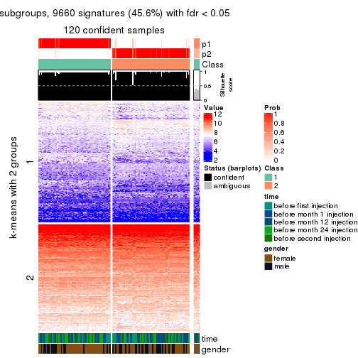</p>

</div>
<div id='tab-MAD-NMF-get-signatures-no-scale-2'>
<pre><code class="r">get_signatures(res, k = 3, scale_rows = FALSE)
</code></pre>

<p></p>

</div>
<div id='tab-MAD-NMF-get-signatures-no-scale-3'>
<pre><code class="r">get_signatures(res, k = 4, scale_rows = FALSE)
</code></pre>

<p></p>

</div>
<div id='tab-MAD-NMF-get-signatures-no-scale-4'>
<pre><code class="r">get_signatures(res, k = 5, scale_rows = FALSE)
</code></pre>

<p></p>

</div>
<div id='tab-MAD-NMF-get-signatures-no-scale-5'>
<pre><code class="r">get_signatures(res, k = 6, scale_rows = FALSE)
</code></pre>

<p></p>

</div>
</div>


Compare the overlap of signatures from different k:

```r
compare_signatures(res)
```


`get_signature()` returns a data frame invisibly. TO get the list of signatures, the function
call should be assigned to a variable explicitly. In following code, if `plot` argument is set
to `FALSE`, no heatmap is plotted while only the differential analysis is performed.

```r
# code only for demonstration
tb = get_signature(res, k = ..., plot = FALSE)
```

An example of the output of `tb` is:

```
#>   which_row         fdr    mean_1    mean_2 scaled_mean_1 scaled_mean_2 km
#> 1        38 0.042760348  8.373488  9.131774    -0.5533452     0.5164555  1
#> 2        40 0.018707592  7.106213  8.469186    -0.6173731     0.5762149  1
#> 3        55 0.019134737 10.221463 11.207825    -0.6159697     0.5749050  1
#> 4        59 0.006059896  5.921854  7.869574    -0.6899429     0.6439467  1
#> 5        60 0.018055526  8.928898 10.211722    -0.6204761     0.5791110  1
#> 6        98 0.009384629 15.714769 14.887706     0.6635654    -0.6193277  2
...
```

The columns in `tb` are:

1. `which_row`: row indices corresponding to the input matrix.
2. `fdr`: FDR for the differential test. 
3. `mean_x`: The mean value in group x.
4. `scaled_mean_x`: The mean value in group x after rows are scaled.
5. `km`: Row groups if k-means clustering is applied to rows.


UMAP plot which shows how samples are separated.


<script>
$( function() {
	$( '#tabs-MAD-NMF-dimension-reduction' ).tabs();
} );
</script>
<div id='tabs-MAD-NMF-dimension-reduction'>
<ul>
<li><a href='#tab-MAD-NMF-dimension-reduction-1'>k = 2</a></li>
<li><a href='#tab-MAD-NMF-dimension-reduction-2'>k = 3</a></li>
<li><a href='#tab-MAD-NMF-dimension-reduction-3'>k = 4</a></li>
<li><a href='#tab-MAD-NMF-dimension-reduction-4'>k = 5</a></li>
<li><a href='#tab-MAD-NMF-dimension-reduction-5'>k = 6</a></li>
</ul>
<div id='tab-MAD-NMF-dimension-reduction-1'>
<pre><code class="r">dimension_reduction(res, k = 2, method = &quot;UMAP&quot;)
</code></pre>

<p></p>

</div>
<div id='tab-MAD-NMF-dimension-reduction-2'>
<pre><code class="r">dimension_reduction(res, k = 3, method = &quot;UMAP&quot;)
</code></pre>

<p>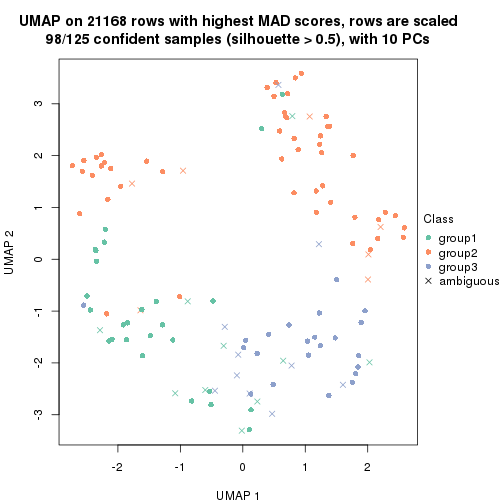</p>

</div>
<div id='tab-MAD-NMF-dimension-reduction-3'>
<pre><code class="r">dimension_reduction(res, k = 4, method = &quot;UMAP&quot;)
</code></pre>

<p></p>

</div>
<div id='tab-MAD-NMF-dimension-reduction-4'>
<pre><code class="r">dimension_reduction(res, k = 5, method = &quot;UMAP&quot;)
</code></pre>

<p></p>

</div>
<div id='tab-MAD-NMF-dimension-reduction-5'>
<pre><code class="r">dimension_reduction(res, k = 6, method = &quot;UMAP&quot;)
</code></pre>

<p></p>

</div>
</div>


Following heatmap shows how subgroups are split when increasing `k`:

```r
collect_classes(res)
```


Test correlation between subgroups and known annotations. If the known
annotation is numeric, one-way ANOVA test is applied, and if the known
annotation is discrete, chi-squared contingency table test is applied.

```r
test_to_known_factors(res)
```

```
#>           n time(p) gender(p) k
#> MAD:NMF 120   0.499    0.1533 2
#> MAD:NMF  98   0.204    0.2603 3
#> MAD:NMF  77   0.466    0.0759 4
#> MAD:NMF  64   0.238    0.0137 5
#> MAD:NMF  25   0.148    0.5879 6
```


If matrix rows can be associated to genes, consider to use `GO_Enrichment(res,
...)` to perform function enrichment for the signature genes.


 

---------------------------------------------------


### ATC:hclust


The object with results only for a single top-value method and a single partition method 
can be extracted as:

```r
res = res_list["ATC", "hclust"]
# you can also extract it by
# res = res_list["ATC:hclust"]
```

A summary of `res` and all the functions that can be applied to it:

```r
res
```

```
#> A 'ConsensusPartition' object with k = 2, 3, 4, 5, 6.
#>   On a matrix with 21168 rows and 125 columns.
#>   Top rows (1000, 2000, 3000, 4000, 5000) are extracted by 'ATC' method.
#>   Subgroups are detected by 'hclust' method.
#>   Performed in total 1250 partitions by row resampling.
#>   Best k for subgroups seems to be 4.
#> 
#> Following methods can be applied to this 'ConsensusPartition' object:
#>  [1] "cola_report"             "collect_classes"         "collect_plots"          
#>  [4] "collect_stats"           "colnames"                "compare_signatures"     
#>  [7] "consensus_heatmap"       "dimension_reduction"     "functional_enrichment"  
#> [10] "get_anno_col"            "get_anno"                "get_classes"            
#> [13] "get_consensus"           "get_matrix"              "get_membership"         
#> [16] "get_param"               "get_signatures"          "get_stats"              
#> [19] "is_best_k"               "is_stable_k"             "membership_heatmap"     
#> [22] "ncol"                    "nrow"                    "plot_ecdf"              
#> [25] "rownames"                "select_partition_number" "show"                   
#> [28] "suggest_best_k"          "test_to_known_factors"
```

`collect_plots()` function collects all the plots made from `res` for all `k` (number of partitions)
into one single page to provide an easy and fast comparison between different `k`.

```r
collect_plots(res)
```

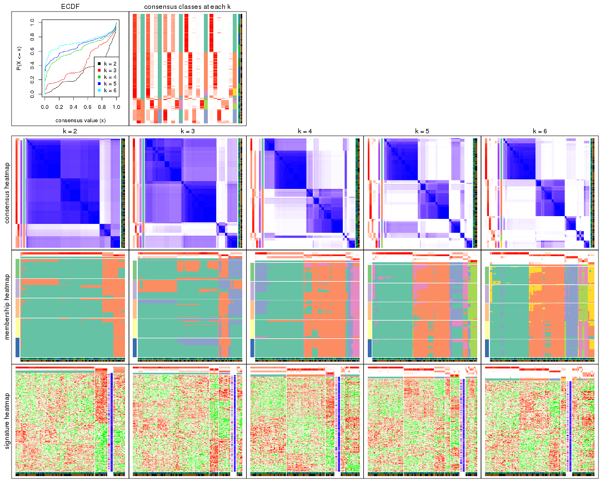

The plots are:

- The first row: a plot of the ECDF (Empirical cumulative distribution
  function) curves of the consensus matrix for each `k` and the heatmap of
  predicted classes for each `k`.
- The second row: heatmaps of the consensus matrix for each `k`.
- The third row: heatmaps of the membership matrix for each `k`.
- The fouth row: heatmaps of the signatures for each `k`.

All the plots in panels can be made by individual functions and they are
plotted later in this section.

`select_partition_number()` produces several plots showing different
statistics for choosing "optimized" `k`. There are following statistics:

- ECDF curves of the consensus matrix for each `k`;
- 1-PAC. [The PAC
  score](https://en.wikipedia.org/wiki/Consensus_clustering#Over-interpretation_potential_of_consensus_clustering)
  measures the proportion of the ambiguous subgrouping.
- Mean silhouette score.
- Concordance. The mean probability of fiting the consensus class ids in all
  partitions.
- Area increased. Denote $A_k$ as the area under the ECDF curve for current
  `k`, the area increased is defined as $A_k - A_{k-1}$.
- Rand index. The percent of pairs of samples that are both in a same cluster
  or both are not in a same cluster in the partition of k and k-1.
- Jaccard index. The ratio of pairs of samples are both in a same cluster in
  the partition of k and k-1 and the pairs of samples are both in a same
  cluster in the partition k or k-1.

The detailed explanations of these statistics can be found in [the cola
vignette](http://bioconductor.org/packages/devel/bioc/vignettes/cola/inst/doc/cola.html#toc_13).

Generally speaking, lower PAC score, higher mean silhouette score or higher
concordance corresponds to better partition. Rand index and Jaccard index
measure how similar the current partition is compared to partition with `k-1`.
If they are too similar, we won't accept `k` is better than `k-1`.

```r
select_partition_number(res)
```


The numeric values for all these statistics can be obtained by `get_stats()`.

```r
get_stats(res)
```

```
#>   k 1-PAC mean_silhouette concordance area_increased  Rand Jaccard
#> 2 2 0.431           0.793       0.885         0.3043 0.659   0.659
#> 3 3 0.356           0.638       0.759         0.4083 0.949   0.923
#> 4 4 0.623           0.640       0.838         0.4679 0.592   0.418
#> 5 5 0.631           0.720       0.834         0.0741 0.867   0.669
#> 6 6 0.736           0.700       0.851         0.0796 0.974   0.911
```

`suggest_best_k()` suggests the best $k$ based on these statistics. The rules are as follows:

- All $k$ with Jaccard index larger than 0.95 are removed because the increase of
  the partition number does not provides enough extra information. If all $k$ are removed,
  the best $k$ is assigned by `NA`.
- For $k$ with 1-PAC larger than 0.9, the maximal $k$ is taken as the "best k". Other $k$ is called "optional k".
- If it does not fit the second rule. The $k$ with the highest vote of highest
  1-PAC, mean silhouette and concordance is taken as the "best k".

```r
suggest_best_k(res)
```

```
#> [1] 4
```


Following shows the table of the partitions (You need to click the **show/hide
code output** link to see it). The membership matrix (columns with name `p*`)
is inferred by
[`clue::cl_consensus()`](https://www.rdocumentation.org/link/cl_consensus?package=clue)
function with the `SE` method. Basically the value in the membership matrix
represents the probability to belong to a certain group. The finall class
label for an item is determined with the group with highest probability it
belongs to.

In `get_classes()` function, the entropy is calculated from the membership
matrix and the silhouette score is calculated from the consensus matrix.


<script>
$( function() {
	$( '#tabs-ATC-hclust-get-classes' ).tabs();
} );
</script>
<div id='tabs-ATC-hclust-get-classes'>
<ul>
<li><a href='#tab-ATC-hclust-get-classes-1'>k = 2</a></li>
<li><a href='#tab-ATC-hclust-get-classes-2'>k = 3</a></li>
<li><a href='#tab-ATC-hclust-get-classes-3'>k = 4</a></li>
<li><a href='#tab-ATC-hclust-get-classes-4'>k = 5</a></li>
<li><a href='#tab-ATC-hclust-get-classes-5'>k = 6</a></li>
</ul>

<div id='tab-ATC-hclust-get-classes-1'>
<p><a id='tab-ATC-hclust-get-classes-1-a' style='color:#0366d6' href='#'>show/hide code output</a></p>
<pre><code class="r">cbind(get_classes(res, k = 2), get_membership(res, k = 2))
</code></pre>

<pre><code>#&gt;           class entropy silhouette    p1    p2
#&gt; GSM601752     1  0.2948     0.8765 0.948 0.052
#&gt; GSM601782     1  0.4431     0.8803 0.908 0.092
#&gt; GSM601792     1  0.4431     0.8803 0.908 0.092
#&gt; GSM601797     1  0.4815     0.8707 0.896 0.104
#&gt; GSM601827     1  0.4431     0.8803 0.908 0.092
#&gt; GSM601837     2  0.5408     0.6864 0.124 0.876
#&gt; GSM601842     1  0.1843     0.8843 0.972 0.028
#&gt; GSM601857     1  0.8016     0.6325 0.756 0.244
#&gt; GSM601867     2  0.9896     0.4894 0.440 0.560
#&gt; GSM601747     1  0.4431     0.8803 0.908 0.092
#&gt; GSM601757     1  0.4431     0.8803 0.908 0.092
#&gt; GSM601762     1  0.3431     0.8725 0.936 0.064
#&gt; GSM601767     1  0.3274     0.8710 0.940 0.060
#&gt; GSM601772     1  0.2423     0.8822 0.960 0.040
#&gt; GSM601777     1  0.5842     0.8341 0.860 0.140
#&gt; GSM601787     2  0.0672     0.6711 0.008 0.992
#&gt; GSM601802     1  0.3274     0.8710 0.940 0.060
#&gt; GSM601807     2  0.9754     0.5214 0.408 0.592
#&gt; GSM601812     1  0.4815     0.8712 0.896 0.104
#&gt; GSM601817     1  0.4431     0.8803 0.908 0.092
#&gt; GSM601822     1  0.4161     0.8834 0.916 0.084
#&gt; GSM601832     1  0.1843     0.8843 0.972 0.028
#&gt; GSM601847     1  0.4298     0.8824 0.912 0.088
#&gt; GSM601852     1  0.0938     0.8877 0.988 0.012
#&gt; GSM601862     2  0.9922     0.4789 0.448 0.552
#&gt; GSM601753     1  0.0672     0.8861 0.992 0.008
#&gt; GSM601783     1  0.4298     0.8820 0.912 0.088
#&gt; GSM601793     1  0.4431     0.8803 0.908 0.092
#&gt; GSM601798     1  0.3274     0.8710 0.940 0.060
#&gt; GSM601828     1  0.4431     0.8803 0.908 0.092
#&gt; GSM601838     2  0.5408     0.6864 0.124 0.876
#&gt; GSM601843     1  0.1843     0.8843 0.972 0.028
#&gt; GSM601858     1  0.3274     0.8715 0.940 0.060
#&gt; GSM601868     2  0.9922     0.4789 0.448 0.552
#&gt; GSM601748     1  0.4431     0.8803 0.908 0.092
#&gt; GSM601758     1  0.4562     0.8779 0.904 0.096
#&gt; GSM601763     1  0.0376     0.8856 0.996 0.004
#&gt; GSM601768     1  0.3274     0.8710 0.940 0.060
#&gt; GSM601773     1  0.3274     0.8710 0.940 0.060
#&gt; GSM601778     1  0.5737     0.8393 0.864 0.136
#&gt; GSM601788     1  0.2948     0.8757 0.948 0.052
#&gt; GSM601803     1  0.3879     0.8631 0.924 0.076
#&gt; GSM601808     2  0.9922     0.4789 0.448 0.552
#&gt; GSM601813     1  0.4815     0.8712 0.896 0.104
#&gt; GSM601818     1  0.4431     0.8803 0.908 0.092
#&gt; GSM601823     1  0.0376     0.8856 0.996 0.004
#&gt; GSM601833     1  0.1843     0.8843 0.972 0.028
#&gt; GSM601848     1  0.4161     0.8834 0.916 0.084
#&gt; GSM601853     1  0.6712     0.7740 0.824 0.176
#&gt; GSM601863     2  0.9922     0.4789 0.448 0.552
#&gt; GSM601754     1  0.2948     0.8765 0.948 0.052
#&gt; GSM601784     1  0.3274     0.8710 0.940 0.060
#&gt; GSM601794     1  0.4431     0.8803 0.908 0.092
#&gt; GSM601799     1  0.0672     0.8861 0.992 0.008
#&gt; GSM601829     1  0.0672     0.8868 0.992 0.008
#&gt; GSM601839     2  0.5408     0.6864 0.124 0.876
#&gt; GSM601844     1  0.0672     0.8868 0.992 0.008
#&gt; GSM601859     1  0.1414     0.8873 0.980 0.020
#&gt; GSM601869     2  0.9922     0.4789 0.448 0.552
#&gt; GSM601749     1  0.4298     0.8820 0.912 0.088
#&gt; GSM601759     1  0.4562     0.8779 0.904 0.096
#&gt; GSM601764     1  0.0376     0.8856 0.996 0.004
#&gt; GSM601769     1  0.9661     0.0659 0.608 0.392
#&gt; GSM601774     1  0.3274     0.8710 0.940 0.060
#&gt; GSM601779     1  0.4298     0.8820 0.912 0.088
#&gt; GSM601789     1  0.2948     0.8757 0.948 0.052
#&gt; GSM601804     1  0.2948     0.8765 0.948 0.052
#&gt; GSM601809     2  0.9922     0.4789 0.448 0.552
#&gt; GSM601814     2  0.6247     0.6792 0.156 0.844
#&gt; GSM601819     1  0.4298     0.8820 0.912 0.088
#&gt; GSM601824     1  0.0376     0.8856 0.996 0.004
#&gt; GSM601834     1  0.1843     0.8843 0.972 0.028
#&gt; GSM601849     1  0.4161     0.8834 0.916 0.084
#&gt; GSM601854     1  0.4431     0.8803 0.908 0.092
#&gt; GSM601864     2  0.0938     0.6725 0.012 0.988
#&gt; GSM601755     1  0.3274     0.8710 0.940 0.060
#&gt; GSM601785     1  0.1414     0.8857 0.980 0.020
#&gt; GSM601795     1  0.4431     0.8803 0.908 0.092
#&gt; GSM601800     1  0.3274     0.8710 0.940 0.060
#&gt; GSM601830     1  1.0000    -0.3285 0.504 0.496
#&gt; GSM601840     1  0.2948     0.8757 0.948 0.052
#&gt; GSM601845     1  0.0376     0.8856 0.996 0.004
#&gt; GSM601860     1  0.2948     0.8757 0.948 0.052
#&gt; GSM601870     2  0.0376     0.6686 0.004 0.996
#&gt; GSM601750     1  0.4431     0.8803 0.908 0.092
#&gt; GSM601760     1  0.4562     0.8779 0.904 0.096
#&gt; GSM601765     1  0.1633     0.8847 0.976 0.024
#&gt; GSM601770     1  0.3274     0.8710 0.940 0.060
#&gt; GSM601775     1  0.0672     0.8850 0.992 0.008
#&gt; GSM601780     1  0.4298     0.8820 0.912 0.088
#&gt; GSM601790     2  0.6048     0.6833 0.148 0.852
#&gt; GSM601805     1  0.3274     0.8710 0.940 0.060
#&gt; GSM601810     2  0.9922     0.4789 0.448 0.552
#&gt; GSM601815     2  0.6247     0.6792 0.156 0.844
#&gt; GSM601820     1  0.4815     0.8712 0.896 0.104
#&gt; GSM601825     1  0.1843     0.8843 0.972 0.028
#&gt; GSM601835     1  0.1843     0.8843 0.972 0.028
#&gt; GSM601850     1  0.4298     0.8824 0.912 0.088
#&gt; GSM601855     2  0.9954     0.4448 0.460 0.540
#&gt; GSM601865     2  0.1184     0.6742 0.016 0.984
#&gt; GSM601756     1  0.3274     0.8710 0.940 0.060
#&gt; GSM601786     2  0.2043     0.6790 0.032 0.968
#&gt; GSM601796     1  0.4431     0.8803 0.908 0.092
#&gt; GSM601801     1  0.3274     0.8710 0.940 0.060
#&gt; GSM601831     1  0.4815     0.8712 0.896 0.104
#&gt; GSM601841     2  0.9977     0.4098 0.472 0.528
#&gt; GSM601846     1  0.0376     0.8856 0.996 0.004
#&gt; GSM601861     2  0.6247     0.6792 0.156 0.844
#&gt; GSM601871     2  0.0672     0.6711 0.008 0.992
#&gt; GSM601751     1  0.2948     0.8757 0.948 0.052
#&gt; GSM601761     1  0.4562     0.8779 0.904 0.096
#&gt; GSM601766     1  0.0376     0.8856 0.996 0.004
#&gt; GSM601771     1  0.2948     0.8757 0.948 0.052
#&gt; GSM601776     1  0.4298     0.8820 0.912 0.088
#&gt; GSM601781     1  0.5842     0.8341 0.860 0.140
#&gt; GSM601791     1  0.4431     0.8803 0.908 0.092
#&gt; GSM601806     1  0.4022     0.8593 0.920 0.080
#&gt; GSM601811     2  0.9922     0.4789 0.448 0.552
#&gt; GSM601816     1  0.4431     0.8803 0.908 0.092
#&gt; GSM601821     2  0.6247     0.6792 0.156 0.844
#&gt; GSM601826     1  0.0376     0.8856 0.996 0.004
#&gt; GSM601836     1  0.0376     0.8856 0.996 0.004
#&gt; GSM601851     1  0.4298     0.8820 0.912 0.088
#&gt; GSM601856     1  0.6712     0.7740 0.824 0.176
#&gt; GSM601866     2  0.9977     0.4098 0.472 0.528
</code></pre>

<script>
$('#tab-ATC-hclust-get-classes-1-a').parent().next().next().hide();
$('#tab-ATC-hclust-get-classes-1-a').click(function(){
  $('#tab-ATC-hclust-get-classes-1-a').parent().next().next().toggle();
  return(false);
});
</script>
</div>

<div id='tab-ATC-hclust-get-classes-2'>
<p><a id='tab-ATC-hclust-get-classes-2-a' style='color:#0366d6' href='#'>show/hide code output</a></p>
<pre><code class="r">cbind(get_classes(res, k = 3), get_membership(res, k = 3))
</code></pre>

<pre><code>#&gt;           class entropy silhouette    p1    p2    p3
#&gt; GSM601752     1   0.355     0.6651 0.868 0.132 0.000
#&gt; GSM601782     1   0.510     0.6398 0.752 0.000 0.248
#&gt; GSM601792     1   0.510     0.6398 0.752 0.000 0.248
#&gt; GSM601797     1   0.522     0.6237 0.740 0.000 0.260
#&gt; GSM601827     1   0.510     0.6398 0.752 0.000 0.248
#&gt; GSM601837     2   0.000     0.8081 0.000 1.000 0.000
#&gt; GSM601842     1   0.334     0.6697 0.880 0.120 0.000
#&gt; GSM601857     1   0.613     0.3444 0.600 0.000 0.400
#&gt; GSM601867     3   0.651     0.7731 0.284 0.028 0.688
#&gt; GSM601747     1   0.510     0.6398 0.752 0.000 0.248
#&gt; GSM601757     1   0.510     0.6398 0.752 0.000 0.248
#&gt; GSM601762     1   0.440     0.6315 0.812 0.188 0.000
#&gt; GSM601767     1   0.435     0.6326 0.816 0.184 0.000
#&gt; GSM601772     1   0.341     0.6685 0.876 0.124 0.000
#&gt; GSM601777     1   0.553     0.5732 0.704 0.000 0.296
#&gt; GSM601787     3   0.484    -0.2308 0.000 0.224 0.776
#&gt; GSM601802     1   0.435     0.6326 0.816 0.184 0.000
#&gt; GSM601807     3   0.820     0.6995 0.284 0.108 0.608
#&gt; GSM601812     1   0.525     0.6181 0.736 0.000 0.264
#&gt; GSM601817     1   0.510     0.6398 0.752 0.000 0.248
#&gt; GSM601822     1   0.493     0.6456 0.768 0.000 0.232
#&gt; GSM601832     1   0.334     0.6697 0.880 0.120 0.000
#&gt; GSM601847     1   0.506     0.6425 0.756 0.000 0.244
#&gt; GSM601852     1   0.355     0.6703 0.868 0.000 0.132
#&gt; GSM601862     3   0.546     0.7910 0.288 0.000 0.712
#&gt; GSM601753     1   0.263     0.6804 0.916 0.084 0.000
#&gt; GSM601783     1   0.506     0.6409 0.756 0.000 0.244
#&gt; GSM601793     1   0.510     0.6398 0.752 0.000 0.248
#&gt; GSM601798     1   0.435     0.6326 0.816 0.184 0.000
#&gt; GSM601828     1   0.510     0.6398 0.752 0.000 0.248
#&gt; GSM601838     2   0.000     0.8081 0.000 1.000 0.000
#&gt; GSM601843     1   0.334     0.6697 0.880 0.120 0.000
#&gt; GSM601858     1   0.628     0.6464 0.760 0.176 0.064
#&gt; GSM601868     3   0.546     0.7910 0.288 0.000 0.712
#&gt; GSM601748     1   0.510     0.6398 0.752 0.000 0.248
#&gt; GSM601758     1   0.514     0.6353 0.748 0.000 0.252
#&gt; GSM601763     1   0.000     0.6863 1.000 0.000 0.000
#&gt; GSM601768     1   0.435     0.6326 0.816 0.184 0.000
#&gt; GSM601773     1   0.435     0.6326 0.816 0.184 0.000
#&gt; GSM601778     1   0.550     0.5809 0.708 0.000 0.292
#&gt; GSM601788     1   0.558     0.6510 0.788 0.176 0.036
#&gt; GSM601803     1   0.455     0.6183 0.800 0.200 0.000
#&gt; GSM601808     3   0.546     0.7910 0.288 0.000 0.712
#&gt; GSM601813     1   0.525     0.6181 0.736 0.000 0.264
#&gt; GSM601818     1   0.510     0.6398 0.752 0.000 0.248
#&gt; GSM601823     1   0.000     0.6863 1.000 0.000 0.000
#&gt; GSM601833     1   0.334     0.6697 0.880 0.120 0.000
#&gt; GSM601848     1   0.502     0.6431 0.760 0.000 0.240
#&gt; GSM601853     1   0.581     0.4643 0.664 0.000 0.336
#&gt; GSM601863     3   0.546     0.7910 0.288 0.000 0.712
#&gt; GSM601754     1   0.355     0.6651 0.868 0.132 0.000
#&gt; GSM601784     1   0.435     0.6326 0.816 0.184 0.000
#&gt; GSM601794     1   0.510     0.6398 0.752 0.000 0.248
#&gt; GSM601799     1   0.263     0.6804 0.916 0.084 0.000
#&gt; GSM601829     1   0.334     0.6726 0.880 0.000 0.120
#&gt; GSM601839     2   0.000     0.8081 0.000 1.000 0.000
#&gt; GSM601844     1   0.348     0.6712 0.872 0.000 0.128
#&gt; GSM601859     1   0.288     0.6783 0.904 0.096 0.000
#&gt; GSM601869     3   0.546     0.7910 0.288 0.000 0.712
#&gt; GSM601749     1   0.506     0.6409 0.756 0.000 0.244
#&gt; GSM601759     1   0.514     0.6353 0.748 0.000 0.252
#&gt; GSM601764     1   0.000     0.6863 1.000 0.000 0.000
#&gt; GSM601769     2   0.630     0.0999 0.484 0.516 0.000
#&gt; GSM601774     1   0.435     0.6326 0.816 0.184 0.000
#&gt; GSM601779     1   0.506     0.6409 0.756 0.000 0.244
#&gt; GSM601789     1   0.558     0.6510 0.788 0.176 0.036
#&gt; GSM601804     1   0.355     0.6651 0.868 0.132 0.000
#&gt; GSM601809     3   0.546     0.7910 0.288 0.000 0.712
#&gt; GSM601814     2   0.129     0.8106 0.032 0.968 0.000
#&gt; GSM601819     1   0.506     0.6409 0.756 0.000 0.244
#&gt; GSM601824     1   0.000     0.6863 1.000 0.000 0.000
#&gt; GSM601834     1   0.334     0.6697 0.880 0.120 0.000
#&gt; GSM601849     1   0.502     0.6431 0.760 0.000 0.240
#&gt; GSM601854     1   0.510     0.6398 0.752 0.000 0.248
#&gt; GSM601864     2   0.629     0.5733 0.000 0.536 0.464
#&gt; GSM601755     1   0.435     0.6326 0.816 0.184 0.000
#&gt; GSM601785     1   0.296     0.6765 0.900 0.100 0.000
#&gt; GSM601795     1   0.510     0.6398 0.752 0.000 0.248
#&gt; GSM601800     1   0.435     0.6326 0.816 0.184 0.000
#&gt; GSM601830     3   0.586     0.6916 0.344 0.000 0.656
#&gt; GSM601840     1   0.558     0.6510 0.788 0.176 0.036
#&gt; GSM601845     1   0.000     0.6863 1.000 0.000 0.000
#&gt; GSM601860     1   0.558     0.6510 0.788 0.176 0.036
#&gt; GSM601870     3   0.497    -0.2473 0.000 0.236 0.764
#&gt; GSM601750     1   0.510     0.6398 0.752 0.000 0.248
#&gt; GSM601760     1   0.514     0.6353 0.748 0.000 0.252
#&gt; GSM601765     1   0.319     0.6729 0.888 0.112 0.000
#&gt; GSM601770     1   0.435     0.6326 0.816 0.184 0.000
#&gt; GSM601775     1   0.216     0.6837 0.936 0.064 0.000
#&gt; GSM601780     1   0.506     0.6409 0.756 0.000 0.244
#&gt; GSM601790     2   0.103     0.8119 0.024 0.976 0.000
#&gt; GSM601805     1   0.435     0.6326 0.816 0.184 0.000
#&gt; GSM601810     3   0.546     0.7910 0.288 0.000 0.712
#&gt; GSM601815     2   0.129     0.8106 0.032 0.968 0.000
#&gt; GSM601820     1   0.525     0.6181 0.736 0.000 0.264
#&gt; GSM601825     1   0.334     0.6697 0.880 0.120 0.000
#&gt; GSM601835     1   0.312     0.6733 0.892 0.108 0.000
#&gt; GSM601850     1   0.506     0.6425 0.756 0.000 0.244
#&gt; GSM601855     3   0.556     0.7733 0.300 0.000 0.700
#&gt; GSM601865     2   0.630     0.5592 0.000 0.520 0.480
#&gt; GSM601756     1   0.435     0.6326 0.816 0.184 0.000
#&gt; GSM601786     2   0.679     0.5601 0.012 0.536 0.452
#&gt; GSM601796     1   0.510     0.6398 0.752 0.000 0.248
#&gt; GSM601801     1   0.435     0.6326 0.816 0.184 0.000
#&gt; GSM601831     1   0.525     0.6181 0.736 0.000 0.264
#&gt; GSM601841     3   0.565     0.7549 0.312 0.000 0.688
#&gt; GSM601846     1   0.000     0.6863 1.000 0.000 0.000
#&gt; GSM601861     2   0.129     0.8106 0.032 0.968 0.000
#&gt; GSM601871     3   0.484    -0.2308 0.000 0.224 0.776
#&gt; GSM601751     1   0.558     0.6510 0.788 0.176 0.036
#&gt; GSM601761     1   0.514     0.6353 0.748 0.000 0.252
#&gt; GSM601766     1   0.153     0.6858 0.960 0.040 0.000
#&gt; GSM601771     1   0.558     0.6510 0.788 0.176 0.036
#&gt; GSM601776     1   0.506     0.6409 0.756 0.000 0.244
#&gt; GSM601781     1   0.553     0.5732 0.704 0.000 0.296
#&gt; GSM601791     1   0.510     0.6398 0.752 0.000 0.248
#&gt; GSM601806     1   0.460     0.6136 0.796 0.204 0.000
#&gt; GSM601811     3   0.546     0.7910 0.288 0.000 0.712
#&gt; GSM601816     1   0.510     0.6398 0.752 0.000 0.248
#&gt; GSM601821     2   0.129     0.8106 0.032 0.968 0.000
#&gt; GSM601826     1   0.000     0.6863 1.000 0.000 0.000
#&gt; GSM601836     1   0.000     0.6863 1.000 0.000 0.000
#&gt; GSM601851     1   0.506     0.6409 0.756 0.000 0.244
#&gt; GSM601856     1   0.581     0.4643 0.664 0.000 0.336
#&gt; GSM601866     3   0.565     0.7549 0.312 0.000 0.688
</code></pre>

<script>
$('#tab-ATC-hclust-get-classes-2-a').parent().next().next().hide();
$('#tab-ATC-hclust-get-classes-2-a').click(function(){
  $('#tab-ATC-hclust-get-classes-2-a').parent().next().next().toggle();
  return(false);
});
</script>
</div>

<div id='tab-ATC-hclust-get-classes-3'>
<p><a id='tab-ATC-hclust-get-classes-3-a' style='color:#0366d6' href='#'>show/hide code output</a></p>
<pre><code class="r">cbind(get_classes(res, k = 4), get_membership(res, k = 4))
</code></pre>

<pre><code>#&gt;           class entropy silhouette    p1    p2    p3    p4
#&gt; GSM601752     2  0.2813     0.8089 0.000 0.896 0.080 0.024
#&gt; GSM601782     1  0.5678     0.7586 0.524 0.024 0.452 0.000
#&gt; GSM601792     1  0.5843     0.7574 0.524 0.024 0.448 0.004
#&gt; GSM601797     1  0.5827     0.7539 0.536 0.024 0.436 0.004
#&gt; GSM601827     1  0.5678     0.7586 0.524 0.024 0.452 0.000
#&gt; GSM601837     4  0.1389     0.8642 0.000 0.048 0.000 0.952
#&gt; GSM601842     2  0.1557     0.8199 0.000 0.944 0.056 0.000
#&gt; GSM601857     1  0.5284     0.6064 0.668 0.020 0.308 0.004
#&gt; GSM601867     1  0.1510     0.2083 0.956 0.000 0.016 0.028
#&gt; GSM601747     1  0.5843     0.7574 0.524 0.024 0.448 0.004
#&gt; GSM601757     1  0.5678     0.7586 0.524 0.024 0.452 0.000
#&gt; GSM601762     2  0.0817     0.8087 0.000 0.976 0.000 0.024
#&gt; GSM601767     2  0.0707     0.8102 0.000 0.980 0.000 0.020
#&gt; GSM601772     2  0.1545     0.8182 0.000 0.952 0.040 0.008
#&gt; GSM601777     1  0.5592     0.7274 0.572 0.024 0.404 0.000
#&gt; GSM601787     3  0.5917    -0.1450 0.444 0.000 0.520 0.036
#&gt; GSM601802     2  0.0707     0.8102 0.000 0.980 0.000 0.020
#&gt; GSM601807     1  0.3160     0.0443 0.872 0.000 0.108 0.020
#&gt; GSM601812     1  0.5378     0.7513 0.540 0.012 0.448 0.000
#&gt; GSM601817     1  0.5678     0.7586 0.524 0.024 0.452 0.000
#&gt; GSM601822     1  0.6306     0.7151 0.500 0.048 0.448 0.004
#&gt; GSM601832     2  0.1474     0.8201 0.000 0.948 0.052 0.000
#&gt; GSM601847     1  0.5925     0.7534 0.524 0.028 0.444 0.004
#&gt; GSM601852     3  0.7777    -0.4972 0.416 0.148 0.420 0.016
#&gt; GSM601862     1  0.0188     0.2688 0.996 0.000 0.000 0.004
#&gt; GSM601753     2  0.3479     0.7795 0.000 0.840 0.148 0.012
#&gt; GSM601783     1  0.5682     0.7576 0.520 0.024 0.456 0.000
#&gt; GSM601793     1  0.5843     0.7574 0.524 0.024 0.448 0.004
#&gt; GSM601798     2  0.0707     0.8102 0.000 0.980 0.000 0.020
#&gt; GSM601828     1  0.5678     0.7586 0.524 0.024 0.452 0.000
#&gt; GSM601838     4  0.1389     0.8642 0.000 0.048 0.000 0.952
#&gt; GSM601843     2  0.1557     0.8199 0.000 0.944 0.056 0.000
#&gt; GSM601858     2  0.5306     0.5819 0.240 0.720 0.020 0.020
#&gt; GSM601868     1  0.0188     0.2688 0.996 0.000 0.000 0.004
#&gt; GSM601748     1  0.5678     0.7586 0.524 0.024 0.452 0.000
#&gt; GSM601758     1  0.5673     0.7586 0.528 0.024 0.448 0.000
#&gt; GSM601763     2  0.5026     0.6066 0.000 0.672 0.312 0.016
#&gt; GSM601768     2  0.0707     0.8102 0.000 0.980 0.000 0.020
#&gt; GSM601773     2  0.0707     0.8102 0.000 0.980 0.000 0.020
#&gt; GSM601778     1  0.5602     0.7309 0.568 0.024 0.408 0.000
#&gt; GSM601788     2  0.4513     0.6991 0.168 0.796 0.016 0.020
#&gt; GSM601803     2  0.1118     0.8039 0.000 0.964 0.000 0.036
#&gt; GSM601808     1  0.0188     0.2688 0.996 0.000 0.000 0.004
#&gt; GSM601813     1  0.5378     0.7513 0.540 0.012 0.448 0.000
#&gt; GSM601818     1  0.5678     0.7586 0.524 0.024 0.452 0.000
#&gt; GSM601823     2  0.5417     0.4380 0.000 0.572 0.412 0.016
#&gt; GSM601833     2  0.1474     0.8201 0.000 0.948 0.052 0.000
#&gt; GSM601848     1  0.5768     0.7493 0.516 0.028 0.456 0.000
#&gt; GSM601853     1  0.5204     0.6893 0.612 0.012 0.376 0.000
#&gt; GSM601863     1  0.0188     0.2688 0.996 0.000 0.000 0.004
#&gt; GSM601754     2  0.2813     0.8089 0.000 0.896 0.080 0.024
#&gt; GSM601784     2  0.0707     0.8102 0.000 0.980 0.000 0.020
#&gt; GSM601794     1  0.5843     0.7574 0.524 0.024 0.448 0.004
#&gt; GSM601799     2  0.3479     0.7795 0.000 0.840 0.148 0.012
#&gt; GSM601829     3  0.7963    -0.4395 0.392 0.176 0.416 0.016
#&gt; GSM601839     4  0.1389     0.8642 0.000 0.048 0.000 0.952
#&gt; GSM601844     3  0.7835    -0.4780 0.412 0.156 0.416 0.016
#&gt; GSM601859     2  0.2988     0.7980 0.000 0.876 0.112 0.012
#&gt; GSM601869     1  0.0188     0.2688 0.996 0.000 0.000 0.004
#&gt; GSM601749     1  0.5682     0.7576 0.520 0.024 0.456 0.000
#&gt; GSM601759     1  0.5673     0.7586 0.528 0.024 0.448 0.000
#&gt; GSM601764     2  0.5026     0.6066 0.000 0.672 0.312 0.016
#&gt; GSM601769     2  0.4679     0.3632 0.000 0.648 0.000 0.352
#&gt; GSM601774     2  0.0707     0.8102 0.000 0.980 0.000 0.020
#&gt; GSM601779     1  0.5682     0.7576 0.520 0.024 0.456 0.000
#&gt; GSM601789     2  0.4513     0.6991 0.168 0.796 0.016 0.020
#&gt; GSM601804     2  0.2813     0.8089 0.000 0.896 0.080 0.024
#&gt; GSM601809     1  0.0188     0.2688 0.996 0.000 0.000 0.004
#&gt; GSM601814     4  0.2081     0.8661 0.000 0.084 0.000 0.916
#&gt; GSM601819     1  0.5682     0.7576 0.520 0.024 0.456 0.000
#&gt; GSM601824     2  0.5284     0.5214 0.000 0.616 0.368 0.016
#&gt; GSM601834     2  0.1474     0.8201 0.000 0.948 0.052 0.000
#&gt; GSM601849     1  0.5768     0.7493 0.516 0.028 0.456 0.000
#&gt; GSM601854     1  0.5678     0.7586 0.524 0.024 0.452 0.000
#&gt; GSM601864     4  0.7149     0.5550 0.132 0.000 0.416 0.452
#&gt; GSM601755     2  0.0707     0.8102 0.000 0.980 0.000 0.020
#&gt; GSM601785     2  0.2255     0.8149 0.000 0.920 0.068 0.012
#&gt; GSM601795     1  0.5843     0.7574 0.524 0.024 0.448 0.004
#&gt; GSM601800     2  0.0707     0.8102 0.000 0.980 0.000 0.020
#&gt; GSM601830     1  0.1716     0.3347 0.936 0.000 0.064 0.000
#&gt; GSM601840     2  0.4513     0.6991 0.168 0.796 0.016 0.020
#&gt; GSM601845     2  0.5269     0.5284 0.000 0.620 0.364 0.016
#&gt; GSM601860     2  0.4513     0.6991 0.168 0.796 0.016 0.020
#&gt; GSM601870     3  0.6114    -0.1626 0.428 0.000 0.524 0.048
#&gt; GSM601750     1  0.5678     0.7586 0.524 0.024 0.452 0.000
#&gt; GSM601760     1  0.5673     0.7586 0.528 0.024 0.448 0.000
#&gt; GSM601765     2  0.1792     0.8178 0.000 0.932 0.068 0.000
#&gt; GSM601770     2  0.0707     0.8102 0.000 0.980 0.000 0.020
#&gt; GSM601775     2  0.3479     0.7807 0.000 0.840 0.148 0.012
#&gt; GSM601780     1  0.5682     0.7576 0.520 0.024 0.456 0.000
#&gt; GSM601790     4  0.1940     0.8669 0.000 0.076 0.000 0.924
#&gt; GSM601805     2  0.0707     0.8102 0.000 0.980 0.000 0.020
#&gt; GSM601810     1  0.0188     0.2688 0.996 0.000 0.000 0.004
#&gt; GSM601815     4  0.2081     0.8661 0.000 0.084 0.000 0.916
#&gt; GSM601820     1  0.5378     0.7513 0.540 0.012 0.448 0.000
#&gt; GSM601825     2  0.1474     0.8201 0.000 0.948 0.052 0.000
#&gt; GSM601835     2  0.1890     0.8188 0.000 0.936 0.056 0.008
#&gt; GSM601850     1  0.5925     0.7534 0.524 0.028 0.444 0.004
#&gt; GSM601855     1  0.0469     0.2855 0.988 0.000 0.012 0.000
#&gt; GSM601865     4  0.7338     0.6040 0.152 0.004 0.332 0.512
#&gt; GSM601756     2  0.0707     0.8102 0.000 0.980 0.000 0.020
#&gt; GSM601786     4  0.7385     0.6192 0.164 0.008 0.284 0.544
#&gt; GSM601796     1  0.5843     0.7574 0.524 0.024 0.448 0.004
#&gt; GSM601801     2  0.0707     0.8102 0.000 0.980 0.000 0.020
#&gt; GSM601831     1  0.5378     0.7513 0.540 0.012 0.448 0.000
#&gt; GSM601841     1  0.1109     0.2991 0.968 0.000 0.028 0.004
#&gt; GSM601846     2  0.5284     0.5214 0.000 0.616 0.368 0.016
#&gt; GSM601861     4  0.2081     0.8661 0.000 0.084 0.000 0.916
#&gt; GSM601871     3  0.5917    -0.1450 0.444 0.000 0.520 0.036
#&gt; GSM601751     2  0.4513     0.6991 0.168 0.796 0.016 0.020
#&gt; GSM601761     1  0.5673     0.7586 0.528 0.024 0.448 0.000
#&gt; GSM601766     2  0.4535     0.6945 0.000 0.744 0.240 0.016
#&gt; GSM601771     2  0.4513     0.6991 0.168 0.796 0.016 0.020
#&gt; GSM601776     1  0.5682     0.7576 0.520 0.024 0.456 0.000
#&gt; GSM601781     1  0.5592     0.7274 0.572 0.024 0.404 0.000
#&gt; GSM601791     1  0.5678     0.7586 0.524 0.024 0.452 0.000
#&gt; GSM601806     2  0.1211     0.8028 0.000 0.960 0.000 0.040
#&gt; GSM601811     1  0.0188     0.2688 0.996 0.000 0.000 0.004
#&gt; GSM601816     1  0.5678     0.7586 0.524 0.024 0.452 0.000
#&gt; GSM601821     4  0.2081     0.8661 0.000 0.084 0.000 0.916
#&gt; GSM601826     2  0.5417     0.4380 0.000 0.572 0.412 0.016
#&gt; GSM601836     2  0.5269     0.5284 0.000 0.620 0.364 0.016
#&gt; GSM601851     1  0.5682     0.7576 0.520 0.024 0.456 0.000
#&gt; GSM601856     1  0.5204     0.6893 0.612 0.012 0.376 0.000
#&gt; GSM601866     1  0.1109     0.2991 0.968 0.000 0.028 0.004
</code></pre>

<script>
$('#tab-ATC-hclust-get-classes-3-a').parent().next().next().hide();
$('#tab-ATC-hclust-get-classes-3-a').click(function(){
  $('#tab-ATC-hclust-get-classes-3-a').parent().next().next().toggle();
  return(false);
});
</script>
</div>

<div id='tab-ATC-hclust-get-classes-4'>
<p><a id='tab-ATC-hclust-get-classes-4-a' style='color:#0366d6' href='#'>show/hide code output</a></p>
<pre><code class="r">cbind(get_classes(res, k = 5), get_membership(res, k = 5))
</code></pre>

<pre><code>#&gt;           class entropy silhouette    p1    p2    p3    p4    p5
#&gt; GSM601752     2  0.2491     0.7157 0.068 0.896 0.000 0.036 0.000
#&gt; GSM601782     1  0.0000     0.9101 1.000 0.000 0.000 0.000 0.000
#&gt; GSM601792     1  0.0162     0.9106 0.996 0.000 0.000 0.004 0.000
#&gt; GSM601797     1  0.0566     0.9053 0.984 0.000 0.012 0.004 0.000
#&gt; GSM601827     1  0.0290     0.9097 0.992 0.000 0.000 0.008 0.000
#&gt; GSM601837     5  0.0510     0.8603 0.000 0.016 0.000 0.000 0.984
#&gt; GSM601842     2  0.2286     0.7364 0.004 0.888 0.000 0.108 0.000
#&gt; GSM601857     1  0.3010     0.6292 0.824 0.000 0.172 0.004 0.000
#&gt; GSM601867     3  0.5315     0.7203 0.428 0.000 0.532 0.020 0.020
#&gt; GSM601747     1  0.0162     0.9106 0.996 0.000 0.000 0.004 0.000
#&gt; GSM601757     1  0.0290     0.9097 0.992 0.000 0.000 0.008 0.000
#&gt; GSM601762     2  0.0162     0.7751 0.000 0.996 0.000 0.000 0.004
#&gt; GSM601767     2  0.0000     0.7768 0.000 1.000 0.000 0.000 0.000
#&gt; GSM601772     2  0.2077     0.7506 0.008 0.908 0.000 0.084 0.000
#&gt; GSM601777     1  0.1410     0.8494 0.940 0.000 0.060 0.000 0.000
#&gt; GSM601787     3  0.2280    -0.0716 0.000 0.000 0.880 0.120 0.000
#&gt; GSM601802     2  0.0000     0.7768 0.000 1.000 0.000 0.000 0.000
#&gt; GSM601807     3  0.4540     0.6742 0.340 0.000 0.640 0.020 0.000
#&gt; GSM601812     1  0.0510     0.9014 0.984 0.000 0.016 0.000 0.000
#&gt; GSM601817     1  0.0290     0.9097 0.992 0.000 0.000 0.008 0.000
#&gt; GSM601822     1  0.1914     0.8480 0.924 0.016 0.000 0.060 0.000
#&gt; GSM601832     2  0.2233     0.7390 0.004 0.892 0.000 0.104 0.000
#&gt; GSM601847     1  0.0290     0.9095 0.992 0.000 0.000 0.008 0.000
#&gt; GSM601852     1  0.4029     0.4134 0.680 0.004 0.000 0.316 0.000
#&gt; GSM601862     3  0.4430     0.7509 0.456 0.000 0.540 0.004 0.000
#&gt; GSM601753     2  0.4547     0.4913 0.072 0.736 0.000 0.192 0.000
#&gt; GSM601783     1  0.0609     0.9048 0.980 0.000 0.000 0.020 0.000
#&gt; GSM601793     1  0.0162     0.9106 0.996 0.000 0.000 0.004 0.000
#&gt; GSM601798     2  0.0000     0.7768 0.000 1.000 0.000 0.000 0.000
#&gt; GSM601828     1  0.0290     0.9097 0.992 0.000 0.000 0.008 0.000
#&gt; GSM601838     5  0.0510     0.8603 0.000 0.016 0.000 0.000 0.984
#&gt; GSM601843     2  0.2286     0.7364 0.004 0.888 0.000 0.108 0.000
#&gt; GSM601858     2  0.3992     0.3501 0.268 0.720 0.012 0.000 0.000
#&gt; GSM601868     3  0.4430     0.7509 0.456 0.000 0.540 0.004 0.000
#&gt; GSM601748     1  0.0290     0.9097 0.992 0.000 0.000 0.008 0.000
#&gt; GSM601758     1  0.0162     0.9102 0.996 0.000 0.000 0.004 0.000
#&gt; GSM601763     2  0.6004    -0.4565 0.120 0.508 0.000 0.372 0.000
#&gt; GSM601768     2  0.0000     0.7768 0.000 1.000 0.000 0.000 0.000
#&gt; GSM601773     2  0.0000     0.7768 0.000 1.000 0.000 0.000 0.000
#&gt; GSM601778     1  0.1341     0.8552 0.944 0.000 0.056 0.000 0.000
#&gt; GSM601788     2  0.3196     0.5416 0.192 0.804 0.004 0.000 0.000
#&gt; GSM601803     2  0.0510     0.7695 0.000 0.984 0.000 0.000 0.016
#&gt; GSM601808     3  0.4430     0.7509 0.456 0.000 0.540 0.004 0.000
#&gt; GSM601813     1  0.0510     0.9014 0.984 0.000 0.016 0.000 0.000
#&gt; GSM601818     1  0.0000     0.9101 1.000 0.000 0.000 0.000 0.000
#&gt; GSM601823     4  0.6387     0.9151 0.216 0.272 0.000 0.512 0.000
#&gt; GSM601833     2  0.2233     0.7390 0.004 0.892 0.000 0.104 0.000
#&gt; GSM601848     1  0.1197     0.8818 0.952 0.000 0.000 0.048 0.000
#&gt; GSM601853     1  0.2488     0.7288 0.872 0.000 0.124 0.004 0.000
#&gt; GSM601863     3  0.4430     0.7509 0.456 0.000 0.540 0.004 0.000
#&gt; GSM601754     2  0.2491     0.7157 0.068 0.896 0.000 0.036 0.000
#&gt; GSM601784     2  0.0162     0.7764 0.000 0.996 0.000 0.004 0.000
#&gt; GSM601794     1  0.0162     0.9106 0.996 0.000 0.000 0.004 0.000
#&gt; GSM601799     2  0.4547     0.4913 0.072 0.736 0.000 0.192 0.000
#&gt; GSM601829     1  0.4639     0.3204 0.632 0.024 0.000 0.344 0.000
#&gt; GSM601839     5  0.0510     0.8603 0.000 0.016 0.000 0.000 0.984
#&gt; GSM601844     1  0.4235     0.3660 0.656 0.008 0.000 0.336 0.000
#&gt; GSM601859     2  0.3921     0.5949 0.044 0.784 0.000 0.172 0.000
#&gt; GSM601869     3  0.4430     0.7509 0.456 0.000 0.540 0.004 0.000
#&gt; GSM601749     1  0.0609     0.9048 0.980 0.000 0.000 0.020 0.000
#&gt; GSM601759     1  0.0162     0.9102 0.996 0.000 0.000 0.004 0.000
#&gt; GSM601764     2  0.6004    -0.4565 0.120 0.508 0.000 0.372 0.000
#&gt; GSM601769     2  0.3983     0.3557 0.000 0.660 0.000 0.000 0.340
#&gt; GSM601774     2  0.0000     0.7768 0.000 1.000 0.000 0.000 0.000
#&gt; GSM601779     1  0.0880     0.8967 0.968 0.000 0.000 0.032 0.000
#&gt; GSM601789     2  0.3196     0.5416 0.192 0.804 0.004 0.000 0.000
#&gt; GSM601804     2  0.2491     0.7157 0.068 0.896 0.000 0.036 0.000
#&gt; GSM601809     3  0.4283     0.7507 0.456 0.000 0.544 0.000 0.000
#&gt; GSM601814     5  0.1270     0.8613 0.000 0.052 0.000 0.000 0.948
#&gt; GSM601819     1  0.0609     0.9048 0.980 0.000 0.000 0.020 0.000
#&gt; GSM601824     4  0.6351     0.9491 0.184 0.316 0.000 0.500 0.000
#&gt; GSM601834     2  0.2233     0.7390 0.004 0.892 0.000 0.104 0.000
#&gt; GSM601849     1  0.1197     0.8818 0.952 0.000 0.000 0.048 0.000
#&gt; GSM601854     1  0.0000     0.9101 1.000 0.000 0.000 0.000 0.000
#&gt; GSM601864     5  0.6162     0.5954 0.000 0.000 0.432 0.132 0.436
#&gt; GSM601755     2  0.0000     0.7768 0.000 1.000 0.000 0.000 0.000
#&gt; GSM601785     2  0.2753     0.7070 0.008 0.856 0.000 0.136 0.000
#&gt; GSM601795     1  0.0162     0.9106 0.996 0.000 0.000 0.004 0.000
#&gt; GSM601800     2  0.0000     0.7768 0.000 1.000 0.000 0.000 0.000
#&gt; GSM601830     1  0.4297    -0.6277 0.528 0.000 0.472 0.000 0.000
#&gt; GSM601840     2  0.3196     0.5416 0.192 0.804 0.004 0.000 0.000
#&gt; GSM601845     4  0.6358     0.9396 0.180 0.328 0.000 0.492 0.000
#&gt; GSM601860     2  0.3196     0.5416 0.192 0.804 0.004 0.000 0.000
#&gt; GSM601870     3  0.4907    -0.2533 0.000 0.000 0.492 0.484 0.024
#&gt; GSM601750     1  0.0000     0.9101 1.000 0.000 0.000 0.000 0.000
#&gt; GSM601760     1  0.0162     0.9102 0.996 0.000 0.000 0.004 0.000
#&gt; GSM601765     2  0.2439     0.7263 0.004 0.876 0.000 0.120 0.000
#&gt; GSM601770     2  0.0000     0.7768 0.000 1.000 0.000 0.000 0.000
#&gt; GSM601775     2  0.4429     0.5284 0.064 0.744 0.000 0.192 0.000
#&gt; GSM601780     1  0.0880     0.8967 0.968 0.000 0.000 0.032 0.000
#&gt; GSM601790     5  0.1121     0.8626 0.000 0.044 0.000 0.000 0.956
#&gt; GSM601805     2  0.0000     0.7768 0.000 1.000 0.000 0.000 0.000
#&gt; GSM601810     3  0.4283     0.7507 0.456 0.000 0.544 0.000 0.000
#&gt; GSM601815     5  0.1270     0.8613 0.000 0.052 0.000 0.000 0.948
#&gt; GSM601820     1  0.0510     0.9014 0.984 0.000 0.016 0.000 0.000
#&gt; GSM601825     2  0.2286     0.7369 0.004 0.888 0.000 0.108 0.000
#&gt; GSM601835     2  0.2389     0.7316 0.004 0.880 0.000 0.116 0.000
#&gt; GSM601850     1  0.0290     0.9095 0.992 0.000 0.000 0.008 0.000
#&gt; GSM601855     3  0.4300     0.7259 0.476 0.000 0.524 0.000 0.000
#&gt; GSM601865     5  0.5953     0.6362 0.000 0.000 0.384 0.112 0.504
#&gt; GSM601756     2  0.0000     0.7768 0.000 1.000 0.000 0.000 0.000
#&gt; GSM601786     5  0.6122     0.6520 0.012 0.004 0.364 0.084 0.536
#&gt; GSM601796     1  0.0162     0.9106 0.996 0.000 0.000 0.004 0.000
#&gt; GSM601801     2  0.0000     0.7768 0.000 1.000 0.000 0.000 0.000
#&gt; GSM601831     1  0.0671     0.9023 0.980 0.000 0.016 0.004 0.000
#&gt; GSM601841     3  0.4449     0.7065 0.484 0.000 0.512 0.004 0.000
#&gt; GSM601846     4  0.6351     0.9491 0.184 0.316 0.000 0.500 0.000
#&gt; GSM601861     5  0.1270     0.8613 0.000 0.052 0.000 0.000 0.948
#&gt; GSM601871     3  0.2280    -0.0716 0.000 0.000 0.880 0.120 0.000
#&gt; GSM601751     2  0.3196     0.5416 0.192 0.804 0.004 0.000 0.000
#&gt; GSM601761     1  0.0162     0.9102 0.996 0.000 0.000 0.004 0.000
#&gt; GSM601766     2  0.5606    -0.0428 0.104 0.600 0.000 0.296 0.000
#&gt; GSM601771     2  0.3196     0.5416 0.192 0.804 0.004 0.000 0.000
#&gt; GSM601776     1  0.0703     0.9037 0.976 0.000 0.000 0.024 0.000
#&gt; GSM601781     1  0.1410     0.8494 0.940 0.000 0.060 0.000 0.000
#&gt; GSM601791     1  0.0000     0.9101 1.000 0.000 0.000 0.000 0.000
#&gt; GSM601806     2  0.0609     0.7679 0.000 0.980 0.000 0.000 0.020
#&gt; GSM601811     3  0.4283     0.7507 0.456 0.000 0.544 0.000 0.000
#&gt; GSM601816     1  0.0000     0.9101 1.000 0.000 0.000 0.000 0.000
#&gt; GSM601821     5  0.1270     0.8613 0.000 0.052 0.000 0.000 0.948
#&gt; GSM601826     4  0.6387     0.9151 0.216 0.272 0.000 0.512 0.000
#&gt; GSM601836     4  0.6358     0.9396 0.180 0.328 0.000 0.492 0.000
#&gt; GSM601851     1  0.0880     0.8967 0.968 0.000 0.000 0.032 0.000
#&gt; GSM601856     1  0.2488     0.7288 0.872 0.000 0.124 0.004 0.000
#&gt; GSM601866     3  0.4449     0.7065 0.484 0.000 0.512 0.004 0.000
</code></pre>

<script>
$('#tab-ATC-hclust-get-classes-4-a').parent().next().next().hide();
$('#tab-ATC-hclust-get-classes-4-a').click(function(){
  $('#tab-ATC-hclust-get-classes-4-a').parent().next().next().toggle();
  return(false);
});
</script>
</div>

<div id='tab-ATC-hclust-get-classes-5'>
<p><a id='tab-ATC-hclust-get-classes-5-a' style='color:#0366d6' href='#'>show/hide code output</a></p>
<pre><code class="r">cbind(get_classes(res, k = 6), get_membership(res, k = 6))
</code></pre>

<pre><code>#&gt;           class entropy silhouette    p1    p2    p3    p4    p5    p6
#&gt; GSM601752     2  0.2263      0.737 0.048 0.896 0.000 0.000 0.000 0.056
#&gt; GSM601782     1  0.0260      0.927 0.992 0.000 0.008 0.000 0.000 0.000
#&gt; GSM601792     1  0.0146      0.928 0.996 0.000 0.000 0.000 0.000 0.004
#&gt; GSM601797     1  0.0508      0.925 0.984 0.000 0.012 0.000 0.000 0.004
#&gt; GSM601827     1  0.0260      0.927 0.992 0.000 0.000 0.000 0.000 0.008
#&gt; GSM601837     5  0.3864     -0.142 0.000 0.000 0.000 0.480 0.520 0.000
#&gt; GSM601842     2  0.2219      0.725 0.000 0.864 0.000 0.000 0.000 0.136
#&gt; GSM601857     1  0.3769      0.456 0.640 0.000 0.356 0.000 0.004 0.000
#&gt; GSM601867     3  0.3353      0.839 0.068 0.000 0.836 0.016 0.080 0.000
#&gt; GSM601747     1  0.0146      0.928 0.996 0.000 0.000 0.000 0.000 0.004
#&gt; GSM601757     1  0.0260      0.927 0.992 0.000 0.000 0.000 0.000 0.008
#&gt; GSM601762     2  0.0405      0.784 0.000 0.988 0.000 0.004 0.000 0.008
#&gt; GSM601767     2  0.0260      0.786 0.000 0.992 0.000 0.000 0.000 0.008
#&gt; GSM601772     2  0.1957      0.745 0.000 0.888 0.000 0.000 0.000 0.112
#&gt; GSM601777     1  0.1663      0.870 0.912 0.000 0.088 0.000 0.000 0.000
#&gt; GSM601787     3  0.6068      0.265 0.000 0.000 0.420 0.220 0.356 0.004
#&gt; GSM601802     2  0.0000      0.787 0.000 1.000 0.000 0.000 0.000 0.000
#&gt; GSM601807     3  0.3167      0.780 0.020 0.000 0.840 0.120 0.016 0.004
#&gt; GSM601812     1  0.0790      0.914 0.968 0.000 0.032 0.000 0.000 0.000
#&gt; GSM601817     1  0.0260      0.927 0.992 0.000 0.000 0.000 0.000 0.008
#&gt; GSM601822     1  0.1745      0.889 0.920 0.012 0.000 0.000 0.000 0.068
#&gt; GSM601832     2  0.2178      0.729 0.000 0.868 0.000 0.000 0.000 0.132
#&gt; GSM601847     1  0.0260      0.927 0.992 0.000 0.000 0.000 0.000 0.008
#&gt; GSM601852     1  0.3742      0.515 0.648 0.004 0.000 0.000 0.000 0.348
#&gt; GSM601862     3  0.1204      0.892 0.056 0.000 0.944 0.000 0.000 0.000
#&gt; GSM601753     2  0.3650      0.447 0.012 0.708 0.000 0.000 0.000 0.280
#&gt; GSM601783     1  0.0547      0.924 0.980 0.000 0.000 0.000 0.000 0.020
#&gt; GSM601793     1  0.0146      0.928 0.996 0.000 0.000 0.000 0.000 0.004
#&gt; GSM601798     2  0.0000      0.787 0.000 1.000 0.000 0.000 0.000 0.000
#&gt; GSM601828     1  0.0260      0.927 0.992 0.000 0.000 0.000 0.000 0.008
#&gt; GSM601838     5  0.3864     -0.142 0.000 0.000 0.000 0.480 0.520 0.000
#&gt; GSM601843     2  0.2219      0.725 0.000 0.864 0.000 0.000 0.000 0.136
#&gt; GSM601858     2  0.3628      0.421 0.268 0.720 0.008 0.000 0.004 0.000
#&gt; GSM601868     3  0.1204      0.892 0.056 0.000 0.944 0.000 0.000 0.000
#&gt; GSM601748     1  0.0260      0.927 0.992 0.000 0.000 0.000 0.000 0.008
#&gt; GSM601758     1  0.0146      0.927 0.996 0.000 0.004 0.000 0.000 0.000
#&gt; GSM601763     6  0.4333      0.489 0.020 0.468 0.000 0.000 0.000 0.512
#&gt; GSM601768     2  0.0260      0.786 0.000 0.992 0.000 0.000 0.000 0.008
#&gt; GSM601773     2  0.0260      0.786 0.000 0.992 0.000 0.000 0.000 0.008
#&gt; GSM601778     1  0.1610      0.873 0.916 0.000 0.084 0.000 0.000 0.000
#&gt; GSM601788     2  0.2871      0.578 0.192 0.804 0.004 0.000 0.000 0.000
#&gt; GSM601803     2  0.0717      0.778 0.000 0.976 0.000 0.016 0.000 0.008
#&gt; GSM601808     3  0.1204      0.892 0.056 0.000 0.944 0.000 0.000 0.000
#&gt; GSM601813     1  0.0790      0.914 0.968 0.000 0.032 0.000 0.000 0.000
#&gt; GSM601818     1  0.0146      0.927 0.996 0.000 0.004 0.000 0.000 0.000
#&gt; GSM601823     6  0.4011      0.825 0.060 0.204 0.000 0.000 0.000 0.736
#&gt; GSM601833     2  0.2178      0.729 0.000 0.868 0.000 0.000 0.000 0.132
#&gt; GSM601848     1  0.1075      0.911 0.952 0.000 0.000 0.000 0.000 0.048
#&gt; GSM601853     1  0.3782      0.290 0.588 0.000 0.412 0.000 0.000 0.000
#&gt; GSM601863     3  0.1204      0.892 0.056 0.000 0.944 0.000 0.000 0.000
#&gt; GSM601754     2  0.2263      0.737 0.048 0.896 0.000 0.000 0.000 0.056
#&gt; GSM601784     2  0.0363      0.786 0.000 0.988 0.000 0.000 0.000 0.012
#&gt; GSM601794     1  0.0146      0.928 0.996 0.000 0.000 0.000 0.000 0.004
#&gt; GSM601799     2  0.3650      0.447 0.012 0.708 0.000 0.000 0.000 0.280
#&gt; GSM601829     1  0.4209      0.401 0.596 0.020 0.000 0.000 0.000 0.384
#&gt; GSM601839     5  0.3864     -0.142 0.000 0.000 0.000 0.480 0.520 0.000
#&gt; GSM601844     1  0.3923      0.457 0.620 0.008 0.000 0.000 0.000 0.372
#&gt; GSM601859     2  0.3189      0.564 0.004 0.760 0.000 0.000 0.000 0.236
#&gt; GSM601869     3  0.1204      0.892 0.056 0.000 0.944 0.000 0.000 0.000
#&gt; GSM601749     1  0.0547      0.924 0.980 0.000 0.000 0.000 0.000 0.020
#&gt; GSM601759     1  0.0146      0.927 0.996 0.000 0.004 0.000 0.000 0.000
#&gt; GSM601764     6  0.4333      0.489 0.020 0.468 0.000 0.000 0.000 0.512
#&gt; GSM601769     2  0.4179      0.338 0.000 0.652 0.000 0.324 0.016 0.008
#&gt; GSM601774     2  0.0260      0.786 0.000 0.992 0.000 0.000 0.000 0.008
#&gt; GSM601779     1  0.0790      0.920 0.968 0.000 0.000 0.000 0.000 0.032
#&gt; GSM601789     2  0.2871      0.578 0.192 0.804 0.004 0.000 0.000 0.000
#&gt; GSM601804     2  0.2263      0.737 0.048 0.896 0.000 0.000 0.000 0.056
#&gt; GSM601809     3  0.1349      0.891 0.056 0.000 0.940 0.004 0.000 0.000
#&gt; GSM601814     4  0.4593      0.174 0.000 0.036 0.000 0.492 0.472 0.000
#&gt; GSM601819     1  0.0547      0.924 0.980 0.000 0.000 0.000 0.000 0.020
#&gt; GSM601824     6  0.3641      0.859 0.028 0.224 0.000 0.000 0.000 0.748
#&gt; GSM601834     2  0.2178      0.729 0.000 0.868 0.000 0.000 0.000 0.132
#&gt; GSM601849     1  0.1075      0.911 0.952 0.000 0.000 0.000 0.000 0.048
#&gt; GSM601854     1  0.0000      0.927 1.000 0.000 0.000 0.000 0.000 0.000
#&gt; GSM601864     5  0.1814      0.259 0.000 0.000 0.000 0.100 0.900 0.000
#&gt; GSM601755     2  0.0000      0.787 0.000 1.000 0.000 0.000 0.000 0.000
#&gt; GSM601785     2  0.2527      0.690 0.000 0.832 0.000 0.000 0.000 0.168
#&gt; GSM601795     1  0.0146      0.928 0.996 0.000 0.000 0.000 0.000 0.004
#&gt; GSM601800     2  0.0000      0.787 0.000 1.000 0.000 0.000 0.000 0.000
#&gt; GSM601830     3  0.1765      0.834 0.096 0.000 0.904 0.000 0.000 0.000
#&gt; GSM601840     2  0.2871      0.578 0.192 0.804 0.004 0.000 0.000 0.000
#&gt; GSM601845     6  0.3720      0.858 0.028 0.236 0.000 0.000 0.000 0.736
#&gt; GSM601860     2  0.2871      0.578 0.192 0.804 0.004 0.000 0.000 0.000
#&gt; GSM601870     4  0.6160     -0.166 0.000 0.000 0.020 0.508 0.240 0.232
#&gt; GSM601750     1  0.0000      0.927 1.000 0.000 0.000 0.000 0.000 0.000
#&gt; GSM601760     1  0.0146      0.927 0.996 0.000 0.004 0.000 0.000 0.000
#&gt; GSM601765     2  0.2340      0.713 0.000 0.852 0.000 0.000 0.000 0.148
#&gt; GSM601770     2  0.0260      0.786 0.000 0.992 0.000 0.000 0.000 0.008
#&gt; GSM601775     2  0.3799      0.451 0.020 0.704 0.000 0.000 0.000 0.276
#&gt; GSM601780     1  0.0790      0.920 0.968 0.000 0.000 0.000 0.000 0.032
#&gt; GSM601790     5  0.4473     -0.339 0.000 0.028 0.000 0.484 0.488 0.000
#&gt; GSM601805     2  0.0000      0.787 0.000 1.000 0.000 0.000 0.000 0.000
#&gt; GSM601810     3  0.1349      0.891 0.056 0.000 0.940 0.004 0.000 0.000
#&gt; GSM601815     4  0.4593      0.174 0.000 0.036 0.000 0.492 0.472 0.000
#&gt; GSM601820     1  0.0790      0.914 0.968 0.000 0.032 0.000 0.000 0.000
#&gt; GSM601825     2  0.2219      0.726 0.000 0.864 0.000 0.000 0.000 0.136
#&gt; GSM601835     2  0.2300      0.720 0.000 0.856 0.000 0.000 0.000 0.144
#&gt; GSM601850     1  0.0260      0.927 0.992 0.000 0.000 0.000 0.000 0.008
#&gt; GSM601855     3  0.1082      0.863 0.040 0.000 0.956 0.004 0.000 0.000
#&gt; GSM601865     5  0.0790      0.314 0.000 0.000 0.032 0.000 0.968 0.000
#&gt; GSM601756     2  0.0000      0.787 0.000 1.000 0.000 0.000 0.000 0.000
#&gt; GSM601786     5  0.2077      0.315 0.012 0.004 0.032 0.032 0.920 0.000
#&gt; GSM601796     1  0.0146      0.928 0.996 0.000 0.000 0.000 0.000 0.004
#&gt; GSM601801     2  0.0000      0.787 0.000 1.000 0.000 0.000 0.000 0.000
#&gt; GSM601831     1  0.1152      0.906 0.952 0.000 0.044 0.000 0.000 0.004
#&gt; GSM601841     3  0.1610      0.872 0.084 0.000 0.916 0.000 0.000 0.000
#&gt; GSM601846     6  0.3641      0.859 0.028 0.224 0.000 0.000 0.000 0.748
#&gt; GSM601861     4  0.4593      0.174 0.000 0.036 0.000 0.492 0.472 0.000
#&gt; GSM601871     3  0.6068      0.265 0.000 0.000 0.420 0.220 0.356 0.004
#&gt; GSM601751     2  0.2871      0.578 0.192 0.804 0.004 0.000 0.000 0.000
#&gt; GSM601761     1  0.0146      0.927 0.996 0.000 0.004 0.000 0.000 0.000
#&gt; GSM601766     2  0.4282     -0.196 0.020 0.560 0.000 0.000 0.000 0.420
#&gt; GSM601771     2  0.2871      0.578 0.192 0.804 0.004 0.000 0.000 0.000
#&gt; GSM601776     1  0.0713      0.922 0.972 0.000 0.000 0.000 0.000 0.028
#&gt; GSM601781     1  0.1663      0.870 0.912 0.000 0.088 0.000 0.000 0.000
#&gt; GSM601791     1  0.0000      0.927 1.000 0.000 0.000 0.000 0.000 0.000
#&gt; GSM601806     2  0.0862      0.777 0.000 0.972 0.000 0.016 0.004 0.008
#&gt; GSM601811     3  0.1349      0.891 0.056 0.000 0.940 0.004 0.000 0.000
#&gt; GSM601816     1  0.0000      0.927 1.000 0.000 0.000 0.000 0.000 0.000
#&gt; GSM601821     4  0.4593      0.174 0.000 0.036 0.000 0.492 0.472 0.000
#&gt; GSM601826     6  0.4011      0.825 0.060 0.204 0.000 0.000 0.000 0.736
#&gt; GSM601836     6  0.3720      0.858 0.028 0.236 0.000 0.000 0.000 0.736
#&gt; GSM601851     1  0.0790      0.920 0.968 0.000 0.000 0.000 0.000 0.032
#&gt; GSM601856     1  0.3782      0.290 0.588 0.000 0.412 0.000 0.000 0.000
#&gt; GSM601866     3  0.1610      0.872 0.084 0.000 0.916 0.000 0.000 0.000
</code></pre>

<script>
$('#tab-ATC-hclust-get-classes-5-a').parent().next().next().hide();
$('#tab-ATC-hclust-get-classes-5-a').click(function(){
  $('#tab-ATC-hclust-get-classes-5-a').parent().next().next().toggle();
  return(false);
});
</script>
</div>
</div>

Heatmaps for the consensus matrix. It visualizes the probability of two
samples to be in a same group.


<script>
$( function() {
	$( '#tabs-ATC-hclust-consensus-heatmap' ).tabs();
} );
</script>
<div id='tabs-ATC-hclust-consensus-heatmap'>
<ul>
<li><a href='#tab-ATC-hclust-consensus-heatmap-1'>k = 2</a></li>
<li><a href='#tab-ATC-hclust-consensus-heatmap-2'>k = 3</a></li>
<li><a href='#tab-ATC-hclust-consensus-heatmap-3'>k = 4</a></li>
<li><a href='#tab-ATC-hclust-consensus-heatmap-4'>k = 5</a></li>
<li><a href='#tab-ATC-hclust-consensus-heatmap-5'>k = 6</a></li>
</ul>
<div id='tab-ATC-hclust-consensus-heatmap-1'>
<pre><code class="r">consensus_heatmap(res, k = 2)
</code></pre>

<p></p>

</div>
<div id='tab-ATC-hclust-consensus-heatmap-2'>
<pre><code class="r">consensus_heatmap(res, k = 3)
</code></pre>

<p></p>

</div>
<div id='tab-ATC-hclust-consensus-heatmap-3'>
<pre><code class="r">consensus_heatmap(res, k = 4)
</code></pre>

<p></p>

</div>
<div id='tab-ATC-hclust-consensus-heatmap-4'>
<pre><code class="r">consensus_heatmap(res, k = 5)
</code></pre>

<p></p>

</div>
<div id='tab-ATC-hclust-consensus-heatmap-5'>
<pre><code class="r">consensus_heatmap(res, k = 6)
</code></pre>

<p></p>

</div>
</div>

Heatmaps for the membership of samples in all partitions to see how consistent they are:


<script>
$( function() {
	$( '#tabs-ATC-hclust-membership-heatmap' ).tabs();
} );
</script>
<div id='tabs-ATC-hclust-membership-heatmap'>
<ul>
<li><a href='#tab-ATC-hclust-membership-heatmap-1'>k = 2</a></li>
<li><a href='#tab-ATC-hclust-membership-heatmap-2'>k = 3</a></li>
<li><a href='#tab-ATC-hclust-membership-heatmap-3'>k = 4</a></li>
<li><a href='#tab-ATC-hclust-membership-heatmap-4'>k = 5</a></li>
<li><a href='#tab-ATC-hclust-membership-heatmap-5'>k = 6</a></li>
</ul>
<div id='tab-ATC-hclust-membership-heatmap-1'>
<pre><code class="r">membership_heatmap(res, k = 2)
</code></pre>

<p></p>

</div>
<div id='tab-ATC-hclust-membership-heatmap-2'>
<pre><code class="r">membership_heatmap(res, k = 3)
</code></pre>

<p></p>

</div>
<div id='tab-ATC-hclust-membership-heatmap-3'>
<pre><code class="r">membership_heatmap(res, k = 4)
</code></pre>

<p></p>

</div>
<div id='tab-ATC-hclust-membership-heatmap-4'>
<pre><code class="r">membership_heatmap(res, k = 5)
</code></pre>

<p></p>

</div>
<div id='tab-ATC-hclust-membership-heatmap-5'>
<pre><code class="r">membership_heatmap(res, k = 6)
</code></pre>

<p></p>

</div>
</div>

As soon as we have had the classes for columns, we can look for signatures
which are significantly different between classes which can be candidate marks
for certain classes. Following are the heatmaps for signatures.


Signature heatmaps where rows are scaled:


<script>
$( function() {
	$( '#tabs-ATC-hclust-get-signatures' ).tabs();
} );
</script>
<div id='tabs-ATC-hclust-get-signatures'>
<ul>
<li><a href='#tab-ATC-hclust-get-signatures-1'>k = 2</a></li>
<li><a href='#tab-ATC-hclust-get-signatures-2'>k = 3</a></li>
<li><a href='#tab-ATC-hclust-get-signatures-3'>k = 4</a></li>
<li><a href='#tab-ATC-hclust-get-signatures-4'>k = 5</a></li>
<li><a href='#tab-ATC-hclust-get-signatures-5'>k = 6</a></li>
</ul>
<div id='tab-ATC-hclust-get-signatures-1'>
<pre><code class="r">get_signatures(res, k = 2)
</code></pre>

<p></p>

</div>
<div id='tab-ATC-hclust-get-signatures-2'>
<pre><code class="r">get_signatures(res, k = 3)
</code></pre>

<p></p>

</div>
<div id='tab-ATC-hclust-get-signatures-3'>
<pre><code class="r">get_signatures(res, k = 4)
</code></pre>

<p></p>

</div>
<div id='tab-ATC-hclust-get-signatures-4'>
<pre><code class="r">get_signatures(res, k = 5)
</code></pre>

<p></p>

</div>
<div id='tab-ATC-hclust-get-signatures-5'>
<pre><code class="r">get_signatures(res, k = 6)
</code></pre>

<p></p>

</div>
</div>


Signature heatmaps where rows are not scaled:


<script>
$( function() {
	$( '#tabs-ATC-hclust-get-signatures-no-scale' ).tabs();
} );
</script>
<div id='tabs-ATC-hclust-get-signatures-no-scale'>
<ul>
<li><a href='#tab-ATC-hclust-get-signatures-no-scale-1'>k = 2</a></li>
<li><a href='#tab-ATC-hclust-get-signatures-no-scale-2'>k = 3</a></li>
<li><a href='#tab-ATC-hclust-get-signatures-no-scale-3'>k = 4</a></li>
<li><a href='#tab-ATC-hclust-get-signatures-no-scale-4'>k = 5</a></li>
<li><a href='#tab-ATC-hclust-get-signatures-no-scale-5'>k = 6</a></li>
</ul>
<div id='tab-ATC-hclust-get-signatures-no-scale-1'>
<pre><code class="r">get_signatures(res, k = 2, scale_rows = FALSE)
</code></pre>

<p></p>

</div>
<div id='tab-ATC-hclust-get-signatures-no-scale-2'>
<pre><code class="r">get_signatures(res, k = 3, scale_rows = FALSE)
</code></pre>

<p></p>

</div>
<div id='tab-ATC-hclust-get-signatures-no-scale-3'>
<pre><code class="r">get_signatures(res, k = 4, scale_rows = FALSE)
</code></pre>

<p></p>

</div>
<div id='tab-ATC-hclust-get-signatures-no-scale-4'>
<pre><code class="r">get_signatures(res, k = 5, scale_rows = FALSE)
</code></pre>

<p></p>

</div>
<div id='tab-ATC-hclust-get-signatures-no-scale-5'>
<pre><code class="r">get_signatures(res, k = 6, scale_rows = FALSE)
</code></pre>

<p></p>

</div>
</div>


Compare the overlap of signatures from different k:

```r
compare_signatures(res)
```


`get_signature()` returns a data frame invisibly. TO get the list of signatures, the function
call should be assigned to a variable explicitly. In following code, if `plot` argument is set
to `FALSE`, no heatmap is plotted while only the differential analysis is performed.

```r
# code only for demonstration
tb = get_signature(res, k = ..., plot = FALSE)
```

An example of the output of `tb` is:

```
#>   which_row         fdr    mean_1    mean_2 scaled_mean_1 scaled_mean_2 km
#> 1        38 0.042760348  8.373488  9.131774    -0.5533452     0.5164555  1
#> 2        40 0.018707592  7.106213  8.469186    -0.6173731     0.5762149  1
#> 3        55 0.019134737 10.221463 11.207825    -0.6159697     0.5749050  1
#> 4        59 0.006059896  5.921854  7.869574    -0.6899429     0.6439467  1
#> 5        60 0.018055526  8.928898 10.211722    -0.6204761     0.5791110  1
#> 6        98 0.009384629 15.714769 14.887706     0.6635654    -0.6193277  2
...
```

The columns in `tb` are:

1. `which_row`: row indices corresponding to the input matrix.
2. `fdr`: FDR for the differential test. 
3. `mean_x`: The mean value in group x.
4. `scaled_mean_x`: The mean value in group x after rows are scaled.
5. `km`: Row groups if k-means clustering is applied to rows.


UMAP plot which shows how samples are separated.


<script>
$( function() {
	$( '#tabs-ATC-hclust-dimension-reduction' ).tabs();
} );
</script>
<div id='tabs-ATC-hclust-dimension-reduction'>
<ul>
<li><a href='#tab-ATC-hclust-dimension-reduction-1'>k = 2</a></li>
<li><a href='#tab-ATC-hclust-dimension-reduction-2'>k = 3</a></li>
<li><a href='#tab-ATC-hclust-dimension-reduction-3'>k = 4</a></li>
<li><a href='#tab-ATC-hclust-dimension-reduction-4'>k = 5</a></li>
<li><a href='#tab-ATC-hclust-dimension-reduction-5'>k = 6</a></li>
</ul>
<div id='tab-ATC-hclust-dimension-reduction-1'>
<pre><code class="r">dimension_reduction(res, k = 2, method = &quot;UMAP&quot;)
</code></pre>

<p></p>

</div>
<div id='tab-ATC-hclust-dimension-reduction-2'>
<pre><code class="r">dimension_reduction(res, k = 3, method = &quot;UMAP&quot;)
</code></pre>

<p></p>

</div>
<div id='tab-ATC-hclust-dimension-reduction-3'>
<pre><code class="r">dimension_reduction(res, k = 4, method = &quot;UMAP&quot;)
</code></pre>

<p></p>

</div>
<div id='tab-ATC-hclust-dimension-reduction-4'>
<pre><code class="r">dimension_reduction(res, k = 5, method = &quot;UMAP&quot;)
</code></pre>

<p></p>

</div>
<div id='tab-ATC-hclust-dimension-reduction-5'>
<pre><code class="r">dimension_reduction(res, k = 6, method = &quot;UMAP&quot;)
</code></pre>

<p></p>

</div>
</div>


Following heatmap shows how subgroups are split when increasing `k`:

```r
collect_classes(res)
```


Test correlation between subgroups and known annotations. If the known
annotation is numeric, one-way ANOVA test is applied, and if the known
annotation is discrete, chi-squared contingency table test is applied.

```r
test_to_known_factors(res)
```

```
#>              n time(p) gender(p) k
#> ATC:hclust 111   0.674     0.527 2
#> ATC:hclust 118   0.952     0.770 3
#> ATC:hclust 102   0.611     0.320 4
#> ATC:hclust 111   0.794     0.767 5
#> ATC:hclust  98   0.805     0.683 6
```


If matrix rows can be associated to genes, consider to use `GO_Enrichment(res,
...)` to perform function enrichment for the signature genes.


 

---------------------------------------------------


### ATC:kmeans*


The object with results only for a single top-value method and a single partition method 
can be extracted as:

```r
res = res_list["ATC", "kmeans"]
# you can also extract it by
# res = res_list["ATC:kmeans"]
```

A summary of `res` and all the functions that can be applied to it:

```r
res
```

```
#> A 'ConsensusPartition' object with k = 2, 3, 4, 5, 6.
#>   On a matrix with 21168 rows and 125 columns.
#>   Top rows (1000, 2000, 3000, 4000, 5000) are extracted by 'ATC' method.
#>   Subgroups are detected by 'kmeans' method.
#>   Performed in total 1250 partitions by row resampling.
#>   Best k for subgroups seems to be 4.
#> 
#> Following methods can be applied to this 'ConsensusPartition' object:
#>  [1] "cola_report"             "collect_classes"         "collect_plots"          
#>  [4] "collect_stats"           "colnames"                "compare_signatures"     
#>  [7] "consensus_heatmap"       "dimension_reduction"     "functional_enrichment"  
#> [10] "get_anno_col"            "get_anno"                "get_classes"            
#> [13] "get_consensus"           "get_matrix"              "get_membership"         
#> [16] "get_param"               "get_signatures"          "get_stats"              
#> [19] "is_best_k"               "is_stable_k"             "membership_heatmap"     
#> [22] "ncol"                    "nrow"                    "plot_ecdf"              
#> [25] "rownames"                "select_partition_number" "show"                   
#> [28] "suggest_best_k"          "test_to_known_factors"
```

`collect_plots()` function collects all the plots made from `res` for all `k` (number of partitions)
into one single page to provide an easy and fast comparison between different `k`.

```r
collect_plots(res)
```


The plots are:

- The first row: a plot of the ECDF (Empirical cumulative distribution
  function) curves of the consensus matrix for each `k` and the heatmap of
  predicted classes for each `k`.
- The second row: heatmaps of the consensus matrix for each `k`.
- The third row: heatmaps of the membership matrix for each `k`.
- The fouth row: heatmaps of the signatures for each `k`.

All the plots in panels can be made by individual functions and they are
plotted later in this section.

`select_partition_number()` produces several plots showing different
statistics for choosing "optimized" `k`. There are following statistics:

- ECDF curves of the consensus matrix for each `k`;
- 1-PAC. [The PAC
  score](https://en.wikipedia.org/wiki/Consensus_clustering#Over-interpretation_potential_of_consensus_clustering)
  measures the proportion of the ambiguous subgrouping.
- Mean silhouette score.
- Concordance. The mean probability of fiting the consensus class ids in all
  partitions.
- Area increased. Denote $A_k$ as the area under the ECDF curve for current
  `k`, the area increased is defined as $A_k - A_{k-1}$.
- Rand index. The percent of pairs of samples that are both in a same cluster
  or both are not in a same cluster in the partition of k and k-1.
- Jaccard index. The ratio of pairs of samples are both in a same cluster in
  the partition of k and k-1 and the pairs of samples are both in a same
  cluster in the partition k or k-1.

The detailed explanations of these statistics can be found in [the cola
vignette](http://bioconductor.org/packages/devel/bioc/vignettes/cola/inst/doc/cola.html#toc_13).

Generally speaking, lower PAC score, higher mean silhouette score or higher
concordance corresponds to better partition. Rand index and Jaccard index
measure how similar the current partition is compared to partition with `k-1`.
If they are too similar, we won't accept `k` is better than `k-1`.

```r
select_partition_number(res)
```


The numeric values for all these statistics can be obtained by `get_stats()`.

```r
get_stats(res)
```

```
#>   k 1-PAC mean_silhouette concordance area_increased  Rand Jaccard
#> 2 2 1.000           0.972       0.971         0.4964 0.498   0.498
#> 3 3 0.821           0.746       0.839         0.2455 0.871   0.747
#> 4 4 0.914           0.907       0.938         0.1284 0.867   0.679
#> 5 5 0.764           0.767       0.841         0.0879 0.941   0.810
#> 6 6 0.748           0.682       0.779         0.0525 0.910   0.657
```

`suggest_best_k()` suggests the best $k$ based on these statistics. The rules are as follows:

- All $k$ with Jaccard index larger than 0.95 are removed because the increase of
  the partition number does not provides enough extra information. If all $k$ are removed,
  the best $k$ is assigned by `NA`.
- For $k$ with 1-PAC larger than 0.9, the maximal $k$ is taken as the "best k". Other $k$ is called "optional k".
- If it does not fit the second rule. The $k$ with the highest vote of highest
  1-PAC, mean silhouette and concordance is taken as the "best k".

```r
suggest_best_k(res)
```

```
#> [1] 4
#> attr(,"optional")
#> [1] 2
```

There is also optional best $k$ = 2 that is worth to check.

Following shows the table of the partitions (You need to click the **show/hide
code output** link to see it). The membership matrix (columns with name `p*`)
is inferred by
[`clue::cl_consensus()`](https://www.rdocumentation.org/link/cl_consensus?package=clue)
function with the `SE` method. Basically the value in the membership matrix
represents the probability to belong to a certain group. The finall class
label for an item is determined with the group with highest probability it
belongs to.

In `get_classes()` function, the entropy is calculated from the membership
matrix and the silhouette score is calculated from the consensus matrix.


<script>
$( function() {
	$( '#tabs-ATC-kmeans-get-classes' ).tabs();
} );
</script>
<div id='tabs-ATC-kmeans-get-classes'>
<ul>
<li><a href='#tab-ATC-kmeans-get-classes-1'>k = 2</a></li>
<li><a href='#tab-ATC-kmeans-get-classes-2'>k = 3</a></li>
<li><a href='#tab-ATC-kmeans-get-classes-3'>k = 4</a></li>
<li><a href='#tab-ATC-kmeans-get-classes-4'>k = 5</a></li>
<li><a href='#tab-ATC-kmeans-get-classes-5'>k = 6</a></li>
</ul>

<div id='tab-ATC-kmeans-get-classes-1'>
<p><a id='tab-ATC-kmeans-get-classes-1-a' style='color:#0366d6' href='#'>show/hide code output</a></p>
<pre><code class="r">cbind(get_classes(res, k = 2), get_membership(res, k = 2))
</code></pre>

<pre><code>#&gt;           class entropy silhouette    p1    p2
#&gt; GSM601752     2  0.0000      0.986 0.000 1.000
#&gt; GSM601782     1  0.3274      0.973 0.940 0.060
#&gt; GSM601792     1  0.3584      0.974 0.932 0.068
#&gt; GSM601797     1  0.3584      0.974 0.932 0.068
#&gt; GSM601827     1  0.3584      0.974 0.932 0.068
#&gt; GSM601837     2  0.3584      0.941 0.068 0.932
#&gt; GSM601842     2  0.0000      0.986 0.000 1.000
#&gt; GSM601857     1  0.0000      0.954 1.000 0.000
#&gt; GSM601867     1  0.0000      0.954 1.000 0.000
#&gt; GSM601747     1  0.3584      0.974 0.932 0.068
#&gt; GSM601757     1  0.3584      0.974 0.932 0.068
#&gt; GSM601762     2  0.0000      0.986 0.000 1.000
#&gt; GSM601767     2  0.0000      0.986 0.000 1.000
#&gt; GSM601772     2  0.0000      0.986 0.000 1.000
#&gt; GSM601777     1  0.0000      0.954 1.000 0.000
#&gt; GSM601787     1  0.0000      0.954 1.000 0.000
#&gt; GSM601802     2  0.0000      0.986 0.000 1.000
#&gt; GSM601807     1  0.0000      0.954 1.000 0.000
#&gt; GSM601812     1  0.3274      0.973 0.940 0.060
#&gt; GSM601817     1  0.3584      0.974 0.932 0.068
#&gt; GSM601822     1  0.3584      0.974 0.932 0.068
#&gt; GSM601832     2  0.0000      0.986 0.000 1.000
#&gt; GSM601847     1  0.3584      0.974 0.932 0.068
#&gt; GSM601852     1  0.3584      0.974 0.932 0.068
#&gt; GSM601862     1  0.0000      0.954 1.000 0.000
#&gt; GSM601753     2  0.0000      0.986 0.000 1.000
#&gt; GSM601783     1  0.3584      0.974 0.932 0.068
#&gt; GSM601793     1  0.3584      0.974 0.932 0.068
#&gt; GSM601798     2  0.0000      0.986 0.000 1.000
#&gt; GSM601828     1  0.3584      0.974 0.932 0.068
#&gt; GSM601838     2  0.3584      0.941 0.068 0.932
#&gt; GSM601843     2  0.0000      0.986 0.000 1.000
#&gt; GSM601858     2  0.1633      0.972 0.024 0.976
#&gt; GSM601868     1  0.0000      0.954 1.000 0.000
#&gt; GSM601748     1  0.3584      0.974 0.932 0.068
#&gt; GSM601758     1  0.3584      0.974 0.932 0.068
#&gt; GSM601763     2  0.0000      0.986 0.000 1.000
#&gt; GSM601768     2  0.0000      0.986 0.000 1.000
#&gt; GSM601773     2  0.0000      0.986 0.000 1.000
#&gt; GSM601778     1  0.3584      0.974 0.932 0.068
#&gt; GSM601788     2  0.0000      0.986 0.000 1.000
#&gt; GSM601803     2  0.0000      0.986 0.000 1.000
#&gt; GSM601808     1  0.0000      0.954 1.000 0.000
#&gt; GSM601813     1  0.2778      0.970 0.952 0.048
#&gt; GSM601818     1  0.0376      0.956 0.996 0.004
#&gt; GSM601823     1  0.3584      0.974 0.932 0.068
#&gt; GSM601833     2  0.0000      0.986 0.000 1.000
#&gt; GSM601848     1  0.3584      0.974 0.932 0.068
#&gt; GSM601853     1  0.0376      0.956 0.996 0.004
#&gt; GSM601863     1  0.0000      0.954 1.000 0.000
#&gt; GSM601754     2  0.0000      0.986 0.000 1.000
#&gt; GSM601784     2  0.0000      0.986 0.000 1.000
#&gt; GSM601794     1  0.3584      0.974 0.932 0.068
#&gt; GSM601799     2  0.0000      0.986 0.000 1.000
#&gt; GSM601829     1  0.3584      0.974 0.932 0.068
#&gt; GSM601839     2  0.3584      0.941 0.068 0.932
#&gt; GSM601844     1  0.3584      0.974 0.932 0.068
#&gt; GSM601859     2  0.0000      0.986 0.000 1.000
#&gt; GSM601869     1  0.0000      0.954 1.000 0.000
#&gt; GSM601749     1  0.3584      0.974 0.932 0.068
#&gt; GSM601759     1  0.3584      0.974 0.932 0.068
#&gt; GSM601764     2  0.0000      0.986 0.000 1.000
#&gt; GSM601769     2  0.0000      0.986 0.000 1.000
#&gt; GSM601774     2  0.0000      0.986 0.000 1.000
#&gt; GSM601779     1  0.3584      0.974 0.932 0.068
#&gt; GSM601789     2  0.0376      0.984 0.004 0.996
#&gt; GSM601804     2  0.0000      0.986 0.000 1.000
#&gt; GSM601809     1  0.0000      0.954 1.000 0.000
#&gt; GSM601814     2  0.1184      0.977 0.016 0.984
#&gt; GSM601819     1  0.3584      0.974 0.932 0.068
#&gt; GSM601824     2  0.0000      0.986 0.000 1.000
#&gt; GSM601834     2  0.0000      0.986 0.000 1.000
#&gt; GSM601849     1  0.3584      0.974 0.932 0.068
#&gt; GSM601854     1  0.3584      0.974 0.932 0.068
#&gt; GSM601864     2  0.3733      0.940 0.072 0.928
#&gt; GSM601755     2  0.0000      0.986 0.000 1.000
#&gt; GSM601785     2  0.0000      0.986 0.000 1.000
#&gt; GSM601795     1  0.3584      0.974 0.932 0.068
#&gt; GSM601800     2  0.0000      0.986 0.000 1.000
#&gt; GSM601830     1  0.1633      0.963 0.976 0.024
#&gt; GSM601840     2  0.0000      0.986 0.000 1.000
#&gt; GSM601845     2  0.0000      0.986 0.000 1.000
#&gt; GSM601860     2  0.0000      0.986 0.000 1.000
#&gt; GSM601870     1  0.0000      0.954 1.000 0.000
#&gt; GSM601750     1  0.3584      0.974 0.932 0.068
#&gt; GSM601760     1  0.3584      0.974 0.932 0.068
#&gt; GSM601765     2  0.0000      0.986 0.000 1.000
#&gt; GSM601770     2  0.0000      0.986 0.000 1.000
#&gt; GSM601775     2  0.0000      0.986 0.000 1.000
#&gt; GSM601780     1  0.3584      0.974 0.932 0.068
#&gt; GSM601790     2  0.3584      0.941 0.068 0.932
#&gt; GSM601805     2  0.0000      0.986 0.000 1.000
#&gt; GSM601810     1  0.0000      0.954 1.000 0.000
#&gt; GSM601815     2  0.3584      0.941 0.068 0.932
#&gt; GSM601820     1  0.2778      0.970 0.952 0.048
#&gt; GSM601825     2  0.0000      0.986 0.000 1.000
#&gt; GSM601835     2  0.0000      0.986 0.000 1.000
#&gt; GSM601850     1  0.3584      0.974 0.932 0.068
#&gt; GSM601855     1  0.0000      0.954 1.000 0.000
#&gt; GSM601865     2  0.3733      0.940 0.072 0.928
#&gt; GSM601756     2  0.0000      0.986 0.000 1.000
#&gt; GSM601786     2  0.3584      0.941 0.068 0.932
#&gt; GSM601796     1  0.3584      0.974 0.932 0.068
#&gt; GSM601801     2  0.0000      0.986 0.000 1.000
#&gt; GSM601831     1  0.2778      0.970 0.952 0.048
#&gt; GSM601841     1  0.0000      0.954 1.000 0.000
#&gt; GSM601846     2  0.0000      0.986 0.000 1.000
#&gt; GSM601861     2  0.2778      0.955 0.048 0.952
#&gt; GSM601871     1  0.0000      0.954 1.000 0.000
#&gt; GSM601751     2  0.0000      0.986 0.000 1.000
#&gt; GSM601761     1  0.3584      0.974 0.932 0.068
#&gt; GSM601766     2  0.0000      0.986 0.000 1.000
#&gt; GSM601771     2  0.3274      0.949 0.060 0.940
#&gt; GSM601776     1  0.3584      0.974 0.932 0.068
#&gt; GSM601781     1  0.0000      0.954 1.000 0.000
#&gt; GSM601791     1  0.3584      0.974 0.932 0.068
#&gt; GSM601806     2  0.0376      0.984 0.004 0.996
#&gt; GSM601811     1  0.0000      0.954 1.000 0.000
#&gt; GSM601816     1  0.3584      0.974 0.932 0.068
#&gt; GSM601821     2  0.3584      0.941 0.068 0.932
#&gt; GSM601826     1  0.3584      0.974 0.932 0.068
#&gt; GSM601836     2  0.0000      0.986 0.000 1.000
#&gt; GSM601851     1  0.3584      0.974 0.932 0.068
#&gt; GSM601856     1  0.0376      0.956 0.996 0.004
#&gt; GSM601866     1  0.0000      0.954 1.000 0.000
</code></pre>

<script>
$('#tab-ATC-kmeans-get-classes-1-a').parent().next().next().hide();
$('#tab-ATC-kmeans-get-classes-1-a').click(function(){
  $('#tab-ATC-kmeans-get-classes-1-a').parent().next().next().toggle();
  return(false);
});
</script>
</div>

<div id='tab-ATC-kmeans-get-classes-2'>
<p><a id='tab-ATC-kmeans-get-classes-2-a' style='color:#0366d6' href='#'>show/hide code output</a></p>
<pre><code class="r">cbind(get_classes(res, k = 3), get_membership(res, k = 3))
</code></pre>

<pre><code>#&gt;           class entropy silhouette    p1    p2    p3
#&gt; GSM601752     2  0.6295     0.9388 0.000 0.528 0.472
#&gt; GSM601782     1  0.6295     0.8697 0.528 0.472 0.000
#&gt; GSM601792     1  0.6295     0.8697 0.528 0.472 0.000
#&gt; GSM601797     1  0.6295     0.8697 0.528 0.472 0.000
#&gt; GSM601827     1  0.6295     0.8697 0.528 0.472 0.000
#&gt; GSM601837     3  0.0237     0.5782 0.004 0.000 0.996
#&gt; GSM601842     2  0.6295     0.9388 0.000 0.528 0.472
#&gt; GSM601857     1  0.0237     0.5213 0.996 0.004 0.000
#&gt; GSM601867     1  0.6302    -0.4562 0.520 0.000 0.480
#&gt; GSM601747     1  0.6295     0.8697 0.528 0.472 0.000
#&gt; GSM601757     1  0.6295     0.8697 0.528 0.472 0.000
#&gt; GSM601762     2  0.6295     0.9388 0.000 0.528 0.472
#&gt; GSM601767     2  0.6295     0.9388 0.000 0.528 0.472
#&gt; GSM601772     2  0.6295     0.9388 0.000 0.528 0.472
#&gt; GSM601777     1  0.2625     0.5934 0.916 0.084 0.000
#&gt; GSM601787     3  0.6299     0.4757 0.476 0.000 0.524
#&gt; GSM601802     2  0.6295     0.9388 0.000 0.528 0.472
#&gt; GSM601807     1  0.5016     0.0444 0.760 0.000 0.240
#&gt; GSM601812     1  0.6295     0.8697 0.528 0.472 0.000
#&gt; GSM601817     1  0.6295     0.8697 0.528 0.472 0.000
#&gt; GSM601822     1  0.6295     0.8697 0.528 0.472 0.000
#&gt; GSM601832     2  0.6295     0.9388 0.000 0.528 0.472
#&gt; GSM601847     1  0.6295     0.8697 0.528 0.472 0.000
#&gt; GSM601852     1  0.6295     0.8697 0.528 0.472 0.000
#&gt; GSM601862     1  0.0747     0.4995 0.984 0.000 0.016
#&gt; GSM601753     2  0.6295     0.9388 0.000 0.528 0.472
#&gt; GSM601783     1  0.6295     0.8697 0.528 0.472 0.000
#&gt; GSM601793     1  0.6295     0.8697 0.528 0.472 0.000
#&gt; GSM601798     2  0.6295     0.9388 0.000 0.528 0.472
#&gt; GSM601828     1  0.6295     0.8697 0.528 0.472 0.000
#&gt; GSM601838     3  0.0237     0.5782 0.004 0.000 0.996
#&gt; GSM601843     2  0.6295     0.9388 0.000 0.528 0.472
#&gt; GSM601858     3  0.5621    -0.4126 0.000 0.308 0.692
#&gt; GSM601868     1  0.0747     0.4995 0.984 0.000 0.016
#&gt; GSM601748     1  0.6295     0.8697 0.528 0.472 0.000
#&gt; GSM601758     1  0.6295     0.8697 0.528 0.472 0.000
#&gt; GSM601763     2  0.6295     0.9388 0.000 0.528 0.472
#&gt; GSM601768     2  0.6295     0.9388 0.000 0.528 0.472
#&gt; GSM601773     2  0.6295     0.9388 0.000 0.528 0.472
#&gt; GSM601778     1  0.6295     0.8697 0.528 0.472 0.000
#&gt; GSM601788     2  0.6295     0.9388 0.000 0.528 0.472
#&gt; GSM601803     2  0.6295     0.9388 0.000 0.528 0.472
#&gt; GSM601808     1  0.0747     0.4995 0.984 0.000 0.016
#&gt; GSM601813     1  0.6295     0.8697 0.528 0.472 0.000
#&gt; GSM601818     1  0.6295     0.8697 0.528 0.472 0.000
#&gt; GSM601823     2  0.5785    -0.6823 0.332 0.668 0.000
#&gt; GSM601833     2  0.6295     0.9388 0.000 0.528 0.472
#&gt; GSM601848     1  0.6295     0.8697 0.528 0.472 0.000
#&gt; GSM601853     1  0.6295     0.8697 0.528 0.472 0.000
#&gt; GSM601863     1  0.0747     0.4995 0.984 0.000 0.016
#&gt; GSM601754     2  0.6295     0.9388 0.000 0.528 0.472
#&gt; GSM601784     2  0.6295     0.9388 0.000 0.528 0.472
#&gt; GSM601794     1  0.6295     0.8697 0.528 0.472 0.000
#&gt; GSM601799     2  0.6295     0.9388 0.000 0.528 0.472
#&gt; GSM601829     1  0.6295     0.8697 0.528 0.472 0.000
#&gt; GSM601839     3  0.0237     0.5782 0.004 0.000 0.996
#&gt; GSM601844     1  0.6295     0.8697 0.528 0.472 0.000
#&gt; GSM601859     2  0.6295     0.9388 0.000 0.528 0.472
#&gt; GSM601869     1  0.0000     0.5172 1.000 0.000 0.000
#&gt; GSM601749     1  0.6295     0.8697 0.528 0.472 0.000
#&gt; GSM601759     1  0.6295     0.8697 0.528 0.472 0.000
#&gt; GSM601764     2  0.6260     0.8949 0.000 0.552 0.448
#&gt; GSM601769     2  0.6295     0.9388 0.000 0.528 0.472
#&gt; GSM601774     2  0.6295     0.9388 0.000 0.528 0.472
#&gt; GSM601779     1  0.6295     0.8697 0.528 0.472 0.000
#&gt; GSM601789     3  0.5859    -0.5283 0.000 0.344 0.656
#&gt; GSM601804     2  0.6295     0.9388 0.000 0.528 0.472
#&gt; GSM601809     1  0.0747     0.4995 0.984 0.000 0.016
#&gt; GSM601814     3  0.0892     0.5540 0.000 0.020 0.980
#&gt; GSM601819     1  0.6295     0.8697 0.528 0.472 0.000
#&gt; GSM601824     2  0.6291     0.9319 0.000 0.532 0.468
#&gt; GSM601834     2  0.6295     0.9388 0.000 0.528 0.472
#&gt; GSM601849     1  0.6295     0.8697 0.528 0.472 0.000
#&gt; GSM601854     1  0.6295     0.8697 0.528 0.472 0.000
#&gt; GSM601864     3  0.6295     0.4797 0.472 0.000 0.528
#&gt; GSM601755     2  0.6295     0.9388 0.000 0.528 0.472
#&gt; GSM601785     2  0.6295     0.9388 0.000 0.528 0.472
#&gt; GSM601795     1  0.6295     0.8697 0.528 0.472 0.000
#&gt; GSM601800     2  0.6295     0.9388 0.000 0.528 0.472
#&gt; GSM601830     1  0.6295     0.8697 0.528 0.472 0.000
#&gt; GSM601840     2  0.6295     0.9388 0.000 0.528 0.472
#&gt; GSM601845     2  0.6252     0.8870 0.000 0.556 0.444
#&gt; GSM601860     2  0.6295     0.9388 0.000 0.528 0.472
#&gt; GSM601870     3  0.6295     0.4797 0.472 0.000 0.528
#&gt; GSM601750     1  0.6295     0.8697 0.528 0.472 0.000
#&gt; GSM601760     1  0.6295     0.8697 0.528 0.472 0.000
#&gt; GSM601765     2  0.6295     0.9388 0.000 0.528 0.472
#&gt; GSM601770     2  0.6295     0.9388 0.000 0.528 0.472
#&gt; GSM601775     2  0.6295     0.9388 0.000 0.528 0.472
#&gt; GSM601780     1  0.6295     0.8697 0.528 0.472 0.000
#&gt; GSM601790     3  0.0747     0.5596 0.000 0.016 0.984
#&gt; GSM601805     2  0.6295     0.9388 0.000 0.528 0.472
#&gt; GSM601810     1  0.0747     0.4995 0.984 0.000 0.016
#&gt; GSM601815     3  0.0592     0.5646 0.000 0.012 0.988
#&gt; GSM601820     1  0.6295     0.8697 0.528 0.472 0.000
#&gt; GSM601825     2  0.6295     0.9388 0.000 0.528 0.472
#&gt; GSM601835     2  0.6295     0.9388 0.000 0.528 0.472
#&gt; GSM601850     1  0.6295     0.8697 0.528 0.472 0.000
#&gt; GSM601855     1  0.0747     0.4995 0.984 0.000 0.016
#&gt; GSM601865     3  0.6295     0.4797 0.472 0.000 0.528
#&gt; GSM601756     2  0.6295     0.9388 0.000 0.528 0.472
#&gt; GSM601786     3  0.3192     0.5728 0.112 0.000 0.888
#&gt; GSM601796     1  0.6295     0.8697 0.528 0.472 0.000
#&gt; GSM601801     2  0.6295     0.9388 0.000 0.528 0.472
#&gt; GSM601831     1  0.6295     0.8697 0.528 0.472 0.000
#&gt; GSM601841     1  0.0237     0.5213 0.996 0.004 0.000
#&gt; GSM601846     2  0.6252     0.8870 0.000 0.556 0.444
#&gt; GSM601861     3  0.0892     0.5540 0.000 0.020 0.980
#&gt; GSM601871     3  0.6299     0.4757 0.476 0.000 0.524
#&gt; GSM601751     2  0.6295     0.9388 0.000 0.528 0.472
#&gt; GSM601761     1  0.6295     0.8697 0.528 0.472 0.000
#&gt; GSM601766     2  0.6295     0.9388 0.000 0.528 0.472
#&gt; GSM601771     3  0.0747     0.5596 0.000 0.016 0.984
#&gt; GSM601776     1  0.6295     0.8697 0.528 0.472 0.000
#&gt; GSM601781     1  0.2796     0.6002 0.908 0.092 0.000
#&gt; GSM601791     1  0.6295     0.8697 0.528 0.472 0.000
#&gt; GSM601806     3  0.5678    -0.4399 0.000 0.316 0.684
#&gt; GSM601811     1  0.0747     0.4995 0.984 0.000 0.016
#&gt; GSM601816     1  0.6295     0.8697 0.528 0.472 0.000
#&gt; GSM601821     3  0.0000     0.5756 0.000 0.000 1.000
#&gt; GSM601826     1  0.6295     0.8697 0.528 0.472 0.000
#&gt; GSM601836     2  0.3412     0.2202 0.000 0.876 0.124
#&gt; GSM601851     1  0.6295     0.8697 0.528 0.472 0.000
#&gt; GSM601856     1  0.6291     0.8674 0.532 0.468 0.000
#&gt; GSM601866     1  0.0000     0.5172 1.000 0.000 0.000
</code></pre>

<script>
$('#tab-ATC-kmeans-get-classes-2-a').parent().next().next().hide();
$('#tab-ATC-kmeans-get-classes-2-a').click(function(){
  $('#tab-ATC-kmeans-get-classes-2-a').parent().next().next().toggle();
  return(false);
});
</script>
</div>

<div id='tab-ATC-kmeans-get-classes-3'>
<p><a id='tab-ATC-kmeans-get-classes-3-a' style='color:#0366d6' href='#'>show/hide code output</a></p>
<pre><code class="r">cbind(get_classes(res, k = 4), get_membership(res, k = 4))
</code></pre>

<pre><code>#&gt;           class entropy silhouette    p1    p2    p3    p4
#&gt; GSM601752     2  0.3453     0.8897 0.000 0.868 0.080 0.052
#&gt; GSM601782     1  0.0336     0.9667 0.992 0.000 0.000 0.008
#&gt; GSM601792     1  0.1211     0.9638 0.960 0.000 0.000 0.040
#&gt; GSM601797     1  0.1722     0.9561 0.944 0.000 0.008 0.048
#&gt; GSM601827     1  0.0000     0.9684 1.000 0.000 0.000 0.000
#&gt; GSM601837     4  0.1854     0.9088 0.000 0.048 0.012 0.940
#&gt; GSM601842     2  0.0188     0.9320 0.000 0.996 0.004 0.000
#&gt; GSM601857     3  0.2944     0.9272 0.128 0.000 0.868 0.004
#&gt; GSM601867     3  0.2329     0.8816 0.012 0.000 0.916 0.072
#&gt; GSM601747     1  0.0188     0.9674 0.996 0.000 0.000 0.004
#&gt; GSM601757     1  0.0188     0.9674 0.996 0.000 0.000 0.004
#&gt; GSM601762     2  0.0188     0.9320 0.000 0.996 0.004 0.000
#&gt; GSM601767     2  0.0188     0.9320 0.000 0.996 0.004 0.000
#&gt; GSM601772     2  0.0188     0.9320 0.000 0.996 0.004 0.000
#&gt; GSM601777     3  0.3161     0.9224 0.124 0.000 0.864 0.012
#&gt; GSM601787     3  0.2081     0.8664 0.000 0.000 0.916 0.084
#&gt; GSM601802     2  0.2593     0.9025 0.000 0.904 0.080 0.016
#&gt; GSM601807     3  0.2494     0.9074 0.036 0.000 0.916 0.048
#&gt; GSM601812     1  0.0188     0.9679 0.996 0.000 0.000 0.004
#&gt; GSM601817     1  0.0000     0.9684 1.000 0.000 0.000 0.000
#&gt; GSM601822     1  0.1118     0.9641 0.964 0.000 0.000 0.036
#&gt; GSM601832     2  0.0188     0.9320 0.000 0.996 0.004 0.000
#&gt; GSM601847     1  0.1302     0.9632 0.956 0.000 0.000 0.044
#&gt; GSM601852     1  0.0000     0.9684 1.000 0.000 0.000 0.000
#&gt; GSM601862     3  0.2281     0.9525 0.096 0.000 0.904 0.000
#&gt; GSM601753     2  0.0188     0.9313 0.000 0.996 0.000 0.004
#&gt; GSM601783     1  0.0000     0.9684 1.000 0.000 0.000 0.000
#&gt; GSM601793     1  0.1118     0.9654 0.964 0.000 0.000 0.036
#&gt; GSM601798     2  0.3761     0.8680 0.000 0.852 0.080 0.068
#&gt; GSM601828     1  0.0000     0.9684 1.000 0.000 0.000 0.000
#&gt; GSM601838     4  0.1854     0.9088 0.000 0.048 0.012 0.940
#&gt; GSM601843     2  0.0188     0.9320 0.000 0.996 0.004 0.000
#&gt; GSM601858     2  0.6242     0.4678 0.000 0.612 0.080 0.308
#&gt; GSM601868     3  0.2281     0.9525 0.096 0.000 0.904 0.000
#&gt; GSM601748     1  0.0000     0.9684 1.000 0.000 0.000 0.000
#&gt; GSM601758     1  0.0000     0.9684 1.000 0.000 0.000 0.000
#&gt; GSM601763     2  0.0469     0.9270 0.000 0.988 0.000 0.012
#&gt; GSM601768     2  0.0188     0.9320 0.000 0.996 0.004 0.000
#&gt; GSM601773     2  0.0188     0.9320 0.000 0.996 0.004 0.000
#&gt; GSM601778     1  0.1302     0.9632 0.956 0.000 0.000 0.044
#&gt; GSM601788     2  0.3533     0.8777 0.000 0.864 0.080 0.056
#&gt; GSM601803     2  0.4106     0.8530 0.000 0.832 0.084 0.084
#&gt; GSM601808     3  0.2281     0.9525 0.096 0.000 0.904 0.000
#&gt; GSM601813     1  0.0188     0.9679 0.996 0.000 0.000 0.004
#&gt; GSM601818     1  0.0336     0.9667 0.992 0.000 0.000 0.008
#&gt; GSM601823     1  0.2313     0.9231 0.924 0.044 0.000 0.032
#&gt; GSM601833     2  0.0188     0.9320 0.000 0.996 0.004 0.000
#&gt; GSM601848     1  0.1022     0.9649 0.968 0.000 0.000 0.032
#&gt; GSM601853     1  0.2480     0.8772 0.904 0.000 0.088 0.008
#&gt; GSM601863     3  0.2281     0.9525 0.096 0.000 0.904 0.000
#&gt; GSM601754     2  0.3453     0.8897 0.000 0.868 0.080 0.052
#&gt; GSM601784     2  0.0188     0.9320 0.000 0.996 0.004 0.000
#&gt; GSM601794     1  0.1211     0.9638 0.960 0.000 0.000 0.040
#&gt; GSM601799     2  0.0188     0.9313 0.000 0.996 0.000 0.004
#&gt; GSM601829     1  0.1022     0.9649 0.968 0.000 0.000 0.032
#&gt; GSM601839     4  0.1854     0.9088 0.000 0.048 0.012 0.940
#&gt; GSM601844     1  0.1209     0.9633 0.964 0.004 0.000 0.032
#&gt; GSM601859     2  0.0000     0.9315 0.000 1.000 0.000 0.000
#&gt; GSM601869     3  0.2281     0.9525 0.096 0.000 0.904 0.000
#&gt; GSM601749     1  0.0000     0.9684 1.000 0.000 0.000 0.000
#&gt; GSM601759     1  0.0000     0.9684 1.000 0.000 0.000 0.000
#&gt; GSM601764     2  0.1488     0.9083 0.012 0.956 0.000 0.032
#&gt; GSM601769     2  0.1489     0.9074 0.000 0.952 0.004 0.044
#&gt; GSM601774     2  0.0188     0.9320 0.000 0.996 0.004 0.000
#&gt; GSM601779     1  0.1022     0.9649 0.968 0.000 0.000 0.032
#&gt; GSM601789     2  0.6440     0.3251 0.000 0.564 0.080 0.356
#&gt; GSM601804     2  0.3453     0.8897 0.000 0.868 0.080 0.052
#&gt; GSM601809     3  0.2281     0.9525 0.096 0.000 0.904 0.000
#&gt; GSM601814     4  0.2089     0.9024 0.000 0.048 0.020 0.932
#&gt; GSM601819     1  0.0000     0.9684 1.000 0.000 0.000 0.000
#&gt; GSM601824     2  0.1488     0.9083 0.012 0.956 0.000 0.032
#&gt; GSM601834     2  0.0188     0.9320 0.000 0.996 0.004 0.000
#&gt; GSM601849     1  0.1022     0.9649 0.968 0.000 0.000 0.032
#&gt; GSM601854     1  0.0000     0.9684 1.000 0.000 0.000 0.000
#&gt; GSM601864     4  0.1637     0.8583 0.000 0.000 0.060 0.940
#&gt; GSM601755     2  0.2593     0.9025 0.000 0.904 0.080 0.016
#&gt; GSM601785     2  0.0000     0.9315 0.000 1.000 0.000 0.000
#&gt; GSM601795     1  0.1545     0.9597 0.952 0.000 0.008 0.040
#&gt; GSM601800     2  0.2593     0.9025 0.000 0.904 0.080 0.016
#&gt; GSM601830     1  0.0469     0.9660 0.988 0.000 0.000 0.012
#&gt; GSM601840     2  0.2593     0.9025 0.000 0.904 0.080 0.016
#&gt; GSM601845     2  0.1488     0.9083 0.012 0.956 0.000 0.032
#&gt; GSM601860     2  0.2593     0.9025 0.000 0.904 0.080 0.016
#&gt; GSM601870     3  0.2081     0.8664 0.000 0.000 0.916 0.084
#&gt; GSM601750     1  0.0000     0.9684 1.000 0.000 0.000 0.000
#&gt; GSM601760     1  0.0000     0.9684 1.000 0.000 0.000 0.000
#&gt; GSM601765     2  0.0188     0.9320 0.000 0.996 0.004 0.000
#&gt; GSM601770     2  0.0188     0.9320 0.000 0.996 0.004 0.000
#&gt; GSM601775     2  0.0000     0.9315 0.000 1.000 0.000 0.000
#&gt; GSM601780     1  0.1118     0.9649 0.964 0.000 0.000 0.036
#&gt; GSM601790     4  0.1576     0.9085 0.000 0.048 0.004 0.948
#&gt; GSM601805     2  0.3761     0.8680 0.000 0.852 0.080 0.068
#&gt; GSM601810     3  0.2281     0.9525 0.096 0.000 0.904 0.000
#&gt; GSM601815     4  0.1389     0.9092 0.000 0.048 0.000 0.952
#&gt; GSM601820     1  0.0188     0.9679 0.996 0.000 0.000 0.004
#&gt; GSM601825     2  0.0188     0.9320 0.000 0.996 0.004 0.000
#&gt; GSM601835     2  0.0188     0.9320 0.000 0.996 0.004 0.000
#&gt; GSM601850     1  0.1302     0.9632 0.956 0.000 0.000 0.044
#&gt; GSM601855     3  0.2342     0.9436 0.080 0.000 0.912 0.008
#&gt; GSM601865     4  0.1637     0.8583 0.000 0.000 0.060 0.940
#&gt; GSM601756     2  0.3828     0.8682 0.000 0.848 0.084 0.068
#&gt; GSM601786     4  0.1545     0.9073 0.000 0.040 0.008 0.952
#&gt; GSM601796     1  0.1118     0.9654 0.964 0.000 0.000 0.036
#&gt; GSM601801     2  0.3828     0.8682 0.000 0.848 0.084 0.068
#&gt; GSM601831     1  0.0188     0.9679 0.996 0.000 0.000 0.004
#&gt; GSM601841     3  0.2654     0.9438 0.108 0.000 0.888 0.004
#&gt; GSM601846     2  0.1452     0.9085 0.008 0.956 0.000 0.036
#&gt; GSM601861     4  0.2089     0.9024 0.000 0.048 0.020 0.932
#&gt; GSM601871     3  0.2081     0.8664 0.000 0.000 0.916 0.084
#&gt; GSM601751     2  0.2593     0.9025 0.000 0.904 0.080 0.016
#&gt; GSM601761     1  0.0000     0.9684 1.000 0.000 0.000 0.000
#&gt; GSM601766     2  0.0000     0.9315 0.000 1.000 0.000 0.000
#&gt; GSM601771     4  0.6611    -0.0377 0.000 0.456 0.080 0.464
#&gt; GSM601776     1  0.1022     0.9649 0.968 0.000 0.000 0.032
#&gt; GSM601781     3  0.3161     0.9224 0.124 0.000 0.864 0.012
#&gt; GSM601791     1  0.0188     0.9679 0.996 0.000 0.000 0.004
#&gt; GSM601806     4  0.4591     0.7866 0.000 0.116 0.084 0.800
#&gt; GSM601811     3  0.2281     0.9525 0.096 0.000 0.904 0.000
#&gt; GSM601816     1  0.1211     0.9638 0.960 0.000 0.000 0.040
#&gt; GSM601821     4  0.1722     0.9095 0.000 0.048 0.008 0.944
#&gt; GSM601826     1  0.1209     0.9633 0.964 0.004 0.000 0.032
#&gt; GSM601836     2  0.1610     0.9051 0.016 0.952 0.000 0.032
#&gt; GSM601851     1  0.1022     0.9649 0.968 0.000 0.000 0.032
#&gt; GSM601856     1  0.5288    -0.0950 0.520 0.000 0.472 0.008
#&gt; GSM601866     3  0.2281     0.9525 0.096 0.000 0.904 0.000
</code></pre>

<script>
$('#tab-ATC-kmeans-get-classes-3-a').parent().next().next().hide();
$('#tab-ATC-kmeans-get-classes-3-a').click(function(){
  $('#tab-ATC-kmeans-get-classes-3-a').parent().next().next().toggle();
  return(false);
});
</script>
</div>

<div id='tab-ATC-kmeans-get-classes-4'>
<p><a id='tab-ATC-kmeans-get-classes-4-a' style='color:#0366d6' href='#'>show/hide code output</a></p>
<pre><code class="r">cbind(get_classes(res, k = 5), get_membership(res, k = 5))
</code></pre>

<pre><code>#&gt;           class entropy silhouette    p1    p2    p3    p4    p5
#&gt; GSM601752     4  0.4455      0.688 0.000 0.404 0.000 0.588 0.008
#&gt; GSM601782     1  0.1956      0.850 0.928 0.000 0.012 0.052 0.008
#&gt; GSM601792     1  0.3990      0.822 0.688 0.000 0.000 0.308 0.004
#&gt; GSM601797     1  0.4238      0.758 0.628 0.000 0.000 0.368 0.004
#&gt; GSM601827     1  0.1484      0.866 0.944 0.000 0.000 0.048 0.008
#&gt; GSM601837     5  0.0609      0.983 0.000 0.020 0.000 0.000 0.980
#&gt; GSM601842     2  0.0000      0.825 0.000 1.000 0.000 0.000 0.000
#&gt; GSM601857     3  0.4726      0.668 0.228 0.000 0.716 0.048 0.008
#&gt; GSM601867     3  0.0404      0.922 0.000 0.000 0.988 0.012 0.000
#&gt; GSM601747     1  0.1924      0.862 0.924 0.000 0.008 0.064 0.004
#&gt; GSM601757     1  0.1365      0.860 0.952 0.000 0.004 0.040 0.004
#&gt; GSM601762     2  0.0000      0.825 0.000 1.000 0.000 0.000 0.000
#&gt; GSM601767     2  0.0000      0.825 0.000 1.000 0.000 0.000 0.000
#&gt; GSM601772     2  0.0290      0.822 0.000 0.992 0.000 0.008 0.000
#&gt; GSM601777     3  0.5273      0.660 0.140 0.000 0.692 0.164 0.004
#&gt; GSM601787     3  0.1768      0.896 0.000 0.000 0.924 0.072 0.004
#&gt; GSM601802     2  0.4974     -0.639 0.000 0.508 0.000 0.464 0.028
#&gt; GSM601807     3  0.1502      0.909 0.004 0.000 0.940 0.056 0.000
#&gt; GSM601812     1  0.1412      0.858 0.952 0.000 0.004 0.036 0.008
#&gt; GSM601817     1  0.1331      0.865 0.952 0.000 0.000 0.040 0.008
#&gt; GSM601822     1  0.3684      0.824 0.720 0.000 0.000 0.280 0.000
#&gt; GSM601832     2  0.0000      0.825 0.000 1.000 0.000 0.000 0.000
#&gt; GSM601847     1  0.3796      0.820 0.700 0.000 0.000 0.300 0.000
#&gt; GSM601852     1  0.2773      0.810 0.836 0.000 0.000 0.164 0.000
#&gt; GSM601862     3  0.0162      0.926 0.004 0.000 0.996 0.000 0.000
#&gt; GSM601753     2  0.0798      0.809 0.000 0.976 0.000 0.016 0.008
#&gt; GSM601783     1  0.0865      0.861 0.972 0.000 0.004 0.024 0.000
#&gt; GSM601793     1  0.3766      0.830 0.728 0.000 0.000 0.268 0.004
#&gt; GSM601798     4  0.6092      0.790 0.000 0.412 0.000 0.464 0.124
#&gt; GSM601828     1  0.0865      0.862 0.972 0.000 0.000 0.024 0.004
#&gt; GSM601838     5  0.0609      0.983 0.000 0.020 0.000 0.000 0.980
#&gt; GSM601843     2  0.0000      0.825 0.000 1.000 0.000 0.000 0.000
#&gt; GSM601858     4  0.6736      0.737 0.000 0.284 0.004 0.460 0.252
#&gt; GSM601868     3  0.0162      0.926 0.004 0.000 0.996 0.000 0.000
#&gt; GSM601748     1  0.0451      0.860 0.988 0.000 0.004 0.008 0.000
#&gt; GSM601758     1  0.0162      0.861 0.996 0.000 0.004 0.000 0.000
#&gt; GSM601763     2  0.2338      0.734 0.004 0.884 0.000 0.112 0.000
#&gt; GSM601768     2  0.0000      0.825 0.000 1.000 0.000 0.000 0.000
#&gt; GSM601773     2  0.0000      0.825 0.000 1.000 0.000 0.000 0.000
#&gt; GSM601778     1  0.3884      0.820 0.708 0.000 0.000 0.288 0.004
#&gt; GSM601788     4  0.5918      0.755 0.000 0.440 0.004 0.468 0.088
#&gt; GSM601803     4  0.6304      0.790 0.000 0.384 0.000 0.460 0.156
#&gt; GSM601808     3  0.0162      0.926 0.004 0.000 0.996 0.000 0.000
#&gt; GSM601813     1  0.1673      0.854 0.944 0.000 0.016 0.032 0.008
#&gt; GSM601818     1  0.2688      0.835 0.896 0.000 0.036 0.056 0.012
#&gt; GSM601823     1  0.3966      0.776 0.664 0.000 0.000 0.336 0.000
#&gt; GSM601833     2  0.0000      0.825 0.000 1.000 0.000 0.000 0.000
#&gt; GSM601848     1  0.3305      0.840 0.776 0.000 0.000 0.224 0.000
#&gt; GSM601853     1  0.4140      0.746 0.800 0.000 0.124 0.064 0.012
#&gt; GSM601863     3  0.0162      0.926 0.004 0.000 0.996 0.000 0.000
#&gt; GSM601754     4  0.4455      0.688 0.000 0.404 0.000 0.588 0.008
#&gt; GSM601784     2  0.0000      0.825 0.000 1.000 0.000 0.000 0.000
#&gt; GSM601794     1  0.3928      0.825 0.700 0.000 0.000 0.296 0.004
#&gt; GSM601799     2  0.0693      0.813 0.000 0.980 0.000 0.012 0.008
#&gt; GSM601829     1  0.3949      0.779 0.668 0.000 0.000 0.332 0.000
#&gt; GSM601839     5  0.0609      0.983 0.000 0.020 0.000 0.000 0.980
#&gt; GSM601844     1  0.3636      0.799 0.728 0.000 0.000 0.272 0.000
#&gt; GSM601859     2  0.0290      0.822 0.000 0.992 0.000 0.008 0.000
#&gt; GSM601869     3  0.0162      0.926 0.004 0.000 0.996 0.000 0.000
#&gt; GSM601749     1  0.1197      0.860 0.952 0.000 0.000 0.048 0.000
#&gt; GSM601759     1  0.0324      0.860 0.992 0.000 0.004 0.004 0.000
#&gt; GSM601764     2  0.2583      0.716 0.004 0.864 0.000 0.132 0.000
#&gt; GSM601769     2  0.1608      0.740 0.000 0.928 0.000 0.000 0.072
#&gt; GSM601774     2  0.0000      0.825 0.000 1.000 0.000 0.000 0.000
#&gt; GSM601779     1  0.3395      0.837 0.764 0.000 0.000 0.236 0.000
#&gt; GSM601789     4  0.6762      0.728 0.000 0.288 0.004 0.452 0.256
#&gt; GSM601804     4  0.4497      0.681 0.000 0.424 0.000 0.568 0.008
#&gt; GSM601809     3  0.0162      0.926 0.004 0.000 0.996 0.000 0.000
#&gt; GSM601814     5  0.0609      0.983 0.000 0.020 0.000 0.000 0.980
#&gt; GSM601819     1  0.1410      0.860 0.940 0.000 0.000 0.060 0.000
#&gt; GSM601824     2  0.2536      0.719 0.004 0.868 0.000 0.128 0.000
#&gt; GSM601834     2  0.0000      0.825 0.000 1.000 0.000 0.000 0.000
#&gt; GSM601849     1  0.3336      0.839 0.772 0.000 0.000 0.228 0.000
#&gt; GSM601854     1  0.1026      0.861 0.968 0.000 0.004 0.024 0.004
#&gt; GSM601864     5  0.1943      0.932 0.000 0.000 0.020 0.056 0.924
#&gt; GSM601755     2  0.5458     -0.712 0.000 0.476 0.000 0.464 0.060
#&gt; GSM601785     2  0.0290      0.822 0.000 0.992 0.000 0.008 0.000
#&gt; GSM601795     1  0.4047      0.818 0.676 0.000 0.000 0.320 0.004
#&gt; GSM601800     2  0.4552     -0.593 0.000 0.524 0.000 0.468 0.008
#&gt; GSM601830     1  0.3757      0.823 0.808 0.000 0.024 0.156 0.012
#&gt; GSM601840     2  0.4892     -0.642 0.000 0.496 0.004 0.484 0.016
#&gt; GSM601845     2  0.2674      0.706 0.004 0.856 0.000 0.140 0.000
#&gt; GSM601860     2  0.4593     -0.609 0.000 0.512 0.004 0.480 0.004
#&gt; GSM601870     3  0.2011      0.889 0.000 0.000 0.908 0.088 0.004
#&gt; GSM601750     1  0.0833      0.860 0.976 0.000 0.004 0.016 0.004
#&gt; GSM601760     1  0.0324      0.861 0.992 0.000 0.004 0.004 0.000
#&gt; GSM601765     2  0.0000      0.825 0.000 1.000 0.000 0.000 0.000
#&gt; GSM601770     2  0.0000      0.825 0.000 1.000 0.000 0.000 0.000
#&gt; GSM601775     2  0.0290      0.822 0.000 0.992 0.000 0.008 0.000
#&gt; GSM601780     1  0.3274      0.841 0.780 0.000 0.000 0.220 0.000
#&gt; GSM601790     5  0.0609      0.983 0.000 0.020 0.000 0.000 0.980
#&gt; GSM601805     4  0.6121      0.793 0.000 0.408 0.000 0.464 0.128
#&gt; GSM601810     3  0.0162      0.926 0.004 0.000 0.996 0.000 0.000
#&gt; GSM601815     5  0.0609      0.983 0.000 0.020 0.000 0.000 0.980
#&gt; GSM601820     1  0.1822      0.850 0.936 0.000 0.024 0.036 0.004
#&gt; GSM601825     2  0.0000      0.825 0.000 1.000 0.000 0.000 0.000
#&gt; GSM601835     2  0.0000      0.825 0.000 1.000 0.000 0.000 0.000
#&gt; GSM601850     1  0.3774      0.822 0.704 0.000 0.000 0.296 0.000
#&gt; GSM601855     3  0.1041      0.918 0.004 0.000 0.964 0.032 0.000
#&gt; GSM601865     5  0.1943      0.932 0.000 0.000 0.020 0.056 0.924
#&gt; GSM601756     4  0.6150      0.794 0.000 0.404 0.000 0.464 0.132
#&gt; GSM601786     5  0.0579      0.972 0.000 0.008 0.000 0.008 0.984
#&gt; GSM601796     1  0.3715      0.828 0.736 0.000 0.000 0.260 0.004
#&gt; GSM601801     4  0.6121      0.793 0.000 0.408 0.000 0.464 0.128
#&gt; GSM601831     1  0.1836      0.852 0.936 0.000 0.016 0.040 0.008
#&gt; GSM601841     3  0.1041      0.909 0.032 0.000 0.964 0.004 0.000
#&gt; GSM601846     2  0.3318      0.627 0.008 0.800 0.000 0.192 0.000
#&gt; GSM601861     5  0.0609      0.983 0.000 0.020 0.000 0.000 0.980
#&gt; GSM601871     3  0.1768      0.896 0.000 0.000 0.924 0.072 0.004
#&gt; GSM601751     4  0.5915      0.762 0.000 0.432 0.004 0.476 0.088
#&gt; GSM601761     1  0.0955      0.864 0.968 0.000 0.004 0.028 0.000
#&gt; GSM601766     2  0.0162      0.824 0.000 0.996 0.000 0.004 0.000
#&gt; GSM601771     4  0.6722      0.583 0.012 0.172 0.004 0.512 0.300
#&gt; GSM601776     1  0.3274      0.841 0.780 0.000 0.000 0.220 0.000
#&gt; GSM601781     3  0.5312      0.654 0.144 0.000 0.688 0.164 0.004
#&gt; GSM601791     1  0.1285      0.861 0.956 0.000 0.004 0.036 0.004
#&gt; GSM601806     4  0.5967      0.337 0.000 0.108 0.000 0.456 0.436
#&gt; GSM601811     3  0.0162      0.926 0.004 0.000 0.996 0.000 0.000
#&gt; GSM601816     1  0.3607      0.840 0.752 0.000 0.000 0.244 0.004
#&gt; GSM601821     5  0.0609      0.983 0.000 0.020 0.000 0.000 0.980
#&gt; GSM601826     1  0.3949      0.779 0.668 0.000 0.000 0.332 0.000
#&gt; GSM601836     2  0.2886      0.692 0.008 0.844 0.000 0.148 0.000
#&gt; GSM601851     1  0.3274      0.841 0.780 0.000 0.000 0.220 0.000
#&gt; GSM601856     1  0.5704      0.248 0.568 0.000 0.356 0.064 0.012
#&gt; GSM601866     3  0.0162      0.926 0.004 0.000 0.996 0.000 0.000
</code></pre>

<script>
$('#tab-ATC-kmeans-get-classes-4-a').parent().next().next().hide();
$('#tab-ATC-kmeans-get-classes-4-a').click(function(){
  $('#tab-ATC-kmeans-get-classes-4-a').parent().next().next().toggle();
  return(false);
});
</script>
</div>

<div id='tab-ATC-kmeans-get-classes-5'>
<p><a id='tab-ATC-kmeans-get-classes-5-a' style='color:#0366d6' href='#'>show/hide code output</a></p>
<pre><code class="r">cbind(get_classes(res, k = 6), get_membership(res, k = 6))
</code></pre>

<pre><code>#&gt;           class entropy silhouette    p1    p2    p3    p4    p5    p6
#&gt; GSM601752     4  0.4312      0.894 0.000 0.272 0.000 0.676 0.000 0.052
#&gt; GSM601782     1  0.2288      0.633 0.896 0.000 0.004 0.028 0.000 0.072
#&gt; GSM601792     6  0.4739      0.612 0.436 0.000 0.000 0.048 0.000 0.516
#&gt; GSM601797     6  0.5339      0.506 0.404 0.000 0.000 0.108 0.000 0.488
#&gt; GSM601827     1  0.1745      0.645 0.924 0.000 0.000 0.020 0.000 0.056
#&gt; GSM601837     5  0.0622      0.972 0.000 0.000 0.000 0.008 0.980 0.012
#&gt; GSM601842     2  0.0000      0.878 0.000 1.000 0.000 0.000 0.000 0.000
#&gt; GSM601857     3  0.5230      0.191 0.440 0.000 0.492 0.024 0.000 0.044
#&gt; GSM601867     3  0.0806      0.853 0.000 0.000 0.972 0.008 0.000 0.020
#&gt; GSM601747     1  0.2651      0.616 0.860 0.000 0.000 0.028 0.000 0.112
#&gt; GSM601757     1  0.1829      0.656 0.920 0.000 0.000 0.024 0.000 0.056
#&gt; GSM601762     2  0.0777      0.874 0.000 0.972 0.000 0.004 0.000 0.024
#&gt; GSM601767     2  0.0777      0.874 0.000 0.972 0.000 0.004 0.000 0.024
#&gt; GSM601772     2  0.1418      0.866 0.000 0.944 0.000 0.032 0.000 0.024
#&gt; GSM601777     3  0.6643      0.257 0.152 0.000 0.476 0.072 0.000 0.300
#&gt; GSM601787     3  0.3227      0.790 0.000 0.000 0.824 0.060 0.000 0.116
#&gt; GSM601802     4  0.3668      0.886 0.000 0.328 0.000 0.668 0.004 0.000
#&gt; GSM601807     3  0.3123      0.801 0.000 0.000 0.832 0.056 0.000 0.112
#&gt; GSM601812     1  0.1219      0.656 0.948 0.000 0.000 0.004 0.000 0.048
#&gt; GSM601817     1  0.1462      0.652 0.936 0.000 0.000 0.008 0.000 0.056
#&gt; GSM601822     6  0.3789      0.615 0.416 0.000 0.000 0.000 0.000 0.584
#&gt; GSM601832     2  0.0000      0.878 0.000 1.000 0.000 0.000 0.000 0.000
#&gt; GSM601847     6  0.4929      0.575 0.428 0.000 0.000 0.064 0.000 0.508
#&gt; GSM601852     1  0.4291      0.201 0.664 0.000 0.000 0.044 0.000 0.292
#&gt; GSM601862     3  0.0146      0.857 0.000 0.000 0.996 0.000 0.000 0.004
#&gt; GSM601753     2  0.2058      0.834 0.000 0.908 0.000 0.056 0.000 0.036
#&gt; GSM601783     1  0.1007      0.654 0.956 0.000 0.000 0.000 0.000 0.044
#&gt; GSM601793     1  0.4746     -0.557 0.508 0.000 0.000 0.048 0.000 0.444
#&gt; GSM601798     4  0.4487      0.922 0.000 0.264 0.000 0.668 0.068 0.000
#&gt; GSM601828     1  0.1320      0.654 0.948 0.000 0.000 0.016 0.000 0.036
#&gt; GSM601838     5  0.0622      0.972 0.000 0.000 0.000 0.008 0.980 0.012
#&gt; GSM601843     2  0.0146      0.878 0.000 0.996 0.000 0.004 0.000 0.000
#&gt; GSM601858     4  0.4992      0.885 0.000 0.208 0.000 0.676 0.096 0.020
#&gt; GSM601868     3  0.0146      0.857 0.000 0.000 0.996 0.000 0.000 0.004
#&gt; GSM601748     1  0.0146      0.669 0.996 0.000 0.000 0.000 0.000 0.004
#&gt; GSM601758     1  0.0622      0.668 0.980 0.000 0.000 0.008 0.000 0.012
#&gt; GSM601763     2  0.4204      0.714 0.000 0.740 0.000 0.132 0.000 0.128
#&gt; GSM601768     2  0.0777      0.874 0.000 0.972 0.000 0.004 0.000 0.024
#&gt; GSM601773     2  0.0777      0.874 0.000 0.972 0.000 0.004 0.000 0.024
#&gt; GSM601778     6  0.4990      0.529 0.452 0.000 0.000 0.068 0.000 0.480
#&gt; GSM601788     4  0.4630      0.919 0.000 0.280 0.000 0.660 0.048 0.012
#&gt; GSM601803     4  0.4570      0.918 0.000 0.252 0.000 0.668 0.080 0.000
#&gt; GSM601808     3  0.0000      0.857 0.000 0.000 1.000 0.000 0.000 0.000
#&gt; GSM601813     1  0.1777      0.650 0.928 0.000 0.024 0.004 0.000 0.044
#&gt; GSM601818     1  0.3430      0.580 0.836 0.000 0.060 0.028 0.000 0.076
#&gt; GSM601823     6  0.5412      0.452 0.324 0.004 0.000 0.120 0.000 0.552
#&gt; GSM601833     2  0.0146      0.878 0.000 0.996 0.000 0.004 0.000 0.000
#&gt; GSM601848     1  0.3868     -0.569 0.504 0.000 0.000 0.000 0.000 0.496
#&gt; GSM601853     1  0.4359      0.457 0.748 0.000 0.156 0.020 0.000 0.076
#&gt; GSM601863     3  0.0146      0.857 0.000 0.000 0.996 0.000 0.000 0.004
#&gt; GSM601754     4  0.4348      0.893 0.000 0.268 0.000 0.676 0.000 0.056
#&gt; GSM601784     2  0.0777      0.874 0.000 0.972 0.000 0.004 0.000 0.024
#&gt; GSM601794     6  0.4756      0.584 0.464 0.000 0.000 0.048 0.000 0.488
#&gt; GSM601799     2  0.1644      0.855 0.000 0.932 0.000 0.028 0.000 0.040
#&gt; GSM601829     6  0.5472      0.462 0.364 0.000 0.000 0.132 0.000 0.504
#&gt; GSM601839     5  0.0622      0.972 0.000 0.000 0.000 0.008 0.980 0.012
#&gt; GSM601844     6  0.5527      0.393 0.408 0.000 0.000 0.132 0.000 0.460
#&gt; GSM601859     2  0.1633      0.862 0.000 0.932 0.000 0.024 0.000 0.044
#&gt; GSM601869     3  0.0000      0.857 0.000 0.000 1.000 0.000 0.000 0.000
#&gt; GSM601749     1  0.2191      0.571 0.876 0.000 0.000 0.004 0.000 0.120
#&gt; GSM601759     1  0.0622      0.668 0.980 0.000 0.000 0.008 0.000 0.012
#&gt; GSM601764     2  0.4898      0.640 0.000 0.656 0.000 0.144 0.000 0.200
#&gt; GSM601769     2  0.2848      0.756 0.000 0.848 0.000 0.004 0.124 0.024
#&gt; GSM601774     2  0.0777      0.874 0.000 0.972 0.000 0.004 0.000 0.024
#&gt; GSM601779     6  0.3864      0.555 0.480 0.000 0.000 0.000 0.000 0.520
#&gt; GSM601789     4  0.5017      0.903 0.000 0.232 0.000 0.656 0.100 0.012
#&gt; GSM601804     4  0.4423      0.890 0.000 0.272 0.000 0.668 0.000 0.060
#&gt; GSM601809     3  0.0146      0.857 0.000 0.000 0.996 0.000 0.000 0.004
#&gt; GSM601814     5  0.0000      0.975 0.000 0.000 0.000 0.000 1.000 0.000
#&gt; GSM601819     1  0.2300      0.534 0.856 0.000 0.000 0.000 0.000 0.144
#&gt; GSM601824     2  0.4898      0.640 0.000 0.656 0.000 0.144 0.000 0.200
#&gt; GSM601834     2  0.0146      0.878 0.000 0.996 0.000 0.004 0.000 0.000
#&gt; GSM601849     6  0.3864      0.555 0.480 0.000 0.000 0.000 0.000 0.520
#&gt; GSM601854     1  0.0820      0.666 0.972 0.000 0.000 0.016 0.000 0.012
#&gt; GSM601864     5  0.2724      0.905 0.000 0.000 0.000 0.052 0.864 0.084
#&gt; GSM601755     4  0.4135      0.911 0.000 0.300 0.000 0.668 0.032 0.000
#&gt; GSM601785     2  0.1492      0.858 0.000 0.940 0.000 0.024 0.000 0.036
#&gt; GSM601795     6  0.4774      0.619 0.420 0.000 0.000 0.052 0.000 0.528
#&gt; GSM601800     4  0.3531      0.885 0.000 0.328 0.000 0.672 0.000 0.000
#&gt; GSM601830     1  0.5058      0.402 0.688 0.000 0.032 0.100 0.000 0.180
#&gt; GSM601840     4  0.4061      0.894 0.000 0.316 0.000 0.664 0.008 0.012
#&gt; GSM601845     2  0.5069      0.611 0.000 0.628 0.000 0.144 0.000 0.228
#&gt; GSM601860     4  0.3852      0.885 0.000 0.324 0.000 0.664 0.000 0.012
#&gt; GSM601870     3  0.4131      0.742 0.000 0.000 0.744 0.100 0.000 0.156
#&gt; GSM601750     1  0.0291      0.668 0.992 0.000 0.000 0.004 0.000 0.004
#&gt; GSM601760     1  0.0972      0.664 0.964 0.000 0.000 0.008 0.000 0.028
#&gt; GSM601765     2  0.0000      0.878 0.000 1.000 0.000 0.000 0.000 0.000
#&gt; GSM601770     2  0.0777      0.874 0.000 0.972 0.000 0.004 0.000 0.024
#&gt; GSM601775     2  0.1492      0.858 0.000 0.940 0.000 0.024 0.000 0.036
#&gt; GSM601780     1  0.4262     -0.571 0.508 0.000 0.000 0.016 0.000 0.476
#&gt; GSM601790     5  0.0000      0.975 0.000 0.000 0.000 0.000 1.000 0.000
#&gt; GSM601805     4  0.4516      0.922 0.000 0.260 0.000 0.668 0.072 0.000
#&gt; GSM601810     3  0.0146      0.857 0.000 0.000 0.996 0.000 0.000 0.004
#&gt; GSM601815     5  0.0000      0.975 0.000 0.000 0.000 0.000 1.000 0.000
#&gt; GSM601820     1  0.1649      0.648 0.932 0.000 0.032 0.000 0.000 0.036
#&gt; GSM601825     2  0.0291      0.878 0.000 0.992 0.000 0.004 0.000 0.004
#&gt; GSM601835     2  0.0146      0.878 0.000 0.996 0.000 0.004 0.000 0.000
#&gt; GSM601850     6  0.4933      0.575 0.432 0.000 0.000 0.064 0.000 0.504
#&gt; GSM601855     3  0.2488      0.825 0.000 0.000 0.880 0.044 0.000 0.076
#&gt; GSM601865     5  0.2724      0.905 0.000 0.000 0.000 0.052 0.864 0.084
#&gt; GSM601756     4  0.4516      0.922 0.000 0.260 0.000 0.668 0.072 0.000
#&gt; GSM601786     5  0.0000      0.975 0.000 0.000 0.000 0.000 1.000 0.000
#&gt; GSM601796     1  0.4800     -0.567 0.500 0.000 0.000 0.052 0.000 0.448
#&gt; GSM601801     4  0.4516      0.922 0.000 0.260 0.000 0.668 0.072 0.000
#&gt; GSM601831     1  0.2303      0.639 0.904 0.000 0.024 0.020 0.000 0.052
#&gt; GSM601841     3  0.1820      0.816 0.056 0.000 0.924 0.008 0.000 0.012
#&gt; GSM601846     2  0.5396      0.532 0.000 0.564 0.000 0.152 0.000 0.284
#&gt; GSM601861     5  0.0000      0.975 0.000 0.000 0.000 0.000 1.000 0.000
#&gt; GSM601871     3  0.3227      0.790 0.000 0.000 0.824 0.060 0.000 0.116
#&gt; GSM601751     4  0.4738      0.922 0.000 0.268 0.000 0.660 0.060 0.012
#&gt; GSM601761     1  0.1812      0.623 0.912 0.000 0.000 0.008 0.000 0.080
#&gt; GSM601766     2  0.0865      0.870 0.000 0.964 0.000 0.000 0.000 0.036
#&gt; GSM601771     4  0.5087      0.830 0.008 0.160 0.000 0.700 0.108 0.024
#&gt; GSM601776     1  0.3862     -0.558 0.524 0.000 0.000 0.000 0.000 0.476
#&gt; GSM601781     3  0.6668      0.245 0.156 0.000 0.472 0.072 0.000 0.300
#&gt; GSM601791     1  0.1908      0.629 0.900 0.000 0.000 0.004 0.000 0.096
#&gt; GSM601806     4  0.4892      0.685 0.000 0.112 0.000 0.640 0.248 0.000
#&gt; GSM601811     3  0.0146      0.857 0.000 0.000 0.996 0.000 0.000 0.004
#&gt; GSM601816     6  0.3867      0.565 0.488 0.000 0.000 0.000 0.000 0.512
#&gt; GSM601821     5  0.0000      0.975 0.000 0.000 0.000 0.000 1.000 0.000
#&gt; GSM601826     6  0.5371      0.475 0.360 0.000 0.000 0.120 0.000 0.520
#&gt; GSM601836     2  0.5135      0.597 0.000 0.616 0.000 0.144 0.000 0.240
#&gt; GSM601851     1  0.3868     -0.569 0.504 0.000 0.000 0.000 0.000 0.496
#&gt; GSM601856     1  0.4839      0.370 0.684 0.000 0.220 0.020 0.000 0.076
#&gt; GSM601866     3  0.0146      0.856 0.000 0.000 0.996 0.004 0.000 0.000
</code></pre>

<script>
$('#tab-ATC-kmeans-get-classes-5-a').parent().next().next().hide();
$('#tab-ATC-kmeans-get-classes-5-a').click(function(){
  $('#tab-ATC-kmeans-get-classes-5-a').parent().next().next().toggle();
  return(false);
});
</script>
</div>
</div>

Heatmaps for the consensus matrix. It visualizes the probability of two
samples to be in a same group.


<script>
$( function() {
	$( '#tabs-ATC-kmeans-consensus-heatmap' ).tabs();
} );
</script>
<div id='tabs-ATC-kmeans-consensus-heatmap'>
<ul>
<li><a href='#tab-ATC-kmeans-consensus-heatmap-1'>k = 2</a></li>
<li><a href='#tab-ATC-kmeans-consensus-heatmap-2'>k = 3</a></li>
<li><a href='#tab-ATC-kmeans-consensus-heatmap-3'>k = 4</a></li>
<li><a href='#tab-ATC-kmeans-consensus-heatmap-4'>k = 5</a></li>
<li><a href='#tab-ATC-kmeans-consensus-heatmap-5'>k = 6</a></li>
</ul>
<div id='tab-ATC-kmeans-consensus-heatmap-1'>
<pre><code class="r">consensus_heatmap(res, k = 2)
</code></pre>

<p></p>

</div>
<div id='tab-ATC-kmeans-consensus-heatmap-2'>
<pre><code class="r">consensus_heatmap(res, k = 3)
</code></pre>

<p></p>

</div>
<div id='tab-ATC-kmeans-consensus-heatmap-3'>
<pre><code class="r">consensus_heatmap(res, k = 4)
</code></pre>

<p></p>

</div>
<div id='tab-ATC-kmeans-consensus-heatmap-4'>
<pre><code class="r">consensus_heatmap(res, k = 5)
</code></pre>

<p>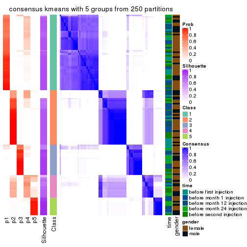</p>

</div>
<div id='tab-ATC-kmeans-consensus-heatmap-5'>
<pre><code class="r">consensus_heatmap(res, k = 6)
</code></pre>

<p></p>

</div>
</div>

Heatmaps for the membership of samples in all partitions to see how consistent they are:


<script>
$( function() {
	$( '#tabs-ATC-kmeans-membership-heatmap' ).tabs();
} );
</script>
<div id='tabs-ATC-kmeans-membership-heatmap'>
<ul>
<li><a href='#tab-ATC-kmeans-membership-heatmap-1'>k = 2</a></li>
<li><a href='#tab-ATC-kmeans-membership-heatmap-2'>k = 3</a></li>
<li><a href='#tab-ATC-kmeans-membership-heatmap-3'>k = 4</a></li>
<li><a href='#tab-ATC-kmeans-membership-heatmap-4'>k = 5</a></li>
<li><a href='#tab-ATC-kmeans-membership-heatmap-5'>k = 6</a></li>
</ul>
<div id='tab-ATC-kmeans-membership-heatmap-1'>
<pre><code class="r">membership_heatmap(res, k = 2)
</code></pre>

<p></p>

</div>
<div id='tab-ATC-kmeans-membership-heatmap-2'>
<pre><code class="r">membership_heatmap(res, k = 3)
</code></pre>

<p></p>

</div>
<div id='tab-ATC-kmeans-membership-heatmap-3'>
<pre><code class="r">membership_heatmap(res, k = 4)
</code></pre>

<p></p>

</div>
<div id='tab-ATC-kmeans-membership-heatmap-4'>
<pre><code class="r">membership_heatmap(res, k = 5)
</code></pre>

<p></p>

</div>
<div id='tab-ATC-kmeans-membership-heatmap-5'>
<pre><code class="r">membership_heatmap(res, k = 6)
</code></pre>

<p></p>

</div>
</div>

As soon as we have had the classes for columns, we can look for signatures
which are significantly different between classes which can be candidate marks
for certain classes. Following are the heatmaps for signatures.


Signature heatmaps where rows are scaled:


<script>
$( function() {
	$( '#tabs-ATC-kmeans-get-signatures' ).tabs();
} );
</script>
<div id='tabs-ATC-kmeans-get-signatures'>
<ul>
<li><a href='#tab-ATC-kmeans-get-signatures-1'>k = 2</a></li>
<li><a href='#tab-ATC-kmeans-get-signatures-2'>k = 3</a></li>
<li><a href='#tab-ATC-kmeans-get-signatures-3'>k = 4</a></li>
<li><a href='#tab-ATC-kmeans-get-signatures-4'>k = 5</a></li>
<li><a href='#tab-ATC-kmeans-get-signatures-5'>k = 6</a></li>
</ul>
<div id='tab-ATC-kmeans-get-signatures-1'>
<pre><code class="r">get_signatures(res, k = 2)
</code></pre>

<p></p>

</div>
<div id='tab-ATC-kmeans-get-signatures-2'>
<pre><code class="r">get_signatures(res, k = 3)
</code></pre>

<p></p>

</div>
<div id='tab-ATC-kmeans-get-signatures-3'>
<pre><code class="r">get_signatures(res, k = 4)
</code></pre>

<p></p>

</div>
<div id='tab-ATC-kmeans-get-signatures-4'>
<pre><code class="r">get_signatures(res, k = 5)
</code></pre>

<p></p>

</div>
<div id='tab-ATC-kmeans-get-signatures-5'>
<pre><code class="r">get_signatures(res, k = 6)
</code></pre>

<p></p>

</div>
</div>


Signature heatmaps where rows are not scaled:


<script>
$( function() {
	$( '#tabs-ATC-kmeans-get-signatures-no-scale' ).tabs();
} );
</script>
<div id='tabs-ATC-kmeans-get-signatures-no-scale'>
<ul>
<li><a href='#tab-ATC-kmeans-get-signatures-no-scale-1'>k = 2</a></li>
<li><a href='#tab-ATC-kmeans-get-signatures-no-scale-2'>k = 3</a></li>
<li><a href='#tab-ATC-kmeans-get-signatures-no-scale-3'>k = 4</a></li>
<li><a href='#tab-ATC-kmeans-get-signatures-no-scale-4'>k = 5</a></li>
<li><a href='#tab-ATC-kmeans-get-signatures-no-scale-5'>k = 6</a></li>
</ul>
<div id='tab-ATC-kmeans-get-signatures-no-scale-1'>
<pre><code class="r">get_signatures(res, k = 2, scale_rows = FALSE)
</code></pre>

<p></p>

</div>
<div id='tab-ATC-kmeans-get-signatures-no-scale-2'>
<pre><code class="r">get_signatures(res, k = 3, scale_rows = FALSE)
</code></pre>

<p></p>

</div>
<div id='tab-ATC-kmeans-get-signatures-no-scale-3'>
<pre><code class="r">get_signatures(res, k = 4, scale_rows = FALSE)
</code></pre>

<p></p>

</div>
<div id='tab-ATC-kmeans-get-signatures-no-scale-4'>
<pre><code class="r">get_signatures(res, k = 5, scale_rows = FALSE)
</code></pre>

<p></p>

</div>
<div id='tab-ATC-kmeans-get-signatures-no-scale-5'>
<pre><code class="r">get_signatures(res, k = 6, scale_rows = FALSE)
</code></pre>

<p></p>

</div>
</div>


Compare the overlap of signatures from different k:

```r
compare_signatures(res)
```


`get_signature()` returns a data frame invisibly. TO get the list of signatures, the function
call should be assigned to a variable explicitly. In following code, if `plot` argument is set
to `FALSE`, no heatmap is plotted while only the differential analysis is performed.

```r
# code only for demonstration
tb = get_signature(res, k = ..., plot = FALSE)
```

An example of the output of `tb` is:

```
#>   which_row         fdr    mean_1    mean_2 scaled_mean_1 scaled_mean_2 km
#> 1        38 0.042760348  8.373488  9.131774    -0.5533452     0.5164555  1
#> 2        40 0.018707592  7.106213  8.469186    -0.6173731     0.5762149  1
#> 3        55 0.019134737 10.221463 11.207825    -0.6159697     0.5749050  1
#> 4        59 0.006059896  5.921854  7.869574    -0.6899429     0.6439467  1
#> 5        60 0.018055526  8.928898 10.211722    -0.6204761     0.5791110  1
#> 6        98 0.009384629 15.714769 14.887706     0.6635654    -0.6193277  2
...
```

The columns in `tb` are:

1. `which_row`: row indices corresponding to the input matrix.
2. `fdr`: FDR for the differential test. 
3. `mean_x`: The mean value in group x.
4. `scaled_mean_x`: The mean value in group x after rows are scaled.
5. `km`: Row groups if k-means clustering is applied to rows.


UMAP plot which shows how samples are separated.


<script>
$( function() {
	$( '#tabs-ATC-kmeans-dimension-reduction' ).tabs();
} );
</script>
<div id='tabs-ATC-kmeans-dimension-reduction'>
<ul>
<li><a href='#tab-ATC-kmeans-dimension-reduction-1'>k = 2</a></li>
<li><a href='#tab-ATC-kmeans-dimension-reduction-2'>k = 3</a></li>
<li><a href='#tab-ATC-kmeans-dimension-reduction-3'>k = 4</a></li>
<li><a href='#tab-ATC-kmeans-dimension-reduction-4'>k = 5</a></li>
<li><a href='#tab-ATC-kmeans-dimension-reduction-5'>k = 6</a></li>
</ul>
<div id='tab-ATC-kmeans-dimension-reduction-1'>
<pre><code class="r">dimension_reduction(res, k = 2, method = &quot;UMAP&quot;)
</code></pre>

<p></p>

</div>
<div id='tab-ATC-kmeans-dimension-reduction-2'>
<pre><code class="r">dimension_reduction(res, k = 3, method = &quot;UMAP&quot;)
</code></pre>

<p>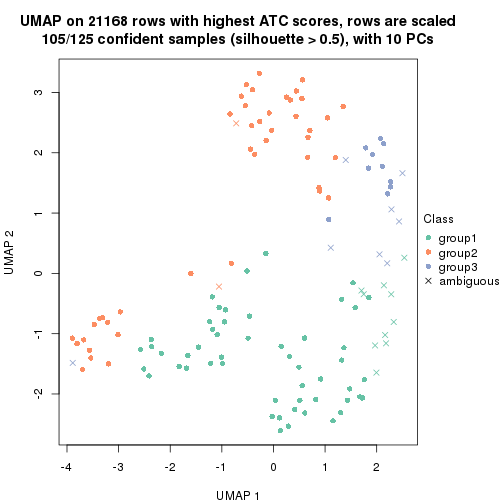</p>

</div>
<div id='tab-ATC-kmeans-dimension-reduction-3'>
<pre><code class="r">dimension_reduction(res, k = 4, method = &quot;UMAP&quot;)
</code></pre>

<p></p>

</div>
<div id='tab-ATC-kmeans-dimension-reduction-4'>
<pre><code class="r">dimension_reduction(res, k = 5, method = &quot;UMAP&quot;)
</code></pre>

<p></p>

</div>
<div id='tab-ATC-kmeans-dimension-reduction-5'>
<pre><code class="r">dimension_reduction(res, k = 6, method = &quot;UMAP&quot;)
</code></pre>

<p></p>

</div>
</div>


Following heatmap shows how subgroups are split when increasing `k`:

```r
collect_classes(res)
```


Test correlation between subgroups and known annotations. If the known
annotation is numeric, one-way ANOVA test is applied, and if the known
annotation is discrete, chi-squared contingency table test is applied.

```r
test_to_known_factors(res)
```

```
#>              n time(p) gender(p) k
#> ATC:kmeans 125   0.293     0.399 2
#> ATC:kmeans 105   0.400     0.472 3
#> ATC:kmeans 121   0.642     0.744 4
#> ATC:kmeans 118   0.739     0.756 5
#> ATC:kmeans 108   0.907     0.452 6
```


If matrix rows can be associated to genes, consider to use `GO_Enrichment(res,
...)` to perform function enrichment for the signature genes.


 

---------------------------------------------------


### ATC:skmeans**


The object with results only for a single top-value method and a single partition method 
can be extracted as:

```r
res = res_list["ATC", "skmeans"]
# you can also extract it by
# res = res_list["ATC:skmeans"]
```

A summary of `res` and all the functions that can be applied to it:

```r
res
```

```
#> A 'ConsensusPartition' object with k = 2, 3, 4, 5, 6.
#>   On a matrix with 21168 rows and 125 columns.
#>   Top rows (1000, 2000, 3000, 4000, 5000) are extracted by 'ATC' method.
#>   Subgroups are detected by 'skmeans' method.
#>   Performed in total 1250 partitions by row resampling.
#>   Best k for subgroups seems to be 4.
#> 
#> Following methods can be applied to this 'ConsensusPartition' object:
#>  [1] "cola_report"             "collect_classes"         "collect_plots"          
#>  [4] "collect_stats"           "colnames"                "compare_signatures"     
#>  [7] "consensus_heatmap"       "dimension_reduction"     "functional_enrichment"  
#> [10] "get_anno_col"            "get_anno"                "get_classes"            
#> [13] "get_consensus"           "get_matrix"              "get_membership"         
#> [16] "get_param"               "get_signatures"          "get_stats"              
#> [19] "is_best_k"               "is_stable_k"             "membership_heatmap"     
#> [22] "ncol"                    "nrow"                    "plot_ecdf"              
#> [25] "rownames"                "select_partition_number" "show"                   
#> [28] "suggest_best_k"          "test_to_known_factors"
```

`collect_plots()` function collects all the plots made from `res` for all `k` (number of partitions)
into one single page to provide an easy and fast comparison between different `k`.

```r
collect_plots(res)
```


The plots are:

- The first row: a plot of the ECDF (Empirical cumulative distribution
  function) curves of the consensus matrix for each `k` and the heatmap of
  predicted classes for each `k`.
- The second row: heatmaps of the consensus matrix for each `k`.
- The third row: heatmaps of the membership matrix for each `k`.
- The fouth row: heatmaps of the signatures for each `k`.

All the plots in panels can be made by individual functions and they are
plotted later in this section.

`select_partition_number()` produces several plots showing different
statistics for choosing "optimized" `k`. There are following statistics:

- ECDF curves of the consensus matrix for each `k`;
- 1-PAC. [The PAC
  score](https://en.wikipedia.org/wiki/Consensus_clustering#Over-interpretation_potential_of_consensus_clustering)
  measures the proportion of the ambiguous subgrouping.
- Mean silhouette score.
- Concordance. The mean probability of fiting the consensus class ids in all
  partitions.
- Area increased. Denote $A_k$ as the area under the ECDF curve for current
  `k`, the area increased is defined as $A_k - A_{k-1}$.
- Rand index. The percent of pairs of samples that are both in a same cluster
  or both are not in a same cluster in the partition of k and k-1.
- Jaccard index. The ratio of pairs of samples are both in a same cluster in
  the partition of k and k-1 and the pairs of samples are both in a same
  cluster in the partition k or k-1.

The detailed explanations of these statistics can be found in [the cola
vignette](http://bioconductor.org/packages/devel/bioc/vignettes/cola/inst/doc/cola.html#toc_13).

Generally speaking, lower PAC score, higher mean silhouette score or higher
concordance corresponds to better partition. Rand index and Jaccard index
measure how similar the current partition is compared to partition with `k-1`.
If they are too similar, we won't accept `k` is better than `k-1`.

```r
select_partition_number(res)
```


The numeric values for all these statistics can be obtained by `get_stats()`.

```r
get_stats(res)
```

```
#>   k 1-PAC mean_silhouette concordance area_increased  Rand Jaccard
#> 2 2 1.000           1.000       1.000         0.5029 0.498   0.498
#> 3 3 0.765           0.880       0.911         0.2847 0.829   0.665
#> 4 4 0.966           0.953       0.980         0.1549 0.870   0.648
#> 5 5 0.846           0.834       0.882         0.0509 0.955   0.829
#> 6 6 0.846           0.831       0.880         0.0452 0.932   0.711
```

`suggest_best_k()` suggests the best $k$ based on these statistics. The rules are as follows:

- All $k$ with Jaccard index larger than 0.95 are removed because the increase of
  the partition number does not provides enough extra information. If all $k$ are removed,
  the best $k$ is assigned by `NA`.
- For $k$ with 1-PAC larger than 0.9, the maximal $k$ is taken as the "best k". Other $k$ is called "optional k".
- If it does not fit the second rule. The $k$ with the highest vote of highest
  1-PAC, mean silhouette and concordance is taken as the "best k".

```r
suggest_best_k(res)
```

```
#> [1] 4
#> attr(,"optional")
#> [1] 2
```

There is also optional best $k$ = 2 that is worth to check.

Following shows the table of the partitions (You need to click the **show/hide
code output** link to see it). The membership matrix (columns with name `p*`)
is inferred by
[`clue::cl_consensus()`](https://www.rdocumentation.org/link/cl_consensus?package=clue)
function with the `SE` method. Basically the value in the membership matrix
represents the probability to belong to a certain group. The finall class
label for an item is determined with the group with highest probability it
belongs to.

In `get_classes()` function, the entropy is calculated from the membership
matrix and the silhouette score is calculated from the consensus matrix.


<script>
$( function() {
	$( '#tabs-ATC-skmeans-get-classes' ).tabs();
} );
</script>
<div id='tabs-ATC-skmeans-get-classes'>
<ul>
<li><a href='#tab-ATC-skmeans-get-classes-1'>k = 2</a></li>
<li><a href='#tab-ATC-skmeans-get-classes-2'>k = 3</a></li>
<li><a href='#tab-ATC-skmeans-get-classes-3'>k = 4</a></li>
<li><a href='#tab-ATC-skmeans-get-classes-4'>k = 5</a></li>
<li><a href='#tab-ATC-skmeans-get-classes-5'>k = 6</a></li>
</ul>

<div id='tab-ATC-skmeans-get-classes-1'>
<p><a id='tab-ATC-skmeans-get-classes-1-a' style='color:#0366d6' href='#'>show/hide code output</a></p>
<pre><code class="r">cbind(get_classes(res, k = 2), get_membership(res, k = 2))
</code></pre>

<pre><code>#&gt;           class entropy silhouette p1 p2
#&gt; GSM601752     2       0          1  0  1
#&gt; GSM601782     1       0          1  1  0
#&gt; GSM601792     1       0          1  1  0
#&gt; GSM601797     1       0          1  1  0
#&gt; GSM601827     1       0          1  1  0
#&gt; GSM601837     2       0          1  0  1
#&gt; GSM601842     2       0          1  0  1
#&gt; GSM601857     1       0          1  1  0
#&gt; GSM601867     1       0          1  1  0
#&gt; GSM601747     1       0          1  1  0
#&gt; GSM601757     1       0          1  1  0
#&gt; GSM601762     2       0          1  0  1
#&gt; GSM601767     2       0          1  0  1
#&gt; GSM601772     2       0          1  0  1
#&gt; GSM601777     1       0          1  1  0
#&gt; GSM601787     1       0          1  1  0
#&gt; GSM601802     2       0          1  0  1
#&gt; GSM601807     1       0          1  1  0
#&gt; GSM601812     1       0          1  1  0
#&gt; GSM601817     1       0          1  1  0
#&gt; GSM601822     1       0          1  1  0
#&gt; GSM601832     2       0          1  0  1
#&gt; GSM601847     1       0          1  1  0
#&gt; GSM601852     1       0          1  1  0
#&gt; GSM601862     1       0          1  1  0
#&gt; GSM601753     2       0          1  0  1
#&gt; GSM601783     1       0          1  1  0
#&gt; GSM601793     1       0          1  1  0
#&gt; GSM601798     2       0          1  0  1
#&gt; GSM601828     1       0          1  1  0
#&gt; GSM601838     2       0          1  0  1
#&gt; GSM601843     2       0          1  0  1
#&gt; GSM601858     2       0          1  0  1
#&gt; GSM601868     1       0          1  1  0
#&gt; GSM601748     1       0          1  1  0
#&gt; GSM601758     1       0          1  1  0
#&gt; GSM601763     2       0          1  0  1
#&gt; GSM601768     2       0          1  0  1
#&gt; GSM601773     2       0          1  0  1
#&gt; GSM601778     1       0          1  1  0
#&gt; GSM601788     2       0          1  0  1
#&gt; GSM601803     2       0          1  0  1
#&gt; GSM601808     1       0          1  1  0
#&gt; GSM601813     1       0          1  1  0
#&gt; GSM601818     1       0          1  1  0
#&gt; GSM601823     1       0          1  1  0
#&gt; GSM601833     2       0          1  0  1
#&gt; GSM601848     1       0          1  1  0
#&gt; GSM601853     1       0          1  1  0
#&gt; GSM601863     1       0          1  1  0
#&gt; GSM601754     2       0          1  0  1
#&gt; GSM601784     2       0          1  0  1
#&gt; GSM601794     1       0          1  1  0
#&gt; GSM601799     2       0          1  0  1
#&gt; GSM601829     1       0          1  1  0
#&gt; GSM601839     2       0          1  0  1
#&gt; GSM601844     1       0          1  1  0
#&gt; GSM601859     2       0          1  0  1
#&gt; GSM601869     1       0          1  1  0
#&gt; GSM601749     1       0          1  1  0
#&gt; GSM601759     1       0          1  1  0
#&gt; GSM601764     2       0          1  0  1
#&gt; GSM601769     2       0          1  0  1
#&gt; GSM601774     2       0          1  0  1
#&gt; GSM601779     1       0          1  1  0
#&gt; GSM601789     2       0          1  0  1
#&gt; GSM601804     2       0          1  0  1
#&gt; GSM601809     1       0          1  1  0
#&gt; GSM601814     2       0          1  0  1
#&gt; GSM601819     1       0          1  1  0
#&gt; GSM601824     2       0          1  0  1
#&gt; GSM601834     2       0          1  0  1
#&gt; GSM601849     1       0          1  1  0
#&gt; GSM601854     1       0          1  1  0
#&gt; GSM601864     2       0          1  0  1
#&gt; GSM601755     2       0          1  0  1
#&gt; GSM601785     2       0          1  0  1
#&gt; GSM601795     1       0          1  1  0
#&gt; GSM601800     2       0          1  0  1
#&gt; GSM601830     1       0          1  1  0
#&gt; GSM601840     2       0          1  0  1
#&gt; GSM601845     2       0          1  0  1
#&gt; GSM601860     2       0          1  0  1
#&gt; GSM601870     1       0          1  1  0
#&gt; GSM601750     1       0          1  1  0
#&gt; GSM601760     1       0          1  1  0
#&gt; GSM601765     2       0          1  0  1
#&gt; GSM601770     2       0          1  0  1
#&gt; GSM601775     2       0          1  0  1
#&gt; GSM601780     1       0          1  1  0
#&gt; GSM601790     2       0          1  0  1
#&gt; GSM601805     2       0          1  0  1
#&gt; GSM601810     1       0          1  1  0
#&gt; GSM601815     2       0          1  0  1
#&gt; GSM601820     1       0          1  1  0
#&gt; GSM601825     2       0          1  0  1
#&gt; GSM601835     2       0          1  0  1
#&gt; GSM601850     1       0          1  1  0
#&gt; GSM601855     1       0          1  1  0
#&gt; GSM601865     2       0          1  0  1
#&gt; GSM601756     2       0          1  0  1
#&gt; GSM601786     2       0          1  0  1
#&gt; GSM601796     1       0          1  1  0
#&gt; GSM601801     2       0          1  0  1
#&gt; GSM601831     1       0          1  1  0
#&gt; GSM601841     1       0          1  1  0
#&gt; GSM601846     2       0          1  0  1
#&gt; GSM601861     2       0          1  0  1
#&gt; GSM601871     1       0          1  1  0
#&gt; GSM601751     2       0          1  0  1
#&gt; GSM601761     1       0          1  1  0
#&gt; GSM601766     2       0          1  0  1
#&gt; GSM601771     2       0          1  0  1
#&gt; GSM601776     1       0          1  1  0
#&gt; GSM601781     1       0          1  1  0
#&gt; GSM601791     1       0          1  1  0
#&gt; GSM601806     2       0          1  0  1
#&gt; GSM601811     1       0          1  1  0
#&gt; GSM601816     1       0          1  1  0
#&gt; GSM601821     2       0          1  0  1
#&gt; GSM601826     1       0          1  1  0
#&gt; GSM601836     2       0          1  0  1
#&gt; GSM601851     1       0          1  1  0
#&gt; GSM601856     1       0          1  1  0
#&gt; GSM601866     1       0          1  1  0
</code></pre>

<script>
$('#tab-ATC-skmeans-get-classes-1-a').parent().next().next().hide();
$('#tab-ATC-skmeans-get-classes-1-a').click(function(){
  $('#tab-ATC-skmeans-get-classes-1-a').parent().next().next().toggle();
  return(false);
});
</script>
</div>

<div id='tab-ATC-skmeans-get-classes-2'>
<p><a id='tab-ATC-skmeans-get-classes-2-a' style='color:#0366d6' href='#'>show/hide code output</a></p>
<pre><code class="r">cbind(get_classes(res, k = 3), get_membership(res, k = 3))
</code></pre>

<pre><code>#&gt;           class entropy silhouette    p1    p2    p3
#&gt; GSM601752     2  0.0000      0.916 0.000 1.000 0.000
#&gt; GSM601782     1  0.2625      0.862 0.916 0.000 0.084
#&gt; GSM601792     1  0.0000      0.968 1.000 0.000 0.000
#&gt; GSM601797     3  0.5327      0.864 0.272 0.000 0.728
#&gt; GSM601827     1  0.0000      0.968 1.000 0.000 0.000
#&gt; GSM601837     2  0.6302      0.479 0.000 0.520 0.480
#&gt; GSM601842     2  0.0000      0.916 0.000 1.000 0.000
#&gt; GSM601857     3  0.5291      0.869 0.268 0.000 0.732
#&gt; GSM601867     3  0.0000      0.751 0.000 0.000 1.000
#&gt; GSM601747     1  0.0000      0.968 1.000 0.000 0.000
#&gt; GSM601757     1  0.0000      0.968 1.000 0.000 0.000
#&gt; GSM601762     2  0.0000      0.916 0.000 1.000 0.000
#&gt; GSM601767     2  0.0000      0.916 0.000 1.000 0.000
#&gt; GSM601772     2  0.0000      0.916 0.000 1.000 0.000
#&gt; GSM601777     3  0.5291      0.869 0.268 0.000 0.732
#&gt; GSM601787     3  0.0000      0.751 0.000 0.000 1.000
#&gt; GSM601802     2  0.0000      0.916 0.000 1.000 0.000
#&gt; GSM601807     3  0.5016      0.864 0.240 0.000 0.760
#&gt; GSM601812     1  0.0000      0.968 1.000 0.000 0.000
#&gt; GSM601817     1  0.0000      0.968 1.000 0.000 0.000
#&gt; GSM601822     1  0.0000      0.968 1.000 0.000 0.000
#&gt; GSM601832     2  0.0000      0.916 0.000 1.000 0.000
#&gt; GSM601847     1  0.4002      0.734 0.840 0.000 0.160
#&gt; GSM601852     1  0.0000      0.968 1.000 0.000 0.000
#&gt; GSM601862     3  0.5291      0.869 0.268 0.000 0.732
#&gt; GSM601753     2  0.0000      0.916 0.000 1.000 0.000
#&gt; GSM601783     1  0.0000      0.968 1.000 0.000 0.000
#&gt; GSM601793     1  0.0000      0.968 1.000 0.000 0.000
#&gt; GSM601798     2  0.4887      0.823 0.000 0.772 0.228
#&gt; GSM601828     1  0.0000      0.968 1.000 0.000 0.000
#&gt; GSM601838     2  0.5327      0.797 0.000 0.728 0.272
#&gt; GSM601843     2  0.0000      0.916 0.000 1.000 0.000
#&gt; GSM601858     2  0.5327      0.797 0.000 0.728 0.272
#&gt; GSM601868     3  0.5291      0.869 0.268 0.000 0.732
#&gt; GSM601748     1  0.0000      0.968 1.000 0.000 0.000
#&gt; GSM601758     1  0.0000      0.968 1.000 0.000 0.000
#&gt; GSM601763     2  0.0000      0.916 0.000 1.000 0.000
#&gt; GSM601768     2  0.0000      0.916 0.000 1.000 0.000
#&gt; GSM601773     2  0.0000      0.916 0.000 1.000 0.000
#&gt; GSM601778     3  0.5431      0.849 0.284 0.000 0.716
#&gt; GSM601788     2  0.5016      0.817 0.000 0.760 0.240
#&gt; GSM601803     2  0.4931      0.821 0.000 0.768 0.232
#&gt; GSM601808     3  0.5291      0.869 0.268 0.000 0.732
#&gt; GSM601813     1  0.0000      0.968 1.000 0.000 0.000
#&gt; GSM601818     3  0.5291      0.869 0.268 0.000 0.732
#&gt; GSM601823     1  0.5016      0.607 0.760 0.240 0.000
#&gt; GSM601833     2  0.0000      0.916 0.000 1.000 0.000
#&gt; GSM601848     1  0.0000      0.968 1.000 0.000 0.000
#&gt; GSM601853     1  0.6305     -0.359 0.516 0.000 0.484
#&gt; GSM601863     3  0.5291      0.869 0.268 0.000 0.732
#&gt; GSM601754     2  0.0000      0.916 0.000 1.000 0.000
#&gt; GSM601784     2  0.0000      0.916 0.000 1.000 0.000
#&gt; GSM601794     1  0.0000      0.968 1.000 0.000 0.000
#&gt; GSM601799     2  0.0000      0.916 0.000 1.000 0.000
#&gt; GSM601829     1  0.0000      0.968 1.000 0.000 0.000
#&gt; GSM601839     2  0.5327      0.797 0.000 0.728 0.272
#&gt; GSM601844     1  0.0000      0.968 1.000 0.000 0.000
#&gt; GSM601859     2  0.0000      0.916 0.000 1.000 0.000
#&gt; GSM601869     3  0.5291      0.869 0.268 0.000 0.732
#&gt; GSM601749     1  0.0000      0.968 1.000 0.000 0.000
#&gt; GSM601759     1  0.0000      0.968 1.000 0.000 0.000
#&gt; GSM601764     2  0.0000      0.916 0.000 1.000 0.000
#&gt; GSM601769     2  0.0000      0.916 0.000 1.000 0.000
#&gt; GSM601774     2  0.0000      0.916 0.000 1.000 0.000
#&gt; GSM601779     1  0.0000      0.968 1.000 0.000 0.000
#&gt; GSM601789     2  0.5291      0.800 0.000 0.732 0.268
#&gt; GSM601804     2  0.0000      0.916 0.000 1.000 0.000
#&gt; GSM601809     3  0.5016      0.864 0.240 0.000 0.760
#&gt; GSM601814     2  0.5291      0.800 0.000 0.732 0.268
#&gt; GSM601819     1  0.0000      0.968 1.000 0.000 0.000
#&gt; GSM601824     2  0.0000      0.916 0.000 1.000 0.000
#&gt; GSM601834     2  0.0000      0.916 0.000 1.000 0.000
#&gt; GSM601849     1  0.0000      0.968 1.000 0.000 0.000
#&gt; GSM601854     1  0.0000      0.968 1.000 0.000 0.000
#&gt; GSM601864     3  0.0000      0.751 0.000 0.000 1.000
#&gt; GSM601755     2  0.0000      0.916 0.000 1.000 0.000
#&gt; GSM601785     2  0.0000      0.916 0.000 1.000 0.000
#&gt; GSM601795     1  0.0000      0.968 1.000 0.000 0.000
#&gt; GSM601800     2  0.0000      0.916 0.000 1.000 0.000
#&gt; GSM601830     3  0.5291      0.869 0.268 0.000 0.732
#&gt; GSM601840     2  0.1031      0.908 0.000 0.976 0.024
#&gt; GSM601845     2  0.0000      0.916 0.000 1.000 0.000
#&gt; GSM601860     2  0.0000      0.916 0.000 1.000 0.000
#&gt; GSM601870     3  0.0000      0.751 0.000 0.000 1.000
#&gt; GSM601750     1  0.0000      0.968 1.000 0.000 0.000
#&gt; GSM601760     1  0.0000      0.968 1.000 0.000 0.000
#&gt; GSM601765     2  0.0000      0.916 0.000 1.000 0.000
#&gt; GSM601770     2  0.0000      0.916 0.000 1.000 0.000
#&gt; GSM601775     2  0.0000      0.916 0.000 1.000 0.000
#&gt; GSM601780     1  0.0000      0.968 1.000 0.000 0.000
#&gt; GSM601790     2  0.5291      0.800 0.000 0.732 0.268
#&gt; GSM601805     2  0.4931      0.821 0.000 0.768 0.232
#&gt; GSM601810     3  0.5291      0.869 0.268 0.000 0.732
#&gt; GSM601815     2  0.5327      0.797 0.000 0.728 0.272
#&gt; GSM601820     1  0.0000      0.968 1.000 0.000 0.000
#&gt; GSM601825     2  0.0000      0.916 0.000 1.000 0.000
#&gt; GSM601835     2  0.0000      0.916 0.000 1.000 0.000
#&gt; GSM601850     1  0.0237      0.963 0.996 0.000 0.004
#&gt; GSM601855     3  0.5016      0.864 0.240 0.000 0.760
#&gt; GSM601865     3  0.0000      0.751 0.000 0.000 1.000
#&gt; GSM601756     2  0.4931      0.821 0.000 0.768 0.232
#&gt; GSM601786     3  0.0000      0.751 0.000 0.000 1.000
#&gt; GSM601796     1  0.0000      0.968 1.000 0.000 0.000
#&gt; GSM601801     2  0.4887      0.823 0.000 0.772 0.228
#&gt; GSM601831     1  0.0000      0.968 1.000 0.000 0.000
#&gt; GSM601841     3  0.5291      0.869 0.268 0.000 0.732
#&gt; GSM601846     2  0.0000      0.916 0.000 1.000 0.000
#&gt; GSM601861     2  0.5291      0.800 0.000 0.732 0.268
#&gt; GSM601871     3  0.0000      0.751 0.000 0.000 1.000
#&gt; GSM601751     2  0.5216      0.805 0.000 0.740 0.260
#&gt; GSM601761     1  0.0000      0.968 1.000 0.000 0.000
#&gt; GSM601766     2  0.0000      0.916 0.000 1.000 0.000
#&gt; GSM601771     3  0.0000      0.751 0.000 0.000 1.000
#&gt; GSM601776     1  0.0000      0.968 1.000 0.000 0.000
#&gt; GSM601781     3  0.5291      0.869 0.268 0.000 0.732
#&gt; GSM601791     1  0.0000      0.968 1.000 0.000 0.000
#&gt; GSM601806     2  0.5291      0.800 0.000 0.732 0.268
#&gt; GSM601811     3  0.5016      0.864 0.240 0.000 0.760
#&gt; GSM601816     1  0.0000      0.968 1.000 0.000 0.000
#&gt; GSM601821     2  0.5327      0.797 0.000 0.728 0.272
#&gt; GSM601826     1  0.0000      0.968 1.000 0.000 0.000
#&gt; GSM601836     2  0.0237      0.914 0.004 0.996 0.000
#&gt; GSM601851     1  0.0000      0.968 1.000 0.000 0.000
#&gt; GSM601856     3  0.5327      0.864 0.272 0.000 0.728
#&gt; GSM601866     3  0.5291      0.869 0.268 0.000 0.732
</code></pre>

<script>
$('#tab-ATC-skmeans-get-classes-2-a').parent().next().next().hide();
$('#tab-ATC-skmeans-get-classes-2-a').click(function(){
  $('#tab-ATC-skmeans-get-classes-2-a').parent().next().next().toggle();
  return(false);
});
</script>
</div>

<div id='tab-ATC-skmeans-get-classes-3'>
<p><a id='tab-ATC-skmeans-get-classes-3-a' style='color:#0366d6' href='#'>show/hide code output</a></p>
<pre><code class="r">cbind(get_classes(res, k = 4), get_membership(res, k = 4))
</code></pre>

<pre><code>#&gt;           class entropy silhouette    p1    p2    p3    p4
#&gt; GSM601752     2  0.0000      0.986 0.000 1.000 0.000 0.000
#&gt; GSM601782     3  0.3907      0.677 0.232 0.000 0.768 0.000
#&gt; GSM601792     1  0.0000      0.966 1.000 0.000 0.000 0.000
#&gt; GSM601797     3  0.0336      0.981 0.008 0.000 0.992 0.000
#&gt; GSM601827     1  0.0000      0.966 1.000 0.000 0.000 0.000
#&gt; GSM601837     4  0.0000      0.974 0.000 0.000 0.000 1.000
#&gt; GSM601842     2  0.0000      0.986 0.000 1.000 0.000 0.000
#&gt; GSM601857     3  0.0000      0.989 0.000 0.000 1.000 0.000
#&gt; GSM601867     3  0.0000      0.989 0.000 0.000 1.000 0.000
#&gt; GSM601747     1  0.1389      0.930 0.952 0.000 0.048 0.000
#&gt; GSM601757     1  0.0000      0.966 1.000 0.000 0.000 0.000
#&gt; GSM601762     2  0.0000      0.986 0.000 1.000 0.000 0.000
#&gt; GSM601767     2  0.0000      0.986 0.000 1.000 0.000 0.000
#&gt; GSM601772     2  0.0000      0.986 0.000 1.000 0.000 0.000
#&gt; GSM601777     3  0.0000      0.989 0.000 0.000 1.000 0.000
#&gt; GSM601787     3  0.0000      0.989 0.000 0.000 1.000 0.000
#&gt; GSM601802     2  0.3444      0.768 0.000 0.816 0.000 0.184
#&gt; GSM601807     3  0.0000      0.989 0.000 0.000 1.000 0.000
#&gt; GSM601812     1  0.2647      0.865 0.880 0.000 0.120 0.000
#&gt; GSM601817     1  0.0000      0.966 1.000 0.000 0.000 0.000
#&gt; GSM601822     1  0.0000      0.966 1.000 0.000 0.000 0.000
#&gt; GSM601832     2  0.0000      0.986 0.000 1.000 0.000 0.000
#&gt; GSM601847     1  0.4989      0.094 0.528 0.000 0.472 0.000
#&gt; GSM601852     1  0.0000      0.966 1.000 0.000 0.000 0.000
#&gt; GSM601862     3  0.0000      0.989 0.000 0.000 1.000 0.000
#&gt; GSM601753     2  0.0000      0.986 0.000 1.000 0.000 0.000
#&gt; GSM601783     1  0.0000      0.966 1.000 0.000 0.000 0.000
#&gt; GSM601793     1  0.0000      0.966 1.000 0.000 0.000 0.000
#&gt; GSM601798     4  0.0000      0.974 0.000 0.000 0.000 1.000
#&gt; GSM601828     1  0.0000      0.966 1.000 0.000 0.000 0.000
#&gt; GSM601838     4  0.0000      0.974 0.000 0.000 0.000 1.000
#&gt; GSM601843     2  0.0000      0.986 0.000 1.000 0.000 0.000
#&gt; GSM601858     4  0.0000      0.974 0.000 0.000 0.000 1.000
#&gt; GSM601868     3  0.0000      0.989 0.000 0.000 1.000 0.000
#&gt; GSM601748     1  0.0188      0.963 0.996 0.000 0.004 0.000
#&gt; GSM601758     1  0.0000      0.966 1.000 0.000 0.000 0.000
#&gt; GSM601763     2  0.0000      0.986 0.000 1.000 0.000 0.000
#&gt; GSM601768     2  0.0000      0.986 0.000 1.000 0.000 0.000
#&gt; GSM601773     2  0.0000      0.986 0.000 1.000 0.000 0.000
#&gt; GSM601778     3  0.0336      0.981 0.008 0.000 0.992 0.000
#&gt; GSM601788     4  0.0000      0.974 0.000 0.000 0.000 1.000
#&gt; GSM601803     4  0.0000      0.974 0.000 0.000 0.000 1.000
#&gt; GSM601808     3  0.0000      0.989 0.000 0.000 1.000 0.000
#&gt; GSM601813     1  0.3123      0.826 0.844 0.000 0.156 0.000
#&gt; GSM601818     3  0.0000      0.989 0.000 0.000 1.000 0.000
#&gt; GSM601823     1  0.0000      0.966 1.000 0.000 0.000 0.000
#&gt; GSM601833     2  0.0000      0.986 0.000 1.000 0.000 0.000
#&gt; GSM601848     1  0.0000      0.966 1.000 0.000 0.000 0.000
#&gt; GSM601853     3  0.0000      0.989 0.000 0.000 1.000 0.000
#&gt; GSM601863     3  0.0000      0.989 0.000 0.000 1.000 0.000
#&gt; GSM601754     2  0.0000      0.986 0.000 1.000 0.000 0.000
#&gt; GSM601784     2  0.0000      0.986 0.000 1.000 0.000 0.000
#&gt; GSM601794     1  0.0000      0.966 1.000 0.000 0.000 0.000
#&gt; GSM601799     2  0.0000      0.986 0.000 1.000 0.000 0.000
#&gt; GSM601829     1  0.0000      0.966 1.000 0.000 0.000 0.000
#&gt; GSM601839     4  0.0000      0.974 0.000 0.000 0.000 1.000
#&gt; GSM601844     1  0.0000      0.966 1.000 0.000 0.000 0.000
#&gt; GSM601859     2  0.0000      0.986 0.000 1.000 0.000 0.000
#&gt; GSM601869     3  0.0000      0.989 0.000 0.000 1.000 0.000
#&gt; GSM601749     1  0.0000      0.966 1.000 0.000 0.000 0.000
#&gt; GSM601759     1  0.0000      0.966 1.000 0.000 0.000 0.000
#&gt; GSM601764     2  0.0000      0.986 0.000 1.000 0.000 0.000
#&gt; GSM601769     4  0.4250      0.627 0.000 0.276 0.000 0.724
#&gt; GSM601774     2  0.0000      0.986 0.000 1.000 0.000 0.000
#&gt; GSM601779     1  0.0000      0.966 1.000 0.000 0.000 0.000
#&gt; GSM601789     4  0.0000      0.974 0.000 0.000 0.000 1.000
#&gt; GSM601804     2  0.0000      0.986 0.000 1.000 0.000 0.000
#&gt; GSM601809     3  0.0000      0.989 0.000 0.000 1.000 0.000
#&gt; GSM601814     4  0.0000      0.974 0.000 0.000 0.000 1.000
#&gt; GSM601819     1  0.0000      0.966 1.000 0.000 0.000 0.000
#&gt; GSM601824     2  0.0000      0.986 0.000 1.000 0.000 0.000
#&gt; GSM601834     2  0.0000      0.986 0.000 1.000 0.000 0.000
#&gt; GSM601849     1  0.0000      0.966 1.000 0.000 0.000 0.000
#&gt; GSM601854     1  0.0000      0.966 1.000 0.000 0.000 0.000
#&gt; GSM601864     4  0.0000      0.974 0.000 0.000 0.000 1.000
#&gt; GSM601755     4  0.3907      0.703 0.000 0.232 0.000 0.768
#&gt; GSM601785     2  0.0000      0.986 0.000 1.000 0.000 0.000
#&gt; GSM601795     1  0.0000      0.966 1.000 0.000 0.000 0.000
#&gt; GSM601800     2  0.0000      0.986 0.000 1.000 0.000 0.000
#&gt; GSM601830     3  0.0000      0.989 0.000 0.000 1.000 0.000
#&gt; GSM601840     2  0.4250      0.610 0.000 0.724 0.000 0.276
#&gt; GSM601845     2  0.0000      0.986 0.000 1.000 0.000 0.000
#&gt; GSM601860     2  0.0000      0.986 0.000 1.000 0.000 0.000
#&gt; GSM601870     3  0.0000      0.989 0.000 0.000 1.000 0.000
#&gt; GSM601750     1  0.0000      0.966 1.000 0.000 0.000 0.000
#&gt; GSM601760     1  0.0000      0.966 1.000 0.000 0.000 0.000
#&gt; GSM601765     2  0.0000      0.986 0.000 1.000 0.000 0.000
#&gt; GSM601770     2  0.0000      0.986 0.000 1.000 0.000 0.000
#&gt; GSM601775     2  0.0000      0.986 0.000 1.000 0.000 0.000
#&gt; GSM601780     1  0.0000      0.966 1.000 0.000 0.000 0.000
#&gt; GSM601790     4  0.0000      0.974 0.000 0.000 0.000 1.000
#&gt; GSM601805     4  0.0000      0.974 0.000 0.000 0.000 1.000
#&gt; GSM601810     3  0.0000      0.989 0.000 0.000 1.000 0.000
#&gt; GSM601815     4  0.0000      0.974 0.000 0.000 0.000 1.000
#&gt; GSM601820     1  0.3074      0.831 0.848 0.000 0.152 0.000
#&gt; GSM601825     2  0.0000      0.986 0.000 1.000 0.000 0.000
#&gt; GSM601835     2  0.0000      0.986 0.000 1.000 0.000 0.000
#&gt; GSM601850     1  0.1022      0.943 0.968 0.000 0.032 0.000
#&gt; GSM601855     3  0.0000      0.989 0.000 0.000 1.000 0.000
#&gt; GSM601865     4  0.0000      0.974 0.000 0.000 0.000 1.000
#&gt; GSM601756     4  0.0000      0.974 0.000 0.000 0.000 1.000
#&gt; GSM601786     4  0.0000      0.974 0.000 0.000 0.000 1.000
#&gt; GSM601796     1  0.2921      0.843 0.860 0.000 0.140 0.000
#&gt; GSM601801     4  0.0000      0.974 0.000 0.000 0.000 1.000
#&gt; GSM601831     1  0.3074      0.831 0.848 0.000 0.152 0.000
#&gt; GSM601841     3  0.0000      0.989 0.000 0.000 1.000 0.000
#&gt; GSM601846     2  0.0000      0.986 0.000 1.000 0.000 0.000
#&gt; GSM601861     4  0.0000      0.974 0.000 0.000 0.000 1.000
#&gt; GSM601871     3  0.0000      0.989 0.000 0.000 1.000 0.000
#&gt; GSM601751     4  0.1302      0.935 0.000 0.044 0.000 0.956
#&gt; GSM601761     1  0.0000      0.966 1.000 0.000 0.000 0.000
#&gt; GSM601766     2  0.0000      0.986 0.000 1.000 0.000 0.000
#&gt; GSM601771     4  0.0000      0.974 0.000 0.000 0.000 1.000
#&gt; GSM601776     1  0.0000      0.966 1.000 0.000 0.000 0.000
#&gt; GSM601781     3  0.0000      0.989 0.000 0.000 1.000 0.000
#&gt; GSM601791     1  0.0000      0.966 1.000 0.000 0.000 0.000
#&gt; GSM601806     4  0.0000      0.974 0.000 0.000 0.000 1.000
#&gt; GSM601811     3  0.0000      0.989 0.000 0.000 1.000 0.000
#&gt; GSM601816     1  0.0000      0.966 1.000 0.000 0.000 0.000
#&gt; GSM601821     4  0.0000      0.974 0.000 0.000 0.000 1.000
#&gt; GSM601826     1  0.0000      0.966 1.000 0.000 0.000 0.000
#&gt; GSM601836     2  0.0000      0.986 0.000 1.000 0.000 0.000
#&gt; GSM601851     1  0.0000      0.966 1.000 0.000 0.000 0.000
#&gt; GSM601856     3  0.0000      0.989 0.000 0.000 1.000 0.000
#&gt; GSM601866     3  0.0000      0.989 0.000 0.000 1.000 0.000
</code></pre>

<script>
$('#tab-ATC-skmeans-get-classes-3-a').parent().next().next().hide();
$('#tab-ATC-skmeans-get-classes-3-a').click(function(){
  $('#tab-ATC-skmeans-get-classes-3-a').parent().next().next().toggle();
  return(false);
});
</script>
</div>

<div id='tab-ATC-skmeans-get-classes-4'>
<p><a id='tab-ATC-skmeans-get-classes-4-a' style='color:#0366d6' href='#'>show/hide code output</a></p>
<pre><code class="r">cbind(get_classes(res, k = 5), get_membership(res, k = 5))
</code></pre>

<pre><code>#&gt;           class entropy silhouette    p1    p2    p3    p4    p5
#&gt; GSM601752     4  0.5997      0.594 0.072 0.312 0.000 0.588 0.028
#&gt; GSM601782     3  0.6296      0.220 0.200 0.000 0.528 0.000 0.272
#&gt; GSM601792     1  0.1341      0.775 0.944 0.000 0.000 0.000 0.056
#&gt; GSM601797     3  0.7014      0.396 0.216 0.000 0.540 0.196 0.048
#&gt; GSM601827     1  0.3636      0.824 0.728 0.000 0.000 0.000 0.272
#&gt; GSM601837     5  0.4150      0.984 0.000 0.000 0.000 0.388 0.612
#&gt; GSM601842     2  0.0000      0.957 0.000 1.000 0.000 0.000 0.000
#&gt; GSM601857     3  0.0000      0.930 0.000 0.000 1.000 0.000 0.000
#&gt; GSM601867     3  0.0000      0.930 0.000 0.000 1.000 0.000 0.000
#&gt; GSM601747     1  0.4268      0.816 0.708 0.000 0.024 0.000 0.268
#&gt; GSM601757     1  0.3612      0.824 0.732 0.000 0.000 0.000 0.268
#&gt; GSM601762     2  0.0000      0.957 0.000 1.000 0.000 0.000 0.000
#&gt; GSM601767     2  0.0000      0.957 0.000 1.000 0.000 0.000 0.000
#&gt; GSM601772     2  0.0000      0.957 0.000 1.000 0.000 0.000 0.000
#&gt; GSM601777     3  0.1205      0.905 0.004 0.000 0.956 0.000 0.040
#&gt; GSM601787     3  0.0000      0.930 0.000 0.000 1.000 0.000 0.000
#&gt; GSM601802     4  0.3895      0.637 0.000 0.320 0.000 0.680 0.000
#&gt; GSM601807     3  0.0000      0.930 0.000 0.000 1.000 0.000 0.000
#&gt; GSM601812     1  0.5778      0.741 0.596 0.000 0.132 0.000 0.272
#&gt; GSM601817     1  0.3661      0.824 0.724 0.000 0.000 0.000 0.276
#&gt; GSM601822     1  0.1043      0.779 0.960 0.000 0.000 0.000 0.040
#&gt; GSM601832     2  0.0000      0.957 0.000 1.000 0.000 0.000 0.000
#&gt; GSM601847     1  0.5179      0.430 0.680 0.000 0.252 0.020 0.048
#&gt; GSM601852     1  0.4620      0.792 0.652 0.000 0.000 0.028 0.320
#&gt; GSM601862     3  0.0000      0.930 0.000 0.000 1.000 0.000 0.000
#&gt; GSM601753     2  0.0162      0.954 0.000 0.996 0.000 0.004 0.000
#&gt; GSM601783     1  0.3612      0.824 0.732 0.000 0.000 0.000 0.268
#&gt; GSM601793     1  0.1341      0.775 0.944 0.000 0.000 0.000 0.056
#&gt; GSM601798     4  0.0880      0.606 0.000 0.032 0.000 0.968 0.000
#&gt; GSM601828     1  0.3636      0.824 0.728 0.000 0.000 0.000 0.272
#&gt; GSM601838     5  0.4150      0.984 0.000 0.000 0.000 0.388 0.612
#&gt; GSM601843     2  0.0000      0.957 0.000 1.000 0.000 0.000 0.000
#&gt; GSM601858     5  0.4150      0.984 0.000 0.000 0.000 0.388 0.612
#&gt; GSM601868     3  0.0000      0.930 0.000 0.000 1.000 0.000 0.000
#&gt; GSM601748     1  0.3612      0.824 0.732 0.000 0.000 0.000 0.268
#&gt; GSM601758     1  0.3612      0.824 0.732 0.000 0.000 0.000 0.268
#&gt; GSM601763     2  0.2054      0.901 0.000 0.920 0.000 0.028 0.052
#&gt; GSM601768     2  0.0000      0.957 0.000 1.000 0.000 0.000 0.000
#&gt; GSM601773     2  0.0000      0.957 0.000 1.000 0.000 0.000 0.000
#&gt; GSM601778     3  0.4333      0.688 0.212 0.000 0.740 0.000 0.048
#&gt; GSM601788     5  0.4547      0.957 0.000 0.012 0.000 0.400 0.588
#&gt; GSM601803     4  0.0794      0.602 0.000 0.028 0.000 0.972 0.000
#&gt; GSM601808     3  0.0000      0.930 0.000 0.000 1.000 0.000 0.000
#&gt; GSM601813     1  0.6220      0.682 0.540 0.000 0.188 0.000 0.272
#&gt; GSM601818     3  0.1478      0.881 0.000 0.000 0.936 0.000 0.064
#&gt; GSM601823     1  0.2325      0.753 0.904 0.000 0.000 0.028 0.068
#&gt; GSM601833     2  0.0000      0.957 0.000 1.000 0.000 0.000 0.000
#&gt; GSM601848     1  0.0290      0.791 0.992 0.000 0.000 0.000 0.008
#&gt; GSM601853     3  0.3756      0.675 0.008 0.000 0.744 0.000 0.248
#&gt; GSM601863     3  0.0000      0.930 0.000 0.000 1.000 0.000 0.000
#&gt; GSM601754     4  0.5960      0.593 0.068 0.316 0.000 0.588 0.028
#&gt; GSM601784     2  0.0000      0.957 0.000 1.000 0.000 0.000 0.000
#&gt; GSM601794     1  0.1341      0.775 0.944 0.000 0.000 0.000 0.056
#&gt; GSM601799     2  0.0000      0.957 0.000 1.000 0.000 0.000 0.000
#&gt; GSM601829     1  0.2450      0.759 0.896 0.000 0.000 0.028 0.076
#&gt; GSM601839     5  0.4150      0.984 0.000 0.000 0.000 0.388 0.612
#&gt; GSM601844     1  0.4397      0.794 0.696 0.000 0.000 0.028 0.276
#&gt; GSM601859     2  0.0000      0.957 0.000 1.000 0.000 0.000 0.000
#&gt; GSM601869     3  0.0000      0.930 0.000 0.000 1.000 0.000 0.000
#&gt; GSM601749     1  0.3636      0.824 0.728 0.000 0.000 0.000 0.272
#&gt; GSM601759     1  0.3612      0.824 0.732 0.000 0.000 0.000 0.268
#&gt; GSM601764     2  0.2124      0.897 0.000 0.916 0.000 0.028 0.056
#&gt; GSM601769     2  0.3659      0.586 0.000 0.768 0.000 0.220 0.012
#&gt; GSM601774     2  0.0000      0.957 0.000 1.000 0.000 0.000 0.000
#&gt; GSM601779     1  0.0290      0.791 0.992 0.000 0.000 0.000 0.008
#&gt; GSM601789     5  0.4150      0.984 0.000 0.000 0.000 0.388 0.612
#&gt; GSM601804     4  0.5627      0.532 0.040 0.364 0.000 0.572 0.024
#&gt; GSM601809     3  0.0000      0.930 0.000 0.000 1.000 0.000 0.000
#&gt; GSM601814     5  0.4150      0.984 0.000 0.000 0.000 0.388 0.612
#&gt; GSM601819     1  0.3636      0.824 0.728 0.000 0.000 0.000 0.272
#&gt; GSM601824     2  0.2124      0.897 0.000 0.916 0.000 0.028 0.056
#&gt; GSM601834     2  0.0000      0.957 0.000 1.000 0.000 0.000 0.000
#&gt; GSM601849     1  0.0290      0.791 0.992 0.000 0.000 0.000 0.008
#&gt; GSM601854     1  0.3636      0.824 0.728 0.000 0.000 0.000 0.272
#&gt; GSM601864     5  0.4150      0.984 0.000 0.000 0.000 0.388 0.612
#&gt; GSM601755     4  0.2516      0.646 0.000 0.140 0.000 0.860 0.000
#&gt; GSM601785     2  0.0000      0.957 0.000 1.000 0.000 0.000 0.000
#&gt; GSM601795     1  0.4707      0.506 0.708 0.000 0.000 0.228 0.064
#&gt; GSM601800     4  0.4219      0.479 0.000 0.416 0.000 0.584 0.000
#&gt; GSM601830     3  0.0290      0.926 0.000 0.000 0.992 0.000 0.008
#&gt; GSM601840     2  0.4406      0.613 0.000 0.764 0.000 0.108 0.128
#&gt; GSM601845     2  0.2124      0.897 0.000 0.916 0.000 0.028 0.056
#&gt; GSM601860     2  0.0404      0.948 0.000 0.988 0.000 0.000 0.012
#&gt; GSM601870     3  0.0880      0.906 0.000 0.000 0.968 0.000 0.032
#&gt; GSM601750     1  0.3636      0.824 0.728 0.000 0.000 0.000 0.272
#&gt; GSM601760     1  0.3612      0.824 0.732 0.000 0.000 0.000 0.268
#&gt; GSM601765     2  0.0000      0.957 0.000 1.000 0.000 0.000 0.000
#&gt; GSM601770     2  0.0000      0.957 0.000 1.000 0.000 0.000 0.000
#&gt; GSM601775     2  0.0000      0.957 0.000 1.000 0.000 0.000 0.000
#&gt; GSM601780     1  0.0162      0.791 0.996 0.000 0.000 0.000 0.004
#&gt; GSM601790     5  0.4150      0.984 0.000 0.000 0.000 0.388 0.612
#&gt; GSM601805     4  0.0794      0.602 0.000 0.028 0.000 0.972 0.000
#&gt; GSM601810     3  0.0000      0.930 0.000 0.000 1.000 0.000 0.000
#&gt; GSM601815     5  0.4150      0.984 0.000 0.000 0.000 0.388 0.612
#&gt; GSM601820     1  0.6138      0.695 0.552 0.000 0.176 0.000 0.272
#&gt; GSM601825     2  0.0000      0.957 0.000 1.000 0.000 0.000 0.000
#&gt; GSM601835     2  0.0000      0.957 0.000 1.000 0.000 0.000 0.000
#&gt; GSM601850     1  0.1701      0.766 0.936 0.000 0.016 0.000 0.048
#&gt; GSM601855     3  0.0000      0.930 0.000 0.000 1.000 0.000 0.000
#&gt; GSM601865     5  0.4150      0.984 0.000 0.000 0.000 0.388 0.612
#&gt; GSM601756     4  0.0794      0.602 0.000 0.028 0.000 0.972 0.000
#&gt; GSM601786     5  0.4150      0.984 0.000 0.000 0.000 0.388 0.612
#&gt; GSM601796     1  0.4010      0.655 0.784 0.000 0.160 0.000 0.056
#&gt; GSM601801     4  0.1043      0.611 0.000 0.040 0.000 0.960 0.000
#&gt; GSM601831     1  0.6127      0.699 0.552 0.000 0.172 0.000 0.276
#&gt; GSM601841     3  0.0000      0.930 0.000 0.000 1.000 0.000 0.000
#&gt; GSM601846     2  0.2409      0.890 0.008 0.908 0.000 0.028 0.056
#&gt; GSM601861     5  0.4150      0.984 0.000 0.000 0.000 0.388 0.612
#&gt; GSM601871     3  0.0000      0.930 0.000 0.000 1.000 0.000 0.000
#&gt; GSM601751     5  0.5953      0.756 0.000 0.112 0.000 0.384 0.504
#&gt; GSM601761     1  0.3586      0.824 0.736 0.000 0.000 0.000 0.264
#&gt; GSM601766     2  0.0000      0.957 0.000 1.000 0.000 0.000 0.000
#&gt; GSM601771     5  0.4150      0.984 0.000 0.000 0.000 0.388 0.612
#&gt; GSM601776     1  0.0000      0.792 1.000 0.000 0.000 0.000 0.000
#&gt; GSM601781     3  0.1124      0.908 0.004 0.000 0.960 0.000 0.036
#&gt; GSM601791     1  0.3636      0.824 0.728 0.000 0.000 0.000 0.272
#&gt; GSM601806     4  0.1121      0.510 0.000 0.000 0.000 0.956 0.044
#&gt; GSM601811     3  0.0000      0.930 0.000 0.000 1.000 0.000 0.000
#&gt; GSM601816     1  0.0609      0.788 0.980 0.000 0.000 0.000 0.020
#&gt; GSM601821     5  0.4150      0.984 0.000 0.000 0.000 0.388 0.612
#&gt; GSM601826     1  0.2388      0.755 0.900 0.000 0.000 0.028 0.072
#&gt; GSM601836     2  0.2124      0.897 0.000 0.916 0.000 0.028 0.056
#&gt; GSM601851     1  0.0290      0.791 0.992 0.000 0.000 0.000 0.008
#&gt; GSM601856     3  0.0290      0.926 0.000 0.000 0.992 0.000 0.008
#&gt; GSM601866     3  0.0000      0.930 0.000 0.000 1.000 0.000 0.000
</code></pre>

<script>
$('#tab-ATC-skmeans-get-classes-4-a').parent().next().next().hide();
$('#tab-ATC-skmeans-get-classes-4-a').click(function(){
  $('#tab-ATC-skmeans-get-classes-4-a').parent().next().next().toggle();
  return(false);
});
</script>
</div>

<div id='tab-ATC-skmeans-get-classes-5'>
<p><a id='tab-ATC-skmeans-get-classes-5-a' style='color:#0366d6' href='#'>show/hide code output</a></p>
<pre><code class="r">cbind(get_classes(res, k = 6), get_membership(res, k = 6))
</code></pre>

<pre><code>#&gt;           class entropy silhouette    p1    p2    p3    p4    p5    p6
#&gt; GSM601752     4  0.1610      0.899 0.000 0.084 0.000 0.916 0.000 0.000
#&gt; GSM601782     1  0.3778      0.524 0.708 0.000 0.272 0.000 0.000 0.020
#&gt; GSM601792     6  0.3711      0.709 0.260 0.000 0.000 0.020 0.000 0.720
#&gt; GSM601797     6  0.4683      0.338 0.004 0.000 0.312 0.056 0.000 0.628
#&gt; GSM601827     1  0.0547      0.877 0.980 0.000 0.000 0.000 0.000 0.020
#&gt; GSM601837     5  0.0000      0.972 0.000 0.000 0.000 0.000 1.000 0.000
#&gt; GSM601842     2  0.0508      0.913 0.000 0.984 0.000 0.004 0.000 0.012
#&gt; GSM601857     3  0.0000      0.946 0.000 0.000 1.000 0.000 0.000 0.000
#&gt; GSM601867     3  0.0622      0.938 0.000 0.000 0.980 0.008 0.012 0.000
#&gt; GSM601747     1  0.2113      0.847 0.908 0.000 0.028 0.004 0.000 0.060
#&gt; GSM601757     1  0.0909      0.881 0.968 0.000 0.012 0.000 0.000 0.020
#&gt; GSM601762     2  0.0405      0.912 0.000 0.988 0.000 0.008 0.004 0.000
#&gt; GSM601767     2  0.0146      0.915 0.000 0.996 0.000 0.004 0.000 0.000
#&gt; GSM601772     2  0.0146      0.915 0.000 0.996 0.000 0.004 0.000 0.000
#&gt; GSM601777     3  0.2389      0.838 0.000 0.000 0.864 0.008 0.000 0.128
#&gt; GSM601787     3  0.0622      0.938 0.000 0.000 0.980 0.008 0.012 0.000
#&gt; GSM601802     4  0.2346      0.898 0.000 0.124 0.000 0.868 0.008 0.000
#&gt; GSM601807     3  0.0146      0.945 0.000 0.000 0.996 0.004 0.000 0.000
#&gt; GSM601812     1  0.2145      0.827 0.900 0.000 0.072 0.000 0.000 0.028
#&gt; GSM601817     1  0.0603      0.881 0.980 0.000 0.004 0.000 0.000 0.016
#&gt; GSM601822     6  0.3290      0.700 0.252 0.000 0.000 0.004 0.000 0.744
#&gt; GSM601832     2  0.0260      0.915 0.000 0.992 0.000 0.000 0.000 0.008
#&gt; GSM601847     6  0.4276      0.680 0.176 0.000 0.052 0.024 0.000 0.748
#&gt; GSM601852     1  0.3874      0.561 0.732 0.000 0.000 0.040 0.000 0.228
#&gt; GSM601862     3  0.0000      0.946 0.000 0.000 1.000 0.000 0.000 0.000
#&gt; GSM601753     2  0.2946      0.744 0.000 0.812 0.000 0.176 0.000 0.012
#&gt; GSM601783     1  0.0363      0.883 0.988 0.000 0.012 0.000 0.000 0.000
#&gt; GSM601793     6  0.3840      0.701 0.284 0.000 0.000 0.020 0.000 0.696
#&gt; GSM601798     4  0.2629      0.916 0.000 0.040 0.000 0.868 0.092 0.000
#&gt; GSM601828     1  0.0260      0.880 0.992 0.000 0.000 0.000 0.000 0.008
#&gt; GSM601838     5  0.0000      0.972 0.000 0.000 0.000 0.000 1.000 0.000
#&gt; GSM601843     2  0.0291      0.915 0.000 0.992 0.000 0.004 0.000 0.004
#&gt; GSM601858     5  0.0146      0.970 0.000 0.000 0.000 0.000 0.996 0.004
#&gt; GSM601868     3  0.0000      0.946 0.000 0.000 1.000 0.000 0.000 0.000
#&gt; GSM601748     1  0.0508      0.884 0.984 0.000 0.012 0.000 0.000 0.004
#&gt; GSM601758     1  0.0820      0.882 0.972 0.000 0.012 0.000 0.000 0.016
#&gt; GSM601763     2  0.3413      0.804 0.000 0.812 0.000 0.080 0.000 0.108
#&gt; GSM601768     2  0.0146      0.915 0.000 0.996 0.000 0.004 0.000 0.000
#&gt; GSM601773     2  0.0146      0.915 0.000 0.996 0.000 0.004 0.000 0.000
#&gt; GSM601778     6  0.4456      0.259 0.008 0.000 0.360 0.024 0.000 0.608
#&gt; GSM601788     5  0.2883      0.834 0.000 0.092 0.000 0.040 0.860 0.008
#&gt; GSM601803     4  0.2558      0.911 0.000 0.028 0.000 0.868 0.104 0.000
#&gt; GSM601808     3  0.0000      0.946 0.000 0.000 1.000 0.000 0.000 0.000
#&gt; GSM601813     1  0.2462      0.798 0.876 0.000 0.096 0.000 0.000 0.028
#&gt; GSM601818     3  0.2491      0.776 0.164 0.000 0.836 0.000 0.000 0.000
#&gt; GSM601823     6  0.4907      0.529 0.248 0.004 0.000 0.100 0.000 0.648
#&gt; GSM601833     2  0.0146      0.915 0.000 0.996 0.000 0.004 0.000 0.000
#&gt; GSM601848     6  0.3847      0.623 0.456 0.000 0.000 0.000 0.000 0.544
#&gt; GSM601853     3  0.3854      0.127 0.464 0.000 0.536 0.000 0.000 0.000
#&gt; GSM601863     3  0.0000      0.946 0.000 0.000 1.000 0.000 0.000 0.000
#&gt; GSM601754     4  0.1556      0.901 0.000 0.080 0.000 0.920 0.000 0.000
#&gt; GSM601784     2  0.0146      0.915 0.000 0.996 0.000 0.004 0.000 0.000
#&gt; GSM601794     6  0.3734      0.708 0.264 0.000 0.000 0.020 0.000 0.716
#&gt; GSM601799     2  0.0993      0.905 0.000 0.964 0.000 0.024 0.000 0.012
#&gt; GSM601829     6  0.4682      0.526 0.284 0.000 0.000 0.076 0.000 0.640
#&gt; GSM601839     5  0.0000      0.972 0.000 0.000 0.000 0.000 1.000 0.000
#&gt; GSM601844     1  0.4931      0.294 0.592 0.000 0.000 0.084 0.000 0.324
#&gt; GSM601859     2  0.0146      0.915 0.000 0.996 0.000 0.004 0.000 0.000
#&gt; GSM601869     3  0.0000      0.946 0.000 0.000 1.000 0.000 0.000 0.000
#&gt; GSM601749     1  0.0937      0.856 0.960 0.000 0.000 0.000 0.000 0.040
#&gt; GSM601759     1  0.0909      0.881 0.968 0.000 0.012 0.000 0.000 0.020
#&gt; GSM601764     2  0.4757      0.707 0.012 0.696 0.000 0.100 0.000 0.192
#&gt; GSM601769     2  0.1643      0.864 0.000 0.924 0.000 0.008 0.068 0.000
#&gt; GSM601774     2  0.0146      0.915 0.000 0.996 0.000 0.004 0.000 0.000
#&gt; GSM601779     6  0.3950      0.636 0.432 0.000 0.000 0.004 0.000 0.564
#&gt; GSM601789     5  0.0000      0.972 0.000 0.000 0.000 0.000 1.000 0.000
#&gt; GSM601804     4  0.2121      0.882 0.000 0.096 0.000 0.892 0.000 0.012
#&gt; GSM601809     3  0.0000      0.946 0.000 0.000 1.000 0.000 0.000 0.000
#&gt; GSM601814     5  0.0146      0.969 0.000 0.000 0.000 0.004 0.996 0.000
#&gt; GSM601819     1  0.0937      0.856 0.960 0.000 0.000 0.000 0.000 0.040
#&gt; GSM601824     2  0.4757      0.707 0.012 0.696 0.000 0.100 0.000 0.192
#&gt; GSM601834     2  0.0146      0.915 0.000 0.996 0.000 0.004 0.000 0.000
#&gt; GSM601849     6  0.3944      0.637 0.428 0.000 0.000 0.004 0.000 0.568
#&gt; GSM601854     1  0.0508      0.882 0.984 0.000 0.012 0.000 0.000 0.004
#&gt; GSM601864     5  0.0260      0.968 0.000 0.000 0.000 0.008 0.992 0.000
#&gt; GSM601755     4  0.2558      0.909 0.000 0.104 0.000 0.868 0.028 0.000
#&gt; GSM601785     2  0.0146      0.915 0.000 0.996 0.000 0.004 0.000 0.000
#&gt; GSM601795     6  0.4025      0.704 0.232 0.000 0.000 0.048 0.000 0.720
#&gt; GSM601800     4  0.2178      0.893 0.000 0.132 0.000 0.868 0.000 0.000
#&gt; GSM601830     3  0.1036      0.929 0.008 0.000 0.964 0.004 0.000 0.024
#&gt; GSM601840     2  0.3693      0.665 0.000 0.756 0.000 0.016 0.216 0.012
#&gt; GSM601845     2  0.4786      0.703 0.012 0.692 0.000 0.100 0.000 0.196
#&gt; GSM601860     2  0.1053      0.899 0.000 0.964 0.000 0.004 0.020 0.012
#&gt; GSM601870     3  0.0891      0.929 0.000 0.000 0.968 0.008 0.024 0.000
#&gt; GSM601750     1  0.0363      0.883 0.988 0.000 0.012 0.000 0.000 0.000
#&gt; GSM601760     1  0.0909      0.881 0.968 0.000 0.012 0.000 0.000 0.020
#&gt; GSM601765     2  0.0508      0.913 0.000 0.984 0.000 0.004 0.000 0.012
#&gt; GSM601770     2  0.0146      0.915 0.000 0.996 0.000 0.004 0.000 0.000
#&gt; GSM601775     2  0.0717      0.909 0.000 0.976 0.000 0.016 0.000 0.008
#&gt; GSM601780     6  0.3833      0.639 0.444 0.000 0.000 0.000 0.000 0.556
#&gt; GSM601790     5  0.0000      0.972 0.000 0.000 0.000 0.000 1.000 0.000
#&gt; GSM601805     4  0.2558      0.911 0.000 0.028 0.000 0.868 0.104 0.000
#&gt; GSM601810     3  0.0000      0.946 0.000 0.000 1.000 0.000 0.000 0.000
#&gt; GSM601815     5  0.0000      0.972 0.000 0.000 0.000 0.000 1.000 0.000
#&gt; GSM601820     1  0.1983      0.831 0.908 0.000 0.072 0.000 0.000 0.020
#&gt; GSM601825     2  0.0146      0.915 0.000 0.996 0.000 0.004 0.000 0.000
#&gt; GSM601835     2  0.0405      0.915 0.000 0.988 0.000 0.004 0.000 0.008
#&gt; GSM601850     6  0.3761      0.704 0.228 0.000 0.008 0.020 0.000 0.744
#&gt; GSM601855     3  0.0146      0.945 0.000 0.000 0.996 0.004 0.000 0.000
#&gt; GSM601865     5  0.0260      0.968 0.000 0.000 0.000 0.008 0.992 0.000
#&gt; GSM601756     4  0.2558      0.911 0.000 0.028 0.000 0.868 0.104 0.000
#&gt; GSM601786     5  0.0146      0.970 0.000 0.000 0.000 0.004 0.996 0.000
#&gt; GSM601796     6  0.4096      0.697 0.268 0.000 0.012 0.020 0.000 0.700
#&gt; GSM601801     4  0.2609      0.915 0.000 0.036 0.000 0.868 0.096 0.000
#&gt; GSM601831     1  0.2176      0.818 0.896 0.000 0.080 0.000 0.000 0.024
#&gt; GSM601841     3  0.0000      0.946 0.000 0.000 1.000 0.000 0.000 0.000
#&gt; GSM601846     2  0.4945      0.678 0.012 0.668 0.000 0.100 0.000 0.220
#&gt; GSM601861     5  0.0000      0.972 0.000 0.000 0.000 0.000 1.000 0.000
#&gt; GSM601871     3  0.0622      0.938 0.000 0.000 0.980 0.008 0.012 0.000
#&gt; GSM601751     5  0.3705      0.739 0.000 0.144 0.000 0.056 0.792 0.008
#&gt; GSM601761     1  0.0937      0.869 0.960 0.000 0.000 0.000 0.000 0.040
#&gt; GSM601766     2  0.0725      0.910 0.000 0.976 0.000 0.012 0.000 0.012
#&gt; GSM601771     5  0.0291      0.969 0.000 0.000 0.000 0.004 0.992 0.004
#&gt; GSM601776     6  0.3862      0.601 0.476 0.000 0.000 0.000 0.000 0.524
#&gt; GSM601781     3  0.2320      0.837 0.000 0.000 0.864 0.004 0.000 0.132
#&gt; GSM601791     1  0.1124      0.869 0.956 0.000 0.008 0.000 0.000 0.036
#&gt; GSM601806     4  0.2595      0.855 0.000 0.004 0.000 0.836 0.160 0.000
#&gt; GSM601811     3  0.0000      0.946 0.000 0.000 1.000 0.000 0.000 0.000
#&gt; GSM601816     6  0.3804      0.649 0.424 0.000 0.000 0.000 0.000 0.576
#&gt; GSM601821     5  0.0000      0.972 0.000 0.000 0.000 0.000 1.000 0.000
#&gt; GSM601826     6  0.4757      0.527 0.280 0.000 0.000 0.084 0.000 0.636
#&gt; GSM601836     2  0.4786      0.703 0.012 0.692 0.000 0.100 0.000 0.196
#&gt; GSM601851     6  0.3847      0.620 0.456 0.000 0.000 0.000 0.000 0.544
#&gt; GSM601856     3  0.0937      0.919 0.040 0.000 0.960 0.000 0.000 0.000
#&gt; GSM601866     3  0.0000      0.946 0.000 0.000 1.000 0.000 0.000 0.000
</code></pre>

<script>
$('#tab-ATC-skmeans-get-classes-5-a').parent().next().next().hide();
$('#tab-ATC-skmeans-get-classes-5-a').click(function(){
  $('#tab-ATC-skmeans-get-classes-5-a').parent().next().next().toggle();
  return(false);
});
</script>
</div>
</div>

Heatmaps for the consensus matrix. It visualizes the probability of two
samples to be in a same group.


<script>
$( function() {
	$( '#tabs-ATC-skmeans-consensus-heatmap' ).tabs();
} );
</script>
<div id='tabs-ATC-skmeans-consensus-heatmap'>
<ul>
<li><a href='#tab-ATC-skmeans-consensus-heatmap-1'>k = 2</a></li>
<li><a href='#tab-ATC-skmeans-consensus-heatmap-2'>k = 3</a></li>
<li><a href='#tab-ATC-skmeans-consensus-heatmap-3'>k = 4</a></li>
<li><a href='#tab-ATC-skmeans-consensus-heatmap-4'>k = 5</a></li>
<li><a href='#tab-ATC-skmeans-consensus-heatmap-5'>k = 6</a></li>
</ul>
<div id='tab-ATC-skmeans-consensus-heatmap-1'>
<pre><code class="r">consensus_heatmap(res, k = 2)
</code></pre>

<p></p>

</div>
<div id='tab-ATC-skmeans-consensus-heatmap-2'>
<pre><code class="r">consensus_heatmap(res, k = 3)
</code></pre>

<p></p>

</div>
<div id='tab-ATC-skmeans-consensus-heatmap-3'>
<pre><code class="r">consensus_heatmap(res, k = 4)
</code></pre>

<p></p>

</div>
<div id='tab-ATC-skmeans-consensus-heatmap-4'>
<pre><code class="r">consensus_heatmap(res, k = 5)
</code></pre>

<p></p>

</div>
<div id='tab-ATC-skmeans-consensus-heatmap-5'>
<pre><code class="r">consensus_heatmap(res, k = 6)
</code></pre>

<p></p>

</div>
</div>

Heatmaps for the membership of samples in all partitions to see how consistent they are:


<script>
$( function() {
	$( '#tabs-ATC-skmeans-membership-heatmap' ).tabs();
} );
</script>
<div id='tabs-ATC-skmeans-membership-heatmap'>
<ul>
<li><a href='#tab-ATC-skmeans-membership-heatmap-1'>k = 2</a></li>
<li><a href='#tab-ATC-skmeans-membership-heatmap-2'>k = 3</a></li>
<li><a href='#tab-ATC-skmeans-membership-heatmap-3'>k = 4</a></li>
<li><a href='#tab-ATC-skmeans-membership-heatmap-4'>k = 5</a></li>
<li><a href='#tab-ATC-skmeans-membership-heatmap-5'>k = 6</a></li>
</ul>
<div id='tab-ATC-skmeans-membership-heatmap-1'>
<pre><code class="r">membership_heatmap(res, k = 2)
</code></pre>

<p></p>

</div>
<div id='tab-ATC-skmeans-membership-heatmap-2'>
<pre><code class="r">membership_heatmap(res, k = 3)
</code></pre>

<p></p>

</div>
<div id='tab-ATC-skmeans-membership-heatmap-3'>
<pre><code class="r">membership_heatmap(res, k = 4)
</code></pre>

<p>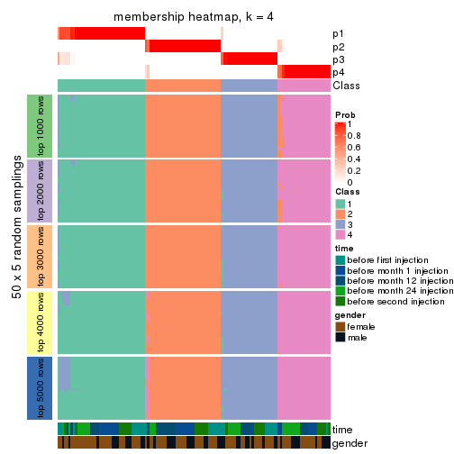</p>

</div>
<div id='tab-ATC-skmeans-membership-heatmap-4'>
<pre><code class="r">membership_heatmap(res, k = 5)
</code></pre>

<p></p>

</div>
<div id='tab-ATC-skmeans-membership-heatmap-5'>
<pre><code class="r">membership_heatmap(res, k = 6)
</code></pre>

<p></p>

</div>
</div>

As soon as we have had the classes for columns, we can look for signatures
which are significantly different between classes which can be candidate marks
for certain classes. Following are the heatmaps for signatures.


Signature heatmaps where rows are scaled:


<script>
$( function() {
	$( '#tabs-ATC-skmeans-get-signatures' ).tabs();
} );
</script>
<div id='tabs-ATC-skmeans-get-signatures'>
<ul>
<li><a href='#tab-ATC-skmeans-get-signatures-1'>k = 2</a></li>
<li><a href='#tab-ATC-skmeans-get-signatures-2'>k = 3</a></li>
<li><a href='#tab-ATC-skmeans-get-signatures-3'>k = 4</a></li>
<li><a href='#tab-ATC-skmeans-get-signatures-4'>k = 5</a></li>
<li><a href='#tab-ATC-skmeans-get-signatures-5'>k = 6</a></li>
</ul>
<div id='tab-ATC-skmeans-get-signatures-1'>
<pre><code class="r">get_signatures(res, k = 2)
</code></pre>

<p></p>

</div>
<div id='tab-ATC-skmeans-get-signatures-2'>
<pre><code class="r">get_signatures(res, k = 3)
</code></pre>

<p></p>

</div>
<div id='tab-ATC-skmeans-get-signatures-3'>
<pre><code class="r">get_signatures(res, k = 4)
</code></pre>

<p></p>

</div>
<div id='tab-ATC-skmeans-get-signatures-4'>
<pre><code class="r">get_signatures(res, k = 5)
</code></pre>

<p></p>

</div>
<div id='tab-ATC-skmeans-get-signatures-5'>
<pre><code class="r">get_signatures(res, k = 6)
</code></pre>

<p></p>

</div>
</div>


Signature heatmaps where rows are not scaled:


<script>
$( function() {
	$( '#tabs-ATC-skmeans-get-signatures-no-scale' ).tabs();
} );
</script>
<div id='tabs-ATC-skmeans-get-signatures-no-scale'>
<ul>
<li><a href='#tab-ATC-skmeans-get-signatures-no-scale-1'>k = 2</a></li>
<li><a href='#tab-ATC-skmeans-get-signatures-no-scale-2'>k = 3</a></li>
<li><a href='#tab-ATC-skmeans-get-signatures-no-scale-3'>k = 4</a></li>
<li><a href='#tab-ATC-skmeans-get-signatures-no-scale-4'>k = 5</a></li>
<li><a href='#tab-ATC-skmeans-get-signatures-no-scale-5'>k = 6</a></li>
</ul>
<div id='tab-ATC-skmeans-get-signatures-no-scale-1'>
<pre><code class="r">get_signatures(res, k = 2, scale_rows = FALSE)
</code></pre>

<p></p>

</div>
<div id='tab-ATC-skmeans-get-signatures-no-scale-2'>
<pre><code class="r">get_signatures(res, k = 3, scale_rows = FALSE)
</code></pre>

<p></p>

</div>
<div id='tab-ATC-skmeans-get-signatures-no-scale-3'>
<pre><code class="r">get_signatures(res, k = 4, scale_rows = FALSE)
</code></pre>

<p></p>

</div>
<div id='tab-ATC-skmeans-get-signatures-no-scale-4'>
<pre><code class="r">get_signatures(res, k = 5, scale_rows = FALSE)
</code></pre>

<p></p>

</div>
<div id='tab-ATC-skmeans-get-signatures-no-scale-5'>
<pre><code class="r">get_signatures(res, k = 6, scale_rows = FALSE)
</code></pre>

<p></p>

</div>
</div>


Compare the overlap of signatures from different k:

```r
compare_signatures(res)
```


`get_signature()` returns a data frame invisibly. TO get the list of signatures, the function
call should be assigned to a variable explicitly. In following code, if `plot` argument is set
to `FALSE`, no heatmap is plotted while only the differential analysis is performed.

```r
# code only for demonstration
tb = get_signature(res, k = ..., plot = FALSE)
```

An example of the output of `tb` is:

```
#>   which_row         fdr    mean_1    mean_2 scaled_mean_1 scaled_mean_2 km
#> 1        38 0.042760348  8.373488  9.131774    -0.5533452     0.5164555  1
#> 2        40 0.018707592  7.106213  8.469186    -0.6173731     0.5762149  1
#> 3        55 0.019134737 10.221463 11.207825    -0.6159697     0.5749050  1
#> 4        59 0.006059896  5.921854  7.869574    -0.6899429     0.6439467  1
#> 5        60 0.018055526  8.928898 10.211722    -0.6204761     0.5791110  1
#> 6        98 0.009384629 15.714769 14.887706     0.6635654    -0.6193277  2
...
```

The columns in `tb` are:

1. `which_row`: row indices corresponding to the input matrix.
2. `fdr`: FDR for the differential test. 
3. `mean_x`: The mean value in group x.
4. `scaled_mean_x`: The mean value in group x after rows are scaled.
5. `km`: Row groups if k-means clustering is applied to rows.


UMAP plot which shows how samples are separated.


<script>
$( function() {
	$( '#tabs-ATC-skmeans-dimension-reduction' ).tabs();
} );
</script>
<div id='tabs-ATC-skmeans-dimension-reduction'>
<ul>
<li><a href='#tab-ATC-skmeans-dimension-reduction-1'>k = 2</a></li>
<li><a href='#tab-ATC-skmeans-dimension-reduction-2'>k = 3</a></li>
<li><a href='#tab-ATC-skmeans-dimension-reduction-3'>k = 4</a></li>
<li><a href='#tab-ATC-skmeans-dimension-reduction-4'>k = 5</a></li>
<li><a href='#tab-ATC-skmeans-dimension-reduction-5'>k = 6</a></li>
</ul>
<div id='tab-ATC-skmeans-dimension-reduction-1'>
<pre><code class="r">dimension_reduction(res, k = 2, method = &quot;UMAP&quot;)
</code></pre>

<p></p>

</div>
<div id='tab-ATC-skmeans-dimension-reduction-2'>
<pre><code class="r">dimension_reduction(res, k = 3, method = &quot;UMAP&quot;)
</code></pre>

<p></p>

</div>
<div id='tab-ATC-skmeans-dimension-reduction-3'>
<pre><code class="r">dimension_reduction(res, k = 4, method = &quot;UMAP&quot;)
</code></pre>

<p></p>

</div>
<div id='tab-ATC-skmeans-dimension-reduction-4'>
<pre><code class="r">dimension_reduction(res, k = 5, method = &quot;UMAP&quot;)
</code></pre>

<p></p>

</div>
<div id='tab-ATC-skmeans-dimension-reduction-5'>
<pre><code class="r">dimension_reduction(res, k = 6, method = &quot;UMAP&quot;)
</code></pre>

<p></p>

</div>
</div>


Following heatmap shows how subgroups are split when increasing `k`:

```r
collect_classes(res)
```


Test correlation between subgroups and known annotations. If the known
annotation is numeric, one-way ANOVA test is applied, and if the known
annotation is discrete, chi-squared contingency table test is applied.

```r
test_to_known_factors(res)
```

```
#>               n time(p) gender(p) k
#> ATC:skmeans 125   0.293     0.399 2
#> ATC:skmeans 123   0.563     0.513 3
#> ATC:skmeans 124   0.294     0.645 4
#> ATC:skmeans 121   0.877     0.606 5
#> ATC:skmeans 121   0.892     0.498 6
```


If matrix rows can be associated to genes, consider to use `GO_Enrichment(res,
...)` to perform function enrichment for the signature genes.


 

---------------------------------------------------


### ATC:pam*


The object with results only for a single top-value method and a single partition method 
can be extracted as:

```r
res = res_list["ATC", "pam"]
# you can also extract it by
# res = res_list["ATC:pam"]
```

A summary of `res` and all the functions that can be applied to it:

```r
res
```

```
#> A 'ConsensusPartition' object with k = 2, 3, 4, 5, 6.
#>   On a matrix with 21168 rows and 125 columns.
#>   Top rows (1000, 2000, 3000, 4000, 5000) are extracted by 'ATC' method.
#>   Subgroups are detected by 'pam' method.
#>   Performed in total 1250 partitions by row resampling.
#>   Best k for subgroups seems to be 6.
#> 
#> Following methods can be applied to this 'ConsensusPartition' object:
#>  [1] "cola_report"             "collect_classes"         "collect_plots"          
#>  [4] "collect_stats"           "colnames"                "compare_signatures"     
#>  [7] "consensus_heatmap"       "dimension_reduction"     "functional_enrichment"  
#> [10] "get_anno_col"            "get_anno"                "get_classes"            
#> [13] "get_consensus"           "get_matrix"              "get_membership"         
#> [16] "get_param"               "get_signatures"          "get_stats"              
#> [19] "is_best_k"               "is_stable_k"             "membership_heatmap"     
#> [22] "ncol"                    "nrow"                    "plot_ecdf"              
#> [25] "rownames"                "select_partition_number" "show"                   
#> [28] "suggest_best_k"          "test_to_known_factors"
```

`collect_plots()` function collects all the plots made from `res` for all `k` (number of partitions)
into one single page to provide an easy and fast comparison between different `k`.

```r
collect_plots(res)
```


The plots are:

- The first row: a plot of the ECDF (Empirical cumulative distribution
  function) curves of the consensus matrix for each `k` and the heatmap of
  predicted classes for each `k`.
- The second row: heatmaps of the consensus matrix for each `k`.
- The third row: heatmaps of the membership matrix for each `k`.
- The fouth row: heatmaps of the signatures for each `k`.

All the plots in panels can be made by individual functions and they are
plotted later in this section.

`select_partition_number()` produces several plots showing different
statistics for choosing "optimized" `k`. There are following statistics:

- ECDF curves of the consensus matrix for each `k`;
- 1-PAC. [The PAC
  score](https://en.wikipedia.org/wiki/Consensus_clustering#Over-interpretation_potential_of_consensus_clustering)
  measures the proportion of the ambiguous subgrouping.
- Mean silhouette score.
- Concordance. The mean probability of fiting the consensus class ids in all
  partitions.
- Area increased. Denote $A_k$ as the area under the ECDF curve for current
  `k`, the area increased is defined as $A_k - A_{k-1}$.
- Rand index. The percent of pairs of samples that are both in a same cluster
  or both are not in a same cluster in the partition of k and k-1.
- Jaccard index. The ratio of pairs of samples are both in a same cluster in
  the partition of k and k-1 and the pairs of samples are both in a same
  cluster in the partition k or k-1.

The detailed explanations of these statistics can be found in [the cola
vignette](http://bioconductor.org/packages/devel/bioc/vignettes/cola/inst/doc/cola.html#toc_13).

Generally speaking, lower PAC score, higher mean silhouette score or higher
concordance corresponds to better partition. Rand index and Jaccard index
measure how similar the current partition is compared to partition with `k-1`.
If they are too similar, we won't accept `k` is better than `k-1`.

```r
select_partition_number(res)
```


The numeric values for all these statistics can be obtained by `get_stats()`.

```r
get_stats(res)
```

```
#>   k 1-PAC mean_silhouette concordance area_increased  Rand Jaccard
#> 2 2 1.000           0.965       0.981         0.5021 0.498   0.498
#> 3 3 0.724           0.843       0.899         0.2198 0.898   0.797
#> 4 4 0.630           0.524       0.768         0.1629 0.795   0.539
#> 5 5 0.786           0.836       0.845         0.0958 0.850   0.541
#> 6 6 0.917           0.909       0.951         0.0660 0.897   0.585
```

`suggest_best_k()` suggests the best $k$ based on these statistics. The rules are as follows:

- All $k$ with Jaccard index larger than 0.95 are removed because the increase of
  the partition number does not provides enough extra information. If all $k$ are removed,
  the best $k$ is assigned by `NA`.
- For $k$ with 1-PAC larger than 0.9, the maximal $k$ is taken as the "best k". Other $k$ is called "optional k".
- If it does not fit the second rule. The $k$ with the highest vote of highest
  1-PAC, mean silhouette and concordance is taken as the "best k".

```r
suggest_best_k(res)
```

```
#> [1] 6
#> attr(,"optional")
#> [1] 2
```

There is also optional best $k$ = 2 that is worth to check.

Following shows the table of the partitions (You need to click the **show/hide
code output** link to see it). The membership matrix (columns with name `p*`)
is inferred by
[`clue::cl_consensus()`](https://www.rdocumentation.org/link/cl_consensus?package=clue)
function with the `SE` method. Basically the value in the membership matrix
represents the probability to belong to a certain group. The finall class
label for an item is determined with the group with highest probability it
belongs to.

In `get_classes()` function, the entropy is calculated from the membership
matrix and the silhouette score is calculated from the consensus matrix.


<script>
$( function() {
	$( '#tabs-ATC-pam-get-classes' ).tabs();
} );
</script>
<div id='tabs-ATC-pam-get-classes'>
<ul>
<li><a href='#tab-ATC-pam-get-classes-1'>k = 2</a></li>
<li><a href='#tab-ATC-pam-get-classes-2'>k = 3</a></li>
<li><a href='#tab-ATC-pam-get-classes-3'>k = 4</a></li>
<li><a href='#tab-ATC-pam-get-classes-4'>k = 5</a></li>
<li><a href='#tab-ATC-pam-get-classes-5'>k = 6</a></li>
</ul>

<div id='tab-ATC-pam-get-classes-1'>
<p><a id='tab-ATC-pam-get-classes-1-a' style='color:#0366d6' href='#'>show/hide code output</a></p>
<pre><code class="r">cbind(get_classes(res, k = 2), get_membership(res, k = 2))
</code></pre>

<pre><code>#&gt;           class entropy silhouette    p1    p2
#&gt; GSM601752     2  0.2423      0.955 0.040 0.960
#&gt; GSM601782     1  0.2423      0.967 0.960 0.040
#&gt; GSM601792     1  0.0000      0.979 1.000 0.000
#&gt; GSM601797     1  0.0000      0.979 1.000 0.000
#&gt; GSM601827     1  0.0000      0.979 1.000 0.000
#&gt; GSM601837     2  0.0000      0.982 0.000 1.000
#&gt; GSM601842     2  0.0000      0.982 0.000 1.000
#&gt; GSM601857     1  0.2423      0.967 0.960 0.040
#&gt; GSM601867     1  0.2423      0.967 0.960 0.040
#&gt; GSM601747     1  0.4815      0.906 0.896 0.104
#&gt; GSM601757     1  0.0000      0.979 1.000 0.000
#&gt; GSM601762     2  0.0000      0.982 0.000 1.000
#&gt; GSM601767     2  0.0000      0.982 0.000 1.000
#&gt; GSM601772     2  0.0000      0.982 0.000 1.000
#&gt; GSM601777     1  0.0000      0.979 1.000 0.000
#&gt; GSM601787     1  0.2423      0.967 0.960 0.040
#&gt; GSM601802     2  0.0000      0.982 0.000 1.000
#&gt; GSM601807     1  0.2423      0.967 0.960 0.040
#&gt; GSM601812     1  0.2236      0.968 0.964 0.036
#&gt; GSM601817     1  0.2423      0.967 0.960 0.040
#&gt; GSM601822     1  0.0000      0.979 1.000 0.000
#&gt; GSM601832     2  0.0000      0.982 0.000 1.000
#&gt; GSM601847     1  0.0000      0.979 1.000 0.000
#&gt; GSM601852     1  0.0000      0.979 1.000 0.000
#&gt; GSM601862     1  0.2423      0.967 0.960 0.040
#&gt; GSM601753     2  0.0000      0.982 0.000 1.000
#&gt; GSM601783     1  0.0000      0.979 1.000 0.000
#&gt; GSM601793     1  0.0000      0.979 1.000 0.000
#&gt; GSM601798     2  0.0000      0.982 0.000 1.000
#&gt; GSM601828     1  0.0000      0.979 1.000 0.000
#&gt; GSM601838     2  0.0000      0.982 0.000 1.000
#&gt; GSM601843     2  0.0000      0.982 0.000 1.000
#&gt; GSM601858     2  0.0000      0.982 0.000 1.000
#&gt; GSM601868     1  0.2423      0.967 0.960 0.040
#&gt; GSM601748     1  0.0000      0.979 1.000 0.000
#&gt; GSM601758     1  0.0000      0.979 1.000 0.000
#&gt; GSM601763     2  0.2423      0.955 0.040 0.960
#&gt; GSM601768     2  0.0000      0.982 0.000 1.000
#&gt; GSM601773     2  0.0000      0.982 0.000 1.000
#&gt; GSM601778     1  0.0000      0.979 1.000 0.000
#&gt; GSM601788     2  0.0000      0.982 0.000 1.000
#&gt; GSM601803     2  0.0000      0.982 0.000 1.000
#&gt; GSM601808     1  0.2423      0.967 0.960 0.040
#&gt; GSM601813     1  0.0000      0.979 1.000 0.000
#&gt; GSM601818     1  0.2423      0.967 0.960 0.040
#&gt; GSM601823     2  0.2423      0.955 0.040 0.960
#&gt; GSM601833     2  0.0000      0.982 0.000 1.000
#&gt; GSM601848     1  0.0000      0.979 1.000 0.000
#&gt; GSM601853     1  0.0000      0.979 1.000 0.000
#&gt; GSM601863     1  0.0000      0.979 1.000 0.000
#&gt; GSM601754     2  0.0000      0.982 0.000 1.000
#&gt; GSM601784     2  0.0000      0.982 0.000 1.000
#&gt; GSM601794     1  0.0000      0.979 1.000 0.000
#&gt; GSM601799     2  0.2423      0.955 0.040 0.960
#&gt; GSM601829     1  0.0000      0.979 1.000 0.000
#&gt; GSM601839     2  0.0000      0.982 0.000 1.000
#&gt; GSM601844     1  0.8555      0.600 0.720 0.280
#&gt; GSM601859     2  0.0000      0.982 0.000 1.000
#&gt; GSM601869     1  0.0000      0.979 1.000 0.000
#&gt; GSM601749     1  0.0000      0.979 1.000 0.000
#&gt; GSM601759     1  0.0000      0.979 1.000 0.000
#&gt; GSM601764     2  0.2423      0.955 0.040 0.960
#&gt; GSM601769     2  0.0000      0.982 0.000 1.000
#&gt; GSM601774     2  0.0000      0.982 0.000 1.000
#&gt; GSM601779     1  0.0000      0.979 1.000 0.000
#&gt; GSM601789     2  0.0000      0.982 0.000 1.000
#&gt; GSM601804     2  0.2423      0.955 0.040 0.960
#&gt; GSM601809     1  0.2423      0.967 0.960 0.040
#&gt; GSM601814     2  0.0000      0.982 0.000 1.000
#&gt; GSM601819     1  0.0000      0.979 1.000 0.000
#&gt; GSM601824     2  0.2423      0.955 0.040 0.960
#&gt; GSM601834     2  0.0000      0.982 0.000 1.000
#&gt; GSM601849     1  0.0000      0.979 1.000 0.000
#&gt; GSM601854     1  0.0000      0.979 1.000 0.000
#&gt; GSM601864     2  0.9393      0.427 0.356 0.644
#&gt; GSM601755     2  0.0000      0.982 0.000 1.000
#&gt; GSM601785     2  0.0000      0.982 0.000 1.000
#&gt; GSM601795     1  0.0938      0.973 0.988 0.012
#&gt; GSM601800     2  0.0000      0.982 0.000 1.000
#&gt; GSM601830     1  0.3114      0.955 0.944 0.056
#&gt; GSM601840     2  0.0000      0.982 0.000 1.000
#&gt; GSM601845     2  0.2423      0.955 0.040 0.960
#&gt; GSM601860     2  0.0000      0.982 0.000 1.000
#&gt; GSM601870     1  0.3114      0.955 0.944 0.056
#&gt; GSM601750     1  0.0000      0.979 1.000 0.000
#&gt; GSM601760     1  0.0000      0.979 1.000 0.000
#&gt; GSM601765     2  0.0000      0.982 0.000 1.000
#&gt; GSM601770     2  0.0000      0.982 0.000 1.000
#&gt; GSM601775     2  0.0000      0.982 0.000 1.000
#&gt; GSM601780     1  0.0000      0.979 1.000 0.000
#&gt; GSM601790     2  0.0000      0.982 0.000 1.000
#&gt; GSM601805     2  0.0000      0.982 0.000 1.000
#&gt; GSM601810     1  0.2423      0.967 0.960 0.040
#&gt; GSM601815     2  0.0000      0.982 0.000 1.000
#&gt; GSM601820     1  0.1184      0.975 0.984 0.016
#&gt; GSM601825     2  0.0000      0.982 0.000 1.000
#&gt; GSM601835     2  0.0000      0.982 0.000 1.000
#&gt; GSM601850     1  0.0000      0.979 1.000 0.000
#&gt; GSM601855     1  0.2423      0.967 0.960 0.040
#&gt; GSM601865     1  0.3274      0.952 0.940 0.060
#&gt; GSM601756     2  0.0000      0.982 0.000 1.000
#&gt; GSM601786     2  0.0000      0.982 0.000 1.000
#&gt; GSM601796     1  0.0000      0.979 1.000 0.000
#&gt; GSM601801     2  0.0000      0.982 0.000 1.000
#&gt; GSM601831     1  0.0000      0.979 1.000 0.000
#&gt; GSM601841     1  0.2423      0.967 0.960 0.040
#&gt; GSM601846     2  0.2423      0.955 0.040 0.960
#&gt; GSM601861     2  0.0000      0.982 0.000 1.000
#&gt; GSM601871     1  0.2423      0.967 0.960 0.040
#&gt; GSM601751     2  0.0000      0.982 0.000 1.000
#&gt; GSM601761     1  0.0000      0.979 1.000 0.000
#&gt; GSM601766     2  0.0000      0.982 0.000 1.000
#&gt; GSM601771     2  0.8207      0.644 0.256 0.744
#&gt; GSM601776     1  0.0000      0.979 1.000 0.000
#&gt; GSM601781     1  0.0000      0.979 1.000 0.000
#&gt; GSM601791     1  0.0000      0.979 1.000 0.000
#&gt; GSM601806     2  0.0000      0.982 0.000 1.000
#&gt; GSM601811     1  0.2423      0.967 0.960 0.040
#&gt; GSM601816     1  0.0000      0.979 1.000 0.000
#&gt; GSM601821     2  0.0000      0.982 0.000 1.000
#&gt; GSM601826     1  0.0000      0.979 1.000 0.000
#&gt; GSM601836     2  0.1843      0.963 0.028 0.972
#&gt; GSM601851     1  0.0000      0.979 1.000 0.000
#&gt; GSM601856     1  0.2423      0.967 0.960 0.040
#&gt; GSM601866     1  0.2423      0.967 0.960 0.040
</code></pre>

<script>
$('#tab-ATC-pam-get-classes-1-a').parent().next().next().hide();
$('#tab-ATC-pam-get-classes-1-a').click(function(){
  $('#tab-ATC-pam-get-classes-1-a').parent().next().next().toggle();
  return(false);
});
</script>
</div>

<div id='tab-ATC-pam-get-classes-2'>
<p><a id='tab-ATC-pam-get-classes-2-a' style='color:#0366d6' href='#'>show/hide code output</a></p>
<pre><code class="r">cbind(get_classes(res, k = 3), get_membership(res, k = 3))
</code></pre>

<pre><code>#&gt;           class entropy silhouette    p1    p2    p3
#&gt; GSM601752     2  0.6336      0.672 0.180 0.756 0.064
#&gt; GSM601782     1  0.0000      0.888 1.000 0.000 0.000
#&gt; GSM601792     1  0.0000      0.888 1.000 0.000 0.000
#&gt; GSM601797     1  0.1399      0.873 0.968 0.004 0.028
#&gt; GSM601827     1  0.0000      0.888 1.000 0.000 0.000
#&gt; GSM601837     3  0.5138      0.822 0.000 0.252 0.748
#&gt; GSM601842     2  0.0237      0.931 0.000 0.996 0.004
#&gt; GSM601857     1  0.4346      0.834 0.816 0.000 0.184
#&gt; GSM601867     1  0.6140      0.607 0.596 0.000 0.404
#&gt; GSM601747     1  0.0237      0.887 0.996 0.004 0.000
#&gt; GSM601757     1  0.0000      0.888 1.000 0.000 0.000
#&gt; GSM601762     2  0.0237      0.931 0.000 0.996 0.004
#&gt; GSM601767     2  0.0237      0.931 0.000 0.996 0.004
#&gt; GSM601772     2  0.0237      0.931 0.000 0.996 0.004
#&gt; GSM601777     1  0.4605      0.825 0.796 0.000 0.204
#&gt; GSM601787     1  0.6252      0.535 0.556 0.000 0.444
#&gt; GSM601802     2  0.2165      0.916 0.000 0.936 0.064
#&gt; GSM601807     1  0.6140      0.607 0.596 0.000 0.404
#&gt; GSM601812     1  0.4002      0.844 0.840 0.000 0.160
#&gt; GSM601817     1  0.4654      0.693 0.792 0.208 0.000
#&gt; GSM601822     1  0.1399      0.873 0.968 0.004 0.028
#&gt; GSM601832     2  0.0237      0.931 0.000 0.996 0.004
#&gt; GSM601847     1  0.1399      0.873 0.968 0.004 0.028
#&gt; GSM601852     1  0.0000      0.888 1.000 0.000 0.000
#&gt; GSM601862     1  0.4842      0.812 0.776 0.000 0.224
#&gt; GSM601753     2  0.1163      0.925 0.000 0.972 0.028
#&gt; GSM601783     1  0.0000      0.888 1.000 0.000 0.000
#&gt; GSM601793     1  0.0000      0.888 1.000 0.000 0.000
#&gt; GSM601798     2  0.2584      0.913 0.008 0.928 0.064
#&gt; GSM601828     1  0.0000      0.888 1.000 0.000 0.000
#&gt; GSM601838     3  0.5138      0.822 0.000 0.252 0.748
#&gt; GSM601843     2  0.0237      0.931 0.000 0.996 0.004
#&gt; GSM601858     2  0.2165      0.916 0.000 0.936 0.064
#&gt; GSM601868     1  0.4842      0.812 0.776 0.000 0.224
#&gt; GSM601748     1  0.0000      0.888 1.000 0.000 0.000
#&gt; GSM601758     1  0.0000      0.888 1.000 0.000 0.000
#&gt; GSM601763     2  0.0237      0.931 0.000 0.996 0.004
#&gt; GSM601768     2  0.0237      0.931 0.000 0.996 0.004
#&gt; GSM601773     2  0.0237      0.931 0.000 0.996 0.004
#&gt; GSM601778     1  0.1399      0.873 0.968 0.004 0.028
#&gt; GSM601788     2  0.2165      0.916 0.000 0.936 0.064
#&gt; GSM601803     2  0.4887      0.689 0.000 0.772 0.228
#&gt; GSM601808     1  0.4842      0.812 0.776 0.000 0.224
#&gt; GSM601813     1  0.4002      0.844 0.840 0.000 0.160
#&gt; GSM601818     1  0.4002      0.844 0.840 0.000 0.160
#&gt; GSM601823     2  0.6301      0.549 0.260 0.712 0.028
#&gt; GSM601833     2  0.0237      0.931 0.000 0.996 0.004
#&gt; GSM601848     1  0.0592      0.883 0.988 0.000 0.012
#&gt; GSM601853     1  0.4291      0.835 0.820 0.000 0.180
#&gt; GSM601863     1  0.4842      0.812 0.776 0.000 0.224
#&gt; GSM601754     2  0.2902      0.908 0.016 0.920 0.064
#&gt; GSM601784     2  0.0237      0.931 0.000 0.996 0.004
#&gt; GSM601794     1  0.0424      0.885 0.992 0.000 0.008
#&gt; GSM601799     2  0.1399      0.924 0.004 0.968 0.028
#&gt; GSM601829     1  0.0000      0.888 1.000 0.000 0.000
#&gt; GSM601839     3  0.5138      0.822 0.000 0.252 0.748
#&gt; GSM601844     1  0.2187      0.859 0.948 0.024 0.028
#&gt; GSM601859     2  0.0237      0.931 0.000 0.996 0.004
#&gt; GSM601869     1  0.4842      0.812 0.776 0.000 0.224
#&gt; GSM601749     1  0.0000      0.888 1.000 0.000 0.000
#&gt; GSM601759     1  0.0000      0.888 1.000 0.000 0.000
#&gt; GSM601764     2  0.0983      0.924 0.016 0.980 0.004
#&gt; GSM601769     2  0.0424      0.929 0.000 0.992 0.008
#&gt; GSM601774     2  0.0237      0.931 0.000 0.996 0.004
#&gt; GSM601779     1  0.1399      0.873 0.968 0.004 0.028
#&gt; GSM601789     2  0.4887      0.647 0.000 0.772 0.228
#&gt; GSM601804     2  0.6119      0.700 0.164 0.772 0.064
#&gt; GSM601809     1  0.5465      0.758 0.712 0.000 0.288
#&gt; GSM601814     3  0.5497      0.779 0.000 0.292 0.708
#&gt; GSM601819     1  0.0000      0.888 1.000 0.000 0.000
#&gt; GSM601824     2  0.4249      0.800 0.108 0.864 0.028
#&gt; GSM601834     2  0.0237      0.931 0.000 0.996 0.004
#&gt; GSM601849     1  0.0000      0.888 1.000 0.000 0.000
#&gt; GSM601854     1  0.0000      0.888 1.000 0.000 0.000
#&gt; GSM601864     3  0.0237      0.711 0.000 0.004 0.996
#&gt; GSM601755     2  0.2165      0.916 0.000 0.936 0.064
#&gt; GSM601785     2  0.0237      0.931 0.000 0.996 0.004
#&gt; GSM601795     1  0.5292      0.683 0.800 0.172 0.028
#&gt; GSM601800     2  0.2584      0.913 0.008 0.928 0.064
#&gt; GSM601830     1  0.8543      0.546 0.604 0.236 0.160
#&gt; GSM601840     2  0.2165      0.916 0.000 0.936 0.064
#&gt; GSM601845     2  0.1905      0.918 0.016 0.956 0.028
#&gt; GSM601860     2  0.2165      0.916 0.000 0.936 0.064
#&gt; GSM601870     3  0.2261      0.655 0.068 0.000 0.932
#&gt; GSM601750     1  0.0000      0.888 1.000 0.000 0.000
#&gt; GSM601760     1  0.0000      0.888 1.000 0.000 0.000
#&gt; GSM601765     2  0.0237      0.931 0.000 0.996 0.004
#&gt; GSM601770     2  0.0237      0.931 0.000 0.996 0.004
#&gt; GSM601775     2  0.0237      0.931 0.000 0.996 0.004
#&gt; GSM601780     1  0.0000      0.888 1.000 0.000 0.000
#&gt; GSM601790     3  0.5138      0.822 0.000 0.252 0.748
#&gt; GSM601805     2  0.2400      0.915 0.004 0.932 0.064
#&gt; GSM601810     1  0.4842      0.812 0.776 0.000 0.224
#&gt; GSM601815     3  0.5138      0.822 0.000 0.252 0.748
#&gt; GSM601820     1  0.4062      0.842 0.836 0.000 0.164
#&gt; GSM601825     2  0.0237      0.931 0.000 0.996 0.004
#&gt; GSM601835     2  0.0237      0.931 0.000 0.996 0.004
#&gt; GSM601850     1  0.1399      0.873 0.968 0.004 0.028
#&gt; GSM601855     1  0.6126      0.613 0.600 0.000 0.400
#&gt; GSM601865     3  0.1289      0.695 0.032 0.000 0.968
#&gt; GSM601756     2  0.2711      0.900 0.000 0.912 0.088
#&gt; GSM601786     3  0.4702      0.805 0.000 0.212 0.788
#&gt; GSM601796     1  0.0000      0.888 1.000 0.000 0.000
#&gt; GSM601801     2  0.2448      0.909 0.000 0.924 0.076
#&gt; GSM601831     1  0.4002      0.844 0.840 0.000 0.160
#&gt; GSM601841     1  0.4842      0.812 0.776 0.000 0.224
#&gt; GSM601846     2  0.1905      0.918 0.016 0.956 0.028
#&gt; GSM601861     3  0.5138      0.822 0.000 0.252 0.748
#&gt; GSM601871     3  0.5327      0.270 0.272 0.000 0.728
#&gt; GSM601751     2  0.2165      0.916 0.000 0.936 0.064
#&gt; GSM601761     1  0.0000      0.888 1.000 0.000 0.000
#&gt; GSM601766     2  0.0237      0.931 0.000 0.996 0.004
#&gt; GSM601771     3  0.7208      0.684 0.048 0.308 0.644
#&gt; GSM601776     1  0.0000      0.888 1.000 0.000 0.000
#&gt; GSM601781     1  0.3116      0.864 0.892 0.000 0.108
#&gt; GSM601791     1  0.0000      0.888 1.000 0.000 0.000
#&gt; GSM601806     3  0.6154      0.501 0.000 0.408 0.592
#&gt; GSM601811     1  0.5254      0.781 0.736 0.000 0.264
#&gt; GSM601816     1  0.0000      0.888 1.000 0.000 0.000
#&gt; GSM601821     3  0.5138      0.822 0.000 0.252 0.748
#&gt; GSM601826     1  0.1399      0.873 0.968 0.004 0.028
#&gt; GSM601836     2  0.1905      0.918 0.016 0.956 0.028
#&gt; GSM601851     1  0.1399      0.873 0.968 0.004 0.028
#&gt; GSM601856     1  0.4291      0.835 0.820 0.000 0.180
#&gt; GSM601866     1  0.4842      0.812 0.776 0.000 0.224
</code></pre>

<script>
$('#tab-ATC-pam-get-classes-2-a').parent().next().next().hide();
$('#tab-ATC-pam-get-classes-2-a').click(function(){
  $('#tab-ATC-pam-get-classes-2-a').parent().next().next().toggle();
  return(false);
});
</script>
</div>

<div id='tab-ATC-pam-get-classes-3'>
<p><a id='tab-ATC-pam-get-classes-3-a' style='color:#0366d6' href='#'>show/hide code output</a></p>
<pre><code class="r">cbind(get_classes(res, k = 4), get_membership(res, k = 4))
</code></pre>

<pre><code>#&gt;           class entropy silhouette    p1    p2    p3    p4
#&gt; GSM601752     4  0.6886     0.2723 0.200 0.204 0.000 0.596
#&gt; GSM601782     1  0.0336     0.7298 0.992 0.000 0.008 0.000
#&gt; GSM601792     1  0.2216     0.6938 0.908 0.000 0.000 0.092
#&gt; GSM601797     1  0.4543     0.5113 0.676 0.000 0.000 0.324
#&gt; GSM601827     1  0.0000     0.7357 1.000 0.000 0.000 0.000
#&gt; GSM601837     4  0.5592     0.4956 0.000 0.044 0.300 0.656
#&gt; GSM601842     2  0.0000     0.7891 0.000 1.000 0.000 0.000
#&gt; GSM601857     1  0.4998    -0.4313 0.512 0.000 0.488 0.000
#&gt; GSM601867     3  0.4040     0.8338 0.248 0.000 0.752 0.000
#&gt; GSM601747     1  0.0469     0.7322 0.988 0.000 0.000 0.012
#&gt; GSM601757     1  0.1637     0.7120 0.940 0.000 0.000 0.060
#&gt; GSM601762     2  0.0000     0.7891 0.000 1.000 0.000 0.000
#&gt; GSM601767     2  0.0000     0.7891 0.000 1.000 0.000 0.000
#&gt; GSM601772     2  0.0336     0.7808 0.000 0.992 0.000 0.008
#&gt; GSM601777     3  0.5856     0.5933 0.408 0.000 0.556 0.036
#&gt; GSM601787     3  0.4008     0.8308 0.244 0.000 0.756 0.000
#&gt; GSM601802     4  0.4866     0.3042 0.000 0.404 0.000 0.596
#&gt; GSM601807     3  0.4040     0.8338 0.248 0.000 0.752 0.000
#&gt; GSM601812     1  0.4855    -0.1432 0.600 0.000 0.400 0.000
#&gt; GSM601817     1  0.3266     0.5686 0.832 0.168 0.000 0.000
#&gt; GSM601822     1  0.3528     0.6260 0.808 0.000 0.000 0.192
#&gt; GSM601832     2  0.0000     0.7891 0.000 1.000 0.000 0.000
#&gt; GSM601847     1  0.4643     0.4769 0.656 0.000 0.000 0.344
#&gt; GSM601852     1  0.0000     0.7357 1.000 0.000 0.000 0.000
#&gt; GSM601862     3  0.4406     0.8479 0.300 0.000 0.700 0.000
#&gt; GSM601753     4  0.5000     0.0623 0.000 0.496 0.000 0.504
#&gt; GSM601783     1  0.0000     0.7357 1.000 0.000 0.000 0.000
#&gt; GSM601793     1  0.0188     0.7347 0.996 0.000 0.000 0.004
#&gt; GSM601798     4  0.4866     0.3042 0.000 0.404 0.000 0.596
#&gt; GSM601828     1  0.0000     0.7357 1.000 0.000 0.000 0.000
#&gt; GSM601838     4  0.5592     0.4956 0.000 0.044 0.300 0.656
#&gt; GSM601843     2  0.0000     0.7891 0.000 1.000 0.000 0.000
#&gt; GSM601858     4  0.4866     0.3042 0.000 0.404 0.000 0.596
#&gt; GSM601868     3  0.4406     0.8479 0.300 0.000 0.700 0.000
#&gt; GSM601748     1  0.0000     0.7357 1.000 0.000 0.000 0.000
#&gt; GSM601758     1  0.0000     0.7357 1.000 0.000 0.000 0.000
#&gt; GSM601763     2  0.0000     0.7891 0.000 1.000 0.000 0.000
#&gt; GSM601768     2  0.0000     0.7891 0.000 1.000 0.000 0.000
#&gt; GSM601773     2  0.0000     0.7891 0.000 1.000 0.000 0.000
#&gt; GSM601778     1  0.2593     0.6852 0.892 0.000 0.004 0.104
#&gt; GSM601788     4  0.4866     0.3042 0.000 0.404 0.000 0.596
#&gt; GSM601803     4  0.4990     0.3378 0.000 0.352 0.008 0.640
#&gt; GSM601808     3  0.4406     0.8479 0.300 0.000 0.700 0.000
#&gt; GSM601813     1  0.4866    -0.1564 0.596 0.000 0.404 0.000
#&gt; GSM601818     1  0.4866    -0.1564 0.596 0.000 0.404 0.000
#&gt; GSM601823     1  0.7239     0.1581 0.500 0.156 0.000 0.344
#&gt; GSM601833     2  0.0000     0.7891 0.000 1.000 0.000 0.000
#&gt; GSM601848     1  0.0000     0.7357 1.000 0.000 0.000 0.000
#&gt; GSM601853     1  0.4933    -0.2528 0.568 0.000 0.432 0.000
#&gt; GSM601863     3  0.4406     0.8479 0.300 0.000 0.700 0.000
#&gt; GSM601754     4  0.4866     0.3042 0.000 0.404 0.000 0.596
#&gt; GSM601784     2  0.0000     0.7891 0.000 1.000 0.000 0.000
#&gt; GSM601794     1  0.2216     0.6938 0.908 0.000 0.000 0.092
#&gt; GSM601799     2  0.4431     0.4037 0.000 0.696 0.000 0.304
#&gt; GSM601829     1  0.1557     0.7148 0.944 0.000 0.000 0.056
#&gt; GSM601839     4  0.5592     0.4956 0.000 0.044 0.300 0.656
#&gt; GSM601844     1  0.4040     0.5696 0.752 0.000 0.000 0.248
#&gt; GSM601859     2  0.0000     0.7891 0.000 1.000 0.000 0.000
#&gt; GSM601869     3  0.4406     0.8479 0.300 0.000 0.700 0.000
#&gt; GSM601749     1  0.0000     0.7357 1.000 0.000 0.000 0.000
#&gt; GSM601759     1  0.0000     0.7357 1.000 0.000 0.000 0.000
#&gt; GSM601764     2  0.7474     0.1737 0.212 0.496 0.000 0.292
#&gt; GSM601769     2  0.0188     0.7846 0.000 0.996 0.000 0.004
#&gt; GSM601774     2  0.0000     0.7891 0.000 1.000 0.000 0.000
#&gt; GSM601779     1  0.4356     0.5437 0.708 0.000 0.000 0.292
#&gt; GSM601789     2  0.7700    -0.1458 0.000 0.448 0.248 0.304
#&gt; GSM601804     1  0.7646    -0.0918 0.408 0.208 0.000 0.384
#&gt; GSM601809     3  0.4382     0.8475 0.296 0.000 0.704 0.000
#&gt; GSM601814     4  0.6112     0.4863 0.000 0.096 0.248 0.656
#&gt; GSM601819     1  0.0000     0.7357 1.000 0.000 0.000 0.000
#&gt; GSM601824     2  0.7792     0.0762 0.256 0.412 0.000 0.332
#&gt; GSM601834     2  0.0000     0.7891 0.000 1.000 0.000 0.000
#&gt; GSM601849     1  0.0592     0.7308 0.984 0.000 0.000 0.016
#&gt; GSM601854     1  0.0000     0.7357 1.000 0.000 0.000 0.000
#&gt; GSM601864     4  0.4697     0.4472 0.000 0.000 0.356 0.644
#&gt; GSM601755     4  0.4866     0.3042 0.000 0.404 0.000 0.596
#&gt; GSM601785     2  0.0000     0.7891 0.000 1.000 0.000 0.000
#&gt; GSM601795     1  0.5130     0.4741 0.652 0.016 0.000 0.332
#&gt; GSM601800     4  0.4866     0.3042 0.000 0.404 0.000 0.596
#&gt; GSM601830     1  0.6568    -0.3380 0.512 0.080 0.408 0.000
#&gt; GSM601840     2  0.4981     0.0289 0.000 0.536 0.000 0.464
#&gt; GSM601845     2  0.7621     0.1028 0.212 0.444 0.000 0.344
#&gt; GSM601860     2  0.4830     0.2368 0.000 0.608 0.000 0.392
#&gt; GSM601870     3  0.0000     0.5436 0.000 0.000 1.000 0.000
#&gt; GSM601750     1  0.0000     0.7357 1.000 0.000 0.000 0.000
#&gt; GSM601760     1  0.0000     0.7357 1.000 0.000 0.000 0.000
#&gt; GSM601765     2  0.0000     0.7891 0.000 1.000 0.000 0.000
#&gt; GSM601770     2  0.0000     0.7891 0.000 1.000 0.000 0.000
#&gt; GSM601775     2  0.0000     0.7891 0.000 1.000 0.000 0.000
#&gt; GSM601780     1  0.0000     0.7357 1.000 0.000 0.000 0.000
#&gt; GSM601790     4  0.5592     0.4956 0.000 0.044 0.300 0.656
#&gt; GSM601805     4  0.4866     0.3042 0.000 0.404 0.000 0.596
#&gt; GSM601810     3  0.4406     0.8479 0.300 0.000 0.700 0.000
#&gt; GSM601815     4  0.5592     0.4956 0.000 0.044 0.300 0.656
#&gt; GSM601820     1  0.4866    -0.1565 0.596 0.000 0.404 0.000
#&gt; GSM601825     2  0.0000     0.7891 0.000 1.000 0.000 0.000
#&gt; GSM601835     2  0.0000     0.7891 0.000 1.000 0.000 0.000
#&gt; GSM601850     1  0.4605     0.4899 0.664 0.000 0.000 0.336
#&gt; GSM601855     3  0.4040     0.8338 0.248 0.000 0.752 0.000
#&gt; GSM601865     3  0.4961    -0.1538 0.000 0.000 0.552 0.448
#&gt; GSM601756     4  0.4730     0.3338 0.000 0.364 0.000 0.636
#&gt; GSM601786     4  0.4406     0.4953 0.000 0.000 0.300 0.700
#&gt; GSM601796     1  0.0000     0.7357 1.000 0.000 0.000 0.000
#&gt; GSM601801     4  0.6130     0.3008 0.000 0.400 0.052 0.548
#&gt; GSM601831     1  0.4866    -0.1564 0.596 0.000 0.404 0.000
#&gt; GSM601841     3  0.4746     0.7439 0.368 0.000 0.632 0.000
#&gt; GSM601846     2  0.7621     0.1028 0.212 0.444 0.000 0.344
#&gt; GSM601861     4  0.5745     0.4966 0.000 0.056 0.288 0.656
#&gt; GSM601871     3  0.1940     0.6681 0.076 0.000 0.924 0.000
#&gt; GSM601751     4  0.4866     0.3042 0.000 0.404 0.000 0.596
#&gt; GSM601761     1  0.0000     0.7357 1.000 0.000 0.000 0.000
#&gt; GSM601766     2  0.0000     0.7891 0.000 1.000 0.000 0.000
#&gt; GSM601771     4  0.0524     0.4721 0.008 0.004 0.000 0.988
#&gt; GSM601776     1  0.0000     0.7357 1.000 0.000 0.000 0.000
#&gt; GSM601781     1  0.4916    -0.2058 0.576 0.000 0.424 0.000
#&gt; GSM601791     1  0.0000     0.7357 1.000 0.000 0.000 0.000
#&gt; GSM601806     4  0.4040     0.5085 0.000 0.000 0.248 0.752
#&gt; GSM601811     3  0.4406     0.8479 0.300 0.000 0.700 0.000
#&gt; GSM601816     1  0.0000     0.7357 1.000 0.000 0.000 0.000
#&gt; GSM601821     4  0.5592     0.4956 0.000 0.044 0.300 0.656
#&gt; GSM601826     1  0.4008     0.5730 0.756 0.000 0.000 0.244
#&gt; GSM601836     2  0.7621     0.1028 0.212 0.444 0.000 0.344
#&gt; GSM601851     1  0.0000     0.7357 1.000 0.000 0.000 0.000
#&gt; GSM601856     1  0.4948    -0.2794 0.560 0.000 0.440 0.000
#&gt; GSM601866     3  0.4406     0.8479 0.300 0.000 0.700 0.000
</code></pre>

<script>
$('#tab-ATC-pam-get-classes-3-a').parent().next().next().hide();
$('#tab-ATC-pam-get-classes-3-a').click(function(){
  $('#tab-ATC-pam-get-classes-3-a').parent().next().next().toggle();
  return(false);
});
</script>
</div>

<div id='tab-ATC-pam-get-classes-4'>
<p><a id='tab-ATC-pam-get-classes-4-a' style='color:#0366d6' href='#'>show/hide code output</a></p>
<pre><code class="r">cbind(get_classes(res, k = 5), get_membership(res, k = 5))
</code></pre>

<pre><code>#&gt;           class entropy silhouette    p1    p2    p3    p4    p5
#&gt; GSM601752     4  0.2516      0.772 0.000 0.000 0.000 0.860 0.140
#&gt; GSM601782     1  0.0162      0.850 0.996 0.000 0.004 0.000 0.000
#&gt; GSM601792     1  0.4306      0.301 0.508 0.000 0.000 0.492 0.000
#&gt; GSM601797     4  0.0162      0.767 0.004 0.000 0.000 0.996 0.000
#&gt; GSM601827     1  0.0000      0.851 1.000 0.000 0.000 0.000 0.000
#&gt; GSM601837     5  0.0000      0.968 0.000 0.000 0.000 0.000 1.000
#&gt; GSM601842     2  0.0000      1.000 0.000 1.000 0.000 0.000 0.000
#&gt; GSM601857     1  0.4030      0.444 0.648 0.000 0.352 0.000 0.000
#&gt; GSM601867     3  0.0000      0.960 0.000 0.000 1.000 0.000 0.000
#&gt; GSM601747     1  0.3074      0.699 0.804 0.000 0.000 0.196 0.000
#&gt; GSM601757     4  0.4262     -0.122 0.440 0.000 0.000 0.560 0.000
#&gt; GSM601762     2  0.0000      1.000 0.000 1.000 0.000 0.000 0.000
#&gt; GSM601767     2  0.0000      1.000 0.000 1.000 0.000 0.000 0.000
#&gt; GSM601772     2  0.0000      1.000 0.000 1.000 0.000 0.000 0.000
#&gt; GSM601777     3  0.4555      0.679 0.068 0.000 0.732 0.200 0.000
#&gt; GSM601787     3  0.0000      0.960 0.000 0.000 1.000 0.000 0.000
#&gt; GSM601802     4  0.3994      0.790 0.000 0.068 0.000 0.792 0.140
#&gt; GSM601807     3  0.0000      0.960 0.000 0.000 1.000 0.000 0.000
#&gt; GSM601812     1  0.1965      0.799 0.904 0.000 0.096 0.000 0.000
#&gt; GSM601817     1  0.0000      0.851 1.000 0.000 0.000 0.000 0.000
#&gt; GSM601822     4  0.2605      0.677 0.148 0.000 0.000 0.852 0.000
#&gt; GSM601832     2  0.0000      1.000 0.000 1.000 0.000 0.000 0.000
#&gt; GSM601847     4  0.0290      0.766 0.008 0.000 0.000 0.992 0.000
#&gt; GSM601852     1  0.0794      0.849 0.972 0.000 0.000 0.028 0.000
#&gt; GSM601862     3  0.0000      0.960 0.000 0.000 1.000 0.000 0.000
#&gt; GSM601753     4  0.5211      0.715 0.000 0.212 0.000 0.676 0.112
#&gt; GSM601783     1  0.0000      0.851 1.000 0.000 0.000 0.000 0.000
#&gt; GSM601793     1  0.3336      0.779 0.772 0.000 0.000 0.228 0.000
#&gt; GSM601798     4  0.3994      0.790 0.000 0.068 0.000 0.792 0.140
#&gt; GSM601828     1  0.0000      0.851 1.000 0.000 0.000 0.000 0.000
#&gt; GSM601838     5  0.0000      0.968 0.000 0.000 0.000 0.000 1.000
#&gt; GSM601843     2  0.0000      1.000 0.000 1.000 0.000 0.000 0.000
#&gt; GSM601858     4  0.3994      0.790 0.000 0.068 0.000 0.792 0.140
#&gt; GSM601868     3  0.0000      0.960 0.000 0.000 1.000 0.000 0.000
#&gt; GSM601748     1  0.0000      0.851 1.000 0.000 0.000 0.000 0.000
#&gt; GSM601758     1  0.0000      0.851 1.000 0.000 0.000 0.000 0.000
#&gt; GSM601763     2  0.0000      1.000 0.000 1.000 0.000 0.000 0.000
#&gt; GSM601768     2  0.0000      1.000 0.000 1.000 0.000 0.000 0.000
#&gt; GSM601773     2  0.0000      1.000 0.000 1.000 0.000 0.000 0.000
#&gt; GSM601778     4  0.2848      0.665 0.156 0.000 0.004 0.840 0.000
#&gt; GSM601788     4  0.3994      0.790 0.000 0.068 0.000 0.792 0.140
#&gt; GSM601803     4  0.5372      0.719 0.000 0.180 0.000 0.668 0.152
#&gt; GSM601808     3  0.0000      0.960 0.000 0.000 1.000 0.000 0.000
#&gt; GSM601813     1  0.1965      0.799 0.904 0.000 0.096 0.000 0.000
#&gt; GSM601818     1  0.2020      0.797 0.900 0.000 0.100 0.000 0.000
#&gt; GSM601823     4  0.1965      0.721 0.096 0.000 0.000 0.904 0.000
#&gt; GSM601833     2  0.0000      1.000 0.000 1.000 0.000 0.000 0.000
#&gt; GSM601848     1  0.3177      0.793 0.792 0.000 0.000 0.208 0.000
#&gt; GSM601853     1  0.1965      0.799 0.904 0.000 0.096 0.000 0.000
#&gt; GSM601863     3  0.0000      0.960 0.000 0.000 1.000 0.000 0.000
#&gt; GSM601754     4  0.3994      0.790 0.000 0.068 0.000 0.792 0.140
#&gt; GSM601784     2  0.0000      1.000 0.000 1.000 0.000 0.000 0.000
#&gt; GSM601794     1  0.4307      0.289 0.504 0.000 0.000 0.496 0.000
#&gt; GSM601799     4  0.4114      0.526 0.000 0.376 0.000 0.624 0.000
#&gt; GSM601829     1  0.4074      0.615 0.636 0.000 0.000 0.364 0.000
#&gt; GSM601839     5  0.0000      0.968 0.000 0.000 0.000 0.000 1.000
#&gt; GSM601844     1  0.3336      0.784 0.772 0.000 0.000 0.228 0.000
#&gt; GSM601859     2  0.0000      1.000 0.000 1.000 0.000 0.000 0.000
#&gt; GSM601869     3  0.0000      0.960 0.000 0.000 1.000 0.000 0.000
#&gt; GSM601749     1  0.0000      0.851 1.000 0.000 0.000 0.000 0.000
#&gt; GSM601759     1  0.0000      0.851 1.000 0.000 0.000 0.000 0.000
#&gt; GSM601764     4  0.5164      0.637 0.096 0.232 0.000 0.672 0.000
#&gt; GSM601769     2  0.0000      1.000 0.000 1.000 0.000 0.000 0.000
#&gt; GSM601774     2  0.0000      1.000 0.000 1.000 0.000 0.000 0.000
#&gt; GSM601779     1  0.4060      0.609 0.640 0.000 0.000 0.360 0.000
#&gt; GSM601789     5  0.2798      0.821 0.000 0.140 0.000 0.008 0.852
#&gt; GSM601804     4  0.0000      0.768 0.000 0.000 0.000 1.000 0.000
#&gt; GSM601809     3  0.0000      0.960 0.000 0.000 1.000 0.000 0.000
#&gt; GSM601814     5  0.0000      0.968 0.000 0.000 0.000 0.000 1.000
#&gt; GSM601819     1  0.0000      0.851 1.000 0.000 0.000 0.000 0.000
#&gt; GSM601824     4  0.4624      0.716 0.096 0.164 0.000 0.740 0.000
#&gt; GSM601834     2  0.0000      1.000 0.000 1.000 0.000 0.000 0.000
#&gt; GSM601849     1  0.3452      0.765 0.756 0.000 0.000 0.244 0.000
#&gt; GSM601854     1  0.0000      0.851 1.000 0.000 0.000 0.000 0.000
#&gt; GSM601864     5  0.0963      0.938 0.000 0.000 0.036 0.000 0.964
#&gt; GSM601755     4  0.3994      0.790 0.000 0.068 0.000 0.792 0.140
#&gt; GSM601785     2  0.0000      1.000 0.000 1.000 0.000 0.000 0.000
#&gt; GSM601795     4  0.2020      0.719 0.100 0.000 0.000 0.900 0.000
#&gt; GSM601800     4  0.3994      0.790 0.000 0.068 0.000 0.792 0.140
#&gt; GSM601830     1  0.4489      0.743 0.792 0.068 0.104 0.036 0.000
#&gt; GSM601840     4  0.3975      0.776 0.000 0.144 0.000 0.792 0.064
#&gt; GSM601845     4  0.2325      0.785 0.028 0.068 0.000 0.904 0.000
#&gt; GSM601860     4  0.3388      0.749 0.000 0.200 0.000 0.792 0.008
#&gt; GSM601870     3  0.0000      0.960 0.000 0.000 1.000 0.000 0.000
#&gt; GSM601750     1  0.0000      0.851 1.000 0.000 0.000 0.000 0.000
#&gt; GSM601760     1  0.0162      0.851 0.996 0.000 0.000 0.004 0.000
#&gt; GSM601765     2  0.0000      1.000 0.000 1.000 0.000 0.000 0.000
#&gt; GSM601770     2  0.0000      1.000 0.000 1.000 0.000 0.000 0.000
#&gt; GSM601775     2  0.0000      1.000 0.000 1.000 0.000 0.000 0.000
#&gt; GSM601780     1  0.3177      0.793 0.792 0.000 0.000 0.208 0.000
#&gt; GSM601790     5  0.0000      0.968 0.000 0.000 0.000 0.000 1.000
#&gt; GSM601805     4  0.3994      0.790 0.000 0.068 0.000 0.792 0.140
#&gt; GSM601810     3  0.0000      0.960 0.000 0.000 1.000 0.000 0.000
#&gt; GSM601815     5  0.0000      0.968 0.000 0.000 0.000 0.000 1.000
#&gt; GSM601820     1  0.1965      0.799 0.904 0.000 0.096 0.000 0.000
#&gt; GSM601825     2  0.0000      1.000 0.000 1.000 0.000 0.000 0.000
#&gt; GSM601835     2  0.0000      1.000 0.000 1.000 0.000 0.000 0.000
#&gt; GSM601850     4  0.2605      0.677 0.148 0.000 0.000 0.852 0.000
#&gt; GSM601855     3  0.0000      0.960 0.000 0.000 1.000 0.000 0.000
#&gt; GSM601865     5  0.2377      0.825 0.000 0.000 0.128 0.000 0.872
#&gt; GSM601756     4  0.3953      0.786 0.000 0.060 0.000 0.792 0.148
#&gt; GSM601786     5  0.0000      0.968 0.000 0.000 0.000 0.000 1.000
#&gt; GSM601796     1  0.2648      0.815 0.848 0.000 0.000 0.152 0.000
#&gt; GSM601801     4  0.5405      0.590 0.000 0.076 0.000 0.596 0.328
#&gt; GSM601831     1  0.1965      0.799 0.904 0.000 0.096 0.000 0.000
#&gt; GSM601841     3  0.1270      0.904 0.052 0.000 0.948 0.000 0.000
#&gt; GSM601846     4  0.1544      0.789 0.000 0.068 0.000 0.932 0.000
#&gt; GSM601861     5  0.0000      0.968 0.000 0.000 0.000 0.000 1.000
#&gt; GSM601871     3  0.0000      0.960 0.000 0.000 1.000 0.000 0.000
#&gt; GSM601751     4  0.3994      0.790 0.000 0.068 0.000 0.792 0.140
#&gt; GSM601761     1  0.3039      0.801 0.808 0.000 0.000 0.192 0.000
#&gt; GSM601766     2  0.0000      1.000 0.000 1.000 0.000 0.000 0.000
#&gt; GSM601771     4  0.3300      0.745 0.000 0.004 0.000 0.792 0.204
#&gt; GSM601776     1  0.3177      0.793 0.792 0.000 0.000 0.208 0.000
#&gt; GSM601781     3  0.4457      0.694 0.092 0.000 0.756 0.152 0.000
#&gt; GSM601791     1  0.0000      0.851 1.000 0.000 0.000 0.000 0.000
#&gt; GSM601806     5  0.0510      0.954 0.000 0.000 0.000 0.016 0.984
#&gt; GSM601811     3  0.0000      0.960 0.000 0.000 1.000 0.000 0.000
#&gt; GSM601816     1  0.3177      0.793 0.792 0.000 0.000 0.208 0.000
#&gt; GSM601821     5  0.0000      0.968 0.000 0.000 0.000 0.000 1.000
#&gt; GSM601826     1  0.3210      0.792 0.788 0.000 0.000 0.212 0.000
#&gt; GSM601836     4  0.3464      0.756 0.096 0.068 0.000 0.836 0.000
#&gt; GSM601851     1  0.3177      0.793 0.792 0.000 0.000 0.208 0.000
#&gt; GSM601856     1  0.2074      0.794 0.896 0.000 0.104 0.000 0.000
#&gt; GSM601866     3  0.0000      0.960 0.000 0.000 1.000 0.000 0.000
</code></pre>

<script>
$('#tab-ATC-pam-get-classes-4-a').parent().next().next().hide();
$('#tab-ATC-pam-get-classes-4-a').click(function(){
  $('#tab-ATC-pam-get-classes-4-a').parent().next().next().toggle();
  return(false);
});
</script>
</div>

<div id='tab-ATC-pam-get-classes-5'>
<p><a id='tab-ATC-pam-get-classes-5-a' style='color:#0366d6' href='#'>show/hide code output</a></p>
<pre><code class="r">cbind(get_classes(res, k = 6), get_membership(res, k = 6))
</code></pre>

<pre><code>#&gt;           class entropy silhouette    p1    p2    p3    p4    p5    p6
#&gt; GSM601752     4  0.0000      0.958 0.000 0.000 0.000 1.000 0.000 0.000
#&gt; GSM601782     1  0.0260      0.919 0.992 0.000 0.000 0.000 0.000 0.008
#&gt; GSM601792     6  0.1327      0.854 0.064 0.000 0.000 0.000 0.000 0.936
#&gt; GSM601797     4  0.1806      0.881 0.088 0.000 0.000 0.908 0.000 0.004
#&gt; GSM601827     1  0.0713      0.916 0.972 0.000 0.000 0.000 0.000 0.028
#&gt; GSM601837     5  0.0000      0.994 0.000 0.000 0.000 0.000 1.000 0.000
#&gt; GSM601842     2  0.0000      1.000 0.000 1.000 0.000 0.000 0.000 0.000
#&gt; GSM601857     1  0.2300      0.797 0.856 0.000 0.144 0.000 0.000 0.000
#&gt; GSM601867     3  0.0000      0.997 0.000 0.000 1.000 0.000 0.000 0.000
#&gt; GSM601747     1  0.4227      0.617 0.692 0.000 0.000 0.052 0.000 0.256
#&gt; GSM601757     6  0.2178      0.815 0.132 0.000 0.000 0.000 0.000 0.868
#&gt; GSM601762     2  0.0000      1.000 0.000 1.000 0.000 0.000 0.000 0.000
#&gt; GSM601767     2  0.0000      1.000 0.000 1.000 0.000 0.000 0.000 0.000
#&gt; GSM601772     2  0.0000      1.000 0.000 1.000 0.000 0.000 0.000 0.000
#&gt; GSM601777     6  0.5984      0.268 0.236 0.000 0.344 0.000 0.000 0.420
#&gt; GSM601787     3  0.0000      0.997 0.000 0.000 1.000 0.000 0.000 0.000
#&gt; GSM601802     4  0.0000      0.958 0.000 0.000 0.000 1.000 0.000 0.000
#&gt; GSM601807     3  0.0000      0.997 0.000 0.000 1.000 0.000 0.000 0.000
#&gt; GSM601812     1  0.0000      0.920 1.000 0.000 0.000 0.000 0.000 0.000
#&gt; GSM601817     1  0.0146      0.920 0.996 0.000 0.000 0.000 0.000 0.004
#&gt; GSM601822     6  0.0713      0.863 0.028 0.000 0.000 0.000 0.000 0.972
#&gt; GSM601832     2  0.0000      1.000 0.000 1.000 0.000 0.000 0.000 0.000
#&gt; GSM601847     4  0.0820      0.943 0.012 0.000 0.000 0.972 0.000 0.016
#&gt; GSM601852     1  0.3515      0.630 0.676 0.000 0.000 0.000 0.000 0.324
#&gt; GSM601862     3  0.0000      0.997 0.000 0.000 1.000 0.000 0.000 0.000
#&gt; GSM601753     4  0.2048      0.864 0.000 0.120 0.000 0.880 0.000 0.000
#&gt; GSM601783     1  0.2003      0.863 0.884 0.000 0.000 0.000 0.000 0.116
#&gt; GSM601793     6  0.3050      0.719 0.236 0.000 0.000 0.000 0.000 0.764
#&gt; GSM601798     4  0.0000      0.958 0.000 0.000 0.000 1.000 0.000 0.000
#&gt; GSM601828     1  0.0713      0.916 0.972 0.000 0.000 0.000 0.000 0.028
#&gt; GSM601838     5  0.0000      0.994 0.000 0.000 0.000 0.000 1.000 0.000
#&gt; GSM601843     2  0.0000      1.000 0.000 1.000 0.000 0.000 0.000 0.000
#&gt; GSM601858     4  0.0000      0.958 0.000 0.000 0.000 1.000 0.000 0.000
#&gt; GSM601868     3  0.0000      0.997 0.000 0.000 1.000 0.000 0.000 0.000
#&gt; GSM601748     1  0.0713      0.916 0.972 0.000 0.000 0.000 0.000 0.028
#&gt; GSM601758     1  0.0632      0.913 0.976 0.000 0.000 0.000 0.000 0.024
#&gt; GSM601763     2  0.0000      1.000 0.000 1.000 0.000 0.000 0.000 0.000
#&gt; GSM601768     2  0.0000      1.000 0.000 1.000 0.000 0.000 0.000 0.000
#&gt; GSM601773     2  0.0000      1.000 0.000 1.000 0.000 0.000 0.000 0.000
#&gt; GSM601778     6  0.1863      0.833 0.104 0.000 0.000 0.000 0.000 0.896
#&gt; GSM601788     4  0.0000      0.958 0.000 0.000 0.000 1.000 0.000 0.000
#&gt; GSM601803     4  0.2266      0.868 0.000 0.108 0.000 0.880 0.012 0.000
#&gt; GSM601808     3  0.0000      0.997 0.000 0.000 1.000 0.000 0.000 0.000
#&gt; GSM601813     1  0.0000      0.920 1.000 0.000 0.000 0.000 0.000 0.000
#&gt; GSM601818     1  0.0000      0.920 1.000 0.000 0.000 0.000 0.000 0.000
#&gt; GSM601823     6  0.0000      0.865 0.000 0.000 0.000 0.000 0.000 1.000
#&gt; GSM601833     2  0.0000      1.000 0.000 1.000 0.000 0.000 0.000 0.000
#&gt; GSM601848     6  0.0000      0.865 0.000 0.000 0.000 0.000 0.000 1.000
#&gt; GSM601853     1  0.0000      0.920 1.000 0.000 0.000 0.000 0.000 0.000
#&gt; GSM601863     3  0.0000      0.997 0.000 0.000 1.000 0.000 0.000 0.000
#&gt; GSM601754     4  0.0000      0.958 0.000 0.000 0.000 1.000 0.000 0.000
#&gt; GSM601784     2  0.0000      1.000 0.000 1.000 0.000 0.000 0.000 0.000
#&gt; GSM601794     6  0.0713      0.863 0.028 0.000 0.000 0.000 0.000 0.972
#&gt; GSM601799     4  0.2527      0.812 0.000 0.168 0.000 0.832 0.000 0.000
#&gt; GSM601829     6  0.0146      0.865 0.004 0.000 0.000 0.000 0.000 0.996
#&gt; GSM601839     5  0.0000      0.994 0.000 0.000 0.000 0.000 1.000 0.000
#&gt; GSM601844     6  0.0000      0.865 0.000 0.000 0.000 0.000 0.000 1.000
#&gt; GSM601859     2  0.0000      1.000 0.000 1.000 0.000 0.000 0.000 0.000
#&gt; GSM601869     3  0.0000      0.997 0.000 0.000 1.000 0.000 0.000 0.000
#&gt; GSM601749     1  0.3076      0.749 0.760 0.000 0.000 0.000 0.000 0.240
#&gt; GSM601759     1  0.0937      0.913 0.960 0.000 0.000 0.000 0.000 0.040
#&gt; GSM601764     6  0.3315      0.731 0.000 0.020 0.000 0.200 0.000 0.780
#&gt; GSM601769     2  0.0000      1.000 0.000 1.000 0.000 0.000 0.000 0.000
#&gt; GSM601774     2  0.0000      1.000 0.000 1.000 0.000 0.000 0.000 0.000
#&gt; GSM601779     6  0.0000      0.865 0.000 0.000 0.000 0.000 0.000 1.000
#&gt; GSM601789     5  0.0458      0.982 0.000 0.000 0.000 0.016 0.984 0.000
#&gt; GSM601804     4  0.0000      0.958 0.000 0.000 0.000 1.000 0.000 0.000
#&gt; GSM601809     3  0.0260      0.991 0.008 0.000 0.992 0.000 0.000 0.000
#&gt; GSM601814     5  0.0000      0.994 0.000 0.000 0.000 0.000 1.000 0.000
#&gt; GSM601819     1  0.3076      0.749 0.760 0.000 0.000 0.000 0.000 0.240
#&gt; GSM601824     6  0.4911      0.535 0.000 0.100 0.000 0.276 0.000 0.624
#&gt; GSM601834     2  0.0000      1.000 0.000 1.000 0.000 0.000 0.000 0.000
#&gt; GSM601849     6  0.0000      0.865 0.000 0.000 0.000 0.000 0.000 1.000
#&gt; GSM601854     1  0.0713      0.916 0.972 0.000 0.000 0.000 0.000 0.028
#&gt; GSM601864     5  0.0000      0.994 0.000 0.000 0.000 0.000 1.000 0.000
#&gt; GSM601755     4  0.0000      0.958 0.000 0.000 0.000 1.000 0.000 0.000
#&gt; GSM601785     2  0.0000      1.000 0.000 1.000 0.000 0.000 0.000 0.000
#&gt; GSM601795     6  0.0713      0.859 0.000 0.000 0.000 0.028 0.000 0.972
#&gt; GSM601800     4  0.0000      0.958 0.000 0.000 0.000 1.000 0.000 0.000
#&gt; GSM601830     1  0.0000      0.920 1.000 0.000 0.000 0.000 0.000 0.000
#&gt; GSM601840     4  0.0000      0.958 0.000 0.000 0.000 1.000 0.000 0.000
#&gt; GSM601845     4  0.2100      0.846 0.000 0.004 0.000 0.884 0.000 0.112
#&gt; GSM601860     4  0.0000      0.958 0.000 0.000 0.000 1.000 0.000 0.000
#&gt; GSM601870     3  0.0000      0.997 0.000 0.000 1.000 0.000 0.000 0.000
#&gt; GSM601750     1  0.0713      0.916 0.972 0.000 0.000 0.000 0.000 0.028
#&gt; GSM601760     1  0.3221      0.722 0.736 0.000 0.000 0.000 0.000 0.264
#&gt; GSM601765     2  0.0000      1.000 0.000 1.000 0.000 0.000 0.000 0.000
#&gt; GSM601770     2  0.0000      1.000 0.000 1.000 0.000 0.000 0.000 0.000
#&gt; GSM601775     2  0.0000      1.000 0.000 1.000 0.000 0.000 0.000 0.000
#&gt; GSM601780     6  0.0000      0.865 0.000 0.000 0.000 0.000 0.000 1.000
#&gt; GSM601790     5  0.0000      0.994 0.000 0.000 0.000 0.000 1.000 0.000
#&gt; GSM601805     4  0.0000      0.958 0.000 0.000 0.000 1.000 0.000 0.000
#&gt; GSM601810     3  0.0260      0.991 0.008 0.000 0.992 0.000 0.000 0.000
#&gt; GSM601815     5  0.0000      0.994 0.000 0.000 0.000 0.000 1.000 0.000
#&gt; GSM601820     1  0.0146      0.920 0.996 0.000 0.000 0.000 0.000 0.004
#&gt; GSM601825     2  0.0000      1.000 0.000 1.000 0.000 0.000 0.000 0.000
#&gt; GSM601835     2  0.0000      1.000 0.000 1.000 0.000 0.000 0.000 0.000
#&gt; GSM601850     6  0.0777      0.861 0.004 0.000 0.000 0.024 0.000 0.972
#&gt; GSM601855     3  0.0458      0.983 0.016 0.000 0.984 0.000 0.000 0.000
#&gt; GSM601865     5  0.0000      0.994 0.000 0.000 0.000 0.000 1.000 0.000
#&gt; GSM601756     4  0.0000      0.958 0.000 0.000 0.000 1.000 0.000 0.000
#&gt; GSM601786     5  0.0000      0.994 0.000 0.000 0.000 0.000 1.000 0.000
#&gt; GSM601796     6  0.3695      0.474 0.376 0.000 0.000 0.000 0.000 0.624
#&gt; GSM601801     4  0.2915      0.773 0.000 0.008 0.000 0.808 0.184 0.000
#&gt; GSM601831     1  0.0000      0.920 1.000 0.000 0.000 0.000 0.000 0.000
#&gt; GSM601841     3  0.0146      0.994 0.004 0.000 0.996 0.000 0.000 0.000
#&gt; GSM601846     4  0.0260      0.953 0.000 0.008 0.000 0.992 0.000 0.000
#&gt; GSM601861     5  0.0000      0.994 0.000 0.000 0.000 0.000 1.000 0.000
#&gt; GSM601871     3  0.0000      0.997 0.000 0.000 1.000 0.000 0.000 0.000
#&gt; GSM601751     4  0.0000      0.958 0.000 0.000 0.000 1.000 0.000 0.000
#&gt; GSM601761     6  0.2854      0.673 0.208 0.000 0.000 0.000 0.000 0.792
#&gt; GSM601766     2  0.0000      1.000 0.000 1.000 0.000 0.000 0.000 0.000
#&gt; GSM601771     4  0.0000      0.958 0.000 0.000 0.000 1.000 0.000 0.000
#&gt; GSM601776     6  0.0713      0.863 0.028 0.000 0.000 0.000 0.000 0.972
#&gt; GSM601781     6  0.5868      0.306 0.204 0.000 0.348 0.000 0.000 0.448
#&gt; GSM601791     1  0.0000      0.920 1.000 0.000 0.000 0.000 0.000 0.000
#&gt; GSM601806     5  0.1075      0.949 0.000 0.000 0.000 0.048 0.952 0.000
#&gt; GSM601811     3  0.0000      0.997 0.000 0.000 1.000 0.000 0.000 0.000
#&gt; GSM601816     6  0.2135      0.817 0.128 0.000 0.000 0.000 0.000 0.872
#&gt; GSM601821     5  0.0000      0.994 0.000 0.000 0.000 0.000 1.000 0.000
#&gt; GSM601826     6  0.0000      0.865 0.000 0.000 0.000 0.000 0.000 1.000
#&gt; GSM601836     6  0.3265      0.684 0.000 0.004 0.000 0.248 0.000 0.748
#&gt; GSM601851     6  0.0000      0.865 0.000 0.000 0.000 0.000 0.000 1.000
#&gt; GSM601856     1  0.0000      0.920 1.000 0.000 0.000 0.000 0.000 0.000
#&gt; GSM601866     3  0.0000      0.997 0.000 0.000 1.000 0.000 0.000 0.000
</code></pre>

<script>
$('#tab-ATC-pam-get-classes-5-a').parent().next().next().hide();
$('#tab-ATC-pam-get-classes-5-a').click(function(){
  $('#tab-ATC-pam-get-classes-5-a').parent().next().next().toggle();
  return(false);
});
</script>
</div>
</div>

Heatmaps for the consensus matrix. It visualizes the probability of two
samples to be in a same group.


<script>
$( function() {
	$( '#tabs-ATC-pam-consensus-heatmap' ).tabs();
} );
</script>
<div id='tabs-ATC-pam-consensus-heatmap'>
<ul>
<li><a href='#tab-ATC-pam-consensus-heatmap-1'>k = 2</a></li>
<li><a href='#tab-ATC-pam-consensus-heatmap-2'>k = 3</a></li>
<li><a href='#tab-ATC-pam-consensus-heatmap-3'>k = 4</a></li>
<li><a href='#tab-ATC-pam-consensus-heatmap-4'>k = 5</a></li>
<li><a href='#tab-ATC-pam-consensus-heatmap-5'>k = 6</a></li>
</ul>
<div id='tab-ATC-pam-consensus-heatmap-1'>
<pre><code class="r">consensus_heatmap(res, k = 2)
</code></pre>

<p></p>

</div>
<div id='tab-ATC-pam-consensus-heatmap-2'>
<pre><code class="r">consensus_heatmap(res, k = 3)
</code></pre>

<p></p>

</div>
<div id='tab-ATC-pam-consensus-heatmap-3'>
<pre><code class="r">consensus_heatmap(res, k = 4)
</code></pre>

<p></p>

</div>
<div id='tab-ATC-pam-consensus-heatmap-4'>
<pre><code class="r">consensus_heatmap(res, k = 5)
</code></pre>

<p></p>

</div>
<div id='tab-ATC-pam-consensus-heatmap-5'>
<pre><code class="r">consensus_heatmap(res, k = 6)
</code></pre>

<p></p>

</div>
</div>

Heatmaps for the membership of samples in all partitions to see how consistent they are:


<script>
$( function() {
	$( '#tabs-ATC-pam-membership-heatmap' ).tabs();
} );
</script>
<div id='tabs-ATC-pam-membership-heatmap'>
<ul>
<li><a href='#tab-ATC-pam-membership-heatmap-1'>k = 2</a></li>
<li><a href='#tab-ATC-pam-membership-heatmap-2'>k = 3</a></li>
<li><a href='#tab-ATC-pam-membership-heatmap-3'>k = 4</a></li>
<li><a href='#tab-ATC-pam-membership-heatmap-4'>k = 5</a></li>
<li><a href='#tab-ATC-pam-membership-heatmap-5'>k = 6</a></li>
</ul>
<div id='tab-ATC-pam-membership-heatmap-1'>
<pre><code class="r">membership_heatmap(res, k = 2)
</code></pre>

<p></p>

</div>
<div id='tab-ATC-pam-membership-heatmap-2'>
<pre><code class="r">membership_heatmap(res, k = 3)
</code></pre>

<p></p>

</div>
<div id='tab-ATC-pam-membership-heatmap-3'>
<pre><code class="r">membership_heatmap(res, k = 4)
</code></pre>

<p></p>

</div>
<div id='tab-ATC-pam-membership-heatmap-4'>
<pre><code class="r">membership_heatmap(res, k = 5)
</code></pre>

<p></p>

</div>
<div id='tab-ATC-pam-membership-heatmap-5'>
<pre><code class="r">membership_heatmap(res, k = 6)
</code></pre>

<p></p>

</div>
</div>

As soon as we have had the classes for columns, we can look for signatures
which are significantly different between classes which can be candidate marks
for certain classes. Following are the heatmaps for signatures.


Signature heatmaps where rows are scaled:


<script>
$( function() {
	$( '#tabs-ATC-pam-get-signatures' ).tabs();
} );
</script>
<div id='tabs-ATC-pam-get-signatures'>
<ul>
<li><a href='#tab-ATC-pam-get-signatures-1'>k = 2</a></li>
<li><a href='#tab-ATC-pam-get-signatures-2'>k = 3</a></li>
<li><a href='#tab-ATC-pam-get-signatures-3'>k = 4</a></li>
<li><a href='#tab-ATC-pam-get-signatures-4'>k = 5</a></li>
<li><a href='#tab-ATC-pam-get-signatures-5'>k = 6</a></li>
</ul>
<div id='tab-ATC-pam-get-signatures-1'>
<pre><code class="r">get_signatures(res, k = 2)
</code></pre>

<p></p>

</div>
<div id='tab-ATC-pam-get-signatures-2'>
<pre><code class="r">get_signatures(res, k = 3)
</code></pre>

<p></p>

</div>
<div id='tab-ATC-pam-get-signatures-3'>
<pre><code class="r">get_signatures(res, k = 4)
</code></pre>

<p></p>

</div>
<div id='tab-ATC-pam-get-signatures-4'>
<pre><code class="r">get_signatures(res, k = 5)
</code></pre>

<p></p>

</div>
<div id='tab-ATC-pam-get-signatures-5'>
<pre><code class="r">get_signatures(res, k = 6)
</code></pre>

<p></p>

</div>
</div>


Signature heatmaps where rows are not scaled:


<script>
$( function() {
	$( '#tabs-ATC-pam-get-signatures-no-scale' ).tabs();
} );
</script>
<div id='tabs-ATC-pam-get-signatures-no-scale'>
<ul>
<li><a href='#tab-ATC-pam-get-signatures-no-scale-1'>k = 2</a></li>
<li><a href='#tab-ATC-pam-get-signatures-no-scale-2'>k = 3</a></li>
<li><a href='#tab-ATC-pam-get-signatures-no-scale-3'>k = 4</a></li>
<li><a href='#tab-ATC-pam-get-signatures-no-scale-4'>k = 5</a></li>
<li><a href='#tab-ATC-pam-get-signatures-no-scale-5'>k = 6</a></li>
</ul>
<div id='tab-ATC-pam-get-signatures-no-scale-1'>
<pre><code class="r">get_signatures(res, k = 2, scale_rows = FALSE)
</code></pre>

<p></p>

</div>
<div id='tab-ATC-pam-get-signatures-no-scale-2'>
<pre><code class="r">get_signatures(res, k = 3, scale_rows = FALSE)
</code></pre>

<p></p>

</div>
<div id='tab-ATC-pam-get-signatures-no-scale-3'>
<pre><code class="r">get_signatures(res, k = 4, scale_rows = FALSE)
</code></pre>

<p></p>

</div>
<div id='tab-ATC-pam-get-signatures-no-scale-4'>
<pre><code class="r">get_signatures(res, k = 5, scale_rows = FALSE)
</code></pre>

<p></p>

</div>
<div id='tab-ATC-pam-get-signatures-no-scale-5'>
<pre><code class="r">get_signatures(res, k = 6, scale_rows = FALSE)
</code></pre>

<p></p>

</div>
</div>


Compare the overlap of signatures from different k:

```r
compare_signatures(res)
```


`get_signature()` returns a data frame invisibly. TO get the list of signatures, the function
call should be assigned to a variable explicitly. In following code, if `plot` argument is set
to `FALSE`, no heatmap is plotted while only the differential analysis is performed.

```r
# code only for demonstration
tb = get_signature(res, k = ..., plot = FALSE)
```

An example of the output of `tb` is:

```
#>   which_row         fdr    mean_1    mean_2 scaled_mean_1 scaled_mean_2 km
#> 1        38 0.042760348  8.373488  9.131774    -0.5533452     0.5164555  1
#> 2        40 0.018707592  7.106213  8.469186    -0.6173731     0.5762149  1
#> 3        55 0.019134737 10.221463 11.207825    -0.6159697     0.5749050  1
#> 4        59 0.006059896  5.921854  7.869574    -0.6899429     0.6439467  1
#> 5        60 0.018055526  8.928898 10.211722    -0.6204761     0.5791110  1
#> 6        98 0.009384629 15.714769 14.887706     0.6635654    -0.6193277  2
...
```

The columns in `tb` are:

1. `which_row`: row indices corresponding to the input matrix.
2. `fdr`: FDR for the differential test. 
3. `mean_x`: The mean value in group x.
4. `scaled_mean_x`: The mean value in group x after rows are scaled.
5. `km`: Row groups if k-means clustering is applied to rows.


UMAP plot which shows how samples are separated.


<script>
$( function() {
	$( '#tabs-ATC-pam-dimension-reduction' ).tabs();
} );
</script>
<div id='tabs-ATC-pam-dimension-reduction'>
<ul>
<li><a href='#tab-ATC-pam-dimension-reduction-1'>k = 2</a></li>
<li><a href='#tab-ATC-pam-dimension-reduction-2'>k = 3</a></li>
<li><a href='#tab-ATC-pam-dimension-reduction-3'>k = 4</a></li>
<li><a href='#tab-ATC-pam-dimension-reduction-4'>k = 5</a></li>
<li><a href='#tab-ATC-pam-dimension-reduction-5'>k = 6</a></li>
</ul>
<div id='tab-ATC-pam-dimension-reduction-1'>
<pre><code class="r">dimension_reduction(res, k = 2, method = &quot;UMAP&quot;)
</code></pre>

<p></p>

</div>
<div id='tab-ATC-pam-dimension-reduction-2'>
<pre><code class="r">dimension_reduction(res, k = 3, method = &quot;UMAP&quot;)
</code></pre>

<p></p>

</div>
<div id='tab-ATC-pam-dimension-reduction-3'>
<pre><code class="r">dimension_reduction(res, k = 4, method = &quot;UMAP&quot;)
</code></pre>

<p></p>

</div>
<div id='tab-ATC-pam-dimension-reduction-4'>
<pre><code class="r">dimension_reduction(res, k = 5, method = &quot;UMAP&quot;)
</code></pre>

<p></p>

</div>
<div id='tab-ATC-pam-dimension-reduction-5'>
<pre><code class="r">dimension_reduction(res, k = 6, method = &quot;UMAP&quot;)
</code></pre>

<p></p>

</div>
</div>


Following heatmap shows how subgroups are split when increasing `k`:

```r
collect_classes(res)
```


Test correlation between subgroups and known annotations. If the known
annotation is numeric, one-way ANOVA test is applied, and if the known
annotation is discrete, chi-squared contingency table test is applied.

```r
test_to_known_factors(res)
```

```
#>           n time(p) gender(p) k
#> ATC:pam 124   0.453    0.3588 2
#> ATC:pam 124   0.233    0.4462 3
#> ATC:pam  75   0.469    0.7425 4
#> ATC:pam 121   0.775    0.1737 5
#> ATC:pam 122   0.793    0.0359 6
```


If matrix rows can be associated to genes, consider to use `GO_Enrichment(res,
...)` to perform function enrichment for the signature genes.


 

---------------------------------------------------


### ATC:mclust


The object with results only for a single top-value method and a single partition method 
can be extracted as:

```r
res = res_list["ATC", "mclust"]
# you can also extract it by
# res = res_list["ATC:mclust"]
```

A summary of `res` and all the functions that can be applied to it:

```r
res
```

```
#> A 'ConsensusPartition' object with k = 2, 3, 4, 5, 6.
#>   On a matrix with 21168 rows and 125 columns.
#>   Top rows (1000, 2000, 3000, 4000, 5000) are extracted by 'ATC' method.
#>   Subgroups are detected by 'mclust' method.
#>   Performed in total 1250 partitions by row resampling.
#>   Best k for subgroups seems to be 3.
#> 
#> Following methods can be applied to this 'ConsensusPartition' object:
#>  [1] "cola_report"             "collect_classes"         "collect_plots"          
#>  [4] "collect_stats"           "colnames"                "compare_signatures"     
#>  [7] "consensus_heatmap"       "dimension_reduction"     "functional_enrichment"  
#> [10] "get_anno_col"            "get_anno"                "get_classes"            
#> [13] "get_consensus"           "get_matrix"              "get_membership"         
#> [16] "get_param"               "get_signatures"          "get_stats"              
#> [19] "is_best_k"               "is_stable_k"             "membership_heatmap"     
#> [22] "ncol"                    "nrow"                    "plot_ecdf"              
#> [25] "rownames"                "select_partition_number" "show"                   
#> [28] "suggest_best_k"          "test_to_known_factors"
```

`collect_plots()` function collects all the plots made from `res` for all `k` (number of partitions)
into one single page to provide an easy and fast comparison between different `k`.

```r
collect_plots(res)
```


The plots are:

- The first row: a plot of the ECDF (Empirical cumulative distribution
  function) curves of the consensus matrix for each `k` and the heatmap of
  predicted classes for each `k`.
- The second row: heatmaps of the consensus matrix for each `k`.
- The third row: heatmaps of the membership matrix for each `k`.
- The fouth row: heatmaps of the signatures for each `k`.

All the plots in panels can be made by individual functions and they are
plotted later in this section.

`select_partition_number()` produces several plots showing different
statistics for choosing "optimized" `k`. There are following statistics:

- ECDF curves of the consensus matrix for each `k`;
- 1-PAC. [The PAC
  score](https://en.wikipedia.org/wiki/Consensus_clustering#Over-interpretation_potential_of_consensus_clustering)
  measures the proportion of the ambiguous subgrouping.
- Mean silhouette score.
- Concordance. The mean probability of fiting the consensus class ids in all
  partitions.
- Area increased. Denote $A_k$ as the area under the ECDF curve for current
  `k`, the area increased is defined as $A_k - A_{k-1}$.
- Rand index. The percent of pairs of samples that are both in a same cluster
  or both are not in a same cluster in the partition of k and k-1.
- Jaccard index. The ratio of pairs of samples are both in a same cluster in
  the partition of k and k-1 and the pairs of samples are both in a same
  cluster in the partition k or k-1.

The detailed explanations of these statistics can be found in [the cola
vignette](http://bioconductor.org/packages/devel/bioc/vignettes/cola/inst/doc/cola.html#toc_13).

Generally speaking, lower PAC score, higher mean silhouette score or higher
concordance corresponds to better partition. Rand index and Jaccard index
measure how similar the current partition is compared to partition with `k-1`.
If they are too similar, we won't accept `k` is better than `k-1`.

```r
select_partition_number(res)
```


The numeric values for all these statistics can be obtained by `get_stats()`.

```r
get_stats(res)
```

```
#>   k 1-PAC mean_silhouette concordance area_increased  Rand Jaccard
#> 2 2 0.440           0.777       0.822         0.4375 0.580   0.580
#> 3 3 0.632           0.817       0.879         0.4519 0.722   0.534
#> 4 4 0.543           0.365       0.659         0.1340 0.727   0.420
#> 5 5 0.662           0.756       0.799         0.0667 0.826   0.520
#> 6 6 0.865           0.763       0.871         0.0636 0.929   0.696
```

`suggest_best_k()` suggests the best $k$ based on these statistics. The rules are as follows:

- All $k$ with Jaccard index larger than 0.95 are removed because the increase of
  the partition number does not provides enough extra information. If all $k$ are removed,
  the best $k$ is assigned by `NA`.
- For $k$ with 1-PAC larger than 0.9, the maximal $k$ is taken as the "best k". Other $k$ is called "optional k".
- If it does not fit the second rule. The $k$ with the highest vote of highest
  1-PAC, mean silhouette and concordance is taken as the "best k".

```r
suggest_best_k(res)
```

```
#> [1] 3
```


Following shows the table of the partitions (You need to click the **show/hide
code output** link to see it). The membership matrix (columns with name `p*`)
is inferred by
[`clue::cl_consensus()`](https://www.rdocumentation.org/link/cl_consensus?package=clue)
function with the `SE` method. Basically the value in the membership matrix
represents the probability to belong to a certain group. The finall class
label for an item is determined with the group with highest probability it
belongs to.

In `get_classes()` function, the entropy is calculated from the membership
matrix and the silhouette score is calculated from the consensus matrix.


<script>
$( function() {
	$( '#tabs-ATC-mclust-get-classes' ).tabs();
} );
</script>
<div id='tabs-ATC-mclust-get-classes'>
<ul>
<li><a href='#tab-ATC-mclust-get-classes-1'>k = 2</a></li>
<li><a href='#tab-ATC-mclust-get-classes-2'>k = 3</a></li>
<li><a href='#tab-ATC-mclust-get-classes-3'>k = 4</a></li>
<li><a href='#tab-ATC-mclust-get-classes-4'>k = 5</a></li>
<li><a href='#tab-ATC-mclust-get-classes-5'>k = 6</a></li>
</ul>

<div id='tab-ATC-mclust-get-classes-1'>
<p><a id='tab-ATC-mclust-get-classes-1-a' style='color:#0366d6' href='#'>show/hide code output</a></p>
<pre><code class="r">cbind(get_classes(res, k = 2), get_membership(res, k = 2))
</code></pre>

<pre><code>#&gt;           class entropy silhouette    p1    p2
#&gt; GSM601752     2  0.0376    0.81199 0.004 0.996
#&gt; GSM601782     1  0.0000    0.84327 1.000 0.000
#&gt; GSM601792     2  0.6887    0.83064 0.184 0.816
#&gt; GSM601797     2  0.6887    0.83064 0.184 0.816
#&gt; GSM601827     1  0.3879    0.77850 0.924 0.076
#&gt; GSM601837     1  0.6801    0.84331 0.820 0.180
#&gt; GSM601842     1  0.6887    0.84209 0.816 0.184
#&gt; GSM601857     1  0.0000    0.84327 1.000 0.000
#&gt; GSM601867     1  0.0000    0.84327 1.000 0.000
#&gt; GSM601747     1  0.0000    0.84327 1.000 0.000
#&gt; GSM601757     1  0.0000    0.84327 1.000 0.000
#&gt; GSM601762     1  0.6887    0.84209 0.816 0.184
#&gt; GSM601767     1  0.6887    0.84209 0.816 0.184
#&gt; GSM601772     1  0.6887    0.84209 0.816 0.184
#&gt; GSM601777     2  0.7376    0.82155 0.208 0.792
#&gt; GSM601787     1  0.0000    0.84327 1.000 0.000
#&gt; GSM601802     2  0.0376    0.81199 0.004 0.996
#&gt; GSM601807     1  0.9686    0.01540 0.604 0.396
#&gt; GSM601812     1  0.0000    0.84327 1.000 0.000
#&gt; GSM601817     1  0.0000    0.84327 1.000 0.000
#&gt; GSM601822     2  0.7883    0.80067 0.236 0.764
#&gt; GSM601832     1  0.6887    0.84209 0.816 0.184
#&gt; GSM601847     2  0.6887    0.83064 0.184 0.816
#&gt; GSM601852     1  0.0000    0.84327 1.000 0.000
#&gt; GSM601862     1  0.0000    0.84327 1.000 0.000
#&gt; GSM601753     2  0.1633    0.80247 0.024 0.976
#&gt; GSM601783     1  0.0000    0.84327 1.000 0.000
#&gt; GSM601793     2  0.6887    0.83064 0.184 0.816
#&gt; GSM601798     2  0.0376    0.81199 0.004 0.996
#&gt; GSM601828     1  0.0000    0.84327 1.000 0.000
#&gt; GSM601838     1  0.6801    0.84331 0.820 0.180
#&gt; GSM601843     1  0.6887    0.84209 0.816 0.184
#&gt; GSM601858     1  0.6801    0.84331 0.820 0.180
#&gt; GSM601868     1  0.0000    0.84327 1.000 0.000
#&gt; GSM601748     1  0.0000    0.84327 1.000 0.000
#&gt; GSM601758     1  0.0000    0.84327 1.000 0.000
#&gt; GSM601763     1  0.6801    0.84331 0.820 0.180
#&gt; GSM601768     1  0.6887    0.84209 0.816 0.184
#&gt; GSM601773     1  0.6887    0.84209 0.816 0.184
#&gt; GSM601778     2  0.6887    0.83064 0.184 0.816
#&gt; GSM601788     1  0.6801    0.84331 0.820 0.180
#&gt; GSM601803     2  0.0376    0.81199 0.004 0.996
#&gt; GSM601808     1  0.0000    0.84327 1.000 0.000
#&gt; GSM601813     1  0.9209    0.24251 0.664 0.336
#&gt; GSM601818     1  0.0000    0.84327 1.000 0.000
#&gt; GSM601823     1  0.8267    0.46586 0.740 0.260
#&gt; GSM601833     1  0.6887    0.84209 0.816 0.184
#&gt; GSM601848     2  0.7056    0.82919 0.192 0.808
#&gt; GSM601853     1  0.0000    0.84327 1.000 0.000
#&gt; GSM601863     1  0.0000    0.84327 1.000 0.000
#&gt; GSM601754     2  0.0376    0.81199 0.004 0.996
#&gt; GSM601784     1  0.6887    0.84209 0.816 0.184
#&gt; GSM601794     2  0.6887    0.83064 0.184 0.816
#&gt; GSM601799     2  0.0376    0.81199 0.004 0.996
#&gt; GSM601829     1  0.8207    0.47414 0.744 0.256
#&gt; GSM601839     1  0.6801    0.84331 0.820 0.180
#&gt; GSM601844     1  0.0000    0.84327 1.000 0.000
#&gt; GSM601859     1  0.6887    0.84209 0.816 0.184
#&gt; GSM601869     1  0.0000    0.84327 1.000 0.000
#&gt; GSM601749     1  0.0000    0.84327 1.000 0.000
#&gt; GSM601759     1  0.0000    0.84327 1.000 0.000
#&gt; GSM601764     1  0.6801    0.84331 0.820 0.180
#&gt; GSM601769     1  0.6801    0.84331 0.820 0.180
#&gt; GSM601774     1  0.6887    0.84209 0.816 0.184
#&gt; GSM601779     2  0.7219    0.82643 0.200 0.800
#&gt; GSM601789     1  0.6801    0.84331 0.820 0.180
#&gt; GSM601804     2  0.0376    0.81199 0.004 0.996
#&gt; GSM601809     1  0.0000    0.84327 1.000 0.000
#&gt; GSM601814     2  0.9795    0.00236 0.416 0.584
#&gt; GSM601819     1  0.0000    0.84327 1.000 0.000
#&gt; GSM601824     1  0.6801    0.84331 0.820 0.180
#&gt; GSM601834     1  0.6887    0.84209 0.816 0.184
#&gt; GSM601849     2  0.9686    0.58271 0.396 0.604
#&gt; GSM601854     1  0.0000    0.84327 1.000 0.000
#&gt; GSM601864     1  0.6801    0.84331 0.820 0.180
#&gt; GSM601755     2  0.0376    0.81199 0.004 0.996
#&gt; GSM601785     1  0.6887    0.84209 0.816 0.184
#&gt; GSM601795     2  0.6887    0.83064 0.184 0.816
#&gt; GSM601800     2  0.0376    0.81199 0.004 0.996
#&gt; GSM601830     1  0.8207    0.47422 0.744 0.256
#&gt; GSM601840     1  0.6801    0.84331 0.820 0.180
#&gt; GSM601845     1  0.6801    0.84331 0.820 0.180
#&gt; GSM601860     1  0.6801    0.84331 0.820 0.180
#&gt; GSM601870     1  0.4022    0.77411 0.920 0.080
#&gt; GSM601750     1  0.0000    0.84327 1.000 0.000
#&gt; GSM601760     1  0.0376    0.84084 0.996 0.004
#&gt; GSM601765     1  0.6887    0.84209 0.816 0.184
#&gt; GSM601770     1  0.6887    0.84209 0.816 0.184
#&gt; GSM601775     1  0.6801    0.84331 0.820 0.180
#&gt; GSM601780     2  0.6973    0.83012 0.188 0.812
#&gt; GSM601790     1  0.6801    0.84331 0.820 0.180
#&gt; GSM601805     2  0.0376    0.81199 0.004 0.996
#&gt; GSM601810     1  0.0000    0.84327 1.000 0.000
#&gt; GSM601815     1  0.7883    0.79840 0.764 0.236
#&gt; GSM601820     1  0.0000    0.84327 1.000 0.000
#&gt; GSM601825     2  0.9710    0.05490 0.400 0.600
#&gt; GSM601835     1  0.6801    0.84331 0.820 0.180
#&gt; GSM601850     2  0.7219    0.82643 0.200 0.800
#&gt; GSM601855     1  0.6712    0.63680 0.824 0.176
#&gt; GSM601865     1  0.6438    0.84471 0.836 0.164
#&gt; GSM601756     2  0.0376    0.81199 0.004 0.996
#&gt; GSM601786     1  0.6801    0.84331 0.820 0.180
#&gt; GSM601796     2  0.6887    0.83064 0.184 0.816
#&gt; GSM601801     2  0.0376    0.81199 0.004 0.996
#&gt; GSM601831     1  0.0000    0.84327 1.000 0.000
#&gt; GSM601841     1  0.6531    0.65234 0.832 0.168
#&gt; GSM601846     2  0.9393    0.22390 0.356 0.644
#&gt; GSM601861     1  0.6801    0.84331 0.820 0.180
#&gt; GSM601871     1  0.0000    0.84327 1.000 0.000
#&gt; GSM601751     1  0.6973    0.83898 0.812 0.188
#&gt; GSM601761     1  0.7139    0.59928 0.804 0.196
#&gt; GSM601766     1  0.6887    0.84209 0.816 0.184
#&gt; GSM601771     2  0.9815   -0.01553 0.420 0.580
#&gt; GSM601776     2  0.7299    0.82442 0.204 0.796
#&gt; GSM601781     2  0.6887    0.83064 0.184 0.816
#&gt; GSM601791     1  0.9608    0.05402 0.616 0.384
#&gt; GSM601806     2  0.0376    0.81199 0.004 0.996
#&gt; GSM601811     1  0.0000    0.84327 1.000 0.000
#&gt; GSM601816     2  0.6973    0.83013 0.188 0.812
#&gt; GSM601821     1  0.6973    0.83897 0.812 0.188
#&gt; GSM601826     1  0.1414    0.83041 0.980 0.020
#&gt; GSM601836     1  0.6801    0.84331 0.820 0.180
#&gt; GSM601851     2  0.7299    0.82442 0.204 0.796
#&gt; GSM601856     1  0.0000    0.84327 1.000 0.000
#&gt; GSM601866     1  0.0000    0.84327 1.000 0.000
</code></pre>

<script>
$('#tab-ATC-mclust-get-classes-1-a').parent().next().next().hide();
$('#tab-ATC-mclust-get-classes-1-a').click(function(){
  $('#tab-ATC-mclust-get-classes-1-a').parent().next().next().toggle();
  return(false);
});
</script>
</div>

<div id='tab-ATC-mclust-get-classes-2'>
<p><a id='tab-ATC-mclust-get-classes-2-a' style='color:#0366d6' href='#'>show/hide code output</a></p>
<pre><code class="r">cbind(get_classes(res, k = 3), get_membership(res, k = 3))
</code></pre>

<pre><code>#&gt;           class entropy silhouette    p1    p2    p3
#&gt; GSM601752     1  0.0424     0.9278 0.992 0.000 0.008
#&gt; GSM601782     3  0.1765     0.9105 0.004 0.040 0.956
#&gt; GSM601792     1  0.0237     0.9257 0.996 0.000 0.004
#&gt; GSM601797     1  0.0237     0.9257 0.996 0.000 0.004
#&gt; GSM601827     3  0.2793     0.8984 0.028 0.044 0.928
#&gt; GSM601837     2  0.5882     0.7511 0.000 0.652 0.348
#&gt; GSM601842     2  0.0661     0.7737 0.004 0.988 0.008
#&gt; GSM601857     3  0.0237     0.9033 0.004 0.000 0.996
#&gt; GSM601867     3  0.0592     0.8973 0.000 0.012 0.988
#&gt; GSM601747     3  0.1878     0.9097 0.004 0.044 0.952
#&gt; GSM601757     3  0.1765     0.9105 0.004 0.040 0.956
#&gt; GSM601762     2  0.1919     0.7763 0.020 0.956 0.024
#&gt; GSM601767     2  0.0237     0.7688 0.004 0.996 0.000
#&gt; GSM601772     2  0.1289     0.7822 0.000 0.968 0.032
#&gt; GSM601777     1  0.3686     0.8415 0.860 0.000 0.140
#&gt; GSM601787     3  0.0892     0.8923 0.000 0.020 0.980
#&gt; GSM601802     1  0.0424     0.9278 0.992 0.000 0.008
#&gt; GSM601807     3  0.4887     0.6810 0.228 0.000 0.772
#&gt; GSM601812     3  0.1765     0.9105 0.004 0.040 0.956
#&gt; GSM601817     3  0.1643     0.9097 0.000 0.044 0.956
#&gt; GSM601822     1  0.2066     0.8989 0.940 0.000 0.060
#&gt; GSM601832     2  0.0237     0.7688 0.004 0.996 0.000
#&gt; GSM601847     1  0.0237     0.9257 0.996 0.000 0.004
#&gt; GSM601852     3  0.1643     0.9097 0.000 0.044 0.956
#&gt; GSM601862     3  0.0000     0.9021 0.000 0.000 1.000
#&gt; GSM601753     1  0.5348     0.7151 0.796 0.176 0.028
#&gt; GSM601783     3  0.1765     0.9105 0.004 0.040 0.956
#&gt; GSM601793     1  0.0237     0.9257 0.996 0.000 0.004
#&gt; GSM601798     1  0.0424     0.9278 0.992 0.000 0.008
#&gt; GSM601828     3  0.1643     0.9097 0.000 0.044 0.956
#&gt; GSM601838     2  0.5882     0.7511 0.000 0.652 0.348
#&gt; GSM601843     2  0.2301     0.7891 0.004 0.936 0.060
#&gt; GSM601858     2  0.5845     0.7579 0.004 0.688 0.308
#&gt; GSM601868     3  0.0000     0.9021 0.000 0.000 1.000
#&gt; GSM601748     3  0.1643     0.9097 0.000 0.044 0.956
#&gt; GSM601758     3  0.1950     0.9002 0.040 0.008 0.952
#&gt; GSM601763     2  0.5754     0.7640 0.004 0.700 0.296
#&gt; GSM601768     2  0.0237     0.7688 0.004 0.996 0.000
#&gt; GSM601773     2  0.0237     0.7688 0.004 0.996 0.000
#&gt; GSM601778     1  0.0237     0.9257 0.996 0.000 0.004
#&gt; GSM601788     2  0.5815     0.7577 0.004 0.692 0.304
#&gt; GSM601803     1  0.0592     0.9267 0.988 0.000 0.012
#&gt; GSM601808     3  0.0000     0.9021 0.000 0.000 1.000
#&gt; GSM601813     3  0.1643     0.8965 0.044 0.000 0.956
#&gt; GSM601818     3  0.1765     0.9105 0.004 0.040 0.956
#&gt; GSM601823     3  0.7759     0.0712 0.476 0.048 0.476
#&gt; GSM601833     2  0.0237     0.7688 0.004 0.996 0.000
#&gt; GSM601848     1  0.2537     0.8908 0.920 0.000 0.080
#&gt; GSM601853     3  0.1643     0.9097 0.000 0.044 0.956
#&gt; GSM601863     3  0.0000     0.9021 0.000 0.000 1.000
#&gt; GSM601754     1  0.0424     0.9278 0.992 0.000 0.008
#&gt; GSM601784     2  0.0237     0.7688 0.004 0.996 0.000
#&gt; GSM601794     1  0.0237     0.9257 0.996 0.000 0.004
#&gt; GSM601799     1  0.1163     0.9197 0.972 0.000 0.028
#&gt; GSM601829     3  0.7581     0.3049 0.408 0.044 0.548
#&gt; GSM601839     2  0.5882     0.7511 0.000 0.652 0.348
#&gt; GSM601844     3  0.1643     0.9097 0.000 0.044 0.956
#&gt; GSM601859     2  0.3715     0.7963 0.004 0.868 0.128
#&gt; GSM601869     3  0.0237     0.9033 0.004 0.000 0.996
#&gt; GSM601749     3  0.1643     0.9097 0.000 0.044 0.956
#&gt; GSM601759     3  0.1765     0.9105 0.004 0.040 0.956
#&gt; GSM601764     2  0.5115     0.7859 0.004 0.768 0.228
#&gt; GSM601769     2  0.3784     0.7966 0.004 0.864 0.132
#&gt; GSM601774     2  0.0237     0.7688 0.004 0.996 0.000
#&gt; GSM601779     1  0.3340     0.8559 0.880 0.000 0.120
#&gt; GSM601789     2  0.5591     0.7577 0.000 0.696 0.304
#&gt; GSM601804     1  0.0424     0.9278 0.992 0.000 0.008
#&gt; GSM601809     3  0.0237     0.9004 0.000 0.004 0.996
#&gt; GSM601814     2  0.9402     0.5742 0.184 0.472 0.344
#&gt; GSM601819     3  0.1643     0.9097 0.000 0.044 0.956
#&gt; GSM601824     2  0.5815     0.7584 0.004 0.692 0.304
#&gt; GSM601834     2  0.0848     0.7726 0.008 0.984 0.008
#&gt; GSM601849     1  0.4702     0.7466 0.788 0.000 0.212
#&gt; GSM601854     3  0.1643     0.9097 0.000 0.044 0.956
#&gt; GSM601864     2  0.6126     0.6814 0.000 0.600 0.400
#&gt; GSM601755     1  0.0424     0.9278 0.992 0.000 0.008
#&gt; GSM601785     2  0.1399     0.7807 0.004 0.968 0.028
#&gt; GSM601795     1  0.0237     0.9257 0.996 0.000 0.004
#&gt; GSM601800     1  0.0424     0.9278 0.992 0.000 0.008
#&gt; GSM601830     3  0.7284     0.5123 0.336 0.044 0.620
#&gt; GSM601840     2  0.5815     0.7577 0.004 0.692 0.304
#&gt; GSM601845     2  0.5656     0.7696 0.004 0.712 0.284
#&gt; GSM601860     2  0.5815     0.7577 0.004 0.692 0.304
#&gt; GSM601870     3  0.5094     0.7571 0.136 0.040 0.824
#&gt; GSM601750     3  0.1643     0.9097 0.000 0.044 0.956
#&gt; GSM601760     3  0.1989     0.8960 0.048 0.004 0.948
#&gt; GSM601765     2  0.0237     0.7688 0.004 0.996 0.000
#&gt; GSM601770     2  0.0237     0.7688 0.004 0.996 0.000
#&gt; GSM601775     2  0.2860     0.7933 0.004 0.912 0.084
#&gt; GSM601780     1  0.2959     0.8741 0.900 0.000 0.100
#&gt; GSM601790     2  0.5882     0.7511 0.000 0.652 0.348
#&gt; GSM601805     1  0.0424     0.9278 0.992 0.000 0.008
#&gt; GSM601810     3  0.0000     0.9021 0.000 0.000 1.000
#&gt; GSM601815     2  0.5882     0.7511 0.000 0.652 0.348
#&gt; GSM601820     3  0.1765     0.9105 0.004 0.040 0.956
#&gt; GSM601825     2  0.9638     0.2672 0.372 0.420 0.208
#&gt; GSM601835     2  0.4514     0.7952 0.012 0.832 0.156
#&gt; GSM601850     1  0.1753     0.9101 0.952 0.000 0.048
#&gt; GSM601855     3  0.3879     0.7750 0.152 0.000 0.848
#&gt; GSM601865     2  0.6204     0.6388 0.000 0.576 0.424
#&gt; GSM601756     1  0.0424     0.9278 0.992 0.000 0.008
#&gt; GSM601786     2  0.5882     0.7511 0.000 0.652 0.348
#&gt; GSM601796     1  0.0237     0.9257 0.996 0.000 0.004
#&gt; GSM601801     1  0.0424     0.9278 0.992 0.000 0.008
#&gt; GSM601831     3  0.1643     0.9097 0.000 0.044 0.956
#&gt; GSM601841     3  0.2537     0.8651 0.080 0.000 0.920
#&gt; GSM601846     1  0.7949     0.4562 0.640 0.108 0.252
#&gt; GSM601861     2  0.5882     0.7511 0.000 0.652 0.348
#&gt; GSM601871     3  0.0424     0.8992 0.000 0.008 0.992
#&gt; GSM601751     2  0.6143     0.7581 0.012 0.684 0.304
#&gt; GSM601761     3  0.4702     0.7021 0.212 0.000 0.788
#&gt; GSM601766     2  0.2945     0.7933 0.004 0.908 0.088
#&gt; GSM601771     2  0.8478     0.6702 0.204 0.616 0.180
#&gt; GSM601776     1  0.5926     0.4902 0.644 0.000 0.356
#&gt; GSM601781     1  0.2625     0.8932 0.916 0.000 0.084
#&gt; GSM601791     3  0.4654     0.7290 0.208 0.000 0.792
#&gt; GSM601806     1  0.0424     0.9278 0.992 0.000 0.008
#&gt; GSM601811     3  0.0000     0.9021 0.000 0.000 1.000
#&gt; GSM601816     1  0.1289     0.9171 0.968 0.000 0.032
#&gt; GSM601821     2  0.5882     0.7511 0.000 0.652 0.348
#&gt; GSM601826     3  0.3875     0.8642 0.068 0.044 0.888
#&gt; GSM601836     2  0.5588     0.7729 0.004 0.720 0.276
#&gt; GSM601851     1  0.5497     0.6198 0.708 0.000 0.292
#&gt; GSM601856     3  0.1643     0.9097 0.000 0.044 0.956
#&gt; GSM601866     3  0.0237     0.9033 0.004 0.000 0.996
</code></pre>

<script>
$('#tab-ATC-mclust-get-classes-2-a').parent().next().next().hide();
$('#tab-ATC-mclust-get-classes-2-a').click(function(){
  $('#tab-ATC-mclust-get-classes-2-a').parent().next().next().toggle();
  return(false);
});
</script>
</div>

<div id='tab-ATC-mclust-get-classes-3'>
<p><a id='tab-ATC-mclust-get-classes-3-a' style='color:#0366d6' href='#'>show/hide code output</a></p>
<pre><code class="r">cbind(get_classes(res, k = 4), get_membership(res, k = 4))
</code></pre>

<pre><code>#&gt;           class entropy silhouette    p1    p2    p3    p4
#&gt; GSM601752     1  0.6500    -0.2384 0.484 0.072 0.000 0.444
#&gt; GSM601782     1  0.8558     0.4251 0.464 0.052 0.292 0.192
#&gt; GSM601792     1  0.4121     0.2811 0.796 0.000 0.020 0.184
#&gt; GSM601797     1  0.4086     0.2295 0.776 0.000 0.008 0.216
#&gt; GSM601827     1  0.7278     0.4435 0.528 0.000 0.284 0.188
#&gt; GSM601837     3  0.7720    -0.0380 0.000 0.228 0.412 0.360
#&gt; GSM601842     2  0.0000     0.8072 0.000 1.000 0.000 0.000
#&gt; GSM601857     3  0.8403    -0.2543 0.340 0.052 0.456 0.152
#&gt; GSM601867     3  0.3569     0.3462 0.000 0.000 0.804 0.196
#&gt; GSM601747     1  0.8719     0.1287 0.376 0.052 0.196 0.376
#&gt; GSM601757     1  0.8531     0.4224 0.464 0.052 0.300 0.184
#&gt; GSM601762     2  0.4008     0.6793 0.000 0.820 0.148 0.032
#&gt; GSM601767     2  0.0000     0.8072 0.000 1.000 0.000 0.000
#&gt; GSM601772     2  0.0921     0.7959 0.000 0.972 0.000 0.028
#&gt; GSM601777     1  0.3400     0.4633 0.820 0.000 0.180 0.000
#&gt; GSM601787     3  0.4277     0.2797 0.000 0.000 0.720 0.280
#&gt; GSM601802     1  0.6500    -0.2384 0.484 0.072 0.000 0.444
#&gt; GSM601807     3  0.6571     0.4196 0.264 0.000 0.612 0.124
#&gt; GSM601812     1  0.7013     0.4028 0.516 0.000 0.356 0.128
#&gt; GSM601817     1  0.8558     0.4251 0.464 0.052 0.292 0.192
#&gt; GSM601822     1  0.4375     0.4609 0.788 0.000 0.180 0.032
#&gt; GSM601832     2  0.0000     0.8072 0.000 1.000 0.000 0.000
#&gt; GSM601847     1  0.3172     0.2790 0.840 0.000 0.000 0.160
#&gt; GSM601852     1  0.8558     0.4251 0.464 0.052 0.292 0.192
#&gt; GSM601862     3  0.2197     0.5248 0.080 0.000 0.916 0.004
#&gt; GSM601753     4  0.7296     0.3827 0.316 0.128 0.012 0.544
#&gt; GSM601783     1  0.7341     0.4387 0.516 0.000 0.292 0.192
#&gt; GSM601793     1  0.5272     0.3490 0.744 0.000 0.084 0.172
#&gt; GSM601798     1  0.6500    -0.2384 0.484 0.072 0.000 0.444
#&gt; GSM601828     1  0.7341     0.4387 0.516 0.000 0.292 0.192
#&gt; GSM601838     3  0.7720    -0.0380 0.000 0.228 0.412 0.360
#&gt; GSM601843     2  0.0000     0.8072 0.000 1.000 0.000 0.000
#&gt; GSM601858     2  0.7289     0.2759 0.000 0.528 0.280 0.192
#&gt; GSM601868     3  0.2342     0.5239 0.080 0.000 0.912 0.008
#&gt; GSM601748     1  0.8558     0.4251 0.464 0.052 0.292 0.192
#&gt; GSM601758     1  0.7268     0.4307 0.516 0.000 0.312 0.172
#&gt; GSM601763     2  0.5148     0.6461 0.000 0.736 0.056 0.208
#&gt; GSM601768     2  0.0000     0.8072 0.000 1.000 0.000 0.000
#&gt; GSM601773     2  0.0000     0.8072 0.000 1.000 0.000 0.000
#&gt; GSM601778     1  0.2868     0.3059 0.864 0.000 0.000 0.136
#&gt; GSM601788     2  0.6436     0.4970 0.000 0.608 0.100 0.292
#&gt; GSM601803     1  0.6504    -0.2484 0.476 0.072 0.000 0.452
#&gt; GSM601808     3  0.3266     0.4759 0.168 0.000 0.832 0.000
#&gt; GSM601813     1  0.7013     0.4028 0.516 0.000 0.356 0.128
#&gt; GSM601818     1  0.8545     0.4239 0.464 0.052 0.296 0.188
#&gt; GSM601823     1  0.7543     0.4020 0.568 0.028 0.268 0.136
#&gt; GSM601833     2  0.0000     0.8072 0.000 1.000 0.000 0.000
#&gt; GSM601848     1  0.3074     0.4643 0.848 0.000 0.152 0.000
#&gt; GSM601853     1  0.7545     0.3178 0.416 0.000 0.396 0.188
#&gt; GSM601863     3  0.2197     0.5248 0.080 0.000 0.916 0.004
#&gt; GSM601754     1  0.6500    -0.2384 0.484 0.072 0.000 0.444
#&gt; GSM601784     2  0.0000     0.8072 0.000 1.000 0.000 0.000
#&gt; GSM601794     1  0.3768     0.2693 0.808 0.000 0.008 0.184
#&gt; GSM601799     4  0.6648     0.3046 0.372 0.092 0.000 0.536
#&gt; GSM601829     1  0.6854     0.4328 0.600 0.004 0.260 0.136
#&gt; GSM601839     3  0.7720    -0.0380 0.000 0.228 0.412 0.360
#&gt; GSM601844     1  0.8066     0.4251 0.484 0.028 0.316 0.172
#&gt; GSM601859     2  0.0469     0.8055 0.000 0.988 0.000 0.012
#&gt; GSM601869     3  0.2197     0.5248 0.080 0.000 0.916 0.004
#&gt; GSM601749     1  0.7341     0.4387 0.516 0.000 0.292 0.192
#&gt; GSM601759     1  0.7341     0.4387 0.516 0.000 0.292 0.192
#&gt; GSM601764     2  0.4259     0.6965 0.000 0.816 0.056 0.128
#&gt; GSM601769     2  0.5267     0.5996 0.000 0.740 0.184 0.076
#&gt; GSM601774     2  0.0188     0.8067 0.000 0.996 0.000 0.004
#&gt; GSM601779     1  0.1284     0.4121 0.964 0.000 0.012 0.024
#&gt; GSM601789     2  0.6790     0.4138 0.000 0.608 0.192 0.200
#&gt; GSM601804     1  0.6500    -0.2384 0.484 0.072 0.000 0.444
#&gt; GSM601809     3  0.2988     0.5186 0.112 0.000 0.876 0.012
#&gt; GSM601814     4  0.4627     0.3218 0.004 0.028 0.196 0.772
#&gt; GSM601819     1  0.8558     0.4251 0.464 0.052 0.292 0.192
#&gt; GSM601824     2  0.6160     0.5112 0.000 0.612 0.072 0.316
#&gt; GSM601834     2  0.0524     0.8020 0.000 0.988 0.004 0.008
#&gt; GSM601849     1  0.4072     0.4326 0.748 0.000 0.252 0.000
#&gt; GSM601854     1  0.7341     0.4387 0.516 0.000 0.292 0.192
#&gt; GSM601864     3  0.6952     0.0831 0.000 0.120 0.516 0.364
#&gt; GSM601755     1  0.6500    -0.2384 0.484 0.072 0.000 0.444
#&gt; GSM601785     2  0.0000     0.8072 0.000 1.000 0.000 0.000
#&gt; GSM601795     1  0.3764     0.2203 0.784 0.000 0.000 0.216
#&gt; GSM601800     1  0.6504    -0.2487 0.476 0.072 0.000 0.452
#&gt; GSM601830     1  0.7042     0.4334 0.572 0.000 0.240 0.188
#&gt; GSM601840     2  0.6221     0.5053 0.000 0.608 0.076 0.316
#&gt; GSM601845     2  0.4257     0.6928 0.000 0.812 0.048 0.140
#&gt; GSM601860     2  0.6179     0.5057 0.000 0.608 0.072 0.320
#&gt; GSM601870     3  0.4567     0.2719 0.008 0.000 0.716 0.276
#&gt; GSM601750     1  0.7341     0.4387 0.516 0.000 0.292 0.192
#&gt; GSM601760     1  0.8467     0.4148 0.464 0.052 0.316 0.168
#&gt; GSM601765     2  0.0000     0.8072 0.000 1.000 0.000 0.000
#&gt; GSM601770     2  0.0000     0.8072 0.000 1.000 0.000 0.000
#&gt; GSM601775     2  0.0336     0.8054 0.000 0.992 0.000 0.008
#&gt; GSM601780     1  0.0779     0.4148 0.980 0.000 0.004 0.016
#&gt; GSM601790     3  0.7832    -0.0813 0.000 0.260 0.380 0.360
#&gt; GSM601805     1  0.6500    -0.2384 0.484 0.072 0.000 0.444
#&gt; GSM601810     3  0.3791     0.4386 0.200 0.000 0.796 0.004
#&gt; GSM601815     4  0.6994     0.1990 0.000 0.152 0.288 0.560
#&gt; GSM601820     1  0.7155     0.4048 0.504 0.000 0.352 0.144
#&gt; GSM601825     4  0.8646     0.2851 0.056 0.372 0.172 0.400
#&gt; GSM601835     2  0.0895     0.7954 0.000 0.976 0.004 0.020
#&gt; GSM601850     1  0.1716     0.3727 0.936 0.000 0.000 0.064
#&gt; GSM601855     3  0.4509     0.4040 0.288 0.000 0.708 0.004
#&gt; GSM601865     3  0.7463     0.0245 0.000 0.180 0.456 0.364
#&gt; GSM601756     1  0.6500    -0.2384 0.484 0.072 0.000 0.444
#&gt; GSM601786     3  0.7723    -0.0393 0.000 0.228 0.408 0.364
#&gt; GSM601796     1  0.4677     0.2911 0.768 0.000 0.040 0.192
#&gt; GSM601801     1  0.6500    -0.2384 0.484 0.072 0.000 0.444
#&gt; GSM601831     1  0.7329     0.4375 0.516 0.000 0.296 0.188
#&gt; GSM601841     3  0.3837     0.4058 0.224 0.000 0.776 0.000
#&gt; GSM601846     4  0.8007     0.3095 0.100 0.300 0.068 0.532
#&gt; GSM601861     4  0.7855     0.0481 0.000 0.320 0.284 0.396
#&gt; GSM601871     3  0.4277     0.2797 0.000 0.000 0.720 0.280
#&gt; GSM601751     2  0.7098     0.3481 0.000 0.564 0.192 0.244
#&gt; GSM601761     1  0.6868     0.4129 0.544 0.000 0.336 0.120
#&gt; GSM601766     2  0.0188     0.8068 0.000 0.996 0.000 0.004
#&gt; GSM601771     3  0.9188    -0.2126 0.152 0.284 0.432 0.132
#&gt; GSM601776     1  0.2976     0.4320 0.872 0.000 0.120 0.008
#&gt; GSM601781     1  0.3539     0.4636 0.820 0.000 0.176 0.004
#&gt; GSM601791     1  0.6627     0.4150 0.556 0.000 0.348 0.096
#&gt; GSM601806     1  0.6500    -0.2384 0.484 0.072 0.000 0.444
#&gt; GSM601811     3  0.2760     0.5104 0.128 0.000 0.872 0.000
#&gt; GSM601816     1  0.3219     0.4648 0.836 0.000 0.164 0.000
#&gt; GSM601821     4  0.7330     0.1396 0.000 0.180 0.312 0.508
#&gt; GSM601826     1  0.7182     0.3984 0.512 0.004 0.356 0.128
#&gt; GSM601836     2  0.4491     0.6850 0.000 0.800 0.060 0.140
#&gt; GSM601851     1  0.1635     0.4373 0.948 0.000 0.044 0.008
#&gt; GSM601856     3  0.7543    -0.3151 0.392 0.000 0.420 0.188
#&gt; GSM601866     3  0.3052     0.5066 0.136 0.000 0.860 0.004
</code></pre>

<script>
$('#tab-ATC-mclust-get-classes-3-a').parent().next().next().hide();
$('#tab-ATC-mclust-get-classes-3-a').click(function(){
  $('#tab-ATC-mclust-get-classes-3-a').parent().next().next().toggle();
  return(false);
});
</script>
</div>

<div id='tab-ATC-mclust-get-classes-4'>
<p><a id='tab-ATC-mclust-get-classes-4-a' style='color:#0366d6' href='#'>show/hide code output</a></p>
<pre><code class="r">cbind(get_classes(res, k = 5), get_membership(res, k = 5))
</code></pre>

<pre><code>#&gt;           class entropy silhouette    p1    p2    p3    p4    p5
#&gt; GSM601752     4  0.1153     0.7573 0.000 0.008 0.024 0.964 0.004
#&gt; GSM601782     1  0.0771     0.8395 0.976 0.000 0.000 0.004 0.020
#&gt; GSM601792     4  0.4473     0.7828 0.020 0.000 0.324 0.656 0.000
#&gt; GSM601797     4  0.4366     0.7838 0.016 0.000 0.320 0.664 0.000
#&gt; GSM601827     1  0.2900     0.7807 0.876 0.000 0.092 0.020 0.012
#&gt; GSM601837     5  0.0000     0.9337 0.000 0.000 0.000 0.000 1.000
#&gt; GSM601842     2  0.1121     0.8240 0.000 0.956 0.000 0.000 0.044
#&gt; GSM601857     1  0.2170     0.8036 0.904 0.000 0.004 0.004 0.088
#&gt; GSM601867     3  0.6202     0.8173 0.228 0.000 0.552 0.000 0.220
#&gt; GSM601747     1  0.1952     0.8107 0.912 0.000 0.000 0.004 0.084
#&gt; GSM601757     1  0.1205     0.8350 0.956 0.000 0.000 0.004 0.040
#&gt; GSM601762     2  0.1768     0.8058 0.000 0.924 0.000 0.004 0.072
#&gt; GSM601767     2  0.0000     0.8160 0.000 1.000 0.000 0.000 0.000
#&gt; GSM601772     2  0.2280     0.8217 0.000 0.880 0.000 0.000 0.120
#&gt; GSM601777     4  0.5951     0.7348 0.060 0.000 0.232 0.648 0.060
#&gt; GSM601787     3  0.6155     0.7929 0.192 0.000 0.556 0.000 0.252
#&gt; GSM601802     4  0.0451     0.7526 0.000 0.008 0.000 0.988 0.004
#&gt; GSM601807     3  0.6858     0.7004 0.132 0.000 0.580 0.072 0.216
#&gt; GSM601812     1  0.3205     0.8069 0.864 0.000 0.056 0.008 0.072
#&gt; GSM601817     1  0.0162     0.8378 0.996 0.000 0.004 0.000 0.000
#&gt; GSM601822     4  0.4859     0.7774 0.024 0.000 0.332 0.636 0.008
#&gt; GSM601832     2  0.0000     0.8160 0.000 1.000 0.000 0.000 0.000
#&gt; GSM601847     4  0.4384     0.7839 0.016 0.000 0.324 0.660 0.000
#&gt; GSM601852     1  0.0162     0.8378 0.996 0.000 0.004 0.000 0.000
#&gt; GSM601862     3  0.5680     0.8464 0.228 0.000 0.624 0.000 0.148
#&gt; GSM601753     4  0.6157     0.2512 0.000 0.312 0.040 0.580 0.068
#&gt; GSM601783     1  0.0162     0.8376 0.996 0.000 0.000 0.004 0.000
#&gt; GSM601793     4  0.4473     0.7828 0.020 0.000 0.324 0.656 0.000
#&gt; GSM601798     4  0.0451     0.7526 0.000 0.008 0.000 0.988 0.004
#&gt; GSM601828     1  0.0162     0.8378 0.996 0.000 0.004 0.000 0.000
#&gt; GSM601838     5  0.0000     0.9337 0.000 0.000 0.000 0.000 1.000
#&gt; GSM601843     2  0.1197     0.8243 0.000 0.952 0.000 0.000 0.048
#&gt; GSM601858     2  0.5476     0.6031 0.044 0.592 0.000 0.016 0.348
#&gt; GSM601868     3  0.5680     0.8464 0.228 0.000 0.624 0.000 0.148
#&gt; GSM601748     1  0.0000     0.8372 1.000 0.000 0.000 0.000 0.000
#&gt; GSM601758     1  0.2445     0.7816 0.884 0.000 0.004 0.004 0.108
#&gt; GSM601763     2  0.4693     0.7612 0.080 0.724 0.000 0.000 0.196
#&gt; GSM601768     2  0.0000     0.8160 0.000 1.000 0.000 0.000 0.000
#&gt; GSM601773     2  0.0000     0.8160 0.000 1.000 0.000 0.000 0.000
#&gt; GSM601778     4  0.4384     0.7834 0.016 0.000 0.324 0.660 0.000
#&gt; GSM601788     2  0.5590     0.6762 0.068 0.628 0.000 0.016 0.288
#&gt; GSM601803     4  0.0579     0.7518 0.000 0.008 0.000 0.984 0.008
#&gt; GSM601808     3  0.5680     0.8464 0.228 0.000 0.624 0.000 0.148
#&gt; GSM601813     1  0.4718     0.7237 0.764 0.000 0.084 0.020 0.132
#&gt; GSM601818     1  0.1357     0.8318 0.948 0.000 0.000 0.004 0.048
#&gt; GSM601823     1  0.7137     0.4758 0.564 0.008 0.096 0.092 0.240
#&gt; GSM601833     2  0.0000     0.8160 0.000 1.000 0.000 0.000 0.000
#&gt; GSM601848     4  0.5102     0.7534 0.044 0.000 0.376 0.580 0.000
#&gt; GSM601853     1  0.1792     0.8076 0.916 0.000 0.000 0.000 0.084
#&gt; GSM601863     3  0.5680     0.8464 0.228 0.000 0.624 0.000 0.148
#&gt; GSM601754     4  0.1059     0.7570 0.000 0.008 0.020 0.968 0.004
#&gt; GSM601784     2  0.0000     0.8160 0.000 1.000 0.000 0.000 0.000
#&gt; GSM601794     4  0.4473     0.7828 0.020 0.000 0.324 0.656 0.000
#&gt; GSM601799     4  0.3089     0.7203 0.000 0.048 0.040 0.880 0.032
#&gt; GSM601829     1  0.4398     0.6882 0.780 0.000 0.112 0.100 0.008
#&gt; GSM601839     5  0.0000     0.9337 0.000 0.000 0.000 0.000 1.000
#&gt; GSM601844     1  0.1670     0.8197 0.936 0.000 0.052 0.000 0.012
#&gt; GSM601859     2  0.2389     0.8230 0.004 0.880 0.000 0.000 0.116
#&gt; GSM601869     3  0.5680     0.8464 0.228 0.000 0.624 0.000 0.148
#&gt; GSM601749     1  0.0000     0.8372 1.000 0.000 0.000 0.000 0.000
#&gt; GSM601759     1  0.0324     0.8390 0.992 0.000 0.000 0.004 0.004
#&gt; GSM601764     2  0.4757     0.7541 0.080 0.716 0.000 0.000 0.204
#&gt; GSM601769     2  0.3109     0.7904 0.000 0.800 0.000 0.000 0.200
#&gt; GSM601774     2  0.0162     0.8158 0.000 0.996 0.000 0.000 0.004
#&gt; GSM601779     4  0.6347     0.6335 0.164 0.000 0.376 0.460 0.000
#&gt; GSM601789     2  0.4688     0.6184 0.004 0.616 0.000 0.016 0.364
#&gt; GSM601804     4  0.1830     0.7512 0.000 0.012 0.052 0.932 0.004
#&gt; GSM601809     3  0.6026     0.8326 0.228 0.000 0.580 0.000 0.192
#&gt; GSM601814     5  0.1608     0.8619 0.000 0.000 0.000 0.072 0.928
#&gt; GSM601819     1  0.0404     0.8394 0.988 0.000 0.000 0.000 0.012
#&gt; GSM601824     2  0.4905     0.7388 0.080 0.696 0.000 0.000 0.224
#&gt; GSM601834     2  0.0000     0.8160 0.000 1.000 0.000 0.000 0.000
#&gt; GSM601849     4  0.7558     0.5173 0.208 0.000 0.316 0.420 0.056
#&gt; GSM601854     1  0.0000     0.8372 1.000 0.000 0.000 0.000 0.000
#&gt; GSM601864     5  0.0162     0.9297 0.000 0.000 0.004 0.000 0.996
#&gt; GSM601755     4  0.0451     0.7526 0.000 0.008 0.000 0.988 0.004
#&gt; GSM601785     2  0.2179     0.8224 0.000 0.888 0.000 0.000 0.112
#&gt; GSM601795     4  0.4290     0.7846 0.016 0.000 0.304 0.680 0.000
#&gt; GSM601800     4  0.0451     0.7526 0.000 0.008 0.000 0.988 0.004
#&gt; GSM601830     1  0.6962     0.3006 0.512 0.000 0.068 0.320 0.100
#&gt; GSM601840     2  0.5809     0.6590 0.088 0.616 0.000 0.016 0.280
#&gt; GSM601845     2  0.4960     0.7302 0.080 0.688 0.000 0.000 0.232
#&gt; GSM601860     2  0.5655     0.6897 0.084 0.640 0.000 0.016 0.260
#&gt; GSM601870     3  0.6548     0.6979 0.132 0.000 0.536 0.024 0.308
#&gt; GSM601750     1  0.0000     0.8372 1.000 0.000 0.000 0.000 0.000
#&gt; GSM601760     1  0.3063     0.7867 0.864 0.000 0.036 0.004 0.096
#&gt; GSM601765     2  0.0000     0.8160 0.000 1.000 0.000 0.000 0.000
#&gt; GSM601770     2  0.0000     0.8160 0.000 1.000 0.000 0.000 0.000
#&gt; GSM601775     2  0.2574     0.8232 0.012 0.876 0.000 0.000 0.112
#&gt; GSM601780     4  0.6081     0.6817 0.128 0.000 0.376 0.496 0.000
#&gt; GSM601790     5  0.0000     0.9337 0.000 0.000 0.000 0.000 1.000
#&gt; GSM601805     4  0.0451     0.7526 0.000 0.008 0.000 0.988 0.004
#&gt; GSM601810     3  0.5654     0.8450 0.224 0.000 0.628 0.000 0.148
#&gt; GSM601815     5  0.0000     0.9337 0.000 0.000 0.000 0.000 1.000
#&gt; GSM601820     1  0.1502     0.8301 0.940 0.000 0.000 0.004 0.056
#&gt; GSM601825     2  0.5879     0.7277 0.044 0.724 0.036 0.096 0.100
#&gt; GSM601835     2  0.3109     0.7910 0.000 0.800 0.000 0.000 0.200
#&gt; GSM601850     4  0.4981     0.7670 0.020 0.000 0.360 0.608 0.012
#&gt; GSM601855     3  0.6455     0.7417 0.144 0.000 0.612 0.044 0.200
#&gt; GSM601865     5  0.0162     0.9297 0.000 0.000 0.004 0.000 0.996
#&gt; GSM601756     4  0.0451     0.7526 0.000 0.008 0.000 0.988 0.004
#&gt; GSM601786     5  0.0000     0.9337 0.000 0.000 0.000 0.000 1.000
#&gt; GSM601796     4  0.4384     0.7834 0.016 0.000 0.324 0.660 0.000
#&gt; GSM601801     4  0.0451     0.7526 0.000 0.008 0.000 0.988 0.004
#&gt; GSM601831     1  0.0693     0.8386 0.980 0.000 0.008 0.000 0.012
#&gt; GSM601841     3  0.6339     0.6903 0.352 0.000 0.496 0.004 0.148
#&gt; GSM601846     4  0.7043     0.3288 0.056 0.172 0.004 0.564 0.204
#&gt; GSM601861     5  0.0000     0.9337 0.000 0.000 0.000 0.000 1.000
#&gt; GSM601871     3  0.6155     0.7929 0.192 0.000 0.556 0.000 0.252
#&gt; GSM601751     2  0.5716     0.6597 0.076 0.616 0.000 0.016 0.292
#&gt; GSM601761     1  0.4326     0.6850 0.764 0.000 0.188 0.016 0.032
#&gt; GSM601766     2  0.2338     0.8233 0.004 0.884 0.000 0.000 0.112
#&gt; GSM601771     5  0.8150     0.2912 0.068 0.176 0.032 0.272 0.452
#&gt; GSM601776     1  0.6972    -0.0686 0.404 0.000 0.360 0.224 0.012
#&gt; GSM601781     4  0.4558     0.7831 0.024 0.000 0.324 0.652 0.000
#&gt; GSM601791     1  0.5217     0.6319 0.692 0.000 0.232 0.028 0.048
#&gt; GSM601806     4  0.0451     0.7526 0.000 0.008 0.000 0.988 0.004
#&gt; GSM601811     3  0.5680     0.8464 0.228 0.000 0.624 0.000 0.148
#&gt; GSM601816     4  0.4624     0.7779 0.024 0.000 0.340 0.636 0.000
#&gt; GSM601821     5  0.0000     0.9337 0.000 0.000 0.000 0.000 1.000
#&gt; GSM601826     1  0.4588     0.7285 0.768 0.000 0.092 0.012 0.128
#&gt; GSM601836     2  0.5185     0.7161 0.100 0.672 0.000 0.000 0.228
#&gt; GSM601851     3  0.6800    -0.4757 0.304 0.000 0.376 0.320 0.000
#&gt; GSM601856     1  0.2046     0.8194 0.916 0.000 0.016 0.000 0.068
#&gt; GSM601866     3  0.5752     0.8392 0.240 0.000 0.612 0.000 0.148
</code></pre>

<script>
$('#tab-ATC-mclust-get-classes-4-a').parent().next().next().hide();
$('#tab-ATC-mclust-get-classes-4-a').click(function(){
  $('#tab-ATC-mclust-get-classes-4-a').parent().next().next().toggle();
  return(false);
});
</script>
</div>

<div id='tab-ATC-mclust-get-classes-5'>
<p><a id='tab-ATC-mclust-get-classes-5-a' style='color:#0366d6' href='#'>show/hide code output</a></p>
<pre><code class="r">cbind(get_classes(res, k = 6), get_membership(res, k = 6))
</code></pre>

<pre><code>#&gt;           class entropy silhouette    p1    p2    p3    p4    p5    p6
#&gt; GSM601752     4  0.3866      0.640 0.000 0.000 0.000 0.516 0.000 0.484
#&gt; GSM601782     1  0.0146      0.915 0.996 0.000 0.000 0.000 0.000 0.004
#&gt; GSM601792     6  0.0000      0.601 0.000 0.000 0.000 0.000 0.000 1.000
#&gt; GSM601797     6  0.0000      0.601 0.000 0.000 0.000 0.000 0.000 1.000
#&gt; GSM601827     1  0.3956      0.667 0.716 0.000 0.004 0.252 0.000 0.028
#&gt; GSM601837     5  0.0000      0.935 0.000 0.000 0.000 0.000 1.000 0.000
#&gt; GSM601842     2  0.0260      0.922 0.000 0.992 0.000 0.000 0.008 0.000
#&gt; GSM601857     1  0.0865      0.901 0.964 0.000 0.036 0.000 0.000 0.000
#&gt; GSM601867     3  0.1124      0.916 0.008 0.000 0.956 0.000 0.036 0.000
#&gt; GSM601747     1  0.0717      0.908 0.976 0.000 0.000 0.000 0.008 0.016
#&gt; GSM601757     1  0.0146      0.915 0.996 0.000 0.000 0.000 0.000 0.004
#&gt; GSM601762     2  0.1204      0.918 0.000 0.944 0.000 0.000 0.056 0.000
#&gt; GSM601767     2  0.0000      0.921 0.000 1.000 0.000 0.000 0.000 0.000
#&gt; GSM601772     2  0.0790      0.924 0.000 0.968 0.000 0.000 0.032 0.000
#&gt; GSM601777     6  0.0146      0.597 0.000 0.000 0.004 0.000 0.000 0.996
#&gt; GSM601787     3  0.1010      0.917 0.004 0.000 0.960 0.000 0.036 0.000
#&gt; GSM601802     4  0.3857      0.669 0.000 0.000 0.000 0.532 0.000 0.468
#&gt; GSM601807     3  0.3520      0.734 0.000 0.000 0.776 0.000 0.036 0.188
#&gt; GSM601812     1  0.1555      0.885 0.932 0.000 0.004 0.060 0.000 0.004
#&gt; GSM601817     1  0.0260      0.915 0.992 0.000 0.000 0.008 0.000 0.000
#&gt; GSM601822     6  0.3265      0.632 0.000 0.000 0.004 0.248 0.000 0.748
#&gt; GSM601832     2  0.0000      0.921 0.000 1.000 0.000 0.000 0.000 0.000
#&gt; GSM601847     6  0.1588      0.611 0.000 0.000 0.004 0.072 0.000 0.924
#&gt; GSM601852     1  0.0000      0.915 1.000 0.000 0.000 0.000 0.000 0.000
#&gt; GSM601862     3  0.0146      0.927 0.004 0.000 0.996 0.000 0.000 0.000
#&gt; GSM601753     4  0.5425      0.182 0.000 0.300 0.000 0.596 0.068 0.036
#&gt; GSM601783     1  0.0146      0.915 0.996 0.000 0.000 0.000 0.000 0.004
#&gt; GSM601793     6  0.0000      0.601 0.000 0.000 0.000 0.000 0.000 1.000
#&gt; GSM601798     4  0.3857      0.669 0.000 0.000 0.000 0.532 0.000 0.468
#&gt; GSM601828     1  0.0260      0.915 0.992 0.000 0.000 0.008 0.000 0.000
#&gt; GSM601838     5  0.0000      0.935 0.000 0.000 0.000 0.000 1.000 0.000
#&gt; GSM601843     2  0.0458      0.923 0.000 0.984 0.000 0.000 0.016 0.000
#&gt; GSM601858     2  0.2588      0.885 0.004 0.860 0.000 0.012 0.124 0.000
#&gt; GSM601868     3  0.0146      0.927 0.004 0.000 0.996 0.000 0.000 0.000
#&gt; GSM601748     1  0.0000      0.915 1.000 0.000 0.000 0.000 0.000 0.000
#&gt; GSM601758     1  0.2362      0.802 0.860 0.000 0.004 0.000 0.000 0.136
#&gt; GSM601763     2  0.2320      0.907 0.004 0.892 0.000 0.024 0.080 0.000
#&gt; GSM601768     2  0.0000      0.921 0.000 1.000 0.000 0.000 0.000 0.000
#&gt; GSM601773     2  0.0000      0.921 0.000 1.000 0.000 0.000 0.000 0.000
#&gt; GSM601778     6  0.0000      0.601 0.000 0.000 0.000 0.000 0.000 1.000
#&gt; GSM601788     2  0.2741      0.896 0.008 0.868 0.000 0.032 0.092 0.000
#&gt; GSM601803     4  0.3857      0.669 0.000 0.000 0.000 0.532 0.000 0.468
#&gt; GSM601808     3  0.0146      0.927 0.004 0.000 0.996 0.000 0.000 0.000
#&gt; GSM601813     4  0.7046     -0.298 0.260 0.000 0.068 0.448 0.008 0.216
#&gt; GSM601818     1  0.0000      0.915 1.000 0.000 0.000 0.000 0.000 0.000
#&gt; GSM601823     4  0.6975     -0.244 0.264 0.000 0.004 0.460 0.080 0.192
#&gt; GSM601833     2  0.0000      0.921 0.000 1.000 0.000 0.000 0.000 0.000
#&gt; GSM601848     6  0.3955      0.620 0.000 0.000 0.004 0.436 0.000 0.560
#&gt; GSM601853     1  0.0458      0.912 0.984 0.000 0.016 0.000 0.000 0.000
#&gt; GSM601863     3  0.0146      0.927 0.004 0.000 0.996 0.000 0.000 0.000
#&gt; GSM601754     4  0.3868      0.644 0.000 0.000 0.000 0.504 0.000 0.496
#&gt; GSM601784     2  0.0000      0.921 0.000 1.000 0.000 0.000 0.000 0.000
#&gt; GSM601794     6  0.0000      0.601 0.000 0.000 0.000 0.000 0.000 1.000
#&gt; GSM601799     4  0.4422      0.430 0.000 0.000 0.000 0.680 0.068 0.252
#&gt; GSM601829     4  0.5664     -0.293 0.444 0.000 0.004 0.448 0.012 0.092
#&gt; GSM601839     5  0.0000      0.935 0.000 0.000 0.000 0.000 1.000 0.000
#&gt; GSM601844     1  0.0935      0.904 0.964 0.000 0.004 0.032 0.000 0.000
#&gt; GSM601859     2  0.0547      0.924 0.000 0.980 0.000 0.000 0.020 0.000
#&gt; GSM601869     3  0.0146      0.927 0.004 0.000 0.996 0.000 0.000 0.000
#&gt; GSM601749     1  0.0000      0.915 1.000 0.000 0.000 0.000 0.000 0.000
#&gt; GSM601759     1  0.0260      0.914 0.992 0.000 0.000 0.000 0.000 0.008
#&gt; GSM601764     2  0.2320      0.907 0.004 0.892 0.000 0.024 0.080 0.000
#&gt; GSM601769     2  0.1910      0.901 0.000 0.892 0.000 0.000 0.108 0.000
#&gt; GSM601774     2  0.0000      0.921 0.000 1.000 0.000 0.000 0.000 0.000
#&gt; GSM601779     6  0.4093      0.618 0.004 0.000 0.004 0.440 0.000 0.552
#&gt; GSM601789     2  0.2243      0.897 0.004 0.880 0.000 0.004 0.112 0.000
#&gt; GSM601804     4  0.3619      0.501 0.000 0.000 0.000 0.680 0.004 0.316
#&gt; GSM601809     3  0.0692      0.923 0.004 0.000 0.976 0.000 0.020 0.000
#&gt; GSM601814     5  0.1779      0.862 0.000 0.000 0.000 0.064 0.920 0.016
#&gt; GSM601819     1  0.0458      0.911 0.984 0.000 0.000 0.000 0.000 0.016
#&gt; GSM601824     2  0.2320      0.907 0.004 0.892 0.000 0.024 0.080 0.000
#&gt; GSM601834     2  0.0000      0.921 0.000 1.000 0.000 0.000 0.000 0.000
#&gt; GSM601849     6  0.3966      0.617 0.000 0.000 0.004 0.444 0.000 0.552
#&gt; GSM601854     1  0.0260      0.915 0.992 0.000 0.000 0.008 0.000 0.000
#&gt; GSM601864     5  0.0146      0.933 0.000 0.000 0.004 0.000 0.996 0.000
#&gt; GSM601755     4  0.3857      0.669 0.000 0.000 0.000 0.532 0.000 0.468
#&gt; GSM601785     2  0.1075      0.922 0.000 0.952 0.000 0.000 0.048 0.000
#&gt; GSM601795     6  0.0000      0.601 0.000 0.000 0.000 0.000 0.000 1.000
#&gt; GSM601800     4  0.3857      0.669 0.000 0.000 0.000 0.532 0.000 0.468
#&gt; GSM601830     1  0.6636      0.109 0.468 0.000 0.068 0.100 0.012 0.352
#&gt; GSM601840     2  0.2666      0.898 0.008 0.872 0.000 0.028 0.092 0.000
#&gt; GSM601845     2  0.2320      0.907 0.004 0.892 0.000 0.024 0.080 0.000
#&gt; GSM601860     2  0.2666      0.898 0.008 0.872 0.000 0.028 0.092 0.000
#&gt; GSM601870     3  0.2917      0.847 0.004 0.000 0.852 0.000 0.104 0.040
#&gt; GSM601750     1  0.0000      0.915 1.000 0.000 0.000 0.000 0.000 0.000
#&gt; GSM601760     1  0.2703      0.757 0.824 0.000 0.000 0.000 0.004 0.172
#&gt; GSM601765     2  0.0000      0.921 0.000 1.000 0.000 0.000 0.000 0.000
#&gt; GSM601770     2  0.0000      0.921 0.000 1.000 0.000 0.000 0.000 0.000
#&gt; GSM601775     2  0.0790      0.924 0.000 0.968 0.000 0.000 0.032 0.000
#&gt; GSM601780     6  0.3961      0.619 0.000 0.000 0.004 0.440 0.000 0.556
#&gt; GSM601790     5  0.0000      0.935 0.000 0.000 0.000 0.000 1.000 0.000
#&gt; GSM601805     4  0.3857      0.669 0.000 0.000 0.000 0.532 0.000 0.468
#&gt; GSM601810     3  0.0146      0.927 0.004 0.000 0.996 0.000 0.000 0.000
#&gt; GSM601815     5  0.0000      0.935 0.000 0.000 0.000 0.000 1.000 0.000
#&gt; GSM601820     1  0.0260      0.914 0.992 0.000 0.008 0.000 0.000 0.000
#&gt; GSM601825     2  0.3490      0.859 0.000 0.832 0.000 0.068 0.072 0.028
#&gt; GSM601835     2  0.0858      0.924 0.000 0.968 0.000 0.000 0.028 0.004
#&gt; GSM601850     6  0.3961      0.619 0.000 0.000 0.004 0.440 0.000 0.556
#&gt; GSM601855     3  0.2342      0.864 0.004 0.000 0.888 0.000 0.020 0.088
#&gt; GSM601865     5  0.0146      0.933 0.000 0.000 0.004 0.000 0.996 0.000
#&gt; GSM601756     4  0.3857      0.669 0.000 0.000 0.000 0.532 0.000 0.468
#&gt; GSM601786     5  0.0000      0.935 0.000 0.000 0.000 0.000 1.000 0.000
#&gt; GSM601796     6  0.0000      0.601 0.000 0.000 0.000 0.000 0.000 1.000
#&gt; GSM601801     4  0.3857      0.669 0.000 0.000 0.000 0.532 0.000 0.468
#&gt; GSM601831     1  0.0520      0.913 0.984 0.000 0.008 0.008 0.000 0.000
#&gt; GSM601841     3  0.4248      0.655 0.040 0.000 0.732 0.004 0.012 0.212
#&gt; GSM601846     2  0.7191     -0.235 0.000 0.324 0.000 0.308 0.080 0.288
#&gt; GSM601861     5  0.0000      0.935 0.000 0.000 0.000 0.000 1.000 0.000
#&gt; GSM601871     3  0.1010      0.917 0.004 0.000 0.960 0.000 0.036 0.000
#&gt; GSM601751     2  0.4224      0.766 0.004 0.744 0.000 0.156 0.096 0.000
#&gt; GSM601761     1  0.3853      0.583 0.708 0.000 0.000 0.012 0.008 0.272
#&gt; GSM601766     2  0.0458      0.923 0.000 0.984 0.000 0.000 0.016 0.000
#&gt; GSM601771     5  0.8772      0.119 0.004 0.220 0.148 0.232 0.292 0.104
#&gt; GSM601776     6  0.4644      0.597 0.032 0.000 0.004 0.440 0.000 0.524
#&gt; GSM601781     6  0.0000      0.601 0.000 0.000 0.000 0.000 0.000 1.000
#&gt; GSM601791     6  0.6338      0.374 0.272 0.000 0.000 0.308 0.012 0.408
#&gt; GSM601806     4  0.3857      0.669 0.000 0.000 0.000 0.532 0.000 0.468
#&gt; GSM601811     3  0.0146      0.927 0.004 0.000 0.996 0.000 0.000 0.000
#&gt; GSM601816     6  0.3428      0.636 0.000 0.000 0.000 0.304 0.000 0.696
#&gt; GSM601821     5  0.0000      0.935 0.000 0.000 0.000 0.000 1.000 0.000
#&gt; GSM601826     1  0.4876      0.539 0.608 0.000 0.004 0.328 0.056 0.004
#&gt; GSM601836     2  0.2320      0.907 0.004 0.892 0.000 0.024 0.080 0.000
#&gt; GSM601851     6  0.4284      0.613 0.012 0.000 0.004 0.440 0.000 0.544
#&gt; GSM601856     1  0.0622      0.912 0.980 0.000 0.012 0.008 0.000 0.000
#&gt; GSM601866     3  0.2003      0.829 0.116 0.000 0.884 0.000 0.000 0.000
</code></pre>

<script>
$('#tab-ATC-mclust-get-classes-5-a').parent().next().next().hide();
$('#tab-ATC-mclust-get-classes-5-a').click(function(){
  $('#tab-ATC-mclust-get-classes-5-a').parent().next().next().toggle();
  return(false);
});
</script>
</div>
</div>

Heatmaps for the consensus matrix. It visualizes the probability of two
samples to be in a same group.


<script>
$( function() {
	$( '#tabs-ATC-mclust-consensus-heatmap' ).tabs();
} );
</script>
<div id='tabs-ATC-mclust-consensus-heatmap'>
<ul>
<li><a href='#tab-ATC-mclust-consensus-heatmap-1'>k = 2</a></li>
<li><a href='#tab-ATC-mclust-consensus-heatmap-2'>k = 3</a></li>
<li><a href='#tab-ATC-mclust-consensus-heatmap-3'>k = 4</a></li>
<li><a href='#tab-ATC-mclust-consensus-heatmap-4'>k = 5</a></li>
<li><a href='#tab-ATC-mclust-consensus-heatmap-5'>k = 6</a></li>
</ul>
<div id='tab-ATC-mclust-consensus-heatmap-1'>
<pre><code class="r">consensus_heatmap(res, k = 2)
</code></pre>

<p></p>

</div>
<div id='tab-ATC-mclust-consensus-heatmap-2'>
<pre><code class="r">consensus_heatmap(res, k = 3)
</code></pre>

<p></p>

</div>
<div id='tab-ATC-mclust-consensus-heatmap-3'>
<pre><code class="r">consensus_heatmap(res, k = 4)
</code></pre>

<p></p>

</div>
<div id='tab-ATC-mclust-consensus-heatmap-4'>
<pre><code class="r">consensus_heatmap(res, k = 5)
</code></pre>

<p></p>

</div>
<div id='tab-ATC-mclust-consensus-heatmap-5'>
<pre><code class="r">consensus_heatmap(res, k = 6)
</code></pre>

<p></p>

</div>
</div>

Heatmaps for the membership of samples in all partitions to see how consistent they are:


<script>
$( function() {
	$( '#tabs-ATC-mclust-membership-heatmap' ).tabs();
} );
</script>
<div id='tabs-ATC-mclust-membership-heatmap'>
<ul>
<li><a href='#tab-ATC-mclust-membership-heatmap-1'>k = 2</a></li>
<li><a href='#tab-ATC-mclust-membership-heatmap-2'>k = 3</a></li>
<li><a href='#tab-ATC-mclust-membership-heatmap-3'>k = 4</a></li>
<li><a href='#tab-ATC-mclust-membership-heatmap-4'>k = 5</a></li>
<li><a href='#tab-ATC-mclust-membership-heatmap-5'>k = 6</a></li>
</ul>
<div id='tab-ATC-mclust-membership-heatmap-1'>
<pre><code class="r">membership_heatmap(res, k = 2)
</code></pre>

<p></p>

</div>
<div id='tab-ATC-mclust-membership-heatmap-2'>
<pre><code class="r">membership_heatmap(res, k = 3)
</code></pre>

<p>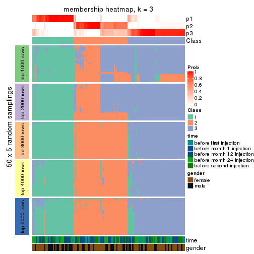</p>

</div>
<div id='tab-ATC-mclust-membership-heatmap-3'>
<pre><code class="r">membership_heatmap(res, k = 4)
</code></pre>

<p></p>

</div>
<div id='tab-ATC-mclust-membership-heatmap-4'>
<pre><code class="r">membership_heatmap(res, k = 5)
</code></pre>

<p></p>

</div>
<div id='tab-ATC-mclust-membership-heatmap-5'>
<pre><code class="r">membership_heatmap(res, k = 6)
</code></pre>

<p></p>

</div>
</div>

As soon as we have had the classes for columns, we can look for signatures
which are significantly different between classes which can be candidate marks
for certain classes. Following are the heatmaps for signatures.


Signature heatmaps where rows are scaled:


<script>
$( function() {
	$( '#tabs-ATC-mclust-get-signatures' ).tabs();
} );
</script>
<div id='tabs-ATC-mclust-get-signatures'>
<ul>
<li><a href='#tab-ATC-mclust-get-signatures-1'>k = 2</a></li>
<li><a href='#tab-ATC-mclust-get-signatures-2'>k = 3</a></li>
<li><a href='#tab-ATC-mclust-get-signatures-3'>k = 4</a></li>
<li><a href='#tab-ATC-mclust-get-signatures-4'>k = 5</a></li>
<li><a href='#tab-ATC-mclust-get-signatures-5'>k = 6</a></li>
</ul>
<div id='tab-ATC-mclust-get-signatures-1'>
<pre><code class="r">get_signatures(res, k = 2)
</code></pre>

<p></p>

</div>
<div id='tab-ATC-mclust-get-signatures-2'>
<pre><code class="r">get_signatures(res, k = 3)
</code></pre>

<p></p>

</div>
<div id='tab-ATC-mclust-get-signatures-3'>
<pre><code class="r">get_signatures(res, k = 4)
</code></pre>

<p></p>

</div>
<div id='tab-ATC-mclust-get-signatures-4'>
<pre><code class="r">get_signatures(res, k = 5)
</code></pre>

<p></p>

</div>
<div id='tab-ATC-mclust-get-signatures-5'>
<pre><code class="r">get_signatures(res, k = 6)
</code></pre>

<p></p>

</div>
</div>


Signature heatmaps where rows are not scaled:


<script>
$( function() {
	$( '#tabs-ATC-mclust-get-signatures-no-scale' ).tabs();
} );
</script>
<div id='tabs-ATC-mclust-get-signatures-no-scale'>
<ul>
<li><a href='#tab-ATC-mclust-get-signatures-no-scale-1'>k = 2</a></li>
<li><a href='#tab-ATC-mclust-get-signatures-no-scale-2'>k = 3</a></li>
<li><a href='#tab-ATC-mclust-get-signatures-no-scale-3'>k = 4</a></li>
<li><a href='#tab-ATC-mclust-get-signatures-no-scale-4'>k = 5</a></li>
<li><a href='#tab-ATC-mclust-get-signatures-no-scale-5'>k = 6</a></li>
</ul>
<div id='tab-ATC-mclust-get-signatures-no-scale-1'>
<pre><code class="r">get_signatures(res, k = 2, scale_rows = FALSE)
</code></pre>

<p></p>

</div>
<div id='tab-ATC-mclust-get-signatures-no-scale-2'>
<pre><code class="r">get_signatures(res, k = 3, scale_rows = FALSE)
</code></pre>

<p></p>

</div>
<div id='tab-ATC-mclust-get-signatures-no-scale-3'>
<pre><code class="r">get_signatures(res, k = 4, scale_rows = FALSE)
</code></pre>

<p></p>

</div>
<div id='tab-ATC-mclust-get-signatures-no-scale-4'>
<pre><code class="r">get_signatures(res, k = 5, scale_rows = FALSE)
</code></pre>

<p></p>

</div>
<div id='tab-ATC-mclust-get-signatures-no-scale-5'>
<pre><code class="r">get_signatures(res, k = 6, scale_rows = FALSE)
</code></pre>

<p></p>

</div>
</div>


Compare the overlap of signatures from different k:

```r
compare_signatures(res)
```


`get_signature()` returns a data frame invisibly. TO get the list of signatures, the function
call should be assigned to a variable explicitly. In following code, if `plot` argument is set
to `FALSE`, no heatmap is plotted while only the differential analysis is performed.

```r
# code only for demonstration
tb = get_signature(res, k = ..., plot = FALSE)
```

An example of the output of `tb` is:

```
#>   which_row         fdr    mean_1    mean_2 scaled_mean_1 scaled_mean_2 km
#> 1        38 0.042760348  8.373488  9.131774    -0.5533452     0.5164555  1
#> 2        40 0.018707592  7.106213  8.469186    -0.6173731     0.5762149  1
#> 3        55 0.019134737 10.221463 11.207825    -0.6159697     0.5749050  1
#> 4        59 0.006059896  5.921854  7.869574    -0.6899429     0.6439467  1
#> 5        60 0.018055526  8.928898 10.211722    -0.6204761     0.5791110  1
#> 6        98 0.009384629 15.714769 14.887706     0.6635654    -0.6193277  2
...
```

The columns in `tb` are:

1. `which_row`: row indices corresponding to the input matrix.
2. `fdr`: FDR for the differential test. 
3. `mean_x`: The mean value in group x.
4. `scaled_mean_x`: The mean value in group x after rows are scaled.
5. `km`: Row groups if k-means clustering is applied to rows.


UMAP plot which shows how samples are separated.


<script>
$( function() {
	$( '#tabs-ATC-mclust-dimension-reduction' ).tabs();
} );
</script>
<div id='tabs-ATC-mclust-dimension-reduction'>
<ul>
<li><a href='#tab-ATC-mclust-dimension-reduction-1'>k = 2</a></li>
<li><a href='#tab-ATC-mclust-dimension-reduction-2'>k = 3</a></li>
<li><a href='#tab-ATC-mclust-dimension-reduction-3'>k = 4</a></li>
<li><a href='#tab-ATC-mclust-dimension-reduction-4'>k = 5</a></li>
<li><a href='#tab-ATC-mclust-dimension-reduction-5'>k = 6</a></li>
</ul>
<div id='tab-ATC-mclust-dimension-reduction-1'>
<pre><code class="r">dimension_reduction(res, k = 2, method = &quot;UMAP&quot;)
</code></pre>

<p></p>

</div>
<div id='tab-ATC-mclust-dimension-reduction-2'>
<pre><code class="r">dimension_reduction(res, k = 3, method = &quot;UMAP&quot;)
</code></pre>

<p></p>

</div>
<div id='tab-ATC-mclust-dimension-reduction-3'>
<pre><code class="r">dimension_reduction(res, k = 4, method = &quot;UMAP&quot;)
</code></pre>

<p></p>

</div>
<div id='tab-ATC-mclust-dimension-reduction-4'>
<pre><code class="r">dimension_reduction(res, k = 5, method = &quot;UMAP&quot;)
</code></pre>

<p></p>

</div>
<div id='tab-ATC-mclust-dimension-reduction-5'>
<pre><code class="r">dimension_reduction(res, k = 6, method = &quot;UMAP&quot;)
</code></pre>

<p></p>

</div>
</div>


Following heatmap shows how subgroups are split when increasing `k`:

```r
collect_classes(res)
```


Test correlation between subgroups and known annotations. If the known
annotation is numeric, one-way ANOVA test is applied, and if the known
annotation is discrete, chi-squared contingency table test is applied.

```r
test_to_known_factors(res)
```

```
#>              n time(p) gender(p) k
#> ATC:mclust 115   0.930     0.295 2
#> ATC:mclust 120   0.808     0.311 3
#> ATC:mclust  34   0.338     1.000 4
#> ATC:mclust 118   0.907     0.450 5
#> ATC:mclust 116   0.948     0.419 6
```


If matrix rows can be associated to genes, consider to use `GO_Enrichment(res,
...)` to perform function enrichment for the signature genes.


 

---------------------------------------------------


### ATC:NMF**


The object with results only for a single top-value method and a single partition method 
can be extracted as:

```r
res = res_list["ATC", "NMF"]
# you can also extract it by
# res = res_list["ATC:NMF"]
```

A summary of `res` and all the functions that can be applied to it:

```r
res
```

```
#> A 'ConsensusPartition' object with k = 2, 3, 4, 5, 6.
#>   On a matrix with 21168 rows and 125 columns.
#>   Top rows (1000, 2000, 3000, 4000, 5000) are extracted by 'ATC' method.
#>   Subgroups are detected by 'NMF' method.
#>   Performed in total 1250 partitions by row resampling.
#>   Best k for subgroups seems to be 2.
#> 
#> Following methods can be applied to this 'ConsensusPartition' object:
#>  [1] "cola_report"             "collect_classes"         "collect_plots"          
#>  [4] "collect_stats"           "colnames"                "compare_signatures"     
#>  [7] "consensus_heatmap"       "dimension_reduction"     "functional_enrichment"  
#> [10] "get_anno_col"            "get_anno"                "get_classes"            
#> [13] "get_consensus"           "get_matrix"              "get_membership"         
#> [16] "get_param"               "get_signatures"          "get_stats"              
#> [19] "is_best_k"               "is_stable_k"             "membership_heatmap"     
#> [22] "ncol"                    "nrow"                    "plot_ecdf"              
#> [25] "rownames"                "select_partition_number" "show"                   
#> [28] "suggest_best_k"          "test_to_known_factors"
```

`collect_plots()` function collects all the plots made from `res` for all `k` (number of partitions)
into one single page to provide an easy and fast comparison between different `k`.

```r
collect_plots(res)
```


The plots are:

- The first row: a plot of the ECDF (Empirical cumulative distribution
  function) curves of the consensus matrix for each `k` and the heatmap of
  predicted classes for each `k`.
- The second row: heatmaps of the consensus matrix for each `k`.
- The third row: heatmaps of the membership matrix for each `k`.
- The fouth row: heatmaps of the signatures for each `k`.

All the plots in panels can be made by individual functions and they are
plotted later in this section.

`select_partition_number()` produces several plots showing different
statistics for choosing "optimized" `k`. There are following statistics:

- ECDF curves of the consensus matrix for each `k`;
- 1-PAC. [The PAC
  score](https://en.wikipedia.org/wiki/Consensus_clustering#Over-interpretation_potential_of_consensus_clustering)
  measures the proportion of the ambiguous subgrouping.
- Mean silhouette score.
- Concordance. The mean probability of fiting the consensus class ids in all
  partitions.
- Area increased. Denote $A_k$ as the area under the ECDF curve for current
  `k`, the area increased is defined as $A_k - A_{k-1}$.
- Rand index. The percent of pairs of samples that are both in a same cluster
  or both are not in a same cluster in the partition of k and k-1.
- Jaccard index. The ratio of pairs of samples are both in a same cluster in
  the partition of k and k-1 and the pairs of samples are both in a same
  cluster in the partition k or k-1.

The detailed explanations of these statistics can be found in [the cola
vignette](http://bioconductor.org/packages/devel/bioc/vignettes/cola/inst/doc/cola.html#toc_13).

Generally speaking, lower PAC score, higher mean silhouette score or higher
concordance corresponds to better partition. Rand index and Jaccard index
measure how similar the current partition is compared to partition with `k-1`.
If they are too similar, we won't accept `k` is better than `k-1`.

```r
select_partition_number(res)
```


The numeric values for all these statistics can be obtained by `get_stats()`.

```r
get_stats(res)
```

```
#>   k 1-PAC mean_silhouette concordance area_increased  Rand Jaccard
#> 2 2 1.000           0.991       0.996         0.5022 0.499   0.499
#> 3 3 0.695           0.807       0.903         0.2643 0.751   0.556
#> 4 4 0.606           0.715       0.838         0.1610 0.819   0.554
#> 5 5 0.610           0.550       0.736         0.0667 0.881   0.596
#> 6 6 0.653           0.481       0.708         0.0346 0.873   0.543
```

`suggest_best_k()` suggests the best $k$ based on these statistics. The rules are as follows:

- All $k$ with Jaccard index larger than 0.95 are removed because the increase of
  the partition number does not provides enough extra information. If all $k$ are removed,
  the best $k$ is assigned by `NA`.
- For $k$ with 1-PAC larger than 0.9, the maximal $k$ is taken as the "best k". Other $k$ is called "optional k".
- If it does not fit the second rule. The $k$ with the highest vote of highest
  1-PAC, mean silhouette and concordance is taken as the "best k".

```r
suggest_best_k(res)
```

```
#> [1] 2
```


Following shows the table of the partitions (You need to click the **show/hide
code output** link to see it). The membership matrix (columns with name `p*`)
is inferred by
[`clue::cl_consensus()`](https://www.rdocumentation.org/link/cl_consensus?package=clue)
function with the `SE` method. Basically the value in the membership matrix
represents the probability to belong to a certain group. The finall class
label for an item is determined with the group with highest probability it
belongs to.

In `get_classes()` function, the entropy is calculated from the membership
matrix and the silhouette score is calculated from the consensus matrix.


<script>
$( function() {
	$( '#tabs-ATC-NMF-get-classes' ).tabs();
} );
</script>
<div id='tabs-ATC-NMF-get-classes'>
<ul>
<li><a href='#tab-ATC-NMF-get-classes-1'>k = 2</a></li>
<li><a href='#tab-ATC-NMF-get-classes-2'>k = 3</a></li>
<li><a href='#tab-ATC-NMF-get-classes-3'>k = 4</a></li>
<li><a href='#tab-ATC-NMF-get-classes-4'>k = 5</a></li>
<li><a href='#tab-ATC-NMF-get-classes-5'>k = 6</a></li>
</ul>

<div id='tab-ATC-NMF-get-classes-1'>
<p><a id='tab-ATC-NMF-get-classes-1-a' style='color:#0366d6' href='#'>show/hide code output</a></p>
<pre><code class="r">cbind(get_classes(res, k = 2), get_membership(res, k = 2))
</code></pre>

<pre><code>#&gt;           class entropy silhouette    p1    p2
#&gt; GSM601752     2  0.0000      0.999 0.000 1.000
#&gt; GSM601782     1  0.0000      0.993 1.000 0.000
#&gt; GSM601792     1  0.0000      0.993 1.000 0.000
#&gt; GSM601797     1  0.0000      0.993 1.000 0.000
#&gt; GSM601827     1  0.0000      0.993 1.000 0.000
#&gt; GSM601837     2  0.0000      0.999 0.000 1.000
#&gt; GSM601842     2  0.0000      0.999 0.000 1.000
#&gt; GSM601857     1  0.0000      0.993 1.000 0.000
#&gt; GSM601867     1  0.0000      0.993 1.000 0.000
#&gt; GSM601747     1  0.0376      0.989 0.996 0.004
#&gt; GSM601757     1  0.0000      0.993 1.000 0.000
#&gt; GSM601762     2  0.0000      0.999 0.000 1.000
#&gt; GSM601767     2  0.0000      0.999 0.000 1.000
#&gt; GSM601772     2  0.0000      0.999 0.000 1.000
#&gt; GSM601777     1  0.0000      0.993 1.000 0.000
#&gt; GSM601787     1  0.0000      0.993 1.000 0.000
#&gt; GSM601802     2  0.0000      0.999 0.000 1.000
#&gt; GSM601807     1  0.0000      0.993 1.000 0.000
#&gt; GSM601812     1  0.0000      0.993 1.000 0.000
#&gt; GSM601817     1  0.0000      0.993 1.000 0.000
#&gt; GSM601822     1  0.0000      0.993 1.000 0.000
#&gt; GSM601832     2  0.0000      0.999 0.000 1.000
#&gt; GSM601847     1  0.0000      0.993 1.000 0.000
#&gt; GSM601852     1  0.0000      0.993 1.000 0.000
#&gt; GSM601862     1  0.0000      0.993 1.000 0.000
#&gt; GSM601753     2  0.0000      0.999 0.000 1.000
#&gt; GSM601783     1  0.0000      0.993 1.000 0.000
#&gt; GSM601793     1  0.0000      0.993 1.000 0.000
#&gt; GSM601798     2  0.0000      0.999 0.000 1.000
#&gt; GSM601828     1  0.0000      0.993 1.000 0.000
#&gt; GSM601838     2  0.0000      0.999 0.000 1.000
#&gt; GSM601843     2  0.0000      0.999 0.000 1.000
#&gt; GSM601858     2  0.0000      0.999 0.000 1.000
#&gt; GSM601868     1  0.0000      0.993 1.000 0.000
#&gt; GSM601748     1  0.0000      0.993 1.000 0.000
#&gt; GSM601758     1  0.0000      0.993 1.000 0.000
#&gt; GSM601763     2  0.0000      0.999 0.000 1.000
#&gt; GSM601768     2  0.0000      0.999 0.000 1.000
#&gt; GSM601773     2  0.0000      0.999 0.000 1.000
#&gt; GSM601778     1  0.0000      0.993 1.000 0.000
#&gt; GSM601788     2  0.0000      0.999 0.000 1.000
#&gt; GSM601803     2  0.0000      0.999 0.000 1.000
#&gt; GSM601808     1  0.0000      0.993 1.000 0.000
#&gt; GSM601813     1  0.0000      0.993 1.000 0.000
#&gt; GSM601818     1  0.0000      0.993 1.000 0.000
#&gt; GSM601823     2  0.1184      0.983 0.016 0.984
#&gt; GSM601833     2  0.0000      0.999 0.000 1.000
#&gt; GSM601848     1  0.0000      0.993 1.000 0.000
#&gt; GSM601853     1  0.0000      0.993 1.000 0.000
#&gt; GSM601863     1  0.0000      0.993 1.000 0.000
#&gt; GSM601754     2  0.0000      0.999 0.000 1.000
#&gt; GSM601784     2  0.0000      0.999 0.000 1.000
#&gt; GSM601794     1  0.0000      0.993 1.000 0.000
#&gt; GSM601799     2  0.0000      0.999 0.000 1.000
#&gt; GSM601829     1  0.0000      0.993 1.000 0.000
#&gt; GSM601839     2  0.0000      0.999 0.000 1.000
#&gt; GSM601844     1  0.1184      0.979 0.984 0.016
#&gt; GSM601859     2  0.0000      0.999 0.000 1.000
#&gt; GSM601869     1  0.0000      0.993 1.000 0.000
#&gt; GSM601749     1  0.0000      0.993 1.000 0.000
#&gt; GSM601759     1  0.0000      0.993 1.000 0.000
#&gt; GSM601764     2  0.0000      0.999 0.000 1.000
#&gt; GSM601769     2  0.0000      0.999 0.000 1.000
#&gt; GSM601774     2  0.0000      0.999 0.000 1.000
#&gt; GSM601779     1  0.0000      0.993 1.000 0.000
#&gt; GSM601789     2  0.0000      0.999 0.000 1.000
#&gt; GSM601804     2  0.0000      0.999 0.000 1.000
#&gt; GSM601809     1  0.0000      0.993 1.000 0.000
#&gt; GSM601814     2  0.0000      0.999 0.000 1.000
#&gt; GSM601819     1  0.0000      0.993 1.000 0.000
#&gt; GSM601824     2  0.0000      0.999 0.000 1.000
#&gt; GSM601834     2  0.0000      0.999 0.000 1.000
#&gt; GSM601849     1  0.0000      0.993 1.000 0.000
#&gt; GSM601854     1  0.0000      0.993 1.000 0.000
#&gt; GSM601864     1  0.4298      0.903 0.912 0.088
#&gt; GSM601755     2  0.0000      0.999 0.000 1.000
#&gt; GSM601785     2  0.0000      0.999 0.000 1.000
#&gt; GSM601795     1  0.3584      0.927 0.932 0.068
#&gt; GSM601800     2  0.0000      0.999 0.000 1.000
#&gt; GSM601830     1  0.0000      0.993 1.000 0.000
#&gt; GSM601840     2  0.0000      0.999 0.000 1.000
#&gt; GSM601845     2  0.0000      0.999 0.000 1.000
#&gt; GSM601860     2  0.0000      0.999 0.000 1.000
#&gt; GSM601870     1  0.0000      0.993 1.000 0.000
#&gt; GSM601750     1  0.0000      0.993 1.000 0.000
#&gt; GSM601760     1  0.0000      0.993 1.000 0.000
#&gt; GSM601765     2  0.0000      0.999 0.000 1.000
#&gt; GSM601770     2  0.0000      0.999 0.000 1.000
#&gt; GSM601775     2  0.0000      0.999 0.000 1.000
#&gt; GSM601780     1  0.0000      0.993 1.000 0.000
#&gt; GSM601790     2  0.0000      0.999 0.000 1.000
#&gt; GSM601805     2  0.0000      0.999 0.000 1.000
#&gt; GSM601810     1  0.0000      0.993 1.000 0.000
#&gt; GSM601815     2  0.0000      0.999 0.000 1.000
#&gt; GSM601820     1  0.0000      0.993 1.000 0.000
#&gt; GSM601825     2  0.0000      0.999 0.000 1.000
#&gt; GSM601835     2  0.0000      0.999 0.000 1.000
#&gt; GSM601850     1  0.0000      0.993 1.000 0.000
#&gt; GSM601855     1  0.0000      0.993 1.000 0.000
#&gt; GSM601865     1  0.8443      0.632 0.728 0.272
#&gt; GSM601756     2  0.0000      0.999 0.000 1.000
#&gt; GSM601786     2  0.0000      0.999 0.000 1.000
#&gt; GSM601796     1  0.0000      0.993 1.000 0.000
#&gt; GSM601801     2  0.0000      0.999 0.000 1.000
#&gt; GSM601831     1  0.0000      0.993 1.000 0.000
#&gt; GSM601841     1  0.0000      0.993 1.000 0.000
#&gt; GSM601846     2  0.0000      0.999 0.000 1.000
#&gt; GSM601861     2  0.0000      0.999 0.000 1.000
#&gt; GSM601871     1  0.0000      0.993 1.000 0.000
#&gt; GSM601751     2  0.0000      0.999 0.000 1.000
#&gt; GSM601761     1  0.0000      0.993 1.000 0.000
#&gt; GSM601766     2  0.0000      0.999 0.000 1.000
#&gt; GSM601771     2  0.2948      0.945 0.052 0.948
#&gt; GSM601776     1  0.0000      0.993 1.000 0.000
#&gt; GSM601781     1  0.0000      0.993 1.000 0.000
#&gt; GSM601791     1  0.0000      0.993 1.000 0.000
#&gt; GSM601806     2  0.0000      0.999 0.000 1.000
#&gt; GSM601811     1  0.0000      0.993 1.000 0.000
#&gt; GSM601816     1  0.0000      0.993 1.000 0.000
#&gt; GSM601821     2  0.0000      0.999 0.000 1.000
#&gt; GSM601826     1  0.1633      0.971 0.976 0.024
#&gt; GSM601836     2  0.0000      0.999 0.000 1.000
#&gt; GSM601851     1  0.0000      0.993 1.000 0.000
#&gt; GSM601856     1  0.0000      0.993 1.000 0.000
#&gt; GSM601866     1  0.0000      0.993 1.000 0.000
</code></pre>

<script>
$('#tab-ATC-NMF-get-classes-1-a').parent().next().next().hide();
$('#tab-ATC-NMF-get-classes-1-a').click(function(){
  $('#tab-ATC-NMF-get-classes-1-a').parent().next().next().toggle();
  return(false);
});
</script>
</div>

<div id='tab-ATC-NMF-get-classes-2'>
<p><a id='tab-ATC-NMF-get-classes-2-a' style='color:#0366d6' href='#'>show/hide code output</a></p>
<pre><code class="r">cbind(get_classes(res, k = 3), get_membership(res, k = 3))
</code></pre>

<pre><code>#&gt;           class entropy silhouette    p1    p2    p3
#&gt; GSM601752     2  0.0237     0.8368 0.004 0.996 0.000
#&gt; GSM601782     1  0.0000     0.9264 1.000 0.000 0.000
#&gt; GSM601792     1  0.3116     0.8725 0.892 0.108 0.000
#&gt; GSM601797     1  0.0000     0.9264 1.000 0.000 0.000
#&gt; GSM601827     1  0.2537     0.8917 0.920 0.080 0.000
#&gt; GSM601837     3  0.0000     0.8778 0.000 0.000 1.000
#&gt; GSM601842     2  0.0747     0.8388 0.000 0.984 0.016
#&gt; GSM601857     1  0.0237     0.9253 0.996 0.000 0.004
#&gt; GSM601867     3  0.6095     0.4218 0.392 0.000 0.608
#&gt; GSM601747     1  0.5497     0.6721 0.708 0.292 0.000
#&gt; GSM601757     1  0.0424     0.9253 0.992 0.008 0.000
#&gt; GSM601762     2  0.5678     0.6577 0.000 0.684 0.316
#&gt; GSM601767     2  0.4887     0.7566 0.000 0.772 0.228
#&gt; GSM601772     2  0.4452     0.7832 0.000 0.808 0.192
#&gt; GSM601777     1  0.0237     0.9253 0.996 0.000 0.004
#&gt; GSM601787     3  0.5760     0.5517 0.328 0.000 0.672
#&gt; GSM601802     2  0.4605     0.7749 0.000 0.796 0.204
#&gt; GSM601807     1  0.3116     0.8303 0.892 0.000 0.108
#&gt; GSM601812     1  0.0000     0.9264 1.000 0.000 0.000
#&gt; GSM601817     1  0.5785     0.6169 0.668 0.332 0.000
#&gt; GSM601822     1  0.5016     0.7512 0.760 0.240 0.000
#&gt; GSM601832     2  0.1031     0.8381 0.000 0.976 0.024
#&gt; GSM601847     1  0.0424     0.9255 0.992 0.008 0.000
#&gt; GSM601852     2  0.2711     0.7725 0.088 0.912 0.000
#&gt; GSM601862     1  0.0237     0.9253 0.996 0.000 0.004
#&gt; GSM601753     2  0.0237     0.8381 0.000 0.996 0.004
#&gt; GSM601783     1  0.4291     0.8114 0.820 0.180 0.000
#&gt; GSM601793     1  0.1031     0.9204 0.976 0.024 0.000
#&gt; GSM601798     2  0.5216     0.7266 0.000 0.740 0.260
#&gt; GSM601828     1  0.4974     0.7546 0.764 0.236 0.000
#&gt; GSM601838     3  0.0237     0.8779 0.000 0.004 0.996
#&gt; GSM601843     2  0.4002     0.8018 0.000 0.840 0.160
#&gt; GSM601858     3  0.0237     0.8779 0.000 0.004 0.996
#&gt; GSM601868     1  0.0424     0.9232 0.992 0.000 0.008
#&gt; GSM601748     1  0.1753     0.9100 0.952 0.048 0.000
#&gt; GSM601758     1  0.0237     0.9261 0.996 0.004 0.000
#&gt; GSM601763     2  0.0237     0.8368 0.004 0.996 0.000
#&gt; GSM601768     2  0.4002     0.8012 0.000 0.840 0.160
#&gt; GSM601773     2  0.4750     0.7662 0.000 0.784 0.216
#&gt; GSM601778     1  0.0000     0.9264 1.000 0.000 0.000
#&gt; GSM601788     2  0.5138     0.7350 0.000 0.748 0.252
#&gt; GSM601803     3  0.6225    -0.0910 0.000 0.432 0.568
#&gt; GSM601808     1  0.0237     0.9253 0.996 0.000 0.004
#&gt; GSM601813     1  0.0000     0.9264 1.000 0.000 0.000
#&gt; GSM601818     1  0.0000     0.9264 1.000 0.000 0.000
#&gt; GSM601823     2  0.0592     0.8330 0.012 0.988 0.000
#&gt; GSM601833     2  0.3619     0.8113 0.000 0.864 0.136
#&gt; GSM601848     2  0.6274    -0.0324 0.456 0.544 0.000
#&gt; GSM601853     1  0.0000     0.9264 1.000 0.000 0.000
#&gt; GSM601863     1  0.0237     0.9253 0.996 0.000 0.004
#&gt; GSM601754     2  0.0237     0.8368 0.004 0.996 0.000
#&gt; GSM601784     2  0.4796     0.7630 0.000 0.780 0.220
#&gt; GSM601794     1  0.0424     0.9253 0.992 0.008 0.000
#&gt; GSM601799     2  0.0000     0.8375 0.000 1.000 0.000
#&gt; GSM601829     2  0.5098     0.5725 0.248 0.752 0.000
#&gt; GSM601839     3  0.0000     0.8778 0.000 0.000 1.000
#&gt; GSM601844     2  0.1289     0.8211 0.032 0.968 0.000
#&gt; GSM601859     2  0.0237     0.8381 0.000 0.996 0.004
#&gt; GSM601869     1  0.0237     0.9253 0.996 0.000 0.004
#&gt; GSM601749     1  0.5363     0.7080 0.724 0.276 0.000
#&gt; GSM601759     1  0.0000     0.9264 1.000 0.000 0.000
#&gt; GSM601764     2  0.0237     0.8368 0.004 0.996 0.000
#&gt; GSM601769     2  0.6095     0.5358 0.000 0.608 0.392
#&gt; GSM601774     2  0.5363     0.7086 0.000 0.724 0.276
#&gt; GSM601779     2  0.1964     0.8029 0.056 0.944 0.000
#&gt; GSM601789     3  0.1411     0.8496 0.000 0.036 0.964
#&gt; GSM601804     2  0.0237     0.8368 0.004 0.996 0.000
#&gt; GSM601809     1  0.0892     0.9149 0.980 0.000 0.020
#&gt; GSM601814     3  0.0424     0.8754 0.000 0.008 0.992
#&gt; GSM601819     2  0.6140     0.1710 0.404 0.596 0.000
#&gt; GSM601824     2  0.0237     0.8368 0.004 0.996 0.000
#&gt; GSM601834     2  0.3879     0.8052 0.000 0.848 0.152
#&gt; GSM601849     2  0.5529     0.4780 0.296 0.704 0.000
#&gt; GSM601854     1  0.2356     0.8968 0.928 0.072 0.000
#&gt; GSM601864     3  0.0892     0.8689 0.020 0.000 0.980
#&gt; GSM601755     2  0.4887     0.7570 0.000 0.772 0.228
#&gt; GSM601785     2  0.0237     0.8381 0.000 0.996 0.004
#&gt; GSM601795     2  0.1753     0.8100 0.048 0.952 0.000
#&gt; GSM601800     2  0.1753     0.8352 0.000 0.952 0.048
#&gt; GSM601830     1  0.0000     0.9264 1.000 0.000 0.000
#&gt; GSM601840     2  0.2165     0.8323 0.000 0.936 0.064
#&gt; GSM601845     2  0.0237     0.8368 0.004 0.996 0.000
#&gt; GSM601860     2  0.1289     0.8377 0.000 0.968 0.032
#&gt; GSM601870     3  0.5098     0.6651 0.248 0.000 0.752
#&gt; GSM601750     1  0.1411     0.9155 0.964 0.036 0.000
#&gt; GSM601760     1  0.1411     0.9156 0.964 0.036 0.000
#&gt; GSM601765     2  0.0424     0.8383 0.000 0.992 0.008
#&gt; GSM601770     2  0.4346     0.7878 0.000 0.816 0.184
#&gt; GSM601775     2  0.0000     0.8375 0.000 1.000 0.000
#&gt; GSM601780     1  0.5327     0.7129 0.728 0.272 0.000
#&gt; GSM601790     3  0.0237     0.8779 0.000 0.004 0.996
#&gt; GSM601805     2  0.5431     0.6992 0.000 0.716 0.284
#&gt; GSM601810     1  0.0237     0.9253 0.996 0.000 0.004
#&gt; GSM601815     3  0.0237     0.8779 0.000 0.004 0.996
#&gt; GSM601820     1  0.0000     0.9264 1.000 0.000 0.000
#&gt; GSM601825     2  0.3482     0.8139 0.000 0.872 0.128
#&gt; GSM601835     2  0.3752     0.8084 0.000 0.856 0.144
#&gt; GSM601850     1  0.3267     0.8664 0.884 0.116 0.000
#&gt; GSM601855     1  0.1289     0.9051 0.968 0.000 0.032
#&gt; GSM601865     3  0.0747     0.8714 0.016 0.000 0.984
#&gt; GSM601756     2  0.6026     0.5666 0.000 0.624 0.376
#&gt; GSM601786     3  0.0000     0.8778 0.000 0.000 1.000
#&gt; GSM601796     1  0.0000     0.9264 1.000 0.000 0.000
#&gt; GSM601801     2  0.6111     0.5290 0.000 0.604 0.396
#&gt; GSM601831     1  0.0000     0.9264 1.000 0.000 0.000
#&gt; GSM601841     1  0.0237     0.9253 0.996 0.000 0.004
#&gt; GSM601846     2  0.0237     0.8368 0.004 0.996 0.000
#&gt; GSM601861     3  0.0237     0.8779 0.000 0.004 0.996
#&gt; GSM601871     3  0.5810     0.5380 0.336 0.000 0.664
#&gt; GSM601751     2  0.4796     0.7660 0.000 0.780 0.220
#&gt; GSM601761     1  0.2261     0.8990 0.932 0.068 0.000
#&gt; GSM601766     2  0.0000     0.8375 0.000 1.000 0.000
#&gt; GSM601771     3  0.0237     0.8768 0.004 0.000 0.996
#&gt; GSM601776     1  0.4452     0.7998 0.808 0.192 0.000
#&gt; GSM601781     1  0.0237     0.9253 0.996 0.000 0.004
#&gt; GSM601791     1  0.0237     0.9261 0.996 0.004 0.000
#&gt; GSM601806     3  0.0592     0.8724 0.000 0.012 0.988
#&gt; GSM601811     1  0.0592     0.9206 0.988 0.000 0.012
#&gt; GSM601816     1  0.3038     0.8755 0.896 0.104 0.000
#&gt; GSM601821     3  0.0237     0.8779 0.000 0.004 0.996
#&gt; GSM601826     2  0.1411     0.8183 0.036 0.964 0.000
#&gt; GSM601836     2  0.0237     0.8368 0.004 0.996 0.000
#&gt; GSM601851     1  0.5363     0.7078 0.724 0.276 0.000
#&gt; GSM601856     1  0.0000     0.9264 1.000 0.000 0.000
#&gt; GSM601866     1  0.0237     0.9253 0.996 0.000 0.004
</code></pre>

<script>
$('#tab-ATC-NMF-get-classes-2-a').parent().next().next().hide();
$('#tab-ATC-NMF-get-classes-2-a').click(function(){
  $('#tab-ATC-NMF-get-classes-2-a').parent().next().next().toggle();
  return(false);
});
</script>
</div>

<div id='tab-ATC-NMF-get-classes-3'>
<p><a id='tab-ATC-NMF-get-classes-3-a' style='color:#0366d6' href='#'>show/hide code output</a></p>
<pre><code class="r">cbind(get_classes(res, k = 4), get_membership(res, k = 4))
</code></pre>

<pre><code>#&gt;           class entropy silhouette    p1    p2    p3    p4
#&gt; GSM601752     4  0.1833     0.7561 0.000 0.024 0.032 0.944
#&gt; GSM601782     1  0.2222     0.8497 0.932 0.032 0.004 0.032
#&gt; GSM601792     4  0.2773     0.8230 0.116 0.000 0.004 0.880
#&gt; GSM601797     4  0.2882     0.8156 0.084 0.000 0.024 0.892
#&gt; GSM601827     1  0.2943     0.8422 0.892 0.032 0.000 0.076
#&gt; GSM601837     3  0.1929     0.7609 0.036 0.024 0.940 0.000
#&gt; GSM601842     2  0.0336     0.8289 0.000 0.992 0.000 0.008
#&gt; GSM601857     1  0.2412     0.8051 0.908 0.000 0.084 0.008
#&gt; GSM601867     1  0.4134     0.5998 0.740 0.000 0.260 0.000
#&gt; GSM601747     1  0.5466     0.3206 0.548 0.436 0.000 0.016
#&gt; GSM601757     1  0.3658     0.7806 0.836 0.144 0.000 0.020
#&gt; GSM601762     2  0.6278     0.5251 0.000 0.652 0.228 0.120
#&gt; GSM601767     2  0.4297     0.7437 0.000 0.820 0.084 0.096
#&gt; GSM601772     2  0.0657     0.8254 0.000 0.984 0.012 0.004
#&gt; GSM601777     4  0.5109     0.7461 0.196 0.000 0.060 0.744
#&gt; GSM601787     3  0.5229     0.1994 0.428 0.000 0.564 0.008
#&gt; GSM601802     4  0.3895     0.6671 0.000 0.036 0.132 0.832
#&gt; GSM601807     1  0.4098     0.6882 0.784 0.000 0.204 0.012
#&gt; GSM601812     1  0.2345     0.8396 0.900 0.000 0.000 0.100
#&gt; GSM601817     1  0.4817     0.4596 0.612 0.388 0.000 0.000
#&gt; GSM601822     4  0.3306     0.8116 0.156 0.004 0.000 0.840
#&gt; GSM601832     2  0.1022     0.8312 0.000 0.968 0.000 0.032
#&gt; GSM601847     4  0.2988     0.8231 0.112 0.000 0.012 0.876
#&gt; GSM601852     2  0.3542     0.7384 0.120 0.852 0.000 0.028
#&gt; GSM601862     1  0.1174     0.8461 0.968 0.000 0.020 0.012
#&gt; GSM601753     2  0.6305     0.3503 0.000 0.516 0.060 0.424
#&gt; GSM601783     1  0.4667     0.8023 0.796 0.108 0.000 0.096
#&gt; GSM601793     4  0.2704     0.8224 0.124 0.000 0.000 0.876
#&gt; GSM601798     4  0.3048     0.7037 0.000 0.016 0.108 0.876
#&gt; GSM601828     1  0.4673     0.6356 0.700 0.292 0.000 0.008
#&gt; GSM601838     3  0.1733     0.7702 0.000 0.028 0.948 0.024
#&gt; GSM601843     2  0.0188     0.8266 0.000 0.996 0.004 0.000
#&gt; GSM601858     3  0.5883     0.5020 0.060 0.300 0.640 0.000
#&gt; GSM601868     1  0.1584     0.8391 0.952 0.000 0.036 0.012
#&gt; GSM601748     1  0.3636     0.7554 0.820 0.172 0.000 0.008
#&gt; GSM601758     1  0.2799     0.8362 0.884 0.008 0.000 0.108
#&gt; GSM601763     2  0.1557     0.8164 0.000 0.944 0.000 0.056
#&gt; GSM601768     2  0.0336     0.8273 0.000 0.992 0.008 0.000
#&gt; GSM601773     2  0.3439     0.7814 0.000 0.868 0.048 0.084
#&gt; GSM601778     4  0.3224     0.8199 0.120 0.000 0.016 0.864
#&gt; GSM601788     2  0.2845     0.7952 0.000 0.896 0.076 0.028
#&gt; GSM601803     3  0.5996     0.2144 0.000 0.040 0.512 0.448
#&gt; GSM601808     1  0.0779     0.8457 0.980 0.000 0.016 0.004
#&gt; GSM601813     1  0.2921     0.8148 0.860 0.000 0.000 0.140
#&gt; GSM601818     1  0.2310     0.8163 0.920 0.004 0.068 0.008
#&gt; GSM601823     2  0.4624     0.4820 0.000 0.660 0.000 0.340
#&gt; GSM601833     2  0.1820     0.8249 0.000 0.944 0.020 0.036
#&gt; GSM601848     4  0.3428     0.8174 0.144 0.012 0.000 0.844
#&gt; GSM601853     1  0.0188     0.8474 0.996 0.000 0.004 0.000
#&gt; GSM601863     1  0.0895     0.8495 0.976 0.000 0.004 0.020
#&gt; GSM601754     4  0.1820     0.7539 0.000 0.020 0.036 0.944
#&gt; GSM601784     2  0.3464     0.7825 0.000 0.868 0.056 0.076
#&gt; GSM601794     4  0.3047     0.8219 0.116 0.000 0.012 0.872
#&gt; GSM601799     4  0.4888     0.1002 0.000 0.412 0.000 0.588
#&gt; GSM601829     2  0.7614     0.2028 0.300 0.468 0.000 0.232
#&gt; GSM601839     3  0.1936     0.7652 0.028 0.032 0.940 0.000
#&gt; GSM601844     2  0.2530     0.7903 0.004 0.896 0.000 0.100
#&gt; GSM601859     2  0.0524     0.8277 0.000 0.988 0.008 0.004
#&gt; GSM601869     1  0.1302     0.8504 0.956 0.000 0.000 0.044
#&gt; GSM601749     1  0.7050     0.5360 0.552 0.292 0.000 0.156
#&gt; GSM601759     1  0.2610     0.8435 0.900 0.012 0.000 0.088
#&gt; GSM601764     2  0.0817     0.8281 0.000 0.976 0.000 0.024
#&gt; GSM601769     2  0.6634     0.4052 0.000 0.592 0.292 0.116
#&gt; GSM601774     2  0.4706     0.7076 0.000 0.788 0.140 0.072
#&gt; GSM601779     4  0.3554     0.8201 0.136 0.020 0.000 0.844
#&gt; GSM601789     3  0.5259     0.3290 0.008 0.376 0.612 0.004
#&gt; GSM601804     4  0.2565     0.7387 0.000 0.056 0.032 0.912
#&gt; GSM601809     1  0.1820     0.8518 0.944 0.000 0.020 0.036
#&gt; GSM601814     3  0.4982     0.7115 0.000 0.092 0.772 0.136
#&gt; GSM601819     2  0.5619     0.3789 0.320 0.640 0.000 0.040
#&gt; GSM601824     2  0.2589     0.7812 0.000 0.884 0.000 0.116
#&gt; GSM601834     2  0.3399     0.7878 0.000 0.868 0.040 0.092
#&gt; GSM601849     4  0.3852     0.7946 0.180 0.012 0.000 0.808
#&gt; GSM601854     1  0.2987     0.8339 0.880 0.016 0.000 0.104
#&gt; GSM601864     3  0.2197     0.7325 0.080 0.000 0.916 0.004
#&gt; GSM601755     4  0.3392     0.6861 0.000 0.020 0.124 0.856
#&gt; GSM601785     2  0.0188     0.8284 0.000 0.996 0.000 0.004
#&gt; GSM601795     4  0.2101     0.8062 0.060 0.012 0.000 0.928
#&gt; GSM601800     4  0.3182     0.7053 0.000 0.028 0.096 0.876
#&gt; GSM601830     1  0.4855     0.7438 0.788 0.004 0.076 0.132
#&gt; GSM601840     2  0.1677     0.8200 0.000 0.948 0.040 0.012
#&gt; GSM601845     2  0.0817     0.8281 0.000 0.976 0.000 0.024
#&gt; GSM601860     2  0.1059     0.8267 0.000 0.972 0.012 0.016
#&gt; GSM601870     3  0.4453     0.5758 0.244 0.000 0.744 0.012
#&gt; GSM601750     1  0.2867     0.8341 0.884 0.012 0.000 0.104
#&gt; GSM601760     1  0.4462     0.7868 0.792 0.044 0.000 0.164
#&gt; GSM601765     2  0.0592     0.8291 0.000 0.984 0.000 0.016
#&gt; GSM601770     2  0.1913     0.8205 0.000 0.940 0.020 0.040
#&gt; GSM601775     2  0.0592     0.8291 0.000 0.984 0.000 0.016
#&gt; GSM601780     4  0.3479     0.8167 0.148 0.012 0.000 0.840
#&gt; GSM601790     3  0.2943     0.7639 0.000 0.076 0.892 0.032
#&gt; GSM601805     4  0.3166     0.6979 0.000 0.016 0.116 0.868
#&gt; GSM601810     1  0.1406     0.8447 0.960 0.000 0.024 0.016
#&gt; GSM601815     3  0.3279     0.7523 0.000 0.032 0.872 0.096
#&gt; GSM601820     1  0.2149     0.8430 0.912 0.000 0.000 0.088
#&gt; GSM601825     2  0.5118     0.7062 0.000 0.752 0.072 0.176
#&gt; GSM601835     2  0.1356     0.8317 0.000 0.960 0.008 0.032
#&gt; GSM601850     4  0.3032     0.8238 0.124 0.008 0.000 0.868
#&gt; GSM601855     1  0.3443     0.7638 0.848 0.000 0.136 0.016
#&gt; GSM601865     3  0.1743     0.7438 0.056 0.000 0.940 0.004
#&gt; GSM601756     4  0.5113     0.4674 0.000 0.032 0.264 0.704
#&gt; GSM601786     3  0.2019     0.7712 0.004 0.032 0.940 0.024
#&gt; GSM601796     4  0.3048     0.8212 0.108 0.000 0.016 0.876
#&gt; GSM601801     4  0.5277     0.4059 0.000 0.028 0.304 0.668
#&gt; GSM601831     1  0.1356     0.8526 0.960 0.008 0.000 0.032
#&gt; GSM601841     1  0.2216     0.8412 0.908 0.000 0.000 0.092
#&gt; GSM601846     2  0.4679     0.5156 0.000 0.648 0.000 0.352
#&gt; GSM601861     3  0.4168     0.7424 0.000 0.080 0.828 0.092
#&gt; GSM601871     3  0.5288     0.0524 0.472 0.000 0.520 0.008
#&gt; GSM601751     2  0.6835     0.3891 0.000 0.576 0.288 0.136
#&gt; GSM601761     1  0.4599     0.6749 0.736 0.016 0.000 0.248
#&gt; GSM601766     2  0.0592     0.8291 0.000 0.984 0.000 0.016
#&gt; GSM601771     3  0.3082     0.7577 0.000 0.032 0.884 0.084
#&gt; GSM601776     4  0.4837     0.5165 0.348 0.004 0.000 0.648
#&gt; GSM601781     4  0.5144     0.7302 0.216 0.000 0.052 0.732
#&gt; GSM601791     1  0.4103     0.6688 0.744 0.000 0.000 0.256
#&gt; GSM601806     3  0.5657     0.2639 0.000 0.024 0.540 0.436
#&gt; GSM601811     1  0.1398     0.8367 0.956 0.000 0.040 0.004
#&gt; GSM601816     4  0.3306     0.8114 0.156 0.004 0.000 0.840
#&gt; GSM601821     3  0.2466     0.7660 0.000 0.028 0.916 0.056
#&gt; GSM601826     2  0.4277     0.5985 0.000 0.720 0.000 0.280
#&gt; GSM601836     2  0.0817     0.8281 0.000 0.976 0.000 0.024
#&gt; GSM601851     4  0.4137     0.7668 0.208 0.012 0.000 0.780
#&gt; GSM601856     1  0.0779     0.8439 0.980 0.000 0.016 0.004
#&gt; GSM601866     1  0.1305     0.8515 0.960 0.000 0.004 0.036
</code></pre>

<script>
$('#tab-ATC-NMF-get-classes-3-a').parent().next().next().hide();
$('#tab-ATC-NMF-get-classes-3-a').click(function(){
  $('#tab-ATC-NMF-get-classes-3-a').parent().next().next().toggle();
  return(false);
});
</script>
</div>

<div id='tab-ATC-NMF-get-classes-4'>
<p><a id='tab-ATC-NMF-get-classes-4-a' style='color:#0366d6' href='#'>show/hide code output</a></p>
<pre><code class="r">cbind(get_classes(res, k = 5), get_membership(res, k = 5))
</code></pre>

<pre><code>#&gt;           class entropy silhouette    p1    p2    p3    p4    p5
#&gt; GSM601752     4  0.4846    0.73092 0.244 0.000 0.004 0.696 0.056
#&gt; GSM601782     1  0.4906    0.29990 0.592 0.024 0.380 0.000 0.004
#&gt; GSM601792     4  0.2171    0.77033 0.064 0.000 0.024 0.912 0.000
#&gt; GSM601797     4  0.1877    0.77207 0.064 0.000 0.012 0.924 0.000
#&gt; GSM601827     3  0.5940    0.40939 0.172 0.108 0.672 0.048 0.000
#&gt; GSM601837     5  0.3123    0.72489 0.000 0.000 0.184 0.004 0.812
#&gt; GSM601842     2  0.0451    0.76302 0.008 0.988 0.000 0.000 0.004
#&gt; GSM601857     3  0.4735    0.16744 0.460 0.000 0.524 0.000 0.016
#&gt; GSM601867     3  0.4718    0.55490 0.180 0.000 0.728 0.000 0.092
#&gt; GSM601747     1  0.4506    0.43621 0.716 0.244 0.036 0.000 0.004
#&gt; GSM601757     1  0.4565    0.50529 0.764 0.148 0.080 0.004 0.004
#&gt; GSM601762     2  0.6344    0.34280 0.060 0.524 0.000 0.048 0.368
#&gt; GSM601767     2  0.4645    0.57283 0.012 0.672 0.000 0.016 0.300
#&gt; GSM601772     2  0.2361    0.74947 0.012 0.892 0.000 0.000 0.096
#&gt; GSM601777     4  0.4772    0.68231 0.108 0.000 0.148 0.740 0.004
#&gt; GSM601787     3  0.3934    0.44090 0.016 0.000 0.740 0.000 0.244
#&gt; GSM601802     4  0.3086    0.70965 0.040 0.004 0.000 0.864 0.092
#&gt; GSM601807     3  0.1267    0.54912 0.012 0.000 0.960 0.004 0.024
#&gt; GSM601812     3  0.4505    0.29214 0.384 0.000 0.604 0.012 0.000
#&gt; GSM601817     2  0.4925    0.34871 0.044 0.632 0.324 0.000 0.000
#&gt; GSM601822     4  0.5262    0.60013 0.408 0.012 0.028 0.552 0.000
#&gt; GSM601832     2  0.2047    0.75623 0.040 0.928 0.000 0.020 0.012
#&gt; GSM601847     4  0.4375    0.60743 0.420 0.000 0.004 0.576 0.000
#&gt; GSM601852     2  0.2828    0.73070 0.104 0.872 0.020 0.004 0.000
#&gt; GSM601862     3  0.4655    0.14337 0.476 0.000 0.512 0.000 0.012
#&gt; GSM601753     2  0.7471    0.43522 0.096 0.504 0.000 0.248 0.152
#&gt; GSM601783     1  0.4528    0.51418 0.728 0.060 0.212 0.000 0.000
#&gt; GSM601793     4  0.2208    0.77190 0.072 0.000 0.020 0.908 0.000
#&gt; GSM601798     4  0.2141    0.74147 0.016 0.000 0.004 0.916 0.064
#&gt; GSM601828     2  0.6281   -0.14345 0.152 0.460 0.388 0.000 0.000
#&gt; GSM601838     5  0.0794    0.81191 0.000 0.000 0.028 0.000 0.972
#&gt; GSM601843     2  0.0794    0.76342 0.000 0.972 0.000 0.000 0.028
#&gt; GSM601858     5  0.3383    0.78879 0.012 0.072 0.060 0.000 0.856
#&gt; GSM601868     3  0.4354    0.39646 0.368 0.000 0.624 0.000 0.008
#&gt; GSM601748     1  0.5996    0.20595 0.512 0.120 0.368 0.000 0.000
#&gt; GSM601758     1  0.2919    0.55085 0.868 0.024 0.104 0.004 0.000
#&gt; GSM601763     2  0.0798    0.76071 0.016 0.976 0.008 0.000 0.000
#&gt; GSM601768     2  0.2179    0.74742 0.004 0.896 0.000 0.000 0.100
#&gt; GSM601773     2  0.3365    0.70353 0.004 0.808 0.000 0.008 0.180
#&gt; GSM601778     4  0.2929    0.76564 0.152 0.000 0.008 0.840 0.000
#&gt; GSM601788     2  0.5153    0.28899 0.040 0.524 0.000 0.000 0.436
#&gt; GSM601803     5  0.5559    0.00287 0.016 0.028 0.004 0.464 0.488
#&gt; GSM601808     3  0.3456    0.56060 0.204 0.000 0.788 0.004 0.004
#&gt; GSM601813     1  0.4942    0.19690 0.540 0.000 0.432 0.028 0.000
#&gt; GSM601818     3  0.5084    0.06670 0.484 0.008 0.488 0.000 0.020
#&gt; GSM601823     2  0.5700    0.57491 0.216 0.664 0.024 0.096 0.000
#&gt; GSM601833     2  0.3696    0.73738 0.048 0.844 0.000 0.032 0.076
#&gt; GSM601848     4  0.4481    0.60669 0.416 0.000 0.008 0.576 0.000
#&gt; GSM601853     3  0.2763    0.57691 0.148 0.004 0.848 0.000 0.000
#&gt; GSM601863     3  0.4549    0.16492 0.464 0.000 0.528 0.000 0.008
#&gt; GSM601754     4  0.2012    0.76868 0.060 0.000 0.000 0.920 0.020
#&gt; GSM601784     2  0.4062    0.70306 0.028 0.788 0.000 0.016 0.168
#&gt; GSM601794     4  0.2248    0.77362 0.088 0.000 0.012 0.900 0.000
#&gt; GSM601799     2  0.5423    0.29517 0.028 0.552 0.000 0.400 0.020
#&gt; GSM601829     2  0.5944    0.59498 0.064 0.672 0.184 0.080 0.000
#&gt; GSM601839     5  0.2424    0.76362 0.000 0.000 0.132 0.000 0.868
#&gt; GSM601844     2  0.2720    0.73311 0.096 0.880 0.020 0.004 0.000
#&gt; GSM601859     2  0.4365    0.71364 0.116 0.768 0.000 0.000 0.116
#&gt; GSM601869     1  0.4420    0.10951 0.548 0.000 0.448 0.004 0.000
#&gt; GSM601749     1  0.4235    0.49481 0.772 0.176 0.044 0.008 0.000
#&gt; GSM601759     1  0.3368    0.54599 0.820 0.024 0.156 0.000 0.000
#&gt; GSM601764     2  0.0880    0.75997 0.032 0.968 0.000 0.000 0.000
#&gt; GSM601769     5  0.5732    0.30013 0.040 0.328 0.000 0.036 0.596
#&gt; GSM601774     2  0.4327    0.47770 0.000 0.632 0.000 0.008 0.360
#&gt; GSM601779     4  0.4803    0.49521 0.488 0.012 0.004 0.496 0.000
#&gt; GSM601789     5  0.3409    0.70433 0.000 0.160 0.024 0.000 0.816
#&gt; GSM601804     4  0.4160    0.75713 0.184 0.008 0.000 0.772 0.036
#&gt; GSM601809     3  0.4954    0.19743 0.448 0.000 0.528 0.004 0.020
#&gt; GSM601814     5  0.4461    0.72778 0.064 0.056 0.000 0.080 0.800
#&gt; GSM601819     1  0.4428    0.40086 0.692 0.284 0.020 0.004 0.000
#&gt; GSM601824     2  0.3059    0.72219 0.120 0.856 0.008 0.016 0.000
#&gt; GSM601834     2  0.5024    0.69232 0.076 0.760 0.000 0.060 0.104
#&gt; GSM601849     4  0.5266    0.50624 0.468 0.020 0.016 0.496 0.000
#&gt; GSM601854     1  0.4860    0.20444 0.540 0.016 0.440 0.004 0.000
#&gt; GSM601864     5  0.3774    0.59757 0.000 0.000 0.296 0.000 0.704
#&gt; GSM601755     4  0.3651    0.70007 0.032 0.000 0.004 0.812 0.152
#&gt; GSM601785     2  0.1012    0.76363 0.012 0.968 0.000 0.000 0.020
#&gt; GSM601795     4  0.2110    0.73652 0.072 0.000 0.016 0.912 0.000
#&gt; GSM601800     4  0.2139    0.72246 0.056 0.000 0.012 0.920 0.012
#&gt; GSM601830     3  0.5089    0.37876 0.104 0.016 0.728 0.152 0.000
#&gt; GSM601840     2  0.4846    0.48246 0.024 0.612 0.000 0.004 0.360
#&gt; GSM601845     2  0.0807    0.76062 0.012 0.976 0.012 0.000 0.000
#&gt; GSM601860     2  0.4512    0.58108 0.020 0.676 0.000 0.004 0.300
#&gt; GSM601870     3  0.4225    0.03906 0.000 0.000 0.632 0.004 0.364
#&gt; GSM601750     1  0.4599    0.31287 0.600 0.016 0.384 0.000 0.000
#&gt; GSM601760     1  0.2778    0.54264 0.892 0.032 0.060 0.016 0.000
#&gt; GSM601765     2  0.0579    0.76393 0.000 0.984 0.000 0.008 0.008
#&gt; GSM601770     2  0.3234    0.72674 0.012 0.836 0.000 0.008 0.144
#&gt; GSM601775     2  0.0693    0.76284 0.012 0.980 0.000 0.000 0.008
#&gt; GSM601780     4  0.4297    0.51713 0.472 0.000 0.000 0.528 0.000
#&gt; GSM601790     5  0.1216    0.81441 0.000 0.020 0.020 0.000 0.960
#&gt; GSM601805     4  0.3142    0.72838 0.032 0.000 0.004 0.856 0.108
#&gt; GSM601810     3  0.2660    0.58284 0.128 0.000 0.864 0.000 0.008
#&gt; GSM601815     5  0.1116    0.81310 0.004 0.000 0.004 0.028 0.964
#&gt; GSM601820     1  0.4590    0.22046 0.568 0.000 0.420 0.012 0.000
#&gt; GSM601825     2  0.6447    0.57406 0.076 0.628 0.000 0.100 0.196
#&gt; GSM601835     2  0.4117    0.71751 0.080 0.824 0.032 0.060 0.004
#&gt; GSM601850     4  0.4305    0.50523 0.488 0.000 0.000 0.512 0.000
#&gt; GSM601855     3  0.1518    0.54085 0.016 0.000 0.952 0.020 0.012
#&gt; GSM601865     5  0.3521    0.67082 0.000 0.000 0.232 0.004 0.764
#&gt; GSM601756     4  0.4208    0.57857 0.020 0.000 0.004 0.728 0.248
#&gt; GSM601786     5  0.0290    0.81534 0.000 0.000 0.008 0.000 0.992
#&gt; GSM601796     4  0.2628    0.75386 0.088 0.000 0.028 0.884 0.000
#&gt; GSM601801     4  0.4296    0.64110 0.056 0.008 0.016 0.804 0.116
#&gt; GSM601831     3  0.4240    0.47457 0.284 0.004 0.700 0.012 0.000
#&gt; GSM601841     1  0.4090    0.46256 0.716 0.000 0.268 0.016 0.000
#&gt; GSM601846     2  0.6056    0.61949 0.088 0.680 0.104 0.128 0.000
#&gt; GSM601861     5  0.1216    0.80826 0.000 0.020 0.000 0.020 0.960
#&gt; GSM601871     3  0.4350    0.39262 0.028 0.000 0.704 0.000 0.268
#&gt; GSM601751     5  0.5566    0.42304 0.036 0.276 0.000 0.044 0.644
#&gt; GSM601761     1  0.3107    0.50282 0.868 0.012 0.032 0.088 0.000
#&gt; GSM601766     2  0.0000    0.76215 0.000 1.000 0.000 0.000 0.000
#&gt; GSM601771     5  0.1488    0.81518 0.008 0.008 0.012 0.016 0.956
#&gt; GSM601776     1  0.3796    0.07658 0.700 0.000 0.000 0.300 0.000
#&gt; GSM601781     4  0.4403    0.72252 0.132 0.000 0.092 0.772 0.004
#&gt; GSM601791     1  0.4269    0.51556 0.756 0.000 0.188 0.056 0.000
#&gt; GSM601806     4  0.5550    0.28275 0.036 0.012 0.008 0.584 0.360
#&gt; GSM601811     3  0.4335    0.51845 0.268 0.000 0.708 0.004 0.020
#&gt; GSM601816     4  0.4836    0.65765 0.336 0.000 0.036 0.628 0.000
#&gt; GSM601821     5  0.1153    0.81396 0.008 0.000 0.004 0.024 0.964
#&gt; GSM601826     2  0.5580    0.48116 0.304 0.620 0.020 0.056 0.000
#&gt; GSM601836     2  0.0798    0.76148 0.008 0.976 0.016 0.000 0.000
#&gt; GSM601851     1  0.4088   -0.18184 0.632 0.000 0.000 0.368 0.000
#&gt; GSM601856     3  0.2127    0.57958 0.108 0.000 0.892 0.000 0.000
#&gt; GSM601866     1  0.4455    0.23832 0.588 0.000 0.404 0.000 0.008
</code></pre>

<script>
$('#tab-ATC-NMF-get-classes-4-a').parent().next().next().hide();
$('#tab-ATC-NMF-get-classes-4-a').click(function(){
  $('#tab-ATC-NMF-get-classes-4-a').parent().next().next().toggle();
  return(false);
});
</script>
</div>

<div id='tab-ATC-NMF-get-classes-5'>
<p><a id='tab-ATC-NMF-get-classes-5-a' style='color:#0366d6' href='#'>show/hide code output</a></p>
<pre><code class="r">cbind(get_classes(res, k = 6), get_membership(res, k = 6))
</code></pre>

<pre><code>#&gt;           class entropy silhouette    p1    p2    p3    p4    p5    p6
#&gt; GSM601752     6  0.3534     0.6564 0.000 0.012 0.004 0.188 0.012 0.784
#&gt; GSM601782     1  0.1226     0.6822 0.952 0.000 0.004 0.040 0.000 0.004
#&gt; GSM601792     6  0.2445     0.7009 0.008 0.004 0.032 0.060 0.000 0.896
#&gt; GSM601797     6  0.1003     0.7034 0.000 0.000 0.016 0.020 0.000 0.964
#&gt; GSM601827     1  0.7648     0.1095 0.344 0.100 0.276 0.264 0.000 0.016
#&gt; GSM601837     3  0.4076     0.4972 0.000 0.000 0.592 0.012 0.396 0.000
#&gt; GSM601842     2  0.1556     0.6649 0.000 0.920 0.000 0.000 0.080 0.000
#&gt; GSM601857     1  0.3834     0.5785 0.732 0.000 0.232 0.036 0.000 0.000
#&gt; GSM601867     1  0.4208     0.6148 0.740 0.000 0.200 0.036 0.024 0.000
#&gt; GSM601747     1  0.6521    -0.5016 0.456 0.228 0.008 0.292 0.012 0.004
#&gt; GSM601757     4  0.7747     0.0000 0.288 0.240 0.028 0.352 0.000 0.092
#&gt; GSM601762     5  0.4360     0.2894 0.000 0.404 0.012 0.004 0.576 0.004
#&gt; GSM601767     5  0.3993     0.2753 0.000 0.400 0.000 0.008 0.592 0.000
#&gt; GSM601772     2  0.3460     0.5771 0.000 0.760 0.000 0.020 0.220 0.000
#&gt; GSM601777     6  0.3205     0.6907 0.036 0.000 0.072 0.040 0.000 0.852
#&gt; GSM601787     3  0.3927     0.6140 0.120 0.000 0.776 0.000 0.100 0.004
#&gt; GSM601802     6  0.3755     0.6748 0.000 0.008 0.016 0.052 0.112 0.812
#&gt; GSM601807     3  0.4692     0.4691 0.152 0.000 0.716 0.120 0.004 0.008
#&gt; GSM601812     1  0.3706     0.6586 0.780 0.000 0.040 0.172 0.000 0.008
#&gt; GSM601817     2  0.3799     0.4953 0.124 0.800 0.052 0.024 0.000 0.000
#&gt; GSM601822     6  0.5131     0.5130 0.020 0.064 0.004 0.276 0.000 0.636
#&gt; GSM601832     2  0.3073     0.6168 0.000 0.816 0.004 0.016 0.164 0.000
#&gt; GSM601847     6  0.4109     0.6213 0.020 0.004 0.012 0.224 0.004 0.736
#&gt; GSM601852     2  0.2265     0.5932 0.008 0.896 0.008 0.084 0.004 0.000
#&gt; GSM601862     1  0.2146     0.6821 0.880 0.000 0.116 0.004 0.000 0.000
#&gt; GSM601753     6  0.7394     0.1167 0.000 0.284 0.004 0.144 0.168 0.400
#&gt; GSM601783     1  0.2857     0.6211 0.856 0.024 0.000 0.112 0.004 0.004
#&gt; GSM601793     6  0.2691     0.6906 0.008 0.000 0.032 0.088 0.000 0.872
#&gt; GSM601798     6  0.2038     0.7018 0.000 0.000 0.020 0.028 0.032 0.920
#&gt; GSM601828     2  0.6279    -0.1020 0.312 0.524 0.064 0.096 0.000 0.004
#&gt; GSM601838     5  0.3853     0.1563 0.000 0.000 0.304 0.016 0.680 0.000
#&gt; GSM601843     2  0.1806     0.6638 0.000 0.908 0.004 0.000 0.088 0.000
#&gt; GSM601858     3  0.5882     0.4156 0.008 0.048 0.508 0.036 0.392 0.008
#&gt; GSM601868     1  0.2536     0.6835 0.864 0.000 0.116 0.020 0.000 0.000
#&gt; GSM601748     1  0.3450     0.6304 0.836 0.072 0.032 0.060 0.000 0.000
#&gt; GSM601758     1  0.4032     0.4690 0.748 0.020 0.004 0.208 0.000 0.020
#&gt; GSM601763     2  0.1168     0.6544 0.000 0.956 0.000 0.028 0.016 0.000
#&gt; GSM601768     2  0.3634     0.4761 0.000 0.696 0.000 0.008 0.296 0.000
#&gt; GSM601773     2  0.3992     0.3181 0.000 0.624 0.000 0.012 0.364 0.000
#&gt; GSM601778     6  0.1370     0.7029 0.004 0.000 0.012 0.036 0.000 0.948
#&gt; GSM601788     2  0.5869     0.2102 0.000 0.536 0.056 0.072 0.336 0.000
#&gt; GSM601803     6  0.5277     0.2645 0.000 0.008 0.036 0.020 0.440 0.496
#&gt; GSM601808     1  0.4281     0.6182 0.732 0.000 0.136 0.132 0.000 0.000
#&gt; GSM601813     1  0.3318     0.6777 0.824 0.000 0.020 0.132 0.000 0.024
#&gt; GSM601818     1  0.0935     0.6913 0.964 0.000 0.032 0.004 0.000 0.000
#&gt; GSM601823     2  0.5767    -0.2579 0.000 0.516 0.004 0.300 0.000 0.180
#&gt; GSM601833     2  0.4273     0.2781 0.000 0.596 0.000 0.024 0.380 0.000
#&gt; GSM601848     6  0.4474     0.5901 0.044 0.020 0.000 0.232 0.000 0.704
#&gt; GSM601853     1  0.5650     0.3602 0.508 0.000 0.344 0.144 0.000 0.004
#&gt; GSM601863     1  0.2402     0.6823 0.868 0.000 0.120 0.012 0.000 0.000
#&gt; GSM601754     6  0.1849     0.7047 0.000 0.008 0.008 0.032 0.020 0.932
#&gt; GSM601784     2  0.3998    -0.0423 0.000 0.504 0.000 0.004 0.492 0.000
#&gt; GSM601794     6  0.1722     0.7019 0.008 0.004 0.016 0.036 0.000 0.936
#&gt; GSM601799     6  0.6070     0.3213 0.000 0.324 0.000 0.072 0.076 0.528
#&gt; GSM601829     2  0.5831     0.3198 0.000 0.616 0.092 0.216 0.000 0.076
#&gt; GSM601839     3  0.4136     0.4532 0.000 0.000 0.560 0.012 0.428 0.000
#&gt; GSM601844     2  0.2515     0.5719 0.000 0.876 0.008 0.104 0.004 0.008
#&gt; GSM601859     2  0.4595     0.5670 0.000 0.696 0.000 0.136 0.168 0.000
#&gt; GSM601869     1  0.0653     0.6911 0.980 0.000 0.012 0.004 0.000 0.004
#&gt; GSM601749     1  0.4972     0.2675 0.660 0.104 0.000 0.228 0.004 0.004
#&gt; GSM601759     1  0.5100     0.0720 0.616 0.036 0.004 0.312 0.000 0.032
#&gt; GSM601764     2  0.1391     0.6516 0.000 0.944 0.000 0.040 0.016 0.000
#&gt; GSM601769     5  0.3046     0.6025 0.000 0.188 0.000 0.012 0.800 0.000
#&gt; GSM601774     5  0.4234     0.1951 0.000 0.440 0.000 0.016 0.544 0.000
#&gt; GSM601779     6  0.4965     0.5033 0.036 0.036 0.000 0.296 0.000 0.632
#&gt; GSM601789     5  0.5008     0.3786 0.000 0.100 0.268 0.004 0.628 0.000
#&gt; GSM601804     6  0.3356     0.6830 0.000 0.032 0.004 0.116 0.016 0.832
#&gt; GSM601809     1  0.3209     0.6866 0.848 0.000 0.028 0.100 0.016 0.008
#&gt; GSM601814     5  0.3717     0.6012 0.000 0.060 0.036 0.076 0.824 0.004
#&gt; GSM601819     1  0.4234     0.5247 0.768 0.064 0.004 0.148 0.012 0.004
#&gt; GSM601824     2  0.3341     0.4645 0.000 0.776 0.000 0.208 0.004 0.012
#&gt; GSM601834     2  0.5346    -0.0514 0.000 0.460 0.012 0.072 0.456 0.000
#&gt; GSM601849     6  0.5136     0.5278 0.036 0.048 0.004 0.264 0.000 0.648
#&gt; GSM601854     1  0.2833     0.6928 0.868 0.008 0.032 0.088 0.000 0.004
#&gt; GSM601864     3  0.4397     0.5452 0.000 0.000 0.632 0.012 0.336 0.020
#&gt; GSM601755     6  0.3441     0.6873 0.000 0.004 0.020 0.032 0.116 0.828
#&gt; GSM601785     2  0.3634     0.4688 0.000 0.696 0.000 0.008 0.296 0.000
#&gt; GSM601795     6  0.4248     0.6045 0.000 0.004 0.032 0.248 0.008 0.708
#&gt; GSM601800     6  0.5121     0.5987 0.000 0.012 0.028 0.204 0.068 0.688
#&gt; GSM601830     3  0.6573     0.3005 0.076 0.060 0.500 0.336 0.000 0.028
#&gt; GSM601840     5  0.5249     0.4765 0.100 0.244 0.000 0.020 0.636 0.000
#&gt; GSM601845     2  0.1924     0.6211 0.000 0.920 0.028 0.048 0.000 0.004
#&gt; GSM601860     5  0.4942     0.4475 0.040 0.292 0.004 0.024 0.640 0.000
#&gt; GSM601870     3  0.3444     0.6049 0.032 0.000 0.836 0.056 0.076 0.000
#&gt; GSM601750     1  0.1429     0.6901 0.940 0.004 0.000 0.052 0.000 0.004
#&gt; GSM601760     1  0.4472     0.4033 0.712 0.028 0.004 0.228 0.000 0.028
#&gt; GSM601765     2  0.1285     0.6720 0.000 0.944 0.004 0.000 0.052 0.000
#&gt; GSM601770     2  0.4039     0.1937 0.000 0.568 0.000 0.008 0.424 0.000
#&gt; GSM601775     2  0.2070     0.6611 0.000 0.892 0.000 0.008 0.100 0.000
#&gt; GSM601780     6  0.4781     0.5771 0.120 0.004 0.004 0.176 0.000 0.696
#&gt; GSM601790     5  0.3087     0.4726 0.000 0.012 0.176 0.004 0.808 0.000
#&gt; GSM601805     6  0.2495     0.7012 0.000 0.000 0.016 0.032 0.060 0.892
#&gt; GSM601810     1  0.4545     0.5784 0.684 0.000 0.224 0.092 0.000 0.000
#&gt; GSM601815     5  0.1732     0.5552 0.000 0.004 0.072 0.004 0.920 0.000
#&gt; GSM601820     1  0.2656     0.6827 0.860 0.000 0.012 0.120 0.000 0.008
#&gt; GSM601825     5  0.5220     0.1675 0.000 0.408 0.008 0.060 0.520 0.004
#&gt; GSM601835     2  0.5192     0.5578 0.000 0.684 0.044 0.172 0.100 0.000
#&gt; GSM601850     6  0.4571     0.5675 0.048 0.004 0.008 0.260 0.000 0.680
#&gt; GSM601855     3  0.5333     0.3907 0.152 0.000 0.604 0.240 0.000 0.004
#&gt; GSM601865     3  0.4111     0.4397 0.000 0.000 0.536 0.004 0.456 0.004
#&gt; GSM601756     6  0.4315     0.6257 0.000 0.000 0.016 0.044 0.220 0.720
#&gt; GSM601786     5  0.2100     0.5157 0.004 0.000 0.112 0.000 0.884 0.000
#&gt; GSM601796     6  0.5484     0.4685 0.032 0.000 0.036 0.344 0.016 0.572
#&gt; GSM601801     6  0.5970     0.4745 0.000 0.004 0.036 0.136 0.240 0.584
#&gt; GSM601831     1  0.5015     0.5422 0.640 0.000 0.152 0.208 0.000 0.000
#&gt; GSM601841     1  0.2425     0.6447 0.884 0.000 0.004 0.088 0.000 0.024
#&gt; GSM601846     2  0.4818     0.5109 0.000 0.736 0.092 0.104 0.000 0.068
#&gt; GSM601861     5  0.2094     0.5698 0.000 0.020 0.080 0.000 0.900 0.000
#&gt; GSM601871     3  0.4216     0.6094 0.124 0.000 0.764 0.004 0.100 0.008
#&gt; GSM601751     5  0.4330     0.6173 0.012 0.120 0.008 0.068 0.780 0.012
#&gt; GSM601761     1  0.5687    -0.2093 0.540 0.024 0.000 0.336 0.000 0.100
#&gt; GSM601766     2  0.1398     0.6721 0.000 0.940 0.000 0.008 0.052 0.000
#&gt; GSM601771     5  0.5048     0.2196 0.012 0.000 0.236 0.028 0.676 0.048
#&gt; GSM601776     6  0.6244     0.0605 0.164 0.028 0.000 0.340 0.000 0.468
#&gt; GSM601781     6  0.3410     0.6705 0.076 0.000 0.024 0.064 0.000 0.836
#&gt; GSM601791     1  0.3033     0.6513 0.848 0.000 0.012 0.108 0.000 0.032
#&gt; GSM601806     6  0.5626     0.3147 0.000 0.000 0.024 0.084 0.380 0.512
#&gt; GSM601811     1  0.3835     0.6594 0.784 0.000 0.048 0.156 0.008 0.004
#&gt; GSM601816     6  0.5331     0.5512 0.128 0.008 0.020 0.176 0.000 0.668
#&gt; GSM601821     5  0.2474     0.5503 0.000 0.004 0.080 0.032 0.884 0.000
#&gt; GSM601826     2  0.5541    -0.1404 0.012 0.572 0.004 0.308 0.000 0.104
#&gt; GSM601836     2  0.1418     0.6722 0.000 0.944 0.000 0.032 0.024 0.000
#&gt; GSM601851     6  0.5537     0.3954 0.076 0.024 0.004 0.324 0.000 0.572
#&gt; GSM601856     1  0.5904     0.2791 0.456 0.000 0.320 0.224 0.000 0.000
#&gt; GSM601866     1  0.1036     0.6851 0.964 0.000 0.008 0.024 0.000 0.004
</code></pre>

<script>
$('#tab-ATC-NMF-get-classes-5-a').parent().next().next().hide();
$('#tab-ATC-NMF-get-classes-5-a').click(function(){
  $('#tab-ATC-NMF-get-classes-5-a').parent().next().next().toggle();
  return(false);
});
</script>
</div>
</div>

Heatmaps for the consensus matrix. It visualizes the probability of two
samples to be in a same group.


<script>
$( function() {
	$( '#tabs-ATC-NMF-consensus-heatmap' ).tabs();
} );
</script>
<div id='tabs-ATC-NMF-consensus-heatmap'>
<ul>
<li><a href='#tab-ATC-NMF-consensus-heatmap-1'>k = 2</a></li>
<li><a href='#tab-ATC-NMF-consensus-heatmap-2'>k = 3</a></li>
<li><a href='#tab-ATC-NMF-consensus-heatmap-3'>k = 4</a></li>
<li><a href='#tab-ATC-NMF-consensus-heatmap-4'>k = 5</a></li>
<li><a href='#tab-ATC-NMF-consensus-heatmap-5'>k = 6</a></li>
</ul>
<div id='tab-ATC-NMF-consensus-heatmap-1'>
<pre><code class="r">consensus_heatmap(res, k = 2)
</code></pre>

<p></p>

</div>
<div id='tab-ATC-NMF-consensus-heatmap-2'>
<pre><code class="r">consensus_heatmap(res, k = 3)
</code></pre>

<p></p>

</div>
<div id='tab-ATC-NMF-consensus-heatmap-3'>
<pre><code class="r">consensus_heatmap(res, k = 4)
</code></pre>

<p></p>

</div>
<div id='tab-ATC-NMF-consensus-heatmap-4'>
<pre><code class="r">consensus_heatmap(res, k = 5)
</code></pre>

<p></p>

</div>
<div id='tab-ATC-NMF-consensus-heatmap-5'>
<pre><code class="r">consensus_heatmap(res, k = 6)
</code></pre>

<p></p>

</div>
</div>

Heatmaps for the membership of samples in all partitions to see how consistent they are:


<script>
$( function() {
	$( '#tabs-ATC-NMF-membership-heatmap' ).tabs();
} );
</script>
<div id='tabs-ATC-NMF-membership-heatmap'>
<ul>
<li><a href='#tab-ATC-NMF-membership-heatmap-1'>k = 2</a></li>
<li><a href='#tab-ATC-NMF-membership-heatmap-2'>k = 3</a></li>
<li><a href='#tab-ATC-NMF-membership-heatmap-3'>k = 4</a></li>
<li><a href='#tab-ATC-NMF-membership-heatmap-4'>k = 5</a></li>
<li><a href='#tab-ATC-NMF-membership-heatmap-5'>k = 6</a></li>
</ul>
<div id='tab-ATC-NMF-membership-heatmap-1'>
<pre><code class="r">membership_heatmap(res, k = 2)
</code></pre>

<p></p>

</div>
<div id='tab-ATC-NMF-membership-heatmap-2'>
<pre><code class="r">membership_heatmap(res, k = 3)
</code></pre>

<p></p>

</div>
<div id='tab-ATC-NMF-membership-heatmap-3'>
<pre><code class="r">membership_heatmap(res, k = 4)
</code></pre>

<p></p>

</div>
<div id='tab-ATC-NMF-membership-heatmap-4'>
<pre><code class="r">membership_heatmap(res, k = 5)
</code></pre>

<p></p>

</div>
<div id='tab-ATC-NMF-membership-heatmap-5'>
<pre><code class="r">membership_heatmap(res, k = 6)
</code></pre>

<p></p>

</div>
</div>

As soon as we have had the classes for columns, we can look for signatures
which are significantly different between classes which can be candidate marks
for certain classes. Following are the heatmaps for signatures.


Signature heatmaps where rows are scaled:


<script>
$( function() {
	$( '#tabs-ATC-NMF-get-signatures' ).tabs();
} );
</script>
<div id='tabs-ATC-NMF-get-signatures'>
<ul>
<li><a href='#tab-ATC-NMF-get-signatures-1'>k = 2</a></li>
<li><a href='#tab-ATC-NMF-get-signatures-2'>k = 3</a></li>
<li><a href='#tab-ATC-NMF-get-signatures-3'>k = 4</a></li>
<li><a href='#tab-ATC-NMF-get-signatures-4'>k = 5</a></li>
<li><a href='#tab-ATC-NMF-get-signatures-5'>k = 6</a></li>
</ul>
<div id='tab-ATC-NMF-get-signatures-1'>
<pre><code class="r">get_signatures(res, k = 2)
</code></pre>

<p></p>

</div>
<div id='tab-ATC-NMF-get-signatures-2'>
<pre><code class="r">get_signatures(res, k = 3)
</code></pre>

<p></p>

</div>
<div id='tab-ATC-NMF-get-signatures-3'>
<pre><code class="r">get_signatures(res, k = 4)
</code></pre>

<p></p>

</div>
<div id='tab-ATC-NMF-get-signatures-4'>
<pre><code class="r">get_signatures(res, k = 5)
</code></pre>

<p></p>

</div>
<div id='tab-ATC-NMF-get-signatures-5'>
<pre><code class="r">get_signatures(res, k = 6)
</code></pre>

<p></p>

</div>
</div>


Signature heatmaps where rows are not scaled:


<script>
$( function() {
	$( '#tabs-ATC-NMF-get-signatures-no-scale' ).tabs();
} );
</script>
<div id='tabs-ATC-NMF-get-signatures-no-scale'>
<ul>
<li><a href='#tab-ATC-NMF-get-signatures-no-scale-1'>k = 2</a></li>
<li><a href='#tab-ATC-NMF-get-signatures-no-scale-2'>k = 3</a></li>
<li><a href='#tab-ATC-NMF-get-signatures-no-scale-3'>k = 4</a></li>
<li><a href='#tab-ATC-NMF-get-signatures-no-scale-4'>k = 5</a></li>
<li><a href='#tab-ATC-NMF-get-signatures-no-scale-5'>k = 6</a></li>
</ul>
<div id='tab-ATC-NMF-get-signatures-no-scale-1'>
<pre><code class="r">get_signatures(res, k = 2, scale_rows = FALSE)
</code></pre>

<p></p>

</div>
<div id='tab-ATC-NMF-get-signatures-no-scale-2'>
<pre><code class="r">get_signatures(res, k = 3, scale_rows = FALSE)
</code></pre>

<p></p>

</div>
<div id='tab-ATC-NMF-get-signatures-no-scale-3'>
<pre><code class="r">get_signatures(res, k = 4, scale_rows = FALSE)
</code></pre>

<p></p>

</div>
<div id='tab-ATC-NMF-get-signatures-no-scale-4'>
<pre><code class="r">get_signatures(res, k = 5, scale_rows = FALSE)
</code></pre>

<p></p>

</div>
<div id='tab-ATC-NMF-get-signatures-no-scale-5'>
<pre><code class="r">get_signatures(res, k = 6, scale_rows = FALSE)
</code></pre>

<p></p>

</div>
</div>


Compare the overlap of signatures from different k:

```r
compare_signatures(res)
```


`get_signature()` returns a data frame invisibly. TO get the list of signatures, the function
call should be assigned to a variable explicitly. In following code, if `plot` argument is set
to `FALSE`, no heatmap is plotted while only the differential analysis is performed.

```r
# code only for demonstration
tb = get_signature(res, k = ..., plot = FALSE)
```

An example of the output of `tb` is:

```
#>   which_row         fdr    mean_1    mean_2 scaled_mean_1 scaled_mean_2 km
#> 1        38 0.042760348  8.373488  9.131774    -0.5533452     0.5164555  1
#> 2        40 0.018707592  7.106213  8.469186    -0.6173731     0.5762149  1
#> 3        55 0.019134737 10.221463 11.207825    -0.6159697     0.5749050  1
#> 4        59 0.006059896  5.921854  7.869574    -0.6899429     0.6439467  1
#> 5        60 0.018055526  8.928898 10.211722    -0.6204761     0.5791110  1
#> 6        98 0.009384629 15.714769 14.887706     0.6635654    -0.6193277  2
...
```

The columns in `tb` are:

1. `which_row`: row indices corresponding to the input matrix.
2. `fdr`: FDR for the differential test. 
3. `mean_x`: The mean value in group x.
4. `scaled_mean_x`: The mean value in group x after rows are scaled.
5. `km`: Row groups if k-means clustering is applied to rows.


UMAP plot which shows how samples are separated.


<script>
$( function() {
	$( '#tabs-ATC-NMF-dimension-reduction' ).tabs();
} );
</script>
<div id='tabs-ATC-NMF-dimension-reduction'>
<ul>
<li><a href='#tab-ATC-NMF-dimension-reduction-1'>k = 2</a></li>
<li><a href='#tab-ATC-NMF-dimension-reduction-2'>k = 3</a></li>
<li><a href='#tab-ATC-NMF-dimension-reduction-3'>k = 4</a></li>
<li><a href='#tab-ATC-NMF-dimension-reduction-4'>k = 5</a></li>
<li><a href='#tab-ATC-NMF-dimension-reduction-5'>k = 6</a></li>
</ul>
<div id='tab-ATC-NMF-dimension-reduction-1'>
<pre><code class="r">dimension_reduction(res, k = 2, method = &quot;UMAP&quot;)
</code></pre>

<p></p>

</div>
<div id='tab-ATC-NMF-dimension-reduction-2'>
<pre><code class="r">dimension_reduction(res, k = 3, method = &quot;UMAP&quot;)
</code></pre>

<p></p>

</div>
<div id='tab-ATC-NMF-dimension-reduction-3'>
<pre><code class="r">dimension_reduction(res, k = 4, method = &quot;UMAP&quot;)
</code></pre>

<p></p>

</div>
<div id='tab-ATC-NMF-dimension-reduction-4'>
<pre><code class="r">dimension_reduction(res, k = 5, method = &quot;UMAP&quot;)
</code></pre>

<p></p>

</div>
<div id='tab-ATC-NMF-dimension-reduction-5'>
<pre><code class="r">dimension_reduction(res, k = 6, method = &quot;UMAP&quot;)
</code></pre>

<p></p>

</div>
</div>


Following heatmap shows how subgroups are split when increasing `k`:

```r
collect_classes(res)
```


Test correlation between subgroups and known annotations. If the known
annotation is numeric, one-way ANOVA test is applied, and if the known
annotation is discrete, chi-squared contingency table test is applied.

```r
test_to_known_factors(res)
```

```
#>           n time(p) gender(p) k
#> ATC:NMF 125   0.492     0.328 2
#> ATC:NMF 120   0.245     0.294 3
#> ATC:NMF 109   0.876     0.525 4
#> ATC:NMF  84   0.926     0.216 5
#> ATC:NMF  76   0.656     0.892 6
```


If matrix rows can be associated to genes, consider to use `GO_Enrichment(res,
...)` to perform function enrichment for the signature genes.


 

## Session info


```r
sessionInfo()
```

```
#> R version 3.6.0 (2019-04-26)
#> Platform: x86_64-pc-linux-gnu (64-bit)
#> Running under: CentOS Linux 7 (Core)
#> 
#> Matrix products: default
#> BLAS:   /usr/lib64/libblas.so.3.4.2
#> LAPACK: /usr/lib64/liblapack.so.3.4.2
#> 
#> locale:
#>  [1] LC_CTYPE=en_GB.UTF-8       LC_NUMERIC=C               LC_TIME=en_GB.UTF-8       
#>  [4] LC_COLLATE=en_GB.UTF-8     LC_MONETARY=en_GB.UTF-8    LC_MESSAGES=en_GB.UTF-8   
#>  [7] LC_PAPER=en_GB.UTF-8       LC_NAME=C                  LC_ADDRESS=C              
#> [10] LC_TELEPHONE=C             LC_MEASUREMENT=en_GB.UTF-8 LC_IDENTIFICATION=C       
#> 
#> attached base packages:
#> [1] grid      parallel  stats     graphics  grDevices utils     datasets  methods   base     
#> 
#> other attached packages:
#>  [1] genefilter_1.66.0     ComplexHeatmap_2.1.1  markdown_1.1          knitr_1.26           
#>  [5] preprocessCore_1.46.0 cola_1.3.2            GEOquery_2.52.0       Biobase_2.44.0       
#>  [9] BiocGenerics_0.30.0   GetoptLong_0.1.7     
#> 
#> loaded via a namespace (and not attached):
#>  [1] bitops_1.0-6         matrixStats_0.55.0   bit64_0.9-7          doParallel_1.0.15   
#>  [5] RColorBrewer_1.1-2   httr_1.4.1           tools_3.6.0          backports_1.1.5     
#>  [9] R6_2.4.1             DBI_1.0.0            lazyeval_0.2.2       colorspace_1.4-1    
#> [13] withr_2.1.2          tidyselect_0.2.5     gridExtra_2.3        bit_1.1-14          
#> [17] compiler_3.6.0       xml2_1.2.2           microbenchmark_1.4-7 pkgmaker_0.28       
#> [21] slam_0.1-46          scales_1.1.0         readr_1.3.1          NMF_0.23.6          
#> [25] stringr_1.4.0        digest_0.6.23        pkgconfig_2.0.3      bibtex_0.4.2        
#> [29] highr_0.8            limma_3.40.6         rlang_0.4.2          GlobalOptions_0.1.1 
#> [33] RSQLite_2.1.2        impute_1.58.0        shape_1.4.4          mclust_5.4.5        
#> [37] dendextend_1.12.0    dplyr_0.8.3          RCurl_1.95-4.12      magrittr_1.5        
#> [41] Matrix_1.2-17        Rcpp_1.0.3           munsell_0.5.0        S4Vectors_0.22.1    
#> [45] viridis_0.5.1        lifecycle_0.1.0      stringi_1.4.3        plyr_1.8.4          
#> [49] blob_1.2.0           crayon_1.3.4         lattice_0.20-38      splines_3.6.0       
#> [53] annotate_1.62.0      circlize_0.4.9       hms_0.5.2            zeallot_0.1.0       
#> [57] pillar_1.4.2         rjson_0.2.20         rngtools_1.4         reshape2_1.4.3      
#> [61] codetools_0.2-16     stats4_3.6.0         XML_3.98-1.20        glue_1.3.1          
#> [65] evaluate_0.14        png_0.1-7            vctrs_0.2.0          foreach_1.4.7       
#> [69] polyclip_1.10-0      gtable_0.3.0         purrr_0.3.3          tidyr_1.0.0         
#> [73] clue_0.3-57          assertthat_0.2.1     ggplot2_3.2.1        xfun_0.11           
#> [77] gridBase_0.4-7       eulerr_6.0.0         xtable_1.8-4         skmeans_0.2-11      
#> [81] survival_2.44-1.1    viridisLite_0.3.0    tibble_2.1.3         iterators_1.0.12    
#> [85] AnnotationDbi_1.46.1 registry_0.5-1       memoise_1.1.0        IRanges_2.18.3      
#> [89] cluster_2.1.0        brew_1.0-6
```


